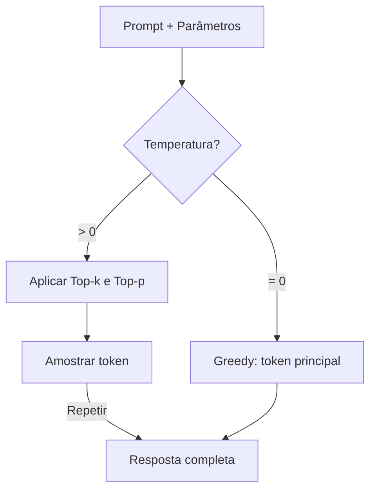
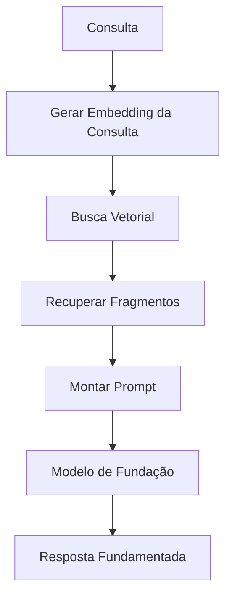
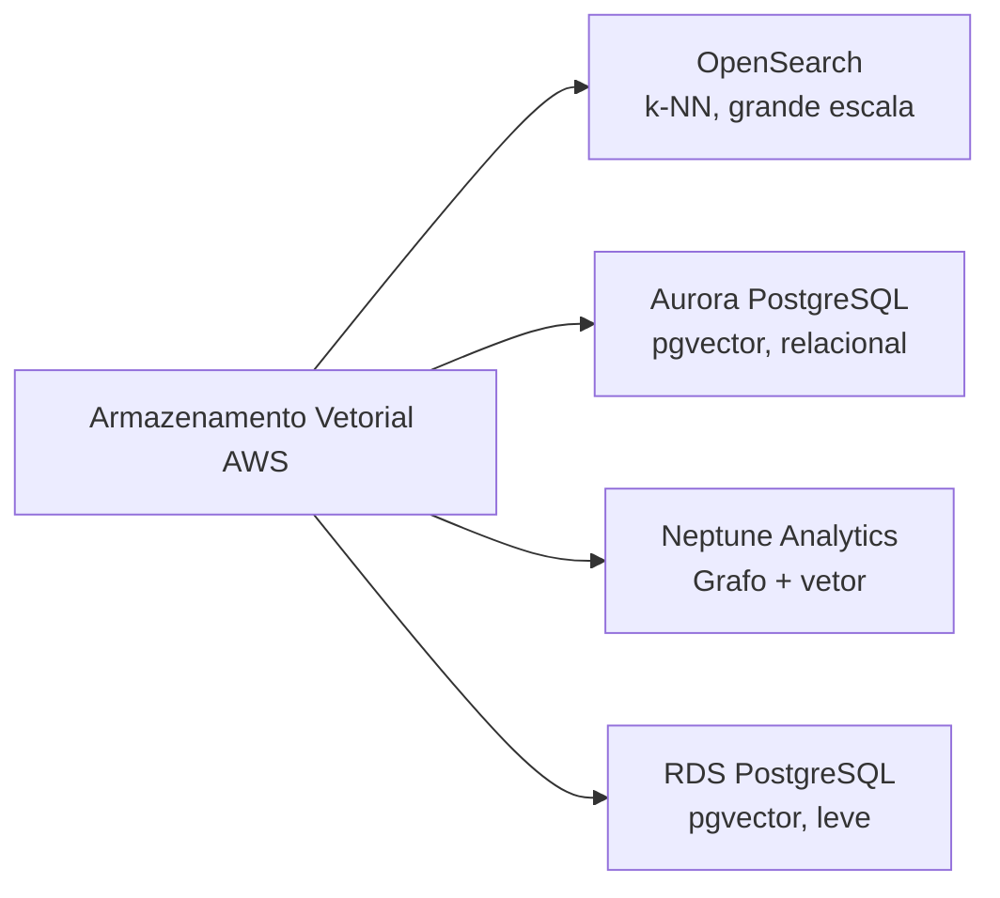
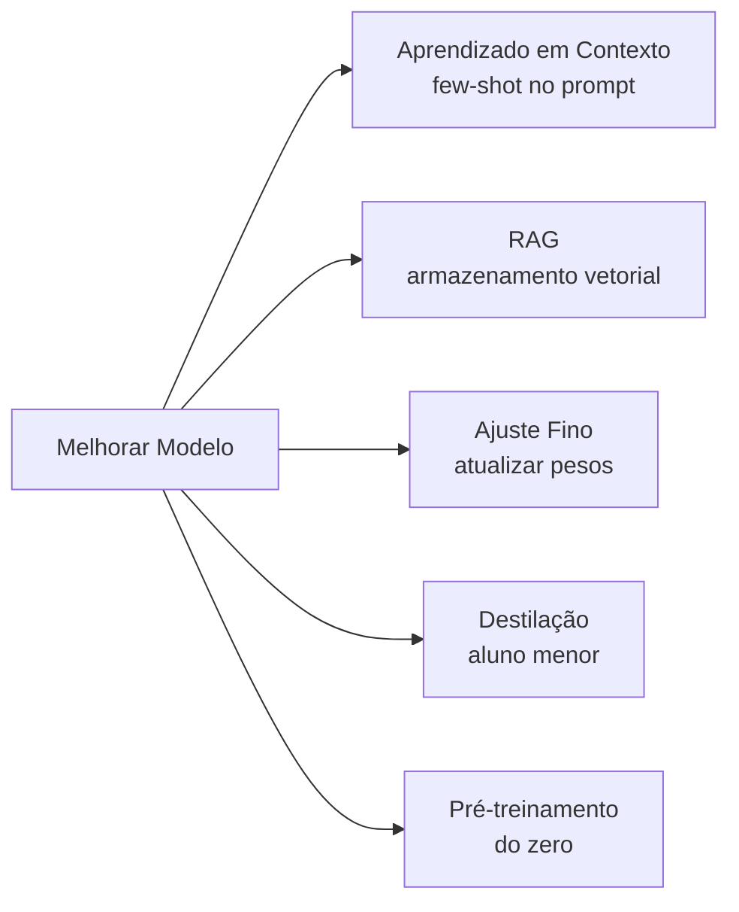
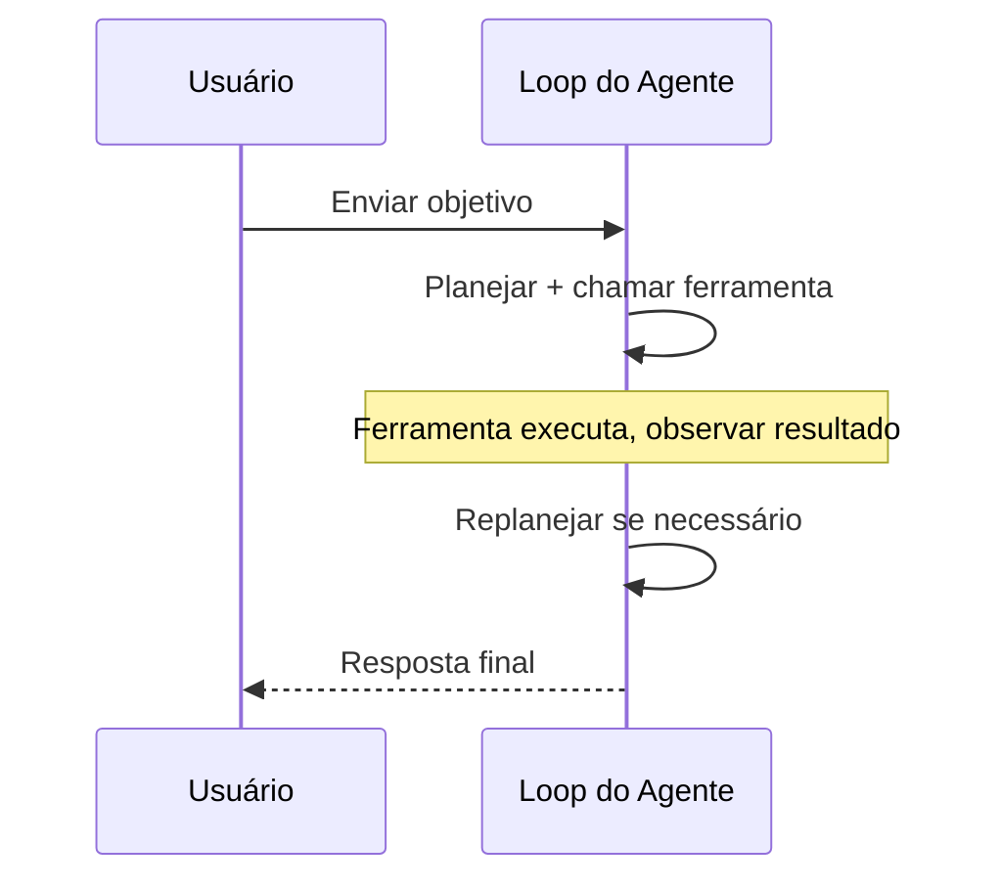

## Declaração de Tarefa 3.1: Descrever considerações de design para aplicações que usam modelos de fundação (FMs)

Construir uma aplicação de produção sobre um modelo de fundação começa muito antes do primeiro prompt. As decisões que você toma no momento do design -- qual modelo usar, como ajustar suas saídas, como aterrá-lo em dados privados, onde armazenar esses dados e como escalar o conhecimento ao longo do tempo -- determinam se o projeto entrega valor ou para na fase piloto. Esta declaração de tarefa abrange essas decisões na ordem em que um arquiteto de negócios as enfrentaria.[^301001]

### 3.1.1 Critérios de seleção para escolher FMs

Escolher um modelo de fundação não é uma decisão técnica única; ela recorre sempre que os requisitos de negócios mudam. Um modelo que teve desempenho aceitável em um piloto pode se tornar caro demais no volume de produção. Um modelo que respondia bem a perguntas de clientes em inglês pode precisar de substituição quando o produto se expandir para mercados de língua espanhola. Compreender os critérios de seleção mantém essas decisões sistemáticas em vez de reativas.

Os critérios que o exame abrange se enquadram em três grupos. Critérios de custo e desempenho governam quanto o modelo custa para executar e com que rapidez responde. Critérios de capacidade governam o que o modelo pode fazer. Critérios de flexibilidade governam o quanto o modelo pode ser alterado para se adequar ao negócio.

**Custo** é medido por token, onde um token equivale a aproximadamente três quartos de uma palavra em inglês (ou cerca de quatro caracteres de texto em inglês).[^301036] Tokens de entrada (o prompt) e tokens de saída (a resposta) têm preços diferentes, e tokens de saída são consistentemente mais caros.[^301002] Um assistente de atendimento ao cliente que lê um histórico de 500 palavras do cliente e produz uma resposta de 100 palavras consumirá aproximadamente 670 tokens de entrada e 130 tokens de saída por interação. Em escala de produção, essa aritmética é enormemente importante. O **cache de prompts** reduz o custo efetivo reutilizando a representação processada pelo modelo de um prefixo estático, como um longo prompt de sistema ou um catálogo de produtos, entre múltiplas chamadas. O Amazon Bedrock suporta cache de prompts para modelos selecionados, incluindo o Anthropic Claude no Bedrock, tornando-o uma alavanca de custo significativa quando um bloco de contexto grande é reutilizado em milhares de requisições diárias.[^301003]

**Modalidade** refere-se aos tipos de entrada que um modelo pode aceitar e aos tipos de saída que pode produzir.[^301037] Um modelo *somente texto* lê texto e produz texto. Um modelo *multimodal* também pode ler imagens, documentos ou áudio. Se uma aplicação de negócios precisa classificar faturas digitalizadas ou responder perguntas sobre fotos de produtos, um modelo multimodal é obrigatório, e o custo por interação será mais alto. Selecionar um modelo somente texto para uma tarefa somente texto evita pagar por capacidade multimodal que não será usada.

**Latência** é o tempo desde o momento em que uma requisição é enviada até o momento em que o primeiro token da resposta aparece.[^301038] Aplicações interativas, como chatbots, requerem baixa latência; uma pausa de cinco segundos quebra a experiência conversacional. Aplicações em lote, como sumarização de documentos noturna, podem tolerar latência mais alta em troca de custo menor. O tamanho do modelo é um dos maiores fatores de latência: modelos menores são mais rápidos, mas têm menor capacidade de raciocínio, enquanto modelos maiores raciocinam melhor, mas demoram mais para responder. O **tamanho do modelo** é medido em bilhões de parâmetros, os pesos numéricos aprendidos dentro da rede. Um modelo de 7 bilhões de parâmetros normalmente responde em menos de um segundo na infraestrutura adequada; um modelo de 70 bilhões de parâmetros pode levar vários segundos para o mesmo prompt.[^301004]

**Complexidade do modelo** está relacionada às escolhas de design arquitetural que vão além da contagem de parâmetros. Alguns modelos são densos, significando que todos os parâmetros se ativam para cada token; outros usam arquiteturas de *mistura de especialistas* (MoE) que ativam apenas um subconjunto de parâmetros por token, alcançando melhor qualidade a um custo de inferência menor.[^301039] Do ponto de vista da seleção, a complexidade importa porque afeta o throughput de inferência e o nível de infraestrutura necessário para servir o modelo.

**Suporte multilíngue** abrange a amplitude de idiomas nos dados de pré-treinamento do modelo.[^301040] Um modelo treinado principalmente em texto em inglês produz saídas de menor qualidade em outros idiomas. Para implantações globais, verificar o suporte a idiomas documentado de um modelo antes da seleção evita regressões de qualidade dolorosas ao expandir mercados.

**Personalização** refere-se a se o modelo pode ser ajustado finamente ou pré-treinado continuamente em dados proprietários.[^301041] Nem todos os modelos disponíveis comercialmente suportam ajuste fino. Se um projeto requer ensinar ao modelo terminologia específica do domínio ou fluxos de trabalho proprietários, verificar a disponibilidade de ajuste fino antes de assinar um contrato é essencial. A seção 3.1.5 abrange os trade-offs de custo entre abordagens de personalização.

**Tamanho da janela de contexto** define o número máximo de tokens que o modelo pode ler em uma única chamada, contando tanto a entrada quanto a saída.[^301042] Um modelo com uma janela de contexto de 200.000 tokens pode processar um contrato legal inteiro em uma requisição; um modelo com uma janela de 4.096 tokens não pode. Vários modelos principais no Amazon Bedrock agora oferecem janelas de um milhão de tokens (Anthropic Claude Opus e Sonnet através do cabeçalho beta de contexto 1M, Amazon Nova Premier e Meta Llama 4 Maverick), que podem conter uma base de código inteira ou um ano de correspondência em um único prompt. Janelas de contexto maiores custam mais por chamada, mas podem eliminar a necessidade de estratégias complexas de fragmentação em pipelines de RAG (veja a seção 3.1.3).

A *Tabela 3.1.1* abaixo compara as principais famílias de modelos disponíveis no Amazon Bedrock no momento da escrita. Os preços exatos mudam; o posicionamento relativo entre os tiers de modelos dentro de uma família é estável.[^301005]

*Tabela 3.1.1: Comparação de modelos de fundação por tier e capacidade*

| Família de modelo | Tier | Custo relativo | Modalidade | Janela de contexto | Caso de uso típico |
|---|---|---|---|---|---|
| Anthropic Claude Opus | Principal | Alto | Multimodal | 200K padrão, 1M com cabeçalho beta | Raciocínio complexo, jurídico/médico |
| Anthropic Claude Sonnet | Equilibrado | Médio | Multimodal | 200K padrão, 1M com cabeçalho beta | Tarefas empresariais gerais |
| Anthropic Claude Haiku | Rápido | Baixo | Multimodal | 200K tokens | Interações de alto volume com clientes |
| Amazon Nova Premier | Principal | Alto | Multimodal | 1M tokens | Cross-modal complexo, documentos muito longos |
| Amazon Nova Pro | Equilibrado | Médio | Multimodal | 300K tokens | Fluxos de trabalho empresariais |
| Amazon Nova Lite | Rápido | Baixo | Multimodal | 300K tokens | Produção com custos reduzidos |
| Amazon Nova Micro | Mais rápido | Mais baixo | Somente texto | 128K tokens | Latência ou custo ultrabaixo |
| Meta Llama 4 Maverick | Aberto | Variável | Multimodal | 1M tokens | Implantações personalizáveis de longo contexto |
| Mistral Large 2 | Equilibrado | Médio | Somente texto | 128K tokens | Tarefas em idiomas europeus |

O exame não espera preços memorizados. Ele espera que você corresponda um cenário de negócios (alto volume, multilíngue, análise de imagens, orçamento limitado) ao tier correto de modelo usando esses critérios.

### 3.1.2 Efeito dos parâmetros de inferência nas respostas do modelo

Mesmo um modelo corretamente selecionado pode produzir saídas inadequadas se seus parâmetros de inferência estiverem mal configurados. Parâmetros de inferência são configurações passadas em tempo de execução, junto com o prompt, que dizem ao modelo como amostrar da distribuição de probabilidade dos possíveis próximos tokens. Ajustá-los muda o comportamento do modelo sem retreinamento.

**Temperatura** controla o grau de aleatoriedade no processo de amostragem.[^301043] A uma temperatura de 0, o modelo sempre seleciona o token com a maior probabilidade, produzindo saída determinística e consistente. A uma temperatura de 1, o modelo amostra de acordo com a distribuição de probabilidade bruta, produzindo saída mais variada e criativa. Valores acima de 1 amplificam tokens de probabilidade mais baixa, aumentando a criatividade à custa da coerência.[^301006] A implicação para os negócios é direta: uma ferramenta de sumarização de documentos legais deve ser executada a temperatura 0 ou muito próximo disso, porque consistência e precisão importam mais do que variedade. Um gerador de textos de marketing pode usar temperatura 0,8 ou superior para produzir opções criativas diversas a partir do mesmo briefing.

**Top-p** (também chamado de *amostragem por núcleo*) é um controle de aleatoriedade complementar.[^301044] Em vez de ajustar as probabilidades dos tokens por um multiplicador, o top-p define um limiar de probabilidade acumulativa. O modelo amostra apenas do menor conjunto de tokens cuja probabilidade combinada atinge o limiar. A top-p = 0,9, o modelo considera apenas os tokens que juntos representam 90% da massa de probabilidade, descartando valores atípicos de baixa probabilidade. Valores mais baixos de top-p tornam a saída mais focada; valores mais altos permitem mais variedade.[^301007]

**Top-k** restringe a amostragem aos k tokens com as maiores probabilidades individuais, independentemente de sua probabilidade combinada.[^301045] A top-k = 50, o modelo amostra apenas dos 50 próximos tokens mais prováveis. Top-k e top-p são frequentemente usados juntos; o modelo primeiro filtra por top-k e depois aplica o limiar de top-p aos candidatos restantes.

Temperatura e top-p interagem na prática. Definir temperatura = 0 torna o top-p irrelevante porque não há amostragem estocástica para governar. Definir top-p = 1,0 desativa a amostragem por núcleo, deixando a temperatura como o único controle ativo. Uma configuração de produção comum para um assistente de alta precisão é temperatura = 0,1 e top-p = 0,9, produzindo saída que é em sua maioria determinística, ao mesmo tempo que permite fraseado alternativo ocasional quando o modelo está genuinamente incerto.

**Sequências de parada** são strings de caracteres que dizem ao modelo para parar de gerar assim que as produz.[^301046] Por exemplo, um template de prompt que usa um marcador de fim explícito pode incluir `"\n###END###"` como sequência de parada para que o modelo pare imediatamente após produzir o marcador. Sequências de parada são úteis para impor formato de saída em aplicações onde um sistema downstream deve analisar a resposta, e devem ser escolhidas para serem inequívocas na saída esperada (um `}` literal é uma escolha ruim para JSON aninhado porque a chave interna encerraria a geração antes de o objeto externo fechar).

Parâmetros de **comprimento de entrada e saída** limitam o número de tokens que o modelo lê (entrada) ou gera (saída). Limitar o comprimento de saída controla o custo em endpoints de alto volume. Limitar o comprimento de entrada no nível de API impede que clientes enviem prompts que excedam a janela de contexto do modelo e acionem um erro. Ambos os limites devem ser definidos com base no tamanho máximo realista de uma requisição válida, não no máximo que o modelo suporta.

```
Exemplo de configuração de parâmetros de inferência:
  temperature:     0.1
  top_p:           0.9
  top_k:           50
  max_new_tokens:  512
  stop_sequences:  ["###END###"]
```

A configuração acima é adequada para um assistente de extração de documentos que deve produzir saídas curtas e estruturadas de forma confiável. Um assistente de escrita criativa aumentaria a temperatura, aumentaria o top-p e removeria a sequência de parada.


*Figura 3.1.1: Pipeline de amostragem de tokens. O modelo seleciona cada token de saída filtrando candidatos por top-k e top-p antes de aplicar amostragem estocástica escalada por temperatura.*

### 3.1.3 Definir RAG e suas aplicações de negócios

Os modelos de fundação são treinados em grandes conjuntos de dados públicos, mas não têm acesso a informações posteriores ao corte de treinamento e nenhum acesso a dados organizacionais proprietários. Um modelo treinado até o final de 2024 não pode responder perguntas sobre um lançamento de produto no início de 2025. Um modelo de propósito geral nunca viu sua política interna de RH, seus modelos de contratos com clientes ou seus runbooks de engenharia. A **Geração Aumentada por Recuperação (RAG)** é o padrão arquitetural que aborda essa limitação conectando o modelo a um armazenamento de conhecimento externo no momento da consulta, em vez de incorporar conhecimento nos pesos do modelo por meio de treinamento.[^301008]

A mecânica do RAG procede em cinco etapas. Primeiro, a pergunta do usuário é convertida em um vetor numérico chamado *embedding* que captura seu significado semântico.[^301047] Segundo, esse vetor é comparado com um banco de dados de embeddings pré-computados derivados dos documentos privados da organização. Terceiro, os documentos cujos embeddings são mais similares ao embedding da consulta são recuperados. Quarto, esses documentos são montados em um bloco de contexto e adicionados antes da pergunta original do usuário para formar o prompt completo. Quinto, o modelo de fundação lê o prompt enriquecido e gera uma resposta fundamentada no conteúdo recuperado, e não apenas em sua memória paramétrica.[^301009]


*Figura 3.1.2: Pipeline de requisição RAG. A consulta do usuário é convertida em embedding, comparada com vetores de documentos armazenados, e os fragmentos recuperados são mesclados com a consulta original antes de o modelo de fundação gerar sua resposta.*

As **Amazon Bedrock Knowledge Bases** são a implementação totalmente gerenciada da AWS desse padrão.[^301010] Ela lida com o pipeline de ingestão, a geração de embeddings, a integração com o armazenamento de vetores e a API de recuperação, permitindo que uma organização adote RAG sem construir ou operar nenhuma das infraestruturas subjacentes. O administrador configura uma Knowledge Base especificando uma fonte de dados, uma estratégia de fragmentação, um modelo de embedding e um backend de armazenamento de vetores; o Bedrock então sincroniza os documentos automaticamente.

As fontes de dados suportadas pelas Amazon Bedrock Knowledge Bases incluem buckets do Amazon S3 (a escolha mais comum para arquivos de documentos), espaços do Atlassian Confluence, sites do Microsoft SharePoint, objetos do Salesforce e URLs da web via um rastreador da web integrado.[^301011] Cada fonte de dados é sincronizada em um agendamento ou sob demanda; as atualizações nos documentos de origem são refletidas no armazenamento de vetores sem reindexação manual.[^301048]

A *fragmentação* é o processo de dividir documentos de origem em segmentos pequenos o suficiente para caber dentro de uma janela de contexto junto com a consulta original.[^301049] As Bedrock Knowledge Bases suportam fragmentação de tamanho fixo (dividir a cada N tokens), fragmentação semântica (dividir nos limites naturais de tópicos identificados por um modelo secundário) e fragmentação hierárquica (produzir tanto um fragmento de resumo pai quanto fragmentos de detalhe filho menores, para que a recuperação possa operar em dois níveis de granularidade).[^301012]

As aplicações de negócios do RAG abrangem várias categorias:

- **Perguntas e respostas internas**: Funcionários fazem perguntas ao sistema sobre políticas de RH, procedimentos de TI ou especificações de produtos. O sistema recupera os parágrafos de política relevantes e gera uma resposta precisa com o documento de origem citado.
- **Suporte ao cliente**: Um agente de suporte ou chatbot de autoatendimento recupera as etapas relevantes de solução de problemas de uma base de conhecimento e as apresenta em linguagem conversacional, reduzindo o tempo médio de atendimento.
- **Análise de contratos e jurídico**: As equipes jurídicas ingerem bibliotecas de contratos. O modelo responde perguntas como "Quais contratos contêm uma cláusula de rescisão por conveniência?" ou "Qual é o limite de responsabilidade no Contrato de Serviços Principal com o Fornecedor X?"
- **Assistência à pesquisa**: Cientistas, analistas ou gerentes de produto consultam um corpus de relatórios de pesquisa internos. O modelo sintetiza descobertas em vários documentos em vez de retornar uma lista de links.

O RAG é preferido ao ajuste fino quando a base de conhecimento muda com frequência, porque atualizar um armazenamento de vetores leva minutos enquanto retreinar um modelo leva horas ou dias.[^301050] Também é preferido quando os documentos de origem devem ser auditáveis; porque os fragmentos recuperados são visíveis no prompt, um desenvolvedor pode inspecionar exatamente quais documentos influenciaram a resposta.[^301051]

### 3.1.4 Serviços AWS para armazenar embeddings em bancos de dados vetoriais

O RAG requer um local para armazenar os embeddings pré-computados e pesquisá-los rapidamente usando algoritmos de *vizinho mais próximo aproximado* (ANN) ou *k-vizinhos mais próximos* (k-NN).[^301052] A AWS fornece quatro serviços gerenciados que suportam armazenamento de vetores, cada um adequado a diferentes requisitos de escala, arquitetura e consulta.[^301053]


*Figura 3.1.3: Serviços de armazenamento vetorial da AWS. Cada serviço suporta armazenamento de embeddings, mas difere em escala, modelo de consulta e capacidades complementares.*

O **Amazon OpenSearch Service** suporta busca vetorial por vizinho mais próximo aproximado desde que o plugin k-NN foi introduzido, e seu *mecanismo de vetores* é otimizado para cargas de trabalho de busca semântica de grande escala e alto throughput.[^301013] Ele suporta o algoritmo de índice Hierarchical Navigable Small World (HNSW), que oferece recuperação em submilissegundos em bilhões de vetores.[^301054] O OpenSearch é a opção mais capaz quando o conjunto de dados de recuperação é grande (milhões de documentos ou mais), quando a busca deve combinar similaridade vetorial com filtros de palavras-chave tradicionais (busca híbrida), ou quando a aplicação já usa o OpenSearch para análise de logs e pode compartilhar o cluster. As Amazon Bedrock Knowledge Bases usam o OpenSearch Service como backend vetorial padrão quando nenhuma alternativa é especificada.[^301055]

O **Amazon Aurora** com a extensão pgvector adiciona armazenamento de vetores ao banco de dados relacional compatível com PostgreSQL.[^301014] Essa opção é adequada quando a aplicação já armazena dados estruturados no Aurora e deseja adicionar busca semântica sem operar um armazenamento de vetores separado. Um catálogo de produtos armazenado como linhas no Aurora pode ganhar colunas de embedding; as consultas podem então combinar predicados relacionais ("produtos na categoria de Eletrônicos") com similaridade vetorial ("similar a esta descrição de produto") em uma única instrução SQL.[^301056] O trade-off é escala: o pgvector no Aurora tem bom desempenho para conjuntos de dados na faixa de centenas de milhares a poucos milhões de vetores, mas não corresponde ao OpenSearch Service em escalas muito grandes.

O **Amazon Neptune Analytics** estende o banco de dados de grafos Neptune com capacidade de busca vetorial, permitindo consultas que combinam travessia de grafo com similaridade semântica.[^301015] Um grafo de conhecimento que modela relacionamentos entre pessoas, organizações e documentos pode usar o Neptune Analytics para responder perguntas como "Encontre documentos mais semanticamente similares a esta consulta que foram criados por alguém no departamento jurídico e citam pelo menos uma regulamentação."[^301057] Essa combinação de raciocínio em grafo e recuperação vetorial é difícil de replicar com um armazenamento puramente relacional ou puramente baseado em busca. O Neptune Analytics é a escolha certa quando o problema de recuperação tem uma estrutura de grafo inerente, como análise de cadeia de suprimentos, investigação de fraudes ou pesquisa biomédica.

O **Amazon RDS for PostgreSQL** fornece a mesma capacidade de pgvector que o Aurora, mas é executado na infraestrutura RDS padrão em vez do cluster serverless ou provisionado do Aurora.[^301016] É adequado para cargas de trabalho menores onde a instância RDS existente já está executando PostgreSQL e adicionar a extensão pgvector é o caminho de menor resistência.[^301058] Ambientes de desenvolvimento e ferramentas internas leves frequentemente usam essa opção para manter a infraestrutura simples enquanto ainda suportam busca vetorial.

Para uma regra prática rápida sobre como escolher entre esses armazenamentos: o pgvector (no RDS ou Aurora) lida confortavelmente com até alguns milhões de vetores; o Amazon OpenSearch Service é o padrão quando uma carga de trabalho ultrapassa dezenas de milhões e além, onde seu índice HNSW mantém a latência de recuperação baixa em escala muito grande. O Neptune Analytics é a resposta certa quando os dados são fundamentalmente estruturados em grafo.

*Tabela 3.1.2: Comparação de serviços de armazenamento vetorial da AWS*

| Serviço | Algoritmo de índice | Escala | Capacidade complementar | Melhor para |
|---|---|---|---|---|
| OpenSearch Service | HNSW, IVF | Muito grande (bilhões) | Busca híbrida palavra-chave + vetor, análise | RAG de alto volume, busca empresarial |
| Aurora PostgreSQL (pgvector) | IVFFlat, HNSW | Médio (milhões) | Joins SQL relacionais | Aplicações já no Aurora |
| Neptune Analytics | Grafo + vetor | Médio | Travessia de grafo, consultas de relacionamento | Bases de conhecimento estruturadas em grafo |
| RDS for PostgreSQL (pgvector) | IVFFlat, HNSW | Pequeno a médio | SQL relacional, configuração simples | Ambientes de desenvolvimento, ferramentas internas |

As Amazon Bedrock Knowledge Bases podem ser configuradas para usar qualquer um desses quatro backends.[^301017] O padrão, quando nenhum backend é especificado, é o OpenSearch Service.[^301059] As organizações que já operam Aurora ou RDS for PostgreSQL podem apontar uma Knowledge Base para seu cluster existente, evitando o custo de um serviço de busca separado. O Neptune Analytics é selecionado explicitamente quando a base de conhecimento tem estrutura de grafo.

Observação: O Amazon MemoryDB era listado como opção de armazenamento vetorial em versões anteriores do guia do exame AIF-C01. Ele foi removido na versão 1.1 do guia. Não espere questões de exame sobre o MemoryDB no contexto de busca vetorial.

### 3.1.5 Trade-offs de custo de personalização de FM

Quando o comportamento padrão de um modelo de fundação não é suficiente para uma tarefa de negócios específica, existem cinco estratégias amplas para melhorá-lo. Elas diferem substancialmente em custo, tempo, requisitos de dados e durabilidade da melhoria.

**Pré-treinamento** é o processo de treinar um modelo do zero em um grande corpus de texto (ou outros dados).[^301060] O pré-treinamento determina o conhecimento fundamental e a compreensão de linguagem do modelo. Requer enormes recursos computacionais (centenas a milhares de GPUs executando por semanas), petabytes de dados de treinamento curados e uma equipe de pesquisadores de aprendizado de máquina para supervisionar o processo. Muito poucas organizações fora dos principais laboratórios de IA realizam pré-treinamento. É relevante no exame como a linha de base da qual todas as outras técnicas partem, não como uma opção prática para a maioria das empresas.[^301018]

**Ajuste fino** começa a partir de um modelo pré-treinado existente e continua o treinamento em um conjunto de dados menor e específico para a tarefa.[^301061] Os pesos do modelo são atualizados para deslocar seu comportamento em direção ao domínio alvo. O ajuste fino requer exemplos rotulados na faixa de centenas a dezenas de milhares, horas de GPU na faixa de horas a dias em vez de semanas, e um processo de preparação de dados que produz pares de pergunta-resposta ou pares de instrução-resposta. O Amazon Bedrock suporta ajuste fino para modelos selecionados.[^301019] O resultado é um modelo que produz saídas melhor alinhadas com a tarefa específica, armazenado como uma versão de modelo separada que incorre em custos de hospedagem mesmo quando ocioso.[^301062]

**Aprendizado em contexto** não requer atualizações de pesos.[^301063] Em vez disso, exemplos do comportamento desejado são colocados diretamente dentro do prompt. Um prompt zero-shot não fornece exemplos; um prompt few-shot fornece dois a cinco exemplos. O modelo usa correspondência de padrões dentro de sua janela de contexto para generalizar a partir desses exemplos para a entrada atual. O aprendizado em contexto é a estratégia de personalização mais barata e rápida e não requer infraestrutura além do que uma chamada de inferência normal usa. A limitação é que a melhoria dura apenas pela duração do prompt; o modelo não retém os exemplos entre chamadas, e os exemplos consomem tokens que, de outra forma, poderiam carregar conteúdo.[^301020]

O **RAG** (abordado em detalhes na seção 3.1.3) normalmente não é descrito como uma técnica de personalização, mas tem efeitos de negócios semelhantes: fundamenta o modelo em conhecimento específico do domínio e reduz alucinações sobre tópicos proprietários. Seu perfil de custo é distinto dos outros. O custo de configuração envolve construir e sincronizar o armazenamento de vetores e integrar a camada de recuperação. O custo por consulta é ligeiramente mais alto do que uma chamada de inferência simples porque a etapa de recuperação e o prompt aumentado maior consomem computação e tokens. O custo de atualização de conhecimento, no entanto, é muito baixo: adicionar novos documentos ao armazenamento de vetores leva minutos em vez das horas que um trabalho de ajuste fino requer.[^301021]

A **destilação de modelos** é a técnica mais recente no guia do exame v1.1. Na destilação, um *modelo professor* grande e de alta qualidade gera saídas para um conjunto de prompts, e esses pares de entrada-saída se tornam o conjunto de dados de treinamento para um *modelo aluno* menor.[^301064] O aluno aprende a aproximar o comportamento do professor em um domínio de tarefa específico sem ter acesso aos pesos do professor.[^301022] O benefício de negócios é que a inferência em escala de produção é servida pelo modelo aluno menor, mais rápido e mais barato, enquanto a qualidade das respostas se aproxima à do professor caro. O Amazon Bedrock suporta destilação de modelos como um fluxo de trabalho de primeira classe, permitindo que as organizações usem um modelo Bedrock como professor e produzam uma versão ajustada finamente de um modelo menor como aluno.[^301023] A destilação desloca o custo da inferência (que é contínua) para um trabalho de treinamento único (que pode ser amortizado em milhares de chamadas de inferência subsequentes).[^301065]


*Figura 3.1.4: Guia de seleção de personalização de FM. A técnica adequada depende dos dados rotulados disponíveis, frequência de atualização, orçamento e volume de inferência.*

*Tabela 3.1.3: Comparação de custo e esforço das abordagens de personalização de FM*

| Abordagem | Custo computacional | Dados necessários | Velocidade de atualização | Custo por consulta | Cenários do exame |
|---|---|---|---|---|---|
| Pré-treinamento | Muito alto | Petabytes | Semanas | Normal | Apenas linha de base acadêmica |
| Ajuste fino | Médio | Centenas a milhares de pares rotulados | Horas a dias | Normal + hospedagem | Especialização de domínio estável |
| Aprendizado em contexto | Nenhum | Alguns exemplos | Imediato | Mais alto (prompt maior) | Prototipagem rápida, baixo volume |
| RAG | Configuração baixa | Documentos existentes | Minutos | Ligeiramente mais alto | Conhecimento frequentemente atualizado |
| Destilação de modelos | Médio (único) | Pares gerados pelo professor | Horas a dias | Mais baixo (modelo menor) | Otimização de custo de alto volume |

O exame apresenta frequentemente cenários onde uma empresa deve escolher entre essas abordagens. A lógica de decisão é: se o conhecimento muda frequentemente, escolha RAG. Se a tarefa requer tom consistente ou terminologia especializada em um domínio estável e os dados estão disponíveis, escolha ajuste fino. Se o volume é muito alto e o custo por consulta é a preocupação principal, avalie a destilação. Se nem orçamento nem tempo estão disponíveis, use aprendizado em contexto com exemplos few-shot. O pré-treinamento nunca é a resposta certa para um cenário de prontidão para produção, a menos que a questão estabeleça explicitamente que existe um domínio novo para o qual nenhum modelo pré-treinado está disponível.

### 3.1.6 Papel dos agentes de IA e aplicações de negócios

Um modelo de fundação que recebe um prompt e retorna uma resposta opera no modo de *disparo único*. Muitas tarefas de negócios reais não podem ser concluídas em uma única etapa. Reservar um voo requer verificar disponibilidade, comparar opções, selecionar assentos e confirmar o pagamento. Investigar um alerta de segurança requer consultar dados de log, pesquisar inteligência de ameaças, correlacionar eventos e redigir um relatório. Essas tarefas de múltiplas etapas requerem uma arquitetura diferente.

**Um agente de IA** é um sistema que combina um modelo de fundação com a capacidade de perceber seu ambiente, planejar uma sequência de ações, executar essas ações usando ferramentas externas, observar os resultados e revisar seu plano com base no que aprendeu.[^301024] O modelo em um agente não está apenas gerando texto; ele está raciocinando sobre o que fazer a seguir, decidindo qual ferramenta chamar, avaliando se o resultado é suficiente e continuando até que a tarefa seja concluída ou uma condição de parada seja atingida.[^301066]

O loop do agente tem quatro fases. Na fase de *percepção*, o agente recebe o objetivo do usuário e qualquer contexto disponível sobre o estado atual do mundo.[^301067] Na fase de *planejamento*, o modelo raciocina sobre qual ação tomar a seguir, selecionando de um conjunto definido de ferramentas (APIs, consultas de banco de dados, executores de código, busca na web). Na fase de *ação*, o agente chama a ferramenta selecionada e passa os argumentos que o modelo determinou. Na fase de *observação*, o agente lê a resposta da ferramenta e atualiza sua compreensão do progresso em direção ao objetivo. O loop se repete até que o agente determine que a tarefa está concluída.[^301025]


*Figura 3.1.5: Loop perceber-planejar-agir-observar do agente de IA. O modelo de fundação raciocina sobre qual ferramenta chamar em cada etapa, e o loop continua até que o objetivo da tarefa seja atingido.*

A diferença entre um agente e uma chamada simples de LLM importa em termos de negócios. Uma chamada simples de LLM é rápida, barata e sem estado. Uma chamada de agente é mais lenta, mais cara e com estado entre várias invocações de ferramentas.[^301068] Agentes são adequados quando a tarefa não pode ser codificada em um único prompt, quando requer informações de sistemas externos ou quando envolve várias decisões sequenciais onde cada uma depende do resultado anterior.

A AWS fornece dois pontos de entrada principais para construir agentes. O **Amazon Bedrock Agents** é o serviço gerenciado estabelecido para criar, configurar e implantar agentes suportados por qualquer modelo de fundação compatível com o Bedrock.[^301026] Ele lida com orquestração, roteamento de ferramentas (chamados de *grupos de ação* na terminologia do Bedrock), gerenciamento de estado de sessão e integração com Knowledge Bases para RAG. O **Amazon Bedrock AgentCore** é a camada de tempo de execução e gerenciamento mais recente para agentes de nível de produção, adicionando observabilidade, memória, controles de segurança e a infraestrutura para executar agentes em escala.[^301027] O **Strands Agents** é um SDK de código aberto da AWS que permite que desenvolvedores Python construam agentes usando uma API simples baseada em decoradores, com agentes implantáveis no AgentCore para execução gerenciada.[^301028]

As aplicações de negócios para agentes de IA incluem:

- **Automação de atendimento ao cliente**: Um agente lida com a resolução completa de uma solicitação de serviço, consultando o CRM, verificando o status do pedido, iniciando uma devolução e enviando uma confirmação, sem que um agente humano esteja envolvido, a menos que a situação exceda o escopo definido.
- **Operações de TI**: Um agente investiga um alerta de desempenho consultando métricas do CloudWatch, identificando os recursos afetados, cruzando referências com o log de alterações e propondo uma ação de remediação para um operador aprovar.
- **Processamento de documentos**: Um agente lê contratos recebidos, extrai termos-chave, verifica-os em relação a um modelo padrão, sinaliza desvios e cria um rascunho de resumo para um revisor jurídico, tudo sem triagem manual.
- **Análise de dados**: Um agente aceita uma pergunta de negócios em linguagem natural, escreve uma consulta SQL, executa-a em um banco de dados, interpreta o resultado e produz um resumo em linguagem natural com uma recomendação.

Arquiteturas *multiagentes*, onde um agente orquestrador delega subtarefas a subagentes especializados, estendem o padrão a problemas que são grandes ou diversos demais para um único agente lidar de forma confiável.[^301069] O Amazon Bedrock Agents suporta colaboração multiagente nativamente.[^301029] Os princípios de design para sistemas multiagentes, incluindo como particionar tarefas, como rotear entre agentes e como manter estado de sessão coerente, foram abordados anteriormente no Domínio 2 (capítulo sobre os conceitos básicos de IA generativa) junto com o material de arquitetura de IA agêntica mais amplo.

*Tabela 3.1.4: Comparação entre agente de IA e chamada simples de LLM*

| Característica | Chamada simples de LLM | Agente de IA |
|---|---|---|
| Escopo da tarefa | Passo único, prompt único | Múltiplos passos, iterativo |
| Acesso a ferramentas externas | Nenhum (apenas pesos do modelo) | APIs, bancos de dados, executores de código |
| Estado entre etapas | Nenhum | Mantido dentro da sessão |
| Latência por tarefa | Milissegundos a segundos | Segundos a minutos |
| Custo por tarefa | Baixo (uma chamada de inferência) | Mais alto (múltiplas inferências + chamadas de ferramentas) |
| Adequado para | Classificação, sumarização, geração | Pesquisa, reservas, operações de TI, fluxos de documentos |

O exame trata agentes como um padrão arquitetural distinto, não como um aprimoramento do prompt. Quando uma questão descreve uma tarefa de múltiplas etapas que requer consultar sistemas externos ou tomar decisões sequenciais, a resposta envolve um agente, não um prompt mais sofisticado.

## Perguntas de verificação de conhecimento

**Questão 1.** Uma empresa varejista quer implantar um chatbot voltado ao cliente que responde perguntas sobre seu catálogo de produtos em seis idiomas. O catálogo contém 50.000 SKUs; as atualizações diárias afetam menos de um por cento dos SKUs, enquanto o prompt de sistema e o bloco de taxonomia de produtos são estáticos entre as chamadas. Qual combinação de critérios de seleção deve governar MAIS diretamente a escolha do modelo de fundação?

A. Tamanho do modelo, disponibilidade de ajuste fino e suporte a sequência de parada
B. Suporte multilíngue, tamanho da janela de contexto e elegibilidade para cache de prompts
C. Modalidade de saída, atualidade dos dados de pré-treinamento e valor padrão de top-p
D. Custo de treinamento, consumo de memória de GPU e sensibilidade à temperatura

**Explicação:** O cenário tem três direcionadores: suporte a seis idiomas (suporte multilíngue), um contexto de catálogo grande, mas principalmente estável, que deve caber dentro de um prompt ou ser recuperado eficientemente (tamanho da janela de contexto) e controle de custo em escala (o cache de prompts se aplica ao prompt de sistema estático e ao bloco de taxonomia, não às linhas de SKU que mudam diariamente, que mantêm o RAG como a ferramenta certa para a parte volátil). A resposta A está errada porque o ajuste fino não abordaria o problema de atualização diária e as sequências de parada não são um critério de seleção. A resposta C está errada porque a modalidade de saída é somente texto (um chatbot), a atualidade do pré-treinamento é irrelevante já que o catálogo é injetado em tempo de execução e o top-p é um parâmetro de inferência, não um critério de seleção de modelo. A resposta D está errada porque o custo de treinamento não é uma consideração de tempo de execução para um consumidor de FM gerenciado, e o consumo de memória de GPU é um detalhe de infraestrutura abstraído pelo Amazon Bedrock. A resposta B aborda diretamente todas as três restrições de negócios.[^301030]

---

**Questão 2.** Uma equipe jurídica usa um modelo de fundação para sumarizar cláusulas de contratos. Eles observam que os resumos são inconsistentes: a mesma cláusula produz resumos ligeiramente diferentes a cada execução. A equipe requer reprodutibilidade palavra por palavra ao reexecutar um resumo. Qual mudança no parâmetro de inferência é MAIS provável de resolver isso?

A. Aumentar o top-k de 50 para 200
B. Aumentar a temperatura de 0,7 para 1,0
C. Definir a temperatura para 0
D. Definir o top-p para 1,0

**Explicação:** A temperatura controla o quão determinístico é o processo de amostragem. A temperatura = 0, o modelo sempre seleciona o próximo token de maior probabilidade, tornando a saída determinística para um prompt fixo. Esta é a resposta correta (C). Aumentar o top-k (resposta A) expande o pool de tokens candidatos, o que aumentaria a variabilidade, não a eliminaria. Aumentar a temperatura de 0,7 para 1,0 (resposta B) aumenta a aleatoriedade, piorando o problema. Definir o top-p para 1,0 (resposta D) desativa a amostragem por núcleo, mas não torna a amostragem determinística por si só; se a temperatura ainda for maior que 0, o modelo ainda irá amostrar estocasticamente de toda a distribuição de probabilidade. Apenas definir a temperatura para exatamente 0 colapsa o processo de amostragem para o modo greedy determinístico que a equipe jurídica precisa.[^301031]

---

**Questão 3.** Uma empresa de serviços financeiros quer fornecer a seus analistas uma ferramenta que possa responder perguntas sobre relatórios de pesquisa internos. Os relatórios são atualizados semanalmente. A empresa não quer retreinar ou ajustar finamente um modelo. Qual arquitetura MELHOR atende a esses requisitos?

A. Pré-treinar um modelo específico do domínio nos relatórios de pesquisa
B. Ajustar finamente um modelo de fundação toda semana quando novos relatórios são publicados
C. Usar RAG com um armazenamento de vetores sincronizado do repositório de relatórios
D. Usar aprendizado em contexto colando os relatórios relevantes no prompt

**Explicação:** O RAG (resposta C) foi criado para este cenário. Ele permite que o analista faça perguntas em linguagem natural e recupera as seções relevantes do armazenamento de vetores, que pode ser atualizado em minutos quando novos relatórios chegam. Não requer retreinamento do modelo. O pré-treinamento (resposta A) é descartado pelo custo, pelo requisito de não retreinamento e pela cadência de atualização semanal. O ajuste fino (resposta B) é descartado pelo requisito de não retreinamento e pelo fato de que ciclos de ajuste fino semanal são impraticáveis para um problema de atualização de conhecimento. O aprendizado em contexto (resposta D) é inviável em escala; colar relatórios de pesquisa inteiros em um prompt excederia a janela de contexto para uma biblioteca de centenas de documentos, e a abordagem não funciona para busca retrospectiva em um arquivo. As Amazon Bedrock Knowledge Bases com uma fonte de dados S3 sincronizada é a implementação concreta da AWS da abordagem correta.[^301032]

---

**Questão 4.** Uma empresa executa uma aplicação de suporte ao cliente de alto volume baseada em um modelo de fundação grande. Os custos de inferência estão crescendo mais rápido do que a receita. Um engenheiro de aprendizado de máquina propõe usar destilação de modelos. Qual é o PRINCIPAL benefício de negócios dessa abordagem?

A. O modelo aluno aprende novos fatos que o modelo professor não sabia
B. O modelo aluno produz saídas idênticas ao modelo professor em todas as entradas
C. A inferência em escala é servida por um modelo menor, mais rápido e mais barato que aproxima a qualidade do professor
D. Os pesos do modelo professor são comprimidos e servidos diretamente, reduzindo o custo de memória

**Explicação:** A destilação de modelos (resposta C) treina um modelo aluno menor para aproximar o comportamento de um modelo professor maior na tarefa alvo. Uma vez concluída a destilação, a inferência de produção usa o modelo aluno, que é mais rápido e mais barato por chamada. Isso aborda diretamente o problema de crescimento de custo em uma aplicação de alto volume. A resposta A está errada porque a destilação ensina o aluno a imitar as saídas do professor, não a aprender fatos que o professor não conhece. A resposta B está errada porque o aluno aproxima, mas não reproduz exatamente o professor; em casos extremos e entradas novas, as saídas serão diferentes. A resposta D descreve quantização ou podação de modelos, não destilação; a destilação envolve treinar um modelo separado, não comprimir os pesos do professor. O exame introduziu a destilação na v1.1 especificamente como uma técnica de otimização de custo para cenários de inferência de alto volume.[^301033]

---

**Questão 5.** Uma empresa de manufatura quer automatizar o processo de resposta a consultas de fornecedores. O processo requer verificar o sistema ERP da empresa para níveis de estoque, consultar um banco de dados de políticas de aquisição, calcular se um pedido atende aos limites de aprovação e redigir uma resposta. Qual arquitetura é MAIS adequada?

A. Uma chamada de modelo de fundação de disparo único com todas as informações do fornecedor no prompt
B. Um pipeline RAG que recupera documentos de política relevantes e gera uma resposta
C. Um agente de IA com grupos de ação que se conectam ao sistema ERP, ao banco de dados de políticas e à ferramenta de cálculo
D. Um modelo ajustado finamente treinado em respostas históricas de fornecedores

**Explicação:** A descrição da tarefa é o caso de uso textbook para um agente de IA (resposta C). O processo é de múltiplas etapas: três operações distintas de recuperação de dados (ERP, banco de dados de políticas, cálculo de limite) devem ocorrer em sequência, e o resultado de cada etapa influencia as etapas subsequentes. Uma chamada de disparo único simples (resposta A) não pode consultar sistemas externos ao vivo; só pode usar informações colocadas no prompt. Um pipeline RAG (resposta B) recupera documentos relevantes, mas não executa lógica de negócios ou realiza cálculos; é uma camada de recuperação, não de orquestração. Um modelo ajustado finamente (resposta D) ainda não teria acesso a dados ERP ou de políticas ao vivo e produziria respostas com base em padrões dos dados de treinamento históricos, não no estado atual do estoque ou da política. O Amazon Bedrock Agents, configurado com grupos de ação apontando para a API do ERP, o banco de dados de políticas e uma função Lambda para cálculo de limite, é a implementação concreta da AWS da abordagem correta.[^301034]

---

**Questão 6.** Uma empresa está avaliando se deve usar o Amazon OpenSearch Service ou o Amazon RDS for PostgreSQL com pgvector para sua base de conhecimento RAG. A base de conhecimento conterá aproximadamente 200.000 fragmentos de documentos. A equipe de aplicação já opera um cluster RDS for PostgreSQL para dados transacionais e quer minimizar nova infraestrutura. Qual recomendação é MAIS adequada?

A. Usar o OpenSearch Service porque é o único serviço AWS que suporta busca vetorial
B. Usar o OpenSearch Service porque 200.000 vetores requer o algoritmo HNSW em escala
C. Usar o RDS for PostgreSQL porque o cluster existente pode ser estendido com pgvector, evitando um novo serviço
D. Usar o Neptune Analytics porque a recuperação estruturada em grafo é sempre mais precisa do que a busca k-NN

**Explicação:** A 200.000 vetores, ambos os serviços são tecnicamente capazes. O fator decisivo neste cenário é a simplicidade operacional: a equipe já executa um cluster RDS for PostgreSQL, e o pgvector pode ser habilitado com uma única instalação de extensão. Isso evita provisionar, proteger e operar um domínio separado do OpenSearch Service (resposta C). A resposta A está errada porque o Aurora, RDS for PostgreSQL e Neptune Analytics também suportam busca vetorial; o OpenSearch não é a opção exclusiva. A resposta B está errada porque 200.000 vetores está bem dentro da capacidade do pgvector no RDS, que é projetado para conjuntos de dados nessa faixa de escala; o argumento do algoritmo HNSW em escala se aplica quando os conjuntos de dados chegam a dezenas de milhões de vetores. A resposta D está errada porque o Neptune Analytics é adequado quando o problema tem uma estrutura de grafo, não como uma melhoria de precisão universal; aplicar travessia de grafo a um problema geral de recuperação de documentos adiciona complexidade sem um benefício correspondente.[^301035]

[^301001]: AWS Certification. AI Practitioner (AIF-C01) Exam Guide v1.1, Domain 3. URL: <https://docs.aws.amazon.com/aws-certification/latest/ai-practitioner-01/ai-practitioner-01-domain3.html>
[^301002]: Amazon Bedrock. Amazon Bedrock pricing. URL: <https://aws.amazon.com/bedrock/pricing/>
[^301003]: Amazon Bedrock. Prompt caching for Amazon Bedrock. URL: <https://docs.aws.amazon.com/bedrock/latest/userguide/prompt-caching.html>
[^301004]: Kaplan, J., et al. Scaling Laws for Neural Language Models (2020). URL: <https://arxiv.org/abs/2001.08361>
[^301005]: Amazon Bedrock. Supported foundation models in Amazon Bedrock. URL: <https://docs.aws.amazon.com/bedrock/latest/userguide/models-supported.html>
[^301006]: Amazon Bedrock. Inference parameters for foundation models. URL: <https://docs.aws.amazon.com/bedrock/latest/userguide/inference-parameters.html>
[^301007]: Holtzman, A., et al. The Curious Case of Neural Text Degeneration (2019). URL: <https://arxiv.org/abs/1904.09751>
[^301008]: Lewis, P., et al. Retrieval-Augmented Generation for Knowledge-Intensive NLP Tasks (2020). URL: <https://arxiv.org/abs/2005.11401>
[^301009]: Amazon Bedrock. How Amazon Bedrock Knowledge Bases works. URL: <https://docs.aws.amazon.com/bedrock/latest/userguide/knowledge-base-overview.html>
[^301010]: Amazon Bedrock. Amazon Bedrock Knowledge Bases. URL: <https://docs.aws.amazon.com/bedrock/latest/userguide/knowledge-base.html>
[^301011]: Amazon Bedrock. Data sources for Amazon Bedrock Knowledge Bases. URL: <https://docs.aws.amazon.com/bedrock/latest/userguide/knowledge-base-ds.html>
[^301012]: Amazon Bedrock. Chunking strategies for Amazon Bedrock Knowledge Bases. URL: <https://docs.aws.amazon.com/bedrock/latest/userguide/kb-chunking-parsing.html>
[^301013]: Amazon OpenSearch Service. k-NN search in Amazon OpenSearch Service. URL: <https://docs.aws.amazon.com/opensearch-service/latest/developerguide/knn.html>
[^301014]: Amazon Aurora. Using pgvector to store embeddings in Amazon Aurora PostgreSQL. URL: <https://docs.aws.amazon.com/AmazonRDS/latest/AuroraUserGuide/AuroraPostgreSQL.VectorSearch.html>
[^301015]: Amazon Neptune. Vector search in Amazon Neptune Analytics. URL: <https://docs.aws.amazon.com/neptune-analytics/latest/userguide/vector-search.html>
[^301016]: Amazon RDS. Using the pgvector extension with Amazon RDS for PostgreSQL. URL: <https://docs.aws.amazon.com/AmazonRDS/latest/UserGuide/Appendix.PostgreSQL.CommonDBATasks.pgvector.html>
[^301017]: Amazon Bedrock. Vector store options for Amazon Bedrock Knowledge Bases. URL: <https://docs.aws.amazon.com/bedrock/latest/userguide/knowledge-base-setup.html>
[^301018]: Brown, T., et al. Language Models are Few-Shot Learners (GPT-3 paper, 2020). URL: <https://arxiv.org/abs/2005.14165>
[^301019]: Amazon Bedrock. Fine-tuning foundation models in Amazon Bedrock. URL: <https://docs.aws.amazon.com/bedrock/latest/userguide/custom-models.html>
[^301020]: Min, S., et al. Rethinking the Role of Demonstrations: What Makes In-Context Learning Work? (2022). URL: <https://arxiv.org/abs/2202.12837>
[^301021]: Amazon Bedrock. Retrieval Augmented Generation using Knowledge Bases. URL: <https://docs.aws.amazon.com/bedrock/latest/userguide/knowledge-base-retrieveandgenerate.html>
[^301022]: Hinton, G., et al. Distilling the Knowledge in a Neural Network (2015). URL: <https://arxiv.org/abs/1503.02531>
[^301023]: Amazon Bedrock. Model distillation in Amazon Bedrock. URL: <https://docs.aws.amazon.com/bedrock/latest/userguide/model-distillation.html>
[^301024]: Yao, S., et al. ReAct: Synergizing Reasoning and Acting in Language Models (2022). URL: <https://arxiv.org/abs/2210.03629>
[^301025]: Amazon Bedrock. How Amazon Bedrock Agents works. URL: <https://docs.aws.amazon.com/bedrock/latest/userguide/agents-how-it-works.html>
[^301026]: Amazon Bedrock. Amazon Bedrock Agents. URL: <https://docs.aws.amazon.com/bedrock/latest/userguide/agents.html>
[^301027]: Amazon Bedrock. Amazon Bedrock AgentCore overview. URL: <https://docs.aws.amazon.com/bedrock/latest/userguide/agent-core.html>
[^301028]: AWS. Strands Agents SDK. URL: <https://strandsagents.com/>
[^301029]: Amazon Bedrock. Multi-agent collaboration in Amazon Bedrock Agents. URL: <https://docs.aws.amazon.com/bedrock/latest/userguide/agents-multi-agent-collaboration.html>
[^301030]: Amazon Bedrock. Multilingual model support and prompt caching overview. URL: <https://docs.aws.amazon.com/bedrock/latest/userguide/prompt-caching.html>
[^301031]: Amazon Bedrock. Temperature and sampling parameters for inference. URL: <https://docs.aws.amazon.com/bedrock/latest/userguide/inference-parameters.html>
[^301032]: Amazon Bedrock. Knowledge Bases for Amazon Bedrock: use cases. URL: <https://docs.aws.amazon.com/bedrock/latest/userguide/knowledge-base-overview.html>
[^301033]: Amazon Bedrock. Model distillation use cases and cost benefits. URL: <https://docs.aws.amazon.com/bedrock/latest/userguide/model-distillation.html>
[^301034]: Amazon Bedrock. Creating and configuring action groups for Amazon Bedrock Agents. URL: <https://docs.aws.amazon.com/bedrock/latest/userguide/agents-action-groups.html>
[^301035]: Amazon RDS. pgvector support for RDS for PostgreSQL: scale and performance characteristics. URL: <https://docs.aws.amazon.com/AmazonRDS/latest/UserGuide/Appendix.PostgreSQL.CommonDBATasks.pgvector.html>
[^301036]: Amazon Bedrock. Tokens and token pricing in Amazon Bedrock. URL: <https://docs.aws.amazon.com/bedrock/latest/userguide/inference-invoke.html>
[^301037]: Amazon Bedrock. Multimodal capabilities for foundation models. URL: <https://docs.aws.amazon.com/bedrock/latest/userguide/models-supported.html>
[^301038]: Amazon Bedrock. Latency and performance considerations for Amazon Bedrock. URL: <https://docs.aws.amazon.com/bedrock/latest/userguide/model-ids.html>
[^301039]: Fedus, W., et al. Switch Transformers: Scaling to Trillion Parameter Models with Simple and Efficient Sparsity (2021). URL: <https://arxiv.org/abs/2101.03961>
[^301040]: Amazon Bedrock. Language support for foundation models in Amazon Bedrock. URL: <https://docs.aws.amazon.com/bedrock/latest/userguide/models-supported.html>
[^301041]: Amazon Bedrock. Customization options for foundation models in Amazon Bedrock. URL: <https://docs.aws.amazon.com/bedrock/latest/userguide/custom-models.html>
[^301042]: Amazon Bedrock. Context window sizes for foundation models in Amazon Bedrock. URL: <https://docs.aws.amazon.com/bedrock/latest/userguide/models-supported.html>
[^301043]: Amazon Bedrock. Temperature parameter for inference requests. URL: <https://docs.aws.amazon.com/bedrock/latest/userguide/inference-parameters.html>
[^301044]: Holtzman, A., et al. The Curious Case of Neural Text Degeneration: nucleus sampling definition (2019). URL: <https://arxiv.org/abs/1904.09751>
[^301045]: Fan, A., et al. Hierarchical Neural Story Generation: top-k sampling (2018). URL: <https://arxiv.org/abs/1805.04833>
[^301046]: Amazon Bedrock. Stop sequences for inference in Amazon Bedrock. URL: <https://docs.aws.amazon.com/bedrock/latest/userguide/inference-parameters.html>
[^301047]: Amazon Bedrock. Embedding models for Amazon Bedrock Knowledge Bases. URL: <https://docs.aws.amazon.com/bedrock/latest/userguide/knowledge-base-setup-emb.html>
[^301048]: Amazon Bedrock. Syncing data sources for Amazon Bedrock Knowledge Bases. URL: <https://docs.aws.amazon.com/bedrock/latest/userguide/knowledge-base-ingest.html>
[^301049]: Amazon Bedrock. Chunking configurations for Amazon Bedrock Knowledge Bases. URL: <https://docs.aws.amazon.com/bedrock/latest/userguide/kb-chunking-parsing.html>
[^301050]: Amazon Bedrock. Comparing RAG and fine-tuning for FM customization. URL: <https://docs.aws.amazon.com/bedrock/latest/userguide/knowledge-base-overview.html>
[^301051]: Amazon Bedrock. Source attribution in RAG responses from Knowledge Bases. URL: <https://docs.aws.amazon.com/bedrock/latest/userguide/knowledge-base-retrieveandgenerate.html>
[^301052]: Johnson, J., et al. Billion-scale similarity search with GPUs (FAISS paper, 2017). URL: <https://arxiv.org/abs/1702.08734>
[^301053]: Amazon Bedrock. Supported vector stores for Amazon Bedrock Knowledge Bases. URL: <https://docs.aws.amazon.com/bedrock/latest/userguide/knowledge-base-setup.html>
[^301054]: Amazon OpenSearch Service. HNSW algorithm for k-NN in OpenSearch. URL: <https://docs.aws.amazon.com/opensearch-service/latest/developerguide/knn-index.html>
[^301055]: Amazon Bedrock. Default vector store configuration for Amazon Bedrock Knowledge Bases. URL: <https://docs.aws.amazon.com/bedrock/latest/userguide/knowledge-base-setup-osscr.html>
[^301056]: Amazon Aurora. Combining relational and vector queries with pgvector in Aurora PostgreSQL. URL: <https://docs.aws.amazon.com/AmazonRDS/latest/AuroraUserGuide/AuroraPostgreSQL.VectorSearch.html>
[^301057]: Amazon Neptune Analytics. Graph and vector search use cases in Neptune Analytics. URL: <https://docs.aws.amazon.com/neptune-analytics/latest/userguide/vector-search.html>
[^301058]: Amazon RDS. Installing the pgvector extension on Amazon RDS for PostgreSQL. URL: <https://docs.aws.amazon.com/AmazonRDS/latest/UserGuide/Appendix.PostgreSQL.CommonDBATasks.pgvector.html>
[^301059]: Amazon Bedrock. OpenSearch Service as default vector store for Knowledge Bases. URL: <https://docs.aws.amazon.com/bedrock/latest/userguide/knowledge-base-setup-osscr.html>
[^301060]: Bommasani, R., et al. On the Opportunities and Risks of Foundation Models (Stanford CRFM, 2021). URL: <https://arxiv.org/abs/2108.07258>
[^301061]: Howard, J., and Ruder, S. Universal Language Model Fine-tuning for Text Classification (ULMFiT, 2018). URL: <https://arxiv.org/abs/1801.06146>
[^301062]: Amazon Bedrock. Provisioned throughput for custom models in Amazon Bedrock. URL: <https://docs.aws.amazon.com/bedrock/latest/userguide/prov-throughput.html>
[^301063]: Brown, T., et al. Language Models are Few-Shot Learners (in-context learning definition, 2020). URL: <https://arxiv.org/abs/2005.14165>
[^301064]: Gou, J., et al. Knowledge Distillation: A Survey (2021). URL: <https://arxiv.org/abs/2006.05525>
[^301065]: Amazon Bedrock. Cost savings with model distillation in Amazon Bedrock. URL: <https://docs.aws.amazon.com/bedrock/latest/userguide/model-distillation.html>
[^301066]: Wang, L., et al. A Survey on Large Language Model Based Autonomous Agents (2023). URL: <https://arxiv.org/abs/2308.11432>
[^301067]: Wooldridge, M., and Jennings, N. Intelligent Agents: Theory and Practice (1995). URL: <https://doi.org/10.1017/S0269888900007524>
[^301068]: Amazon Bedrock. Session management and state in Amazon Bedrock Agents. URL: <https://docs.aws.amazon.com/bedrock/latest/userguide/agents-session-state.html>
[^301069]: Amazon Bedrock. Multi-agent collaboration patterns in Amazon Bedrock. URL: <https://docs.aws.amazon.com/bedrock/latest/userguide/agents-multi-agent-collaboration.html>
