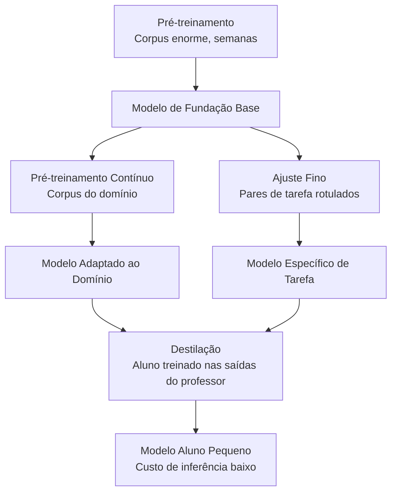
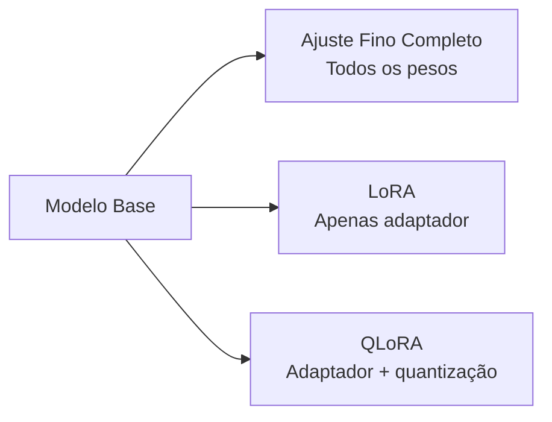
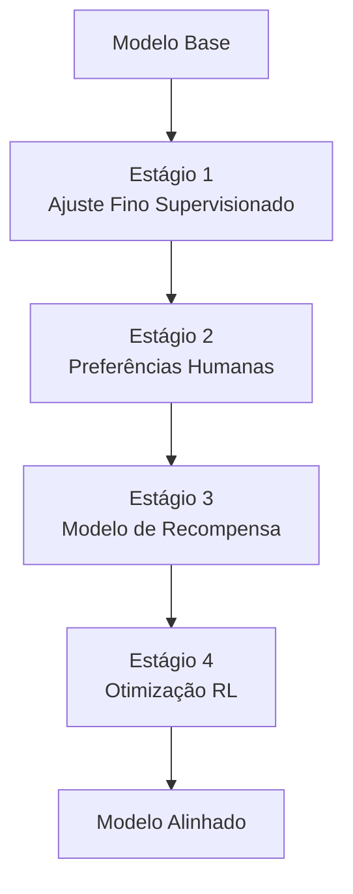
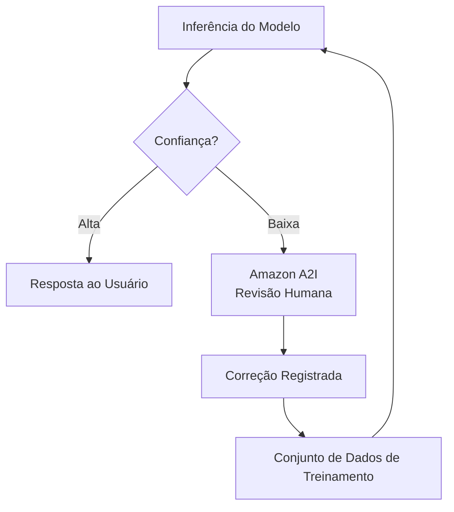
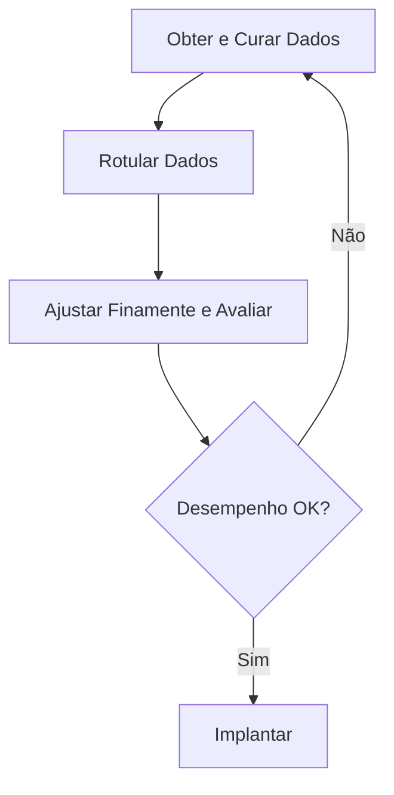

## Declaração de Tarefa 3.3: Descrever o processo de treinamento e ajuste fino para FMs

Os modelos de fundação não chegam prontos para todos os propósitos de negócios. Eles são construídos em etapas, com cada camada adicionando especificidade a um custo que aumenta acentuadamente com a ambição. Compreender como os modelos são construídos e adaptados não é principalmente um exercício técnico para o profissional de negócios; é um exercício de orçamento e escopo. Conhecer a diferença entre pré-treinamento, ajuste fino, pré-treinamento contínuo e destilação permite que você faça as perguntas certas quando uma equipe de engenharia propõe um projeto de personalização, avalie o cronograma e o orçamento propostos, e reconheça quando uma abordagem mais simples produziria resultados comparáveis.[^303001]

Os três objetivos nesta declaração de tarefa seguem uma sequência lógica. O primeiro abrange a taxonomia das técnicas de treinamento e seus perfis de custo. O segundo abrange os métodos específicos usados quando o ajuste fino é a escolha certa. O terceiro abrange como os dados devem ser preparados antes que qualquer trabalho de ajuste fino possa começar, incluindo os processos de feedback humano que alinham o comportamento de um modelo com as expectativas de negócios. Juntos, eles fornecem o enquadramento que um patrocinador de negócios precisa para encomendar e supervisionar um projeto de personalização de modelo sem precisar escrever uma linha de código de treinamento.

### 3.3.1 Elementos-chave do treinamento de um FM

Treinar um modelo de fundação não é uma atividade única. É uma progressão de etapas, cada uma construindo sobre a anterior, e cada uma disponível como ponto de entrada dependendo do que um negócio precisa e quanto pode investir. O exame abrange quatro etapas: pré-treinamento, ajuste fino, pré-treinamento contínuo e destilação. Elas são organizadas aproximadamente por custo, do mais caro ao menos caro, e por escopo de mudança, do mais amplo ao mais estreito.

As quatro técnicas não são alternativas entre si da mesma forma que o ajuste fino e o RAG são alternativas. O pré-treinamento cria a fundação. O ajuste fino e o pré-treinamento contínuo ajustam o que já existe. A destilação comprime o resultado em um pacote menor. Um negócio pode usar vários em sequência: começar a partir de um modelo pré-treinado fornecido por um terceiro, aplicar pré-treinamento contínuo para ensinar ao modelo o vocabulário do domínio e, em seguida, destilar o resultado para inferência de produção com custo eficiente.

**Pré-treinamento** é o processo de treinar uma rede neural a partir de pesos iniciais aleatórios em um enorme corpus de texto e outros dados.[^303002] O modelo aprende padrões estatísticos em bilhões de exemplos: gramática, associações de fatos, cadeias de raciocínio e as relações entre conceitos. O pré-treinamento cria a memória paramétrica do modelo, o conhecimento embutido em seus pesos ao qual ele pode recorrer mesmo quando nenhum documento externo é fornecido. A escala necessária é proibitiva para a maioria das organizações. Uma rodada de treinamento para um grande modelo de linguagem moderno consome milhares de horas de GPU ao longo de semanas ou meses, requer petabytes de dados curados e custa milhões de dólares antes que o modelo produza sua primeira frase coerente.[^303003] O pré-treinamento é relevante no exame como a linha de base da qual todas as outras técnicas partem, não como uma ação prática para qualquer negócio fora dos principais laboratórios de pesquisa de IA.

**Ajuste fino** começa a partir de um modelo pré-treinado existente e continua o treinamento em um conjunto de dados muito menor, específico do domínio.[^303004] O objetivo é deslocar o comportamento do modelo em direção a uma tarefa alvo: responder perguntas de atendimento ao cliente em um tom particular, extrair campos estruturados de registros médicos ou gerar código no framework interno de uma empresa. O ajuste fino ajusta os pesos do modelo, portanto, o modelo resultante é um artefato distinto que deve ser armazenado e servido. Requer exemplos rotulados, tipicamente centenas a dezenas de milhares de pares de entrada-saída, e computação em GPU na faixa de horas a dias em vez de semanas. O **Amazon Bedrock** suporta ajuste fino para um subconjunto de seus modelos hospedados, incluindo Amazon Nova, Meta Llama e versões selecionadas do Anthropic Claude Haiku, produzindo um modelo personalizado que pode ser implantado com throughput provisionado.[^303005] O ajuste fino é a escolha certa quando a tarefa é estável (o comportamento alvo não muda de mês a mês), quando o negócio pode produzir exemplos rotulados suficientes e quando a melhoria de desempenho justifica o custo de treinamento e hospedagem.

**Pré-treinamento contínuo** (também chamado de *pré-treinamento continuado*) é uma técnica intermediária entre pré-treinamento e ajuste fino.[^303006] Em vez de pares de entrada-saída rotulados, o pré-treinamento contínuo usa texto de domínio não rotulado, o mesmo tipo de corpus não supervisionado usado no pré-treinamento original, mas extraído de um domínio específico, como literatura médica, arquivos financeiros ou jurisprudência. O objetivo não é ensinar ao modelo uma nova tarefa, mas ensinar-lhe vocabulário de domínio, terminologia e associações de fatos que estavam subrepresentados no corpus de pré-treinamento original. Um modelo que foi pré-treinado em texto geral da internet pode tratar "margem bruta," "valor presente líquido" e "EBITDA" como jargão financeiro que reconhece, mas não compreende profundamente no contexto. O pré-treinamento contínuo em um corpus de relatórios anuais, notas de analistas e transcrições de chamadas de resultados melhora essa compreensão sem exigir pares rotulados. O Amazon Bedrock suporta pré-treinamento contínuo como uma opção de personalização para modelos selecionados.[^303007]

**Destilação** adota uma abordagem diferente para o problema de custo. Em vez de treinar um modelo menor do zero, a destilação treina um *modelo aluno* compacto para imitar as saídas de um *modelo professor* maior e mais capaz em um conjunto alvo de prompts.[^303008] O professor gera respostas para uma grande coleção de prompts; esses pares de prompt-resposta se tornam os dados de treinamento do aluno. O aluno aprende a aproximar a qualidade do professor sem nunca acessar os pesos do professor. Uma vez concluída a destilação, a inferência de produção é servida pelo aluno, que é mais rápido e mais barato por chamada do que o professor. O Amazon Bedrock suporta destilação de modelos como um fluxo de trabalho gerenciado, permitindo que as organizações designem um modelo Bedrock como professor, especifiquem a distribuição alvo de prompt e produzam um modelo menor com ajuste fino como aluno.[^303009] A economia da destilação favorece aplicações de alto volume onde o custo de treinamento único é rapidamente recuperado pelas economias em inferência.

*Figura 3.3.1: Hierarquia de técnicas de treinamento de FM. Cada técnica constrói sobre um modelo existente em vez de começar do zero, com custo e requisitos de dados diminuindo da esquerda para a direita à medida que o ponto de partida fica mais rico.*

*Tabela 3.3.1: Comparação de técnicas de treinamento e adaptação de FM*

| Técnica | Dados de treinamento | Custo computacional | Tempo para implantar | Resultado principal | Ponto de entrada AWS |
|---|---|---|---|---|---|
| Pré-treinamento | Petabytes, não rotulados | Muito alto (milhões de horas de GPU) | Meses | Modelo de propósito geral | Não aplicável (comprar do provedor) |
| Pré-treinamento contínuo | Gigabytes a terabytes, não rotulados | Médio (dias) | Dias | Vocabulário e associações de fatos do domínio | Modelos personalizados do Amazon Bedrock |
| Ajuste fino | Centenas a milhares de pares rotulados | Baixo a médio (horas) | Horas a dias | Comportamento e tom específicos de tarefa | Amazon Bedrock, SageMaker JumpStart |
| Destilação | Pares prompt-resposta gerados pelo professor | Médio (único) | Horas a dias | Modelo pequeno aproximando qualidade do modelo grande | Destilação de modelos do Amazon Bedrock |

O exame frequentemente apresenta cenários que perguntam qual técnica corresponde a uma determinada restrição. A lógica de decisão é: se o modelo precisa aprender um novo vocabulário ou domínio factual sem um conjunto de dados rotulado, use pré-treinamento contínuo. Se o modelo precisa aprender um comportamento de tarefa específico e dados rotulados estão disponíveis, use ajuste fino. Se o modelo resultante precisa ser mais barato e mais rápido em inferência e o custo de treinamento é aceitável, adicione destilação. O pré-treinamento é a resposta apenas quando a questão afirma explicitamente que nenhum modelo pré-treinado adequado existe, o que é essencialmente nunca em um cenário de negócios real.

### 3.3.2 Métodos para ajustar finamente um FM

O ajuste fino é a técnica de personalização mais discutida em projetos de IA empresarial porque seu perfil de custo está em uma faixa prática e sua saída é um modelo que uma organização controla. Vários métodos distintos existem dentro da ampla categoria de ajuste fino, e o exame espera familiaridade com cada um.

O fio comum em todos os métodos de ajuste fino é que os pesos do modelo pré-treinado são o ponto de partida, e o treinamento em dados específicos do domínio desloca esses pesos. O que difere é o formato dos dados de treinamento, a parte da arquitetura do modelo que é modificada e o objetivo de aprendizado específico.

**Ajuste de instrução** é o ajuste fino em um conjunto de dados de pares de prompt-e-resposta, onde cada prompt é escrito como uma instrução explícita e cada resposta demonstra o comportamento desejado.[^303010] Por exemplo, um prompt pode ser "Resuma a seguinte reclamação do cliente em uma frase:" seguido de um e-mail do cliente, e a resposta seria o resumo alvo. O modelo aprende a seguir o formato de instrução de forma confiável, não apenas a produzir texto plausível no domínio. O ajuste de instrução é o que transforma um modelo base, que simplesmente prevê o próximo token em uma sequência, em um modelo assistente que responde a comandos. A maioria dos modelos disponíveis comercialmente que são descritos como variantes "chat" ou "instruct" já passou por ajuste de instrução; ajustá-los finamente em pares de instrução adicionais estende essa capacidade a uma tarefa de negócios ou vocabulário específico.

**Adaptação de modelos para domínios específicos** descreve o objetivo geral do ajuste de instrução e do ajuste fino supervisionado quando aplicados a campos profissionais.[^303011] Uma organização de saúde pode ajustar finamente em templates de notas clínicas e exemplos de codificação diagnóstica para que o modelo produza saídas formatadas para sistemas de registros eletrônicos de saúde. Uma equipe jurídica pode ajustar finamente em bibliotecas de cláusulas contratuais para melhorar a capacidade do modelo de identificar tipos específicos de cláusulas. Uma empresa de serviços financeiros pode ajustar finamente em transcrições de chamadas de resultados e relatórios de analistas para melhorar o tratamento do modelo de terminologia financeira especializada. O requisito-chave é que os exemplos de treinamento representem com precisão a distribuição de entradas que o modelo implantado encontrará; treinar em notas clínicas de uma especialidade que são então usadas em uma especialidade diferente produz resultados degradados.

**Aprendizado por transferência** é o conceito teórico mais amplo que fundamenta o ajuste fino.[^303012] O aprendizado por transferência refere-se ao princípio de pegar um modelo que foi treinado para uma tarefa e reutilizar suas representações aprendidas como ponto de partida para uma tarefa diferente. No contexto de grandes modelos de linguagem, toda operação de ajuste fino é uma instância de aprendizado por transferência: o modelo transfere sua compreensão geral de linguagem do pré-treinamento para o domínio de tarefa específico. O exame usa aprendizado por transferência como termo abrangente e ajuste fino como a técnica específica. Reconhecer que uma questão sobre "aplicar conhecimento aprendido em uma tarefa para melhorar o desempenho em uma tarefa diferente" está descrevendo o aprendizado por transferência ajuda a alinhar a resposta corretamente.

O **pré-treinamento contínuo** (abordado em 3.3.1) é mencionado aqui apenas para sinalizar o padrão comum de dois estágios: primeiro aplique pré-treinamento contínuo no corpus não rotulado para estabelecer vocabulário do domínio e ancoragem factual, em seguida aplique ajuste de instrução em um conjunto de dados rotulado menor para ensinar o comportamento específico da tarefa.[^303013] A abordagem de dois estágios produz resultados melhores do que qualquer técnica usada isoladamente quando o domínio é altamente especializado.

O **ajuste fino com eficiência de parâmetros** (PEFT) aborda uma das principais restrições práticas do ajuste fino: o ajuste fino completo atualiza todos os pesos do modelo, o que requer a mesma capacidade de memória e computação que treinar o modelo em primeiro lugar.[^303014] Os métodos PEFT reduzem esse fardo congelando a maioria dos pesos do modelo e treinando apenas um pequeno conjunto de parâmetros adicionais. O **LoRA** (*Low-Rank Adaptation*) é o método PEFT mais amplamente usado. Ele insere pequenas matrizes treináveis em certas camadas da arquitetura do transformador; apenas essas matrizes de adaptador são atualizadas durante o treinamento, enquanto os pesos originais permanecem congelados.[^303015] O número de parâmetros treináveis em uma configuração LoRA pode ser um por cento do total de parâmetros do modelo, reduzindo os requisitos de memória de GPU por um fator correspondente. O **QLoRA** (*Quantized LoRA*) combina o LoRA com *quantização*, que é a compressão dos pesos do modelo de valores de ponto flutuante de 32 ou 16 bits para inteiros de 4 bits, permitindo o ajuste fino de modelos que, de outra forma, não caberiam no hardware disponível.[^303016] Para fins de negócios, LoRA e QLoRA importam porque tornam o ajuste fino de modelos maiores e de maior qualidade acessível sem exigir as instâncias de GPU mais caras.

*Figura 3.3.2: Métodos de ajuste fino com eficiência de parâmetros. LoRA e QLoRA reduzem o número de parâmetros que requerem atualizações de gradiente, tornando o ajuste fino acessível em configurações de hardware menores.*

A AWS fornece dois pontos de entrada principais para ajuste fino. O **Amazon Bedrock** suporta ajuste fino para seus modelos hospedados por meio de um fluxo de trabalho gerenciado: o cliente faz upload de um conjunto de dados de treinamento para o **Amazon S3**, configura o trabalho de ajuste fino no console ou API do Bedrock, e o Bedrock lida com a infraestrutura, a rodada de treinamento e o armazenamento do modelo personalizado resultante.[^303017] O modelo personalizado fica disponível para inferência por meio de throughput provisionado, que reserva capacidade dedicada e é faturado por hora independentemente do volume de solicitações, ou por meio de um modo serverless para casos de uso de menor volume. O **Amazon SageMaker JumpStart** fornece um catálogo de modelos de código aberto pré-treinados, incluindo famílias Meta Llama, Mistral e Falcon, juntamente com fluxos de trabalho de ajuste fino com um clique que implantam o trabalho de treinamento na infraestrutura gerenciada do SageMaker.[^303018] O JumpStart é adequado quando o negócio requer um modelo que possa executar dentro de sua própria conta AWS em sua própria computação, em vez de depender da API hospedada do Bedrock. Ele também suporta configurações LoRA e QLoRA para modelos onde o ajuste fino completo excederia a memória de GPU disponível.

*Tabela 3.3.2: Comparação de pontos de entrada de ajuste fino da AWS*

| Capacidade | Amazon Bedrock | Amazon SageMaker JumpStart |
|---|---|---|
| Disponibilidade de modelo | Modelos hospedados no Bedrock (Amazon Nova, Meta Llama, versões selecionadas do Anthropic Claude Haiku) | Modelos de código aberto (Llama, Mistral, Falcon e outros) |
| Gerenciamento de infraestrutura | Totalmente gerenciado pela AWS | Treinamento e implantação gerenciados no SageMaker |
| Localização dos dados de treinamento | Amazon S3 | Amazon S3 |
| Suporte PEFT (LoRA/QLoRA) | Varia por modelo | Suportado para modelos compatíveis |
| Modo de inferência | Throughput provisionado ou sob demanda | Endpoint em tempo real do SageMaker ou transformação em lote |
| Melhor para | Modelos comerciais de peso fechado com hospedagem gerenciada | Modelos de código aberto, propriedade total do modelo |

A escolha entre Bedrock e JumpStart é principalmente uma questão de propriedade do modelo. O ajuste fino do Bedrock ajusta o comportamento de um modelo hospedado que a AWS continua a servir; o negócio não possui os pesos resultantes. O ajuste fino do JumpStart produz um artefato de modelo no bucket S3 do próprio cliente, dando portabilidade total e controle sobre os pesos. Para organizações em setores regulamentados onde os artefatos de modelo devem ser auditáveis e controláveis dentro de seu próprio ambiente, o JumpStart é o caminho preferido.

### 3.3.3 Como preparar dados para ajustar finamente um FM

A qualidade dos dados é a única maior variável em um projeto de ajuste fino. Um modelo treinado em dados falhos aprende comportamento falho de forma confiável. Um modelo treinado em dados excelentes pode alcançar melhorias substanciais de qualidade em relação a um modelo base mesmo com um número relativamente pequeno de exemplos. O processo de preparação de dados envolve várias atividades distintas que devem ser planejadas antes que qualquer trabalho de treinamento comece.

**Curadoria de dados** é o processo de selecionar, filtrar e limpar exemplos a serem incluídos no conjunto de dados de treinamento.[^303019] A curadoria começa com um pool de candidatos, que pode ser interações existentes com clientes, documentos internos, saídas históricas rotuladas ou exemplos criados com propósito, e remove sistematicamente itens que são incorretos, ambíguos ou não representativos. As atividades concretas de curadoria incluem remover exemplos duplicados (que podem fazer o modelo superajustar padrões comuns), filtrar exemplos que contêm erros factuais ou informações desatualizadas, remover exemplos que são curtos demais para ser informativos e equilibrar a distribuição de tipos de exemplos para que o modelo não aprenda uma versão tendenciosa da tarefa. Para conjuntos de dados de ajuste de instrução, a curadoria também significa verificar se a instrução e a resposta estão realmente alinhadas; um conjunto de dados que emparelha uma pergunta sobre faturamento com uma resposta sobre suporte técnico ensinará ao modelo uma associação incorreta.

**Governança de dados** abrange os controles legais, éticos e operacionais que se aplicam aos dados de treinamento.[^303020] Três preocupações são mais proeminentes. Primeiro, tratamento de *informações de identificação pessoal* (PII): os dados de treinamento devem ser verificados para nomes, endereços de e-mail, números de conta, informações de saúde e outras PII. Incluir PII nos dados de treinamento cria um risco de que o modelo a reproduza em respostas, o que viola regulamentações de privacidade na maioria das jurisdições. Ferramentas automatizadas de detecção de PII, como a capacidade de reconhecimento de entidades do **Amazon Comprehend**, podem rastrear documentos em escala antes que entrem no pipeline de treinamento.[^303021] Segundo, consentimento: os dados usados para treinamento devem ter sido coletados com termos que permitam seu uso para esse fim. Terceiro, *linhagem de dados*: a organização deve ser capaz de rastrear cada exemplo de treinamento de volta à sua fonte, verificar que a fonte está licenciada para uso em treinamento e reproduzir o conjunto de dados de treinamento se uma auditoria de conformidade exigir. Manter um manifesto de fontes de dados de treinamento e sua proveniência satisfaz esse requisito.

O **tamanho do conjunto de dados** para ajuste fino é menor do que as intuições do pré-treinamento sugeririam, mas não é trivial.[^303022] Um trabalho típico de ajuste de instrução para adaptação de tarefa requer centenas a vários milhares de exemplos rotulados de alta qualidade para produzir melhoria mensurável. O princípio de qualidade versus quantidade se aplica diretamente: quinhentos exemplos cuidadosamente curados, precisos e diversos superam consistentemente cinco mil exemplos que incluem duplicatas, erros e itens fora do tópico. O mínimo prático para ajuste fino significativo geralmente está na faixa de duzentos a quinhentos exemplos; abaixo disso, o modelo não encontra variedade suficiente para generalizar de forma confiável. Na extremidade superior, as melhorias no desempenho da tarefa geralmente chegam a um platô após vários milhares de exemplos para uma tarefa com escopo estreito, ponto em que adicionar mais dados produz retornos decrescentes, a menos que os novos exemplos cubram sub-cenários genuinamente novos.

**Rotulagem** é o processo de criar ou verificar o lado de saída de cada exemplo de treinamento.[^303023] Para ajuste de instrução, a rotulagem significa escrever ou revisar a resposta alvo para cada prompt. A qualidade da rotulagem tem um efeito desproporcional nos resultados do ajuste fino porque o modelo trata cada exemplo rotulado como verdade fundamental. Erros de rótulo ensinam ao modelo um comportamento incorreto, e o modelo pode generalizar esses erros para entradas que nunca viu. Diretrizes de rotulagem consistentes, revisadas por mais de um anotador e adjudicadas quando os anotadores discordam, são a base operacional de um conjunto de dados de treinamento confiável. O **Amazon SageMaker Ground Truth** é o serviço gerenciado da AWS para organizar fluxos de trabalho de rotulagem humana em escala, suportando tanto tipos de tarefas integrados (classificação de imagens, classificação de texto, reconhecimento de entidades nomeadas) quanto interfaces de tarefas personalizadas para necessidades de rotulagem específicas do domínio.[^303024] O **Amazon SageMaker Ground Truth Plus** estende o serviço com uma força de trabalho gerenciada fornecida pela AWS, eliminando a necessidade de recrutar e gerenciar anotadores externos diretamente.[^303025]

**Representatividade** é a propriedade de um conjunto de dados de treinamento que garante que os exemplos coletivamente cubram a distribuição de entradas que o modelo implantado realmente encontrará.[^303026] Um conjunto de dados que não é representativo produz um modelo com uma fraqueza oculta: ele tem bom desempenho nas entradas para as quais foi treinado e degrada nas entradas para as quais não foi. Por exemplo, um modelo de atendimento ao cliente treinado exclusivamente em interações em inglês com usuários em uma região terá desempenho ruim quando implantado globalmente para usuários cujo fraseado reflete convenções culturais diferentes. A representatividade requer a construção intencional do conjunto de dados de treinamento para incluir casos extremos, variedade linguística, diversidade de tópicos e quaisquer subpopulações que o modelo implantado deve atender. Verificar a representatividade é uma responsabilidade contínua; à medida que a distribuição de entrada do modelo implantado muda ao longo do tempo, o conjunto de dados de treinamento pode precisar ser atualizado.

O **aprendizado por reforço com feedback humano (RLHF)** é uma metodologia de treinamento que melhora o alinhamento de um modelo com preferências humanas, em vez de apenas sua precisão em uma tarefa rotulada.[^303027] Os pipelines RLHF de produção geralmente começam com um aquecimento de ajuste fino supervisionado (SFT) que alinha o modelo base no seguimento de instruções antes que qualquer dado de preferência seja coletado; essa etapa de SFT é mostrada como a primeira caixa na Figura 3.3.3. Os estágios restantes são: anotadores humanos classificam várias respostas geradas pelo modelo para o mesmo prompt, do melhor ao pior; um *modelo de recompensa* separado é treinado para prever essas classificações humanas (dado um prompt e uma resposta, o modelo de recompensa prevê a pontuação que um anotador humano atribuiria); e o modelo principal é então ajustado finamente usando um algoritmo de *aprendizado por reforço*, especificamente a *Otimização de Política Proximal* (PPO) na formulação original, com o modelo de recompensa fornecendo o sinal de treinamento.[^303028] O modelo aprende a gerar respostas que o modelo de recompensa pontua altamente, o que corresponde a respostas que os anotadores humanos preferem. O RLHF é a técnica que transformou grandes modelos de linguagem base nos assistentes prestenciosos que seguem instruções e que a maioria das pessoas usa hoje; é a fase de treinamento que ensina o modelo a ser útil em vez de apenas fluente.

*Figura 3.3.3: Pipeline RLHF. Os dados de preferência humana treinam um modelo de recompensa, que então orienta o aprendizado por reforço para alinhar o modelo principal com as preferências do anotador.*

O **Amazon A2I** (**Amazon Augmented AI**) aborda um problema relacionado, mas distinto: não o treinamento do modelo, mas a revisão humana contínua das saídas do modelo em produção.[^303029] Onde o RLHF coleta julgamentos humanos para melhorar os pesos do modelo, o A2I roteia saídas de inferência específicas para revisores humanos quando a confiança do modelo cai abaixo de um limiar ou quando o tipo de tarefa exige supervisão humana. Por exemplo, um fluxo de trabalho de processamento de documentos financeiros pode enviar toda saída onde a confiança do modelo é inferior a 90% para uma fila de revisão humana, com as correções do revisor alimentando de volta em um ciclo futuro de ajuste fino. O A2I se integra a modelos do SageMaker e suporta interfaces de tarefas de revisão humana personalizadas, tornando-o um complemento natural ao Ground Truth no ciclo de dados de ponta a ponta.

*Figura 3.3.4: Ciclo de dados com humano no loop. O Amazon A2I roteia saídas de baixa confiança para revisores humanos; as correções fluem de volta pelo Ground Truth para o próximo ciclo de ajuste fino, melhorando continuamente o modelo.*

*Tabela 3.3.3: Atividades de preparação de dados e ferramentas AWS*

| Atividade | O que aborda | Ferramenta ou serviço AWS |
|---|---|---|
| Detecção e remoção de PII | Conformidade de privacidade, governança de dados | Reconhecimento de entidades do Amazon Comprehend |
| Rotulagem humana em escala | Criação de conjunto de dados rotulado, qualidade de rótulo | Amazon SageMaker Ground Truth |
| Força de trabalho de rotulagem gerenciada | Recrutamento e gerenciamento de anotadores | Amazon SageMaker Ground Truth Plus |
| Revisão humana de saídas do modelo | Garantia de qualidade contínua, coleta de feedback | Amazon Augmented AI (A2I) |
| Armazenamento de dados de treinamento | Entrada segura e escalável para trabalhos de treinamento | Amazon S3 |
| Execução de trabalho de treinamento | Computação e orquestração de ajuste fino | Modelos personalizados Amazon Bedrock, SageMaker JumpStart |

O processo de preparação de dados para um projeto de ajuste fino é iterativo, não linear. Um conjunto de dados inicial é curado, o modelo é treinado, suas saídas são avaliadas, os erros são diagnosticados e os dados de treinamento são corrigidos ou aumentados antes da próxima rodada de treinamento. Esse ciclo normalmente se repete de duas a quatro vezes antes que o modelo alcance a qualidade alvo. Organizações que tratam a preparação de dados como uma atividade única antes do treinamento acabam repetindo trabalhos de treinamento com mais frequência e a um custo total mais alto do que aquelas que investem em um pipeline de dados sistemático desde o início.

*Figura 3.3.5: Fluxo de trabalho de preparação de dados de ajuste fino de ponta a ponta. Curadoria, rotulagem e avaliação de dados formam um ciclo iterativo; lacunas identificadas na avaliação impulsionam adições direcionadas ao conjunto de dados de treinamento.*

Um patrocinador de negócios que supervisiona um projeto de ajuste fino deve esperar investir em preparação de dados um tempo aproximadamente igual ao tempo gasto em treinamento e avaliação de modelos combinados. A computação de treinamento é mensurável e frequentemente citada primeiro pelas equipes de engenharia; o trabalho de preparação de dados é frequentemente subestimado, especialmente quando a rotulagem requer especialistas do domínio (médicos, advogados, analistas financeiros) em vez de anotadores de propósito geral. Orçar para ambas as metades do esforço antecipadamente produz planos de projeto mais confiáveis.

## Perguntas de verificação de conhecimento

**Questão 1.** Uma empresa de saúde quer usar um modelo de fundação para auxiliar médicos na documentação clínica. A empresa tem um grande arquivo de notas clínicas desidentificadas, mas nenhum par de pergunta-resposta rotulado. A principal fraqueza do modelo é a falta de familiaridade com a terminologia médica. Qual técnica de personalização é MAIS adequada como primeiro passo?

A. Ajustar finamente o modelo em pares de instrução-resposta extraídos das notas clínicas
B. Pré-treinar continuamente o modelo no arquivo de notas clínicas não rotuladas
C. Destilar o modelo em um modelo aluno menor usando prompts gerados por médicos
D. Usar aprendizado em contexto colando notas clínicas em cada prompt em tempo de execução

**Explicação:** O cenário tem dois recursos definidores: existe um grande corpus não rotulado e a principal fraqueza é o vocabulário do domínio, não o comportamento da tarefa. O pré-treinamento contínuo (resposta B) é projetado precisamente para essa situação. Ele usa texto de domínio não rotulado para ensinar ao modelo terminologia e associações factuais do domínio alvo sem exigir exemplos rotulados. Esse é o primeiro passo correto antes de qualquer ajuste de instrução. O ajuste fino em pares de instrução-resposta (resposta A) requereria um conjunto de dados rotulado que a empresa ainda não possui e não abordaria a lacuna de vocabulário raiz tão eficientemente quanto o treinamento não supervisionado nas notas brutas. A destilação (resposta C) produz um modelo menor que imita as saídas de um professor; ela não aborda diretamente as fraquezas de vocabulário do domínio e requer um modelo professor capaz como ponto de partida. O aprendizado em contexto (resposta D) não pode escalar para o nível de cobertura de domínio necessário e consome espaço da janela de contexto que poderia, de outra forma, carregar os dados clínicos reais do paciente. A sequência correta para essa organização é pré-treinamento contínuo primeiro, seguido de ajuste de instrução assim que um conjunto de dados rotulado estiver disponível.[^303030]

---

**Questão 2.** Uma equipe de engenharia propõe ajustar finamente um modelo de código aberto de 70 bilhões de parâmetros usando o SageMaker JumpStart. A instância de GPU disponível tem 24 GB de VRAM. A equipe estima que o ajuste fino completo exigiria aproximadamente 140 GB de memória de GPU. Qual técnica de ajuste fino com eficiência de parâmetros é MAIS adequada para essa restrição?

A. Ajuste de instrução com um template de prompt maior para compensar a lacuna de parâmetros
B. QLoRA, que combina treinamento de matrizes de adaptador com quantização de 4 bits para reduzir os requisitos de memória
C. Pré-treinamento contínuo no corpus do modelo base não rotulado, que reduz a contagem de parâmetros treináveis
D. Destilação, que comprime o modelo de 70 bilhões de parâmetros para caber em 24 GB

**Explicação:** A restrição é a memória de GPU: o ajuste fino completo requer 140 GB, mas apenas 24 GB estão disponíveis. O QLoRA (resposta B) resolve isso diretamente. Ele aplica quantização de 4 bits aos pesos do modelo base congelado, reduzindo drasticamente seu consumo de memória e, em seguida, treina apenas pequenas matrizes de adaptador LoRA em cima. O requisito de memória combinado de um modelo base quantizado mais adaptadores LoRA normalmente está bem dentro da VRAM de uma única GPU, mesmo para modelos grandes. O ajuste de instrução com um template de prompt maior (resposta A) é uma abordagem de formatação de dados, não uma técnica de redução de memória; não faria diferença alguma no requisito de memória de GPU. O pré-treinamento contínuo (resposta C) é uma técnica separada que atualiza todos os pesos usando texto de domínio não rotulado; ele não aborda restrições de memória de GPU e exigiria ainda mais memória do que o ajuste fino supervisionado que a equipe está tentando executar. A destilação (resposta D) é uma técnica separada que cria um novo modelo menor; ela não comprime um modelo existente para executar em hardware menor da forma que o QLoRA faz, e ela própria exigiria um professor capaz para gerar dados de treinamento em vez de produzir o modelo 70B com ajuste fino que a equipe quer.[^303031]

---

**Questão 3.** Uma empresa ajustou finamente um modelo de fundação para suporte ao cliente e quer melhorá-lo continuamente com base em interações de produção reais. A equipe planeja rotear respostas do modelo abaixo de um limiar de confiança para revisores humanos e incorporar as correções revisadas no próximo ciclo de treinamento. Qual serviço AWS é MAIS diretamente projetado para suportar a etapa de roteamento de revisão humana?

A. Amazon SageMaker Ground Truth
B. Amazon Comprehend
C. Amazon Augmented AI (A2I)
D. Amazon SageMaker JumpStart

**Explicação:** O Amazon Augmented AI (A2I) (resposta C) é o serviço projetado especificamente para rotear saídas de inferência de produção para revisores humanos quando condições definidas são atendidas, como uma pontuação de confiança do modelo caindo abaixo de um limiar. Ele gerencia a fila do revisor, a interface de tarefa e a saída das decisões revisadas. É exatamente a etapa descrita na questão. O Amazon SageMaker Ground Truth (resposta A) é usado para criar conjuntos de dados de treinamento rotulados por meio de fluxos de trabalho de rotulagem humana organizados; é a ferramenta para a etapa de registro de correção e ajuste fino futuro no ciclo de dados, não para rotear saídas de produção ao vivo para revisores. O Amazon Comprehend (resposta B) é um serviço de processamento de linguagem natural usado para tarefas como análise de sentimentos e extração de entidades; ele não roteia saídas de modelos para revisão. O Amazon SageMaker JumpStart (resposta D) é um serviço de treinamento e implantação de modelos; ele não fornece uma capacidade de roteamento de revisão humana para saídas de inferência de produção. A resposta correta é o A2I para a etapa de roteamento de revisão, com o Ground Truth usado na etapa subsequente para converter correções revisadas em um conjunto de dados de treinamento rotulado.[^303032]

---

**Questão 4.** Uma empresa de serviços jurídicos quer ajustar finamente um modelo em dados de contratos internos. A equipe jurídica está preocupada que o conjunto de dados de treinamento possa incluir informações de identificação pessoal de contratos reais de clientes. Qual abordagem MELHOR aborda essa preocupação antes que o trabalho de treinamento comece?

A. Usar o Amazon SageMaker JumpStart para aplicar LoRA, que impede que o modelo memorize detalhes específicos de clientes
B. Aplicar reconhecimento de entidades do Amazon Comprehend para detectar e remover PII do corpus de treinamento
C. Usar o Amazon Bedrock Guardrails no momento de inferência para impedir que PII apareça nas respostas do modelo
D. Restringir o conjunto de dados de ajuste fino a contratos com menos de cinco anos

**Explicação:** A preocupação é que a PII esteja presente nos dados de treinamento antes que o trabalho de treinamento seja executado. A abordagem correta é detectar e remover PII do corpus de treinamento no momento da preparação de dados (resposta B). A capacidade de reconhecimento de entidades do Amazon Comprehend pode identificar nomes, endereços, números de conta e outras categorias de PII em escala em grandes coleções de documentos, permitindo triagem automatizada pré-treinamento. O LoRA (resposta A) reduz o número de parâmetros treinados, mas não impede que o modelo aprenda e reproduza padrões presentes nos dados de treinamento, incluindo PII; o ajuste fino com eficiência de parâmetros é uma otimização de computação, não um controle de governança de dados. O Amazon Bedrock Guardrails (resposta C) filtra saídas do modelo no momento de inferência, o que é uma defesa em profundidade útil, mas não aborda o problema raiz de que o modelo foi treinado em PII e pode tê-la internalizado. Restringir por idade do contrato (resposta D) aborda a atualidade dos dados, mas não tem relação com o fato de os contratos conterem PII; contratos antigos e novos podem conter informações sensíveis de clientes. A resposta correta é verificar e higienizar o corpus de treinamento antes de começar o treinamento.[^303033]

---

**Questão 5.** Uma empresa concluiu o ajuste fino de um modelo para processar sinistros de seguros. Durante a avaliação, o modelo tem excelente desempenho em sinistros simples, mas desempenho ruim em sinistros que envolvem circunstâncias incomuns. A equipe de engenharia suspeita que o conjunto de dados de treinamento sub-representa casos extremos. Qual ação MAIS diretamente aborda esse problema de representatividade?

A. Aumentar o número de épocas de treinamento para dar ao modelo mais tempo para aprender os casos extremos
B. Aplicar QLoRA para reduzir os requisitos de memória, o que liberará computação para treinamento mais diverso
C. Aumentar o conjunto de dados de treinamento com exemplos adicionais cobrindo especificamente os tipos de casos extremos sub-representados
D. Mudar do ajuste fino do Amazon Bedrock para o SageMaker JumpStart para ter acesso a um modelo maior

**Explicação:** A causa raiz é uma lacuna de representatividade nos dados de treinamento: casos extremos estão presentes em produção, mas ausentes ou severamente sub-representados no conjunto de treinamento. A ação correta é aumentar o conjunto de dados de treinamento com exemplos adicionais cobrindo esses casos extremos específicos (resposta C). Isso aborda diretamente a incompatibilidade de distribuição. Aumentar as épocas de treinamento (resposta A) treina o modelo mais vezes nos mesmos dados; se esses dados não incluem os casos extremos, mais épocas não ensinarão ao modelo como tratá-los e podem causar sobreajuste aos exemplos que estão presentes. O QLoRA (resposta B) é uma otimização de memória para ajuste fino; não tem efeito sobre a distribuição dos dados de treinamento ou a cobertura do modelo de casos extremos. Mudar para o SageMaker JumpStart ou um modelo maior (resposta D) pode aumentar a capacidade do modelo, mas um modelo maior treinado no mesmo conjunto de dados deficiente em representatividade ainda terá desempenho ruim em casos extremos; a capacidade do modelo não é a restrição aqui, a cobertura dos dados de treinamento é. A resposta correta segue diretamente do princípio de representatividade: corrija a distribuição de dados para corresponder à distribuição de entrada alvo.[^303034]

[^303001]: AWS Certification. AI Practitioner (AIF-C01) Exam Guide v1.1, Task Statement 3.3. URL: <https://docs.aws.amazon.com/aws-certification/latest/ai-practitioner-01/ai-practitioner-01-domain3.html>
[^303002]: Bommasani, R., et al. On the Opportunities and Risks of Foundation Models (Stanford CRFM, 2021). URL: <https://arxiv.org/abs/2108.07258>
[^303003]: Patterson, D., et al. Carbon Emissions and Large Neural Network Training (2021). URL: <https://arxiv.org/abs/2104.10350>
[^303004]: Howard, J., and Ruder, S. Universal Language Model Fine-tuning for Text Classification (ULMFiT, 2018). URL: <https://arxiv.org/abs/1801.06146>
[^303005]: Amazon Bedrock. Fine-tuning foundation models in Amazon Bedrock. URL: <https://docs.aws.amazon.com/bedrock/latest/userguide/custom-models.html>
[^303006]: Amazon Bedrock. Continued pre-training in Amazon Bedrock. URL: <https://docs.aws.amazon.com/bedrock/latest/userguide/custom-models-continued-pretraining.html>
[^303007]: Amazon Bedrock. Customization options for foundation models in Amazon Bedrock. URL: <https://docs.aws.amazon.com/bedrock/latest/userguide/custom-models.html>
[^303008]: Hinton, G., et al. Distilling the Knowledge in a Neural Network (2015). URL: <https://arxiv.org/abs/1503.02531>
[^303009]: Amazon Bedrock. Model distillation in Amazon Bedrock. URL: <https://docs.aws.amazon.com/bedrock/latest/userguide/model-distillation.html>
[^303010]: Wei, J., et al. Finetuned Language Models Are Zero-Shot Learners (FLAN, 2021). URL: <https://arxiv.org/abs/2109.01652>
[^303011]: Amazon Bedrock. Use cases for fine-tuning in Amazon Bedrock. URL: <https://docs.aws.amazon.com/bedrock/latest/userguide/custom-models.html>
[^303012]: Pan, S.J., and Yang, Q. A Survey on Transfer Learning (2010). URL: <https://doi.org/10.1109/TKDE.2009.191>
[^303013]: Amazon Bedrock. Continued pre-training vs. fine-tuning in Amazon Bedrock. URL: <https://docs.aws.amazon.com/bedrock/latest/userguide/custom-models-continued-pretraining.html>
[^303014]: Ding, N., et al. Parameter-Efficient Fine-Tuning of Large-Scale Pre-trained Language Models (2023). URL: <https://arxiv.org/abs/2303.15647>
[^303015]: Hu, E., et al. LoRA: Low-Rank Adaptation of Large Language Models (2021). URL: <https://arxiv.org/abs/2106.09685>
[^303016]: Dettmers, T., et al. QLoRA: Efficient Finetuning of Quantized LLMs (2023). URL: <https://arxiv.org/abs/2305.14314>
[^303017]: Amazon Bedrock. Training data requirements for fine-tuning in Amazon Bedrock. URL: <https://docs.aws.amazon.com/bedrock/latest/userguide/model-customization-prepare.html>
[^303018]: Amazon SageMaker. Amazon SageMaker JumpStart foundation models. URL: <https://docs.aws.amazon.com/sagemaker/latest/dg/studio-jumpstart.html>
[^303019]: Allamanis, M., et al. A Survey of Machine Learning for Big Code and Naturalness (2018). URL: <https://arxiv.org/abs/1709.06182>
[^303020]: NIST. AI Risk Management Framework (AI RMF 1.0), Measure 2.2. URL: <https://airc.nist.gov/RMF>
[^303021]: Amazon Comprehend. Detecting personally identifiable information (PII) using Amazon Comprehend. URL: <https://docs.aws.amazon.com/comprehend/latest/dg/how-pii.html>
[^303022]: Kaplan, J., et al. Scaling Laws for Neural Language Models (2020). URL: <https://arxiv.org/abs/2001.08361>
[^303023]: Northcutt, C., et al. Pervasive Label Errors in Test Sets Destabilize Machine Learning Benchmarks (2021). URL: <https://arxiv.org/abs/2103.14749>
[^303024]: Amazon SageMaker. Amazon SageMaker Ground Truth. URL: <https://docs.aws.amazon.com/sagemaker/latest/dg/sms.html>
[^303025]: Amazon SageMaker. Amazon SageMaker Ground Truth Plus. URL: <https://docs.aws.amazon.com/sagemaker/latest/dg/gtp.html>
[^303026]: Mehrabi, N., et al. A Survey on Bias and Fairness in Machine Learning (2021). URL: <https://arxiv.org/abs/1908.09635>
[^303027]: Ouyang, L., et al. Training language models to follow instructions with human feedback (InstructGPT, 2022). URL: <https://arxiv.org/abs/2203.02155>
[^303028]: Schulman, J., et al. Proximal Policy Optimization Algorithms (2017). URL: <https://arxiv.org/abs/1707.06347>
[^303029]: Amazon Augmented AI. Amazon Augmented AI (Amazon A2I) overview. URL: <https://docs.aws.amazon.com/sagemaker/latest/dg/a2i-use-augmented-ai-a2i-human-review-loops.html>
[^303030]: Amazon Bedrock. Continued pre-training for domain adaptation in Amazon Bedrock. URL: <https://docs.aws.amazon.com/bedrock/latest/userguide/custom-models-continued-pretraining.html>
[^303031]: Dettmers, T., et al. QLoRA: Efficient Finetuning of Quantized LLMs (2023). URL: <https://arxiv.org/abs/2305.14314>
[^303032]: Amazon Augmented AI. When to use Amazon A2I for human review loops. URL: <https://docs.aws.amazon.com/sagemaker/latest/dg/a2i-use-augmented-ai-a2i-human-review-loops.html>
[^303033]: Amazon Comprehend. PII detection and redaction with Amazon Comprehend. URL: <https://docs.aws.amazon.com/comprehend/latest/dg/how-pii.html>
[^303034]: Amazon Bedrock. Preparing training datasets for fine-tuning in Amazon Bedrock. URL: <https://docs.aws.amazon.com/bedrock/latest/userguide/model-customization-prepare.html>
