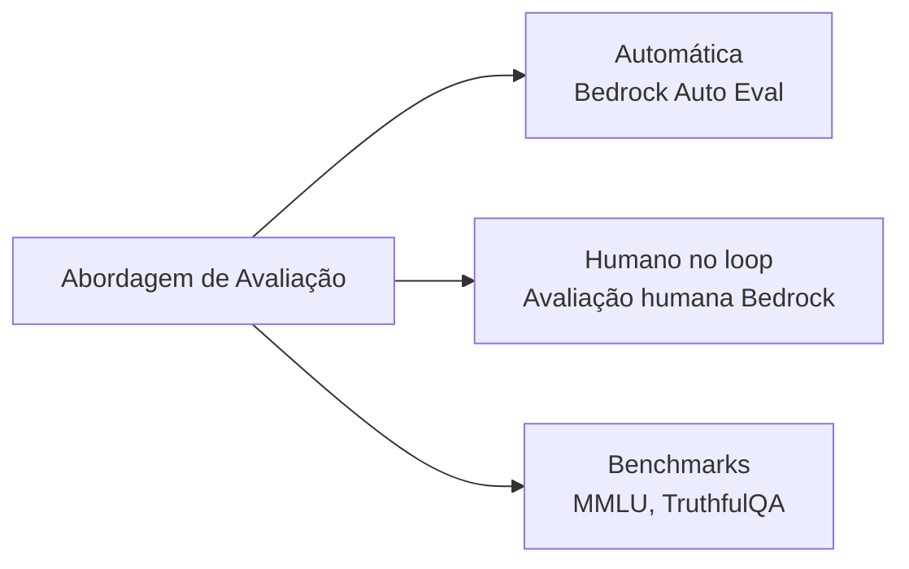
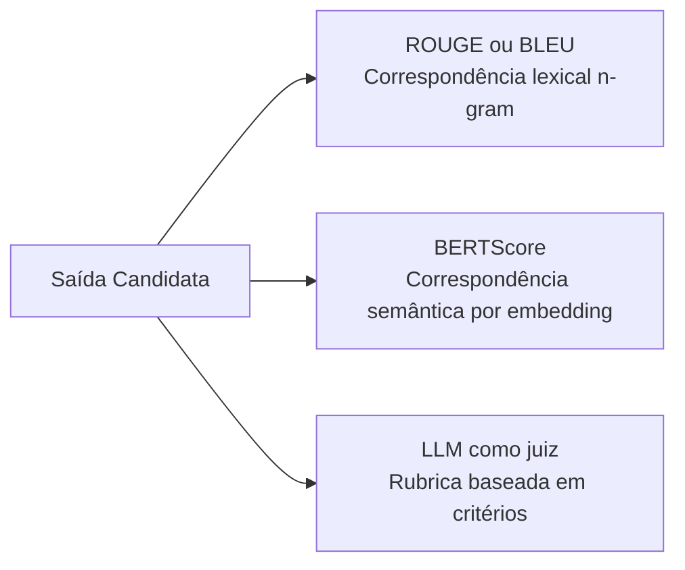
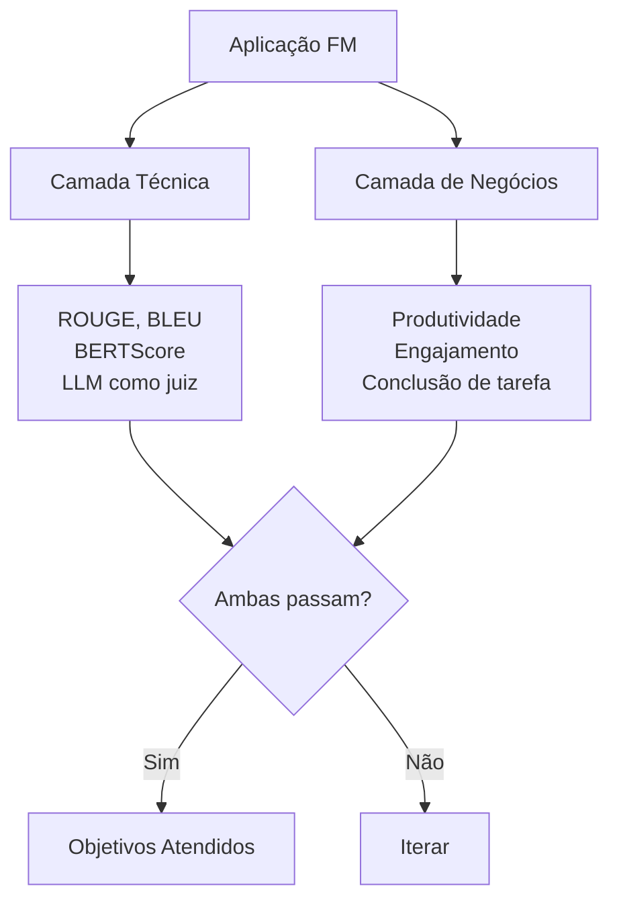
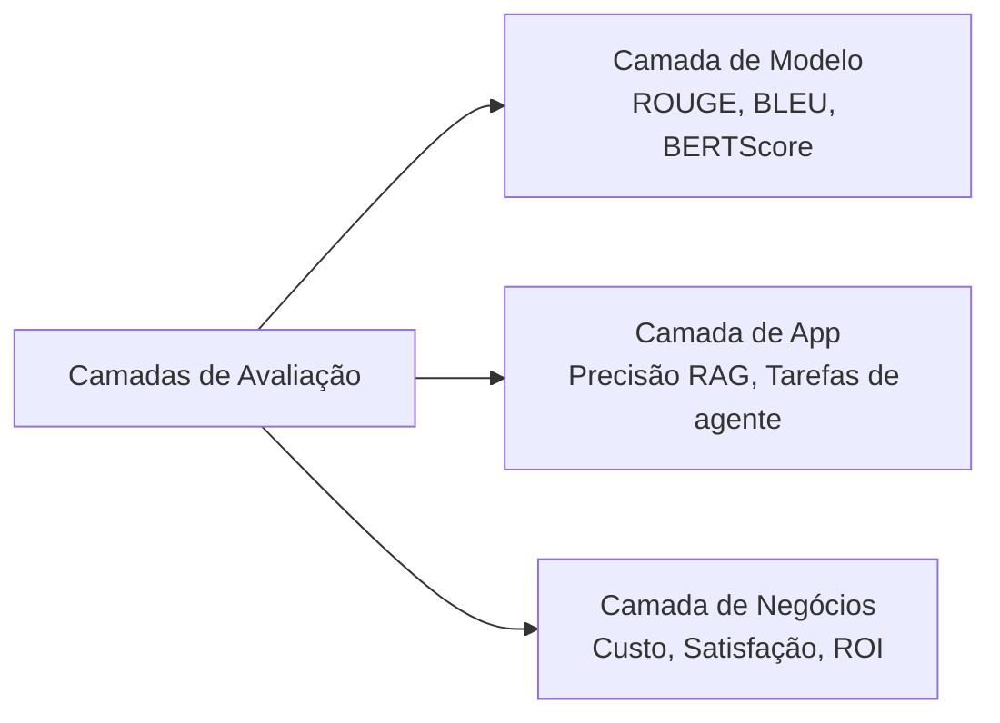

## Declaração de Tarefa 3.4: Descrever métodos para avaliar o desempenho de FMs

Lançar uma aplicação de modelo de fundação sem um plano de avaliação estruturado é o equivalente a lançar software sem testes. Um modelo pode ter bom desempenho em benchmarks genéricos, mas falhar na tarefa de negócios para a qual foi construído, ou pode atingir metas de precisão técnica enquanto os usuários silenciosamente param de se engajar com ele. Esta declaração de tarefa abrange como medir o desempenho de FM em três camadas distintas: o próprio modelo, a aplicação construída sobre ele e o resultado de negócios para o qual foi implantado.[^304001]

### 3.4.1 Abordagens para avaliar o desempenho de FM

A maioria das organizações gasta mais tempo selecionando um modelo de fundação do que avaliando se ele realmente tem desempenho adequado nos seus dados e tarefas. Essa inversão é custosa. Um modelo que passa em um placar de liderança de propósito geral ainda pode ter desempenho inferior no vocabulário especializado, comprimentos de documento ou padrões de raciocínio que os fluxos de trabalho da sua organização requerem. A avaliação deve ser tratada como uma atividade de primeira classe planejada antes da implantação, não como um diagnóstico executado depois que os problemas surgem.

Existem três abordagens complementares para avaliação de FM. A primeira usa revisores humanos para julgar saídas diretamente. A segunda usa conjuntos de dados de benchmark curados para medir o desempenho em tarefas padronizadas. A terceira usa um serviço gerenciado, o **Amazon Bedrock Model Evaluation**, para executar avaliações tanto automáticas quanto humanas dentro de um fluxo de trabalho controlado e auditável.[^304002]

A **avaliação com humano no loop** é a prática de incorporar revisores humanos qualificados no processo de avaliação para avaliar saídas do modelo em relação a critérios que as métricas automatizadas não conseguem capturar, como correção factual em tópicos proprietários, adequação de tom ou segurança.[^304003] O exame atualizou esse termo de "avaliação humana" para "avaliação com humano no loop" na v1.1 para enfatizar que os humanos não estão executando a avaliação de ponta a ponta; eles são inseridos em pontos de julgamento específicos dentro de um pipeline automatizado maior.

Três padrões comuns de humano no loop aparecem em produção:

- **Comparação lado a lado**: Duas saídas do modelo para o mesmo prompt são apresentadas a um revisor, que seleciona a melhor sem saber qual modelo produziu cada uma. Esse design remove o viés de ancoragem e produz uma classificação relativa entre versões de modelo ou entre modelos candidatos. É o formato padrão para coleta de preferências em estudos de *aprendizado por reforço com feedback humano (RLHF)*.
- **Revisão especializada**: Especialistas no assunto (médicos, advogados, engenheiros) avaliam se as saídas são factualmente corretas e adequadas ao domínio. Trabalhadores de crowdsourcing podem julgar fluência e tom; especialistas do domínio são necessários para julgar a correção em campos especializados.
- **Pontuação baseada em rubrica**: Os revisores pontuam as saídas em uma escala de 1 a 5 em dimensões definidas, como relevância, coerência, segurança e precisão de citação. A pontuação baseada em rubrica produz dados numéricos que podem ser agregados e rastreados ao longo do tempo.

O **Amazon Mechanical Turk** (para anotação de alto volume) e o **Amazon SageMaker Ground Truth** (para fluxos de trabalho de rotulagem gerenciados) podem fornecer a força de trabalho de revisores humanos para esses padrões.[^304004] O **Amazon Augmented AI (A2I)** fornece a camada de fluxo de trabalho de revisão humana para modelos hospedados no SageMaker e pipelines de inferência personalizados: ele roteia saídas de inferência para uma equipe de revisão quando condições definidas pelo desenvolvedor são atendidas, coleta avaliações e retorna os resultados.[^304005] O A2I é particularmente útil para cenários de monitoramento de produção onde um modelo lida com milhares de solicitações por dia e apenas um subconjunto amostrado requer revisão humana. O **Amazon Bedrock Model Evaluation** fornece seus próprios trabalhos de avaliação humana que podem ser configurados com uma equipe de revisores internos ou uma força de trabalho gerenciada pela AWS; esse caminho é o padrão para avaliar modelos de fundação hospedados no Bedrock e é abordado mais adiante nesta seção.

Conjuntos de dados de benchmark são coleções padronizadas de prompts e respostas de referência usados para medir o desempenho de um modelo em dimensões de capacidade específicas.[^304006] Quatro benchmarks aparecem consistentemente na literatura relevante para o exame:

- **MMLU** (*Massive Multitask Language Understanding*): 57 disciplinas acadêmicas abrangendo STEM, humanidades, direito e medicina. Testa amplitude de conhecimento geral e raciocínio.[^304007]
- **HellaSwag**: Raciocínio de senso comum e conclusão de frases. Mede se um modelo pode prever a continuação mais plausível de um cenário cotidiano.[^304008]
- **TruthfulQA**: Perguntas projetadas para investigar se um modelo produz respostas factualmente corretas sobre tópicos onde existem equívocos populares. Um modelo otimizado para plausibilidade em vez de precisão terá baixa pontuação aqui.[^304009]
- **HumanEval**: Um conjunto de problemas de programação com casos de teste, usado para medir a capacidade de geração de código de um modelo. Um modelo passa em um problema se o código que produz passa nos testes de unidade associados.[^304010]

Os benchmarks fornecem uma linha de base padronizada e reproduzível entre versões de modelo e fornecedores, mas têm uma limitação bem documentada chamada *saturação de benchmark*: modelos treinados após a publicação de um benchmark podem inadvertidamente absorver as respostas do benchmark por meio de dados de treinamento rastreados da web, inflacionando as pontuações além das melhorias reais de capacidade.[^304011] As equipes de negócios devem tratar as classificações de benchmark como uma ferramenta de filtragem, não como um veredicto final.

O **Amazon Bedrock Model Evaluation** é o serviço gerenciado da AWS para executar avaliações automáticas e humanas em modelos disponíveis por meio do Amazon Bedrock.[^304012] Ele suporta dois tipos de trabalho. Um trabalho de *avaliação automática* executa o modelo selecionado em um conjunto de dados de prompt integrado ou personalizado e pontua as respostas usando métricas como precisão, robustez e toxicidade sem exigir revisores humanos. Um trabalho de *avaliação humana* roteia saídas do modelo para uma força de trabalho de revisores, configurável como uma equipe interna ou uma força de trabalho gerenciada pela AWS, e coleta suas avaliações em critérios definidos.[^304013]

As métricas automáticas integradas no Bedrock Model Evaluation incluem precisão (para tarefas de perguntas e respostas com uma resposta de referência), robustez (medida perturbando prompts e verificando a consistência da saída) e toxicidade (pontuada por um classificador que sinaliza conteúdo prejudicial ou ofensivo).[^304014] Conjuntos de dados de prompt personalizados permitem que as organizações avaliem em suas próprias entradas representativas em vez de depender de conjuntos de dados genéricos, fechando a lacuna entre o desempenho em benchmark e o comportamento de produção.

*Figura 3.4.1: Três abordagens de avaliação de FM. Métricas automáticas, revisão com humano no loop e benchmarks padronizados cada um cobre o que os outros perdem; os programas de produção normalmente usam os três em combinação.*

### 3.4.2 Métricas relevantes para avaliar o desempenho de FM

Escolher a métrica certa depende do que o modelo está sendo solicitado a produzir. Um modelo de sumarização e um modelo de tradução produzem texto, mas a qualidade desse texto é melhor medida de formas diferentes. Um modelo que gera código é melhor medido por se o código funciona corretamente. Esta seção abrange as quatro métricas que o exame especifica: ROUGE, BLEU, BERTScore e LLM como juiz.

**ROUGE** (*Recall-Oriented Understudy for Gisting Evaluation*) mede a sobreposição entre um resumo gerado e um ou mais resumos de referência escritos por humanos.[^304015] A variante mais comum, ROUGE-L, conta a subsequência comum mais longa de palavras entre o candidato e a referência. Uma pontuação ROUGE alta significa que o modelo usou muitas das mesmas palavras que a referência escrita por humanos. O ROUGE é a métrica padrão para avaliação de sumarização porque a sumarização tem um critério claro de sucesso: as informações-chave do documento de origem devem estar presentes no resumo.

O ROUGE tem uma limitação conhecida: é uma medida lexical de nível superficial. Se o modelo produz um resumo que diz "o cliente rescindiu o acordo" enquanto a referência diz "o consumidor cancelou o contrato," as pontuações ROUGE serão baixas apesar de as duas frases serem semanticamente idênticas. Por essa razão, o ROUGE é mais confiável quando os resumos de referência são eles próprios diversos (cobrindo múltiplos fraseados válidos) e quando o corpus de avaliação é grande o suficiente para suavizar a variação de fraseado em muitos exemplos.

**BLEU** (*Bilingual Evaluation Understudy*) foi desenvolvido especificamente para tradução automática e mede *precisão*: que fração dos n-gramas (sequências de palavras) na saída candidata aparece na tradução de referência.[^304016] Ao contrário do ROUGE, que é orientado para revocação, o BLEU penaliza candidatos que produzem saídas curtas para manipular a revocação e, em seguida, adiciona uma penalidade de brevidade para descontar traduções excessivamente curtas. O BLEU permanece a métrica padrão no benchmarking de tradução automática. Sua limitação espelha a do ROUGE: recompensa a sobreposição exata em nível de palavra e não pode creditar uma tradução que use sinônimos ou reestruture frases sem mudar o significado.

**BERTScore** aborda a limitação de correspondência lexical tanto do ROUGE quanto do BLEU usando um modelo BERT pré-treinado para calcular *similaridade semântica* entre o candidato e a referência no nível do token.[^304017] Em vez de contar correspondências exatas de palavras, o BERTScore codifica ambos os textos em vetores de alta dimensão e mede a similaridade de cosseno entre tokens correspondentes. Uma frase candidata que usa palavras diferentes para expressar o mesmo significado terá pontuação mais alta no BERTScore do que no ROUGE ou BLEU. O BERTScore é mais robusto à paráfrase e está sendo cada vez mais usado em avaliação de sumarização, tradução e qualidade geral de texto, especialmente quando a diversidade de saída é esperada ou desejável.

O trade-off prático entre as três métricas é que ROUGE e BLEU são rápidos, determinísticos e não requerem chamadas de inferência adicionais, enquanto o BERTScore requer executar o codificador BERT tanto no candidato quanto na referência, adicionando custo de computação e latência. Para pipelines de avaliação automatizada em larga escala, as equipes geralmente calculam ROUGE e BLEU para velocidade e adicionam BERTScore como uma verificação secundária em um subconjunto amostrado.

**LLM como juiz** é uma abordagem mais recente, adicionada ao guia do exame v1.1, na qual um *modelo juiz* separado e de alta qualidade avalia as saídas do modelo em teste em relação a critérios definidos.[^304018] O juiz recebe um prompt que contém a pergunta original, a resposta do modelo e uma rubrica de pontuação, e retorna uma pontuação ou um julgamento de preferência comparativa. A abordagem é mais rápida e mais barata do que a avaliação humana: uma única chamada de inferência de modelo juiz substitui o tempo e o custo de um revisor humano. Também escala sem uma força de trabalho de revisores, tornando-a prática para avaliar modelos em dezenas de milhares de exemplos.

As ressalvas são reais e importam para as respostas do exame. LLM como juiz tem três vieses bem documentados.[^304019] O *viés posicional* é a tendência de favorecer qualquer candidato que apareça primeiro no prompt. O *viés de comprimento* é a tendência de pontuar respostas mais longas mais alto mesmo quando a precisão não muda. O *viés de auto-aprimoramento* é o que acontece quando um modelo é usado para julgar suas próprias saídas: ele favorece texto que se assemelha ao seu próprio estilo. Por essas razões, os pipelines de produção de LLM como juiz normalmente usam um modelo juiz diferente e geralmente maior do que o modelo sendo avaliado, rotacionam a ordem dos candidatos nas comparações lado a lado e calibram as saídas do juiz em relação a um conjunto retido de avaliações humanas.

*Tabela 3.4.1: Comparação de métricas de qualidade de saída de FM*

| Métrica | Domínio de tarefa | O que mede | Pontos fortes | Limitações |
|---|---|---|---|---|
| ROUGE | Sumarização | Revocação em nível de palavra vs. referência | Rápido, padrão, sem modelo necessário | Penaliza paráfrases válidas |
| BLEU | Tradução | Precisão em nível de palavra vs. referência | Rápido, padrão, penalidade de brevidade | Penaliza sinônimos válidos |
| BERTScore | Qualidade de texto geral | Similaridade semântica via embeddings BERT | Robusto à paráfrase | Requer inferência BERT, custo computacional |
| LLM como juiz | Qualquer tarefa generativa | Pontuação baseada em critérios por um modelo juiz | Escalável, critérios flexíveis | Viés posicional, de comprimento e de auto-aprimoramento |

*Figura 3.4.2: Seleção de métrica de qualidade de saída. Métricas lexicais são rápidas, mas superficiais; métricas semânticas toleram paráfrases; métricas baseadas em critérios são flexíveis, mas requerem controles de viés.*

### 3.4.3 Determinar se um FM atende aos objetivos de negócios

As métricas técnicas respondem à pergunta "o modelo está produzindo bom texto?" Os objetivos de negócios respondem a uma pergunta diferente: "o modelo está resolvendo o problema para o qual foi implantado?" A distinção importa porque um modelo que pontua 0,72 no ROUGE pode ou não estar melhorando a produtividade do analista. Um modelo que alcança um alto BERTScore nas respostas de atendimento ao cliente pode ou não estar reduzindo as taxas de escalonamento de tickets.

Determinar se um FM atende aos objetivos de negócios requer conectar o comportamento do modelo a resultados mensuráveis que as partes interessadas de negócios se importam. O exame identifica três categorias: produtividade, engajamento do usuário e engenharia de tarefas.

**Produtividade** mede o tempo ou esforço economizado por tarefa.[^304020] Uma equipe jurídica que usa um FM para redigir resumos de contratos deve ser capaz de relatar que cada advogado agora passa 20 minutos na revisão de resumos em vez de 90 minutos na elaboração manual. Uma equipe de ferramentas para desenvolvedores que usa um modelo de conclusão de código deve medir o throughput de pull requests ou o tempo para o primeiro commit antes e depois da adoção. As melhorias de produtividade são o caso financeiro mais direto para a implantação de FM e são melhor medidas por meio de pilotos controlados onde um grupo de tratamento usa a ferramenta com tecnologia FM e um grupo de controle não usa.

**Engajamento do usuário** abrange se os usuários realmente usam o sistema, com que profundidade interagem com ele e se retornam.[^304021] Os indicadores relevantes incluem sessões por usuário por semana, profundidade média de sessão (número de turnos antes de o usuário encerrar a conversa ou abandonar a tarefa) e taxa de retorno (a proporção de usuários que usam o sistema novamente após sua primeira sessão). Os dados de engajamento sinalizam se a aplicação de FM está resolvendo um problema que os usuários valorizam ou se estão abandonando-a após uma experiência inicial ruim. Um FM que produz saídas tecnicamente precisas, mas que é apresentado de forma confusa ou responde muito lentamente, mostrará engajamento declinante mesmo que suas pontuações ROUGE permaneçam estáveis.

**Engenharia de tarefas** é o termo do exame AWS para medir se o fluxo de trabalho com tecnologia FM realmente conclui a tarefa de negócios de ponta a ponta, sem exigir fallback humano a taxas que anulam o ganho de eficiência.[^304022] (Fora dos materiais da AWS, a mesma ideia é mais comumente chamada de *taxa de conclusão de fluxo de trabalho* ou *taxa de conclusão autônoma*.) Um bot de atendimento ao cliente que resolve 80% das consultas de forma autônoma está atingindo seu objetivo de engenharia de tarefas se a meta era 75%. Um fluxo de trabalho de revisão de documentos que exige que um humano corrija 60% dos resumos gerados pelo FM antes de arquivar não está. A engenharia de tarefas neste nível de objetivo se concentra no fluxo de trabalho conforme implantado; a seção 3.4.5 introduz a *taxa de conclusão de tarefas* como a versão em nível de meta do usuário da mesma ideia, aplicada a saber se a tarefa de negócios subjacente do usuário foi concluída.

A implicação prática para cenários de exame é que uma questão descrevendo sintomas como "os usuários não estão retornando" ou "o FM conclui o primeiro passo, mas um humano deve terminar o resto" deve direcionar seu raciocínio para métricas de engajamento e engenharia de tarefas, respectivamente, não para ROUGE ou BLEU. O modelo pode ser tecnicamente proficiente, mas falhar no nível de fluxo de trabalho.

*Figura 3.4.3: Framework de avaliação dupla. Um modelo deve passar por ambas as camadas de avaliação técnica e de negócios para ser considerado adequado para a implantação pretendida.*

### 3.4.4 Avaliar o desempenho de aplicações construídas com FM

Um modelo de fundação raramente é implantado isoladamente. As aplicações de produção sobrepõem sistemas de recuperação, orquestração de agentes e fluxos de trabalho de múltiplas etapas sobre o modelo base. Cada camada introduz seus próprios modos de falha. Avaliar apenas o modelo base deixa as falhas na camada de aplicação invisíveis até que elas surjam em reclamações de produção.

O exame identifica três arquiteturas de aplicação que cada uma requer sua própria abordagem de avaliação: pipelines RAG, agentes de IA e fluxos de trabalho de múltiplas etapas.

**A avaliação de RAG** se divide em duas preocupações independentes: qualidade de recuperação e qualidade de geração.[^304023] A qualidade de recuperação mede se o armazenamento de vetores retornou os documentos certos quando recebeu a consulta do usuário. A qualidade de geração mede se o modelo produziu uma resposta precisa e fiel dado os documentos recuperados. Uma falha em qualquer subsistema produz uma resposta ruim, mas a causa raiz e a correção são diferentes.

A qualidade de recuperação é tipicamente medida usando *precisão@k* e *revocação@k*, onde k é o número de documentos recuperados.[^304024] Precisão@k pergunta: dos k documentos recuperados, que fração era realmente relevante? Revocação@k pergunta: de todos os documentos relevantes no corpus, que fração apareceu nos k primeiros resultados? Um sistema de recuperação com alta precisão, mas baixa revocação encontra documentos confiáveis, mas perde os importantes. Um sistema com alta revocação, mas baixa precisão retorna tudo que é relevante, mas o enterra em ruído.

A qualidade de geração para RAG é medida por *ancoragem* (se a resposta do modelo é suportada pelos documentos recuperados, não inventada da memória paramétrica), *fidelidade da resposta* (se as afirmações na resposta refletem com precisão o que os documentos recuperados dizem) e *precisão de citação* (se as fontes citadas realmente contêm as informações a elas atribuídas).[^304025] Ferramentas como o **Ragas** fornecem um framework de avaliação de código aberto que calcula essas métricas automaticamente executando um modelo juiz sobre os documentos recuperados e a resposta gerada.[^304026]

**A avaliação de agentes** mede se um agente de IA conclui as tarefas atribuídas com precisão, eficiência e a um custo aceitável.[^304027] Como os agentes executam planos de múltiplas etapas usando ferramentas externas, sua superfície de avaliação é maior do que um modelo de resposta única. As métricas relevantes incluem:

- **Taxa de conclusão de tarefas**: O percentual de tarefas atribuídas que o agente conclui sem intervenção humana ou saída de estado de erro.
- **Precisão de seleção de ferramentas**: Se o agente escolheu a ferramenta correta em cada etapa (relevante quando o agente tem acesso a múltiplas APIs e a escolha certa é determinística dado a descrição da tarefa).
- **Eficiência de etapas**: O número de chamadas de ferramentas necessárias para completar uma tarefa, comparado ao número mínimo que um plano bem projetado exigiria. Contagens de etapas altas sugerem que o agente está replanejando desnecessariamente ou produzindo argumentos de ferramenta incorretos que acionam novas tentativas.
- **Custo por tarefa**: O custo total de inferência e chamadas de ferramentas necessário para completar uma tarefa. Esta é uma métrica de negócios direta para agentes que operam em escala.

O Amazon Bedrock fornece capacidades de avaliação de agentes para Bedrock Agents e agentes implantados no AgentCore, incluindo kits de teste, rastreamentos por etapa e trabalhos de avaliação integrados alinhados com as métricas de agentes acima; consulte o Guia do Usuário atual do Amazon Bedrock para obter os nomes exatos de recursos e escopo, pois a superfície de avaliação de agentes continua a evoluir.[^304028]

**A avaliação de fluxo de trabalho** se aplica a pipelines de múltiplas etapas que combinam chamadas de FM, recuperações RAG, lógica de negócios e transferências humanas em um processo de negócios completo.[^304029] As métricas incluem taxa de sucesso de ponta a ponta (que proporção de instâncias de fluxo de trabalho são concluídas sem uma saída de erro ou substituição humana forçada), distribuição de categorias de erro (qual etapa produz falhas com mais frequência) e taxa de fallback (com que frequência o fluxo de trabalho roteia para um caminho de fallback humano).

*Tabela 3.4.2: Métricas de avaliação por arquitetura de aplicação*

| Arquitetura | Métricas de recuperação | Métricas de geração | Métricas de negócios |
|---|---|---|---|
| FM base somente | Não aplicável | ROUGE, BLEU, BERTScore, LLM como juiz | Produtividade, engajamento |
| Pipeline RAG | Precisão@k, Revocação@k | Ancoragem, Fidelidade, Precisão de citação | Conclusão de tarefa, satisfação do usuário |
| Agente de IA | Precisão de seleção de ferramentas, Eficiência de etapas | Correção de resposta, Taxa de alucinação | Taxa de conclusão de tarefa, Custo por tarefa |
| Fluxo de trabalho de múltiplas etapas | Não aplicável | Distribuição de categoria de erro | Taxa de sucesso de ponta a ponta, Taxa de fallback |

*Figura 3.4.4: Arquitetura de avaliação em camadas. Cada camada da pilha de aplicação requer sua própria abordagem de avaliação; falhas em qualquer camada afetam o resultado de negócios.*

### 3.4.5 Métricas de alinhamento de objetivos de negócios para aplicações de IA

As métricas na seção 3.4.2 informam se o modelo está tendo bom desempenho tecnicamente. As métricas na seção 3.4.4 informam se a aplicação está funcionando corretamente. As métricas de alinhamento de objetivos de negócios respondem à pergunta que o executivo patrocinador realmente se preocupa: este investimento em IA está entregando valor?

O guia do exame v1.1 adicionou isso como um objetivo distinto, sinalizando que o exame espera que os candidatos entendam a lacuna entre a medição técnica e a responsabilidade de negócios e conheçam quais instrumentos fecham essa lacuna.

**A taxa de conclusão de tarefas** é o percentual de tarefas iniciadas pelo usuário que a aplicação de IA conclui com sucesso sem exigir que o usuário abandone a tarefa, busque ajuda de outro canal ou escalone para um agente humano.[^304030] Ela é distinta da taxa de conclusão de tarefas de agentes (seção 3.4.4) em escopo: a conclusão de tarefas de agentes mede se a camada de orquestração terminou seu plano, enquanto a conclusão de tarefas de negócios mede se o objetivo subjacente do usuário foi atendido. Um usuário que pediu à IA para reservar uma sala de conferências, recebeu uma confirmação, mas depois descobriu que a sala já estava ocupada não experimentou uma tarefa concluída do ponto de vista de negócios, mesmo que todas as chamadas de API do agente tenham retornado códigos de sucesso.

A taxa de conclusão de tarefas é a única métrica que conecta mais diretamente o comportamento da aplicação FM ao caso de negócios para implantação. Se a aplicação foi implantada para reduzir o número de tickets de suporte que chegam a um agente humano, a taxa de conclusão de tarefas mede exatamente com que eficiência ela está atingindo esse objetivo. Para cenários de exame, a taxa de conclusão de tarefas é a MELHOR resposta quando a questão pergunta como medir se uma aplicação de IA está atendendo ao seu objetivo de negócios principal.

**A satisfação do usuário** captura como os usuários percebem a qualidade de suas interações com a aplicação de IA.[^304031] Os instrumentos comuns incluem pesquisas pós-interação (*CSAT*, a Pontuação de Satisfação do Cliente, onde os usuários classificam sua experiência em uma escala numérica), *NPS* (Net Promoter Score, que pergunta se o usuário recomendaria a aplicação a um colega) e feedback no produto (avaliações de positivo/negativo coletadas no final de cada resposta). Ao contrário da taxa de conclusão de tarefas, que é uma medida objetiva do que aconteceu, a satisfação do usuário é uma medida subjetiva de como o usuário se sentiu sobre isso. Ambas são necessárias. Um assistente de relatório de despesas que resolve submissões em dois cliques, mas usa um tom brusco, pode ver o CSAT cair abaixo de 3,5 mesmo quando sua taxa de conclusão de tarefas permanece acima de 90 por cento; os usuários procurarão uma ferramenta diferente quando uma estiver disponível.

**O custo por interação** mede o custo total de nuvem e licenciamento incorrido para atender a uma solicitação de usuário por toda a pilha de aplicação, desde a chamada de API até a etapa de recuperação (se presente) até a chamada de inferência de FM e qualquer processamento downstream.[^304032] Em um pipeline RAG, o custo por interação inclui a chamada ao modelo de embedding, a operação de busca vetorial e a chamada de geração do FM. Em um fluxo de trabalho de agente, inclui cada etapa de chamada de ferramenta e inferência no plano. O custo por interação deve ser rastreado em relação à receita ou valor por interação para determinar se a economia unitária da aplicação é viável em escala. Uma aplicação que custa US$ 0,05 por interação e gera US$ 0,10 de valor medido (por meio de economias de desvio de tickets, por exemplo) é sustentável. Uma que custa US$ 0,08 por interação pelo mesmo valor de US$ 0,10 deixa pouca margem para flexibilidade de infraestrutura.

Rastrear essas métricas requer conectar a telemetria da aplicação de IA a uma camada de inteligência de negócios. O **Amazon CloudWatch** coleta métricas operacionais, logs e rastreamentos do Amazon Bedrock e do código do aplicativo, incluindo latência, taxas de erro e contagens de invocação por modelo.[^304033] Esses sinais operacionais podem ser combinados com eventos da camada de aplicação (tarefa concluída, usuário deu feedback negativo, custo de interação registrado) para construir um quadro completo. O **Amazon QuickSight** se conecta a dados do CloudWatch e a outras fontes de dados para produzir dashboards que apresentam taxa de conclusão de tarefas, tendências de satisfação do usuário e custo por interação em formatos acessíveis para partes interessadas de negócios que não leem gráficos de métricas do CloudWatch diretamente.[^304034]

*Tabela 3.4.3: Métricas de alinhamento de negócios para aplicações de IA*

| Métrica | O que mede | Fonte de dados | Parte interessada | Decisão que informa |
|---|---|---|---|---|
| Taxa de conclusão de tarefas | Se os objetivos do usuário são atendidos | Logs de eventos da aplicação | Produto, Operações | Ajustar escopo ou lógica de fallback |
| Satisfação do usuário (CSAT, NPS) | Percepção do usuário sobre a qualidade | Pesquisas pós-interação, feedback de polegar | Produto, CX | Melhorar qualidade de resposta ou UX |
| Custo por interação | Economia unitária da entrega de IA | Dados de faturamento e invocação do CloudWatch | Finanças, Engenharia | Otimizar tier de modelo, cache ou fluxo de trabalho |

Um programa de avaliação bem projetado monitora todas as três métricas de negócios continuamente, não apenas no lançamento. A taxa de conclusão de tarefas pode diminuir à medida que as consultas dos usuários se desviam dos padrões para os quais o modelo foi testado. A satisfação do usuário pode diminuir à medida que a novidade desaparece e os usuários comparam a IA com alternativas melhoradas. O custo por interação pode aumentar se os padrões de uso mudarem para consultas mais longas e complexas. A revisão regular de todas as três métricas em relação a limites definidos é a disciplina operacional que distingue um produto de IA gerenciado de um protótipo que foi enviado e esquecido.

## Perguntas de verificação de conhecimento

**Questão 1.** Uma organização de saúde está implantando uma ferramenta com tecnologia FM que ajuda enfermeiros a recuperar informações de protocolos clínicos. Antes de entrar em produção, a equipe quer verificar se o modelo produz respostas factualmente precisas e adequadas ao domínio sobre vocabulário médico especializado. Qual abordagem de avaliação é MAIS adequada para esse requisito?

A. Executar o modelo no benchmark MMLU e aceitá-lo se a pontuação exceder 70%
B. Usar o Amazon Bedrock Model Evaluation com um trabalho automático de detecção de toxicidade
C. Usar o Amazon Augmented AI (A2I) para rotear saídas do modelo para especialistas clínicos para pontuação baseada em rubrica
D. Calcular pontuações BLEU em relação a um conjunto de resumos clínicos de referência

**Explicação:** A restrição-chave neste cenário é a correção factual específica do domínio avaliada por pessoas que podem julgar se uma resposta médica é clinicamente precisa. Trabalhadores de crowdsourcing e métricas automatizadas não podem fazer esse julgamento. A resposta C é correta: o Amazon A2I suporta fluxos de trabalho de avaliação com humano no loop que podem rotear saídas para um pool definido de revisores, como um painel de enfermeiros ou médicos clínicos, que avaliam as respostas em uma rubrica cobrindo precisão, clareza e adequação. A resposta A está errada porque o MMLU é um benchmark acadêmico geral; pontuar 70% em 57 disciplinas acadêmicas não informa se o modelo lida corretamente com consultas de protocolo clínico, e o limiar não tem relação com os requisitos de segurança clínica. A resposta B está errada porque um trabalho de toxicidade mede se o modelo produz conteúdo prejudicial ou ofensivo; ele não avalia a precisão clínica. A resposta D está errada porque o BLEU mede a precisão em nível de palavra em relação a um texto de referência e não capturaria se as informações clínicas transmitidas estão corretas; uma resposta que soa plausível, mas é factualmente errada, pode ter boa pontuação no BLEU se compartilhar vocabulário com a referência.[^304035]

---

**Questão 2.** Uma organização está comparando dois modelos de fundação para uma tarefa de sumarização de notícias. Ambos os modelos produzem inglês fluente. A equipe de avaliação tem um conjunto de 500 resumos de referência escritos por humanos para os mesmos artigos. Qual métrica é MAIS adequada como sinal de avaliação principal para essa tarefa?

A. BERTScore, porque mede similaridade semântica e tolera paráfrases
B. BLEU, porque foi projetado para avaliar geração de texto em relação a referências
C. ROUGE, porque foi projetado especificamente para sumarização e mede a revocação de conteúdo-chave
D. LLM como juiz, porque um modelo juiz pode pontuar coerência sem um resumo de referência

**Explicação:** O ROUGE (resposta C) foi desenvolvido especificamente para avaliação de sumarização e seu design reflete o requisito central dessa tarefa: um bom resumo deve conter as informações-chave do documento de origem, que é um problema de revocação. O ROUGE-L, a variante mais comum, mede a subsequência comum mais longa de palavras entre o candidato e a referência, recompensando resumos que cobrem os pontos principais em qualquer ordem. A resposta A é tecnicamente válida como uma métrica secundária, mas o BERTScore requer executar um codificador BERT em cada par candidato-referência, adicionando custo computacional; é mais valioso quando os resumos de referência usam vocabulário variado e a sobreposição lexical penalizaria injustamente paráfrases válidas. Se a organização quiser adicionar robustez semântica à avaliação, o BERTScore é um complemento adequado, não um substituto. A resposta B está errada porque o BLEU é uma métrica orientada a precisão projetada para tradução, onde o fraseado exato do idioma alvo importa; a sumarização prioriza a revocação do conteúdo em vez da precisão do fraseado. A resposta D está errada porque o LLM como juiz é mais valioso quando não há resumo de referência e um julgamento ao estilo humano é necessário; quando 500 resumos de referência estão disponíveis, as métricas baseadas em referência são o sinal primário mais confiável e reproduzível.[^304036]

---

**Questão 3.** Uma empresa implantou uma ferramenta de perguntas e respostas interna com tecnologia RAG há três meses. Os usuários relatam que a ferramenta frequentemente dá respostas que parecem confiantes, mas contêm informações não encontradas nos documentos da empresa. Qual métrica de avaliação MAIS diretamente identifica esse modo de falha?

A. Pontuação ROUGE-L em relação a respostas de referência escritas por humanos
B. Pontuação de ancoragem medindo se as respostas são suportadas pelos documentos recuperados
C. Precisão@k medindo se os principais documentos recuperados são relevantes
D. Taxa de conclusão de tarefas medindo se os usuários acham a ferramenta útil

**Explicação:** O sintoma descrito (respostas confiantes que contêm informações que não estão nos documentos de origem) é a definição de baixa *ancoragem*: o modelo está gerando conteúdo de sua memória paramétrica em vez dos documentos recuperados. A resposta B é correta. A ancoragem é avaliada verificando cada afirmação na resposta gerada em relação ao conjunto de documentos recuperados e pontuando que fração de afirmações é suportada por pelo menos um documento recuperado. Ferramentas como o Ragas calculam essa métrica automaticamente. A resposta A está errada porque o ROUGE-L mede a sobreposição de palavras com uma resposta de referência humana; ele não detectaria conteúdo alucinado que usa palavras plausíveis que não estão na referência. A resposta C está errada porque a precisão@k mede a qualidade da recuperação, não da geração; um sistema de recuperação poderia estar retornando documentos altamente relevantes enquanto o modelo ainda os ignora e gera a partir da memória paramétrica. A resposta D está errada porque a taxa de conclusão de tarefas mede se o objetivo do usuário foi atendido; o sintoma descrito pode estar causando baixa satisfação sem acionar o caminho formal de falha de tarefa que o aplicativo rastreia.[^304037]

---

**Questão 4.** Um gerente de produto de IA está apresentando o caso de negócios para uma aplicação de chat de suporte ao cliente com tecnologia FM ao CFO. O CFO pede uma única métrica que mostre se a aplicação é financeiramente sustentável em escala. Qual métrica MELHOR responde a essa pergunta?

A. Pontuação BLEU no corpus de respostas de suporte
B. Profundidade média de sessão por usuário
C. Custo por interação comparado ao valor entregue por interação
D. Taxa de fallback para agentes humanos

**Explicação:** A pergunta do CFO é sobre economia unitária: cada interação entrega valor que justifica seu custo? O custo por interação (resposta C) mede a despesa total de nuvem e licenciamento para cada solicitação do usuário por toda a pilha do aplicativo. Quando comparado ao valor medido por interação (por exemplo, o custo médio de um agente humano lidando com a mesma solicitação), ele estabelece se o aplicativo é financeiramente viável na escala atual e projetada. A resposta A está errada porque o BLEU é uma métrica de qualidade de texto; ele não tem relação com custo ou sustentabilidade financeira. A resposta B (profundidade de sessão) é uma métrica de engajamento que sinaliza se os usuários acham a aplicação valiosa, mas não diz ao CFO nada sobre a estrutura de custos. A resposta D (taxa de fallback) é uma métrica operacional útil que contribui para a compreensão da economia, pois cada fallback para um agente humano incorre no custo humano total em vez do custo de IA, mas é uma entrada de componente para a imagem financeira, não a visão completa de economia unitária que o CFO está pedindo. O custo por interação, comparado diretamente ao valor por interação, é a métrica que responde à pergunta do CFO.[^304038]

---

**Questão 5.** Uma equipe está avaliando uma nova versão de FM para substituir o modelo de produção atual. Eles querem determinar se o novo modelo produz saídas que os revisores humanos preferem, sem exigir que os revisores saibam qual modelo produziu cada resposta. Qual abordagem de avaliação MAIS diretamente atende a esse requisito?

A. Executar ambos os modelos no benchmark TruthfulQA e comparar classificações percentis
B. Usar LLM como juiz com o modelo de produção atual como modelo juiz
C. Usar comparação humana lado a lado com identidades de revisores cegas para a identidade do modelo
D. Calcular BERTScore para ambos os modelos em relação ao mesmo conjunto de saídas de referência

**Explicação:** O requisito tem duas partes: julgamento de preferência humana e cegamento (os revisores não devem saber qual modelo produziu qual saída). A resposta C é o padrão de avaliação com humano no loop projetado especificamente para esse caso de uso. A comparação lado a lado apresenta duas saídas ao revisor para o mesmo prompt, o revisor seleciona a saída preferida e o design previne o viés de ancoragem ao não rotular qual modelo produziu cada uma. Isso produz diretamente uma classificação de preferência entre as duas versões de modelo. A resposta A está errada porque o TruthfulQA é um benchmark para precisão factual em tópicos propensos a equívocos; ele não mede a preferência geral de qualidade de saída, e a questão não menciona a precisão factual como critério. A resposta B está errada de uma forma sutil, mas importante: usar o modelo de produção atual como modelo juiz introduz viés de auto-aprimoramento; o modelo atual tenderá a classificar as saídas semelhantes ao seu próprio estilo mais alto, tornando a comparação injusta para o novo modelo. A resposta D está errada porque o BERTScore calcula a similaridade semântica em relação a textos de referência, não a preferência humana entre duas saídas candidatas; ele não captura o julgamento qualitativo que a equipe está buscando.[^304039]

---

**Questão 6.** Uma organização lançou um assistente de compras com tecnologia FM há seis semanas. Os dados de uso mostram que 45% dos usuários que experimentam o assistente não retornam após sua primeira sessão. As pontuações ROUGE do modelo nos testes de sumarização estão no quartil superior para sua família de modelos. Qual métrica de negócios MAIS diretamente diagnostica se esse problema de engajamento deriva da qualidade de saída do modelo ou do design da aplicação?

A. Satisfação do usuário (CSAT ou feedback de polegar) coletada imediatamente após cada interação
B. BERTScore calculado em relação a um conjunto de respostas de referência para consultas de compras
C. Taxa de conclusão de tarefas medida pelo log de eventos da aplicação
D. Precisão@k para a camada de recuperação RAG

**Explicação:** O cenário apresenta uma dissociação: as pontuações ROUGE são fortes (sugerindo que o modelo produz texto com boa sobreposição com as referências), mas a taxa de retorno é baixa (sugerindo que os usuários não estão encontrando a aplicação valiosa o suficiente para usar novamente). Para diagnosticar se o problema é qualidade de saída ou design de aplicação, a organização precisa de um sinal de usuários reais refletindo sua experiência subjetiva, não um sinal de métricas automatizadas de sobreposição de texto. A satisfação do usuário coletada imediatamente após cada interação (resposta A) captura se os usuários acharam a resposta útil, precisa e entregue de uma maneira que os faria querer retornar. Um padrão de CSAT baixo apesar de alto ROUGE indicaria que os resumos de referência usados para avaliação ROUGE não refletem o que os usuários realmente valorizam no contexto de compras, apontando para um problema de qualidade de saída ou de framing. Um padrão de CSAT moderado com baixa taxa de retorno apontaria para fatores de design de aplicação (UX, velocidade, confiança) em vez do modelo em si. A resposta B está errada porque o BERTScore é outra métrica automatizada de qualidade de texto que, como o ROUGE, mede a similaridade com referências; não explicaria a lacuna entre as pontuações técnicas e o comportamento do usuário. A taxa de conclusão de tarefas (resposta C) diria se o fluxo de trabalho terminou, mas neste cenário o fluxo de trabalho já produz pontuações técnicas fortes; o sinal ausente é o julgamento subjetivo do usuário sobre essa interação concluída, que apenas o CSAT ou feedback de polegar captura. A resposta D está errada porque a precisão@k diagnostica a qualidade da recuperação; embora a recuperação ruim possa contribuir para respostas ruins, seria uma etapa de investigação secundária após estabelecer dados de satisfação do usuário.[^304040]

[^304001]: AWS Certification. AI Practitioner (AIF-C01) Exam Guide v1.1, Task Statement 3.4. URL: <https://docs.aws.amazon.com/aws-certification/latest/ai-practitioner-01/ai-practitioner-01-domain3.html>
[^304002]: Amazon Bedrock. Amazon Bedrock Model Evaluation overview. URL: <https://docs.aws.amazon.com/bedrock/latest/userguide/model-evaluation.html>
[^304003]: Amazon A2I. How Amazon Augmented AI works. URL: <https://docs.aws.amazon.com/sagemaker/latest/dg/a2i-how-it-works.html>
[^304004]: Amazon SageMaker. Amazon SageMaker Ground Truth labeling workflows. URL: <https://docs.aws.amazon.com/sagemaker/latest/dg/sms.html>
[^304005]: Amazon A2I. Use Amazon Augmented AI for human review. URL: <https://docs.aws.amazon.com/sagemaker/latest/dg/a2i-use-augmented-ai-a2i-human-review-loops.html>
[^304006]: Liang, P., et al. Holistic Evaluation of Language Models (HELM, 2022). URL: <https://arxiv.org/abs/2211.09110>
[^304007]: Hendrycks, D., et al. Measuring Massive Multitask Language Understanding (MMLU, 2020). URL: <https://arxiv.org/abs/2009.03300>
[^304008]: Zellers, R., et al. HellaSwag: Can a Machine Really Finish Your Sentence? (2019). URL: <https://arxiv.org/abs/1905.07830>
[^304009]: Lin, S., et al. TruthfulQA: Measuring How Models Mimic Human Falsehoods (2021). URL: <https://arxiv.org/abs/2109.07958>
[^304010]: Chen, M., et al. Evaluating Large Language Models Trained on Code (HumanEval, 2021). URL: <https://arxiv.org/abs/2107.03374>
[^304011]: Kiela, D., et al. Dynabench: Rethinking Benchmarking in NLP (2021). URL: <https://arxiv.org/abs/2104.14337>
[^304012]: Amazon Bedrock. Amazon Bedrock Model Evaluation jobs. URL: <https://docs.aws.amazon.com/bedrock/latest/userguide/model-evaluation-jobs.html>
[^304013]: Amazon Bedrock. Human evaluation using Amazon Bedrock Model Evaluation. URL: <https://docs.aws.amazon.com/bedrock/latest/userguide/model-evaluation-human.html>
[^304014]: Amazon Bedrock. Automatic evaluation metrics in Amazon Bedrock Model Evaluation. URL: <https://docs.aws.amazon.com/bedrock/latest/userguide/model-evaluation-automatic.html>
[^304015]: Lin, C.-Y. ROUGE: A Package for Automatic Evaluation of Summaries (2004). URL: <https://aclanthology.org/W04-1013>
[^304016]: Papineni, K., et al. BLEU: a Method for Automatic Evaluation of Machine Translation (2002). URL: <https://aclanthology.org/P02-1040>
[^304017]: Zhang, T., et al. BERTScore: Evaluating Text Generation with BERT (2019). URL: <https://arxiv.org/abs/1904.09675>
[^304018]: Zheng, L., et al. Judging LLM-as-a-Judge with MT-Bench and Chatbot Arena (2023). URL: <https://arxiv.org/abs/2306.05685>
[^304019]: Wang, P., et al. Large Language Models are not Fair Evaluators (2023). URL: <https://arxiv.org/abs/2305.17926>
[^304020]: Microsoft Research. The Total Economic Impact of GitHub Copilot (2023). URL: <https://resources.github.com/downloads/The-Total-Economic-Impact-of-GitHub-Copilot.pdf>
[^304021]: Amazon CloudWatch. Using Amazon CloudWatch to track user engagement metrics for AI applications. URL: <https://docs.aws.amazon.com/AmazonCloudWatch/latest/monitoring/working_with_metrics.html>
[^304022]: Amazon Bedrock. Evaluating agent task completion in Amazon Bedrock. URL: <https://docs.aws.amazon.com/bedrock/latest/userguide/agents-evaluation.html>
[^304023]: Es, S., et al. RAGAS: Automated Evaluation of Retrieval Augmented Generation (2023). URL: <https://arxiv.org/abs/2309.15217>
[^304024]: Manning, C., et al. Introduction to Information Retrieval: Precision and Recall at k (2008). URL: <https://nlp.stanford.edu/IR-book/>
[^304025]: Es, S., et al. RAGAS: Faithfulness and Answer Relevance Metrics (2023). URL: <https://arxiv.org/abs/2309.15217>
[^304026]: Ragas. Ragas: Evaluation framework for RAG pipelines. URL: <https://docs.ragas.io/>
[^304027]: Amazon Bedrock. Evaluating Amazon Bedrock Agents. URL: <https://docs.aws.amazon.com/bedrock/latest/userguide/agents-evaluation.html>
[^304028]: Amazon Bedrock User Guide. Evaluation capabilities for Bedrock Agents and AgentCore. URL: <https://docs.aws.amazon.com/bedrock/latest/userguide/agents.html>
[^304029]: Amazon Bedrock. Multi-step workflow evaluation with Amazon Bedrock. URL: <https://docs.aws.amazon.com/bedrock/latest/userguide/agents-test.html>
[^304030]: Amazon Bedrock. Measuring task completion in Amazon Bedrock application monitoring. URL: <https://docs.aws.amazon.com/bedrock/latest/userguide/model-evaluation.html>
[^304031]: Amazon Connect. Customer satisfaction scoring and AI contact center metrics. URL: <https://docs.aws.amazon.com/connect/latest/adminguide/metrics-definitions.html>
[^304032]: Amazon Bedrock. Monitoring Amazon Bedrock usage and costs with AWS Cost Explorer. URL: <https://docs.aws.amazon.com/bedrock/latest/userguide/monitoring-overview.html>
[^304033]: Amazon CloudWatch. Monitoring Amazon Bedrock with Amazon CloudWatch. URL: <https://docs.aws.amazon.com/bedrock/latest/userguide/monitoring-cloudwatch.html>
[^304034]: Amazon QuickSight. Getting started with Amazon QuickSight dashboards. URL: <https://docs.aws.amazon.com/quicksight/latest/user/getting-started.html>
[^304035]: Amazon A2I. Setting up a human review workflow with Amazon Augmented AI. URL: <https://docs.aws.amazon.com/sagemaker/latest/dg/a2i-create-flow-definition.html>
[^304036]: Lin, C.-Y. ROUGE: A Package for Automatic Evaluation of Summaries: task applicability (2004). URL: <https://aclanthology.org/W04-1013>
[^304037]: Es, S., et al. RAGAS: Groundedness evaluation for RAG pipelines (2023). URL: <https://arxiv.org/abs/2309.15217>
[^304038]: Amazon Bedrock. Tracking Amazon Bedrock invocation costs per application. URL: <https://docs.aws.amazon.com/bedrock/latest/userguide/monitoring-overview.html>
[^304039]: Zheng, L., et al. Judging LLM-as-a-Judge: bias characteristics and mitigations (2023). URL: <https://arxiv.org/abs/2306.05685>
[^304040]: Amazon CloudWatch. Collecting user feedback events in AI application telemetry. URL: <https://docs.aws.amazon.com/AmazonCloudWatch/latest/monitoring/working_with_metrics.html>
