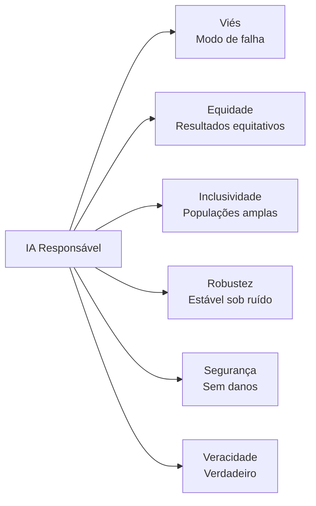
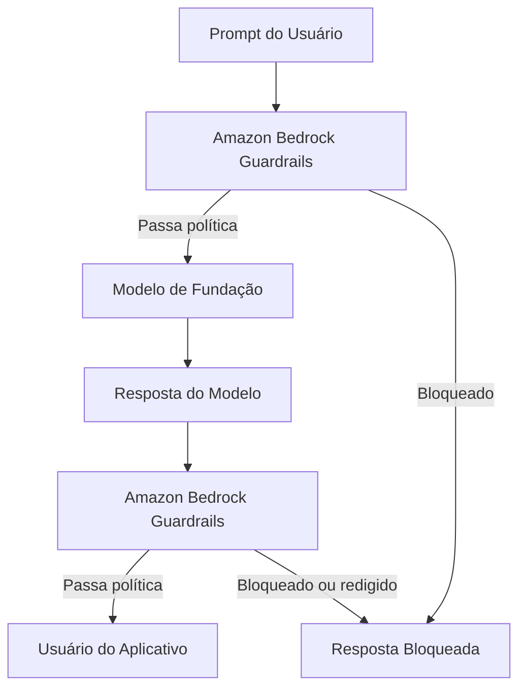
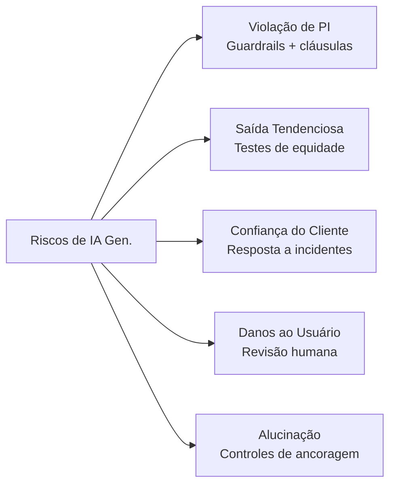
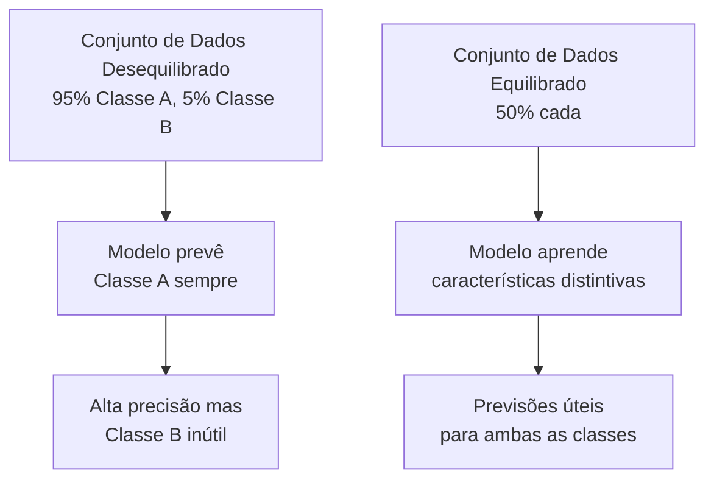
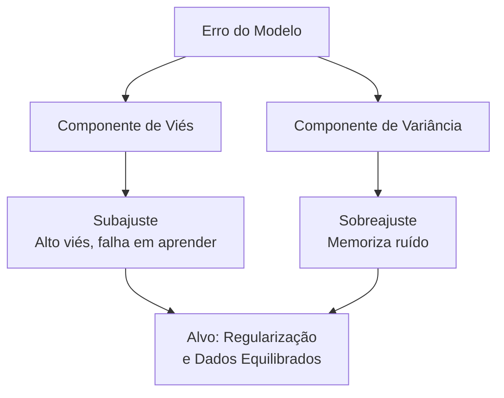

## Declaração de Tarefa 4.1: Explicar o desenvolvimento de sistemas de IA responsáveis

A IA responsável é um conjunto de compromissos de engenharia e governança que determinam se um sistema de IA produz saídas que são justas, precisas e seguras para toda a gama de pessoas que afetará. Este capítulo abrange os sete objetivos da Declaração de Tarefa 4.1: as características definidoras da IA responsável, as ferramentas da AWS que impõem e detectam essas características, as práticas responsáveis para seleção de modelo, os riscos legais exclusivos da IA generativa, as características do conjunto de dados que suportam sistemas responsáveis, a mecânica do viés e da variância, e as ferramentas de monitoramento que sustentam o comportamento responsável em produção.[^401001]

### 4.1.1 Características da IA responsável

Um sistema de IA descrito como "responsável" não é responsável de forma abstrata. A responsabilidade é expressa por meio de cinco propriedades concretas e testáveis (equidade, inclusividade, robustez, segurança e veracidade), cada uma definida em oposição a um modo de falha específico como viés, exclusão, fragilidade, dano ou alucinação. O *viés* é o modo de falha que a equidade aborda, e o guia do exame AIF-C01 v1.1 lista "viés" junto com as cinco propriedades positivas porque o viés é o padrão de falha mais testado em questões de cenário; neste livro abordamos todos os seis juntos para que o pareamento modo-de-falha-com-propriedade seja explícito.

As propriedades são distintas, mas relacionadas. Um sistema pode falhar em uma enquanto passa nas outras. Um modelo de decisão de empréstimos pode ser robusto contra entradas ruidosas e, ao mesmo tempo, sistematicamente injusto para um grupo demográfico protegido. Um chatbot de conselhos médicos pode ser seguro e inclusivo, mas frequentemente impreciso. As questões do exame testam se os candidatos podem nomear e distinguir essas propriedades, portanto, cada definição importa por si só.[^401002] O Framework de Gerenciamento de Risco de IA do NIST agrupa essas propriedades sob o que chama de "características de confiabilidade," e os candidatos ao exame que reconhecem essa estrutura responderão às questões de cenário com mais precisão.[^401050]

As propriedades são:

- **Viés** (o modo de falha que a equidade aborda): Uma distorção sistemática nas previsões de um modelo que consistentemente favorece ou penaliza um grupo específico. Por exemplo, um modelo de triagem de currículos treinado principalmente em contratações históricas de uma indústria dominada por homens pode classificar currículos idênticos mais baixo quando um nome feminino aparece no topo. O viés nesse sentido não é erro aleatório; é um erro previsível e direcional que concentra danos em populações específicas.[^401003]
- **Equidade**: Tratamento consistente de indivíduos em grupos demográficos. Um modelo de concessão de crédito é justo se aplicar os mesmos critérios de decisão independentemente da raça, gênero ou idade do solicitante. A equidade é frequentemente medida numericamente, por exemplo, comparando taxas de aprovação ou taxas de falso positivo entre grupos para garantir que nenhum grupo seja desproporcionalmente desfavorecido.[^401004]
- **Inclusividade**: O modelo funciona bem para um amplo conjunto de usuários, incluindo aqueles que podem estar sub-representados nos dados de treinamento. Um modelo de reconhecimento de imagem construído principalmente em fotos de rostos de pele mais clara pode ter desempenho ruim para usuários de pele mais escura. A *inclusividade* aborda essa lacuna de cobertura garantindo que o modelo foi treinado e testado em toda a população que irá atender.[^401005]
- **Robustez**: Comportamento elegante e previsível sob entradas inesperadas ou adversariais. Um chatbot de atendimento ao cliente não deve retornar conteúdo prejudicial quando um usuário enviar uma consulta com erros ortográficos, e um modelo de detecção de fraudes não deve colapsar em precisão quando os volumes de transação aumentarem inesperadamente. A robustez mede o quão bem um sistema mantém seu comportamento pretendido nas bordas de sua distribuição de entrada.[^401006]
- **Segurança**: O modelo não causa danos aos usuários, terceiros ou à sociedade. A segurança abrange riscos físicos (um modelo que controla maquinaria), riscos informacionais (um modelo que fornece conselhos médicos perigosos sem advertências) e riscos sistêmicos (um modelo que amplifica desinformação em escala). Os reguladores da UE categorizam explicitamente os sistemas de IA por nível de risco de segurança e anexam obrigações legais a cada categoria.[^401007]
- **Veracidade**: O modelo produz saídas que são verdadeiras e factualmente fundamentadas. Isso é particularmente importante para grandes modelos de linguagem que podem gerar texto de tom confiante sobre tópicos onde os dados de treinamento são escassos, incompletos ou desatualizados. As *alucinações* são a falha canônica de veracidade: um modelo fabrica uma citação, uma estatística ou uma pessoa e a apresenta como fato.[^401008]

*Figura 4.1.1: As propriedades de IA responsável listadas no exame. O viés é o modo de falha que as outras cinco propriedades positivas são projetadas para prevenir.*

Essas propriedades não existem isoladamente. Um conjunto de dados que carece de diversidade demográfica (baixa inclusividade no nível de dados) produzirá previsões tendenciosas (a falha de viés) e criará resultados injustos (falhando na propriedade de equidade). As propriedades se reforçam mutuamente quando atendidas e compõem falhas quando violadas; a mesma lacuna no conjunto de dados pode simultaneamente acionar viés, injustiça e falta de inclusividade.[^401051]

### 4.1.2 Ferramentas para identificar características de IA responsável

Conhecer as seis propriedades de IA responsável é útil apenas se houver mecanismos práticos para aplicá-las no nível do sistema. A AWS fornece duas ferramentas principais para isso: o **Amazon Bedrock Guardrails** para aplicações de IA generativa e o **Amazon SageMaker Clarify** para modelos de aprendizado de máquina clássicos. Cada uma tem como alvo um ponto diferente no pipeline de IA e um tipo diferente de risco.[^401009]

O **Amazon Bedrock Guardrails** aplica uma camada de política configurável entre um aplicativo e qualquer modelo de fundação acessado por meio do Amazon Bedrock. Quando um usuário envia um prompt ou quando o modelo retorna uma resposta, o Guardrails avalia o conteúdo em relação à política configurada e o permite passar, o modifica ou o bloqueia completamente. Isso acontece de forma transparente para o modelo subjacente, o que significa que o mesmo guardrail pode proteger vários modelos sem alterar o próprio modelo.[^401010]

O Guardrails agrupa seus controles em vários tipos de filtro:

- **Filtros de conteúdo**: Bloqueiam ou redigem conteúdo em cinco categorias de dano predefinidas: *ódio*, *insultos*, *sexual*, *violência* e *má conduta*. Cada categoria pode ser definida com um limiar de baixo a alto dependendo da sensibilidade do aplicativo. Uma plataforma de educação infantil definiria todos os limiares para restrição máxima; uma ferramenta de pesquisa de segurança cibernética pode permitir mais conteúdo técnico.[^401011]
- **Filtro de ataque de prompt**: Um detector separado para padrões de jailbreak e injeção de prompt na entrada do usuário, distinto das categorias de dano acima. Esta é a política que captura tentativas de substituir o prompt de sistema ou ignorar regras de conteúdo.
- **Filtros de tópico**: Listas de negação de tópicos que o aplicativo não deve discutir. Uma empresa de serviços financeiros pode configurar o Guardrails para recusar qualquer resposta que forneça conselhos específicos de investimento, redirecionando essas consultas para um consultor licenciado. A empresa define o que conta como um tópico negado usando descrições em linguagem simples, e o Guardrails usa correspondência semântica para interceptar consultas relacionadas, mesmo quando formuladas de forma diferente.[^401012]
- **Filtros de palavras**: Bloqueiam palavras ou frases específicas independentemente do contexto, incluindo uma lista integrada de profanidade que pode ser habilitada sem configuração personalizada. Essa camada lida com palavrões, nomes de marcas de concorrentes ou nomes de código internos que não devem aparecer em respostas voltadas ao cliente.[^401013]
- **Filtros de informações sensíveis**: Detectam informações de identificação pessoal como nomes, números de telefone, endereços de e-mail, números de seguro social e números de cartão de crédito. O filtro pode bloquear a solicitação ou redigir o valor detectado com um marcador de posição antes que a resposta chegue ao usuário, ajudando as organizações a atender aos requisitos de minimização de dados sob regulamentações de privacidade.[^401014][^401016]
- **Verificações de ancoragem contextual**: Avaliam se a resposta de um modelo é fundamentada nos documentos de origem fornecidos a ele (para aplicações de geração aumentada por recuperação) e se a resposta é relevante para a consulta do usuário. Este é o principal controle de veracidade no Guardrails: ele atribui uma pontuação de ancoragem e uma pontuação de relevância e pode bloquear respostas que ficam abaixo dos limiares configuráveis.[^401015]

No nível conceitual, uma política do Guardrails é lida como um conjunto estruturado de regras: "Bloquear discurso de ódio no limiar ALTO. Negar tópicos relacionados a conselhos de investimento. Redigir qualquer endereço de e-mail nas respostas. Exigir uma pontuação de ancoragem de pelo menos 0,75 para respostas de recuperação." Um arquiteto configura essas regras uma vez e anexa o guardrail a qualquer chamada de inferência feita por meio do Bedrock.[^401053] O Guardrails suporta avaliação independente tanto do prompt de entrada do usuário quanto da resposta de saída do modelo, portanto, um único guardrail pode parar uma consulta prejudicial antes que chegue ao modelo ou bloquear uma resposta prejudicial antes que chegue ao usuário.[^401054]

O **Amazon SageMaker Clarify** aborda o viés em modelos de aprendizado de máquina clássicos em vez de IA generativa. Ele analisa dados de treinamento e previsões do modelo para calcular métricas de viés, como a diferença nas taxas de previsão positiva entre grupos demográficos. Um modelo de risco de crédito, por exemplo, pode ser testado com o Clarify para determinar se as taxas de aprovação diferem estatisticamente entre faixas etárias ou regiões geográficas.[^401017]

*Figura 4.1.2: O Amazon Bedrock Guardrails intercepta tanto o prompt quanto a resposta do modelo, aplicando a política configurada em cada direção do tráfego.*

### 4.1.3 Práticas responsáveis para selecionar um modelo

Escolher um modelo de fundação ou um modelo de aprendizado de máquina não é apenas uma decisão técnica sobre precisão e latência. Um processo de seleção responsável leva em conta o custo ambiental do modelo, sua sustentabilidade a longo prazo e se seu tamanho corresponde à tarefa em questão.

Treinar e executar modelos grandes requer uma *pegada computacional* significativa: a eletricidade consumida pelas GPUs durante o treinamento, a água usada para resfriar os data centers que hospedam essas GPUs e as emissões de carbono associadas a essa mistura de energia. Um modelo que alcança 95% de precisão em uma tarefa de classificação, mas requer 10 vezes mais computação do que um modelo menor que alcança 93% de precisão, pode não ser a escolha responsável quando esses dois pontos de precisão não afetam materialmente o resultado de negócios.[^401018]

A seleção responsável de modelos segue uma hierarquia. Comece com o menor modelo que atende ao limiar de precisão da tarefa. Se um modelo destilado ou quantizado corresponde ao desempenho de seu modelo pai maior no seu caso de uso específico, prefira o modelo menor. Modelos destilados são versões comprimidas de modelos maiores que preservam grande parte da capacidade do pai a uma fração do custo computacional. Eles existem para muitos dos modelos disponíveis por meio do Amazon Bedrock, e são o ponto de partida certo para aplicações sensíveis à latência ou com restrições de custo.[^401019]

Quando o tamanho do modelo é comparável entre os candidatos, considere o *posicionamento regional*. As regiões da AWS diferem em sua mistura de energia. As regiões mais próximas de fontes de energia renovável (hidrelétrica, eólica, solar) têm menor intensidade de carbono por hora de computação. Colocar uma carga de trabalho em uma região de menor carbono é uma ação concreta de sustentabilidade que pode ser medida e relatada.[^401020]

A AWS fornece a **Ferramenta de Pegada de Carbono do Cliente AWS** para ajudar as organizações a medir e rastrear as emissões de carbono associadas ao uso da AWS. A ferramenta decompõe as emissões por serviço, região e período, fornecendo às equipes de aquisição e sustentabilidade os dados necessários para definir metas e acompanhar o progresso.[^401021]

A decisão de seleção responsável de modelos pode ser resumida como um conjunto de critérios aplicados em ordem: O modelo menor atende ao limiar de precisão? Uma versão destilada pode fazer o mesmo trabalho? A região de implantação é de baixo carbono? Existem divulgações de ficha de modelo do provedor sobre dados de treinamento, custo ambiental e uso pretendido? Responder a essas perguntas antes de se comprometer com um modelo é a prática responsável que o exame espera que os candidatos descrevam.[^401055]

*Tabela 4.1.1: Critérios de seleção responsável de modelo*

| Critério | Pergunta a responder | Resultado preferido |
|-----------|-------------------|------------------|
| Limiar de precisão | O modelo atende à precisão mínima exigida? | Menor modelo que passa |
| Custo computacional | Quantas horas de GPU e energia a inferência requer? | Menor computação que atende ao SLA |
| Tamanho do modelo | Uma versão destilada ou quantizada está disponível? | Usar destilada quando disponível |
| Intensidade de carbono regional | A mistura de energia da região é de baixo carbono? | Implantar em região de baixo carbono |
| Transparência | O provedor publica uma ficha de modelo? | Ficha de modelo existe e está atualizada |

### 4.1.4 Riscos legais de trabalhar com IA generativa

A IA generativa introduz uma categoria de risco legal que não existia com o aprendizado de máquina tradicional porque o modelo produz conteúdo novo em vez de previsões derivadas de entradas estruturadas. As equipes jurídicas que examinam implantações de IA generativa tipicamente levantam cinco áreas de preocupação, e um profissional de negócios responsável pela supervisão de IA deve ser capaz de descrever cada uma.

**Alegações de violação de propriedade intelectual** surgem porque grandes modelos de linguagem e modelos de imagem são treinados em vastos corpora de texto e imagens coletados da internet. Grande parte desse conteúdo tem direitos autorais. Quando um modelo gera texto que reproduz fielmente material protegido por direitos autorais, ou quando um modelo de imagem gera arte no estilo de um artista vivo, o criador do material de origem pode ter uma reivindicação contra a organização que opera o modelo. Vários processos judiciais nos Estados Unidos e na Europa já foram movidos precisamente nessa teoria.[^401022] Muitos provedores de modelos de fundação comerciais incluem *cláusulas de indenização* em suas licenças que transferem a responsabilidade de PI do cliente de volta para o provedor, mas essas cláusulas frequentemente exigem que o cliente use o modelo apenas dentro dos parâmetros definidos e sem modificações que substituam os controles de segurança.[^401023]

**Saídas de modelos tendenciosas** criam exposição legal sob lei de emprego e direitos civis. Se um modelo usado em contratação, concessão de crédito, habitação ou saúde produz saídas que sistematicamente desfavorecem uma classe protegida, a organização que implanta o modelo pode enfrentar alegações sob o framework da Comissão de Igualdade de Oportunidades de Emprego (EEOC) nos Estados Unidos ou órgãos equivalentes em outras jurisdições. A Lei de IA da UE classifica os sistemas de IA usados em emprego e crédito como aplicações de *alto risco* que devem passar por avaliações de conformidade antes da implantação.[^401024]

**Perda de confiança do cliente** é um risco legal e reputacional que é mais difícil de quantificar, mas não menos real. Quando ocorre uma falha de IA amplamente divulgada, como um chatbot de atendimento ao cliente que fornece respostas ofensivas ou uma ferramenta de conselho médico que sugere tratamentos prejudiciais, a organização perde a confiança do cliente. Em setores regulamentados, essa confiança geralmente tem dimensões contratuais e regulatórias, combinando os danos reputacionais com possível ação regulatória.[^401025]

**Risco ao usuário final** é o risco de que um usuário aja com base na saída do modelo em um domínio onde os erros têm consequências sérias. Um chatbot de serviços jurídicos que fornece conselhos incorretos, um assistente de triagem médica que classifica incorretamente um sintoma ou uma ferramenta de planejamento financeiro que recomenda produtos inadequados cada um expõe a organização implantadora a alegações de responsabilidade profissional e negligência. As organizações mitigam isso garantindo que domínios de alto risco incluam revisão humana no loop de decisão e exibindo isenções de responsabilidade claras sobre a natureza consultiva da saída de IA.[^401026]

**Alucinações** são uma falha de veracidade com consequências legais diretas. Quando um modelo afirma um fato fabricado com confiança, um usuário que age com base nessa afirmação pode sofrer danos. Um advogado que apresentou uma peça legal contendo citações de casos fabricadas por IA recebeu sanções do tribunal quando as citações se mostraram inexistentes. As organizações que implantam IA generativa em contextos jurídicos, financeiros ou médicos devem implementar controles de ancoragem (conforme descrito na seção 4.1.2) e documentar esses controles como evidência de devida diligência.[^401027]

A Lei de IA da UE, que entrou em vigor em agosto de 2024, impõe multas de até 35 milhões de euros ou 7% do volume de negócios anual global (o que for maior) por violações de suas disposições de práticas proibidas, e até 15 milhões de euros ou 3% do volume de negócios por outras infrações.[^401028] Esses níveis de penalidade significam que uma única falha de IA responsável não mitigada em um contexto regulamentado pela UE pode exceder o custo total de desenvolvimento do próprio sistema de IA.

*Figura 4.1.3: As cinco categorias de risco legal da IA generativa e suas mitigações principais. Cada risco requer uma estratégia de controle diferente.*

### 4.1.5 Características dos conjuntos de dados

As propriedades do conjunto de dados usado para treinar ou ajustar finamente um modelo determinam, em grande medida, as propriedades de IA responsável do sistema resultante. Um modelo não pode aprender a tratar grupos demográficos de forma justa se os dados de treinamento não contêm exemplos de alguns desses grupos. As características do conjunto de dados são, portanto, controles upstream: acertá-las previne problemas que são caros de remediar depois que o modelo é treinado.

Quatro características de conjuntos de dados aparecem diretamente nos objetivos do exame:

- **Inclusividade**: O conjunto de dados contém exemplos de toda a gama de grupos demográficos, idiomas, dialetos e cenários que o modelo encontrará em produção. Uma falha de inclusividade é quando um modelo de reconhecimento de voz é treinado principalmente em falantes de inglês americano e depois implantado globalmente, produzindo altas taxas de erro para falantes não nativos e sotaques regionais.[^401029]
- **Diversidade**: Além da cobertura demográfica, o conjunto de dados cobre cenários variados, casos extremos e eventos raros. Um modelo de detecção de fraudes treinado apenas em padrões comuns de fraude perderá novos métodos de ataque. A diversidade nesse contexto significa que a distribuição de treinamento é ampla o suficiente para capturar a variabilidade do mundo real, não apenas seus padrões mais frequentes.[^401030]
- **Fontes de dados curadas**: Os dados têm proveniência conhecida, foram coletados com consentimento apropriado e têm um status de licenciamento claro. Os dados curados são rastreáveis: você pode responder à pergunta "De onde veio esse registro e temos o direito de usá-lo?" Para IA generativa, a curadoria também significa rastrear o conteúdo de treinamento em busca de material tóxico, tendencioso ou protegido por direitos autorais antes que entre no modelo.[^401031]
- **Conjuntos de dados equilibrados**: Nenhum rótulo de classe ou grupo demográfico está tão super-representado que o modelo aprenda a prever essa classe como um atalho em vez de aprender o sinal subjacente. Um conjunto de dados desequilibrado para detecção de fraudes pode conter 999 transações legítimas para cada 1 fraudulenta. Um modelo treinado com esses dados pode alcançar 99,9% de precisão simplesmente prevendo "legítima" para tudo, enquanto falha completamente em sua tarefa real.[^401032]

*Figura 4.1.4: O efeito do desequilíbrio de classes no aprendizado do modelo. Um conjunto de dados desequilibrado produz um modelo que maximiza a precisão geral às custas do desempenho na classe minoritária.*

Fontes de dados curadas e conjuntos de dados equilibrados não são requisitos mutuamente exclusivos. Um conjunto de dados equilibrado montado de dados mal originados ou sem consentimento ainda carrega risco de PI e privacidade. Um conjunto de dados bem curado que cobre apenas uma faixa demográfica estreita ainda produz um modelo exclusivo. Todas as quatro características devem estar presentes juntas para que um conjunto de dados seja considerado responsável.[^401057] A Lei de IA da UE exige que os conjuntos de dados de treinamento para sistemas de IA de alto risco estejam sujeitos a práticas de governança de dados cobrindo finalidade de coleta, operações de processamento e conformidade com a lei de proteção de dados.[^401058]

*Tabela 4.1.2: Características do conjunto de dados e as falhas de IA responsável que previnem*

| Característica do conjunto de dados | Falha que previne | Exemplo |
|-----------------------|--------------------|---------| 
| Inclusividade | Modelos que falham para populações sub-representadas | Reconhecimento de voz com erros para falantes não nativos |
| Diversidade | Fragilidade a casos extremos e entradas novas | Modelo de fraudes que perde novos padrões de ataque |
| Fontes de dados curadas | Violações de PI, privacidade e conteúdo tóxico | Dados de treinamento coletados sem consentimento ou triagem |
| Conjuntos de dados equilibrados | Precisão que mascara falha na classe minoritária | Modelo de fraudes que nunca prevê fraude |

### 4.1.6 Efeitos do viés e da variância

O viés e a variância são as duas fontes fundamentais de erro nos modelos de aprendizado de máquina. Eles existem em tensão: reduzir um tende a aumentar o outro. Entender como cada um se manifesta e que efeitos downstream cada um produz é um contexto essencial para a IA responsável, porque ambos têm consequências para a equidade e a precisão.

**Viés** no sentido estatístico é erro sistemático: o modelo está consistentemente errado na mesma direção. Um modelo tendencioso aprendeu um padrão que não corresponde à realidade, seja porque os dados de treinamento eram não representativos, a arquitetura do modelo era simples demais para capturar a relação verdadeira, ou ambos. O erro não é aleatório; é reproduzível. Se você executar a mesma entrada no modelo cem vezes, obterá a mesma resposta errada cada vez.[^401033]

**Variância** é a sensibilidade a pequenas mudanças na entrada. Um modelo de alta variância essencialmente memorizou os dados de treinamento e responde de forma imprevisível quando encontra entradas que diferem mesmo ligeiramente do que viu durante o treinamento. O erro não é sistemático; é errático. Duas entradas muito semelhantes podem produzir saídas muito diferentes, tornando o modelo não confiável em produção, mesmo que tenha tido bom desempenho no conjunto de treinamento.[^401034]

Os dois modos de falha clássicos que combinam viés e variância são o *sobreajuste* e o *subajuste*:

- **Sobreajuste** ocorre quando um modelo tem baixo viés, mas alta variância. O modelo se ajusta aos dados de treinamento muito precisamente, incluindo seu ruído e anomalias, portanto, sua precisão no conjunto de treinamento é alta. Quando chegam novos dados, o modelo não tem nenhum padrão generalizável para aplicar e tem desempenho ruim. Um modelo de fraudes sobreajustado memoriza os valores exatos de transação e comerciantes associados a casos históricos de fraude, mas falha em qualquer fraude que use valores ou comerciantes diferentes.[^401035]
- **Subajuste** ocorre quando um modelo tem alto viés e baixa variância. O modelo não aprendeu os dados de treinamento bem o suficiente para capturar o sinal real, então tem desempenho ruim tanto no conjunto de treinamento quanto em novos dados. Um modelo subajustado para previsão de churn pode aprender apenas que clientes que nunca fizeram login estão em risco de cancelar, perdendo todos os outros padrões que preveem o churn.[^401036]

Os efeitos do viés e da variância nos grupos demográficos são onde essas propriedades técnicas se intersectam com a IA responsável. Um modelo com viés sistemático produzirá erros consistentes para grupos que estavam sub-representados ou mal representados nos dados de treinamento. Esses erros consistentes se tornam *impacto desproporcional*: as falhas do modelo não são distribuídas uniformemente pela população, mas estão concentradas em grupos específicos. Um modelo de pontuação de crédito com alto viés pode consistentemente subestimar a solvabilidade dos solicitantes de uma região específica, não porque esses solicitantes sejam mais arriscados, mas porque os dados de treinamento continham menos exemplos de indivíduos solventes dessa região.[^401037]

*Tabela 4.1.3: Viés e variância: causas, modos de falha e efeitos demográficos*

| Propriedade | Definição | Modo de falha clássico | Efeito demográfico |
|----------|-----------|---------------------|--------------------|
| Alto viés | Erro sistemático e direcional | Subajuste | Erros consistentes para grupos sub-representados |
| Alta variância | Sensibilidade a pequenas mudanças na entrada | Sobreajuste | Erros imprevisíveis; tratamento inconsistente |
| Baixo viés, baixa variância | Estado alvo | Nenhum | Previsões consistentes e justas |
| Baixo viés, alta variância | Estado de sobreajuste | Sobreajuste | Preciso na distribuição de treinamento, falha em outras |
| Alto viés, baixa variância | Estado de subajuste | Subajuste | Sistematicamente errado em todos os grupos |

*Figura 4.1.5: O trade-off viés-variância e suas consequências de IA responsável. Tanto alto viés quanto alta variância produzem falhas que podem concentrar danos em grupos demográficos específicos.*

Um modelo bem ajustado minimiza tanto o viés quanto a variância simultaneamente, o que requer dados de treinamento de alta qualidade e representativos suficientes e uma arquitetura complexa o suficiente para capturar o sinal, mas não tão complexa que memorize o ruído. As técnicas para alcançar esse equilíbrio (regularização, validação cruzada, aumento de dados) são abordadas no material do ciclo de vida do aprendizado de máquina no Domínio 1; a significância de IA responsável é que essas técnicas também são ferramentas de mitigação de viés.[^401059] O SageMaker Clarify pode quantificar a contribuição de cada técnica comparando métricas de viés antes e depois de sua aplicação, dando às equipes evidências de que os esforços de mitigação produziram resultados mensuráveis.[^401060]

### 4.1.7 Ferramentas para detectar e monitorar viés, confiabilidade e veracidade

Incorporar propriedades responsáveis em um conjunto de dados e um modelo no momento do treinamento é necessário, mas não suficiente. Os modelos podem se degradar em produção à medida que o mundo muda, à medida que as populações de usuários mudam e à medida que atores adversariais buscam fraquezas. Um programa de IA responsável requer monitoramento contínuo para detectar quando um modelo implantado se desviou de seu comportamento pretendido.

A AWS fornece um conjunto de ferramentas especificamente projetadas para detectar e monitorar viés, confiabilidade e veracidade em todo o ciclo de vida do modelo. O exame espera que os candidatos saibam o que cada ferramenta faz e quando aplicá-la.

**Análise da qualidade dos rótulos** é uma prática de detecção fundamental que não requer uma ferramenta específica. Envolve examinar os rótulos do conjunto de dados de treinamento em busca de padrões de inconsistência ou erro sistemático. Se uma equipe de rotulagem atribuiu consistentemente "positivo" a certos grupos demográficos a taxas mais altas do que os dados subjacentes justificavam, a qualidade do rótulo é tendenciosa e produzirá um modelo tendencioso. A análise da qualidade dos rótulos busca desacordo entre avaliadores (dois rotuladores atribuindo rótulos diferentes ao mesmo exemplo), taxas de erro específicas de classe e deriva temporal em como os rótulos foram atribuídos em diferentes sessões de rotulagem.[^401038]

**Auditorias humanas** aplicam julgamento especializado a amostras de saídas do modelo. Em vez de apenas métricas automatizadas, um auditor humano revisa uma amostra representativa de previsões e as avalia quanto a precisão, equidade e adequação. As auditorias humanas capturam modos de falha que as métricas automatizadas podem não ser projetadas para detectar, como linguagem sutilmente ofensiva que passa pelos filtros de conteúdo ou erros de raciocínio em perguntas analíticas complexas. Elas são caras e não escalam para 100% das saídas, mas são o sinal de qualidade mais confiável disponível para muitas aplicações de alto risco.[^401039]

**Análise de subgrupos** mede as métricas de desempenho do modelo separadamente para cada grupo demográfico relevante em vez da população geral. Uma precisão geral de 92% pode mascarar uma precisão de 98% para o grupo majoritário e 71% para um grupo minoritário. A análise de subgrupos torna essas disparidades visíveis calculando precisão, revocação, taxa de falso positivo e taxa de falso negativo por subgrupo e comparando os resultados com um limiar de disparidade aceitável definido na política de IA responsável.[^401040]

O **Amazon SageMaker Clarify** automatiza a detecção de viés e a explicabilidade de modelos para modelos de aprendizado de máquina clássicos. No momento do treinamento, o Clarify calcula métricas de viés pré-treinamento que identificam se os dados de treinamento são distorcidos e métricas de viés pós-treinamento que medem se o modelo treinado trata os grupos de forma diferente mesmo quando recebe entradas idênticas. Em produção, o Clarify pode ser integrado ao SageMaker Model Monitor para recalcular continuamente essas métricas de viés à medida que novos dados de inferência se acumulam.[^401041]

O **Amazon SageMaker Model Monitor** observa um endpoint de modelo implantado em produção e levanta alertas quando os dados de entrada ou a distribuição de saída do modelo diverge da linha de base estabelecida na implantação. Ele rastreia quatro tipos de deriva:

- *Deriva da qualidade dos dados*: Mudanças na distribuição estatística dos recursos de entrada. Se um modelo de solicitação de empréstimo foi treinado com dados onde 30% dos solicitantes tinham diplomas universitários e o tráfego ao vivo agora mostra 60% de detentores de diplomas universitários, a distribuição de entrada mudou e o treinamento do modelo pode não ser mais representativo.
- *Deriva da qualidade do modelo*: Declínio na precisão do modelo ou outras métricas de desempenho medidas em relação aos rótulos de verdade fundamental recebidos após a inferência.
- *Deriva do viés*: Mudanças nas métricas de viés calculadas pelo SageMaker Clarify, indicando que o modelo está se tornando mais ou menos tendencioso ao longo do tempo à medida que a distribuição do mundo real muda.
- *Deriva de atribuição de características*: Mudanças em quais recursos de entrada o modelo está contando mais para fazer previsões, detectadas comparando valores SHAP (SHapley Additive exPlanations) ao longo do tempo.[^401042]

O **Amazon Augmented AI (Amazon A2I)** integra a revisão humana ao pipeline de inferência para previsões de baixa confiança. Quando a pontuação de confiança de um modelo cai abaixo de um limiar definido pelo desenvolvedor, o A2I roteia a previsão para um revisor humano antes que a saída chegue ao usuário final. O A2I se integra declarativamente com serviços como Amazon Textract e Amazon Rekognition; para modelos personalizados do SageMaker, o código do aplicativo chama o A2I para iniciar um loop de revisão humana quando a condição de gatilho definida pelo desenvolvedor é atendida. Os revisores veem a entrada, a previsão do modelo e a pontuação de confiança, e fornecem um rótulo corrigido se o modelo estiver errado. Esses rótulos corrigidos podem alimentar de volta em um pipeline de retreinamento.[^401043]

*Tabela 4.1.4: Ferramentas AWS para detectar e monitorar propriedades de IA responsável*

| Ferramenta | O que detecta | Quando usar |
|------|----------------|-------------|
| SageMaker Clarify (treinamento) | Viés pré-treinamento e pós-treinamento em conjuntos de dados e modelos | Antes da implantação, ao avaliar a equidade do modelo |
| SageMaker Clarify (produção) | Métricas de viés contínuas à medida que os dados de inferência se acumulam | Após a implantação, integrado ao Model Monitor |
| SageMaker Model Monitor | Deriva de dados, deriva de qualidade do modelo, deriva de viés, deriva de atribuição de características | Continuamente em produção |
| Amazon A2I | Previsões de baixa confiança que requerem revisão humana | Para decisões de alto risco onde a incerteza do modelo é inaceitável |
| Análise de qualidade de rótulos | Erros sistemáticos nos rótulos de treinamento | Durante a preparação do conjunto de dados e auditorias periódicas |
| Auditorias humanas | Falhas qualitativas não capturadas por métricas automatizadas | Periodicamente, especialmente em domínios de alto risco |
| Análise de subgrupos | Disparidades de métricas entre grupos demográficos | Antes da implantação e periodicamente em produção |

Juntas, essas ferramentas criam um loop fechado para IA responsável. O Clarify identifica o viés antes da implantação. O Model Monitor detecta a deriva após a implantação. O A2I captura previsões de baixa confiança no momento da inferência. As auditorias humanas fornecem uma verificação qualitativa que as ferramentas automatizadas não podem substituir. O exame espera que os candidatos correspondam cada ferramenta ao seu propósito e descrevam o padrão de monitoramento, não que configurem as ferramentas em nível técnico.[^401044] O Amazon SageMaker também fornece Model Cards, que documentam a finalidade do modelo, resultados de avaliação e casos de uso pretendidos, fornecendo às equipes de auditoria um registro escrito das decisões de IA responsável tomadas durante o desenvolvimento.[^401061] Para aplicações de IA generativa no Amazon Bedrock, o recurso Bedrock Model Evaluation permite que as equipes benchmarkem modelos de fundação em relação a critérios personalizados, incluindo segurança, coerência e relevância, antes de se comprometer com a implantação em produção.[^401062]

---

**O que esta seção abordou:** Este capítulo explicou as seis características da IA responsável (viés, equidade, inclusividade, robustez, segurança, veracidade), as ferramentas da AWS que impõem e detectam essas características (Amazon Bedrock Guardrails, Amazon SageMaker Clarify, SageMaker Model Monitor, Amazon A2I), os riscos legais específicos da implantação de IA generativa, as características do conjunto de dados que suportam sistemas responsáveis, e a mecânica do viés e da variância e seus efeitos nos grupos demográficos. O próximo capítulo (Declaração de Tarefa 4.2) abrange transparência e explicabilidade: como distinguir modelos opacos de transparentes, quais ferramentas da AWS documentam o comportamento do modelo e como os princípios de design centrado no ser humano se aplicam à IA explicável.

---

## Perguntas de verificação de conhecimento

**Questão 1**

O chatbot de atendimento ao cliente de uma empresa usa um grande modelo de linguagem acessado por meio do Amazon Bedrock. A equipe jurídica exige que o chatbot nunca discuta produtos de concorrentes e que ele redija endereços de e-mail de clientes de todas as respostas. Quais tipos de controle do Amazon Bedrock Guardrails MELHOR atendem a esses dois requisitos?

A. Filtros de conteúdo definidos como ALTO para a categoria violência e filtros de palavras listando nomes de produtos de concorrentes
B. Filtros de tópico configurados para negar discussões sobre produtos de concorrentes e filtros de informações sensíveis para redação de endereços de e-mail
C. Verificações de ancoragem contextual com um limiar de relevância de 0,9 e filtros de profanidade
D. Filtros de informações sensíveis para nomes de produtos de concorrentes e filtros de conteúdo para PII

Os filtros de tópico permitem que uma organização defina categorias de assuntos que o modelo não deve discutir, usando descrições em linguagem simples que o Guardrails combina semanticamente, o que aborda diretamente o requisito de bloquear discussões sobre produtos de concorrentes. Os filtros de informações sensíveis detectam e redigem tipos específicos de PII, incluindo endereços de e-mail, das respostas do modelo. Os filtros de conteúdo abordam categorias de dano (ódio, violência, etc.) e não restringiriam menções a concorrentes. Os filtros de palavras bloqueiam strings específicas literalmente e não interceptariam de forma confiável todos os fraseados de discussões de produtos de concorrentes. As verificações de ancoragem contextual avaliam se as respostas são factualmente fundamentadas em documentos de origem, o que não está relacionado a nenhum dos dois requisitos. A opção B é o pareamento correto de controles com os requisitos.[^401045]

**Questão 2**

Uma equipe de aprendizado de máquina treinou um modelo de detecção de fraudes. A precisão geral no conjunto de teste é de 99,2%, mas a taxa de revocação de fraudes (o percentual de casos reais de fraude corretamente identificados) é de 8%. Qual característica do conjunto de dados MAIS provavelmente explica esse resultado?

A. O conjunto de dados carece de fontes de dados curadas com proveniência clara
B. O conjunto de dados não é diverso o suficiente para cobrir padrões de fraude em casos extremos
C. O conjunto de dados está severamente desequilibrado, com muito mais transações legítimas do que fraudulentas
D. O conjunto de dados carece de inclusividade entre regiões geográficas

Uma taxa de revocação de 8% para a classe minoritária enquanto a precisão geral é de 99,2% é o resultado textbook do treinamento em um conjunto de dados severamente desequilibrado. Quando as transações legítimas superam em muito as fraudulentas, um modelo pode alcançar precisão geral muito alta prevendo "legítima" para quase todos os casos. A cifra de 99,2% de precisão reflete a alta prevalência da classe majoritária, não habilidade preditiva genuína. A falta de proveniência ou curadoria de dados afeta o risco de PI e privacidade, mas não produz esse padrão de precisão-revocação. A diversidade aborda a cobertura de novos padrões de fraude, mas não produziria uma taxa de revocação tão baixa quanto 8% em todas as fraudes. A inclusividade entre geografias afeta a equidade, mas não a dinâmica fundamental de desequilíbrio de classes. A opção C é a resposta correta.[^401046]

**Questão 3**

Uma empresa está selecionando um modelo de fundação para um aplicativo de perguntas sobre políticas internas de RH. Dois modelos candidatos alcançam precisão comparável em um benchmark relevante para a tarefa. A equipe de sustentabilidade pediu que o impacto ambiental seja minimizado. Qual ação MELHOR reflete a prática de seleção responsável de modelo descrita pela AWS?

A. Selecionar o modelo maior porque ele tem menor latência por consulta em escala
B. Selecionar o modelo hospedado na região AWS mais próxima da sede da empresa
C. Selecionar o modelo menor ou destilado e implantá-lo em uma região com menor intensidade de carbono
D. Selecionar o modelo com o maior número de parâmetros porque mais parâmetros indicam maior qualidade

A seleção responsável de modelo começa identificando o menor modelo que atende ao limiar de precisão da tarefa. Quando dois modelos alcançam precisão comparável, o menor requer menos computação por inferência e, portanto, tem uma pegada de energia e carbono menor. Escolher a região de implantação pela intensidade de carbono em vez da proximidade geográfica reduz ainda mais o impacto ambiental. Modelos maiores têm contagens de parâmetros mais altas, mas isso não significa maior qualidade em uma tarefa específica; o desempenho no benchmark relevante para a tarefa é o que importa. A latência por consulta não é uma métrica ambiental. A opção C é a resposta correta.[^401047]

**Questão 4**

Uma organização de saúde usa um modelo de IA para auxiliar enfermeiros na triagem de pacientes. A precisão geral do modelo em toda a população de pacientes é de 94%. Uma análise de subgrupos revela que a precisão do modelo para pacientes acima de 75 anos é de 61%. Qual propriedade de IA responsável é MAIS diretamente violada e qual abordagem de monitoramento detectaria isso de forma contínua?

A. Robustez; SageMaker Model Monitor rastreando deriva da qualidade dos dados
B. Equidade; análise de subgrupos integrada com SageMaker Clarify em produção
C. Veracidade; Amazon A2I roteando todas as previsões de pacientes idosos para revisão humana
D. Inclusividade; análise de qualidade de rótulo dos rótulos de dados de treinamento para pacientes idosos

Quando um modelo tem desempenho significativamente pior para um grupo demográfico específico (acima de 75 anos) em comparação com a população geral, a propriedade de equidade é violada: o modelo não está fornecendo qualidade de serviço consistente entre grupos demográficos. O mecanismo de monitoramento contínuo adequado é a análise de subgrupos usando métricas de viés do SageMaker Clarify, agendadas por meio do monitor de deriva de viés do SageMaker Model Monitor para recalcular em cada lote de dados recebidos e alertar quando a lacuna de precisão por grupo exceder o limiar definido na política de IA responsável. A robustez abrange entradas adversariais ou ruidosas, não lacunas de desempenho demográfico. A veracidade abrange a precisão factual das afirmações, não a precisão de classificação. A inclusividade no nível do conjunto de dados é uma causa contribuinte, mas a propriedade violada na saída do modelo implantado é a equidade. A opção B é a resposta correta.[^401048]

**Questão 5**

Uma aplicação de IA generativa usada por um escritório de serviços jurídicos produz uma peça que cita três casos judiciais. Uma revisão subsequente descobre que dois dos casos citados não existem. Qual risco legal isso representa e qual recurso do Amazon Bedrock Guardrails é MAIS diretamente projetado para mitigá-lo?

A. Violação de propriedade intelectual; filtros de tópico bloqueando a discussão de tópicos jurídicos específicos
B. Risco ao usuário final por saídas tendenciosas; filtros de conteúdo definidos como ALTO para má conduta
C. Alucinação; verificações de ancoragem contextual exigindo uma pontuação mínima de ancoragem
D. Perda de confiança do cliente; filtros de palavras bloqueando padrões de nomes de casos fabricados

O cenário descreve uma alucinação: o modelo gerou citações de casos inexistentes e as apresentou como reais. Esta é a falha canônica de veracidade em IA generativa. As verificações de ancoragem contextual do Amazon Bedrock Guardrails avaliam se as respostas do modelo são fundamentadas nos documentos de origem fornecidos ao modelo (o contexto de recuperação aumentada), atribuindo uma pontuação de ancoragem. Para um aplicativo jurídico usando bancos de dados jurídicos verificados como documentos de origem, uma verificação de ancoragem detectaria que as citações fabricadas não aparecem no material de origem e bloquearia ou sinalizaria a resposta. A violação de propriedade intelectual está relacionada à reprodução de conteúdo protegido por direitos autorais, não à fabricação. Os filtros de conteúdo abordam categorias de dano não relacionadas à fabricação de citações. Os filtros de palavras operam em strings literais e não conseguem detectar nomes de casos estruturalmente plausíveis, mas inexistentes. A opção C é a resposta correta.[^401049]

---

[^401001]: AWS Certification: AIF-C01 Exam Guide v1.1, Domain 4. URL: <https://docs.aws.amazon.com/aws-certification/latest/ai-practitioner-01/ai-practitioner-01-domain4.html>
[^401002]: NIST AI Risk Management Framework (AI RMF 1.0). URL: <https://airc.nist.gov/Home>
[^401003]: Amazon Machine Learning: Fairness and Bias in Machine Learning. URL: <https://docs.aws.amazon.com/machine-learning/latest/dg/model-fit-underfitting-vs-overfitting.html>
[^401004]: Mehrabi, N. et al., A Survey on Bias and Fairness in Machine Learning, ACM Computing Surveys 54(6), 2022. URL: <https://dl.acm.org/doi/10.1145/3457607>
[^401005]: Microsoft Research: Fairness and Inclusivity in AI Systems. URL: <https://www.microsoft.com/en-us/research/group/fate/>
[^401006]: NIST AI 100-2: Adversarial Machine Learning: A Taxonomy and Terminology of Attacks and Mitigations. URL: <https://airc.nist.gov/Publications/1>
[^401007]: EU AI Act, Regulation (EU) 2024/1689, Title I, Article 3 (Definitions of Safety). URL: <https://eur-lex.europa.eu/legal-content/EN/TXT/?uri=CELEX:32024R1689>
[^401008]: Maynez, J. et al., On Faithfulness and Factuality in Abstractive Summarization, ACL 2020. URL: <https://aclanthology.org/2020.acl-main.173/>
[^401009]: Amazon Bedrock Guardrails Documentation: Overview. URL: <https://docs.aws.amazon.com/bedrock/latest/userguide/guardrails.html>
[^401010]: Amazon Bedrock Guardrails: How Guardrails Work. URL: <https://docs.aws.amazon.com/bedrock/latest/userguide/guardrails-how-it-works.html>
[^401011]: Amazon Bedrock Guardrails: Content Filters. URL: <https://docs.aws.amazon.com/bedrock/latest/userguide/guardrails-content-filters.html>
[^401012]: Amazon Bedrock Guardrails: Denied Topics. URL: <https://docs.aws.amazon.com/bedrock/latest/userguide/guardrails-topic-policy.html>
[^401013]: Amazon Bedrock Guardrails: Word Filters. URL: <https://docs.aws.amazon.com/bedrock/latest/userguide/guardrails-word-policy.html>
[^401014]: Amazon Bedrock Guardrails: Sensitive Information Filters. URL: <https://docs.aws.amazon.com/bedrock/latest/userguide/guardrails-sensitive-info.html>
[^401015]: Amazon Bedrock Guardrails: Contextual Grounding Checks. URL: <https://docs.aws.amazon.com/bedrock/latest/userguide/guardrails-grounding.html>
[^401016]: Amazon Bedrock Guardrails: PII Redaction Configuration. URL: <https://docs.aws.amazon.com/bedrock/latest/userguide/guardrails-sensitive-info.html>
[^401017]: Amazon SageMaker Clarify: Fairness and Explainability Overview. URL: <https://docs.aws.amazon.com/sagemaker/latest/dg/clarify-fairness-and-explainability.html>
[^401018]: AWS Sustainability: The Carbon Footprint of AI Workloads. URL: <https://sustainability.aboutamazon.com/environment/the-cloud>
[^401019]: Amazon Bedrock: Model Distillation Overview. URL: <https://docs.aws.amazon.com/bedrock/latest/userguide/model-distillation.html>
[^401020]: AWS Global Infrastructure: Sustainability by Region. URL: <https://aws.amazon.com/about-aws/global-infrastructure/>
[^401021]: AWS Customer Carbon Footprint Tool Documentation. URL: <https://docs.aws.amazon.com/awsaccountbilling/latest/aboutv2/ccft-overview.html>
[^401022]: Andersen v. Stability AI Ltd., Case No. 23-CV-00201 (N.D. Cal. 2023). URL: <https://www.courtlistener.com/docket/66732129/andersen-v-stability-ai-ltd/>
[^401023]: Amazon Bedrock: Intellectual Property Indemnification. URL: <https://aws.amazon.com/bedrock/faqs/>
[^401024]: EU AI Act, Annex III: High-Risk AI Systems. URL: <https://eur-lex.europa.eu/legal-content/EN/TXT/?uri=CELEX:32024R1689>
[^401025]: McKinsey Global Institute: The State of AI in 2024. URL: <https://www.mckinsey.com/capabilities/quantumblack/our-insights/the-state-of-ai>
[^401026]: FTC: Guidance on AI and Consumer Protection. URL: <https://www.ftc.gov/business-guidance/blog/2023/02/keep-your-ai-claims-in-check>
[^401027]: Matter of Park v. Kim, New York State Court of Appeals, 2024 (attorney sanctioned for AI-fabricated citations). URL: <https://casetext.com/case/park-v-kim-24>
[^401028]: EU AI Act, Article 99: Penalties. URL: <https://eur-lex.europa.eu/legal-content/EN/TXT/?uri=CELEX:32024R1689>
[^401029]: Tatman, R., Gender and Dialect Bias in YouTube's Automatic Captions, ACL Workshop on Ethics in NLP, 2017. URL: <https://aclanthology.org/W17-1606/>
[^401030]: Breck, E. et al., The ML Test Score: A Rubric for ML Production Readiness, IEEE Big Data 2017. URL: <https://research.google/pubs/the-ml-test-score-a-rubric-for-ml-production-readiness-and-technical-debt-reduction/>
[^401031]: AWS Data Exchange: Data Licensing and Provenance. URL: <https://docs.aws.amazon.com/data-exchange/latest/userguide/what-is.html>
[^401032]: He, H. and Garcia, E.A., Learning from Imbalanced Data, IEEE Transactions on Knowledge and Data Engineering 21(9), 2009. URL: <https://ieeexplore.ieee.org/document/5128907>
[^401033]: Hastie, T., Tibshirani, R., and Friedman, J., The Elements of Statistical Learning, 2nd ed., Springer, 2009. URL: <https://hastie.su.domains/ElemStatLearn/>
[^401034]: Amazon SageMaker Developer Guide: Model Fit: Underfitting versus Overfitting. URL: <https://docs.aws.amazon.com/sagemaker/latest/dg/model-fit-underfitting-vs-overfitting.html>
[^401035]: Chollet, F., Deep Learning with Python, Manning Publications, 2021. Chapter 5: Generalization.
[^401036]: AWS Machine Learning Blog: Techniques for Addressing Underfitting and Overfitting. URL: <https://aws.amazon.com/blogs/machine-learning/>
[^401037]: Barocas, S., Hardt, M., and Narayanan, A., Fairness and Machine Learning: Limitations and Opportunities, MIT Press, 2023. URL: <https://fairmlbook.org/>
[^401038]: Northcutt, C., Athalye, A., and Mueller, J., Pervasive Label Errors in Test Sets Destabilize Machine Learning Benchmarks, NeurIPS 2021. URL: <https://arxiv.org/abs/2103.14749>
[^401039]: Partnership on AI: AI Incident Database. URL: <https://incidentdatabase.ai/>
[^401040]: Amazon SageMaker Clarify: Measure Pre-training Bias. URL: <https://docs.aws.amazon.com/sagemaker/latest/dg/clarify-measure-data-bias.html>
[^401041]: Amazon SageMaker Clarify: Detect Post-training Data and Model Bias. URL: <https://docs.aws.amazon.com/sagemaker/latest/dg/clarify-detect-post-training-bias.html>
[^401042]: Amazon SageMaker Model Monitor: Monitor Data and Model Quality. URL: <https://docs.aws.amazon.com/sagemaker/latest/dg/model-monitor.html>
[^401043]: Amazon Augmented AI (A2I): Overview of Human Review Workflows. URL: <https://docs.aws.amazon.com/sagemaker/latest/dg/a2i-use-augmented-ai-a2i-human-review-loops.html>
[^401044]: AWS Well-Architected Framework: Machine Learning Lens, Responsible AI Pillar. URL: <https://docs.aws.amazon.com/wellarchitected/latest/machine-learning-lens/welcome.html>
[^401045]: Amazon Bedrock Guardrails: Create a Guardrail (Combining Policy Types). URL: <https://docs.aws.amazon.com/bedrock/latest/userguide/guardrails-create.html>
[^401046]: Amazon SageMaker Clarify: Class Imbalance Metric. URL: <https://docs.aws.amazon.com/sagemaker/latest/dg/clarify-bias-metric-class-imbalance.html>
[^401047]: AWS Sustainability: AWS Customer Carbon Footprint Tool. URL: <https://docs.aws.amazon.com/awsaccountbilling/latest/aboutv2/ccft-overview.html>
[^401048]: Amazon SageMaker Clarify: Monitor Bias Drift for Models in Production. URL: <https://docs.aws.amazon.com/sagemaker/latest/dg/clarify-model-monitor-bias-drift.html>
[^401049]: Amazon Bedrock Guardrails: Contextual Grounding Check Configuration. URL: <https://docs.aws.amazon.com/bedrock/latest/userguide/guardrails-grounding.html>
[^401050]: NIST AI RMF 1.0: Trustworthy AI Characteristics. URL: <https://airc.nist.gov/Docs/1>
[^401051]: AWS Responsible AI: Overview of Responsible AI Principles. URL: <https://aws.amazon.com/ai/responsible-ai/>
[^401053]: Amazon Bedrock Guardrails: Apply Guardrails to an Inference Request. URL: <https://docs.aws.amazon.com/bedrock/latest/userguide/guardrails-apply.html>
[^401054]: Amazon Bedrock Guardrails: Guardrail Components and Evaluation Order. URL: <https://docs.aws.amazon.com/bedrock/latest/userguide/guardrails-components.html>
[^401055]: Amazon Bedrock: Choosing a Foundation Model. URL: <https://docs.aws.amazon.com/bedrock/latest/userguide/model-evaluation.html>
[^401057]: ISO/IEC 42001:2023, AI Management Systems Standard, Clause 8.4: Data for AI Systems. URL: <https://www.iso.org/standard/81230.html>
[^401058]: EU AI Act, Article 10: Data and Data Governance for High-Risk AI Systems. URL: <https://eur-lex.europa.eu/legal-content/EN/TXT/?uri=CELEX:32024R1689>
[^401059]: Amazon SageMaker Developer Guide: Improve Model Accuracy. URL: <https://docs.aws.amazon.com/sagemaker/latest/dg/best-practice-model-accuracy.html>
[^401060]: Amazon SageMaker Clarify: Bias Metrics Reference. URL: <https://docs.aws.amazon.com/sagemaker/latest/dg/clarify-measure-data-bias.html>
[^401061]: Amazon SageMaker Model Cards Documentation. URL: <https://docs.aws.amazon.com/sagemaker/latest/dg/model-cards.html>
[^401062]: Amazon Bedrock Model Evaluation Documentation. URL: <https://docs.aws.amazon.com/bedrock/latest/userguide/model-evaluation.html>
