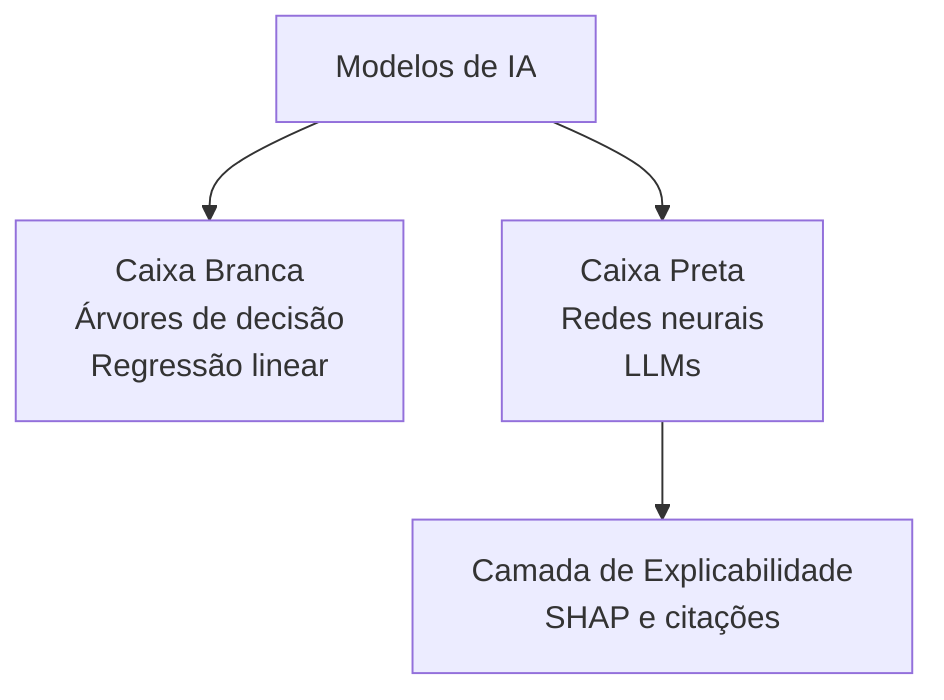
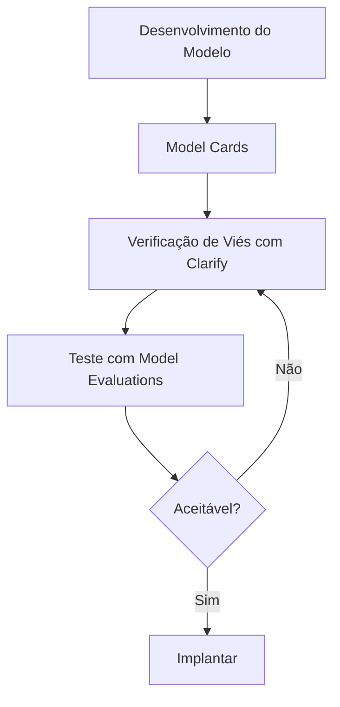
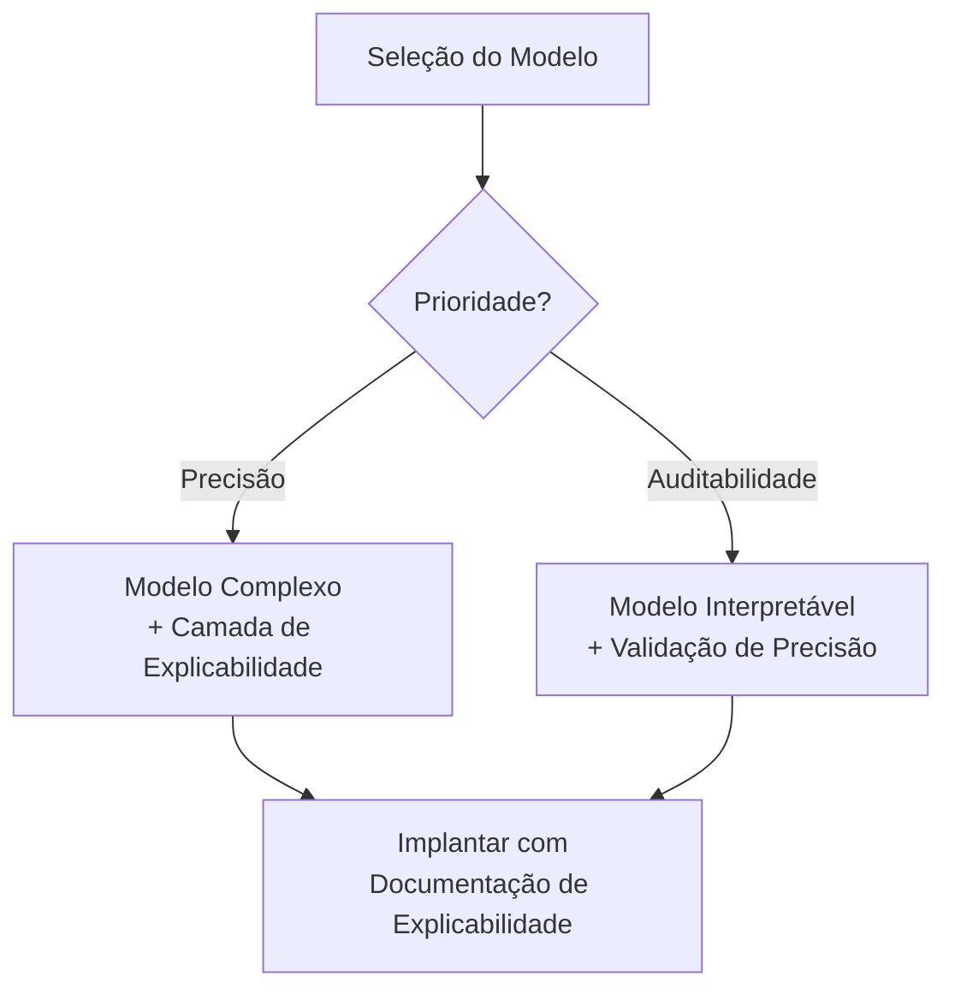
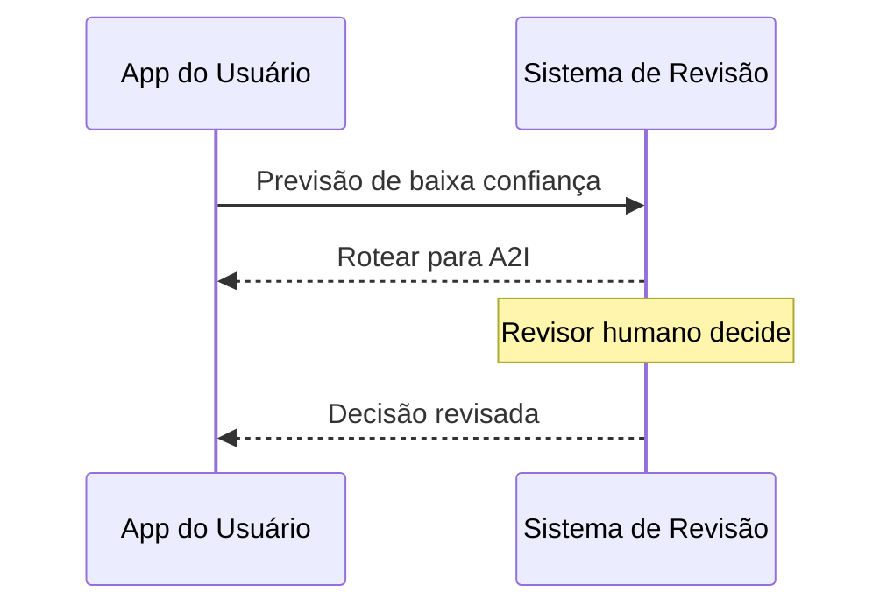

## Declaração de Tarefa 4.2: Reconhecer a importância de modelos transparentes e explicáveis

Quando um sistema de IA toma uma decisão que afeta um cliente, um funcionário ou um resultado de negócios, as pessoas envolvidas quase sempre fazem a mesma pergunta: por quê? A resposta a essa pergunta é o que transparência e explicabilidade significam. Esta declaração de tarefa abrange como distinguir modelos capazes de responder a essa pergunta de modelos que não conseguem, as ferramentas da AWS que documentam e expõem o comportamento do modelo, os trade-offs entre explicabilidade e outras propriedades como segurança e desempenho, e os princípios de design que mantêm os humanos de forma significativa no ciclo quando sistemas de IA fazem recomendações com consequências reais.[^402001]

### 4.2.1 Diferenças entre modelos transparentes e explicáveis e modelos que não são

Transparência e explicabilidade são propriedades relacionadas, mas distintas. **Transparência** é a propriedade de um modelo cuja estrutura interna, dados de treinamento e lógica de decisão podem ser inspecionados diretamente. Um modelo transparente é aquele que você pode abrir e ler. **Explicabilidade** é a propriedade de um modelo cujas saídas podem ser acompanhadas de um motivo compreensível para humanos, mesmo que a estrutura interna permaneça complexa. Um modelo explicável pode ser opaco internamente, mas o sistema ao seu redor pode produzir uma justificativa que uma pessoa pode avaliar.[^402002]

A distinção importa na prática. Uma *árvore de decisão* clássica é transparente: você pode seguir os ramos da raiz até a folha e rastrear exatamente quais valores de entrada fizeram o modelo chegar a uma determinada conclusão.[^402031] Uma *rede neural profunda* com bilhões de parâmetros não é transparente da mesma forma; nenhum humano pode ler a matriz de pesos e entender por que uma sequência de tokens específica produziu uma saída específica. No entanto, um sistema bem projetado ao redor dessa rede neural ainda pode ser explicável: ele pode reportar as características que mais contribuíram para a saída, expor os documentos de origem que mais influenciaram uma resposta, ou atribuir uma pontuação de confiança que sinaliza o quanto o modelo está certo.[^402032]

**Modelos de caixa branca** são aqueles cuja lógica de decisão é inerentemente legível. Regressão linear, regressão logística, árvores de decisão e classificadores baseados em regras se enquadram nessa categoria.[^402003] Um modelo de análise de crédito construído como árvore de decisão pode ser descrito em linguagem simples para um regulador: "Solicitações com relação dívida/renda acima de 40% e menos de 24 meses de histórico de emprego foram recusadas." Essa frase é o modelo. Modelos de caixa branca são a escolha padrão em ambientes onde a responsabilidade regulatória exige auditabilidade completa de cada decisão individual, como crédito ao consumidor, subscrição de seguros e algumas classificações de dispositivos médicos.[^402033]

**Modelos de caixa preta** são aqueles onde o cálculo interno é complexo demais para ser interpretado diretamente.[^402004] Grandes modelos de linguagem, redes convolucionais profundas e métodos de conjunto como árvores com gradient boosting treinadas em centenas de características se comportam como caixas pretas do ponto de vista prático. O modelo produz uma pontuação ou uma sequência de tokens, mas o caminho da entrada para a saída passa por tantas transformações não lineares que rastreá-lo é computacionalmente e conceitualmente intratável.[^402034] A maioria dos sistemas de IA em produção em moderação de conteúdo, imagens médicas, detecção de fraudes e processamento de linguagem natural opera com modelos de caixa preta.

*Figura 4.2.1: Taxonomia de modelos de caixa branca versus caixa preta. Modelos de caixa branca expõem a lógica de decisão diretamente; modelos de caixa preta requerem uma camada de explicabilidade separada para produzir justificativas compreensíveis para humanos.*

A realidade da maioria dos sistemas de IA em produção é que eles se situam em algum lugar entre os dois extremos. Um classificador com gradient boosting pode não ser legível linha por linha, mas é menos opaco que uma rede neural profunda porque pontuações de *importância de características* podem ser calculadas diretamente a partir da estrutura do modelo.[^402035] Um grande modelo de linguagem é profundamente opaco internamente, mas pode ser configurado para citar suas fontes, reportar sua incerteza e explicar sua cadeia de raciocínio em linguagem simples antes de produzir uma resposta final. A questão prática não é se um modelo é perfeitamente transparente, mas se é suficientemente explicável para os requisitos de responsabilização do caso de uso.[^402036]

Três setores ilustram bem o espectro. Na pontuação de crédito, regulamentações em muitas jurisdições exigem que o credor forneça ao solicitante os motivos específicos pelos quais uma decisão de crédito foi tomada; modelos de caixa branca ou modelos de caixa preta com atribuição SHAP satisfazem esse requisito, enquanto uma pontuação não explicada não satisfaz.[^402005] No diagnóstico médico, um radiologista que usa uma ferramenta de IA para triagem de radiografias de tórax precisa ver quais regiões da imagem o modelo ponderou mais fortemente para que o médico possa confirmar ou substituir a hipótese do modelo; aqui a explicabilidade apoia a tomada de decisão humana sem substituí-la.[^402037] Na moderação de conteúdo, o operador da plataforma pode não ser obrigado a explicar decisões individuais de moderação aos usuários, mas as equipes de auditoria internas precisam verificar se o classificador está aplicando regras consistentes entre grupos demográficos; aqui a explicabilidade é principalmente uma ferramenta interna de garantia de qualidade.[^402038]

### 4.2.2 Ferramentas para identificar modelos transparentes e explicáveis

Reconhecer que a explicabilidade é necessária é diferente de saber como alcançá-la. A AWS fornece um conjunto de ferramentas que abordam a explicabilidade em diferentes níveis: a documentação do modelo, seu comportamento durante a inferência e a segurança e qualidade de suas saídas.[^402039]

**Amazon SageMaker Model Cards** é a ferramenta que a AWS projetou para padronizar como a documentação do modelo é criada e compartilhada.[^402006] Um Model Card é um documento legível por humanos e estruturado anexado a um artefato de modelo no SageMaker. Ele registra os casos de uso pretendidos do modelo, o conjunto de dados de treinamento e sua proveniência, métricas de desempenho em subgrupos relevantes, limitações conhecidas, considerações éticas e restrições de uso.[^402007] Um profissional de negócios que revisa um Model Card antes de aprovar um modelo para produção pode determinar se o modelo foi treinado com dados representativos da população de implantação, quais trade-offs de precisão foram feitos e quais riscos a equipe de desenvolvimento já identificou.

O valor dos Model Cards vai além da decisão inicial de implantação. Quando o comportamento de um modelo muda ao longo do tempo, ou quando uma consulta regulatória chega, o Model Card fornece um registro auditável do que era conhecido no momento da implantação.[^402040] O Amazon SageMaker suporta a publicação de Model Cards por meio do AWS Management Console e do SDK Python do SageMaker, e os cartões podem ser versionados junto com o artefato do modelo.[^402008]

**Amazon SageMaker Clarify** aborda a explicabilidade no nível da inferência.[^402009] O Clarify usa uma técnica chamada *SHAP* (SHapley Additive exPlanations) para calcular pontuações de atribuição de características para modelos clássicos de aprendizado de máquina.[^402010] Pense em um valor SHAP como "o quanto essa característica empurrou a resposta para cima ou para baixo em comparação com a previsão média em todos os solicitantes." Números positivos empurram para maior risco previsto; números negativos empurram para menor risco. Por exemplo, uma explicação do Clarify para uma previsão de modelo de risco de crédito pode mostrar que a relação dívida/renda do solicitante contribuiu com +0,12 para a pontuação de risco enquanto o comprimento do histórico de crédito contribuiu com -0,08, fornecendo ao subscritor uma base quantitativa para a decisão e um ponto de partida para qualquer explicação necessária ao solicitante. (Para modelos de imagem, a técnica equivalente produz *mapas de saliência* que destacam as regiões de uma imagem de entrada que o modelo ponderou mais fortemente.)

Além da atribuição de características, o SageMaker Clarify mede *métricas de viés* que refletem se o modelo trata diferentes grupos demográficos de forma diferente.[^402011] Métricas de viés pré-treinamento avaliam se o próprio conjunto de dados de treinamento está desequilibrado. Métricas de viés pós-treinamento avaliam se as previsões do modelo treinado diferem sistematicamente entre grupos definidos por um atributo sensível como gênero, idade ou código postal.[^402041] Essa capacidade de detecção de viés se conecta diretamente aos recursos de IA responsável abordados na Tarefa 4.1 e torna o Clarify uma ferramenta de dupla finalidade: ele tanto explica previsões individuais quanto monitora a equidade no nível populacional.

**Amazon Bedrock Model Evaluations** é a ferramenta que a AWS fornece para avaliar a qualidade e a segurança das saídas do modelo de fundação.[^402012] Ao contrário do Clarify, que aborda a atribuição de características de ML clássico, o Bedrock Model Evaluations avalia as saídas de LLM em dimensões como precisão, fluência, coerência e toxicidade. A avaliação pode ser configurada como um job automatizado usando algoritmos de pontuação integrados ou como um job de avaliação humana com uma equipe interna ou com a força de trabalho gerenciada pela AWS.[^402013] A dimensão de avaliação de segurança verifica especificamente conteúdo prejudicial, tóxico ou inapropriado, fornecendo às organizações um registro estruturado de como um modelo performa nos critérios de segurança antes de ser colocado em produção. O Bedrock Model Evaluations produz um relatório por job comparando as saídas com os critérios; não é um documento de governança permanente sobre o próprio modelo, que é o que os Model Cards fornecem.

**Modelos de código aberto** merecem atenção específica como ferramenta de transparência. Quando uma organização implanta um modelo cujos pesos e arquitetura estão disponíveis publicamente, como modelos da família Meta Llama ou da família Mistral, ela pode inspecionar a documentação da arquitetura, revisar os data cards de treinamento publicados pelos desenvolvedores do modelo e executar avaliações de terceiros.[^402014] Esse é um nível qualitativamente diferente de transparência em relação ao disponível para modelos proprietários acessados por uma API, onde a arquitetura e os dados de treinamento não são divulgados.[^402042] Implantar um modelo de código aberto na AWS por meio do Amazon Bedrock ou diretamente em endpoints do Amazon SageMaker preserva essa vantagem de transparência enquanto mantém os benefícios operacionais de infraestrutura gerenciada.[^402043]

**Documentação de dados e licenciamento** completa o quadro. A explicabilidade só é significativa se os dados que produziram o modelo são rastreáveis.[^402015] Um modelo treinado em dados com proveniência não divulgada carrega riscos que um Model Card não pode capturar completamente: se os dados de treinamento acabarem contendo dados pessoais protegidos, conteúdo protegido por direitos autorais ou rótulos sistematicamente enviesados, as saídas do modelo herdam esses problemas.[^402044] Os termos de licenciamento tanto dos dados de treinamento quanto dos pesos do modelo determinam o que a organização pode fazer legalmente com as saídas do modelo, e essa determinação é em si uma forma de transparência sobre as restrições operacionais do modelo.[^402045]

*Tabela 4.2.1: Ferramentas da AWS para transparência e explicabilidade de modelos*

| Ferramenta | O que explica | Técnica | Público principal |
|---|---|---|---|
| SageMaker Model Cards | Intenção do modelo, dados, resultados de avaliação, limitações | Documentação estruturada | Revisores de negócios, auditores |
| SageMaker Clarify | Atribuição de previsão individual, métricas de viés | Valores SHAP, testes estatísticos | Cientistas de dados, conformidade |
| Bedrock Model Evaluations | Qualidade e segurança das saídas de LLM | Pontuação automatizada e humana | Equipes de IA, revisores de segurança |
| Inspeção de modelos de código aberto | Arquitetura e dados de treinamento | Revisão direta de pesos e documentação | Engenheiros de ML, pesquisadores |
| Revisão de dados e licenciamento | Proveniência dos dados de treinamento e direitos de uso | Rastreamento de proveniência, revisão de licença | Jurídico, conformidade, compras |

O exame espera que você associe um cenário à ferramenta correta. Quando uma pergunta perguntar como uma organização deve documentar o uso pretendido de um modelo e suas limitações conhecidas para uma auditoria, a resposta é SageMaker Model Cards. Quando uma pergunta perguntar como explicar por que uma previsão específica foi feita por um modelo de ML clássico, a resposta é SageMaker Clarify com SHAP. Quando uma pergunta perguntar como avaliar se as saídas de um modelo generativo são seguras antes da implantação em produção, a resposta é Bedrock Model Evaluations.[^402046]

*Figura 4.2.2: Cadeia de ferramentas de explicabilidade no ciclo de vida do modelo. Os Model Cards fornecem o contexto de documentação; o Clarify mede o viés antes e depois do treinamento; o Bedrock Model Evaluations valida a segurança das saídas antes da implantação.*

### 4.2.3 Trade-offs entre segurança do modelo e transparência

Transparência e segurança nem sempre estão alinhadas. Compreender onde se reforçam mutuamente e onde entram em conflito é importante para projetar sistemas de IA que sejam ao mesmo tempo confiáveis e seguros.[^402047]

O conflito mais comum surge do fato de que revelar como um controle de segurança funciona pode permitir que um adversário o contorne. Considere um sistema de moderação de conteúdo que bloqueia saídas prejudiciais detectando certos padrões de frase na resposta do modelo. Publicar a lista exata de frases permitiria que um agente malicioso construísse solicitações que evitam todas as frases bloqueadas enquanto ainda obtém conteúdo prejudicial. Nesse caso, a opacidade no controle de segurança é intencional.[^402048] A mesma lógica se aplica às defesas contra injeção de prompt: um prompt de sistema que instrui o modelo a ignorar instruções que seguem um determinado modelo é menos eficaz assim que esse modelo é conhecido.[^402016] Sistemas de segurança rotineiramente tratam os detalhes de sua lógica de detecção como confidenciais, e os controles de segurança de IA não são exceção.

O conflito também ocorre na direção oposta. A opacidade em um modelo pode ocultar limitações relevantes para segurança que operadores e usuários precisam conhecer. Um Model Card que descreve com precisão os modos de falha de um modelo, como menor precisão em falantes não nativos de inglês ou taxas mais altas de alucinação em eventos muito recentes, permite que os operadores adicionem controles compensatórios no momento da implantação.[^402017] Ocultar ou omitir essas limitações significa que o operador não pode mitigá-las. Nesse sentido, a transparência sobre limitações melhora ativamente os resultados de segurança.[^402049]

O trade-off entre desempenho e interpretabilidade é uma segunda tensão que o exame aborda. Em geral, os modelos que alcançam a maior precisão em tarefas complexas também são os menos interpretáveis. Uma rede neural profunda treinada em milhões de imagens rotuladas superará uma árvore de decisão na maioria das tarefas de classificação de imagens, mas as previsões da árvore de decisão podem ser explicadas a um especialista de domínio sem nenhuma ferramenta adicional.[^402018] Um conjunto com gradient boosting treinado em dezenas de características construídas frequentemente superará a regressão logística em dados tabulares, mas a regressão logística produz coeficientes que um estatístico pode ler diretamente como a contribuição de cada variável.[^402050]

*Figura 4.2.3: Caminho de decisão entre desempenho e interpretabilidade. Quando a precisão é o requisito principal, adicione uma camada de explicabilidade post-hoc; quando a auditabilidade é principal, escolha um modelo interpretável e verifique seu limite de precisão.*

Não existe uma medida numérica única de interpretabilidade.[^402019] A interpretabilidade é uma propriedade avaliada por caso de uso, não uma pontuação em uma tabela classificatória. Um modelo que um radiologista considera suficientemente explicável para assistência em triagem pode não ser suficientemente explicável para gerar um diagnóstico formal que aparece em um prontuário médico.[^402051] Um modelo de risco de crédito que satisfaz os requisitos de explicação da regulamentação de crédito ao consumidor de um país pode não satisfazer os de outro. A questão de medição é, portanto, sempre: explicável o suficiente para quem, para qual finalidade e sob qual obrigação?[^402052]

*Tabela 4.2.2: Padrões de interação entre transparência e segurança*

| Cenário | Efeito na transparência | Efeito na segurança | Resolução |
|---|---|---|---|
| Publicar detalhes da defesa contra injeção de prompt | Alta transparência | Segurança reduzida | Manter a lógica de defesa confidencial; publicar apenas a política de alto nível |
| Model Card documenta modos de falha por alucinação | Alta transparência | Segurança melhorada | Publicar; operadores adicionam controles compensatórios |
| Revelar valores de limite de detecção de viés | Transparência parcial | Risco de manipulação | Publicar a categoria; manter os limites exatos confidenciais |
| Pesos de modelo de código aberto | Transparência total | Variável | Avaliar riscos específicos antes da implantação aberta |

A orientação prática para um cenário de exame é: quando uma pergunta descreve uma situação em que revelar o mecanismo de um controle permitiria que um invasor o contornasse, menos transparência é adequada para segurança. Quando uma pergunta descreve uma situação em que ocultar as limitações conhecidas de um modelo impede que os operadores as mitiguem, mais transparência é adequada para segurança.[^402053]

### 4.2.4 Princípios de design centrado no ser humano para IA explicável

A explicabilidade não é apenas uma propriedade técnica de um modelo; é também uma propriedade de design do sistema que apresenta as saídas do modelo aos usuários. Um modelo pode produzir pontuações de atribuição SHAP que nenhum usuário de negócios verá jamais porque a interface não foi projetada para expô-las.[^402054] O design centrado no ser humano para IA explicável significa construir a camada de apresentação para que os usuários recebam as informações necessárias para entender, confiar e substituir adequadamente as recomendações de IA.[^402020]

O primeiro princípio é expor informações de confiança e incerteza quando elas são relevantes para a decisão. Um modelo que atribui uma alta pontuação de confiança a uma recomendação e um modelo que está quase igualmente incerto entre duas opções não devem parecer iguais para um usuário. Quando um sistema de detecção de fraudes sinaliza uma transação com 97% de confiança, um analista pode prosseguir rapidamente. Quando o mesmo sistema sinaliza uma transação com 54% de confiança, o analista deve saber que o modelo está incerto e aplicar mais escrutínio. Os modelos do Amazon Bedrock podem retornar pontuações de probabilidade e podem ser instruídos via prompt a expressar incerteza explicitamente em suas saídas; projetar o aplicativo para exibir essas informações, em vez de converter a saída do modelo diretamente em uma recomendação binária sim/não, é uma escolha de design deliberada.[^402021]

O segundo princípio é mostrar citações e fontes para conteúdo gerado. Um aplicativo baseado em RAG que recupera informações de um corpus de documentos e gera uma resposta em linguagem natural deve identificar quais documentos de origem foram usados. Isso não é apenas uma medida de transparência; é uma ferramenta prática que permite ao usuário verificar a saída do modelo em relação à fonte original e identificar casos em que o modelo generalizou além do que a fonte realmente dizia.[^402022] O Amazon Bedrock Knowledge Bases retorna referências de documentos de origem junto com as respostas geradas, e designs de aplicativos que expõem essas referências para os usuários finais tornam o sistema materialmente mais confiável.[^402055]

O terceiro princípio é projetar loops de feedback que capturam os julgamentos dos usuários sobre a qualidade das saídas de IA. Um mecanismo de polegar para cima ou para baixo anexado a uma recomendação do modelo é a forma mais simples disso, mas o design também deve capturar o motivo do feedback negativo: a recomendação estava factualmente errada, não era aplicável ou estava correta mas apresentada de forma confusa? Esse feedback estruturado, roteado de volta para a equipe de desenvolvimento do modelo, produz os dados rotulados necessários para identificar modos de falha sistemáticos e para melhorar o modelo ao longo do tempo. O Amazon A2I, apresentado na Tarefa 4.1, se encaixa nesse princípio roteando saídas de baixa confiança para revisores humanos e capturando suas decisões como registros estruturados.[^402023]

*Figura 4.2.4: Fluxo de feedback com humano no ciclo. O aplicativo expõe pontuações de confiança ao usuário, roteia saídas de baixa confiança ou contestadas para o Amazon A2I para revisão humana e retorna anotações estruturadas à equipe de desenvolvimento.*

O quarto princípio é separar o que o modelo disse do que o sistema fez. Em um aplicativo de IA multicamada, o modelo produz uma recomendação e, em seguida, um sistema downstream age com base nela. Uma interface bem projetada mostra ao usuário ambas as camadas: a recomendação do modelo e a ação do sistema baseada nessa recomendação.[^402056] Isso importa quando o sistema adiciona regras de negócio que modificam ou substituem a saída do modelo. Por exemplo, uma ferramenta de suporte a contratação pode mostrar ao recrutador tanto a classificação de candidatos do modelo quanto a regra que a empresa do recrutador aplicou para filtrar candidatos abaixo de um limite de idade estatutário. O usuário pode então avaliar o raciocínio do modelo independentemente da camada de regras de negócio.[^402057]

O quinto princípio é respeitar a autonomia do usuário tornando as substituições fáceis e bem rastreadas. Uma recomendação de IA que não pode ser substituída não é uma recomendação; é uma decisão automatizada. Usuários que são obrigados a usar as saídas de IA mas não podem substituí-las perdem a capacidade de aplicar julgamento profissional a casos extremos, e a organização perde o sinal que os dados de substituição teriam fornecido.[^402058] Projetar mecanismos de substituição que sejam proeminentes, de baixo atrito e registrados em auditoria dá aos usuários autonomia genuína enquanto também gera feedback valioso sobre onde o modelo falha.[^402024]

*Tabela 4.2.3: Princípios de design centrado no ser humano para IA explicável*

| Princípio | Exemplo de implementação | Ferramenta ou padrão da AWS |
|---|---|---|
| Expor confiança e incerteza | Exibir pontuação de confiança do modelo junto com a recomendação | Metadados de resposta de inferência do Bedrock |
| Mostrar citações e fontes | Listar documentos de origem recuperados com resposta gerada | Atribuição de fontes do Bedrock Knowledge Bases |
| Capturar feedback estruturado | Polegar para baixo com motivo; roteamento automático de baixa confiança | Configuração de fluxo de trabalho do Amazon A2I |
| Separar saída do modelo da ação do sistema | Mostrar pontuação do modelo e regra de negócio aplicada separadamente | Design da camada de aplicativo |
| Respeitar autonomia do usuário | Botão de substituição proeminente com registro de auditoria | Design da camada de aplicativo |

Acessibilidade é uma consideração prática dentro do design centrado no ser humano que o exame não elabora, mas que qualquer implementação responsável deve abordar. Pontuações de confiança apresentadas apenas como valores numéricos excluem usuários menos confortáveis com raciocínio probabilístico.[^402059] Explicações escritas em linguagem técnica excluem usuários não especialistas. Projetar a explicabilidade para os usuários reais do sistema, não para os desenvolvedores que o construíram, é a definição operacional de design centrado no ser humano neste contexto.[^402060]

## Questões de revisão

**Questão 1.** Uma empresa de serviços financeiros usa um modelo de conjunto com gradient boosting para aprovar ou recusar solicitações de empréstimo. Um regulador exige que a empresa forneça a cada solicitante recusado um motivo específico para a decisão. A equipe de desenvolvimento do modelo quer atender a esse requisito sem substituir o modelo. Qual ferramenta ou técnica da AWS é a MAIS adequada?

A. Substituir o modelo de gradient boosting por um modelo de regressão logística que é transparente por design  
B. Usar o Amazon SageMaker Clarify para gerar pontuações de atribuição de características baseadas em SHAP para cada previsão individual  
C. Publicar um SageMaker Model Card documentando os dados de treinamento e as métricas de avaliação  
D. Usar o Amazon Bedrock Model Evaluations para pontuar a precisão das saídas do modelo em relação a um conjunto de dados rotulado  

**Explicação:** O regulador exige uma explicação por decisão, o que significa que o sistema precisa atribuir a previsão específica a características de entrada específicas para cada solicitação individual. O Amazon SageMaker Clarify (Resposta B) calcula valores SHAP que quantificam o quanto cada característica de entrada contribuiu para a previsão do modelo, produzindo precisamente a justificativa por decisão que o regulador exige. A Resposta A satisfaria o requisito, mas a pergunta especifica que a equipe quer evitar substituir o modelo; além disso, substituir o modelo apenas por interpretabilidade sacrifica a vantagem de precisão do conjunto. A Resposta C aborda a documentação do modelo como um todo, mas não gera explicações por decisão. A Resposta D avalia a precisão agregada de saídas de LLM e não é projetada para atribuição de características em modelos de ML clássicos. O SageMaker Clarify é a ferramenta desenvolvida especificamente para atribuição de previsão individual em modelos treinados no SageMaker.[^402026]

---

**Questão 2.** Uma empresa está desenvolvendo um assistente de imagem médica alimentado por IA que destaca regiões de uma radiografia de tórax para um radiologista revisar. A equipe de desenvolvimento debate se deve usar uma rede convolucional profunda com maior precisão diagnóstica ou um classificador baseado em regras com menor precisão, mas regras totalmente auditáveis. A equipe clínica diz que só usará a ferramenta se puder entender por que a ferramenta está sinalizando uma região. Qual abordagem MELHOR atende ao requisito da equipe clínica e à necessidade de precisão?

A. Usar o classificador baseado em regras porque é totalmente transparente e a equipe clínica pode ler suas regras diretamente  
B. Usar a rede convolucional profunda e adicionar uma camada de explicabilidade post-hoc que destaca as regiões da imagem que o modelo ponderou mais fortemente  
C. Usar a rede convolucional profunda sem uma camada de explicabilidade e treinar a equipe clínica para confiar na saída do modelo  
D. Usar o Amazon Bedrock Model Evaluations para validar as saídas da rede convolucional profunda antes de cada sessão de imagem  

**Explicação:** A pergunta identifica dois requisitos concorrentes: alta precisão (favorece a rede convolucional profunda) e compreensibilidade (favorece o modelo transparente). A Resposta B resolve a tensão usando o modelo de maior precisão e adicionando uma camada de explicabilidade post-hoc que produz *mapas de saliência* ou visualizações equivalentes mostrando quais regiões da imagem o modelo ponderou mais fortemente. Isso dá aos radiologistas a justificativa regional de que precisam sem sacrificar a vantagem de precisão. A Resposta A aceita a limitação de precisão desnecessariamente; a pergunta não diz que a precisão do classificador baseado em regras é suficiente. A Resposta C ignora o requisito declarado da equipe clínica e introduz risco à segurança do paciente ao implantar um sistema não explicado para clínicos que disseram precisar de explicações. A Resposta D é a categoria de ferramenta errada; o Bedrock Model Evaluations aborda a qualidade da saída de LLM, não a atribuição de classificação de imagens. A lição mais ampla é que o trade-off entre desempenho e interpretabilidade muitas vezes pode ser resolvido mantendo o modelo de alto desempenho e adicionando uma camada de explicabilidade, em vez de escolher entre os dois.[^402027]

---

**Questão 3.** Uma organização está se preparando para implantar um assistente de atendimento ao cliente de IA generativa. A equipe de conformidade exige documentação do uso pretendido do modelo, seus modos de falha conhecidos e as métricas de avaliação usadas para validá-lo, tudo em um formato que um auditor não técnico possa revisar. Qual capacidade da AWS foi projetada para essa finalidade?

A. Relatórios de viés do Amazon SageMaker Clarify  
B. Fluxo de trabalho de revisão humana do Amazon Bedrock Model Evaluations  
C. Amazon SageMaker Model Cards  
D. Registros de auditoria de tarefas de revisão do Amazon Augmented AI (Amazon A2I)  

**Explicação:** O Amazon SageMaker Model Cards (Resposta C) é a ferramenta desenvolvida especificamente para documentação estruturada de modelos. Um Model Card registra os casos de uso pretendidos do modelo, a proveniência dos dados de treinamento, os resultados de avaliação em subgrupos, as limitações conhecidas, as considerações éticas e as restrições de uso em um formato padronizado e legível por humanos. Isso aborda diretamente todos os três requisitos de conformidade: uso pretendido, modos de falha conhecidos e métricas de avaliação, em uma forma que um auditor não técnico pode navegar. A Resposta A produz pontuações de atribuição por previsão e métricas de viés para um modelo implantado, não documentação resumida para um auditor. A Resposta B executa avaliações de qualidade e segurança de inferência, mas produz pontuações de avaliação em vez da documentação estruturada que um Model Card fornece. A Resposta D produz registros de auditoria de decisões individuais de revisão humana, o que é útil para monitoramento, mas não substitui a documentação do modelo. Os Model Cards são a resposta canônica quando o exame descreve um requisito de auditoria ou conformidade para documentação de modelo pré-implantação.[^402028]

---

**Questão 4.** A equipe de produto de IA de uma empresa construiu um motor de recomendação. A pesquisa com usuários mostra que muitos usuários não confiam nas recomendações porque não conseguem entender por que um item específico foi sugerido. A equipe quer aplicar o design centrado no ser humano para aumentar a confiança do usuário. Qual opção combina duas mudanças de design que MAIS diretamente abordam a lacuna de confiança?

A. Substituir o modelo de recomendação por um modelo mais preciso e retreinar em um conjunto de dados maior  
B. Exibir a pontuação de confiança do modelo ao lado de cada recomendação e mostrar os atributos principais do histórico do usuário que impulsionaram a sugestão  
C. Remover o recurso de recomendação até que o modelo alcance maior precisão  
D. Adicionar uma etapa de revisão humana do Amazon A2I para aprovar manualmente cada recomendação antes de ser mostrada a um usuário  

**Explicação:** A pesquisa com usuários identifica um problema de confiança causado por falta de compreensibilidade, não um problema causado por baixa precisão ou revisão insuficiente. A Resposta B aplica dois princípios de design centrado no ser humano diretamente: expor confiança (para que os usuários possam calibrar quanto peso dar à recomendação) e mostrar o raciocínio por trás da recomendação (os atributos que a impulsionaram, que é uma forma de atribuição post-hoc). Ambas as mudanças abordam a lacuna de confiança declarada. A Resposta A melhora a precisão, o que pode ou não abordar a confiança; um modelo mais preciso que ainda é inexplicado não resolve o problema que a pesquisa com usuários identificou. A Resposta C remove um recurso de produto para evitar o problema em vez de resolvê-lo. A Resposta D introduz revisão humana para cada recomendação, o que é operacionalmente impraticável na escala de um sistema de recomendação e aborda o controle de qualidade em vez da explicabilidade voltada ao usuário. O padrão do exame aqui é que quando a confiança do usuário é o problema declarado, a resposta correta envolve design de transparência e explicação, não substituição do modelo ou revisão manual.[^402029]

---

**Questão 5.** Uma equipe de ciência de dados está avaliando se deve usar um modelo de código aberto ou um modelo de API fechada proprietária para um novo aplicativo. O departamento jurídico da equipe exige visibilidade sobre as fontes de dados de treinamento e os termos de licenciamento antes de aprovar o modelo para uso em produção. Qual característica dos modelos de código aberto MAIS diretamente atende ao requisito do departamento jurídico?

A. Modelos de código aberto são sempre mais baratos de executar do que modelos proprietários acessados via API  
B. Modelos de código aberto podem ser ajustados finamente em dados proprietários, o que permite que a organização seja proprietária dos pesos resultantes  
C. Modelos de código aberto publicam documentação de arquitetura, data cards de treinamento e termos de licença que a equipe jurídica pode revisar diretamente  
D. Modelos de código aberto atendem automaticamente a todos os requisitos regulatórios de transparência de IA na UE e nos EUA  

**Explicação:** O requisito declarado do departamento jurídico é visibilidade sobre as fontes de dados de treinamento e os termos de licenciamento. A Resposta C aborda isso diretamente. Modelos disponíveis publicamente geralmente publicam model cards e data cards (ou documentação equivalente) que descrevem a composição do corpus de treinamento, quaisquer limitações conhecidas e a licença aplicável. A equipe jurídica pode revisar a licença publicada (como Apache 2.0 ou uma licença comercial específica do modelo) para determinar quais usos são permitidos e pode revisar a documentação dos dados de treinamento para avaliar os riscos de proveniência dos dados. A Resposta A é um argumento de custo que não aborda o requisito jurídico; modelos de código aberto não são universalmente mais baratos quando os custos de infraestrutura e operacionais estão incluídos. A Resposta B aborda a propriedade de derivados ajustados finamente, que é uma consideração jurídica válida, mas não aborda o requisito de visibilidade de dados de treinamento e licenciamento declarado na pergunta. A Resposta D está incorreta; o status de código aberto não satisfaz automaticamente nenhuma estrutura regulatória específica; a conformidade ainda requer avaliação em relação aos critérios da regulamentação relevante. A lição mais ampla é que a transparência de dados e licenciamento é uma dimensão distinta da transparência do modelo, e os modelos de código aberto fornecem um nível de visibilidade de proveniência que não está disponível para modelos acessados apenas por uma API proprietária.[^402030]

---

[^402001]: AWS Certification. AI Practitioner (AIF-C01) Exam Guide v1.1, Domain 4, Task Statement 4.2. URL: <https://docs.aws.amazon.com/aws-certification/latest/ai-practitioner-01/ai-practitioner-01-domain4.html>
[^402002]: Doshi-Velez, F., and Kim, B. Towards a Rigorous Science of Interpretable Machine Learning (2017). URL: <https://arxiv.org/abs/1702.08608>
[^402003]: Breiman, L. Classification and Regression Trees (1984). URL: <https://doi.org/10.1201/9781315139470>
[^402004]: Adadi, A., and Berrada, M. Peeking Inside the Black-Box: A Survey on Explainable AI. IEEE Access (2018). URL: <https://doi.org/10.1109/ACCESS.2018.2870052>
[^402005]: Consumer Financial Protection Bureau. Using Artificial Intelligence to Assist Adverse Action Explanations (2023). URL: <https://www.consumerfinance.gov/about-us/blog/cfpb-issues-guidance-on-credit-denials-by-lenders-using-artificial-intelligence/>
[^402006]: Amazon SageMaker. Amazon SageMaker Model Cards overview. URL: <https://docs.aws.amazon.com/sagemaker/latest/dg/model-cards.html>
[^402007]: Amazon SageMaker. Model Card components and structure. URL: <https://docs.aws.amazon.com/sagemaker/latest/dg/model-cards-create.html>
[^402008]: Amazon SageMaker. Versioning and sharing SageMaker Model Cards. URL: <https://docs.aws.amazon.com/sagemaker/latest/dg/model-cards-export.html>
[^402009]: Amazon SageMaker. Amazon SageMaker Clarify overview. URL: <https://docs.aws.amazon.com/sagemaker/latest/dg/clarify-configure-processing-jobs.html>
[^402010]: Lundberg, S., and Lee, S. A Unified Approach to Interpreting Model Predictions (SHAP, NeurIPS 2017). URL: <https://arxiv.org/abs/1705.07874>
[^402011]: Amazon SageMaker. Measuring bias with SageMaker Clarify. URL: <https://docs.aws.amazon.com/sagemaker/latest/dg/clarify-measure-data-bias.html>
[^402012]: Amazon Bedrock. Amazon Bedrock Model Evaluations overview. URL: <https://docs.aws.amazon.com/bedrock/latest/userguide/model-evaluation.html>
[^402013]: Amazon Bedrock. Human evaluation jobs in Amazon Bedrock Model Evaluations. URL: <https://docs.aws.amazon.com/bedrock/latest/userguide/model-evaluation-human.html>
[^402014]: Meta AI. Llama 3 model card and data documentation. URL: <https://ai.meta.com/research/publications/meta-llama-3/>
[^402015]: Mitchell, M., et al. Model Cards for Model Reporting (FAccT 2019). URL: <https://arxiv.org/abs/1810.03993>
[^402016]: Perez, F., and Ribeiro, I. Ignore Previous Prompt: Attack Techniques for Language Models (2022). URL: <https://arxiv.org/abs/2211.09527>
[^402017]: Raji, I., et al. Closing the AI Accountability Gap: Defining an End-to-End Framework for Internal Algorithmic Auditing (2020). URL: <https://arxiv.org/abs/2001.00973>
[^402018]: Rudin, C. Stop Explaining Black Box Machine Learning Models for High Stakes Decisions and Use Interpretable Models Instead. Nature Machine Intelligence (2019). URL: <https://doi.org/10.1038/s42256-019-0048-x>
[^402019]: Lipton, Z. The Mythos of Model Interpretability. Queue, ACM (2018). URL: <https://dl.acm.org/doi/10.1145/3236386.3241340>
[^402020]: Amershi, S., et al. Guidelines for Human-AI Interaction. CHI 2019. URL: <https://dl.acm.org/doi/10.1145/3290605.3300233>
[^402021]: Amazon Bedrock. Response metadata and confidence in Amazon Bedrock inference. URL: <https://docs.aws.amazon.com/bedrock/latest/userguide/model-invocation-logging.html>
[^402022]: Amazon Bedrock. Source attribution in Knowledge Bases responses. URL: <https://docs.aws.amazon.com/bedrock/latest/userguide/knowledge-base-retrieveandgenerate.html>
[^402023]: Amazon Augmented AI. Amazon A2I overview and human review workflows. URL: <https://docs.aws.amazon.com/sagemaker/latest/dg/a2i-getting-started.html>
[^402024]: Shneiderman, B. Human-Centered AI. Oxford University Press (2022). URL: <https://global.oup.com/academic/product/human-centered-ai-9780192845290>
[^402026]: Amazon SageMaker. Explainability with SageMaker Clarify: SHAP values for predictions. URL: <https://docs.aws.amazon.com/sagemaker/latest/dg/clarify-shapley-values.html>
[^402027]: Selvaraju, R., et al. Grad-CAM: Visual Explanations from Deep Networks via Gradient-Based Localization (2017). URL: <https://arxiv.org/abs/1610.02391>
[^402028]: Amazon SageMaker. Using Model Cards for compliance and auditability. URL: <https://docs.aws.amazon.com/sagemaker/latest/dg/model-cards.html>
[^402029]: Amershi, S., et al. Guidelines for Human-AI Interaction: Principle 7, Show contextual information. CHI 2019. URL: <https://dl.acm.org/doi/10.1145/3290605.3300233>
[^402030]: Linux Foundation AI and Data. Model and Data Card Standards for Open Source AI (2023). URL: <https://lfaidata.foundation/blog/2023/09/18/data-and-model-cards/>
[^402031]: Quinlan, J.R. Induction of Decision Trees. Machine Learning, vol. 1 (1986). URL: <https://doi.org/10.1007/BF00116251>
[^402032]: Guidotti, R., et al. A Survey of Methods for Explaining Black Box Models. ACM Computing Surveys (2018). URL: <https://dl.acm.org/doi/10.1145/3236009>
[^402033]: Board of Governors of the Federal Reserve System. SR 11-7: Guidance on Model Risk Management (2011). URL: <https://www.federalreserve.gov/supervisionreg/srletters/sr1107.htm>
[^402034]: Goodfellow, I., Bengio, Y., and Courville, A. Deep Learning. MIT Press (2016). URL: <https://www.deeplearningbook.org/>
[^402035]: Chen, T., and Guestrin, C. XGBoost: A Scalable Tree Boosting System. KDD 2016. URL: <https://arxiv.org/abs/1603.02754>
[^402036]: European Parliament. EU AI Act: Article 13, Transparency and provision of information to deployers (2024). URL: <https://eur-lex.europa.eu/legal-content/EN/TXT/?uri=CELEX:32024R1689>
[^402037]: Topol, E. High-performance medicine: the convergence of human and artificial intelligence. Nature Medicine (2019). URL: <https://doi.org/10.1038/s41591-018-0300-7>
[^402038]: Raji, I., and Buolamwini, J. Actionable Auditing: Investigating the Impact of Publicly Naming Biased Performance Results of Commercial AI Products. AIES 2019. URL: <https://dl.acm.org/doi/10.1145/3306618.3314244>
[^402039]: NIST. Artificial Intelligence Risk Management Framework (AI RMF 1.0), GOVERN 1.7. URL: <https://doi.org/10.6028/NIST.AI.100-1>
[^402040]: Amazon SageMaker. Model Card audit and governance use cases. URL: <https://docs.aws.amazon.com/sagemaker/latest/dg/model-cards-use-cases.html>
[^402041]: Amazon SageMaker. Post-training bias metrics in SageMaker Clarify. URL: <https://docs.aws.amazon.com/sagemaker/latest/dg/clarify-measure-post-training-bias.html>
[^402042]: Bommasani, R., et al. On the Opportunities and Risks of Foundation Models: Transparency section. Stanford CRFM (2021). URL: <https://arxiv.org/abs/2108.07258>
[^402043]: Amazon Bedrock. Supported open-source models in Amazon Bedrock. URL: <https://docs.aws.amazon.com/bedrock/latest/userguide/models-supported.html>
[^402044]: Gebru, T., et al. Datasheets for Datasets. Communications of the ACM (2021). URL: <https://doi.org/10.1145/3458723>
[^402045]: Open Source Initiative. The Open Source AI Definition, version 1.0 (2024). URL: <https://opensource.org/ai/open-source-ai-definition>
[^402046]: Amazon Bedrock. Choosing between automated and human evaluation in Bedrock Model Evaluations. URL: <https://docs.aws.amazon.com/bedrock/latest/userguide/model-evaluation.html>
[^402047]: Wachter, S., Mittelstadt, B., and Russell, C. Counterfactual Explanations Without Opening the Black Box: Automated Decisions and the GDPR. Harvard Journal of Law and Technology (2018). URL: <https://doi.org/10.2139/ssrn.3063289>
[^402048]: Amazon Bedrock. Amazon Bedrock Guardrails: content filtering configuration. URL: <https://docs.aws.amazon.com/bedrock/latest/userguide/guardrails-filters.html>
[^402049]: Floridi, L., et al. An Ethical Framework for a Good AI Society: Opportunities, Risks, Principles, and Recommendations. Minds and Machines (2018). URL: <https://doi.org/10.1007/s11023-018-9482-5>
[^402050]: Hastie, T., Tibshirani, R., and Friedman, J. The Elements of Statistical Learning, 2nd ed. Springer (2009). URL: <https://doi.org/10.1007/978-0-387-84858-7>
[^402051]: FDA. Artificial Intelligence and Machine Learning in Software as a Medical Device: Action Plan (2021). URL: <https://www.fda.gov/medical-devices/software-medical-device-samd/artificial-intelligence-and-machine-learning-software-medical-device>
[^402052]: European Parliament. EU AI Act: Article 86, Right of explanation of individual decision-making (2024). URL: <https://eur-lex.europa.eu/legal-content/EN/TXT/?uri=CELEX:32024R1689>
[^402053]: NIST. AI RMF Playbook: MAP 1.6, Risk of insufficient explainability. URL: <https://airc.nist.gov/Docs/2>
[^402054]: Yang, Q., et al. Investigating how and why practitioners use machine learning explanation methods. CHI 2023. URL: <https://dl.acm.org/doi/10.1145/3544548.3581219>
[^402055]: Amazon Bedrock. Citations and source attribution in Knowledge Bases responses. URL: <https://docs.aws.amazon.com/bedrock/latest/userguide/knowledge-base-retrieveandgenerate.html>
[^402056]: Cai, C.J., et al. Human-Centered Tools for Coping with Imperfect Algorithms During Medical Decision-Making. CHI 2019. URL: <https://dl.acm.org/doi/10.1145/3290605.3300234>
[^402057]: European Parliament. EU AI Act: Article 26, Obligations of deployers of high-risk AI systems (2024). URL: <https://eur-lex.europa.eu/legal-content/EN/TXT/?uri=CELEX:32024R1689>
[^402058]: Kuo, T., et al. Assessing the AI on AI: Examining the Influence of AI Recommendations on Human Decisions. CHI 2023. URL: <https://dl.acm.org/doi/10.1145/3544548.3581314>
[^402059]: Bunt, A., Lount, M., and Lauzon, C. Are explanations always important? A study of deployed, low-cost intelligent systems. IUI 2012. URL: <https://dl.acm.org/doi/10.1145/2166966.2166996>
[^402060]: Wang, D., et al. Designing Theory-Driven User-Centric Explainable AI. CHI 2019. URL: <https://dl.acm.org/doi/10.1145/3290605.3300831>
