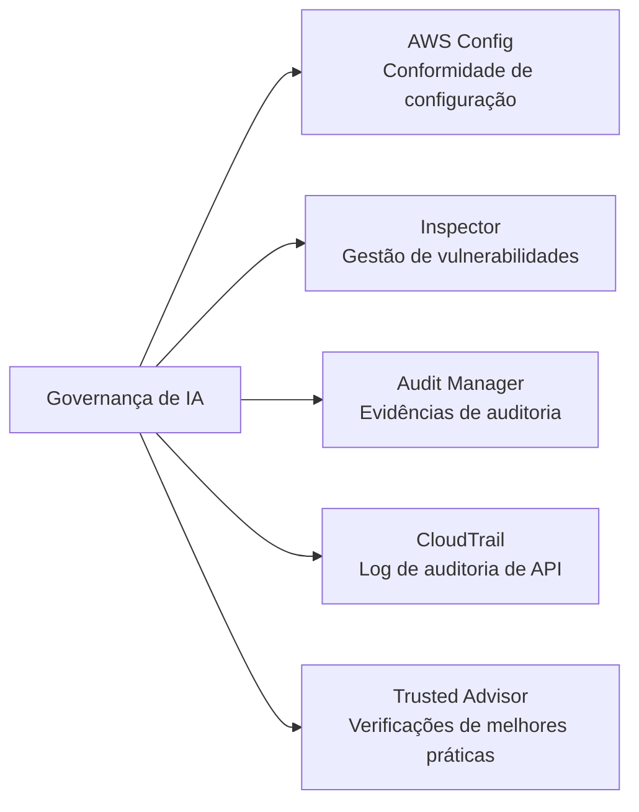
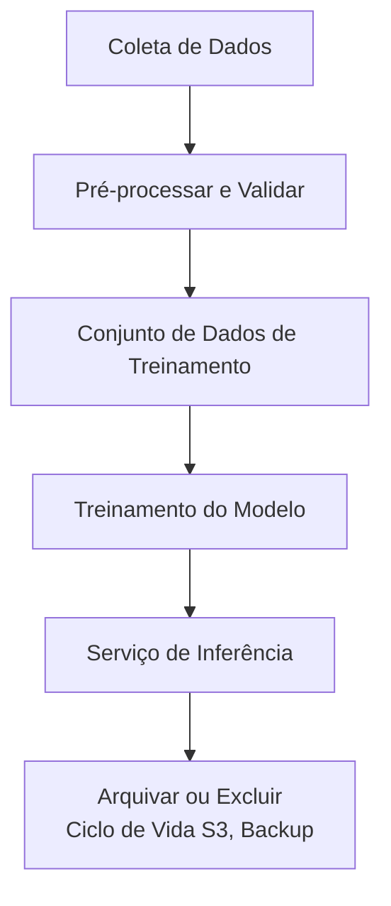
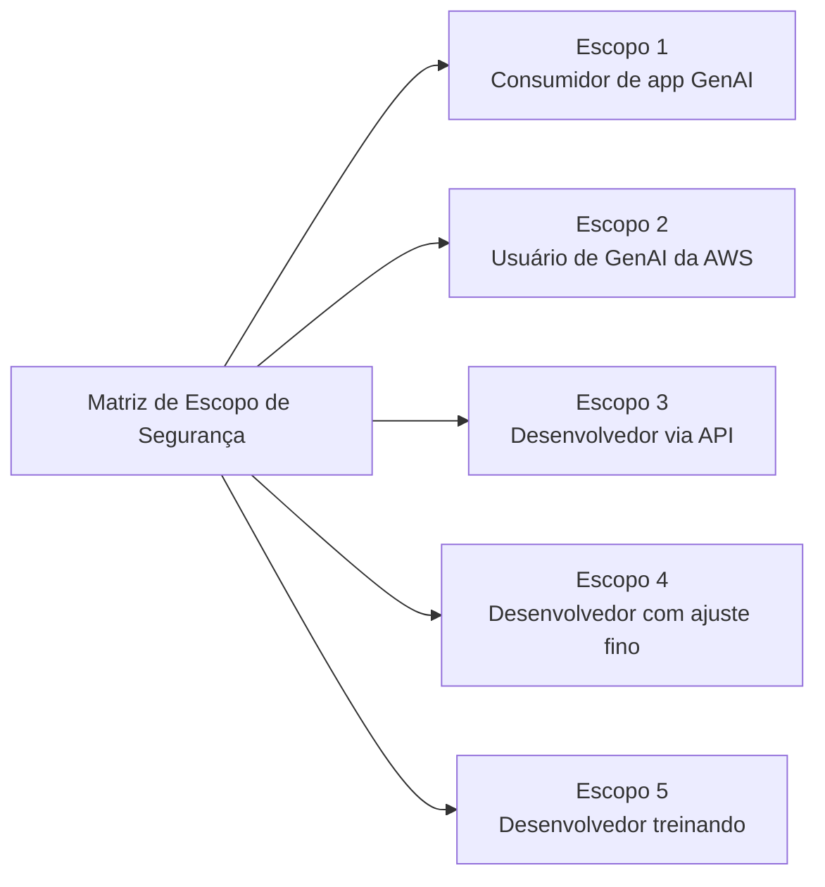
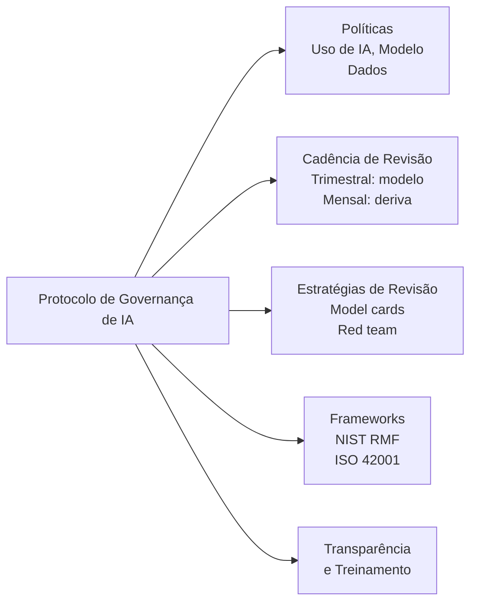

## Declaração de Tarefa 5.2: Reconhecer regulamentações de governança e conformidade para sistemas de IA

A governança e a conformidade traduzem os princípios da IA responsável em responsabilidade organizacional. Onde os controles de segurança protegem a camada técnica, as estruturas de governança criam as políticas, os ciclos de revisão, as trilhas de auditoria e as evidências regulatórias que permitem a uma organização explicar, defender e melhorar continuamente seus sistemas de IA. Esta declaração de tarefa abrange os serviços da AWS que suportam a coleta de evidências de conformidade, as estratégias de governança de dados que os auditores esperam e os processos de governança que dão aos programas de IA suporte institucional duradouro.[^502001]

### 5.2.1 Serviços e recursos da AWS para governança e conformidade

A conformidade para uma carga de trabalho de IA não é um único portão passado na implantação; é um estado contínuo mantido por monitoramento contínuo, coleta de evidências e prontidão para auditoria. A AWS fornece um conjunto de serviços gerenciados que coletivamente cobrem o ciclo de vida completo de conformidade: gravação de configuração, verificação de vulnerabilidades, coleta de evidências alinhada a frameworks, recuperação de relatórios sob demanda, registro de auditoria de API e verificações de melhores práticas. Usados juntos, esses serviços permitem que uma organização demonstre a reguladores, auditores e partes interessadas internas que seus sistemas de IA operam dentro de limites definidos.

A relação entre esses serviços segue uma divisão lógica de trabalho. O **AWS Config** rastreia o estado de configuração dos recursos e avalia se eles estão em conformidade com as regras definidas. O **Amazon Inspector** encontra vulnerabilidades nas camadas de computação e contêiner que hospedam cargas de trabalho de IA. O **AWS Audit Manager** organiza as evidências de conformidade em pacotes prontos para auditoria alinhados a frameworks específicos. O **AWS Artifact** fornece aos usuários autorizados acesso às próprias certificações de conformidade de terceiros da AWS. O **AWS CloudTrail** cria o log imutável de atividade de API que prova quem fez o quê e quando. O **AWS Trusted Advisor** identifica lacunas de configuração em relação às melhores práticas da AWS em custo, segurança, tolerância a falhas e limites de serviço.

*Figura 5.2.1: Categorias de serviços de conformidade da AWS. Cada serviço aborda uma camada distinta do stack de auditoria e governança para cargas de trabalho de IA.*

O **AWS Config** é um serviço de gravação de configuração e avaliação de regras que rastreia continuamente o estado dos recursos da AWS e os verifica em relação a regras de conformidade definidas por política.[^502002] Quando um recurso muda, o Config registra a nova configuração, compara-a com as regras aplicáveis e sinaliza as que estão em não conformidade. Para cargas de trabalho de IA, três categorias de regras são particularmente relevantes. Primeiro, o registro de invocação de modelo do Bedrock pode ser verificado: uma regra do Config pode verificar se o registro está habilitado para o Amazon Bedrock, garantindo que cada solicitação de modelo seja capturada para auditoria e análise.[^502003] Segundo, o acesso a notebooks do SageMaker pode ser controlado: uma regra verificando que as instâncias de notebook do Amazon SageMaker exigem acesso baseado em IAM impede a exposição direta à internet de ambientes de notebook onde o código de treinamento e os dados residem.[^502004] Terceiro, a criptografia pode ser aplicada: uma regra verificando que os artefatos de modelos personalizados do Bedrock e os volumes de treinamento do SageMaker estão criptografados em repouso garante que os parâmetros sensíveis do modelo e os dados de treinamento estejam sempre protegidos.[^502005]

As regras do Config podem ser agrupadas em *conformance packs*, que agrupam várias regras relacionadas em uma unidade implantável alinhada a um requisito de conformidade específico, como o NIST SP 800-53 ou o padrão AWS Foundational Security Best Practices.[^502006] Quando uma organização quer demonstrar que seu ambiente de IA atende aos requisitos de controle de um framework, implantar o conformance pack correspondente e exportar seu painel de conformidade fornece uma visão única e reproduzível do status de controle.

O **Amazon Inspector** é um serviço de avaliação contínua de vulnerabilidades que verifica instâncias do Amazon EC2, funções do AWS Lambda e imagens de contêiner armazenadas no Amazon Elastic Container Registry (ECR) em busca de vulnerabilidades de software conhecidas e exposições de rede não intencionais.[^502007] As cargas de trabalho de IA frequentemente são executadas em infraestrutura que o Inspector cobre: os jobs de treinamento do SageMaker são executados em frotas de instâncias EC2, os contêineres de inferência são armazenados no ECR e o código de inferência personalizado pode ser executado como funções do Lambda. O Inspector correlaciona os resultados com o banco de dados de Vulnerabilidades e Exposições Comuns (CVE) e atribui uma pontuação de risco, permitindo que as equipes de segurança priorizem quais vulnerabilidades remediar primeiro com base na explorabilidade e no impacto.[^502008] Para governança, os resultados do Inspector são alimentados diretamente no AWS Security Hub, fornecendo um painel centralizado que os auditores podem revisar junto com outros sinais de conformidade.

O **AWS Audit Manager** automatiza a coleta de evidências para auditorias de conformidade.[^502009] Em vez de extrair manualmente capturas de tela e trechos de log antes de cada ciclo de auditoria, as organizações configuram o Audit Manager com um framework e o serviço coleta continuamente evidências de resultados de regras do AWS Config, chamadas de API do CloudTrail e resultados do Security Hub. O serviço vem com frameworks pré-construídos para HIPAA, SOC 2, PCI DSS, ISO 27001, FedRAMP e outros padrões, além de ferramentas para construir frameworks personalizados para programas de auditoria interna ou requisitos emergentes específicos de IA.[^502010] As evidências são armazenadas em um relatório de avaliação estruturado que um auditor pode revisar sem exigir acesso direto ao ambiente da AWS. Para programas de IA sob HIPAA, por exemplo, o Audit Manager pode coletar evidências de que os dados de treinamento estão criptografados, de que o acesso aos endpoints do modelo está registrado e de que as alterações nas configurações do modelo estão gravadas, produzindo um pacote de auditoria que demonstra a operação de controles durante um período definido.

O **AWS Artifact** é o portal de autoatendimento onde os clientes da AWS podem baixar as próprias certificações de conformidade e acordos da AWS.[^502011] Os relatórios disponíveis incluem relatórios SOC 1, SOC 2 e SOC 3 (auditorias de controles de sistema e organização realizadas por terceiros independentes), certificações ISO 27001, ISO 27017 e ISO 27018 (gerenciamento de segurança da informação e privacidade em nuvem), Atestado de Conformidade PCI DSS (para cargas de trabalho de cartão de pagamento) e Adendos de Parceiro Comercial HIPAA (BAA) para entidades de saúde cobertas.[^502012] O Artifact não gera evidências sobre as próprias cargas de trabalho do cliente; ele fornece evidências sobre os controles da AWS como provedor de infraestrutura subjacente. Essa distinção é importante para o modelo de responsabilidade compartilhada: o cliente apresenta os relatórios do Artifact para demonstrar que a própria plataforma de nuvem atende aos requisitos de infraestrutura do regulador, enquanto as evidências do Audit Manager demonstram que a configuração e as operações do cliente atendem aos mesmos requisitos.

O **AWS CloudTrail** registra cada chamada de API feita aos serviços da AWS e entrega registros de eventos para um bucket do Amazon S3 em minutos após a chamada.[^502013] Para cargas de trabalho de IA, isso inclui cada chamada à API InvokeModel do Amazon Bedrock (capturando qual modelo foi invocado, por quem, em qual horário e com qual código de resultado), cada chamada CreateTrainingJob e CreateEndpoint do SageMaker, e cada alteração de política do IAM que afeta o acesso ao modelo. O CloudTrail também suporta eventos de dados, que registram a atividade no nível do objeto no Amazon S3. Habilitar eventos de dados do S3 em um bucket de dados de treinamento produz um log de cada leitura e gravação nos arquivos de treinamento, criando uma cadeia de custódia auditável que demonstra que não ocorreram modificações não autorizadas entre a preparação dos dados e o treinamento do modelo.[^502014] O CloudTrail Lake, a camada de análise gerenciada do serviço, permite consultas baseadas em SQL no histórico de eventos sem exigir um sistema externo de análise de log, tornando simples responder a perguntas de auditores como "Mostre-me cada vez que a configuração do endpoint do modelo de produção mudou nos últimos 90 dias."[^502015]

O **AWS Trusted Advisor** avalia as configurações de contas da AWS em relação às melhores práticas da AWS em cinco categorias: otimização de custos, desempenho, segurança, tolerância a falhas e limites de serviço.[^502016] Do ponto de vista de governança, as verificações de segurança são mais diretamente relevantes para os programas de conformidade de IA. O Trusted Advisor sinaliza condições como acesso público a buckets do S3, regras de grupo de segurança irrestrito, chaves de acesso do IAM que não foram rotacionadas e uso da conta root. Para cargas de trabalho de IA, as verificações de limites de serviço também importam: um endpoint do SageMaker que está se aproximando do seu limite de contagem de instâncias pode falhar ao escalar durante um período de inferência de pico, o que pode constituir um problema de disponibilidade de serviço relatável sob certos SLAs.[^502017] Os resultados do Trusted Advisor estão disponíveis no console da AWS e via API, para que possam ser ingeridos em painéis de conformidade junto com os resultados do Config, Inspector e Security Hub.

*Tabela 5.2.1: Serviços de governança e conformidade da AWS mapeados para casos de uso de IA*

| Serviço | Função principal | Caso de uso de governança específico de IA |
|---|---|---|
| AWS Config | Gravação de configuração e avaliação de regras | Verificar registro do Bedrock habilitado; aplicar acesso somente IAM ao SageMaker; verificar criptografia em artefatos de modelos |
| Amazon Inspector | Verificação de vulnerabilidades para EC2, Lambda, ECR | Verificar contêineres de inferência e funções Lambda em busca de CVEs; detectar exposição de rede não intencional |
| AWS Audit Manager | Coleta automatizada de evidências para frameworks de auditoria | Coletar evidências HIPAA, SOC 2, PCI para cargas de trabalho de IA; produzir relatórios prontos para auditoria |
| AWS Artifact | Baixar certificações de conformidade da AWS | Recuperar SOC, ISO, PCI, HIPAA BAA para demonstrar conformidade de plataforma a reguladores |
| AWS CloudTrail | Log de auditoria de API imutável | Registrar cada chamada InvokeModel do Bedrock; gravar acesso a eventos de dados do S3 em buckets de treinamento |
| AWS Trusted Advisor | Verificações de melhores práticas em segurança, custo, limites | Sinalizar buckets do S3 públicos, chaves IAM não rotacionadas, riscos de limite de serviço do SageMaker |

Juntos, esses seis serviços formam a camada de instrumentação de conformidade para uma carga de trabalho de IA na AWS. O Config e o Inspector monitoram o estado atual. O CloudTrail registra o estado histórico. O Audit Manager empacota ambos em evidências de auditoria. O Artifact fornece as próprias certificações de conformidade da AWS. O Trusted Advisor identifica lacunas antes que auditores ou incidentes o façam.

O AWS Security Hub agrega os resultados do Config, Inspector e Macie em um único painel de conformidade. Ele é abordado na Tarefa 5.1 porque fica na camada de monitoramento de segurança, mas é o consumidor natural dos sinais que esses seis serviços de governança produzem. A próxima seção aborda como as estratégias de governança de dados se sobrepõem a essa instrumentação para gerenciar as informações que os sistemas de IA processam.

### 5.2.2 Estratégias de governança de dados

Os dados são a entrada upstream que determina o que um sistema de IA pode conhecer e como se comportará. Governar dados para IA significa gerenciar seu ciclo de vida completo, desde a coleta inicial até o uso ativo, o arquivamento e a exclusão final, com controles definidos em cada etapa. Um sistema de IA que processa prontuários médicos, transações financeiras ou comunicações pessoais de clientes carrega as obrigações de governança de dados da organização que coletou esses dados; um modelo não cria uma isenção legal dos requisitos de privacidade, residência ou retenção.

A disciplina de *governança de dados* abrange seis práticas que o exame espera que os profissionais de negócios reconheçam: gestão do ciclo de vida, registro, residência, monitoramento, observação e retenção. Cada prática aborda uma categoria diferente de risco de governança.

O **gerenciamento do ciclo de vida dos dados** rastreia o caminho que os dados seguem desde o momento em que são criados ou adquiridos até o momento em que são excluídos ou arquivados.[^502018] Para um conjunto de dados de treinamento de IA, o ciclo de vida normalmente avança por coleta e ingestão, pré-processamento e validação, treinamento e armazenamento de artefatos de modelo, derivação de características no momento da inferência e arquivamento ou exclusão final quando o modelo é desativado. Cada etapa deve ter um proprietário documentado, padrões de qualidade definidos e uma política de acesso que limita quem pode ler ou modificar os dados nessa etapa. O **AWS Glue Data Catalog** registra os metadados dos conjuntos de dados em cada etapa: esquemas de tabelas, tipos de dados, carimbos de data/hora de última modificação e descrições no nível de coluna.[^502019] Quando um auditor pergunta quais dados uma versão específica do modelo foi treinada, a entrada do Glue Data Catalog para o conjunto de dados de treinamento, vinculada ao model card do SageMaker, fornece a resposta rastreável.

O **AWS Lake Formation** estende o Glue Data Catalog com controle de acesso refinado, permitindo que as organizações concedam permissões no nível de coluna, nível de linha e nível de célula em conjuntos de dados armazenados no Amazon S3.[^502020] Para a governança de IA, isso é importante quando um conjunto de dados de treinamento contém uma combinação de colunas com informações de identificação pessoal (PII) e colunas sem PII. O Lake Formation pode conceder a um engenheiro de aprendizado de máquina acesso de leitura às colunas sem PII enquanto impede o acesso a nomes, endereços e números de identificação até que um acordo formal de uso de dados esteja em vigor. Esse modelo de *necessidade de conhecimento* no nível de coluna é substancialmente mais preciso do que as políticas IAM no nível de bucket e é a abordagem que os reguladores esperam para o processamento de dados sensíveis.

*Figura 5.2.2: Ciclo de vida dos dados de IA. Os dados fluem da coleta pelo treinamento e inferência até o arquivamento, com controles de governança aplicados em cada etapa.*

O **registro** no contexto de governança de dados refere-se à captura de quais dados foram acessados, por qual sistema ou usuário, em qual horário e para qual finalidade.[^502021] Para um aplicativo de IA, três superfícies de registro são relevantes. Os eventos de dados do CloudTrail registram leituras e gravações nos buckets de treinamento do S3 e nos buckets de artefatos de modelo, fornecendo o log de acesso no nível do objeto. O registro de invocação de modelo do Amazon Bedrock captura o prompt de entrada, a resposta do modelo e os metadados de cada chamada de inferência, o que é importante quando as regulamentações downstream exigem que a organização possa reconstruir quais informações foram fornecidas aos usuários.[^502022] O Amazon CloudWatch Logs retém logs no nível do aplicativo de funções Lambda, contêineres ECS e endpoints de inferência do SageMaker, capturando erros de runtime e padrões de saída que podem revelar exposição não intencional de dados. Os períodos de retenção de registros devem ser definidos para atender à regulamentação de governança: a HIPAA exige um mínimo de seis anos para certos registros, o PCI DSS exige um ano com 90 dias de disponibilidade imediata, e muitos reguladores financeiros exigem sete anos.[^502023]

A **residência de dados** é o requisito de que os dados permaneçam dentro de um limite geográfico definido, tipicamente impulsionado pela lei.[^502024] O Regulamento Geral sobre a Proteção de Dados (RGPD) da União Europeia restringe a transferência de dados pessoais de residentes da UE para países fora do Espaço Econômico Europeu, a menos que salvaguardas específicas estejam em vigor.[^502025] Para cargas de trabalho de IA na AWS, a residência é controlada por meio da seleção de região. Os dados de treinamento para um aplicativo regulamentado pela UE devem residir em buckets do S3 em uma região `eu-*`, os jobs de treinamento do modelo devem ser configurados para serem executados nessa região e as invocações de modelo do Amazon Bedrock devem usar um endpoint na mesma região. O **Amazon Bedrock** respeita a designação de região: a chamada de inferência do modelo é processada na região onde o endpoint está configurado, e os dados de entrada e saída não deixam essa região, exceto quando configurado explicitamente.[^502026] A conformidade com residência exige seleção disciplinada de região em todo o pipeline, não apenas na camada de armazenamento.

O **monitoramento** em governança de dados rastreia se os padrões de acesso e uso de dados permanecem dentro dos limites definidos pela política.[^502027] Para um sistema de IA, o monitoramento inclui verificar se o modelo não está sendo invocado com categorias de dados que não foi aprovado para processar, que as respostas de saída não contêm PII que deveria ter sido suprimido e que os volumes de chamadas de API não aumentam de formas que sugerem tentativas de exfiltração de dados. O Amazon CloudWatch Metrics captura sinais operacionais, o **Amazon Macie** verifica buckets do S3 em busca de conteúdo PII e padrões de acesso incomuns (discutido na Tarefa 5.1 no contexto de segurança de dados), e o registro de invocações do Bedrock fornece o material bruto para regras de detecção personalizadas construídas no CloudWatch Logs Insights. Onde o monitoramento pergunta "alguém está quebrando as regras?", a observação (abordada a seguir) pergunta "os próprios dados estão mudando sob nós?"

A **observação** é a prática de rastrear continuamente as propriedades estatísticas dos dados que fluem por um sistema de IA para detectar *deriva de dados*.[^502028] A deriva de dados ocorre quando a distribuição dos dados vistos em produção difere significativamente da distribuição usada para treinar o modelo. Por exemplo, um modelo de detecção de fraudes treinado em transações de 2022 pode ter aprendido padrões que não mais caracterizam o comportamento de fraude de 2024; as previsões do modelo degradam enquanto suas métricas de desempenho estruturais permanecem inalteradas. Observar a deriva de dados requer capturar uma amostra representativa das entradas de inferência, calcular suas propriedades estatísticas e comparar essas propriedades com uma linha de base estabelecida a partir do conjunto de dados de treinamento. O **Amazon SageMaker Model Monitor** automatiza esse processo, agendando comparações de linha de base de qualidade de dados e qualidade do modelo e levantando alarmes do CloudWatch quando a deriva excede os limites configuráveis.[^502029]

A **retenção** define por quanto tempo os dados devem ser mantidos e quando devem ser excluídos.[^502030] A política de retenção abrange tanto um mínimo (períodos mínimos legais e regulatórios) quanto um máximo (as leis de privacidade podem proibir manter dados pessoais por mais tempo do que o necessário para o propósito original). As **políticas de ciclo de vida do Amazon S3** automatizam a transição de objetos por camadas de armazenamento (Standard para Standard-IA, Glacier e Glacier Deep Archive) em um cronograma definido e aplicam a exclusão no fim da retenção.[^502031] O **AWS Backup** fornece um serviço centralizado para agendar, monitorar e aplicar políticas de backup e retenção em S3, RDS, DynamoDB, EFS e outros serviços, com pontos de recuperação imutáveis que não podem ser excluídos antes de um período de retenção configurado expirar, uma propriedade que os reguladores tratam como equivalente a uma retenção legal.[^502032]

*Tabela 5.2.2: Práticas de governança de dados mapeadas para serviços da AWS e riscos de IA*

| Prática de governança | O que aborda | Serviço relevante da AWS | Risco de IA mitigado |
|---|---|---|---|
| Gerenciamento do ciclo de vida dos dados | Rastrear dados da criação à exclusão | AWS Glue Data Catalog, AWS Lake Formation | Incapacidade de identificar a fonte dos dados de treinamento durante a auditoria |
| Registro | Capturar registros de acesso e uso | AWS CloudTrail (eventos de dados), registro de invocação do Bedrock, CloudWatch Logs | Incapacidade de reconstruir interações do modelo para inquérito regulatório |
| Residência de dados | Manter dados dentro de limites geográficos | Seleção de região, endpoints bloqueados por região do Amazon Bedrock | Violação do RGPD, transferência de dados transfronteiriça sem salvaguardas |
| Monitoramento | Detectar violações de política no acesso e saída de dados | Amazon Macie, CloudWatch Metrics, registro do Bedrock | Exposição de PII na saída do modelo, acesso não autorizado a dados |
| Observação | Detectar deriva na distribuição de dados ao longo do tempo | Amazon SageMaker Model Monitor | Degradação silenciosa do modelo devido a distribuição de entrada deslocada |
| Retenção | Aplicar retenção mínima e máxima de dados | Políticas de ciclo de vida do Amazon S3, AWS Backup | Manter dados pessoais além do limite legal; exclusão prematura de evidências |

Essas seis práticas se aplicam a cada etapa do ciclo de vida dos dados de IA. As organizações que formalizam cada prática em política escrita, mapeiam-na para os serviços específicos da AWS em seu ambiente e executam verificações periódicas nesse mapeamento estão em uma posição substancialmente melhor quando reguladores ou auditores internos pedem evidências de maturidade de governança de dados. A seção a seguir aborda como os protocolos de governança conectam as políticas e serviços em um programa estruturado.

### 5.2.3 Processos para seguir protocolos de governança

Os controles técnicos e as práticas de dados têm durabilidade organizacional limitada a menos que sejam incorporados em processos formais de governança: políticas escritas, ciclos de revisão repetidos, frameworks estabelecidos e equipes treinadas. Esta seção aborda a camada de processo da governança de IA, com atenção especial à Matriz de Escopo de Segurança de IA Generativa da AWS, que fornece uma maneira prática de calibrar as responsabilidades de governança com base em como uma organização se engaja com IA.

As **políticas** são os documentos de governança fundamentais que estabelecem o uso aceitável, definem responsabilidades e estabelecem limites para o desenvolvimento e operação de sistemas de IA.[^502033] Três categorias de políticas são relevantes para um programa de IA. Uma *política de uso de IA* define quais casos de uso de negócios a organização está autorizada a aplicar IA, quais categorias de dados os sistemas de IA podem processar e quais decisões a IA tem permissão de influenciar sem revisão humana. Uma *política de uso de modelos* especifica os modelos aceitáveis para diferentes níveis de risco (por exemplo, apenas modelos de fundação do AWS Bedrock aprovados para aplicativos voltados ao cliente, qualquer modelo para ferramentas de produtividade interna), o processo para adicionar um novo modelo à lista aprovada e as proibições que se aplicam independentemente do caso de uso. Uma *política de uso de dados* define quais conjuntos de dados podem ser usados para treinar ou ajustar finamente modelos, qual consentimento ou anonimização é necessário antes que os dados pessoais entrem em um pipeline de treinamento e quais níveis de classificação de dados requerem portões de aprovação adicionais.

As políticas precisam de um proprietário, um histórico de versões, uma data de revisão anual e um vínculo com os controles técnicos que as aplicam. Uma política que diz "todos os dados de treinamento devem ser criptografados" deve ser rastreável até a regra do AWS Config que verifica o status de criptografia nos buckets do S3 relevantes e volumes de treinamento do SageMaker.

A **cadência de revisão** é o cronograma em que as decisões de governança são revisitadas, ajustadas ou reconfirmadas.[^502034] Os sistemas de IA não são estáticos: os modelos derivam, os cenários de ameaças evoluem, as regulamentações mudam e os casos de uso de negócios se expandem. Três frequências de revisão abordam diferentes categorias de mudança. As revisões trimestrais de modelos avaliam se os modelos implantados continuam a ter um desempenho dentro dos limites aceitáveis de precisão, equidade e segurança, usando as métricas estabelecidas no model card. As revisões mensais de deriva examinam a saída do SageMaker Model Monitor e os logs de invocação do Bedrock para detectar deslocamentos de distribuição ou padrões de saída anômalos antes que se acumulem em um incidente reportável. As revisões de modelo de ameaça na implantação são conduzidas antes que qualquer nova versão de modelo, nova fonte de dados ou nova capacidade de agente entre em produção; elas avaliam se a mudança introduz novos vetores de ataque (por exemplo, risco de injeção de prompt de uma nova fonte de dados externa) e se os controles existentes são suficientes.

As **estratégias de revisão** são os métodos estruturados usados dentro de um ciclo de revisão para avaliar o comportamento do sistema de IA.[^502035] Três estratégias são comumente aplicadas aos sistemas de IA. As *revisões de model card* usam a documentação formal do modelo (discutida na Tarefa 5.1 no contexto de linhagem de dados) como base para uma comparação estruturada do comportamento pretendido versus observado, verificando se o desempenho real de produção do modelo corresponde às características documentadas na implantação. Os *exercícios de red team* simulam o uso adversarial do sistema de IA: os participantes do red team tentam obter saídas prejudiciais, contornar guardrails, extrair dados de treinamento ou fazer o sistema agir fora de seu escopo projetado. O red teaming produz um relatório de resultados que impulsiona atualizações para configurações de guardrail, modelos de prompt e regras de monitoramento. As *revisões de confiança do cliente* examinam se as comunicações externas da organização sobre o sistema de IA, incluindo documentação do produto, divulgações de tratamento de dados e descrições de capacidade do modelo, refletem com precisão o comportamento atual do sistema; discrepâncias entre as afirmações publicadas e o comportamento real expõem a organização a risco regulatório e reputacional.

Os **frameworks de governança** fornecem o vocabulário estruturado e as taxonomias de controle que as organizações usam para construir e comunicar seus programas de governança de IA.[^502036] Quatro frameworks aparecem nos objetivos do exame ou nas orientações publicadas da AWS.

A **Matriz de Escopo de Segurança de IA Generativa da AWS** é a mais operacionalmente específica dos quatro e aquela que o exame nomeia explicitamente.[^502037] Ela descreve cinco escopos de implantação que representam níveis crescentes de responsabilidade do cliente, desde consumir um aplicativo de IA generativa de terceiros até treinar um modelo totalmente personalizado. Cada escopo tem um conjunto definido de responsabilidades de segurança e governança que recaem sobre o cliente versus o provedor.

*Figura 5.2.3: Matriz de Escopo de Segurança de IA Generativa da AWS. Cada escopo representa um conjunto mais amplo de responsabilidades de governança do cliente.*

No **Escopo 1**, um funcionário usa um aplicativo de consumidor de IA generativa disponível publicamente. A responsabilidade principal da organização é a aplicação da política de uso aceitável: garantir que o funcionário não insira informações corporativas sensíveis em um sistema que a organização não controla.

No **Escopo 2**, a organização usa um aplicativo SaaS empresarial que possui recursos de IA generativa integrados (por exemplo, um CRM que resume notas de conta). O provedor de SaaS governa o modelo e a maior parte da postura de segurança; o cliente governa quais dados o aplicativo pode ingerir, como ele se integra à identidade interna e quais divulgações são necessárias para os usuários finais.

No **Escopo 3**, uma equipe de desenvolvimento constrói um aplicativo que chama uma API de modelo de fundação como o Amazon Bedrock, escreve sua própria lógica de engenharia de prompts e integra o modelo a um fluxo de trabalho de negócios. O cliente agora governa a qualidade dos prompts, a segurança das saídas e a arquitetura de integração; a AWS continua a governar a infraestrutura do modelo e a segurança do serviço subjacente.

No **Escopo 4**, o cliente realiza o ajuste fino de um modelo de fundação usando dados proprietários, assumindo a responsabilidade pelo conjunto de dados de treinamento, pelo processo de ajuste fino e pelo artefato do modelo, além das responsabilidades do Escopo 3.

No **Escopo 5**, o cliente treina um modelo do zero, assumindo total responsabilidade pelo comportamento do modelo, pela infraestrutura de treinamento e por todos os dados associados.[^502038]

A matriz de escopo é um ponto de partida prático para o planejamento de governança porque permite que uma organização identifique rapidamente quais de suas atividades de IA se enquadram em qual escopo e, portanto, quais controles de governança ela precisa implementar que o provedor não cobrirá. A maioria das empresas opera em vários escopos simultaneamente: os funcionários usam ferramentas de IA generativa de consumidor (Escopo 1), as equipes de produto constroem nas APIs do Bedrock (Escopos 2 e 3), e as equipes de ciência de dados ajustam finamente modelos específicos de domínio (Escopo 4).

*Tabela 5.2.3: Resumo da Matriz de Escopo de Segurança de IA Generativa da AWS*

| Escopo | Atividade do cliente | Responsabilidade pelo modelo | Responsabilidade pelos dados | Ação de governança principal |
|---|---|---|---|---|
| 1 | Consumindo app GenAI de terceiros | Terceiro | Cliente: o que entra e sai do app | Política de uso aceitável; treinamento de funcionários |
| 2 | Usando app SaaS empresarial com GenAI integrada | Provedor SaaS | Cliente: dados de ingestão, integrações, divulgações | Diligência do fornecedor; política de integração |
| 3 | Construindo app na API de FM (ex.: Bedrock) | AWS (infraestrutura) | Cliente: prompts, saídas, integrações | Segurança de prompts; guardrails; modelo de ameaça de integração |
| 4 | Ajustando finamente um modelo | Compartilhada (modelo base pelo provedor) | Cliente: conjunto de dados e artefato de ajuste fino | Governança de dados de treinamento; criptografia de artefatos |
| 5 | Treinando um modelo personalizado | Cliente | Cliente: todos os dados e o modelo | Programa completo de segurança de IA; model card; controles abrangentes |

O **Framework de Gerenciamento de Risco de IA (AI RMF) do NIST** é um framework voluntário do Instituto Nacional de Padrões e Tecnologia que define quatro funções para gerenciar o risco de IA: Governar, Mapear, Medir e Responder.[^502039] A função Governar estabelece estruturas de responsabilidade e políticas. A função Mapear identifica e categoriza os riscos de IA em contexto. A função Medir quantifica os níveis de risco e rastreia a eficácia da mitigação. A função Responder define ações para abordar os riscos identificados. O AI RMF do NIST se alinha bem com as práticas de governança organizacional discutidas nesta seção e é amplamente citado por reguladores e organismos de padrões do setor como a abordagem recomendada para gestão de risco de IA nos Estados Unidos.

A **ISO/IEC 42001** é o padrão internacional para sistemas de gestão de IA publicado pela Organização Internacional de Normalização.[^502040] Ele define requisitos para estabelecer, implementar, manter e melhorar continuamente um sistema de gestão de IA dentro de uma organização, abrangendo objetivos, funções, avaliação de risco e avaliação de desempenho. A certificação ISO 42001 fornece validação de terceiros de que o programa de governança de IA de uma organização atende aos requisitos do padrão, o que é cada vez mais reconhecido por processos de aquisição empresarial e reguladores governamentais fora dos Estados Unidos.

A **Lei de IA da UE** classifica os sistemas de IA por nível de risco e atribui obrigações de conformidade de acordo.[^502041] Os sistemas na camada de maior risco, cobrindo aplicativos em infraestrutura crítica, decisões de emprego, educação, pontuação de crédito, aplicação da lei e identificação biométrica, devem atender a requisitos de transparência, supervisão humana, governança de dados e precisão antes da implantação na UE. Os sistemas de menor risco enfrentam obrigações mais leves, e algumas aplicações de IA são totalmente proibidas. Para os profissionais de negócios, a classificação de risco da lei é uma entrada de governança: ao construir um sistema de IA, determinar sua classe de risco pela Lei de IA da UE determina o nível de documentação, teste e evidências de auditoria necessários.

Os **padrões de transparência** definem o que uma organização divulga sobre seus sistemas de IA a partes interessadas internas, usuários externos e reguladores.[^502042] No mínimo, a transparência interna significa publicar model cards para todos os modelos em produção, documentar limitações conhecidas, avaliações de viés e escopo pretendido, e tornar essa documentação acessível às equipes de segurança, jurídica e de conformidade que supervisionam o sistema. A transparência externa significa divulgar aos usuários que eles estão interagindo com um sistema de IA quando essa interação pode não ser óbvia, descrevendo as categorias de dados usadas para personalizar a experiência e comunicando como as saídas do sistema são validadas antes de serem apresentadas como factuais.

Os **requisitos de treinamento de equipes** reconhecem que os programas de governança falham quando as pessoas responsáveis por operar os sistemas de IA não entendem as políticas e riscos relevantes.[^502043] Três níveis de treinamento se aplicam a diferentes funções. O treinamento anual de alfabetização em IA, obrigatório para todos os funcionários, abrange o que é IA, como a política de uso de IA da organização se aplica ao seu trabalho e o que fazer quando encontram uma saída de IA que suspeitam estar incorreta ou prejudicial. O treinamento específico de função para desenvolvedores de IA abrange os requisitos de governança de dados, a documentação de model card, o uso do Amazon Bedrock Guardrails e do SageMaker Model Monitor e o modelo de ameaça para sistemas de IA generativa. O treinamento específico de função para revisores e aprovadores, incluindo gerentes de produto, responsáveis de conformidade e equipe jurídica, abrange como avaliar model cards, como interpretar as saídas de monitoramento de deriva e como conduzir revisões de model card e exercícios de red team. Os registros de conclusão de treinamento devem ser mantidos no mesmo repositório de governança que os documentos de política e as evidências de auditoria.

*Figura 5.2.4: Componentes do protocolo de governança de IA. Cada componente aborda uma lacuna de responsabilidade distinta em um programa de governança de IA.*

Um protocolo de governança eficaz conecta esses seis componentes em um ciclo repetido em vez de tratá-los como caixas de verificação independentes. As políticas definem os requisitos. Os frameworks fornecem o vocabulário para avaliar a conformidade. As revisões aplicam essa avaliação em intervalos regulares. Os padrões de transparência determinam quais evidências devem ser compartilhadas. O treinamento garante que as pessoas responsáveis por cada componente entendam seu papel. Juntos, eles criam um programa de governança que pode resistir ao escrutínio externo e manter sua eficácia à medida que os sistemas de IA evoluem.

A governança nesse nível não requer uma equipe dedicada de governança de IA desde o primeiro dia. A maioria das organizações começa adaptando os processos existentes de gestão de mudanças, risco e conformidade para incluir considerações específicas de IA, usando a matriz de escopo da AWS para identificar quais novos controles o provedor não cobre e preenchendo essas lacunas sistematicamente. A maturidade do programa cresce com a complexidade do portfólio de IA.

Isso fecha a Tarefa 5.2 e o Domínio 5. O capítulo complementar, Tarefa 5.1, abordou os controles técnicos de segurança que os protocolos de governança descritos aqui foram projetados para supervisionar. Juntas, as duas declarações de tarefa fornecem uma visão completa de como os sistemas de IA na AWS são mantidos seguros, auditáveis e em conformidade em produção.

## Questões de revisão

**Questão 1.** Uma organização de saúde está se preparando para uma auditoria de conformidade HIPAA de sua carga de trabalho de IA na AWS. Os auditores exigem evidências de que todas as alterações na configuração do modelo do Amazon Bedrock foram registradas e que os buckets de dados de treinamento do S3 da organização não estiveram publicamente acessíveis em nenhum momento no último ano. Qual combinação de serviços da AWS MAIS diretamente produz essas evidências?

A. AWS Trusted Advisor e Amazon Inspector  
B. AWS Audit Manager e AWS Config  
C. AWS CloudTrail e Amazon Macie  
D. AWS Artifact e Amazon Inspector  

**Explicação:** O cenário requer dois tipos de evidências: um log imutável de alterações de configuração e um registro de conformidade mostrando que o acesso público ao S3 foi bloqueado. O AWS Audit Manager coleta continuamente evidências de resultados de regras do AWS Config e chamadas de API do CloudTrail, empacota essas evidências no framework HIPAA e produz um relatório de auditoria estruturado sem exigir que o auditor tenha acesso direto ao console da AWS. O AWS Config registra o estado de configuração dos recursos ao longo do tempo, de modo que uma regra do Config exigindo configurações de bloqueio de acesso público do S3 fornece dados de conformidade históricos.[^502044] Juntos, esses serviços abordam ambos os requisitos. A resposta A (Trusted Advisor e Inspector) não produz registros históricos de conformidade; o Trusted Advisor mostra o estado atual e o Inspector encontra vulnerabilidades de software, nenhum dos quais responde às perguntas históricas do auditor. A resposta C (CloudTrail e Macie) aborda registro e detecção de PII, mas não empacota evidências em um framework HIPAA nem confirma conformidade contínua de política do S3. A resposta D (Artifact e Inspector) está incorreta porque o Artifact contém as próprias certificações de conformidade da AWS, não evidências sobre o histórico de configuração do cliente, e o Inspector verifica vulnerabilidades de software em vez de conformidade de controle de acesso.[^502045]

---

**Questão 2.** Uma empresa de serviços financeiros está implantando um modelo de IA para apoiar decisões de pontuação de crédito para clientes na União Europeia. A equipe de governança de dados da empresa pergunta qual mecanismo da AWS MELHOR garante que os dados de clientes da UE usados para inferência do modelo não deixem a UE. Qual abordagem MAIS diretamente aborda esse requisito?

A. Habilitar o AWS CloudTrail em todas as regiões para rastrear onde os dados são acessados  
B. Usar o Amazon Macie para verificar PII e alertar quando dados da UE são detectados fora de buckets da UE  
C. Configurar os endpoints do Amazon Bedrock e todo o armazenamento de suporte em regiões `eu-*` apenas, e não configurar replicação entre regiões para destinos fora da UE  
D. Habilitar conformance packs do AWS Config para RGPD e revisar o painel semanalmente  

**Explicação:** A residência de dados é controlada por meio do posicionamento geográfico de computação e armazenamento, não por monitoramento post-hoc.[^502046] Configurar os endpoints do Amazon Bedrock em uma região `eu-*` garante que as solicitações de inferência do modelo sejam processadas dentro da infraestrutura da UE; o Amazon Bedrock não roteia o tráfego de inferência para fora da região configurada. Restringir todos os buckets de dados de treinamento e inferência a regiões da UE e evitar qualquer configuração de replicação entre regiões para destinos fora da UE fecha o caminho de replicação. Essa combinação (Resposta C) é o mecanismo direto para conformidade de residência. A resposta A está incorreta porque o CloudTrail registra o que aconteceu, mas não impede que os dados deixem a UE. A resposta B está incorreta porque o Macie detecta PII e padrões de acesso anômalos após o fato; ele não aplica o posicionamento geográfico. A resposta D está incorreta porque um conformance pack do Config verifica regras de configuração, mas sem os controles subjacentes de região do S3 e do Bedrock em vigor, o conformance pack não tem nada para verificar; a aplicação técnica vem primeiro.[^502047]

---

**Questão 3.** Uma empresa implantou um sistema de recomendação de produtos voltado ao cliente que chama um modelo de fundação do Amazon Bedrock. O modelo foi ajustado finamente com os dados históricos de compras da empresa. Com base na Matriz de Escopo de Segurança de IA Generativa da AWS, qual escopo MELHOR descreve essa implantação e qual é a responsabilidade de governança PRINCIPAL que a empresa tem que seu provedor de modelo de IA não tem?

A. Escopo 2; a empresa é responsável apenas por garantir que os funcionários não insiram dados sensíveis no aplicativo  
B. Escopo 3; a empresa é responsável pela qualidade e segurança dos prompts, saídas e arquitetura de integração  
C. Escopo 4; a empresa é responsável pelo conjunto de dados de ajuste fino, pelo processo de treinamento e pelo artefato de modelo resultante  
D. Escopo 5; a empresa é responsável por todo o modelo, incluindo os dados de pré-treinamento do modelo base  

**Explicação:** A empresa realizou o ajuste fino de um modelo de fundação existente usando dados proprietários de compras.[^502048] O ajuste fino de um modelo coloca a implantação no Escopo 4 da Matriz de Escopo de Segurança de IA Generativa da AWS, onde o cliente assume responsabilidade pelo conjunto de dados de treinamento usado no ajuste fino, pelo próprio processo de ajuste fino e pelo artefato de modelo personalizado resultante (criptografia, controle de acesso, gerenciamento de versões). O provedor do modelo (AWS e o desenvolvedor subjacente do FM) retém responsabilidade pela infraestrutura e segurança do modelo base pré-treinado, mas as modificações comportamentais específicas do cliente introduzidas por meio do ajuste fino são responsabilidade do cliente.[^502049] A resposta A descreve o Escopo 1 (consumir um aplicativo de consumidor de terceiros), que não se aplica a um sistema de recomendação de produtos construído de forma personalizada. A resposta B descreve o Escopo 3, que se aplica quando um desenvolvedor chama uma API de FM não modificada; o ajuste fino vai além do Escopo 3 porque o cliente modificou o modelo. A resposta D descreve o Escopo 5, que se aplica apenas quando o cliente treina um modelo inteiramente do zero, não quando realiza o ajuste fino de um modelo existente do provedor.

---

**Questão 4.** O responsável de conformidade de uma empresa deseja baixar o relatório SOC 2 Tipo II da AWS para apresentar a um potencial cliente empresarial como evidência de que a infraestrutura da AWS atende aos padrões de segurança e disponibilidade. Qual serviço da AWS fornece esse relatório?

A. AWS Audit Manager  
B. AWS Config  
C. AWS Artifact  
D. AWS Trusted Advisor  

**Explicação:** O AWS Artifact é o portal de autoatendimento onde os clientes da AWS podem baixar as próprias certificações de conformidade e acordos de terceiros da AWS, incluindo relatórios SOC 1, SOC 2 e SOC 3, certificações ISO, Atestado de Conformidade PCI DSS e Adendos de Parceiro Comercial HIPAA.[^502050] O relatório SOC 2 Tipo II é um relatório sobre os controles da AWS, produzido por um auditor independente; ele é armazenado no Artifact e pode ser baixado sob NDA por clientes autorizados da AWS para apresentar a seus próprios clientes ou reguladores como evidência de segurança no nível da plataforma. A resposta A (Audit Manager) coleta evidências sobre as próprias cargas de trabalho do cliente e empacota essas evidências para as auditorias do cliente; ele não contém os próprios relatórios de conformidade da AWS. A resposta B (Config) registra o estado de configuração de recursos do cliente; não tem conexão com os relatórios de auditoria de terceiros da AWS. A resposta D (Trusted Advisor) avalia a conta do cliente em relação às melhores práticas da AWS; não armazena nem distribui relatórios de conformidade.[^502051]

---

**Questão 5.** O modelo de IA de uma empresa para aprovação de empréstimos está em produção há oito meses. A equipe de ciência de dados suspeita que a distribuição dos dados de entrada do modelo mudou porque as condições econômicas recentes diferem substancialmente das condições no conjunto de dados de treinamento. O responsável de conformidade exige um processo documentado para detectar e agir sobre essa preocupação. Qual combinação de ferramentas e práticas MELHOR aborda os requisitos de detecção e governança?

A. Habilitar eventos de dados do AWS CloudTrail no bucket de treinamento do S3 e revisar os logs de acesso mensalmente  
B. Implantar o Amazon Inspector nas instâncias EC2 de inferência e agendar verificações semanais de vulnerabilidades  
C. Configurar o Amazon SageMaker Model Monitor com linhas de base de qualidade de dados e rotear alertas para um alarme do CloudWatch vinculado a um processo de revisão trimestral de modelos  
D. Usar o AWS Audit Manager com o framework AI RMF do NIST para coletar evidências trimestrais de precisão do modelo  

**Explicação:** O cenário descreve *deriva de dados*, a situação em que os dados de entrada em produção divergem da distribuição de treinamento, causando degradação silenciosa do modelo.[^502052] O Amazon SageMaker Model Monitor é o serviço da AWS projetado especificamente para isso: ele calcula uma linha de base estatística a partir do conjunto de dados de treinamento, amostra continuamente as entradas de inferência e levanta alarmes do CloudWatch quando a distribuição em produção diverge além de um limite configurado. Rotear esses alarmes para o processo de revisão trimestral de modelos fecha o ciclo de governança, garantindo que a deriva detectada acione uma revisão documentada e agendada em vez de ficar sem ser tratada.[^502053] Esta é a combinação que aborda tanto a detecção (Model Monitor) quanto a governança (cadência de revisão). A resposta A (eventos de dados do CloudTrail) registra quem acessou o bucket de treinamento, mas não fornece insight sobre o deslocamento de distribuição nas entradas de inferência. A resposta B (verificações de vulnerabilidade do Inspector) identifica vulnerabilidades de software na infraestrutura de inferência; ela não analisa propriedades estatísticas das entradas do modelo. A resposta D (Audit Manager com AI RMF do NIST) é útil para coletar evidências de conformidade e enquadrar o programa de governança, mas o Audit Manager não detecta deriva; ele coleta evidências sobre controles, não sobre estatísticas de entrada do modelo.[^502054]

---

[^502001]: AWS Certification. AI Practitioner (AIF-C01) Exam Guide v1.1, Domain 5. URL: <https://docs.aws.amazon.com/aws-certification/latest/ai-practitioner-01/ai-practitioner-01-domain5.html>
[^502002]: AWS Config. What Is AWS Config? URL: <https://docs.aws.amazon.com/config/latest/developerguide/WhatIsConfig.html>
[^502003]: AWS Config. Amazon Bedrock managed rules. URL: <https://docs.aws.amazon.com/config/latest/developerguide/bedrock-model-invocation-logging-enabled.html>
[^502004]: AWS Config. SageMaker notebook instance managed rules. URL: <https://docs.aws.amazon.com/config/latest/developerguide/sagemaker-notebook-instance-inside-vpc.html>
[^502005]: AWS Config. Encryption-at-rest managed rules for SageMaker. URL: <https://docs.aws.amazon.com/config/latest/developerguide/sagemaker-endpoint-configuration-kms-key-configured.html>
[^502006]: AWS Config. Conformance packs in AWS Config. URL: <https://docs.aws.amazon.com/config/latest/developerguide/conformance-packs.html>
[^502007]: Amazon Inspector. What is Amazon Inspector? URL: <https://docs.aws.amazon.com/inspector/latest/user/what-is-inspector.html>
[^502008]: Amazon Inspector. Understanding Amazon Inspector findings. URL: <https://docs.aws.amazon.com/inspector/latest/user/findings-understanding.html>
[^502009]: AWS Audit Manager. What is AWS Audit Manager? URL: <https://docs.aws.amazon.com/audit-manager/latest/userguide/what-is.html>
[^502010]: AWS Audit Manager. Prebuilt frameworks in AWS Audit Manager. URL: <https://docs.aws.amazon.com/audit-manager/latest/userguide/framework-library.html>
[^502011]: AWS Artifact. What is AWS Artifact? URL: <https://docs.aws.amazon.com/artifact/latest/ug/what-is-aws-artifact.html>
[^502012]: AWS Artifact. Reports available in AWS Artifact. URL: <https://docs.aws.amazon.com/artifact/latest/ug/downloading-documents.html>
[^502013]: AWS CloudTrail. What is AWS CloudTrail? URL: <https://docs.aws.amazon.com/awscloudtrail/latest/userguide/cloudtrail-user-guide.html>
[^502014]: AWS CloudTrail. Logging data events with AWS CloudTrail. URL: <https://docs.aws.amazon.com/awscloudtrail/latest/userguide/logging-data-events-with-cloudtrail.html>
[^502015]: AWS CloudTrail. CloudTrail Lake: querying CloudTrail event history. URL: <https://docs.aws.amazon.com/awscloudtrail/latest/userguide/cloudtrail-lake.html>
[^502016]: AWS Trusted Advisor. AWS Trusted Advisor check reference. URL: <https://docs.aws.amazon.com/awssupport/latest/user/trusted-advisor-check-reference.html>
[^502017]: AWS Trusted Advisor. Service limit checks in AWS Trusted Advisor. URL: <https://docs.aws.amazon.com/awssupport/latest/user/service-limits.html>
[^502018]: AWS Well-Architected Framework. Data lifecycle management best practices. URL: <https://docs.aws.amazon.com/wellarchitected/latest/framework/welcome.html>
[^502019]: AWS Glue. AWS Glue Data Catalog. URL: <https://docs.aws.amazon.com/glue/latest/dg/catalog-and-crawler.html>
[^502020]: AWS Lake Formation. AWS Lake Formation: fine-grained access control. URL: <https://docs.aws.amazon.com/lake-formation/latest/dg/access-control-overview.html>
[^502021]: Amazon Bedrock. Model invocation logging for Amazon Bedrock. URL: <https://docs.aws.amazon.com/bedrock/latest/userguide/model-invocation-logging.html>
[^502022]: Amazon Bedrock. Logging Amazon Bedrock API calls with CloudTrail. URL: <https://docs.aws.amazon.com/bedrock/latest/userguide/logging-using-cloudtrail.html>
[^502023]: U.S. Department of Health and Human Services. HIPAA Security Rule: record retention requirements. URL: <https://www.hhs.gov/hipaa/for-professionals/security/index.html>
[^502024]: European Parliament and Council. GDPR Article 44: transfers to third countries. URL: <https://gdpr-info.eu/art-44-gdpr/>
[^502025]: European Data Protection Board. Guidelines on transfers of personal data to third countries. URL: <https://edpb.europa.eu/our-work-tools/our-documents/guidelines/guidelines-052021-interplay-between-application-article-3-and_en>
[^502026]: Amazon Bedrock. Data protection in Amazon Bedrock: regional data processing. URL: <https://docs.aws.amazon.com/bedrock/latest/userguide/data-protection.html>
[^502027]: Amazon CloudWatch. Monitoring AWS resources with Amazon CloudWatch. URL: <https://docs.aws.amazon.com/AmazonCloudWatch/latest/monitoring/WhatIsCloudWatch.html>
[^502028]: Amazon SageMaker. What is Amazon SageMaker Model Monitor? URL: <https://docs.aws.amazon.com/sagemaker/latest/dg/model-monitor.html>
[^502029]: Amazon SageMaker. Schedule model quality monitoring jobs. URL: <https://docs.aws.amazon.com/sagemaker/latest/dg/model-monitor-model-quality.html>
[^502030]: Amazon S3. Managing your storage lifecycle in Amazon S3. URL: <https://docs.aws.amazon.com/AmazonS3/latest/userguide/object-lifecycle-mgmt.html>
[^502031]: Amazon S3. Transitioning objects using Amazon S3 Lifecycle. URL: <https://docs.aws.amazon.com/AmazonS3/latest/userguide/lifecycle-transition-general-considerations.html>
[^502032]: AWS Backup. AWS Backup: immutable backups and legal hold. URL: <https://docs.aws.amazon.com/aws-backup/latest/devguide/aws-backup-immutable-backups.html>
[^502033]: NIST. AI Policy Considerations for Federal Agencies. URL: <https://www.nist.gov/artificial-intelligence>
[^502034]: AWS. AWS Generative AI Security Scoping Matrix. URL: <https://aws.amazon.com/blogs/security/securing-generative-ai-an-introduction-to-the-generative-ai-security-scoping-matrix/>
[^502035]: NIST. AI Risk Management Framework Playbook: review and assessment strategies. URL: <https://airc.nist.gov/Docs/2>
[^502036]: ISO/IEC. ISO/IEC 42001:2023 Artificial Intelligence Management Systems. URL: <https://www.iso.org/standard/81230.html>
[^502037]: AWS Security Blog. Securing generative AI: an introduction to the Generative AI Security Scoping Matrix. URL: <https://aws.amazon.com/blogs/security/securing-generative-ai-an-introduction-to-the-generative-ai-security-scoping-matrix/>
[^502038]: AWS Security Blog. Generative AI Security Scoping Matrix: scope definitions. URL: <https://aws.amazon.com/blogs/security/securing-generative-ai-an-introduction-to-the-generative-ai-security-scoping-matrix/>
[^502039]: NIST. AI Risk Management Framework (AI RMF 1.0). URL: <https://doi.org/10.6028/NIST.AI.100-1>
[^502040]: ISO/IEC. ISO/IEC 42001:2023: Information technology, Artificial intelligence, Management system. URL: <https://www.iso.org/standard/81230.html>
[^502041]: European Parliament. EU Artificial Intelligence Act: risk classification tiers. URL: <https://eur-lex.europa.eu/legal-content/EN/TXT/?uri=CELEX:32024R1689>
[^502042]: AWS. Responsible AI transparency practices. URL: <https://aws.amazon.com/machine-learning/responsible-machine-learning/>
[^502043]: AWS. AWS AI/ML training and certification resources. URL: <https://aws.amazon.com/training/learn-about/machine-learning/>
[^502044]: AWS Audit Manager. Collecting evidence with AWS Audit Manager. URL: <https://docs.aws.amazon.com/audit-manager/latest/userguide/evidence-collection.html>
[^502045]: AWS Artifact. AWS Artifact reports and agreements for compliance. URL: <https://docs.aws.amazon.com/artifact/latest/ug/what-is-aws-artifact.html>
[^502046]: European Data Protection Board. GDPR data residency and processing location requirements. URL: <https://edpb.europa.eu/our-work-tools/our-documents/guidelines/guidelines-052021-interplay-between-application-article-3-and_en>
[^502047]: Amazon Bedrock. Regional endpoints and data processing boundaries. URL: <https://docs.aws.amazon.com/bedrock/latest/userguide/data-protection.html>
[^502048]: AWS Security Blog. Generative AI Security Scoping Matrix: Scope 4, fine-tuned models. URL: <https://aws.amazon.com/blogs/security/securing-generative-ai-an-introduction-to-the-generative-ai-security-scoping-matrix/>
[^502049]: Amazon Bedrock. Fine-tuning and custom model governance in Amazon Bedrock. URL: <https://docs.aws.amazon.com/bedrock/latest/userguide/custom-models.html>
[^502050]: AWS Artifact. AWS compliance reports available for download. URL: <https://docs.aws.amazon.com/artifact/latest/ug/downloading-documents.html>
[^502051]: AWS Artifact. Agreements available in AWS Artifact. URL: <https://docs.aws.amazon.com/artifact/latest/ug/manage-agreements.html>
[^502052]: Amazon SageMaker. Data quality monitoring with Amazon SageMaker Model Monitor. URL: <https://docs.aws.amazon.com/sagemaker/latest/dg/model-monitor-data-quality.html>
[^502053]: Amazon SageMaker. Integrating Model Monitor alerts with Amazon CloudWatch. URL: <https://docs.aws.amazon.com/sagemaker/latest/dg/model-monitor-scheduling.html>
[^502054]: AWS Audit Manager. Using AWS Audit Manager with the NIST AI RMF framework. URL: <https://docs.aws.amazon.com/audit-manager/latest/userguide/NIST-AI-RMF.html>
