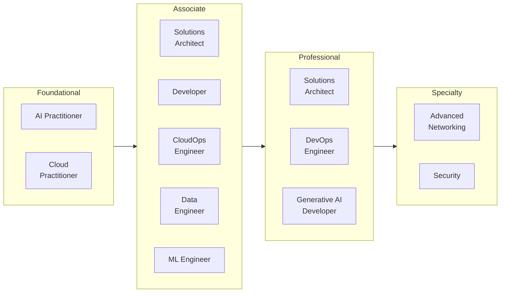
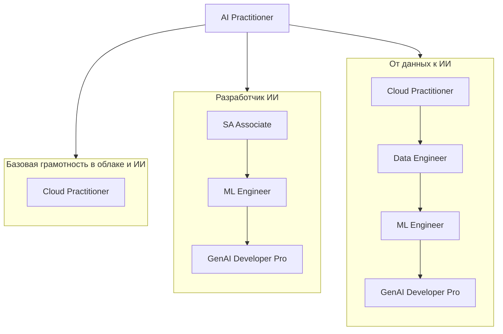
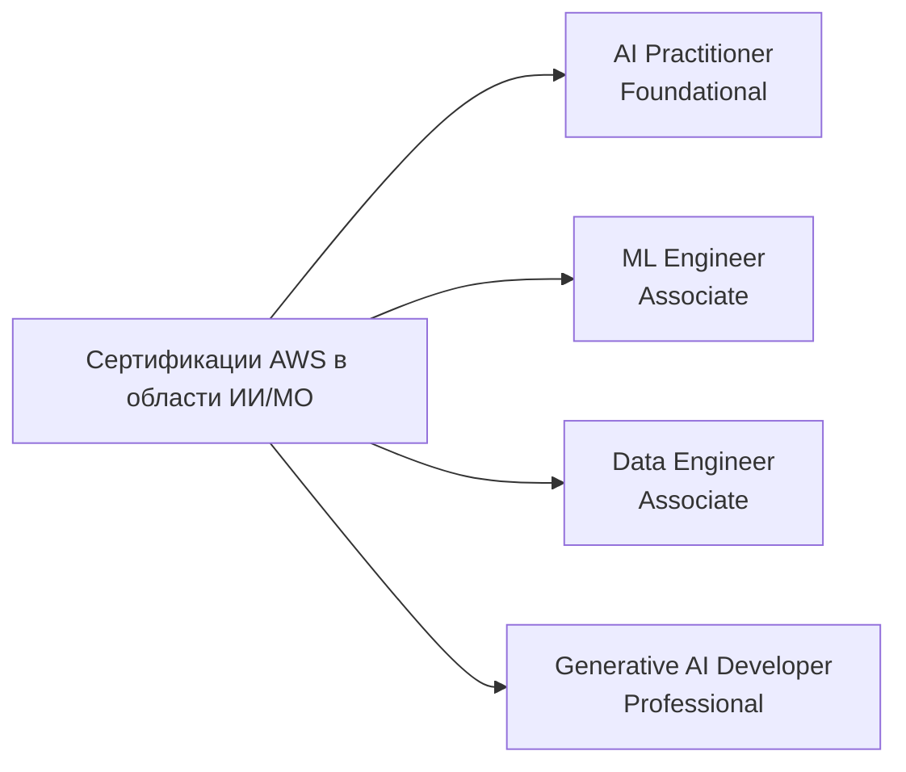
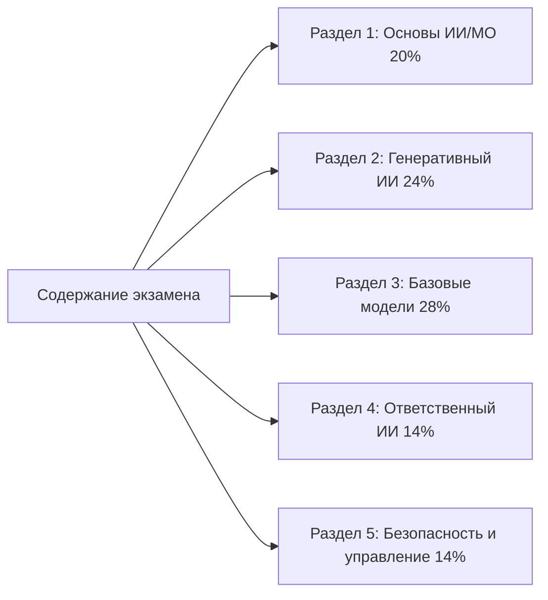
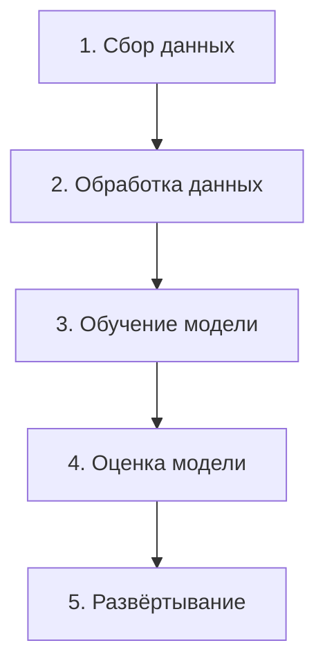

# Сертификации AWS и экзамен AI Practitioner

## Введение в сертификации AWS

Сертификации AWS подтверждают экспертизу в области облачных и ИИ-технологий, лежащих в основе большинства современных корпоративных вычислений. Они широко признаны в отрасли как показатель технической компетентности и как структурированный путь для специалистов, желающих развить навыки эффективного использования AWS. Для организаций, проходящих цифровую трансформацию, сертифицированные профессионалы привносят экспертизу, которая напрямую влияет на скорость реализации проектов и снижение числа дорогостоящих ошибок.

Преимущества выходят за рамки самого сертификата. Сертифицированные специалисты сообщают о более высоких зарплатах, большем числе предложений о трудоустройстве и лучших возможностях для карьерного роста.[^006001] Навыки, стоящие за сертификацией, соответствуют реальным задачам, а цикл пересертификации позволяет держателям оставаться актуальными по мере развития портфолио AWS.

## Путь сертификации AWS

AWS организует программу сертификации на четыре уровня: Foundational, Associate, Professional и Specialty. Такая структура позволяет специалистам начинать с широких знаний и переходить к специализированной экспертизе в соответствии с карьерными целями.



*Рисунок 0.6.1: Полный портфель сертификаций AWS на май 2026 года, сгруппированный по уровням. Двенадцать актуальных сертификаций охватывают роли от базовой грамотности в области облака до глубокой инженерии ИИ. AI Practitioner — одна из двух базовых сертификаций; Generative AI Developer на уровне Professional расширяет трек ИИ/МО для более подготовленной аудитории.*

На диаграмме видно, как сертификация **AI Practitioner** располагается рядом с **Cloud Practitioner** на базовом уровне.[^006002] Сертификация Machine Learning Specialty, которая раньше являлась основой углублённого технического трека ИИ/МО, была упразднена 31 марта 2026 года и заменена сертификациями **Machine Learning Engineer - Associate** и **Generative AI Developer - Professional**.[^006003] В 2025 году AWS также переименовала SysOps Administrator - Associate в **CloudOps Engineer - Associate**.

Лестница сертификаций AWS не выглядит как единая прямая линия. Разные роли идут разными путями к одним и тем же продвинутым квалификациям. Карта ниже показывает три распространённых многоэтапных маршрута:



*Рисунок 0.6.2: Три типичных пути через портфель сертификаций AWS. Трек базовой грамотности в облаке и ИИ завершается на AI Practitioner. Треки разработчика ИИ и перехода от данных к ИИ сходятся на Generative AI Developer - Professional, но начинаются с разных сертификатов уровня Associate.*

Специалист может остановиться после AI Practitioner, если цель — принятие обоснованных решений, а не практическая инженерия. Специалист, планирующий создавать ИИ-агентов в промышленной среде, как правило, получает дополнительную пользу от Solutions Architect - Associate и Machine Learning Engineer - Associate перед переходом к Generative AI Developer - Professional.

Для сохранения актуальности AWS требует пересдачи сертификационного экзамена каждые три года, что позволяет держателям оставаться в курсе новых сервисов и лучших практик.

## Сертификация AWS Certified AI Practitioner

### Обзор и позиционирование

Сертификация AWS Certified AI Practitioner отвечает на стремительно растущую потребность в грамотности в области ИИ в организациях. Она подтверждает базовые знания в области искусственного интеллекта, машинного обучения и генеративного ИИ на AWS с акцентом на практическое применение в бизнесе, а не на деталях реализации.

Сертификация ориентирована на бизнес-аналитиков, продакт-менеджеров, специалистов ИТ-поддержки и других профессионалов, работающих совместно с ИИ, но не обязательно создающих его. Подтверждая вашу способность оценивать варианты ИИ и взаимодействовать с инженерными командами, она помогает организациям более осознанно внедрять возможности ИИ и избегать дорогостоящих ошибок.

### Отличия от других сертификаций AWS в области ИИ/МО

Сертификации AWS в области ИИ/МО образуют чётко дифференцированный набор. Они нацелены на разную аудиторию и разный уровень навыков.



*Рисунок 0.6.3: Карта сертификаций AWS в области ИИ/МО. Каждая сертификация нацелена на определённую аудиторию и глубину навыков — от базовой бизнес-грамотности до промышленной архитектуры на уровне Professional.*

Сертификация **Generative AI Developer - Professional** (AIP-C01) подтверждает экспертизу в проектировании, создании и вводе в промышленную эксплуатацию решений на основе генеративного ИИ в AWS. Она ориентирована на архитекторов и старших инженеров, владеющих ИИ-системами от начала до конца.

Сертификация **Machine Learning Engineer - Associate** (MLA-C01) подтверждает навыки создания, развёртывания и мониторинга МО-моделей в промышленной среде. Она ориентирована на МО-инженеров и разработчиков, отвечающих за МО-часть приложения.

Сертификация **Data Engineer - Associate** (DEA-C01) сосредоточена на инфраструктуре данных, от которой зависят проекты ИИ/МО. Она ориентирована на инженеров, создающих и поддерживающих конвейеры и уровни хранения данных для рабочих нагрузок ИИ.

В отличие от них, **AI Practitioner** делает акцент на основах и бизнес-применении. Он разработан для профессионалов, использующих решения ИИ/МО, а не для тех, кто их создаёт. Основная аудитория — бизнес-аналитики, продакт-менеджеры и технически грамотные специалисты ИТ-поддержки.

Такая четырёхуровневая дифференциация отражает зрелость рынка ИИ/МО. Создание, развёртывание и управление ИИ теперь требуют достаточно специализированных навыков, чтобы AWS предлагал отдельную сертификацию для каждого уровня.

## Детали и структура экзамена

### Обзор экзамена

Экзамен AWS Certified AI Practitioner (AIF-C01) содержит 65 вопросов, на которые отводится 90 минут. Он доступен на английском, японском, корейском, португальском (бразильский) и упрощённом китайском языках. Минимальный проходной балл — 700 по шкале от 100 до 1000.

Текущая версия экзамена — **V1.1**, опубликованная 30 апреля 2026 года и вступившая в силу примерно через месяц после публикации.[^006004] В версии V1.1 к охватываемому материалу добавлены агентный ИИ, Amazon Bedrock AgentCore, Strands Agents, Kiro и Amazon Quick. Также удалена ссылка на Amazon MemoryDB. Изменения целей достаточно существенны, чтобы любые материалы для подготовки, созданные до середины 2026 года, требовали сверки с актуальным руководством по экзамену.



*Рисунок 0.6.4: Вес разделов AIF-C01 V1.1. Разделы 2 и 3 вместе охватывают генеративный ИИ и применение базовых моделей и в совокупности составляют более половины оцениваемого содержания.*

Базовые модели и генеративный ИИ в совокупности составляют более половины экзамена, что соответствует тому, насколько стремительно эти темы вышли в центр корпоративной работы с ИИ. Экзамен оценивает вашу способность:

- Демонстрировать понимание концепций ИИ/МО и генеративного ИИ, а также сервисов AWS
- Оценивать подходящие сценарии использования для разных технологий ИИ
- Принимать обоснованные решения о внедрении ИИ-решений
- Применять принципы ответственного ИИ и управления

### Целевая аудитория

Идеальный кандидат имеет примерно шестимесячный опыт работы с технологиями ИИ/МО на AWS. Вы должны быть знакомы с использованием решений ИИ/МО, но не обязаны уметь их создавать самостоятельно. Необходимо рабочее знание **основных сервисов AWS**, включая Amazon EC2, Amazon S3, AWS Lambda, Amazon Bedrock и Amazon SageMaker AI.[^006005]

Также необходимо рабочее понимание **модели общей ответственности AWS**, управления удостоверениями и доступом AWS (IAM) и ценовых моделей сервисов AWS.

Разные специалисты могут получить различную пользу от этой сертификации:

*Таблица 0.6.1: Роли, получающие пользу от сертификации AWS Certified AI Practitioner.*

| Категория ролей | Основные специалисты | Основные преимущества | Ключевые активности |
|---|---|---|---|
| Лица, принимающие бизнес-решения | Менеджеры проектов, бизнес-аналитики, руководители | Возможности стратегического планирования и оценки | Оценка ИИ-инициатив, оценка реализуемости, разработка дорожных карт внедрения |
| Технологические специалисты | Сотрудники ИТ, облачные архитекторы, технические консультанты | Знания в области технической интеграции и поддержки | Поддержка ИИ-систем, проектирование интегрированных решений, оценка платформ |
| Отраслевые специалисты | Отраслевые эксперты, исследователи, специалисты QA | Понимание отраслевого применения ИИ | Направление реализации, обеспечение качества, изучение применений |
| Поддержка и операции | Операционные команды, менеджеры по работе с клиентами, технические писатели | Операционное совершенство и возможности поддержки | Управление ИИ-сервисами, документирование систем, разработка обучающих программ |

Сертификация не требует разработки моделей ИИ/МО, реализации инженерии данных, настройки гиперпараметров, создания конвейеров ИИ/МО, математического анализа моделей или разработки полных фреймворков управления. Это входит в компетенцию сертификаций более высокого уровня.

### Структура и оценивание экзамена

Экзамен содержит 50 оцениваемых вопросов и 15 неоцениваемых вопросов, которые AWS использует для оценки потенциальных будущих материалов. Неоцениваемые вопросы распределены по всему экзамену и не обозначены. Штрафа за угадывание нет; без ответа вопросы засчитываются как неправильные.

Модель оценивания имеет четыре характеристики, которые стоит знать:

- Масштабированная оценка по шкале от 100 до 1000
- Минимальный проходной балл — 700
- Компенсаторное оценивание: нет необходимости проходить каждый раздел отдельно, только общий экзамен
- Масштабированная оценка по нескольким формам экзамена для обеспечения справедливой сложности разных версий

В отчёте о результатах указываются общий статус (сдал/не сдал), масштабированный балл и обратная связь по разделам, отражающая сильные и слабые стороны. Обратная связь по разделам — это общее руководство, а не точная оценка по каждому разделу.

Стандартная продолжительность экзамена — 90 минут. Носители других языков, сдающие экзамен на английском, могут запросить продление на 30 минут (аккомодация «ESL +30»), что в сумме даёт 120 минут.

## Типы вопросов на экзамене

Экзамен использует четыре формата вопросов. Знание форматов заранее помогает рационально распределить время и избежать неожиданностей.

### Вопросы с одним правильным ответом

Вопросы с одним правильным ответом представляют сценарий или концепцию с четырьмя вариантами ответов: один правильный и три неверных. Неверные варианты разработаны для проверки распространённых заблуждений и подтверждения того, что вы понимаете глубину темы, а не только её поверхность.

Пример:

```
Какой сервис AWS предоставляет полностью управляемую среду для создания, обучения
и развёртывания моделей машинного обучения в масштабе?

A) Amazon EC2     - Предоставляет виртуальные серверы, но требует ручной настройки МО
B) Amazon S3      - Предлагает хранилище, но не возможности МО
C) Amazon SageMaker AI - Специализированный управляемый сервис для рабочих процессов МО
D) Amazon Redshift - Сервис хранилища данных без встроенных функций МО

Правильный ответ: C
```

Неправильные варианты — это сервисы, которые так или иначе участвуют в рабочих процессах МО, но не предоставляют полный опыт управляемого МО.

### Вопросы с несколькими правильными ответами

Вопросы с несколькими правильными ответами требуют выбора двух и более правильных ответов из пяти и более вариантов. Для получения зачёта необходимо выбрать все правильные ответы. Частичный зачёт не предусмотрен.

```
Какие ДВА возможности предоставляет Amazon SageMaker Studio? (Выберите ДВА)

A) Интегрированная среда разработки (IDE) для МО
B) Автоматическое развёртывание моделей и мониторинг
C) Чистая вычислительная мощность для обучения
D) Хранилище объектов для наборов данных
E) Управление реляционными базами данных

Правильные ответы: A, B
```

При встрече с вопросом с несколькими ответами:

1. Внимательно прочитайте вопрос и отметьте, сколько именно ответов требуется.
2. Оцените каждый вариант самостоятельно, прежде чем сравнивать их между собой.
3. Убедитесь, что вы выбрали точно указанное количество ответов.
4. Проверьте, что все ваши выборы верны, поскольку частичный зачёт не предусмотрен.

### Вопросы на упорядочивание

Вопросы на упорядочивание проверяют понимание последовательных процессов. Они предлагают три-пять элементов, которые нужно расположить в правильном порядке для выполнения задачи.



*Рисунок 0.6.5: Канонический рабочий процесс МО, используемый в качестве примера вопроса на упорядочивание. Каждый шаг зависит от предыдущего, а порядок отражает стандартную практику.*

В вопросах на упорядочивание обращайте внимание на:

- Зависимости между шагами
- Требования и предпосылки для сервисов AWS
- Стандартные отраслевые рабочие процессы
- Лучшие практики AWS

### Вопросы на сопоставление

Вопросы на сопоставление требуют соотнести элементы двух списков. Обычно даются три-семь понятий и список описаний к ним: нужно правильно связать каждое понятие с его описанием.

Типичный вопрос на сопоставление:

```
Сопоставьте сервис AWS AI/ML с его основной возможностью:

Подсказки:
1. Amazon Bedrock
2. Amazon SageMaker Canvas
3. Amazon Comprehend
4. Amazon Rekognition

Описания:
A. Создание модели МО и инференс без кода
B. Обработка естественного языка и анализ текста
C. Доступ к базовым моделям и их развёртывание
D. Компьютерное зрение и анализ изображений и видео

Правильные соответствия: 1-C, 2-A, 3-B, 4-D
```

При работе с вопросами на сопоставление:

1. Внимательно прочитайте все элементы обоих списков, прежде чем делать первые сопоставления.
2. Сначала зафиксируйте очевидные совпадения, затем сужайте остальные методом исключения.
3. Используйте метод исключения для оставшихся сложных пар.
4. Проверьте каждое соответствие на основе ваших знаний AWS.

## Советы по подготовке к экзамену

### Управление временем

Эффективное управление временем имеет для многих кандидатов большее значение, чем объём знаний. Несколько практических рекомендаций:

1. Запишите количество вопросов и отведённое время в начале экзамена.
2. Ориентируйтесь на примерно 80 секунд на вопрос при первом проходе.
3. Не тратьте более двух минут на один вопрос.
4. Отметьте сложные вопросы флажком и вернитесь к ним после первого прохода.
5. Оставьте не менее пяти-десяти минут в конце для проверки.

Если английский не ваш родной язык, AWS позволяет запросить дополнительные 30 минут на экзамене в качестве аккомодации. Запрос нужно подать через аккаунт AWS Certification до бронирования экзамена; после одобрения он применяется ко всем экзаменам AWS, которые вы планируете с этого аккаунта.

### Ключевые области

Экзамен делает акцент на практическом применении, а не на запоминании. Ключевые области:

- Основные концепции и терминология ИИ/МО, включая агентный ИИ, RAG и MCP
- Подходящий ИИ-сервис для конкретной бизнес-задачи
- Возможности и ограничения сервисов AWS, особенно Amazon Bedrock и семейства AgentCore
- Принципы ответственного ИИ: предвзятость, справедливость, прозрачность и объяснимость
- Безопасность: Amazon Bedrock Guardrails и модель общей ответственности AWS для ИИ

Вопросы проверяют вашу способность применять знания в реалистичных сценариях, а не умение цитировать определения.

### Ресурсы для подготовки

AWS предлагает широкий спектр ресурсов для подготовки через AWS Skill Builder, включая бесплатный и платный контент.[^006006]

*Таблица 0.6.2: Ключевые ресурсы для подготовки к сертификациям AWS.*

| Тип ресурса | Описание | Лучше всего подходит для |
|---|---|---|
| Цифровое обучение | Самостоятельные онлайн-курсы | Понимание основных концепций |
| Аудиторное обучение | Очные занятия с инструктором | Интерактивное обучение и прямое руководство |
| Пробные экзамены | Образцы вопросов и сценарии | Подготовка к экзамену и анализ пробелов |
| Документация | Технические руководства и белые книги | Углублённое получение технических знаний |
| Практические лабораторные работы | Практические упражнения в консоли AWS | Реальный опыт и проверка навыков |

Для AIF-C01 в особенности сосредоточьтесь на основах ИИ/МО, разделах GenAI и FM, а также на новом материале об агентном ИИ, добавленном в V1.1. Практическая работа с **Amazon Bedrock**, игровой площадкой моделей и **Amazon Bedrock AgentCore** обеспечивает наилучшую отдачу от учебного времени, когда основы уже освоены.

## Заключение

Сертификация AWS Certified AI Practitioner подтверждает необходимые знания о современном ИИ на AWS: классическое МО, генеративный ИИ, агентный ИИ и принципы ответственного ИИ, которые всё чаще сопровождают их. Разработанная для бизнес-аналитиков, продакт-менеджеров и других профессионалов, использующих ИИ, а не создающих его, сертификация демонстрирует вашу способность:

- Принимать обоснованные решения о внедрении технологий ИИ
- Взаимодействовать с техническими командами по вопросам ИИ-инициатив
- Определять подходящие сценарии использования для нужных ИИ-сервисов
- Применять принципы ответственного ИИ в организации
- Ориентироваться в быстро развивающемся ИИ-ландшафте на AWS

Получив эту сертификацию, вы закладываете основу для понимания ИИ, концентрируясь на бизнес-ценности, а не на технической реализации. Это делает её полезным сертификатом по мере перехода всё большего числа организаций от экспериментов с ИИ к его промышленному внедрению через такие сервисы, как Amazon Bedrock, Amazon Bedrock AgentCore, Amazon SageMaker AI и Kiro.

Сертификации AWS остаются путём для подтверждения облачной экспертизы и ускорения карьерного роста по мере перехода ИИ в область mainstream бизнес-операций. Сертификация AWS Certified AI Practitioner соединяет технические и бизнесовые роли в период стремительного внедрения ИИ, а обновление V1.1 приводит содержание экзамена в соответствие с реальным состоянием рынка в 2026 году.

[^006001]: AWS Certifications. URL: [https://aws.amazon.com/certification/](https://aws.amazon.com/certification/)
    
[^006002]: AWS Certified AI Practitioner. URL: [https://aws.amazon.com/certification/certified-ai-practitioner/](https://aws.amazon.com/certification/certified-ai-practitioner/)
    
[^006003]: AWS Certified Machine Learning Engineer Associate. URL: [https://aws.amazon.com/certification/certified-machine-learning-engineer-associate/](https://aws.amazon.com/certification/certified-machine-learning-engineer-associate/)
    
[^006004]: AIF-C01 Exam Guide Revisions. URL: [https://docs.aws.amazon.com/aws-certification/latest/ai-practitioner-01/aif-01-revisions.html](https://docs.aws.amazon.com/aws-certification/latest/ai-practitioner-01/aif-01-revisions.html)
    
[^006005]: AIF-C01 Target Candidate Description. URL: [https://docs.aws.amazon.com/aws-certification/latest/ai-practitioner-01/ai-practitioner-01.html](https://docs.aws.amazon.com/aws-certification/latest/ai-practitioner-01/ai-practitioner-01.html)
    
[^006006]: AWS Skill Builder. URL: [https://skillbuilder.aws/](https://skillbuilder.aws/)
