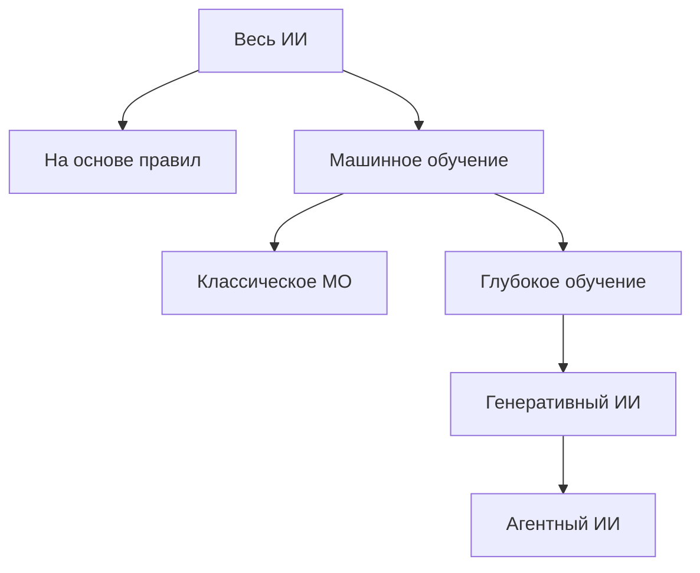
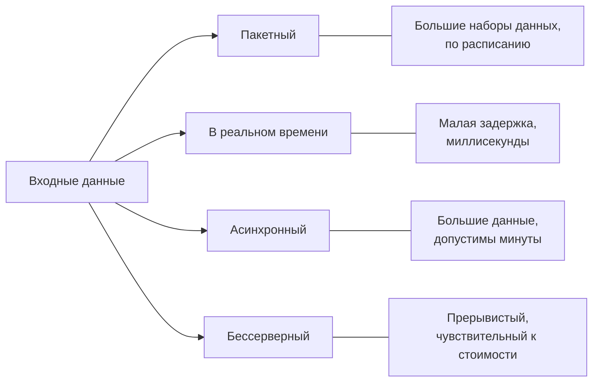
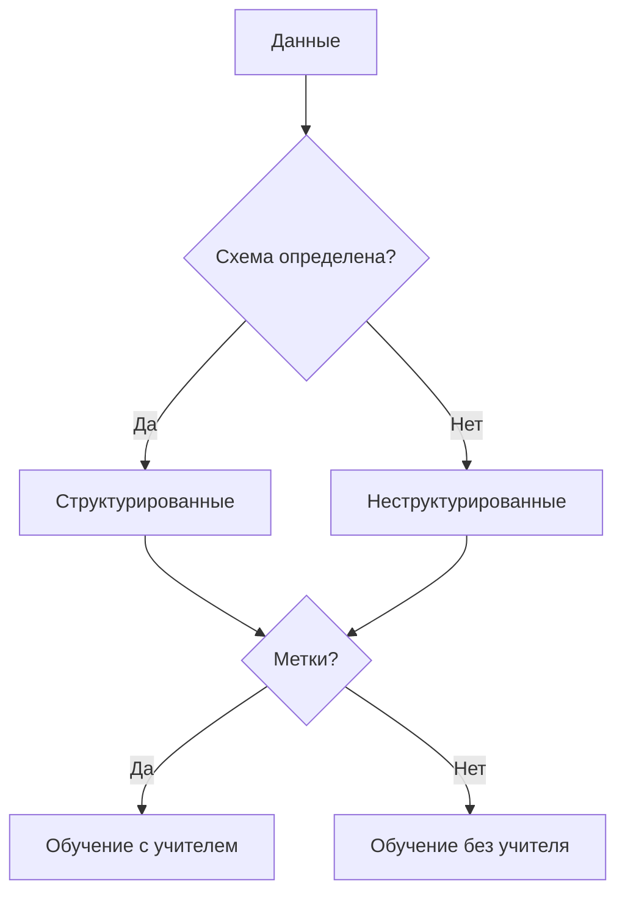
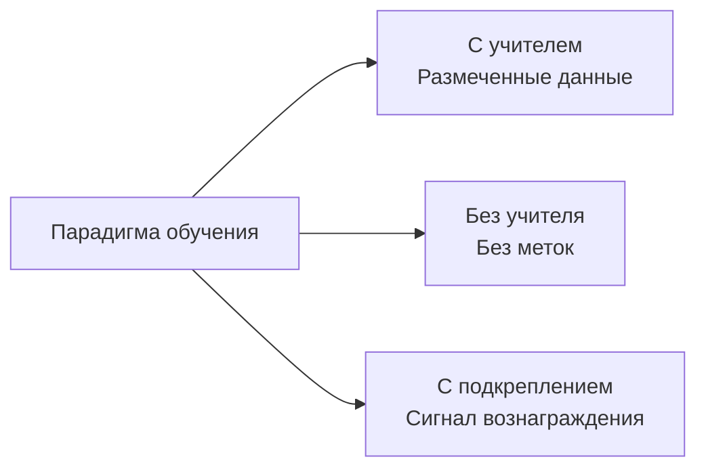

## Тема 1.1. Основные концепции и терминология ИИ

Словарь искусственного интеллекта — это общий язык между бизнес-профессионалами и инженерными командами, с которыми они работают. Прежде чем продакт-менеджер сможет утвердить развёртывание модели, а руководитель — оценить коммерческое предложение вендора ИИ, все участники должны одинаково понимать такие термины, как обучение, инференс, предвзятость и справедливость. Эта тема задаёт общий словарь и сопоставляет каждый термин с сервисами AWS и пунктами экзамена, где он встречается.[^101001]

### 1.1.1 Определение основных терминов ИИ

Понимание ИИ начинается с точных определений. Экзамен проверяет, можете ли вы различать смежные термины, и практические последствия реальны: неточный язык приводит к рассогласованию ожиданий между техническими и нетехническими заинтересованными сторонами.

**Искусственный интеллект (ИИ)** — это широкая область информатики, занимающаяся созданием систем, способных выполнять задачи, обычно требующие человеческого мышления, — например, распознавание изображений, понимание языка или принятие решений в условиях неопределённости.[^101002] ИИ — это не единственная технология; это категория, включающая множество подходов, лишь некоторые из которых предполагают обучение на данных.

**Машинное обучение (МО)** — это подраздел ИИ, в котором система учится распознавать закономерности в данных, а не следует правилам, явно написанным программистом.[^101003] Например, традиционная система обнаружения мошенничества на основе правил может помечать любую транзакцию выше фиксированного денежного порога; система на основе МО, напротив, обучается на тысячах исторических случаев мошенничества и обобщает закономерности, которые никакое фиксированное правило не могло бы уловить.

**Глубокое обучение** — это подраздел МО, в котором используются *нейронные сети* со многими слоями для представления всё более абстрактных закономерностей.[^101004] Слово «глубокое» относится к глубине этих слоёв. Глубокое обучение лежит в основе большинства современных систем распознавания изображений, речи и понимания языка.

**Нейронная сеть** — это вычислительная модель, вдохновлённая структурой биологических нейронов. Данные проходят через слои взаимосвязанных узлов, каждый из которых применяет математическое преобразование. Сеть обучается тому, какие преобразования дают точные выходные данные, регулируя свои внутренние параметры в процессе обучения. Мелкие сети имеют два-три слоя; глубокие сети могут иметь сотни слоёв.

**Компьютерное зрение (КЗ)** — это ветвь ИИ, позволяющая машинам интерпретировать изображения и видео.[^101006] Системы компьютерного зрения могут классифицировать объекты на фотографии, обнаруживать дефекты на производственной линии или подсчитывать автомобили на парковке. На AWS возможности компьютерного зрения доступны через **Amazon Rekognition** для анализа изображений и видео.[^101007]

**Обработка естественного языка (ОЕЯ)** — это ветвь ИИ, позволяющая машинам читать, понимать и генерировать человеческий язык.[^101008] Задачи ОЕЯ включают анализ тональности, распознавание именованных сущностей, перевод и реферирование документов. AWS предоставляет возможности ОЕЯ через такие сервисы, как **Amazon Comprehend** для анализа текста, **Amazon Translate** для языкового перевода и **Amazon Transcribe** для преобразования речи в текст.[^101009] Эти специализированные сервисы — правильный выбор для высокообъёмных, хорошо определённых задач, где важна стоимость каждого вызова и задержка. Для открытых языковых задач, таких как генерация длинных текстов, сложное реферирование или многошаговое рассуждение, **большие языковые модели (LLM)**, доступные через Amazon Bedrock, подходят лучше; Раздел 2 этой книги охватывает их подробно.

**Алгоритм** — это математическая процедура, используемая для обучения модели на данных. Распространённые алгоритмы МО включают линейную регрессию для предсказания непрерывных значений, деревья решений для классификации и градиентный бустинг для структурированных табличных данных. Выбор алгоритма определяет, как модель обобщает знания с обучающих данных на новые входные данные.

**Модель** — это артефакт, получаемый при применении алгоритма к обучающему набору данных. Модель фиксирует закономерности, обнаруженные алгоритмом, и затем может использоваться для предсказания на новых, ранее невиданных данных. Думайте об алгоритме как о рецепте, а о модели — как о готовом блюде.

**Обучение** — это процесс предъявления модели размеченных или неразмеченных данных, в ходе которого её внутренние параметры подстраиваются для минимизации ошибки предсказания. Обучение вычислительно интенсивно и обычно выполняется на инфраструктуре с GPU-ускорением. На AWS задания по обучению чаще всего выполняются на **Amazon SageMaker AI**.

**Инференс** (также называемый *вывод* или *скоринг*) — это процесс использования обученной модели для получения предсказания или вывода для новых входных данных.[^101014] Обучение происходит однократно или периодически; инференс выполняется непрерывно каждый раз, когда пользователь или система запрашивает предсказание.

**Предвзятость** в ИИ — это систематические ошибки в выходных данных модели, возникающие из-за дефектных обучающих данных, дефектного проектирования алгоритма или неправильной постановки задачи.[^101015] Например, модель найма, обученная на исторических данных компании с перекошенной историей найма, может воспроизводить и усиливать эти закономерности. Предвзятость — основная проблема в управлении ответственным ИИ.

**Справедливость** — это свойство модели, дающей равноправные результаты для демографических групп, определённых такими характеристиками, как пол, раса или возраст. Справедливость и предвзятость тесно связаны: модель считается справедливой, когда её предвзятость по отношению к любой защищённой группе ниже приемлемого порога. AWS предоставляет **Amazon SageMaker Clarify** для помощи командам в выявлении и измерении предвзятости в обучающих данных и обученных моделях.[^101017]

**Обобщение** описывает, насколько хорошо усвоенные моделью закономерности соответствуют базовой структуре данных.[^101018] О модели, слишком тесно подогнанной к обучающим данным, говорят, что она *переобучена*: она запоминает шум, а не обобщает закономерности, и её точность на новых данных резко падает. О модели, слишком простой для охвата реальных закономерностей, говорят, что она *недообучена*: она плохо работает как на обучающих, так и на новых данных. Хорошее обобщение находится между этими крайностями.

**Большая языковая модель (LLM)** — это модель глубокого обучения, конкретно нейронная сеть, обученная на огромном корпусе текста, которая может генерировать, резюмировать, переводить и рассуждать о языке на уровне беглости и гибкости, недостижимом с более ранними методами ОЕЯ.[^101019] LLM, такие как Amazon Titan, Anthropic Claude и Meta Llama, лежат в основе большинства современных приложений генеративного ИИ. Их масштаб, измеряемый миллиардами параметров, обеспечивает широкие возможности, но также делает обучение с нуля дорогостоящим.

**Генеративный ИИ (GenAI)** — это класс ИИ, производящий новый контент — текст, изображения, аудио или код — в ответ на запрос.[^101020] Системы GenAI обычно строятся на LLM или аналогичных крупномасштабных генеративных моделях. В отличие от более ранних моделей МО, классифицирующих или предсказывающих единственное значение, система генеративного ИИ производит вывод переменной длины, понятный человеку. Генеративный ИИ и агентный ИИ были добавлены в руководство по экзамену в версии v1.1, чтобы отразить, насколько широко оба были приняты в корпоративных проектах с момента публикации первоначального руководства.

**Агентный ИИ** — это расширение генеративного ИИ, в котором модель получает цель и набор инструментов, а затем автономно планирует и выполняет многошаговые действия для достижения этой цели без необходимости одобрения человека на каждом шаге.[^101021] Механизм рассуждения по-прежнему остаётся генеративной моделью; агентный ИИ добавляет петлю планирования, доступ к инструментам и память, превращая единовременную генерацию в целенаправленное действие. Агентная ИИ-система может просматривать базу знаний, вызывать внешние API, писать код и проверять свои результаты в нескольких последовательных шагах, прежде чем вернуть ответ. Это качественно отличается от одноходового взаимодействия «вопрос-ответ». AWS поддерживает агентный ИИ через **Amazon Bedrock** Agents и **Amazon Bedrock AgentCore**, которые обеспечивают инфраструктуру для многошаговой оркестрации, памяти и использования инструментов.[^101022]

### 1.1.2 Различия между ИИ, МО, GenAI, глубоким обучением и агентным ИИ

Эти пять терминов описывают вложенную иерархию, а не отдельные технологии. Путаница в их взаимосвязях — один из наиболее распространённых источников недоразумений при планировании ИИ-проектов. Каждый термин полностью входит в область применения термина, стоящего над ним.

**Искусственный интеллект** — наиболее широкий термин. Он включает любую технику, которая заставляет компьютерную систему вести себя способом, напоминающим человеческое мышление. Сюда входят экспертные системы на основе правил 1970-х годов, статистическое МО 1990-х годов и сегодняшние нейронные сети.

**Машинное обучение** — это подмножество ИИ, ограничивающее определение системами, которые учатся на данных. Фильтр мошенничества на основе правил, написанный программистом, — это ИИ, но не МО. Модель обнаружения мошенничества, обученная на истории транзакций, — это одновременно и ИИ, и МО.

**Глубокое обучение** — это подмножество МО, в котором используются многослойные нейронные сети. Модель линейной регрессии — это МО, но не глубокое обучение. Свёрточная нейронная сеть, классифицирующая рентгеновские снимки грудной клетки, — это одновременно МО, глубокое обучение и ИИ.

**Генеративный ИИ** — это подмножество глубокого обучения, специально занимающееся генерацией нового контента. Не всё глубокое обучение — генеративное: модель, классифицирующая изображения по десяти категориям, дискриминативна, а не генеративна. Модель, создающая фотореалистичное изображение из текстового описания, — это генеративный ИИ.

**Агентный ИИ** — это архитектурный паттерн, наложенный поверх генеративного ИИ. Агентная система использует LLM или другую генеративную модель в качестве механизма рассуждения, затем добавляет петлю планирования, доступ к инструментам и память, чтобы действовать в несколько шагов. Одноходовой чат-бот на базе LLM — это генеративный ИИ, но не агентный. Система, которая получает высокоуровневую цель, разбивает её на подзадачи, использует инструменты для каждой подзадачи и синтезирует результаты, — это агентный ИИ.

*Рисунок 1.1.1: Вложенность подобластей ИИ. Каждый узел — это истинное подмножество своего родителя; спускаясь по дереву, вы добавляете ограничения и возможности, а не заменяете родительскую концепцию.*

Экзамен часто проверяет пограничные случаи. Кандидат, считающий «ИИ» и «МО» синонимами или путающий «генеративный ИИ» с «глубоким обучением», будет неверно читать сценарные вопросы, зависящие от знания того, какое подмножество применяется. Практические бизнес-последствия столь же конкретны: команда, развёртывающая агентную ИИ-систему, сталкивается с иными задачами управления, стоимости и безопасности, чем команда, работающая с классической моделью классификации МО, поскольку агентные системы совершают реальные действия, а не производят статические выходные данные.

*Таблица 1.1.1: Ключевые различия между подобластями ИИ*

| Термин | Родительская категория | Определяется | Типичный пример AWS |
|------|-----------------|------------|---------------------|
| Искусственный интеллект | Нет | Поведение, похожее на мышление | Любой сервис AWS AI/ML |
| Машинное обучение | ИИ | Обучается на данных | Amazon SageMaker AI |
| Глубокое обучение | МО | Многослойные нейронные сети | SageMaker с GPU-инстансами |
| Генеративный ИИ | Глубокое обучение | Производит новый контент | Amazon Bedrock |
| Агентный ИИ | Генеративный ИИ | Многошаговые автономные действия | Bedrock Agents, Bedrock AgentCore |

Стоит отметить один нюанс: некоторые исследователи классифицируют агентный ИИ как архитектурный паттерн, а не технологическую подобласть, поскольку агентная система состоит из существующих технологий (LLM, инструменты, логика оркестрации), а не представляет новый тип модели. Для целей экзамена рассматривайте агентный ИИ как наиболее специализированный уровень в иерархии.

### 1.1.3 Типы инференса

После обучения модели она должна быть развёрнута, чтобы иметь возможность генерировать предсказания. Способ запроса и возврата этих предсказаний определяет паттерн инференса. Руководство по экзамену v1.1 добавило асинхронный и бессерверный инференс в список, поскольку AWS расширил управляемые возможности инференса после запуска оригинального экзамена.

Четыре стандартных паттерна инференса — пакетный, в реальном времени, асинхронный и бессерверный. Каждый решает различную комбинацию требований пропускной способности и задержки, а выбор неправильного паттерна для сценария использования является одной из наиболее распространённых причин проблем со стоимостью и производительностью в промышленных ИИ-системах.

**Пакетный инференс** обрабатывает большой набор входных данных в одном задании, как правило по расписанию.[^101024] Система собирает входные данные за определённый период, запускает модель для всех сразу и сохраняет результаты для последующего использования. Розничный торговец, генерирующий рекомендации по продуктам на ночь для каждого клиента в своей базе данных, использует пакетный инференс. На AWS **Amazon SageMaker AI** Batch Transform выполняет задания пакетного инференса с данными, хранящимися в **Amazon S3**, масштабируя вычислительный парк на время задания и завершая работу по окончании.

**Инференс в реальном времени** обрабатывает один запрос и возвращает предсказание в течение миллисекунд.[^101026] Модель развёртывается на постоянной конечной точке, остающейся активной и принимающей запросы от приложений. Система обнаружения мошенничества, которая должна оценить транзакцию по кредитной карте до тайм-аута платёжного терминала клиента, требует инференса в реальном времени. На AWS реальновременные конечные точки SageMaker AI размещают модели за постоянной HTTPS-конечной точкой и могут применять *Auto Scaling* для обработки переменных объёмов запросов.

**Асинхронный инференс** (иногда называемый *очередным* или *почтипакетным*, поскольку разделяет модель обработки в очереди пакетных заданий, работая с одним запросом за раз) принимает запрос, ставит его в очередь и возвращает результат через механизм обратного вызова или опроса, а не в рамках исходного окна тайм-аута запроса.[^101028] Этот паттерн подходит, когда входные данные велики или когда модель обрабатывает их дольше, чем может разумно ожидать веб-запрос. Например, система интеллектуальной обработки документов, обрабатывающая многостраничные контракты, может занимать от 30 до 90 секунд на документ: синхронный веб-вызов истечёт по тайм-ауту, но асинхронный паттерн позволяет вызывающей системе проверить результат позже. На AWS конечные точки SageMaker AI Async Inference принимают большие полезные нагрузки, ставят их в очередь и записывают выходные данные в S3 для получения.

**Бессерверный инференс** запускает модель по требованию без необходимости предварительного развёртывания постоянной конечной точки.[^101030] Базовые вычисления масштабируются до нуля в простое, устраняя фиксированные затраты на работающую конечную точку. Бессерверный инференс хорошо подходит для прерывистых или непредсказуемых рабочих нагрузок, где стоимость простоя превышает выгоду от низкой задержки. На AWS SageMaker AI Serverless Inference автоматически выделяет и освобождает ресурсы вычислений, с компромиссом в том, что первый запрос после периода бездействия может испытать задержку *холодного запуска*.

*Рисунок 1.1.2: Выбор паттерна инференса. Выбор зависит от сочетания объёма входных данных, допустимой задержки и ограничений по стоимости для конкретного сценария использования.*

*Таблица 1.1.2: Сравнение паттернов инференса*

| Паттерн | Задержка | Размер входных данных | Модель стоимости | Лучше всего подходит для |
|---------|---------|------------|------------|----------|
| Пакетный | Минуты-часы | Очень большой | За задание | Ночной скоринг, массовые отчёты |
| В реальном времени | Миллисекунды | Малый | За час конечной точки | Обнаружение мошенничества, живые рекомендации |
| Асинхронный | Секунды-минуты | Большой | За запрос | Обработка документов, анализ видео |
| Бессерверный | Секунды (холодный), мс (тёплый) | Малый-средний | За инференс | Низкотрафиковые API, прерывистое использование |

Понимание различий в стоимости важно для бизнес-профессионалов: постоянная конечная точка реального времени начисляет стоимость круглосуточно, независимо от наличия трафика, тогда как бессерверный инференс взимает плату только за фактическое использование. Для системы, обрабатывающей запросы только в рабочие часы, разница в стоимости может быть существенной.

### 1.1.4 Типы данных в ИИ-моделях

ИИ-модели формируются данными, на которых они обучаются, а данные бывают разных форм. Тип данных, которые ожидает модель, определяет, какие алгоритмы подходят, какие шаги предобработки требуются и как модель может быть развёрнута. Бизнес-профессионал, способный описать данные своей организации в этих терминах, может значительно эффективнее взаимодействовать с командой специалистов по данным.

Первое фундаментальное различие — между **размеченными данными** и **неразмеченными данными**.[^101032] Размеченные данные включают как входные данные (например, изображение кошки), так и правильный ответ (метку «кошка»). Неразмеченные данные включают только входные данные без соответствующего ответа. Размеченные наборы данных дороже в создании, поскольку требуют аннотирования человеком, но необходимы для обучения с учителем. Неразмеченные наборы данных обширны и дёшевы, но требуют методов обучения без учителя или самообучения для извлечения закономерностей.

Помимо разграничения «размеченные-неразмеченные», данные также различаются по структуре и формату:

- **Табличные данные** организованы в строки и столбцы, как в электронной таблице или таблице реляционной базы данных. Каждый столбец представляет признак (например, возраст, баланс счёта или сумма транзакции), а каждая строка — одно наблюдение. Классические алгоритмы МО, такие как деревья с градиентным бустингом, особенно хорошо работают с табличными данными.
- **Данные временных рядов** — это последовательность измерений, записанных через регулярные интервалы времени. Цены на акции, загрузка ЦПУ сервера и показания пульса пациента являются данными временных рядов. Модели, обученные на данных временных рядов, учатся временным закономерностям, таким как тренды, сезонность и аномалии.
- **Данные изображений** состоят из значений пикселей, организованных в двумерной сетке, потенциально с несколькими цветовыми каналами. Модели компьютерного зрения учатся обнаруживать края, формы, текстуры и объекты из данных изображений. Требования к объёму высоки: значимый набор данных изображений обычно содержит от десятков тысяч до миллионов размеченных примеров.
- **Текстовые данные** состоят из последовательностей слов или символов на естественном языке. Модели ОЕЯ учатся грамматике, семантике и фактическим ассоциациям из текста. Большие языковые модели обучаются на текстовых корпусах, содержащих сотни миллиардов слов.

Второе ортогональное различие применяется ко всем этим форматам: **структурированные данные** имеют чётко определённую схему, например таблица базы данных с типизированными столбцами.[^101037] **Неструктурированные данные** не имеют предопределённой схемы: они включают свободный текст, изображения, аудио и видео. Структурированные данные более непосредственно пригодны для классических алгоритмов МО; неструктурированные данные обычно требуют модели на основе нейронных сетей или шага предобработки для извлечения структурированных признаков.

*Таблица 1.1.3: Типы данных в ИИ-моделях*

| Тип данных | Структура | Типичный подход МО | Пример сервиса AWS |
|-----------|-----------|---------------------|---------------------|
| Табличные | Структурированные | Градиентный бустинг, линейные модели | Встроенные алгоритмы SageMaker AI |
| Временные ряды | Структурированные | Последовательные модели, LSTM, DeepAR | SageMaker AI DeepAR |
| Изображения | Неструктурированные | Свёрточные нейронные сети | Amazon Rekognition, SageMaker AI |
| Текст | Неструктурированные | Модели трансформеров, LLM | Amazon Comprehend, Amazon Bedrock |

**Amazon SageMaker Ground Truth** помогает командам создавать размеченные наборы данных, сочетая автоматическую разметку с проверкой человеком, снижая время и стоимость аннотирования в масштабе.[^101038]

На практике реальные ИИ-проекты часто объединяют типы данных. Модель оттока клиентов может использовать табличные данные CRM наряду с текстом из заявок в поддержку, что требует от команды создания или выбора моделей, способных обрабатывать обе модальности. Знание того, какими типами данных организация уже располагает в избытке, помогает определить, какие ИИ-подходы практически реализуемы.

*Рисунок 1.1.3: Дерево решений по типу данных. Наличие структуры и меток вместе определяют, какой подход к обучению реализуем для конкретного набора данных.*

### 1.1.5 Типы обучения ИИ/МО

Способ, которым модель обучается на данных, называется *парадигмой обучения*. Парадигма обучения определяет, какой тип данных требуется модели, как она обобщает знания и какие задачи может решать. Экзамен проверяет все три основные парадигмы: обучение с учителем, без учителя и с подкреплением.

**Обучение с учителем** тренирует модель на наборе данных, в котором каждые входные данные сопровождаются правильной выходной меткой.[^101039] Модель учится отображать входные данные на выходные, минимизируя разницу между своими предсказаниями и известными метками. Это наиболее часто используемая парадигма в коммерческом ИИ, поскольку она производит модели, которые легко оценивать: точность измеряется на отложенном тестовом наборе размеченных примеров.

Обучение с учителем охватывает два основных типа задач. *Регрессия* предсказывает непрерывное числовое значение, например ожидаемую выручку от клиента в следующем квартале. *Классификация* относит входные данные к одной из дискретных категорий, например помечает электронное письмо как спам или не спам. Большинство систем рекомендации товаров, обнаружения мошенничества и медицинской диагностики используют модели классификации или регрессии с учителем.

**Обучение без учителя** тренирует модель на данных без меток.[^101041] Модель должна самостоятельно находить структуру в данных без руководства о том, каков правильный ответ. Наиболее распространённый метод обучения без учителя — *кластеризация*, при которой модель группирует похожие входные данные. Например, маркетинговая команда может применить кластеризацию без учителя к историям покупок клиентов, чтобы обнаружить естественные клиентские сегменты для целевых кампаний. Другой распространённый метод — *снижение размерности*, сжимающее многомерные данные до меньшего числа измерений с сохранением наиболее важной структуры, что упрощает визуализацию или подачу в нижестоящую модель.

**Обучение с подкреплением** тренирует агента для совершения действий в среде, вознаграждая его за хорошие результаты и штрафуя за плохие.[^101043] Агент обучается *политике*: отображению из наблюдаемого состояния на действие, максимизирующее совокупное вознаграждение со временем. Обучение с подкреплением — это парадигма, лежащая в основе ИИ-систем, играющих в игры, и всё чаще — промышленных приложений, таких как управление роботами, оптимизация цепочек поставок и системы персонализированных рекомендаций контента, оптимизирующие долгосрочное взаимодействие, а не немедленный переход по ссылке.

*Таблица 1.1.4: Сравнение парадигм обучения ИИ/МО*

| Парадигма | Входные данные | Обучается | Распространённые сценарии использования |
|----------|-----------|--------|-----------------|
| С учителем | Размеченные | Отображение вход-выход | Классификация, регрессия, обнаружение мошенничества |
| Без учителя | Неразмеченные | Скрытая структура | Сегментация клиентов, обнаружение аномалий |
| С подкреплением | Сигналы вознаграждения | Оптимальная политика | Робототехника, игры, персонализация |

На краях области видимости экзамена встречаются две дополнительные парадигмы. *Полуобучение с учителем* сочетает небольшое количество размеченных данных с большим количеством неразмеченных, что полезно при дороговизне разметки.[^101045] *Самообучение с самонаблюдением* автоматически генерирует метки из самих данных, например маскируя слово в предложении и обучая модель предсказывать пропущенное слово. Самообучение с самонаблюдением — это метод, лежащий в основе этапа предварительного обучения большинства современных больших языковых моделей.

*Рисунок 1.1.4: Обзор парадигм обучения. Три основные парадигмы различаются типом обратной связи, которую модель получает в процессе обучения.*

Выбор парадигмы обучения — это практическое бизнес-решение, а не только техническое. Обучение с учителем требует размеченных данных, создание которых стоит денег. Обучение без учителя избегает этих затрат, но не может напрямую оптимизировать конкретный бизнес-результат. Обучение с подкреплением позволяет оптимизировать сложные многошаговые цели, но требует более тщательного проектирования функции вознаграждения и сложнее проверяется на предвзятость и справедливость. Бизнес-профессионал, понимающий эти компромиссы, может задавать правильные вопросы, когда команда специалистов по данным предлагает подход.

## Вопросы для самопроверки

**Вопрос 1.** Розничная компания создаёт систему, которая автоматически категоризирует заявки клиентской поддержки по одному из пяти типов проблем (выставление счетов, возвраты, доставка, качество продукта, прочее). У команды есть набор данных из 50 000 заявок, уже проверенных и категоризированных операторами. Какая парадигма обучения МО наиболее подходит для этого сценария использования?

A. Обучение без учителя, поскольку модель должна находить структуру в текстовых данных без человеческого руководства.
B. Обучение с подкреплением, поскольку модель должна научиться политике маршрутизации заявок в нужную команду.
C. Обучение с учителем, поскольку у команды есть размеченные примеры и задача — классифицировать новые входные данные в заранее определённые категории.
D. Самообучение с самонаблюдением, поскольку модель должна предсказывать замаскированные слова в тексте заявки.

**Ответ: C.**

Определяющая характеристика обучения с учителем — наличие в каждом обучающем примере как входных данных, так и известной правильной выходной метки. В данном сценарии 50 000 заявок уже были категоризированы операторами, то есть каждая заявка имеет метку («выставление счетов», «возвраты» и т. д.). Задача модели — научиться отображению текста заявки на категорию и применять это отображение к новым, неразмеченным заявкам. Это типичная задача классификации, являющаяся подтипом обучения с учителем.[^101047]

Обучение без учителя (вариант A) неверно, поскольку набор данных размечен. Методы обучения без учителя, такие как кластеризация, обнаружат группы в данных, но эти группы могут не совпадать с пятью предопределёнными бизнес-категориями. Обучение с подкреплением (вариант B) неверно, поскольку нет среды для действий агента и нет отложенного сигнала вознаграждения; правильный ответ для каждого обучающего примера известен немедленно. Самообучение с самонаблюдением (вариант D) — это метод предварительного обучения языковых моделей путём маскирования токенов и их предсказания; это не правильная постановка задачи классификации, где доступны метки истинности.

---

**Вопрос 2.** Финансовая компания хочет развернуть модель обнаружения мошенничества, которая должна возвращать предсказание в течение 200 миллисекунд для каждой транзакции по карте на точке продажи. Модель представляет собой относительно небольшую модель классификации. Какой паттерн инференса должна использовать команда?

A. Пакетный инференс, поскольку высокий объём транзакций делает пакетную обработку более экономически эффективной.
B. Инференс в реальном времени, поскольку сценарий использования требует предсказания до истечения тайм-аута транзакции.
C. Асинхронный инференс, поскольку обработка каждой транзакции по отдельности снижает конкуренцию в очереди.
D. Бессерверный инференс, поскольку транзакции по карте происходят с перерывами.

**Ответ: B.**

Инференс в реальном времени — это подходящий паттерн, когда предсказание должно быть возвращено в рамках временно́го окна пользовательского или чувствительного ко времени действия.[^101048] Транзакция по карте на торговой точке обычно истекает менее чем за одну секунду, что делает требование в 200 миллисекунд жёстким ограничением. Конечные точки реального времени в Amazon SageMaker AI поддерживают постоянную модель за HTTPS-конечной точкой, синхронно отвечающей в течение миллисекунд.

Пакетный инференс (вариант A) неверен, поскольку пакетные задания объединяют входные данные и обрабатывают их вместе по расписанию: предсказание придёт через часы после транзакции, что делает его бесполезным для предотвращения мошенничества в реальном времени. Асинхронный инференс (вариант C) неверен, поскольку асинхронные паттерны принимают запрос, ставят его в очередь и возвращают результат позже через обратный вызов или опрос; вызывающая система не получает немедленного ответа. Бессерверный инференс (вариант D) мог бы соответствовать требованию по задержке при тёплой конечной точке, но холодные запуски могут занимать несколько секунд, что нарушило бы требование в 200 миллисекунд для первого запроса после периода бездействия. Постоянная конечная точка реального времени избегает холодных запусков и является стандартным паттерном для чувствительных к задержке предсказаний.

---

**Вопрос 3.** Команда специалистов по данным готовит обучающий набор данных для модели оттока клиентов. Половина набора данных содержит явные метки оттока (ушедшие или удержанные) из исторических записей. Другая половина содержит журналы взаимодействия клиентов без зафиксированного результата оттока. Какой тип данных представляет размеченная половина?

A. Данные временных рядов, поскольку записи фиксируют события за период времени.
B. Неразмеченные данные, поскольку цель — обнаружить скрытые клиентские сегменты.
C. Размеченные данные, поскольку каждая запись сопровождается известным результатом (ушедший или удержанный).
D. Неструктурированные данные, поскольку записи содержат поля свободного текста из взаимодействий с поддержкой.

**Ответ: C.**

Размеченные данные определяются наличием правильного вывода, сопровождающего каждый входной пример.[^101049] В рассматриваемом сценарии исторические записи включают переменную результата (ушедший или удержанный), которую модель с учителем научится предсказывать. Формат данных (в нашем случае табличный) — отдельное измерение, независимое от разграничения «размеченные-неразмеченные». Запись может быть одновременно табличной и размеченной.

Вариант A (временные ряды) — это отдельное измерение типа данных; записи могут иметь или не иметь временны́е метки, но это не определяет, являются ли они размеченными. Вариант B неверен, поскольку «неразмеченные» — это парадигма обучения, а не тип данных, а вопрос касается классификации данных, а не метода, который команда применит к ним. Вариант D неправильно применяет разграничение «структурированные-неструктурированные»: структурированные данные определяются наличием схемы (строки и столбцы), что верно для большинства записей CRM и транзакций независимо от наличия полей свободного текста. Вопрос конкретно спрашивает о размеченной половине, что делает C единственным правильным описанием.

---

**Вопрос 4.** Организация создаёт ИИ-систему, которая получает высокоуровневую цель, например «подготовить отчёт об анализе рынка по ценам конкурентов», затем самостоятельно ищет во внутренних базах знаний, извлекает данные о ценах из внешнего API, составляет резюме и проверяет свои результаты перед предоставлением ответа. Какая категория ИИ НАИЛУЧШИМ образом описывает эту систему?

A. Классическое машинное обучение, поскольку система использует обученную модель для получения выводов из структурированных входных данных.
B. Генеративный ИИ, поскольку система производит новый текстовый документ в качестве своего вывода.
C. Агентный ИИ, поскольку система автономно планирует и выполняет несколько последовательных действий для достижения цели.
D. Компьютерное зрение, поскольку система должна анализировать и интерпретировать данные из нескольких источников.

**Ответ: C.**

Агентный ИИ отличается автономным многошаговым планированием и выполнением: система не просто отвечает на один запрос, а разбивает высокоуровневую цель на подзадачи, использует инструменты (поиск в базе знаний, вызовы внешнего API), оценивает промежуточные результаты и синтезирует окончательный вывод.[^101050] Это определяющая характеристика агентных систем, отличающая их от одноходовых взаимодействий с генеративным ИИ.

Вариант B (генеративный ИИ) частично верен в том, что система производит текстовый документ, но генеративный ИИ сам по себе описывает только модальность вывода, а не автономную петлю планирования и использования инструментов. Одноходовой чат-бот, генерирующий текст, является генеративным ИИ, но не агентным ИИ. Вариант A (классическое МО) неверен, поскольку классическое МО производит единственное предсказание из структурированных входных данных; оно не включает многошаговое рассуждение или оркестрацию инструментов. Вариант D (компьютерное зрение) неверен, поскольку КЗ специфически предназначено для анализа данных изображений и видео; сценарий включает текст, API и базы знаний, а не пиксельные данные.

---

**Вопрос 5.** Маркетинговый аналитик хочет понять, какие клиенты имеют схожее покупательское поведение, но у команды нет предопределённых категорий и ни одна клиентская запись не размечена. Какая парадигма ИИ/МО наиболее подходит?

A. Обучение с учителем, поскольку истории покупок являются структурированными табличными данными.
B. Обучение с подкреплением, поскольку система должна научиться, каких клиентов нацеливать.
C. Полуобучение с учителем, поскольку некоторые записи могут быть частично размечены по отраслевым стандартам.
D. Обучение без учителя, поскольку меток нет и цель — обнаружить естественные группировки в данных.

**Ответ: D.**

Обучение без учителя — это подходящая парадигма, когда набор данных не имеет меток и цель — найти структуру, которая не предопределена.[^101051] Кластеризация, метод обучения без учителя, разделит клиентскую базу на группы на основе сходства паттернов покупок. Эти группы затем могут быть проанализированы аналитиком и отображены на бизнес-сегменты.

Вариант A неверен, поскольку формат структурированных данных не определяет парадигму обучения. Обучение с учителем требует меток, которые явно отсутствуют в данном сценарии. Вариант B неверен, поскольку обучение с подкреплением требует агента, среды и сигнала вознаграждения, связанного с последовательными действиями; сегментация существующих клиентов не является задачей последовательного принятия решений. Вариант C (полуобучение) неверен, поскольку в вопросе прямо указано, что ни одна запись не размечена; полуобучение с учителем требует хотя бы нескольких размеченных примеров для направления модели.

---

[^101001]: AWS Certification: AWS Certified AI Practitioner Exam Guide v1.1, Task Statement 1.1. URL: <https://docs.aws.amazon.com/aws-certification/latest/ai-practitioner-01/ai-practitioner-01-domain1.html>
[^101002]: NIST AI 100-1: Artificial Intelligence Risk Management Framework. URL: <https://airc.nist.gov/Home>
[^101003]: Amazon SageMaker AI Developer Guide: What Is Machine Learning? URL: <https://docs.aws.amazon.com/sagemaker/latest/dg/whatis.html>
[^101004]: AWS Machine Learning Blog: Deep Learning. URL: <https://aws.amazon.com/what-is/deep-learning/>
[^101006]: AWS: What Is Computer Vision? URL: <https://aws.amazon.com/what-is/computer-vision/>
[^101007]: Amazon Rekognition Developer Guide: What Is Amazon Rekognition? URL: <https://docs.aws.amazon.com/rekognition/latest/dg/what-is.html>
[^101008]: AWS: What Is Natural Language Processing? URL: <https://aws.amazon.com/what-is/natural-language-processing/>
[^101009]: Amazon Comprehend Developer Guide: What Is Amazon Comprehend? URL: <https://docs.aws.amazon.com/comprehend/latest/dg/what-is.html>
[^101014]: AWS: What Is ML Inference? URL: <https://aws.amazon.com/what-is/ml-inference/>
[^101015]: AWS: What Is AI Bias? URL: <https://aws.amazon.com/what-is/ai-bias/>
[^101017]: Amazon SageMaker Clarify Developer Guide: What Is Amazon SageMaker Clarify? URL: <https://docs.aws.amazon.com/sagemaker/latest/dg/clarify-what-is.html>
[^101018]: AWS: What Is Overfitting in Machine Learning? URL: <https://aws.amazon.com/what-is/overfitting/>
[^101019]: AWS: What Is a Large Language Model? URL: <https://aws.amazon.com/what-is/large-language-model/>
[^101020]: AWS: What Is Generative AI? URL: <https://aws.amazon.com/what-is/generative-ai/>
[^101021]: AWS: What Is Agentic AI? URL: <https://aws.amazon.com/what-is/agentic-ai/>
[^101022]: Amazon Bedrock AgentCore Documentation. URL: <https://docs.aws.amazon.com/bedrock/latest/userguide/agents.html>
[^101024]: Amazon SageMaker AI Developer Guide: Get Inferences for an Entire Dataset with Batch Transform. URL: <https://docs.aws.amazon.com/sagemaker/latest/dg/batch-transform.html>
[^101026]: Amazon SageMaker AI Developer Guide: Deploy Models for Inference. URL: <https://docs.aws.amazon.com/sagemaker/latest/dg/deploy-model.html>
[^101028]: Amazon SageMaker AI Developer Guide: Asynchronous Inference. URL: <https://docs.aws.amazon.com/sagemaker/latest/dg/async-inference.html>
[^101030]: Amazon SageMaker AI Developer Guide: Use Serverless Inference. URL: <https://docs.aws.amazon.com/sagemaker/latest/dg/serverless-endpoints.html>
[^101032]: AWS: What Is Labeled Data? URL: <https://aws.amazon.com/what-is/labeled-data/>
[^101037]: AWS: Structured vs Unstructured Data. URL: <https://aws.amazon.com/what-is/structured-data/>
[^101038]: Amazon SageMaker Ground Truth Developer Guide: Use Amazon SageMaker Ground Truth to Label Data. URL: <https://docs.aws.amazon.com/sagemaker/latest/dg/sms.html>
[^101039]: AWS: What Is Supervised Learning? URL: <https://aws.amazon.com/what-is/supervised-learning/>
[^101041]: AWS: What Is Unsupervised Learning? URL: <https://aws.amazon.com/what-is/unsupervised-learning/>
[^101043]: AWS: What Is Reinforcement Learning? URL: <https://aws.amazon.com/what-is/reinforcement-learning/>
[^101045]: AWS: Semi-Supervised Learning Overview. URL: <https://aws.amazon.com/what-is/semi-supervised-learning/>
[^101047]: Amazon SageMaker AI Developer Guide: Supervised Learning with SageMaker. URL: <https://docs.aws.amazon.com/sagemaker/latest/dg/algos.html>
[^101048]: Amazon SageMaker AI Developer Guide: Real-Time Inference. URL: <https://docs.aws.amazon.com/sagemaker/latest/dg/realtime-endpoints.html>
[^101049]: AWS: What Is Training Data? URL: <https://aws.amazon.com/what-is/training-data/>
[^101050]: Amazon Bedrock Agents Developer Guide: How Amazon Bedrock Agents Work. URL: <https://docs.aws.amazon.com/bedrock/latest/userguide/agents-how.html>
[^101051]: Amazon SageMaker AI Developer Guide: K-Means Clustering Algorithm. URL: <https://docs.aws.amazon.com/sagemaker/latest/dg/k-means.html>
