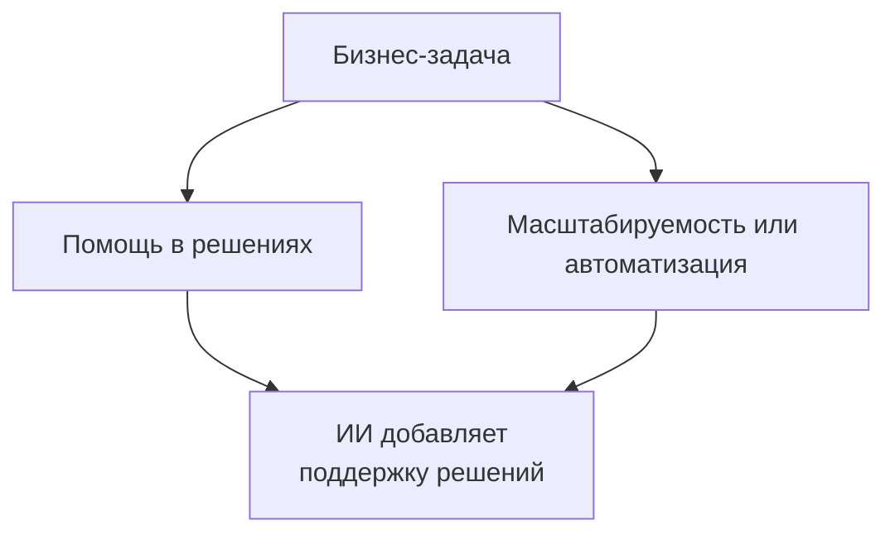
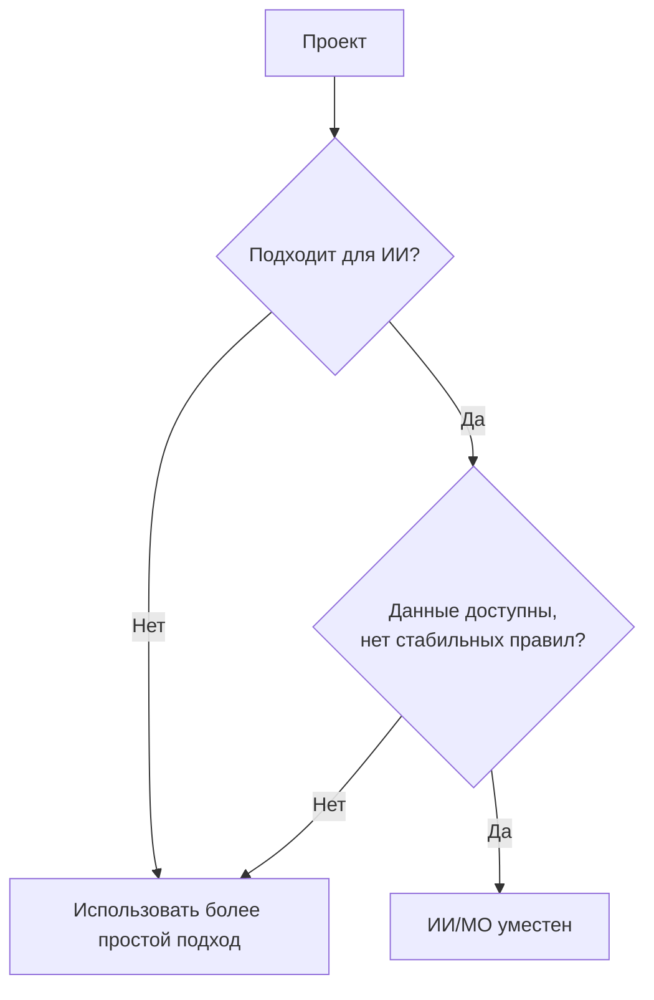
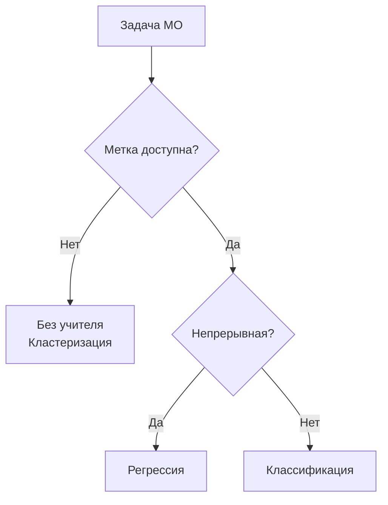
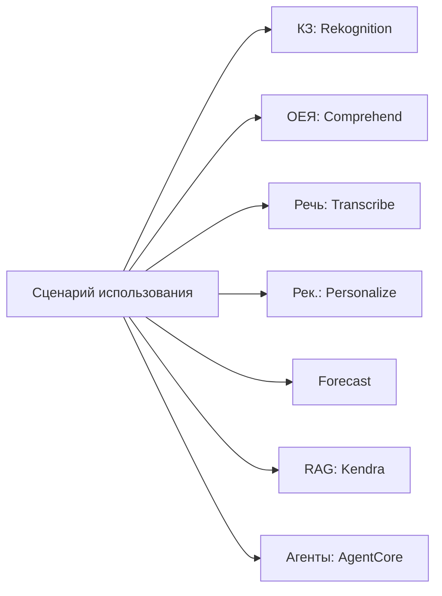
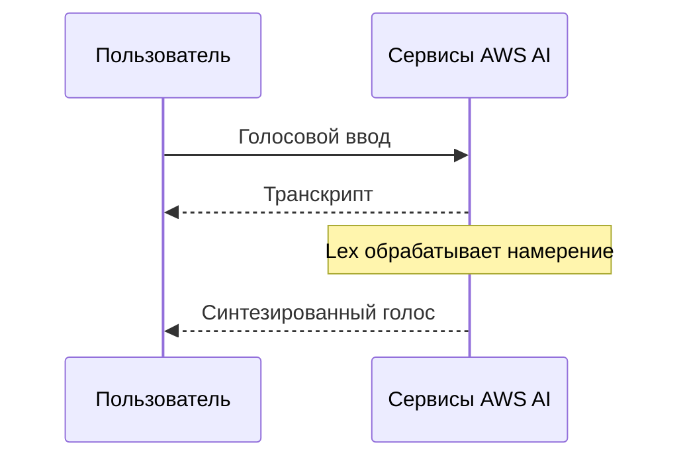
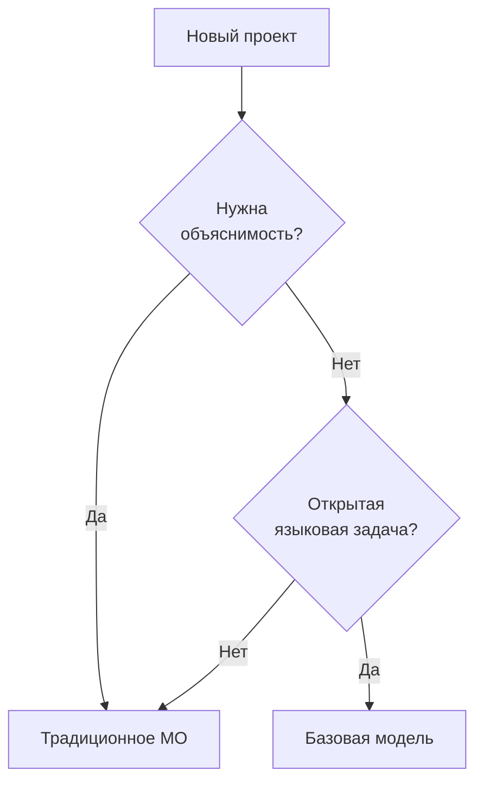

## Тема 1.2. Практические сценарии использования ИИ

Знать о существовании ИИ и МО недостаточно для того, чтобы бизнес-профессионал мог действовать эффективно. Реальный вопрос звучит так: где они дают лучшие результаты по сравнению с альтернативами, а где нет? Тема 1.2 отвечает на этот вопрос. Она переходит от теории к практике, отображая категории бизнес-задач на подходящие техники ИИ, каталогизируя управляемые сервисы AWS, снижающие инженерную нагрузку, и вводя новый критерий принятия решений V1.1: когда традиционная модель МО предпочтительнее базовой модели. Здесь охватываются цели с 1.2.1 по 1.2.6.[^102001]

### 1.2.1 Признать, где ИИ/МО создаёт ценность

Три категории бизнес-потребностей определяют большинство ситуаций, в которых ИИ и МО превосходят более простые альтернативы: помощь в принятии решений человеком, обеспечение масштабируемости решений и автоматизация повторяющихся задач. Они не являются взаимоисключающими, и многие промышленные системы сочетают все три. Однако понимание каждой категории самостоятельно упрощает формулировку ИИ-предложения для заинтересованных сторон.

**Помощь в принятии решений человеком** — это старейший и, вероятно, наиболее устойчивый фактор создания ценности в МО. Модель не заменяет лицо, принимающее решения; она сужает диапазон вариантов, которые человек должен рассмотреть, и присваивает каждому оставшемуся варианту оценку вероятности. Например, специалист по ипотечному кредитованию рассматривает десятки сигналов при оценке заявки на кредит. Модель МО, обученная на исторических показателях кредитования, может ранжировать эти сигналы по прогностическому весу и отмечать заявки, выходящие за рамки нормальных паттернов, чтобы специалист концентрировал внимание там, где это важнее всего. Человек сохраняет ответственность и авторитет; модель снижает когнитивную нагрузку и вероятность пропустить сигнал, скрытый в большом наборе признаков.[^102002]

**Масштабируемость решений** — это возможность, наиболее непосредственно согласующаяся с экономикой облака. Детерминированный движок правил, написанный разработчиком, достигает потолка, когда бизнес-логика становится достаточно сложной, что ручное поддержание правил происходит медленнее, чем меняется бизнес. Модель МО, обученная на результатах, масштабируется иначе: по мере роста объёма входных данных модель выполняет то же вычисление инференса независимо от того, сколько бизнес-правил потребовалось бы для воспроизведения её вывода. Модель обнаружения мошенничества, оценивающая десять тысяч платёжных транзакций в секунду, не требует дополнительных инженерных усилий по сравнению с моделью, оценивающей сто транзакций в секунду; изменяются только вычислительные ресурсы, а они эластичны в AWS.[^102003]

**Автоматизация** охватывает замену инференса МО задачи, которая ранее требовала человеческого времени. Классификация документов, контроль качества изображений на производственной линии и маршрутизация звонков в колл-центре на основе анализа тональности — всё это примеры. Ценность автоматизации наиболее очевидна, когда задача повторяющаяся, объём высокий, приемлемая частота ошибок хорошо понята, а стоимость ошибок восстановима, а не катастрофична. Автоматизация не означает работу без присмотра; большинство промышленных ИИ-систем автоматизации включают путь проверки человеком для случаев, которым модель назначила низкую уверенность.[^102004]

*Рисунок 1.2.1: Три основных фактора бизнес-ценности ИИ/МО. Диаграмма показывает, как различное бизнес-давление отображается на отдельные категории ценности ИИ, каждая из которых имеет свой операционный паттерн.*

Ещё две категории реже встречаются в вопросах экзамена, но заслуживают упоминания. *Персонализация решений* применяет МО для настройки контента, предложений или рабочих процессов под отдельных пользователей на основе истории поведения, что особенно распространено в ритейле и медиа. *Прогностическое обслуживание* применяет модели временных рядов к данным датчиков оборудования, сигнализируя о вероятности отказа до его возникновения и позволяя командам технического обслуживания действовать по расписанию, а не в ответ на простой.

### 1.2.2 Когда решения ИИ/МО неуместны

Экзамен рассматривает эту цель как высококонкурентную, и причина практическая: организации, применяющие ИИ без разбора, тратят бюджет и иногда причиняют вред. Четыре условия надёжно указывают на то, что ИИ — неправильный выбор.

**Несоответствие затрат и выгод** — наиболее распространённое условие отказа в реальных проектах. Создание и поддержка модели МО требует разметки данных, обучающих прогонов, инфраструктуры, мониторинга модели и периодического переобучения по мере изменения базового распределения. Для бизнес-задачи, затрагивающей небольшое количество записей в день или чьи результаты варьируются в узком, предсказуемом диапазоне, простая таблица поиска или двадцатистрочный скрипт принятия решений быстрее разрабатывается, дешевле эксплуатируется и проще проверяется. Точка безубыточности зависит от объёма и сложности, но принцип неизменен: если стоимость разработки и эксплуатации системы МО превышает создаваемую ею ценность на разумном горизонте планирования, более простое решение — верное.[^102005]

**Требования к детерминированному результату** возникают, когда бизнес-процесс или нормативный процесс требует конкретного, воспроизводимого ответа для данного входного сигнала, а не вероятностной оценки. Налоговые расчёты, проверка соответствия нормативным требованиям и формулы расчёта выставления счетов по договору относятся к этой категории. Модели МО производят выходные данные из обученного распределения; одни и те же входные данные могут получать слегка разные оценки в разное время при переобучении модели, и модель не может гарантировать, что никогда не отклонится от правила. Системы на основе правил гарантируют точную воспроизводимость. Когда требование состоит в том, что «ответ всегда должен быть X при условиях Y», МО — не подходящий инструмент.[^102006]

**Сценарии с недостаточным объёмом данных** подрывают основное требование обучения с учителем. Модель, обученная на меньшем количестве записей, чем необходимо для охвата вариаций реального мира, будет плохо обобщать. Порог варьируется в зависимости от метода и типа задачи, но примерное эмпирическое правило таково: для контролируемой классификации нужно не менее нескольких сотен размеченных примеров на класс, а для регрессии — несколько тысяч записей со значимой вариацией по пространству признаков. Организации, стремящиеся применить МО к новой продуктовой линейке, недавно приобретённому источнику данных или редкому типу событий, часто обнаруживают, что у них ещё недостаточно данных для обучения надёжной модели.[^102007]

**Простые задачи на основе правил** — это ситуации, когда логику отображения входных данных на выходные можно чётко сформулировать в дереве решений глубиной не более четырёх-пяти уровней. Если эксперт может перечислить все случаи, условия и правильные выходные данные за один день, а эти правила стабильны во времени, то их явное кодирование проще проверяется, лучше объясняется и дешевле, чем обучение модели. Условия возврата для клиентов, основанные на дате покупки и категории товара, являются классическим примером: правила известны, фиксированы и немногочисленны, чтобы их можно было поддерживать вручную.

*Рисунок 1.2.2: Два итоговых критерия применимости ИИ/МО. Первый фильтр отсеивает проекты, не прошедшие проверку затраты/выгоды или детерминизм; второй — проекты, которым не хватает данных или у которых уже есть стабильные правила. Проект должен пройти оба фильтра, чтобы обосновать применение ИИ/МО вместо более простого подхода.*

Ещё два соображения заслуживают упоминания, хотя они встречаются в формулировках вопросов экзамена реже. *Этические и нормативные ограничения* могут ограничивать применение вероятностной модели, особенно в высокоставочных областях, таких как кредитный скоринг, найм и клиническая диагностика. *Ограничения по задержке* важны, когда приложению нужен ответ в единицы миллисекунд; некоторые сложные модели требуют больше времени инференса, а жёстко закодированный путь принятия решений может быть единственным вариантом, соответствующим SLA.

### 1.2.3 Выбор подходящих техник ИИ/МО

Выбор правильной техники начинается с характера доступного размеченного сигнала в обучающих данных. В целях экзамена явно упоминаются три фундаментальные техники обучения с учителем и без учителя; ещё две дополнительные техники упоминаются вскользь.

**Регрессия** предсказывает непрерывный числовой результат по набору входных признаков.[^102008] Модель учится зависимости между признаками и целевой переменной, которая может принимать любое значение в диапазоне, — например, ожидаемая выручка, часы до отказа оборудования или температура в данном месте и времени. Розничная сеть, прогнозирующая еженедельный объём продаж по местоположению магазина, использует регрессию. Вывод — не категория; это число, на основе которого бизнес может непосредственно действовать в плане запасов или кадрового расписания.

**Классификация** относит входные данные к одному из конечного набора категорий.[^102009] Когда набор категорий состоит из двух членов, задача — *бинарная классификация*; когда их больше двух — *многоклассовой классификацией*. Обнаружение спама (спам или не спам), прогнозирование дефолта по кредиту (дефолт или нет) и маркировка изображений (кошка, собака или птица) являются задачами классификации. Выходные данные модели обычно представляют собой оценку вероятности для каждого класса, а приложение выбирает класс с наибольшей оценкой, опционально в сочетании с порогом уверенности, направляющим предсказания с низкой уверенностью к оператору.

**Кластеризация** группирует записи по сходству без предопределённой метки.[^102010] Поскольку размеченная целевая переменная отсутствует, кластеризация — техника без учителя. Модель обнаруживает структуру в данных, не заданную аналитиком заранее. Сегментация клиентов — канонический пример: по истории покупок, поведению при просмотре и демографическим сигналам модель может выявить пять отдельных архетипов клиентов, для каждого из которых маркетинговая команда сможет разработать отдельные кампании. Обнаружение аномалий — смежное применение: записи, слабо вписывающиеся в какой-либо кластер, отмечаются как необычные.

Две дополнительные техники заслуживают краткого упоминания, поскольку цели экзамена называют их вскользь. *Снижение размерности* сжимает многомерное пространство признаков до меньшего числа измерений, снижая вычислительные затраты и потенциально улучшая производительность нижестоящей модели за счёт удаления коррелирующих или нерелевантных признаков. *Обнаружение аномалий* выявляет точки данных, значительно отклоняющиеся от изученного распределения нормального поведения, а это отдельная постановка задачи — не то же самое, что классификация,, даже если некоторые модели классификации адаптируются для этой цели.

*Таблица 1.2.1: Выбор техники МО по типу задачи*

| Техника | Входная метка | Тип вывода | Канонический бизнес-пример |
|-----------|-------------|-------------|---------------------------|
| Регрессия | Требуется (числовая цель) | Непрерывное число | Прогнозирование спроса, предсказание цены |
| Бинарная классификация | Требуется (два класса) | Класс + вероятность | Флаг мошенничества, прогнозирование оттока |
| Многоклассовая классификация | Требуется (несколько классов) | Класс + вероятность | Маршрутизация документов, категория дефекта |
| Кластеризация | Не требуется | Назначение кластера | Сегментация клиентов, обнаружение тем |
| Обнаружение аномалий | Опционально | Оценка аномалии | Сетевые вторжения, неисправность датчика |

*Рисунок 1.2.3: Дерево решений для выбора техники МО. Основная ветвь разделяет задачи с учителем и без учителя; ветвь с учителем затем разделяется по характеру целевой переменной.*

**Amazon SageMaker AI** поддерживает все техники из таблицы 1.2.1 через встроенные алгоритмы и широкую экосистему фреймворков, которую он размещает.[^102011] Для команд без специалистов по данным возможность AutoML в SageMaker AI может автоматически выбирать и настраивать алгоритмы по размеченному набору данных, превращая выбор техники в направляемую задачу конфигурации, а не в исследовательскую проблему.

### 1.2.4 Реальные приложения ИИ

Цель экзамена 1.2.4 была расширена в v1.1, включив базы знаний и агентный ИИ наряду с шестью категориями, присутствовавшими в v1.0. Эти восемь категорий представляют полный спектр того, что экзамен может попросить кандидатов распознать.

**Компьютерное зрение** — системы, интерпретирующие изображения или кадры видео для извлечения структурированной информации.[^102012] Обнаружение объектов идентифицирует и локализует конкретные предметы внутри изображения; классификация изображений присваивает метку всему изображению; оптическое распознавание символов считывает печатный или рукописный текст со скана. Логистическая компания использует компьютерное зрение для считывания этикеток посылок на конвейере и маршрутизации их без участия человека. Розничная сеть использует камеры для сканирования полок и обнаружения отсутствия товаров. **Amazon Rekognition** — это управляемый сервис AWS для компьютерного зрения; он предоставляет предобученные модели для обнаружения объектов и сцен, распознавания текста и анализа лиц, принимая как отдельные изображения, так и видеопотоки.[^102013]

**Обработка естественного языка** позволяет системам извлекать смысл из неструктурированного текста.[^102014] Анализ тональности определяет, выражает ли текст положительные, отрицательные или нейтральные настроения. Распознавание сущностей извлекает именованные объекты, такие как названия продуктов, местоположения и имена людей, из документа. Тематическое моделирование группирует коллекцию документов по теме. Команда клиентского успеха каждую ночь запускает анализ тональности заявок в поддержку, чтобы выявить новые жалобы на продукт до их эскалации. **Amazon Comprehend** — основной управляемый сервис AWS для ОЕЯ, предоставляющий анализ тональности, распознавание сущностей, извлечение ключевых фраз и пользовательскую классификацию.[^102015]

**Распознавание речи** преобразует устную речь в текст, обеспечивая голосовые интерфейсы, транскрипцию совещаний и анализ звонков.[^102016] Сложность в производстве — это работа с разнообразными акцентами, фоновым шумом, специфической для области лексикой и ограничениями задержки в реальном времени. **Amazon Transcribe** преобразует аудио в текст и поддерживает пользовательский словарь, определение говорящего и автоматическую пунктуацию в режиме реального времени и пакетном режиме.[^102017]

**Системы рекомендаций** прогнозируют, с какими элементами пользователь с наибольшей вероятностью будет взаимодействовать, на основе истории поведения и контекстных сигналов.[^102018] Платформа электронной коммерции рекомендует товары на основе того, что клиент просматривал и покупал ранее. Стриминговый сервис рекомендует шоу на основе истории просмотров и оценок. Базовая техника обычно представляет собой коллаборативную фильтрацию, выявляющую пользователей со схожим поведением и передающую предпочтения по группе, или контентную фильтрацию, сопоставляющую элементы, атрибуты которых похожи на элементы, с которыми пользователь уже взаимодействовал. **Amazon Personalize** — это управляемый сервис рекомендаций, обрабатывающий конвейер обучения, развёртывания и обслуживания в реальном времени без необходимости экспертизы в области МО у команды приложения.[^102019]

**Обнаружение мошенничества** выявляет транзакции или действия с аккаунтами, отклоняющиеся от изученного паттерна законного поведения.[^102020] Банки применяют обнаружение мошенничества на этапе авторизации платежа, оценивая каждую транзакцию в реальном времени и отклоняя или помечая те, что превышают порог риска. Страховые компании применяют его к заявкам на возмещение. Подход МО превосходит статические правила, поскольку паттерны мошенничества постоянно меняются, а модель можно переобучать по мере появления новых тактик. Базовая техника часто представляет собой бинарную классификацию с дополнительным слоем обнаружения аномалий. **Amazon Fraud Detector** — это управляемый сервис AWS, объединяющий этот паттерн с предобученными моделями для онлайн-мошенничества, транзакционного мошенничества и захвата аккаунтов.

**Прогнозирование** производит предсказания будущих значений переменной временного ряда, такой как спрос на продукт, потребление энергии или потребности в персонале колл-центра.[^102021] Входными данными являются исторические наблюдения целевой переменной плюс опциональные *связанные временные ряды* (например, акции, праздники и погода), которые модель может использовать для повышения точности. **Amazon Forecast** — это управляемый сервис прогнозирования, который автоматически выбирает среди статистических и алгоритмов глубокого обучения, вычисляет *квантильные прогнозы* (например, уровни спроса p50 и p90) и записывает результаты в Amazon S3 для последующего потребления.[^102022]

**Базы знаний** — это структурированные хранилища информации, которые ИИ-системы могут запрашивать во время инференса, чтобы основывать свои ответы на верифицированном контенте, а не полагаться исключительно на паттерны, закодированные в весах модели.[^102023] База знаний финансовой компании может содержать нормативные документы, спецификации продуктов и одобренные шаблоны ответов. Когда клиент задаёт вопрос через ИИ-ассистента, система извлекает соответствующий раздел из базы знаний и использует его для формулировки фактически обоснованного ответа. Этот паттерн формально называется *генерацией с дополнением на основе извлечения (RAG)*, который Раздел 3 этой книги охватывает подробно. **Amazon Kendra** — это управляемый корпоративный поисковый сервис, лежащий в основе многих реализаций баз знаний, индексирующий документальные репозитории и возвращающий соответствующие отрывки в ответ на запросы на естественном языке.[^102024]

**Агентный ИИ** описывает системы, в которых одна или несколько ИИ-моделей автономно планируют и выполняют многошаговые задачи, вызывая инструменты и API для взаимодействия с внешними системами.[^102025] Одноагентная система может обрабатывать сквозной рабочий процесс клиентского обслуживания: интерпретировать запрос клиента, искать информацию об аккаунте в CRM, проверять наличие товара, составлять решение и отправлять письмо с подтверждением — всё без оператора-человека. Мультиагентная система распределяет подзадачи между специализированными агентами; агент-оркестратор назначает работу, субагенты её выполняют, а оркестратор компилирует результаты. Бизнес-приложения агентного ИИ включают ИТ-операции (агент, отслеживающий оповещения, диагностирующий первопричину и применяющий исправление из руководства), обработку документов (агент, читающий счета-фактуры, извлекающий позиции и вносящий их в ERP) и адаптацию клиентов (агент, собирающий необходимые документы, валидирующий их и запускающий подготовку аккаунта).

**Amazon Bedrock AgentCore** — это управляемая среда выполнения AWS для промышленных рабочих нагрузок агентного ИИ, обеспечивающая управление памятью, оркестрацию инструментов и сохранение сессий для агентов, построенных на базовых моделях.[^102026] Для команд, разрабатывающих агентные приложения, **Strands Agents** — это SDK с открытым исходным кодом, упрощающий создание мультиагентных систем, тогда как агенты **Amazon Bedrock** предоставляют полностью управляемый оркестрационный уровень, соединяющий базовые модели с группами действий, определёнными как функции Lambda или схемы API.[^102027]

*Рисунок 1.2.4: Категории реальных приложений ИИ и основной управляемый сервис AWS, реализующий каждую из них. Обнаружение мошенничества не показано, поскольку охватывает несколько сервисов (Amazon Fraud Detector и SageMaker AI) в зависимости от подхода к реализации.*

### 1.2.5 Управляемые сервисы AWS в области ИИ/МО

Управляемые ИИ-сервисы AWS устраняют необходимость внутренней разработки модели, предоставляя предобученные возможности через API. Цель экзамена 1.2.5 явно называет шесть сервисов, а список сервисов в области применения добавляет ещё четыре, появляющихся на практике и в вопросах-приманках.

Шесть названных сервисов аккуратно разделяются по функциям. **Amazon SageMaker AI** — это сквозная платформа МО для создания, обучения и развёртывания пользовательских моделей в любом масштабе.[^102028] Это не предобученный сервис, а управляемая среда, обрабатывающая инфраструктуру для каждого этапа жизненного цикла МО. Команды, которым нужна модель, обученная на их собственных данных, а не общий предобученный API, начинают с SageMaker AI. **Amazon Transcribe** преобразует речь в текст и служит основой любого рабочего процесса, которому нужно принимать аудио.[^102029] **Amazon Translate** обеспечивает нейронный машинный перевод для широкого диапазона языковых пар, поддерживая локализацию контента, чат в реальном времени на нескольких языках и пакетный перевод документов.[^102030] Amazon Comprehend, представленный ранее в этом разделе, обрабатывает этап текстового анализа для любого транскрипта, произведённого Amazon Transcribe.[^102031] **Amazon Lex** создаёт диалоговые интерфейсы, понимающие намерения на естественном языке и управляющие состоянием диалога, и интегрируется с **Amazon Polly**, преобразующим текст в живую речь для ответов в голосовом канале.[^102032][^102033]

Четыре дополнительных сервиса в области применения регулярно встречаются в вопросах экзамена и реальных архитектурах. **Amazon Rekognition** обрабатывает анализ изображений и видео, включая обнаружение объектов, распознавание текста и модерацию контента.[^102034] **Amazon Textract** выходит за рамки оптического распознавания символов для извлечения структурированных данных, таких как поля форм и значения таблиц, из отсканированных документов.[^102035] **Amazon Personalize** предоставляет персонализированные рекомендации, обученные на данных взаимодействий, предоставляемых клиентом.[^102036] **Amazon Kendra** — это корпоративный поисковый сервис, индексирующий внутренние документы и возвращающий соответствующие отрывки в ответ на вопросы на естественном языке, выступая в качестве уровня извлечения в архитектурах базы знаний.[^102037]

*Таблица 1.2.2: Управляемые сервисы AWS в области ИИ/МО, сгруппированные по возможностям*

| Возможность | Сервис | Основная функция |
|------------|---------|-----------------|
| Разработка пользовательских моделей | Amazon SageMaker AI | Создание, обучение и развёртывание пользовательских моделей МО |
| Преобразование речи в текст | Amazon Transcribe | Автоматическое распознавание речи с идентификацией говорящего |
| Преобразование текста в речь | Amazon Polly | Нейронный синтез речи с несколькими голосами |
| Языковой перевод | Amazon Translate | Нейронный машинный перевод, пакетный и в реальном времени |
| Анализ текста | Amazon Comprehend | Тональность, сущности, ключевые фразы, пользовательская классификация |
| Диалоговый ИИ | Amazon Lex | Распознавание намерений и управление диалогом |
| Компьютерное зрение | Amazon Rekognition | Обнаружение объектов, распознавание текста, модерация контента |
| Извлечение данных из документов | Amazon Textract | Структурированное извлечение полей и таблиц из документов |
| Рекомендации | Amazon Personalize | Персонализированные рекомендации в реальном времени |
| Корпоративный поиск | Amazon Kendra | Поиск на естественном языке по внутренним документальным репозиториям |

Распространённая ловушка на экзамене — путать сервисы с перекрывающимися поверхностями. **Amazon Transcribe** производит текстовую транскрипцию; **Amazon Comprehend** анализирует эту транскрипцию на предмет смысла. **Amazon Lex** понимает диалоговые намерения в реальном времени; **Amazon Polly** произносит ответ вслух. **Amazon Textract** считывает структурированные данные с отсканированной страницы; **Amazon Rekognition** обнаруживает объекты и сцены на том же изображении. Эти пары часто появляются вместе в архитектурных вопросах, и знание того, какой сервис принадлежит какому этапу, — ключ к выбору правильного ответа.

*Рисунок 1.2.5: Концептуальный поток голосового канала. Пользователь обращается к цепочке ИИ-сервисов AWS, которая транскрибирует аудио, интерпретирует намерение и синтезирует голосовой ответ; конкретные передачи сервисов (Transcribe → Lex → Comprehend → Polly) описаны в предыдущем абзаце.*

### 1.2.6 Традиционное МО против базовых моделей

Цель 1.2.6 — новая в v1.1, отражая практический вопрос, с которым сейчас сталкивается каждая ИИ-команда: когда базовая модель (FM) является правильным инструментом, а когда традиционная модель МО, созданная и обученная с нуля, является лучшим выбором?[^102038] Решение касается не сложности каждого варианта. Речь идёт о соответствии: сопоставлении характеристик доступных данных, требуемых выходных данных, нормативной среды и операционного бюджета с возможностями каждого подхода.

**Традиционные модели МО** обучаются на размеченных данных для конкретной, чётко ограниченной задачи. Они полностью интерпретируемы в том смысле, что важность признаков и логику принятия решений можно извлечь и проверить. Они выполняют инференс с малой задержкой, обычно в единицы миллисекунд на скромном оборудовании. Их вычислительная стоимость предсказуема и часто низка. Им требуются размеченные обучающие данные предметной области, получение которых может быть дорогостоящим, но после обучения у них нет текущих вычислительных расходов на основе токенов.[^102039]

**Базовые модели** предварительно обучаются на широких корпусах общего назначения и могут выполнять широкий спектр языковых и мультимодальных задач с минимальной дополнительной конфигурацией.[^102040] Они превосходят в задачах, требующих понимания естественного языка, генерации контента, синтеза кода или рассуждений на слабо связанные темы. Они принимают диалоговые запросы и корректируют своё поведение на основе инструкций без переобучения. Их модель стоимости обычно основана на токенах, то есть каждый вызов инференса оценивается по количеству токенов во вводе и выводе. Задержка выше, чем у традиционного МО, обычно в диапазоне от сотен миллисекунд до секунд.

*Таблица 1.2.3: Критерии принятия решений: традиционное МО или базовая модель*

| Критерий | Традиционное МО | Базовая модель |
|-----------|---------------|-----------------|
| Область задачи | Единственная, чётко определённая задача | Широкие или общие задачи |
| Обучающие данные | Требуется размеченный набор данных предметной области | Предобученная; промпт или тонкая настройка |
| Объяснимость | Высокая; доступна важность признаков | Ниже; эмерджентное рассуждение |
| Задержка | Низкая (единицы мс) | Выше (сотни мс – секунды) |
| Стоимость инференса | Предсказуемая; нет платы за токен | На основе токенов; зависит от длины ввода |
| Соответствие нормативным требованиям | Сильное; полная проверяемость | Слабее; проблемы вариативности вывода |
| Поддержка мультимодальности | Ограничена обученными модальностями | Широкая (текст, изображение, аудио в зависимости от модели) |
| Высокообъёмная единственная задача | Высокое; горизонтальное масштабирование | Низкое; стоимость токенов растёт с объёмом |

Четыре условия strongly favors выбора традиционной модели МО. Первое — нормативные или комплаенс-требования предполагают полностью проверяемый, воспроизводимый путь принятия решений. Кредитно-рисковый скоринг в соответствии с банковским регулированием, например, обычно требует возможности объяснить любое индивидуальное решение, и модель на основе деревьев с градиентным бустингом или логистической регрессии может предоставить это объяснение в форме, принятой регуляторами.[^102041] Второе — задача предсказания имеет единственный чётко определённый вывод (число, категория или оценка) и достаточно размеченных обучающих данных для достижения приемлемой точности без рассуждений общего назначения. Третье — задержка и стоимость жёстко ограничены; приложение работает при высоком объёме и должно возвращать предсказания за миллисекунды при долях цента за инференс. Четвёртое — у организации достаточно мощностей в области инженерии МО для управления конвейером обучения и переобучения.

Базовую модель стоит предпочесть при четырёх условиях. Первое — задача требует генерации связного текста, рассуждений об неоднозначных вопросах или синтеза информации из нескольких источников — возможностей, которые традиционные модели МО обеспечить не могут. Второе — у организации минимальный объём размеченных обучающих данных, но есть доступ к хорошо определённому описанию задачи, которое можно выразить в виде промпта, что делает инференс с немногими примерами или без них практически применимым. Третье — сценарий является диалоговым, и модели нужно сохранять контекст в нескольких оборотах без явной логики управления состоянием. Четвёртое — объём приложения достаточно невысок, чтобы стоимость на основе токенов была приемлема, или задачи достаточно уникальны, чтобы модель общего назначения амортизировала затраты на создание специализированной модели.

*Рисунок 1.2.6: Поток принятия решений для выбора между традиционной моделью МО и базовой моделью. Нормативные требования и тип задачи — два основных фильтра; задержка и доступность данных уточняют выбор.*

Система управления рисками ИИ NIST AI RMF и EU AI Act накладывают требования прослеживаемости на ИИ-системы, используемые в высокоставочных решениях.[^102042] На практике организации, подпадающие под эти фреймворки, нередко принимают гибридный паттерн: традиционная модель МО выполняет основную задачу предсказания и генерирует проверяемый вывод, в то время как базовая модель выполняет смежные языковые задачи, такие как генерация клиентского объяснения решения или реферирование подтверждающих доказательств из неструктурированных документов.

Граница между двумя подходами смещается. Возможности дистилляции модели AWS в **Amazon Bedrock** позволяют командам переносить поведение рассуждений из большой базовой модели в меньшую, более быструю и дешёвую модель, настроенную для конкретной задачи.[^102043] В итоге получается модель, ведущая себя как базовая модель в своей узкой области, но работающая с профилем стоимости и задержки, ближе к традиционной модели МО. Эта техника появляется в цели 3.1.5 и заслуживает отдельного упоминания здесь как мост между двумя категориями.

**Что охватил этот раздел:** Тема 1.2 установила, как распознавать, где ИИ и МО создают ценность, когда их избегать, как сопоставлять техники с типами задач и какие управляемые сервисы AWS обрабатывают каждую категорию приложений. Также был введён новый фреймворк принятия решений v1.1 для выбора между традиционными моделями МО и базовыми моделями. Тема 1.3, следующая далее, охватывает сквозной жизненный цикл разработки ИИ/МО и отображает каждый этап на поддерживающие его сервисы AWS.

## Вопросы для самопроверки

**Вопрос 1**

Розничная компания обрабатывает 50 000 писем клиентской поддержки в день и должна направлять каждое письмо в нужный отдел на основе его темы. У компании есть 12 месяцев исторических писем, уже размеченных правильным отделом. Какой подход НАИЛУЧШИМ образом подходит для этой задачи?

A. Регрессия, поскольку модель должна предсказать оценку для каждого отдела, и наибольшая оценка определяет маршрутизацию.

B. Многоклассовая классификация, поскольку вывод — один из нескольких предопределённых отделов, а размеченные данные доступны.

C. Кластеризация, поскольку данных слишком много для ручной разметки, а отделы ещё не определены.

D. Базовая модель с промптингом без примеров (zero-shot), поскольку размеченные данные делают тонкую настройку необязательной, а промптинг проще.

При наличии 12 месяцев размеченных писем и фиксированного набора известных отделов это типичная задача многоклассовой классификации. Размеченных данных достаточно для обучения традиционной модели МО, вывод — одна из конечного числа категорий, а объём (50 000 в день) делает предсказуемую стоимость и малую задержку обученного классификатора предпочтительнее инференса FM на основе токенов. Регрессия предсказывает непрерывные числа, а не категории. Кластеризация подходит, если отделы неизвестны или метки отсутствуют, но ни одно из этих условий здесь не применимо. Базовая модель с промптингом zero-shot может категоризировать текст, но при 50 000 писем в день стоимость токенов быстро накапливается, а задержка выше, чем у обученного классификатора; размеченные данные следует использовать для обучения специализированной модели, а не игнорировать.[^102044]

**Вопрос 2**

Финансовая компания должна объяснять каждое кредитное решение регуляторам, включая то, какие входные признаки в наибольшей мере повлияли на результат. Компания оценивает, использовать ли традиционную модель МО или базовую модель. Какой фактор НАИБОЛЕЕ сильно говорит в пользу традиционного МО?

A. У компании большой объём размеченных обучающих данных из прошлых кредитных заявок.

B. Нормативное требование объяснимости и проверяемой логики принятия решений.

C. Требование задержки инференса — менее 200 миллисекунд на запрос.

D. Компания хочет избежать ценообразования на основе токенов для контроля затрат на инференс.

Нормативная объяснимость — решающий фактор. Традиционные модели МО, такие как логистическая регрессия и деревья с градиентным бустингом, раскрывают оценки важности признаков и пути принятия решений, которые удовлетворяют требованиям аудита. Базовые модели производят выводы через эмерджентное рассуждение, которое трудно атрибутировать конкретным признакам в форме, приемлемой для регуляторов. Наличие размеченных обучающих данных (A) является поддерживающим фактором для традиционного МО, но не является наиболее сильным дифференциатором по сравнению с нормативными требованиями. Задержку менее 200 мс (C) традиционные модели МО действительно обеспечивают, но многие развёртывания базовых моделей также соответствуют этому порогу. Ценообразование на основе токенов (D) является соображением стоимости, но не настолько обязывающим, как нормативное соответствие.[^102045]

**Вопрос 3**

Производственная компания хочет определить, какие машины на её производственном полу, вероятно, выйдут из строя в течение следующих 72 часов, на основе показаний датчиков, собираемых каждую минуту. Модель должна возвращать предсказание, а не статическое правило. Нет никакой размеченной истории отказов. Какой подход МО является НАИБОЛЕЕ подходящим?

A. Бинарная классификация на основе исторических данных датчиков, размеченных событиями отказа.

B. Регрессия с использованием количества прошлых вызовов обслуживания в качестве целевой переменной.

C. Обнаружение аномалий без учителя во временном ряду датчиков, помечающее показания, отклоняющиеся от изученного нормального профиля каждой машины.

D. Многоклассовая классификация для категоризации серьёзности отказа как низкой, средней или высокой.

Без размеченной истории отказов применить контролируемые подходы (A, B, D) напрямую невозможно. Обнаружение аномалий без учителя обучается нормальному паттерну показаний датчиков для каждой машины и отмечает отклонения от этого паттерна; на AWS **Amazon SageMaker AI** предлагает Random Cut Forest и DeepAR именно для такого стиля обнаружения аномалий временных рядов, а результирующие оценки аномалий служат неконтролируемым прокси риска отказа. Бинарная классификация (A) является идеальным подходом после появления меток, и организации следует планировать сбор размеченных событий отказа для будущего контролируемого обучения. Регрессия (B) требует числовой целевой переменной; количество прошлых вызовов обслуживания — косвенный показатель, но не позволяет напрямую предсказать будущий отказ в конкретном окне. Многоклассовая классификация (D) также требует размеченных категорий серьёзности, которых пока не существует.[^102046]

**Вопрос 4**

Компания оценивает ИИ-решение для автоматизации расчёта бонусов сотрудников в соответствии с коллективным трудовым соглашением. Формула точно прописана в соглашении, применяется одинаково ко всем сотрудникам одного грейда и не менялась пять лет. Какое решение является НАИБОЛЕЕ подходящим?

A. Реализовать модель классификации для определения уровня бонуса каждого сотрудника.

B. Реализовать модель регрессии для предсказания сумм бонусов из данных о зарплате и производительности.

C. Не использовать ИИ/МО; реализовать формулу как детерминированный код, поскольку результат должен быть точным и воспроизводимым.

D. Использовать базовую модель для интерпретации текста соглашения и расчёта соответствующего бонуса.

Это сценарий с детерминированным результатом. Расчёт бонуса — это фиксированная формула без вероятностного элемента; одни и те же входные данные всегда должны давать одинаковый результат без вариаций. Реализация на основе правил или формул гарантирует точную воспроизводимость и тривиально проверяема. Модель классификации (A) вносила бы оценку вероятности и не могла бы гарантировать соблюдение точных граничных условий соглашения. Модель регрессии (B) предсказывает непрерывное значение из изученных паттернов, но правильное значение уже задано формулой; использование МО здесь добавляет сложность без пользы. Базовая модель (D) может интерпретировать текст, но не гарантирует арифметической точности и добавляет задержку и стоимость для задачи, не требующей никаких возможностей FM.[^102047]

**Вопрос 5**

Технологическая компания хочет создать ассистента клиентского обслуживания, способного обрабатывать вопросы на любом из 15 языков, сохранять диалоговый контекст в нескольких оборотах и генерировать персонализированные ответы, основанные на внутренней документации по продуктам компании. У компании нет размеченных обучающих данных «вопрос-ответ». Какой подход является НАИЛУЧШИМ?

A. Обучить многоклассовую модель классификации для маршрутизации вопросов к предварительно написанным ответам на каждом языке.

B. Использовать базовую модель с извлечением из базы знаний Amazon Kendra в сочетании с Amazon Translate для обработки языков.

C. Использовать Amazon Lex для управления диалогом и Amazon Comprehend для анализа тональности без базовой модели.

D. Создать отдельные модели регрессии для каждого языка, каждая из которых обучена оценивать релевантность ответов-кандидатов.

Этот сценарий имеет три требования, которые в совокупности говорят в пользу архитектуры на основе базовой модели: многоходовой диалоговый контекст, генерация контента из внутренних документов и поддержка нескольких языков без размеченных обучающих данных. Подключение базовой модели к базе знаний Amazon Kendra обеспечивает генерацию с дополнением на основе извлечения, основывая ответы модели на реальной документации компании. Многие базовые модели нативно обрабатывают несколько языков, но Amazon Translate может дополнительно помогать для языков, с которыми FM справляется хуже. Модель классификации (A) может направлять к статическим ответам, но не может генерировать персонализированные ответы или сохранять контекст между оборотами. Amazon Lex и Comprehend (C) управляют диалогом и тональностью, но не извлекают из внутренней документации и не генерируют новые ответы; одна эта комбинация не удовлетворит требование генерации. Модели регрессии (D) могут оценивать ответы-кандидаты, но не могут генерировать новые ответы или сохранять диалоговое состояние, и этот подход потребовал бы создания и поддержки 15 отдельных моделей.[^102048]

---

[^102001]: AWS Certification: AWS Certified AI Practitioner (AIF-C01) Exam Guide v1.1, Task Statement 1.2. URL: <https://docs.aws.amazon.com/aws-certification/latest/ai-practitioner-01/ai-practitioner-01-domain1.html>
[^102002]: Amazon SageMaker AI Developer Guide: Human-in-the-loop workflows. URL: <https://docs.aws.amazon.com/sagemaker/latest/dg/a2i-use-augmented-ai-a2i-human-review-loops.html>
[^102003]: Amazon SageMaker AI: Model deployment and real-time inference. URL: <https://docs.aws.amazon.com/sagemaker/latest/dg/deploy-model.html>
[^102004]: Amazon Augmented AI (A2I) Developer Guide: What is Amazon A2I? URL: <https://docs.aws.amazon.com/sagemaker/latest/dg/a2i-getting-started.html>
[^102005]: AWS Well-Architected Framework: Machine Learning Lens - Cost optimization pillar. URL: <https://docs.aws.amazon.com/wellarchitected/latest/machine-learning-lens/cost-optimization.html>
[^102006]: NIST AI Risk Management Framework (AI RMF 1.0): Trustworthiness characteristic - Explainability. URL: <https://airc.nist.gov/Home>
[^102007]: Amazon SageMaker AI Developer Guide: Prepare your data. URL: <https://docs.aws.amazon.com/sagemaker/latest/dg/data-prep.html>
[^102008]: Amazon SageMaker AI Developer Guide: Linear Learner algorithm. URL: <https://docs.aws.amazon.com/sagemaker/latest/dg/linear-learner.html>
[^102009]: Amazon SageMaker AI Developer Guide: XGBoost algorithm. URL: <https://docs.aws.amazon.com/sagemaker/latest/dg/xgboost.html>
[^102010]: Amazon SageMaker AI Developer Guide: K-Means algorithm. URL: <https://docs.aws.amazon.com/sagemaker/latest/dg/k-means.html>
[^102011]: Amazon SageMaker AI overview. URL: <https://aws.amazon.com/sagemaker/>
[^102012]: Amazon Rekognition Developer Guide: What is Amazon Rekognition? URL: <https://docs.aws.amazon.com/rekognition/latest/dg/what-is.html>
[^102013]: Amazon Rekognition product page. URL: <https://aws.amazon.com/rekognition/>
[^102014]: Amazon Comprehend Developer Guide: What is Amazon Comprehend? URL: <https://docs.aws.amazon.com/comprehend/latest/dg/what-is.html>
[^102015]: Amazon Comprehend product page. URL: <https://aws.amazon.com/comprehend/>
[^102016]: Amazon Transcribe Developer Guide: What is Amazon Transcribe? URL: <https://docs.aws.amazon.com/transcribe/latest/dg/what-is.html>
[^102017]: Amazon Transcribe product page. URL: <https://aws.amazon.com/transcribe/>
[^102018]: Amazon Personalize Developer Guide: What is Amazon Personalize? URL: <https://docs.aws.amazon.com/personalize/latest/dg/what-is-personalize.html>
[^102019]: Amazon Personalize product page. URL: <https://aws.amazon.com/personalize/>
[^102020]: Amazon Fraud Detector product page. URL: <https://aws.amazon.com/fraud-detector/>
[^102021]: Amazon Forecast Developer Guide: What is Amazon Forecast? URL: <https://docs.aws.amazon.com/forecast/latest/dg/what-is-forecast.html>
[^102022]: Amazon Forecast product page. URL: <https://aws.amazon.com/forecast/>
[^102023]: Amazon Kendra Developer Guide: What is Amazon Kendra? URL: <https://docs.aws.amazon.com/kendra/latest/dg/what-is-kendra.html>
[^102024]: Amazon Kendra product page. URL: <https://aws.amazon.com/kendra/>
[^102025]: Amazon Bedrock User Guide: Agents for Amazon Bedrock. URL: <https://docs.aws.amazon.com/bedrock/latest/userguide/agents.html>
[^102026]: Amazon Bedrock AgentCore product page. URL: <https://aws.amazon.com/bedrock/agentcore/>
[^102027]: Strands Agents SDK on GitHub. URL: <https://github.com/strands-agents/sdk-python>
[^102028]: Amazon SageMaker AI Developer Guide: What is Amazon SageMaker AI? URL: <https://docs.aws.amazon.com/sagemaker/latest/dg/whatis.html>
[^102029]: Amazon Transcribe Developer Guide: Real-time transcription. URL: <https://docs.aws.amazon.com/transcribe/latest/dg/getting-started-streaming.html>
[^102030]: Amazon Translate Developer Guide: What is Amazon Translate? URL: <https://docs.aws.amazon.com/translate/latest/dg/what-is.html>
[^102031]: Amazon Comprehend Developer Guide: Sentiment analysis. URL: <https://docs.aws.amazon.com/comprehend/latest/dg/how-sentiment.html>
[^102032]: Amazon Lex Developer Guide: What is Amazon Lex? URL: <https://docs.aws.amazon.com/lexv2/latest/dg/what-is.html>
[^102033]: Amazon Polly Developer Guide: What is Amazon Polly? URL: <https://docs.aws.amazon.com/polly/latest/dg/what-is.html>
[^102034]: Amazon Rekognition Developer Guide: Detecting objects and scenes. URL: <https://docs.aws.amazon.com/rekognition/latest/dg/labels.html>
[^102035]: Amazon Textract Developer Guide: What is Amazon Textract? URL: <https://docs.aws.amazon.com/textract/latest/dg/what-is.html>
[^102036]: Amazon Personalize Developer Guide: Getting recommendations. URL: <https://docs.aws.amazon.com/personalize/latest/dg/getting-recommendations.html>
[^102037]: Amazon Kendra Developer Guide: Querying an index. URL: <https://docs.aws.amazon.com/kendra/latest/dg/searching-example.html>
[^102038]: AWS Certification: AIF-C01 v1.1 revisions - Objectives added in v1.1, objective 1.2.6. URL: <https://docs.aws.amazon.com/aws-certification/latest/ai-practitioner-01/aif-01-revisions.html>
[^102039]: Amazon SageMaker AI Developer Guide: Training models. URL: <https://docs.aws.amazon.com/sagemaker/latest/dg/how-it-works-training.html>
[^102040]: Amazon Bedrock User Guide: Foundation models in Amazon Bedrock. URL: <https://docs.aws.amazon.com/bedrock/latest/userguide/foundation-models.html>
[^102041]: NIST AI Risk Management Framework AI RMF 1.0 - Govern function: Policies and accountability. URL: <https://airc.nist.gov/Home>
[^102042]: EU Artificial Intelligence Act, Article 13: Transparency and provision of information to users. URL: <https://eur-lex.europa.eu/legal-content/EN/TXT/?uri=CELEX:32024R1689>
[^102043]: Amazon Bedrock User Guide: Model distillation. URL: <https://docs.aws.amazon.com/bedrock/latest/userguide/model-distillation.html>
[^102044]: Amazon SageMaker AI Developer Guide: Multi-class classification. URL: <https://docs.aws.amazon.com/sagemaker/latest/dg/xgboost.html>
[^102045]: Amazon SageMaker Clarify Developer Guide: Explainability. URL: <https://docs.aws.amazon.com/sagemaker/latest/dg/clarify-model-explainability.html>
[^102046]: Amazon SageMaker AI Developer Guide: Random Cut Forest algorithm for time-series anomaly detection. URL: <https://docs.aws.amazon.com/sagemaker/latest/dg/randomcutforest.html>
[^102047]: AWS Well-Architected Machine Learning Lens: Operational Excellence - Model governance. URL: <https://docs.aws.amazon.com/wellarchitected/latest/machine-learning-lens/operational-excellence.html>
[^102048]: Amazon Bedrock User Guide: Knowledge bases for Amazon Bedrock. URL: <https://docs.aws.amazon.com/bedrock/latest/userguide/knowledge-base.html>
