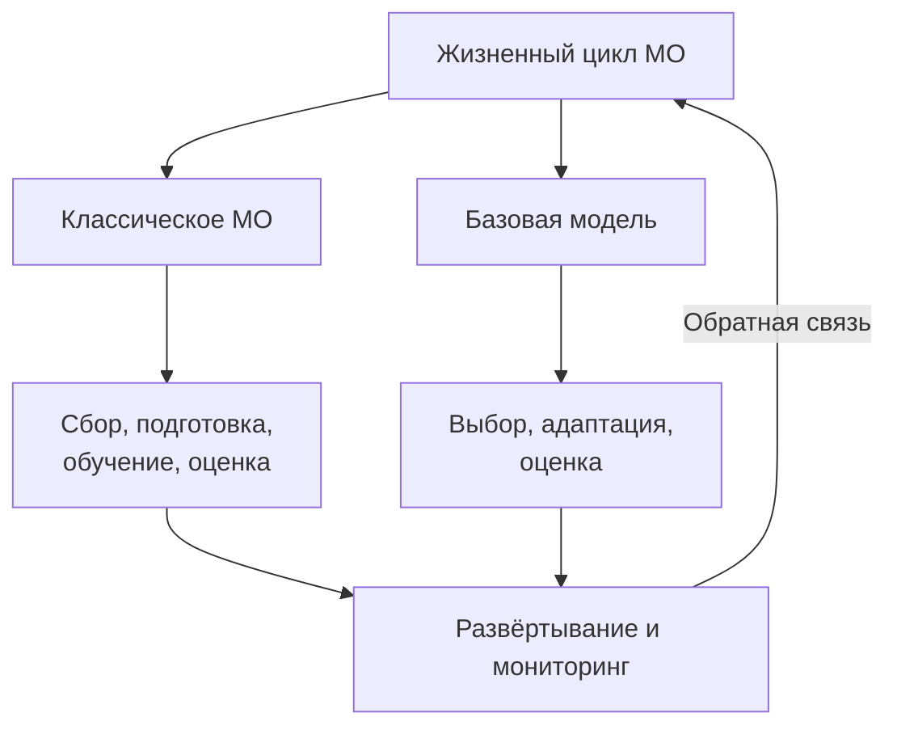
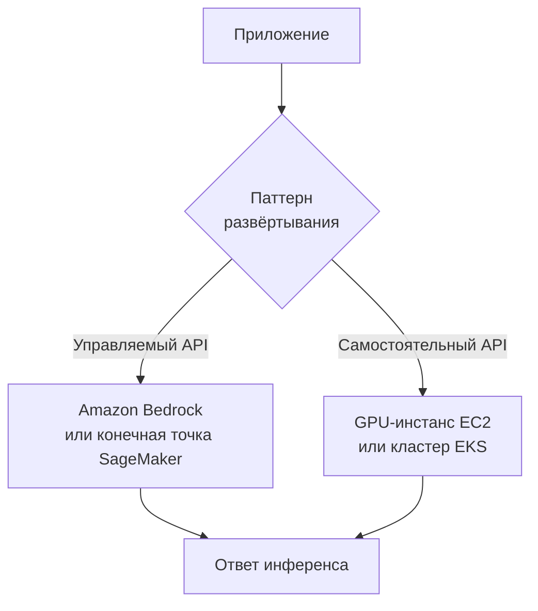
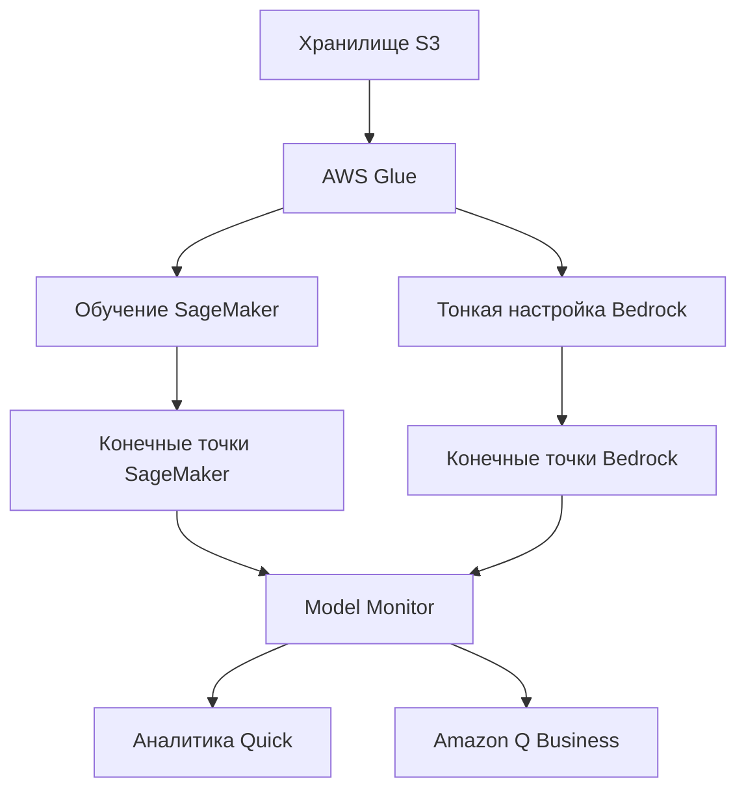
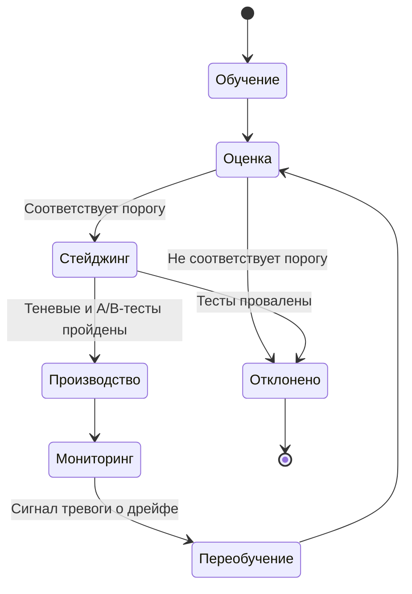
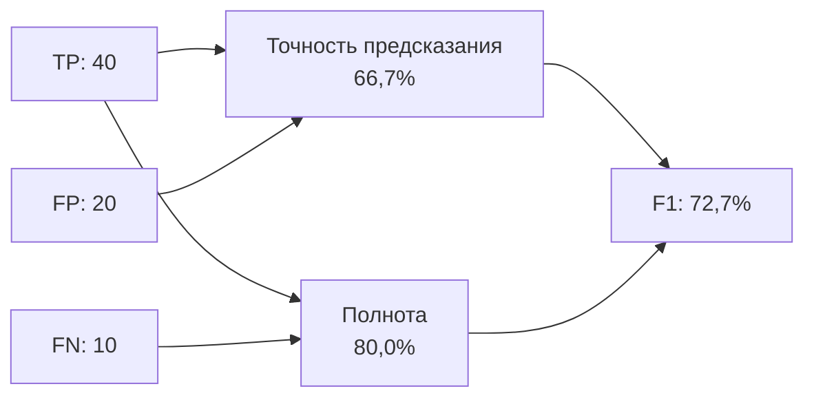

## Тема 1.3. Жизненный цикл разработки ИИ/МО

Жизненный цикл разработки ИИ/МО — это структурированная последовательность действий, которая превращает бизнес-идею из необработанных данных в промышленную систему, создающую ценность со временем. Раздел 1 установил словарь и ландшафт сценариев использования; данная тема приводит эти идеи в движение, показывая, как ИИ- и МО-проекты фактически создаются и управляются. Понимание жизненного цикла позволяет бизнес-профессионалам устанавливать реалистичные ожидания, задавать правильные вопросы на каждом этапе проверки и признавать, где сервисы AWS снижают стоимость и сложность каждого этапа.[^103001]

### 1.3.1 Компоненты конвейера ИИ/МО

Конвейер — это последовательность шагов, выполняемых командой для перехода от необработанных данных к работающей модели. Термин позаимствован из разработки программного обеспечения и несёт то же значение: каждый этап получает артефакт от предыдущего шага, преобразует его и передаёт результат дальше. Концепция конвейера важна для бизнес-профессионалов, поскольку даёт общий словарь для обсуждения прогресса, стоимости и качества в каждой точке ИИ-проекта.[^103048]

Конвейеры классического машинного обучения и конвейеры на основе базовых моделей разделяют структурную логику, но различаются промежуточными этапами. Классический конвейер МО начинается с нуля: команда собирает размеченные данные, выполняет инженерию признаков, выбирает алгоритм, обучает модель на собственных данных, настраивает её, оценивает, а затем развёртывает и отслеживает результат. Конвейер на основе базовых моделей пропускает большую часть тяжёлой работы с данными и обучением. Вместо этого команда выбирает существующую предобученную модель, решает, как адаптировать её к своей задаче (через инженерию запросов, тонкую настройку или генерацию с дополнением на основе извлечения), оценивает адаптированную модель и развёртывает её. Оба трека завершаются одними и теми же двумя этапами: развёртыванием и мониторингом.

*Рисунок 1.3.1: Двухтрековый конвейер ИИ/МО. Треки классического МО и базовой модели сходятся в развёртывании и мониторинге; сигналы обратной связи возвращаются в активный трек.*

Этапы классического трека МО следующие. **Сбор данных** — это процесс сбора размеченных или неразмеченных записей, на которых будет обучаться модель; проблемы качества на этом этапе распространяются на каждый последующий шаг.[^103002] **Разведочный анализ данных (EDA)** — это изучение собранных данных для понимания их распределения, взаимосвязей и аномалий до начала какого-либо моделирования.[^103003] **Предобработка данных** охватывает очистку, заполнение пропущенных значений, удаление дубликатов и преобразование данных в формат, который алгоритм может обработать.[^103004] **Инженерия признаков** — это создание или преобразование входных переменных для повышения доступности базовых паттернов для модели; например, преобразование необработанных временны́х меток транзакций в признак «дней с момента последней покупки» для модели оттока.[^103005] **Обучение модели** — это процесс оптимизации, при котором алгоритм находит значения параметров, минимизирующие ошибку предсказания на обучающем наборе данных.[^103006] **Настройка гиперпараметров** регулирует параметры, управляющие поведением обучения, а не изученные веса; примеры включают скорость обучения и максимальную глубину дерева в модели градиентного бустинга.[^103007]

Трек базовых моделей начинается с **выбора данных**, что здесь означает выбор документов или примеров для тонкой настройки, а не обучения с нуля. **Выбор модели** — это выбор предобученной FM для адаптации, решение, определяемое возможностями, стоимостью, задержкой и лицензионными ограничениями (обсуждаются в разделе 1.3.2). **Адаптация** охватывает три основных техники для достижения хорошей производительности общей FM на конкретной задаче: инженерия запросов, создающая инструкции без изменения весов модели; тонкая настройка, обновляющая подмножество весов с использованием примеров, специфичных для предметной области; и *генерация с дополнением на основе извлечения (RAG)*, расширяющая знания модели путём получения соответствующих документов во время инференса.[^103008] Раздел 3 подробно рассматривает каждую технику адаптации; на данном этапе достаточно знать, что они существуют и где они вписываются в жизненный цикл.

Оба трека затем переходят на этап **оценки**, где адаптированная или обученная модель тестируется на отложенных данных и оценивается по метрикам производительности (см. раздел 1.3.6). Модель, прошедшая оценку, переходит к **развёртыванию**. Модель, не прошедшая оценку, возвращается к более раннему этапу — как правило, к инженерии признаков или настройке гиперпараметров в классическом треке или к пересмотренной стратегии адаптации в треке FM.

**Мониторинг** — это финальный этап, который чаще всего недооценивается при планировании. Как только модель введена в производство, реальный мир не стоит на месте. Поведение пользователей меняется, конвейеры данных эволюционируют, а статистические паттерны, которые усвоила модель, могут больше не соответствовать тому, что она видит. Мониторинг обнаруживает эти отклонения и запускает корректирующие действия — будь то обновление данных, переобучение или пересмотр промпта.[^103009]

### 1.3.2 Источники FM-моделей

Базовые модели требуют огромных вычислительных ресурсов для обучения с нуля. Один прогон обучения большой языковой модели может потребовать миллионов GPU-часов и обойтись в десятки миллионов долларов.[^103010] В результате большинство организаций не обучают собственные FM; они получают их из внешних источников и адаптируют. Три основных источника различаются стоимостью, контролем, лицензионными условиями и возможностями.

**Предобученные модели с открытым исходным кодом** — это модели, чьи веса, а в большинстве случаев и код обучения, находятся в открытом доступе. Наиболее заметные примеры, доступные по состоянию на 2025-2026 годы, включают семейство Llama от Meta (сейчас в 4-м поколении, с вариантами Llama 4 Scout и Maverick, предлагающими очень большие контекстные окна; информацию о доступных размерах контекстного окна на Amazon Bedrock см. в актуальных карточках моделей Meta), Mistral и Mixtral от Mistral AI, серию Falcon от TII и Stable Diffusion от Stability AI для генерации изображений.[^103011] Привлекательность моделей с открытым исходным кодом очевидна: нет платы за токен в API, веса можно скачать и запускать на собственной инфраструктуре организации, а модель можно настраивать без участия вендора. Недостаток — операционная сложность. Команда должна выделять и управлять вычислительными ресурсами, обрабатывать обновления модели и нести ответственность за безопасность и соответствие требованиям. Лицензирование также варьируется. Модели Llama имеют общественную лицензию с ограничениями на коммерческое использование по объёму; проверьте актуальный текст лицензии Llama для действующего порога. Модели Mistral имеют лицензию Apache 2.0 без таких ограничений.[^103012] Бизнес-командам следует проверить применимую лицензию перед использованием FM с открытым исходным кодом в промышленном продукте.

**Коммерческие базовые модели** предлагаются ИИ-компаниями как управляемый API-сервис. Потребляющая организация платит за токен, а не управляет инфраструктурой. Ведущие коммерческие FM, доступные через AWS, включают Anthropic Claude (несколько поколений, от Haiku для задач с ограниченной стоимостью до Opus и Sonnet для сложного рассуждения), Amazon Nova (собственное семейство Amazon, охватывающее Nova Micro, Lite, Pro и Premier), модели Jamba от AI21 Labs и семейства Command и Embed от Cohere.[^103013] Коммерческие модели не требуют управления инфраструктурой и непрерывно обновляются вендором, но у организации меньше видимости в обучающие данные и веса, что может вызывать вопросы соответствия в регулируемых отраслях.

**Пользовательские модели, обученные с нуля** — редкий вариант. Обучение новой крупномасштабной FM с нуля целесообразно только тогда, когда у организации есть область, настолько специализированная, что ни одна существующая FM не охватывает её достаточно (например, геномная компания, чья лексика и паттерны рассуждений не имеют никакого пересечения с каким-либо общедоступным обучающим корпусом), и у неё есть бюджет и глубокая инженерия МО для этого. Стоимость и сроки существенны; большинство организаций рассматривают этот путь и приходят к выводу, что тонкая настройка коммерческой или открытой FM — лучшее использование ресурсов.[^103014]

*Таблица 1.3.1: Сравнение вариантов источников FM*

| Источник | Типичная структура стоимости | Контроль над весами | Операционная сложность | Примеры моделей |
|--------|----------------------|---------------------|----------------------|----------------|
| Предобученные с открытым кодом | Только стоимость инфраструктуры | Полный доступ | Высокая | Llama 4, Mistral, Falcon |
| Коммерческий управляемый API | Ценообразование за токен | Нет доступа | Низкая | Claude, Amazon Nova, Cohere |
| Обучение с нуля | Капитальные затраты в несколько миллионов | Полное владение | Очень высокая | Проприетарные |

Выбор между этими источниками редко бывает решением «всё или ничего». Многие промышленные архитектуры используют все три: коммерческий API для запросов общего назначения, тонко настроенную модель с открытым кодом для экономически чувствительной высокообъёмной задачи и традиционные модели МО для узких задач предсказания, где обязательна объяснимость.[^103049]

### 1.3.3 Методы использования модели в производстве

Ввод обученной или выбранной модели в производство означает обеспечение доступа к её предсказаниям для пользователей и приложений. Два основных паттерна развёртывания, охватываемых экзаменом, — **управляемый API-сервис** и **самостоятельно размещённый API**. Выбор между ними требует взвешивания требований по задержке, объёму вызовов, потребностям в настройке и ограничениям соответствия.

**Управляемый API-сервис** абстрагирует все вопросы инфраструктуры от потребляющего приложения. Приложение отправляет HTTP-запрос к конечной точке, управляемой AWS, получает предсказание в ответ и никогда не взаимодействует с вычислительным уровнем напрямую. **Amazon Bedrock** — основной управляемый API AWS для базовых моделей, предоставляющий доступ к Claude, Amazon Nova, Cohere, AI21, Meta Llama и другим моделям через единый унифицированный API без необходимости управлять серверами или GPU.[^103015] Для организаций, обучивших пользовательские классические модели МО или тонко настроенные FM, конечные точки реального времени **Amazon SageMaker AI** обеспечивают ту же абстракцию: команда регистрирует артефакт модели, настраивает конечную точку, и SageMaker берёт на себя выделение инстансов, балансировку нагрузки и Auto Scaling.[^103016] Преимущества управляемых API-сервисов — скорость вывода в производство, встроенное масштабирование и снятие с команды ответственности за операции с инфраструктурой. Ограничение — недоступность тонкого контроля над стеком обслуживания (например, пользовательская токенизация или управление GPU-памятью).

**Самостоятельно размещённый API** запускает модель на инфраструктуре, которую контролирует организация, и предоставляет её как собственный API. Наиболее распространённые паттерны AWS — размещение контейнера модели на GPU-инстансах **Amazon EC2** для полной гибкости или развёртывание в виде рабочей нагрузки Kubernetes на **Amazon EKS** для оркестрации контейнеров в масштабе.[^103017] Самостоятельное размещение уместно, когда требования соответствия запрещают отправку данных в API вендора, когда объём вызовов достаточно высок, чтобы зарезервированные или спотовые мощности EC2 были дешевле платы за токен, или когда команде нужно модифицировать стек инференса способами, которые управляемый сервис не разрешает. Компромисс — операционные накладные расходы: команда управляет масштабированием инстансов, обновлениями модели, патчингом безопасности и мониторингом.

*Рисунок 1.3.2: Паттерны развёртывания моделей. Приложение направляет запросы инференса либо к управляемому API, либо к самостоятельно размещённому API в зависимости от приоритетов команды по задержке, соответствию и стоимости.*

*Таблица 1.3.2: Критерии принятия решений: управляемый API или самостоятельно размещённый API*

| Критерий | Управляемый API | Самостоятельно размещённый API |
|-----------|-------------|-----------------|
| Управление инфраструктурой | Управляется AWS | Управляется командой |
| Масштабирование | Автоматическое | Требуется ручная конфигурация или Auto Scaling |
| Настройка стека обслуживания | Ограниченная | Полная |
| Путь данных | Данные клиентов проходят через плоскость управления сервиса в аккаунте AWS клиента; нет доступа к весам модели | Данные остаются на подконтрольной команде инфраструктуре; полный доступ к весам |
| Модель стоимости | За токен или за запрос | Зарезервированные или спотовые вычисления |
| Время до первого развёртывания | Часы | Дни-недели |

Помимо этих двух паттернов, организации иногда используют **пакетный инференс** для высокообъёмных задач, не чувствительных ко времени. Amazon SageMaker Batch Transform читает набор данных из Amazon S3, пропускает каждую запись через модель и записывает результаты обратно в S3, что подходит для таких задач, как ежемесячный скоринг рисков по всему портфелю клиентов.[^103018] Пакетный инференс не является конечной точкой в традиционном смысле; он выполняется как задание по требованию и начисляет стоимость только во время обработки.

### 1.3.4 Сервисы AWS для каждого этапа конвейера

Руководство по экзамену AIF-C01 v1.1 явно называет пять семейств сервисов, охватывающих конвейер ИИ/МО: **Amazon Bedrock**, **Amazon Q**, **Amazon Quick**, **Kiro** и **Amazon SageMaker AI**. Понимание того, что делает каждый и где он вписывается, позволяет избежать их путаницы на экзамене.

**Amazon Bedrock** занимает этапы адаптации и развёртывания FM в конвейере. Он предоставляет доступ к тщательно отобранному каталогу базовых моделей через управляемый API, а также инструменты для тонкой настройки этих моделей на приватных данных и для создания конвейеров RAG с использованием баз знаний, поддерживаемых векторными хранилищами.[^103019] Для бизнес-команд Bedrock — это точка входа для создания приложений с поддержкой GenAI без управления какой-либо инфраструктурой МО.

**Amazon SageMaker AI** охватывает полный классический конвейер МО от подготовки данных через обучение, оценку и развёртывание. SageMaker Studio — это интегрированная среда разработки; SageMaker Pipelines обеспечивает нативный для МО CI/CD для автоматизации конвейера от начала до конца; SageMaker Feature Store управляет определениями и значениями признаков; а SageMaker Model Monitor отслеживает работоспособность развёрнутых моделей.[^103020] SageMaker также размещает тонко настроенные и пользовательские модели в качестве конечных точек, поэтому он участвует в треке FM, когда организация тонко настраивает модель с открытым кодом, а не использует коммерческий API.

**Amazon Q** — это семейство ИИ-ассистентов, ориентированных на конкретные профессиональные аудитории. **Amazon Q Business** — это диалоговый ассистент для корпоративных сотрудников; он подключается к источникам данных компании (SharePoint, Confluence, S3-бакеты, системы заявок) и отвечает на вопросы, основанные на организационном контенте.[^103021] **Amazon Q Developer** — это ассистент по написанию кода, интегрированный в IDE, предлагающий код, объясняющий логику и выявляющий уязвимости безопасности. По состоянию на 2025-2026 годы Amazon Q Developer в части полных рабочих процессов разработки программного обеспечения в IDE вытесняется **Kiro**. Команды, начинающие новые проекты разработки ПО на базе ИИ в IDE, должны рассматривать Kiro, хотя Q Developer по-прежнему доступен и упоминается в руководстве по экзамену.

**Kiro** — это ИИ-среда разработки Amazon, анонсированная в 2025 году.[^103022] Если Q Developer — это в первую очередь наложение автодополнения кода и чата на существующие IDE, такие как VS Code или JetBrains, то Kiro — это полная IDE, построенная вокруг агентных рабочих процессов ИИ. Kiro может получить спецификацию, сгенерировать планы реализации, написать код в нескольких файлах, запустить тесты и итерировать до выполнения плана. Для экзамена ключевое различие состоит в том, что Kiro ориентирован на жизненный цикл разработки ПО с помощью ИИ, а не на Q&A конечных пользователей или анализ данных.

**Amazon Quick** — это название в руководстве по экзамену v1.1 для семейства аналитики для бизнес-пользователей и ИИ-ассистента AWS.[^103023] Возможности, исторически предоставляемые через Amazon QuickSight (BI-дашборды) и Amazon Q Business (диалоговые ответы по корпоративному контенту), объединяются под этим названием с целью позволить бизнес-аналитику создавать дашборды, задавать вопросы о данных на естественном языке и получать сгенерированные ИИ нарративные резюме без переключения инструментов. Для экзамена воспринимайте Amazon Quick как ответ на вопрос «самообслуживаемая BI, дополненная генеративным ИИ для бизнес-пользователей»; проверяйте актуальную страницу продукта перед принятием решений о закупке, поскольку структура бренда и уровней ещё формируется в 2025-2026 годах.

Для запоминания на экзамене в таблице ниже обобщается, на какую аудиторию ориентировано каждое семейство ассистентов и как оно соотносится со статусом v1.1.

*Таблица 1.3.3: Amazon Q, Kiro и Amazon Quick в кратком обзоре*

| Сервис | Что делает | Аудитория | Статус для AIF-C01 v1.1 |
|---------|--------------|----------|--------------------------|
| Amazon Q Business | Корпоративный Q&A на основе контента компании | Офисные работники | В области применения; объединяется в Amazon Quick |
| Amazon Q Developer | Автодополнение кода и чат-наложение в существующих IDE | Разработчики, использующие VS Code, JetBrains | В области применения; вытесняется Kiro для полных рабочих процессов IDE |
| Kiro | Полная IDE на базе агентных рабочих процессов ИИ | Разработчики, создающие возможности с помощью ИИ | В области применения (новое в v1.1); ответ на вопрос «ИИ-IDE» |
| Amazon Quick | Самообслуживаемая BI плюс генеративный ИИ-ассистент | Бизнес-аналитики и операционный персонал | В области применения (новое в v1.1); ответ на вопрос «BI + GenAI для бизнес-пользователей» |

*Таблица 1.3.4: Сервисы AWS AI/ML по этапам конвейера*

| Этап конвейера | Сервис AWS | Роль |
|----------------|-------------|------|
| Хранение и подготовка данных | Amazon S3, AWS Glue | Хранение наборов данных; ETL и каталогизация |
| Инженерия признаков | SageMaker Feature Store | Централизованный реестр признаков |
| Обучение классических моделей | SageMaker AI Training | Управляемые задания распределённого обучения |
| Настройка гиперпараметров | SageMaker Automatic Model Tuning | Байесовский и случайный поиск в пространстве параметров |
| Адаптация FM (промптинг/RAG) | Amazon Bedrock Knowledge Bases | Конвейеры RAG с векторным хранилищем |
| Адаптация FM (тонкая настройка) | Amazon Bedrock Fine-Tuning, SageMaker AI | Контролируемая тонкая настройка на приватных данных |
| Оценка | SageMaker Model Monitor, Bedrock Model Evaluation | Оценка производительности и качества |
| Развёртывание (FM) | Amazon Bedrock Endpoints | Управляемый API инференса FM |
| Развёртывание (пользовательское МО) | SageMaker AI Endpoints, Batch Transform | Инференс пользовательских моделей в реальном времени и пакетный |
| Мониторинг | SageMaker Model Monitor | Обнаружение дрейфа данных и качества модели |
| Бизнес-аналитика | Amazon Quick | BI-дашборды и Q&A по данным на естественном языке |
| Корпоративный Q&A | Amazon Q Business | Диалоговые ответы на корпоративный контент |
| Производительность разработчиков | Kiro, Amazon Q Developer | ИИ-ассистированная разработка программного обеспечения |

*Рисунок 1.3.3: Карта сервисов AWS в конвейере ИИ/МО. Хранилище и ETL питают как классическое обучение, так и тонкую настройку FM; выходные данные сходятся в мониторинге и затем поступают к инструментам конечных пользователей.*

### 1.3.5 Фундаментальные концепции MLOps

**MLOps** (операции машинного обучения) — это дисциплина применения строгости разработки программного обеспечения к жизненному циклу МО с целью сделать поставку моделей воспроизводимой, масштабируемой и поддерживаемой со временем.[^103024] Термин создан по образцу DevOps: подобно тому, как DevOps привнёс автоматизацию, контроль версий и непрерывную интеграцию в разработку приложений, MLOps привносит те же практики в работу по созданию и эксплуатации моделей МО. Экзамен охватывает семь основных концепций MLOps.

**Экспериментирование** — это практика отслеживания каждого прогона попытки создания модели, чтобы результаты можно было воспроизвести и сравнить. Без систематического отслеживания команда, достигшая хорошего результата на валидации, не может надёжно воспроизвести его после изменения кода. **Amazon SageMaker Experiments** записывает гиперпараметры, метрики и версии артефактов, связанных с каждым прогоном обучения.[^103025] Результатом является доступная для поиска история, отвечающая на вопрос: «Какой прогон дал тот результат и какова была его конфигурация?»

**Воспроизводимые процессы** заменяют специальные скрипты версионированными, параметризованными конвейерами, производящими стабильные выходные данные из стабильных входных данных. **Amazon SageMaker Pipelines** — это нативный сервис оркестрации MLOps; он определяет шаги конвейера в коде, хранит выходные данные каждого шага как версионированный артефакт и интегрируется с реестром моделей SageMaker для управления развёртываниями на основе пороговых значений оценки.[^103026] Когда конвейер определён таким образом, его повторный запуск с новыми данными производит новую версию модели с проверяемой родословной вплоть до входных данных.

**Масштабируемые системы** обеспечивают способность инфраструктуры, поддерживающей обучение, оценку и инференс, расти со спросом без ручной перенастройки. SageMaker обрабатывает распределённое обучение на GPU-кластерах и масштабирует конечные точки инференса вверх и вниз на основе объёма запросов через политики Auto Scaling, подкреплённые метриками **Amazon CloudWatch**.[^103027]

**Управление техническим долгом** в МО означает предотвращение накопления скрытых допущений в конвейерах, недокументированных преобразований признаков и версий моделей, которые никто не может отследить до их обучающих данных. Конкретные практики включают хранение определений признаков в SageMaker Feature Store (чтобы одно и то же преобразование стабильно использовалось при обучении и инференсе), хранение артефактов моделей в реестре моделей SageMaker с метаданными и проверку конвейеров на наличие компонентов, которые больше не используются.[^103028]

**Достижение готовности к производству** означает, что модель прошла определённую планку качества перед тем, как попасть к клиентам. Это включает теневое тестирование (параллельный запуск новой модели рядом с действующей и сравнение выходных данных), A/B-тестирование (направление процента трафика на новую версию) и нагрузочное тестирование (проверка того, что конечная точка справляется с пиковым трафиком без деградации задержки). Только после прохождения этих ворот новая версия заменяет производственную модель.[^103029]

**Мониторинг модели** — это непрерывная оценка поведения развёрнутой модели относительно базовых показателей, установленных в момент развёртывания. Два типа дрейфа особенно важны. *Дрейф данных* (также называемый *ковариатным сдвигом*) возникает, когда статистическое распределение входных признаков меняется со временем; например, модель обнаружения мошенничества, обученная на паттернах транзакций 2023 года, может видеть другие распределения признаков по мере развития привычек трат.[^103030] *Концептуальный дрейф* возникает, когда изменяется взаимосвязь между входными данными и правильным выводом; например, определение поведения под угрозой оттока в модели оттока может измениться по мере изменения самого продукта. **Amazon SageMaker Model Monitor** непрерывно сравнивает данные живого инференса с базовым набором данных и подаёт сигналы тревоги, когда дрейф превышает порог.[^103031]

**Переобучение модели** — это ответ на сигналы мониторинга. Стратегия переобучения должна задавать триггер (запланированный, пороговый по метрике или одобренный человеком), окно данных для использования (все исторические данные, последнее скользящее окно или конкретный диапазон дат) и ворота развёртывания (пороги прохождения/провала, которые переобученная модель должна пройти, прежде чем заменит предыдущую версию). SageMaker Pipelines поддерживает выполнение на основе триггеров, поэтому сигнал тревоги CloudWatch, поднятый Model Monitor, может автоматически инициировать прогон переобучения.[^103032]

*Рисунок 1.3.4: Состояния жизненного цикла модели в MLOps. Модель проходит от обучения через ворота оценки и стейджинга до достижения производства, затем возвращается в цикл при обнаружении дрейфа мониторингом.*

### 1.3.6 Метрики производительности и бизнес-метрики

Оценка модели ИИ/МО требует двух параллельных точек зрения. Технические метрики производительности показывают команде, делает ли модель точные предсказания. Бизнес-метрики показывают организации, генерируют ли эти точные предсказания предполагаемую ценность. Модель может хорошо показываться по техническим метрикам и при этом не давать бизнес-отдачи, если она решает не ту задачу или слишком дорога в эксплуатации в масштабе.

#### Технические метрики производительности

Руководство по экзамену AIF-C01 v1.1 заменило *AUC* из списка v1.0 на *точность* и *полноту*. Четыре явно названных метрики — точность классификации, точность предсказания, полнота и F1-оценка, все применимые к задачам классификации.[^103033]

**Точность классификации** — это доля всех предсказаний, которые модель сделала правильно. Для модели, классифицирующей письма клиентов как жалобы или нет, точность классификации равна (количество правильно классифицированных писем) / (всего писем). Точность классификации проста, но вводит в заблуждение при несбалансированных классах. Если 95% писем не являются жалобами, модель, всегда предсказывающая «не жалоба», имеет точность классификации 95%, но нулевую полезность.[^103034]

**Матрица ошибок** — это основа для понимания всех других метрик классификации. Это таблица два на два (для бинарной классификации), считающая результаты в четырёх ячейках.

*Таблица 1.3.5: Структура матрицы ошибок*

| | Предсказано положительное | Предсказано отрицательное |
|---|---|---|
| Фактически положительное | Истинно положительное (TP) | Ложно отрицательное (FN) |
| Фактически отрицательное | Ложно положительное (FP) | Истинно отрицательное (TN) |

**Точность предсказания** — это доля положительных предсказаний, которые оказались правильными: TP / (TP + FP). Модель обнаружения мошенничества с высокой точностью предсказания редко поднимает ложные тревоги; большинство помеченных транзакций действительно являются мошенническими. Когда ложные срабатывания обходятся дорого (например, блокировка законной транзакции клиента), приоритет — максимизация точности предсказания.[^103035]

**Полнота** (также называемая *чувствительностью*) — это доля фактически положительных примеров, которые модель успешно выявила: TP / (TP + FN). Медицинская скрининговая модель с высокой полнотой выявляет большинство реальных случаев заболевания. Когда ложные отрицания обходятся дорого (например, пропуск диагноза рака), приоритет — максимизация полноты.[^103036]

Точность предсказания и полнота находятся в компромиссе друг с другом. Снижение порога классификации повышает полноту, но снижает точность предсказания; повышение порога повышает точность предсказания, но снижает полноту. **F1-оценка** — это гармоническое среднее точности предсказания и полноты: 2 × (Точность × Полнота) / (Точность + Полнота). Поскольку она использует гармоническое среднее, а не арифметическое, она чувствительна к низким значениям любой из метрик, что делает её надёжным резюме в виде одного числа, когда важны как ложные срабатывания, так и пропуски.[^103037]

Пример делает компромиссы конкретными. Модель обнаружения мошенничества оценивается на тестовом наборе из 1000 транзакций, из которых 50 являются мошенническими. Модель помечает 60 транзакций как мошенничество; 40 из этих пометок правильны, и 10 реальных мошенничеств пропущены.

- Точность классификации: (40 + 940) / 1000 = 98,0%
- Точность предсказания: 40 / 60 = 66,7%
- Полнота: 40 / 50 = 80,0%
- F1-оценка: 2 × (0,667 × 0,800) / (0,667 + 0,800) = 72,7%

Показатель точности классификации в 98% выглядит сильным, но F1-оценка в 72,7% даёт более честную картину производительности модели по классу, который имеет значение.

*Рисунок 1.3.5: Расчёт точности предсказания, полноты и F1 для примера обнаружения мошенничества. Диаграмма показывает, как истинно положительные, ложно положительные и ложно отрицательные результаты объединяются в итоговую F1-оценку.*

#### Бизнес-метрики

Технические метрики отвечают на вопрос, работает ли модель. Бизнес-метрики отвечают на вопрос, стоит ли она эксплуатации. Четыре бизнес-метрики в руководстве по экзамену — стоимость на пользователя, затраты на разработку, обратная связь клиентов и рентабельность инвестиций.[^103038]

**Стоимость на пользователя** — это общая стоимость инференса (вычисления, плата за API и операционные накладные расходы), делённая на количество обслуженных пользователей за период. Эта метрика делает текущую экономику модели видимой. Модель, стоящая 0,001 долл. на пользователя в месяц при 10 000 пользователей, может стать неприемлемой при 10 миллионах пользователей, если стоимость не снижается с объёмом. Мониторинг стоимости на пользователя со временем также выявляет снижение эффективности модели — часто признак роста входных данных или более частых вызовов модели, чем необходимо.[^103039]

**Затраты на разработку** — это единовременные (или на каждую итерацию) инвестиции в людей, данные, вычисления и инструменты, необходимые для создания и развёртывания модели. Для тонко настроенной FM на Bedrock затраты на разработку включают усилия по разметке данных и вычисления задания тонкой настройки. Для пользовательски обученной модели они включают месяцы работы МО-инженера и часы GPU-кластера. Отслеживание затрат на разработку относительно доставленной бизнес-ценности отвечает на вопрос «создавать или покупать» для будущих проектов.[^103040]

**Обратная связь клиентов** охватывает качественные и количественные сигналы об удовлетворённости пользователей ИИ-функцией. Распространённые инструменты включают опросы Net Promoter Score, внутренние оценки «нравится/не нравится» ответов ИИ и объём заявок в поддержку, помеченных для ИИ-функции. Обратная связь клиентов часто выявляет проблемы, которые пропускают технические метрики: модель может иметь высокую точность предсказания и полноту, но генерировать выходные данные, которые пользователи считают бесполезными или не соответствующими бренду.[^103041]

**Рентабельность инвестиций (ROI)** — это соотношение чистой финансовой выгоды к совокупной стоимости за определённый период. Модель обнаружения мошенничества, предотвращающая потери в 2 миллиона долларов в год при общей годовой стоимости (амортизированная разработка плюс инференс) в 400 000 долларов, имеет ROI 400%. ROI — это метрика, обосновывающая ИИ-инвестиции перед финансовым руководством и определяющая, получит ли проект постоянное финансирование после первоначального развёртывания.[^103042]

*Таблица 1.3.6: Сопоставление технических и бизнес-метрик по сценариям использования*

| Сценарий использования | Техническая метрика | Бизнес-метрика |
|----------|-----------------|-----------------|
| Обнаружение мошенничества | F1-оценка по классу мошенничества | Предотвращённые потери от мошенничества / стоимость обработки ложных тревог |
| Прогнозирование оттока клиентов | Полнота по уходящим клиентам | Удержанная выручка от клиентов под угрозой |
| Классификация документов | Точность предсказания по каждой категории | Сэкономленные человеко-часы в неделю |
| Рекомендация товаров | Точность классификации кликнутой рекомендации | Прирост среднего размера заказа |
| Медицинский скрининг | Полнота по положительным случаям | Стоимость выявления одного случая против стоимости лечения на поздней стадии |

Эффективное управление ИИ-программой требует отслеживания обоих столбцов. Модель с высокой F1-оценкой, но отрицательным ROI, требует переработки или замены. Модель с высоким ROI, но снижающейся полнотой, требует переобучения до того, как начнут ухудшаться бизнес-результаты.[^103050]

---

**Что построил этот раздел:** Тема 1.3 охватила структуру жизненного цикла ИИ/МО: двухтрековый конвейер, получение FM, паттерны промышленного развёртывания и сервисы AWS, соответствующие каждому этапу. Она также ввела практики MLOps, обеспечивающие работоспособность производственных моделей, и технические и бизнес-метрики, определяющие, работает ли модель. Тема 2.1 детальнее рассмотрит несколько из этих концепций, уделив особое внимание тому, как работает генеративный ИИ, и уникальному словарю, который он вносит.

---

## Вопросы для самопроверки

1. Команда специалистов по данным создала модель прогнозирования оттока клиентов и развернула её шесть месяцев назад. Бизнес-аналитик замечает, что полнота модели упала с 82% до 54%, хотя объём и формат входных данных не изменились. Команда предполагает, что паттерны поведения клиентов изменились с момента обучения модели. Какая концепция MLOps НАИЛУЧШИМ образом описывает первопричину снижения полноты?

   A. Дрейф гиперпараметров
   B. Концептуальный дрейф
   C. Технический долг конвейера
   D. Инвалидация хранилища признаков

   Концептуальный дрейф возникает, когда взаимосвязь между входными признаками и правильным выводом меняется со временем, даже когда распределение входных данных выглядит стабильным. В данном сценарии команда конкретно объясняет изменение трансформацией поведения клиентов, что изменило взаимосвязь «вход-исход» — это концептуальный дрейф, а не сдвиг в распределении признаков. Полнота падает, поскольку сигналы, прежде указывавшие на отток, больше не имеют той же прогностической взаимосвязи с фактическими событиями оттока; модель пропускает реальных клиентов под угрозой, чьё текущее поведение отличается от паттернов эпохи обучения. Дрейф данных (ковариатный сдвиг) означал бы, что само *распределение* входных признаков сдвинулось, но постановка задачи это исключает. Дрейф гиперпараметров не является признанным термином в словаре MLOps. Инвалидация хранилища признаков приводила бы к ошибкам или пропущенным значениям, а не к постепенному снижению полноты. Правильный ответ — концептуальный дрейф, сигнализирующий о необходимости переобучения модели на более актуальных размеченных данных.[^103043]

2. Розничная компания оценивает варианты базовых моделей для высокообъёмного сервиса генерации описаний продуктов, который будет обрабатывать приблизительно 50 миллионов запросов в месяц. Команда требует полного контроля над весами модели по требованиям соответствия и хочет минимизировать текущие расходы на единицу продукции. Какой подход к источнику FM является НАИБОЛЕЕ подходящим?

   A. Коммерческий управляемый API с моделью с большим числом параметров, такой как Claude Opus
   B. Предобученная модель с открытым кодом, размещённая на самостоятельно управляемых GPU-инстансах EC2
   C. Amazon Bedrock с ценообразованием по требованию
   D. Пользовательская модель, созданная с нуля на проприетарных данных продукта

   Сценарий задаёт два ограничения, которые вместе сужают выбор: соответствие требует контроля на уровне весов, а высокий объём требует экономики лучше, чем ценообразование по токенам в API. Предобученные модели с открытым кодом (вариант B) удовлетворяют обоим ограничениям. Они обеспечивают полный доступ к весам (удовлетворяя требованиям соответствия) и при развёртывании на зарезервированных или спотовых инстансах EC2 значительно снижают предельную стоимость при 50 миллионах ежемесячных запросов по сравнению с коммерческими ценами за токен. Коммерческие управляемые API (варианты A и C) не обеспечивают контроль на уровне весов, что явно требуется в сценарии; они также имеют затраты за токен, которые накапливаются при высоком объёме. (Обратите внимание, что Amazon Bedrock держит запросы клиентов в границах аккаунта AWS клиента; «данные покидают организацию» — не дисквалифицирующий фактор здесь, таков — отсутствие контроля на уровне весов.) Создание с нуля (вариант D) значительно дороже, чем адаптация существующей модели с открытым кодом, и оправдано только когда ни одна существующая модель не охватывает область применения должным образом. НАИБОЛЕЕ подходящий выбор — вариант B.[^103044]

3. Бизнес-аналитик рассматривает модель обнаружения мошенничества и видит следующие результаты матрицы ошибок: TP=80, FP=40, FN=20, TN=860. Аналитику нужно сообщить метрику, НАИЛУЧШИМ образом отражающую способность модели избегать неверного помечания законных транзакций как мошеннических. Какую метрику следует сообщить?

   A. Точность классификации
   B. Полнота
   C. F1-оценка
   D. Точность предсказания

   Вопрос спрашивает метрику, отражающую, как часто положительные предсказания (флаги мошенничества) действительно верны, — это определение точности предсказания. Точность предсказания = TP / (TP + FP) = 80 / (80 + 40) = 66,7%. Ложно положительный результат в данном контексте — это законная транзакция, неверно помеченная как мошенничество; банк или ритейлер несёт реальные издержки при отклонении законных клиентов. Точность предсказания непосредственно измеряет частоту ложных срабатываний с точки зрения модели. Полнота (TP / (TP + FN) = 80 / 100 = 80%) измеряет способность модели выявлять реальные мошеннические транзакции, а не избегать неверного помечания законных. Точность классификации включает все четыре ячейки и определяется большим числом истинно отрицательных, что делает её менее информативной здесь. F1 — это комбинированная метрика; она не изолирует поведение точности предсказания. НАИЛУЧШАЯ метрика для сообщения — точность предсказания.[^103045]

4. Организация хочет создать диалогового ассистента, отвечающего на вопросы сотрудников на основе внутренних корпоративных документов, хранящихся в SharePoint, Confluence и Amazon S3. Они не хотят управлять какой-либо инфраструктурой моделей. Какой сервис AWS НАИБОЛЕЕ непосредственно предназначен для этого сценария?

   A. Amazon SageMaker AI с пользовательски обученной моделью
   B. Kiro
   C. Amazon Q Business
   D. Amazon Bedrock с ручной инженерией промптов

   Amazon Q Business — это сервис AWS, специально разработанный для корпоративных диалоговых ассистентов, отвечающих на вопросы на основе документов и источников данных организации. Он включает встроенные коннекторы для SharePoint, Confluence, S3 и десятков других корпоративных систем, автоматически обрабатывает разбивку на фрагменты, индексирование и извлечение, а также предоставляет ассистента через управляемый веб-интерфейс и API без необходимости управления инфраструктурой. Kiro — это ИИ-IDE для задач разработки программного обеспечения, а не корпоративный сервис Q&A. SageMaker AI с пользовательски обученной моделью потребовал бы от организации создания компонентов извлечения, обоснования и генерации ответов с нуля, что не является путём «без управления инфраструктурой». Amazon Bedrock с ручной инженерией промптов потребовал бы от команды самостоятельной разработки всей логики коннектора и извлечения, что значительно сложнее, чем использование Q Business напрямую. НАИБОЛЕЕ непосредственно предназначенный сервис — Amazon Q Business.[^103046]

5. Команда проекта представляет результаты только что развёрнутой модели рекомендации товаров финансовому директору. Модель достигла точности классификации 91% и F1-оценки 84% на тестовом наборе. Финансовый директор спрашивает, что модель на самом деле дала бизнесу в первом квартале работы. Какая метрика НАИЛУЧШИМ образом отвечает на вопрос финансового директора?

   A. F1-оценка 84%
   B. Точность классификации 91%
   C. Рентабельность инвестиций, выраженная как влияние на выручку относительно операционных затрат
   D. Полнота по положительному классу

   Вопрос финансового директора явно касается бизнес-результата, а не качества модели. Технические метрики, такие как точность классификации, F1-оценка и полнота, описывают работу модели на размеченных тестовых данных; они не переводятся непосредственно в финансовые термины, которые финансовый директор использует для оценки обоснованности финансирования проекта. Рентабельность инвестиций (ROI), выраженная как чистая выручка или выгода от затрат, генерируемая моделью относительно стоимости её создания и эксплуатации, — это бизнес-метрика, непосредственно отвечающая на вопрос, было ли инвестирование оправдано. Для системы рекомендаций ROI может быть рассчитан как инкрементальная выручка, относимая на покупки под влиянием рекомендаций, минус общая стоимость модели за квартал. Такая постановка вопроса непосредственно применима для финансового директора, решающего, продолжать ли финансирование проекта или расширять его. НАИЛУЧШАЯ метрика — ROI.[^103047]

---

[^103001]: AWS Certified AI Practitioner Exam Guide v1.1, Task Statement 1.3. URL: <https://docs.aws.amazon.com/aws-certification/latest/ai-practitioner-01/ai-practitioner-01-domain1.html>
[^103002]: Amazon SageMaker Data Wrangler: Preparing ML data. URL: <https://docs.aws.amazon.com/sagemaker/latest/dg/data-wrangler.html>
[^103003]: Exploratory Data Analysis with Amazon SageMaker Studio. URL: <https://docs.aws.amazon.com/sagemaker/latest/dg/studio.html>
[^103004]: Data preprocessing concepts in ML. URL: <https://docs.aws.amazon.com/wellarchitected/latest/machine-learning-lens/data-preprocessing.html>
[^103005]: Amazon SageMaker Feature Store overview. URL: <https://docs.aws.amazon.com/sagemaker/latest/dg/feature-store.html>
[^103006]: Amazon SageMaker Training: training jobs overview. URL: <https://docs.aws.amazon.com/sagemaker/latest/dg/train-model.html>
[^103007]: Amazon SageMaker Automatic Model Tuning. URL: <https://docs.aws.amazon.com/sagemaker/latest/dg/automatic-model-tuning.html>
[^103008]: Amazon Bedrock retrieval-augmented generation overview. URL: <https://docs.aws.amazon.com/bedrock/latest/userguide/knowledge-base.html>
[^103009]: Amazon SageMaker Model Monitor: continuous monitoring of deployed models. URL: <https://docs.aws.amazon.com/sagemaker/latest/dg/model-monitor.html>
[^103010]: AWS Blog: Training large language models at scale. URL: <https://aws.amazon.com/blogs/machine-learning/training-large-language-models-on-amazon-sagemaker/>
[^103011]: Meta Llama model family overview. URL: <https://llama.meta.com/>
[^103012]: Mistral AI open-source model licensing. URL: <https://mistral.ai/news/announcing-mistral-7b/>
[^103013]: Amazon Bedrock supported foundation models. URL: <https://docs.aws.amazon.com/bedrock/latest/userguide/models-supported.html>
[^103014]: AWS ML Blog: When to train a custom model vs. use a pre-trained FM. URL: <https://aws.amazon.com/blogs/machine-learning/>
[^103015]: Amazon Bedrock: Fully managed FM service overview. URL: <https://docs.aws.amazon.com/bedrock/latest/userguide/what-is-bedrock.html>
[^103016]: Amazon SageMaker real-time inference endpoints. URL: <https://docs.aws.amazon.com/sagemaker/latest/dg/realtime-endpoints.html>
[^103017]: Running ML inference on Amazon EC2 GPU instances. URL: <https://docs.aws.amazon.com/AWSEC2/latest/UserGuide/accelerated-computing-instances.html>
[^103018]: Amazon SageMaker Batch Transform. URL: <https://docs.aws.amazon.com/sagemaker/latest/dg/batch-transform.html>
[^103019]: Amazon Bedrock Knowledge Bases for RAG. URL: <https://docs.aws.amazon.com/bedrock/latest/userguide/knowledge-base.html>
[^103020]: Amazon SageMaker AI overview: features and capabilities. URL: <https://docs.aws.amazon.com/sagemaker/latest/dg/whatis.html>
[^103021]: Amazon Q Business overview. URL: <https://docs.aws.amazon.com/amazonq/latest/qbusiness-ug/what-is.html>
[^103022]: Kiro: AI-powered IDE from AWS. URL: <https://kiro.dev/>
[^103023]: AIF-C01 v1.1 in-scope service list (Amazon Quick), AWS QuickSight product page, and Amazon Q Business product page. URLs: <https://docs.aws.amazon.com/aws-certification/latest/ai-practitioner-01/aif-01-in-scope-services.html>, <https://aws.amazon.com/quicksight/>, and <https://aws.amazon.com/q/business/>
[^103024]: AWS What is MLOps? URL: <https://aws.amazon.com/what-is/mlops/>
[^103025]: Amazon SageMaker Experiments documentation. URL: <https://docs.aws.amazon.com/sagemaker/latest/dg/experiments.html>
[^103026]: Amazon SageMaker Pipelines: ML CI/CD. URL: <https://docs.aws.amazon.com/sagemaker/latest/dg/pipelines.html>
[^103027]: Amazon SageMaker auto-scaling for inference endpoints. URL: <https://docs.aws.amazon.com/sagemaker/latest/dg/endpoint-auto-scaling.html>
[^103028]: Amazon SageMaker Feature Store: consistent feature transforms. URL: <https://docs.aws.amazon.com/sagemaker/latest/dg/feature-store-use-with-studio.html>
[^103029]: Amazon SageMaker shadow testing for deployments. URL: <https://docs.aws.amazon.com/sagemaker/latest/dg/shadow-tests.html>
[^103030]: Data drift detection with Amazon SageMaker Model Monitor. URL: <https://docs.aws.amazon.com/sagemaker/latest/dg/model-monitor-data-quality.html>
[^103031]: Amazon SageMaker Model Monitor: how it works. URL: <https://docs.aws.amazon.com/sagemaker/latest/dg/model-monitor-how-it-works.html>
[^103032]: Triggering SageMaker Pipelines with CloudWatch alarms. URL: <https://docs.aws.amazon.com/sagemaker/latest/dg/pipeline-eventbridge.html>
[^103033]: AWS Certified AI Practitioner Exam Guide v1.1, Objective 1.3.6. URL: <https://docs.aws.amazon.com/aws-certification/latest/ai-practitioner-01/ai-practitioner-01-domain1.html>
[^103034]: ML classification accuracy limitations. URL: <https://docs.aws.amazon.com/machine-learning/latest/dg/binary-classification.html>
[^103035]: Precision metric in binary classification. URL: <https://docs.aws.amazon.com/machine-learning/latest/dg/binary-classification.html>
[^103036]: Recall (sensitivity) in classification models. URL: <https://docs.aws.amazon.com/machine-learning/latest/dg/binary-classification.html>
[^103037]: F1 score definition and calculation. URL: <https://docs.aws.amazon.com/machine-learning/latest/dg/multiclass-model-insights.html>
[^103038]: AWS Certified AI Practitioner Exam Guide v1.1, business metrics in objective 1.3.6. URL: <https://docs.aws.amazon.com/aws-certification/latest/ai-practitioner-01/ai-practitioner-01-domain1.html>
[^103039]: Amazon Bedrock pricing model and cost management. URL: <https://aws.amazon.com/bedrock/pricing/>
[^103040]: AWS ML cost optimization guidance. URL: <https://aws.amazon.com/blogs/machine-learning/optimizing-costs-for-machine-learning-on-aws/>
[^103041]: Amazon Bedrock human-loop feedback integration. URL: <https://docs.aws.amazon.com/bedrock/latest/userguide/human-loop.html>
[^103042]: Measuring business value of ML with AWS. URL: <https://aws.amazon.com/blogs/machine-learning/measuring-the-business-impact-of-amazon-sagemaker/>
[^103043]: Concept drift and data drift in Amazon SageMaker Model Monitor. URL: <https://docs.aws.amazon.com/sagemaker/latest/dg/model-monitor-model-quality.html>
[^103044]: Deploying open-source models on Amazon EC2 GPU instances. URL: <https://docs.aws.amazon.com/AWSEC2/latest/UserGuide/accelerated-computing-instances.html>
[^103045]: Binary classification metrics: precision and recall. URL: <https://docs.aws.amazon.com/machine-learning/latest/dg/binary-classification.html>
[^103046]: Amazon Q Business: connecting enterprise data sources. URL: <https://docs.aws.amazon.com/amazonq/latest/qbusiness-ug/connectors-list.html>
[^103047]: Business metrics for evaluating ML models. URL: <https://aws.amazon.com/blogs/machine-learning/mlops-foundation-roadmap-for-enterprises-with-amazon-sagemaker/>
[^103048]: AWS Well-Architected Machine Learning Lens: ML lifecycle overview. URL: <https://docs.aws.amazon.com/wellarchitected/latest/machine-learning-lens/well-architected-machine-learning-lifecycle.html>
[^103049]: AWS Blog: Choosing between foundation models and custom ML. URL: <https://aws.amazon.com/blogs/machine-learning/choose-the-right-approach-for-your-generative-ai-use-cases/>
[^103050]: Amazon SageMaker MLOps: continuous evaluation and retraining. URL: <https://docs.aws.amazon.com/sagemaker/latest/dg/model-monitor.html>
