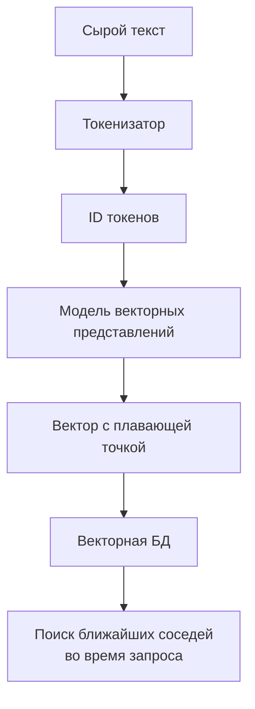
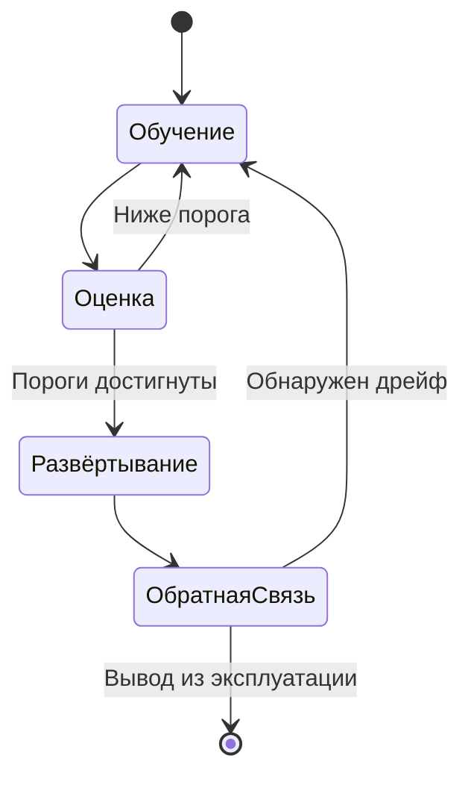
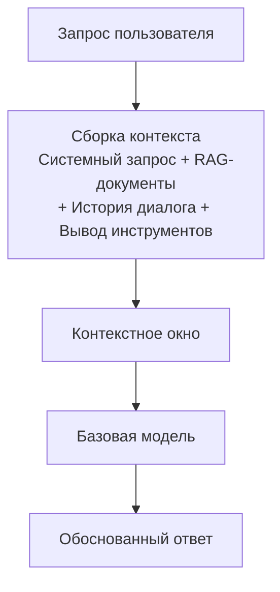
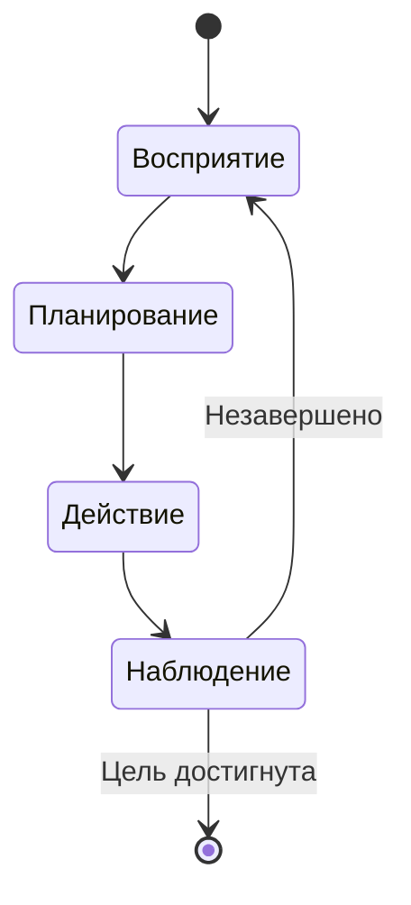
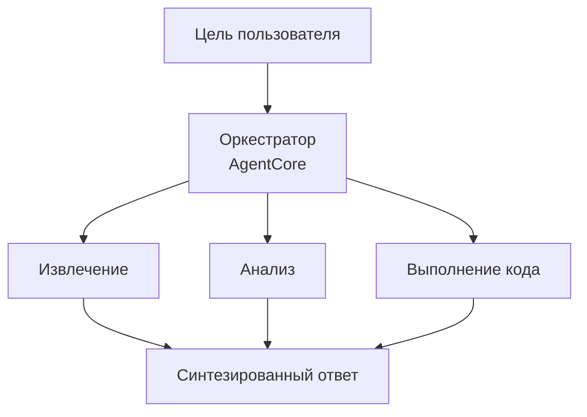

## Тема 2.1. Основные концепции генеративного ИИ (GenAI)

Генеративный ИИ производит новый контент, а не предсказывает метку или классифицирует входные данные. Это различие определяет всё: архитектуры моделей для таких систем, способ их ценообразования, характерные сбои и новую дисциплину контекстной инженерии, которая определяет, какую информацию модель видит перед ответом. Эта тема охватывает шесть предметных областей, три из которых новые в руководстве по экзамену v1.1 и отражают то, насколько быстро технология перешла из области исследований в производственные развёртывания.[^201001]

Введение в Раздел 2 установило, что генеративный ИИ занимает 24% веса экзамена и что его стоимость и профиль сбоев существенно отличаются от классического машинного обучения. Эта тема основывает эти утверждения на лежащих в основе механизмах. К концу вы сможете объяснить, что такое токен и почему количество токенов в запросе напрямую влияет на счёт, описать, как базовая модель проходит путь от сырого текста до развёрнутого сервиса, объяснить, что означает контекстная инженерия и как она соотносится с инженерией запросов, и сформулировать паттерны, которые мультиагентные системы используют при координации нескольких ИИ-компонентов.

### 2.1.1 Базовые концепции GenAI

Модели генеративного ИИ разделяют набор базовых абстракций, которые встречаются по всей документации AWS, на страницах с ценами поставщиков и в ходе технических ревью. Понимание этих абстракций является предпосылкой для всего остального в Разделе 2.

**Токенизация** — это первый шаг обработки текста языковой моделью. *Токен* — наименьшая единица текста, с которой работает модель. В большинстве английских текстов токен составляет примерно три-четыре символа, поэтому слово «tokenization» превращается в два-три токена в зависимости от токенизатора, а слово «cat» — в один токен. Цифры, знаки препинания и символы не-английских языков часто дают больше токенов на слово, чем стандартная английская проза.[^201002] Общее число токенов запроса — это сумма входных токенов (текст, который вы отправляете) и выходных токенов (текст, который модель генерирует в ответ). Оба количества фигурируют в счёте.

**Чанкинг** — процесс разбивки большого документа на меньшие сегменты перед созданием векторных представлений или извлечением. PDF объёмом 50 страниц не может поместиться в контекстное окно модели единым блоком, поэтому его делят на перекрывающиеся чанки по несколько сотен токенов каждый. Размер чанка и процент перекрытия — настраиваемые параметры, влияющие на точность извлечения: слишком маленькие чанки теряют окружающий контекст, а слишком большие расходуют токенный бюджет при включении в запрос.[^201003] Чанкинг — это подготовительный шаг, а не возможность модели; он выполняется во время построения индекса, а не во время инференса.

*Векторные представления (embeddings)* — числовые представления текста (или изображений, или аудио), кодирующие смысловое значение в виде векторов в многомерном пространстве. Два фрагмента текста со схожими значениями будут иметь векторные представления, геометрически близкие друг к другу, что и делает возможным поиск по сходству в коллекции документов. **Amazon Bedrock** предоставляет модели векторных представлений, такие как Amazon Titan Embeddings и Cohere Embed, которые принимают текст и возвращают вектор с плавающей точкой.[^201004] Эти векторы затем хранятся в векторной базе данных — специализированном хранилище, оптимизированном для поиска ближайших соседей. Среди распространённых векторных баз данных, доступных в AWS, — **Amazon OpenSearch Service** с плагином k-NN, **Amazon Aurora** и **Amazon RDS for PostgreSQL** с расширением pgvector, а также **Amazon Neptune Analytics** с векторным поиском.[^201005]

*Рисунок 2.1.1: Конвейер токенизации и создания векторных представлений. Текст сначала преобразуется в ID токенов токенизатором, затем отображается в многомерный вектор моделью векторных представлений и, наконец, сохраняется в векторной базе данных для семантического поиска.*

**Инженерия запросов (prompt engineering)** — практика составления текстовых входных данных для модели с целью повышения качества, точности или формата её выходных данных. Хорошо спроектированный запрос может включать инструкцию, контекст, примеры и явный формат вывода. Тема 3.2 подробно рассматривает конкретные техники инженерии запросов; на этом этапе ключевой момент состоит в том, что инженерия запросов — это самый непосредственный рычаг воздействия на поведение модели без изменения самой модели.[^201006]

**Трансформерные большие языковые модели (LLM)** — доминирующая архитектура для современных языковых задач. Архитектура *трансформера*, представленная в 2017 году, использует механизм *самовнимания (self-attention)* для взвешивания релевантности каждого токена в последовательности по отношению ко всем остальным при генерации каждого выходного токена.[^201007] Самовнимание позволяет трансформеру поддерживать дальние зависимости в тексте, например, знать, что местоимение «он» относится к существительному, введённому тремя предложениями ранее. Математика механизма внимания не проверяется на экзамене AIF-C01, но концепция важна для понимания того, почему более длинные контексты вычислительно дороже и почему контекстное окно имеет конечный размер.

**Базовые модели (FM)** — большие модели, обученные на широких наборах данных общего назначения в огромных масштабах.[^201008] Базовая модель не обучается для одной конкретной задачи; вместо этого она изучает общие представления языка (или изображений, или кода), которые затем можно адаптировать ко многим последующим задачам с помощью запросов, извлечения или тонкой настройки. Примеры, доступные через Amazon Bedrock, включают Anthropic Claude, Meta Llama, Amazon Nova и модели Mistral AI, среди прочих.[^201009]

**Мультимодальные модели** принимают и производят более одного типа данных. Мультимодальная базовая модель может принять изображение плюс текстовый вопрос и вернуть текстовый ответ или принять текст и вернуть и текст, и изображение. В семействе Amazon Nova на Amazon Bedrock модели Lite, Pro и Premier обрабатывают текст, изображения, видео и документы; Nova Micro работает только с текстом и является самым дешёвым вариантом для задач с чистым текстом.[^201010]

**Диффузионные модели** генерируют результаты, научившись обращать процесс добавления шума. Во время обучения модель видит данные с нарастающим количеством случайного шума и учится предсказывать и устранять этот шум шаг за шагом. Во время инференса она начинает с чистого шума и итеративно удаляет его, превращая в связное изображение, аудиоклип или другой артефакт.[^201011] Диффузионные модели лежат в основе возможностей генерации изображений. Amazon Bedrock включает Stable Diffusion от Stability AI как модель генерации изображений в этой категории.[^201012]

### 2.1.2 Потенциальные сценарии использования моделей GenAI

Генеративный ИИ охватывает более широкий круг бизнес-задач, чем большинство классических систем машинного обучения, потому что базовые модели обобщают данные по разделам. Практический вопрос — не «может ли генеративная модель помочь с данной задачей?», а «является ли она правильным экономическим и точностным компромиссом для этого конкретного случая?».

*Таблица 2.1.1: Распространённые сценарии использования GenAI и репрезентативные бизнес-ситуации*

| Сценарий | Что делает модель | Репрезентативная бизнес-ситуация |
|---|---|---|
| Генерация изображений | Создаёт новые изображения по текстовым или графическим запросам | Маркетинговые команды генерируют lifestyle-изображения продуктов без фотосессии |
| Генерация видео | Создаёт короткие видеоклипы по текстовым описаниям | Медиакомпании производят черновые видеоролики для проверки |
| Генерация аудио | Синтезирует речь или музыку | Платформы электронного обучения ночью генерируют озвучку для обновлений курсов |
| Суммаризация | Сжимает длинные документы в более короткие версии | Юридические отделы резюмируют контракты для выделения ключевых обязательств |
| ИИ-ассистенты | Отвечает на вопросы, составляет контент, объясняет концепции | Боты внутренней базы знаний отвечают на HR-вопросы сотрудников |
| Перевод | Конвертирует текст с одного языка на другой | Глобальные ритейлеры локализуют описания продуктов на 20 языков |
| Генерация кода | Пишет, проверяет и объясняет исходный код | Разработчики ускоряют реализацию рутинных функций и написание модульных тестов |
| Агенты обслуживания клиентов | Обрабатывает запросы клиентов через диалог | Контакт-центры отклоняют типичные вопросы без привлечения живых агентов |
| Поиск | Возвращает семантически релевантные результаты, а не результаты по ключевым словам | Корпоративные порталы документов находят нужную страницу политики, даже если запрос использует другие формулировки |
| Системы рекомендаций | Предлагает контент на основе поведения пользователя или заявленных предпочтений | Стриминговые сервисы рекомендуют контент с использованием гибридных семантических и коллаборативных сигналов |

Каждый тип сценария предъявляет разные требования к базовой модели. Суммаризация и перевод — прежде всего языковые задачи, которые предпочитают LLM. Генерация изображений и видео требует диффузионных или других генеративных визуальных моделей. Генерация кода выигрывает от моделей, специально настроенных на языки программирования. Агенты обслуживания клиентов выигрывают от низкой задержки, строгого следования инструкциям и возможности вызывать внешние инструменты, что напрямую связано с агентными паттернами, рассмотренными в разделе 2.1.6. Поиск и рекомендации используют возможности создания векторных представлений и поиска по сходству из раздела 2.1.1, как правило, объединяя их с паттерном RAG, рассмотренным в Теме 3.1.

### 2.1.3 Жизненный цикл базовой модели

Базовая модель не попадает из обучающих данных прямо в производство. Она проходит определённый жизненный цикл, у которого больше этапов, чем у классического жизненного цикла МО, описанного в Теме 1.3. Классический конвейер ориентирован на размеченный датасет, модель и эндпоинт предсказания. Жизненный цикл базовой модели начинается значительно раньше — с решений о том, на каких необработанных данных проводить предобучение, — и добавляет петли обратной связи после развёртывания, которые непрерывно уточняют поведение модели.

*Рисунок 2.1.2: Жизненный цикл базовой модели. Путь не строго линейный: неудачные оценки возвращают к тонкой настройке, а производственная обратная связь может запускать дополнительные циклы адаптации.*

Семь этапов жизненного цикла базовой модели:

- **Выбор данных**: Курирование обучающего корпуса. Для предобучения он обширен и разнообразен (веб-краулинг, книги, репозитории кода). Для тонкой настройки — доменно-специфичен и значительно меньше. Качество данных на этом этапе напрямую определяет поведение модели, включая её предвзятости.[^201013]
- **Выбор модели**: Выбор архитектуры (вариант трансформера, диффузионная модель, мультимодальная), размера в параметрах и того, обучать ли с нуля или начинать с существующей базовой модели. Большинство бизнес-развёртываний полностью пропускают предобучение с нуля и выбирают из доступных базовых моделей через сервис типа Amazon Bedrock.[^201014]
- **Предобучение**: Изучение общих представлений из обширного датасета с использованием большого объёма вычислений (GPU-кластеры, работающие неделями или месяцами). Это этап, создающий веса базовой модели. Предобучение настолько дорого, что им практически не занимается ни один бизнес за пределами гиперскейлеров.[^201015]
- **Тонкая настройка**: Обновление весов базовой модели на меньшем, задачно- или доменно-специфичном датасете. Тонкая настройка адаптирует поведение модели без повторения полного стоимости предобучения. Amazon Bedrock поддерживает задания по кастомной тонкой настройке, а Amazon SageMaker AI поддерживает как тонкую настройку, так и более продвинутые методы тонкой настройки с эффективным использованием параметров.[^201016]
- **Оценка**: Измерение качества модели на отложенных тестовых данных. Для генеративных моделей оценка включает автоматические метрики, такие как ROUGE и BLEU для текста, плюс человеческую оценку и, всё чаще, методы «LLM-в-роли-судьи». Тема 3.4 подробно рассматривает оценку.
- **Развёртывание**: Обслуживание модели через API-эндпоинт, куда приложения могут отправлять запросы и получать ответы. Amazon Bedrock управляет базовой инфраструктурой для поддерживаемых моделей, тогда как Amazon SageMaker AI предоставляет командам прямой контроль над конфигурацией эндпоинта.[^201017]
- **Обратная связь**: Сбор сигналов из производственного трафика (задержка, точность, удовлетворённость пользователей, частота ошибок) и их использование для обнаружения дрейфа или построения новых датасетов для тонкой настройки. Это замыкает петлю и отличает жизненный цикл базовой модели от разового обучения.

Ключевое отличие от классического жизненного цикла МО в Теме 1.3 — этап предобучения. Классические конвейеры МО начинают с размеченного датасета, специфичного для задачи. Жизненный цикл базовой модели начинается с самоконтролируемого обучения на неразмеченном тексте в масштабах, создающих общие возможности, и только позднее сужается до конкретных задач через тонкую настройку или запросы. Бизнес-практики обычно входят в жизненный цикл базовой модели на этапе тонкой настройки или развёртывания, а не предобучения.

### 2.1.4 Модель ценообразования на основе токенов

Классический инференс МО, как правило, оплачивается за предсказание или за час работы эндпоинта. Ценообразование на основе токенов иное: вы платите за количество потреблённых токенов — как входящих, так и исходящих, — а не за вычислительный ресурс, выполнивший запрос. Понимание токенной экономики напрямую применимо к бюджетному планированию любого проекта на основе генеративного ИИ.

**Входные токены** — это токены в запросе, который вы отправляете модели: системный запрос, все извлечённые документы, история диалога, выходные данные инструментов и сообщение пользователя. **Выходные токены** — это токены, сгенерированные моделью в ответ. Amazon Bedrock, как и большинство облачных поставщиков базовых моделей, взимает отдельную плату за входные и выходные токены, причём выходные токены стоят дороже, так как генерация токена вычислительно более затратна, чем обработка входного токена.[^201018]

*Таблица 2.1.2: Структура ценообразования токенов и рычаги управления стоимостью*

| Фактор ценообразования | Описание | Влияние на стоимость |
|---|---|---|
| Цена входного токена | Стоимость за 1000 входных токенов (зависит от модели) | Прямо пропорциональна длине запроса |
| Цена выходного токена | Стоимость за 1000 выходных токенов, как правило в 3–5 раз выше входных | Прямо пропорциональна длине ответа |
| Кэширование запросов | Повторное использование ранее обработанных префиксов запроса | Снижает фактическую стоимость входных токенов для повторяющегося контекста |
| Пакетный инференс | Асинхронная обработка множества запросов вместе | Типичная скидка 50% по сравнению с ценами по требованию |
| Выделенная пропускная способность | Зарезервированные мощности для стабильных высоконагруженных рабочих нагрузок | Предсказуемая стоимость, но требует обязательств по объёму |

Для конкретности рассмотрим сценарий обслуживания клиентов. Одно взаимодействие может включать системный запрос на 500 токенов, извлечённый документ на 1000 токенов, сообщение пользователя на 50 токенов и ответ модели на 200 токенов. Это 1550 входных токенов и 200 выходных токенов. Для модели с ценой $0,003 за 1000 входных токенов и $0,015 за 1000 выходных токенов стоимость одного взаимодействия составит около $0,0077 ($0,00465 входные + $0,003 выходные). При 100 000 взаимодействиях в месяц счёт составит около $770 за один вызов модели на взаимодействие. Если рабочий процесс вызывает модель несколько раз за взаимодействие (для маршрутизации, ранжирования результатов извлечения, генерации ответа), эти цифры умножаются соответственно.[^201019]

**Кэширование запросов** позволяет поставщику модели хранить обработанное представление повторяющегося префикса запроса, чтобы последующие запросы с этим же префиксом не обрабатывали эти токены заново. Когда один и тот же системный запрос отправляется с каждым запросом, его кэширование может снизить фактическую стоимость входных токенов кэшированной части на 80–90 процентов.[^201020] Amazon Bedrock поддерживает кэширование запросов для применимых моделей.

**Пакетный инференс** в Amazon Bedrock обрабатывает запросы асинхронно, а не в реальном времени. Вместо отправки одного запроса и ожидания ответа вы отправляете пакет запросов и получаете результаты после завершения обработки. Компромисс — задержка: пакетные ответы приходят через минуты или часы после подачи, а не через секунды. Для сценариев использования, допускающих задержку (очереди суммаризации документов, ночные задания по переводу, массовая генерация контента), пакетный инференс — прямой рычаг снижения затрат.[^201021]

Практическое следствие для бизнес-планирования состоит в том, что токенные затраты накапливаются при принятии архитектурных решений. Паттерн RAG, извлекающий три документа по 500 токенов на запрос, добавляет 1500 входных токенов к каждому запросу. Агентный рабочий процесс, выполняющий пять вызовов модели на запрос пользователя, примерно впятеро умножает стоимость запроса. Проектирование с учётом токенной эффективности — через более короткие запросы, кэширование запросов, пакетную обработку там, где допустима задержка, и правильный размер количества извлекаемых чанков — так же важно, как выбор правильной модели.

### 2.1.5 Контекстная инженерия в приложениях на основе базовых моделей

Инженерия запросов сосредоточена на формулировке и структуре одного запроса: как сформулировать инструкцию, как оформить пример, сколько примеров включить. **Контекстная инженерия** — более широкая дисциплина, которая задаётся вопросом: какая информация вообще должна попасть в контекстное окно модели, в каком виде и в каком порядке.[^201022] Модель не видит мир — она видит только то, что помещается в её контекстном окне во время инференса. Контекстная инженерия — это практика целенаправленного курирования этого содержимого.

Контекстное окно — максимальное количество токенов, которое модель может обработать за один проход, включая как входные, так и выходные данные. Размеры контекстных окон моделей Amazon Bedrock варьируются от десятков тысяч до более чем миллиона токенов в зависимости от семейства моделей (например, некоторые варианты Anthropic Claude достигают одного миллиона токенов с бета-заголовком 1M-context, а Amazon Nova Premier и Meta Llama 4 Maverick предлагают окна на один миллион токенов в Bedrock).[^201023] Большое контекстное окно не означает, что приложение должно заполнять его целиком: более длинные контексты увеличивают задержку и стоимость, а модели могут проявлять поведение *«потерян в середине» (lost-in-the-middle)*, при котором релевантная информация, закопанная в середине длинного контекста, получает меньше внимания, чем информация в начале или конце.[^201024]

*Рисунок 2.1.3: Сборка контекста для приложений на основе базовых моделей. Контекстная инженерия управляет тем, что попадает в каждый слот контекстного окна и как собранные входные данные упорядочиваются перед обработкой моделью.*

Компоненты, из которых обычно состоит собранный контекст:

- **Системный запрос**: Постоянная инструкция, определяющая роль, тон, формат вывода и ограничения модели. Системный запрос, как правило, постоянен для всех запросов в приложении, что делает его хорошим кандидатом для кэширования запросов.
- **Извлечённые документы**: Вывод конвейера RAG. Шаг извлечения выбирает наиболее семантически релевантные чанки из векторной базы данных, но контекстная инженерия определяет, сколько чанков включить, как их ранжировать и нужно ли суммаризировать чанки перед включением для экономии токенов.
- **История диалога**: Предыдущие реплики многоходового диалога. Поскольку контекстные окна конечны, длинный диалог в итоге превышает окно. Стратегии контекстной инженерии для истории включают усечение (удаление самых старых реплик), суммаризацию (замену старых реплик скользящим резюме) и избирательное сохранение (сохранение только реплик, отмеченных как высокоценные).
- **Вывод инструментов**: Когда агент вызывает внешнюю функцию (запрос к базе данных, веб-поиск, вызов API), результат инжектируется обратно в контекст для рассуждения модели. Формат вывода инструментов влияет на надёжность интерпретации результатов моделью.
- **Структурированные данные**: Таблицы, JSON-записи или пары ключ-значение, обеспечивающие фактическую привязку. Структурированные данные более токен-эффективны, чем прозаические описания тех же фактов, когда модели нужно обращаться к конкретным значениям.

Отличие от инженерии запросов — в масштабе. Инженерия запросов отвечает на вопрос «как сформулировать эту инструкцию?». Контекстная инженерия отвечает на вопрос «что должно быть в контекстном окне, сколько этого, в каком виде и в каком порядке?». Обе дисциплины актуальны для производственных приложений на основе базовых моделей, но контекстная инженерия масштабируется вместе со сложностью приложения. Простой чат-бот можно настроить через инженерию запросов один раз. Сложный агент, координирующий извлечение данных, вызовы инструментов и многоходовую историю, требует постоянной контекстной инженерии для соблюдения токенного бюджета и поддержания качества ответов.

*Таблица 2.1.3: Техники контекстной инженерии и их компромиссы*

| Техника | Что делает | Компромисс |
|---|---|---|
| Суммаризация контекстного окна | Сжимает старые реплики диалога в краткое резюме | Теряется точная формулировка; возможно искажение |
| Избирательное извлечение | Извлекает только top-k наиболее релевантных чанков, а не все кандидаты | Может пропустить релевантные документы при плохом ранжировании моделью извлечения |
| Предварительная суммаризация чанков | Суммаризирует каждый извлечённый документ перед его включением | Сокращает токены на документ за счёт дополнительных вызовов модели |
| Кэширование запросов | Хранит обработанные представления повторяющихся префиксов | Требует структуры запроса, при которой кэшируемая часть остаётся стабильной |
| Форматирование вывода инструментов | Преобразует сырые ответы API в компактные, удобные для модели форматы | Требует логики форматирования под каждый инструмент на уровне приложения |

### 2.1.6 Базовые концепции агентного ИИ

ИИ-агент — это система, в которой базовая модель не просто отвечает на один запрос, а работает в цикле: воспринимает цель или наблюдение, планирует действие, выполняет его (часто вызывая внешний инструмент) и затем наблюдает результат перед тем, как решить, выполнена ли задача.[^201025] Одиночный вызов базовой модели производит один ответ и завершается. Агент работает до наступления условия остановки — завершения многошаговой задачи, исчерпания лимита ходов или определения невозможности задачи при доступных инструментах.

*Рисунок 2.1.4: Цикл агента. Агент циклически проходит через восприятие, планирование, действие и наблюдение до наступления условия остановки.*

Одноагентные архитектуры справляются со многими задачами, но сложные рабочие процессы часто требуют нескольких агентов, работающих совместно. **Мультиагентные системы** распределяют работу между специализированными агентами, каждый из которых отвечает за один аспект общей задачи.[^201026] Экзамен проверяет понимание четырёх паттернов координации:

- **Паттерн оркестратора/работника**: Центральный агент-оркестратор получает цель пользователя, декомпозирует её на подзадачи, направляет каждую подзадачу специализированному агенту-работнику, собирает результаты и синтезирует финальный ответ. Оркестратор сам не выполняет работу — он управляет рабочим процессом.
- **Иерархический паттерн**: Древовидная структура, в которой агент верхнего уровня управляет агентами среднего уровня, которые, в свою очередь, управляют агентами листового уровня. Это расширение паттерна оркестратора/работника на несколько уровней декомпозиции, подходящее для задач с естественной иерархической структурой (например, исследовательская задача, разбивающаяся на тематические области, каждая из которых разбивается на извлечение источников и анализ).
- **Последовательный паттерн**: Агенты выстроены в конвейер, где вывод одного агента служит входом для следующего. Это уместно, когда каждый шаг должен быть завершён до начала следующего и нет необходимости влиять поведением агента ниже по потоку на поведение агента выше.
- **Паттерн дебатов**: Несколько агентов независимо производят ответы на один и тот же запрос, затем оценивают или критикуют ответы друг друга, а финальный агент синтезирует лучший ответ. Это повышает точность на задачах, где разные подходы к рассуждению приводят к разным выводам.

**Протокол контекста модели (MCP)** — стандартизированный протокол для подключения ИИ-агентов к внешним инструментам, источникам данных и сервисам.[^201027] Без общего протокола каждая интеграция агента с внешней системой требует написания пользовательского кода для обработки аутентификации, форматирования запросов и разбора ответов. MCP определяет стандартный клиент-серверный интерфейс, так что агент может обнаруживать доступные инструменты, вызывать их со структурированными аргументами и получать структурированные результаты без интеграционного кода под каждую систему. AWS заявила о поддержке MCP в экосистеме Amazon Bedrock, а **Strands Agents**, опенсорс-SDK AWS для создания агентных приложений, реализует клиентский интерфейс MCP.[^201028]

Паттерны коммуникации мультиагентных систем описывают, как агенты обмениваются сообщениями. Агенты могут общаться напрямую (peer-to-peer), через общую очередь сообщений или через централизованного брокера. Выбор паттерна коммуникации влияет на надёжность, гарантии порядка и возможность аудита того, что каждый агент сообщил другому. В производственных системах очереди сообщений предпочтительнее прямых вызовов агент-агент, так как они развязывают отправляющего агента от принимающего и обеспечивают надёжную запись всех межагентных сообщений.

*Таблица 2.1.4: Типы памяти в агентных системах ИИ*

| Тип памяти | Область | Где хранится | Сценарий использования |
|---|---|---|---|
| Краткосрочная (рабочая) | Текущая сессия или цикл агента | Контекстное окно | Рассуждение над текущей задачей |
| Долгосрочная (постоянная) | Между сессиями | Внешняя БД или векторное хранилище | Запоминание пользовательских предпочтений, прошлых решений |
| Эпизодическая | Конкретные прошлые события или взаимодействия | Извлекаемое хранилище записей | Воспоминание о том, что произошло в прошлом взаимодействии |
| Семантическая | Общие мировые или доменные знания | Встроена в веса модели или RAG-индекс | Ответы на фактические вопросы |

**Управление памятью** — это практика принятия решений о том, какую информацию агент сохраняет, в каком уровне памяти и как долго.[^201029] Краткосрочная память — это само контекстное окно. Когда рабочий контекст агента приближается к пределу окна, уровень управления памятью должен решить, что сжать, суммаризировать или выгрузить в долгосрочное хранилище. Долгосрочная память, как правило, использует векторную базу данных (как описано в разделе 2.1.1), чтобы агент мог семантически извлекать релевантный прошлый опыт, а не сканировать полный журнал.

**Использование инструментов** в агентных системах означает способность агента вызывать внешние функции и включать результаты в своё рассуждение.[^201030] Инструментом может быть веб-поиск, запрос к базе данных, вызов REST API, интерпретатор кода или любая функция, возвращающая результат, который агент может наблюдать. Инструменты определяются через схему входных и выходных данных; базовая модель использует эти схемы для решения, когда вызывать инструмент и какие аргументы передавать. В документации API это иногда называется *вызовом функций (function calling)*.

**Оркестрация рабочих процессов** координирует выполнение многошаговых агентных процессов, обрабатывая упорядочивание, восстановление после ошибок и управление состоянием между вызовами агентов.[^201031] **Amazon Bedrock AgentCore** — более новый управляемый уровень выполнения для агентных рабочих нагрузок на Amazon Bedrock — обрабатывает этот уровень оркестрации для производственных агентных приложений, предоставляя инфраструктуру выполнения, чтобы командам не нужно было создавать и эксплуатировать собственную среду выполнения агентов.[^201032] Strands Agents — опенсорс-SDK, расположенный поверх среды выполнения, — даёт разработчикам основанный на Python способ определять агентов, инструменты и поведение памяти со встроенной поддержкой клиента MCP.[^201033]

*Рисунок 2.1.5: Паттерн оркестратора/работника мультиагентной системы на Amazon Bedrock AgentCore. Оркестратор управляет агентами-работниками и собирает их выводы в финальный ответ.*

Бизнес-значимость агентного ИИ состоит в том, что он открывает сценарии использования, которые не может охватить одиночный запрос: задачи, требующие нескольких обращений к инструментам; задачи, которые должны адаптироваться в ходе выполнения на основе промежуточных результатов; задачи, включающие координацию специализированных подсистем. Вместе с тем агентные системы сложнее проектировать, дороже запускать (каждая итерация цикла агента потребляет токены) и труднее аудировать, чем одиночные вызовы. Тема 3.1 возвращается к агентам ИИ с точки зрения дизайна, рассматривая, когда использовать агентов, а когда более простые паттерны.

---

Этот раздел выстроил концептуальный словарь для всего Раздела 2. Теперь вы можете дать определение базовым примитивам генеративного ИИ (токены, векторные представления, векторы, внимание, базовые модели, диффузионные модели), объяснить жизненный цикл базовой модели и чем он отличается от классического конвейера МО, приблизительно подсчитать токенные затраты для заданной архитектуры, описать, что означает контекстная инженерия и чем она отличается от инженерии запросов, и сформулировать основные паттерны мультиагентных систем и роль MCP. Тема 2.2 делает следующий шаг: учитывая эти возможности, каковы реальные ограничения генеративного ИИ и как бизнес должен учитывать эти ограничения при выборе генеративного решения?

---

## Вопросы для самопроверки

**Вопрос 1**

Компания строит систему ответов на вопросы по документам, которая разбивает 200-страничный PDF на чанки, создаёт для них векторные представления и хранит в векторной базе данных. Когда пользователь задаёт вопрос, система извлекает три наиболее релевантных чанка и включает их в запрос к LLM. Разработчик сообщает, что модель иногда игнорирует релевантную информацию, расположенную в середине длинных извлечённых чанков.

Какой из следующих вариантов ЛУЧШЕ всего объясняет это поведение и НАИБОЛЕЕ подходящий способ его устранения?

A. Токенизатор модели отбрасывает токены из середины документа до того, как их обработает модель векторных представлений. Уменьшите размер чанка до менее чем 50 токенов, чтобы токенизатор сохранял всё содержимое.

B. Большие языковые модели могут проявлять эффект «потерян в середине», при котором контент в середине длинного контекста получает меньше внимания, чем контент в начале или конце. Меньшие чанки или суммаризация чанков перед включением могут снизить этот эффект.

C. Векторная база данных выполняет поиск по ключевым словам, а не семантический поиск, поэтому извлекает чанки по частоте слов, а не по смыслу. Переключитесь на индекс полнотекстового поиска.

D. Диффузионные модели не предназначены для задач поиска по тексту. Замените LLM диффузионной моделью, обученной на понимание документов.

*Пояснение.* Правильный ответ — B. Эффект «потерян в середине» — задокументированное поведение трансформерных LLM, при котором информация, расположенная в середине длинного контекстного окна, получает пропорционально меньший вес внимания, чем информация в начале или конце контекста.[^201034] Это проблема контекстной инженерии, а не токенизатора (A неверен), не проблема поиска в векторной базе данных (C неверен) и не вопрос выбора класса модели (D неверен, и диффузионные модели не выполняют поиск по тексту). Меры по устранению включают уменьшение размера чанка, чтобы каждый чанк нёс более узкий контент, суммаризацию чанков перед включением для сокращения количества токенов, а также размещение наиболее релевантных чанков в начале запроса, а не в середине. Всё это решения контекстной инженерии: они управляют тем, что попадает в контекстное окно, в каком виде и в каком порядке, что является именно той дисциплиной, описанной в разделе 2.1.5.[^201035]

---

**Вопрос 2**

Организация оценивает стоимость запуска приложения генеративного ИИ для обслуживания клиентов на Amazon Bedrock. Каждое взаимодействие с клиентом включает системный запрос на 600 токенов, в среднем 900 токенов из извлечённых документов, сообщение пользователя на 100 токенов и ответ модели на 300 токенов. Приложение обрабатывает 500 000 взаимодействий в месяц.

Какой фактор ценообразования окажет НАИБОЛЕЕ значительное влияние, если организация хочет сократить ежемесячные расходы, не меняя модель и качество ответов?

A. Переход с выделенной пропускной способности на ценообразование по требованию для всех запросов.

B. Применение кэширования запросов к системному запросу, который одинаков для каждого запроса.

C. Увеличение числа извлекаемых чанков документов с 3 до 6 на взаимодействие.

D. Снижение максимального лимита выходных токенов со 300 до 100.

*Пояснение.* Правильный ответ — B. В каждом взаимодействии системный запрос составляет 600 токенов и одинаков для всех 500 000 запросов. Кэширование запросов позволяет поставщику хранить обработанное представление этого повторяющегося префикса и взимать существенно меньшую плату (как правило, на 80–90 процентов меньше) за кэш-хиты по этим 600 токенам.[^201036] При 500 000 запросов экономия на кэшированной части весьма значительна. Ответ A неверен, поскольку выделенная пропускная способность обеспечивает скидку на зарезервированные мощности по сравнению с ценообразованием по требованию; переход с выделенной на по требованию увеличит затраты, а не снизит. Ответ C неверен, поскольку добавление большего числа извлечённых чанков увеличивает количество входных токенов на запрос, что увеличивает стоимость. Ответ D мог бы снизить затраты на выходные токены, но вопрос указывает на неизменность качества ответов; произвольное усечение вывода, скорее всего, снизит качество. Кэширование запросов нацелено на наиболее повторяющуюся часть запроса и снижает стоимость без изменения контента, отправляемого в модель.[^201037]

---

**Вопрос 3**

Бизнес-аналитик рассматривает предложение об агентной системе ИИ для обработки запросов на возврат средств. Предлагаемая система использует агента-оркестратора, который получает запрос на возврат, вызывает агента-работника для поиска истории заказов, вызывает второго агента-работника для проверки политики возврата, а затем генерирует решение. Каждый шаг включает отдельный вызов модели.

Какое из следующих соображений аналитик должен поднять в первую очередь относительно стоимости этой архитектуры по сравнению с одиночным вызовом LLM для той же задачи?

A. Мультиагентные системы не поддерживаются Amazon Bedrock AgentCore, поэтому команде придётся создать пользовательский уровень оркестрации, что добавляет инженерные затраты.

B. Цикл агента выполняет несколько вызовов модели на запрос пользователя, и каждый вызов потребляет входные и выходные токены. Общая токенная стоимость на запрос будет выше, чем при одиночном вызове с включением всего контекста в один запрос.

C. Агентные системы используют внутри диффузионные модели, которые имеют более высокую цену за токен, чем трансформерные LLM в Amazon Bedrock.

D. Паттерн оркестратора/работника требует, чтобы все агенты-работники использовали одну и ту же базовую модель, что исключает возможность использования более дешёвой модели для шагов поиска.

*Пояснение.* Правильный ответ — B. Каждый вызов модели в агентном цикле несёт затраты на входные и выходные токены. Агент-оркестратор, выполняющий три вызова модели (один для декомпозиции задачи, по одному для каждого работника и один для синтеза результата), будет потреблять в несколько раз больше токенов на запрос пользователя, чем одиночный запрос, включающий весь релевантный контекст. Это ключевой компромисс стоимости для агентных архитектур, который напрямую рассмотрен в разделе 2.1.4 по ценообразованию на основе токенов и разделе 2.1.6 по агентному ИИ.[^201038] Ответ A неверен, поскольку Amazon Bedrock AgentCore Runtime специально разработан для поддержки мультиагентной оркестрации. Ответ C неверен, поскольку агентные системы используют LLM (трансформерные модели) для рассуждения, а не диффузионные модели; диффузионные модели генерируют изображения и другие медиа, а не шаги рассуждения в цикле агента. Ответ D неверен, поскольку паттерн оркестратора/работника поддерживает разнородные модели у разных работников; использование более дешёвых и быстрых моделей для шагов поиска — распространённая техника оптимизации затрат.[^201039]

---

**Вопрос 4**

Команда разработчиков создаёт корпоративный чат-бот на Amazon Bedrock. Они замечают, что контекстное окно заполняется примерно после 20 ходов диалога, поскольку каждый ход добавляет полный предыдущий диалог к следующему запросу. Команда хочет поддерживать связность диалога более 20 ходов, не меняя модель.

Какая техника контекстной инженерии НАИБОЛЕЕ непосредственно решает эту проблему?

A. Заменить трансформерный LLM диффузионной моделью, которая не использует контекстные окна и поэтому не имеет ограничения по ходам.

B. Перейти с ценообразования по требованию на выделенную пропускную способность, которая выделяет для приложения более широкое контекстное окно.

C. Применить суммаризацию контекстного окна: заменить старые реплики диалога скользящим резюме, сгенерированным моделью, и включать в каждый запрос только резюме плюс последние реплики.

D. Увеличить размер чанков извлечённых документов, чтобы сократить число чанков, включаемых в контекст, и освободить место для большей истории диалога.

*Пояснение.* Правильный ответ — C. Суммаризация контекстного окна — стандартная техника контекстной инженерии для многоходовых диалогов: когда накопленная история приближается к пределу окна, приложение использует модель для создания сжатого резюме самых старых ходов, заменяет эти ходы резюме и добавляет только последние ходы в полном виде.[^201040] Это сохраняет суть диалога без превышения окна. Ответ A неверен: диффузионные модели генерируют изображения и аудио, а не текстовые диалоги, и они не решают ограничений контекстного окна. Ответ B неверен: выделенная пропускная способность — это ценовая конструкция, резервирующая вычислительные мощности, а не механизм расширения размера контекстного окна. Ответ D затрагивает другой слот контекста (извлечённые документы) и помог бы лишь в том случае, если бы контекст был занят прежде всего выводом извлечения, а не историей диалога, что в данном сценарии не указано.[^201041]

---

**Вопрос 5**

Компания хочет интегрировать свои внутренние инструменты — CRM-систему, базу данных тикетов и API склада — с ИИ-агентом, чтобы он мог искать записи о клиентах, создавать сервисные тикеты и проверять уровни запасов в рамках одного диалога. Разработчик рекомендует использовать протокол контекста модели (MCP).

Какое утверждение ЛУЧШЕ всего описывает роль MCP в этой интеграции?

A. MCP — это стандарт формата данных, конвертирующий записи CRM, тикеты и данные склада в токены перед отправкой в базовую модель.

B. MCP — это ценовой уровень в Amazon Bedrock, снижающий стоимость вызовов модели агентами, получающими доступ к внешним инструментам.

C. MCP определяет стандартный клиент-серверный интерфейс, позволяющий агенту обнаруживать доступные инструменты, вызывать их со структурированными аргументами и получать структурированные результаты без написания пользовательского кода интеграции под каждую систему.

D. MCP — это протокол управления памятью, определяющий, какие реплики диалога сохранять в долгосрочном хранилище, а какие удалять после каждой итерации цикла агента.

*Пояснение.* Правильный ответ — C. Протокол контекста модели определяет стандартизированный интерфейс между ИИ-агентом (клиент MCP) и внешними инструментами или сервисами (серверы MCP). Когда CRM-система, система тикетов и API склада каждый предоставляют конечную точку MCP-сервера, агент может обнаруживать и вызывать все три через один и тот же протокол, без необходимости командам разработчиков писать три отдельных пользовательских уровня интеграции.[^201042] Strands Agents, опенсорс-SDK AWS, включает встроенную поддержку клиента MCP, а Amazon Bedrock AgentCore предоставляет среду выполнения для агентов. Ответ A неверен: MCP — не стандарт токенизации или преобразования формата данных. Ответ B неверен: MCP — не ценовая конструкция. Ответ D неверен: управление памятью — это отдельная задача, не связанная с подключением к инструментам, и MCP не управляет тем, что агент сохраняет в памяти между ходами.[^201043]

---

**Вопрос 6**

Базовая модель прошла предобучение на большом общем корпусе и затем тонкую настройку на внутренней технической документации компании. Модель теперь развёрнута через Amazon Bedrock. Через шесть месяцев команда замечает, что ответы модели о более новых продуктах, выпущенных после даты тонкой настройки, неточны.

Какой этап жизненного цикла базовой модели НАИБОЛЕЕ непосредственно решает эту проблему и какое действие рекомендуется?

A. Предобучение: компании следует повторить полный цикл предобучения с обновлённым корпусом, включающим документацию по новым продуктам.

B. Выбор данных: компании следует изменить токенизатор, используемый для обработки документов по новым продуктам перед их подачей в существующую модель.

C. Обратная связь и тонкая настройка: производственная обратная связь показывает проблему с датой среза знаний; команде следует запустить новое задание тонкой настройки на датасете, включающем документацию по новым продуктам, или реализовать RAG для извлечения актуальной информации о продуктах во время инференса.

D. Развёртывание: компании следует перевести обслуживающий эндпоинт с Amazon Bedrock на Amazon SageMaker AI, который автоматически обновляет модель новыми данными из производственной среды.

*Пояснение.* Правильный ответ — C. Жизненный цикл базовой модели включает этап обратной связи, на котором производственные сигналы (в данном случае неточность по новым продуктам) запускают возврат к тонкой настройке с обновлёнными данными.[^201044] Проблема с датой среза знаний — стандартная проблема управления жизненным циклом базовой модели: модель не знает о событиях или документах, датированных позже её обучения. Существуют два стандартных решения: запустить новое задание тонкой настройки, добавляющее данные по новым продуктам в обучающий корпус, или реализовать RAG, чтобы актуальная документация по продуктам извлекалась из регулярно обновляемого индекса и инжектировалась в контекст во время инференса. RAG часто является более быстрым путём, поскольку не требует нового цикла обучения. Ответ A неверен: повторение полного предобучения непомерно дорого и излишне, когда цель — добавить доменно-специфичные обновления. Ответ B неверен: токенизатор обрабатывает текст в токены вне зависимости от актуальности содержимого и не является причиной устаревания знаний. Ответ D неверен: смена инфраструктуры обслуживания не обновляет веса модели; Amazon SageMaker AI не переобучает автоматически развёрнутую модель на основе производственного трафика.[^201045]

---

[^201001]: AWS Certification. AIF-C01 Exam Guide v1.1. URL: <https://docs.aws.amazon.com/aws-certification/latest/ai-practitioner-01/ai-practitioner-01.html>
[^201002]: Anthropic. Token counting in Claude models. URL: <https://docs.anthropic.com/en/docs/about-claude/models>
[^201003]: AWS Documentation. Chunking strategies in Amazon Bedrock Knowledge Bases. URL: <https://docs.aws.amazon.com/bedrock/latest/userguide/kb-chunking-parsing.html>
[^201004]: AWS Documentation. Amazon Titan Embeddings models in Amazon Bedrock. URL: <https://docs.aws.amazon.com/bedrock/latest/userguide/titan-embedding-models.html>
[^201005]: AWS Documentation. Vector engine for Amazon OpenSearch Service. URL: <https://docs.aws.amazon.com/opensearch-service/latest/developerguide/knn.html>
[^201006]: AWS Documentation. Prompt engineering guidelines for Amazon Bedrock. URL: <https://docs.aws.amazon.com/bedrock/latest/userguide/prompt-engineering-guidelines.html>
[^201007]: Vaswani, A. et al. Attention Is All You Need. URL: <https://arxiv.org/abs/1706.03762>
[^201008]: AWS Documentation. What are foundation models? URL: <https://docs.aws.amazon.com/bedrock/latest/userguide/what-is-a-foundation-model.html>
[^201009]: AWS Documentation. Supported foundation models in Amazon Bedrock. URL: <https://docs.aws.amazon.com/bedrock/latest/userguide/models-supported.html>
[^201010]: AWS Documentation. Amazon Nova models overview. URL: <https://docs.aws.amazon.com/bedrock/latest/userguide/amazon-nova.html>
[^201011]: Ho, J. et al. Denoising Diffusion Probabilistic Models. URL: <https://arxiv.org/abs/2006.11239>
[^201012]: AWS Documentation. Stability AI models in Amazon Bedrock. URL: <https://docs.aws.amazon.com/bedrock/latest/userguide/stability-ai.html>
[^201013]: AWS Documentation. Data selection best practices for foundation model training. URL: <https://docs.aws.amazon.com/sagemaker/latest/dg/clarify-foundation-model-evaluate.html>
[^201014]: AWS Documentation. Model selection in Amazon Bedrock. URL: <https://docs.aws.amazon.com/bedrock/latest/userguide/model-selection.html>
[^201015]: AWS Blog. Training large language models at scale on AWS. URL: <https://aws.amazon.com/blogs/machine-learning/training-large-language-models-at-scale-on-aws/>
[^201016]: AWS Documentation. Fine-tuning models in Amazon Bedrock. URL: <https://docs.aws.amazon.com/bedrock/latest/userguide/custom-models.html>
[^201017]: AWS Documentation. Deploying models with Amazon Bedrock endpoints. URL: <https://docs.aws.amazon.com/bedrock/latest/userguide/inference.html>
[^201018]: AWS Documentation. Amazon Bedrock pricing. URL: <https://aws.amazon.com/bedrock/pricing/>
[^201019]: AWS Documentation. On-demand token pricing for Amazon Bedrock. URL: <https://aws.amazon.com/bedrock/pricing/>
[^201020]: AWS Documentation. Prompt caching in Amazon Bedrock. URL: <https://docs.aws.amazon.com/bedrock/latest/userguide/prompt-caching.html>
[^201021]: AWS Documentation. Batch inference jobs in Amazon Bedrock. URL: <https://docs.aws.amazon.com/bedrock/latest/userguide/batch-inference.html>
[^201022]: AWS Blog. Context engineering for large language model applications. URL: <https://aws.amazon.com/blogs/machine-learning/context-engineering-for-llm-applications/>
[^201023]: AWS Documentation. Amazon Bedrock supported models and context window sizes. URL: <https://docs.aws.amazon.com/bedrock/latest/userguide/models-supported.html>
[^201024]: Liu, N. F. et al. Lost in the Middle: How Language Models Use Long Contexts. URL: <https://arxiv.org/abs/2307.03172>
[^201025]: AWS Documentation. What are AI agents? Amazon Bedrock Agents overview. URL: <https://docs.aws.amazon.com/bedrock/latest/userguide/agents.html>
[^201026]: AWS Documentation. Multi-agent collaboration in Amazon Bedrock. URL: <https://docs.aws.amazon.com/bedrock/latest/userguide/agents-multi-agents.html>
[^201027]: Anthropic. Model Context Protocol specification. URL: <https://modelcontextprotocol.io/introduction>
[^201028]: AWS Blog. Strands Agents: open-source SDK for building AI agents on AWS. URL: <https://aws.amazon.com/blogs/machine-learning/strands-agents-open-source-sdk/>
[^201029]: AWS Documentation. Memory management in Amazon Bedrock Agents. URL: <https://docs.aws.amazon.com/bedrock/latest/userguide/agents-memory.html>
[^201030]: AWS Documentation. Action groups and tool use in Amazon Bedrock Agents. URL: <https://docs.aws.amazon.com/bedrock/latest/userguide/agents-action-groups.html>
[^201031]: AWS Documentation. Workflow orchestration with Amazon Bedrock Agents. URL: <https://docs.aws.amazon.com/bedrock/latest/userguide/agents.html>
[^201032]: AWS Documentation. Amazon Bedrock AgentCore. URL: <https://aws.amazon.com/bedrock/agentcore/>
[^201033]: AWS GitHub. Strands Agents SDK repository. URL: <https://github.com/strands-agents/sdk-python>
[^201034]: Liu, N. F. et al. Lost in the Middle: How Language Models Use Long Contexts. URL: <https://arxiv.org/abs/2307.03172>
[^201035]: AWS Documentation. Knowledge base chunking and retrieval settings. URL: <https://docs.aws.amazon.com/bedrock/latest/userguide/kb-chunking-parsing.html>
[^201036]: AWS Documentation. Prompt caching pricing in Amazon Bedrock. URL: <https://docs.aws.amazon.com/bedrock/latest/userguide/prompt-caching.html>
[^201037]: AWS Documentation. Amazon Bedrock cost optimization strategies. URL: <https://docs.aws.amazon.com/bedrock/latest/userguide/cost-optimization.html>
[^201038]: AWS Documentation. Token-based pricing for agents in Amazon Bedrock. URL: <https://aws.amazon.com/bedrock/pricing/>
[^201039]: AWS Documentation. Multi-agent collaboration patterns in Amazon Bedrock. URL: <https://docs.aws.amazon.com/bedrock/latest/userguide/agents-multi-agents.html>
[^201040]: AWS Blog. Managing long conversations with context-window summarization. URL: <https://aws.amazon.com/blogs/machine-learning/managing-long-conversations-llm/>
[^201041]: AWS Documentation. Context window management in Amazon Bedrock. URL: <https://docs.aws.amazon.com/bedrock/latest/userguide/inference.html>
[^201042]: Model Context Protocol. Introduction and specification. URL: <https://modelcontextprotocol.io/introduction>
[^201043]: AWS Blog. Using MCP with Strands Agents on Amazon Bedrock. URL: <https://aws.amazon.com/blogs/machine-learning/mcp-strands-agents-bedrock/>
[^201044]: AWS Documentation. FM lifecycle and feedback in Amazon Bedrock. URL: <https://docs.aws.amazon.com/bedrock/latest/userguide/custom-models.html>
[^201045]: AWS Documentation. Retrieval-augmented generation with Amazon Bedrock Knowledge Bases. URL: <https://docs.aws.amazon.com/bedrock/latest/userguide/knowledge-base.html>
