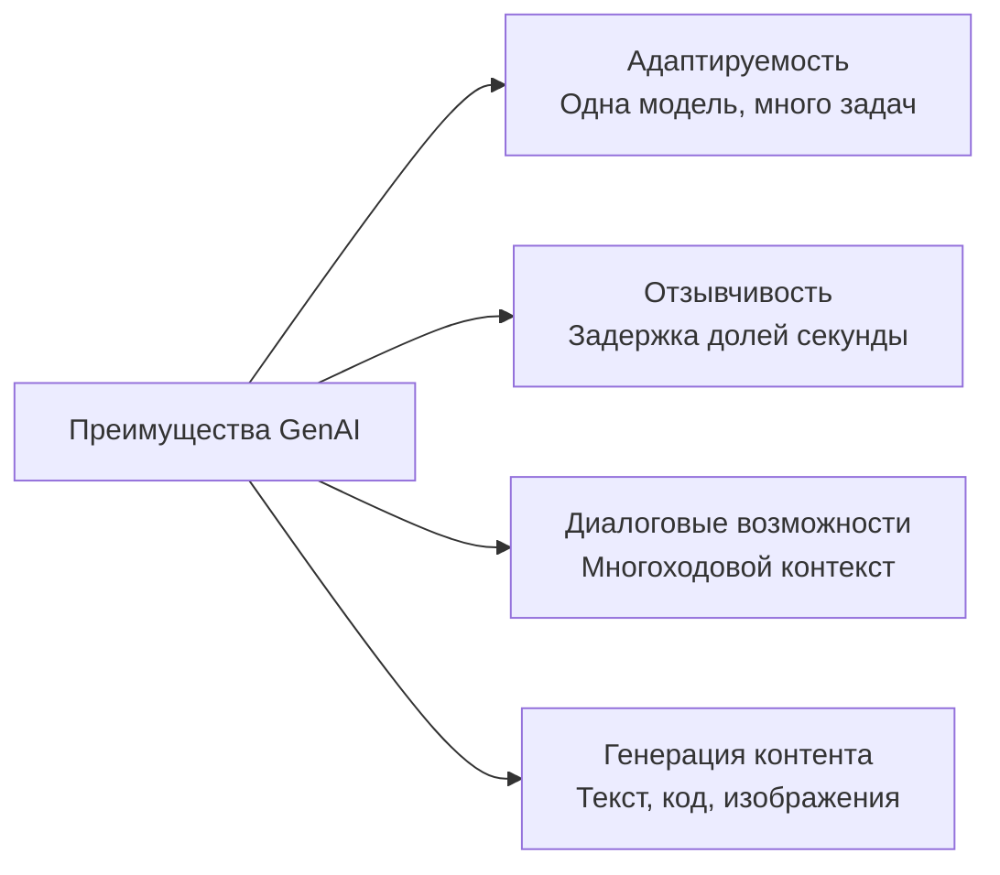
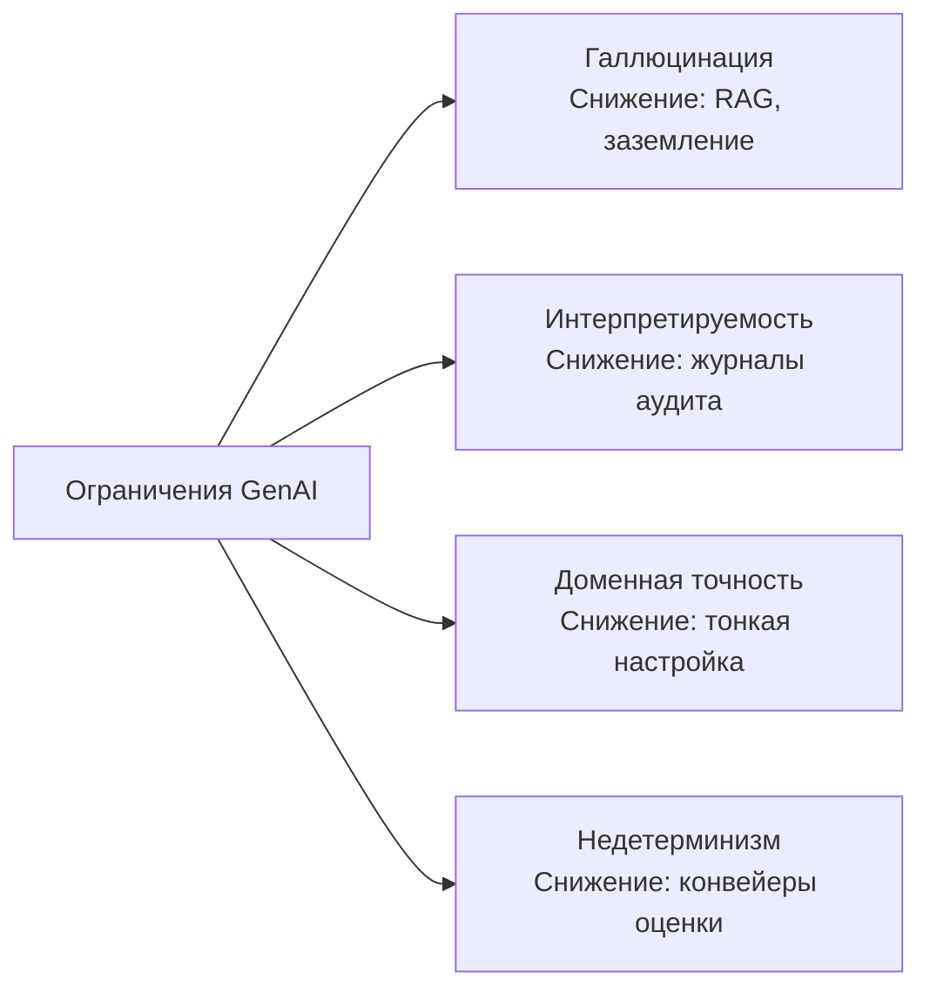
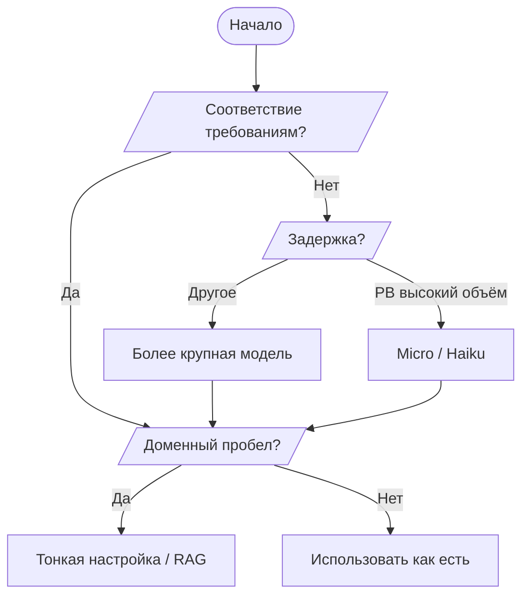
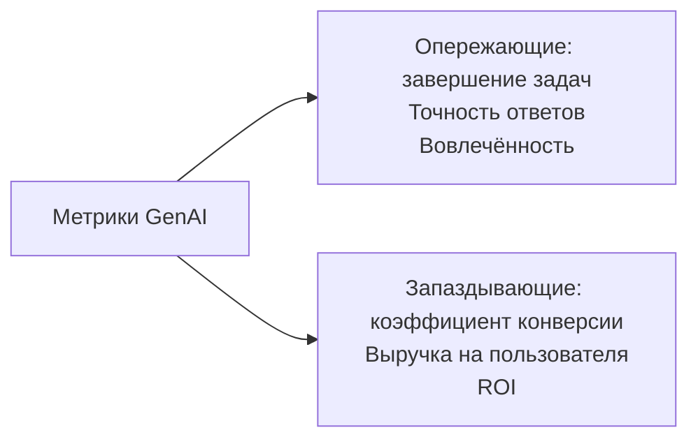

## Тема 2.2. Возможности и ограничения GenAI при решении бизнес-задач

Генеративный ИИ может создавать контент, вести продолжительные диалоги и адаптироваться к задачам, которые классические системы машинного обучения не могут выполнить без полного переобучения. Вместе с тем он галлюцинирует уверенным тоном, меняет ответ между запусками и порой выдаёт убедительную бессмыслицу в специализированных разделах, слабо представленных в его обучающих данных. Бизнес-профессионалы, способные чётко сформулировать обе стороны этого уравнения, принимают взвешенные решения о том, когда браться за проект на основе генеративного ИИ, когда добавлять защитные меры и когда вообще использовать другой инструмент. Эта тема охватывает преимущества, ограничения, критерии выбора модели и метрики, необходимые для оценки бизнес-ценности генеративного приложения.[^202001]

### 2.2.1 Преимущества GenAI

Классические модели машинного обучения созданы для одной задачи: модель обнаружения мошенничества обнаруживает мошенничество, модель прогнозирования спроса прогнозирует спрос. Переобучение каждой модели для новой задачи занимает месяцы разметки, обучения и валидации. Генеративный ИИ снимает это ограничение. Одна большая языковая модель может утром писать маркетинговые тексты, а днём резюмировать юридические документы — без переобучения, просто получая другой запрос. Этот сдвиг имеет практические последствия для того, как организации комплектуют ИИ-проекты и как быстро они могут реагировать на новые бизнес-требования.

Экзамен выделяет четыре ключевых преимущества генеративного ИИ: адаптируемость, отзывчивость, диалоговые возможности и способность генерировать контент. Каждое из них устраняет конкретное ограничение более ранних ИИ-систем и переводится в конкретную бизнес-выгоду.

*Рисунок 2.2.1: Четыре ключевых преимущества генеративного ИИ. Каждое преимущество соответствует ограничению классического машинного обучения, которое генеративные модели преодолевают.*

**Адаптируемость** — способность одной базовой модели выполнять широкий спектр задач без переобучения. Модель, обученная на обширном корпусе текстов, может составлять письма, классифицировать тональность, извлекать именованные сущности, генерировать SQL-запросы и создавать описания продуктов — всё это только через изменения запроса. Например, ритейлер может использовать одну модель **Amazon Bedrock** для генерации описаний новых SKU утром, их перевода на французский и испанский днём и суммаризации отзывов клиентов вечером.[^202002] Операционная экономия реальна: вместо поддержки отдельной специализированной модели для каждой задачи единый API-эндпоинт обрабатывает все, а навыки, которые инженеры запросов развивают для одного сценария, непосредственно применимы к другим.

**Отзывчивость** означает низкую задержку диалогового взаимодействия, которое обеспечивают генеративные модели. Классические пакетные конвейеры МО оптимизированы для пропускной способности, а не скорости; они обрабатывают тысячи записей, но на один запуск могут уходить минуты. Генеративные API, напротив, возвращают токены потоком в течение сотен миллисекунд — достаточно быстро для интерактивных пользовательских сценариев.[^202003] Приложение обслуживания клиентов, которое раньше требовало от человека-агента поиска информации, теперь может ответить на вопрос менее чем за секунду. Например, страховая компания, развёртывающая чат-бот для запросов по полисам на базе Amazon Bedrock, возвращает полный ответ на вопрос о покрытии примерно за то время, которое требуется человеку, чтобы напечатать ответ, — без участия человека.

**Диалоговые возможности** представляют собой способность генеративных моделей сохранять контекст в течение нескольких ходов диалога. В отличие от чат-бота на основе правил, который забывает предыдущее сообщение после каждого ответа, современная большая языковая модель хранит полную историю диалога в своём *контекстном окне* и может естественно к ней обращаться.[^202004] Пользователь может спросить «Какова политика возврата?», а затем «Что если я купил товар на распродаже?», и модель понимает, что «товар» относится к продукту, упомянутому ранее. Эта многоходовая связность обеспечивает агентов поддержки, торговых помощников и инструменты внутренних знаний, которые ощущаются естественными. Например, банк может развернуть многоходового ассистента по кредитным запросам, который последовательно собирает тип занятости, цель кредита и диапазон доходов заявителя через несколько диалоговых ходов перед предъявлением подходящих продуктов — паттерн взаимодействия, требующий сложного управления состоянием в традиционном механизме на основе правил.

**Способность генерировать контент** означает, что генеративные модели производят новый вывод, а не просто классифицируют или извлекают уже существующий контент. Они могут написать черновик записи в блог, сгенерировать Python-функцию из описания, синтезировать фотореалистичное изображение продукта или составить письмо клиенту, адаптированное к конкретному ID заказа и тональности.[^202005] Это генеративное свойство отличает базовые модели от систем поиска. Поисковая система извлекает уже существующие документы; генеративная модель создаёт новый. Например, фармацевтическая компания может генерировать первый черновик отчёта-резюме клинического испытания из структурированных данных испытания, позволяя медицинским редакторам сосредоточиться на проверке и доработке, а не на первоначальном составлении.

### 2.2.2 Недостатки решений GenAI

Каждое преимущество генеративного ИИ сопровождается ограничением, которое необходимо понять прежде, чем развёртывать систему для реальных пользователей. Экзамен специально называет четыре недостатка: галлюцинации, проблемы интерпретируемости, неточность в специализированных разделах и недетерминизм. Ни один из них — не повод отказываться от генеративного ИИ, но каждый требует встраивания мер по снижению рисков в любое производственное приложение.

*Рисунок 2.2.2: Четыре ключевых ограничения генеративного ИИ и подход к снижению каждого из них. Осознание ограничения ведёт непосредственно к выбору подходящего контроля.*

**Галлюцинации** — явление, при котором генеративная модель выдаёт грамматически правильный, плавный вывод, который фактически неверен, выдуман или не основан ни на каком исходном документе.[^202006] Модель не знает, что чего-то не знает; она генерирует наиболее статистически вероятное продолжение запроса, которое может включать выдуманные имена, ложную статистику или несуществующие цитаты. Например, инструмент юридических исследований, использующий необработанную генеративную модель, может привести ссылку на несуществующее дело, изложенную с такой же уверенной интонацией, как реальная ссылка. Основная мера снижения — *Retrieval Augmented Generation* (RAG) — паттерн, при котором модели требуется отвечать на основе извлечённых документов, а не параметрической памяти.[^202007] Amazon Bedrock Knowledge Bases реализует этот паттерн, извлекая релевантные чанки из подключённого хранилища данных перед генерацией ответа, заземляя вывод в документах, которые можно верифицировать. Дополнительные меры контроля включают **Amazon Bedrock Guardrails** с проверкой контекстного заземления, которая может обнаруживать и блокировать ответы, не подкреплённые исходными документами.[^202008]

**Проблемы интерпретируемости** возникают из-за непрозрачности больших языковых моделей. Нет простого способа отследить, какие обучающие примеры вызвали конкретный вывод, или объяснить человеческим языком, почему модель выбрала одно слово, а не другое.[^202009] Эта непрозрачность создаёт проблемы в регулируемых отраслях. Система принятия кредитных решений банка должна предоставлять причину неблагоприятного действия при отказе в кредите; модель-чёрный ящик не может предоставить это объяснение в структурированной форме, требуемой регуляторами. Мера снижения — оставлять генеративный ИИ для задач, где интерпретируемость не обязательна нормативно, или добавление уровня рассуждений, вынуждающего модель цитировать источники. **Amazon SageMaker AI** и более широкий инструментарий интерпретируемости в AWS могут выявлять веса внимания и атрибуции на уровне токенов, однако они остаются несовершенными приближениями, а не истинными причинно-следственными объяснениями.[^202010]

**Неточность в специализированных разделах без заземления** — ограничение, отличное от галлюцинации. Модель может правильно воспроизводить общие факты о кардиологии, но ошибаться в вопросах о конкретных клинических протоколах больницы, правилах страхового кодирования или фирменных лекарственных взаимодействиях, поскольку эти документы никогда не входили в её обучающий корпус.[^202011] Мера снижения — либо тонкая настройка (корректировка весов модели на доменно-специфичных данных), либо RAG с курированной доменной базой знаний. Тонкая настройка через API кастомизации Amazon Bedrock может устранить пробелы точности для узко определённых задач, тогда как хорошо структурированная база знаний справляется с более широким информационным поиском без затрат и времени на переобучение.[^202012]

**Недетерминизм** означает, что модель может выдавать разный ответ при каждом получении одного и того же запроса, даже при всех остальных одинаковых условиях. Это свойство возникает из процесса выборки внутри большинства генеративных моделей: модель выбирает следующий токен вероятностно, а не детерминированно, поэтому два запуска могут разойтись уже после нескольких токенов.[^202013] Например, модель, которую просят дважды суммаризировать одну и ту же жалобу клиента, может дать один ответ с акцентом на задержку доставки и второй — на качество продукта: оба верны, но не идентичны. Параметр *температуры* контролирует степень случайности, которую модель применяет при выборке; более низкая температура даёт более последовательный, но менее творческий вывод. Мерой снижения недетерминизма являются строгие конвейеры оценки, сравнивающие выводы по многим образцам, и проверка пограничных случаев человеком перед развёртыванием. Возможности оценки моделей Amazon Bedrock поддерживают автоматическую оценку по наборам тестовых запросов для обнаружения неожиданной вариабельности.[^202014]

*Таблица 2.2.1: Недостатки GenAI, первопричина, бизнес-риск и основная мера снижения*

| Недостаток | Первопричина | Бизнес-риск | Основная мера снижения |
|---|---|---|---|
| Галлюцинации | Параметрическая генерация без заземления | Ложная информация, представленная как факт | RAG, Amazon Bedrock Guardrails |
| Интерпретируемость | Непрозрачные веса нейронной сети | Несоответствие нормативным требованиям | Ограничить нерегулируемыми задачами; журналирование аудита |
| Доменная неточность | Отсутствие доменных данных в обучающем корпусе | Неверные ответы в специализированных рабочих процессах | Тонкая настройка, доменные базы знаний |
| Недетерминизм | Вероятностная выборка токенов | Непоследовательный вывод для задач соответствия | Конвейеры оценки, настройка температуры |

### 2.2.3 Факторы при выборе моделей GenAI

Выбор модели генеративного ИИ для бизнес-приложения — это не в первую очередь техническое решение; это решение о компромиссах. Разные модели по-разному работают на разных задачах, имеют разные структуры затрат, поддерживают разные размеры контекстных окон и имеют разные позиции по вопросам соответствия. Экзамен ожидает от вас рассуждений по восьми факторам: типы моделей, требования к производительности, возможности, ограничения, соответствие нормативным требованиям, стоимость, задержка и сложность модели. Обновление v1.1 явно добавило стоимость, задержку и сложность модели в перечень задач, что отражает практическую реальность: большинство производственных решений определяется в той же мере экономикой и скоростью, что и точностью на контрольных задачах.

**Amazon Bedrock** — основной AWS-сервис для доступа к сторонним и нативным Amazon базовым моделям через унифицированный API без управления инфраструктурой.[^202015] Доступные через Bedrock модели охватывают широкий спектр размеров, возможностей и стоимостей, что делает его естественным ориентиром для любого обсуждения выбора модели.

*Таблица 2.2.2: Примеры моделей Amazon Bedrock по уровням возможностей и критериям выбора*

| Семейство моделей | Репрезентативные модели | Сильные стороны | Типичная задержка | Относительная стоимость | Лучше всего для |
|---|---|---|---|---|---|
| Amazon Nova | Nova Micro, Nova Lite, Nova Pro, Nova Premier | Высокая производительность на задачах AWS; мультиязычность; мультимодальность (Pro/Premier) | Micro: очень низкая; Premier: умеренная | Micro: минимальная; Premier: умеренная | Высокобъёмные дешёвые задачи (Micro); мультимодальные корпоративные приложения (Premier) |
| Anthropic Claude | Claude Haiku 4.x, Sonnet 4.x, Opus 4.x | Большое контекстное окно (200K стандарт, 1M с бета-заголовком для Opus и Sonnet); рассуждение; следование инструкциям | Haiku: низкая; Opus: высокая | Haiku: низкая; Opus: высокая | Поддержка клиентов (Haiku); сложный анализ (Opus) |
| Meta Llama | Llama 4 Scout, Llama 4 Maverick | Открытые веса; настраиваемость; расширенные контекстные окна (зависит от конфигурации в Bedrock; см. карточки моделей) | Умеренная | От низкой до умеренной | Пользовательская тонкая настройка; анализ длинных документов; инференс с ограниченным бюджетом |
| Mistral AI | Mistral 7B, Mixtral 8x7B | Эффективная mixture-of-experts; кодовые задачи | От низкой до умеренной | Низкая | Генерация кода; инструменты для разработчиков |

Восемь факторов из задачи экзамена взаимодействуют с этим ландшафтом моделей следующим образом:

**Типы моделей** относятся к архитектуре и модальности модели. Модели только для текста обрабатывают языковые задачи; мультимодальные модели обрабатывают комбинации текста, изображений, видео и аудио.[^202016] Приложение обслуживания клиентов, обрабатывающее только текст, может использовать более лёгкую, дешёвую текстовую модель. Приложение проверки продуктов, классифицирующее изображения наряду с текстовыми описаниями, требует мультимодальной модели, такой как Amazon Nova Pro.

**Требования к производительности** охватывают контрольные показатели точности и качества, которые требует сценарий использования. Генератор маркетинговых текстов может допускать некоторую вариабельность качества. Ассистент по медицинскому кодированию, напротив, должен поддерживать высокую точность, поскольку ошибки кодирования приводят к отказу в выплатах. Оценочные баллы, такие как MMLU (Massive Multitask Language Understanding) и HumanEval, дают отправную точку, но наиболее надёжный сигнал производительности — оценка на собственном наборе задач.[^202017]

**Возможности** относятся к специфическим функциям, которые должна иметь модель: использование инструментов (вызов функций), генерация кода, структурированный вывод (JSON-режим) или расширенные контекстные окна. Например, приложению, которое должно вызывать внешние API в процессе рассуждения, требуется модель с поддержкой вызова функций, которую реализуют не все модели.[^202018]

**Ограничения** охватывают организационные рамки, включая требования к резидентности данных, утверждённые списки поставщиков и ограничения по размеру модели для развёртывания на устройстве. Параметры кросс-регионального инференса и выделенной пропускной способности Amazon Bedrock позволяют архитекторам работать в рамках ограничений резидентности данных, поддерживая доступность.[^202019]

**Соответствие нормативным требованиям** охватывает регуляторные и отраслевые требования. Медицинские приложения, регулируемые HIPAA, должны использовать модели, развёрнутые в рамках HIPAA-соответствующей границы обслуживания. На финансовые приложения могут распространяться ограничения на передачу данных, исключающие определённых внешних поставщиков моделей. Сервисы AWS с поддержкой Business Associate Agreement сужают список доступных моделей для медицинских сценариев.[^202020]

**Стоимость** всё больше становится решающим фактором в зрелых развёртываниях. Ценообразование на основе токенов означает, что стоимость за инференс растёт с длиной контекста: длинные системные запросы, примеры few-shot и большие извлечённые чанки — всё это увеличивает количество токенов и, следовательно, счёт.[^202021] Amazon Nova Micro предназначена для высокообъёмных, недорогих текстовых задач, где доступность — главное ограничение. При миллионе API-вызовов в день разница между уровнем Micro и уровнем Premier может составлять десятки тысяч долларов в месяц.

**Задержка** определяет, подходит ли модель для приложений реального времени, требующих интерактивного взаимодействия. Модель, которой требуются две секунды для ответа, приемлема для пакетного конвейера обработки документов, но неприемлема для виджета живого чата с клиентами, где пользователи ожидают ответа в течение нескольких сотен миллисекунд.[^202022] Amazon Nova Micro нацелена на уровень с наименьшей задержкой в семействе Amazon Nova. Выделенная пропускная способность в Amazon Bedrock может снизить разброс задержек для критичных к задержке производственных нагрузок.

**Сложность модели** относится к числу параметров, глубине архитектуры и размеру контекстного окна. Более сложные модели, как правило, лучше работают на нюансированных задачах, но медленнее и дороже на токен.[^202023] Модель с 7 миллиардами параметров может адекватно справляться с простой суммаризацией, тогда как для многошагового рассуждения с 100 000-токенным юридическим документом может потребоваться модель с 200 миллиардами параметров. Соответствие сложности реальной сложности задачи позволяет управлять затратами без ущерба для качества.

*Рисунок 2.2.3: Схема принятия решений для выбора модели GenAI. Соответствие требованиям, задержка, объём и пробелы доменной точности последовательно фильтруют доступный набор моделей; та же схема применима вне зависимости от того, является ли базовая модель Amazon Nova, Anthropic Claude, Meta Llama или Mistral.*

### 2.2.4 Бизнес-ценность и метрики приложений GenAI

Внедрение генеративного ИИ — это бизнес-инвестиция, и каждая инвестиция должна оцениваться по измеримым результатам. Цель экзамена называет семь метрик: кросс-доменная производительность, ROI, эффективность, коэффициент конверсии, средняя выручка на пользователя, точность и пожизненная ценность клиента. Эти метрики естественно делятся на две группы. *Опережающие индикаторы* наблюдаемы в начале развёртывания, часто в течение нескольких недель: степень завершения задачи, объём вовлечённости, точность ответов на тестовых наборах. *Запаздывающие индикаторы* требуют больше времени, поскольку зависят от последующего поведения клиентов: выручка на пользователя, пожизненная ценность клиента, уровень оттока. Зрелая программа измерения ИИ отслеживает оба типа, используя опережающие индикаторы для настройки системы, прежде чем запаздывающие подтвердят бизнес-воздействие.

*Рисунок 2.2.4: Опережающие и запаздывающие индикаторы бизнес-ценности GenAI. Опережающие сигнализируют о состоянии системы; запаздывающие подтверждают, что состояние системы переводится в финансовые результаты.*

**Кросс-доменная производительность** измеряет, насколько хорошо генеративная модель поддерживает качество при применении в нескольких бизнес-функциях.[^202024] Модель, отлично работающая в поддержке клиентов, но плохо справляющаяся с внутренними HR-запросами, может требовать отдельных стратегий запросов или отдельных тонко настроенных вариантов для каждого раздела. Например, логистическая компания, тестирующая одну базовую модель по отслеживанию грузов, помощи в переговорах с перевозчиками и таможенной документации, обнаруживает, что оценки кросс-доменной точности показывают, какие разделы требуют дополнительного заземления перед полным развёртыванием.

**ROI** (возврат на инвестиции) количественно определяет финансовый возврат на затраты по созданию и эксплуатации приложения генеративного ИИ относительно создаваемой ценности.[^202025] Расчёт сравнивает операционную экономию (меньше человеческих агентов, более быстрая обработка документов, сниженные затраты на исправление ошибок) и прирост выручки (более высокая конверсия, новые возможности продуктов) с затратами на инференс модели, трудом разработки и текущими расходами на оценку. Ассистент контакт-центра, отклоняющий 40% запросов первого уровня в автоматизацию, производит измеримый ROI по мере масштабирования коэффициента отклонения, поскольку каждый отклонённый звонок устраняет единицу трудовых затрат. ROI был явно добавлен в цель экзамена в v1.1, отражая, что бизнес-стейкхолдеры теперь ожидают оценки ИИ-проектов с той же финансовой строгостью, которую они применяют к любым другим технологическим инвестициям.

**Эффективность** показывает, насколько быстрее или дешевле выполняется процесс с генеративным ИИ по сравнению с базовым показателем.[^202026] Метрики эффективности включают время на задачу (сколько времени аналитику требуется на исследовательский брифинг с ИИ-помощью по сравнению с работой без помощи), пропускную способность (сколько тикетов поддержки обрабатывает система в час) и стоимость единицы (токенные затраты на генерацию одного описания продукта по сравнению с трудовыми затратами копирайтера на создание того же элемента). Например, юридическая фирма, использующая генеративный ИИ для создания черновиков резюме контрактов, сокращает среднее время, затрачиваемое адвокатом на каждый контракт, с 45 минут до 8 минут — задокументированное соотношение эффективности, оправдывающее стоимость платформы.

**Коэффициент конверсии** измеряет процент потенциальных клиентов или пользователей, совершающих желаемое действие, например завершение покупки, подачу заявки на кредит или запись на услугу.[^202027] Генеративный ИИ влияет на конверсию, персонализируя контент, который пользователи видят в ключевых точках принятия решений. Система рекомендаций, генерирующая персонализированный рекламный текст для каждого посетителя, а не показывающая всем одинаковый баннер, может измеримо повысить коэффициент конверсии. Например, платформа электронной коммерции, использующая модель Amazon Bedrock для генерации динамических описаний продуктов, адаптированных к истории просмотров посетителя, сообщает о более высоком коэффициенте добавления в корзину по сравнению с контрольной группой, получающей статические описания.

**Средняя выручка на пользователя (ARPU)** — общая выручка, делённая на число активных пользователей за период.[^202028] Генеративный ИИ может увеличить ARPU, выявляя возможности допродаж в рамках диалога (чат-бот, обнаруживающий, что пользователь спрашивает о продукте базового уровня, и естественным образом упоминающий опцию премиум-уровня), снижая отказы от обслуживания или генерируя персонализированные предложения, соответствующие индивидуальным покупательским паттернам. Например, стриминговый сервис, использующий генеративный ИИ для персонализации рекомендаций контента и составления email-кампаний для конкретных подписчиков, сообщает о более высоком ARPU в тестовой группе по сравнению с контрольной, получающей типовые сообщения.

**Точность** в бизнес-контексте означает долю выводов генеративного ИИ, которые достаточно точны и полны для использования без исправлений человека.[^202029] Точность измеряется на размеченном оценочном наборе, специфичном для задачи. Модель, правильно отвечающая на 95 из 100 тестовых вопросов, имеет 95% точности на этом тестовом наборе. Точность — наиболее прямая метрика качества для сценариев использования, где ошибки несут затраты, например медицинское кодирование, отчётность о финансовом соответствии или автоматизированное извлечение юридических пунктов. Возможности оценки моделей Amazon Bedrock позволяют командам запускать автоматизированные оценки точности на наборах задачно-специфичных контрольных примеров до и после изменений модели или запроса.[^202030]

**Пожизненная ценность клиента (CLV)** — общая чистая выручка, которую бизнес ожидает от клиентских отношений на протяжении их продолжительности.[^202031] Генеративный ИИ влияет на CLV, улучшая удержание (клиенты, получающие лучшую поддержку, остаются дольше), расширяя спектр используемых клиентом услуг (персонализированный ассистент выявляет продукты, о которых клиент не знал) и снижая отток через проактивное взаимодействие. CLV — запаздывающий индикатор; как правило, для его наблюдения требуются кварталы. Например, финансовое учреждение, развёртывающее чат-бота-консультанта на основе генеративного ИИ, получает первичные метрики точности и вовлечённости в течение нескольких недель, но улучшение CLV становится заметным только через 6–12 месяцев, когда когорта клиентов, обслуживаемых ИИ, демонстрирует более низкий отток по сравнению с историческим базовым показателем.

*Таблица 2.2.3: Бизнес-метрики GenAI: тип, метод измерения и бизнес-пример*

| Метрика | Тип индикатора | Как измеряется | Бизнес-пример |
|---|---|---|---|
| Кросс-доменная производительность | Опережающий | Оценка точности по домену на отложенных тестовых наборах | Модель логистики проверяется в трёх функциональных областях перед внедрением |
| ROI | Запаздывающий | (Экономия + прирост выручки) / общие инвестиции | Коэффициент отклонения контакт-центра, умноженный на средние трудовые затраты на тикет |
| Эффективность | Опережающий | Время на задачу или стоимость единицы до и после внедрения ИИ | Время суммаризации контракта сокращено с 45 до 8 минут |
| Коэффициент конверсии | Запаздывающий | Завершённые действия / всего возможностей | Коэффициент добавления в корзину выше для ИИ-сгенерированных по сравнению со статическими описаниями |
| Средняя выручка на пользователя | Запаздывающий | Общая выручка / активных пользователей за период | Рост ARPU стримингового сервиса от персонализированных кампаний |
| Точность | Опережающий | Правильных выводов / всего на оценочном наборе | 95% точности на 100-вопросном кодовом контрольном примере |
| Пожизненная ценность клиента | Запаздывающий | Прогнозируемая чистая выручка на протяжении отношений | Более низкий отток в ИИ-обслуживаемой когорте через 12 месяцев |

Практическая программа измерений не ждёт запаздывающих индикаторов перед принятием мер. Последовательность такова: развернуть с настроенными опережающими индикаторами с первого дня, настраивать модель и запросы, пока опережающие индикаторы не достигнут цели, затем ждать, пока запаздывающие индикаторы подтвердят, что операционное улучшение переводится в финансовую ценность. Метрики **Amazon CloudWatch** и пользовательские дашборды AWS могут отслеживать задержку инференса, частоту ошибок и количество вызовов модели как операционные опережающие индикаторы, тогда как инструменты бизнес-аналитики отслеживают нижестоящие метрики выручки и удержания.[^202032]

---

## Вопросы для самопроверки

**Вопрос 1**

Ритейлер развёртывает генератор описаний продуктов на основе генеративного ИИ. В ходе проверки качества команда замечает, что модель иногда придумывает питательные характеристики пищевых продуктов, которых нет в исходных данных. Какой недостаток генеративного ИИ ЛУЧШЕ всего описывает это поведение и какую меру снижения следует применить в ПЕРВУЮ очередь?

A. Недетерминизм; снизить температуру модели для уменьшения вариабельности вывода.
B. Галлюцинация; реализовать Retrieval Augmented Generation для заземления ответов в каталоге продуктов.
C. Интерпретируемость; добавить журналирование аудита, чтобы проверяющие могли отследить, какие обучающие данные повлияли на ответ.
D. Доменная неточность; провести тонкую настройку модели на курированном датасете пищевых продуктов.

Галлюцинация — это явление, при котором генеративная модель производит плавный, уверенный вывод, не основанный на реальных исходных материалах. Процесс статистического предсказания следующего токена может производить правдоподобно звучащие питательные факты, которых нет нигде в каталоге продуктов. Это отличается от доменной неточности (которая касается отсутствия специализированных знаний в обучающем корпусе), потому что модель не просто не информирована — она активно придумывает контент. Снижение температуры (ответ A) снижает вариабельность стиля вывода, но не предотвращает выдумывание фактов. Инструменты интерпретируемости (ответ C) помогают отслеживать выводы, но не останавливают галлюцинации. Тонкая настройка (ответ D) корректирует веса модели и может помочь с доменной неточностью, но для проблемы фактического заземления, специфичной для каталога, RAG быстрее внедрить и точнее направить: модель ограничена генерацией ответов из извлечённых записей продуктов, а не из параметрической памяти. Amazon Bedrock Knowledge Bases предоставляет управляемую реализацию RAG, подключающую модель к доступному для поиска каталогу продуктов, гарантируя, что каждый атрибут в сгенерированном описании можно отследить до исходного документа.[^202033]

**Вопрос 2**

Компания выбирает между Amazon Nova Micro и Amazon Nova Premier для высокообъёмного чат-бота поддержки клиентов, который должен отвечать в течение 500 миллисекунд и обрабатывать около двух миллионов взаимодействий в день. Какой фактор НАИБОЛЕЕ непосредственно обосновывает рекомендацию использовать Nova Micro вместо Nova Premier для этой нагрузки?

A. Требования соответствия ограничивают использование более крупных моделей в клиентских приложениях.
B. Nova Premier имеет меньшее контекстное окно и не может хранить историю многоходового диалога.
C. Задержка и стоимость делают Nova Micro подходящим выбором для высокообъёмных, критичных к задержке и экономически чувствительных нагрузок.
D. Nova Micro поддерживает мультимодальный ввод, что делает её более подходящей для чат-приложений.

Вопрос описывает нагрузку с двумя выдающимися ограничениями: потолок задержки 500 миллисекунд и объём двух миллионов ежедневных взаимодействий. Оба указывают в одном направлении. Nova Micro позиционируется как уровень с наименьшей задержкой и наименьшей стоимостью в семействе Amazon Nova, разработанный именно для высокообъёмных задач, где доступность и скорость являются основными требованиями. Nova Premier — наиболее способный, но также наиболее дорогой и высокозадержечный вариант в семействе, подходящий для сложных задач многошагового рассуждения, а не для высокообъёмной диалоговой поддержки. Ответ A вводит обоснование соответствия требованиям, не указанное в сценарии. Ответ B фактически неверен по обоим пунктам: Nova Premier имеет большее контекстное окно, чем Nova Micro, и любая модель Bedrock может хранить историю многоходового диалога в пределах лимита своего контекстного окна, так что диалоговые возможности не ограничены уровнем. Ответ D неверен, поскольку мультимодальный ввод — это возможность Nova Pro и Nova Premier, а не Nova Micro. Правильный ответ — C: требование к задержке (менее 500 мс) и объём (два миллиона вызовов в день) делают стоимость и задержку доминирующими факторами выбора модели, а Nova Micro — уровень, предназначенный именно для такого сочетания.[^202034]

**Вопрос 3**

ИИ-команда предприятия представляет бизнес-кейс для решения по обработке документов на основе генеративного ИИ. Финансовый директор спрашивает, как команда продемонстрирует финансовую ценность в течение первых 90 дней развёртывания. Какая метрика НАИБОЛЕЕ подходит для демонстрации раннего финансового воздействия?

A. Пожизненная ценность клиента, измеренная как изменение прогнозируемой CLV для когорты пользователей.
B. Эффективность, измеренная как время на документ и стоимость на документ по сравнению с ручным базовым показателем.
C. Коэффициент конверсии, измеренный как процент документов, инициирующих последующую продажу.
D. Средняя выручка на пользователя, измеренная в первый расчётный период после развёртывания.

Пожизненная ценность клиента и средняя выручка на пользователя — запаздывающие индикаторы, которым, как правило, требуются месяцы или кварталы наблюдения, прежде чем станет заметным статистически значимое изменение. В течение первых 90 дней ни одна из этих метрик не накопит достаточно данных для защищаемого вывода. Коэффициент конверсии — правдоподобная метрика для ориентированного на продажи приложения, но обработка документов — это внутренний операционный рабочий процесс, а не клиентская воронка продаж, что делает коэффициент конверсии неудачным выбором. Эффективность — естественная 90-дневная метрика для проекта операционной автоматизации: команда может измерить, сколько времени аналитикам требовалось на обработку документа до внедрения ИИ-системы, измерить ту же задачу с помощью ИИ и немедленно после запуска рассчитать экономию времени и снижение трудовых затрат. Финансовый директор получает конкретное число (например, «среднее время обработки документа упало с 42 до 9 минут, экономя примерно 330 аналитических часов в неделю при текущем объёме документов»), которое непосредственно переводится в деньги без необходимости в лонгитюдных данных о клиентах.[^202035]

**Вопрос 4**

Компания медицинских технологий оценивает модели генеративного ИИ для ассистента клинической документации. Решение должно работать в рамках HIPAA-соответствующей границы обслуживания и цитировать исходное предложение из записи пациента для каждого утверждения в сгенерированном резюме. Какие ДВА фактора выбора модели НАИБОЛЕЕ релевантны для этой оценки?

A. Сложность модели и коэффициент конверсии.
B. Соответствие нормативным требованиям и возможности.
C. Задержка и средняя выручка на пользователя.
D. Стоимость и кросс-доменная производительность.

Сценарий представляет два различных требования. Первое — нормативное: решение должно работать в рамках HIPAA-соответствующих границ, а это фактор соответствия требованиям, напрямую ограничиваивает набор доступных моделей и конфигураций развёртывания. Не все модели, доступные через Amazon Bedrock, доступны в конфигурации, соответствующей HIPAA, поэтому соответствие требованиям — ограничивающий критерий, который должен быть разрешён прежде любого другого фактора. Второе требование — цитировать предложения-источники, а это требование к возможностям: модель должна поддерживать механизм цитирования или атрибуции источников, либо нативно через структурированный вывод, либо через архитектуру RAG, возвращающую ссылки на источники вместе с генерируемым текстом. Коэффициент конверсии (ответ A) и средняя выручка на пользователя (ответ C) — метрики бизнес-результатов, а не критерии выбора модели. Стоимость и кросс-доменная производительность (ответ D) важны в любом развёртывании, но не являются НАИБОЛЕЕ релевантными факторами с учётом явных требований HIPAA и цитирования, указанных в сценарии. Правильный ответ — B.[^202036]

**Вопрос 5**

Команда продукта развёртывает ИИ-ассистента и замечает, что один и тот же вопрос поддержки иногда получает ответ с акцентом на один путь решения, а иногда — на другой, хотя оба ответа технически верны. Команда хочет понять, какое свойство генеративного ИИ ЛУЧШЕ всего объясняет это поведение, прежде чем принять решение о мере снижения.

A. Галлюцинация, потому что модель генерирует контент, которого нет в базе знаний.
B. Проблемы интерпретируемости, потому что модель не может объяснить, почему выбрала один путь решения, а не другой.
C. Недетерминизм, потому что модель вероятностно выбирает из распределения вероятных следующих токенов на каждом шаге.
D. Доменная неточность, потому что модель не обучалась на конкретных сценариях поддержки.

Сценарий описывает ситуацию, когда оба вывода технически верны, но разные. Это определяющая характеристика недетерминизма: процесс выборки модели вносит вариабельность между запусками, даже когда оба вывода правомерны. Галлюцинация (ответ A) предполагает генерацию фактически неверного контента; сценарий явно указывает, что оба ответа верны. Интерпретируемость (ответ B) касается невозможности объяснить решения модели, а не вариабельности вывода между запусками. Доменная неточность (ответ D) проявлялась бы как неверные или неполные ответы, а не как два разных верных ответа. Мера снижения недетерминизма в контексте поддержки зависит от бизнес-требования. Если последовательность обязательна (например, в регулируемых финансовых рекомендациях), команда может снизить параметр температуры для уменьшения вариативности выборки и добавить конвейер оценки, отмечающий высоковариабельные запросы для проверки человеком. Журналирование вызовов модели Amazon Bedrock фиксирует каждый запрос и ответ, что позволяет команде аудировать вариабельность по запускам и определять, какие типы вопросов производят наиболее расходящиеся выводы.[^202037]

---

[^202001]: AWS Certification Exam Guide AIF-C01 v1.1, Task Statement 2.2. URL: <https://docs.aws.amazon.com/aws-certification/latest/ai-practitioner-01/ai-practitioner-01-domain2.html>
[^202002]: Amazon Bedrock User Guide: Supported foundation models. URL: <https://docs.aws.amazon.com/bedrock/latest/userguide/models-supported.html>
[^202003]: Amazon Bedrock User Guide: Invoke a model to run inference. URL: <https://docs.aws.amazon.com/bedrock/latest/userguide/inference.html>
[^202004]: Amazon Bedrock User Guide: Conversation history and context windows. URL: <https://docs.aws.amazon.com/bedrock/latest/userguide/conversation-inference.html>
[^202005]: Amazon Bedrock User Guide: Content generation with foundation models. URL: <https://docs.aws.amazon.com/bedrock/latest/userguide/what-is-bedrock.html>
[^202006]: NIST AI 600-1: Artificial Intelligence Risk Management Framework: Generative AI. URL: <https://nvlpubs.nist.gov/nistpubs/ai/nist.ai.600-1.pdf>
[^202007]: Amazon Bedrock User Guide: Knowledge Bases for Amazon Bedrock. URL: <https://docs.aws.amazon.com/bedrock/latest/userguide/knowledge-base.html>
[^202008]: Amazon Bedrock User Guide: Amazon Bedrock Guardrails. URL: <https://docs.aws.amazon.com/bedrock/latest/userguide/guardrails.html>
[^202009]: AWS Machine Learning Blog: Explainability in large language models. URL: <https://aws.amazon.com/blogs/machine-learning/>
[^202010]: Amazon SageMaker AI Developer Guide: Amazon SageMaker Clarify. URL: <https://docs.aws.amazon.com/sagemaker/latest/dg/clarify-model-explainability.html>
[^202011]: Amazon Bedrock User Guide: Custom model fine-tuning. URL: <https://docs.aws.amazon.com/bedrock/latest/userguide/custom-models.html>
[^202012]: Amazon Bedrock User Guide: Fine-tuning and continued pre-training. URL: <https://docs.aws.amazon.com/bedrock/latest/userguide/custom-models.html>
[^202013]: Hugging Face Documentation: Text generation and sampling strategies. URL: <https://huggingface.co/docs/transformers/generation_strategies>
[^202014]: Amazon Bedrock User Guide: Model evaluation in Amazon Bedrock. URL: <https://docs.aws.amazon.com/bedrock/latest/userguide/model-evaluation.html>
[^202015]: Amazon Bedrock User Guide: What is Amazon Bedrock? URL: <https://docs.aws.amazon.com/bedrock/latest/userguide/what-is-bedrock.html>
[^202016]: Amazon Nova User Guide: Amazon Nova model capabilities. URL: <https://docs.aws.amazon.com/nova/latest/userguide/what-is-nova.html>
[^202017]: Papers With Code: MMLU Benchmark. URL: <https://paperswithcode.com/dataset/mmlu>
[^202018]: Amazon Bedrock User Guide: Tool use (function calling) with Amazon Bedrock. URL: <https://docs.aws.amazon.com/bedrock/latest/userguide/tool-use.html>
[^202019]: Amazon Bedrock User Guide: Cross-region inference. URL: <https://docs.aws.amazon.com/bedrock/latest/userguide/inference-profiles-cross-region.html>
[^202020]: AWS Compliance: HIPAA Eligible Services. URL: <https://aws.amazon.com/compliance/hipaa-eligible-services-reference/>
[^202021]: Amazon Bedrock Pricing. URL: <https://aws.amazon.com/bedrock/pricing/>
[^202022]: Amazon Bedrock User Guide: Provisioned throughput. URL: <https://docs.aws.amazon.com/bedrock/latest/userguide/prov-throughput.html>
[^202023]: Amazon Nova User Guide: Choosing the right Amazon Nova model. URL: <https://docs.aws.amazon.com/nova/latest/userguide/nova-pro-overview.html>
[^202024]: AWS Well-Architected Framework: Machine Learning Lens: Performance pillar. URL: <https://docs.aws.amazon.com/wellarchitected/latest/machine-learning-lens/performance-pillar.html>
[^202025]: AWS Executive Insights: Measuring ROI for generative AI. URL: <https://aws.amazon.com/executive-insights/content/calculating-roi-of-generative-ai/>
[^202026]: McKinsey Global Institute: The economic potential of generative AI. URL: <https://www.mckinsey.com/capabilities/mckinsey-digital/our-insights/the-economic-potential-of-generative-ai>
[^202027]: Amazon Personalize Developer Guide: Measuring recommendation effectiveness. URL: <https://docs.aws.amazon.com/personalize/latest/dg/getting-started.html>
[^202028]: AWS Retail Competency: AI-driven personalization and ARPU. URL: <https://aws.amazon.com/retail/>
[^202029]: Amazon Bedrock User Guide: Evaluate model accuracy with model evaluations. URL: <https://docs.aws.amazon.com/bedrock/latest/userguide/model-evaluation.html>
[^202030]: Amazon Bedrock User Guide: Automated model evaluation jobs. URL: <https://docs.aws.amazon.com/bedrock/latest/userguide/model-evaluation-jobs.html>
[^202031]: AWS Customer Experience: Improving customer lifetime value with AI. URL: <https://aws.amazon.com/customer-engagement/>
[^202032]: Amazon CloudWatch User Guide: Metrics, alarms, and dashboards. URL: <https://docs.aws.amazon.com/AmazonCloudWatch/latest/monitoring/working_with_metrics.html>
[^202033]: Amazon Bedrock User Guide: Retrieval Augmented Generation with Knowledge Bases. URL: <https://docs.aws.amazon.com/bedrock/latest/userguide/knowledge-base-overview.html>
[^202034]: Amazon Nova User Guide: Amazon Nova Micro model overview. URL: <https://docs.aws.amazon.com/nova/latest/userguide/nova-micro-overview.html>
[^202035]: AWS Well-Architected Framework: Operational Excellence pillar: measuring improvement. URL: <https://docs.aws.amazon.com/wellarchitected/latest/operational-excellence-pillar/welcome.html>
[^202036]: AWS Compliance: HIPAA and Health Information Portability. URL: <https://aws.amazon.com/compliance/hipaa-compliance/>
[^202037]: Amazon Bedrock User Guide: Model invocation logging. URL: <https://docs.aws.amazon.com/bedrock/latest/userguide/model-invocation-logging.html>
