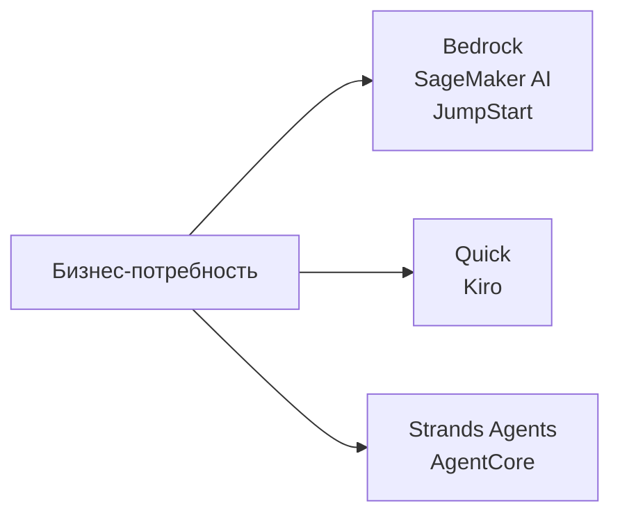
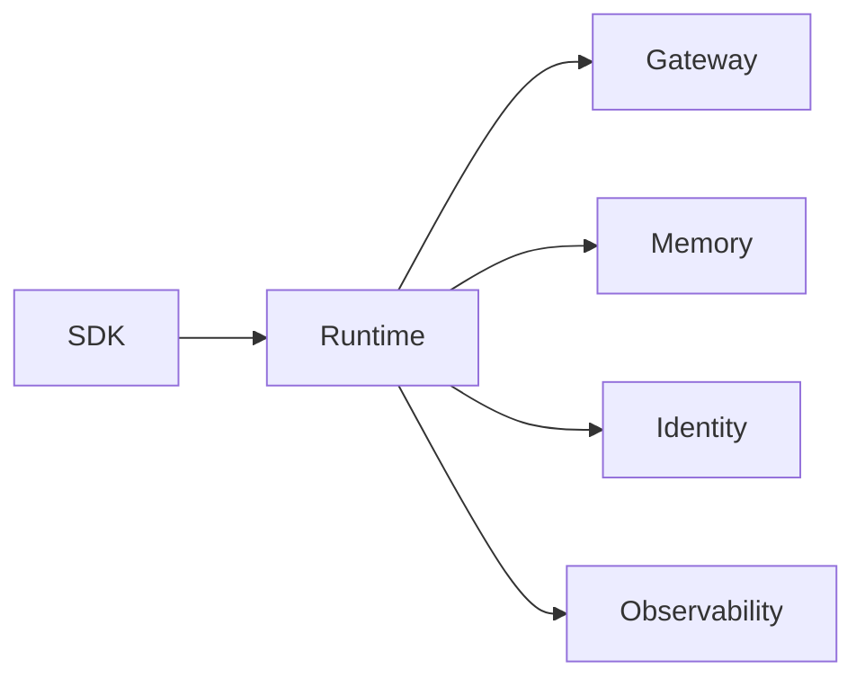
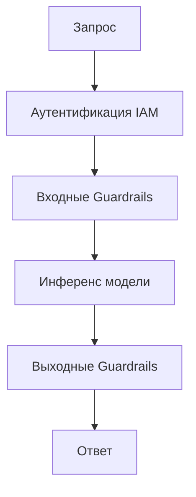
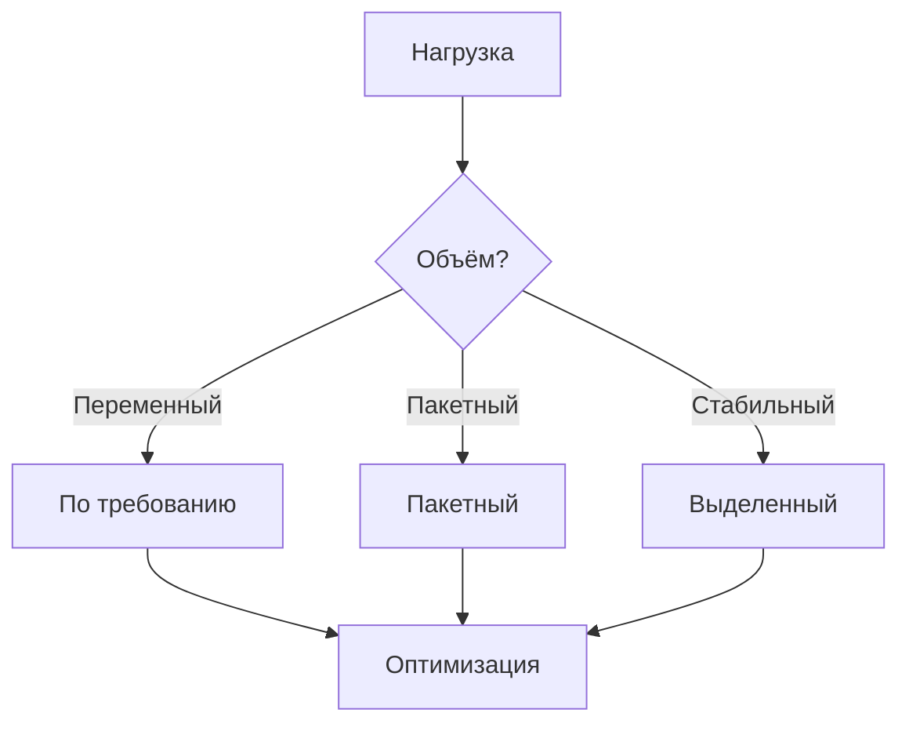
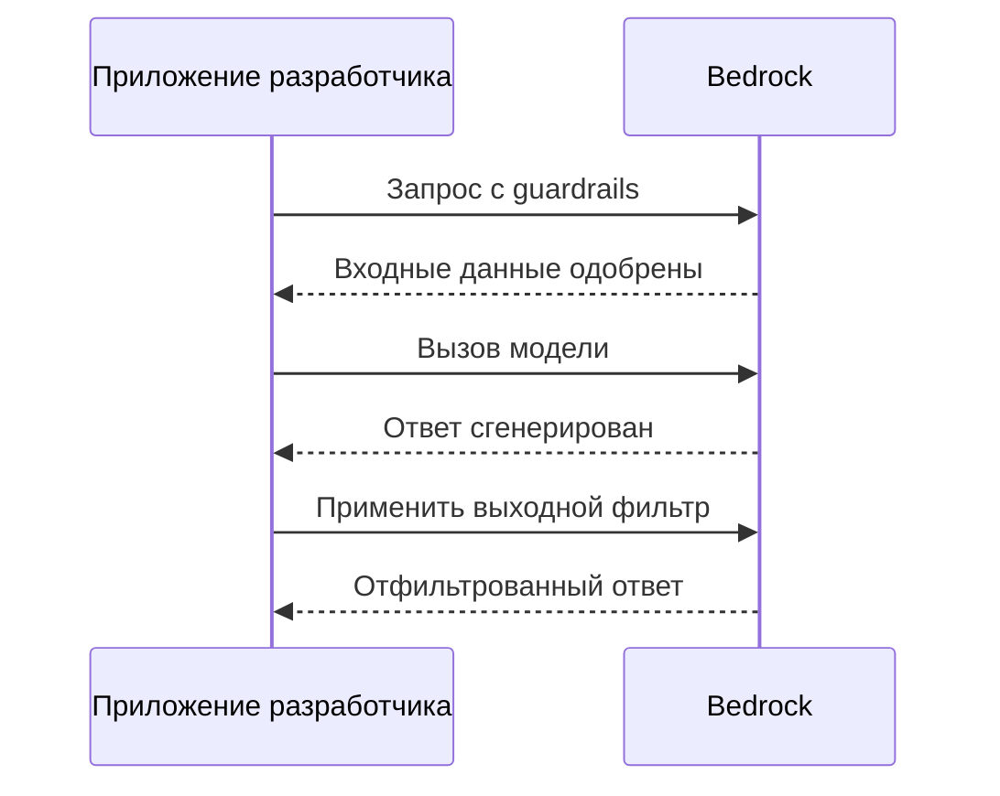

## Формулировка задачи 2.3: Описать инфраструктуру и технологии AWS для создания приложений GenAI

Создание приложения генеративного ИИ на AWS требует выбора среди растущего набора управляемых сервисов и инструментов для разработчиков, каждый из которых нацелен на определённую точку в спектре разработки. Задача 2.3 охватывает четыре цели: сервисы AWS, указанные в руководстве по экзамену v1.1, преимущества их использования, свойства безопасности и соответствия требованиям, которые они наследуют от AWS, и решения о стоимости, с которыми сталкиваются команды в производстве.[^203001]

*Рисунок 2.3.1: Три точки входа для работы с GenAI на AWS. Семейство Bedrock и SageMaker охватывает управляемые API моделей и кастомное обучение, Quick и Kiro — бизнес- и разработческие ассистенты, Strands Agents и AgentCore — агентные фреймворки и среды выполнения.*

Сервисы в этой формулировке задачи не конкурируют друг с другом в одном измерении. Команда может использовать **Amazon Bedrock** как API модели, развернуть приложение через **Amazon Bedrock AgentCore**, автоматизировать разработку внутри **Kiro** и запрашивать бизнес-данные через **Amazon Quick** — всё в рамках одного проекта. Разделы, следующие далее, объясняют каждый сервис, совокупные преимущества использования платформы AWS, базовую инфраструктуру безопасности и соответствия требованиям, и ценовую механику, определяющую совокупную стоимость владения.

### 2.3.1 Сервисы и функции AWS для приложений GenAI

Руководство по экзамену AWS v1.1 называет семь сервисов и семейств инструментов для создания приложений генеративного ИИ: Amazon Bedrock, Amazon SageMaker AI, Amazon SageMaker JumpStart, Amazon Quick, Kiro, Strands Agents и Amazon Bedrock AgentCore.[^203002] Каждый занимает определённую нишу, и понимание того, куда вписывается каждый, предотвращает как излишнее усложнение, так и недоинвестирование в возможности платформы.

**Amazon Bedrock** — полностью управляемый сервис, предоставляющий API-доступ к курируемому каталогу базовых моделей от нескольких поставщиков без необходимости выделять или управлять GPU-инфраструктурой.[^203003] Команда вызывает единый эндпоинт, указывает идентификатор модели и получает сгенерированный ответ, оплачиваемый по токенам. Базовая инфраструктура, веса модели и логика масштабирования полностью скрыты от вызывающей стороны.

Каталог моделей, доступных через Amazon Bedrock, охватывает собственные модели Amazon, сторонние исследовательские лаборатории и варианты с открытыми весами:

- Модели **Amazon Nova** (Nova Micro, Nova Lite, Nova Pro, Nova Premier) — собственная серия Amazon, варьирующаяся от текстового, низкозадержечного уровня до мультимодального флагмана, способного обрабатывать изображения, видео и документы.[^203004]
- **Anthropic Claude** (поколение Claude 4.x: Haiku 4.x, Sonnet 4.x, Opus 4.x) отличается рассуждением, структурированным выводом и анализом с длинным контекстом. Claude Opus и Sonnet поддерживают контекстные окна по умолчанию на 200 000 токенов и один миллион токенов с бета-заголовком 1M-context.[^203005]
- Модели **Meta Llama** — большие языковые модели с открытыми весами для задач генерации текста, кода и диалогов.[^203006]
- Модели **Mistral AI**, включая Mixtral, эффективны в следовании инструкциям и мультиязычных задачах с экономным потреблением токенов.[^203007]
- **AI21 Labs Jamba** нацелена на корпоративную генерацию текста и обработку с длинным контекстом.[^203008]
- Модели **Cohere Command** оптимизированы для извлечения, классификации и корпоративного поиска.[^203009]
- Модели **Stability AI** обрабатывают задачи генерации изображений и мультимедиа.[^203010]

Помимо базового доступа к моделям, Amazon Bedrock включает набор возможностей для создания приложений производственного класса. **Knowledge Bases for Amazon Bedrock** управляет полным конвейером *Retrieval Augmented Generation* (RAG): загрузка документов из Amazon S3 или других источников, их разбивка на чанки, генерация векторных представлений, хранение в управляемом векторном хранилище и извлечение релевантных чанков во время инференса.[^203011] **Amazon Bedrock Guardrails** применяет настраиваемые политики содержимого как к входному запросу, так и к выводу модели, фильтруя вредоносные категории, блокируя запрещённые темы, редактируя *персональные данные (PII)* и выполняя *проверки контекстного заземления*, которые сравнивают ответы с исходным материалом для обнаружения галлюцинаций.[^203012] **Amazon Bedrock Prompt Management** хранит, версионирует и распространяет шаблоны запросов в команде, обеспечивая последовательное использование одних и тех же оптимизированных запросов в производстве.[^203013] **Amazon Bedrock Model Evaluation** запускает автоматизированные и оцениваемые людьми задания контрольных тестов, оценивающих ответы модели по точности, надёжности, токсичности и задачно-специфичным метрикам, позволяя командам сравнивать модели перед выбором.[^203014] **Agents for Amazon Bedrock** координирует многошаговые агентные рабочие процессы, позволяя модели вызывать внешние API, запрашивать Knowledge Bases и выполнять функции AWS Lambda в качестве *инструментов* в рамках одной оркестрированной сессии.[^203015] **Amazon Bedrock Flows** предоставляет визуальный конструктор рабочих процессов для объединения запросов и подагентов в структурированные конвейеры без написания оркестрационного кода.[^203016]

**Amazon SageMaker AI** — полнофункциональная платформа машинного обучения AWS для команд, которым необходимо обучать, тонко настраивать, оценивать и размещать собственные модели.[^203017] Там, где Amazon Bedrock полностью абстрагирует модель, Amazon SageMaker AI открывает полный стек обучения и инференса. Команда специалистов по данным использует SageMaker AI для запуска распределённых заданий обучения на GPU-кластерах, регистрации моделей в SageMaker Model Registry, развёртывания их на эндпоинтах инференса реального времени и мониторинга дрейфа данных в производстве. Для генеративного ИИ SageMaker AI — это сервис выбора, когда команде нужно тонко настраивать базовую модель с открытыми весами на собственных данных в масштабе или когда требования к задержке или пропускной способности инференса требуют пользовательских контейнерных развёртываний, а не общего API-эндпоинта.

**Amazon SageMaker JumpStart** — функция SageMaker AI, ускоряющая начало работы за счёт каталога предварительно обученных моделей, шаблонов решений и действий одним щелчком.[^203018] Практик может просматривать модели от Hugging Face, TII (серия Falcon) и других поставщиков, затем развернуть выбранную модель на частном SageMaker-эндпоинте несколькими кликами или одним вызовом API без написания обучающего кода. JumpStart заполняет пробел между удобством Amazon Bedrock и полной гибкостью пользовательских развёртываний SageMaker AI: модель работает в инфраструктуре вашего аккаунта, вы контролируете эндпоинт и при необходимости можете дополнительно провести тонкую настройку.

**Amazon Quick** — унифицированное семейство аналитики для бизнес-пользователей и ИИ-ассистентов AWS. В 2025 году AWS ребрендировала Amazon QuickSight и BI-ориентированные части Amazon Q под это единое название, перенеся существующих клиентов QuickSight на новый продукт.[^203019] Бизнес-пользователи взаимодействуют с Amazon Quick через интерфейс на естественном языке для запроса хранилищ данных, генерации диаграмм, написания SQL и создания сводных отчётов без привлечения инженерных команд. Amazon Quick структурирован по четырём уровням: Free, Plus, Professional и Enterprise. Уровень Enterprise интегрируется с индексами Amazon Q Business, позволяя ассистенту выполнять поиск по организационным базам знаний (SharePoint, Confluence, S3 и другие коннекторы), а также по табличным данным. Для экзамена Amazon Quick — правильный ответ на вопросы о предоставлении *самообслуживаемой BI*, дополненной генеративным ИИ для бизнес-пользователей, а не разработчиков.

**Kiro** — это среда разработки программного обеспечения AWS с поддержкой ИИ, выпущенная в общую доступность в конце 2025 года.[^203020] Kiro — это форк Code OSS (опенсорсной основы Visual Studio Code), расширенный агентным ИИ-ассистентом, интегрированным непосредственно в рабочий процесс редактирования. Он заменяет Amazon Q Developer в качестве основного ИИ-инструмента разработки в экосистеме AWS IDE. Kiro доступен в четырёх уровнях: Free, Pro, Pro+ и Power, с более высокими уровнями, обеспечивающими больше включённых часов взаимодействия с агентом и доступ к более способным базовым моделям. Отличительная черта Kiro — *разработка на основе спецификаций (spec-driven development)*. Там, где большинство ИИ-ассистентов по кодированию предлагают следующую строку по мере ввода, разработка на основе спецификаций просит разработчика сначала описать всю функцию; затем Kiro пишет структурированный документ спецификации (требования, архитектура, задачи реализации) и редактирует несколько файлов для её реализации. Для экзамена Kiro — правильный ответ на вопросы о ИИ-помощи внутри среды разработки, а не о развёртывании или размещении ИИ-моделей.

**Strands Agents** — опенсорс-SDK AWS для создания ИИ-агентов на Python и TypeScript.[^203021] Он следует дизайну *агента, управляемого моделью*: вы определяете набор инструментов (Python-функции, аннотированные типизациями), передаёте их агенту Strands вместе с системным запросом, а SDK обрабатывает цикл рассуждения модели, выбора инструмента, выполнения инструмента и синтеза результата. Strands Agents не зависит от конкретной модели и работает с Amazon Bedrock, локальными моделями и сторонними API моделей.

Агентная поверхность в AWS включает три именованных элемента, которые звучат похоже и легко перепутать. Agents for Amazon Bedrock (также называемые Amazon Bedrock Agents) — это оригинальная функция оркестрации в консоли. AgentCore — более новая, отдельно развёртываемая среда выполнения производственного класса для агентов, которые могут быть созданы с помощью Bedrock Agents, Strands или других фреймворков. Strands Agents — опенсорс-SDK, который разработчики используют для написания кода агента. Для экзамена: Strands Agents — SDK разработчика, Bedrock Agents — функция оркестрации в консоли, AgentCore — уровень производственной среды выполнения.

**Amazon Bedrock AgentCore** — производственная платформа развёртывания агентов, выпущенная AWS в 2025 году для устранения разрыва между написанием агента с помощью такого фреймворка, как Strands, и надёжным запуском агента в корпоративном масштабе.[^203022] AgentCore объединяет инфраструктурные задачи, которые команды иначе строили бы сами. Его компоненты включают:

- **AgentCore Runtime**: Управляемая среда выполнения, запускающая код агента, обрабатывающая автоматическое масштабирование и управление жизненным циклом сессии.[^203023]
- **AgentCore Gateway**: MCP-сервер (*Model Context Protocol*), открывающий корпоративные инструменты и API для агентов через стандартизированный интерфейс, устраняя необходимость написания пользовательских интеграций инструментов для каждого источника данных.[^203024] Model Context Protocol — открытый стандарт, первоначально предложенный Anthropic и теперь принятый в отрасли, позволяющий агентам подключаться к инструментам и источникам данных без написания пользовательского кода интеграции для каждого из них.
- **AgentCore Memory**: Постоянное хранилище памяти, сохраняющее историю диалогов, пользовательские предпочтения и усвоенные факты между сессиями, что позволяет агентам помнить контекст между взаимодействиями.[^203025]
- **AgentCore Identity**: Уровень аутентификации на основе OAuth 2.0, позволяющий агентам аутентифицироваться в сторонних сервисах от имени пользователей без хранения долгосрочных учётных данных в коде агента.[^203026]
- **AgentCore Policy**: Уровень управления, применяющий ограничения на то, какие инструменты агент может вызывать, при каких условиях и к каким данным он может получить доступ, поддерживая журналы аудита для регулируемых отраслей.[^203027]
- **AgentCore Evaluations**: Автоматизированный тестовый стенд для агентных рабочих процессов, измеряющий степень завершения задачи, точность выбора инструмента и качество ответа по наборам контрольных взаимодействий.[^203028]
- **AgentCore Observability**: Распределённая трассировка и метрики для агентных сессий, интегрирующиеся с Amazon CloudWatch, чтобы операторы могли диагностировать сбои в многошаговых рабочих процессах.[^203029]
- **AgentCore Code Interpreter**: Изолированная среда выполнения, позволяющая агенту запускать Python-код, сгенерированный во время выполнения, что обеспечивает анализ данных, математические вычисления и динамическую генерацию отчётов.[^203030]
- **AgentCore Browser**: Управляемый headless-браузер, позволяющий агенту программно перемещаться по веб-страницам, извлекать контент и взаимодействовать с веб-инструментами.[^203031]

*Таблица 2.3.1: Сервисы AWS GenAI, сопоставленные с основными сценариями использования*

| Сервис | Основной пользователь | Ключевая возможность | Типичный сценарий использования |
|---------|-------------|--------------------|-----------------|
| Amazon Bedrock | Разработчик | Управляемый API базовых моделей с RAG, Guardrails, Agents | Чат-боты, суммаризация, Q&A по документам |
| Amazon SageMaker AI | ML-инженер | Полная платформа обучения и размещения | Пользовательская тонкая настройка, пакетный инференс |
| SageMaker JumpStart | Специалист по данным | Развёртывание предобученных моделей одним щелчком | Быстрое прототипирование с моделями с открытыми весами |
| Amazon Quick | Бизнес-аналитик | BI и запросы данных на естественном языке | Самообслуживаемая аналитика, исполнительные дашборды |
| Kiro | Разработчик ПО | Агентная IDE с разработкой на основе спецификаций | Генерация кода, многофайловый рефакторинг |
| Strands Agents | Разработчик | Опенсорс-SDK агентов (Python/TypeScript) | Пользовательские агентные конвейеры, компоновка инструментов |
| Amazon Bedrock AgentCore | Платформенная команда | Производственная среда выполнения агентов и инструментарий | Корпоративное развёртывание агентов, MCP-шлюз |

Границы между этими сервисами важны для экзамена. Amazon Bedrock — управляемый API модели; Amazon Bedrock AgentCore — производственная среда выполнения для агентных приложений. Kiro — IDE-инструмент; Strands Agents — фреймворк кодирования для написания агентов вне IDE. Amazon SageMaker AI — полная платформа МО; SageMaker JumpStart — ярлык каталога моделей. Amazon Quick — аналитический ассистент для бизнес-пользователей, а не инструмент разработчика.

*Рисунок 2.3.2: Архитектура Amazon Bedrock AgentCore. Агент, созданный с помощью Strands, развёртывается в AgentCore Runtime, который координирует все производственные инфраструктурные компоненты, включая доступ к инструментам, память, идентификацию, применение политик и наблюдаемость.*

### 2.3.2 Преимущества использования сервисов AWS GenAI для создания приложений

Шесть преимуществ, перечисленных в цели 2.3.2, — не маркетинговые заявления: каждое из них устраняет конкретную точку трения, с которой организации сталкиваются при создании генеративного ИИ вне управляемой облачной платформы.[^203032]

**Доступность** означает, что любой разработчик с аккаунтом AWS и учётными данными IAM может вызвать модель класса «передовой рубеж» через стандартный HTTPS API в течение нескольких минут. Нет цикла закупки оборудования, настройки драйверов CUDA, загрузки весов модели, которая может занять сотни гигабайт. Команда, которой раньше требовался специализированный персонал по ИИ-инфраструктуре для оценки новой модели, теперь может сделать это с помощью нескольких строк кода. Это устраняет барьер оценки, который раньше замедлял внедрение ИИ в организациях без специализированных команд по ИИ-инфраструктуре.

**Более низкий барьер входа** выходит за рамки оборудования. Используя Amazon Bedrock, разработчику не нужно понимать архитектуру трансформеров, стратегии квантизации или механизмы внимания для создания полезных функций с поддержкой ИИ. Управляемый API принимает обычный текстовый запрос и возвращает обычный текстовый ответ. Knowledge Bases for Amazon Bedrock устраняет необходимость понимания векторных баз данных или конвейеров векторных представлений. Guardrails устраняет необходимость создания модерации контента с нуля. В результате область экспертизы, необходимая для создания производственной ИИ-функции, — это фронтенд и бизнес-логика, а не навыки ML-инженерии.

**Эффективность** обеспечивается автомасштабируемой архитектурой управляемых сервисов. Один API-эндпоинт Amazon Bedrock обрабатывает несколько запросов в секунду во время ночного пакетного задания и сотни запросов в секунду в часы пик без какой-либо работы по планированию мощностей со стороны команды приложения. То же свойство применяется к эндпоинтам Amazon SageMaker AI с политиками автомасштабирования и управлению сессиями AgentCore Runtime. Команды не платят за простаивающие GPU-мощности между пиками.

**Экономическая эффективность** сервисов AWS GenAI следует модели *платите за токен*: сборы накапливаются только при фактическом выполнении инференса, а не когда модели простаивают. Это контрастирует с самостоятельным размещением модели на выделенном GPU-инстансе, где инстанс работает и начисляет сборы круглосуточно вне зависимости от объёма запросов. Для приложений с низким и средним объёмом модель API по требованию последовательно обходится дешевле, чем выделенная инфраструктура, а порог, при котором выделенная инфраструктура становится дешевле, достаточно высок, чтобы большинство корпоративных приложений его никогда не достигали.

**Скорость выхода на рынок** — совокупный эффект предыдущих пунктов. Команда, оценивающая три модели, выбирающая одну, строящая RAG-конвейер на Knowledge Bases, добавляющая Guardrails для контентной политики и развёртывающая через AgentCore, может выполнить все эти шаги за дни или недели. Эквивалентная сборка на самостоятельно управляемой инфраструктуре, включая выбор векторной базы данных, выделение GPU-инстансов, написание оркестрационного кода и создание уровня модерации контента, как правило, занимает месяцы. Разрыв наиболее велик при первоначальной сборке и остаётся значительным при последующих обновлениях моделей, поскольку замена одной модели на другую в Amazon Bedrock требует только изменения конфигурации, а не миграции инфраструктуры.

**Способность достигать бизнес-целей** относится к характеристикам уровня обслуживания управляемой инфраструктуры: гарантированные обязательства по бесперебойности работы, подкреплённые SLA AWS, сертификаты соответствия требованиям, устраняющие блокирующие факторы для развёртывания в регулируемых отраслях, и географическое покрытие, позволяющее приложениям обслуживать пользователей в необходимых регионах без развёртывания отдельных региональных стеков. Приложение, созданное на Amazon Bedrock, наследует архитектуру доступности AWS и пределы пропускной способности модели, которые достаточно предсказуемы для включения в обязательства по бизнес-возможностям.

### 2.3.3 Преимущества инфраструктуры AWS для приложений GenAI

Инфраструктура AWS обеспечивает четыре категории преимуществ для приложений GenAI: безопасность, соответствие требованиям, ответственность и безопасность использования.[^203033] Эти преимущества — структурные свойства платформы, а не функции, которые необходимо отдельно включать для каждого приложения.

**Безопасность** в контексте AWS GenAI строится на тех же примитивах, что и остальная платформа AWS. Данные, отправляемые в Amazon Bedrock, шифруются при передаче с использованием TLS и в состоянии покоя с использованием **AWS Key Management Service (AWS KMS)**.[^203034] Клиентские запросы и ответы никогда не используются для обучения или улучшения базовых моделей, что означает: проприетарные данные, переданные во время инференса, остаются конфиденциальными для аккаунта. Сетевая изоляция доступна через интеграцию **Amazon VPC**: организации могут маршрутизировать вызовы Bedrock API через VPC-эндпоинт с использованием **AWS PrivateLink**, гарантируя, что трафик инференса никогда не проходит через публичный интернет.[^203035] **AWS Identity and Access Management (IAM)** контролирует, каким идентификаторам, ролям и сервисам разрешено вызывать какие модели, с детализацией до конкретных ARN моделей и конкретных действий Bedrock, таких как `bedrock:InvokeModel` и `bedrock:InvokeAgent`.[^203036]

Для агентных приложений Amazon Bedrock AgentCore Identity обрабатывает делегированную аутентификацию к сторонним сервисам с использованием токенов OAuth 2.0, управляемых платформой, чтобы код агента никогда не обрабатывал необработанные учётные данные для внешних систем. Это существенное улучшение безопасности по сравнению с агентными фреймворками, где секреты должны храниться в переменных среды или менеджерах секретов и ротироваться вручную.

**Соответствие требованиям** обеспечивается на уровне инфраструктуры той же программой соответствия AWS, которая охватывает все остальные сервисы AWS. AWS Artifact обеспечивает доступ по требованию к сторонним отчётам аудита, охватывающим SOC 1, SOC 2, PCI DSS, ISO 27001 и HIPAA.[^203037] **AWS Audit Manager** автоматизирует сбор доказательств для непрерывных фреймворков соответствия, а Amazon Bedrock входит в область действия управляющих ограждений AWS Control Tower, что означает: организации, использующие Control Tower, могут применять сервисные политики контроля для ограничения того, какие аккаунты могут использовать какие модели.[^203038] Для организаций в ЕС требования к резидентности данных выполняются путём выбора поддерживаемого Bedrock региона в границах ЕС.

**Ответственность** относится к модели разделённой ответственности применительно к управляемым ИИ-сервисам. При использовании Amazon Bedrock AWS несёт ответственность за безопасность весов модели, базовой GPU-инфраструктуры, API-эндпоинтов и управляемых функций (Knowledge Bases, Guardrails, Agents). Клиент несёт ответственность за отправляемые запросы, хранимые в Knowledge Bases данные, применяемую конфигурацию Guardrails и IAM-политики, контролирующие доступ.[^203039] Это разделение более благоприятно для клиента, чем самостоятельный хостинг: клиент сохраняет контроль над тем, что говорит модель и кому, не неся при этом операционной нагрузки по обслуживанию оборудования и программного обеспечения. AgentCore Policy расширяет модель ответственности на агентные рабочие процессы, предоставляя операторам формальный контроль над тем, какие инструменты агентам разрешено вызывать, с применением читаемых людьми политик, которые могут быть проверены независимо от кода агента.

**Безопасность использования** обеспечивается прежде всего через Amazon Bedrock Guardrails, применяющий настраиваемые политики содержимого на уровне API до возврата ответов приложению. Пороги фильтра содержимого настраиваются по категориям (ненависть, оскорбления, сексуальный контент, насилие, правонарушения, инжекция запросов). Проверка контекстного заземления сравнивает каждый ответ с исходными документами, извлечёнными Knowledge Bases, и блокирует ответы, утверждающие факты, не поддержанные источником, напрямую снижая риск того, что галлюцинированный вывод достигнет пользователей.[^203040] Поскольку Guardrails работает на уровне API, он применяется единообразно вне зависимости от того, какая базовая модель вызывается, включая модели, размещённые за пределами Amazon Bedrock через уровень совместимости Converse API.

*Рисунок 2.3.3: Контроль безопасности и защиты в запросе Amazon Bedrock. Запрос проходит через авторизацию IAM, входную фильтрацию, инференс модели, выходную фильтрацию и проверку заземления перед возвратом вызывающей стороне, с применением сетевых и шифровальных контролей на уровне API.*

### 2.3.4 Компромиссы стоимости сервисов AWS GenAI

Каждое решение о стоимости для приложения GenAI предполагает компромисс между желательными свойствами. Экзамен охватывает восемь конкретных измерений компромисса: отзывчивость, доступность, избыточность, производительность, региональное покрытие, ценообразование на основе токенов, выделенная пропускная способность и кастомные модели.[^203041]

**Отзывчивость против стоимости** — наиболее фундаментальный компромисс. Меньшие, более лёгкие модели отвечают быстрее и потребляют меньше токенов на запрос. Модель уровня Nova Micro выполняет простую задачу классификации текста за десятки миллисекунд и стоит доли цента за тысячу входных токенов. Более крупная мультимодальная флагманская модель производит более богатый, точный вывод для сложных задач, но дольше отвечает и стоит значительно больше за токен. Правильный выбор зависит от задачи: структурированное извлечение из формы выигрывает от маленькой, быстрой модели; анализ сложной медицинской исследовательской работы выигрывает от более крупной рассуждающей модели.

**Доступность против стоимости** становится актуальной, когда приложению требуется гарантированное время безотказной работы при сбоях модели. Amazon Bedrock включает встроенную маршрутизацию *кросс-регионального инференса*, которая автоматически переключается на реплику модели в резервном регионе при возникновении сервисного события в основном регионе.[^203042] Кросс-региональный инференс повышает доступность, но увеличивает задержку для пользователей, далёких от резервного региона, и может нести расходы на межрегиональную передачу данных. Командам, требующим высокой доступности без компромисса по задержке, необходимо взвешивать эти затраты против вероятности и частоты региональных сбоев.

**Избыточность** в контексте GenAI применяется как на уровне инфраструктуры (развёртывание с несколькими зонами доступности, которое Amazon Bedrock обрабатывает автоматически), так и на уровне модели (наличие резервной модели, настроенной на случай, когда основная модель достигает квотных лимитов или временно недоступна). Поддержание резервной модели добавляет операционную сложность и может требовать корректировки запросов, если основная и резервная модели ведут себя по-разному, но снижает риск полной недоступности сервиса при сбоях модели.

**Производительность против стоимости** взаимодействует с выбором модели во втором измерении: размер контекстного окна. Обработка длинного документа требует либо модели с большим контекстным окном, которая стоит больше за токен, либо стратегии чанкинга, разбивающей документ на части и обрабатывающей их по частям, что стоит меньше токенов на чанк, но требует дополнительной оркестрационной логики и может давать менее связные ответы. Команды должны количественно оценить типичную длину документов и паттерны запросов перед выбором уровня модели.

**Региональное покрытие** — практическое ограничение, которое экзамен проверяет напрямую: не каждая модель доступна в каждом регионе AWS.[^203043] Команда, создающая решение для европейских пользователей, может обнаружить, что конкретная предпочтительная модель доступна только в регионах США, что требует либо запроса кросс-регионального инференса (добавляющего задержку и соображения резидентности данных), либо переключения на альтернативную модель, доступную в нужном регионе. Региональная доступность расширяется со временем по мере того, как AWS подключает новых поставщиков моделей к дополнительным регионам, но в любой конкретный момент доступный каталог моделей варьируется по регионам.

**Ценообразование на основе токенов** — стандартная модель выставления счётов для инференса по требованию Amazon Bedrock. Сборы начисляются отдельно за входные токены (запрос, системный контекст, извлечённые чанки Knowledge Bases) и выходные токены (сгенерированный ответ). Цены за входные и выходные токены различаются и варьируются в зависимости от модели.[^203044] Запрос, включающий большое системное сообщение и обширный контекст Knowledge Bases, будет накапливать значительные сборы за входные токены даже для короткого вопроса пользователя. Оптимизация запросов для сокращения ненужного контекста — поэтому прямой рычаг снижения затрат, а не только вопрос качества.

*Таблица 2.3.2: Сравнение моделей ценообразования Amazon Bedrock*

| Модель ценообразования | Как работает | Лучше всего для | Характеристика стоимости |
|---------------|-------------|----------|---------------------|
| По требованию | Оплата за входной и выходной токен без обязательств | Переменные или непредсказуемые нагрузки | Самая высокая ставка за токен; нет расходов в простое |
| Пакетный инференс | Подача пакетного задания; скидка до 50% по сравнению с по требованию | Нечувствительная к времени обработка больших датасетов | Более низкая ставка; принимается более высокая задержка |
| Выделенная пропускная способность | Покупка фиксированной мощности в токенах в минуту на период | Высоконагруженные, критичные к задержке производственные нагрузки | Предсказуемая стоимость; неиспользованные мощности всё равно тарифицируются |
| Кэширование запросов | Повторный контекстный префикс кэшируется; тарифицируется по сниженной ставке | Приложения с постоянными системными запросами | Значительная экономия при длинных и часто повторяемых системных запросах |
| Единицы кастомной модели | Ценообразование за единицу модели для тонко настроенных моделей на выделенных мощностях | Кастомные тонко настроенные модели в производстве | Более высокая базовая стоимость; оправдана улучшениями производительности для конкретных задач |

**Выделенная пропускная способность** — покупка с обязательствами: команда резервирует указанное количество единиц модели на установленный период, гарантируя минимальный уровень пропускной способности в токенах в минуту.[^203045] Выделенная пропускная способность устраняет риск ограничения частоты запросов, с которым сталкивается инференс по требованию при высоких частотах запросов, что важно для клиентских приложений, где ошибки ограничения токенов вызывают видимые сбои. Компромисс в том, что неиспользованные мощности в рамках периода обязательств всё равно тарифицируются, поэтому выделенная пропускная способность снижает общую стоимость относительно по требованию только при последовательно высокой утилизации; команды обычно проводят ценовые сравнения перед принятием обязательств.

**Кастомные модели** вводят категорию стоимости, отличную от ценообразования инференса. Обучение тонко настроенной модели в Amazon Bedrock тарифицируется за вычислительное время, использованное во время задания тонкой настройки, измеряемое в *единицах кастомной модели*.[^203046] Развёртывание тонко настроенной модели затем требует покупки выделенной пропускной способности, поскольку кастомные модели не могут обслуживаться через общий пул инференса по требованию. Таким образом, общая стоимость развёртывания кастомной модели включает вычисления для тонкой настройки, выделенную пропускную способность и текущее техническое обслуживание по мере развития базовой модели. Для большинства сценариев инженерия запросов и RAG обеспечивают достаточное улучшение качества без накладных расходов на кастомизацию модели, и инвестиции в кастомные модели оправданы только когда задача узко специализирована, объём достаточно велик для амортизации фиксированных затрат, а разрыв качества между запрошенной базовой моделью и тонко настроенной измерим и значим.

*Рисунок 2.3.4: Схема выбора модели ценообразования. Команды начинают с характеристики профиля объёма и прорабатывают варианты модели ценообразования, возвращаясь к рычагам оптимизации, когда затраты превышают целевые показатели.*

*Таблица 2.3.3: Измерения компромисса стоимости для сервисов GenAI*

| Компромисс | Вариант с меньшей стоимостью | Вариант с большей стоимостью | Что теряете |
|-----------|------------------|-------------------|-----------------|
| Отзывчивость | Маленькая, быстрая модель | Большая, способная модель | Качество вывода для сложных задач |
| Доступность | Инференс в одном регионе | Кросс-региональный инференс | SLA доступности при региональных сбоях |
| Избыточность | Без резервной модели | Настроенная резервная модель | Устойчивость при событиях квоты модели |
| Производительность | Чанкированный контекст с маленьким окном | Модель с большим контекстным окном | Связность ответа по длинным документам |
| Региональное покрытие | Кросс-региональный запрос к доступному региону | Ожидание поддержки локального региона | Задержка и соответствие требованиям резидентности данных |
| Гарантия пропускной способности | По требованию (общий пул, риск ограничения) | Выделенная пропускная способность | Предсказуемость при высокой параллельной нагрузке |

*Таблица 2.3.4: Когда использовать SageMaker AI против Amazon Bedrock для генеративных нагрузок*

| Фактор | Amazon Bedrock | Amazon SageMaker AI |
|--------|---------------|---------------------|
| Право собственности на модель | AWS управляет весами модели | Вы контролируете веса и контейнер |
| Глубина кастомизации | Тонкая настройка через консоль Bedrock | Полное обучение, RLHF, пользовательские контейнеры |
| Гибкость инференса | Управляемый API; ограниченная конфигурация среды выполнения | Пользовательский код инференса, стратегии пакетирования |
| Стоимость при малом объёме | Ниже (оплата за токен, нет сборов в простое) | Выше (стоимость инстанса даже при низкой утилизации) |
| Стоимость при высоком объёме | Применяются ставки по требованию; доступна выделенная опция | Выделенные инстансы могут быть дешевле при устойчивой высокой пропускной способности |
| Контроль соответствия | AWS управляет соответствием базовой модели | Организация контролирует весь стек |
| Время до первого ответа | Минуты (вызов API) | Дни — недели (обучение, регистрация, развёртывание) |

*Рисунок 2.3.5: Поток запроса в производственном приложении Bedrock. Приложение разработчика координирует извлечение Knowledge Bases, фильтрацию Guardrails, вызов модели и наблюдаемость последовательно, причём каждый шаг добавляет задержку и стоимость, которые необходимо взвешивать относительно преимуществ качества и безопасности.*

**Что построил этот раздел.** Эта формулировка задачи дала вам каталог сервисов AWS GenAI плюс четыре линзы, необходимые для их сравнения: возможности (цель 2.3.1), преимущества платформы (2.3.2), свойства инфраструктуры (2.3.3) и компромиссы ценообразования (2.3.4). Таблица в начале раздела 2.3.1 несёт нагрузку по запоминанию названных сервисов. Формулировка задачи 2.3 закрывает Домен 2. Домен 3 продолжает там, где она заканчивается, подробно рассматривая применение базовых моделей: проектные соображения для приложений на основе базовых моделей, техники инженерии запросов, процессы обучения и тонкой настройки, а также методы оценки.

---

## Вопросы для самопроверки

1. Ритейлер хочет позволить своим бизнес-аналитикам задавать вопросы на естественном языке о данных о продажах в Amazon Redshift и автоматически генерировать диаграммы без написания SQL или привлечения команды инженеров по данным. Какой сервис AWS НАИБОЛЕЕ подходит для этого требования?

    A. Amazon Bedrock с Knowledge Bases, подключёнными к Redshift
    B. Amazon SageMaker JumpStart с предобученной моделью text-to-SQL
    C. Amazon Quick с подключённым хранилищем данных как источником данных
    D. Strands Agents с пользовательским SQL-инструментом на Python

    Amazon Quick специально разработан для бизнес-пользователей, которым нужен доступ к хранилищам данных и дашбордам BI на естественном языке. Он подключается к Amazon Redshift нативно, переводит вопросы на естественном языке в SQL-запросы, выполняет их и возвращает визуализации — без необходимости аналитикам писать код или инженерам строить пользовательские конвейеры. Amazon Bedrock с Knowledge Bases подходит для поиска документов и Q&A, а не для генерации запросов к структурированным данным на уровне BI. SageMaker JumpStart предоставляет предобученные модели для развёртывания, но не включает встроенный BI-интерфейс. Strands Agents — SDK разработчика, требующий значительной пользовательской разработки для воспроизведения того, что Amazon Quick предоставляет из коробки, что делает его неправильным выбором, когда цель — быстрое включение нетехнических пользователей.[^203047]

2. Команда разработчиков внедряет AI-powered IDE, которая может генерировать структурированный план требований и реализации из описания функции на естественном языке, а затем автономно реализовывать план в нескольких файлах кодовой базы. Какой инструмент AWS НАИБОЛЕЕ соответствует этому рабочему процессу?

    A. Amazon Bedrock Agents
    B. Kiro
    C. Amazon SageMaker JumpStart
    D. Amazon Bedrock Flows

    Kiro — AI-powered среда разработки программного обеспечения AWS, построенная на Code OSS, специально разработанная для рабочих процессов *разработки на основе спецификаций*, где разработчик описывает функцию, Kiro генерирует документ спецификации, охватывающий требования, архитектуру и задачи реализации, а затем автономно выполняет эти задачи по всей кодовой базе. Это замена Amazon Q Developer в качестве основного ИИ-инструмента разработки в экосистеме AWS IDE. Amazon Bedrock Agents оркестрирует многошаговые рабочие процессы ИИ через API, но не является IDE-продуктом. SageMaker JumpStart развёртывает предобученные ML-модели и не имеет отношения к рабочим процессам разработки ПО. Amazon Bedrock Flows строит конвейеры объединения запросов в консоли Bedrock, а не инструментарий среды разработки.[^203048]

3. Организация развёртывает чат-бота на основе генеративного ИИ, которому никогда нельзя рекомендовать конкретные инвестиционные продукты. Он также должен редактировать любые номера счетов, появляющиеся в сообщениях пользователей, прежде чем они достигнут модели. Какая комбинация функций Amazon Bedrock ЛУЧШЕ всего решает оба требования?

    A. Knowledge Bases с отфильтрованным корпусом документов плюс тонкая настройка на совместимых диалогах
    B. Guardrails с настроенными запрещёнными темами для инвестиционных рекомендаций плюс фильтры конфиденциальной информации для PII
    C. Prompt Management с системными запросами, ориентированными на соответствие, плюс Model Evaluation для проверки поведения
    D. Provisioned Throughput с единицей модели, специфичной для соответствия, плюс изоляция VPC-эндпоинта

    Amazon Bedrock Guardrails непосредственно решает оба требования. Возможность запрещённых тем позволяет операторам определять категории тем, которые модель не должна затрагивать, включая рекомендации инвестиционных продуктов, и Guardrails применяет эту политику к каждому запросу вне зависимости от формулировки вопроса пользователем. Фильтр конфиденциальной информации обнаруживает и редактирует указанные паттерны PII, включая номера счетов, из входных запросов до того, как они достигнут модели. Тонкая настройка изменяет поведение модели во время обучения, но не может обеспечить такое же детерминированное применение во время инференса. Prompt Management контролирует запросы, используемые командами, но не может предотвратить задавание пользователем запрещённых вопросов. Provisioned Throughput и изоляция VPC решают вопросы мощности и сетевой безопасности, а не контроль содержимого.[^203049]

4. Приложение генеративного ИИ компании хорошо работает при малых объёмах запросов на ценообразовании Amazon Bedrock по требованию, но испытывает ошибки ограничения пропускной способности в часы пик, когда обрабатываются тысячи запросов в минуту. Команда хочет устранить ограничение, сохраняя контроль над затратами. Какую модель ценообразования следует принять?

    A. Пакетный инференс, поскольку он обрабатывает запросы массово с меньшей стоимостью
    B. Выделенная пропускная способность, поскольку она резервирует гарантированную мощность в токенах в минуту
    C. Развёртывание кастомной модели на выделенных инстансах, поскольку это обеспечивает неограниченную пропускную способность
    D. Кросс-региональный инференс, поскольку он распределяет нагрузку по нескольким регионам

    Выделенная пропускная способность приобретает зарезервированную мощность пропускной способности, измеряемую в единицах модели, каждая из которых представляет определённое количество токенов в минуту. Это гарантирует, что запросы до выделенного лимита никогда не будут ограничены, непосредственно решая проблему пиковых часов. Компромисс в том, что неиспользованная мощность в рамках периода обязательств всё равно тарифицируется, поэтому команде нужно убедиться, что утилизация в часы пик достаточно постоянна для оправдания обязательств. Пакетный инференс решает другую проблему: он обрабатывает большие объёмы нечувствительной к времени работы асинхронно, что не устранит ограничение в реальном времени для пользовательского приложения. Развёртывание кастомной модели автоматически не обеспечивает неограниченную пропускную способность и вносит дополнительную стоимость и операционную сложность. Кросс-региональный инференс решает региональную доступность, а не лимиты пропускной способности внутри региона.[^203050]

5. Регулируемая финансовая компания оценивает Amazon Bedrock для клиентского консультационного инструмента. Команда безопасности должна подтвердить, что запросы и ответы клиентов никогда не проходят через публичный интернет, и что компания сохраняет контроль над ключами шифрования данных в состоянии покоя. Какая комбинация двух функций AWS удовлетворяет этим требованиям?

    A. Amazon Bedrock Guardrails и Amazon Bedrock Model Evaluation
    B. VPC-эндпоинт AWS PrivateLink для Amazon Bedrock и управляемые клиентом ключи AWS Key Management Service
    C. Политики на основе ресурсов IAM для моделей Bedrock и Amazon Bedrock Prompt Management
    D. Кросс-региональный инференс Amazon Bedrock и отчёты о соответствии AWS Artifact

    AWS PrivateLink позволяет организациям создавать VPC-эндпоинт для Amazon Bedrock, чтобы весь API-трафик между приложением и сервисом Bedrock проходил через частную сетевую магистраль AWS, а не через публичный интернет, удовлетворяя требованию сетевой изоляции. AWS Key Management Service с управляемыми клиентом ключами (CMK) позволяет компании владеть и контролировать ключи шифрования, используемые для защиты данных в состоянии покоя в управляемых функциях Amazon Bedrock, включая Knowledge Bases и хранимые запросы, удовлетворяя требованию контроля шифрования. Guardrails и Model Evaluation решают безопасность содержимого и качество, а не сеть или контроль шифрования. IAM-политики контролируют авторизацию доступа, но не влияют на сетевую маршрутизацию. Кросс-региональный инференс и Artifact решают доступность и отчётность о соответствии соответственно.[^203051]

6. Инженерная команда построила агента поддержки клиентов с использованием Strands Agents. Агенту нужно аутентифицироваться в CRM-системе компании от имени каждого пользователя, сохранять контекст диалога между сессиями, чтобы возвращающиеся пользователи не повторялись, и динамически генерировать Python-код для расчёта сумм возврата. Какие три компонента Amazon Bedrock AgentCore решают эти конкретные требования?

    A. AgentCore Gateway, AgentCore Evaluations и AgentCore Observability
    B. AgentCore Identity, AgentCore Memory и AgentCore Code Interpreter
    C. AgentCore Runtime, AgentCore Policy и AgentCore Browser
    D. AgentCore Memory, AgentCore Gateway и AgentCore Code Interpreter

    AgentCore Identity управляет делегированной аутентификацией OAuth 2.0, позволяя агенту аутентифицироваться в CRM-системе компании от имени каждого пользователя без хранения учётных данных в коде агента. AgentCore Memory предоставляет постоянное хранилище для истории диалогов и контекста пользователя между сессиями, чтобы возвращающиеся пользователи получали преемственность без повторного объяснения своей ситуации. AgentCore Code Interpreter предоставляет изолированную среду выполнения Python, позволяющую агенту безопасно запускать динамически сгенерированный код, например логику расчёта возврата, во время выполнения. Другие компоненты выполняют важные, но разные функции: Gateway управляет подключениями инструментов на основе MCP, Evaluations запускает автоматизированное тестирование, Observability обрабатывает распределённую трассировку, Runtime — среда выполнения для самого агента, Policy применяет правила управления, Browser обеспечивает навигацию по веб. Только Identity, Memory и Code Interpreter непосредственно соответствуют трём указанным требованиям.[^203052]

---

[^203001]: AWS Certified AI Practitioner Exam Guide v1.1, Task Statement 2.3. URL: <https://docs.aws.amazon.com/aws-certification/latest/ai-practitioner-01/ai-practitioner-01-domain2.html>

[^203002]: AWS Certified AI Practitioner Exam Guide v1.1, Objective 2.3.1. URL: <https://docs.aws.amazon.com/aws-certification/latest/ai-practitioner-01/ai-practitioner-01-domain2.html>

[^203003]: What is Amazon Bedrock? - Amazon Bedrock User Guide. URL: <https://docs.aws.amazon.com/bedrock/latest/userguide/what-is-bedrock.html>

[^203004]: Amazon Nova Foundation Models - Amazon Bedrock User Guide. URL: <https://docs.aws.amazon.com/bedrock/latest/userguide/models-supported.html>

[^203005]: Anthropic Claude models in Amazon Bedrock. URL: <https://docs.aws.amazon.com/bedrock/latest/userguide/models-supported.html>

[^203006]: Meta Llama models in Amazon Bedrock. URL: <https://docs.aws.amazon.com/bedrock/latest/userguide/models-supported.html>

[^203007]: Mistral AI models in Amazon Bedrock. URL: <https://docs.aws.amazon.com/bedrock/latest/userguide/models-supported.html>

[^203008]: AI21 Labs models in Amazon Bedrock. URL: <https://docs.aws.amazon.com/bedrock/latest/userguide/models-supported.html>

[^203009]: Cohere models in Amazon Bedrock. URL: <https://docs.aws.amazon.com/bedrock/latest/userguide/models-supported.html>

[^203010]: Stability AI models in Amazon Bedrock. URL: <https://docs.aws.amazon.com/bedrock/latest/userguide/models-supported.html>

[^203011]: Knowledge Bases for Amazon Bedrock - Amazon Bedrock User Guide. URL: <https://docs.aws.amazon.com/bedrock/latest/userguide/knowledge-base.html>

[^203012]: Amazon Bedrock Guardrails - Amazon Bedrock User Guide. URL: <https://docs.aws.amazon.com/bedrock/latest/userguide/guardrails.html>

[^203013]: Amazon Bedrock Prompt Management. URL: <https://docs.aws.amazon.com/bedrock/latest/userguide/prompt-management.html>

[^203014]: Model evaluation in Amazon Bedrock. URL: <https://docs.aws.amazon.com/bedrock/latest/userguide/model-evaluation.html>

[^203015]: Agents for Amazon Bedrock. URL: <https://docs.aws.amazon.com/bedrock/latest/userguide/agents.html>

[^203016]: Amazon Bedrock Flows. URL: <https://docs.aws.amazon.com/bedrock/latest/userguide/flows.html>

[^203017]: Amazon SageMaker AI - Developer Guide. URL: <https://docs.aws.amazon.com/sagemaker/latest/dg/whatis.html>

[^203018]: Amazon SageMaker JumpStart - Developer Guide. URL: <https://docs.aws.amazon.com/sagemaker/latest/dg/studio-jumpstart.html>

[^203019]: Amazon Quick - User Guide. URL: <https://docs.aws.amazon.com/quicksight/latest/user/amazon-q-in-quicksight.html>

[^203020]: Kiro - AWS AI-powered development environment. URL: <https://kiro.dev/>

[^203021]: Strands Agents SDK - AWS Developer Tools. URL: <https://strandsagents.com/>

[^203022]: Amazon Bedrock AgentCore - Overview. URL: <https://docs.aws.amazon.com/bedrock/latest/userguide/agentcore.html>

[^203023]: Amazon Bedrock AgentCore Runtime. URL: <https://docs.aws.amazon.com/bedrock/latest/userguide/agentcore-runtime.html>

[^203024]: Amazon Bedrock AgentCore Gateway and MCP. URL: <https://docs.aws.amazon.com/bedrock/latest/userguide/agentcore-gateway.html>

[^203025]: Amazon Bedrock AgentCore Memory. URL: <https://docs.aws.amazon.com/bedrock/latest/userguide/agentcore-memory.html>

[^203026]: Amazon Bedrock AgentCore Identity. URL: <https://docs.aws.amazon.com/bedrock/latest/userguide/agentcore-identity.html>

[^203027]: Amazon Bedrock AgentCore Policy. URL: <https://docs.aws.amazon.com/bedrock/latest/userguide/agentcore-policy.html>

[^203028]: Amazon Bedrock AgentCore Evaluations. URL: <https://docs.aws.amazon.com/bedrock/latest/userguide/agentcore-evaluations.html>

[^203029]: Amazon Bedrock AgentCore Observability. URL: <https://docs.aws.amazon.com/bedrock/latest/userguide/agentcore-observability.html>

[^203030]: Amazon Bedrock AgentCore Code Interpreter. URL: <https://docs.aws.amazon.com/bedrock/latest/userguide/agentcore-code-interpreter.html>

[^203031]: Amazon Bedrock AgentCore Browser. URL: <https://docs.aws.amazon.com/bedrock/latest/userguide/agentcore-browser.html>

[^203032]: AWS Certified AI Practitioner Exam Guide v1.1, Objective 2.3.2. URL: <https://docs.aws.amazon.com/aws-certification/latest/ai-practitioner-01/ai-practitioner-01-domain2.html>

[^203033]: AWS Certified AI Practitioner Exam Guide v1.1, Objective 2.3.3. URL: <https://docs.aws.amazon.com/aws-certification/latest/ai-practitioner-01/ai-practitioner-01-domain2.html>

[^203034]: Amazon Bedrock Security and Privacy. URL: <https://aws.amazon.com/bedrock/security-and-privacy/>

[^203035]: AWS PrivateLink for Amazon Bedrock. URL: <https://docs.aws.amazon.com/bedrock/latest/userguide/vpc-interface-endpoints.html>

[^203036]: Controlling access to Amazon Bedrock using IAM. URL: <https://docs.aws.amazon.com/bedrock/latest/userguide/security-iam.html>

[^203037]: AWS Artifact - Compliance Reports. URL: <https://aws.amazon.com/artifact/>

[^203038]: AWS Audit Manager and Amazon Bedrock compliance. URL: <https://aws.amazon.com/audit-manager/>

[^203039]: Shared responsibility model for Amazon Bedrock. URL: <https://aws.amazon.com/compliance/shared-responsibility-model/>

[^203040]: Amazon Bedrock Guardrails contextual grounding checks. URL: <https://docs.aws.amazon.com/bedrock/latest/userguide/guardrails-grounding.html>

[^203041]: AWS Certified AI Practitioner Exam Guide v1.1, Objective 2.3.4. URL: <https://docs.aws.amazon.com/aws-certification/latest/ai-practitioner-01/ai-practitioner-01-domain2.html>

[^203042]: Amazon Bedrock cross-region inference. URL: <https://docs.aws.amazon.com/bedrock/latest/userguide/cross-region-inference.html>

[^203043]: Amazon Bedrock model availability by region. URL: <https://docs.aws.amazon.com/bedrock/latest/userguide/models-regions.html>

[^203044]: Amazon Bedrock pricing - on-demand token pricing. URL: <https://aws.amazon.com/bedrock/pricing/>

[^203045]: Amazon Bedrock provisioned throughput pricing. URL: <https://aws.amazon.com/bedrock/pricing/>

[^203046]: Amazon Bedrock custom model pricing. URL: <https://aws.amazon.com/bedrock/pricing/>

[^203047]: Amazon Quick - Getting Started. URL: <https://docs.aws.amazon.com/quicksight/latest/user/amazon-q-in-quicksight.html>

[^203048]: Kiro spec-driven development documentation. URL: <https://kiro.dev/docs/>

[^203049]: Amazon Bedrock Guardrails - denied topics and PII filters. URL: <https://docs.aws.amazon.com/bedrock/latest/userguide/guardrails.html>

[^203050]: Amazon Bedrock provisioned throughput - when to use it. URL: <https://docs.aws.amazon.com/bedrock/latest/userguide/prov-throughput.html>

[^203051]: Amazon Bedrock VPC endpoints and KMS encryption. URL: <https://docs.aws.amazon.com/bedrock/latest/userguide/vpc-interface-endpoints.html>

[^203052]: Amazon Bedrock AgentCore components overview. URL: <https://docs.aws.amazon.com/bedrock/latest/userguide/agentcore.html>
