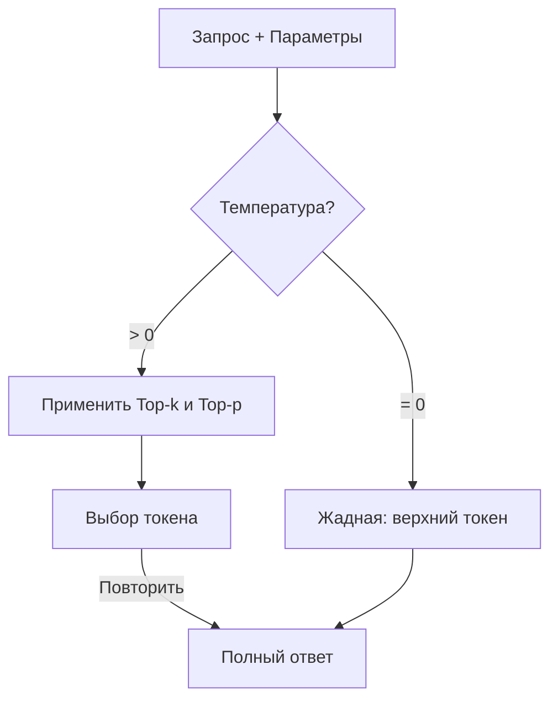
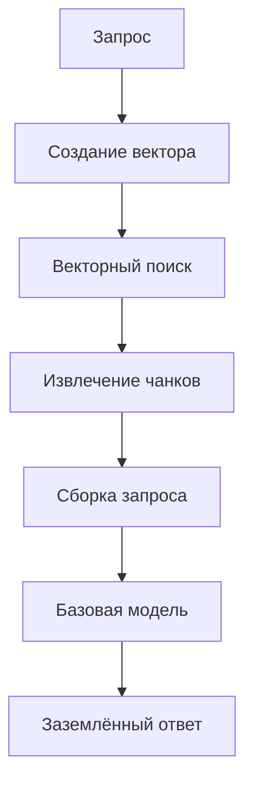
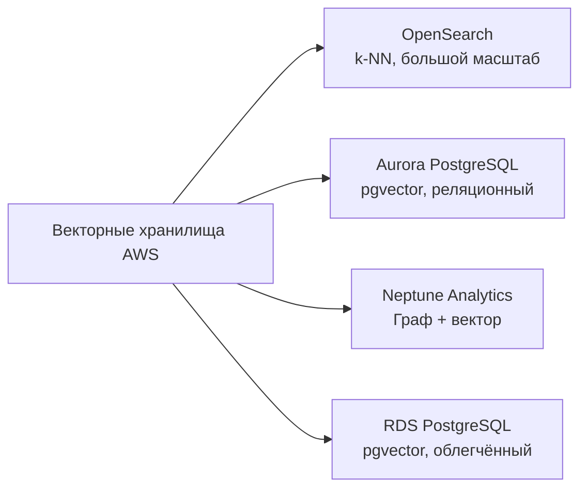
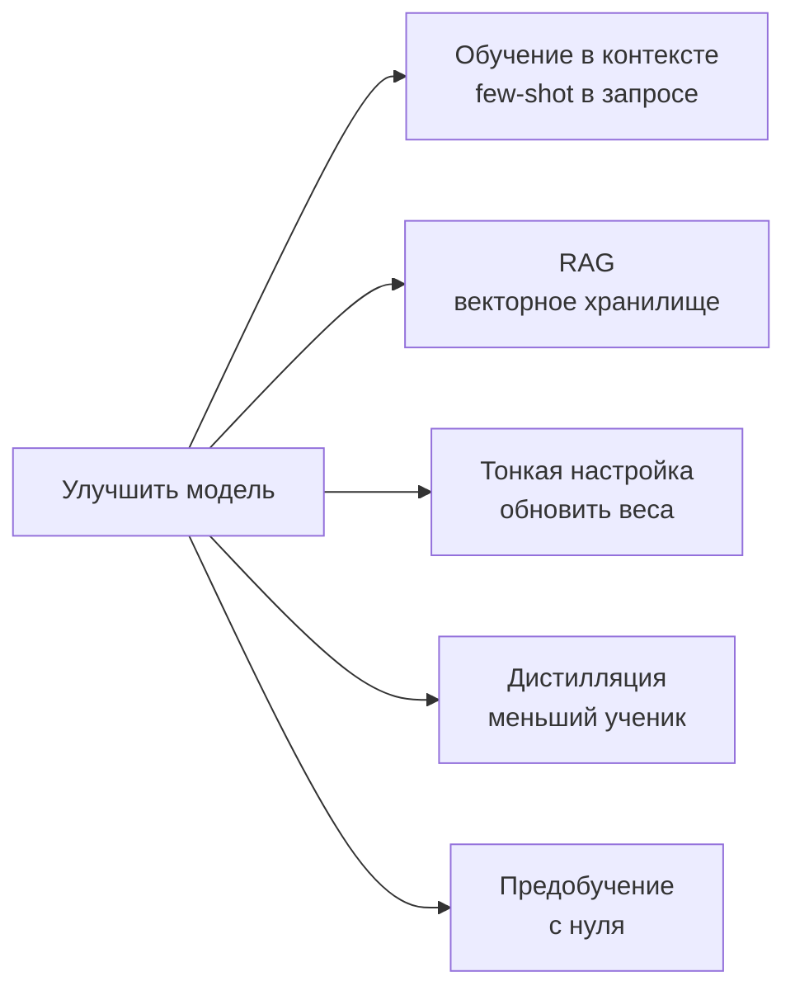
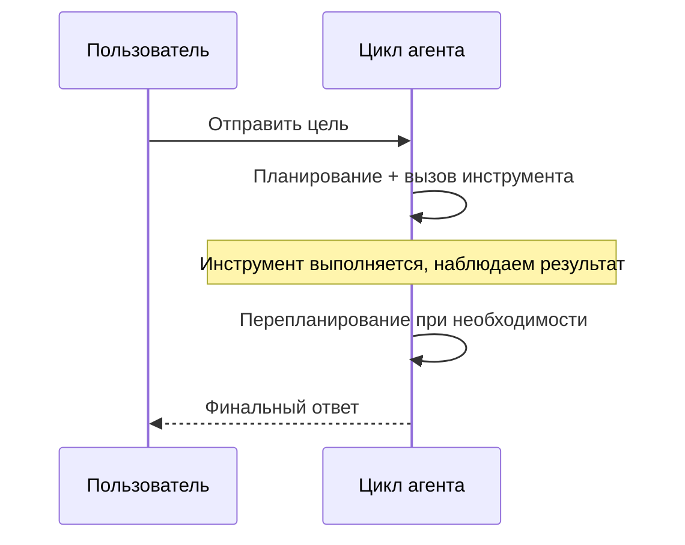

## Формулировка задачи 3.1: Описать проектные соображения для приложений, использующих базовые модели

Создание производственного приложения на основе базовой модели начинается задолго до первого запроса. Решения, принятые на этапе проектирования — какую модель использовать, как настроить её вывод, как заземлить её в частных данных, где хранить эти данные и как масштабировать знания со временем, — определяют, принесёт ли проект ценность или заглохнет на стадии пилота. Эта формулировка задачи охватывает эти решения в том порядке, в котором с ними сталкивается бизнес-архитектор.[^301001]

### 3.1.1 Критерии выбора базовых моделей

Выбор базовой модели — не единовременное техническое решение; оно повторяется каждый раз, когда меняются бизнес-требования. Модель, приемлемо работавшая на пилоте, может оказаться слишком дорогой при производственном объёме. Модель, хорошо отвечавшая на вопросы клиентов на английском, может потребовать замены при расширении продукта на испаноязычные рынки. Понимание критериев выбора делает эти решения системными, а не реактивными.

Критерии, охватываемые экзаменом, делятся на три группы. Критерии стоимости и производительности определяют, сколько стоит запуск модели и насколько быстро она отвечает. Критерии возможностей определяют, что модель умеет. Критерии гибкости определяют, насколько модель можно изменить под нужды бизнеса.

**Стоимость** измеряется в токенах, где токен — примерно три четверти английского слова (или около четырёх символов английского текста).[^301036] Входные токены (запрос) и выходные токены (ответ) оцениваются отдельно, причём выходные токены неизменно дороже.[^301002] Ассистент по обслуживанию клиентов, читающий историю клиента из 500 слов и создающий ответ из 100 слов, потребляет примерно 670 входных токенов и 130 выходных токенов на взаимодействие. В производственном масштабе эта арифметика имеет огромное значение. **Кэширование запросов** снижает фактическую стоимость путём повторного использования обработанного представления статического префикса, например длинного системного запроса или каталога продуктов, для нескольких вызовов. Amazon Bedrock поддерживает кэширование запросов для ряда моделей, включая Anthropic Claude на Bedrock, что делает его значимым рычагом снижения затрат, когда большой блок контекста повторно используется в тысячах ежедневных запросов.[^301003]

**Модальность** относится к типам входных данных, которые модель может принимать, и типам выходных данных, которые она может производить.[^301037] Модель *только для текста* читает текст и производит текст. *Мультимодальная* модель также может обрабатывать изображения, документы или аудио. Если бизнес-приложение должно классифицировать отсканированные счета или отвечать на вопросы о фотографиях продуктов, мультимодальная модель обязательна, и стоимость взаимодействия будет выше. Выбор текстовой модели для текстовой задачи позволяет не платить за неиспользуемую мультимодальную возможность.

**Задержка** — это время от момента отправки запроса до момента появления первого токена ответа.[^301038] Интерактивным приложениям, таким как чат-боты, требуется низкая задержка; пятисекундная пауза разрушает диалоговый опыт. Пакетные приложения, такие как ночная суммаризация документов, могут терпеть более высокую задержку в обмен на снижение стоимости. Размер модели является одним из крупнейших факторов задержки: меньшие модели работают быстрее, но имеют меньшую мощность рассуждений, тогда как большие модели рассуждают лучше, но дольше реагируют. **Размер модели** измеряется в миллиардах параметров. Модель с 7 миллиардами параметров обычно отвечает менее чем за секунду на подходящей инфраструктуре; модель с 70 миллиардами параметров может занять несколько секунд для того же запроса.[^301004]

**Сложность модели** связана с архитектурными решениями, выходящими за рамки числа параметров. Некоторые модели плотные, то есть все параметры активируются для каждого токена; другие используют архитектуры *mixture-of-experts* (MoE), активирующие только подмножество параметров на токен, достигая лучшего качества при меньшей стоимости инференса.[^301039] С точки зрения выбора, сложность важна, поскольку влияет на пропускную способность инференса и необходимый уровень инфраструктуры для обслуживания модели.

**Мультиязычная поддержка** охватывает языковую широту данных предобучения модели.[^301040] Модель, обученная преимущественно на английских текстах, производит выводы более низкого качества на других языках. Для глобальных развёртываний проверка задокументированной языковой поддержки модели перед выбором предотвращает болезненные регрессии качества при расширении на новые рынки.

**Кастомизация** означает, можно ли провести тонкую настройку модели или её непрерывное предобучение на проприетарных данных.[^301041] Не все коммерчески доступные модели поддерживают тонкую настройку. Если проект требует обучения модели доменно-специфичной терминологии или проприетарным рабочим процессам, важно проверить доступность тонкой настройки перед подписанием контракта. Раздел 3.1.5 охватывает компромиссы стоимости между подходами к кастомизации.

**Размер контекстного окна** устанавливает максимальное количество токенов, которое модель может прочитать за один вызов, учитывая как ввод, так и вывод.[^301042] Модель с контекстным окном на 200 000 токенов может обработать целый юридический контракт за один запрос; модель с окном в 4096 токенов — нет. Несколько флагманских моделей на Amazon Bedrock теперь предлагают окна на один миллион токенов (Anthropic Claude Opus и Sonnet через бета-заголовок 1M-context, Amazon Nova Premier и Meta Llama 4 Maverick), которые могут вместить целую кодовую базу или год переписки в одном запросе. Более широкие контекстные окна стоят дороже за вызов, но могут устранить необходимость в сложных стратегиях чанкинга в конвейерах RAG (см. Раздел 3.1.3).

*Таблица 3.1.1* ниже сравнивает основные семейства моделей, доступных через Amazon Bedrock на момент написания. Точные цены меняются; относительное позиционирование между уровнями моделей внутри семейства стабильно.[^301005]

*Таблица 3.1.1: Сравнение базовых моделей по уровню и возможностям*

| Семейство моделей | Уровень | Относительная стоимость | Модальность | Контекстное окно | Типичный сценарий использования |
|---|---|---|---|---|---|
| Anthropic Claude Opus | Флагман | Высокая | Мультимодальная | 200K стандарт, 1M с бета-заголовком | Сложное рассуждение, юридические/медицинские задачи |
| Anthropic Claude Sonnet | Сбалансированный | Средняя | Мультимодальная | 200K стандарт, 1M с бета-заголовком | Общие корпоративные задачи |
| Anthropic Claude Haiku | Быстрый | Низкая | Мультимодальная | 200K токенов | Высокообъёмные взаимодействия с клиентами |
| Amazon Nova Premier | Флагман | Высокая | Мультимодальная | 1M токенов | Сложные кросс-модальные задачи, очень длинные документы |
| Amazon Nova Pro | Сбалансированный | Средняя | Мультимодальная | 300K токенов | Корпоративные рабочие процессы |
| Amazon Nova Lite | Быстрый | Низкая | Мультимодальная | 300K токенов | Производство с ограниченным бюджетом |
| Amazon Nova Micro | Самый быстрый | Минимальная | Только текст | 128K токенов | Сверхнизкая задержка или стоимость |
| Meta Llama 4 Maverick | Открытый | Переменная | Мультимодальная | 1M токенов | Настраиваемые, длинноконтекстные развёртывания |
| Mistral Large 2 | Сбалансированный | Средняя | Только текст | 128K токенов | Европейские языковые задачи |

Экзамен не ожидает запоминания цен. Он ожидает, что вы сможете соотнести бизнес-сценарий (высокий объём, мультиязычность, анализ изображений, ограниченный бюджет) с правильным уровнем модели, используя эти критерии.

### 3.1.2 Влияние параметров инференса на ответы модели

Даже правильно выбранная модель может производить неподходящие выводы, если её параметры инференса настроены неверно. Параметры инференса — это настройки, передаваемые во время выполнения вместе с запросом, которые сообщают модели, как выбирать из распределения вероятностей возможных следующих токенов. Их корректировка меняет поведение модели без переобучения.

**Температура** управляет степенью случайности в процессе выборки.[^301043] При температуре 0 модель всегда выбирает токен с наивысшей вероятностью, производя детерминированный, последовательный вывод. При температуре 1 модель производит выборку по необработанному распределению вероятностей, производя более разнообразный и творческий вывод. Значения выше 1 усиливают маловероятные токены, повышая творческость за счёт связности.[^301006] Бизнес-импликация прямая: инструмент суммаризации юридических документов должен работать при температуре 0 или близкой к ней, поскольку последовательность и точность важнее разнообразия. Генератор маркетинговых текстов может использовать температуру 0,8 или выше для получения разнообразных творческих вариантов одного брифа.

**Top-p** (также называемый *nucleus sampling*) — дополнительный контроль случайности.[^301044] Вместо корректировки вероятностей токенов на множитель, top-p определяет порог суммарной вероятности. Модель делает выборку только из наименьшего набора токенов, суммарная вероятность которых достигает порога. При top-p = 0,9 модель рассматривает только токены, которые вместе составляют 90% вероятностной массы, отбрасывая маловероятные выбросы. Более низкие значения top-p делают вывод более сфокусированным; более высокие позволяют большее разнообразие.[^301007]

**Top-k** ограничивает выборку k токенами с наивысшей индивидуальной вероятностью независимо от их совокупной вероятности.[^301045] При top-k = 50 модель делает выборку только из 50 наиболее вероятных следующих токенов. Top-k и top-p часто используются вместе; модель сначала фильтрует по top-k, а затем применяет порог top-p к оставшимся кандидатам.

Температура и top-p взаимодействуют на практике. Установка температуры = 0 делает top-p нерелевантным, поскольку нет стохастической выборки для управления. Установка top-p = 1,0 отключает nucleus sampling, оставляя температуру единственным активным контролем. Типичная производственная конфигурация для высокоточного ассистента — температура = 0,1 и top-p = 0,9, производящая вывод, преимущественно детерминированный, с допуском на случайное альтернативное формулирование, когда модель действительно неопределена.

**Стоп-последовательности** — строки символов, которые сообщают модели, когда прекратить генерацию, как только она их произведёт.[^301046] Например, шаблон запроса с явным маркером конца может включать `"\n###КОНЕЦ###"` как стоп-последовательность, чтобы модель остановилась сразу после производства маркера. Стоп-последовательности полезны для применения формата вывода в приложениях, где нижестоящая система должна разбирать ответ; они должны выбираться таким образом, чтобы быть однозначными в ожидаемом выводе.

**Параметры длины входных и выходных данных** ограничивают количество токенов, которые модель читает (входные) или генерирует (выходные). Ограничение длины вывода контролирует стоимость на высокообъёмных эндпоинтах. Ограничение длины входных данных на уровне API предотвращает отправку клиентами запросов, превышающих контекстное окно модели. Оба ограничения следует устанавливать на основе реалистичного максимального размера допустимого запроса, а не максимума, поддерживаемого моделью.

```
Пример конфигурации параметров инференса:
  temperature:     0.1
  top_p:           0.9
  top_k:           50
  max_new_tokens:  512
  stop_sequences:  ["###КОНЕЦ###"]
```

Конфигурация выше подходит ассистенту по извлечению данных из документов, который должен надёжно производить короткие структурированные выводы. Ассистент по творческому письму увеличил бы температуру, увеличил бы top-p и удалил стоп-последовательность.


*Рисунок 3.1.1: Конвейер выборки токенов. Модель выбирает каждый выходной токен, фильтруя кандидатов через top-k и top-p, прежде чем применить стохастическую выборку с температурным масштабированием.*

### 3.1.3 Определение RAG и его бизнес-применения

Базовые модели обучены на больших публичных датасетах, но у них нет доступа к информации, датированной позже даты среза обучения, и нет доступа к проприетарным организационным данным. Модель, обученная до конца 2024 года, не может ответить на вопросы о релизе продукта в начале 2025 года. Модель общего назначения никогда не видела вашу внутреннюю HR-политику, шаблоны клиентских контрактов или инженерные руководства. **Retrieval Augmented Generation (RAG)** — архитектурный паттерн, устраняющий это ограничение путём подключения модели к внешнему хранилищу знаний во время запроса, а не путём встраивания знаний в веса модели через обучение.[^301008]

Механика RAG состоит из пяти шагов. Во-первых, вопрос пользователя преобразуется в числовой вектор, называемый *векторным представлением*, которое фиксирует его семантический смысл.[^301047] Во-вторых, этот вектор сравнивается с базой данных предварительно вычисленных векторных представлений, полученных из частных документов организации. В-третьих, извлекаются документы, чьи векторные представления наиболее сходны с вектором запроса. В-четвёртых, эти документы собираются в блок контекста и предшествуют исходному вопросу пользователя, формируя полный запрос. В-пятых, базовая модель читает обогащённый запрос и генерирует ответ, основанный на извлечённом контенте, а не только на параметрической памяти.[^301009]


*Рисунок 3.1.2: Конвейер запроса RAG. Запрос пользователя преобразуется в вектор, сравнивается с сохранёнными векторами документов, а извлечённые чанки объединяются с исходным запросом перед генерацией ответа базовой моделью.*

**Amazon Bedrock Knowledge Bases** — полностью управляемая реализация этого паттерна от AWS.[^301010] Она обрабатывает конвейер загрузки документов, генерацию векторных представлений, интеграцию с векторным хранилищем и API извлечения, позволяя организации внедрить RAG без создания или эксплуатации какой-либо базовой инфраструктуры. Администратор настраивает базу знаний, указывая источник данных, стратегию чанкинга, модель векторных представлений и бэкенд векторного хранилища; затем Bedrock автоматически синхронизирует документы.

Источники данных, поддерживаемые Amazon Bedrock Knowledge Bases, включают бакеты Amazon S3 (наиболее распространённый выбор для архивов документов), рабочие пространства Atlassian Confluence, сайты Microsoft SharePoint, объекты Salesforce и веб-URL через встроенный веб-краулер.[^301011] Каждый источник данных синхронизируется по расписанию или по требованию; обновления исходных документов отражаются в векторном хранилище без ручной переиндексации.[^301048]

*Чанкинг* — процесс разбивки исходных документов на сегменты, достаточно малые для помещения в контекстное окно вместе с исходным запросом.[^301049] Bedrock Knowledge Bases поддерживает фиксированный чанкинг (разбивка каждые N токенов), семантический чанкинг (разбивка на естественных тематических границах, определяемых вторичной моделью) и иерархический чанкинг (создание и родительского суммарного чанка, и меньших дочерних детальных чанков, чтобы извлечение могло работать на двух уровнях детализации).[^301012]

Бизнес-применения RAG охватывают несколько категорий:

- **Внутренние вопросы и ответы**: Сотрудники задают системе вопросы о HR-политиках, IT-процедурах или технических спецификациях. Система извлекает релевантные абзацы политики и генерирует точный ответ с указанием исходного документа.
- **Поддержка клиентов**: Агент поддержки или самообслуживаемый чат-бот извлекает соответствующие шаги устранения неисправностей из базы знаний и представляет их в разговорном формате, сокращая среднее время обработки.
- **Анализ контрактов и юридических документов**: Юридические команды загружают библиотеки контрактов. Модель отвечает на вопросы типа «В каких контрактах есть пункт о расторжении по удобству?» или «Каков лимит ответственности в Основном соглашении об оказании услуг с Поставщиком X?».
- **Помощь в исследованиях**: Учёные, аналитики или менеджеры по продукту запрашивают корпус внутренних исследовательских отчётов. Модель синтезирует выводы по нескольким документам, а не возвращает список ссылок.

RAG предпочтительнее тонкой настройки, когда база знаний часто меняется, поскольку обновление векторного хранилища занимает минуты, тогда как переобучение модели — часы или дни.[^301050] Также он предпочтителен, когда исходные документы должны поддаваться аудиту; поскольку извлечённые чанки видны в запросе, разработчик может точно проверить, какие документы повлияли на ответ.[^301051]

### 3.1.4 Сервисы AWS для хранения векторных представлений в векторных базах данных

RAG требует места для хранения предварительно вычисленных векторных представлений и их быстрого поиска с использованием алгоритмов *приближённого поиска ближайших соседей* (ANN) или *поиска k ближайших соседей* (k-NN).[^301052] AWS предоставляет четыре управляемых сервиса, поддерживающих векторное хранилище, каждый из которых подходит для разных требований масштаба, архитектуры и запросов.[^301053]


*Рисунок 3.1.3: Векторные хранилища AWS. Каждый сервис поддерживает хранение векторных представлений, но различается по масштабу, модели запросов и дополнительным возможностям.*

**Amazon OpenSearch Service** поддерживает приближённый поиск ближайших соседей с момента введения плагина k-NN, а его *векторный движок* оптимизирован для крупномасштабных, высокопропускных нагрузок семантического поиска.[^301013] Он поддерживает алгоритм индексации Hierarchical Navigable Small World (HNSW), обеспечивающий поиск с субмиллисекундной задержкой при миллиардах векторов.[^301054] OpenSearch — наиболее мощный вариант, когда датасет извлечения большой (миллионы документов и более), когда поиск должен сочетать векторное сходство с традиционными фильтрами по ключевым словам (гибридный поиск) или когда приложение уже использует OpenSearch для аналитики логов и может разделить кластер. Amazon Bedrock Knowledge Bases использует OpenSearch Service как бэкенд векторного хранилища по умолчанию, когда альтернатива не указана.[^301055]

**Amazon Aurora** с расширением pgvector добавляет векторное хранилище в реляционную базу данных, совместимую с PostgreSQL.[^301014] Этот вариант подходит, когда приложение уже хранит структурированные данные в Aurora и хочет добавить семантический поиск без эксплуатации отдельного векторного хранилища. Каталог продуктов, хранящийся как строки в Aurora, может получить столбцы векторных представлений; затем запросы могут сочетать реляционные предикаты («продукты в категории "Электроника"») с векторным сходством («похожие на описание этого продукта») в одном SQL-операторе.[^301056] Компромисс — масштаб: pgvector на Aurora хорошо работает для датасетов от сотен тысяч до нескольких миллионов векторов, но не сравнится с OpenSearch Service при очень больших масштабах.

**Amazon Neptune Analytics** расширяет графовую базу данных Neptune возможностями векторного поиска, позволяя запросам, сочетающим обход графа с семантическим сходством.[^301015] Граф знаний, моделирующий отношения между людьми, организациями и документами, может использовать Neptune Analytics для ответов на вопросы вроде «Найти документы, наиболее семантически близкие к данному запросу, написанные сотрудником юридического отдела и ссылающиеся как минимум на одно нормативное требование».[^301057] Такое сочетание графового рассуждения и векторного извлечения сложно воспроизвести с чисто реляционным или чисто поисковым хранилищем. Neptune Analytics — правильный выбор, когда задача извлечения имеет присущую графовую структуру, например анализ цепочек поставок, расследование мошенничества или биомедицинские исследования.

**Amazon RDS for PostgreSQL** предоставляет те же возможности pgvector, что и Aurora, но работает на стандартной инфраструктуре RDS, а не на бессерверном или выделенном кластере Aurora.[^301016] Он подходит для небольших нагрузок, где уже работает существующий инстанс RDS с PostgreSQL и добавление расширения pgvector — наименее затратный путь.[^301058] Среды разработки и облегчённые внутренние инструменты часто используют этот вариант для простоты инфраструктуры при поддержке векторного поиска.

Простое практическое правило выбора между этими хранилищами: pgvector (на RDS или Aurora) комфортно обрабатывает до нескольких миллионов векторов; Amazon OpenSearch Service является стандартным выбором, когда нагрузка превышает десятки миллионов и более, где его индекс HNSW поддерживает низкую задержку извлечения при очень большом масштабе. Neptune Analytics — правильный ответ, когда данные имеют принципиально графовую структуру.

*Таблица 3.1.2: Сравнение сервисов AWS для векторного хранилища*

| Сервис | Алгоритм индексации | Масштаб | Дополнительные возможности | Лучше всего для |
|---|---|---|---|---|
| OpenSearch Service | HNSW, IVF | Очень большой (миллиарды) | Гибридный ключевое слово + вектор, аналитика | Высокообъёмный RAG, корпоративный поиск |
| Aurora PostgreSQL (pgvector) | IVFFlat, HNSW | Средний (миллионы) | Реляционные SQL-объединения | Приложения уже на Aurora |
| Neptune Analytics | Граф + вектор | Средний | Обход графа, запросы отношений | Базы знаний с графовой структурой |
| RDS for PostgreSQL (pgvector) | IVFFlat, HNSW | Малый до среднего | Реляционный SQL, простая настройка | Среды разработки, внутренние инструменты |

Amazon Bedrock Knowledge Bases может быть настроена на использование любого из этих четырёх бэкендов.[^301017] По умолчанию, когда бэкенд не указан, используется OpenSearch Service.[^301059] Организации, уже эксплуатирующие Aurora или RDS for PostgreSQL, могут направить базу знаний на существующий кластер, избегая стоимости отдельного поискового сервиса. Neptune Analytics выбирается явно, когда база знаний имеет графовую структуру.

Примечание: Amazon MemoryDB был указан как вариант векторного хранилища в более ранних версиях руководства по экзамену AIF-C01. Он был удалён в версии 1.1 руководства. Не ожидайте вопросов экзамена о MemoryDB в контексте векторного поиска.

### 3.1.5 Компромиссы стоимости при кастомизации базовых моделей

Когда стандартное поведение базовой модели недостаточно хорошо для конкретной бизнес-задачи, существует пять широких стратегий его улучшения. Они существенно различаются по стоимости, времени, требованиям к данным и долговечности улучшения.

**Предобучение** — процесс обучения нейронной сети с нуля, начиная со случайных начальных весов, на огромном корпусе текста.[^301060] Предобучение создаёт параметрическую память модели — знания, встроенные в её веса, которые она может задействовать даже без внешних документов. Требуемый масштаб является запретительным для большинства организаций. Предобучение актуально на экзамене как базовая линия, от которой отходят все остальные техники, а не как практический вариант для любого бизнеса за пределами крупных ИИ-исследовательских лабораторий.[^301018]

**Тонкая настройка** начинается с существующей предобученной модели и продолжает обучение на меньшем, доменно-специфичном датасете.[^301061] Требуются размеченные примеры в диапазоне сотен-десятков тысяч пар ввод-вывод, и GPU-часы в диапазоне часов-дней, а не недель. Amazon Bedrock поддерживает тонкую настройку ряда моделей.[^301019] Результат — модель с выводом, лучше соответствующим конкретной задаче, хранящаяся как отдельная версия модели, которая несёт затраты на размещение даже в простое.[^301062]

**Обучение в контексте** не требует обновления весов.[^301063] Вместо этого примеры желаемого поведения помещаются непосредственно внутрь запроса. Zero-shot запрос не даёт примеров; few-shot запрос даёт два-пять примеров. Модель использует сопоставление паттернов в рамках контекстного окна для обобщения с этих примеров на текущий ввод. Обучение в контексте — самая дешёвая и быстрая стратегия кастомизации. Ограничение состоит в том, что улучшение длится только на время запроса; модель не сохраняет примеры между вызовами, а примеры потребляют токены, которые иначе могли бы содержать контент.[^301020]

**RAG** (подробно рассмотренный в Разделе 3.1.3) обычно не описывается как техника кастомизации, но имеет схожие бизнес-эффекты: заземляет модель в доменно-специфичных знаниях и снижает галлюцинации по проприетарным темам. Его профиль стоимости отличается от остальных. Стоимость установки предполагает создание и синхронизацию векторного хранилища и интеграцию уровня извлечения. Стоимость на запрос немного выше, чем у простого вызова инференса, поскольку шаг извлечения и более крупный расширенный запрос потребляют вычислительные ресурсы и токены. Однако стоимость обновления знаний очень низка: добавление новых документов в векторное хранилище занимает минуты, а не часы, требуемые заданием тонкой настройки.[^301021]

**Дистилляция модели** — новейшая техника в руководстве по экзамену v1.1. При дистилляции большая, высококачественная *модель-учитель* генерирует выводы для набора запросов, а эти пары ввод-вывод становятся датасетом обучения для меньшей *модели-ученика*.[^301064] Ученик учится аппроксимировать поведение учителя в конкретном задачном домене без доступа к весам учителя.[^301022] Бизнес-выгода в том, что инференс в производственном масштабе обслуживается меньшей, более быстрой, более дешёвой моделью-учеником, тогда как качество ответов приближается к качеству дорогого учителя. Amazon Bedrock поддерживает дистилляцию моделей как управляемый рабочий процесс, позволяя организациям использовать модель Bedrock как учителя и производить тонко настроенную версию меньшей модели как ученика.[^301023] Дистилляция переносит стоимость с инференса (который текущий) на разовое задание обучения (которое может быть амортизировано на тысячах последующих вызовов инференса).[^301065]


*Рисунок 3.1.4: Руководство по выбору техники кастомизации базовых моделей. Подходящая техника зависит от доступных размеченных данных, частоты обновлений, бюджета и объёма инференса.*

*Таблица 3.1.3: Сравнение стоимости и усилий подходов к кастомизации базовых моделей*

| Подход | Вычислительная стоимость | Необходимые данные | Скорость обновления | Стоимость на запрос | Сценарии экзамена |
|---|---|---|---|---|---|
| Предобучение | Очень высокая | Петабайты | Недели | Обычная | Только академическая базовая линия |
| Тонкая настройка | Средняя | Сотни-тысячи размеченных пар | Часы-дни | Обычная + размещение | Стабильная доменная специализация |
| Обучение в контексте | Нет | Несколько примеров | Немедленно | Выше (более длинный запрос) | Быстрое прототипирование, малый объём |
| RAG | Низкая установка | Существующие документы | Минуты | Немного выше | Часто обновляемые знания |
| Дистилляция | Средняя (разовая) | Пары учитель-вывод | Часы-дни | Ниже (меньшая модель) | Оптимизация стоимости при высоком объёме |

Экзамен часто представляет сценарии, в которых бизнес должен выбрать между этими подходами. Логика принятия решений: если знания часто меняются, выбирайте RAG. Если задача требует последовательного тона или специализированной терминологии в стабильном домене и данные доступны, выбирайте тонкую настройку. Если объём очень высок и стоимость на запрос является главной проблемой, оценивайте дистилляцию. Если ни бюджет, ни время недоступны, используйте обучение в контексте с few-shot примерами. Предобучение никогда не является правильным ответом для сценария готовности к производству, если только в вопросе явно не указано, что существует новый домен, для которого нет доступной предобученной модели.

### 3.1.6 Роль ИИ-агентов и бизнес-применения

Базовая модель, получающая один запрос и возвращающая один ответ, работает в *одиночном* режиме. Многие реальные бизнес-задачи не могут быть выполнены за один шаг. Бронирование рейса требует проверки доступности, сравнения вариантов, выбора мест и подтверждения оплаты. Расследование оповещения о безопасности требует запроса данных журналов, поиска информации об угрозах, корреляции событий и составления отчёта. Эти многошаговые задачи требуют другой архитектуры.

**ИИ-агент** — система, сочетающая базовую модель со способностью воспринимать среду, планировать последовательность действий, выполнять эти действия с помощью внешних инструментов, наблюдать результаты и пересматривать план на основе усвоенного.[^301024] Модель в агенте не просто генерирует текст; она рассуждает о том, что делать дальше, решает, какой инструмент вызвать, оценивает, достаточен ли результат, и продолжает до выполнения задачи или достижения условия остановки.[^301066]

Цикл агента состоит из четырёх фаз. В фазе *восприятия* агент получает цель пользователя и любой доступный контекст о текущем состоянии мира.[^301067] В фазе *планирования* модель рассуждает о следующем действии, выбирая из определённого набора инструментов (API, запросы к базам данных, исполнители кода, веб-поиск). В фазе *действия* агент вызывает выбранный инструмент и передаёт ему аргументы, определённые моделью. В фазе *наблюдения* агент читает ответ инструмента и обновляет понимание прогресса к цели. Цикл повторяется до тех пор, пока агент не определит, что задача выполнена.[^301025]


*Рисунок 3.1.5: Цикл «воспринять-спланировать-действовать-наблюдать» ИИ-агента. Базовая модель рассуждает о том, какой инструмент вызвать на каждом шаге, и цикл продолжается до достижения цели задачи.*

Разница между агентом и простым вызовом LLM важна в бизнес-терминах. Простой вызов LLM быстр, дёшев и не имеет состояния. Вызов агента медленнее, дороже и поддерживает состояние между несколькими вызовами инструментов.[^301068] Агенты уместны, когда задача не может быть закодирована в одном запросе, когда она требует информации из внешних систем или когда включает несколько последовательных решений, где каждое зависит от предыдущего результата.

AWS предоставляет две основные точки входа для создания агентов. **Amazon Bedrock Agents** — устоявшийся управляемый сервис для создания, настройки и развёртывания агентов на основе любой поддерживаемой Bedrock базовой модели.[^301026] Он обрабатывает оркестрацию, маршрутизацию инструментов (называемых *группами действий* в терминологии Bedrock), управление состоянием сессии и интеграцию с Knowledge Bases для RAG. **Amazon Bedrock AgentCore** — более новый уровень среды выполнения и управления для агентов производственного класса, добавляющий наблюдаемость, память, контроль безопасности и инфраструктуру для запуска агентов в масштабе.[^301027] **Strands Agents** — опенсорс-SDK AWS, позволяющий Python-разработчикам создавать агентов с использованием простого API на основе декораторов, с возможностью развёртывания агентов в AgentCore для управляемого выполнения.[^301028]

Бизнес-применения ИИ-агентов включают:

- **Автоматизация обслуживания клиентов**: Агент обрабатывает полное разрешение запроса на обслуживание, запрашивая CRM, проверяя статус заказа, инициируя возврат и отправляя подтверждение, без привлечения человека-агента, если только ситуация не выходит за рамки определённого объёма.
- **IT-операции**: Агент расследует оповещение о производительности, запрашивая метрики CloudWatch, определяя затронутые ресурсы, сопоставляя журнал изменений и предлагая действие по устранению для утверждения оператором.
- **Обработка документов**: Агент читает входящие контракты, извлекает ключевые условия, проверяет их по стандартному шаблону, отмечает отклонения и создаёт черновое резюме для юрисконсульта, всё без ручной сортировки.
- **Анализ данных**: Агент принимает бизнес-вопрос на естественном языке, пишет SQL-запрос, выполняет его против базы данных, интерпретирует результат и создаёт резюме на естественном языке с рекомендацией.

*Мультиагентные* архитектуры, где один оркестрирующий агент делегирует подзадачи специализированным подагентам, расширяют паттерн на задачи, слишком большие или разнообразные для надёжного обслуживания одним агентом.[^301069] Amazon Bedrock Agents поддерживает мультиагентное сотрудничество нативно.[^301029] Принципы проектирования мультиагентных систем, включая разбивку задач, маршрутизацию между агентами и поддержание согласованного состояния сессии, были рассмотрены ранее в Домене 2 (глава об основных концепциях GenAI) вместе с более широким материалом по архитектуре агентного ИИ.

*Таблица 3.1.4: Сравнение ИИ-агента и обычного вызова LLM*

| Характеристика | Обычный вызов LLM | ИИ-агент |
|---|---|---|
| Область задачи | Однозначная, один запрос | Многошаговая, итеративная |
| Доступ к внешним инструментам | Нет (только веса модели) | API, базы данных, исполнители кода |
| Состояние между шагами | Нет | Поддерживается в рамках сессии |
| Задержка на задачу | Миллисекунды-секунды | Секунды-минуты |
| Стоимость на задачу | Низкая (один вызов инференса) | Выше (несколько вызовов инференса + инструментов) |
| Подходит для | Классификация, суммаризация, генерация | Исследования, бронирование, IT-операции, документооборот |

Экзамен рассматривает агентов как отдельный архитектурный паттерн, а не как расширение запросов. Когда вопрос описывает многошаговую задачу, требующую запроса внешних систем или последовательных решений, ответ предполагает агента, а не более сложный запрос.

## Вопросы для самопроверки

**Вопрос 1.** Ритейлер хочет развернуть клиентский чат-бот, отвечающий на вопросы о каталоге продуктов на шести языках. Каталог содержит 50 000 SKU; ежедневные обновления затрагивают менее одного процента SKU, тогда как системный запрос и блок таксономии продуктов статичны для всех вызовов. Какая комбинация критериев выбора должна НАИБОЛЕЕ непосредственно определять выбор базовой модели?

A. Размер модели, доступность тонкой настройки и поддержка стоп-последовательностей
B. Мультиязычная поддержка, размер контекстного окна и право на кэширование запросов
C. Выходная модальность, актуальность данных предобучения и значение top-p по умолчанию
D. Стоимость обучения, объём памяти GPU и чувствительность к температуре

**Пояснение:** Сценарий имеет три движущих фактора: поддержка шести языков (мультиязычная поддержка), большой, но преимущественно стабильный контекст каталога, который должен помещаться в запрос или эффективно извлекаться (размер контекстного окна), и контроль затрат в масштабе (кэширование запросов применяется к статичному системному запросу и блоку таксономии, но не к ежедневно обновляемым строкам SKU, которые остаются правильным инструментом для неустойчивой части — RAG). Ответ A неверен, поскольку тонкая настройка не решает проблему ежедневного обновления, а стоп-последовательности — не критерий выбора модели. Ответ C неверен, поскольку выходная модальность — только текст (чат-бот), актуальность предобучения не важна, так как каталог инжектируется во время выполнения, а top-p — параметр инференса, а не критерий выбора модели. Ответ D неверен, поскольку стоимость обучения не является производственным соображением для потребителя управляемой базовой модели, а объём памяти GPU — это деталь инфраструктуры, абстрагированная Amazon Bedrock. Ответ B непосредственно решает все три бизнес-ограничения.[^301030]

---

**Вопрос 2.** Юридическая команда использует базовую модель для суммаризации пунктов контрактов. Они замечают, что суммаризации непоследовательны: один и тот же пункт производит немного разные суммаризации при каждом запуске. Команда требует дословной воспроизводимости при повторном запуске суммаризации. Какое изменение параметра инференса НАИБОЛЕЕ вероятно решит эту проблему?

A. Увеличить top-k с 50 до 200
B. Увеличить температуру с 0,7 до 1,0
C. Установить температуру 0
D. Установить top-p на 1,0

**Пояснение:** Температура контролирует детерминированность процесса выборки. При температуре = 0 модель всегда выбирает следующий токен с наивысшей вероятностью, делая вывод детерминированным для фиксированного запроса. Это правильный ответ (C). Увеличение top-k (ответ A) расширяет пул кандидатов-токенов, что увеличило бы вариабельность, а не устранило бы её. Увеличение температуры с 0,7 до 1,0 (ответ B) увеличивает случайность, усугубляя проблему. Установка top-p на 1,0 (ответ D) отключает nucleus sampling, но сама по себе не делает выборку детерминированной; если температура по-прежнему больше 0, модель всё равно будет стохастически выбирать из полного распределения вероятностей. Только установка температуры точно в 0 сворачивает процесс выборки в жадный детерминированный режим, необходимый юридической команде.[^301031]

---

**Вопрос 3.** Компания финансовых услуг хочет предоставить своим аналитикам инструмент для ответов на вопросы о внутренних исследовательских отчётах. Отчёты обновляются еженедельно. Компания не хочет переобучать или тонко настраивать модель. Какая архитектура ЛУЧШЕ всего решает эти требования?

A. Предобучить доменно-специфичную модель на исследовательских отчётах
B. Тонко настраивать базовую модель каждую неделю при публикации новых отчётов
C. Использовать RAG с векторным хранилищем, синхронизированным из репозитория отчётов
D. Использовать обучение в контексте, вставляя релевантные отчёты в запрос

**Пояснение:** RAG (ответ C) создан специально для этого сценария. Он позволяет аналитику задавать вопросы на естественном языке и извлекает соответствующие разделы из векторного хранилища, которое можно обновить за минуты при поступлении новых отчётов. Не требует переобучения модели. Предобучение (ответ A) исключено стоимостью, требованием отсутствия переобучения и еженедельной периодичностью обновления. Тонкая настройка (ответ B) исключена требованием отсутствия переобучения и тем, что еженедельные циклы тонкой настройки непрактичны для задачи обновления знаний. Обучение в контексте (ответ D) нереализуемо в масштабе; вставка целых исследовательских отчётов в запрос превысила бы контекстное окно для библиотеки из сотен документов. Amazon Bedrock Knowledge Bases с синхронизированным источником данных S3 — конкретная реализация правильного подхода на AWS.[^301032]

---

**Вопрос 4.** Компания запускает высокообъёмное приложение поддержки клиентов на основе большой базовой модели. Стоимость инференса растёт быстрее выручки. ML-инженер предлагает использовать дистилляцию модели. Какова ОСНОВНАЯ бизнес-выгода этого подхода?

A. Модель-ученик усваивает новые факты, которых не знает модель-учитель
B. Модель-ученик производит идентичные выводы учителю на всех входных данных
C. Инференс в масштабе обслуживается более маленькой, быстрой, более дешёвой моделью, аппроксимирующей качество учителя
D. Веса модели-учителя сжимаются и напрямую обслуживаются, снижая потребление памяти

**Пояснение:** Дистилляция модели (ответ C) обучает меньшую модель-ученика аппроксимировать поведение большей модели-учителя в целевом задачном домене. После завершения дистилляции производственный инференс обслуживается моделью-учеником, которая быстрее и дешевле за вызов. Это непосредственно устраняет проблему роста стоимости в высокообъёмном приложении. Ответ A неверен, поскольку дистилляция учит ученика имитировать выводы учителя, а не узнавать факты, которых учитель не знает. Ответ B неверен, поскольку ученик аппроксимирует, но не воспроизводит точно учителя; на граничных случаях и новых входных данных выводы будут различаться. Ответ D описывает квантизацию или прореживание модели, а не дистилляцию; дистилляция предполагает обучение отдельной модели, а не сжатие весов учителя. Экзамен представил дистилляцию в v1.1 специально как технику оптимизации стоимости для сценариев высокообъёмного инференса.[^301033]

---

**Вопрос 5.** Производственная компания хочет автоматизировать процесс ответа на запросы поставщиков. Процесс требует проверки системы ERP на наличие запасов, запроса базы данных политики закупок, расчёта того, соответствует ли заказ порогам утверждения, и составления ответа. Какая архитектура НАИБОЛЕЕ подходит?

A. Одиночный вызов базовой модели со всей информацией о поставщике в запросе
B. RAG-конвейер, извлекающий релевантные документы политики и генерирующий ответ
C. ИИ-агент с группами действий, подключёнными к системе ERP, базе данных политики и инструменту расчёта
D. Тонко настроенная модель, обученная на исторических ответах поставщикам

**Пояснение:** Описание задачи — учебный пример для ИИ-агента (ответ C). Процесс многошаговый: три отдельные операции по извлечению данных (ERP, база данных политики, расчёт порога) должны выполняться последовательно, и результат каждого шага влияет на последующие. Обычный одиночный вызов (ответ A) не может запрашивать живые внешние системы; он может использовать только информацию, помещённую в запрос. RAG-конвейер (ответ B) извлекает релевантные документы, но не выполняет бизнес-логику и не производит расчётов; это уровень извлечения, а не оркестрации. Тонко настроенная модель (ответ D) по-прежнему не имела бы доступа к живым данным ERP или политики и производила бы ответы на основе паттернов в исторических обучающих данных, а не текущих запасов или состояния политики. Amazon Bedrock Agents, настроенные с группами действий, указывающими на API ERP, базу данных политики и Lambda-функцию для расчёта порога, — конкретная реализация правильного подхода на AWS.[^301034]

---

**Вопрос 6.** Компания оценивает, использовать ли Amazon OpenSearch Service или Amazon RDS for PostgreSQL с pgvector для базы знаний RAG. База знаний будет содержать примерно 200 000 чанков документов. Команда приложения уже эксплуатирует кластер RDS for PostgreSQL для транзакционных данных и хочет минимизировать новую инфраструктуру. Какая рекомендация НАИБОЛЕЕ подходит?

A. Использовать OpenSearch Service, поскольку это единственный сервис AWS с поддержкой векторного поиска
B. Использовать OpenSearch Service, поскольку 200 000 векторов требует алгоритма HNSW в масштабе
C. Использовать RDS for PostgreSQL, поскольку существующий кластер можно расширить pgvector без нового сервиса
D. Использовать Neptune Analytics, поскольку извлечение с графовой структурой всегда точнее, чем k-NN поиск

**Пояснение:** При 200 000 векторах оба сервиса технически способны. Решающий фактор в этом сценарии — операционная простота: команда уже эксплуатирует кластер RDS for PostgreSQL, и pgvector может быть включён одной установкой расширения. Это позволяет избежать выделения, обеспечения безопасности и эксплуатации отдельного домена OpenSearch Service (ответ C). Ответ A неверен, поскольку Aurora, RDS for PostgreSQL и Neptune Analytics также поддерживают векторный поиск; OpenSearch — не единственный вариант. Ответ B неверен, поскольку 200 000 векторов вполне укладываются в возможности pgvector на RDS, который разработан для датасетов такого масштаба; аргумент об HNSW в масштабе применяется, когда датасеты достигают десятков миллионов векторов. Ответ D неверен, поскольку Neptune Analytics подходит, когда задача имеет графовую структуру, а не как универсальное улучшение точности; применение обхода графа к общей задаче поиска документов добавляет сложности без соответствующей пользы.[^301035]

[^301001]: AWS Certification. AI Practitioner (AIF-C01) Exam Guide v1.1, Domain 3. URL: <https://docs.aws.amazon.com/aws-certification/latest/ai-practitioner-01/ai-practitioner-01-domain3.html>
[^301002]: Amazon Bedrock. Amazon Bedrock pricing. URL: <https://aws.amazon.com/bedrock/pricing/>
[^301003]: Amazon Bedrock. Prompt caching for Amazon Bedrock. URL: <https://docs.aws.amazon.com/bedrock/latest/userguide/prompt-caching.html>
[^301004]: Kaplan, J., et al. Scaling Laws for Neural Language Models (2020). URL: <https://arxiv.org/abs/2001.08361>
[^301005]: Amazon Bedrock. Supported foundation models in Amazon Bedrock. URL: <https://docs.aws.amazon.com/bedrock/latest/userguide/models-supported.html>
[^301006]: Amazon Bedrock. Inference parameters for foundation models. URL: <https://docs.aws.amazon.com/bedrock/latest/userguide/inference-parameters.html>
[^301007]: Holtzman, A., et al. The Curious Case of Neural Text Degeneration (2019). URL: <https://arxiv.org/abs/1904.09751>
[^301008]: Lewis, P., et al. Retrieval-Augmented Generation for Knowledge-Intensive NLP Tasks (2020). URL: <https://arxiv.org/abs/2005.11401>
[^301009]: Amazon Bedrock. How Amazon Bedrock Knowledge Bases works. URL: <https://docs.aws.amazon.com/bedrock/latest/userguide/knowledge-base-overview.html>
[^301010]: Amazon Bedrock. Amazon Bedrock Knowledge Bases. URL: <https://docs.aws.amazon.com/bedrock/latest/userguide/knowledge-base.html>
[^301011]: Amazon Bedrock. Data sources for Amazon Bedrock Knowledge Bases. URL: <https://docs.aws.amazon.com/bedrock/latest/userguide/knowledge-base-ds.html>
[^301012]: Amazon Bedrock. Chunking strategies for Amazon Bedrock Knowledge Bases. URL: <https://docs.aws.amazon.com/bedrock/latest/userguide/kb-chunking-parsing.html>
[^301013]: Amazon OpenSearch Service. k-NN search in Amazon OpenSearch Service. URL: <https://docs.aws.amazon.com/opensearch-service/latest/developerguide/knn.html>
[^301014]: Amazon Aurora. Using pgvector to store embeddings in Amazon Aurora PostgreSQL. URL: <https://docs.aws.amazon.com/AmazonRDS/latest/AuroraUserGuide/AuroraPostgreSQL.VectorSearch.html>
[^301015]: Amazon Neptune. Vector search in Amazon Neptune Analytics. URL: <https://docs.aws.amazon.com/neptune-analytics/latest/userguide/vector-search.html>
[^301016]: Amazon RDS. Using the pgvector extension with Amazon RDS for PostgreSQL. URL: <https://docs.aws.amazon.com/AmazonRDS/latest/UserGuide/Appendix.PostgreSQL.CommonDBATasks.pgvector.html>
[^301017]: Amazon Bedrock. Vector store options for Amazon Bedrock Knowledge Bases. URL: <https://docs.aws.amazon.com/bedrock/latest/userguide/knowledge-base-setup.html>
[^301018]: Brown, T., et al. Language Models are Few-Shot Learners (GPT-3 paper, 2020). URL: <https://arxiv.org/abs/2005.14165>
[^301019]: Amazon Bedrock. Fine-tuning foundation models in Amazon Bedrock. URL: <https://docs.aws.amazon.com/bedrock/latest/userguide/custom-models.html>
[^301020]: Min, S., et al. Rethinking the Role of Demonstrations: What Makes In-Context Learning Work? (2022). URL: <https://arxiv.org/abs/2202.12837>
[^301021]: Amazon Bedrock. Retrieval Augmented Generation using Knowledge Bases. URL: <https://docs.aws.amazon.com/bedrock/latest/userguide/knowledge-base-retrieveandgenerate.html>
[^301022]: Hinton, G., et al. Distilling the Knowledge in a Neural Network (2015). URL: <https://arxiv.org/abs/1503.02531>
[^301023]: Amazon Bedrock. Model distillation in Amazon Bedrock. URL: <https://docs.aws.amazon.com/bedrock/latest/userguide/model-distillation.html>
[^301024]: Yao, S., et al. ReAct: Synergizing Reasoning and Acting in Language Models (2022). URL: <https://arxiv.org/abs/2210.03629>
[^301025]: Amazon Bedrock. How Amazon Bedrock Agents works. URL: <https://docs.aws.amazon.com/bedrock/latest/userguide/agents-how-it-works.html>
[^301026]: Amazon Bedrock. Amazon Bedrock Agents. URL: <https://docs.aws.amazon.com/bedrock/latest/userguide/agents.html>
[^301027]: Amazon Bedrock. Amazon Bedrock AgentCore overview. URL: <https://docs.aws.amazon.com/bedrock/latest/userguide/agent-core.html>
[^301028]: AWS. Strands Agents SDK. URL: <https://strandsagents.com/>
[^301029]: Amazon Bedrock. Multi-agent collaboration in Amazon Bedrock Agents. URL: <https://docs.aws.amazon.com/bedrock/latest/userguide/agents-multi-agent-collaboration.html>
[^301030]: Amazon Bedrock. Multilingual model support and prompt caching overview. URL: <https://docs.aws.amazon.com/bedrock/latest/userguide/prompt-caching.html>
[^301031]: Amazon Bedrock. Temperature and sampling parameters for inference. URL: <https://docs.aws.amazon.com/bedrock/latest/userguide/inference-parameters.html>
[^301032]: Amazon Bedrock. Knowledge Bases for Amazon Bedrock: use cases. URL: <https://docs.aws.amazon.com/bedrock/latest/userguide/knowledge-base-overview.html>
[^301033]: Amazon Bedrock. Model distillation use cases and cost benefits. URL: <https://docs.aws.amazon.com/bedrock/latest/userguide/model-distillation.html>
[^301034]: Amazon Bedrock. Creating and configuring action groups for Amazon Bedrock Agents. URL: <https://docs.aws.amazon.com/bedrock/latest/userguide/agents-action-groups.html>
[^301035]: Amazon RDS. pgvector support for RDS for PostgreSQL: scale and performance characteristics. URL: <https://docs.aws.amazon.com/AmazonRDS/latest/UserGuide/Appendix.PostgreSQL.CommonDBATasks.pgvector.html>
[^301036]: Amazon Bedrock. Tokens and token pricing in Amazon Bedrock. URL: <https://docs.aws.amazon.com/bedrock/latest/userguide/inference-invoke.html>
[^301037]: Amazon Bedrock. Multimodal capabilities for foundation models. URL: <https://docs.aws.amazon.com/bedrock/latest/userguide/models-supported.html>
[^301038]: Amazon Bedrock. Latency and performance considerations for Amazon Bedrock. URL: <https://docs.aws.amazon.com/bedrock/latest/userguide/model-ids.html>
[^301039]: Fedus, W., et al. Switch Transformers: Scaling to Trillion Parameter Models with Simple and Efficient Sparsity (2021). URL: <https://arxiv.org/abs/2101.03961>
[^301040]: Amazon Bedrock. Language support for foundation models in Amazon Bedrock. URL: <https://docs.aws.amazon.com/bedrock/latest/userguide/models-supported.html>
[^301041]: Amazon Bedrock. Customization options for foundation models in Amazon Bedrock. URL: <https://docs.aws.amazon.com/bedrock/latest/userguide/custom-models.html>
[^301042]: Amazon Bedrock. Context window sizes for foundation models in Amazon Bedrock. URL: <https://docs.aws.amazon.com/bedrock/latest/userguide/models-supported.html>
[^301043]: Amazon Bedrock. Temperature parameter for inference requests. URL: <https://docs.aws.amazon.com/bedrock/latest/userguide/inference-parameters.html>
[^301044]: Holtzman, A., et al. The Curious Case of Neural Text Degeneration: nucleus sampling definition (2019). URL: <https://arxiv.org/abs/1904.09751>
[^301045]: Fan, A., et al. Hierarchical Neural Story Generation: top-k sampling (2018). URL: <https://arxiv.org/abs/1805.04833>
[^301046]: Amazon Bedrock. Stop sequences for inference in Amazon Bedrock. URL: <https://docs.aws.amazon.com/bedrock/latest/userguide/inference-parameters.html>
[^301047]: Amazon Bedrock. Embedding models for Amazon Bedrock Knowledge Bases. URL: <https://docs.aws.amazon.com/bedrock/latest/userguide/knowledge-base-setup-emb.html>
[^301048]: Amazon Bedrock. Syncing data sources for Amazon Bedrock Knowledge Bases. URL: <https://docs.aws.amazon.com/bedrock/latest/userguide/knowledge-base-ingest.html>
[^301049]: Amazon Bedrock. Chunking configurations for Amazon Bedrock Knowledge Bases. URL: <https://docs.aws.amazon.com/bedrock/latest/userguide/kb-chunking-parsing.html>
[^301050]: Amazon Bedrock. Comparing RAG and fine-tuning for FM customization. URL: <https://docs.aws.amazon.com/bedrock/latest/userguide/knowledge-base-overview.html>
[^301051]: Amazon Bedrock. Source attribution in RAG responses from Knowledge Bases. URL: <https://docs.aws.amazon.com/bedrock/latest/userguide/knowledge-base-retrieveandgenerate.html>
[^301052]: Johnson, J., et al. Billion-scale similarity search with GPUs (FAISS paper, 2017). URL: <https://arxiv.org/abs/1702.08734>
[^301053]: Amazon Bedrock. Supported vector stores for Amazon Bedrock Knowledge Bases. URL: <https://docs.aws.amazon.com/bedrock/latest/userguide/knowledge-base-setup.html>
[^301054]: Amazon OpenSearch Service. HNSW algorithm for k-NN in OpenSearch. URL: <https://docs.aws.amazon.com/opensearch-service/latest/developerguide/knn-index.html>
[^301055]: Amazon Bedrock. Default vector store configuration for Amazon Bedrock Knowledge Bases. URL: <https://docs.aws.amazon.com/bedrock/latest/userguide/knowledge-base-setup-osscr.html>
[^301056]: Amazon Aurora. Combining relational and vector queries with pgvector in Aurora PostgreSQL. URL: <https://docs.aws.amazon.com/AmazonRDS/latest/AuroraUserGuide/AuroraPostgreSQL.VectorSearch.html>
[^301057]: Amazon Neptune Analytics. Graph and vector search use cases in Neptune Analytics. URL: <https://docs.aws.amazon.com/neptune-analytics/latest/userguide/vector-search.html>
[^301058]: Amazon RDS. Installing the pgvector extension on Amazon RDS for PostgreSQL. URL: <https://docs.aws.amazon.com/AmazonRDS/latest/UserGuide/Appendix.PostgreSQL.CommonDBATasks.pgvector.html>
[^301059]: Amazon Bedrock. OpenSearch Service as default vector store for Knowledge Bases. URL: <https://docs.aws.amazon.com/bedrock/latest/userguide/knowledge-base-setup-osscr.html>
[^301060]: Bommasani, R., et al. On the Opportunities and Risks of Foundation Models (Stanford CRFM, 2021). URL: <https://arxiv.org/abs/2108.07258>
[^301061]: Howard, J., and Ruder, S. Universal Language Model Fine-tuning for Text Classification (ULMFiT, 2018). URL: <https://arxiv.org/abs/1801.06146>
[^301062]: Amazon Bedrock. Provisioned throughput for custom models in Amazon Bedrock. URL: <https://docs.aws.amazon.com/bedrock/latest/userguide/prov-throughput.html>
[^301063]: Brown, T., et al. Language Models are Few-Shot Learners (in-context learning definition, 2020). URL: <https://arxiv.org/abs/2005.14165>
[^301064]: Gou, J., et al. Knowledge Distillation: A Survey (2021). URL: <https://arxiv.org/abs/2006.05525>
[^301065]: Amazon Bedrock. Cost savings with model distillation in Amazon Bedrock. URL: <https://docs.aws.amazon.com/bedrock/latest/userguide/model-distillation.html>
[^301066]: Wang, L., et al. A Survey on Large Language Model Based Autonomous Agents (2023). URL: <https://arxiv.org/abs/2308.11432>
[^301067]: Wooldridge, M., and Jennings, N. Intelligent Agents: Theory and Practice (1995). URL: <https://doi.org/10.1017/S0269888900007524>
[^301068]: Amazon Bedrock. Session management and state in Amazon Bedrock Agents. URL: <https://docs.aws.amazon.com/bedrock/latest/userguide/agents-session-state.html>
[^301069]: Amazon Bedrock. Multi-agent collaboration patterns in Amazon Bedrock. URL: <https://docs.aws.amazon.com/bedrock/latest/userguide/agents-multi-agent-collaboration.html>
