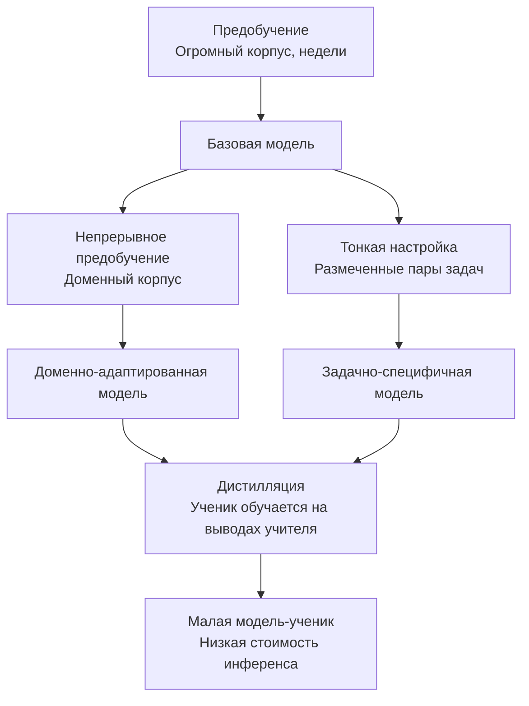
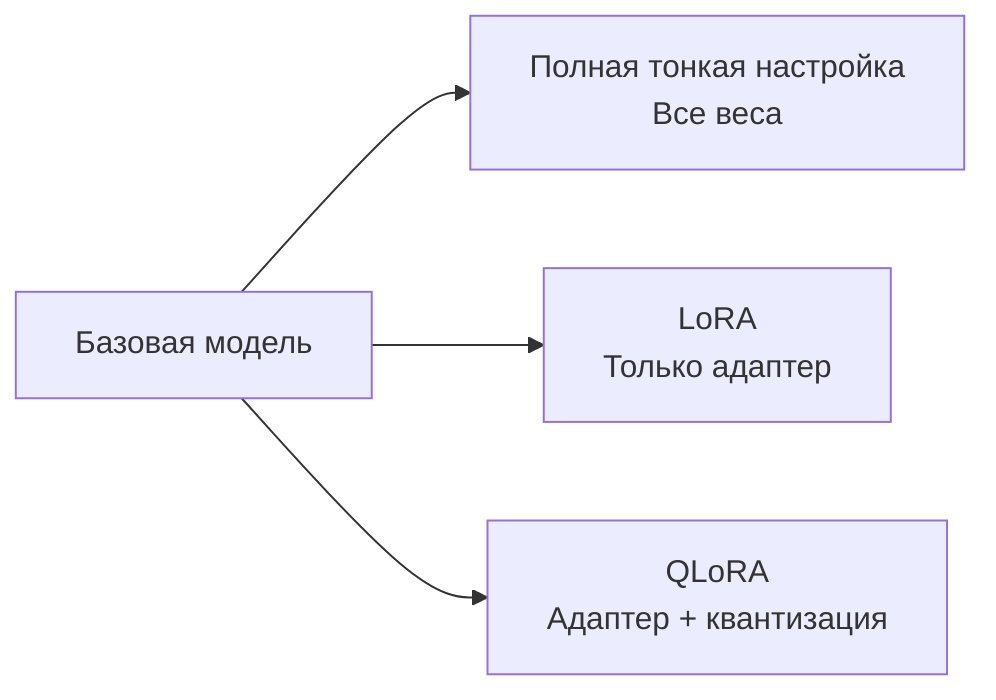
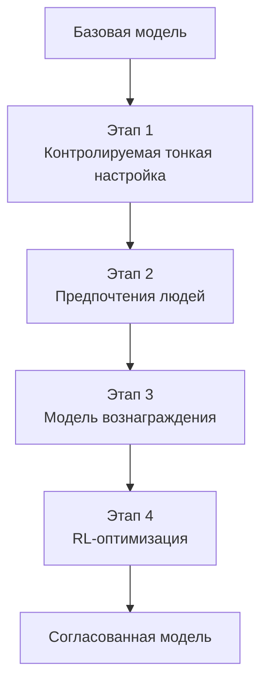
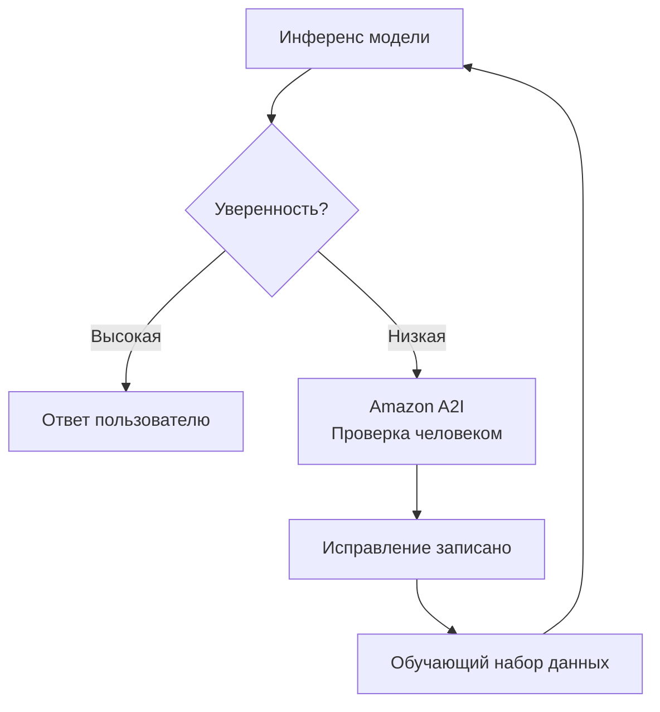
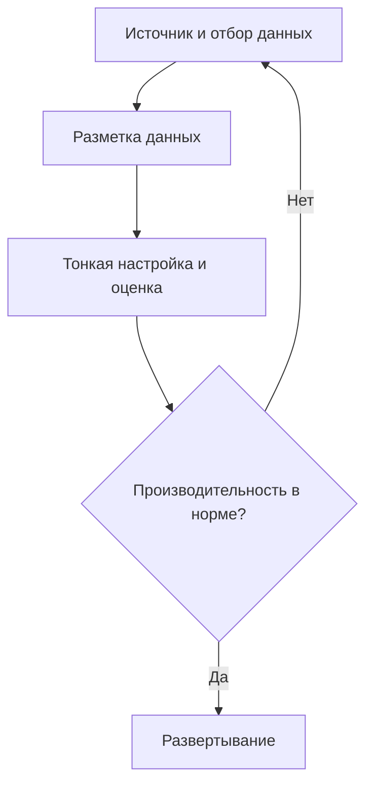

## Задача 3.3: Описание процессов обучения и тонкой настройки базовых моделей

Базовые модели не поставляются готовыми для каждого бизнес-назначения. Они строятся поэтапно, каждый уровень добавляет специфичность по цене, резко возрастающей с амбициями. Понимание того, как модели строятся и адаптируются, — для бизнес-профессионала это прежде всего упражнение по бюджетированию и определению объёма, а не техническое. Знание разницы между предобучением, тонкой настройкой, непрерывным предобучением и дистилляцией позволяет задавать правильные вопросы, когда инженерная команда предлагает проект кастомизации, оценивать предложенные сроки и бюджет, и распознавать, когда более простой подход даст сопоставимые результаты.[^303001]

Три цели в этой задаче следуют логической последовательности. Первая охватывает таксономию техник обучения и их стоимостные профили. Вторая охватывает конкретные методы, применяемые в тех случаях, когда тонкая настройка является правильным выбором. Третья охватывает то, как данные должны быть подготовлены до начала любого задания по тонкой настройке, включая процессы обратной связи от людей, согласующие поведение модели с бизнес-ожиданиями. Вместе они обеспечивают бизнес-спонсору систему для заказа и контроля проекта кастомизации модели без необходимости написания единой строки кода обучения.

### 3.3.1 Ключевые элементы обучения базовой модели

Обучение базовой модели — не единичная деятельность. Это прогрессия этапов, каждый из которых строится на предыдущем, и каждый из которых доступен в качестве точки входа в зависимости от потребностей бизнеса и его возможностей для инвестиций. Экзамен охватывает четыре этапа: предобучение, тонкую настройку, непрерывное предобучение и дистилляцию. Они расположены примерно в порядке убывания стоимости: от самой высокой до самой низкой, и по масштабу изменений: от самого широкого до самого узкого.

Четыре техники — не альтернативы друг другу в том же смысле, в каком тонкая настройка и RAG являются альтернативами. Предобучение создаёт основу. Тонкая настройка и непрерывное предобучение корректируют уже существующее. Дистилляция сжимает результат в меньший пакет. Бизнес может использовать несколько техник последовательно: начать с предобученной модели, предоставленной третьей стороной, применить непрерывное предобучение для обучения доменному словарю, а затем дистиллировать результат для экономически эффективного производственного инференса.

**Предобучение** — это процесс обучения нейронной сети со случайными начальными весами на огромном корпусе текста и других данных.[^303002] Модель обучается статистическим паттернам на миллиардах примеров: грамматике, фактическим ассоциациям, цепочкам рассуждений и связям между концепциями. Предобучение создаёт параметрическую память модели — знания, встроенные в её веса, на которые она может опираться даже при отсутствии внешних документов. Масштаб, необходимый для этого, запретителен для большинства организаций. Обучающий прогон для современной большой языковой модели потребляет тысячи GPU-часов в течение недель или месяцев, требует петабайт отобранных данных и стоит миллионы долларов ещё до того, как модель выдаёт первое связное предложение.[^303003] Предобучение актуально на экзамене как базовая линия, от которой отходят все остальные техники, а не как практический пункт действий для любого бизнеса за пределами крупных исследовательских лабораторий в области ИИ.

**Тонкая настройка** начинается с существующей предобученной модели и продолжает обучение на гораздо меньшем, предметно-ориентированном наборе данных.[^303004] Цель — сместить поведение модели в сторону целевой задачи: отвечать на вопросы клиентского сервиса в определённом тоне, извлекать структурированные поля из медицинских карт или генерировать код во внутреннем фреймворке компании. Тонкая настройка изменяет веса модели, поэтому результирующая модель является отдельным артефактом, который необходимо хранить и обслуживать. Она требует размеченных примеров, как правило, от сотен до десятков тысяч пар «входные данные — вывод», и GPU-вычислений в диапазоне часов до дней, а не недель. **Amazon Bedrock** поддерживает тонкую настройку для подмножества своих размещённых моделей, включая Amazon Nova, Meta Llama и отдельные версии Anthropic Claude Haiku, производя кастомизированную модель, которую затем можно развернуть с выделенной пропускной способностью.[^303005] Тонкая настройка является правильным выбором, когда задача стабильна (целевое поведение не меняется из месяца в месяц), когда бизнес может предоставить достаточное количество размеченных примеров, и когда улучшение производительности оправдывает стоимость обучения и размещения.

**Непрерывное предобучение** (также называемое *continued pre-training*) — это промежуточная техника между предобучением и тонкой настройкой.[^303006] Вместо размеченных пар «входные данные — вывод» непрерывное предобучение использует неразмеченный доменный текст — тот же тип неконтролируемого корпуса, что и при исходном предобучении, но взятый из конкретного домена: медицинской литературы, финансовой отчётности или прецедентного права. Цель — не обучить модель новой задаче, а обучить её доменному словарю, терминологии и фактическим ассоциациям, которые были недостаточно представлены в исходном предобучающем корпусе. Модель, предобученная на общем интернет-тексте, может воспринимать «валовую маржу», «чистую приведённую стоимость» и «EBITDA» как финансовый жаргон, который она распознаёт, но не понимает глубоко в контексте. Непрерывное предобучение на корпусе годовых отчётов, аналитических записок и стенограмм звонков о результатах деятельности улучшает это понимание без необходимости в размеченных парах. Amazon Bedrock поддерживает непрерывное предобучение как опцию кастомизации для отдельных моделей.[^303007]

**Дистилляция** использует иной подход к проблеме стоимости. Вместо обучения меньшей модели с нуля, дистилляция обучает компактную *модель-ученика* имитировать выходные данные более крупной и способной *модели-учителя* на целевом наборе запросов.[^303008] Учитель генерирует ответы на большую коллекцию запросов; эти пары «запрос — ответ» становятся обучающими данными ученика. Ученик учится аппроксимировать качество учителя, не получая доступа к весам учителя. После завершения дистилляции производственный инференс обслуживается учеником, который быстрее и дешевле за каждый вызов, чем учитель. Amazon Bedrock поддерживает дистилляцию модели как управляемый рабочий процесс, позволяя организациям назначить модель Bedrock учителем, указать целевое распределение запросов и получить тонко настроенную меньшую модель в качестве ученика.[^303009] Экономика дистилляции благоприятна для приложений с высоким объёмом, где единовременные затраты на обучение быстро окупаются за счёт экономии на инференсе.

*Рисунок 3.3.1: Иерархия техник обучения базовой модели. Каждая техника строится на существующей модели, а не начинается с нуля; стоимость и требования к данным снижаются слева направо по мере того, как становится богаче отправная точка.*

*Таблица 3.3.1: Сравнение техник обучения и адаптации базовых моделей*

| Техника | Обучающие данные | Вычислительная стоимость | Время до развёртывания | Основной результат | Точка входа AWS |
|---------|-----------------|------------------------|----------------------|-------------------|-----------------|
| Предобучение | Петабайты, неразмеченные | Очень высокая (миллионы GPU-часов) | Месяцы | Модель общего назначения | Неприменима (покупается у поставщика) |
| Непрерывное предобучение | Гигабайты — терабайты, неразмеченные | Средняя (дни) | Дни | Доменный словарь и фактические ассоциации | Кастомные модели Amazon Bedrock |
| Тонкая настройка | Сотни — тысячи размеченных пар | Низкая — средняя (часы) | Часы — дни | Задачно-специфичное поведение и тон | Amazon Bedrock, SageMaker JumpStart |
| Дистилляция | Пары «запрос — ответ», сгенерированные учителем | Средняя (единовременная) | Часы — дни | Малая модель, аппроксимирующая качество большой | Дистилляция модели Amazon Bedrock |

Экзамен нередко предлагает сценарии, в которых спрашивается, какая техника соответствует заданному ограничению. Логика принятия решений такова: если модели нужно усвоить новый словарь или фактический домен без размеченного набора данных — используйте непрерывное предобучение. Если модели нужно усвоить конкретное задачное поведение и размеченные данные доступны — используйте тонкую настройку. Если результирующая модель должна быть дешевле и быстрее при инференсе, а затраты на обучение приемлемы — добавьте дистилляцию. Предобучение является ответом только тогда, когда вопрос явно указывает, что подходящей предобученной модели не существует вовсе, что в реальных бизнес-сценариях практически никогда не бывает.

### 3.3.2 Методы тонкой настройки базовой модели

Тонкая настройка является наиболее обсуждаемой техникой кастомизации в корпоративных ИИ-проектах, поскольку её стоимостной профиль находится в практическом диапазоне, а её результатом является модель, которой организация управляет. В широкой категории тонкой настройки существует несколько отдельных методов, с каждым из которых экзамен ожидает знакомства.

Общей нитью для всех методов тонкой настройки является то, что веса предобученной модели служат отправной точкой, а обучение на предметно-специфичных данных сдвигает эти веса. Различие состоит в формате обучающих данных, части архитектуры модели, которая модифицируется, и конкретной цели обучения.

**Обучение по инструкциям** (instruction tuning) — это тонкая настройка на наборе данных пар «запрос — ответ», где каждый запрос сформулирован как явная инструкция, а каждый ответ демонстрирует желаемое поведение.[^303010] Например, запрос может быть «Резюмируйте следующую жалобу клиента в одном предложении:» с последующим электронным письмом клиента, а ответ — целевым резюме. Модель учится надёжно следовать формату инструкции, а не просто производить правдоподобно звучащий текст в домене. Обучение по инструкциям — это то, что превращает базовую модель, просто предсказывающую следующий токен в последовательности, в модель-ассистент, реагирующую на команды. Большинство коммерчески доступных моделей, описываемых как варианты «chat» или «instruct», уже прошли обучение по инструкциям; тонкая настройка их на дополнительных парах инструкций расширяет эту возможность для конкретной бизнес-задачи или словаря.

**Адаптация моделей для конкретных доменов** описывает общую цель обучения по инструкциям и контролируемой тонкой настройки при применении к профессиональным областям.[^303011] Медицинская организация может выполнить тонкую настройку на шаблонах клинических заметок и примерах диагностического кодирования, чтобы модель производила выходные данные, отформатированные для систем электронных медицинских карт. Юридическая команда может выполнить тонкую настройку на библиотеках договорных положений для улучшения способности модели идентифицировать конкретные типы положений. Компания финансовых услуг может выполнить тонкую настройку на стенограммах звонков о результатах деятельности и аналитических отчётах для улучшения работы модели со специализированной финансовой терминологией. Ключевое требование: обучающие примеры должны точно представлять распределение входных данных, с которыми столкнётся развёрнутая модель; обучение на клинических заметках из одной специальности, а затем использование в другой специальности, приведёт к деградации результатов.

**Трансферное обучение** — более широкая теоретическая концепция, лежащая в основе тонкой настройки.[^303012] Трансферное обучение означает принцип взятия модели, обученной для одной задачи, и повторного использования её усвоенных представлений в качестве отправной точки для другой задачи. В контексте больших языковых моделей каждая операция тонкой настройки является экземпляром трансферного обучения: модель переносит своё общее языковое понимание от предобучения к конкретному доменному домену задачи. Экзамен использует трансферное обучение как зонтичный термин, а тонкую настройку — как конкретную технику. Распознавание того, что вопрос о «применении знаний, усвоенных при одной задаче, для улучшения производительности при другой задаче» описывает трансферное обучение, помогает правильно выбрать ответ.

**Непрерывное предобучение** (рассматривается в разделе 3.3.1) упоминается здесь только для обозначения распространённого двухэтапного паттерна: сначала применить непрерывное предобучение на неразмеченном корпусе для установления доменного словаря и фактического заземления, затем применить обучение по инструкциям на меньшем размеченном наборе данных для обучения задачно-специфичному поведению.[^303013] Двухэтапный подход даёт лучшие результаты, чем любая из техник, используемых по отдельности, когда домен является высокоспециализированным.

**Параметрически-эффективная тонкая настройка** (PEFT) решает одно из основных практических ограничений тонкой настройки: полная тонкая настройка обновляет каждый вес модели, что требует той же пропускной способности памяти и вычислительной мощности, что и обучение модели с нуля.[^303014] PEFT-методы снижают эту нагрузку, замораживая большинство весов модели и обучая только небольшой набор дополнительных параметров. **LoRA** (*Low-Rank Adaptation*) — наиболее широко используемый PEFT-метод. Он вставляет небольшие обучаемые матрицы в определённые слои трансформерной архитектуры; только эти матрицы адаптеров обновляются во время обучения, тогда как исходные веса остаются замороженными.[^303015] Количество обучаемых параметров в конфигурации LoRA может составлять один процент от общего числа параметров модели, соответственно снижая требования к памяти GPU. **QLoRA** (*Quantized LoRA*) сочетает LoRA с *квантизацией*, то есть сжатием весов модели с 32-битных или 16-битных значений с плавающей точкой до 4-битных целых чисел, что позволяет выполнять тонкую настройку моделей, которые иначе не поместились бы на доступном оборудовании.[^303016] Для бизнес-целей LoRA и QLoRA важны тем, что они делают тонкую настройку более крупных высококачественных моделей доступной без необходимости в самых дорогих GPU-инстансах.

*Рисунок 3.3.2: Методы параметрически-эффективной тонкой настройки. LoRA и QLoRA сокращают количество параметров, требующих обновления градиента, делая тонкую настройку доступной на менее мощных аппаратных конфигурациях.*

AWS предоставляет две основные точки входа для тонкой настройки. **Amazon Bedrock** поддерживает тонкую настройку для своих размещённых моделей через управляемый рабочий процесс: клиент загружает обучающий набор данных в **Amazon S3**, настраивает задание тонкой настройки в консоли или API Bedrock, а Bedrock берёт на себя инфраструктуру, обучающий прогон и хранение результирующей кастомной модели.[^303017] Кастомная модель затем доступна для инференса через выделенную пропускную способность, которая резервирует специальную мощность и оплачивается почасово независимо от объёма запросов, или через бессерверный режим для случаев с меньшим объёмом. **Amazon SageMaker JumpStart** предоставляет каталог предобученных моделей с открытым исходным кодом, включая семейства Meta Llama, Mistral и Falcon, вместе с рабочими процессами тонкой настройки в один клик, развёртывающими обучающее задание в управляемую инфраструктуру SageMaker.[^303018] JumpStart подходит, когда бизнес требует модели, которую он может запускать внутри своего AWS-аккаунта на собственных вычислительных ресурсах, не полагаясь на размещённый API Bedrock. Он также поддерживает конфигурации LoRA и QLoRA для моделей, для которых полная тонкая настройка превысила бы доступную память GPU.

*Таблица 3.3.2: Сравнение точек входа AWS для тонкой настройки*

| Возможность | Amazon Bedrock | Amazon SageMaker JumpStart |
|-------------|---------------|---------------------------|
| Доступность моделей | Размещённые в Bedrock модели (Amazon Nova, Meta Llama, отдельные версии Anthropic Claude Haiku) | Модели с открытым исходным кодом (Llama, Mistral, Falcon и другие) |
| Управление инфраструктурой | Полностью управляется AWS | Управляемое обучение и развёртывание на SageMaker |
| Расположение обучающих данных | Amazon S3 | Amazon S3 |
| Поддержка PEFT (LoRA/QLoRA) | Зависит от модели | Поддерживается для совместимых моделей |
| Режим инференса | Выделенная пропускная способность или по требованию | Конечная точка реального времени SageMaker или пакетное преобразование |
| Лучше для | Коммерческих моделей с закрытыми весами и управляемым размещением | Моделей с открытым исходным кодом, полное владение моделью |

Выбор между Bedrock и JumpStart — в первую очередь вопрос владения моделью. Тонкая настройка в Bedrock корректирует поведение размещённой модели, которую AWS продолжает обслуживать; бизнес не владеет результирующими весами. Тонкая настройка в JumpStart производит артефакт модели в собственном S3-бакете клиента, обеспечивая полную переносимость и контроль над весами. Для организаций в регулируемых отраслях, где артефакты моделей должны быть поддающимися аудиту и управляемыми в их собственной среде, JumpStart является предпочтительным путём.

### 3.3.3 Подготовка данных для тонкой настройки базовой модели

Качество данных — наибольшая отдельная переменная в проекте тонкой настройки. Модель, обученная на дефектных данных, надёжно усваивает дефектное поведение. Модель, обученная на отличных данных, может достичь существенного улучшения качества по сравнению с базовой моделью даже при относительно небольшом числе примеров. Процесс подготовки данных включает несколько отдельных видов деятельности, которые необходимо спланировать до начала любого обучающего задания.

**Отбор данных** (curation) — это процесс отбора, фильтрации и очистки примеров для включения в обучающий набор данных.[^303019] Отбор начинается с пула кандидатов, который может включать существующие взаимодействия с клиентами, внутренние документы, размеченные исторические выходные данные или специально созданные примеры, и систематически удаляет элементы, являющиеся неверными, неоднозначными или нерепрезентативными. Конкретные действия по отбору включают удаление дублирующихся примеров (которые могут заставить модель переобучиться на часто встречающихся паттернах), фильтрацию примеров, содержащих фактические ошибки или устаревшую информацию, удаление примеров, слишком коротких для информативности, и балансировку распределения типов примеров, чтобы модель не усвоила искажённую версию задачи. Для наборов данных обучения по инструкциям отбор также означает проверку того, что инструкция и ответ действительно согласованы; набор данных, связывающий вопрос о выставлении счёта с ответом о технической поддержке, научит модель неправильной ассоциации.

**Управление данными** охватывает юридические, этические и операционные меры контроля, применимые к обучающим данным.[^303020] Наиболее выражены три проблемы. Первая — обработка *персональных данных* (PII): обучающие данные должны проверяться на наличие имён, адресов электронной почты, номеров счетов, медицинской информации и других персональных данных. Включение персональных данных в обучающие данные создаёт риск того, что модель воспроизведёт их в ответах, что нарушает нормы конфиденциальности в большинстве юрисдикций. Автоматизированные инструменты обнаружения персональных данных, такие как возможность распознавания сущностей **Amazon Comprehend**, могут проверять документы в масштабе до их попадания в обучающий конвейер.[^303021] Вторая — согласие: данные, используемые для обучения, должны быть собраны на условиях, разрешающих их использование в этих целях. Третья — *происхождение данных*: организация должна иметь возможность отследить каждый обучающий пример до его источника, проверить, что источник лицензирован для использования в обучении, и воспроизвести обучающий набор данных, если аудит соответствия требует этого. Ведение манифеста источников обучающих данных и их происхождения удовлетворяет этому требованию.

**Размер набора данных** для тонкой настройки меньше, чем подсказывали бы интуиции из предобучения, но не является тривиальным.[^303022] Типичное задание обучения по инструкциям для адаптации задачи требует от нескольких сотен до нескольких тысяч высококачественных размеченных примеров для получения измеримого улучшения. Принцип «качество важнее количества» применяется напрямую: пятьсот тщательно отобранных, точных, разнообразных примеров стабильно превосходят пять тысяч примеров, включающих дубликаты, ошибки и нерелевантные элементы. Практический минимум для значимой тонкой настройки обычно находится в диапазоне двухсот — пятисот примеров; ниже этого значения модель не сталкивается с достаточным разнообразием для надёжного обобщения. На верхнем конце улучшения производительности задачи обычно выходят на плато после нескольких тысяч примеров для узко определённой задачи, после чего добавление большего числа данных даёт убывающую отдачу, если только новые примеры не охватывают подлинно новые подсценарии.

**Разметка** — это процесс создания или проверки выходной стороны каждого обучающего примера.[^303023] Для обучения по инструкциям разметка означает написание или проверку целевого ответа для каждого запроса. Качество разметки оказывает несоразмерно большое влияние на результаты тонкой настройки, поскольку модель рассматривает каждый размеченный пример как истину. Ошибки разметки обучают модель неправильному поведению, и модель может обобщить эти ошибки на входные данные, которые она никогда не видела. Согласованные руководства по разметке, проверенные более чем одним аннотатором и разрешаемые при несогласии аннотаторов, являются операционной основой надёжного обучающего набора данных. **Amazon SageMaker Ground Truth** — это управляемый сервис AWS для организации рабочих процессов разметки человеком в масштабе, поддерживающий как встроенные типы задач (классификация изображений, классификация текста, распознавание именованных сущностей), так и пользовательские интерфейсы задач для нужд разметки, специфичных для домена.[^303024] **Amazon SageMaker Ground Truth Plus** расширяет сервис управляемой рабочей силой, предоставляемой AWS, устраняя необходимость напрямую набирать и управлять внешними аннотаторами.[^303025]

**Репрезентативность** — это свойство обучающего набора данных, обеспечивающее совокупное охват примерами распределения входных данных, с которыми действительно столкнётся развёрнутая модель.[^303026] Нерепрезентативный набор данных производит модель со скрытой слабостью: она хорошо работает на входных данных, на которых обучалась, и деградирует на тех, на которых не обучалась. Например, модель клиентского сервиса, обученная исключительно на англоязычных взаимодействиях с пользователями из одного региона, будет плохо работать при глобальном развёртывании для пользователей, чьи формулировки отражают иные культурные конвенции. Репрезентативность требует намеренного построения обучающего набора данных с включением граничных случаев, лингвистического разнообразия, тематической широты и любых подгрупп, которые ожидается обслуживать развёрнутой моделью. Проверка репрезентативности — это непрерывная обязанность; по мере того как распределение входных данных развёрнутой модели меняется со временем, обучающий набор данных может потребовать обновления.

**Обучение с подкреплением на основе обратной связи от людей (RLHF)** — это методология обучения, улучшающая согласование модели с предпочтениями людей, а не только её точность на размеченной задаче.[^303027] Производственные конвейеры RLHF обычно начинаются с разогрева контролируемой тонкой настройкой (SFT), выравнивающей базовую модель по следованию инструкциям до сбора данных о предпочтениях; этот этап SFT показан в первом блоке рисунка 3.3.3. Оставшиеся этапы таковы: аннотаторы-люди ранжируют множественные ответы, сгенерированные моделью на один и тот же запрос, от лучшего к худшему; отдельная *модель вознаграждения* обучается предсказывать эти ранжирования людей (для данных запроса и ответа модель вознаграждения предсказывает оценку, которую присвоил бы аннотатор); основная модель затем тонко настраивается с использованием алгоритма *обучения с подкреплением*, конкретно *Proximal Policy Optimization* (PPO) в исходной формулировке, с сигналом обучения от модели вознаграждения.[^303028] Модель учится генерировать ответы, которые модель вознаграждения оценивает высоко, что соответствует ответам, предпочитаемым аннотаторами. RLHF — это техника, трансформировавшая базовые большие языковые модели в полезных ассистентов, следующих инструкциям, которыми большинство людей пользуются сегодня; это этап обучения, обучающий модель быть полезной, а не просто беглой.

*Рисунок 3.3.3: Конвейер RLHF. Данные о предпочтениях людей обучают модель вознаграждения, которая затем направляет обучение с подкреплением для согласования основной модели с предпочтениями аннотаторов.*

**Amazon A2I** (**Amazon Augmented AI**) решает связанную, но отдельную проблему: не обучение модели, а непрерывный контроль человеком выходных данных модели в производстве.[^303029] Там, где RLHF собирает оценки людей для улучшения весов модели, A2I направляет конкретные выходные данные инференса к рецензентам-людям, когда уверенность модели падает ниже порогового значения или когда тип задачи требует надзора человека. Например, рабочий процесс обработки финансовых документов может отправлять каждый вывод, где уверенность модели ниже 90%, в очередь рецензентов-людей, при этом исправления рецензентов возвращаются в будущий цикл тонкой настройки. A2I интегрируется с моделями SageMaker и поддерживает пользовательские интерфейсы задач для проверки людьми, что делает его естественным дополнением к Ground Truth в сквозном маховике данных.

*Рисунок 3.3.4: Маховик данных с участием человека. Amazon A2I направляет выходные данные с низкой уверенностью к рецензентам-людям; исправления возвращаются через Ground Truth в следующий цикл тонкой настройки, непрерывно улучшая модель.*

*Таблица 3.3.3: Действия по подготовке данных и инструменты AWS*

| Действие | Что решает | Инструмент или сервис AWS |
|----------|-----------|--------------------------|
| Обнаружение и удаление персональных данных | Соответствие требованиям конфиденциальности, управление данными | Распознавание сущностей Amazon Comprehend |
| Разметка людьми в масштабе | Создание размеченного набора данных, качество разметки | Amazon SageMaker Ground Truth |
| Управляемая рабочая сила по разметке | Подбор аннотаторов и управление ими | Amazon SageMaker Ground Truth Plus |
| Проверка людьми выходных данных модели | Непрерывный контроль качества, сбор обратной связи | Amazon Augmented AI (A2I) |
| Хранение обучающих данных | Безопасный, масштабируемый ввод для заданий обучения | Amazon S3 |
| Выполнение обучающего задания | Вычисления и оркестрация тонкой настройки | Кастомные модели Amazon Bedrock, SageMaker JumpStart |

Процесс подготовки данных для проекта тонкой настройки является итеративным, а не линейным. Исходный набор данных отбирается, модель обучается, её выходные данные оцениваются, ошибки диагностируются, и обучающие данные корректируются или дополняются перед следующим обучающим прогоном. Этот цикл обычно повторяется два-четыре раза, прежде чем модель достигает целевого качества. Организации, рассматривающие подготовку данных как единовременную деятельность перед обучением, в итоге повторяют обучающие задания чаще и с более высокими суммарными затратами, чем те, кто с самого начала инвестирует в систематический конвейер данных.

*Рисунок 3.3.5: Сквозной рабочий процесс подготовки данных для тонкой настройки. Отбор данных, разметка и оценка формируют итеративный цикл; пробелы, выявленные при оценке, определяют целевые дополнения к обучающему набору данных.*

Бизнес-спонсор, контролирующий проект тонкой настройки, должен ожидать инвестиций в подготовку данных, примерно равных по времени обучению модели и оценке вместе взятым. Вычислительные затраты на обучение измеримы и нередко называются инженерными командами первыми; трудовые затраты на подготовку данных систематически недооцениваются, особенно когда разметка требует экспертов предметной области (врачей, юристов, финансовых аналитиков), а не аннотаторов общего профиля. Бюджетирование обеих половин усилий заранее даёт более надёжные планы проектов.

## Вопросы для самопроверки

**Вопрос 1.** Медицинская компания хочет использовать базовую модель для помощи врачам в клинической документации. У компании есть большой архив де-идентифицированных клинических заметок, но нет размеченных пар «вопрос — ответ». Основная слабость модели — незнакомость с медицинской терминологией. Какая техника кастомизации НАИБОЛЕЕ подходит в качестве первого шага?

A. Тонкая настройка модели на парах «инструкция — ответ», взятых из клинических заметок.
B. Непрерывное предобучение модели на неразмеченном архиве клинических заметок.
C. Дистилляция модели в меньшую модель-ученика с использованием сгенерированных врачами запросов.
D. Обучение в контексте путём вставки клинических заметок в каждый запрос во время выполнения.

**Пояснение:** Сценарий имеет две определяющие особенности: существует большой неразмеченный корпус, и основная слабость — доменный словарь, а не задачное поведение. Непрерывное предобучение (ответ B) разработано именно для этой ситуации. Оно использует неразмеченный доменный текст для обучения модели терминологии и фактическим ассоциациям из целевого домена без необходимости в размеченных примерах. Это правильный первый шаг перед любым обучением по инструкциям. Тонкая настройка на парах «инструкция — ответ» (ответ A) потребует размеченного набора данных, которого у компании ещё нет, и не устранит корневой словарный пробел так эффективно, как неконтролируемое обучение на необработанных заметках. Дистилляция (ответ C) производит меньшую модель, имитирующую вывод учителя; она не устраняет напрямую слабости доменного словаря и требует способной модели-учителя в качестве отправной точки. Обучение в контексте (ответ D) не может масштабироваться до необходимого уровня охвата домена и потребляет пространство контекстного окна, которое в противном случае могло бы переносить фактические клинические данные пациента. Правильная последовательность для этой организации: сначала непрерывное предобучение, затем обучение по инструкциям после того, как будет доступен размеченный набор данных.[^303030]

---

**Вопрос 2.** Инженерная команда предлагает выполнить тонкую настройку модели с 70 миллиардами параметров с открытым исходным кодом с использованием SageMaker JumpStart. Доступный GPU-инстанс имеет 24 ГБ VRAM. Команда оценивает, что полная тонкая настройка потребует примерно 140 ГБ памяти GPU. Какая техника параметрически-эффективной тонкой настройки НАИБОЛЕЕ подходит для этого ограничения?

A. Обучение по инструкциям с большим шаблоном запроса для компенсации разрыва в параметрах.
B. QLoRA, сочетающий обучение матриц адаптеров с 4-битной квантизацией для снижения требований к памяти.
C. Непрерывное предобучение на неразмеченном корпусе базовой модели, снижающее количество обучаемых параметров.
D. Дистилляция, сжимающая модель с 70 миллиардами параметров до размещения в 24 ГБ.

**Пояснение:** Ограничение — память GPU: полная тонкая настройка требует 140 ГБ, но доступно только 24 ГБ. QLoRA (ответ B) решает эту проблему напрямую. Он применяет 4-битную квантизацию к замороженным весам базовой модели, кардинально снижая их объём памяти, и затем обучает только небольшие матрицы адаптеров LoRA поверх них. Суммарное требование к памяти квантизованной базовой модели плюс адаптеры LoRA обычно легко укладывается в VRAM одного GPU даже для крупных моделей. Обучение по инструкциям с большим шаблоном запроса (ответ A) — это подход к форматированию данных, а не техника снижения памяти; он никак не повлияет на требования к памяти GPU. Непрерывное предобучение (ответ C) — это отдельная техника, обновляющая все веса с использованием неразмеченного доменного текста; оно не решает проблему ограничений памяти GPU и потребовало бы ещё больше памяти, чем контролируемая тонкая настройка, которую команда пытается выполнить. Дистилляция (ответ D) — это отдельная техника, создающая новую меньшую модель; она не сжимает существующую модель для работы на меньшем оборудовании так, как это делает QLoRA, и сама потребовала бы способного учителя для генерации обучающих данных, а не производства тонко настроенной модели с 70B параметрами, которую хочет команда.[^303031]

---

**Вопрос 3.** Компания выполнила тонкую настройку базовой модели для клиентской поддержки и хочет непрерывно её улучшать на основе реальных производственных взаимодействий. Команда планирует направлять ответы модели ниже порога уверенности к рецензентам-людям и включать проверенные исправления в следующий цикл обучения. Какой сервис AWS НАИБОЛЕЕ непосредственно разработан для поддержки шага маршрутизации проверки людьми?

A. Amazon SageMaker Ground Truth.
B. Amazon Comprehend.
C. Amazon Augmented AI (A2I).
D. Amazon SageMaker JumpStart.

**Пояснение:** Amazon Augmented AI (A2I) (ответ C) — это сервис, специально разработанный для направления производственных выходных данных инференса к рецензентам-людям при выполнении определённых условий, таких как падение оценки уверенности модели ниже порогового значения. Он управляет очередью рецензентов, интерфейсом задачи и выводом проверенных решений. Это именно тот шаг, описанный в вопросе. Amazon SageMaker Ground Truth (ответ A) используется для создания размеченных обучающих наборов данных через организованные рабочие процессы разметки людьми; это инструмент для шага регистрации исправлений и будущей тонкой настройки в маховике, а не для маршрутизации живых производственных выходных данных к рецензентам. Amazon Comprehend (ответ B) — это сервис обработки естественного языка, используемый для таких задач, как анализ тональности и извлечение сущностей; он не направляет выходные данные модели на проверку. Amazon SageMaker JumpStart (ответ D) — это сервис обучения и развёртывания моделей; он не предоставляет возможность маршрутизации проверки людьми для выходных данных производственного инференса. Правильный ответ — A2I для шага маршрутизации проверки, при этом Ground Truth используется на последующем шаге для преобразования проверенных исправлений в размеченный обучающий набор данных.[^303032]

---

**Вопрос 4.** Компания, предоставляющая юридические услуги, хочет выполнить тонкую настройку модели на внутренних данных контрактов. Юридическая команда обеспокоена тем, что обучающий набор данных может включать персональные данные из реальных клиентских контрактов. Какой подход НАИЛУЧШИМ образом решает эту проблему до начала обучающего задания?

A. Использовать Amazon SageMaker JumpStart для применения LoRA, что предотвращает запоминание моделью конкретных данных клиентов.
B. Применить распознавание сущностей Amazon Comprehend для обнаружения и удаления персональных данных из обучающего корпуса.
C. Использовать Amazon Bedrock Guardrails во время инференса для предотвращения появления персональных данных в ответах модели.
D. Ограничить набор данных тонкой настройки контрактами, составленными менее пяти лет назад.

**Пояснение:** Проблема в том, что персональные данные могут присутствовать в обучающих данных до запуска обучающего задания. Правильный подход — обнаружить и удалить персональные данные из обучающего корпуса на этапе подготовки данных (ответ B). Возможность распознавания сущностей Amazon Comprehend может идентифицировать имена, адреса, номера счетов и другие категории персональных данных в масштабе в больших коллекциях документов, обеспечивая автоматизированную проверку до обучения. LoRA (ответ A) снижает количество обучаемых параметров, но не предотвращает обучение модели паттернам, присутствующим в обучающих данных, включая персональные данные; параметрически-эффективная тонкая настройка является оптимизацией вычислений, а не мерой управления данными. Amazon Bedrock Guardrails (ответ C) фильтрует выходные данные модели во время инференса, что является полезной глубокоэшелонированной защитой, но не решает корневую проблему того, что модель обучалась на персональных данных и может их усвоить. Ограничение по возрасту контракта (ответ D) решает проблему актуальности данных, но не имеет отношения к наличию в контрактах персональных данных; старые и новые контракты одинаково могут содержать конфиденциальную информацию клиентов. Правильный ответ — проверка и санация обучающего корпуса до начала обучения.[^303033]

---

**Вопрос 5.** Компания завершила тонкую настройку модели для обработки страховых претензий. В ходе оценки модель отлично справляется с простыми претензиями, но плохо — с претензиями, включающими нестандартные обстоятельства. Инженерная команда подозревает, что обучающий набор данных недостаточно представляет граничные случаи. Какое действие НАИБОЛЕЕ непосредственно решает эту проблему репрезентативности?

A. Увеличить количество эпох обучения, чтобы дать модели больше времени на изучение граничных случаев.
B. Применить QLoRA для снижения требований к памяти, что освободит вычислительные ресурсы для более разнообразного обучения.
C. Дополнить обучающий набор данных дополнительными примерами, специально охватывающими недостаточно представленные типы граничных случаев.
D. Перейти с тонкой настройки Amazon Bedrock на SageMaker JumpStart для получения доступа к более крупной модели.

**Пояснение:** Корневая причина — пробел репрезентативности в обучающих данных: граничные случаи присутствуют в производстве, но отсутствуют или крайне недостаточно представлены в обучающем наборе. Правильное действие — дополнить обучающий набор данных дополнительными примерами, охватывающими эти конкретные граничные случаи (ответ C). Это непосредственно устраняет несоответствие распределений. Увеличение эпох обучения (ответ A) обучает модель больше раз на тех же данных; если эти данные не включают граничные случаи, большее количество эпох не научит модель их обрабатывать и может вызвать переобучение на представленных примерах. QLoRA (ответ B) является оптимизацией памяти для тонкой настройки; он не влияет на распределение обучающих данных или охват граничных случаев моделью. Переход на SageMaker JumpStart или более крупную модель (ответ D) может увеличить ёмкость модели, но более крупная модель, обученная на том же наборе данных с дефицитом репрезентативности, всё равно будет плохо справляться с граничными случаями; ёмкость модели здесь не является ограничением, таковым является охват обучающих данных. Правильный ответ непосредственно следует из принципа репрезентативности: исправьте распределение данных, чтобы оно соответствовало целевому распределению входных данных.[^303034]

[^303001]: AWS Certification. AI Practitioner (AIF-C01) Exam Guide v1.1, Task Statement 3.3. URL: <https://docs.aws.amazon.com/aws-certification/latest/ai-practitioner-01/ai-practitioner-01-domain3.html>
[^303002]: Bommasani, R., et al. On the Opportunities and Risks of Foundation Models (Stanford CRFM, 2021). URL: <https://arxiv.org/abs/2108.07258>
[^303003]: Patterson, D., et al. Carbon Emissions and Large Neural Network Training (2021). URL: <https://arxiv.org/abs/2104.10350>
[^303004]: Howard, J., and Ruder, S. Universal Language Model Fine-tuning for Text Classification (ULMFiT, 2018). URL: <https://arxiv.org/abs/1801.06146>
[^303005]: Amazon Bedrock. Fine-tuning foundation models in Amazon Bedrock. URL: <https://docs.aws.amazon.com/bedrock/latest/userguide/custom-models.html>
[^303006]: Amazon Bedrock. Continued pre-training in Amazon Bedrock. URL: <https://docs.aws.amazon.com/bedrock/latest/userguide/custom-models-continued-pretraining.html>
[^303007]: Amazon Bedrock. Customization options for foundation models in Amazon Bedrock. URL: <https://docs.aws.amazon.com/bedrock/latest/userguide/custom-models.html>
[^303008]: Hinton, G., et al. Distilling the Knowledge in a Neural Network (2015). URL: <https://arxiv.org/abs/1503.02531>
[^303009]: Amazon Bedrock. Model distillation in Amazon Bedrock. URL: <https://docs.aws.amazon.com/bedrock/latest/userguide/model-distillation.html>
[^303010]: Wei, J., et al. Finetuned Language Models Are Zero-Shot Learners (FLAN, 2021). URL: <https://arxiv.org/abs/2109.01652>
[^303011]: Amazon Bedrock. Use cases for fine-tuning in Amazon Bedrock. URL: <https://docs.aws.amazon.com/bedrock/latest/userguide/custom-models.html>
[^303012]: Pan, S.J., and Yang, Q. A Survey on Transfer Learning (2010). URL: <https://doi.org/10.1109/TKDE.2009.191>
[^303013]: Amazon Bedrock. Continued pre-training vs. fine-tuning in Amazon Bedrock. URL: <https://docs.aws.amazon.com/bedrock/latest/userguide/custom-models-continued-pretraining.html>
[^303014]: Ding, N., et al. Parameter-Efficient Fine-Tuning of Large-Scale Pre-trained Language Models (2023). URL: <https://arxiv.org/abs/2303.15647>
[^303015]: Hu, E., et al. LoRA: Low-Rank Adaptation of Large Language Models (2021). URL: <https://arxiv.org/abs/2106.09685>
[^303016]: Dettmers, T., et al. QLoRA: Efficient Finetuning of Quantized LLMs (2023). URL: <https://arxiv.org/abs/2305.14314>
[^303017]: Amazon Bedrock. Training data requirements for fine-tuning in Amazon Bedrock. URL: <https://docs.aws.amazon.com/bedrock/latest/userguide/model-customization-prepare.html>
[^303018]: Amazon SageMaker. Amazon SageMaker JumpStart foundation models. URL: <https://docs.aws.amazon.com/sagemaker/latest/dg/studio-jumpstart.html>
[^303019]: Allamanis, M., et al. A Survey of Machine Learning for Big Code and Naturalness (2018). URL: <https://arxiv.org/abs/1709.06182>
[^303020]: NIST. AI Risk Management Framework (AI RMF 1.0), Measure 2.2. URL: <https://airc.nist.gov/RMF>
[^303021]: Amazon Comprehend. Detecting personally identifiable information (PII) using Amazon Comprehend. URL: <https://docs.aws.amazon.com/comprehend/latest/dg/how-pii.html>
[^303022]: Kaplan, J., et al. Scaling Laws for Neural Language Models (2020). URL: <https://arxiv.org/abs/2001.08361>
[^303023]: Northcutt, C., et al. Pervasive Label Errors in Test Sets Destabilize Machine Learning Benchmarks (2021). URL: <https://arxiv.org/abs/2103.14749>
[^303024]: Amazon SageMaker. Amazon SageMaker Ground Truth. URL: <https://docs.aws.amazon.com/sagemaker/latest/dg/sms.html>
[^303025]: Amazon SageMaker. Amazon SageMaker Ground Truth Plus. URL: <https://docs.aws.amazon.com/sagemaker/latest/dg/gtp.html>
[^303026]: Mehrabi, N., et al. A Survey on Bias and Fairness in Machine Learning (2021). URL: <https://arxiv.org/abs/1908.09635>
[^303027]: Ouyang, L., et al. Training language models to follow instructions with human feedback (InstructGPT, 2022). URL: <https://arxiv.org/abs/2203.02155>
[^303028]: Schulman, J., et al. Proximal Policy Optimization Algorithms (2017). URL: <https://arxiv.org/abs/1707.06347>
[^303029]: Amazon Augmented AI. Amazon Augmented AI (Amazon A2I) overview. URL: <https://docs.aws.amazon.com/sagemaker/latest/dg/a2i-use-augmented-ai-a2i-human-review-loops.html>
[^303030]: Amazon Bedrock. Continued pre-training for domain adaptation in Amazon Bedrock. URL: <https://docs.aws.amazon.com/bedrock/latest/userguide/custom-models-continued-pretraining.html>
[^303031]: Dettmers, T., et al. QLoRA: Efficient Finetuning of Quantized LLMs (2023). URL: <https://arxiv.org/abs/2305.14314>
[^303032]: Amazon Augmented AI. When to use Amazon A2I for human review loops. URL: <https://docs.aws.amazon.com/sagemaker/latest/dg/a2i-use-augmented-ai-a2i-human-review-loops.html>
[^303033]: Amazon Comprehend. PII detection and redaction with Amazon Comprehend. URL: <https://docs.aws.amazon.com/comprehend/latest/dg/how-pii.html>
[^303034]: Amazon Bedrock. Preparing training datasets for fine-tuning in Amazon Bedrock. URL: <https://docs.aws.amazon.com/bedrock/latest/userguide/model-customization-prepare.html>
