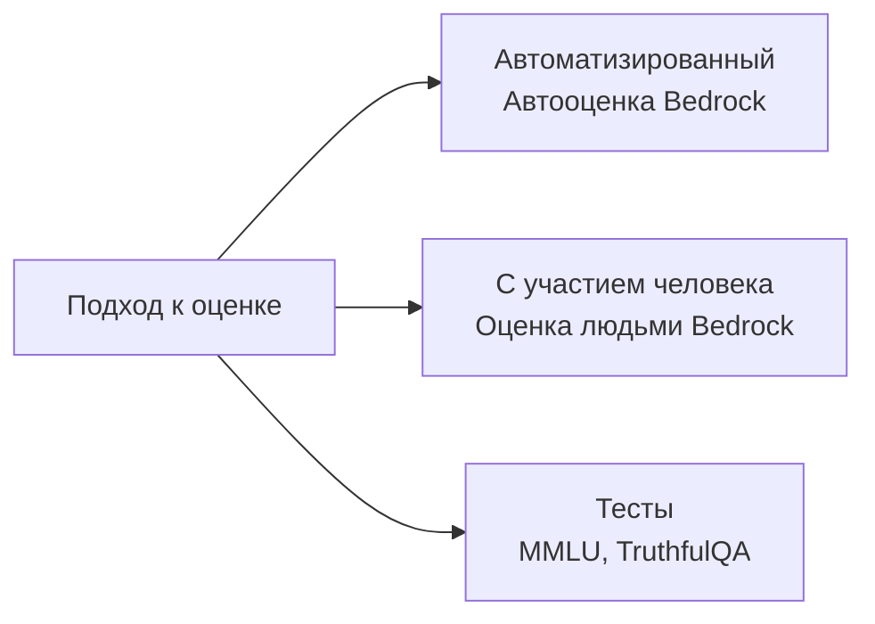
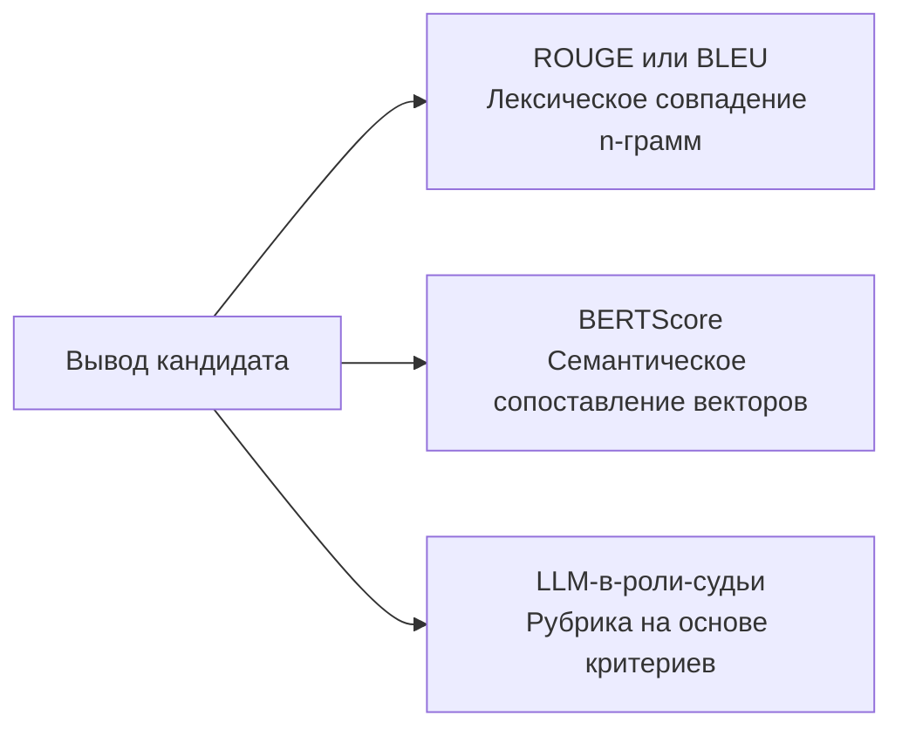
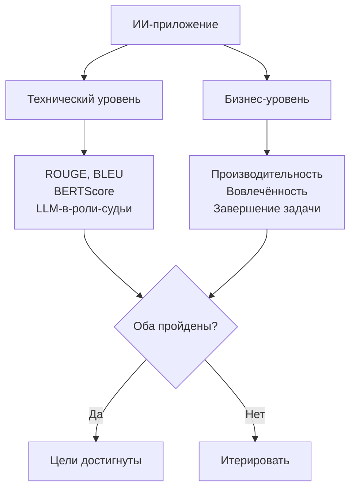
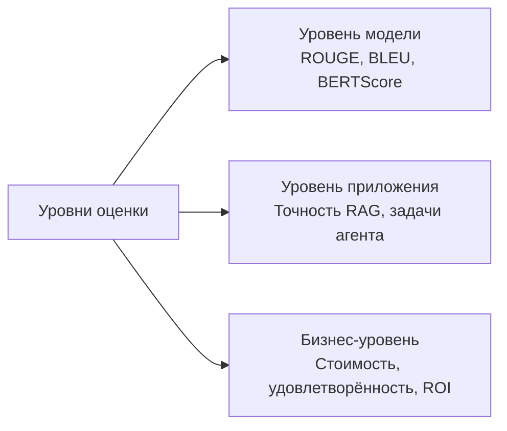

## Тема 3.4. Методы оценки производительности базовых моделей

Запуск приложения на основе базовой модели без структурированного плана оценки — это эквивалент выпуска программного обеспечения без тестирования. Модель может хорошо выглядеть на обобщённых тестах, но при этом не справляться с бизнес-задачей, для которой она создана, или достигать технических целей точности, в то время как пользователи незаметно перестают ею пользоваться. Эта тема охватывает измерение производительности базовых моделей на трёх отдельных уровнях: сама модель, приложение, построенное поверх неё, и бизнес-результат, для достижения которого она была развёрнута.[^304001]

### 3.4.1 Подходы к оценке производительности базовых моделей

Большинство организаций тратят больше времени на выбор базовой модели, чем на оценку того, действительно ли она адекватно работает с их данными и задачами. Эта инверсия обходится дорого. Модель, прошедшая рейтинги общего назначения, всё равно может плохо работать с специализированным словарём, длиной документов или паттернами рассуждений, которые требуют рабочие процессы вашей организации. Оценка должна рассматриваться как первостепенная деятельность, планируемая до развёртывания, а не диагностический прогон после возникновения проблем.

Существует три взаимодополняющих подхода к оценке базовых моделей. Первый использует рецензентов-людей для прямой оценки выходных данных. Второй использует отобранные наборы тестовых данных для измерения производительности на стандартизированных задачах. Третий использует управляемый сервис, **Amazon Bedrock Model Evaluation**, для выполнения как автоматических, так и человеческих оценок в контролируемом, поддающемся аудиту рабочем процессе.[^304002]

**Оценка с участием человека** (human-in-the-loop evaluation) — это практика включения квалифицированных рецензентов-людей в процесс оценки для оценки выходных данных модели по критериям, которые автоматизированные метрики не способны охватить: фактическая корректность по проприетарным темам, уместность тона или безопасность.[^304003] На экзамене этот термин обновлён с «оценки людьми» (human evaluation) до «оценки с участием человека» (human-in-the-loop evaluation) в версии v1.1, чтобы подчеркнуть, что люди не проводят оценку от начала до конца; они встраиваются в конкретных точках суждения в рамках более широкого автоматизированного конвейера.

В производстве встречаются три распространённых паттерна с участием человека:

- **Сравнение «бок о бок»**: рецензенту представляются два вывода модели на один и тот же запрос, и он выбирает лучший, не зная, какая модель что произвела. Это решение устраняет смещение привязки и создаёт относительный рейтинг между версиями модели или моделями-кандидатами. Это стандартный формат сбора предпочтений в исследованиях *обучения с подкреплением на основе обратной связи от людей (RLHF)*.
- **Экспертная проверка**: эксперты предметной области (врачи, юристы, инженеры) оценивают, являются ли выходные данные фактически корректными и доменно-уместными. Работники-обобщённые аннотаторы могут оценивать беглость и тон; доменные эксперты необходимы для оценки корректности в специализированных областях.
- **Оценка по рубрике**: рецензенты оценивают выходные данные по шкале от 1 до 5 по определённым параметрам, таким как релевантность, связность, безопасность и точность ссылок. Оценка по рубрике производит числовые данные, которые можно агрегировать и отслеживать с течением времени.

**Amazon Mechanical Turk** (для аннотирования большого объёма) и **Amazon SageMaker Ground Truth** (для управляемых рабочих процессов разметки) могут обеспечивать рабочую силу рецензентов-людей для этих паттернов.[^304004] **Amazon Augmented AI (A2I)** предоставляет уровень рабочего процесса проверки людьми для размещённых на SageMaker моделей и пользовательских конвейеров инференса: он направляет выходные данные инференса к команде проверки при выполнении определённых разработчиком условий, собирает оценки и возвращает результаты.[^304005] A2I особенно полезен для сценариев производственного мониторинга, где модель обрабатывает тысячи запросов в день и только выборочное подмножество требует проверки людьми. **Amazon Bedrock Model Evaluation** предоставляет собственные задания оценки людьми, настраиваемые с внутренней командой рецензентов или управляемой AWS рабочей силой; этот путь является стандартным для оценки размещённых в Bedrock базовых моделей и рассматривается далее в этом разделе.

Наборы тестовых данных — это стандартизированные коллекции запросов и эталонных ответов, используемые для измерения производительности модели по конкретным параметрам возможностей.[^304006] В литературе, актуальной для экзамена, последовательно встречаются четыре теста:

- **MMLU** (*Massive Multitask Language Understanding*): 57 академических предметов, охватывающих STEM, гуманитарные науки, право и медицину. Тестирует широту общих знаний и рассуждений.[^304007]
- **HellaSwag**: Здравый смысл и завершение предложений. Измеряет, способна ли модель предсказать наиболее правдоподобное продолжение повседневного сценария.[^304008]
- **TruthfulQA**: Вопросы, разработанные для проверки того, даёт ли модель фактически верные ответы по темам, где существуют распространённые заблуждения. Модель, оптимизированная для правдоподобия, а не точности, получит здесь низкий балл.[^304009]
- **HumanEval**: Набор задач по программированию с тест-кейсами, используемый для измерения способности модели к генерации кода. Модель проходит задачу, если произведённый ею код проходит соответствующие модульные тесты.[^304010]

Тесты обеспечивают стандартизированную, воспроизводимую базовую линию между версиями модели и поставщиками, но у них есть хорошо задокументированное ограничение, называемое *насыщением теста*: модели, обученные после публикации теста, могут непреднамеренно поглотить ответы теста через обучающие данные, собранные с помощью веб-краулеров, завышая баллы сверх реальных улучшений возможностей.[^304011] Бизнес-команды должны рассматривать рейтинги тестов как инструмент фильтрации, а не окончательный вердикт.

**Amazon Bedrock Model Evaluation** — это управляемый сервис AWS для выполнения как автоматических, так и человеческих оценок моделей, доступных через Amazon Bedrock.[^304012] Он поддерживает два типа заданий. Задание *автоматической оценки* запускает выбранную модель на встроенном или пользовательском наборе данных запросов и оценивает ответы с использованием таких метрик, как точность, устойчивость и токсичность, без привлечения рецензентов-людей. Задание *оценки людьми* направляет выходные данные модели к рабочей силе рецензентов, настраиваемой как внутренняя команда или управляемая AWS рабочая сила, и собирает их оценки по определённым критериям.[^304013]

Встроенные автоматические метрики в Bedrock Model Evaluation включают точность (для задач ответа на вопросы с эталонным ответом), устойчивость (измеряемую путём возмущения запросов и проверки согласованности вывода) и токсичность (оцениваемую классификатором, помечающим вредоносный или оскорбительный контент).[^304014] Пользовательские наборы данных запросов позволяют организациям оценивать по собственным репрезентативным входным данным, а не опираться на обобщённые наборы данных, сокращая разрыв между производительностью на тестах и производственным поведением.

*Рисунок 3.4.1: Три подхода к оценке базовых моделей. Автоматические метрики, оценка с участием человека и стандартизированные тесты охватывают то, чего не хватает другим; производственные программы, как правило, используют все три в сочетании.*

### 3.4.2 Релевантные метрики для оценки производительности базовых моделей

Выбор правильной метрики зависит от того, что модель призвана производить. Модель резюмирования и модель перевода производят текст, но качество этого текста лучше всего измеряется по-разному. Модель, генерирующая код, лучше всего измеряется тем, правильно ли работает код. Этот раздел охватывает четыре метрики, указанных в экзамене: ROUGE, BLEU, BERTScore и LLM-в-роли-судьи.

**ROUGE** (*Recall-Oriented Understudy for Gisting Evaluation*) измеряет перекрытие между сгенерированным резюме и одним или несколькими эталонными резюме, написанными людьми.[^304015] Наиболее распространённый вариант, ROUGE-L, подсчитывает наибольшую общую подпоследовательность слов между кандидатом и эталоном. Высокий балл ROUGE означает, что модель использовала многие из тех же слов, что и написанный человеком эталон. ROUGE является стандартной метрикой для оценки резюмирования, поскольку резюмирование имеет чёткий критерий успеха: ключевая информация из исходного документа должна присутствовать в резюме.

ROUGE имеет известное ограничение: это поверхностная лексическая мера. Если модель производит резюме «клиент расторгнул соглашение», тогда как эталон говорит «заказчик отменил контракт», баллы ROUGE будут низкими, несмотря на семантическую идентичность двух предложений. По этой причине ROUGE наиболее надёжен, когда эталонные резюме сами разнообразны (охватывают несколько допустимых формулировок) и когда оценочный корпус достаточно велик, чтобы сгладить вариации формулировок в большом числе примеров.

**BLEU** (*Bilingual Evaluation Understudy*) был разработан специально для машинного перевода и измеряет *точность*: какая доля n-грамм (словных последовательностей) в выводе кандидата встречается в эталонном переводе.[^304016] В отличие от ROUGE, ориентированного на полноту, BLEU штрафует кандидатов, производящих короткие выводы для имитации полноты, и добавляет штраф за краткость для дисконтирования чрезмерно коротких переводов. BLEU остаётся стандартной метрикой в тестировании машинного перевода. Его ограничение зеркалит ограничение ROUGE: он поощряет точное совпадение на уровне слов и не может засчитывать перевод, использующий синонимы или реструктурирующий фразы без изменения смысла.

**BERTScore** решает ограничение лексического сопоставления как ROUGE, так и BLEU, используя предобученную модель BERT для вычисления *семантического сходства* между кандидатом и эталоном на уровне токенов.[^304017] Вместо подсчёта точных совпадений слов BERTScore кодирует оба текста в многомерные векторы и измеряет косинусное сходство между соответствующими токенами. Предложение-кандидат, использующее другие слова для выражения того же смысла, получит более высокий балл BERTScore, чем по ROUGE или BLEU. BERTScore более устойчив к перефразированию и всё шире используется в оценке качества резюмирования, перевода и общего качества текста, особенно когда ожидается или желательно разнообразие вывода.

Практический компромисс между тремя метриками состоит в том, что ROUGE и BLEU работают быстро, детерминированы и не требуют дополнительных вызовов инференса, тогда как BERTScore требует запуска кодировщика BERT как на кандидате, так и на эталоне, добавляя вычислительную стоимость и задержку. В крупномасштабных конвейерах автоматизированной оценки команды нередко вычисляют ROUGE и BLEU для скорости и добавляют BERTScore как вторичную проверку на выборочном подмножестве.

**LLM-в-роли-судьи** — это более новый подход, добавленный в руководство по экзамену v1.1, при котором отдельная, высококачественная *модель-судья* оценивает выходные данные тестируемой модели по определённым критериям.[^304018] Судья получает запрос, содержащий исходный вопрос, ответ модели и рубрику оценки, и возвращает оценку или сравнительное суждение о предпочтении. Подход быстрее и дешевле, чем оценка людьми: один вызов инференса модели-судьи заменяет время и стоимость рецензента-человека. Он также масштабируется без рабочей силы рецензентов, что делает его практичным для оценки моделей на десятках тысяч примеров.

Оговорки реальны и важны для ответов на экзамене. LLM-в-роли-судьи имеет три хорошо задокументированных смещения.[^304019] *Позиционное смещение* — это тенденция отдавать предпочтение тому кандидату, который появляется первым в запросе. *Смещение длины* — это тенденция оценивать более длинные ответы выше, даже если точность не изменилась. *Смещение самоулучшения* возникает, когда модель используется для оценки собственных выходных данных: она отдаёт предпочтение тексту, напоминающему её собственный стиль. По этим причинам производственные конвейеры LLM-в-роли-судьи обычно используют модель-судью, отличную от и как правило более крупную, чем оцениваемая модель, чередуют порядок кандидатов в сравнениях «бок о бок» и калибруют выводы судьи по отдельному набору оценок людей.

*Таблица 3.4.1: Сравнение метрик качества вывода базовых моделей*

| Метрика | Доменная область | Что измеряет | Сильные стороны | Ограничения |
|---------|-----------------|-------------|----------------|-------------|
| ROUGE | Резюмирование | Полнота на уровне слов vs. эталон | Быстрая, стандартная, модель не нужна | Штрафует допустимые перефразирования |
| BLEU | Перевод | Точность на уровне слов vs. эталон | Быстрая, стандартная, штраф за краткость | Штрафует допустимые синонимы |
| BERTScore | Общее качество текста | Семантическое сходство через векторные представления BERT | Устойчива к перефразированию | Требует инференса BERT, вычислительные затраты |
| LLM-в-роли-судьи | Любая генеративная задача | Оценка на основе критериев моделью-судьёй | Масштабируемая, гибкие критерии | Позиционное, длиновое и смещение самоулучшения |

*Рисунок 3.4.2: Выбор метрики качества вывода. Лексические метрики быстры, но поверхностны; семантические метрики допускают перефразирование; критериальные метрики гибки, но требуют контроля смещений.*

### 3.4.3 Определение соответствия базовой модели бизнес-целям

Технические метрики отвечают на вопрос «производит ли модель хороший текст?». Бизнес-цели отвечают на другой вопрос: «решает ли модель проблему, для которой она была развёрнута?». Это различие важно, поскольку модель с баллом 0,72 по ROUGE может как улучшать, так и не улучшать производительность аналитиков. Модель с высоким BERTScore для ответов клиентскому сервису может как снижать, так и не снижать частоту эскалации обращений.

Определение того, соответствует ли базовая модель бизнес-целям, требует связи поведения модели с измеримыми результатами, которые важны бизнес-стейкхолдерам. Экзамен выделяет три категории: производительность, вовлечённость пользователей и инженерия задач.

**Производительность** измеряет сэкономленное время или усилия на задачу.[^304020] Юридическая команда, использующая базовую модель для составления резюме контрактов, должна быть способна сообщить, что теперь каждый адвокат тратит 20 минут на проверку резюме, а не 90 минут на ручное составление. Команда инструментов разработки, использующая модель автодополнения кода, должна измерять пропускную способность пул-реквестов или время до первого коммита до и после принятия. Улучшения производительности — наиболее прямой финансовый аргумент для развёртывания базовой модели и лучше всего измеряются через контролируемые пилоты, где группа лечения использует инструмент на основе базовой модели, а контрольная группа — нет.

**Вовлечённость пользователей** охватывает то, действительно ли пользователи используют систему, насколько глубоко они с ней взаимодействуют и возвращаются ли они.[^304021] Релевантные показатели включают сессии на пользователя в неделю, среднюю глубину сессии (количество ходов до того, как пользователь завершает разговор или бросает задачу) и показатель возврата (доля пользователей, снова использующих систему после первой сессии). Данные о вовлечённости сигнализируют о том, решает ли ИИ-приложение проблему, которую пользователи ценят, или они покидают его после плохого первоначального опыта. Базовая модель, производящая технически точные выходные данные, но запутанно сформулированные или реагирующая слишком медленно, будет показывать снижение вовлечённости, даже если её баллы ROUGE стабильны.

**Инженерия задач** — это экзаменационный термин AWS для описания того, действительно ли рабочий процесс на основе базовой модели выполняет бизнес-задачу от начала до конца, без необходимости в человеческой подстраховке с частотой, которая нивелирует выигрыш в эффективности.[^304022] (За пределами материалов AWS та же идея чаще называется *показателем завершения рабочего процесса* или *показателем автономного завершения*.) Бот клиентского сервиса, автономно разрешающий 80% обращений, достигает своей цели инженерии задач, если целевой показатель составлял 75%. Рабочий процесс проверки документов, требующий исправления человеком 60% сгенерированных базовой моделью резюме до архивирования, — нет. Инженерия задач на этом уровне цели фокусируется на рабочем процессе в развёрнутом виде; раздел 3.4.5 вводит *показатель завершения задачи* как версию той же идеи на уровне пользовательской цели, применяемую к тому, выполнена ли базовая бизнес-задача пользователя.

Практическое следствие для экзаменационных сценариев: вопрос, описывающий симптомы «пользователи не возвращаются» или «базовая модель выполняет первый шаг, но человек должен завершить остальное», должен направлять ваше мышление к метрикам вовлечённости и инженерии задач соответственно, а не к ROUGE или BLEU. Модель может быть технически компетентна, но не справляться на уровне рабочего процесса.

*Рисунок 3.4.3: Двойной оценочный фреймворк. Модель должна пройти как технический, так и бизнес-уровни оценки, чтобы считаться готовой к предполагаемому развёртыванию.*

### 3.4.4 Оценка производительности приложений, построенных с использованием базовых моделей

Базовая модель редко развёртывается изолированно. Производственные приложения надстраивают системы извлечения, оркестрацию агентов и многошаговые рабочие процессы поверх базовой модели. Каждый уровень вносит собственные режимы сбоя. Оценка только базовой модели оставляет сбои на уровне приложения невидимыми до тех пор, пока они не всплывут в производственных жалобах.

Экзамен выделяет три архитектуры приложений, каждая из которых требует собственного подхода к оценке: конвейеры RAG, ИИ-агенты и многошаговые рабочие процессы.

**Оценка RAG** разделяется на две независимые проблемы: качество извлечения и качество генерации.[^304023] Качество извлечения измеряет, вернуло ли векторное хранилище нужные документы по запросу пользователя. Качество генерации измеряет, произвела ли модель точный и достоверный ответ на основе полученных документов. Сбой в любой из подсистем производит плохой ответ, но корневая причина и исправление различны.

Качество извлечения обычно измеряется с помощью *precision@k* и *recall@k*, где k — количество извлечённых документов.[^304024] Precision@k задаёт вопрос: из k извлечённых документов, какая доля была действительно релевантной? Recall@k задаёт вопрос: из всех релевантных документов в корпусе, какая доля появилась в топ-k результатах? Система извлечения с высокой точностью, но низкой полнотой находит надёжные документы, но пропускает важные. Система с высокой полнотой, но низкой точностью возвращает всё релевантное, но погребает его в шуме.

Качество генерации для RAG измеряется *заземлённостью* (поддерживается ли ответ модели извлечёнными документами, а не изобретён из параметрической памяти), *достоверностью ответа* (точно ли утверждения в ответе отражают то, что говорят извлечённые документы), и *точностью ссылок* (действительно ли цитируемые источники содержат приписываемую им информацию).[^304025] Такие инструменты, как **Ragas**, предоставляют фреймворк оценки с открытым исходным кодом, автоматически вычисляющий эти метрики путём запуска модели-судьи по извлечённым документам и сгенерированному ответу.[^304026]

**Оценка агентов** измеряет, выполняет ли ИИ-агент назначенные задачи точно, эффективно и по приемлемой стоимости.[^304027] Поскольку агенты выполняют многошаговые планы с использованием внешних инструментов, их оценочная поверхность шире, чем у однозапросной модели. Релевантные метрики включают:

- **Показатель завершения задачи**: процент назначенных задач, которые агент выполняет без вмешательства человека или выхода в состояние ошибки.
- **Точность выбора инструмента**: правильно ли агент выбирал инструмент на каждом шаге (актуально, когда агент имеет доступ к нескольким API и правильный выбор детерминирован по описанию задачи).
- **Эффективность шагов**: количество вызовов инструментов, необходимых для выполнения задачи, по сравнению с минимальным числом, которое потребовал бы хорошо спроектированный план. Высокое число шагов предполагает, что агент излишне перепланирует или производит некорректные аргументы инструментов, вызывающие повторные попытки.
- **Стоимость на задачу**: суммарная стоимость инференса и вызовов инструментов для выполнения одной задачи. Это прямая бизнес-метрика для агентов, работающих в масштабе.

Amazon Bedrock предоставляет возможности оценки агентов для Bedrock Agents и агентов, развёрнутых через AgentCore, включая тестовые обвязки, пошаговые трассировки и встроенные задания оценки, согласованные с вышеуказанными метриками агентов; обратитесь к актуальному руководству пользователя Amazon Bedrock за точными названиями функций и объёмом, поскольку оценочная поверхность агентов продолжает развиваться.[^304028]

**Оценка рабочего процесса** применяется к многошаговым конвейерам, объединяющим вызовы базовых моделей, извлечения RAG, бизнес-логику и передачи людям в полный бизнес-процесс.[^304029] Метрики включают сквозной показатель успеха (какая доля экземпляров рабочего процесса завершается без выхода в состояние ошибки или вынужденного перехода к человеку), распределение категорий ошибок (какой шаг наиболее часто производит сбои) и показатель перехода к резервному варианту (как часто рабочий процесс направляется к резервному пути с участием человека).

*Таблица 3.4.2: Метрики оценки по архитектуре приложения*

| Архитектура | Метрики извлечения | Метрики генерации | Бизнес-метрики |
|-------------|-------------------|-----------------|----------------|
| Только базовая модель | Неприменимо | ROUGE, BLEU, BERTScore, LLM-в-роли-судьи | Производительность, вовлечённость |
| Конвейер RAG | Precision@k, Recall@k | Заземлённость, достоверность, точность ссылок | Завершение задачи, удовлетворённость пользователей |
| ИИ-агент | Точность выбора инструмента, эффективность шагов | Корректность ответа, частота галлюцинаций | Показатель завершения задачи, стоимость на задачу |
| Многошаговый рабочий процесс | Неприменимо | Распределение категорий ошибок | Сквозной показатель успеха, показатель перехода к резервному варианту |

*Рисунок 3.4.4: Многоуровневая архитектура оценки. Каждый уровень стека приложения требует собственного подхода к оценке; сбои на любом уровне влияют на бизнес-результат.*

### 3.4.5 Метрики согласования с бизнес-целями для ИИ-приложений

Метрики из раздела 3.4.2 говорят о том, хорошо ли модель производит текст технически. Метрики из раздела 3.4.4 говорят о том, правильно ли работает приложение. Метрики согласования с бизнес-целями отвечают на вопрос, который на самом деле волнует спонсора-руководителя: приносят ли инвестиции в ИИ ценность?

Руководство по экзамену v1.1 добавило это как отдельную цель, сигнализируя о том, что экзамен ожидает от кандидатов понимания разрыва между техническим измерением и бизнес-ответственностью и знания того, какие инструменты закрывают этот разрыв.

**Показатель завершения задачи** — это процент инициированных пользователем задач, которые ИИ-приложение успешно завершает без необходимости для пользователя бросить задачу, обратиться за помощью через другой канал или эскалировать к агенту-человеку.[^304030] Он отличается от показателя завершения задачи агента (раздел 3.4.4) по объёму: завершение задачи агента измеряет, завершил ли уровень оркестрации свой план, тогда как завершение бизнес-задачи измеряет, была ли достигнута базовая цель пользователя. Пользователь, попросивший ИИ забронировать конференц-зал, получивший подтверждение, но впоследствии обнаруживший, что зал уже занят, не испытал завершения задачи с бизнес-точки зрения, даже если все вызовы API агента вернули коды успеха.

Показатель завершения задачи — единственная метрика, наиболее непосредственно связывающая поведение ИИ-приложения с бизнес-обоснованием для развёртывания. Если приложение было развёрнуто для сокращения числа обращений в службу поддержки, достигающих агента-человека, показатель завершения задачи точно измеряет, насколько хорошо оно достигает этой цели. Для экзаменационных сценариев показатель завершения задачи является НАИЛУЧШИМ ответом, когда вопрос спрашивает, как измерить, достигает ли ИИ-приложение своей первичной бизнес-цели.

**Удовлетворённость пользователей** фиксирует, как пользователи воспринимают качество своих взаимодействий с ИИ-приложением.[^304031] Распространённые инструменты включают опросы после взаимодействия (*CSAT*, оценка удовлетворённости клиентов, где пользователи оценивают свой опыт по числовой шкале), *NPS* (Net Promoter Score, который спрашивает, порекомендовал бы пользователь приложение коллеге) и встроенную обратную связь (оценки «нравится/не нравится», собираемые в конце каждого ответа). В отличие от показателя завершения задачи, являющегося объективной мерой того, что произошло, удовлетворённость пользователей — субъективная мера того, как пользователь это воспринял. Необходимы обе. Ассистент для авансовых отчётов, разрешающий подачи в два клика, но использующий краткий тон, может видеть падение CSAT ниже 3,5, даже когда показатель завершения задачи остаётся выше 90%; пользователи обратятся к другому инструменту, когда такой появится.

**Стоимость на взаимодействие** измеряет суммарные облачные и лицензионные затраты на обработку одного пользовательского запроса через весь стек приложения: от вызова API до шага извлечения (при наличии), вызова инференса базовой модели и любой последующей обработки.[^304032] В конвейере RAG стоимость на взаимодействие включает вызов модели векторного представления, операцию векторного поиска и вызов генерации базовой модели. В рабочем процессе агента она включает каждый вызов инструмента и шаг инференса в плане. Стоимость на взаимодействие должна отслеживаться по отношению к выручке или ценности на взаимодействие для определения того, являются ли юнит-экономика приложения жизнеспособной в масштабе. Приложение стоимостью $0,05 на взаимодействие, генерирующее $0,10 измеренной ценности (например, через экономию на дефлекции обращений), является устойчивым. Приложение стоимостью $0,08 на взаимодействие при той же ценности $0,10 оставляет мало маржи для инфраструктурного резерва.

Отслеживание этих метрик требует связи телеметрии ИИ-приложения с уровнем бизнес-аналитики. **Amazon CloudWatch** собирает операционные метрики, журналы и трассировки из Amazon Bedrock и кода приложения, включая задержку, частоту ошибок и количество вызовов на модель.[^304033] Эти операционные сигналы можно объединить с событиями уровня приложения (задача завершена, пользователь поставил «не нравится», стоимость взаимодействия записана) для построения полной картины. **Amazon QuickSight** подключается к данным CloudWatch и другим источникам данных для создания дашбордов, представляющих показатель завершения задачи, тенденции удовлетворённости пользователей и стоимость на взаимодействие в форматах, доступных бизнес-стейкхолдерам, не читающим графики метрик CloudWatch напрямую.[^304034]

*Таблица 3.4.3: Метрики согласования с бизнесом для ИИ-приложений*

| Метрика | Что измеряет | Источник данных | Стейкхолдер | Решение, которое информирует |
|---------|-------------|----------------|-------------|------------------------------|
| Показатель завершения задачи | Достигаются ли цели пользователя | Журналы событий приложения | Продукт, операции | Скорректировать объём или логику резервного варианта |
| Удовлетворённость пользователей (CSAT, NPS) | Восприятие пользователем качества | Опросы после взаимодействия, оценки «нравится/не нравится» | Продукт, CX | Улучшить качество ответов или UX |
| Стоимость на взаимодействие | Юнит-экономика доставки ИИ | Данные CloudWatch о выставлении счетов и вызовах | Финансы, инженерия | Оптимизировать уровень модели, кэширование или рабочий процесс |

Хорошо спроектированная программа оценки непрерывно отслеживает все три бизнес-метрики, а не только при запуске. Показатель завершения задачи может снижаться по мере того, как запросы пользователей отклоняются от паттернов, на которых тестировалась модель. Удовлетворённость пользователей может снижаться по мере того, как новизна проходит и пользователи сравнивают ИИ с улучшенными альтернативами. Стоимость на взаимодействие может расти, если паттерны использования смещаются в сторону более длинных и сложных запросов. Регулярный обзор всех трёх метрик по определённым порогам — это операционная дисциплина, отличающая управляемый ИИ-продукт от прототипа, который был выпущен и забыт.

## Вопросы для самопроверки

**Вопрос 1.** Медицинская организация развёртывает инструмент на основе базовой модели, помогающий медсёстрам извлекать информацию из клинических протоколов. Перед запуском команда хочет проверить, что модель производит фактически точные, доменно-уместные ответы по специализированному медицинскому словарю. Какой подход к оценке НАИБОЛЕЕ подходит для этого требования?

A. Запустить модель на тесте MMLU и принять её, если балл превышает 70%.
B. Использовать Amazon Bedrock Model Evaluation с заданием автоматического обнаружения токсичности.
C. Использовать Amazon Augmented AI (A2I) для направления выходных данных модели к клиническим экспертам для оценки по рубрике.
D. Вычислить баллы BLEU по набору эталонных клинических резюме.

**Пояснение:** Ключевое ограничение в этом сценарии — доменно-специфичная фактическая корректность, оцениваемая людьми, способными судить о клинической точности медицинского ответа. Работники-обобщённые аннотаторы и автоматизированные метрики не могут вынести такое суждение. Ответ C правильный: Amazon A2I поддерживает рабочие процессы оценки с участием человека, которые могут направлять выходные данные определённой группе рецензентов, например, группе клинических медсестёр или врачей, оценивающих ответы по рубрике, охватывающей точность, ясность и уместность. Ответ A неправильный, поскольку MMLU — это обобщённый академический тест; балл 70% по 57 академическим предметам не говорит о том, правильно ли модель обрабатывает запросы по клиническим протоколам, а порог не имеет отношения к требованиям клинической безопасности. Ответ B неправильный, поскольку задание по токсичности измеряет, производит ли модель вредоносный или оскорбительный контент; оно не оценивает клиническую точность. Ответ D неправильный, поскольку BLEU измеряет точность на уровне слов по отношению к эталонному тексту и не фиксирует, верна ли передаваемая клиническая информация; правдоподобно звучащий, но фактически неверный ответ может получить высокий балл по BLEU, если он разделяет словарь с эталоном.[^304035]

---

**Вопрос 2.** Организация сравнивает две базовые модели для задачи резюмирования новостей. Обе модели производят беглый текст. У оценочной команды есть набор из 500 написанных людьми эталонных резюме для тех же статей. Какая метрика НАИБОЛЕЕ подходит в качестве основного оценочного сигнала для этой задачи?

A. BERTScore, поскольку он измеряет семантическое сходство и допускает перефразирование.
B. BLEU, поскольку он разработан для оценки генерации текста по эталонам.
C. ROUGE, поскольку он разработан специально для резюмирования и измеряет полноту ключевого содержимого.
D. LLM-в-роли-судьи, поскольку модель-судья может оценивать связность без эталонного резюме.

**Пояснение:** ROUGE (ответ C) был разработан специально для оценки резюмирования, и его дизайн отражает ключевое требование этой задачи: хорошее резюме должно содержать ключевую информацию из исходного документа, что является проблемой полноты. ROUGE-L, наиболее распространённый вариант, измеряет наибольшую общую подпоследовательность слов между кандидатом и эталоном, поощряя резюме, охватывающие основные пункты в любом порядке. Ответ A технически обоснован как вторичная метрика, но BERTScore требует запуска кодировщика BERT для каждой пары «кандидат — эталон», добавляя вычислительные затраты; он наиболее ценен, когда эталонные резюме используют разнообразный словарь и лексическое перекрытие несправедливо штрафовало бы допустимые перефразирования. Если организация хочет добавить семантическую устойчивость к оценке, BERTScore является уместным дополнением, а не заменой. Ответ B неправильный, поскольку BLEU — это метрика, ориентированная на точность, разработанная для перевода, где важна точная формулировка целевого языка; резюмирование ставит полноту содержания выше точности формулировки. Ответ D неправильный, поскольку LLM-в-роли-судьи наиболее ценен, когда эталонного резюме нет и требуется суждение в человеческом стиле; когда доступны 500 эталонных резюме, эталонные метрики являются более надёжным и воспроизводимым основным сигналом.[^304036]

---

**Вопрос 3.** Компания развернула внутренний инструмент вопросов и ответов на основе RAG три месяца назад. Пользователи сообщают, что инструмент нередко даёт уверенно звучащие ответы, содержащие информацию, не найденную в документах компании. Какая метрика оценки НАИБОЛЕЕ непосредственно идентифицирует этот режим сбоя?

A. Балл ROUGE-L по отношению к написанным людьми эталонным ответам.
B. Балл заземлённости, измеряющий, подкреплены ли ответы извлечёнными документами.
C. Precision@k, измеряющий релевантность топ-извлечённых документов.
D. Показатель завершения задачи, измеряющий, находят ли пользователи инструмент полезным.

**Пояснение:** Описанный симптом (уверенные ответы, содержащие информацию, не найденную в исходных документах) — это признак плохой *заземлённости*: модель генерирует содержимое из своей параметрической памяти, а не из извлечённых документов. Ответ B правильный. Заземлённость оценивается проверкой каждого утверждения в сгенерированном ответе по набору извлечённых документов и оценкой, какая доля утверждений подкреплена хотя бы одним извлечённым документом. Такие инструменты, как Ragas, вычисляют эту метрику автоматически. Ответ A неправильный, поскольку ROUGE-L измеряет словесное перекрытие с человеческим эталонным ответом; он не обнаружит галлюцинированный контент, использующий правдоподобные слова, не находящиеся в эталоне. Ответ C неправильный, поскольку precision@k измеряет качество извлечения, а не генерации; система извлечения может возвращать высокорелевантные документы, в то время как модель всё равно их игнорирует и генерирует из параметрической памяти. Ответ D неправильный, поскольку показатель завершения задачи измеряет, была ли достигнута цель пользователя; описанный симптом может вызывать низкую удовлетворённость без инициирования формального пути сбоя задачи, который отслеживает приложение.[^304037]

---

**Вопрос 4.** Менеджер по ИИ-продукту представляет финансовое обоснование для приложения чата клиентской поддержки на основе базовой модели финансовому директору. Финансовый директор спрашивает об одной метрике, показывающей, является ли приложение финансово устойчивым в масштабе. Какая метрика НАИЛУЧШИМ образом отвечает на этот вопрос?

A. Балл BLEU по корпусу ответов поддержки.
B. Средняя глубина сессии на пользователя.
C. Стоимость на взаимодействие в сравнении с ценностью, доставляемой на взаимодействие.
D. Показатель перехода к агентам-людям.

**Пояснение:** Вопрос финансового директора касается юнит-экономики: доставляет ли каждое взаимодействие ценность, оправдывающую его стоимость? Стоимость на взаимодействие (ответ C) измеряет суммарные облачные и лицензионные расходы на каждый пользовательский запрос через весь стек приложения. При сравнении с измеренной ценностью на взаимодействие (например, средней стоимостью агента-человека, обрабатывающего тот же запрос) она устанавливает, является ли приложение финансово жизнеспособным при текущем и прогнозируемом масштабе использования. Ответ A неправильный, поскольку BLEU — это метрика качества текста; она не имеет отношения к стоимости или финансовой устойчивости. Ответ B (глубина сессии) — это метрика вовлечённости, сигнализирующая о том, находят ли пользователи приложение ценным, но она ничего не говорит финансовому директору о структуре затрат. Ответ D (показатель перехода к резервному варианту) является полезной операционной метрикой, вносящей вклад в понимание экономики, поскольку каждый переход к агенту-человеку влечёт полную стоимость человека вместо стоимости ИИ, но это составной вход в финансовую картину, а не полный взгляд на юнит-экономику, который запрашивает финансовый директор. Стоимость на взаимодействие, напрямую сравниваемая с ценностью на взаимодействие, — это метрика, отвечающая на вопрос финансового директора.[^304038]

---

**Вопрос 5.** Команда оценивает новую версию базовой модели для замены текущей производственной модели. Они хотят определить, производит ли новая модель выходные данные, предпочитаемые рецензентами-людьми, без необходимости для рецензентов знать, какая модель произвела каждый ответ. Какой подход к оценке НАИБОЛЕЕ непосредственно отвечает этому требованию?

A. Запустить обе модели на тесте TruthfulQA и сравнить процентильные рейтинги.
B. Использовать LLM-в-роли-судьи с текущей производственной моделью в качестве модели-судьи.
C. Использовать сравнение людьми «бок о бок» с анонимизацией идентичности модели для рецензентов.
D. Вычислить BERTScore для обеих моделей по одному набору эталонных выходных данных.

**Пояснение:** Требование состоит из двух частей: суждение о предпочтении человека и анонимизация (рецензенты не должны знать, какая модель что произвела). Ответ C — это паттерн оценки с участием человека, специально разработанный для этого случая использования. Сравнение «бок о бок» представляет рецензенту два вывода для одного и того же запроса, рецензент выбирает предпочтительный вывод, и дизайн предотвращает смещение привязки, не маркируя, какая модель что произвела. Это непосредственно создаёт рейтинг предпочтений между двумя версиями модели. Ответ A неправильный, поскольку TruthfulQA — это тест для фактической точности по склонным к заблуждениям темам; он не измеряет предпочтение общего качества вывода, и вопрос не упоминает фактическую точность как критерий. Ответ B неправильный по тонкой, но важной причине: использование текущей производственной модели в качестве модели-судьи вносит смещение самоулучшения; текущая модель будет склонна оценивать выходные данные, похожие на её собственный стиль, выше, делая сравнение несправедливым для новой модели. Ответ D неправильный, поскольку BERTScore вычисляет семантическое сходство с эталонными текстами, а не предпочтение людей между двумя выводами-кандидатами; он не фиксирует качественное суждение, которое ищет команда.[^304039]

---

**Вопрос 6.** Организация запустила ИИ-ассистент по закупкам на основе базовой модели шесть недель назад. Данные об использовании показывают, что 45% пользователей, пробующих ассистента, не возвращаются после первой сессии. Баллы ROUGE модели по тестам резюмирования находятся в верхнем квартиле для своего семейства моделей. Какая бизнес-метрика НАИБОЛЕЕ непосредственно диагностирует, связана ли эта проблема вовлечённости с качеством вывода модели или с дизайном приложения?

A. Удовлетворённость пользователей (CSAT или оценки «нравится/не нравится»), собираемая сразу после каждого взаимодействия.
B. BERTScore, вычисленный по набору эталонных ответов для запросов по закупкам.
C. Показатель завершения задачи, измеряемый журналом событий приложения.
D. Precision@k для уровня извлечения RAG.

**Пояснение:** Сценарий описывает диссоциацию: баллы ROUGE высоки (предполагая хорошее перекрытие текста модели с эталонами), но показатель возврата низок (предполагая, что пользователи не находят приложение достаточно ценным для повторного использования). Для диагностики того, является ли проблема качеством вывода или дизайном приложения, организации нужен сигнал от реальных пользователей, отражающий их субъективный опыт, а не сигнал от автоматизированных метрик перекрытия текста. Удовлетворённость пользователей, собираемая сразу после каждого взаимодействия (ответ A), фиксирует, нашли ли пользователи ответ полезным, точным и представленным так, чтобы захотеть вернуться. Паттерн низкого CSAT при высоком ROUGE указывал бы на то, что эталонные резюме, используемые для оценки ROUGE, не отражают того, что пользователи действительно ценят в контексте закупок, указывая на проблему качества вывода или формулировки. Паттерн умеренного CSAT при низком показателе возврата указывал бы на факторы дизайна приложения (UX, скорость, доверие), а не на саму модель. Ответ B неправильный, поскольку BERTScore — ещё одна автоматизированная метрика качества текста, которая, как и ROUGE, измеряет сходство с эталонами; она не объяснила бы разрыв между техническими баллами и поведением пользователей. Показатель завершения задачи (ответ C) говорил бы о том, завершился ли рабочий процесс, но в этом сценарии он уже производит высокие технические баллы; отсутствующий сигнал — субъективное суждение пользователя о том завершённом взаимодействии, которое фиксирует только CSAT или оценки «нравится/не нравится». Ответ D неправильный, поскольку precision@k диагностирует качество извлечения; хотя плохое извлечение может способствовать плохим ответам, это был бы вторичный шаг расследования после получения данных об удовлетворённости пользователей.[^304040]

---

[^304001]: AWS Certification. AI Practitioner (AIF-C01) Exam Guide v1.1, Task Statement 3.4. URL: <https://docs.aws.amazon.com/aws-certification/latest/ai-practitioner-01/ai-practitioner-01-domain3.html>
[^304002]: Amazon Bedrock. Amazon Bedrock Model Evaluation overview. URL: <https://docs.aws.amazon.com/bedrock/latest/userguide/model-evaluation.html>
[^304003]: Amazon A2I. How Amazon Augmented AI works. URL: <https://docs.aws.amazon.com/sagemaker/latest/dg/a2i-how-it-works.html>
[^304004]: Amazon SageMaker. Amazon SageMaker Ground Truth labeling workflows. URL: <https://docs.aws.amazon.com/sagemaker/latest/dg/sms.html>
[^304005]: Amazon A2I. Use Amazon Augmented AI for human review. URL: <https://docs.aws.amazon.com/sagemaker/latest/dg/a2i-use-augmented-ai-a2i-human-review-loops.html>
[^304006]: Liang, P., et al. Holistic Evaluation of Language Models (HELM, 2022). URL: <https://arxiv.org/abs/2211.09110>
[^304007]: Hendrycks, D., et al. Measuring Massive Multitask Language Understanding (MMLU, 2020). URL: <https://arxiv.org/abs/2009.03300>
[^304008]: Zellers, R., et al. HellaSwag: Can a Machine Really Finish Your Sentence? (2019). URL: <https://arxiv.org/abs/1905.07830>
[^304009]: Lin, S., et al. TruthfulQA: Measuring How Models Mimic Human Falsehoods (2021). URL: <https://arxiv.org/abs/2109.07958>
[^304010]: Chen, M., et al. Evaluating Large Language Models Trained on Code (HumanEval, 2021). URL: <https://arxiv.org/abs/2107.03374>
[^304011]: Kiela, D., et al. Dynabench: Rethinking Benchmarking in NLP (2021). URL: <https://arxiv.org/abs/2104.14337>
[^304012]: Amazon Bedrock. Amazon Bedrock Model Evaluation jobs. URL: <https://docs.aws.amazon.com/bedrock/latest/userguide/model-evaluation-jobs.html>
[^304013]: Amazon Bedrock. Human evaluation using Amazon Bedrock Model Evaluation. URL: <https://docs.aws.amazon.com/bedrock/latest/userguide/model-evaluation-human.html>
[^304014]: Amazon Bedrock. Automatic evaluation metrics in Amazon Bedrock Model Evaluation. URL: <https://docs.aws.amazon.com/bedrock/latest/userguide/model-evaluation-automatic.html>
[^304015]: Lin, C.-Y. ROUGE: A Package for Automatic Evaluation of Summaries (2004). URL: <https://aclanthology.org/W04-1013>
[^304016]: Papineni, K., et al. BLEU: a Method for Automatic Evaluation of Machine Translation (2002). URL: <https://aclanthology.org/P02-1040>
[^304017]: Zhang, T., et al. BERTScore: Evaluating Text Generation with BERT (2019). URL: <https://arxiv.org/abs/1904.09675>
[^304018]: Zheng, L., et al. Judging LLM-as-a-Judge with MT-Bench and Chatbot Arena (2023). URL: <https://arxiv.org/abs/2306.05685>
[^304019]: Wang, P., et al. Large Language Models are not Fair Evaluators (2023). URL: <https://arxiv.org/abs/2305.17926>
[^304020]: Microsoft Research. The Total Economic Impact of GitHub Copilot (2023). URL: <https://resources.github.com/downloads/The-Total-Economic-Impact-of-GitHub-Copilot.pdf>
[^304021]: Amazon CloudWatch. Using Amazon CloudWatch to track user engagement metrics for AI applications. URL: <https://docs.aws.amazon.com/AmazonCloudWatch/latest/monitoring/working_with_metrics.html>
[^304022]: Amazon Bedrock. Evaluating agent task completion in Amazon Bedrock. URL: <https://docs.aws.amazon.com/bedrock/latest/userguide/agents-evaluation.html>
[^304023]: Es, S., et al. RAGAS: Automated Evaluation of Retrieval Augmented Generation (2023). URL: <https://arxiv.org/abs/2309.15217>
[^304024]: Manning, C., et al. Introduction to Information Retrieval: Precision and Recall at k (2008). URL: <https://nlp.stanford.edu/IR-book/>
[^304025]: Es, S., et al. RAGAS: Faithfulness and Answer Relevance Metrics (2023). URL: <https://arxiv.org/abs/2309.15217>
[^304026]: Ragas. Ragas: Evaluation framework for RAG pipelines. URL: <https://docs.ragas.io/>
[^304027]: Amazon Bedrock. Evaluating Amazon Bedrock Agents. URL: <https://docs.aws.amazon.com/bedrock/latest/userguide/agents-evaluation.html>
[^304028]: Amazon Bedrock User Guide. Evaluation capabilities for Bedrock Agents and AgentCore. URL: <https://docs.aws.amazon.com/bedrock/latest/userguide/agents.html>
[^304029]: Amazon Bedrock. Multi-step workflow evaluation with Amazon Bedrock. URL: <https://docs.aws.amazon.com/bedrock/latest/userguide/agents-test.html>
[^304030]: Amazon Bedrock. Measuring task completion in Amazon Bedrock application monitoring. URL: <https://docs.aws.amazon.com/bedrock/latest/userguide/model-evaluation.html>
[^304031]: Amazon Connect. Customer satisfaction scoring and AI contact center metrics. URL: <https://docs.aws.amazon.com/connect/latest/adminguide/metrics-definitions.html>
[^304032]: Amazon Bedrock. Monitoring Amazon Bedrock usage and costs with AWS Cost Explorer. URL: <https://docs.aws.amazon.com/bedrock/latest/userguide/monitoring-overview.html>
[^304033]: Amazon CloudWatch. Monitoring Amazon Bedrock with Amazon CloudWatch. URL: <https://docs.aws.amazon.com/bedrock/latest/userguide/monitoring-cloudwatch.html>
[^304034]: Amazon QuickSight. Getting started with Amazon QuickSight dashboards. URL: <https://docs.aws.amazon.com/quicksight/latest/user/getting-started.html>
[^304035]: Amazon A2I. Setting up a human review workflow with Amazon Augmented AI. URL: <https://docs.aws.amazon.com/sagemaker/latest/dg/a2i-create-flow-definition.html>
[^304036]: Lin, C.-Y. ROUGE: A Package for Automatic Evaluation of Summaries: task applicability (2004). URL: <https://aclanthology.org/W04-1013>
[^304037]: Es, S., et al. RAGAS: Groundedness evaluation for RAG pipelines (2023). URL: <https://arxiv.org/abs/2309.15217>
[^304038]: Amazon Bedrock. Tracking Amazon Bedrock invocation costs per application. URL: <https://docs.aws.amazon.com/bedrock/latest/userguide/monitoring-overview.html>
[^304039]: Zheng, L., et al. Judging LLM-as-a-Judge: bias characteristics and mitigations (2023). URL: <https://arxiv.org/abs/2306.05685>
[^304040]: Amazon CloudWatch. Collecting user feedback events in AI application telemetry. URL: <https://docs.aws.amazon.com/AmazonCloudWatch/latest/monitoring/working_with_metrics.html>
