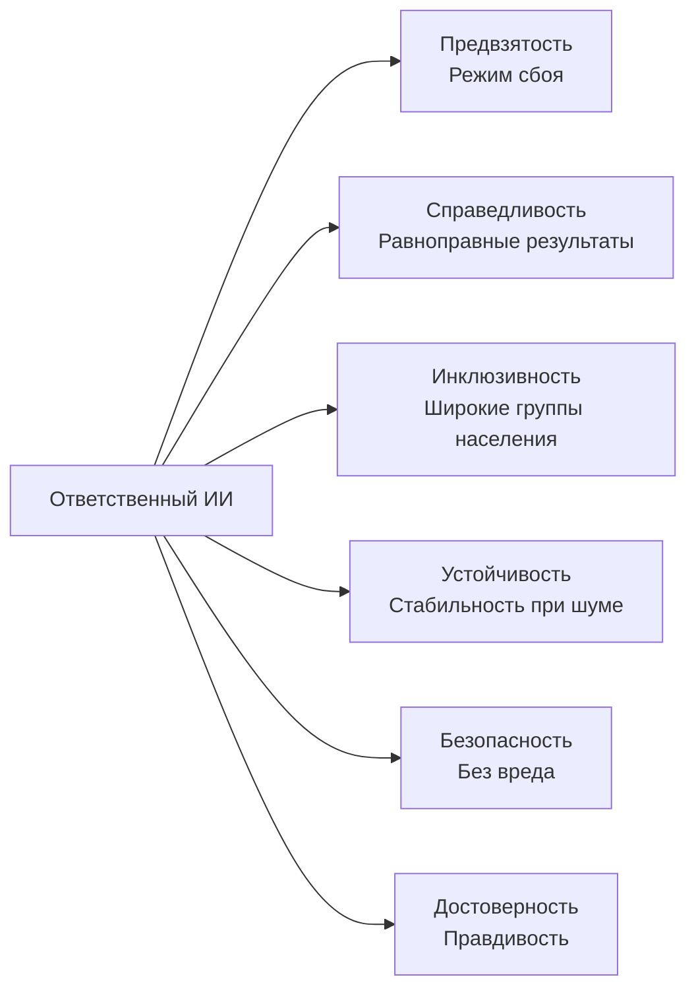
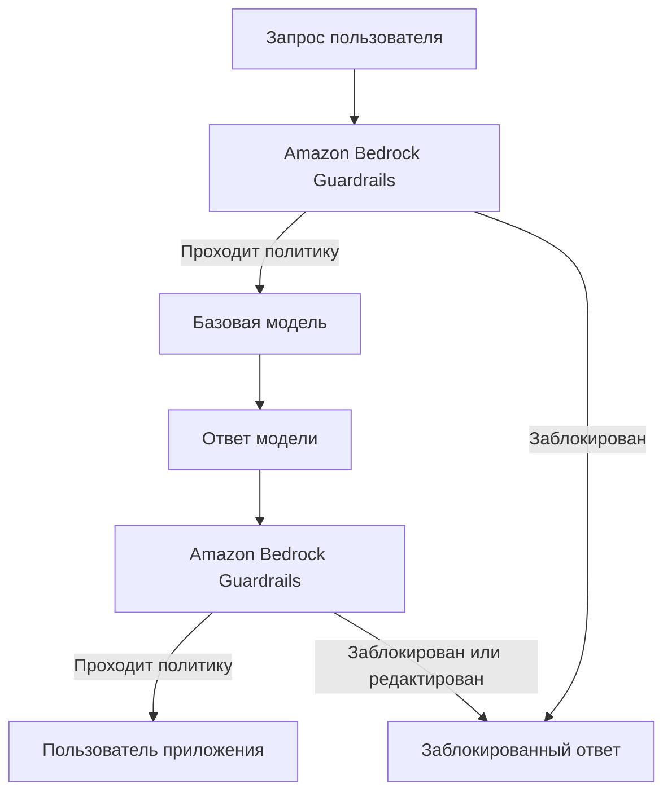
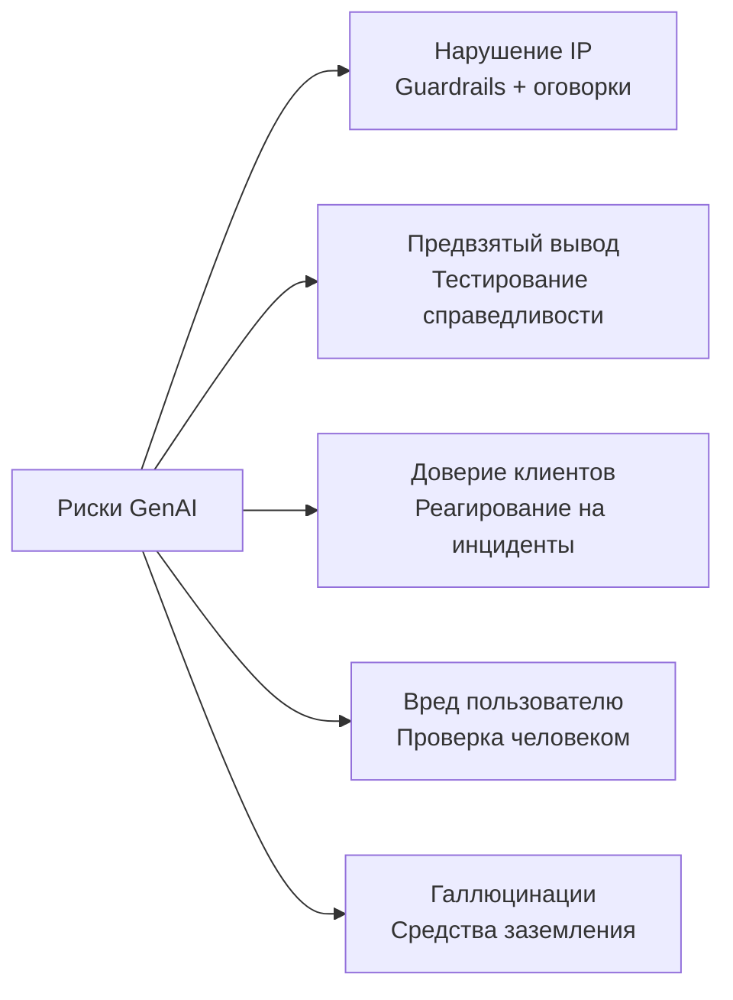
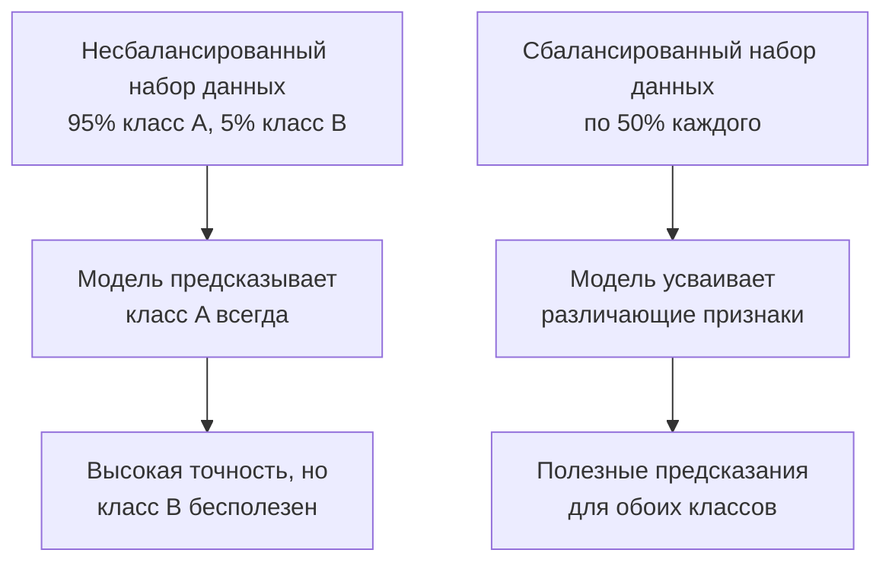
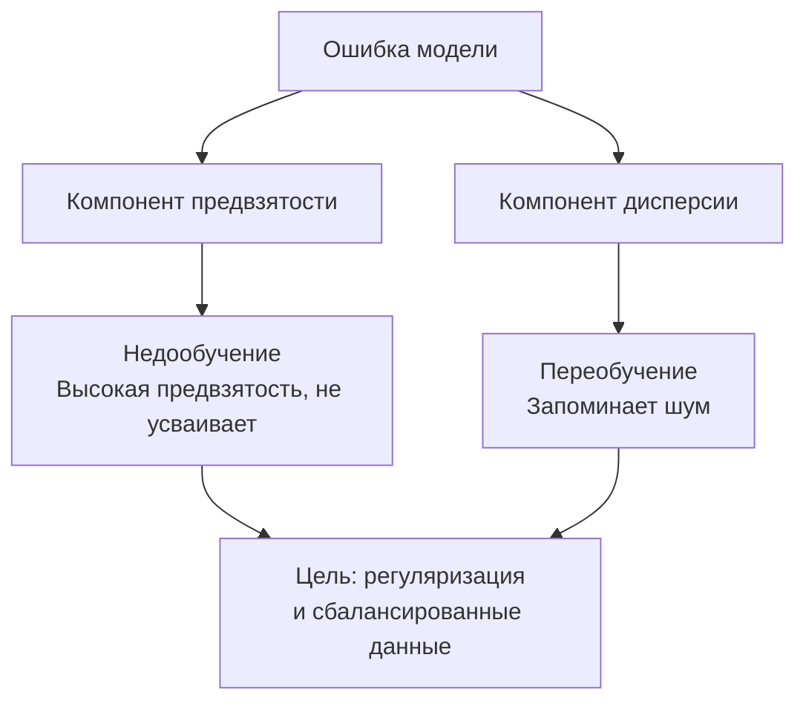

## Тема 4.1. Разработка ответственных ИИ-систем

Ответственный ИИ — это набор инженерных обязательств и обязательств в области управления, определяющих, производит ли ИИ-система справедливые, точные и безопасные выходные данные для всех людей, на которых она повлияет. Эта глава охватывает семь целей Темы 4.1: определяющие признаки ответственного ИИ, инструменты AWS, обеспечивающие и выявляющие эти признаки, ответственные практики выбора модели, правовые риски, специфичные для генеративного ИИ, характеристики наборов данных, поддерживающих ответственные системы, механику предвзятости и дисперсии, а также инструменты мониторинга, поддерживающие ответственное поведение в производстве.[^401001]

### 4.1.1 Признаки ответственного ИИ

ИИ-система не становится ответственной от одного только названия. Ответственность выражается через пять конкретных, проверяемых свойств (справедливость, инклюзивность, устойчивость, безопасность и достоверность), каждое из которых определяется в противовес конкретному режиму сбоя: предвзятости, исключению, хрупкости, вреду или галлюцинации. *Предвзятость* — это режим сбоя, который устраняет справедливость, и руководство по экзамену AIF-C01 v1.1 перечисляет «предвзятость» наряду с пятью позитивными свойствами, поскольку предвзятость — наиболее часто проверяемый паттерн сбоя в сценарных вопросах; в этой книге мы рассматриваем все шесть вместе, чтобы сопоставление «режим сбоя — свойство» было явным.

Свойства различны, но взаимосвязаны. Система может не соответствовать одному, при этом соответствуя другим. Модель кредитного решения может быть устойчива к зашумлённым входным данным, но систематически несправедлива по отношению к защищённой демографической группе. Чат-бот медицинских консультаций может быть безопасным и инклюзивным, но нередко неточным. Вопросы экзамена проверяют, могут ли кандидаты называть и различать эти свойства, поэтому каждое определение важно само по себе.[^401002] Фреймворк управления рисками ИИ NIST группирует эти свойства под тем, что он называет «характеристиками надёжности», и кандидаты на экзамен, распознающие эту формулировку, будут точнее отвечать на сценарные вопросы.[^401050]

Свойства таковы:

- **Предвзятость** (режим сбоя, который устраняет справедливость): систематическое искажение в предсказаниях модели, последовательно благоприятствующее или ставящее в невыгодное положение определённую группу. Например, модель проверки резюме, обученная преимущественно на исторических наймах в мужской отрасли, может оценивать идентичные резюме ниже, когда в начале стоит женское имя. Предвзятость в этом смысле — не случайная ошибка; это предсказуемая и направленная ошибка, концентрирующая вред на конкретных группах населения.[^401003]
- **Справедливость**: последовательное обращение с людьми из разных демографических групп. Модель кредитования справедлива, если она применяет одинаковые критерии принятия решений независимо от расы, пола или возраста заявителя. Справедливость нередко измеряется численно: например, сравниваются коэффициенты одобрения или коэффициенты ложноположительных результатов между группами, чтобы убедиться, что ни одна группа не находится в непропорционально невыгодном положении.[^401004]
- **Инклюзивность**: модель хорошо работает для широкого круга пользователей, включая тех, кто может быть недостаточно представлен в обучающих данных. Модель распознавания изображений, построенная преимущественно на фотографиях светлокожих лиц, может плохо работать для темнокожих пользователей. *Инклюзивность* устраняет этот пробел в охвате, обеспечивая обучение и тестирование модели на всей совокупности людей, которым она будет служить.[^401005]
- **Устойчивость**: плавное, предсказуемое поведение при неожиданных или враждебных входных данных. Чат-бот клиентского сервиса не должен возвращать вредоносный контент при вводе пользователем ошибочно написанного запроса, а модель обнаружения мошенничества не должна терять точность при неожиданном скачке объёмов транзакций. Устойчивость измеряет, насколько хорошо система сохраняет предполагаемое поведение на границах своего входного распределения.[^401006]
- **Безопасность**: модель не причиняет вреда пользователям, третьим лицам или обществу. Безопасность охватывает физические риски (модель, управляющая оборудованием), информационные риски (модель, дающая опасные медицинские советы без оговорок) и системные риски (модель, усиливающая дезинформацию в масштабе). Регуляторы в ЕС явно классифицируют ИИ-системы по уровню риска безопасности и прикрепляют к каждой категории правовые обязательства.[^401007]
- **Достоверность**: модель производит выходные данные, которые правдивы и фактически обоснованы. Это особенно важно для больших языковых моделей, способных генерировать уверенно звучащий текст по темам, где обучающие данные скудны, неполны или устарели. *Галлюцинации* — канонический сбой достоверности: модель придумывает ссылку, статистику или имя и представляет это как факт.[^401008]

*Рисунок 4.1.1: Свойства ответственного ИИ, перечисленные на экзамене. Предвзятость — это режим сбоя, предотвращению которого призваны другие пять позитивных свойств.*

Эти свойства существуют не изолированно. Набор данных, лишённый демографического разнообразия (низкая инклюзивность на уровне данных), будет производить предвзятые предсказания (режим сбоя предвзятости) и создавать несправедливые результаты (нарушение свойства справедливости). Свойства укрепляют друг друга при соблюдении и умножают сбои при нарушении; один и тот же пробел в наборе данных может одновременно вызвать предвзятость, несправедливость и отсутствие инклюзивности.[^401051]

### 4.1.2 Инструменты для выявления признаков ответственного ИИ

Знание шести свойств ответственного ИИ полезно только при наличии практических механизмов для их применения на системном уровне. AWS предоставляет два основных инструмента для этого: **Amazon Bedrock Guardrails** для приложений генеративного ИИ и **Amazon SageMaker Clarify** для классических моделей МО. Каждый из них нацелен на разные точки в конвейере ИИ и разные типы рисков.[^401009]

**Amazon Bedrock Guardrails** применяет настраиваемый уровень политик между приложением и любой базовой моделью, доступной через Amazon Bedrock. Когда пользователь отправляет запрос или когда модель возвращает ответ, Guardrails оценивает контент по настроенной политике и либо пропускает его, либо модифицирует, либо полностью блокирует. Это происходит прозрачно для основной модели, что означает: один и тот же guardrail может защищать несколько моделей без изменения самой модели.[^401010]

Guardrails группирует свои средства управления в несколько типов фильтров:

- **Контентные фильтры**: блокируют или редактируют контент в пяти предопределённых категориях вреда: *ненависть*, *оскорбления*, *сексуальный контент*, *насилие* и *правонарушение*. Каждая категория может быть установлена на пороговое значение от низкого до высокого в зависимости от чувствительности приложения. Детская образовательная платформа установит все пороги на максимальное ограничение; инструмент исследования кибербезопасности может допускать более технический контент.[^401011]
- **Фильтр атак на запросы**: отдельный детектор паттернов джейлбрейка и инъекций запросов во входных данных пользователя, отдельный от вышеуказанных категорий вреда. Это политика, перехватывающая попытки переопределить системный запрос или обойти правила контента.
- **Тематические фильтры**: список запрещённых тем, которые приложение не должно обсуждать. Компания финансовых услуг может настроить Guardrails для отказа от любого ответа, дающего конкретные инвестиционные советы, направляя такие запросы лицензированному советнику. Компания определяет, что считается запрещённой темой, с помощью описаний на естественном языке, а Guardrails использует семантическое сопоставление для перехвата связанных запросов, даже если они сформулированы иначе.[^401012]
- **Словарные фильтры**: блокируют конкретные слова или фразы независимо от контекста, включая встроенный список нецензурных слов, который можно включить без пользовательской настройки. Этот уровень обрабатывает ненормативную лексику, торговые марки конкурентов или внутренние кодовые названия, не должные появляться в ответах клиентам.[^401013]
- **Фильтры чувствительной информации**: обнаруживают персональные данные, такие как имена, номера телефонов, адреса электронной почты, номера социального страхования и номера кредитных карт. Фильтр может либо заблокировать запрос, либо заменить обнаруженное значение заполнителем до того, как ответ достигнет пользователя, помогая организациям соответствовать требованиям минимизации данных по нормам конфиденциальности.[^401014][^401016]
- **Проверки контекстного заземления**: оценивают, заземлён ли ответ модели в предоставленных ей исходных документах (для приложений RAG) и релевантен ли ответ запросу пользователя. Это основной элемент управления достоверностью в Guardrails: он присваивает оценку заземлённости и оценку релевантности и может блокировать ответы, падающие ниже настраиваемых порогов.[^401015]

На концептуальном уровне политика Guardrails читается как структурированный набор правил: «Блокировать язык ненависти на пороге HIGH. Запрещать темы, связанные с инвестиционными советами. Редактировать любой адрес электронной почты в ответах. Требовать оценку заземлённости не менее 0,75 для ответов на основе извлечения.» Архитектор настраивает эти правила один раз и прикрепляет guardrail к любому вызову инференса через Bedrock.[^401053] Guardrails поддерживает независимую оценку как входного запроса пользователя, так и выходного ответа модели, поэтому один guardrail может остановить вредоносный запрос до его достижения модели или заблокировать вредоносный ответ до его достижения пользователя.[^401054]

**Amazon SageMaker Clarify** устраняет предвзятость в классических моделях МО, а не в генеративном ИИ. Он анализирует обучающие данные и предсказания модели для вычисления метрик предвзятости, таких как разница в показателях положительных предсказаний между демографическими группами. Модель кредитного риска, например, может быть протестирована с помощью Clarify для определения того, различаются ли статистически показатели одобрения между возрастными группами или географическими регионами.[^401017]

*Рисунок 4.1.2: Amazon Bedrock Guardrails перехватывает как запрос, так и ответ модели, применяя настроенную политику в каждом направлении трафика.*

### 4.1.3 Ответственные практики выбора модели

Выбор базовой модели или модели МО — не только техническое решение о точности и задержке. Ответственный процесс выбора учитывает экологические затраты модели, её долгосрочную устойчивость и соответствие её размера стоящей задаче.

Обучение и эксплуатация крупных моделей требует значительного *вычислительного следа*: электроэнергии, потребляемой GPU во время обучения, воды, используемой для охлаждения центров обработки данных, и углеродных выбросов, связанных с этим энергопотреблением. Модель, достигающая 95% точности на задаче классификации, но требующая в 10 раз больше вычислительных ресурсов, чем меньшая модель с 93% точности, может быть неответственным выбором, если эти два процента точности не оказывают существенного влияния на бизнес-результат.[^401018]

Ответственный выбор модели следует иерархии. Начните с наименьшей модели, соответствующей порогу точности задачи. Если дистиллированная или квантизованная модель соответствует производительности своего более крупного родителя в вашем конкретном случае использования, предпочтите меньшую модель. Дистиллированные модели — это сжатые версии более крупных моделей, сохраняющие значительную часть возможностей родителя при доле вычислительных затрат. Они существуют для многих моделей, доступных через Amazon Bedrock, и являются правильной отправной точкой для приложений с требованиями к задержке или ограниченным бюджетом.[^401019]

Когда размер модели сопоставим у нескольких кандидатов, рассмотрите *региональное размещение*. Регионы AWS различаются по энергетическому составу. Регионы, ближайшие к возобновляемым источникам энергии (гидроэлектрические, ветровые, солнечные), имеют меньшую углеродную интенсивность на вычислительный час. Размещение рабочей нагрузки в регионе с низким углеродным следом — конкретное действие по устойчивому развитию, которое можно измерить и отчитаться.[^401020]

AWS предоставляет **AWS Customer Carbon Footprint Tool** для помощи организациям в измерении и отслеживании углеродных выбросов, связанных с их использованием AWS. Инструмент разбивает выбросы по сервисам, регионам и временным периодам, предоставляя командам по закупкам и устойчивому развитию данные, необходимые для постановки целей и отслеживания прогресса.[^401021]

Решение о выборе ответственной модели можно свести к набору критериев, применяемых по порядку: соответствует ли меньшая модель порогу точности? Может ли дистиллированная версия выполнить ту же работу? Является ли регион развёртывания низкоуглеродным? Есть ли у поставщика раскрытия через карточку модели об обучающих данных, экологических затратах и предполагаемом использовании? Ответ на эти вопросы перед принятием обязательства по выбору модели — это ответственная практика, которую экзамен ожидает от кандидатов.[^401055]

*Таблица 4.1.1: Критерии ответственного выбора модели*

| Критерий | Вопрос для ответа | Предпочтительный результат |
|----------|------------------|---------------------------|
| Порог точности | Соответствует ли модель минимально требуемой точности? | Наименьшая модель, которая проходит |
| Вычислительная стоимость | Сколько GPU-часов и энергии требует инференс? | Минимальные вычисления при соответствии SLA |
| Размер модели | Доступна ли дистиллированная или квантизованная версия? | Использовать дистиллированную при наличии |
| Углеродная интенсивность региона | Является ли энергетический состав региона низкоуглеродным? | Развёртывание в низкоуглеродном регионе |
| Прозрачность | Публикует ли поставщик карточку модели? | Карточка модели существует и актуальна |

### 4.1.4 Правовые риски работы с генеративным ИИ

Генеративный ИИ вводит категорию правового риска, не существовавшую при традиционном МО, поскольку модель производит новый контент, а не предсказания, основанные на структурированных входных данных. Юридические команды, изучающие развёртывания генеративного ИИ, как правило, поднимают пять областей беспокойства, и бизнес-профессионал, ответственный за надзор за ИИ, должен быть способен описать каждую.

**Иски о нарушении интеллектуальной собственности** возникают потому, что большие языковые модели и модели изображений обучены на огромных корпусах текстов и изображений, собранных из интернета. Большая часть этого контента защищена авторским правом. Когда модель генерирует текст, точно воспроизводящий защищённый авторским правом материал, или когда модель изображений генерирует произведения искусства в стиле живого художника, создатель исходного материала может иметь иск против организации, эксплуатирующей модель. В США и Европе уже был подан ряд исков именно на этом основании.[^401022] Многие коммерческие поставщики базовых моделей включают в свои лицензии *оговорки об ответственности*, переносящие ответственность за IP с клиента обратно на поставщика, но эти оговорки нередко требуют, чтобы клиент использовал модель только в рамках определённых параметров и без модификаций, отменяющих средства защиты.[^401023]

**Предвзятые выходные данные модели** создают правовое воздействие в соответствии с трудовым и гражданским законодательством. Если модель, используемая при найме, кредитовании, жилищном обеспечении или здравоохранении, производит выходные данные, систематически ставящие в невыгодное положение защищённый класс, организация, развёртывающая модель, может столкнуться с исками в рамках фреймворка Комиссии по равным возможностям при трудоустройстве (EEOC) в США или аналогичных органов в других юрисдикциях. Закон ЕС об ИИ классифицирует ИИ-системы, используемые в сфере занятости и кредитования, как *высокорисковые* приложения, которые должны пройти оценку соответствия до развёртывания.[^401024]

**Потеря доверия клиентов** — правовой и репутационный риск, который труднее поддаётся количественной оценке, но не менее реален. Когда происходит широко освещаемый сбой ИИ, например чат-бот клиентского сервиса, дающий оскорбительные ответы, или инструмент медицинских советов, предлагающий вредные методы лечения, организация теряет доверие клиентов. В регулируемых отраслях это доверие нередко несёт договорные и регуляторные аспекты, усугубляя репутационный ущерб возможными регуляторными действиями.[^401025]

**Риск для конечных пользователей** — это риск того, что пользователь будет действовать на основе вывода модели в домене, где ошибки имеют серьёзные последствия. Чат-бот юридических услуг, дающий неверные советы, ассистент медицинской сортировки, неправильно классифицирующий симптом, или инструмент финансового планирования, рекомендующий неподходящие продукты, — каждый из них подвергает развёртывающую организацию искам о профессиональной ответственности и халатности. Организации снижают этот риск, обеспечивая, чтобы в высокорисковых разделах проверка человеком была включена в процесс принятия решений, и отображая чёткие оговорки о консультативном характере вывода ИИ.[^401026]

**Галлюцинации** — это сбой достоверности с прямыми правовыми последствиями. Когда модель с уверенностью утверждает выдуманный факт, пользователь, действующий на основе этого утверждения, может понести вред. Адвокат, подавший юридический бриф, содержащий придуманные ИИ ссылки на дела, получил санкции суда, когда ссылки оказались несуществующими. Организации, развёртывающие генеративный ИИ в правовых, финансовых или медицинских контекстах, должны внедрять средства управления заземлением (как описано в разделе 4.1.2) и документировать эти средства как доказательство должной осмотрительности.[^401027]

Закон ЕС об ИИ, вступивший в силу в августе 2024 года, предусматривает штрафы в размере до 35 миллионов евро или 7% от годового мирового оборота (в зависимости от того, что больше) за нарушения его положений о запрещённых практиках, и до 15 миллионов евро или 3% оборота — за другие нарушения.[^401028] Эти уровни штрафов означают, что один неустранённый сбой ответственного ИИ в контексте, регулируемом ЕС, может превысить общую стоимость разработки самой ИИ-системы.

*Рисунок 4.1.3: Пять категорий правового риска генеративного ИИ и их основные меры снижения. Каждый риск требует разной стратегии контроля.*

### 4.1.5 Характеристики наборов данных

Свойства набора данных, используемого для обучения или тонкой настройки модели, в значительной мере определяют свойства ответственного ИИ результирующей системы. Модель не может научиться справедливо обращаться с демографическими группами, если обучающие данные не содержат примеров из некоторых из этих групп. Характеристики набора данных являются поэтому начальными средствами управления: правильное их выполнение предотвращает проблемы, которые дорого устранять после обучения модели.

Четыре характеристики набора данных непосредственно присутствуют в целях экзамена:

- **Инклюзивность**: набор данных содержит примеры из полного диапазона демографических групп, языков, диалектов и сценариев, с которыми модель столкнётся в производстве. Сбой инклюзивности — это когда модель распознавания речи обучена преимущественно на носителях американского английского, а затем развёртывается глобально, производя высокий уровень ошибок для носителей с акцентами и иностранным произношением.[^401029]
- **Разнообразие**: помимо демографического охвата, набор данных охватывает разнообразные сценарии, граничные случаи и редкие события. Модель обнаружения мошенничества, обученная только на распространённых паттернах мошенничества, пропустит новые методы атак. Разнообразие в этом контексте означает достаточно широкое обучающее распределение для охвата изменчивости реального мира, а не только его наиболее частых паттернов.[^401030]
- **Отобранные источники данных**: данные имеют известное происхождение, были собраны с надлежащим согласием и имеют чёткий статус лицензии. Отобранные данные отслеживаемы: вы можете ответить на вопрос «Откуда взялась эта запись и есть ли у нас право её использовать?» Для генеративного ИИ отбор также означает проверку обучающего контента на наличие токсичного, предвзятого или защищённого авторским правом материала до его попадания в модель.[^401031]
- **Сбалансированные наборы данных**: ни одна метка класса или демографическая группа не представлена настолько сильно, что модель учится предсказывать этот класс как ярлык, а не усваивать базовый сигнал. Несбалансированный набор данных для обнаружения мошенничества может содержать 999 законных транзакций на каждую мошенническую. Модель, обученная на таких данных, может достичь точности 99,9%, просто предсказывая «законно» для всего, при этом полностью не справляясь со своей реальной задачей.[^401032]

*Рисунок 4.1.4: Влияние дисбаланса классов на обучение модели. Несбалансированный набор данных производит модель, максимизирующую общую точность за счёт производительности для класса меньшинства.*

Отобранные источники данных и сбалансированные наборы данных — не взаимоисключающие требования. Сбалансированный набор данных, собранный из плохо источников или без согласия, по-прежнему несёт риски IP и конфиденциальности. Хорошо отобранный набор данных, охватывающий только узкую демографию, по-прежнему производит неинклюзивную модель. Все четыре характеристики должны присутствовать одновременно, чтобы набор данных считался ответственным.[^401057] Закон ЕС об ИИ требует, чтобы обучающие наборы данных для высокорисковых ИИ-систем подчинялись практикам управления данными, охватывающим цель сбора, операции обработки и соответствие законодательству о защите данных.[^401058]

*Таблица 4.1.2: Характеристики набора данных и предотвращаемые ими сбои ответственного ИИ*

| Характеристика набора данных | Предотвращаемый сбой | Пример |
|-----------------------------|---------------------|--------|
| Инклюзивность | Модели, не работающие для недостаточно представленных групп населения | Распознавание речи, ошибающееся при неносительском произношении |
| Разнообразие | Хрупкость к граничным случаям и новым входным данным | Модель мошенничества, пропускающая новые паттерны атак |
| Отобранные источники данных | Нарушения IP, конфиденциальности и токсичного контента | Обучающие данные, собранные без согласия или проверки |
| Сбалансированные наборы данных | Точность, маскирующая сбои класса меньшинства | Модель мошенничества, никогда не предсказывающая мошенничество |

### 4.1.6 Эффекты предвзятости и дисперсии

Предвзятость и дисперсия — два фундаментальных источника ошибок в моделях МО. Они существуют в напряжении: снижение одного, как правило, увеличивает другое. Понимание того, как каждый из них проявляется и к каким последствиям приводит, — необходимая основа ответственного ИИ, поскольку оба имеют последствия для справедливости и точности.

**Предвзятость** в статистическом смысле — это систематическая ошибка: модель последовательно ошибается в одном направлении. Предвзятая модель усвоила паттерн, не соответствующий реальности, либо потому что обучающие данные были нерепрезентативными, либо архитектура модели была слишком простой для захвата истинной зависимости, либо по обоим причинам. Ошибка не случайна; она воспроизводима. Если вы прогоните те же входные данные через модель сто раз, вы каждый раз получите один и тот же неверный ответ.[^401033]

**Дисперсия** — это чувствительность к малым изменениям входных данных. Модель с высокой дисперсией по существу запомнила обучающие данные и непредсказуемо реагирует на входные данные, незначительно отличающиеся от того, что она видела во время обучения. Ошибка не систематична; она хаотична. Два очень похожих входных значения могут дать очень разные выходные данные, что делает модель ненадёжной в производстве, даже если на обучающей выборке она показала хорошие результаты.[^401034]

Два классических режима сбоя, объединяющих предвзятость и дисперсию, — это *переобучение* и *недообучение*:

- **Переобучение** возникает, когда модель имеет низкую предвзятость, но высокую дисперсию. Модель очень точно соответствует обучающим данным, включая их шум и аномалии, поэтому её точность на обучающей выборке высока. При поступлении новых данных модель не имеет обобщаемого паттерна для применения и показывает плохие результаты. Переобученная модель мошенничества запоминает точные суммы транзакций и продавцов, связанных с историческими случаями мошенничества, но не справляется с любым мошенничеством, использующим другие суммы или продавцов.[^401035]
- **Недообучение** возникает, когда модель имеет высокую предвзятость и низкую дисперсию. Модель не достаточно усвоила обучающие данные для захвата реального сигнала, поэтому плохо работает как на обучающей выборке, так и на новых данных. Недообученная модель прогнозирования оттока клиентов может усвоить только то, что клиенты, никогда не входившие в систему, рискуют оттоком, упуская все другие паттерны, предсказывающие отток.[^401036]

Эффекты предвзятости и дисперсии на демографические группы — это место, где эти технические свойства пересекаются с ответственным ИИ. Модель с систематической предвзятостью будет производить последовательные ошибки для групп, которые были недостаточно или неправильно представлены в обучающих данных. Эти последовательные ошибки становятся *непропорциональным воздействием*: сбои модели не равномерно распределены по населению, а сконцентрированы на конкретных группах. Модель кредитного рейтинга с высокой предвзятостью может последовательно недооценивать кредитоспособность заявителей из определённого региона не потому, что эти заявители более рискованны, а потому что обучающие данные содержали меньше примеров кредитоспособных людей из этого региона.[^401037]

*Таблица 4.1.3: Предвзятость и дисперсия: причины, режимы сбоя и демографические эффекты*

| Свойство | Определение | Классический режим сбоя | Демографический эффект |
|----------|------------|------------------------|------------------------|
| Высокая предвзятость | Систематическая, направленная ошибка | Недообучение | Последовательные ошибки для недостаточно представленных групп |
| Высокая дисперсия | Чувствительность к малым изменениям входных данных | Переобучение | Непредсказуемые ошибки; непоследовательное обращение |
| Низкая предвзятость, низкая дисперсия | Целевое состояние | Ни одного | Последовательные, справедливые предсказания |
| Низкая предвзятость, высокая дисперсия | Состояние переобучения | Переобучение | Точность на обучающем распределении, сбои на других |
| Высокая предвзятость, низкая дисперсия | Состояние недообучения | Недообучение | Систематически неверно для всех групп |

*Рисунок 4.1.5: Компромисс предвзятость-дисперсия и его последствия для ответственного ИИ. Как высокая предвзятость, так и высокая дисперсия производят сбои, способные концентрировать вред на конкретных демографических группах.*

Хорошо настроенная модель одновременно минимизирует и предвзятость, и дисперсию, что требует достаточного количества высококачественных репрезентативных обучающих данных и архитектуры достаточно сложной для захвата сигнала, но не настолько сложной, чтобы запоминать шум. Техники достижения этого баланса (регуляризация, перекрёстная проверка, аугментация данных) рассматриваются в материалах по жизненному циклу МО в Разделе 1; значимость для ответственного ИИ состоит в том, что эти техники также являются инструментами снижения предвзятости.[^401059] SageMaker Clarify может количественно оценить вклад каждой техники, сравнивая метрики предвзятости до и после их применения, предоставляя командам доказательства того, что усилия по снижению произвели измеримые результаты.[^401060]

### 4.1.7 Инструменты обнаружения и мониторинга предвзятости, надёжности и правдивости

Встраивание ответственных свойств в набор данных и модель во время обучения необходимо, но недостаточно. Модели могут деградировать в производстве по мере изменения мира, смещения групп пользователей и поиска злоумышленниками уязвимостей. Программа ответственного ИИ требует непрерывного мониторинга для обнаружения того, что развёрнутая модель отклонилась от предполагаемого поведения.

AWS предоставляет набор инструментов, специально разработанных для обнаружения и мониторинга предвзятости, надёжности и правдивости на протяжении жизненного цикла модели. Экзамен ожидает от кандидатов знания того, что делает каждый инструмент и когда его применять.

**Анализ качества меток** — это фундаментальная практика обнаружения, не требующая специального инструмента. Она включает изучение меток обучающего набора данных на предмет паттернов непоследовательности или систематических ошибок. Если команда разметки последовательно присваивала «положительно» определённым демографическим группам с более высокой частотой, чем было оправдано базовыми данными, качество меток предвзято и производит предвзятую модель. Анализ качества меток ищет несогласие между разметчиками (двое разметчиков присваивают разные метки одному примеру), специфичные для класса частоты ошибок и временной дрейф в способе присвоения меток в разных сессиях разметки.[^401038]

**Аудиты людьми** применяют экспертное суждение к выборкам выходных данных модели. Вместо одних только автоматизированных метрик аудитор-человек проверяет репрезентативную выборку предсказаний и оценивает их на точность, справедливость и уместность. Аудиты людьми выявляют режимы сбоя, которые автоматизированные метрики могут быть не предназначены обнаруживать, например, тонко оскорбительный язык, проходящий контентные фильтры, или ошибки рассуждений в сложных аналитических вопросах. Они дороги и не масштабируются до 100% выходных данных, но являются наиболее надёжным сигналом качества, доступным для многих высокорисковых приложений.[^401039]

**Анализ подгрупп** измеряет метрики производительности модели отдельно для каждой релевантной демографической группы, а не по общей совокупности. Общая точность 92% может маскировать точность 98% для группы большинства и 71% для группы меньшинства. Анализ подгрупп делает эти несоответствия видимыми, вычисляя точность, полноту, частоту ложноположительных и ложноотрицательных результатов для каждой подгруппы и сравнивая результаты с допустимым порогом несоответствия, определённым в политике ответственного ИИ.[^401040]

**Amazon SageMaker Clarify** автоматизирует обнаружение предвзятости и объяснимость модели для классических моделей МО. Во время обучения Clarify вычисляет метрики предвзятости до обучения, определяющие, искажены ли обучающие данные, и метрики предвзятости после обучения, измеряющие, обращается ли обученная модель с группами по-разному при получении одинаковых входных данных. В производстве Clarify можно интегрировать с SageMaker Model Monitor для непрерывного пересчёта этих метрик предвзятости по мере накопления новых данных инференса.[^401041]

**Amazon SageMaker Model Monitor** следит за конечной точкой развёрнутой модели в производстве и поднимает оповещения, когда поступающие данные или выходное распределение модели отклоняется от базовой линии, установленной при развёртывании. Он отслеживает четыре типа дрейфа:

- *Дрейф качества данных*: изменения в статистическом распределении входных признаков. Если модель кредитных заявок была обучена на данных, где 30% заявителей имели высшее образование, а живой трафик сейчас показывает 60% с высшим образованием, входное распределение сместилось и обучение модели может быть больше нерепрезентативным.
- *Дрейф качества модели*: снижение точности или других метрик производительности модели при измерении по истинным меткам, полученным после инференса.
- *Дрейф предвзятости*: изменения в метриках предвзятости, вычисленных SageMaker Clarify, указывающие на то, что модель становится более или менее предвзятой со временем по мере смещения реально-мирового распределения.
- *Дрейф атрибуции признаков*: изменения в том, на какие входные признаки модель полагается наиболее сильно при предсказаниях, обнаруживаемые путём сравнения значений SHAP (SHapley Additive exPlanations) с течением времени.[^401042]

**Amazon Augmented AI (Amazon A2I)** интегрирует проверку людьми в конвейер инференса для предсказаний с низкой уверенностью. Когда оценка уверенности модели падает ниже определённого разработчиком порога, A2I направляет предсказание рецензенту-человеку до того, как вывод достигнет конечного пользователя. A2I интегрируется декларативно с такими сервисами, как Amazon Textract и Amazon Rekognition; для пользовательских моделей SageMaker код приложения вызывает A2I для запуска цикла проверки людьми при выполнении определённого разработчиком условия триггера. Рецензенты видят входные данные, предсказание модели и оценку уверенности, и предоставляют исправленную метку, если модель ошиблась. Эти исправленные метки могут подаваться обратно в конвейер переобучения.[^401043]

*Таблица 4.1.4: Инструменты AWS для обнаружения и мониторинга свойств ответственного ИИ*

| Инструмент | Что обнаруживает | Когда использовать |
|------------|----------------|-------------------|
| SageMaker Clarify (обучение) | Предвзятость до и после обучения в наборах данных и моделях | До развёртывания, при оценке справедливости модели |
| SageMaker Clarify (производство) | Текущие метрики предвзятости по мере накопления данных инференса | После развёртывания, в интеграции с Model Monitor |
| SageMaker Model Monitor | Дрейф данных, дрейф качества модели, дрейф предвзятости, дрейф атрибуции признаков | Непрерывно в производстве |
| Amazon A2I | Предсказания с низкой уверенностью, требующие проверки людьми | Для решений с высокими ставками, где неопределённость модели недопустима |
| Анализ качества меток | Систематические ошибки в обучающих метках | В ходе подготовки набора данных и периодических аудитов |
| Аудиты людьми | Качественные сбои, не захваченные автоматизированными метриками | Периодически, особенно в высокорисковых разделах |
| Анализ подгрупп | Метрические несоответствия между демографическими группами | До развёртывания и периодически в производстве |

Вместе эти инструменты создают замкнутый цикл ответственного ИИ. Clarify выявляет предвзятость до развёртывания. Model Monitor обнаруживает дрейф после развёртывания. A2I перехватывает предсказания с низкой уверенностью во время инференса. Аудиты людьми обеспечивают качественную проверку, которую автоматизированные инструменты не могут заменить. Экзамен ожидает от кандидатов соответствия каждого инструмента его назначению и описания паттерна мониторинга, а не конфигурации инструментов на техническом уровне.[^401044] Amazon SageMaker также предоставляет Model Cards, документирующие цель модели, результаты оценки и предполагаемые случаи использования, предоставляя аудиторским командам письменную запись решений ответственного ИИ, принятых в ходе разработки.[^401061] Для приложений генеративного ИИ в Amazon Bedrock функция Bedrock Model Evaluation позволяет командам тестировать базовые модели по пользовательским критериям, включая безопасность, связность и релевантность, до принятия обязательства о производственном развёртывании.[^401062]

---

**Что охватил этот раздел:** В этой главе были объяснены шесть признаков ответственного ИИ (предвзятость, справедливость, инклюзивность, устойчивость, безопасность, достоверность), инструменты AWS, обеспечивающие и выявляющие эти признаки (Amazon Bedrock Guardrails, Amazon SageMaker Clarify, SageMaker Model Monitor, Amazon A2I), правовые риски, специфичные для развёртывания генеративного ИИ, характеристики наборов данных, поддерживающих ответственные системы, и механика предвзятости и дисперсии и их эффекты на демографические группы. Следующая глава (Тема 4.2) охватывает прозрачность и объяснимость: как отличать непрозрачные модели от прозрачных, какие инструменты AWS документируют поведение модели, и как принципы человекоцентричного проектирования применяются к объяснимому ИИ.

---

## Вопросы для самопроверки

**Вопрос 1**

Чат-бот клиентского сервиса компании использует большую языковую модель, доступную через Amazon Bedrock. Юридическая команда требует, чтобы чат-бот никогда не обсуждал продукты конкурентов и чтобы из всех ответов редактировались адреса электронной почты клиентов. Какие типы элементов управления Amazon Bedrock Guardrails НАИЛУЧШИМ образом отвечают этим двум требованиям?

A. Контентные фильтры с высоким порогом для категории насилия, и словарные фильтры, перечисляющие названия продуктов конкурентов.
B. Тематические фильтры, настроенные на запрет обсуждения продуктов конкурентов, и фильтры чувствительной информации для редактирования адресов электронной почты.
C. Проверки контекстного заземления с порогом релевантности 0,9, и фильтры нецензурных слов.
D. Фильтры чувствительной информации для названий продуктов конкурентов, и контентные фильтры для персональных данных.

Тематические фильтры позволяют организации определять категории тем, которые модель не должна обсуждать, используя описания на естественном языке, которые Guardrails семантически сопоставляет, что непосредственно отвечает требованию блокировки обсуждения продуктов конкурентов. Фильтры чувствительной информации обнаруживают и редактируют конкретные типы персональных данных, включая адреса электронной почты, из ответов модели. Контентные фильтры адресуют категории вреда (ненависть, насилие и т. д.) и не ограничат упоминание конкурентов. Словарные фильтры блокируют конкретные строки буквально и не будут надёжно перехватывать все формулировки обсуждений продуктов конкурентов. Проверки контекстного заземления оценивают, фактически ли заземлены ответы в исходных документах, что не связано ни с одним из требований. Вариант B является правильным сопоставлением средств управления с требованиями.[^401045]

**Вопрос 2**

Команда МО обучила модель обнаружения мошенничества. Общая точность на тестовой выборке составляет 99,2%, но показатель полноты по мошенничеству (процент фактических случаев мошенничества, правильно идентифицированных) составляет 8%. Какая характеристика набора данных НАИБОЛЕЕ вероятно объясняет этот результат?

A. В наборе данных отсутствуют отобранные источники данных с чётким происхождением.
B. Набор данных недостаточно разнообразен для охвата граничных паттернов мошенничества.
C. Набор данных сильно несбалансирован: законных транзакций намного больше, чем мошеннических.
D. В наборе данных не хватает инклюзивности по географическим регионам.

Показатель полноты 8% для класса меньшинства при общей точности 99,2% — это хрестоматийный результат обучения на сильно несбалансированном наборе данных. Когда законные транзакции значительно превышают мошеннические по числу, модель может достичь очень высокой общей точности, предсказывая «законно» почти для каждого случая. Показатель точности 99,2% отражает высокое распространение класса большинства, а не реальные навыки предсказания. Отсутствие происхождения или отбора данных влияет на риски IP и конфиденциальности, но не производит этот паттерн точности-полноты. Разнообразие адресует охват новых паттернов мошенничества, но не производит показатель полноты столь же низкий, как 8%, для всего мошенничества. Инклюзивность по географии влияет на справедливость, но не на фундаментальную динамику дисбаланса классов. Вариант C является правильным ответом.[^401046]

**Вопрос 3**

Компания выбирает базовую модель для приложения вопросов по внутренней политике HR. Два кандидата достигают сопоставимой точности на релевантном для задачи тесте. Команда по устойчивому развитию просила минимизировать экологическое воздействие. Какое действие НАИЛУЧШИМ образом отражает практику ответственного выбора модели, описанную AWS?

A. Выбрать более крупную модель, поскольку она имеет меньшую задержку на запрос в масштабе.
B. Выбрать модель, размещённую в регионе AWS, ближайшем к штаб-квартире компании.
C. Выбрать меньшую или дистиллированную модель и развернуть её в регионе с меньшей углеродной интенсивностью.
D. Выбрать модель с наибольшим числом параметров, поскольку больше параметров означает более высокое качество.

Ответственный выбор модели начинается с выявления наименьшей модели, соответствующей порогу точности. Когда две модели достигают сопоставимой точности, меньшая требует меньше вычислений на инференс и, следовательно, имеет меньший энергетический и углеродный след. Выбор региона развёртывания по углеродной интенсивности, а не по географической близости, дополнительно снижает экологическое воздействие. Более крупные модели имеют больше параметров, но это не означает более высокое качество для конкретной задачи; производительность на релевантном тесте — это то, что важно. Задержка на запрос — не экологическая метрика. Вариант C является правильным ответом.[^401047]

**Вопрос 4**

Медицинская организация использует модель ИИ для помощи медсёстрам в сортировке пациентов. Общая точность модели по всей популяции пациентов составляет 94%. Анализ подгрупп показывает, что точность модели для пациентов старше 75 лет составляет 61%. Какое свойство ответственного ИИ нарушено НАИБОЛЕЕ непосредственно, и какой подход мониторинга позволил бы обнаружить это в дальнейшем?

A. Устойчивость; SageMaker Model Monitor, отслеживающий дрейф качества данных.
B. Справедливость; анализ подгрупп в интеграции с SageMaker Clarify в производстве.
C. Достоверность; Amazon A2I, направляющий все предсказания для пожилых пациентов на проверку людьми.
D. Инклюзивность; анализ качества меток обучающих данных для пожилых пациентов.

Когда модель значительно хуже работает для конкретной демографической группы (75 лет и старше) по сравнению с общей совокупностью, нарушается свойство справедливости: модель не обеспечивает последовательного качества обслуживания для разных демографических групп. Соответствующий механизм непрерывного мониторинга — анализ подгрупп с использованием метрик предвзятости SageMaker Clarify, запланированный через монитор дрейфа предвзятости SageMaker Model Monitor для пересчёта при каждом пакете поступающих данных и оповещения, когда разрыв точности по группам превышает порог, определённый в политике ответственного ИИ. Устойчивость охватывает враждебные или зашумлённые входные данные, а не разрывы производительности по демографическим группам. Достоверность охватывает фактическую точность утверждений, а не точность классификации. Инклюзивность на уровне набора данных — способствующая причина, но свойство, нарушенное в выводе развёрнутой модели, — это справедливость. Вариант B является правильным ответом.[^401048]

**Вопрос 5**

Приложение генеративного ИИ, используемое юридической фирмой, производит бриф, содержащий ссылки на три дела. Последующая проверка показывает, что два из упомянутых дел не существуют. Какой правовой риск это представляет, и какая функция Amazon Bedrock Guardrails НАИБОЛЕЕ непосредственно разработана для его снижения?

A. Нарушение интеллектуальной собственности; тематические фильтры, блокирующие обсуждение конкретных правовых тем.
B. Риск для конечных пользователей от предвзятых выходных данных; контентные фильтры с высоким порогом для правонарушения.
C. Галлюцинация; проверки контекстного заземления, требующие минимального балла заземлённости.
D. Потеря доверия клиентов; словарные фильтры, блокирующие паттерны выдуманных названий дел.

Сценарий описывает галлюцинацию: модель сгенерировала несуществующие судебные ссылки и представила их как реальные. Это канонический сбой достоверности в генеративном ИИ. Проверки контекстного заземления Amazon Bedrock Guardrails оценивают, заземлены ли ответы модели в исходных документах, предоставленных модели (контекст RAG), присваивая балл заземлённости. Для юридического приложения, использующего верифицированные правовые базы данных в качестве исходных документов, проверка заземления выявила бы, что выдуманные ссылки не появляются в исходном материале, и заблокировала бы или отметила бы ответ. Нарушение интеллектуальной собственности относится к воспроизведению защищённого авторским правом контента, а не к фабрикации. Контентные фильтры адресуют категории вреда, не связанные с фабрикацией ссылок. Словарные фильтры работают с буквальными строками и не могут обнаружить структурно правдоподобные, но несуществующие названия дел. Вариант C является правильным ответом.[^401049]

---

[^401001]: AWS Certification: AIF-C01 Exam Guide v1.1, Domain 4. URL: <https://docs.aws.amazon.com/aws-certification/latest/ai-practitioner-01/ai-practitioner-01-domain4.html>
[^401002]: NIST AI Risk Management Framework (AI RMF 1.0). URL: <https://airc.nist.gov/Home>
[^401003]: Amazon Machine Learning: Fairness and Bias in Machine Learning. URL: <https://docs.aws.amazon.com/machine-learning/latest/dg/model-fit-underfitting-vs-overfitting.html>
[^401004]: Mehrabi, N. et al., A Survey on Bias and Fairness in Machine Learning, ACM Computing Surveys 54(6), 2022. URL: <https://dl.acm.org/doi/10.1145/3457607>
[^401005]: Microsoft Research: Fairness and Inclusivity in AI Systems. URL: <https://www.microsoft.com/en-us/research/group/fate/>
[^401006]: NIST AI 100-2: Adversarial Machine Learning: A Taxonomy and Terminology of Attacks and Mitigations. URL: <https://airc.nist.gov/Publications/1>
[^401007]: EU AI Act, Regulation (EU) 2024/1689, Title I, Article 3 (Definitions of Safety). URL: <https://eur-lex.europa.eu/legal-content/EN/TXT/?uri=CELEX:32024R1689>
[^401008]: Maynez, J. et al., On Faithfulness and Factuality in Abstractive Summarization, ACL 2020. URL: <https://aclanthology.org/2020.acl-main.173/>
[^401009]: Amazon Bedrock Guardrails Documentation: Overview. URL: <https://docs.aws.amazon.com/bedrock/latest/userguide/guardrails.html>
[^401010]: Amazon Bedrock Guardrails: How Guardrails Work. URL: <https://docs.aws.amazon.com/bedrock/latest/userguide/guardrails-how-it-works.html>
[^401011]: Amazon Bedrock Guardrails: Content Filters. URL: <https://docs.aws.amazon.com/bedrock/latest/userguide/guardrails-content-filters.html>
[^401012]: Amazon Bedrock Guardrails: Denied Topics. URL: <https://docs.aws.amazon.com/bedrock/latest/userguide/guardrails-topic-policy.html>
[^401013]: Amazon Bedrock Guardrails: Word Filters. URL: <https://docs.aws.amazon.com/bedrock/latest/userguide/guardrails-word-policy.html>
[^401014]: Amazon Bedrock Guardrails: Sensitive Information Filters. URL: <https://docs.aws.amazon.com/bedrock/latest/userguide/guardrails-sensitive-info.html>
[^401015]: Amazon Bedrock Guardrails: Contextual Grounding Checks. URL: <https://docs.aws.amazon.com/bedrock/latest/userguide/guardrails-grounding.html>
[^401016]: Amazon Bedrock Guardrails: PII Redaction Configuration. URL: <https://docs.aws.amazon.com/bedrock/latest/userguide/guardrails-sensitive-info.html>
[^401017]: Amazon SageMaker Clarify: Fairness and Explainability Overview. URL: <https://docs.aws.amazon.com/sagemaker/latest/dg/clarify-fairness-and-explainability.html>
[^401018]: AWS Sustainability: The Carbon Footprint of AI Workloads. URL: <https://sustainability.aboutamazon.com/environment/the-cloud>
[^401019]: Amazon Bedrock: Model Distillation Overview. URL: <https://docs.aws.amazon.com/bedrock/latest/userguide/model-distillation.html>
[^401020]: AWS Global Infrastructure: Sustainability by Region. URL: <https://aws.amazon.com/about-aws/global-infrastructure/>
[^401021]: AWS Customer Carbon Footprint Tool Documentation. URL: <https://docs.aws.amazon.com/awsaccountbilling/latest/aboutv2/ccft-overview.html>
[^401022]: Andersen v. Stability AI Ltd., Case No. 23-CV-00201 (N.D. Cal. 2023). URL: <https://www.courtlistener.com/docket/66732129/andersen-v-stability-ai-ltd/>
[^401023]: Amazon Bedrock: Intellectual Property Indemnification. URL: <https://aws.amazon.com/bedrock/faqs/>
[^401024]: EU AI Act, Annex III: High-Risk AI Systems. URL: <https://eur-lex.europa.eu/legal-content/EN/TXT/?uri=CELEX:32024R1689>
[^401025]: McKinsey Global Institute: The State of AI in 2024. URL: <https://www.mckinsey.com/capabilities/quantumblack/our-insights/the-state-of-ai>
[^401026]: FTC: Guidance on AI and Consumer Protection. URL: <https://www.ftc.gov/business-guidance/blog/2023/02/keep-your-ai-claims-in-check>
[^401027]: Matter of Park v. Kim, New York State Court of Appeals, 2024 (attorney sanctioned for AI-fabricated citations). URL: <https://casetext.com/case/park-v-kim-24>
[^401028]: EU AI Act, Article 99: Penalties. URL: <https://eur-lex.europa.eu/legal-content/EN/TXT/?uri=CELEX:32024R1689>
[^401029]: Tatman, R., Gender and Dialect Bias in YouTube's Automatic Captions, ACL Workshop on Ethics in NLP, 2017. URL: <https://aclanthology.org/W17-1606/>
[^401030]: Breck, E. et al., The ML Test Score: A Rubric for ML Production Readiness, IEEE Big Data 2017. URL: <https://research.google/pubs/the-ml-test-score-a-rubric-for-ml-production-readiness-and-technical-debt-reduction/>
[^401031]: AWS Data Exchange: Data Licensing and Provenance. URL: <https://docs.aws.amazon.com/data-exchange/latest/userguide/what-is.html>
[^401032]: He, H. and Garcia, E.A., Learning from Imbalanced Data, IEEE Transactions on Knowledge and Data Engineering 21(9), 2009. URL: <https://ieeexplore.ieee.org/document/5128907>
[^401033]: Hastie, T., Tibshirani, R., and Friedman, J., The Elements of Statistical Learning, 2nd ed., Springer, 2009. URL: <https://hastie.su.domains/ElemStatLearn/>
[^401034]: Amazon SageMaker Developer Guide: Model Fit: Underfitting versus Overfitting. URL: <https://docs.aws.amazon.com/sagemaker/latest/dg/model-fit-underfitting-vs-overfitting.html>
[^401035]: Chollet, F., Deep Learning with Python, Manning Publications, 2021. Chapter 5: Generalization.
[^401036]: AWS Machine Learning Blog: Techniques for Addressing Underfitting and Overfitting. URL: <https://aws.amazon.com/blogs/machine-learning/>
[^401037]: Barocas, S., Hardt, M., and Narayanan, A., Fairness and Machine Learning: Limitations and Opportunities, MIT Press, 2023. URL: <https://fairmlbook.org/>
[^401038]: Northcutt, C., Athalye, A., and Mueller, J., Pervasive Label Errors in Test Sets Destabilize Machine Learning Benchmarks, NeurIPS 2021. URL: <https://arxiv.org/abs/2103.14749>
[^401039]: Partnership on AI: AI Incident Database. URL: <https://incidentdatabase.ai/>
[^401040]: Amazon SageMaker Clarify: Measure Pre-training Bias. URL: <https://docs.aws.amazon.com/sagemaker/latest/dg/clarify-measure-data-bias.html>
[^401041]: Amazon SageMaker Clarify: Detect Post-training Data and Model Bias. URL: <https://docs.aws.amazon.com/sagemaker/latest/dg/clarify-detect-post-training-bias.html>
[^401042]: Amazon SageMaker Model Monitor: Monitor Data and Model Quality. URL: <https://docs.aws.amazon.com/sagemaker/latest/dg/model-monitor.html>
[^401043]: Amazon Augmented AI (A2I): Overview of Human Review Workflows. URL: <https://docs.aws.amazon.com/sagemaker/latest/dg/a2i-use-augmented-ai-a2i-human-review-loops.html>
[^401044]: AWS Well-Architected Framework: Machine Learning Lens, Responsible AI Pillar. URL: <https://docs.aws.amazon.com/wellarchitected/latest/machine-learning-lens/welcome.html>
[^401045]: Amazon Bedrock Guardrails: Create a Guardrail (Combining Policy Types). URL: <https://docs.aws.amazon.com/bedrock/latest/userguide/guardrails-create.html>
[^401046]: Amazon SageMaker Clarify: Class Imbalance Metric. URL: <https://docs.aws.amazon.com/sagemaker/latest/dg/clarify-bias-metric-class-imbalance.html>
[^401047]: AWS Sustainability: AWS Customer Carbon Footprint Tool. URL: <https://docs.aws.amazon.com/awsaccountbilling/latest/aboutv2/ccft-overview.html>
[^401048]: Amazon SageMaker Clarify: Monitor Bias Drift for Models in Production. URL: <https://docs.aws.amazon.com/sagemaker/latest/dg/clarify-model-monitor-bias-drift.html>
[^401049]: Amazon Bedrock Guardrails: Contextual Grounding Check Configuration. URL: <https://docs.aws.amazon.com/bedrock/latest/userguide/guardrails-grounding.html>
[^401050]: NIST AI RMF 1.0: Trustworthy AI Characteristics. URL: <https://airc.nist.gov/Docs/1>
[^401051]: AWS Responsible AI: Overview of Responsible AI Principles. URL: <https://aws.amazon.com/ai/responsible-ai/>
[^401053]: Amazon Bedrock Guardrails: Apply Guardrails to an Inference Request. URL: <https://docs.aws.amazon.com/bedrock/latest/userguide/guardrails-apply.html>
[^401054]: Amazon Bedrock Guardrails: Guardrail Components and Evaluation Order. URL: <https://docs.aws.amazon.com/bedrock/latest/userguide/guardrails-components.html>
[^401055]: Amazon Bedrock: Choosing a Foundation Model. URL: <https://docs.aws.amazon.com/bedrock/latest/userguide/model-evaluation.html>
[^401057]: ISO/IEC 42001:2023, AI Management Systems Standard, Clause 8.4: Data for AI Systems. URL: <https://www.iso.org/standard/81230.html>
[^401058]: EU AI Act, Article 10: Data and Data Governance for High-Risk AI Systems. URL: <https://eur-lex.europa.eu/legal-content/EN/TXT/?uri=CELEX:32024R1689>
[^401059]: Amazon SageMaker Developer Guide: Improve Model Accuracy. URL: <https://docs.aws.amazon.com/sagemaker/latest/dg/best-practice-model-accuracy.html>
[^401060]: Amazon SageMaker Clarify: Bias Metrics Reference. URL: <https://docs.aws.amazon.com/sagemaker/latest/dg/clarify-measure-data-bias.html>
[^401061]: Amazon SageMaker Model Cards Documentation. URL: <https://docs.aws.amazon.com/sagemaker/latest/dg/model-cards.html>
[^401062]: Amazon Bedrock Model Evaluation Documentation. URL: <https://docs.aws.amazon.com/bedrock/latest/userguide/model-evaluation.html>
