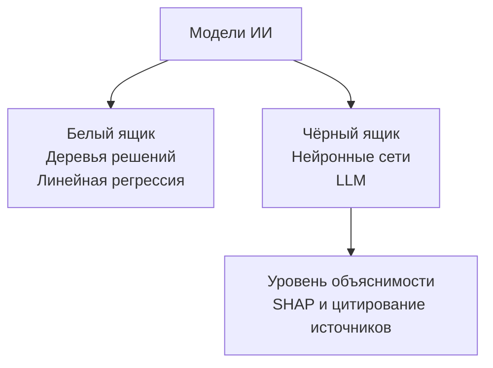
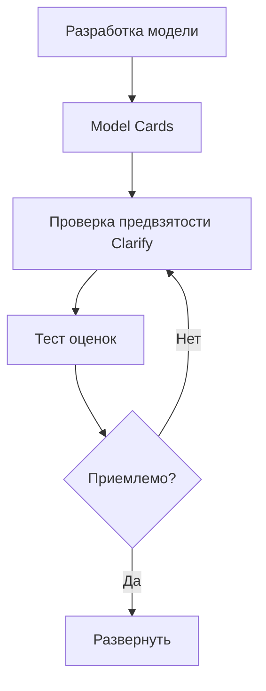
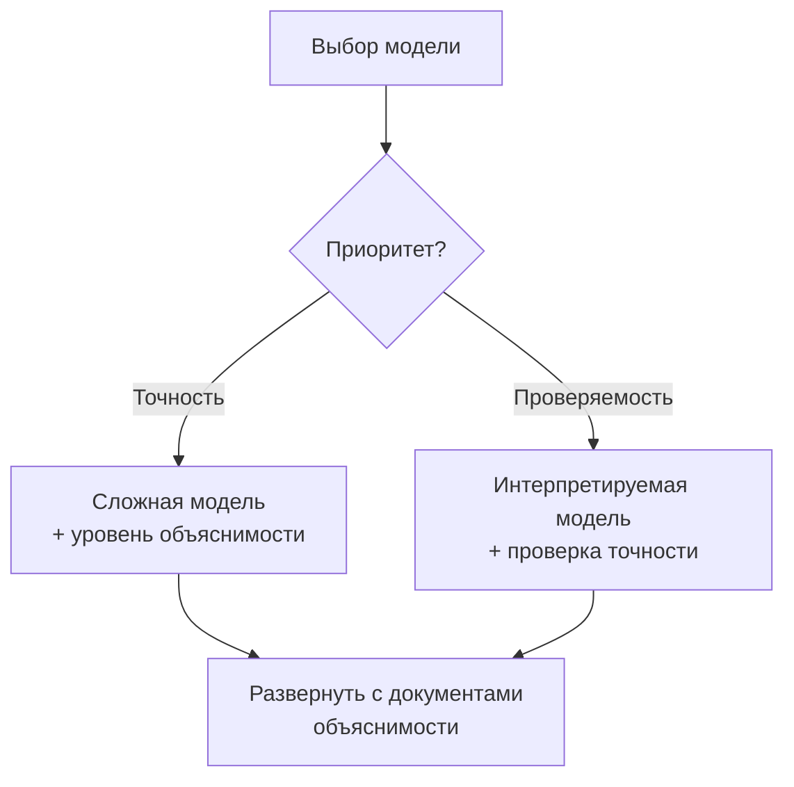
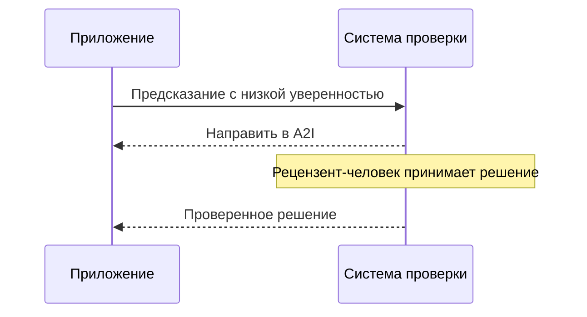

## Тема 4.2. Прозрачные и объяснимые модели

Когда ИИ-система принимает решение, влияющее на клиента, сотрудника или бизнес-результат, вовлечённые люди почти всегда задают один и тот же вопрос: почему? Ответ на этот вопрос — это то, о чём говорят прозрачность и объяснимость. Эта тема охватывает то, как отличить модели, способные ответить на этот вопрос, от тех, которые не способны, инструменты AWS, документирующие и раскрывающие поведение моделей, компромиссы между объяснимостью и другими свойствами, такими как безопасность и производительность, а также принципы проектирования, удерживающие людей в подлинном контуре управления, когда ИИ-системы делают значимые рекомендации.[^402001]

### 4.2.1 Различия между прозрачными и объяснимыми моделями и непрозрачными

Прозрачность и объяснимость — родственные, но различные свойства. **Прозрачность** — это свойство модели, внутренняя структура, обучающие данные и логика принятия решений которой могут быть проверены напрямую. Прозрачная модель — это та, которую можно открыть и прочитать. **Объяснимость** — это свойство модели, выходные данные которой могут сопровождаться понятным человеку обоснованием, даже если внутренняя структура остаётся сложной. Объяснимая модель может быть непрозрачной внутри, но система вокруг неё способна производить обоснование, которое человек может оценить.[^402002]

Это различие имеет практическое значение. Классическое *дерево решений* прозрачно: вы можете следовать ветвям от корня до листа и точно отследить, какие входные значения привели модель к данному выводу.[^402031] *Глубокая нейронная сеть* с миллиардами параметров непрозрачна аналогичным образом; ни один человек не может прочитать матрицу весов и понять, почему конкретная последовательность токенов произвела конкретный вывод. Однако хорошо спроектированная система вокруг этой нейронной сети всё равно может быть объяснимой: она может сообщать о признаках, внёсших наибольший вклад в вывод, раскрывать исходные документы, оказавшие наибольшее влияние на ответ, или присваивать оценку достоверности, сигнализирующую о степени уверенности модели.[^402032]

**Модели «белого ящика»** — это модели, в которых логика принятия решений изначально читаема. Линейная регрессия, логистическая регрессия, деревья решений и классификаторы на основе правил относятся к этой категории.[^402003] Модель кредитного андеррайтинга, построенная как дерево решений, может быть описана регулятору простым языком: «Заявки с соотношением долга к доходу выше 40% и менее чем 24 месяцами истории занятости были отклонены.» Это предложение и есть модель. Модели «белого ящика» являются выбором по умолчанию в средах, где регуляторная ответственность требует полной проверяемости каждого отдельного решения, таких как потребительский кредит, страховой андеррайтинг и некоторые классификации медицинских изделий.[^402033]

**Модели «чёрного ящика»** — это модели, внутренние вычисления которых слишком сложны для непосредственной интерпретации.[^402004] Большие языковые модели, глубокие свёрточные сети и ансамблевые методы, такие как градиентный бустинг, обученный на сотнях признаков, с практической точки зрения ведут себя как чёрные ящики. Модель производит оценку или последовательность токенов, но путь от входа к выходу проходит через такое множество нелинейных преобразований, что его отслеживание вычислительно и концептуально неосуществимо.[^402034] Большинство производственных ИИ-систем в модерации контента, медицинской визуализации, обнаружении мошенничества и обработке естественного языка работают с моделями «чёрного ящика».

*Рисунок 4.2.1: Таксономия «белого ящика» и «чёрного ящика». Модели «белого ящика» напрямую раскрывают логику принятия решений; модели «чёрного ящика» требуют отдельного уровня объяснимости для производства понятных человеку обоснований.*

Реальность большинства производственных ИИ-систем такова, что они располагаются где-то между двумя крайностями. Классификатор на основе градиентного бустинга, возможно, нельзя прочитать построчно, но он менее непрозрачен, чем глубокая нейронная сеть, поскольку оценки *важности признаков* можно вычислить для него напрямую из структуры модели.[^402035] Большая языковая модель глубоко непрозрачна внутри, но может быть настроена на цитирование своих источников, сообщение о своей неопределённости и объяснение цепочки рассуждений простым языком до выдачи окончательного ответа. Практический вопрос не в том, совершенно ли прозрачна модель, а в том, достаточно ли она объяснима для требований ответственности конкретного случая использования.[^402036]

Три отрасли хорошо иллюстрируют этот спектр. В кредитном скоринге нормы во многих юрисдикциях требуют, чтобы кредитор предоставлял заявителю конкретные причины принятого кредитного решения; модели «белого ящика» или модели «чёрного ящика» с атрибуцией SHAP удовлетворяют этому требованию, тогда как необъяснённая оценка — нет.[^402005] В медицинской диагностике радиолог, использующий ИИ-инструмент для проверки рентгенограмм грудной клетки, должен видеть, какие области изображения модель взвесила наиболее сильно, чтобы врач мог подтвердить или опровергнуть гипотезу модели; здесь объяснимость поддерживает принятие решений человеком, не заменяя его.[^402037] В модерации контента оператор платформы может не быть обязан объяснять пользователям отдельные решения о модерации, но внутренние группы аудита должны проверить, что классификатор применяет последовательные правила для всех демографических групп; здесь объяснимость — прежде всего инструмент внутреннего контроля качества.[^402038]

### 4.2.2 Инструменты выявления прозрачных и объяснимых моделей

Осознание необходимости объяснимости отличается от знания того, как её достичь. AWS предоставляет набор инструментов, обеспечивающих объяснимость на разных уровнях: документация модели, её поведение во время инференса и безопасность и качество её выходных данных.[^402039]

**Amazon SageMaker Model Cards** — это инструмент, разработанный AWS для стандартизации создания и распространения документации модели.[^402006] Model Card — это структурированный читаемый человеком документ, прикреплённый к артефакту модели в SageMaker. Он фиксирует предполагаемые случаи использования модели, обучающий набор данных и его происхождение, метрики производительности по соответствующим подгруппам, известные ограничения, этические соображения и ограничения использования.[^402007] Бизнес-профессионал, изучающий Model Card перед одобрением модели для производства, может определить, обучалась ли модель на данных, репрезентативных для совокупности развёртывания, какие компромиссы точности были сделаны, и какие риски команда разработчиков уже выявила.

Ценность Model Cards выходит за рамки первоначального решения о развёртывании. Когда поведение модели меняется со временем или когда поступает регуляторный запрос, Model Card предоставляет поддающуюся аудиту запись того, что было известно на момент развёртывания.[^402040] Amazon SageMaker поддерживает публикацию Model Cards через консоль AWS Management Console и SageMaker Python SDK, а карточки могут быть версионированы вместе с артефактом модели.[^402008]

**Amazon SageMaker Clarify** обеспечивает объяснимость на уровне инференса.[^402009] Clarify использует технику, называемую *SHAP* (SHapley Additive exPlanations), для вычисления оценок атрибуции признаков для классических моделей МО.[^402010] Думайте о значении SHAP как о «насколько этот признак подтолкнул ответ вверх или вниз по сравнению со средним предсказанием по всем заявителям». Положительные числа толкают к более высокому прогнозируемому риску; отрицательные — к меньшему. Например, пояснение Clarify для предсказания модели кредитного риска может показать, что соотношение долга к доходу заявителя внесло +0,12 в оценку риска, тогда как длина кредитной истории внесла -0,08, давая андеррайтеру количественную основу для решения и отправную точку для любого необходимого объяснения заявителю. (Для моделей изображений эквивалентная техника производит *карты значимости*, выделяющие области входного изображения, которые модель взвесила наиболее сильно.)

Помимо атрибуции признаков, SageMaker Clarify измеряет *метрики предвзятости*, отражающие, обращается ли модель с разными демографическими группами по-разному.[^402011] Метрики предвзятости до обучения оценивают, несбалансирован ли сам обучающий набор данных. Метрики предвзятости после обучения оценивают, различаются ли предсказания обученной модели систематически для групп, определённых по чувствительному атрибуту, такому как пол, возраст или почтовый индекс.[^402041] Эта возможность обнаружения предвзятости напрямую связана с функциями ответственного ИИ, рассматриваемыми в Теме 4.1, и делает Clarify инструментом двойного назначения: он и объясняет отдельные предсказания, и отслеживает справедливость на уровне совокупности.

**Amazon Bedrock Model Evaluations** — это инструмент AWS для оценки качества и безопасности выходных данных базовых моделей.[^402012] В отличие от Clarify, который занимается атрибуцией признаков классических моделей МО, Bedrock Model Evaluations оценивает выходные данные LLM по параметрам, таким как точность, беглость, связность и токсичность. Оценка может быть настроена как автоматизированное задание с использованием встроенных алгоритмов оценки или как задание оценки людьми с внутренней командой или управляемой AWS рабочей силой.[^402013] Параметр оценки безопасности специально проверяет вредоносный, токсичный или неуместный контент, предоставляя организациям структурированный отчёт о том, как модель работает по критериям безопасности до её выведения в производство. Bedrock Model Evaluations производит отчёт по каждому заданию, сравнивающий выходные данные с критериями; это не постоянный документ управления о самой модели — именно это предоставляют Model Cards.

**Модели с открытым исходным кодом** заслуживают особого внимания как инструмент прозрачности. Когда организация развёртывает модель, веса и архитектура которой являются общедоступными, например модели из семейства Meta Llama или семейства Mistral, она может изучить документацию по архитектуре, просмотреть карточки данных, опубликованные разработчиками модели, и провести сторонние оценки.[^402014] Это качественно иной уровень прозрачности, чем доступный для проприетарных моделей, доступных через API, где архитектура и обучающие данные не раскрываются.[^402042] Развёртывание модели с открытым исходным кодом на AWS через Amazon Bedrock или напрямую на конечных точках Amazon SageMaker сохраняет это преимущество прозрачности, сохраняя при этом операционные преимущества управляемой инфраструктуры.[^402043]

**Документация данных и лицензирования** завершает картину. Объяснимость значима только если данные, создавшие модель, отслеживаемы.[^402015] Модель, обученная на данных с нераскрытым происхождением, несёт риски, которые Model Card не может полностью отразить: если выяснится, что обучающие данные содержат защищённые персональные данные, защищённый авторским правом контент или систематически предвзятые метки, выходные данные модели унаследуют эти проблемы.[^402044] Условия лицензирования как обучающих данных, так и весов модели определяют, что организация может законно делать с выходными данными модели, и это определение само по себе — форма прозрачности в отношении операционных ограничений модели.[^402045]

*Таблица 4.2.1: Инструменты AWS для прозрачности и объяснимости модели*

| Инструмент | Что объясняет | Техника | Основная аудитория |
|------------|--------------|---------|-------------------|
| SageMaker Model Cards | Намерение модели, данные, результаты оценки, ограничения | Структурированная документация | Бизнес-рецензенты, аудиторы |
| SageMaker Clarify | Атрибуция отдельного предсказания, метрики предвзятости | Значения SHAP, статистические тесты | Учёные по данным, соответствие требованиям |
| Bedrock Model Evaluations | Качество и безопасность вывода LLM | Автоматизированная и человеческая оценка | ИИ-команды, рецензенты безопасности |
| Проверка модели с открытым исходным кодом | Архитектура и обучающие данные | Прямая проверка весов и документов | Инженеры МО, исследователи |
| Проверка данных и лицензирования | Происхождение обучающих данных и права использования | Отслеживание происхождения, проверка лицензии | Юридический отдел, соответствие требованиям, закупки |

Экзамен ожидает, что вы сопоставите сценарий с правильным инструментом. Когда вопрос спрашивает, как организации следует документировать предполагаемое использование модели и известные ограничения для аудита, ответ — SageMaker Model Cards. Когда вопрос спрашивает, как объяснить, почему конкретное предсказание было сделано классической моделью МО, ответ — SageMaker Clarify с SHAP. Когда вопрос спрашивает, как оценить безопасность выходных данных генеративной модели до производственного развёртывания, ответ — Bedrock Model Evaluations.[^402046]

*Рисунок 4.2.2: Инструментальная цепочка объяснимости в жизненном цикле модели. Model Cards предоставляют контекст документации; Clarify измеряет предвзятость до и после обучения; Bedrock Model Evaluations проверяет безопасность вывода перед развёртыванием.*

### 4.2.3 Компромиссы между безопасностью модели и прозрачностью

Прозрачность и безопасность не всегда совпадают. Понимание того, где они усиливают друг друга, а где конфликтуют, важно для проектирования ИИ-систем, являющихся одновременно надёжными и защищёнными.[^402047]

Наиболее распространённый конфликт возникает из того факта, что раскрытие принципа работы средства управления безопасностью может позволить злоумышленнику его обойти. Рассмотрим систему модерации контента, блокирующую вредоносные выходные данные путём обнаружения определённых фразовых паттернов в ответе модели. Публикация точного списка фраз позволит злоумышленнику конструировать запросы, избегающие всех заблокированных фраз, при этом по-прежнему вызывая вредоносный контент. В этом случае непрозрачность в средстве управления безопасностью намеренна.[^402048] Та же логика применяется к защите от инъекций запросов: системный запрос, инструктирующий модель игнорировать инструкции, следующие определённому шаблону, менее эффективен, как только этот шаблон становится известен.[^402016] Системы безопасности регулярно рассматривают детали своей логики обнаружения как конфиденциальные, и средства управления безопасностью ИИ не являются исключением.

Конфликт направлен и в противоположную сторону. Непрозрачность в модели может скрывать ограничения, значимые для безопасности, которые необходимо знать операторам и пользователям. Model Card, точно описывающая режимы сбоя модели, например меньшая точность для неносителей английского языка или более высокие показатели галлюцинаций по очень недавним событиям, позволяет операторам добавлять компенсирующие средства управления при развёртывании.[^402017] Скрытие или упущение этих ограничений означает, что оператор не может их снизить. В этом смысле прозрачность об ограничениях активно улучшает результаты безопасности.[^402049]

Компромисс производительность — интерпретируемость — второе противоречие, которое охватывает экзамен. В целом, модели, достигающие наивысшей точности на сложных задачах, также наименее интерпретируемы. Глубокая нейронная сеть, обученная на миллионах размеченных изображений, превзойдёт дерево решений на большинстве задач классификации изображений, но предсказания дерева решений можно объяснить эксперту предметной области без каких-либо дополнительных инструментов.[^402018] Ансамбль градиентного бустинга, обученный на десятках сконструированных признаков, нередко превзойдёт логистическую регрессию на табличных данных, но логистическая регрессия производит коэффициенты, которые статистик может читать напрямую как вклад каждой переменной.[^402050]

*Рисунок 4.2.3: Путь принятия решений «производительность vs. интерпретируемость». Когда точность — главное требование, добавьте апостериорный уровень объяснимости; когда проверяемость — главное требование, выберите интерпретируемую модель и проверьте её порог точности.*

Не существует единой численной меры интерпретируемости.[^402019] Интерпретируемость — это свойство, оцениваемое для конкретного случая использования, а не оценка в рейтинге. Модель, которую радиолог считает достаточно объяснимой для помощи при скрининге, может быть недостаточно объяснима для генерации формального диагноза, появляющегося в медицинской карте.[^402051] Модель кредитного риска, удовлетворяющая требованиям объяснения потребительского кредитного законодательства одной страны, может не удовлетворять требованиям другой страны. Измерительный вопрос поэтому всегда таков: достаточно объяснима для кого, с какой целью и в рамках какого обязательства?[^402052]

*Таблица 4.2.2: Паттерны взаимодействия прозрачности и безопасности*

| Сценарий | Эффект прозрачности | Эффект безопасности | Решение |
|----------|--------------------|--------------------|---------|
| Публикация деталей защиты от инъекций запросов | Высокая прозрачность | Снижение безопасности | Сохранять конфиденциальность логики защиты; публиковать только высокоуровневую политику |
| Model Card документирует режимы сбоя галлюцинаций | Высокая прозрачность | Улучшение безопасности | Публиковать; операторы добавляют компенсирующие средства управления |
| Раскрытие пороговых значений обнаружения предвзятости | Частичная прозрачность | Риск манипуляций | Публиковать категорию; сохранять конфиденциальность точных порогов |
| Веса модели с открытым исходным кодом | Полная прозрачность | Переменная | Оценивать конкретные риски перед открытым развёртыванием |

Практическое руководство для экзаменационного сценария таково: когда вопрос описывает ситуацию, в которой раскрытие механизма средства управления позволило бы злоумышленнику его обойти, меньшая прозрачность уместна для безопасности. Когда вопрос описывает ситуацию, в которой сокрытие известных ограничений модели лишает операторов возможности их снизить, большая прозрачность уместна для безопасности.[^402053]

### 4.2.4 Принципы человекоцентричного проектирования для объяснимого ИИ

Объяснимость — не только техническое свойство модели; это также свойство дизайна системы, представляющей выходные данные модели пользователям. Модель может производить оценки атрибуции SHAP, которые ни один бизнес-пользователь никогда не увидит, потому что интерфейс не был спроектирован для их отображения.[^402054] Человекоцентричное проектирование для объяснимого ИИ означает построение уровня представления так, чтобы пользователи получали информацию, необходимую для понимания, доверия и надлежащего отклонения рекомендаций ИИ.[^402020]

Первый принцип — раскрывать информацию о достоверности и неопределённости, когда она релевантна для решения. Модель, присваивающая рекомендации высокую оценку достоверности, и модель, почти одинаково неопределённая между двумя вариантами, не должны выглядеть для пользователя одинаково. Когда система обнаружения мошенничества помечает транзакцию с достоверностью 97%, аналитик может действовать быстро. Когда та же система помечает транзакцию с достоверностью 54%, аналитик должен знать, что модель неопределённа, и проявить больше внимательности. Модели Amazon Bedrock могут возвращать оценки вероятности и могут быть настроены явно выражать неопределённость в своих выходных данных; проектирование приложения для отображения этой информации, а не прямое преобразование вывода модели в бинарную рекомендацию «да/нет», — сознательный дизайнерский выбор.[^402021]

Второй принцип — показывать цитаты и источники для сгенерированного контента. Приложение на основе RAG, извлекающее информацию из корпуса документов и генерирующее ответ на естественном языке, должно идентифицировать, какие исходные документы были использованы. Это не только мера прозрачности; это практический инструмент, позволяющий пользователю проверить вывод модели по исходному источнику и выявить случаи, когда модель обобщила дальше того, что источник действительно говорил.[^402022] Amazon Bedrock Knowledge Bases возвращает ссылки на исходные документы вместе со сгенерированными ответами, и дизайн приложения, раскрывающий эти ссылки конечным пользователям, делает систему существенно более надёжной.[^402055]

Третий принцип — проектировать петли обратной связи, фиксирующие оценки пользователей о качестве вывода ИИ. Механизм «нравится/не нравится», прикреплённый к рекомендации модели, является простейшей формой этого, но дизайн должен также фиксировать причину отрицательной обратной связи: была ли рекомендация фактически неверной, неприменимой или правильной, но изложенной запутанно? Эта структурированная обратная связь, передаваемая обратно команде разработки модели, производит размеченные данные, необходимые для выявления систематических режимов сбоя и улучшения модели со временем. Amazon A2I, представленный в Теме 4.1, соответствует этому принципу, направляя выходные данные с низкой уверенностью к рецензентам-людям и фиксируя их решения как структурированные записи.[^402023]

*Рисунок 4.2.4: Поток обратной связи с участием человека. Приложение раскрывает оценки достоверности пользователю, направляет выходные данные с низкой уверенностью или оспариваемые в Amazon A2I для проверки людьми и возвращает структурированные аннотации команде разработки.*

Четвёртый принцип — разделять то, что сказала модель, и то, что сделала система. В многоуровневом ИИ-приложении модель выдаёт рекомендацию, а затем нижестоящая система действует на её основе. Хорошо спроектированный интерфейс показывает пользователю оба уровня: рекомендацию модели и действие системы, основанное на этой рекомендации.[^402056] Это важно, когда система добавляет бизнес-правила, модифицирующие или отменяющие вывод модели. Например, инструмент поддержки найма может показывать рекрутеру как рейтинг кандидатов от модели, так и правило, применённое компанией рекрутера для отфильтровывания кандидатов ниже установленного законом возрастного порога. Пользователь затем может оценивать логику модели независимо от уровня бизнес-правил.[^402057]

Пятый принцип — уважать автономию пользователя, делая отмены простыми и хорошо отслеживаемыми. Рекомендация ИИ, которую нельзя отменить, — это не рекомендация вовсе; это автоматизированное решение. Пользователи, обязанные использовать выходные данные ИИ, но неспособные их отменить, теряют возможность применять профессиональное суждение к граничным случаям, а организация теряет сигнал, который предоставили бы данные об отменах.[^402058] Проектирование механизмов отмены, которые заметны, требуют минимальных усилий и регистрируются в журнале аудита, даёт пользователям подлинную свободу действий и одновременно генерирует ценную обратную связь о том, где модель не справляется.[^402024]

*Таблица 4.2.3: Принципы человекоцентричного проектирования для объяснимого ИИ*

| Принцип | Пример реализации | Инструмент или паттерн AWS |
|---------|------------------|---------------------------|
| Раскрывать достоверность и неопределённость | Отображать оценку достоверности модели рядом с рекомендацией | Метаданные ответа инференса Bedrock |
| Показывать цитаты и источники | Перечислять извлечённые исходные документы вместе с сгенерированным ответом | Атрибуция источников Bedrock Knowledge Bases |
| Фиксировать структурированную обратную связь | «Не нравится» с причиной; автоматическое направление при низкой уверенности | Конфигурация рабочего процесса Amazon A2I |
| Разделять вывод модели и действие системы | Показывать оценку модели и применённое бизнес-правило отдельно | Дизайн уровня приложения |
| Уважать автономию пользователя | Заметная кнопка отмены с журналом аудита | Дизайн уровня приложения |

Доступность — практическое соображение в рамках человекоцентричного проектирования, которое экзамен подробно не разрабатывает, но которое любая ответственная реализация должна учитывать. Оценки достоверности, представленные только как числовые значения, исключают пользователей, менее уверенных в вероятностном мышлении.[^402059] Объяснения, написанные техническим языком, исключают неэкспертных пользователей. Проектирование объяснимости для фактических пользователей системы, а не для разработчиков, которые её построили, является операционным определением человекоцентричного проектирования в данном контексте.[^402060]

## Вопросы для самопроверки

**Вопрос 1.** Компания финансовых услуг использует ансамблевую модель градиентного бустинга для одобрения или отклонения кредитных заявок. Регулятор требует, чтобы компания предоставляла каждому отклонённому заявителю конкретную причину решения. Команда разработки модели хочет удовлетворить это требование без замены модели. Какой инструмент или техника AWS НАИБОЛЕЕ подходит?

A. Заменить модель градиентного бустинга на логистическую регрессию, прозрачную по своей природе.
B. Использовать Amazon SageMaker Clarify для генерации оценок атрибуции признаков на основе SHAP для каждого отдельного предсказания.
C. Опубликовать SageMaker Model Card, документирующую обучающие данные и метрики оценки.
D. Использовать Amazon Bedrock Model Evaluations для оценки точности вывода модели по размеченному набору данных.

**Пояснение:** Регулятор требует объяснения для каждого решения, что означает: система должна атрибутировать конкретное предсказание конкретным входным признакам для каждой отдельной заявки. Amazon SageMaker Clarify (ответ B) вычисляет значения SHAP, количественно оценивающие вклад каждого входного признака в предсказание модели, производя именно то обоснование для каждого решения, которое требует регулятор. Ответ A удовлетворил бы требованию, но вопрос указывает, что команда хочет избежать замены модели; кроме того, замена модели исключительно ради интерпретируемости жертвует преимуществом точности ансамбля. Ответ C обеспечивает документацию о модели в целом, но не генерирует объяснения для каждого решения. Ответ D оценивает совокупную точность выводов LLM и не предназначен для атрибуции признаков классических моделей МО. SageMaker Clarify — это целеориентированный инструмент для атрибуции отдельных предсказаний на моделях, обученных в SageMaker.[^402026]

---

**Вопрос 2.** Компания разрабатывает медицинский ассистент с ИИ-визуализацией, выделяющий области рентгенограммы грудной клетки для проверки радиологом. Команда разработки обсуждает, использовать ли глубокую свёрточную сеть с более высокой диагностической точностью или классификатор на основе правил с меньшей точностью, но полностью проверяемыми правилами. Клиническая команда говорит, что будет использовать инструмент, только если сможет понять, почему он помечает область. Какой подход НАИЛУЧШИМ образом отвечает как требованию клинической команды, так и потребности в точности?

A. Использовать классификатор на основе правил, поскольку он полностью прозрачен и клиническая команда может читать его правила напрямую.
B. Использовать глубокую свёрточную сеть и добавить апостериорный уровень объяснимости, выделяющий области изображения, которые модель взвесила наиболее сильно.
C. Использовать глубокую свёрточную сеть без уровня объяснимости и обучить клиническую команду доверять выводу модели.
D. Использовать Amazon Bedrock Model Evaluations для проверки выводов глубокой свёрточной сети перед каждой визуализационной сессией.

**Пояснение:** Вопрос выявляет два конкурирующих требования: высокая точность (в пользу глубокой свёрточной сети) и понятность (в пользу прозрачной модели). Ответ B разрешает противоречие, используя более точную модель и добавляя апостериорный уровень объяснимости, производящий *карты значимости* или эквивалентные визуализации, показывающие, какие области изображения модель взвесила наиболее сильно. Это даёт радиологам необходимое региональное обоснование без жертвы преимуществом точности. Ответ A без необходимости принимает ограничение точности; вопрос не говорит, что точность классификатора на основе правил достаточна. Ответ C игнорирует заявленное требование клинической команды и вводит риск для безопасности пациентов путём развёртывания необъяснённой системы для клиницистов, которые заявили, что им нужны объяснения. Ответ D использует неправильный класс инструментов; Bedrock Model Evaluations адресует качество вывода LLM, а не атрибуцию классификации изображений. Более широкий урок состоит в том, что компромисс производительность — интерпретируемость нередко можно разрешить, сохранив высокопроизводительную модель и добавив уровень объяснимости, а не выбирая между ними.[^402027]

---

**Вопрос 3.** Организация готовится к развёртыванию ИИ-ассистента генеративного клиентского сервиса. Команда по соответствию требованиям требует документацию предполагаемого использования модели, её известных режимов сбоя и метрик оценки, использованных для её проверки, в формате, который может просмотреть нетехнический аудитор. Какая возможность AWS предназначена для этой цели?

A. Отчёты о предвзятости Amazon SageMaker Clarify.
B. Рабочий процесс проверки людьми Amazon Bedrock Model Evaluations.
C. Amazon SageMaker Model Cards.
D. Журналы аудита задач проверки Amazon Augmented AI (Amazon A2I).

**Пояснение:** Amazon SageMaker Model Cards (ответ C) — это целеориентированный инструмент для структурированной документации модели. Model Card фиксирует предполагаемые случаи использования модели, происхождение обучающих данных, результаты оценки по подгруппам, известные ограничения, этические соображения и ограничения использования в стандартизированном, читаемом человеком формате. Это непосредственно отвечает всем трём требованиям соответствия: предполагаемое использование, известные режимы сбоя и метрики оценки — в форме, доступной нетехническому аудитору. Ответ A производит оценки атрибуции по предсказаниям и метрики предвзятости для развёрнутой модели, а не сводную документацию для аудитора. Ответ B выполняет оценки качества и безопасности инференса, но производит оценочные баллы, а не структурированную документацию, которую предоставляет Model Card. Ответ D производит записи аудита отдельных решений проверки людьми, что полезно для мониторинга, но не заменяет документацию модели. Model Cards — это канонический ответ, когда экзамен описывает требование аудита или соответствия для документации модели перед развёртыванием.[^402028]

---

**Вопрос 4.** Продуктовая ИИ-команда компании разработала систему рекомендаций. Пользовательские исследования показывают, что многие пользователи не доверяют рекомендациям, поскольку не понимают, почему предлагается конкретный элемент. Команда хочет применить человекоцентричное проектирование для повышения доверия пользователей. Какой вариант сочетает два изменения дизайна, НАИБОЛЕЕ непосредственно устраняющих разрыв в доверии?

A. Заменить модель рекомендаций более точной моделью и переобучить на большем наборе данных.
B. Отображать оценку достоверности модели рядом с каждой рекомендацией и показывать основные атрибуты истории пользователя, повлиявшие на предложение.
C. Удалить функцию рекомендаций до тех пор, пока модель не достигнет более высокой точности.
D. Добавить шаг проверки людьми Amazon A2I для ручного утверждения каждой рекомендации перед её показом пользователю.

**Пояснение:** Пользовательские исследования выявляют проблему доверия, вызванную недостатком понятности, а не низкой точностью или недостаточной проверкой. Ответ B непосредственно применяет два принципа человекоцентричного проектирования: раскрытие достоверности (чтобы пользователи могли откалибровать, сколько веса давать рекомендации) и отображение обоснования рекомендации (атрибуты, повлиявшие на неё, что является формой апостериорной атрибуции). Оба изменения устраняют заявленный разрыв в доверии. Ответ A улучшает точность, которая может и не решить проблему доверия; более точная модель, остающаяся необъяснённой, не решает проблему, выявленную пользовательскими исследованиями. Ответ C убирает продуктовую функцию, чтобы избежать проблемы, а не решает её. Ответ D вводит проверку людьми для каждой рекомендации, что операционно нецелесообразно в масштабе систем рекомендаций и решает контроль качества, а не объяснимость для пользователя. Экзаменационный паттерн здесь: когда доверие пользователей является заявленной проблемой, правильный ответ включает прозрачность и дизайн объяснения, а не замену модели или ручную проверку.[^402029]

---

**Вопрос 5.** Команда учёных по данным оценивает, использовать ли модель с открытым исходным кодом или проприетарную модель закрытого API для нового приложения. Юридический отдел команды требует прозрачности в отношении источников обучающих данных и условий лицензирования перед одобрением модели для производственного использования. Какая характеристика моделей с открытым исходным кодом НАИБОЛЕЕ непосредственно отвечает требованию юридического отдела?

A. Модели с открытым исходным кодом всегда дешевле в эксплуатации, чем проприетарные модели, доступные через API.
B. Модели с открытым исходным кодом могут быть тонко настроены на проприетарных данных, что позволяет организации владеть результирующими весами.
C. Модели с открытым исходным кодом публикуют документацию по архитектуре, карточки данных и условия лицензирования, которые юридическая команда может проверить напрямую.
D. Модели с открытым исходным кодом автоматически соответствуют всем регуляторным требованиям прозрачности ИИ в ЕС и США.

**Пояснение:** Заявленное требование юридического отдела — прозрачность в отношении источников обучающих данных и условий лицензирования. Ответ C отвечает на это напрямую. Общедоступные модели, как правило, публикуют карточки модели и карточки данных (или эквивалентную документацию), описывающие состав обучающего корпуса, известные ограничения и применимую лицензию. Юридическая команда может изучить опубликованную лицензию (такую как Apache 2.0 или специфическая для модели коммерческая лицензия), чтобы определить, какие виды использования разрешены, и просмотреть документацию по обучающим данным для оценки рисков происхождения данных. Ответ A — это аргумент о стоимости, не касающийся юридического требования; модели с открытым исходным кодом не являются универсально более дешёвыми с учётом инфраструктурных и операционных затрат. Ответ B касается владения тонко настроенными производными, что является обоснованным юридическим соображением, но не отвечает на требование прозрачности обучающих данных и лицензирования, изложенное в вопросе. Ответ D неверен; статус открытого исходного кода не удовлетворяет автоматически ни одному конкретному регуляторному фреймворку; соответствие требованиям по-прежнему требует оценки по критериям соответствующего регулирования. Более широкий урок состоит в том, что прозрачность данных и лицензирования является самостоятельным аспектом прозрачности модели, и модели с открытым исходным кодом обеспечивают уровень прозрачности происхождения, недоступный для моделей, доступных только через проприетарный API.[^402030]

---

[^402001]: AWS Certification. AI Practitioner (AIF-C01) Exam Guide v1.1, Domain 4, Task Statement 4.2. URL: <https://docs.aws.amazon.com/aws-certification/latest/ai-practitioner-01/ai-practitioner-01-domain4.html>
[^402002]: Doshi-Velez, F., and Kim, B. Towards a Rigorous Science of Interpretable Machine Learning (2017). URL: <https://arxiv.org/abs/1702.08608>
[^402003]: Breiman, L. Classification and Regression Trees (1984). URL: <https://doi.org/10.1201/9781315139470>
[^402004]: Adadi, A., and Berrada, M. Peeking Inside the Black-Box: A Survey on Explainable AI. IEEE Access (2018). URL: <https://doi.org/10.1109/ACCESS.2018.2870052>
[^402005]: Consumer Financial Protection Bureau. Using Artificial Intelligence to Assist Adverse Action Explanations (2023). URL: <https://www.consumerfinance.gov/about-us/blog/cfpb-issues-guidance-on-credit-denials-by-lenders-using-artificial-intelligence/>
[^402006]: Amazon SageMaker. Amazon SageMaker Model Cards overview. URL: <https://docs.aws.amazon.com/sagemaker/latest/dg/model-cards.html>
[^402007]: Amazon SageMaker. Model Card components and structure. URL: <https://docs.aws.amazon.com/sagemaker/latest/dg/model-cards-create.html>
[^402008]: Amazon SageMaker. Versioning and sharing SageMaker Model Cards. URL: <https://docs.aws.amazon.com/sagemaker/latest/dg/model-cards-export.html>
[^402009]: Amazon SageMaker. Amazon SageMaker Clarify overview. URL: <https://docs.aws.amazon.com/sagemaker/latest/dg/clarify-configure-processing-jobs.html>
[^402010]: Lundberg, S., and Lee, S. A Unified Approach to Interpreting Model Predictions (SHAP, NeurIPS 2017). URL: <https://arxiv.org/abs/1705.07874>
[^402011]: Amazon SageMaker. Measuring bias with SageMaker Clarify. URL: <https://docs.aws.amazon.com/sagemaker/latest/dg/clarify-measure-data-bias.html>
[^402012]: Amazon Bedrock. Amazon Bedrock Model Evaluations overview. URL: <https://docs.aws.amazon.com/bedrock/latest/userguide/model-evaluation.html>
[^402013]: Amazon Bedrock. Human evaluation jobs in Amazon Bedrock Model Evaluations. URL: <https://docs.aws.amazon.com/bedrock/latest/userguide/model-evaluation-human.html>
[^402014]: Meta AI. Llama 3 model card and data documentation. URL: <https://ai.meta.com/research/publications/meta-llama-3/>
[^402015]: Mitchell, M., et al. Model Cards for Model Reporting (FAccT 2019). URL: <https://arxiv.org/abs/1810.03993>
[^402016]: Perez, F., and Ribeiro, I. Ignore Previous Prompt: Attack Techniques for Language Models (2022). URL: <https://arxiv.org/abs/2211.09527>
[^402017]: Raji, I., et al. Closing the AI Accountability Gap: Defining an End-to-End Framework for Internal Algorithmic Auditing (2020). URL: <https://arxiv.org/abs/2001.00973>
[^402018]: Rudin, C. Stop Explaining Black Box Machine Learning Models for High Stakes Decisions and Use Interpretable Models Instead. Nature Machine Intelligence (2019). URL: <https://doi.org/10.1038/s42256-019-0048-x>
[^402019]: Lipton, Z. The Mythos of Model Interpretability. Queue, ACM (2018). URL: <https://dl.acm.org/doi/10.1145/3236386.3241340>
[^402020]: Amershi, S., et al. Guidelines for Human-AI Interaction. CHI 2019. URL: <https://dl.acm.org/doi/10.1145/3290605.3300233>
[^402021]: Amazon Bedrock. Response metadata and confidence in Amazon Bedrock inference. URL: <https://docs.aws.amazon.com/bedrock/latest/userguide/model-invocation-logging.html>
[^402022]: Amazon Bedrock. Source attribution in Knowledge Bases responses. URL: <https://docs.aws.amazon.com/bedrock/latest/userguide/knowledge-base-retrieveandgenerate.html>
[^402023]: Amazon Augmented AI. Amazon A2I overview and human review workflows. URL: <https://docs.aws.amazon.com/sagemaker/latest/dg/a2i-getting-started.html>
[^402024]: Shneiderman, B. Human-Centered AI. Oxford University Press (2022). URL: <https://global.oup.com/academic/product/human-centered-ai-9780192845290>
[^402026]: Amazon SageMaker. Explainability with SageMaker Clarify: SHAP values for predictions. URL: <https://docs.aws.amazon.com/sagemaker/latest/dg/clarify-shapley-values.html>
[^402027]: Selvaraju, R., et al. Grad-CAM: Visual Explanations from Deep Networks via Gradient-Based Localization (2017). URL: <https://arxiv.org/abs/1610.02391>
[^402028]: Amazon SageMaker. Using Model Cards for compliance and auditability. URL: <https://docs.aws.amazon.com/sagemaker/latest/dg/model-cards.html>
[^402029]: Amershi, S., et al. Guidelines for Human-AI Interaction: Principle 7, Show contextual information. CHI 2019. URL: <https://dl.acm.org/doi/10.1145/3290605.3300233>
[^402030]: Linux Foundation AI and Data. Model and Data Card Standards for Open Source AI (2023). URL: <https://lfaidata.foundation/blog/2023/09/18/data-and-model-cards/>
[^402031]: Quinlan, J.R. Induction of Decision Trees. Machine Learning, vol. 1 (1986). URL: <https://doi.org/10.1007/BF00116251>
[^402032]: Guidotti, R., et al. A Survey of Methods for Explaining Black Box Models. ACM Computing Surveys (2018). URL: <https://dl.acm.org/doi/10.1145/3236009>
[^402033]: Board of Governors of the Federal Reserve System. SR 11-7: Guidance on Model Risk Management (2011). URL: <https://www.federalreserve.gov/supervisionreg/srletters/sr1107.htm>
[^402034]: Goodfellow, I., Bengio, Y., and Courville, A. Deep Learning. MIT Press (2016). URL: <https://www.deeplearningbook.org/>
[^402035]: Chen, T., and Guestrin, C. XGBoost: A Scalable Tree Boosting System. KDD 2016. URL: <https://arxiv.org/abs/1603.02754>
[^402036]: European Parliament. EU AI Act: Article 13, Transparency and provision of information to deployers (2024). URL: <https://eur-lex.europa.eu/legal-content/EN/TXT/?uri=CELEX:32024R1689>
[^402037]: Topol, E. High-performance medicine: the convergence of human and artificial intelligence. Nature Medicine (2019). URL: <https://doi.org/10.1038/s41591-018-0300-7>
[^402038]: Raji, I., and Buolamwini, J. Actionable Auditing: Investigating the Impact of Publicly Naming Biased Performance Results of Commercial AI Products. AIES 2019. URL: <https://dl.acm.org/doi/10.1145/3306618.3314244>
[^402039]: NIST. Artificial Intelligence Risk Management Framework (AI RMF 1.0), GOVERN 1.7. URL: <https://doi.org/10.6028/NIST.AI.100-1>
[^402040]: Amazon SageMaker. Model Card audit and governance use cases. URL: <https://docs.aws.amazon.com/sagemaker/latest/dg/model-cards-use-cases.html>
[^402041]: Amazon SageMaker. Post-training bias metrics in SageMaker Clarify. URL: <https://docs.aws.amazon.com/sagemaker/latest/dg/clarify-measure-post-training-bias.html>
[^402042]: Bommasani, R., et al. On the Opportunities and Risks of Foundation Models: Transparency section. Stanford CRFM (2021). URL: <https://arxiv.org/abs/2108.07258>
[^402043]: Amazon Bedrock. Supported open-source models in Amazon Bedrock. URL: <https://docs.aws.amazon.com/bedrock/latest/userguide/models-supported.html>
[^402044]: Gebru, T., et al. Datasheets for Datasets. Communications of the ACM (2021). URL: <https://doi.org/10.1145/3458723>
[^402045]: Open Source Initiative. The Open Source AI Definition, version 1.0 (2024). URL: <https://opensource.org/ai/open-source-ai-definition>
[^402046]: Amazon Bedrock. Choosing between automated and human evaluation in Bedrock Model Evaluations. URL: <https://docs.aws.amazon.com/bedrock/latest/userguide/model-evaluation.html>
[^402047]: Wachter, S., Mittelstadt, B., and Russell, C. Counterfactual Explanations Without Opening the Black Box: Automated Decisions and the GDPR. Harvard Journal of Law and Technology (2018). URL: <https://doi.org/10.2139/ssrn.3063289>
[^402048]: Amazon Bedrock. Amazon Bedrock Guardrails: content filtering configuration. URL: <https://docs.aws.amazon.com/bedrock/latest/userguide/guardrails-filters.html>
[^402049]: Floridi, L., et al. An Ethical Framework for a Good AI Society: Opportunities, Risks, Principles, and Recommendations. Minds and Machines (2018). URL: <https://doi.org/10.1007/s11023-018-9482-5>
[^402050]: Hastie, T., Tibshirani, R., and Friedman, J. The Elements of Statistical Learning, 2nd ed. Springer (2009). URL: <https://doi.org/10.1007/978-0-387-84858-7>
[^402051]: FDA. Artificial Intelligence and Machine Learning in Software as a Medical Device: Action Plan (2021). URL: <https://www.fda.gov/medical-devices/software-medical-device-samd/artificial-intelligence-and-machine-learning-software-medical-device>
[^402052]: European Parliament. EU AI Act: Article 86, Right of explanation of individual decision-making (2024). URL: <https://eur-lex.europa.eu/legal-content/EN/TXT/?uri=CELEX:32024R1689>
[^402053]: NIST. AI RMF Playbook: MAP 1.6, Risk of insufficient explainability. URL: <https://airc.nist.gov/Docs/2>
[^402054]: Yang, Q., et al. Investigating how and why practitioners use machine learning explanation methods. CHI 2023. URL: <https://dl.acm.org/doi/10.1145/3544548.3581219>
[^402055]: Amazon Bedrock. Citations and source attribution in Knowledge Bases responses. URL: <https://docs.aws.amazon.com/bedrock/latest/userguide/knowledge-base-retrieveandgenerate.html>
[^402056]: Cai, C.J., et al. Human-Centered Tools for Coping with Imperfect Algorithms During Medical Decision-Making. CHI 2019. URL: <https://dl.acm.org/doi/10.1145/3290605.3300234>
[^402057]: European Parliament. EU AI Act: Article 26, Obligations of deployers of high-risk AI systems (2024). URL: <https://eur-lex.europa.eu/legal-content/EN/TXT/?uri=CELEX:32024R1689>
[^402058]: Kuo, T., et al. Assessing the AI on AI: Examining the Influence of AI Recommendations on Human Decisions. CHI 2023. URL: <https://dl.acm.org/doi/10.1145/3544548.3581314>
[^402059]: Bunt, A., Lount, M., and Lauzon, C. Are explanations always important? A study of deployed, low-cost intelligent systems. IUI 2012. URL: <https://dl.acm.org/doi/10.1145/2166966.2166996>
[^402060]: Wang, D., et al. Designing Theory-Driven User-Centric Explainable AI. CHI 2019. URL: <https://dl.acm.org/doi/10.1145/3290605.3300831>
