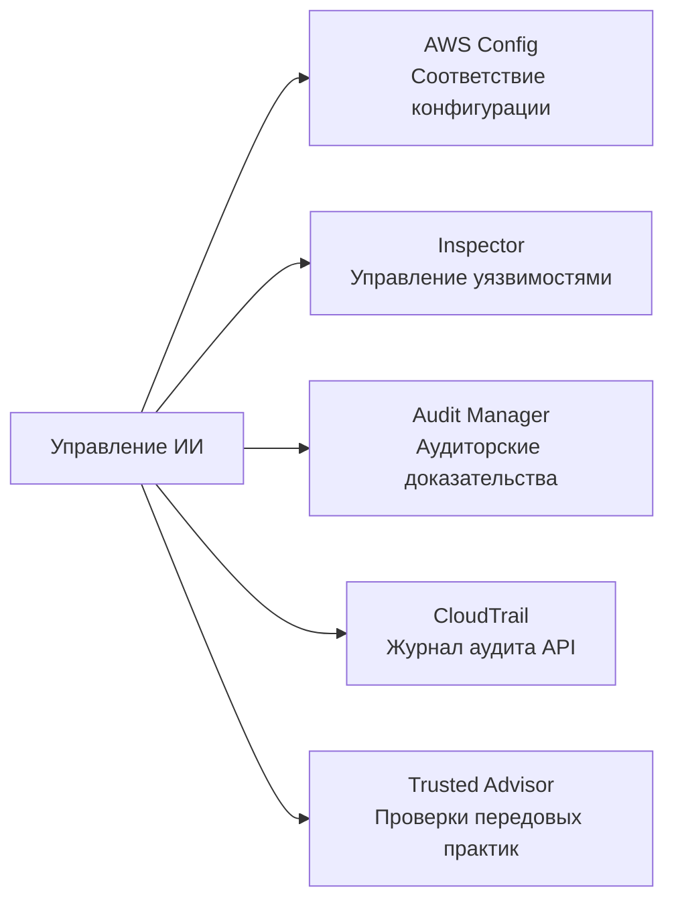
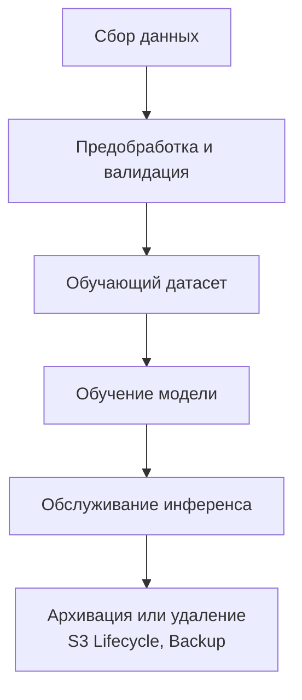
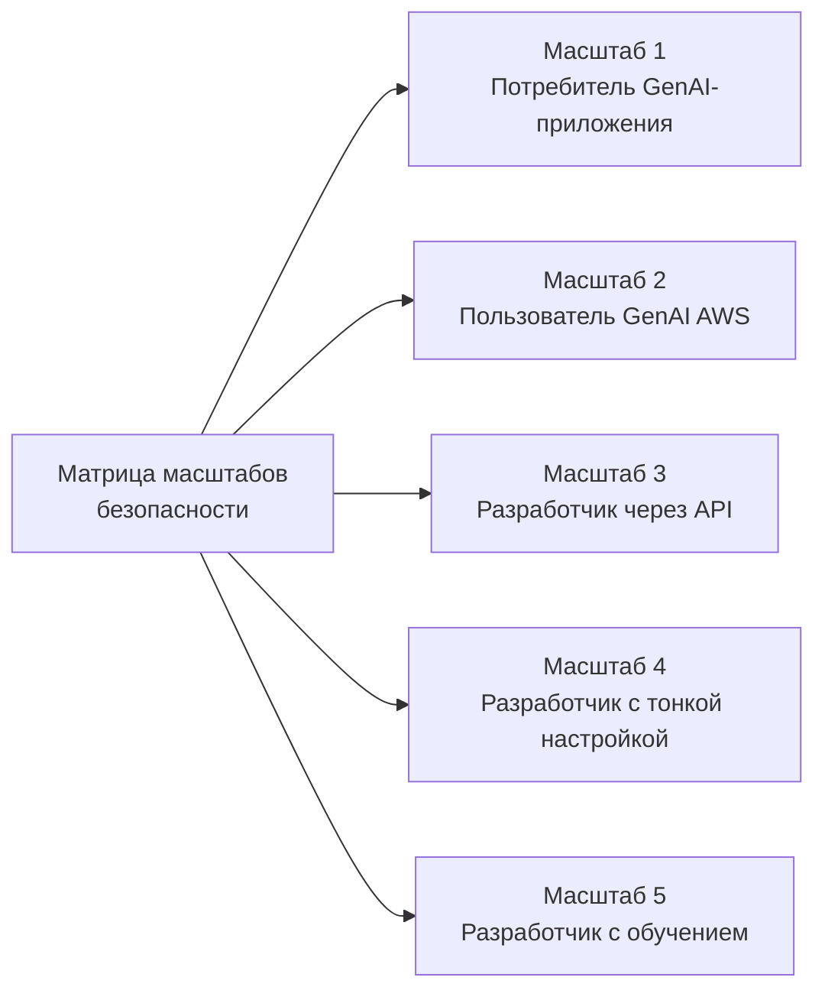
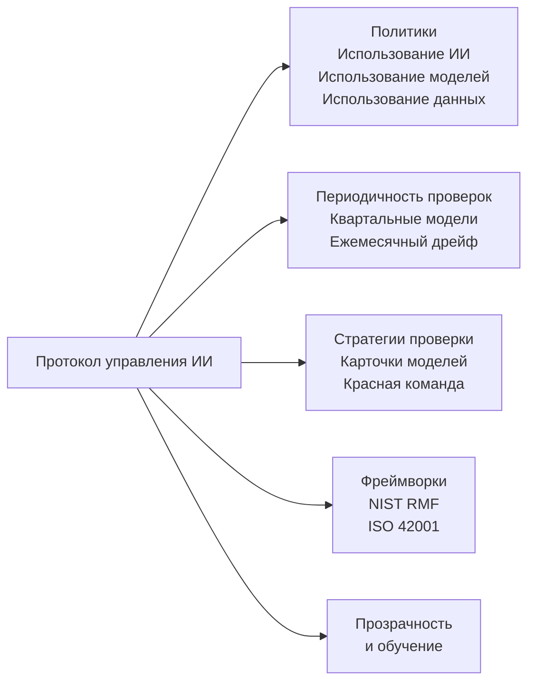

## Задача 5.2. Управление и соответствие требованиям для ИИ-систем

Управление и соответствие требованиям переводят принципы ответственного ИИ в организационную ответственность. Там где средства технического контроля защищают технический уровень, структуры управления создают политики, циклы проверок, журналы аудита и регуляторные доказательства, позволяющие организации объяснять, отстаивать и непрерывно совершенствовать свои ИИ-системы. Данная задача охватывает сервисы AWS, поддерживающие сбор доказательств соответствия требованиям, стратегии управления данными, которых ожидают аудиторы, и процессы управления, обеспечивающие долгосрочную институциональную поддержку ИИ-программ.[^502001]

### 5.2.1 Сервисы и функции AWS для управления и соответствия требованиям

Соответствие требованиям для ИИ-нагрузки — это не одноразовый шлюз, пройденный при развёртывании; это непрерывное состояние, поддерживаемое через постоянный мониторинг, сбор доказательств и готовность к аудиту. AWS предоставляет набор управляемых сервисов, которые совместно охватывают полный жизненный цикл соответствия требованиям: запись конфигурации, сканирование на уязвимости, сбор доказательств в соответствии с фреймворками, получение отчётов по запросу, ведение журнала аудита API и проверки передовых практик. Используемые совместно, эти сервисы позволяют организации продемонстрировать регуляторам, аудиторам и внутренним заинтересованным сторонам, что её ИИ-системы работают в заданных границах.

Взаимосвязь между этими сервисами следует логическому разделению ответственности. **AWS Config** отслеживает состояние конфигурации ресурсов и оценивает их соответствие определённым правилам. **Amazon Inspector** выявляет уязвимости в вычислительном и контейнерном уровнях, на которых работают ИИ-нагрузки. **AWS Audit Manager** организует доказательства соответствия в готовые к аудиту пакеты, согласованные с конкретными фреймворками. **AWS Artifact** предоставляет авторизованным пользователям доступ к собственным сторонним сертификатам соответствия AWS. **AWS CloudTrail** создаёт неизменяемый журнал активности API, доказывающий, кто и что сделал, и когда. **AWS Trusted Advisor** выявляет пробелы в конфигурации относительно передовых практик AWS в области затрат, безопасности, отказоустойчивости и лимитов сервисов.

*Рисунок 5.2.1: Категории сервисов соответствия требованиям AWS. Каждый сервис охватывает отдельный уровень стека аудита и управления для ИИ-нагрузок.*

**AWS Config** — сервис записи конфигурации и оценки правил, непрерывно отслеживающий состояние ресурсов AWS и проверяющий их соответствие определённым политикой правилам соответствия.[^502002] Когда ресурс изменяется, Config записывает новую конфигурацию, сравнивает её с применимыми правилами и помечает несоответствующие. Для ИИ-нагрузок три категории правил особенно актуальны. Во-первых, можно проверять протоколирование вызовов модели Bedrock: правило Config может проверять, что протоколирование включено для Amazon Bedrock, обеспечивая захват каждого запроса к модели для аудита и анализа.[^502003] Во-вторых, можно контролировать доступ к записным книжкам SageMaker: правило, проверяющее, что экземпляры записных книжек Amazon SageMaker требуют доступа на основе IAM, предотвращает прямое подключение к интернету для сред разработки, где живут обучающий код и данные.[^502004] В-третьих, можно применять шифрование: правило, проверяющее, что артефакты пользовательских моделей Bedrock и обучающие тома SageMaker зашифрованы в состоянии покоя, обеспечивает постоянную защиту чувствительных параметров моделей и обучающих данных.[^502005]

Правила Config могут быть сгруппированы в *пакеты соответствия* (*conformance packs*), объединяющие несколько связанных правил в развёртываемый блок, согласованный с конкретным требованием соответствия, таким как NIST SP 800-53 или стандарт AWS Foundational Security Best Practices.[^502006] Когда организация хочет продемонстрировать, что её ИИ-среда соответствует требованиям к контролю фреймворка, развёртывание соответствующего пакета соответствия и экспорт панели мониторинга его статуса обеспечивает единое воспроизводимое представление состояния контроля.

**Amazon Inspector** — сервис непрерывной оценки уязвимостей, сканирующий экземпляры Amazon EC2, функции AWS Lambda и образы контейнеров, хранящихся в Amazon Elastic Container Registry (ECR), на наличие известных уязвимостей программного обеспечения и непреднамеренных сетевых экспозиций.[^502007] ИИ-нагрузки часто работают на инфраструктуре, охватываемой Inspector: задания обучения SageMaker выполняются на флотах экземпляров EC2, контейнеры инференса хранятся в ECR, а пользовательский код инференса может выполняться как функции Lambda. Inspector соотносит результаты с базой данных Common Vulnerabilities and Exposures (CVE) и присваивает оценку риска, позволяя командам безопасности расставлять приоритеты для устранения уязвимостей на основе эксплуатируемости и воздействия.[^502008] С точки зрения управления, результаты Inspector поступают непосредственно в AWS Security Hub, обеспечивая централизованную панель управления, которую аудиторы могут просматривать вместе с другими сигналами соответствия.

**AWS Audit Manager** автоматизирует сбор доказательств для аудиторских проверок соответствия.[^502009] Вместо ручного извлечения скриншотов и выдержек из журналов перед каждым циклом аудита организации настраивают Audit Manager с фреймворком, и сервис непрерывно собирает доказательства из результатов правил AWS Config, вызовов API CloudTrail и результатов Security Hub. Сервис поставляется с готовыми фреймворками для HIPAA, SOC 2, PCI DSS, ISO 27001, FedRAMP и других стандартов, а также с инструментами для создания пользовательских фреймворков для внутренних программ аудита или новых требований, специфичных для ИИ.[^502010] Доказательства хранятся в структурированном отчёте оценки, который аудитор может просматривать без прямого доступа к среде AWS. Для ИИ-программ, подпадающих под HIPAA, например, Audit Manager может собирать доказательства того, что обучающие данные зашифрованы, что доступ к конечным точкам модели протоколируется и что изменения конфигурации модели фиксируются, создавая аудиторский пакет, демонстрирующий работу контроля за определённый период.

**AWS Artifact** — это самообслуживаемый портал, где клиенты AWS могут скачать собственные сертификаты соответствия и соглашения AWS.[^502011] Доступные отчёты включают отчёты SOC 1, SOC 2 и SOC 3 (аудиты системных и организационных контролей, проводимые независимыми третьими сторонами), сертификации ISO 27001, ISO 27017 и ISO 27018 (управление информационной безопасностью и конфиденциальность в облаке), Attestation of Compliance PCI DSS (для нагрузок с платёжными картами) и HIPAA Business Associate Addenda (BAA) для охваченных субъектов здравоохранения.[^502012] Artifact не генерирует доказательства о собственных нагрузках клиента; он предоставляет доказательства о контролях AWS как базового поставщика инфраструктуры. Это различие важно для модели разделения ответственности: клиент представляет отчёты Artifact, чтобы продемонстрировать, что облачная платформа сама по себе соответствует требованиям регулятора к инфраструктуре, тогда как доказательства Audit Manager демонстрируют, что конфигурация и операции клиента соответствуют тем же требованиям.

**AWS CloudTrail** фиксирует каждый вызов API к сервисам AWS и доставляет записи событий в корзину Amazon S3 в течение нескольких минут после вызова.[^502013] Для ИИ-нагрузок это включает каждый вызов API Amazon Bedrock InvokeModel (с фиксацией того, какая модель была вызвана, кем, в какое время и с каким кодом результата), каждый вызов SageMaker CreateTrainingJob и CreateEndpoint, а также каждое изменение политики IAM, влияющее на доступ к модели. CloudTrail также поддерживает события данных, которые записывают активность на уровне объектов в Amazon S3. Включение событий данных S3 для бакета с обучающими данными создаёт журнал каждого чтения и записи обучающих файлов, формируя проверяемую цепочку хранения, демонстрирующую отсутствие несанкционированных изменений между подготовкой данных и обучением модели.[^502014] CloudTrail Lake, управляемый аналитический уровень сервиса, позволяет выполнять SQL-запросы к истории событий без необходимости во внешней системе аналитики журналов, что упрощает ответы на вопросы аудиторов, например: "Покажите мне каждый случай изменения конфигурации конечной точки промышленной модели за последние 90 дней."[^502015]

**AWS Trusted Advisor** оценивает конфигурации учётных записей AWS по передовым практикам AWS в пяти категориях: оптимизация затрат, производительность, безопасность, отказоустойчивость и лимиты сервисов.[^502016] С точки зрения управления, проверки безопасности наиболее непосредственно актуальны для программ соответствия требованиям ИИ. Trusted Advisor помечает такие условия, как публичный доступ к S3-бакетам, неограниченные правила групп безопасности, ключи доступа IAM, не ротировавшиеся, и использование корневой учётной записи. Для ИИ-нагрузок проверки лимитов сервисов тоже важны: конечная точка SageMaker, приближающаяся к лимиту количества экземпляров, может не масштабироваться в период пикового инференса, что может привести к проблеме доступности сервиса, подлежащей отчётности согласно определённым SLA.[^502017] Результаты Trusted Advisor доступны в консоли AWS и через API, поэтому их можно добавлять в панели управления соответствием наряду с результатами Config, Inspector и Security Hub.

*Таблица 5.2.1: Сервисы управления и соответствия требованиям AWS, сопоставленные с вариантами использования ИИ*

| Сервис | Основная функция | Вариант использования для управления ИИ |
|---|---|---|
| AWS Config | Запись конфигурации и оценка правил | Проверка включения протоколирования Bedrock; применение доступа только через IAM для SageMaker; проверка шифрования артефактов моделей |
| Amazon Inspector | Сканирование уязвимостей для EC2, Lambda, ECR | Сканирование контейнеров инференса и функций Lambda на CVE; обнаружение непреднамеренной сетевой экспозиции |
| AWS Audit Manager | Автоматический сбор доказательств для аудиторских фреймворков | Сбор доказательств HIPAA, SOC 2, PCI для ИИ-нагрузок; создание отчётов, готовых к аудиту |
| AWS Artifact | Загрузка сертификатов соответствия AWS | Получение SOC, ISO, PCI, HIPAA BAA для демонстрации регуляторам соответствия платформы |
| AWS CloudTrail | Неизменяемый журнал аудита API | Регистрация каждого вызова Bedrock InvokeModel; запись событий данных S3 в бакетах с обучающими данными |
| AWS Trusted Advisor | Проверки передовых практик по безопасности, затратам, лимитам | Пометка публичных S3-бакетов, неротированных ключей IAM, рисков лимитов сервисов SageMaker |

Вместе эти шесть сервисов формируют уровень инструментации соответствия для ИИ-нагрузки на AWS. Config и Inspector отслеживают текущее состояние. CloudTrail фиксирует историческое состояние. Audit Manager упаковывает оба в аудиторские доказательства. Artifact предоставляет собственные сертификаты соответствия AWS. Trusted Advisor выявляет пробелы до того, как их найдут аудиторы или произойдут инциденты.

AWS Security Hub агрегирует результаты Config, Inspector и Macie в единую панель управления соответствием. Он рассматривается в Задаче 5.1, поскольку находится на уровне мониторинга безопасности, но является естественным потребителем сигналов, генерируемых этими шестью сервисами управления. Следующий раздел охватывает то, как стратегии управления данными накладываются на эту инструментацию для управления информацией, которую обрабатывают ИИ-системы.

### 5.2.2 Стратегии управления данными

Данные — это входной поток, определяющий, что ИИ-система может знать и как она будет вести себя. Управление данными для ИИ означает управление их полным жизненным циклом: от первоначального сбора через активное использование, архивацию и окончательное удаление — с заданными средствами контроля на каждом этапе. ИИ-система, обрабатывающая медицинские записи клиентов, финансовые транзакции или личные коммуникации, несёт обязательства по управлению данными организации, собравшей эти данные; модель не создаёт правового исключения из требований конфиденциальности, резидентности или хранения.

Дисциплина *управления данными* охватывает шесть практик, которые экзамен ожидает от специалистов: управление жизненным циклом, протоколирование, резидентность, мониторинг, наблюдаемость и хранение. Каждая практика устраняет отдельную категорию риска управления.

**Управление жизненным циклом данных** отслеживает путь данных с момента их создания или получения до момента их удаления или архивирования.[^502018] Для обучающего датасета ИИ жизненный цикл, как правило, проходит через сбор и загрузку, предобработку и валидацию, обучение и хранение артефактов модели, извлечение признаков во время инференса и окончательное архивирование или удаление при выводе модели из эксплуатации. На каждом этапе должен быть задокументированный владелец, определённые стандарты качества и политика доступа, ограничивающая круг тех, кто может читать или изменять данные. **AWS Glue Data Catalog** фиксирует метаданные датасетов на каждом этапе: схемы таблиц, типы данных, временные метки последнего изменения и описания на уровне столбцов.[^502019] Когда аудитор спрашивает, на каких данных обучалась конкретная версия модели, запись AWS Glue Data Catalog для обучающего датасета, связанная с карточкой модели SageMaker, даёт прослеживаемый ответ.

**AWS Lake Formation** расширяет AWS Glue Data Catalog гранулированным контролем доступа, позволяя организациям предоставлять разрешения на уровне столбца, строки и ячейки для датасетов, хранящихся в Amazon S3.[^502020] Для управления ИИ это важно, когда обучающий датасет содержит смесь столбцов с персональными данными (PII) и без них. Lake Formation может предоставить инженеру по машинному обучению доступ на чтение к столбцам без PII, блокируя доступ к именам, адресам и идентификационным номерам до заключения официального соглашения об использовании данных. Эта модель *необходимости знать* на уровне столбца значительно точнее политик IAM на уровне бакета и является подходом, которого ожидают регуляторы при обработке чувствительных данных.

*Рисунок 5.2.2: Жизненный цикл данных ИИ. Данные проходят путь от сбора через обучение и инференс до архивации, со средствами контроля управления на каждом этапе.*

**Протоколирование** в контексте управления данными относится к фиксации того, к каким данным был получен доступ, какой системой или пользователем, в какое время и с какой целью.[^502021] Для ИИ-приложения актуальны три поверхности протоколирования. События данных CloudTrail фиксируют чтение и запись в бакетах S3 с обучающими данными и артефактами моделей, обеспечивая журнал доступа на уровне объекта. Протоколирование вызовов модели Amazon Bedrock захватывает входной промпт, ответ модели и метаданные для каждого вызова инференса, что важно, когда последующие нормативные акты требуют возможности воспроизвести, какая информация была предоставлена пользователям.[^502022] Amazon CloudWatch Logs сохраняет журналы уровня приложения от функций Lambda, контейнеров ECS и конечных точек инференса SageMaker, фиксируя ошибки времени выполнения и паттерны вывода, которые могут указывать на непреднамеренное раскрытие данных. Сроки хранения журналов должны быть установлены так, чтобы соответствовать регулирующему нормативному акту: HIPAA требует минимум шесть лет для определённых записей, PCI DSS требует один год с 90-дневной немедленной доступностью, а многие финансовые регуляторы требуют семь лет.[^502023]

**Резидентность данных** — требование о том, что данные остаются в пределах определённой географической границы, как правило, определяемой законом.[^502024] Общий регламент по защите данных Европейского Союза (GDPR) ограничивает передачу персональных данных резидентов ЕС в страны за пределами Европейской экономической зоны, если не предусмотрены конкретные гарантии.[^502025] Для ИИ-нагрузок AWS резидентность контролируется через выбор региона. Обучающие данные для приложения, регулируемого ЕС, должны находиться в S3-бакетах в регионе `eu-*`, задания обучения модели должны быть настроены на выполнение в этом регионе, а вызовы модели Amazon Bedrock должны использовать конечную точку в том же регионе. **Amazon Bedrock** соблюдает региональное назначение: вызов инференса модели обрабатывается в регионе, где настроена конечная точка, и входные и выходные данные не покидают этот регион, за исключением явно настроенных случаев.[^502026] Соответствие требованиям резидентности требует дисциплинированного выбора региона на всём протяжении конвейера, а не только на уровне хранения.

**Мониторинг** в управлении данными отслеживает, остаются ли паттерны доступа к данным и их использования в границах, определённых политикой.[^502027] Для ИИ-системы мониторинг включает проверку того, что модель не вызывается с категориями данных, которые она не была одобрена обрабатывать, что ответы-выводы не содержат PII, которые должны были быть подавлены, и что объёмы вызовов API не резко возрастают способами, указывающими на попытки эксфильтрации данных. Amazon CloudWatch Metrics захватывает операционные сигналы, **Amazon Macie** сканирует S3-бакеты на предмет содержимого PII и необычных паттернов доступа (рассмотрено в Задаче 5.1 в контексте безопасности данных), а протоколирование вызовов Bedrock предоставляет сырой материал для пользовательских правил обнаружения, создаваемых в CloudWatch Logs Insights. Там где мониторинг спрашивает "нарушает ли кто-то правила?", наблюдаемость (рассматривается далее) спрашивает "изменяются ли сами данные под нами?"

**Наблюдаемость** — практика непрерывного отслеживания статистических свойств данных, проходящих через ИИ-систему, для обнаружения *дрейфа данных*.[^502028] Дрейф данных возникает, когда распределение данных, наблюдаемых в промышленной среде, существенно отличается от распределения, используемого для обучения модели. Например, модель обнаружения мошенничества, обученная на транзакциях 2022 года, могла научиться паттернам, которые уже не характеризуют мошеннические действия 2024 года; предсказания модели деградируют, тогда как её структурные метрики производительности остаются неизменными. Наблюдение за дрейфом данных требует захвата репрезентативной выборки входных данных инференса, вычисления их статистических свойств и сравнения этих свойств с базовым уровнем, установленным из обучающего датасета. **Amazon SageMaker Model Monitor** автоматизирует этот процесс, планируя сравнения базового уровня качества данных и качества модели и создавая CloudWatch-аварийные оповещения, когда дрейф превышает настраиваемые пороги.[^502029]

**Хранение** определяет, как долго данные должны храниться и когда они должны быть удалены.[^502030] Политика хранения охватывает как минимум (минимальные правовые и нормативные сроки), так и максимум (законы о конфиденциальности могут запрещать хранение персональных данных дольше, чем необходимо для их первоначальной цели). **Политики жизненного цикла Amazon S3** автоматизируют переход объектов через уровни хранения (Standard → Standard-IA → Glacier → Glacier Deep Archive) по заданному расписанию и обеспечивают удаление по истечении срока хранения.[^502031] **AWS Backup** предоставляет централизованный сервис для планирования, мониторинга и применения политик резервного копирования и хранения для S3, RDS, DynamoDB, EFS и других сервисов, с неизменяемыми точками восстановления, которые нельзя удалить до истечения настроенного срока хранения — свойство, которое регуляторы рассматривают как эквивалент юридического запрета на удаление.[^502032]

*Таблица 5.2.2: Практики управления данными, сопоставленные с сервисами AWS и рисками ИИ*

| Практика управления | Что она охватывает | Соответствующий сервис AWS | Снижаемый риск ИИ |
|---|---|---|---|
| Управление жизненным циклом данных | Прослеживание данных от создания до удаления | AWS Glue Data Catalog, AWS Lake Formation | Невозможность определить источник обучающих данных при аудите |
| Протоколирование | Фиксация записей доступа и использования | AWS CloudTrail (события данных), протоколирование вызовов Bedrock, CloudWatch Logs | Невозможность воспроизвести взаимодействия с моделью для регуляторного запроса |
| Резидентность данных | Удержание данных в географических границах | Выбор региона, региональные конечные точки Amazon Bedrock | Нарушение GDPR, трансграничная передача данных без гарантий |
| Мониторинг | Обнаружение нарушений политики в доступе к данным и выводе | Amazon Macie, CloudWatch Metrics, протоколирование Bedrock | Раскрытие PII в выводе модели, несанкционированный доступ к данным |
| Наблюдаемость | Обнаружение дрейфа в распределении данных со временем | Amazon SageMaker Model Monitor | Незаметная деградация модели из-за изменившегося распределения входных данных |
| Хранение | Применение минимальных и максимальных сроков хранения данных | Политики жизненного цикла Amazon S3, AWS Backup | Хранение персональных данных сверх законного лимита; преждевременное удаление доказательств |

Эти шесть практик применяются на каждом этапе жизненного цикла данных ИИ. Организации, которые формализуют каждую практику в письменной политике, отображают её на конкретные сервисы AWS в своей среде и периодически проверяют это отображение, находятся в существенно лучшем положении, когда регуляторы или внутренние аудиторы запрашивают доказательства зрелости управления данными. Следующий раздел охватывает то, как протоколы управления связывают политики и сервисы в структурированную программу.

### 5.2.3 Процессы для соблюдения протоколов управления

Технические средства контроля и практики работы с данными имеют ограниченную организационную долговечность, если они не встроены в формальные процессы управления: письменные политики, повторяющиеся циклы проверок, установленные фреймворки и обученные команды. Этот раздел охватывает процессный уровень управления ИИ, уделяя особое внимание AWS Generative AI Security Scoping Matrix, которая обеспечивает практический способ калибровки ответственности по управлению в зависимости от того, как организация взаимодействует с ИИ.

**Политики** — это базовые документы управления, устанавливающие допустимое использование, определяющие сферы ответственности и задающие границы для разработки и эксплуатации ИИ-систем.[^502033] Для ИИ-программы актуальны три категории политик. *Политика использования ИИ* определяет, к каким бизнес-вариантам использования организация уполномочена применять ИИ, какие категории данных ИИ-системы могут обрабатывать и на какие решения ИИ может влиять без проверки человеком. *Политика использования моделей* определяет допустимые модели для разных уровней риска (например, только одобренные базовые модели AWS Bedrock для клиентских приложений, любые модели для внутренних инструментов повышения производительности), процесс добавления новой модели в одобренный список и запреты, применяемые независимо от варианта использования. *Политика использования данных* определяет, какие датасеты могут использоваться для обучения или дообучения моделей, какое согласие или анонимизация требуются до того, как персональные данные войдут в конвейер обучения, и для каких уровней классификации данных требуются дополнительные шлюзы одобрения.

Политики нуждаются в ответственном лице, истории версий, дате ежегодного пересмотра и связи с техническими средствами контроля, обеспечивающими их соблюдение. Политика, утверждающая, что "все обучающие данные должны быть зашифрованы", должна быть прослеживаема до правила AWS Config, проверяющего статус шифрования соответствующих S3-бакетов и обучающих томов SageMaker.

**Периодичность проверок** — это расписание, по которому решения по управлению пересматриваются, корректируются или подтверждаются заново.[^502034] ИИ-системы не являются статичными: модели дрейфуют, ландшафты угроз эволюционируют, нормативные акты меняются, а бизнес-варианты использования расширяются. Три частоты проверок охватывают разные категории изменений. Квартальные проверки моделей оценивают, продолжают ли развёрнутые модели работать в допустимых границах точности, справедливости и безопасности, используя метрики, установленные в карточке модели. Ежемесячные проверки дрейфа исследуют вывод SageMaker Model Monitor и журналы вызовов Bedrock для обнаружения распределительных сдвигов или аномальных паттернов вывода до того, как они накопятся в регистрируемый инцидент. Проверки модели угроз при развёртывании проводятся до того, как новая версия модели, новый источник данных или новая возможность агента выходят в промышленную эксплуатацию; они оценивают, вводит ли изменение новые векторы атак (например, риск инъекции промптов из нового внешнего источника данных) и достаточны ли существующие средства контроля.

**Стратегии проверки** — это структурированные методы, используемые в цикле проверки для оценки поведения ИИ-системы.[^502035] К ИИ-системам обычно применяются три стратегии. *Проверки карточек моделей* используют официальную документацию модели (рассмотренную в Задаче 5.1 в контексте происхождения данных) как основу для структурированного сравнения предназначенного и наблюдаемого поведения, проверяя, что фактическая промышленная производительность модели соответствует характеристикам, задокументированным при развёртывании. *Упражнения красной команды* моделируют враждебное использование ИИ-системы: участники красной команды пытаются вызвать вредоносные выводы, обойти guardrails, извлечь обучающие данные или заставить систему действовать за пределами её предназначенного масштаба. Упражнения красной команды создают отчёт о результатах, который стимулирует обновления конфигураций guardrails, шаблонов промптов и правил мониторинга. *Проверки доверия клиентов* проверяют, точно ли внешние коммуникации организации об ИИ-системе, включая документацию продукта, раскрытие информации об обработке данных и описания возможностей модели, отражают текущее поведение системы; расхождения между опубликованными заявлениями и фактическим поведением подвергают организацию регуляторному и репутационному риску.

**Фреймворки управления** предоставляют структурированный словарь и таксономии контроля, которые организации используют для построения и коммуникации своих программ управления ИИ.[^502036] В целях экзамена или в опубликованных руководствах AWS упоминаются четыре фреймворка.

**AWS Generative AI Security Scoping Matrix** — наиболее операционно конкретный из четырёх и единственный, явно названный в экзамене.[^502037] Он описывает пять масштабов развёртывания, представляющих возрастающий уровень ответственности клиента: от потребления стороннего GenAI-приложения до обучения полностью пользовательской модели. Каждый масштаб имеет определённый набор обязанностей по безопасности и управлению, которые ложатся на клиента, а не на поставщика.

*Рисунок 5.2.3: AWS Generative AI Security Scoping Matrix. Каждый масштаб представляет более широкий набор обязанностей по управлению на стороне клиента.*

В **Масштабе 1** сотрудник использует публично доступное потребительское GenAI-приложение. Основная ответственность организации — применение политики допустимого использования: обеспечение того, что сотрудник не вводит конфиденциальную корпоративную информацию в систему, которую организация не контролирует.

В **Масштабе 2** организация использует корпоративное SaaS-приложение со встроенными возможностями GenAI (например, CRM, суммирующий заметки по счетам). Поставщик SaaS управляет моделью и большей частью позиции безопасности; клиент управляет тем, какие данные приложению разрешено загружать, как оно интегрируется с внутренней идентичностью и какие раскрытия требуются конечным пользователям.

В **Масштабе 3** команда разработчиков создаёт приложение, вызывающее API базовой модели, такой как Amazon Bedrock, пишет собственную логику проектирования промптов и интегрирует модель в бизнес-рабочий процесс. Клиент теперь управляет качеством промптов, безопасностью выводов и архитектурой интеграции; AWS продолжает управлять инфраструктурой модели и безопасностью базового сервиса.

В **Масштабе 4** клиент дообучает базовую модель на проприетарных данных, принимая на себя ответственность за обучающий датасет, процесс дообучения и артефакт модели в дополнение к обязанностям Масштаба 3.

В **Масштабе 5** клиент обучает модель с нуля, принимая на себя полную ответственность за поведение модели, инфраструктуру обучения и все связанные данные.[^502038]

Матрица масштабов является практической отправной точкой для планирования управления, поскольку позволяет организации быстро определить, в какой масштаб попадает каждый из её видов деятельности в области ИИ, и, следовательно, какие средства контроля управления ей необходимо внедрить, которые поставщик не покроет. Большинство предприятий одновременно работают в нескольких масштабах: сотрудники используют потребительские GenAI-инструменты (Масштаб 1), продуктовые команды строят на API Bedrock (Масштабы 2 и 3), а команды специалистов по данным дообучают доменно-специфические модели (Масштаб 4).

*Таблица 5.2.3: Сводка AWS Generative AI Security Scoping Matrix*

| Масштаб | Деятельность клиента | Ответственность за модель | Ответственность за данные | Ключевое действие по управлению |
|---|---|---|---|---|
| 1 | Потребление стороннего GenAI-приложения | Третья сторона | Клиент: что входит и выходит из приложения | Политика допустимого использования; обучение сотрудников |
| 2 | Использование корпоративного SaaS со встроенным GenAI | Поставщик SaaS | Клиент: данные загрузки, интеграции, раскрытия | Должная осмотрительность поставщика; политика интеграции |
| 3 | Создание приложения на API FM (напр., Bedrock) | AWS (инфраструктура) | Клиент: промпты, выводы, интеграции | Безопасность промптов; guardrails; модель угроз интеграции |
| 4 | Дообучение модели | Совместная (базовая модель — поставщик) | Клиент: датасет дообучения и артефакт | Управление данными обучения; шифрование артефактов |
| 5 | Обучение пользовательской модели | Клиент | Клиент: все данные и модель | Полная программа безопасности ИИ; карточка модели; всесторонние средства контроля |

**NIST AI Risk Management Framework (AI RMF)** — добровольный фреймворк Национального института стандартов и технологий, определяющий четыре функции управления риском ИИ: Управление, Картирование, Измерение и Реагирование.[^502039] Функция Управления устанавливает структуры ответственности и политики. Функция Картирования идентифицирует и категоризирует риски ИИ в контексте. Функция Измерения количественно определяет уровни риска и отслеживает эффективность смягчения. Функция Реагирования определяет действия по устранению выявленных рисков. NIST AI RMF хорошо согласуется с организационными практиками управления, рассмотренными в этом разделе, и широко цитируется регуляторами и органами по промышленным стандартам как рекомендуемый подход к управлению рисками ИИ в США.

**ISO/IEC 42001** — международный стандарт для систем управления ИИ, опубликованный Международной организацией по стандартизации.[^502040] Он определяет требования к созданию, внедрению, поддержанию и непрерывному совершенствованию системы управления ИИ в организации, охватывая цели, роли, оценку рисков и оценку производительности. Сертификация по ISO 42001 обеспечивает независимое подтверждение того, что программа управления ИИ организации соответствует требованиям стандарта, что всё больше признаётся корпоративными процессами закупок и государственными регуляторами за пределами США.

**Закон ЕС об ИИ** (EU AI Act) классифицирует ИИ-системы по уровню риска и соответствующим образом назначает обязательства по соответствию требованиям.[^502041] Системы высшего уровня риска, охватывающие приложения в критической инфраструктуре, решения о трудоустройстве, образовании, кредитном скоринге, правоохранительной деятельности и биометрической идентификации, должны соответствовать требованиям прозрачности, надзора человека, управления данными и точности до развёртывания в ЕС. Системы с более низким риском несут более мягкие обязательства, а некоторые ИИ-приложения запрещены полностью. Для специалистов классификация рисков Закона является входными данными для управления: при создании ИИ-системы определение её уровня риска по Закону ЕС об ИИ определяет требуемый уровень документации, тестирования и аудиторских доказательств.

**Стандарты прозрачности** определяют, что организация раскрывает о своих ИИ-системах внутренним заинтересованным сторонам, внешним пользователям и регуляторам.[^502042] Как минимум, внутренняя прозрачность означает публикацию карточек моделей для всех промышленных моделей, документирование известных ограничений, оценок предвзятости и предполагаемого масштаба, а также обеспечение доступности этой документации для команд безопасности, юридической и комплаенс-служб, осуществляющих надзор за системой. Внешняя прозрачность означает раскрытие пользователям того, что они взаимодействуют с ИИ-системой, когда это взаимодействие может не быть очевидным, описание категорий данных, используемых для персонализации, и коммуникацию о том, как выводы системы проверяются до представления как фактических.

**Требования к обучению команды** признают, что программы управления дают сбой, когда люди, ответственные за эксплуатацию ИИ-систем, не понимают соответствующих политик и рисков.[^502043] К разным ролям применяются три уровня обучения. Ежегодное обучение ИИ-грамотности, обязательное для всех сотрудников, охватывает, что такое ИИ, как политика использования ИИ в организации применяется к их работе и что делать, когда они сталкиваются с выводом ИИ, который подозревают в неверности или вреде. Ролевое обучение для создателей ИИ охватывает требования к управлению данными, документирование карточек моделей, использование Amazon Bedrock Guardrails и SageMaker Model Monitor, а также модель угроз для систем генеративного ИИ. Ролевое обучение для проверяющих и утверждающих, включая менеджеров продуктов, офицеров по соответствию требованиям и юридический персонал, охватывает, как оценивать карточки моделей, как интерпретировать выводы мониторинга дрейфа и как проводить проверки карточек моделей и упражнения красной команды. Записи о прохождении обучения должны храниться в том же репозитории управления, что и политические документы и аудиторские доказательства.

*Рисунок 5.2.4: Компоненты протокола управления ИИ. Каждый компонент устраняет отдельный пробел в ответственности в программе управления ИИ.*

Эффективный протокол управления связывает эти шесть компонентов в повторяющийся цикл, а не рассматривает их как независимые чекбоксы. Политики определяют требования. Фреймворки предоставляют словарь для оценки соответствия. Проверки применяют эту оценку через регулярные интервалы. Стандарты прозрачности определяют, какие доказательства должны быть переданы. Обучение обеспечивает понимание ответственными за каждый компонент своей роли. Вместе они создают программу управления, способную выдержать внешний контроль и сохранить свою эффективность по мере эволюции ИИ-систем.

Управление на таком уровне не требует выделенной команды по управлению ИИ с первого дня. Большинство организаций начинают с адаптации существующих процессов управления изменениями, рисками и соответствием требованиям для включения соображений, специфичных для ИИ, используя матрицу масштабов AWS для определения новых средств контроля, не покрытых поставщиком, и систематического устранения этих пробелов. Зрелость программы растёт вместе со сложностью ИИ-портфеля.

На этом завершается Задача 5.2 и Домен 5. Сопутствующая глава, Задача 5.1, охватила технические средства контроля безопасности, за которыми призваны следить описанные здесь протоколы управления. Вместе обе задачи дают полное представление о том, как ИИ-системы на AWS поддерживаются безопасными, проверяемыми и соответствующими требованиям в промышленной эксплуатации.

## Вопросы для самопроверки

**Вопрос 1.** Медицинская организация готовится к аудиту соответствия HIPAA своей ИИ-нагрузки на AWS. Аудиторы требуют доказательства того, что все изменения конфигурации модели Amazon Bedrock были зафиксированы и что S3-бакеты с обучающими данными организации в течение последнего года не были публично доступны. Какая комбинация сервисов AWS НАИБОЛЕЕ непосредственно создаёт эти доказательства?

A. AWS Trusted Advisor и Amazon Inspector
B. AWS Audit Manager и AWS Config
C. AWS CloudTrail и Amazon Macie
D. AWS Artifact и Amazon Inspector

**Объяснение:** Сценарий требует двух типов доказательств: неизменяемого журнала изменений конфигурации и записи соответствия, показывающей, что публичный доступ S3 был заблокирован. AWS Audit Manager непрерывно собирает доказательства из результатов правил AWS Config и вызовов API CloudTrail, упаковывает их согласно фреймворку HIPAA и создаёт структурированный отчёт аудита без необходимости предоставлять аудитору прямой доступ к консоли AWS. AWS Config фиксирует состояние конфигурации ресурсов во времени, поэтому правило Config, требующее настроек блокировки публичного доступа S3, предоставляет исторические данные о соответствии.[^502044] Вместе эти сервисы охватывают оба требования. Вариант A (Trusted Advisor и Inspector) не создаёт исторических записей соответствия; Trusted Advisor показывает текущее состояние, а Inspector находит программные уязвимости — ни один из них не отвечает на исторические вопросы аудитора. Вариант C (CloudTrail и Macie) охватывает протоколирование и обнаружение PII, но не упаковывает доказательства в соответствии с фреймворком HIPAA и не подтверждает непрерывное соответствие политике S3. Вариант D (Artifact и Inspector) неверен, поскольку Artifact содержит собственные сертификаты соответствия AWS, а не доказательства истории конфигурации клиента, а Inspector сканирует на программные уязвимости, а не на соответствие контроля доступа.[^502045]

---

**Вопрос 2.** Компания финансовых услуг развёртывает ИИ-модель для поддержки решений по кредитному скорингу для клиентов в Европейском Союзе. Команда по управлению данными компании спрашивает, какой механизм AWS НАИЛУЧШИМ образом обеспечивает, что данные клиентов ЕС, используемые для инференса модели, не покидают ЕС. Какой подход НАИБОЛЕЕ непосредственно решает это требование?

A. Включить AWS CloudTrail во всех регионах для отслеживания доступа к данным
B. Использовать Amazon Macie для сканирования на PII и оповещения, когда данные ЕС обнаруживаются за пределами бакетов ЕС
C. Настроить конечные точки Amazon Bedrock и всё вспомогательное хранилище только в регионах `eu-*` и не настраивать межрегиональную репликацию в направлениях за пределами ЕС
D. Включить пакеты соответствия AWS Config для GDPR и еженедельно просматривать панель управления

**Объяснение:** Резидентность данных контролируется через географическое размещение вычислений и хранения, а не через постфактумный мониторинг.[^502046] Настройка конечных точек Amazon Bedrock в регионе `eu-*` обеспечивает обработку запросов на инференс модели в инфраструктуре ЕС; Amazon Bedrock не направляет трафик инференса за пределы настроенного региона. Ограничение всех бакетов с обучающими данными и данными инференса регионами ЕС и отказ от настройки межрегиональной репликации в направления за пределами ЕС закрывает путь репликации. Эта комбинация (вариант C) является прямым механизмом соблюдения требований резидентности. Вариант A неверен, поскольку CloudTrail фиксирует произошедшее, но не предотвращает покидание данных ЕС. Вариант B неверен, поскольку Macie обнаруживает PII и аномальные паттерны доступа постфактум; он не применяет географическое размещение. Вариант D неверен, поскольку пакет соответствия Config проверяет правила конфигурации, но без базовых мер контроля регионов S3 и Bedrock пакет соответствия не имеет что проверять; техническое применение стоит на первом месте.[^502047]

---

**Вопрос 3.** Компания развернула систему рекомендации продуктов для клиентов, вызывающую базовую модель Amazon Bedrock. Модель была дообучена на исторических данных о покупках компании. Основываясь на AWS Generative AI Security Scoping Matrix, какой масштаб НАИЛУЧШИМ образом описывает это развёртывание, и какова ОСНОВНАЯ обязанность по управлению, которую компания несёт, а поставщик ИИ-модели не несёт?

A. Масштаб 2; компания отвечает только за то, чтобы сотрудники не вводили чувствительные данные в приложение
B. Масштаб 3; компания отвечает за качество и безопасность промптов, выводов и архитектуры интеграции
C. Масштаб 4; компания отвечает за датасет дообучения, процесс обучения и результирующий артефакт модели
D. Масштаб 5; компания отвечает за всю модель, включая данные предобучения базовой модели

**Объяснение:** Компания дообучила существующую базовую модель на проприетарных данных о покупках.[^502048] Дообучение модели относит развёртывание к Масштабу 4 AWS Generative AI Security Scoping Matrix, где клиент берёт на себя ответственность за обучающий датасет, используемый при дообучении, сам процесс дообучения и результирующий артефакт пользовательской модели (шифрование, контроль доступа, управление версиями). Поставщик модели (AWS и базовый разработчик FM) сохраняет ответственность за инфраструктуру и безопасность базовой предобученной модели, но специфические для клиента поведенческие модификации, введённые через дообучение, являются ответственностью клиента.[^502049] Вариант A описывает Масштаб 1 (потребление стороннего потребительского приложения), что не применимо к пользовательской системе рекомендации продуктов. Вариант B описывает Масштаб 3, применимый, когда разработчик вызывает API немодифицированной FM; дообучение выходит за рамки Масштаба 3, поскольку клиент изменил модель. Вариант D описывает Масштаб 5, применимый только тогда, когда клиент обучает модель полностью с нуля, а не при дообучении существующей модели поставщика.

---

**Вопрос 4.** Офицер по соответствию требованиям компании хочет скачать отчёт AWS SOC 2 Type II для представления потенциальному корпоративному клиенту в качестве доказательства того, что инфраструктура AWS соответствует стандартам безопасности и доступности. Какой сервис AWS предоставляет этот отчёт?

A. AWS Audit Manager
B. AWS Config
C. AWS Artifact
D. AWS Trusted Advisor

**Объяснение:** AWS Artifact — это самообслуживаемый портал, где клиенты AWS могут скачать собственные сторонние сертификаты соответствия и соглашения AWS, включая отчёты SOC 1, SOC 2 и SOC 3, сертификации ISO, PCI DSS Attestation of Compliance и HIPAA Business Associate Addenda.[^502050] Отчёт SOC 2 Type II — это отчёт о контролях AWS, подготовленный независимым аудитором; он хранится в Artifact и может быть скачан под NDA авторизованными клиентами AWS для представления их собственным клиентам или регуляторам в качестве доказательства безопасности на уровне платформы. Вариант A (Audit Manager) собирает доказательства о собственных нагрузках клиента и упаковывает их для аудитов клиента; он не хранит собственные отчёты о соответствии AWS. Вариант B (Config) фиксирует состояние конфигурации ресурсов клиента; он не связан со сторонними аудиторскими отчётами AWS. Вариант D (Trusted Advisor) оценивает учётную запись клиента по передовым практикам AWS; он не хранит и не распространяет отчёты о соответствии.[^502051]

---

**Вопрос 5.** ИИ-модель компании для одобрения кредитов находится в промышленной эксплуатации восемь месяцев. Команда по науке о данных подозревает, что распределение входных данных модели изменилось, поскольку недавние экономические условия существенно отличаются от условий в обучающем датасете. Офицер по соответствию требованиям требует задокументированного процесса для обнаружения этой проблемы и реагирования на неё. Какая комбинация инструментов и практик НАИЛУЧШИМ образом охватывает как требования обнаружения, так и требования управления?

A. Включить события данных AWS CloudTrail для обучающего S3-бакета и ежемесячно просматривать журналы доступа
B. Развернуть Amazon Inspector на экземплярах EC2 инференса и планировать еженедельные сканирования на уязвимости
C. Настроить Amazon SageMaker Model Monitor с базовыми уровнями качества данных и направить оповещения на CloudWatch-тревогу, связанную с квартальным процессом проверки модели
D. Использовать AWS Audit Manager с фреймворком NIST AI RMF для ежеквартального сбора доказательств точности модели

**Объяснение:** Сценарий описывает *дрейф данных* — ситуацию, когда производственные входные данные расходятся с обучающим распределением, вызывая незаметную деградацию модели.[^502052] Amazon SageMaker Model Monitor — это сервис AWS, специально предназначенный для этого: он вычисляет статистический базовый уровень из обучающего датасета, непрерывно берёт выборки входных данных инференса и создаёт CloudWatch-тревоги, когда промышленное распределение расходится за пределы настроенного порога. Направление этих тревог в процесс квартальной проверки модели замыкает цикл управления, обеспечивая, что обнаруженный дрейф инициирует задокументированную, запланированную проверку, а не остаётся без внимания.[^502053] Это комбинация, охватывающая как обнаружение (Model Monitor), так и управление (периодичность проверок). Вариант A (события данных CloudTrail) фиксирует, кто обращался к бакету с обучающими данными, но не даёт информации о распределительном сдвиге во входных данных инференса. Вариант B (сканирование Inspector на уязвимости) выявляет программные уязвимости в инфраструктуре инференса; он не анализирует статистические свойства входных данных модели. Вариант D (Audit Manager с NIST AI RMF) полезен для сбора доказательств соответствия и формирования программы управления, но Audit Manager не обнаруживает дрейф; он собирает доказательства о средствах контроля, а не о статистике входных данных модели.[^502054]

---

[^502001]: AWS Certification. AI Practitioner (AIF-C01) Exam Guide v1.1, Domain 5. URL: <https://docs.aws.amazon.com/aws-certification/latest/ai-practitioner-01/ai-practitioner-01-domain5.html>
[^502002]: AWS Config. What Is AWS Config? URL: <https://docs.aws.amazon.com/config/latest/developerguide/WhatIsConfig.html>
[^502003]: AWS Config. Amazon Bedrock managed rules. URL: <https://docs.aws.amazon.com/config/latest/developerguide/bedrock-model-invocation-logging-enabled.html>
[^502004]: AWS Config. SageMaker notebook instance managed rules. URL: <https://docs.aws.amazon.com/config/latest/developerguide/sagemaker-notebook-instance-inside-vpc.html>
[^502005]: AWS Config. Encryption-at-rest managed rules for SageMaker. URL: <https://docs.aws.amazon.com/config/latest/developerguide/sagemaker-endpoint-configuration-kms-key-configured.html>
[^502006]: AWS Config. Conformance packs in AWS Config. URL: <https://docs.aws.amazon.com/config/latest/developerguide/conformance-packs.html>
[^502007]: Amazon Inspector. What is Amazon Inspector? URL: <https://docs.aws.amazon.com/inspector/latest/user/what-is-inspector.html>
[^502008]: Amazon Inspector. Understanding Amazon Inspector findings. URL: <https://docs.aws.amazon.com/inspector/latest/user/findings-understanding.html>
[^502009]: AWS Audit Manager. What is AWS Audit Manager? URL: <https://docs.aws.amazon.com/audit-manager/latest/userguide/what-is.html>
[^502010]: AWS Audit Manager. Prebuilt frameworks in AWS Audit Manager. URL: <https://docs.aws.amazon.com/audit-manager/latest/userguide/framework-library.html>
[^502011]: AWS Artifact. What is AWS Artifact? URL: <https://docs.aws.amazon.com/artifact/latest/ug/what-is-aws-artifact.html>
[^502012]: AWS Artifact. Reports available in AWS Artifact. URL: <https://docs.aws.amazon.com/artifact/latest/ug/downloading-documents.html>
[^502013]: AWS CloudTrail. What is AWS CloudTrail? URL: <https://docs.aws.amazon.com/awscloudtrail/latest/userguide/cloudtrail-user-guide.html>
[^502014]: AWS CloudTrail. Logging data events with AWS CloudTrail. URL: <https://docs.aws.amazon.com/awscloudtrail/latest/userguide/logging-data-events-with-cloudtrail.html>
[^502015]: AWS CloudTrail. CloudTrail Lake: querying CloudTrail event history. URL: <https://docs.aws.amazon.com/awscloudtrail/latest/userguide/cloudtrail-lake.html>
[^502016]: AWS Trusted Advisor. AWS Trusted Advisor check reference. URL: <https://docs.aws.amazon.com/awssupport/latest/user/trusted-advisor-check-reference.html>
[^502017]: AWS Trusted Advisor. Service limit checks in AWS Trusted Advisor. URL: <https://docs.aws.amazon.com/awssupport/latest/user/service-limits.html>
[^502018]: AWS Well-Architected Framework. Data lifecycle management best practices. URL: <https://docs.aws.amazon.com/wellarchitected/latest/framework/welcome.html>
[^502019]: AWS Glue. AWS Glue Data Catalog. URL: <https://docs.aws.amazon.com/glue/latest/dg/catalog-and-crawler.html>
[^502020]: AWS Lake Formation. AWS Lake Formation: fine-grained access control. URL: <https://docs.aws.amazon.com/lake-formation/latest/dg/access-control-overview.html>
[^502021]: Amazon Bedrock. Model invocation logging for Amazon Bedrock. URL: <https://docs.aws.amazon.com/bedrock/latest/userguide/model-invocation-logging.html>
[^502022]: Amazon Bedrock. Logging Amazon Bedrock API calls with CloudTrail. URL: <https://docs.aws.amazon.com/bedrock/latest/userguide/logging-using-cloudtrail.html>
[^502023]: U.S. Department of Health and Human Services. HIPAA Security Rule: record retention requirements. URL: <https://www.hhs.gov/hipaa/for-professionals/security/index.html>
[^502024]: European Parliament and Council. GDPR Article 44: transfers to third countries. URL: <https://gdpr-info.eu/art-44-gdpr/>
[^502025]: European Data Protection Board. Guidelines on transfers of personal data to third countries. URL: <https://edpb.europa.eu/our-work-tools/our-documents/guidelines/guidelines-052021-interplay-between-application-article-3-and_en>
[^502026]: Amazon Bedrock. Data protection in Amazon Bedrock: regional data processing. URL: <https://docs.aws.amazon.com/bedrock/latest/userguide/data-protection.html>
[^502027]: Amazon CloudWatch. Monitoring AWS resources with Amazon CloudWatch. URL: <https://docs.aws.amazon.com/AmazonCloudWatch/latest/monitoring/WhatIsCloudWatch.html>
[^502028]: Amazon SageMaker. What is Amazon SageMaker Model Monitor? URL: <https://docs.aws.amazon.com/sagemaker/latest/dg/model-monitor.html>
[^502029]: Amazon SageMaker. Schedule model quality monitoring jobs. URL: <https://docs.aws.amazon.com/sagemaker/latest/dg/model-monitor-model-quality.html>
[^502030]: Amazon S3. Managing your storage lifecycle in Amazon S3. URL: <https://docs.aws.amazon.com/AmazonS3/latest/userguide/object-lifecycle-mgmt.html>
[^502031]: Amazon S3. Transitioning objects using Amazon S3 Lifecycle. URL: <https://docs.aws.amazon.com/AmazonS3/latest/userguide/lifecycle-transition-general-considerations.html>
[^502032]: AWS Backup. AWS Backup: immutable backups and legal hold. URL: <https://docs.aws.amazon.com/aws-backup/latest/devguide/aws-backup-immutable-backups.html>
[^502033]: NIST. AI Policy Considerations for Federal Agencies. URL: <https://www.nist.gov/artificial-intelligence>
[^502034]: AWS. AWS Generative AI Security Scoping Matrix. URL: <https://aws.amazon.com/blogs/security/securing-generative-ai-an-introduction-to-the-generative-ai-security-scoping-matrix/>
[^502035]: NIST. AI Risk Management Framework Playbook: review and assessment strategies. URL: <https://airc.nist.gov/Docs/2>
[^502036]: ISO/IEC. ISO/IEC 42001:2023 Artificial Intelligence Management Systems. URL: <https://www.iso.org/standard/81230.html>
[^502037]: AWS Security Blog. Securing generative AI: an introduction to the Generative AI Security Scoping Matrix. URL: <https://aws.amazon.com/blogs/security/securing-generative-ai-an-introduction-to-the-generative-ai-security-scoping-matrix/>
[^502038]: AWS Security Blog. Generative AI Security Scoping Matrix: scope definitions. URL: <https://aws.amazon.com/blogs/security/securing-generative-ai-an-introduction-to-the-generative-ai-security-scoping-matrix/>
[^502039]: NIST. AI Risk Management Framework (AI RMF 1.0). URL: <https://doi.org/10.6028/NIST.AI.100-1>
[^502040]: ISO/IEC. ISO/IEC 42001:2023: Information technology, Artificial intelligence, Management system. URL: <https://www.iso.org/standard/81230.html>
[^502041]: European Parliament. EU Artificial Intelligence Act: risk classification tiers. URL: <https://eur-lex.europa.eu/legal-content/EN/TXT/?uri=CELEX:32024R1689>
[^502042]: AWS. Responsible AI transparency practices. URL: <https://aws.amazon.com/machine-learning/responsible-machine-learning/>
[^502043]: AWS. AWS AI/ML training and certification resources. URL: <https://aws.amazon.com/training/learn-about/machine-learning/>
[^502044]: AWS Audit Manager. Collecting evidence with AWS Audit Manager. URL: <https://docs.aws.amazon.com/audit-manager/latest/userguide/evidence-collection.html>
[^502045]: AWS Artifact. AWS Artifact reports and agreements for compliance. URL: <https://docs.aws.amazon.com/artifact/latest/ug/what-is-aws-artifact.html>
[^502046]: European Data Protection Board. GDPR data residency and processing location requirements. URL: <https://edpb.europa.eu/our-work-tools/our-documents/guidelines/guidelines-052021-interplay-between-application-article-3-and_en>
[^502047]: Amazon Bedrock. Regional endpoints and data processing boundaries. URL: <https://docs.aws.amazon.com/bedrock/latest/userguide/data-protection.html>
[^502048]: AWS Security Blog. Generative AI Security Scoping Matrix: Scope 4, fine-tuned models. URL: <https://aws.amazon.com/blogs/security/securing-generative-ai-an-introduction-to-the-generative-ai-security-scoping-matrix/>
[^502049]: Amazon Bedrock. Fine-tuning and custom model governance in Amazon Bedrock. URL: <https://docs.aws.amazon.com/bedrock/latest/userguide/custom-models.html>
[^502050]: AWS Artifact. AWS compliance reports available for download. URL: <https://docs.aws.amazon.com/artifact/latest/ug/downloading-documents.html>
[^502051]: AWS Artifact. Agreements available in AWS Artifact. URL: <https://docs.aws.amazon.com/artifact/latest/ug/manage-agreements.html>
[^502052]: Amazon SageMaker. Data quality monitoring with Amazon SageMaker Model Monitor. URL: <https://docs.aws.amazon.com/sagemaker/latest/dg/model-monitor-data-quality.html>
[^502053]: Amazon SageMaker. Integrating Model Monitor alerts with Amazon CloudWatch. URL: <https://docs.aws.amazon.com/sagemaker/latest/dg/model-monitor-scheduling.html>
[^502054]: AWS Audit Manager. Using AWS Audit Manager with the NIST AI RMF framework. URL: <https://docs.aws.amazon.com/audit-manager/latest/userguide/NIST-AI-RMF.html>
