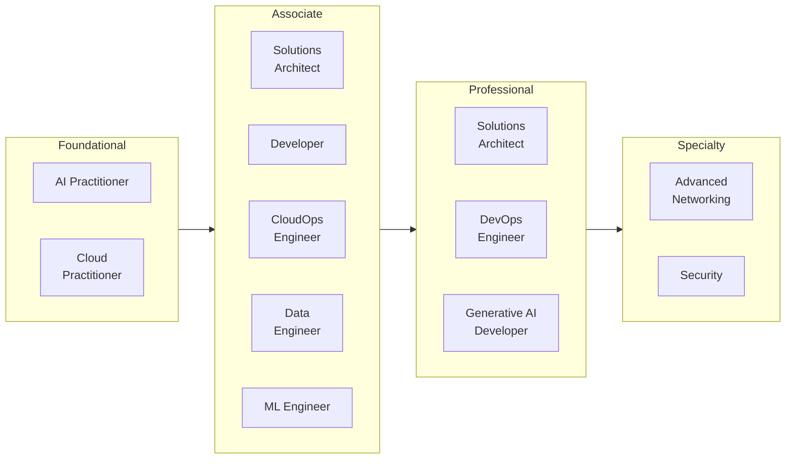
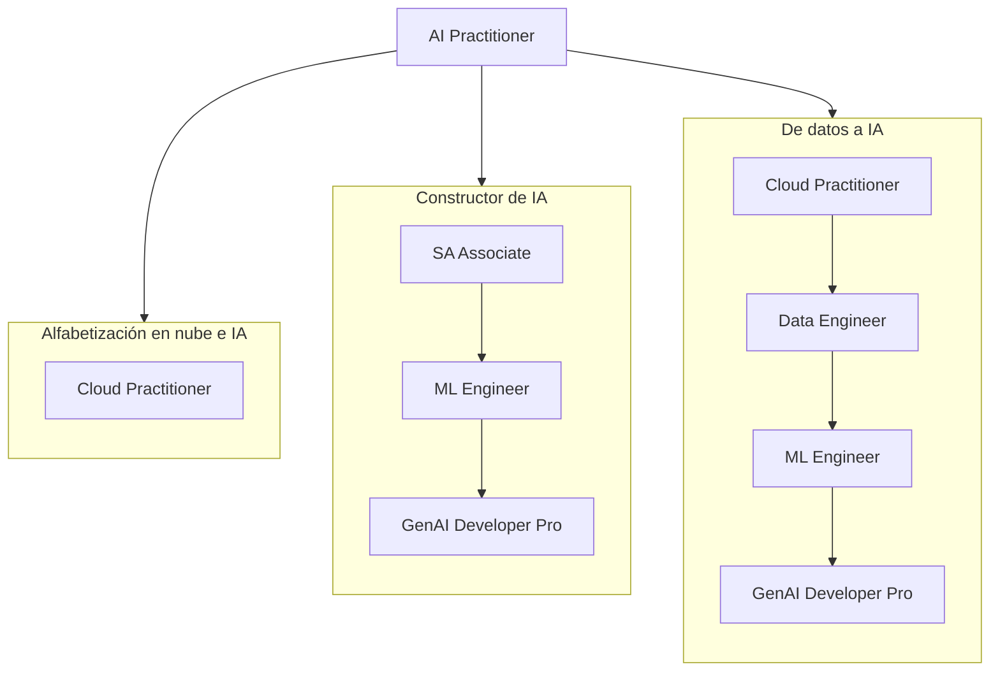
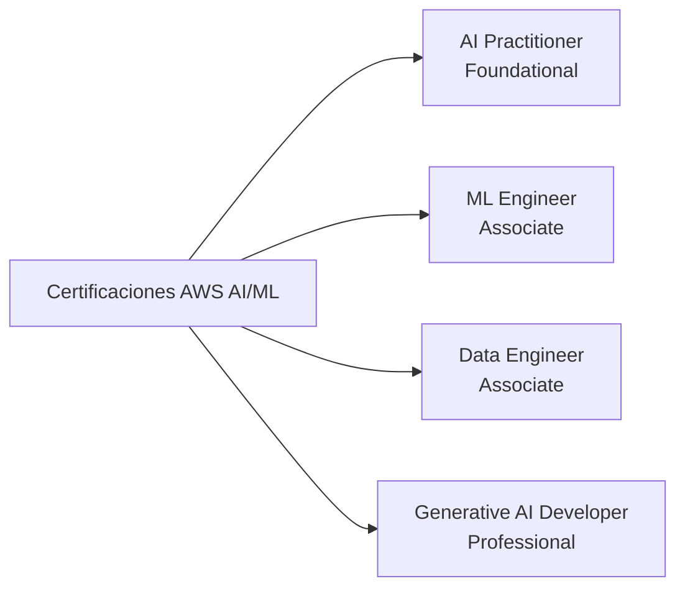
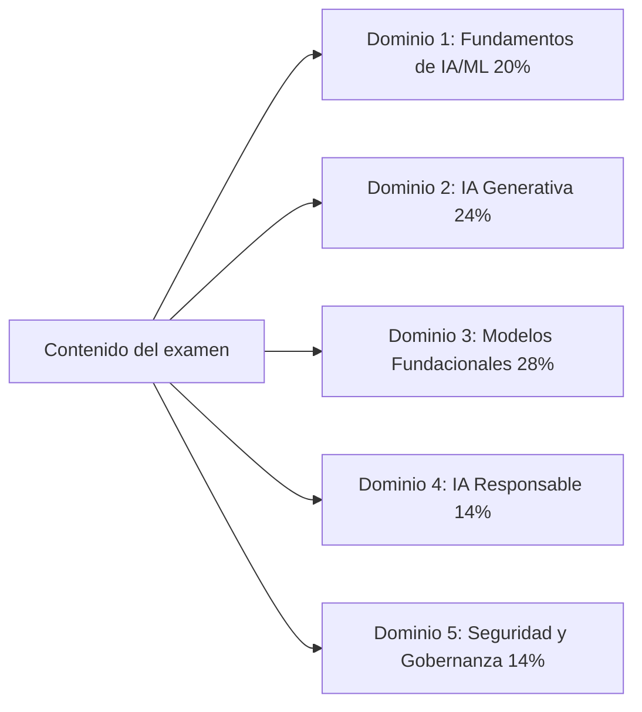
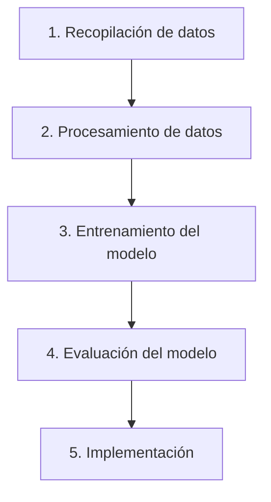

# Certificaciones de AWS y el examen AI Practitioner

## Introducción a las certificaciones de AWS

Las certificaciones de AWS validan la competencia en tecnologías de nube e IA que sustentan la mayor parte de la computación empresarial actual. Son reconocidas a nivel global como indicador de aptitud técnica y como una ruta estructurada para los profesionales que desean desarrollar las habilidades necesarias para usar AWS con eficacia. Para las organizaciones que atraviesan una transformación digital, los profesionales certificados aportan una experiencia que se traduce directamente en una entrega de proyectos más rápida y en menos errores costosos.

Los beneficios van más allá de la credencial en sí. Los profesionales certificados reportan salarios más altos, más entrevistas de trabajo y mejor posicionamiento para ascensos y asignaciones de mayor responsabilidad.[^006001] Las habilidades que respaldan la certificación están ligadas a desafíos del mundo real, y el ciclo de recertificación mantiene a los titulares actualizados a medida que el portafolio de AWS evoluciona.

## Ruta de certificación de AWS

AWS organiza su programa de certificación en cuatro niveles: Foundational, Associate, Professional y Specialty. La estructura permite a los profesionales comenzar con conocimientos amplios y avanzar hacia una especialización que se alinee con sus objetivos profesionales.



*Figura 0.6.1: El portafolio completo de certificaciones de AWS en mayo de 2026, agrupado por nivel. Doce certificaciones activas cubren roles que van desde la alfabetización en nube hasta la ingeniería de IA avanzada. AI Practitioner es una de las dos certificaciones del nivel Foundational; Generative AI Developer en el nivel Professional extiende la trayectoria de IA/ML para audiencias con mayor experiencia técnica.*

El diagrama muestra cómo la certificación **AI Practitioner** se sitúa junto a **Cloud Practitioner** en el nivel Foundational.[^006002] La certificación Machine Learning Specialty, que antes anclaba la trayectoria técnica profunda de IA/ML, fue retirada el 31 de marzo de 2026 y ha sido reemplazada por **Machine Learning Engineer - Associate** y **Generative AI Developer - Professional**.[^006003] AWS también cambió el nombre de SysOps Administrator - Associate a **CloudOps Engineer - Associate** en 2025.

La escalera de certificaciones de AWS no es una línea recta única. Diferentes roles toman diferentes caminos hacia las mismas credenciales avanzadas. El mapa a continuación esboza tres rutas comunes de múltiples etapas:



*Figura 0.6.2: Tres rutas representativas a través del portafolio de certificaciones de AWS. La trayectoria de alfabetización en negocios e IA se detiene en AI Practitioner. Las trayectorias de constructor de IA y de datos a IA convergen en Generative AI Developer - Professional, pero acceden a ella a través de diferentes credenciales de nivel Associate.*

Un profesional puede detenerse después de AI Practitioner si el objetivo es la toma de decisiones informada en lugar de la ingeniería práctica. Un profesional que planea construir agentes de IA en producción generalmente se beneficia de al menos Solutions Architect - Associate y Machine Learning Engineer - Associate antes de avanzar a Generative AI Developer - Professional.

Para mantener la validez de la certificación, AWS requiere recertificarse cada tres años. Esto mantiene a los titulares actualizados con los últimos servicios y mejores prácticas.

## La certificación AWS Certified AI Practitioner

### Descripción general y posicionamiento

La certificación AWS Certified AI Practitioner responde a la creciente necesidad de alfabetización en IA en las organizaciones. Valida el conocimiento fundamental de inteligencia artificial, aprendizaje automático e IA generativa en AWS, con énfasis en la aplicación práctica en los negocios más que en los detalles de implementación.

La certificación está orientada a analistas de negocios, gerentes de producto, personal de soporte de TI y otros profesionales que trabajan junto a la IA pero no necesariamente la construyen. Al validar su capacidad para evaluar opciones de IA y comunicarse con los equipos de ingeniería, ayuda a las organizaciones a adoptar capacidades de IA de forma más informada y a evitar errores costosos.

### Cómo se diferencia de otras certificaciones de IA/ML

Las certificaciones de IA/ML de AWS forman ahora un conjunto claramente escalonado. Están dirigidas a audiencias diferentes y a distintos niveles de habilidad.



*Figura 0.6.3: El mapa de certificaciones de IA/ML de AWS. Cada certificación está dirigida a una audiencia específica y a un nivel de habilidad determinado, desde la alfabetización empresarial en el nivel Foundational hasta la arquitectura en producción en el nivel Professional.*

La certificación **Generative AI Developer - Professional** (AIP-C01) valida la experiencia en el diseño, construcción y operacionalización de soluciones de IA generativa en AWS a escala. Está dirigida a arquitectos e ingenieros sénior que son responsables de los sistemas de IA de principio a fin.

La certificación **Machine Learning Engineer - Associate** (MLA-C01) valida las habilidades necesarias para construir, desplegar y supervisar modelos de ML en producción. Está dirigida a ingenieros de ML y desarrolladores que son responsables del componente de ML de una aplicación.

La certificación **Data Engineer - Associate** (DEA-C01) se centra en la infraestructura de datos de la que dependen los proyectos de IA/ML. Está dirigida a ingenieros que construyen y mantienen los canales de datos y las capas de almacenamiento que alimentan las cargas de trabajo de IA.

En contraste, la certificación **AI Practitioner** se centra en los fundamentos y la aplicación en negocios. Está diseñada para los profesionales que usan soluciones de IA/ML, no para quienes las construyen. Los analistas de negocios, los gerentes de producto y el personal de soporte de TI con conocimientos técnicos son la audiencia principal.

Este escalonamiento en cuatro niveles refleja el madurez del mercado de IA/ML. Construir, desplegar y gobernar la IA ahora requiere la suficiente habilidad especializada como para que AWS ofrezca una certificación separada para cada capa.

## Detalles y estructura del examen

### Descripción general del examen

El examen AWS Certified AI Practitioner (AIF-C01) contiene 65 preguntas que deben completarse en 90 minutos. Está disponible en inglés, japonés, coreano, portugués (Brasil) y chino simplificado. La puntuación mínima para aprobar es de 700 en una escala de 100 a 1.000.

La versión actual del examen es **V1.1**, publicada el 30 de abril de 2026 y efectiva en el examen aproximadamente un mes después.[^006004] La versión V1.1 agregó IA agéntica, Amazon Bedrock AgentCore, Strands Agents, Kiro y Amazon Quick al material dentro del alcance. También eliminó Amazon MemoryDB. Los cambios en los objetivos son suficientemente importantes como para que cualquier material de preparación anterior a mediados de 2026 deba compararse con la guía del examen vigente.



*Figura 0.6.4: Pesos de los dominios del AIF-C01 V1.1. Los dominios 2 y 3 juntos cubren IA generativa y aplicaciones de modelos fundacionales, y representan más de la mitad del contenido evaluado.*

Los modelos fundacionales y la IA generativa juntos cubren más de la mitad del examen, lo que es coherente con la rapidez con que esos temas se han situado en el centro del trabajo de IA empresarial. El examen evalúa su capacidad para:

- Demostrar comprensión de los conceptos de IA/ML e IA generativa y de los servicios de AWS
- Evaluar los casos de uso apropiados para diferentes tecnologías de IA
- Tomar decisiones informadas sobre la implementación de soluciones de IA
- Aplicar prácticas de IA responsable y principios de gobernanza

### Audiencia objetivo

El candidato ideal tiene aproximadamente seis meses de exposición a tecnologías de IA/ML en AWS. Debe sentirse cómodo usando soluciones de IA/ML, pero no se espera que las construya por su cuenta. Es imprescindible tener familiaridad con los **servicios básicos de AWS**, incluyendo Amazon EC2, Amazon S3, AWS Lambda, Amazon Bedrock y Amazon SageMaker AI.[^006005]

También debe tener un conocimiento funcional del **modelo de responsabilidad compartida de AWS**, de AWS Identity and Access Management (IAM) y de los modelos de precios de los servicios de AWS.

Diferentes profesionales pueden beneficiarse de esta certificación de distintas maneras:

*Tabla 0.6.1: Roles que se benefician de AWS Certified AI Practitioner.*

| Categoría de rol | Personal clave | Beneficios principales | Actividades clave |
| --- | --- | --- | --- |
| Responsables de decisiones de negocio | Gerentes de proyecto, analistas de negocios, ejecutivos | Capacidades de planificación estratégica y evaluación | Evaluar iniciativas de IA, valorar viabilidad, desarrollar hojas de ruta de adopción |
| Profesionales de tecnología | Personal de TI, arquitectos de nube, consultores técnicos | Conocimiento de integración técnica y soporte | Dar soporte a sistemas de IA, diseñar soluciones integradas, evaluar plataformas |
| Especialistas de dominio | Expertos en la industria, profesionales de investigación, especialistas en QA | Conocimiento sobre aplicaciones de IA específicas de dominio | Orientar implementaciones, garantizar calidad, explorar aplicaciones |
| Soporte y operaciones | Equipos de operaciones, gerentes de éxito del cliente, escritores técnicos | Excelencia operativa y capacidad de soporte | Administrar servicios de IA, documentar sistemas, desarrollar programas de formación |

La certificación no requiere que desarrolle modelos de IA/ML, implemente ingeniería de datos, realice ajuste de hiperparámetros, construya canales de procesamiento de IA/ML, realice análisis matemático de modelos ni desarrolle marcos de gobernanza completos. Esas son responsabilidades de las certificaciones de nivel superior.

### Estructura del examen y calificación

El examen contiene 50 preguntas calificadas y 15 preguntas sin calificación que AWS utiliza para evaluar posible contenido futuro. Las preguntas sin calificación están distribuidas a lo largo del examen y no se identifican. No hay penalización por adivinar, y las preguntas sin respuesta se califican como incorrectas.

El modelo de calificación tiene cuatro características que vale la pena conocer:

- Puntuación escalonada en un rango de 100 a 1.000
- Puntuación mínima para aprobar de 700
- Calificación compensatoria, lo que significa que no es necesario aprobar cada sección de forma individual, solo el examen en su conjunto
- Puntuación escalonada en múltiples formas del examen para mantener la equidad de la dificultad entre versiones

Su informe de puntuación incluye el estado general de aprobado o reprobado, la puntuación escalonada y comentarios de rendimiento a nivel de sección que destacan fortalezas y debilidades. Los comentarios a nivel de sección son orientación general, no una calificación precisa por sección.

La duración estándar del examen es de 90 minutos. Los hablantes no nativos de inglés pueden solicitar una extensión de 30 minutos, denominada la acomodación "ESL +30", cuando realizan el examen en inglés, para un total de 120 minutos.

## Tipos de preguntas del examen

El examen utiliza cuatro formatos de preguntas. Conocer los formatos de antemano ayuda a distribuir el tiempo y a evitar sorpresas.

### Preguntas de opción múltiple

Las preguntas de opción múltiple presentan un escenario o concepto con cuatro respuestas posibles: una correcta y tres distractores. Los distractores están diseñados para evaluar conceptos erróneos comunes y para verificar que comprende la profundidad del tema, no solo la superficie.

Ejemplo:

```
¿Qué servicio de AWS proporciona un entorno completamente administrado para construir,
entrenar e implementar modelos de aprendizaje automático a escala?

A) Amazon EC2     - Proporciona servidores virtuales pero requiere configuración manual de ML
B) Amazon S3      - Ofrece almacenamiento pero no capacidades de ML
C) Amazon SageMaker AI - Servicio administrado específicamente diseñado para flujos de trabajo de ML
D) Amazon Redshift - Servicio de almacén de datos sin características nativas de ML

Respuesta correcta: C
```

Las opciones incorrectas son servicios que tocan los flujos de trabajo de ML de alguna manera, pero que no proporcionan la experiencia completa de ML administrado.

### Preguntas de respuesta múltiple

Las preguntas de respuesta múltiple requieren seleccionar dos o más respuestas correctas de cinco o más opciones. Debe identificar todas las respuestas correctas para recibir crédito. No se otorga crédito parcial.

```
¿Cuáles DOS capacidades proporciona Amazon SageMaker Studio? (Seleccione DOS)

A) Entorno de desarrollo integrado (IDE) para ML
B) Implementación y supervisión automatizadas de modelos
C) Capacidad de cómputo bruta para entrenamiento
D) Almacenamiento de objetos para conjuntos de datos
E) Gestión de bases de datos relacionales

Respuestas correctas: A, B
```

Cuando vea una pregunta de respuesta múltiple:

1. Lea la pregunta detenidamente y anote exactamente cuántas respuestas se requieren.
2. Evalúe cada opción de forma independiente antes de compararlas.
3. Compruebe que ha seleccionado el número exacto de respuestas especificado.
4. Confirme que todas sus selecciones son correctas, ya que no se otorga crédito parcial.

### Preguntas de ordenamiento

Las preguntas de ordenamiento evalúan su comprensión de los procesos secuenciales. Presentan de tres a cinco elementos que deben ordenarse correctamente para completar una tarea.



*Figura 0.6.5: Un flujo de trabajo canónico de ML utilizado como ejemplo de pregunta de ordenamiento. Cada paso depende del anterior, y el orden refleja la práctica estándar.*

Cuando vea una pregunta de ordenamiento, busque:

- Dependencias entre pasos
- Requisitos previos de los servicios de AWS
- Flujos de trabajo estándar del sector
- Mejores prácticas de AWS

### Preguntas de emparejamiento

Las preguntas de emparejamiento le piden que asocie elementos de dos listas. Por lo general presentan de tres a siete indicaciones y una lista correspondiente de descripciones, y requieren que empareje cada indicación con su descripción correcta.

Una pregunta de emparejamiento típica:

```
Empareje el servicio de IA/ML de AWS con su capacidad principal:

Indicaciones:
1. Amazon Bedrock
2. Amazon SageMaker Canvas
3. Amazon Comprehend
4. Amazon Rekognition

Descripciones:
A. Construcción de modelos de ML e inferencia sin código
B. Procesamiento del lenguaje natural y análisis de texto
C. Acceso e implementación de modelos fundacionales
D. Visión computacional y análisis de imágenes y video

Emparejamientos correctos: 1-C, 2-A, 3-B, 4-D
```

Cuando aborde preguntas de emparejamiento:

1. Lea todos los elementos de ambas listas con cuidado antes de hacer cualquier emparejamiento.
2. Asegure primero los emparejamientos obvios y luego reduzca los restantes por eliminación.
3. Use el proceso de eliminación para los pares más difíciles que queden.
4. Verifique cada emparejamiento con su conocimiento de AWS.

## Consejos para la preparación del examen

### Gestión del tiempo

Una gestión eficaz del tiempo importa más que el conocimiento bruto para muchos candidatos. Algunas pautas prácticas:

1. Anote el número de preguntas y el tiempo disponible al inicio.
2. Apunte a aproximadamente 80 segundos por pregunta en la primera pasada.
3. No dedique más de dos minutos a ninguna pregunta individual.
4. Marque las preguntas difíciles y revíselas después de la primera pasada.
5. Reserve al menos cinco a diez minutos al final para revisar.

Si el inglés no es su primer idioma, AWS le permite solicitar 30 minutos adicionales de tiempo de examen como acomodación. La solicitud debe enviarse a través de su cuenta de Certificación de AWS antes de reservar el examen y, una vez aprobada, se aplica a todos los exámenes de AWS que programe desde esa cuenta.

### Áreas de enfoque

El examen enfatiza la aplicación práctica sobre la memorización. Áreas clave:

- Conceptos y terminología básica de IA/ML, incluyendo IA agéntica, RAG y MCP
- El servicio de IA correcto para el problema de negocios correcto
- Capacidades y limitaciones de los servicios de AWS, especialmente Amazon Bedrock y la familia AgentCore
- Principios de IA responsable que incluyen sesgo, equidad, transparencia y explicabilidad
- Seguridad, incluyendo Amazon Bedrock Guardrails y la responsabilidad compartida de AWS para IA

Las preguntas evalúan su capacidad para aplicar el conocimiento en escenarios realistas, no su capacidad para recitar una definición.

### Recursos de preparación

AWS ofrece una gama de recursos de preparación a través de AWS Skill Builder, incluyendo contenido gratuito y por suscripción.[^006006]

*Tabla 0.6.2: Recursos clave de preparación para las certificaciones de AWS.*

| Tipo de recurso | Descripción | Más adecuado para |
| --- | --- | --- |
| Formación digital | Cursos en línea a su propio ritmo | Comprensión de conceptos básicos |
| Formación en aula | Sesiones dirigidas por instructor | Aprendizaje interactivo y orientación directa |
| Exámenes de práctica | Preguntas y escenarios de muestra | Preparación para el examen y análisis de brechas |
| Documentación | Guías técnicas y documentos técnicos | Construcción de conocimiento técnico profundo |
| Laboratorios prácticos | Ejercicios prácticos en la consola de AWS | Experiencia en el mundo real y validación de habilidades |

Para el AIF-C01 específicamente, concéntrese en los fundamentos de IA/ML, los dominios de GenAI y FM, y el nuevo material sobre IA agéntica añadido en V1.1. El tiempo práctico con **Amazon Bedrock**, el área de pruebas del modelo, y **Amazon Bedrock AgentCore** es la inversión de tiempo de estudio con mayor retorno una vez que los fundamentos estén en su lugar.

## Conclusión

La certificación AWS Certified AI Practitioner valida el conocimiento esencial de la IA moderna en AWS: ML clásico, IA generativa, IA agéntica y las prácticas de IA responsable que cada vez las acompañan más. Diseñada para analistas de negocios, gerentes de producto y otros profesionales que usan IA en lugar de construirla, la certificación demuestra su capacidad para:

- Tomar decisiones informadas sobre la adopción de tecnología de IA
- Comunicarse con equipos técnicos sobre iniciativas de IA
- Identificar los casos de uso correctos para los servicios de IA adecuados
- Aplicar prácticas de IA responsable en su organización
- Navegar el panorama de IA en AWS, que evoluciona rápidamente

Al obtener esta certificación establece una base para comprender la IA mientras se enfoca en el valor para el negocio en lugar de en la implementación técnica. Eso la convierte en una credencial útil a medida que más organizaciones avanzan de la experimentación con IA a la producción con IA a través de servicios como Amazon Bedrock, Amazon Bedrock AgentCore, Amazon SageMaker AI y Kiro.

Las certificaciones de AWS siguen siendo una vía para validar la experiencia en la nube y acelerar el crecimiento profesional a medida que la IA se integra en las operaciones de negocios convencionales. La certificación AWS Certified AI Practitioner tiende un puente entre los roles técnicos y de negocios durante un período de rápida adopción de la IA, y la actualización V1.1 pone el contenido del examen al día con el estado real del mercado en 2026.

[^006001]: AWS Certifications. URL: <https://aws.amazon.com/certification/>
    
[^006002]: AWS Certified AI Practitioner. URL: <https://aws.amazon.com/certification/certified-ai-practitioner/>
    
[^006003]: AWS Certified Machine Learning Engineer Associate. URL: <https://aws.amazon.com/certification/certified-machine-learning-engineer-associate/>
    
[^006004]: AIF-C01 Exam Guide Revisions. URL: <https://docs.aws.amazon.com/aws-certification/latest/ai-practitioner-01/aif-01-revisions.html>
    
[^006005]: AIF-C01 Target Candidate Description. URL: <https://docs.aws.amazon.com/aws-certification/latest/ai-practitioner-01/ai-practitioner-01.html>
    
[^006006]: AWS Skill Builder. URL: <https://skillbuilder.aws/>
