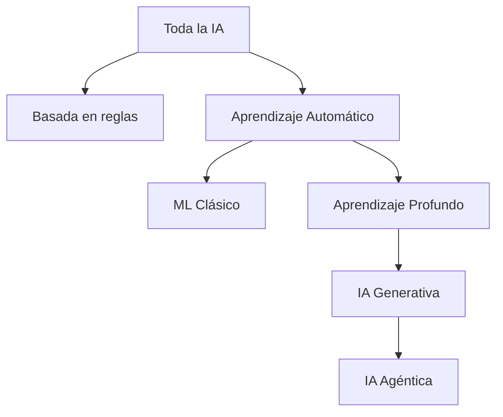
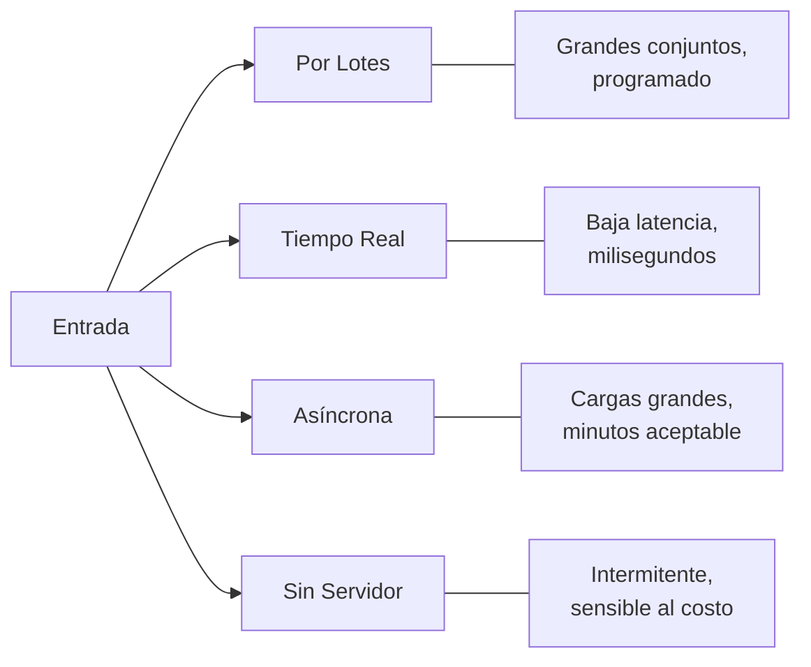
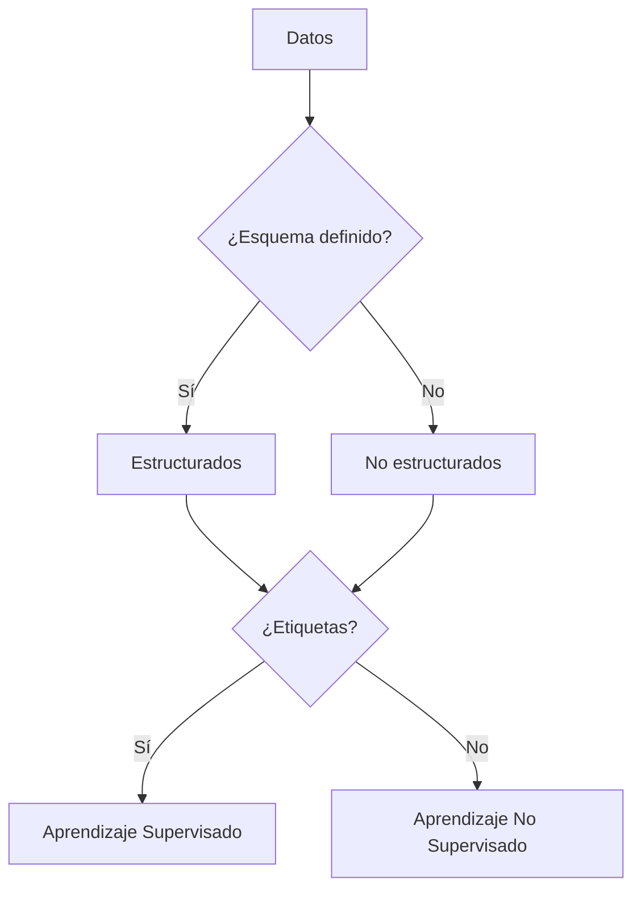
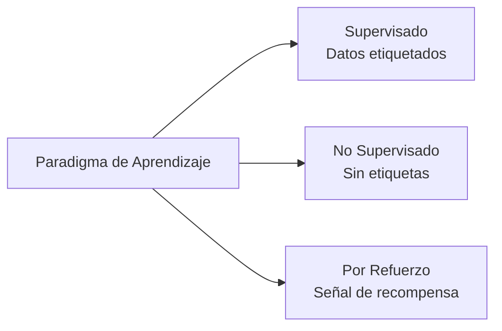

## Enunciado de tarea 1.1: Explicar los conceptos y terminologías básicas de IA

El vocabulario de la IA es el lenguaje compartido entre los profesionales de negocios y los equipos de ingeniería con los que trabajan. Antes de que un gerente de producto pueda aprobar el despliegue de un modelo o un ejecutivo pueda evaluar una propuesta de un proveedor de IA, todos los presentes en la reunión necesitan las mismas definiciones para términos como entrenamiento, inferencia, sesgo y equidad. Este enunciado de tarea establece ese vocabulario común y mapea cada término a los servicios de AWS y a los objetivos del examen donde aparece.[^101001]

### 1.1.1 Definir los términos básicos de IA

Comprender la IA comienza con definiciones precisas. El examen evalúa si puede distinguir términos cercanos entre sí, y las implicaciones de negocio son reales porque el lenguaje impreciso genera expectativas desalineadas entre los actores técnicos y los no técnicos.

**La inteligencia artificial (IA)** es el campo amplio de la informática orientado a construir sistemas capaces de realizar tareas que normalmente requerirían razonamiento humano, como reconocer imágenes, comprender el lenguaje o tomar decisiones bajo incertidumbre.[^101002] La IA no es una única tecnología; es una categoría que incluye muchos enfoques, solo algunos de los cuales implican aprender de los datos.

**El aprendizaje automático (ML)** es un subconjunto de la IA en el que un sistema aprende patrones a partir de los datos en lugar de seguir reglas escritas explícitamente por un programador.[^101003] Por ejemplo, un sistema de detección de fraudes basado en reglas tradicionales podría marcar cualquier transacción por encima de un umbral fijo; un sistema basado en ML, en cambio, aprende de miles de casos históricos de fraude y generaliza patrones que ninguna regla fija podría capturar.

**El aprendizaje profundo** es un subconjunto del ML que usa *redes neuronales* con muchas capas para representar patrones cada vez más abstractos.[^101004] El término "profundo" hace referencia a la profundidad de estas capas. El aprendizaje profundo impulsa la mayor parte de los modernos sistemas de reconocimiento de imágenes, reconocimiento de voz y comprensión del lenguaje.

Una **red neuronal** es un modelo computacional vagamente inspirado en la estructura de las neuronas biológicas. Los datos pasan a través de capas de nodos interconectados, cada uno de los cuales aplica una transformación matemática. La red aprende qué transformaciones producen salidas precisas ajustando sus parámetros internos durante el entrenamiento. Las redes superficiales tienen dos o tres capas; las redes profundas pueden tener cientos.

**La visión computacional (VC)** es la rama de la IA que permite a las máquinas interpretar imágenes y video.[^101006] Los sistemas de visión computacional pueden clasificar objetos en una foto, detectar defectos en una línea de fabricación o contar vehículos en un estacionamiento. En AWS, las capacidades de visión computacional están disponibles a través de **Amazon Rekognition** para el análisis de imágenes y video.[^101007]

**El procesamiento del lenguaje natural (PLN)** es la rama de la IA que permite a las máquinas leer, comprender y generar lenguaje humano.[^101008] Las tareas de PLN incluyen análisis de sentimientos, reconocimiento de entidades nombradas, traducción y resumen de documentos. AWS expone las capacidades de PLN a través de servicios como **Amazon Comprehend** para análisis de texto, **Amazon Translate** para traducción de idiomas y **Amazon Transcribe** para la conversión de voz a texto.[^101009] Estos servicios especializados son la opción correcta para tareas de alto volumen y bien definidas donde importan el costo por llamada y la latencia. Para trabajo de lenguaje abierto, como la generación de texto extenso, la resumización compleja o el razonamiento en múltiples pasos, los **modelos de lenguaje grande (LLM)** a los que se accede a través de Amazon Bedrock son la mejor opción; el Dominio 2 de este libro los cubre en profundidad.

Un **algoritmo** es el procedimiento matemático utilizado para entrenar un modelo a partir de los datos. Los algoritmos de ML comunes incluyen la regresión lineal para predecir valores continuos, los árboles de decisión para la clasificación, y el impulso de gradiente para datos tabulares estructurados. La elección del algoritmo determina cómo el modelo generaliza desde los datos de entrenamiento hacia nuevas entradas.

Un **modelo** es el artefacto producido cuando se aplica un algoritmo a un conjunto de datos de entrenamiento. El modelo captura los patrones que encontró el algoritmo y luego puede usarse para hacer predicciones sobre datos nuevos que no ha visto antes. Piense en el algoritmo como la receta y en el modelo como el plato terminado.

El **entrenamiento** es el proceso de exponer un modelo a datos etiquetados o sin etiquetar para que sus parámetros internos se ajusten y minimicen el error de predicción. El entrenamiento es computacionalmente intensivo y generalmente se ejecuta en infraestructura acelerada con GPU. En AWS, los trabajos de entrenamiento se ejecutan con mayor frecuencia en **Amazon SageMaker AI**.

La **inferencia** (también llamada *scoring*) es el proceso de usar un modelo entrenado para generar una predicción o salida a partir de nuevos datos de entrada.[^101014] El entrenamiento ocurre una vez o periódicamente; la inferencia ocurre de forma continua cada vez que un usuario o sistema solicita una predicción.

El **sesgo** en la IA se refiere a errores sistemáticos en las salidas de un modelo que surgen de datos de entrenamiento defectuosos, diseño algorítmico defectuoso o formulación del problema defectuosa.[^101015] Por ejemplo, un modelo de contratación entrenado con datos históricos de una empresa con una historia de contratación sesgada puede reproducir y amplificar esos patrones. El sesgo es una preocupación central en la gobernanza de IA responsable.

La **equidad** es la propiedad de un modelo que produce resultados equitativos entre grupos demográficos definidos por características como el género, la raza o la edad. La equidad y el sesgo están estrechamente relacionados: se considera que un modelo es equitativo cuando su sesgo hacia cualquier grupo protegido está por debajo de un umbral aceptable. AWS proporciona **Amazon SageMaker Clarify** para ayudar a los equipos a detectar y medir el sesgo en los datos de entrenamiento y en los modelos entrenados.[^101017]

El **ajuste** describe qué tan bien los patrones aprendidos por un modelo coinciden con la estructura subyacente de los datos.[^101018] Se dice que un modelo que se ajusta demasiado a sus datos de entrenamiento tiene *sobreajuste*: memoriza el ruido en lugar de generalizar patrones, y su exactitud con datos nuevos cae drásticamente. Se dice que un modelo demasiado simple para capturar los patrones reales tiene *subajuste*: su desempeño es deficiente tanto con los datos de entrenamiento como con los nuevos. El buen ajuste se sitúa entre estos dos extremos.

Un **modelo de lenguaje grande (LLM)** es un modelo de aprendizaje profundo, específicamente una red neuronal entrenada en un corpus masivo de texto, que puede generar, resumir, traducir y razonar sobre el lenguaje con un nivel de fluidez y flexibilidad que no era posible con técnicas anteriores de PLN.[^101019] Los LLM como Amazon Titan, Anthropic Claude y Meta Llama sustentan la mayoría de las aplicaciones modernas de IA generativa. Su escala, medida en miles de millones de parámetros, les otorga una amplia capacidad, pero también los hace costosos de entrenar desde cero.

La **IA generativa (GenAI)** es una clase de IA que produce contenido nuevo, como texto, imágenes, audio o código, en respuesta a una indicación.[^101020] Los sistemas de GenAI se construyen típicamente sobre LLM u otros modelos generativos a gran escala. A diferencia de los modelos de ML anteriores que clasifican o predicen un único valor, un sistema de IA generativa produce una salida de longitud variable y legible por humanos. La IA generativa y la IA agéntica se agregaron a la guía del examen en la versión v1.1 para reflejar el nivel de adopción que ambas han alcanzado en proyectos empresariales desde que se publicó la guía original.

La **IA agéntica** es una extensión de la IA generativa en la que se le proporciona a un modelo un objetivo y un conjunto de herramientas para que luego planifique y ejecute de forma autónoma acciones de varios pasos para alcanzar ese objetivo sin requerir aprobación humana en cada paso.[^101021] El motor de razonamiento sigue siendo un modelo generativo; la IA agéntica agrega el ciclo de planificación, el acceso a herramientas y la memoria que convierten la generación de un solo turno en acción orientada a objetivos. Un sistema de IA agéntica puede explorar una base de conocimiento, llamar a APIs externas, escribir código y verificar sus resultados a lo largo de varios pasos secuenciales antes de devolver una respuesta. Esto es cualitativamente diferente de una interacción de pregunta y respuesta de un solo turno. AWS admite la IA agéntica a través de los Agentes de **Amazon Bedrock** y **Amazon Bedrock AgentCore**, que proporcionan la infraestructura para la orquestación de múltiples pasos, la memoria y el uso de herramientas.[^101022]

### 1.1.2 Diferencias entre IA, ML, GenAI, aprendizaje profundo e IA agéntica

Estos cinco términos describen una jerarquía anidada, no tecnologías separadas. La confusión sobre sus relaciones es una de las fuentes más comunes de mala comunicación en la planificación de proyectos de IA. Cada término está contenido completamente dentro del alcance del término que lo precede.

**La inteligencia artificial** es el término más amplio. Incluye cualquier técnica que haga que un sistema informático se comporte de una manera que se asemeje al razonamiento humano. Esto incluye los sistemas expertos basados en reglas de los años setenta, el ML estadístico de los años noventa y las redes neuronales actuales.

**El aprendizaje automático** es un subconjunto de la IA que limita la definición a los sistemas que aprenden de los datos. Un filtro de fraudes basado en reglas escrito por un programador es IA pero no ML. Un modelo de fraudes entrenado con historiales de transacciones es tanto IA como ML.

**El aprendizaje profundo** es un subconjunto del ML que usa redes neuronales por capas. Un modelo de regresión lineal es ML pero no aprendizaje profundo. Una red neuronal convolucional que clasifica radiografías de tórax es ML, aprendizaje profundo e IA.

**La IA generativa** es un subconjunto del aprendizaje profundo que se ocupa específicamente de generar contenido nuevo. No todo el aprendizaje profundo es generativo: un modelo de aprendizaje profundo que clasifica imágenes en diez categorías es discriminativo, no generativo. Un modelo que produce una imagen fotorrealista a partir de una descripción textual es IA generativa.

**La IA agéntica** es un patrón arquitectónico que se superpone a la IA generativa. Un sistema agéntico usa un LLM u otro modelo generativo como motor de razonamiento, y luego agrega un ciclo de planificación, acceso a herramientas y memoria para que pueda actuar a lo largo de múltiples pasos. Un chatbot de un solo turno que usa un LLM es IA generativa pero no IA agéntica. Un sistema que recibe un objetivo de alto nivel, lo divide en subtareas, usa herramientas para ejecutar cada subtarea y sintetiza los resultados es IA agéntica.

*Figura 1.1.1: Anidamiento de los subcampos de la IA. Cada nodo es un subconjunto propio de su nodo padre; bajar en el árbol agrega restricciones y capacidades en lugar de reemplazar el concepto padre.*

El examen evalúa con frecuencia los casos límite. Un candidato que trate "IA" y "ML" como sinónimos, o que confunda "IA generativa" con "aprendizaje profundo", malinterpretará las preguntas de escenario que dependen de saber qué subconjunto aplica. La implicación práctica de negocio es igualmente concreta: un equipo que despliega un sistema de IA agéntica enfrenta consideraciones de gobernanza, costo y seguridad diferentes a las de un equipo que ejecuta un modelo de clasificación de ML clásico, porque los sistemas agénticos toman acciones en el mundo real en lugar de producir salidas estáticas.

*Tabla 1.1.1: Distinciones clave entre los subcampos de la IA*

| Término | Categoría padre | Se define por | Ejemplo típico en AWS |
|---------|-----------------|---------------|-----------------------|
| Inteligencia Artificial | Ninguna | Comportamiento similar al razonamiento | Cualquier servicio de IA/ML de AWS |
| Aprendizaje Automático | IA | Aprende de los datos | Amazon SageMaker AI |
| Aprendizaje Profundo | ML | Redes neuronales por capas | SageMaker con instancias GPU |
| IA Generativa | Aprendizaje Profundo | Produce contenido nuevo | Amazon Bedrock |
| IA Agéntica | IA Generativa | Acción autónoma de varios pasos | Bedrock Agents, Bedrock AgentCore |

Un matiz que vale la pena mencionar: algunos investigadores clasifican la IA agéntica como un patrón arquitectónico más que como un subcampo tecnológico, porque un sistema agéntico está compuesto de tecnologías existentes (LLM, herramientas, lógica de orquestación) en lugar de ser un nuevo tipo de modelo. Para los propósitos del examen, trate la IA agéntica como la capa más especializada de la jerarquía.

### 1.1.3 Tipos de inferencia

Después de que un modelo ha sido entrenado, debe desplegarse para que pueda generar predicciones. La forma en que esas predicciones se solicitan y se devuelven define el patrón de inferencia. La guía del examen v1.1 agregó la inferencia asíncrona y sin servidor a la lista porque AWS amplió sus opciones de inferencia administrada después del lanzamiento original del examen.

Los cuatro patrones de inferencia estándar son: por lotes, en tiempo real, asíncrona y sin servidor. Cada uno resuelve una combinación diferente de requisitos de rendimiento y latencia, y elegir el patrón incorrecto para un caso de uso es una de las causas más comunes de problemas de costo y rendimiento en los sistemas de IA en producción.

La **inferencia por lotes** procesa un gran conjunto de entradas en un único trabajo, generalmente según un calendario.[^101024] El sistema recopila entradas durante un período de tiempo, ejecuta el modelo contra todas ellas a la vez y almacena los resultados para su uso posterior. Un minorista que genera recomendaciones de productos de la noche a la mañana para cada cliente en su base de datos utiliza inferencia por lotes. En AWS, **Amazon SageMaker AI** Batch Transform ejecuta trabajos de inferencia por lotes contra datos almacenados en **Amazon S3**, escalando el grupo de cómputo durante la duración del trabajo y cerrándolo cuando termina.

La **inferencia en tiempo real** procesa una única solicitud de entrada y devuelve una predicción en milisegundos.[^101026] El modelo se despliega en un extremo de inferencia persistente que permanece activo, aceptando solicitudes de aplicaciones. Un sistema de detección de fraudes que debe puntuar una transacción con tarjeta de crédito antes de que el terminal de pago del cliente supere el tiempo de espera requiere inferencia en tiempo real. En AWS, los extremos de inferencia en tiempo real de SageMaker AI alojan modelos detrás de un extremo HTTPS persistente y pueden aplicar *Auto Scaling* para manejar volúmenes de solicitudes variables.

La **inferencia asíncrona** (a veces denominada *en cola* o *casi por lotes* porque comparte el modelo de procesamiento en cola de los trabajos por lotes mientras opera con una solicitud a la vez) acepta una solicitud, la pone en cola y devuelve el resultado a través de una devolución de llamada o un mecanismo de sondeo, en lugar de hacerlo dentro de la ventana de tiempo de espera de la solicitud original.[^101028] Este patrón es apropiado cuando las entradas son grandes o cuando el modelo tarda más tiempo en procesar de lo que puede esperar razonablemente una solicitud web. Por ejemplo, un sistema de inteligencia de documentos que procesa contratos de varias páginas puede tardar de 30 a 90 segundos por documento: una llamada web síncrona agotaría el tiempo de espera, pero un patrón asíncrono permite que el sistema que realiza la llamada compruebe el resultado más tarde. En AWS, los extremos de SageMaker AI Async Inference aceptan grandes cargas útiles, las ponen en cola y escriben las salidas en S3 para su recuperación.

La **inferencia sin servidor** ejecuta el modelo bajo demanda sin necesidad de aprovisionar previamente un extremo de inferencia persistente.[^101030] El cómputo subyacente escala a cero cuando está inactivo, eliminando el costo fijo de un extremo en ejecución. La inferencia sin servidor es adecuada para cargas de trabajo intermitentes o impredecibles donde el costo del cómputo inactivo supera el beneficio de la baja latencia. En AWS, SageMaker AI Serverless Inference aprovisiona y desaprovisiona el cómputo automáticamente, con la compensación de que la primera solicitud después de un período de inactividad puede experimentar un retardo de *inicio en frío*.

*Figura 1.1.2: Selección del patrón de inferencia. La elección depende de la combinación de volumen de entrada, latencia aceptable y restricciones de costo para el caso de uso específico.*

*Tabla 1.1.2: Comparación de los patrones de inferencia*

| Patrón | Latencia | Tamaño de entrada | Modelo de costo | Más adecuado para |
|--------|----------|-------------------|-----------------|-------------------|
| Por lotes | Minutos a horas | Muy grande | Por trabajo | Puntuación nocturna, reportes masivos |
| Tiempo real | Milisegundos | Pequeño | Por hora de extremo | Detección de fraudes, recomendaciones en vivo |
| Asíncrona | Segundos a minutos | Grande | Por solicitud | Procesamiento de documentos, análisis de video |
| Sin servidor | Segundos (inicio frío), milisegundos (caliente) | Pequeño a mediano | Por inferencia | APIs de poco tráfico, uso intermitente |

Comprender las diferencias de costo importa para los profesionales de negocios: un extremo de inferencia en tiempo real persistente acumula costos las veinticuatro horas del día independientemente de si recibe tráfico, mientras que la inferencia sin servidor cobra solo por el uso real. Para un sistema que procesa solicitudes solo durante el horario laboral, la diferencia de costos puede ser sustancial.

### 1.1.4 Tipos de datos en los modelos de IA

Los modelos de IA se forman a partir de los datos de los que aprenden, y los datos se presentan en muchas formas. El tipo de datos que espera un modelo determina qué algoritmos son apropiados, qué pasos de preprocesamiento se requieren y cómo se puede desplegar el modelo. Un profesional de negocios que puede describir los datos de su organización en estos términos puede comunicarse de manera mucho más efectiva con un equipo de ciencia de datos.

La primera distinción fundamental es entre **datos etiquetados** y **datos sin etiquetar**.[^101032] Los datos etiquetados incluyen tanto la entrada (por ejemplo, una imagen de un gato) como la respuesta correcta (la etiqueta "gato"). Los datos sin etiquetar solo incluyen la entrada, sin ninguna respuesta asociada. Los conjuntos de datos etiquetados son más costosos de producir porque requieren anotación humana, pero son necesarios para el aprendizaje supervisado. Los conjuntos de datos sin etiquetar son abundantes y económicos, pero requieren técnicas no supervisadas o autosupervisadas para extraer patrones.

Más allá de la distinción etiquetados-sin etiquetar, los datos también varían por estructura y formato:

- Los **datos tabulares** están organizados en filas y columnas, como en una hoja de cálculo o una tabla de base de datos relacional. Cada columna representa una característica (por ejemplo, edad, saldo de cuenta o monto de transacción) y cada fila representa una observación. Los algoritmos de ML clásicos como los árboles de impulso de gradiente funcionan especialmente bien con datos tabulares.
- Los **datos de series temporales** son una secuencia de mediciones registradas a intervalos de tiempo regulares. Los precios de las acciones, la utilización de CPU de un servidor y las lecturas de frecuencia cardíaca de un paciente son datos de series temporales. Los modelos entrenados con datos de series temporales aprenden patrones temporales como tendencias, estacionalidad y anomalías.
- Los **datos de imágenes** consisten en valores de píxeles organizados en una cuadrícula bidimensional, potencialmente con múltiples canales de color. Los modelos de visión computacional aprenden a detectar bordes, formas, texturas y objetos a partir de datos de imágenes. Los requisitos de volumen son altos: un conjunto de datos de imágenes significativo generalmente contiene desde decenas de miles hasta millones de ejemplos etiquetados.
- Los **datos de texto** consisten en secuencias de palabras o caracteres en un lenguaje natural. Los modelos de PLN aprenden gramática, semántica y asociaciones factuales a partir del texto. Los modelos de lenguaje grande se entrenan en corpus de texto que contienen cientos de miles de millones de palabras.

Una segunda distinción ortogonal aplica a todos estos formatos: los **datos estructurados** tienen un esquema bien definido, como una tabla de base de datos con columnas tipadas.[^101037] Los **datos no estructurados** no tienen un esquema predefinido: incluyen texto libre, imágenes, audio y video. Los datos estructurados son más directamente utilizables por los algoritmos de ML clásicos; los datos no estructurados generalmente requieren un modelo basado en redes neuronales o un paso de preprocesamiento para extraer características estructuradas.

*Tabla 1.1.3: Tipos de datos en los modelos de IA*

| Tipo de dato | Estructura | Enfoque típico de ML | Servicio de ejemplo en AWS |
|--------------|------------|----------------------|---------------------------|
| Tabular | Estructurado | Impulso de gradiente, modelos lineales | Algoritmos integrados de SageMaker AI |
| Series temporales | Estructurado | Modelos de secuencia, LSTM, DeepAR | SageMaker AI DeepAR |
| Imagen | No estructurado | Redes neuronales convolucionales | Amazon Rekognition, SageMaker AI |
| Texto | No estructurado | Modelos Transformer, LLM | Amazon Comprehend, Amazon Bedrock |

**Amazon SageMaker Ground Truth** ayuda a los equipos a crear conjuntos de datos etiquetados combinando el etiquetado automatizado con la revisión humana, reduciendo el tiempo y el costo de la anotación a escala.[^101038]

En la práctica, los proyectos de IA del mundo real a menudo combinan tipos de datos. Un modelo de abandono de clientes podría usar datos tabulares de CRM junto con texto de tickets de soporte, lo que requiere que el equipo construya o seleccione modelos que puedan manejar ambas modalidades. Saber qué tipos de datos ya tiene la empresa en abundancia ayuda a delimitar qué enfoques de IA son factibles.

*Figura 1.1.3: Árbol de decisión sobre el tipo de datos. La estructura y la disponibilidad de etiquetas juntas determinan qué enfoque de aprendizaje es factible para un conjunto de datos determinado.*

### 1.1.5 Tipos de aprendizaje en IA/ML

La forma en que un modelo aprende de los datos se denomina su *paradigma de aprendizaje*. El paradigma de aprendizaje determina qué tipo de datos requiere el modelo, cómo generaliza y qué tipos de problemas puede resolver. El examen evalúa los tres paradigmas principales: supervisado, no supervisado y por refuerzo.

El **aprendizaje supervisado** entrena un modelo con un conjunto de datos en el que cada entrada está emparejada con una etiqueta de salida correcta.[^101039] El modelo aprende a asignar entradas a salidas minimizando la diferencia entre sus predicciones y las etiquetas conocidas. Este es el paradigma más comúnmente utilizado en la IA comercial porque produce modelos que son sencillos de evaluar: se mide la exactitud en un conjunto de prueba de ejemplos etiquetados reservados.

El aprendizaje supervisado abarca dos tipos principales de problemas. La *regresión* predice un valor numérico continuo, como los ingresos esperados de un cliente en el próximo trimestre. La *clasificación* asigna una entrada a una de un conjunto discreto de categorías, como etiquetar un correo electrónico como spam o no spam. La mayoría de los sistemas de recomendación de productos, detección de fraudes y diagnóstico médico utilizan modelos de clasificación o regresión supervisada.

El **aprendizaje no supervisado** entrena un modelo con datos que no tienen etiquetas.[^101041] El modelo debe encontrar estructura en los datos por su cuenta, sin orientación sobre cuál es la respuesta correcta. La técnica no supervisada más común es el *agrupamiento*, en el que el modelo agrupa entradas similares. Por ejemplo, un equipo de marketing podría usar agrupamiento no supervisado en historiales de compras de clientes para descubrir segmentos naturales de clientes que luego puedan recibir campañas dirigidas. Otra técnica común es la *reducción de dimensionalidad*, que comprime datos de alta dimensionalidad en menos dimensiones conservando su estructura más importante, facilitando su visualización o su uso como entrada en un modelo posterior.

El **aprendizaje por refuerzo** entrena a un agente para tomar acciones en un entorno recompensándolo por los buenos resultados y penalizándolo por los malos.[^101043] El agente aprende una *política*: una asignación del estado observado a la acción que maximiza la recompensa acumulada a lo largo del tiempo. El aprendizaje por refuerzo es el paradigma detrás de los sistemas de IA que juegan juegos y, cada vez más, detrás de aplicaciones industriales como el control de robots, la optimización de la cadena de suministro y los sistemas de recomendación de contenido personalizado que optimizan el compromiso a largo plazo en lugar del clic inmediato.

*Tabla 1.1.4: Comparación de los paradigmas de aprendizaje de IA/ML*

| Paradigma | Datos de entrada | Aprende | Casos de uso comunes |
|-----------|-----------------|---------|----------------------|
| Supervisado | Etiquetados | Mapeo entrada-salida | Clasificación, regresión, detección de fraudes |
| No supervisado | Sin etiquetar | Estructura oculta | Segmentación de clientes, detección de anomalías |
| Por refuerzo | Señales de recompensa | Política óptima | Robótica, juegos, personalización |

Dos paradigmas de aprendizaje adicionales aparecen en los bordes del alcance del examen. El *aprendizaje semisupervisado* combina una pequeña cantidad de datos etiquetados con una gran cantidad de datos sin etiquetar, lo cual es útil cuando el etiquetado es costoso.[^101045] El *aprendizaje autosupervisado* genera etiquetas automáticamente a partir de los propios datos, por ejemplo, enmascarando una palabra en una oración y entrenando al modelo para predecir la palabra faltante. El aprendizaje autosupervisado es la técnica que sustenta la fase de preentrenamiento de la mayoría de los modelos de lenguaje grandes modernos.

*Figura 1.1.4: Panorama de los paradigmas de aprendizaje. Los tres paradigmas centrales difieren en el tipo de retroalimentación que recibe el modelo durante el entrenamiento.*

La elección del paradigma de aprendizaje es una decisión práctica de negocio, no solo técnica. El aprendizaje supervisado requiere datos etiquetados, que cuestan dinero producir. El aprendizaje no supervisado evita ese costo pero no puede optimizarse directamente para un resultado de negocio específico. El aprendizaje por refuerzo puede optimizarse para objetivos complejos de varios pasos, pero requiere un diseño más cuidadoso de la función de recompensa y es más difícil de auditar en cuanto a equidad y sesgo. Un profesional de negocios que comprende estas compensaciones puede hacer las preguntas correctas cuando un equipo de ciencia de datos propone un enfoque.

## Preguntas de autoevaluación

**Pregunta 1.** Una empresa minorista está construyendo un sistema que clasifica automáticamente los tickets de soporte al cliente en uno de cinco tipos de problema (facturación, devoluciones, envío, calidad del producto, otro). El equipo tiene un conjunto de datos de 50.000 tickets que ya han sido revisados y categorizados por agentes humanos. ¿Qué tipo de paradigma de aprendizaje de ML es más apropiado para este caso de uso?

A. Aprendizaje no supervisado, porque el modelo debe encontrar estructura en los datos de texto sin orientación humana.
B. Aprendizaje por refuerzo, porque el modelo debe aprender una política para enrutar los tickets al equipo correcto.
C. Aprendizaje supervisado, porque el equipo tiene ejemplos etiquetados y la tarea es clasificar nuevas entradas en categorías predefinidas.
D. Aprendizaje autosupervisado, porque el modelo debe predecir palabras enmascaradas en el texto del ticket.

**Respuesta: C.**

La característica definitoria del aprendizaje supervisado es que cada ejemplo de entrenamiento incluye tanto una entrada como una etiqueta de salida correcta conocida. En este escenario, los 50.000 tickets ya han sido categorizados por agentes humanos, lo que significa que cada ticket tiene una etiqueta ("facturación", "devoluciones", etc.). La tarea del modelo es aprender la asignación del texto del ticket a la categoría y luego aplicar esa asignación a nuevos tickets sin etiquetar. Este es un problema de clasificación de libro de texto, que es un subtipo del aprendizaje supervisado.[^101047]

El aprendizaje no supervisado (opción A) es incorrecto porque el conjunto de datos está etiquetado. Las técnicas no supervisadas como el agrupamiento descubrirían grupos en los datos, pero esos grupos podrían no alinearse con las cinco categorías de negocio predefinidas. El aprendizaje por refuerzo (opción B) es incorrecto porque no hay ningún entorno en el que actúe un agente ni ninguna señal de recompensa diferida; la respuesta correcta para cada ejemplo de entrenamiento se conoce de inmediato. El aprendizaje autosupervisado (opción D) es una técnica para el preentrenamiento de modelos de lenguaje mediante el enmascaramiento de tokens y su predicción; no es el marco correcto para una tarea de clasificación donde las etiquetas de verdad básica están disponibles.

---

**Pregunta 2.** Una firma de servicios financieros quiere desplegar un modelo de detección de fraudes que debe devolver una predicción dentro de los 200 milisegundos para cada transacción con tarjeta presente en el punto de venta. El modelo es un modelo de clasificación relativamente pequeño. ¿Qué patrón de inferencia debe usar el equipo?

A. Inferencia por lotes, porque el alto volumen de transacciones hace que el procesamiento por lotes sea más rentable.
B. Inferencia en tiempo real, porque el caso de uso requiere una predicción antes de que la transacción agote el tiempo de espera.
C. Inferencia asíncrona, porque procesar cada transacción individualmente reduce la contención en la cola.
D. Inferencia sin servidor, porque las transacciones con tarjeta presente ocurren de forma intermitente.

**Respuesta: B.**

La inferencia en tiempo real es el patrón apropiado cuando debe devolverse una predicción dentro de la ventana de latencia de una acción sensible al tiempo o dirigida al usuario.[^101048] Una transacción con tarjeta presente en un terminal de punto de venta generalmente agota el tiempo de espera en menos de un segundo, lo que convierte el requisito de 200 milisegundos en una restricción estricta. Los extremos en tiempo real de Amazon SageMaker AI mantienen un modelo persistente detrás de un extremo HTTPS que responde sincrónicamente en milisegundos.

La inferencia por lotes (opción A) es incorrecta porque los trabajos por lotes agregan entradas y las procesan juntas según un calendario: la predicción llegaría horas después de la transacción, lo que la hace inútil para la prevención del fraude en tiempo real. La inferencia asíncrona (opción C) es incorrecta porque los patrones asíncronos aceptan una solicitud, la ponen en cola y devuelven el resultado más tarde mediante una devolución de llamada o sondeo; el sistema que llama no obtiene una respuesta inmediata. La inferencia sin servidor (opción D) podría cumplir con el objetivo de latencia si el extremo está caliente, pero los inicios en frío pueden tardar varios segundos, lo que violaría el requisito de 200 milisegundos para la primera solicitud después de un período de inactividad. Un extremo en tiempo real persistente evita los inicios en frío y es el patrón estándar para predicciones sensibles a la latencia.

---

**Pregunta 3.** Un equipo de ciencia de datos está preparando un conjunto de datos de entrenamiento para un modelo de abandono de clientes. La mitad del conjunto de datos contiene etiquetas explícitas de abandono (abandonó vs. se mantuvo) de los registros históricos. La otra mitad contiene registros de interacciones de clientes sin ningún resultado de abandono registrado. ¿Qué tipo de datos representa la mitad etiquetada?

A. Datos de series temporales, porque los registros capturan eventos a lo largo de un período de tiempo.
B. Datos no supervisados, porque el objetivo es descubrir segmentos ocultos de clientes.
C. Datos etiquetados, porque cada registro está emparejado con un resultado conocido (abandonó o se mantuvo).
D. Datos no estructurados, porque los registros contienen campos de texto libre de las interacciones de soporte.

**Respuesta: C.**

Los datos etiquetados se definen por la presencia de una salida correcta emparejada con cada entrada.[^101049] En este escenario, los registros históricos incluyen la variable de resultado (abandonó o se mantuvo), que es la etiqueta que el modelo supervisado aprenderá a predecir. El formato de los datos (tabular, en este caso) es una dimensión separada de la distinción etiquetados-sin etiquetar. Un registro puede ser tanto tabular como etiquetado.

La opción A (series temporales) es una dimensión separada del tipo de datos; los registros pueden o no estar con fecha y hora, pero eso no define si están etiquetados. La opción B es incorrecta porque "no supervisado" es un paradigma de aprendizaje, no un tipo de datos, y la pregunta trata sobre la clasificación de los datos, no sobre la técnica que un equipo aplicaría. La opción D aplica incorrectamente la distinción estructurado-no estructurado: los datos estructurados se definen por tener un esquema (filas y columnas), lo cual es cierto para la mayoría de los registros de CRM y transacciones independientemente de si también hay campos de texto libre. La pregunta pregunta específicamente sobre la mitad etiquetada, haciendo de C la única descripción correcta.

---

**Pregunta 4.** Una organización está construyendo un sistema de IA que recibirá un objetivo de alto nivel como "preparar un informe de análisis de mercado sobre los precios de la competencia", luego buscará de forma independiente en bases de conocimiento internas, recuperará datos de precios de una API externa, redactará un resumen y verificará sus hallazgos antes de entregar el resultado. ¿Qué categoría de IA describe MEJOR este sistema?

A. Aprendizaje automático clásico, porque el sistema usa un modelo entrenado para producir salidas a partir de entradas estructuradas.
B. IA generativa, porque el sistema produce un nuevo documento de texto como salida.
C. IA agéntica, porque el sistema planifica y ejecuta múltiples acciones secuenciales de forma autónoma para lograr un objetivo.
D. Visión computacional, porque el sistema debe analizar e interpretar datos de múltiples fuentes.

**Respuesta: C.**

La IA agéntica se distingue por la planificación y ejecución autónoma de varios pasos: el sistema no simplemente responde a una única indicación, sino que divide un objetivo de alto nivel en subtareas, usa herramientas (búsqueda en base de conocimiento, llamadas a API externas), evalúa los resultados intermedios y sintetiza una salida final.[^101050] Esta es la característica definitoria de los sistemas agénticos y los separa de las interacciones de IA generativa de un solo turno.

La opción B (IA generativa) es parcialmente correcta en el sentido de que el sistema produce un documento de texto, pero la IA generativa por sí sola describe solo la modalidad de salida, no el ciclo autónomo de planificación y uso de herramientas. Un chatbot de un solo turno que genera texto es IA generativa pero no IA agéntica. La opción A (ML clásico) es incorrecta porque el ML clásico produce una única predicción a partir de una entrada estructurada; no implica razonamiento de varios pasos ni orquestación de herramientas. La opción D (visión computacional) es incorrecta porque la VC es específicamente el análisis de datos de imágenes y video; el escenario involucra texto, APIs y bases de conocimiento, no datos de píxeles.

---

**Pregunta 5.** Un analista de marketing quiere entender qué clientes comparten comportamientos de compra similares, pero el equipo no tiene categorías predeterminadas y no ha etiquetado ningún registro de clientes. ¿Qué paradigma de IA/ML es más apropiado?

A. Aprendizaje supervisado, porque los historiales de compras son datos tabulares estructurados.
B. Aprendizaje por refuerzo, porque el sistema debe aprender a qué clientes dirigirse.
C. Aprendizaje semisupervisado, porque algunos registros pueden estar parcialmente etiquetados por estándares del sector.
D. Aprendizaje no supervisado, porque no hay etiquetas y el objetivo es descubrir agrupaciones naturales en los datos.

**Respuesta: D.**

El aprendizaje no supervisado es el paradigma apropiado cuando el conjunto de datos no tiene etiquetas y el objetivo es encontrar estructura que no está predefinida.[^101051] El agrupamiento, una técnica no supervisada, dividirá la base de clientes en grupos según la similitud de los patrones de compra. Estos grupos pueden ser revisados luego por el analista y asignados a segmentos de negocio.

La opción A es incorrecta porque el formato de datos estructurados no determina el paradigma de aprendizaje. El aprendizaje supervisado requiere etiquetas, que están explícitamente ausentes en este escenario. La opción B es incorrecta porque el aprendizaje por refuerzo requiere un agente, un entorno y una señal de recompensa vinculada a acciones secuenciales; segmentar clientes existentes no es un problema de toma de decisiones secuenciales. La opción C (semisupervisado) es incorrecta porque la pregunta establece que ningún registro está etiquetado; el aprendizaje semisupervisado requiere al menos algunos ejemplos etiquetados para guiar al modelo.

---

[^101001]: AWS Certification: AWS Certified AI Practitioner Exam Guide v1.1, Task Statement 1.1. URL: <https://docs.aws.amazon.com/aws-certification/latest/ai-practitioner-01/ai-practitioner-01-domain1.html>
[^101002]: NIST AI 100-1: Artificial Intelligence Risk Management Framework. URL: <https://airc.nist.gov/Home>
[^101003]: Amazon SageMaker AI Developer Guide: What Is Machine Learning? URL: <https://docs.aws.amazon.com/sagemaker/latest/dg/whatis.html>
[^101004]: AWS Machine Learning Blog: Deep Learning. URL: <https://aws.amazon.com/what-is/deep-learning/>
[^101006]: AWS: What Is Computer Vision? URL: <https://aws.amazon.com/what-is/computer-vision/>
[^101007]: Amazon Rekognition Developer Guide: What Is Amazon Rekognition? URL: <https://docs.aws.amazon.com/rekognition/latest/dg/what-is.html>
[^101008]: AWS: What Is Natural Language Processing? URL: <https://aws.amazon.com/what-is/natural-language-processing/>
[^101009]: Amazon Comprehend Developer Guide: What Is Amazon Comprehend? URL: <https://docs.aws.amazon.com/comprehend/latest/dg/what-is.html>
[^101014]: AWS: What Is ML Inference? URL: <https://aws.amazon.com/what-is/ml-inference/>
[^101015]: AWS: What Is AI Bias? URL: <https://aws.amazon.com/what-is/ai-bias/>
[^101017]: Amazon SageMaker Clarify Developer Guide: What Is Amazon SageMaker Clarify? URL: <https://docs.aws.amazon.com/sagemaker/latest/dg/clarify-what-is.html>
[^101018]: AWS: What Is Overfitting in Machine Learning? URL: <https://aws.amazon.com/what-is/overfitting/>
[^101019]: AWS: What Is a Large Language Model? URL: <https://aws.amazon.com/what-is/large-language-model/>
[^101020]: AWS: What Is Generative AI? URL: <https://aws.amazon.com/what-is/generative-ai/>
[^101021]: AWS: What Is Agentic AI? URL: <https://aws.amazon.com/what-is/agentic-ai/>
[^101022]: Amazon Bedrock AgentCore Documentation. URL: <https://docs.aws.amazon.com/bedrock/latest/userguide/agents.html>
[^101024]: Amazon SageMaker AI Developer Guide: Get Inferences for an Entire Dataset with Batch Transform. URL: <https://docs.aws.amazon.com/sagemaker/latest/dg/batch-transform.html>
[^101026]: Amazon SageMaker AI Developer Guide: Deploy Models for Inference. URL: <https://docs.aws.amazon.com/sagemaker/latest/dg/deploy-model.html>
[^101028]: Amazon SageMaker AI Developer Guide: Asynchronous Inference. URL: <https://docs.aws.amazon.com/sagemaker/latest/dg/async-inference.html>
[^101030]: Amazon SageMaker AI Developer Guide: Use Serverless Inference. URL: <https://docs.aws.amazon.com/sagemaker/latest/dg/serverless-endpoints.html>
[^101032]: AWS: What Is Labeled Data? URL: <https://aws.amazon.com/what-is/labeled-data/>
[^101037]: AWS: Structured vs Unstructured Data. URL: <https://aws.amazon.com/what-is/structured-data/>
[^101038]: Amazon SageMaker Ground Truth Developer Guide: Use Amazon SageMaker Ground Truth to Label Data. URL: <https://docs.aws.amazon.com/sagemaker/latest/dg/sms.html>
[^101039]: AWS: What Is Supervised Learning? URL: <https://aws.amazon.com/what-is/supervised-learning/>
[^101041]: AWS: What Is Unsupervised Learning? URL: <https://aws.amazon.com/what-is/unsupervised-learning/>
[^101043]: AWS: What Is Reinforcement Learning? URL: <https://aws.amazon.com/what-is/reinforcement-learning/>
[^101045]: AWS: Semi-Supervised Learning Overview. URL: <https://aws.amazon.com/what-is/semi-supervised-learning/>
[^101047]: Amazon SageMaker AI Developer Guide: Supervised Learning with SageMaker. URL: <https://docs.aws.amazon.com/sagemaker/latest/dg/algos.html>
[^101048]: Amazon SageMaker AI Developer Guide: Real-Time Inference. URL: <https://docs.aws.amazon.com/sagemaker/latest/dg/realtime-endpoints.html>
[^101049]: AWS: What Is Training Data? URL: <https://aws.amazon.com/what-is/training-data/>
[^101050]: Amazon Bedrock Agents Developer Guide: How Amazon Bedrock Agents Work. URL: <https://docs.aws.amazon.com/bedrock/latest/userguide/agents-how.html>
[^101051]: Amazon SageMaker AI Developer Guide: K-Means Clustering Algorithm. URL: <https://docs.aws.amazon.com/sagemaker/latest/dg/k-means.html>
