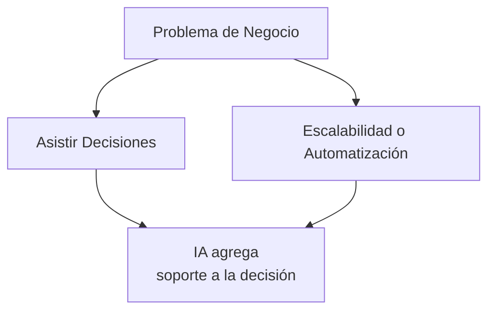
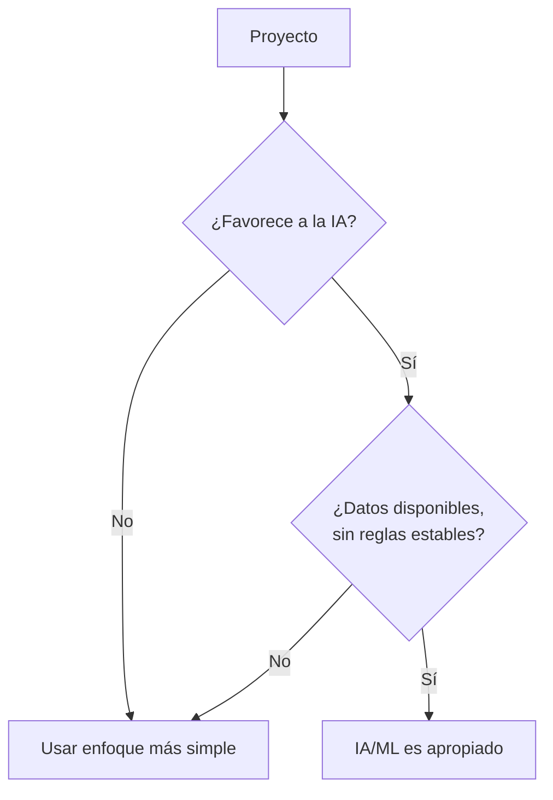
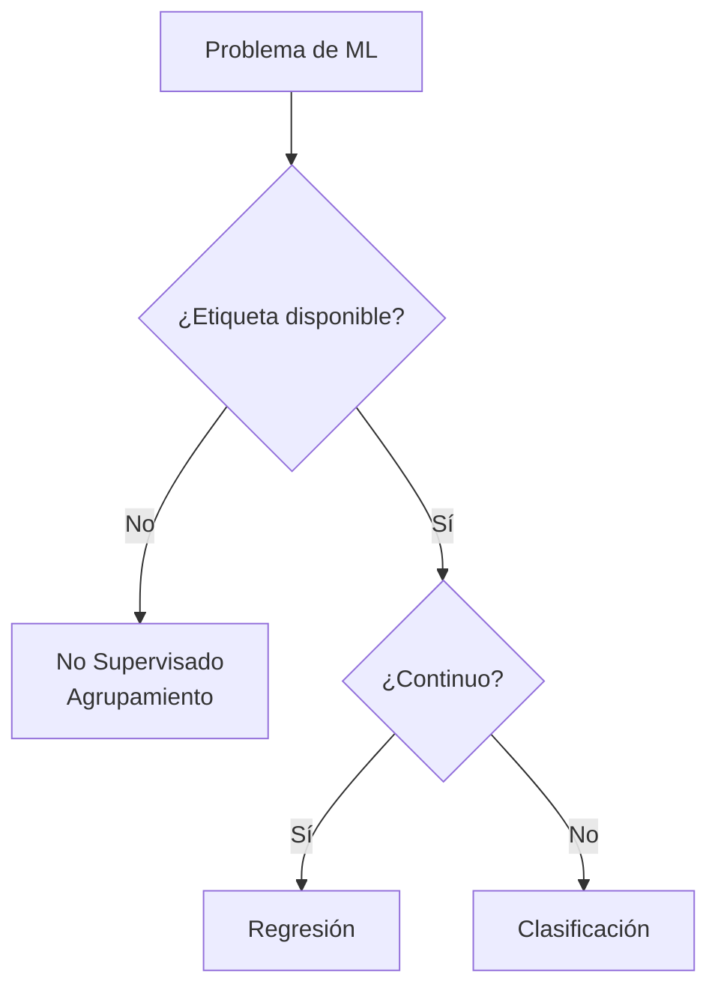
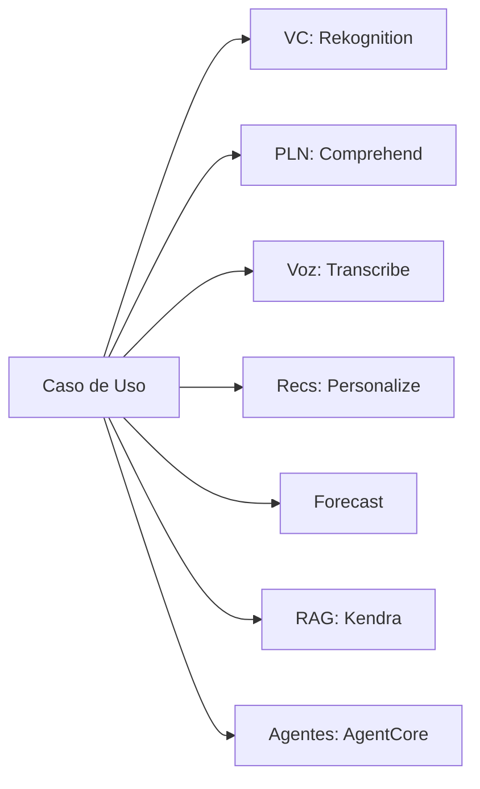
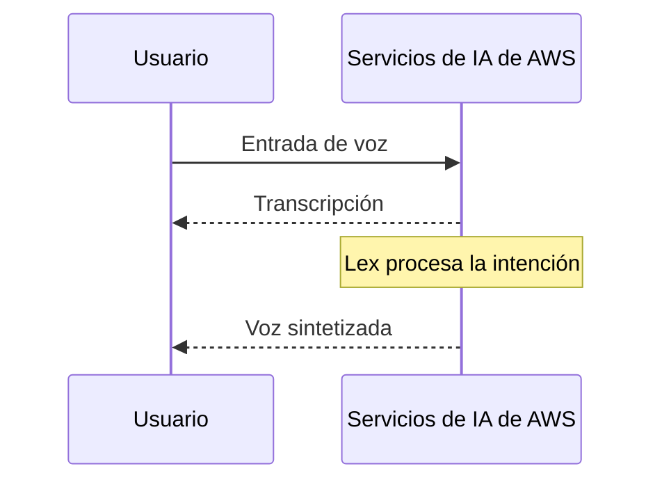
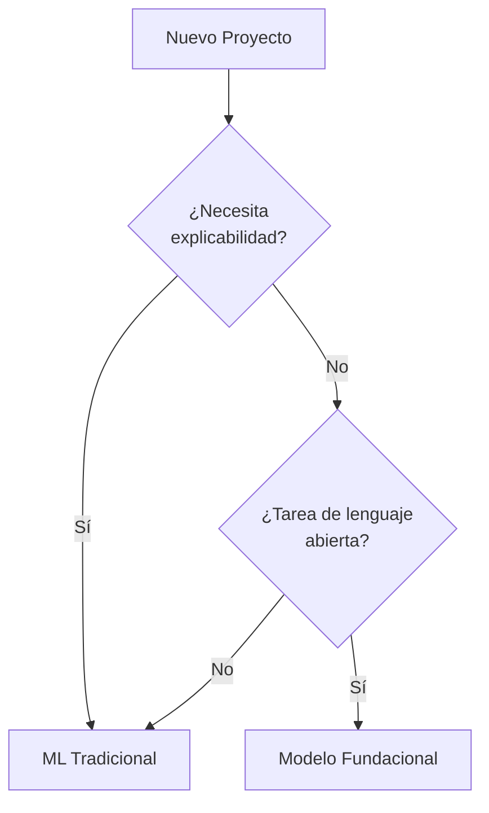

## Enunciado de tarea 1.2: Identificar casos de uso prácticos para la IA

Saber que la IA y el ML existen no es suficiente para que un profesional de negocios actúe sobre ellos con eficacia. La pregunta real es: ¿dónde producen mejores resultados que las alternativas, y dónde no? El Enunciado de Tarea 1.2 responde esa pregunta. Pasa de la teoría a la práctica mapeando categorías de problemas de negocio con las técnicas de IA apropiadas, catalogando los servicios administrados de AWS que reducen la carga de ingeniería, e introduciendo un nuevo punto de decisión de la versión v1.1: cuándo un modelo de ML tradicional es más apropiado que un modelo fundacional. Los objetivos cubiertos aquí son del 1.2.1 al 1.2.6.[^102001]

### 1.2.1 Reconocer dónde la IA/ML aporta valor

Tres categorías de necesidad de negocio definen la mayor parte de las situaciones en las que la IA y el ML superan a las alternativas más simples: asistir en la toma de decisiones humanas, permitir la escalabilidad de soluciones y automatizar tareas repetitivas. No son mutuamente excluyentes, y muchas implementaciones en producción combinan las tres. Sin embargo, entender cada categoría en sus propios términos facilita formular una propuesta de IA a los actores clave.

**Asistir en la toma de decisiones humanas** es el motor de valor más antiguo y quizás más duradero del ML. Un modelo no reemplaza al tomador de decisiones; reduce el rango de opciones que un humano debe considerar y asigna una estimación de probabilidad a cada opción restante. Un analista de riesgos hipotecarios, por ejemplo, revisa docenas de señales al evaluar una solicitud de préstamo. Un modelo de ML entrenado con el historial de rendimiento de préstamos puede clasificar esas señales por peso predictivo y marcar las solicitudes que caen fuera de los patrones normales, de modo que el analista enfoque la atención donde más importa. El humano conserva la responsabilidad y la autoridad; el modelo reduce la carga cognitiva y la posibilidad de pasar por alto una señal enterrada en un gran conjunto de características.[^102002]

**La escalabilidad de la solución** es la capacidad que más directamente se alinea con la economía de la nube. Un motor de reglas deterministas escrito por un desarrollador alcanza un límite cuando la lógica del negocio crece lo suficientemente compleja como para que mantener las reglas manualmente sea más lento que los cambios del negocio. Un modelo de ML entrenado con resultados escala de manera diferente: a medida que crece el volumen de entradas, el modelo ejecuta el mismo cálculo de inferencia independientemente de cuántas reglas de negocio habrían sido necesarias para replicar su salida. Un modelo de detección de fraudes que puntúa diez mil transacciones de pago por segundo no requiere ningún esfuerzo de ingeniería adicional en comparación con uno que puntúa cien transacciones por segundo; solo cambian los recursos de cómputo, y esos son elásticos en AWS.[^102003]

**La automatización** cubre la sustitución de la inferencia de ML por una tarea que anteriormente requería tiempo humano. La clasificación de documentos, la inspección de calidad de imágenes en una línea de fabricación y el enrutamiento en centros de llamadas basado en análisis de sentimientos son todos ejemplos. El valor de la automatización es más claro cuando la tarea es repetitiva, el volumen es alto, la tasa de error aceptable está bien entendida y el costo de los errores es recuperable más que catastrófico. La automatización no significa operación sin supervisión; la mayoría de los sistemas de automatización de IA en producción incluyen una ruta de revisión humana para los casos a los que el modelo asigna baja confianza.[^102004]

*Figura 1.2.1: Tres impulsores principales del valor de negocio de la IA/ML. El diagrama muestra cómo diferentes presiones del negocio se asignan a distintas categorías de valor de IA, cada una con su propio patrón operativo.*

Otras dos categorías aparecen con menor frecuencia en las preguntas del examen pero vale la pena mencionar. La *personalización de soluciones* aplica ML para adaptar el contenido, las ofertas o los flujos de trabajo a usuarios individuales según el historial de comportamiento, lo que es particularmente común en el comercio minorista y los medios. El *mantenimiento predictivo* aplica modelos de series temporales a datos de sensores de equipos, señalando la probabilidad de falla antes de que ocurra y permitiendo que los equipos de mantenimiento actúen según un calendario en lugar de en respuesta a tiempos de inactividad.

### 1.2.2 Cuándo las soluciones de IA/ML no son apropiadas

El examen trata este objetivo como de alto rendimiento, y la razón es práctica: las organizaciones que aplican la IA de forma indiscriminada desperdician presupuesto y a veces causan daños. Cuatro condiciones indican de manera confiable que la IA es la opción incorrecta.

**La falta de rentabilidad** es el descalificador más común en los proyectos reales. Construir y mantener un modelo de ML requiere etiquetar datos, ejecutar entrenamientos, infraestructura, monitoreo del modelo y reentrenamiento periódico a medida que cambia la distribución subyacente. Para un problema de negocio que afecta a un número pequeño de registros por día o cuyo resultado varía dentro de un rango estrecho y predecible, una simple tabla de búsqueda o un script de decisión de veinte líneas es más rápido de construir, más económico de operar y más fácil de auditar. El punto de equilibrio depende del volumen y la complejidad, pero el principio es coherente: si el costo de desarrollar y operar el sistema de ML supera el valor que retorna en un horizonte de planificación razonable, una solución más simple es la correcta.[^102005]

**Los requisitos de resultado determinista** surgen cuando un proceso de negocio o regulatorio exige una respuesta específica y reproducible para una entrada dada, en lugar de una estimación probabilística. Los cálculos fiscales, las verificaciones de elegibilidad regulatoria y las fórmulas de facturación contractual caen en esta categoría. Los modelos de ML producen salidas extraídas de una distribución aprendida; la misma entrada puede recibir puntuaciones ligeramente diferentes en diferentes momentos si el modelo se vuelve a entrenar, y el modelo no puede garantizar que nunca se desviará de la regla. Los sistemas basados en reglas garantizan reproducibilidad exacta. Cuando el requisito es "la respuesta siempre debe ser X cuando las condiciones son Y", el ML no es la herramienta correcta.[^102006]

**Los escenarios con pocos datos** socavan el requisito fundamental del aprendizaje supervisado. Un modelo entrenado con menos registros de los necesarios para cubrir la variación en el mundo real generalizará mal. El umbral varía según la técnica y el tipo de problema, pero una heurística aproximada es que la clasificación supervisada necesita al menos varios cientos de ejemplos etiquetados por clase, y la regresión se beneficia de varios miles de registros con variación significativa en el espacio de características. Las organizaciones que quieren aplicar ML a una nueva línea de productos, una fuente de datos recientemente adquirida o un tipo de evento raro a menudo encuentran que todavía no tienen suficientes datos para entrenar un modelo confiable.[^102007]

**Los problemas simples basados en reglas** son situaciones donde la lógica que mapea entradas a salidas puede expresarse claramente en un árbol de decisión de no más de cuatro o cinco niveles. Si un experto en la materia puede enumerar todos los casos, las condiciones y las salidas correctas en una sola tarde, y si esas reglas son estables a lo largo del tiempo, entonces codificarlas explícitamente es más auditable, más explicable y menos costoso que entrenar un modelo. La elegibilidad de devolución de clientes basada en la fecha de compra y la categoría del artículo es un ejemplo clásico: las reglas son conocidas, fijas y suficientemente pocas para mantenerse manualmente.

*Figura 1.2.2: Dos verificaciones resumidas de idoneidad de IA/ML. La primera compuerta filtra los proyectos que fallan la prueba de rentabilidad o determinismo; la segunda filtra los proyectos que carecen de datos o que ya tienen reglas estables. Un proyecto debe superar ambas compuertas para justificar la IA/ML sobre un enfoque más simple.*

Dos consideraciones adicionales vale la pena mencionar aunque aparecen con menos frecuencia en las preguntas del examen. Las *restricciones éticas y regulatorias* pueden limitar dónde puede operar un modelo probabilístico, particularmente en dominios de alto riesgo como la puntuación de crédito, la contratación y el diagnóstico clínico. Las *restricciones de latencia* importan cuando una aplicación necesita una respuesta en milisegundos de un solo dígito; ciertos modelos complejos requieren más tiempo de inferencia que ese, y una ruta de decisión codificada de forma fija puede ser la única opción que cumpla con el SLA.

### 1.2.3 Seleccionar las técnicas apropiadas de IA/ML

Elegir la técnica correcta comienza con la naturaleza de la señal etiquetada disponible en los datos de entrenamiento. Tres técnicas fundamentales supervisadas y no supervisadas aparecen explícitamente en los objetivos del examen; dos técnicas adicionales aparecen en los objetivos como menciones de paso.

La **regresión** predice una salida numérica continua dado un conjunto de características de entrada.[^102008] El modelo aprende la relación entre las características y una variable objetivo que puede tomar cualquier valor en un rango, como los ingresos esperados, las horas hasta la falla del equipo o la temperatura en una ubicación y momento determinados. Una cadena minorista que predice el volumen de ventas semanales por ubicación de tienda usa regresión. La salida no es una categoría; es un número sobre el que el negocio puede actuar directamente en un plan de inventario o personal.

La **clasificación** asigna una entrada a una de un conjunto finito de categorías.[^102009] Cuando el conjunto de categorías tiene dos miembros, el problema es *clasificación binaria*; cuando tiene más de dos, es *clasificación multiclase*. La detección de spam (spam o no spam), la predicción de incumplimiento de préstamos (incumplimiento o sin incumplimiento) y el etiquetado de imágenes (gato, perro o pájaro) son todos problemas de clasificación. La salida del modelo es típicamente una puntuación de probabilidad para cada clase, y la aplicación elige la clase con la puntuación más alta, opcionalmente combinada con un umbral de confianza que enruta las predicciones de baja confianza a un revisor humano.

El **agrupamiento** agrupa registros por similitud sin una etiqueta predefinida.[^102010] Dado que no existe ninguna variable objetivo etiquetada, el agrupamiento es una técnica no supervisada. El modelo descubre estructura en los datos que el analista no preespecificó. La segmentación de clientes es el ejemplo canónico: dado el historial de compras, el comportamiento de navegación y las señales demográficas, el modelo podría identificar cinco arquetipos distintos de clientes para los cuales el equipo de marketing puede diseñar campañas distintas. La detección de anomalías es una aplicación relacionada: los registros que no encajan bien en ningún grupo se marcan como inusuales.

Dos técnicas adicionales merecen una breve mención porque los objetivos del examen las nombran de pasada. La *reducción de dimensionalidad* comprime un espacio de características de alta dimensionalidad en menos dimensiones, lo que reduce el costo de cómputo y puede mejorar el rendimiento del modelo posterior al eliminar características correlacionadas o irrelevantes. La *detección de anomalías* identifica puntos de datos que se desvían significativamente de la distribución aprendida del comportamiento normal, lo que es un marco distinto de la clasificación aunque algunos modelos de clasificación se adaptan para este propósito.

*Tabla 1.2.1: Selección de técnicas de ML por tipo de problema*

| Técnica | Etiqueta de entrada | Tipo de salida | Ejemplo canónico de negocio |
|---------|---------------------|----------------|------------------------------|
| Regresión | Requerida (objetivo numérico) | Número continuo | Previsión de demanda, predicción de precios |
| Clasificación binaria | Requerida (dos clases) | Clase + probabilidad | Indicador de fraude, predicción de abandono |
| Clasificación multiclase | Requerida (múltiples clases) | Clase + probabilidad | Enrutamiento de documentos, categoría de defecto |
| Agrupamiento | No requerida | Asignación de grupo | Segmentación de clientes, descubrimiento de temas |
| Detección de anomalías | Opcional | Puntuación de anomalía | Intrusión de red, falla de sensor |

*Figura 1.2.3: Árbol de decisión para la selección de técnicas de ML. La rama principal separa los problemas supervisados de los no supervisados; la rama supervisada luego separa por la naturaleza de la variable objetivo.*

**Amazon SageMaker AI** admite todas las técnicas de la Tabla 1.2.1 a través de sus algoritmos integrados y el ecosistema de frameworks más amplio que aloja.[^102011] Para los equipos sin personal de ciencia de datos, la capacidad de AutoML dentro de SageMaker AI puede seleccionar y ajustar algoritmos automáticamente dado un conjunto de datos etiquetado, lo que convierte la selección de técnicas en una tarea de configuración guiada en lugar de un problema de investigación.

### 1.2.4 Aplicaciones de IA del mundo real

El objetivo 1.2.4 del examen se amplió en la versión v1.1 para incluir bases de conocimiento y IA agéntica junto a las seis categorías presentes en la versión v1.0. Estas ocho categorías representan el alcance completo de lo que el examen puede pedirle a los candidatos que reconozcan.

Los sistemas de **visión computacional** interpretan imágenes o fotogramas de video para extraer información estructurada.[^102012] La detección de objetos identifica y localiza elementos específicos dentro de una imagen; la clasificación de imágenes asigna una etiqueta a la imagen completa; el reconocimiento óptico de caracteres lee texto impreso o manuscrito de un escaneo. Una empresa de logística usa visión computacional para leer las etiquetas de los paquetes en una cinta transportadora y enrutarlos sin intervención humana. Una cadena minorista usa cámaras de escaneo de estantes para detectar cuándo un producto está agotado. **Amazon Rekognition** es el servicio administrado de AWS para visión computacional; proporciona modelos preentrenados para detección de objetos y escenas, reconocimiento de texto y análisis facial, y acepta tanto imágenes individuales como flujos de video.[^102013]

El **procesamiento del lenguaje natural (PLN)** permite a los sistemas derivar significado del texto no estructurado.[^102014] El análisis de sentimientos determina si un cuerpo de texto expresa sentimiento positivo, negativo o neutro. El reconocimiento de entidades extrae entidades nombradas como nombres de productos, ubicaciones y personas de un documento. El modelado de temas agrupa una colección de documentos por tema. Un equipo de éxito del cliente ejecuta análisis de sentimientos en los tickets de soporte cada noche para identificar quejas de productos emergentes antes de que escalen. **Amazon Comprehend** es el servicio administrado de PLN principal de AWS, que proporciona análisis de sentimientos, reconocimiento de entidades, extracción de frases clave y clasificación personalizada.[^102015]

El **reconocimiento de voz** convierte el audio hablado en texto, habilitando interfaces de voz, transcripción de reuniones y análisis de llamadas.[^102016] El desafío en producción es manejar acentos diversos, ruido de fondo, vocabulario específico del dominio y restricciones de latencia en tiempo real. **Amazon Transcribe** convierte audio en texto y admite vocabulario personalizado, identificación de locutores y puntuación automática en modos de tiempo real y por lotes.[^102017]

Los **sistemas de recomendación** predicen qué elementos es más probable que un usuario use o consuma, dado el historial de comportamiento y las señales contextuales.[^102018] Una plataforma de comercio electrónico recomienda productos basándose en lo que un cliente ha navegado y comprado anteriormente. Un servicio de transmisión recomienda programas basándose en el historial de visualización y las calificaciones. La técnica subyacente es típicamente el filtrado colaborativo, que identifica usuarios con comportamiento similar y transfiere preferencias entre el grupo, o el filtrado basado en contenido, que coincide elementos cuyos atributos se parecen a los que el usuario ya ha consumido. **Amazon Personalize** es un servicio administrado de recomendaciones que maneja el canal de entrenamiento, despliegue y servicio en tiempo real sin requerir experiencia en ML por parte del equipo de la aplicación.[^102019]

La **detección de fraudes** identifica transacciones o actividades de cuenta que se desvían del patrón aprendido del comportamiento legítimo.[^102020] Los bancos aplican la detección de fraudes en la etapa de autorización de pagos, puntuando cada transacción en tiempo real y rechazando o marcando las que superan un umbral de riesgo. Las compañías de seguros la aplican a las reclamaciones presentadas para reembolso. El enfoque de ML supera a las reglas estáticas porque los patrones de fraude evolucionan continuamente, y un modelo puede reentrenarse a medida que surgen nuevas tácticas de fraude. La técnica subyacente es a menudo la clasificación binaria con una capa de detección de anomalías encima. **Amazon Fraud Detector** es el servicio administrado de AWS que empaqueta este patrón, con modelos preintegrados para fraude en línea, fraude de transacciones y toma de control de cuentas.

La **previsión** produce predicciones de valores futuros para una variable de series temporales, como la demanda de productos, el consumo de energía o los requisitos de personal de centros de llamadas.[^102021] Las entradas son observaciones históricas de la variable objetivo más *series temporales relacionadas* opcionales (como promociones, festivos y clima) que el modelo puede usar para mejorar la exactitud. **Amazon Forecast** es un servicio administrado de previsión que selecciona automáticamente entre algoritmos estadísticos y de aprendizaje profundo, calcula *previsiones cuantílicas* (por ejemplo, niveles de demanda p50 y p90), y escribe los resultados en Amazon S3 para su consumo posterior.[^102022]

Las **bases de conocimiento** son almacenes estructurados de información que los sistemas de IA pueden consultar en el momento de la inferencia para fundamentar sus respuestas en contenido verificado en lugar de depender únicamente de los patrones codificados en los pesos del modelo.[^102023] Una base de conocimiento para una empresa de servicios financieros podría contener documentos regulatorios, especificaciones de productos y plantillas de respuesta aprobadas. Cuando un cliente hace una pregunta a través de un asistente de IA, el sistema recupera la sección relevante de la base de conocimiento y la usa para formular una respuesta fundamentada en hechos. Este patrón se denomina formalmente *generación aumentada por recuperación (RAG)*, que el Dominio 3 de este libro cubre en profundidad. **Amazon Kendra** es un servicio administrado de búsqueda empresarial que sustenta muchas implementaciones de bases de conocimiento, indexando repositorios de documentos y devolviendo pasajes relevantes en respuesta a consultas en lenguaje natural.[^102024]

La **IA agéntica** describe sistemas en los que uno o más modelos de IA planifican y ejecutan tareas de varios pasos de forma autónoma, llamando a herramientas y APIs para interactuar con sistemas externos.[^102025] Un sistema de un solo agente podría manejar un flujo de trabajo de servicio al cliente de principio a fin: interpretar la solicitud del cliente, buscar información de la cuenta en un CRM, verificar el inventario de productos, redactar una resolución y enviar un correo electrónico de confirmación, todo sin un operador humano. Un sistema multiagente distribuye las subtareas entre agentes especializados; un agente orquestador asigna el trabajo, los subagentes lo ejecutan y el orquestador compila los resultados. Las aplicaciones de negocio para la IA agéntica incluyen las operaciones de TI (un agente que monitorea alertas, diagnostica la causa raíz y aplica una corrección de un manual de procedimientos), el procesamiento de documentos (un agente que lee facturas, extrae partidas y las ingresa en un ERP) y la incorporación de clientes (un agente que recopila los documentos requeridos, los valida y activa el aprovisionamiento de la cuenta).

**Amazon Bedrock AgentCore** es el entorno de ejecución administrado de AWS para cargas de trabajo de IA agéntica en producción, que proporciona gestión de memoria, orquestación de herramientas y persistencia de sesiones para agentes construidos sobre modelos fundacionales.[^102026] Para los equipos que desarrollan aplicaciones agénticas, **Strands Agents** es un SDK de código abierto que simplifica la composición de múltiples agentes, mientras que los agentes de **Amazon Bedrock** proporcionan una capa de orquestación completamente administrada que conecta los modelos fundacionales con grupos de acciones definidos como funciones de AWS Lambda o esquemas de API.[^102027]

*Figura 1.2.4: Categorías de aplicaciones de IA del mundo real y el servicio administrado de AWS principal que implementa cada una. La detección de fraudes no se muestra porque abarca múltiples servicios (Amazon Fraud Detector y SageMaker AI) según el enfoque de implementación.*

### 1.2.5 Servicios administrados de IA/ML de AWS

Los servicios administrados de IA de AWS eliminan el requisito de desarrollo de modelos interno al proporcionar capacidades preentrenadas a través de APIs. El objetivo 1.2.5 del examen nombra explícitamente seis servicios y la lista de servicios dentro del alcance agrega cuatro más que aparecen en la práctica y en los distractores del examen.

Los seis servicios nombrados se dividen ordenadamente por función. **Amazon SageMaker AI** es la plataforma de ML de extremo a extremo para construir, entrenar y desplegar modelos personalizados a cualquier escala.[^102028] No es un servicio preentrenado sino un entorno administrado que maneja la infraestructura para cada etapa del ciclo de vida de ML. Los equipos que necesitan un modelo entrenado con sus propios datos, en lugar de una API genérica preentrenada, comienzan con SageMaker AI. **Amazon Transcribe** convierte voz en texto y es el fundamento de cualquier flujo de trabajo que necesite ingerir audio.[^102029] **Amazon Translate** proporciona traducción automática neuronal en una amplia gama de pares de idiomas, admitiendo la localización de contenido, el chat multilingüe en tiempo real y la traducción de documentos por lotes.[^102030] Amazon Comprehend, introducido anteriormente en esta sección, maneja la etapa de análisis de texto en cualquier transcripción que produzca Amazon Transcribe.[^102031] **Amazon Lex** construye interfaces conversacionales que comprenden intenciones en lenguaje natural y gestionan el estado del diálogo, y se integra con **Amazon Polly**, que convierte texto en voz natural para respuestas en canal de voz.[^102032][^102033]

Cuatro servicios adicionales dentro del alcance aparecen regularmente en las preguntas del examen y en las arquitecturas reales. **Amazon Rekognition** maneja el análisis de imágenes y video, incluida la detección de objetos, el reconocimiento de texto y la moderación de contenido.[^102034] **Amazon Textract** va más allá del reconocimiento óptico de caracteres para extraer datos estructurados, como campos de formularios y valores de tablas, de documentos escaneados.[^102035] **Amazon Personalize** ofrece recomendaciones personalizadas entrenadas con los datos de interacción que proporciona el cliente.[^102036] **Amazon Kendra** es un servicio de búsqueda empresarial que indexa documentos internos y devuelve pasajes relevantes en respuesta a preguntas en lenguaje natural, sirviendo como capa de recuperación en arquitecturas de bases de conocimiento.[^102037]

*Tabla 1.2.2: Servicios administrados de IA/ML de AWS agrupados por capacidad*

| Capacidad | Servicio | Función principal |
|-----------|---------|-------------------|
| Desarrollo de modelos personalizados | Amazon SageMaker AI | Construir, entrenar y desplegar modelos de ML personalizados |
| Voz a texto | Amazon Transcribe | Reconocimiento automático de voz con identificación de locutores |
| Texto a voz | Amazon Polly | Texto a voz neuronal en múltiples voces |
| Traducción de idiomas | Amazon Translate | Traducción automática neuronal, por lotes y en tiempo real |
| Análisis de texto | Amazon Comprehend | Sentimientos, entidades, frases clave, clasificación personalizada |
| IA conversacional | Amazon Lex | Reconocimiento de intención y gestión de diálogo |
| Visión computacional | Amazon Rekognition | Detección de objetos, reconocimiento de texto, moderación de contenido |
| Extracción de datos de documentos | Amazon Textract | Extracción de campos estructurados y tablas de documentos |
| Recomendaciones | Amazon Personalize | Recomendaciones personalizadas en tiempo real |
| Búsqueda empresarial | Amazon Kendra | Búsqueda en lenguaje natural sobre repositorios de documentos internos |

Una trampa común en el examen es confundir servicios con áreas de superficie superpuestas. **Amazon Transcribe** produce una transcripción de texto; **Amazon Comprehend** analiza esa transcripción para obtener significado. **Amazon Lex** comprende intenciones conversacionales en tiempo real; **Amazon Polly** habla la respuesta de vuelta. **Amazon Textract** lee datos estructurados de una página escaneada; **Amazon Rekognition** detecta objetos y escenas en la misma imagen. Estos pares a menudo aparecen juntos en las preguntas de arquitectura, y saber qué servicio pertenece a qué etapa es la clave para seleccionar la respuesta correcta.

*Figura 1.2.5: Flujo conceptual del canal de voz. El usuario habla a una cadena de servicios de IA de AWS que transcribe el audio, interpreta la intención y sintetiza una respuesta hablada; los traspasos específicos entre servicios (Transcribe a Lex a Comprehend a Polly) se describen en el párrafo anterior.*

### 1.2.6 ML tradicional vs. modelos fundacionales

El objetivo 1.2.6 es nuevo en la versión v1.1, lo que refleja la pregunta práctica que ahora enfrentan todos los equipos de IA: ¿cuándo es un modelo fundacional (FM) la herramienta correcta, y cuándo es mejor un modelo de ML tradicional construido y entrenado desde cero?[^102038] La decisión no se trata de la sofisticación de ninguna de las opciones. Se trata de la adecuación: hacer coincidir las características de los datos disponibles, las salidas requeridas, el entorno regulatorio y el presupuesto operativo con las capacidades de cada enfoque.

Los **modelos de ML tradicionales** se entrenan con datos etiquetados para una tarea específica y bien delimitada. Son totalmente interpretables en el sentido de que la importancia de las características y la lógica de decisión se pueden extraer y auditar. Ejecutan la inferencia con baja latencia, típicamente en milisegundos de un solo dígito en hardware modesto. Su costo computacional es predecible y a menudo bajo. Requieren datos de entrenamiento etiquetados por dominio, que pueden ser costosos de adquirir, pero una vez entrenados no tienen ningún cargo de cómputo continuo basado en tokens.[^102039]

Los **modelos fundacionales** están preentrenados en corpus amplios de propósito general y pueden manejar una amplia gama de tareas de lenguaje y multimodales con una configuración adicional mínima.[^102040] Destacan en tareas que requieren comprensión del lenguaje natural, generación de contenido, síntesis de código o razonamiento sobre temas vagamente relacionados. Aceptan indicaciones conversacionales y ajustan su comportamiento según las instrucciones sin necesidad de reentrenamiento. Su modelo de costo es típicamente por token, lo que significa que cada llamada de inferencia se cobra por el número de tokens en la entrada y la salida. La latencia es más alta que la del ML tradicional, típicamente en el rango de cientos de milisegundos a segundos.

*Tabla 1.2.3: Criterios de decisión para ML tradicional vs. modelos fundacionales*

| Criterio | ML Tradicional | Modelo Fundacional |
|----------|---------------|-------------------|
| Alcance de la tarea | Tarea única y bien definida | Tareas amplias o generales |
| Datos de entrenamiento | Conjunto de datos etiquetado por dominio requerido | Preentrenado; indicar o ajustar fino |
| Explicabilidad | Alta; importancia de características disponible | Menor; razonamiento emergente |
| Latencia | Baja (milisegundos de un dígito) | Mayor (cientos de ms a segundos) |
| Costo de inferencia | Predecible; sin cargo por token | Por token; variable con la longitud de entrada |
| Adecuación regulatoria | Sólida; auditabilidad completa | Más débil; preocupaciones por variabilidad de salida |
| Soporte multimodal | Limitado a las modalidades entrenadas | Amplio (texto, imagen, audio según el modelo) |
| Tarea única de alto volumen | Alta; escala horizontalmente | Bajo; el costo por token crece con el volumen |

Cuatro condiciones favorecen fuertemente la elección de un modelo de ML tradicional. En primer lugar, los requisitos regulatorios o de cumplimiento exigen una ruta de decisión completamente auditable y reproducible. La puntuación de riesgo de crédito bajo regulación bancaria, por ejemplo, generalmente requiere la capacidad de explicar cualquier decisión individual, y un árbol de impulso de gradiente o un modelo de regresión logística puede proporcionar esa explicación en un formato que los reguladores aceptan.[^102041] En segundo lugar, la tarea de predicción tiene una salida única bien definida (un número, una categoría o una puntuación) y suficientes datos de entrenamiento etiquetados para alcanzar una exactitud aceptable sin razonamiento de propósito general. En tercer lugar, la latencia y el costo están estrictamente restringidos; la aplicación se ejecuta a alto volumen y debe devolver predicciones en milisegundos a una fracción de un centavo por inferencia. En cuarto lugar, la organización tiene suficiente capacidad de ingeniería de ML para gestionar el canal de entrenamiento y reentrenamiento.

Cuatro condiciones favorecen un modelo fundacional. En primer lugar, la tarea requiere generar prosa coherente, razonar sobre preguntas ambiguas o sintetizar información de múltiples fuentes, que son capacidades que los modelos de ML tradicionales no pueden proporcionar. En segundo lugar, la organización tiene datos de entrenamiento etiquetados mínimos pero tiene acceso a una descripción de tarea bien definida que puede expresar como una indicación, lo que hace que la inferencia few-shot o zero-shot sea viable. En tercer lugar, el caso de uso es conversacional y el modelo necesita mantener el contexto a lo largo de múltiples turnos sin lógica explícita de gestión de estado. En cuarto lugar, el volumen de la aplicación es suficientemente bajo como para que el costo por token sea aceptable, o las tareas son suficientemente únicas como para que un modelo de propósito general amortice el costo de una construcción de modelo especializado.

*Figura 1.2.6: Flujo de decisión para elegir entre un modelo de ML tradicional y un modelo fundacional. Los requisitos regulatorios y el tipo de tarea son los dos filtros principales; la latencia y la disponibilidad de datos refinan la elección.*

Tanto el Marco de Gestión de Riesgos de IA del NIST como el EU AI Act imponen requisitos de trazabilidad a los sistemas de IA utilizados en decisiones de alto riesgo.[^102042] En la práctica, las organizaciones sujetas a esos marcos a menudo adoptan un patrón híbrido: un modelo de ML tradicional maneja la tarea de predicción central y genera la salida auditable, mientras que un modelo fundacional maneja las tareas de lenguaje adyacentes como generar la explicación para el cliente de la decisión o resumir la evidencia de respaldo de documentos no estructurados.

La línea entre los dos enfoques se está moviendo. Las capacidades de destilación de modelos de AWS dentro de **Amazon Bedrock** permiten a los equipos transferir el comportamiento de razonamiento de un gran modelo fundacional a un modelo más pequeño, más rápido y más económico ajustado a una tarea específica.[^102043] El resultado es un modelo que se comporta como un modelo fundacional dentro de su dominio estrecho pero que se ejecuta con un perfil de costo y latencia más cercano a un modelo de ML tradicional. Esta técnica aparece en el objetivo 3.1.5 y vale la pena señalarla aquí como un puente entre las dos categorías.

**Lo que cubrió esta sección:** El Enunciado de Tarea 1.2 estableció cómo reconocer dónde la IA y el ML agregan valor, cuándo evitarlos, cómo hacer coincidir las técnicas con los tipos de problemas y qué servicios administrados de AWS manejan cada categoría de aplicación. También introdujo el nuevo marco de decisión de la versión v1.1 para elegir entre modelos de ML tradicionales y modelos fundacionales. El Enunciado de Tarea 1.3, que sigue, cubre el ciclo de vida de desarrollo de IA/ML de extremo a extremo y mapea cada etapa a los servicios de AWS que lo respaldan.

## Preguntas de autoevaluación

**Pregunta 1**

Una empresa minorista procesa 50.000 correos electrónicos de soporte al cliente por día y necesita enrutar cada correo electrónico al departamento correcto según su tema. La empresa tiene 12 meses de correos electrónicos históricos que ya están etiquetados con el departamento correcto. ¿Qué enfoque se adapta MEJOR a este problema?

A. Regresión, porque el modelo necesita predecir una puntuación para cada departamento y la puntuación más alta determina el enrutamiento.

B. Clasificación multiclase, porque la salida es uno de varios departamentos predefinidos y hay datos etiquetados disponibles.

C. Agrupamiento, porque hay demasiados datos para etiquetarlos manualmente y los departamentos aún no están definidos.

D. Un modelo fundacional con indicación zero-shot, porque los datos etiquetados hacen que el ajuste fino sea innecesario y la indicación es más simple.

Con 12 meses de correos electrónicos etiquetados y un conjunto fijo de departamentos conocidos, este es un problema de clasificación multiclase de libro de texto. Los datos etiquetados son suficientes para entrenar un modelo de ML tradicional, la salida es una de un número finito de categorías, y el volumen (50.000 por día) hace que el costo predecible y la baja latencia de un clasificador entrenado sean preferibles a la inferencia de FM por token. La regresión predice números continuos, no categorías. El agrupamiento sería apropiado si los departamentos fueran desconocidos o si no hubiera etiquetas, pero ninguna de las dos condiciones aplica aquí. Un modelo fundacional con indicación zero-shot puede categorizar texto, pero con 50.000 correos electrónicos por día el costo por token se acumula rápidamente y la latencia es mayor que la de un clasificador entrenado; los datos etiquetados deben usarse para entrenar un modelo específico en lugar de descartarlos.[^102044]

**Pregunta 2**

Una firma de servicios financieros debe explicar cada decisión de préstamo a los reguladores, incluidas las características de entrada que más influyeron en el resultado. La firma está evaluando si usar un modelo de ML tradicional o un modelo fundacional. ¿Qué factor favorece MÁS FUERTEMENTE el enfoque de ML tradicional?

A. La firma tiene un gran volumen de datos de entrenamiento etiquetados de solicitudes de préstamos pasadas.

B. El requisito regulatorio de explicabilidad y lógica de decisión auditable.

C. El requisito de latencia de inferencia es inferior a 200 milisegundos por solicitud.

D. La firma quiere evitar los precios por token para controlar los costos de inferencia.

La explicabilidad regulatoria es el factor decisivo aquí. Los modelos de ML tradicionales como la regresión logística y los árboles de impulso de gradiente exponen puntuaciones de importancia de características y rutas de decisión que satisfacen los requisitos de auditoría. Los modelos fundacionales producen salidas a través de un razonamiento emergente que es difícil de atribuir a características específicas en un formato que los reguladores aceptan. La presencia de datos de entrenamiento etiquetados (A) es un factor de apoyo para el ML tradicional pero no es el diferenciador más fuerte cuando se compara con los requisitos regulatorios. La latencia por debajo de 200 ms (C) los modelos de ML tradicionales sí la cumplen, pero muchos despliegues de modelos fundacionales también cumplen con este umbral. El precio por token (D) es una consideración de costo pero no tan vinculante como el cumplimiento regulatorio.[^102045]

**Pregunta 3**

Una empresa manufacturera quiere identificar qué máquinas en su planta de producción tienen probabilidades de fallar dentro de las próximas 72 horas, basándose en lecturas de sensores recopiladas cada minuto. El modelo debe devolver una predicción, no una regla estática. No hay historial de fallas etiquetado. ¿Qué enfoque de ML es MÁS apropiado?

A. Clasificación binaria usando datos históricos de sensores etiquetados con eventos de falla.

B. Regresión usando el número de llamadas de mantenimiento pasadas como variable objetivo.

C. Detección de anomalías no supervisada en las series temporales de los sensores, marcando las lecturas que se desvían del perfil normal aprendido de cada máquina.

D. Clasificación multiclase para categorizar la gravedad de la falla como baja, media o alta.

Sin un historial de fallas etiquetado, los enfoques supervisados (A, B, D) no se pueden aplicar directamente. La detección de anomalías no supervisada aprende el patrón normal de las lecturas de los sensores para cada máquina y marca las desviaciones de ese patrón; en AWS, **Amazon SageMaker AI** ofrece Random Cut Forest y DeepAR para exactamente este tipo de detección de anomalías en series temporales, y las puntuaciones de anomalía resultantes sirven como un proxy no supervisado del riesgo de falla. La clasificación binaria (A) es el enfoque ideal una vez que haya etiquetas disponibles, y la organización debería planificar recopilar eventos de falla etiquetados para el futuro entrenamiento de modelos supervisados. La regresión (B) requiere una variable objetivo numérica; el número de llamadas de mantenimiento pasadas es un proxy pero no predice directamente la falla futura dentro de una ventana específica. La clasificación multiclase (D) también requiere categorías de gravedad etiquetadas que aún no existen.[^102046]

**Pregunta 4**

Una empresa está evaluando una solución de IA para automatizar el cálculo de las bonificaciones de los empleados bajo un convenio colectivo. La fórmula está especificada con precisión en el acuerdo, se aplica de forma idéntica a todos los empleados en el mismo grado laboral y no ha cambiado en cinco años. ¿Qué determinación es MÁS apropiada?

A. Implementar un modelo de clasificación para determinar en qué nivel de bonificación cae cada empleado.

B. Implementar un modelo de regresión para predecir los montos de bonificación a partir de datos de salario y rendimiento.

C. No usar IA/ML; implementar la fórmula como código determinista, porque el resultado debe ser exacto y reproducible.

D. Usar un modelo fundacional para interpretar el texto del acuerdo y calcular la bonificación apropiada.

Este es un escenario de resultado determinista. El cálculo de la bonificación es una fórmula fija sin elemento probabilístico; las mismas entradas siempre deben producir la misma salida sin varianza. Una implementación basada en reglas o en fórmulas garantiza reproducibilidad exacta y es trivialmente auditable. Un modelo de clasificación (A) introduciría una estimación de probabilidad y no podría garantizar que se respeten las condiciones de límite exactas del acuerdo. Un modelo de regresión (B) predice un valor continuo a partir de patrones aprendidos, pero el valor correcto ya está especificado por la fórmula; usar ML aquí agrega complejidad sin beneficio. Un modelo fundacional (D) puede interpretar texto pero no garantizaría exactitud aritmética e introduce latencia y costo para una tarea que no requiere ninguna de las capacidades del FM.[^102047]

**Pregunta 5**

Una empresa de tecnología quiere construir un asistente de servicio al cliente que pueda manejar preguntas en cualquiera de 15 idiomas, mantener el contexto conversacional a lo largo de múltiples turnos y generar respuestas personalizadas que se basen en la documentación interna de productos de la empresa. La empresa no tiene datos de entrenamiento de preguntas y respuestas etiquetados. ¿Qué enfoque es el MEJOR?

A. Entrenar un modelo de clasificación multiclase para enrutar preguntas a respuestas preescritas en cada idioma.

B. Usar un modelo fundacional con recuperación de una base de conocimiento de Amazon Kendra, combinado con Amazon Translate para el manejo de idiomas.

C. Usar Amazon Lex para la gestión del diálogo y Amazon Comprehend para el análisis de sentimientos, sin ningún modelo fundacional.

D. Construir modelos de regresión separados para cada idioma, cada uno entrenado para puntuar la relevancia de las respuestas candidatas.

Este escenario tiene tres requisitos que colectivamente favorecen una arquitectura de modelo fundacional: contexto conversacional de múltiples turnos, generación de contenido a partir de documentos internos y soporte multilingüe sin datos de entrenamiento etiquetados. Conectar un modelo fundacional a una base de conocimiento de Amazon Kendra proporciona generación aumentada por recuperación, fundamentando las respuestas del modelo en la documentación real de la empresa. Muchos modelos fundacionales manejan múltiples idiomas de forma nativa, pero Amazon Translate puede complementar para idiomas que el FM maneja menos bien. Un modelo de clasificación (A) puede enrutar a respuestas estáticas pero no puede generar respuestas personalizadas ni mantener el contexto a lo largo de los turnos. Amazon Lex y Comprehend (C) gestionan el diálogo y el sentimiento pero no recuperan de la documentación interna ni generan nuevas respuestas; esta combinación por sí sola no cumpliría con el requisito de generación. Los modelos de regresión (D) podrían puntuar las respuestas candidatas pero no pueden generar nuevas respuestas ni mantener el estado conversacional, y el enfoque requeriría construir y mantener 15 modelos separados.[^102048]

---

[^102001]: AWS Certification: AWS Certified AI Practitioner (AIF-C01) Exam Guide v1.1, Task Statement 1.2. URL: <https://docs.aws.amazon.com/aws-certification/latest/ai-practitioner-01/ai-practitioner-01-domain1.html>
[^102002]: Amazon SageMaker AI Developer Guide: Human-in-the-loop workflows. URL: <https://docs.aws.amazon.com/sagemaker/latest/dg/a2i-use-augmented-ai-a2i-human-review-loops.html>
[^102003]: Amazon SageMaker AI: Model deployment and real-time inference. URL: <https://docs.aws.amazon.com/sagemaker/latest/dg/deploy-model.html>
[^102004]: Amazon Augmented AI (A2I) Developer Guide: What is Amazon A2I? URL: <https://docs.aws.amazon.com/sagemaker/latest/dg/a2i-getting-started.html>
[^102005]: AWS Well-Architected Framework: Machine Learning Lens - Cost optimization pillar. URL: <https://docs.aws.amazon.com/wellarchitected/latest/machine-learning-lens/cost-optimization.html>
[^102006]: NIST AI Risk Management Framework (AI RMF 1.0): Trustworthiness characteristic - Explainability. URL: <https://airc.nist.gov/Home>
[^102007]: Amazon SageMaker AI Developer Guide: Prepare your data. URL: <https://docs.aws.amazon.com/sagemaker/latest/dg/data-prep.html>
[^102008]: Amazon SageMaker AI Developer Guide: Linear Learner algorithm. URL: <https://docs.aws.amazon.com/sagemaker/latest/dg/linear-learner.html>
[^102009]: Amazon SageMaker AI Developer Guide: XGBoost algorithm. URL: <https://docs.aws.amazon.com/sagemaker/latest/dg/xgboost.html>
[^102010]: Amazon SageMaker AI Developer Guide: K-Means algorithm. URL: <https://docs.aws.amazon.com/sagemaker/latest/dg/k-means.html>
[^102011]: Amazon SageMaker AI overview. URL: <https://aws.amazon.com/sagemaker/>
[^102012]: Amazon Rekognition Developer Guide: What is Amazon Rekognition? URL: <https://docs.aws.amazon.com/rekognition/latest/dg/what-is.html>
[^102013]: Amazon Rekognition product page. URL: <https://aws.amazon.com/rekognition/>
[^102014]: Amazon Comprehend Developer Guide: What is Amazon Comprehend? URL: <https://docs.aws.amazon.com/comprehend/latest/dg/what-is.html>
[^102015]: Amazon Comprehend product page. URL: <https://aws.amazon.com/comprehend/>
[^102016]: Amazon Transcribe Developer Guide: What is Amazon Transcribe? URL: <https://docs.aws.amazon.com/transcribe/latest/dg/what-is.html>
[^102017]: Amazon Transcribe product page. URL: <https://aws.amazon.com/transcribe/>
[^102018]: Amazon Personalize Developer Guide: What is Amazon Personalize? URL: <https://docs.aws.amazon.com/personalize/latest/dg/what-is-personalize.html>
[^102019]: Amazon Personalize product page. URL: <https://aws.amazon.com/personalize/>
[^102020]: Amazon Fraud Detector product page. URL: <https://aws.amazon.com/fraud-detector/>
[^102021]: Amazon Forecast Developer Guide: What is Amazon Forecast? URL: <https://docs.aws.amazon.com/forecast/latest/dg/what-is-forecast.html>
[^102022]: Amazon Forecast product page. URL: <https://aws.amazon.com/forecast/>
[^102023]: Amazon Kendra Developer Guide: What is Amazon Kendra? URL: <https://docs.aws.amazon.com/kendra/latest/dg/what-is-kendra.html>
[^102024]: Amazon Kendra product page. URL: <https://aws.amazon.com/kendra/>
[^102025]: Amazon Bedrock User Guide: Agents for Amazon Bedrock. URL: <https://docs.aws.amazon.com/bedrock/latest/userguide/agents.html>
[^102026]: Amazon Bedrock AgentCore product page. URL: <https://aws.amazon.com/bedrock/agentcore/>
[^102027]: Strands Agents SDK on GitHub. URL: <https://github.com/strands-agents/sdk-python>
[^102028]: Amazon SageMaker AI Developer Guide: What is Amazon SageMaker AI? URL: <https://docs.aws.amazon.com/sagemaker/latest/dg/whatis.html>
[^102029]: Amazon Transcribe Developer Guide: Real-time transcription. URL: <https://docs.aws.amazon.com/transcribe/latest/dg/getting-started-streaming.html>
[^102030]: Amazon Translate Developer Guide: What is Amazon Translate? URL: <https://docs.aws.amazon.com/translate/latest/dg/what-is.html>
[^102031]: Amazon Comprehend Developer Guide: Sentiment analysis. URL: <https://docs.aws.amazon.com/comprehend/latest/dg/how-sentiment.html>
[^102032]: Amazon Lex Developer Guide: What is Amazon Lex? URL: <https://docs.aws.amazon.com/lexv2/latest/dg/what-is.html>
[^102033]: Amazon Polly Developer Guide: What is Amazon Polly? URL: <https://docs.aws.amazon.com/polly/latest/dg/what-is.html>
[^102034]: Amazon Rekognition Developer Guide: Detecting objects and scenes. URL: <https://docs.aws.amazon.com/rekognition/latest/dg/labels.html>
[^102035]: Amazon Textract Developer Guide: What is Amazon Textract? URL: <https://docs.aws.amazon.com/textract/latest/dg/what-is.html>
[^102036]: Amazon Personalize Developer Guide: Getting recommendations. URL: <https://docs.aws.amazon.com/personalize/latest/dg/getting-recommendations.html>
[^102037]: Amazon Kendra Developer Guide: Querying an index. URL: <https://docs.aws.amazon.com/kendra/latest/dg/searching-example.html>
[^102038]: AWS Certification: AIF-C01 v1.1 revisions - Objectives added in v1.1, objective 1.2.6. URL: <https://docs.aws.amazon.com/aws-certification/latest/ai-practitioner-01/aif-01-revisions.html>
[^102039]: Amazon SageMaker AI Developer Guide: Training models. URL: <https://docs.aws.amazon.com/sagemaker/latest/dg/how-it-works-training.html>
[^102040]: Amazon Bedrock User Guide: Foundation models in Amazon Bedrock. URL: <https://docs.aws.amazon.com/bedrock/latest/userguide/foundation-models.html>
[^102041]: NIST AI Risk Management Framework AI RMF 1.0 - Govern function: Policies and accountability. URL: <https://airc.nist.gov/Home>
[^102042]: EU Artificial Intelligence Act, Article 13: Transparency and provision of information to users. URL: <https://eur-lex.europa.eu/legal-content/EN/TXT/?uri=CELEX:32024R1689>
[^102043]: Amazon Bedrock User Guide: Model distillation. URL: <https://docs.aws.amazon.com/bedrock/latest/userguide/model-distillation.html>
[^102044]: Amazon SageMaker AI Developer Guide: Multi-class classification. URL: <https://docs.aws.amazon.com/sagemaker/latest/dg/xgboost.html>
[^102045]: Amazon SageMaker Clarify Developer Guide: Explainability. URL: <https://docs.aws.amazon.com/sagemaker/latest/dg/clarify-model-explainability.html>
[^102046]: Amazon SageMaker AI Developer Guide: Random Cut Forest algorithm for time-series anomaly detection. URL: <https://docs.aws.amazon.com/sagemaker/latest/dg/randomcutforest.html>
[^102047]: AWS Well-Architected Machine Learning Lens: Operational Excellence - Model governance. URL: <https://docs.aws.amazon.com/wellarchitected/latest/machine-learning-lens/operational-excellence.html>
[^102048]: Amazon Bedrock User Guide: Knowledge bases for Amazon Bedrock. URL: <https://docs.aws.amazon.com/bedrock/latest/userguide/knowledge-base.html>
