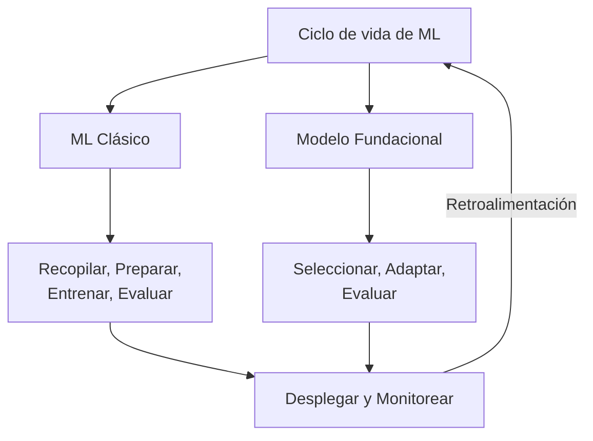
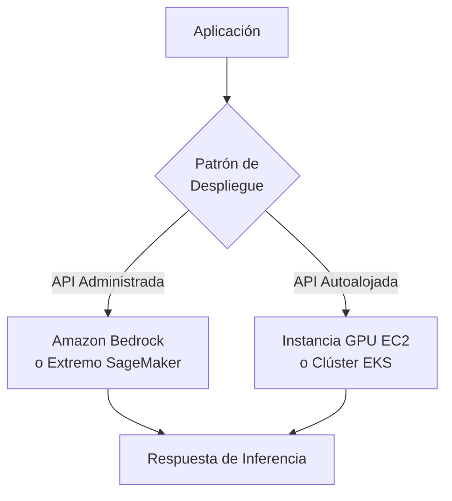
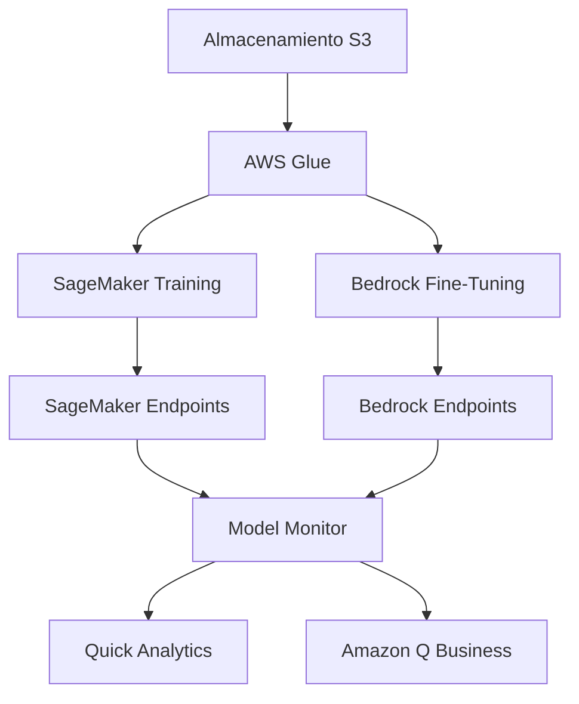
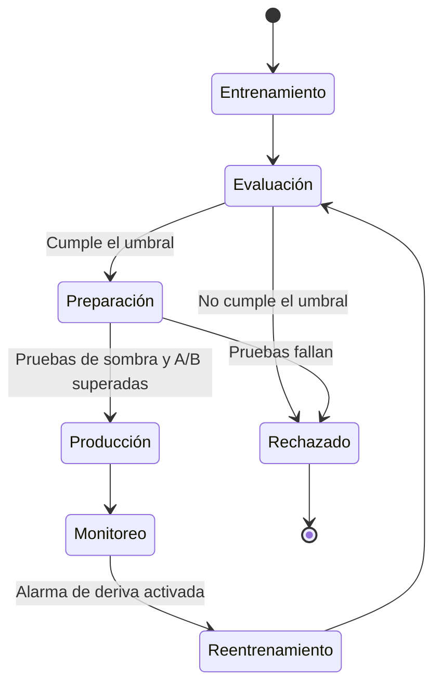
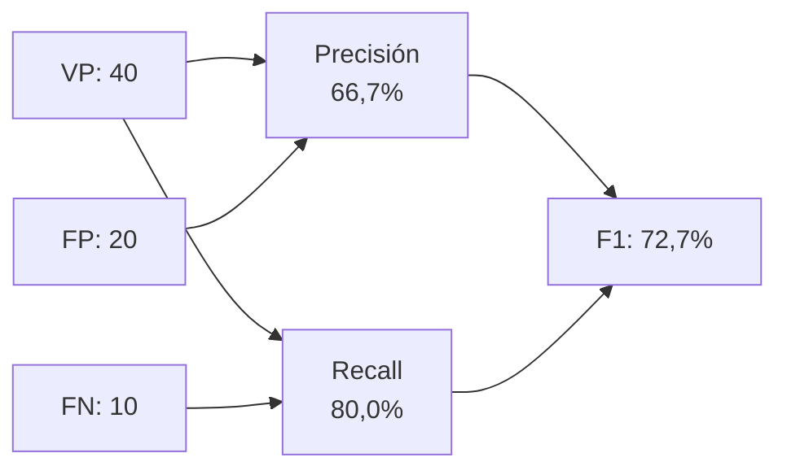

## Enunciado de tarea 1.3: Describir el ciclo de vida de desarrollo de IA/ML

El ciclo de vida de desarrollo de IA/ML es la secuencia estructurada de actividades que lleva una idea de negocio desde los datos en bruto hasta un sistema en producción que genera valor a lo largo del tiempo. El Dominio 1 estableció el vocabulario y el panorama de casos de uso; este enunciado de tarea pone esas ideas en movimiento mostrando cómo se construyen y gestionan realmente los proyectos de IA y ML. Comprender el ciclo de vida permite a los profesionales de negocios establecer expectativas realistas, hacer las preguntas correctas en cada punto de control, y reconocer dónde los servicios de AWS reducen el costo y la complejidad de cada etapa.[^103001]

### 1.3.1 Componentes de un canal de IA/ML

Un canal de procesamiento es la secuencia de pasos que ejecuta un equipo para ir desde los datos en bruto hasta un modelo funcional. La palabra proviene de la ingeniería de software y lleva el mismo significado: cada etapa recibe un artefacto del paso anterior, lo transforma y pasa el resultado hacia adelante. El concepto de canal de procesamiento importa a los profesionales de negocios porque proporciona un vocabulario común para hablar sobre el progreso, el costo y la calidad en cada punto de un proyecto de IA.[^103048]

Los canales de aprendizaje automático clásico y los canales de modelos fundacionales comparten una lógica estructural, pero difieren en sus etapas intermedias. Un canal de ML clásico comienza desde cero: un equipo recopila datos etiquetados, diseña características, selecciona un algoritmo, entrena un modelo con datos propios, lo ajusta, lo evalúa y luego lo despliega y monitorea el resultado. Un canal de modelos fundacionales omite la mayor parte del trabajo pesado de datos y entrenamiento. En cambio, el equipo selecciona un modelo preentrenado existente, decide cómo adaptarlo a su tarea (mediante ingeniería de indicaciones, ajuste fino o generación aumentada por recuperación), evalúa el modelo adaptado y lo despliega. Ambas trayectorias terminan en las mismas dos etapas: despliegue y monitoreo.

*Figura 1.3.1: Canal de IA/ML de doble trayectoria. Las trayectorias de ML clásico y de modelos fundacionales convergen en el despliegue y el monitoreo; las señales de retroalimentación se retroalimentan en cualquiera de las dos trayectorias que esté activa.*

Las etapas de la trayectoria de ML clásico son las siguientes. La **recopilación de datos** es el proceso de reunir los registros etiquetados o sin etiquetar de los que aprenderá el modelo; los problemas de calidad en esta etapa se propagan a través de cada paso posterior.[^103002] El **análisis exploratorio de datos (EDA)** es el examen de los datos recopilados para comprender su distribución, relaciones y anomalías antes de que comience cualquier modelado.[^103003] El **preprocesamiento de datos** abarca la limpieza, la imputación de valores faltantes, la eliminación de duplicados y la conversión de datos a un formato que un algoritmo pueda consumir.[^103004] La **ingeniería de características** es la creación o transformación de variables de entrada para hacer más accesibles los patrones subyacentes al modelo; por ejemplo, convertir marcas de tiempo de transacciones en bruto en una característica de "días desde la última compra" para un modelo de abandono.[^103005] El **entrenamiento del modelo** es el proceso de optimización por el cual un algoritmo encuentra los valores de parámetros que minimizan el error de predicción en el conjunto de datos de entrenamiento.[^103006] El **ajuste de hiperparámetros** ajusta los parámetros que gobiernan el comportamiento del entrenamiento en lugar de los pesos aprendidos; los ejemplos incluyen la tasa de aprendizaje y la profundidad máxima del árbol en un modelo de impulso de gradiente.[^103007]

La trayectoria de modelos fundacionales comienza con la **selección de datos**, que aquí significa elegir los documentos o ejemplos utilizados para el ajuste fino en lugar de entrenar desde cero. La **selección del modelo** es la elección de qué FM preentrenado adaptar, una decisión impulsada por capacidades, costo, latencia y restricciones de licencia (discutidas en la Sección 1.3.2). La **adaptación** abarca las tres técnicas principales para hacer que un FM general funcione bien en una tarea específica: la ingeniería de indicaciones, que elabora instrucciones sin cambiar los pesos del modelo; el ajuste fino, que actualiza un subconjunto de pesos usando ejemplos específicos del dominio; y la *generación aumentada por recuperación (RAG)*, que extiende el conocimiento del modelo al recuperar documentos relevantes en el momento de la inferencia.[^103008] El Dominio 3 trata en profundidad cada técnica de adaptación; aquí basta con saber que existen y dónde encajan en el ciclo de vida.

Ambas trayectorias entran luego en la etapa de **evaluación**, donde el modelo adaptado o entrenado se prueba con datos reservados y se puntúa con métricas de rendimiento (véase la Sección 1.3.6). Un modelo que supera la evaluación procede al **despliegue**. Un modelo que no la supera regresa a una etapa anterior, comúnmente la ingeniería de características o el ajuste de hiperparámetros en la trayectoria clásica, o una estrategia de adaptación revisada en la trayectoria de FM.

El **monitoreo** es la etapa final y la que más a menudo se subestima en la planificación. Una vez que un modelo está en producción, el mundo real no se detiene. El comportamiento de los usuarios cambia, los canales de datos evolucionan y los patrones estadísticos que aprendió el modelo pueden ya no coincidir con lo que ve. El monitoreo detecta estas desviaciones y desencadena una acción correctiva, ya sea una actualización de datos, reentrenamiento o revisión de las indicaciones.[^103009]

### 1.3.2 Fuentes de modelos fundacionales

Los modelos fundacionales requieren enormes recursos computacionales para ser entrenados desde cero. Una sola ejecución de entrenamiento de un modelo de lenguaje grande puede consumir millones de horas de GPU y costar decenas de millones de dólares.[^103010] Como resultado, la mayoría de las organizaciones no entrenan sus propios FM; los obtienen de fuentes externas y los adaptan. Las tres fuentes principales difieren en costo, control, términos de licencia y capacidad.

Los **modelos preentrenados de código abierto** son modelos cuyos pesos y, en la mayoría de los casos, el código de entrenamiento se publican públicamente. Los ejemplos más destacados disponibles en 2025 a 2026 incluyen la familia Llama de Meta (ahora en su cuarta generación), los modelos Mistral y Mixtral de Mistral AI, la serie Falcon de TII y el modelo Stable Diffusion de Stability AI para la generación de imágenes.[^103011] El atractivo de los modelos de código abierto es directo: no hay costo de API por token, los pesos se pueden descargar y ejecutar en la infraestructura propia de la organización, y el modelo puede ser ajustado finamente sin ninguna participación de un proveedor. El inconveniente es la complejidad operacional. El equipo debe aprovisionar y gestionar el cómputo, manejar las actualizaciones del modelo y asumir la responsabilidad de la seguridad y el cumplimiento. Las licencias también varían. Los modelos Llama llevan una licencia de comunidad con restricciones comerciales basadas en el uso; verifique el texto actual de la licencia Llama para conocer el umbral activo. Los modelos de Mistral llevan una licencia Apache 2.0 sin tal restricción.[^103012] Los equipos de negocio deben verificar la licencia aplicable antes de comprometerse con un FM de código abierto en un producto de producción.

Los **modelos fundacionales comerciales** son ofrecidos por empresas de IA como un servicio de API administrado. La organización consumidora paga por token procesado en lugar de gestionar la infraestructura. Los FM comerciales líderes accesibles a través de AWS incluyen Anthropic Claude (múltiples generaciones, que van desde Haiku para tareas sensibles al costo hasta Opus y Sonnet para el razonamiento complejo), Amazon Nova (la propia familia de Amazon que abarca Nova Micro, Lite, Pro y Premier), los modelos Jamba de AI21 Labs, y las familias Command y Embed de Cohere.[^103013] Los modelos comerciales no requieren gestión de infraestructura y son continuamente actualizados por el proveedor, pero la organización tiene menos visibilidad sobre los datos y pesos de entrenamiento, lo que puede plantear preguntas de cumplimiento en industrias reguladas.

Los **modelos personalizados entrenados desde cero** son la opción más rara. Entrenar un nuevo FM a gran escala desde cero es apropiado solo cuando una organización tiene un dominio tan especializado que ningún FM existente lo cubre adecuadamente (por ejemplo, una empresa de genómica cuyo vocabulario y patrones de razonamiento no tienen ningún solapamiento con ningún corpus de entrenamiento público) y tiene el presupuesto y la profundidad en ingeniería de ML para hacerlo. El costo y el cronograma son sustanciales; la mayoría de las organizaciones evalúan esta ruta y concluyen que el ajuste fino de un FM comercial o de código abierto es un mejor uso de los recursos.[^103014]

*Tabla 1.3.1: Comparación de las opciones de fuentes de FM*

| Fuente | Estructura de costo típica | Control sobre los pesos | Complejidad operacional | Modelos de ejemplo |
|--------|---------------------------|------------------------|-------------------------|--------------------|
| Preentrenado de código abierto | Solo costo de infraestructura | Acceso completo | Alta | Llama 4, Mistral, Falcon |
| API administrada comercial | Precio por token | Sin acceso | Baja | Claude, Amazon Nova, Cohere |
| Entrenado desde cero | Inversión de capital de varios millones | Propiedad completa | Muy alta | Propietario |

La selección entre estas fuentes rara vez es una decisión de todo o nada. Muchas arquitecturas de producción combinan las tres: una API comercial para consultas de propósito general, un modelo de código abierto ajustado finamente para una tarea costosa de alto volumen, y modelos de ML tradicionales para problemas de predicción estrechos donde la explicabilidad es obligatoria.[^103049]

### 1.3.3 Métodos para usar un modelo en producción

Llevar un modelo entrenado o seleccionado a producción significa poner sus predicciones a disposición de los usuarios y las aplicaciones. Los dos patrones de despliegue principales que cubre el examen son el **servicio de API administrado** y la **API autoalojada**. Elegir entre ellos requiere sopesar los requisitos de latencia, el volumen de llamadas, las necesidades de personalización y las restricciones de cumplimiento.

Un **servicio de API administrado** abstrae todas las preocupaciones de infraestructura de la aplicación consumidora. La aplicación envía una solicitud HTTP a un extremo administrado por AWS, recibe una predicción en respuesta y nunca toca la capa de cómputo directamente. **Amazon Bedrock** es la API administrada principal de AWS para modelos fundacionales, que da acceso a Claude, Amazon Nova, Cohere, AI21, Meta Llama y otros modelos a través de una única API unificada sin necesidad de gestionar servidores o GPU.[^103015] Para las organizaciones que han entrenado modelos de ML clásicos personalizados o FM ajustados finamente, los extremos de inferencia en tiempo real de **Amazon SageMaker AI** proporcionan la misma abstracción: el equipo registra un artefacto de modelo, configura un extremo y SageMaker maneja el aprovisionamiento de instancias, el balanceo de carga y el Auto Scaling.[^103016] Las ventajas de los servicios de API administrados son la rapidez para entrar en producción, el escalado integrado y la eliminación de las operaciones de infraestructura de la responsabilidad del equipo. La limitación es que el control detallado sobre la pila de servicio (por ejemplo, la tokenización personalizada o la gestión de la memoria de GPU) no está disponible.

Una **API autoalojada** ejecuta el modelo en infraestructura que controla la organización y lo expone como su propia API. Los patrones de AWS más comunes son alojar el contenedor del modelo en instancias GPU de **Amazon EC2** para máxima flexibilidad, o desplegarlo como una carga de trabajo de Kubernetes en **Amazon EKS** para la orquestación de contenedores a escala.[^103017] El autoalojamiento es apropiado cuando los requisitos de cumplimiento prohíben enviar datos a la API de un proveedor, cuando el volumen de llamadas es lo suficientemente alto como para que la capacidad reservada o de spot de EC2 sea más económica que los cargos por token, o cuando el equipo necesita modificar la pila de inferencia de formas que un servicio administrado no permite. La contrapartida es la carga operacional: el equipo gestiona el escalado de instancias, las actualizaciones del modelo, el parche de seguridad y el monitoreo.

*Figura 1.3.2: Patrones de despliegue del modelo. Una aplicación enruta las solicitudes de inferencia a una API administrada o a una API autoalojada según las prioridades de latencia, cumplimiento y costo del equipo.*

*Tabla 1.3.2: Criterios de decisión para API administrada vs. API autoalojada*

| Criterio | API Administrada | API Autoalojada |
|----------|-----------------|-----------------|
| Gestión de infraestructura | Administrada por AWS | Administrada por el equipo |
| Escalado | Automático | Manual o configuración de Auto Scaling requerida |
| Personalización de la pila de servicio | Limitada | Completa |
| Ruta de los datos | Los datos del cliente fluyen a través del plano de control del servicio administrado en la cuenta AWS del cliente; sin acceso a los pesos del modelo | Los datos permanecen en la infraestructura controlada por el equipo; acceso completo a los pesos |
| Modelo de costo | Por token o por solicitud | Cómputo reservado o de spot |
| Tiempo hasta el primer despliegue | Horas | Días a semanas |

Más allá de estos dos patrones, las organizaciones a veces usan la **inferencia por lotes** para tareas de alto volumen que no son sensibles al tiempo. Amazon SageMaker Batch Transform lee un conjunto de datos de Amazon S3, pasa cada registro a través del modelo y escribe los resultados de vuelta a S3, lo que lo hace adecuado para tareas como la puntuación mensual de riesgo en toda una cartera de clientes.[^103018] La inferencia por lotes no es un extremo en el sentido tradicional; se ejecuta como un trabajo bajo demanda y incurre en costos solo mientras procesa.

### 1.3.4 Servicios de AWS para cada etapa del canal

La guía del examen AIF-C01 v1.1 nombra específicamente cinco familias de servicios que abarcan el canal de IA/ML: **Amazon Bedrock**, **Amazon Q**, **Amazon Quick**, **Kiro** y **Amazon SageMaker AI**. Comprender qué hace cada uno y dónde encaja evita confundirlos en el examen.

**Amazon Bedrock** se sitúa en las etapas de adaptación y despliegue de FM del canal. Proporciona acceso a un catálogo curado de modelos fundacionales a través de una API administrada, junto con herramientas para ajustar finamente esos modelos con datos privados y para construir canales de RAG usando bases de conocimiento respaldadas por almacenes vectoriales.[^103019] Para los equipos de negocio, Bedrock es el punto de entrada para construir aplicaciones potenciadas por IA generativa sin gestionar ninguna infraestructura de ML.

**Amazon SageMaker AI** cubre el canal de ML clásico completo desde la preparación de datos hasta el entrenamiento, la evaluación y el despliegue. SageMaker Studio es el entorno de desarrollo integrado; SageMaker Pipelines proporciona CI/CD nativo de ML para automatizar el canal de extremo a extremo; SageMaker Feature Store gestiona las definiciones y los valores de las características; y SageMaker Model Monitor realiza el seguimiento del estado del modelo desplegado.[^103020] SageMaker también aloja modelos ajustados finamente y personalizados como extremos, por lo que participa en la trayectoria de FM cuando una organización ajusta finamente un modelo de código abierto en lugar de usar una API comercial.

**Amazon Q** es una familia de asistentes potenciados por IA orientados a audiencias profesionales específicas. **Amazon Q Business** es un asistente conversacional para empleados empresariales; se conecta a fuentes de datos de la empresa (SharePoint, Confluence, cubos S3, sistemas de ticketing) y responde preguntas fundamentadas en contenido organizacional.[^103021] **Amazon Q Developer** es un asistente de codificación integrado en IDEs que sugiere código, explica la lógica e identifica vulnerabilidades de seguridad. A partir de 2025 a 2026, Amazon Q Developer está siendo reemplazado en el IDE para flujos de trabajo completos de desarrollo de software por **Kiro**. Los equipos que realizan nuevos proyectos de desarrollo de IA basados en IDE deben evaluar Kiro en lugar de Q Developer, aunque Q Developer sigue disponible y aún se cita en la guía del examen.

**Kiro** es el entorno de desarrollo integrado potenciado por IA de Amazon, anunciado en 2025.[^103022] Mientras que Q Developer es principalmente una superposición de finalización de código y chat dentro de IDEs existentes como VS Code o JetBrains, Kiro es un IDE completo construido en torno a flujos de trabajo de IA agéntica. Kiro puede recibir una especificación, generar planes de implementación, escribir código en múltiples archivos, ejecutar pruebas e iterar hasta que se satisfaga el plan. Para el examen, la distinción clave es que Kiro apunta al ciclo de vida de desarrollo de software asistido por IA, no a las preguntas y respuestas de usuarios finales ni al análisis de datos.

**Amazon Quick** es el nombre de la guía del examen v1.1 para la familia de análisis empresarial y asistente de IA para usuarios de negocio de AWS.[^103023] Las capacidades entregadas históricamente a través de Amazon QuickSight (paneles de BI) y Amazon Q Business (respuestas conversacionales sobre contenido empresarial) están convergiendo bajo este nombre, con el objetivo de permitir que un analista de negocios construya paneles, haga preguntas en lenguaje natural sobre los datos y reciba resúmenes narrativos generados por IA sin cambiar de herramienta. Para el examen, reconozca Amazon Quick como la respuesta a "BI de autoservicio aumentado por IA generativa para usuarios de negocio"; verifique la página de producto actual antes de tomar decisiones de adquisición, ya que la marca y la estructura de niveles aún se están consolidando en 2025 a 2026.

Para recordar fácilmente en el examen, la tabla a continuación resume qué familia de asistente se dirige a qué audiencia y cómo se mapea cada una al estado en v1.1.

*Tabla 1.3.3: Amazon Q, Kiro y Amazon Quick de un vistazo*

| Servicio | Qué hace | Audiencia | Estado para AIF-C01 v1.1 |
|---------|---------|----------|--------------------------|
| Amazon Q Business | Preguntas y respuestas empresariales basadas en el contenido de la empresa | Trabajadores del conocimiento | En alcance; convergiendo en Amazon Quick |
| Amazon Q Developer | Superposición de finalización de código y chat dentro de IDEs existentes | Desarrolladores que usan VS Code, JetBrains | En alcance; reemplazado para flujos de trabajo completos de IDE por Kiro |
| Kiro | IDE completo construido en torno a flujos de trabajo de IA agéntica | Desarrolladores que construyen características asistidas por IA | En alcance (nuevo en v1.1); la respuesta para "IDE potenciado por IA" |
| Amazon Quick | BI de autoservicio más asistente de IA generativa | Analistas de negocios y operaciones | En alcance (nuevo en v1.1); la respuesta para "BI + GenAI para usuarios de negocio" |

*Tabla 1.3.4: Servicios de IA/ML de AWS por etapa del canal*

| Etapa del canal | Servicio de AWS | Rol |
|-----------------|----------------|-----|
| Almacenamiento y preparación de datos | Amazon S3, AWS Glue | Almacenamiento de conjuntos de datos; ETL y catalogación |
| Ingeniería de características | SageMaker Feature Store | Registro centralizado de características |
| Entrenamiento de modelos clásicos | SageMaker AI Training | Trabajos de entrenamiento distribuido administrados |
| Ajuste de hiperparámetros | SageMaker Automatic Model Tuning | Búsqueda bayesiana y aleatoria en el espacio de parámetros |
| Adaptación de FM (indicaciones/RAG) | Amazon Bedrock Knowledge Bases | Canales de RAG respaldados por almacenes vectoriales |
| Adaptación de FM (ajuste fino) | Amazon Bedrock Fine-Tuning, SageMaker AI | Ajuste fino supervisado con datos privados |
| Evaluación | SageMaker Model Monitor, Bedrock Model Evaluation | Puntuación de rendimiento y calidad |
| Despliegue (FM) | Amazon Bedrock Endpoints | API de inferencia de FM administrada |
| Despliegue (ML personalizado) | SageMaker AI Endpoints, Batch Transform | Inferencia de modelos personalizados en tiempo real y por lotes |
| Monitoreo | SageMaker Model Monitor | Detección de deriva de datos y calidad del modelo |
| Análisis empresarial | Amazon Quick | Paneles de BI y preguntas y respuestas en lenguaje natural sobre datos |
| Preguntas y respuestas empresariales | Amazon Q Business | Respuestas conversacionales sobre el contenido de la empresa |
| Productividad del desarrollador | Kiro, Amazon Q Developer | Desarrollo de software asistido por IA |

*Figura 1.3.3: Mapa de servicios de AWS a lo largo del canal de IA/ML. El almacenamiento y ETL alimentan tanto el entrenamiento clásico como el ajuste fino de FM; las salidas convergen en el monitoreo y luego fluyen hacia las herramientas del usuario final.*

### 1.3.5 Conceptos fundamentales de MLOps

**MLOps** (Operaciones de Aprendizaje Automático) es la disciplina de aplicar el rigor de la ingeniería de software al ciclo de vida de ML para hacer que la entrega de modelos sea repetible, escalable y mantenible a lo largo del tiempo.[^103024] El término está modelado en DevOps: así como DevOps trajo automatización, control de versiones e integración continua al desarrollo de aplicaciones, MLOps trae esas mismas prácticas al trabajo de construir y operar modelos de ML. El examen cubre siete conceptos centrales de MLOps.

La **experimentación** es la práctica de registrar cada ejecución de un intento de construcción de modelos para que los resultados puedan reproducirse y compararse. Sin un seguimiento sistemático, un equipo que logra una buena puntuación de validación no puede reproducirla de manera confiable después de modificar el código. **Amazon SageMaker Experiments** registra los hiperparámetros, las métricas y las versiones de artefactos asociadas con cada ejecución de entrenamiento.[^103025] El resultado es un historial de búsqueda que responde a la pregunta: "¿Qué ejecución produjo ese resultado, y cuál era su configuración?"

Los **procesos repetibles** reemplazan los scripts ad hoc con canales versionados y parametrizados que producen salidas coherentes a partir de entradas coherentes. **Amazon SageMaker Pipelines** es el servicio nativo de orquestación de MLOps; define los pasos del canal en código, almacena la salida de cada paso como un artefacto versionado e integra el registro del modelo de SageMaker para controlar los despliegues en función de los umbrales de evaluación.[^103026] Cuando un canal está definido de esta manera, volver a ejecutarlo con nuevos datos produce una nueva versión del modelo con un linaje auditable hasta los datos de entrada.

Los **sistemas escalables** garantizan que la infraestructura que respalda el entrenamiento, la evaluación y la inferencia pueda crecer con la demanda sin reconfiguración manual. SageMaker maneja el entrenamiento distribuido en clústeres de GPU y escala los extremos de inferencia hacia arriba y hacia abajo según el volumen de solicitudes mediante políticas de Auto Scaling respaldadas por métricas de **Amazon CloudWatch**.[^103027]

La **gestión de la deuda técnica** en ML significa prevenir la acumulación de suposiciones ocultas en los canales, transformaciones de características no documentadas y versiones de modelos que nadie puede rastrear hasta sus datos de entrenamiento. Las prácticas concretas incluyen mantener las definiciones de características en SageMaker Feature Store (para que la misma transformación se use coherentemente en el entrenamiento y en la inferencia), almacenar los artefactos del modelo en el registro de modelos de SageMaker con metadatos, y revisar los canales en busca de componentes que ya no se usan.[^103028]

**Lograr la preparación para producción** significa que un modelo ha superado un nivel de calidad definido antes de llegar a los clientes. Esto implica pruebas de sombra (ejecutar el nuevo modelo en paralelo con el modelo en vivo y comparar las salidas), pruebas A/B (enrutar un porcentaje de tráfico a la nueva versión) y pruebas de carga (verificar que el extremo maneja el tráfico de pico sin latencia degradada). Solo después de estas compuertas una nueva versión reemplaza al modelo de producción.[^103029]

El **monitoreo del modelo** es la evaluación continua del comportamiento de un modelo desplegado frente a las líneas de base establecidas en el momento del despliegue. Dos tipos de deriva son particularmente importantes. La *deriva de datos* (también llamada *cambio de covariables*) ocurre cuando la distribución estadística de las características de entrada cambia con el tiempo; por ejemplo, un modelo de fraude entrenado con patrones de transacciones de 2023 puede ver distribuciones de características diferentes a medida que evolucionan los hábitos de gasto.[^103030] La *deriva de concepto* ocurre cuando la relación entre las entradas y la salida correcta cambia; por ejemplo, la definición del modelo de abandono de comportamiento en riesgo puede cambiar a medida que el propio producto cambia. **Amazon SageMaker Model Monitor** compara continuamente los datos de inferencia en vivo con un conjunto de datos de referencia y genera alarmas cuando la deriva supera un umbral.[^103031]

El **reentrenamiento del modelo** es la respuesta a las señales de monitoreo. Una estrategia de reentrenamiento debe especificar el disparador (programado, por umbral de métrica, o aprobado por humanos), la ventana de datos utilizada (todos los datos históricos, una ventana continua reciente, o un rango de fechas específico) y la compuerta de despliegue (umbrales de aprobación/rechazo que el modelo reentrenado debe superar antes de reemplazar a la versión anterior). SageMaker Pipelines admite la ejecución activada por disparadores, de modo que una alarma de CloudWatch activada por Model Monitor puede iniciar automáticamente una ejecución de reentrenamiento.[^103032]

*Figura 1.3.4: Estados del ciclo de vida del modelo de MLOps. Un modelo avanza desde el entrenamiento a través de compuertas de evaluación y preparación antes de llegar a producción, luego vuelve a entrar en el ciclo cuando el monitoreo detecta deriva.*

### 1.3.6 Métricas de rendimiento y de negocio

Evaluar un modelo de IA/ML requiere dos perspectivas paralelas. Las métricas de rendimiento técnico dicen al equipo si el modelo está haciendo predicciones exactas. Las métricas de negocio dicen a la organización si esas predicciones exactas están generando el valor previsto. Un modelo puede puntuar bien en las métricas técnicas y aún así no producir un retorno de negocio si resuelve el problema equivocado o es demasiado costoso de operar a escala.

#### Métricas de rendimiento técnico

La guía del examen AIF-C01 v1.1 reemplazó *AUC* de la lista v1.0 con *precisión* y *recall*. Las cuatro métricas nombradas explícitamente son exactitud, precisión, recall y puntuación F1, todas las cuales aplican a problemas de clasificación.[^103033]

La **exactitud** es la proporción de todas las predicciones que el modelo acertó. Para un modelo que clasifica correos electrónicos de clientes como queja o no queja, la exactitud es (número de correos electrónicos clasificados correctamente) / (total de correos electrónicos). La exactitud es simple pero engañosa cuando las clases están desequilibradas. Si el 95 por ciento de los correos electrónicos no son quejas, un modelo que siempre predice no queja tiene el 95 por ciento de exactitud pero cero utilidad.[^103034]

Una **matriz de confusión** es el fundamento para comprender todas las demás métricas de clasificación. Es una tabla de dos por dos (para clasificación binaria) que cuenta los resultados en cuatro celdas.

*Tabla 1.3.5: Estructura de la matriz de confusión*

| | Predicho Positivo | Predicho Negativo |
|---|---|---|
| Real Positivo | Verdadero Positivo (VP) | Falso Negativo (FN) |
| Real Negativo | Falso Positivo (FP) | Verdadero Negativo (VN) |

La **precisión** es la fracción de predicciones positivas que fueron correctas: VP / (VP + FP). Un modelo de detección de fraudes con alta precisión genera pocos falsos positivos; la mayoría de las transacciones marcadas son genuinamente fraudulentas. Cuando los falsos positivos son costosos (por ejemplo, bloquear la transacción de un cliente legítimo), maximizar la precisión es la prioridad.[^103035]

El **recall** (también llamado *sensibilidad*) es la fracción de positivos reales que el modelo identificó con éxito: VP / (VP + FN). Un modelo de detección médica con alto recall captura la mayoría de los casos reales de la afección. Cuando los falsos negativos son costosos (por ejemplo, no detectar un diagnóstico de cáncer), maximizar el recall es la prioridad.[^103036]

La precisión y el recall tienen una relación de intercambio entre sí. Bajar el umbral de clasificación aumenta el recall pero baja la precisión; subirlo aumenta la precisión pero baja el recall. La **puntuación F1** es la media armónica de la precisión y el recall: 2 x (Precisión x Recall) / (Precisión + Recall). Dado que usa la media armónica en lugar de la media aritmética, es sensible a los valores bajos en cualquiera de las métricas, lo que la convierte en un resumen confiable de un solo número cuando tanto los falsos positivos como los falsos negativos son importantes.[^103037]

Un ejemplo hace concretas las compensaciones. Se evalúa un modelo de detección de fraudes en un conjunto de prueba de 1.000 transacciones, de las cuales 50 son fraudulentas. El modelo marca 60 transacciones como fraude; 40 de esas marcas son correctas y se pierden 10 fraudes reales.

- Exactitud: (40 + 940) / 1.000 = 98,0%
- Precisión: 40 / 60 = 66,7%
- Recall: 40 / 50 = 80,0%
- Puntuación F1: 2 x (0,667 x 0,800) / (0,667 + 0,800) = 72,7%

La cifra de exactitud del 98 por ciento parece sólida, pero la puntuación F1 del 72,7 por ciento da una imagen más honesta del rendimiento del modelo en la clase que importa.

*Figura 1.3.5: Cálculo de precisión, recall y F1 para el ejemplo de detección de fraudes. El diagrama muestra cómo los verdaderos positivos, los falsos positivos y los falsos negativos se combinan en la puntuación F1 resumen.*

#### Métricas de negocio

Las métricas técnicas responden si el modelo funciona. Las métricas de negocio responden si vale la pena operar el modelo. Las cuatro métricas de negocio en la guía del examen son el costo por usuario, los costos de desarrollo, la retroalimentación del cliente y el retorno de la inversión.[^103038]

El **costo por usuario** es el costo total de inferencia (cómputo, cargos de API y gastos generales operacionales) dividido por el número de usuarios atendidos en un período. Esta métrica hace visibles la economía continua de un modelo. Un modelo que cuesta $0,001 por usuario por mes a 10.000 usuarios puede volverse prohibitivo a 10 millones de usuarios si el costo no escala hacia abajo con el volumen. El seguimiento del costo por usuario a lo largo del tiempo también revela cuándo está degradándose la eficiencia de un modelo, a menudo una señal de que las cargas útiles de entrada están creciendo o de que el modelo se está llamando más de lo necesario.[^103039]

Los **costos de desarrollo** son las inversiones únicas (o por iteración) en personas, datos, cómputo y herramientas necesarias para construir y desplegar un modelo. Para un FM ajustado finamente en Bedrock, los costos de desarrollo incluyen el esfuerzo de etiquetado de datos y el cómputo del trabajo de ajuste fino. Para un modelo entrenado personalizado, incluyen meses de tiempo de ingeniería de ML y horas de clúster de GPU. Rastrear los costos de desarrollo contra el valor de negocio entregado responde a la pregunta de construir vs. comprar para futuros proyectos.[^103040]

La **retroalimentación del cliente** cubre las señales cualitativas y cuantitativas sobre la satisfacción del usuario con la característica potenciada por IA. Los instrumentos comunes incluyen encuestas de Net Promoter Score, calificaciones de pulgar arriba o pulgar abajo en el producto sobre las respuestas de IA, y el volumen de tickets de soporte al cliente etiquetados para la característica de IA. La retroalimentación del cliente a menudo detecta problemas que las métricas técnicas pasan por alto: un modelo puede tener alta precisión y recall pero generar salidas que los usuarios perciben como poco útiles o que no reflejan la marca de la empresa.[^103041]

El **retorno de la inversión (ROI)** es la razón del beneficio financiero neto al costo total durante un período definido. Un modelo de detección de fraudes que previene $2 millones en pérdidas anuales frente a un costo anual total (desarrollo amortizado más inferencia) de $400.000 tiene un ROI del 400 por ciento. El ROI es la métrica que justifica la inversión en IA ante el liderazgo financiero y determina si un proyecto recibe financiamiento continuo después de su despliegue inicial.[^103042]

*Tabla 1.3.6: Alineación de métricas técnicas y de negocio por caso de uso*

| Caso de uso | Métrica técnica | Métrica de negocio |
|-------------|-----------------|---------------------|
| Detección de fraudes | Puntuación F1 en la clase de fraude | Pérdidas por fraude prevenidas / costo de manejo de falsos positivos |
| Predicción de abandono de clientes | Recall en clientes que abandonan | Ingresos retenidos de los clientes en riesgo |
| Clasificación de documentos | Precisión en cada categoría | Horas de personal ahorradas por semana |
| Recomendación de productos | Exactitud de la recomendación clicada | Aumento del valor promedio del pedido |
| Detección médica | Recall en casos positivos | Costo por caso detectado vs. costo de tratamiento en etapa tardía |

La gestión efectiva de programas de IA requiere hacer seguimiento a ambas columnas. Un modelo con una puntuación F1 sólida pero ROI negativo debe rediseñarse o reemplazarse. Un modelo con ROI sólido pero recall en descenso necesita reentrenamiento antes de que se erosionen los resultados de negocio.[^103050]

---

**Lo que construyó esta sección:** El Enunciado de Tarea 1.3 cubrió la estructura del ciclo de vida de IA/ML: el canal de doble trayectoria, el aprovisionamiento de FM, los patrones de despliegue en producción y los servicios de AWS que se mapean a cada etapa. También introdujo las prácticas de MLOps que mantienen saludables los modelos en producción y las métricas técnicas y de negocio que determinan si un modelo está funcionando. El Enunciado de Tarea 2.1 profundizará en varios de estos conceptos, centrándose específicamente en cómo funciona la IA generativa y el vocabulario único que introduce.

---

## Preguntas de autoevaluación

1. Un equipo de ciencia de datos ha construido un modelo de predicción de abandono de clientes y lo desplegó hace seis meses. Un analista de negocios observa que el recall del modelo ha caído del 82 por ciento al 54 por ciento aunque el volumen y el formato de los datos de entrada no han cambiado. El equipo sospecha que los patrones de comportamiento de los clientes han cambiado desde que se entrenó el modelo. ¿Cuál concepto de MLOps describe MEJOR la causa raíz de esta caída en el recall?

   A. Deriva de hiperparámetros
   B. Deriva de concepto
   C. Deuda técnica del canal
   D. Invalidación del almacén de características

   La deriva de concepto ocurre cuando la relación entre las características de entrada y la salida correcta cambia con el tiempo, incluso cuando la distribución de los datos de entrada parece estable. En este escenario, el equipo atribuye específicamente el cambio a la evolución del comportamiento del cliente que modifica la relación de entrada a resultado, lo que es deriva de concepto, no un cambio en la distribución de las características. El recall cae porque las señales que anteriormente indicaban abandono ya no tienen la misma relación predictiva con los eventos reales de abandono; el modelo está pasando por alto a clientes genuinamente en riesgo cuyo comportamiento actual difiere de los patrones de la época de entrenamiento. La deriva de datos (cambio de covariables) significaría que la *distribución* de las características de entrada en sí misma ha cambiado, pero el enunciado descarta eso. La deriva de hiperparámetros no es un término reconocido en el vocabulario de MLOps. La invalidación del almacén de características produciría errores o valores faltantes en lugar de un declive gradual en el recall. La respuesta correcta es deriva de concepto, que indica que el modelo necesita reentrenamiento con datos etiquetados más recientes.[^103043]

2. Una empresa minorista está evaluando opciones de modelos fundacionales para un servicio de generación de descripciones de productos de alto volumen que procesará aproximadamente 50 millones de solicitudes por mes. El equipo requiere control total sobre los pesos del modelo por razones de cumplimiento y quiere minimizar los costos continuos por unidad. ¿Qué enfoque de fuente de FM es MÁS apropiado?

   A. API administrada comercial con un modelo de gran número de parámetros como Claude Opus
   B. Modelo preentrenado de código abierto alojado en instancias GPU de EC2 autoAdministradas
   C. Amazon Bedrock con precios bajo demanda
   D. Modelo entrenado desde cero con datos de productos propietarios

   El escenario especifica dos restricciones que juntas reducen la elección: el cumplimiento requiere control a nivel de pesos, y el alto volumen requiere una economía mejor que los precios de API por token. Los modelos preentrenados de código abierto (opción B) abordan ambas restricciones. Proporcionan acceso completo a los pesos (satisfaciendo el cumplimiento) y, una vez desplegados en instancias EC2 reservadas o de spot, reducen el costo marginal significativamente en 50 millones de solicitudes mensuales en comparación con las tasas comerciales por token. Las API administradas comerciales (opciones A y C) no proporcionan control a nivel de pesos, que el escenario exige explícitamente; también conllevan costos por token que se acumulan con el alto volumen. (Tenga en cuenta que Amazon Bedrock mantiene las indicaciones del cliente dentro del límite de la cuenta AWS del cliente; "los datos salen de la organización" no es el factor de descalificación aquí, la falta de control a nivel de pesos lo es.) Construir desde cero (opción D) es mucho más costoso que adaptar un modelo de código abierto existente y solo está justificado cuando ningún modelo existente cubre el dominio adecuadamente. La opción MÁS apropiada es la B.[^103044]

3. Un analista de negocios está revisando un modelo de detección de fraudes y ve los siguientes resultados de la matriz de confusión: VP=80, FP=40, FN=20, VN=860. El analista necesita reportar la métrica que MEJOR refleja la capacidad del modelo para evitar marcar incorrectamente las transacciones legítimas como fraudulentas. ¿Qué métrica debe reportarse?

   A. Exactitud
   B. Recall
   C. Puntuación F1
   D. Precisión

   La pregunta pide la métrica que refleja con qué frecuencia las predicciones positivas (marcas de fraude) son realmente correctas, que es la definición de precisión. Precisión = VP / (VP + FP) = 80 / (80 + 40) = 66,7 por ciento. Un falso positivo en este contexto es una transacción legítima que fue marcada incorrectamente como fraude; un banco o minorista paga un costo real cuando los clientes genuinos son rechazados. La precisión mide directamente la tasa de falsos positivos desde la perspectiva del modelo. El recall (VP / (VP + FN) = 80 / 100 = 80%) mide la capacidad del modelo para capturar transacciones realmente fraudulentas, no para evitar marcar las legítimas. La exactitud incluye las cuatro celdas y está dominada por el gran número de verdaderos negativos, lo que la hace menos informativa aquí. La F1 es una métrica combinada; no aísla el comportamiento de la precisión. La MEJOR métrica para reportar es la precisión.[^103045]

4. Una organización quiere construir un asistente conversacional que responda preguntas de empleados basándose en documentos internos de la empresa almacenados en SharePoint, Confluence y Amazon S3. No quieren gestionar ninguna infraestructura de modelo. ¿Qué servicio de AWS está MÁS directamente diseñado para este caso de uso?

   A. Amazon SageMaker AI con un modelo entrenado personalizado
   B. Kiro
   C. Amazon Q Business
   D. Amazon Bedrock con ingeniería de indicaciones manual

   Amazon Q Business es el servicio de AWS específicamente diseñado para asistentes conversacionales empresariales que responden preguntas basándose en los documentos y fuentes de datos propias de una organización. Incluye conectores integrados para SharePoint, Confluence, S3 y docenas de otros sistemas empresariales, maneja automáticamente la fragmentación, la indexación y la recuperación, y expone el asistente a través de una interfaz web administrada y una API sin requerir gestión de infraestructura. Kiro es un IDE potenciado por IA para tareas de desarrollo de software, no un servicio de preguntas y respuestas empresariales. SageMaker AI con un modelo entrenado personalizado requeriría que la organización construya los componentes de recuperación, fundamentación y generación de respuestas desde cero, lo que no es una ruta de "sin gestión de infraestructura". Amazon Bedrock con ingeniería de indicaciones manual requeriría que el equipo construya toda la lógica de conectores y recuperación, lo que es sustancialmente más trabajo que usar Q Business directamente. El servicio MÁS directamente diseñado es Amazon Q Business.[^103046]

5. Un equipo de proyecto está presentando los resultados de un modelo de recomendación de productos recién desplegado al director financiero. El modelo logró una exactitud del 91 por ciento y una puntuación F1 del 84 por ciento en el conjunto de prueba. El director financiero pregunta qué ha hecho realmente el modelo por el negocio en el primer trimestre de operación. ¿Qué métrica responde MEJOR la pregunta del director financiero?

   A. Puntuación F1 del 84 por ciento
   B. Exactitud del 91 por ciento
   C. Retorno de la inversión expresado como impacto en los ingresos frente al costo operacional
   D. Recall en la clase positiva

   La pregunta del director financiero es explícitamente sobre los resultados de negocio, no sobre la calidad del modelo. Las métricas técnicas como la exactitud, la puntuación F1 y el recall describen cómo funciona el modelo en datos de prueba etiquetados; no se traducen directamente en términos financieros que un director financiero usa para evaluar si valió la pena financiar un proyecto. El retorno de la inversión (ROI), expresado como el beneficio neto en ingresos o en costos generado por el modelo en relación con el costo de construirlo y operarlo, es la métrica de negocio que responde directamente si la inversión estuvo justificada. Para un sistema de recomendaciones, el ROI podría calcularse como los ingresos incrementales atribuibles a las compras impulsadas por recomendaciones menos el costo total del modelo durante el trimestre. Este enfoque es directamente accionable para un director financiero que decide si continuar financiando el proyecto o expandirlo. La MEJOR métrica es el ROI.[^103047]

---

[^103001]: AWS Certified AI Practitioner Exam Guide v1.1, Task Statement 1.3. URL: <https://docs.aws.amazon.com/aws-certification/latest/ai-practitioner-01/ai-practitioner-01-domain1.html>
[^103002]: Amazon SageMaker Data Wrangler: Preparing ML data. URL: <https://docs.aws.amazon.com/sagemaker/latest/dg/data-wrangler.html>
[^103003]: Exploratory Data Analysis with Amazon SageMaker Studio. URL: <https://docs.aws.amazon.com/sagemaker/latest/dg/studio.html>
[^103004]: Data preprocessing concepts in ML. URL: <https://docs.aws.amazon.com/wellarchitected/latest/machine-learning-lens/data-preprocessing.html>
[^103005]: Amazon SageMaker Feature Store overview. URL: <https://docs.aws.amazon.com/sagemaker/latest/dg/feature-store.html>
[^103006]: Amazon SageMaker Training: training jobs overview. URL: <https://docs.aws.amazon.com/sagemaker/latest/dg/train-model.html>
[^103007]: Amazon SageMaker Automatic Model Tuning. URL: <https://docs.aws.amazon.com/sagemaker/latest/dg/automatic-model-tuning.html>
[^103008]: Amazon Bedrock retrieval-augmented generation overview. URL: <https://docs.aws.amazon.com/bedrock/latest/userguide/knowledge-base.html>
[^103009]: Amazon SageMaker Model Monitor: continuous monitoring of deployed models. URL: <https://docs.aws.amazon.com/sagemaker/latest/dg/model-monitor.html>
[^103010]: AWS Blog: Training large language models at scale. URL: <https://aws.amazon.com/blogs/machine-learning/training-large-language-models-on-amazon-sagemaker/>
[^103011]: Meta Llama model family overview. URL: <https://llama.meta.com/>
[^103012]: Mistral AI open-source model licensing. URL: <https://mistral.ai/news/announcing-mistral-7b/>
[^103013]: Amazon Bedrock supported foundation models. URL: <https://docs.aws.amazon.com/bedrock/latest/userguide/models-supported.html>
[^103014]: AWS ML Blog: When to train a custom model vs. use a pre-trained FM. URL: <https://aws.amazon.com/blogs/machine-learning/>
[^103015]: Amazon Bedrock: Fully managed FM service overview. URL: <https://docs.aws.amazon.com/bedrock/latest/userguide/what-is-bedrock.html>
[^103016]: Amazon SageMaker real-time inference endpoints. URL: <https://docs.aws.amazon.com/sagemaker/latest/dg/realtime-endpoints.html>
[^103017]: Running ML inference on Amazon EC2 GPU instances. URL: <https://docs.aws.amazon.com/AWSEC2/latest/UserGuide/accelerated-computing-instances.html>
[^103018]: Amazon SageMaker Batch Transform. URL: <https://docs.aws.amazon.com/sagemaker/latest/dg/batch-transform.html>
[^103019]: Amazon Bedrock Knowledge Bases for RAG. URL: <https://docs.aws.amazon.com/bedrock/latest/userguide/knowledge-base.html>
[^103020]: Amazon SageMaker AI overview: features and capabilities. URL: <https://docs.aws.amazon.com/sagemaker/latest/dg/whatis.html>
[^103021]: Amazon Q Business overview. URL: <https://docs.aws.amazon.com/amazonq/latest/qbusiness-ug/what-is.html>
[^103022]: Kiro: AI-powered IDE from AWS. URL: <https://kiro.dev/>
[^103023]: AIF-C01 v1.1 in-scope service list (Amazon Quick), AWS QuickSight product page, and Amazon Q Business product page. URLs: <https://docs.aws.amazon.com/aws-certification/latest/ai-practitioner-01/aif-01-in-scope-services.html>, <https://aws.amazon.com/quicksight/>, and <https://aws.amazon.com/q/business/>
[^103024]: AWS What is MLOps? URL: <https://aws.amazon.com/what-is/mlops/>
[^103025]: Amazon SageMaker Experiments documentation. URL: <https://docs.aws.amazon.com/sagemaker/latest/dg/experiments.html>
[^103026]: Amazon SageMaker Pipelines: ML CI/CD. URL: <https://docs.aws.amazon.com/sagemaker/latest/dg/pipelines.html>
[^103027]: Amazon SageMaker auto-scaling for inference endpoints. URL: <https://docs.aws.amazon.com/sagemaker/latest/dg/endpoint-auto-scaling.html>
[^103028]: Amazon SageMaker Feature Store: consistent feature transforms. URL: <https://docs.aws.amazon.com/sagemaker/latest/dg/feature-store-use-with-studio.html>
[^103029]: Amazon SageMaker shadow testing for deployments. URL: <https://docs.aws.amazon.com/sagemaker/latest/dg/shadow-tests.html>
[^103030]: Data drift detection with Amazon SageMaker Model Monitor. URL: <https://docs.aws.amazon.com/sagemaker/latest/dg/model-monitor-data-quality.html>
[^103031]: Amazon SageMaker Model Monitor: how it works. URL: <https://docs.aws.amazon.com/sagemaker/latest/dg/model-monitor-how-it-works.html>
[^103032]: Triggering SageMaker Pipelines with CloudWatch alarms. URL: <https://docs.aws.amazon.com/sagemaker/latest/dg/pipeline-eventbridge.html>
[^103033]: AWS Certified AI Practitioner Exam Guide v1.1, Objective 1.3.6. URL: <https://docs.aws.amazon.com/aws-certification/latest/ai-practitioner-01/ai-practitioner-01-domain1.html>
[^103034]: ML classification accuracy limitations. URL: <https://docs.aws.amazon.com/machine-learning/latest/dg/binary-classification.html>
[^103035]: Precision metric in binary classification. URL: <https://docs.aws.amazon.com/machine-learning/latest/dg/binary-classification.html>
[^103036]: Recall (sensitivity) in classification models. URL: <https://docs.aws.amazon.com/machine-learning/latest/dg/binary-classification.html>
[^103037]: F1 score definition and calculation. URL: <https://docs.aws.amazon.com/machine-learning/latest/dg/multiclass-model-insights.html>
[^103038]: AWS Certified AI Practitioner Exam Guide v1.1, business metrics in objective 1.3.6. URL: <https://docs.aws.amazon.com/aws-certification/latest/ai-practitioner-01/ai-practitioner-01-domain1.html>
[^103039]: Amazon Bedrock pricing model and cost management. URL: <https://aws.amazon.com/bedrock/pricing/>
[^103040]: AWS ML cost optimization guidance. URL: <https://aws.amazon.com/blogs/machine-learning/optimizing-costs-for-machine-learning-on-aws/>
[^103041]: Amazon Bedrock human-loop feedback integration. URL: <https://docs.aws.amazon.com/bedrock/latest/userguide/human-loop.html>
[^103042]: Measuring business value of ML with AWS. URL: <https://aws.amazon.com/blogs/machine-learning/measuring-the-business-impact-of-amazon-sagemaker/>
[^103043]: Concept drift and data drift in Amazon SageMaker Model Monitor. URL: <https://docs.aws.amazon.com/sagemaker/latest/dg/model-monitor-model-quality.html>
[^103044]: Deploying open-source models on Amazon EC2 GPU instances. URL: <https://docs.aws.amazon.com/AWSEC2/latest/UserGuide/accelerated-computing-instances.html>
[^103045]: Binary classification metrics: precision and recall. URL: <https://docs.aws.amazon.com/machine-learning/latest/dg/binary-classification.html>
[^103046]: Amazon Q Business: connecting enterprise data sources. URL: <https://docs.aws.amazon.com/amazonq/latest/qbusiness-ug/connectors-list.html>
[^103047]: Business metrics for evaluating ML models. URL: <https://aws.amazon.com/blogs/machine-learning/mlops-foundation-roadmap-for-enterprises-with-amazon-sagemaker/>
[^103048]: AWS Well-Architected Machine Learning Lens: ML lifecycle overview. URL: <https://docs.aws.amazon.com/wellarchitected/latest/machine-learning-lens/well-architected-machine-learning-lifecycle.html>
[^103049]: AWS Blog: Choosing between foundation models and custom ML. URL: <https://aws.amazon.com/blogs/machine-learning/choose-the-right-approach-for-your-generative-ai-use-cases/>
[^103050]: Amazon SageMaker MLOps: continuous evaluation and retraining. URL: <https://docs.aws.amazon.com/sagemaker/latest/dg/model-monitor.html>
