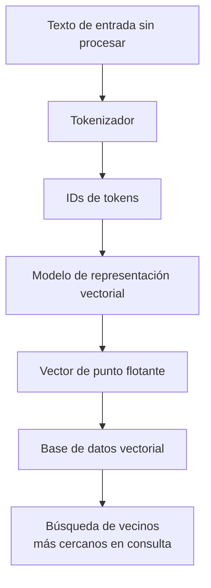
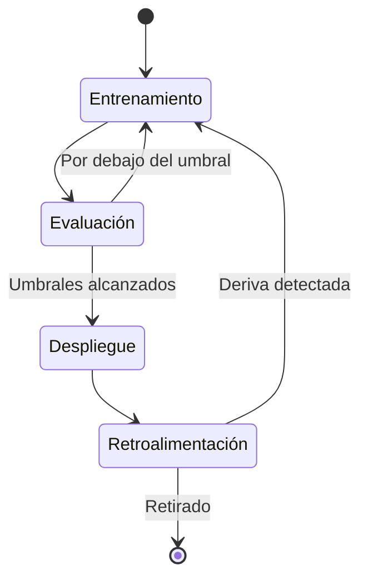
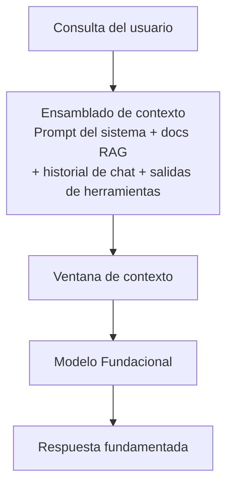
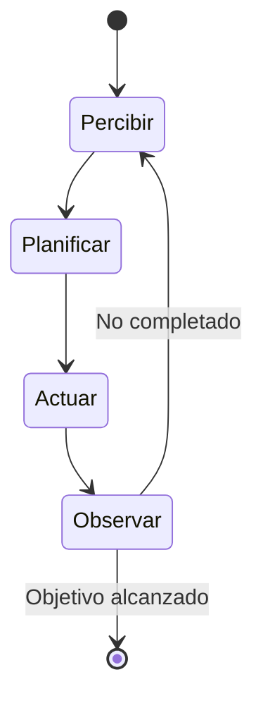
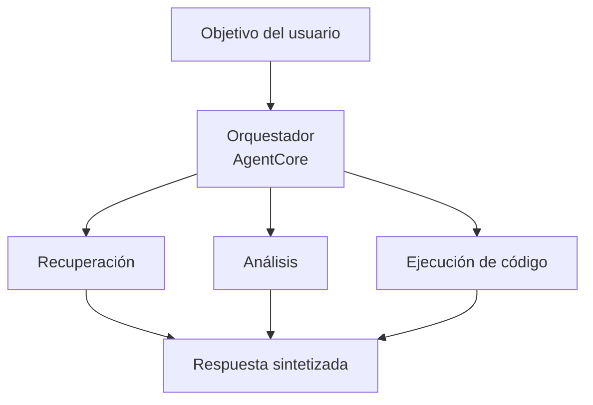

## Enunciado de Tarea 2.1: Explicar los conceptos básicos de la IA generativa (GenAI)

La IA generativa produce contenido nuevo en lugar de predecir una etiqueta o clasificar una entrada. Esa distinción lo define todo: las arquitecturas de modelo utilizadas para construir estos sistemas, la forma en que se cobran, los modos de falla que exhiben y la nueva disciplina de la ingeniería de contexto que determina qué información ve el modelo antes de responder. Este enunciado de tarea cubre seis áreas de objetivos, tres de las cuales son nuevas en la versión V1.1 de la guía del examen y reflejan con qué rapidez esta tecnología ha pasado de la investigación a los despliegues en producción.[^201001]

El apartado introductorio del dominio estableció que la IA generativa tiene un peso del 24% en el examen y que su estructura de costos y sus modos de falla difieren sustancialmente de los del aprendizaje automático clásico. Este enunciado de tarea fundamenta esas afirmaciones en la mecánica subyacente. Al terminar este apartado, podrá explicar qué es un token y por qué el recuento de tokens de un prompt afecta directamente a la factura, describir cómo un modelo fundacional (FM) pasa del texto sin procesar a un servicio desplegado, explicar qué significa la ingeniería de contexto y cómo se relaciona con la ingeniería de indicaciones, y articular los patrones que usan los sistemas multiagente cuando necesitan coordinar varios componentes de IA.

### 2.1.1 Conceptos fundamentales de IA generativa

Los modelos de IA generativa comparten un conjunto básico de abstracciones que aparecen en toda la documentación de AWS, en las páginas de precios de los proveedores y en las revisiones de diseño. Comprender estas abstracciones es el requisito previo para todo lo demás en el Dominio 2.

**La tokenización** es el primer paso en el procesamiento de texto con un modelo de lenguaje. Un *token* es la unidad de texto más pequeña con la que opera el modelo. En la mayoría del texto en inglés, un token equivale aproximadamente a tres o cuatro caracteres, por lo que la palabra "tokenization" se convierte en dos o tres tokens según el tokenizador, mientras que la palabra "cat" es un solo token. Los números, la puntuación y los caracteres en idiomas distintos del inglés suelen producir más tokens por palabra que la prosa estándar en inglés.[^201002] El recuento total de tokens de una solicitud es la suma de los tokens de entrada (el texto que se envía) más los tokens de salida (el texto que el modelo genera en respuesta). Ambos recuentos aparecen en la factura.

**El chunking** (segmentación) es el proceso de dividir un documento extenso en segmentos más pequeños antes de incrustarlo o recuperarlo. Un PDF de 50 páginas no cabe en la ventana de contexto de un modelo como un solo bloque, por lo que se divide en fragmentos superpuestos de unos pocos cientos de tokens cada uno. El tamaño del fragmento y el porcentaje de superposición son parámetros ajustables que afectan la precisión de la recuperación: los fragmentos demasiado pequeños pierden el contexto circundante, mientras que los demasiado grandes desperdician el presupuesto de tokens al insertarse en un prompt.[^201003] El chunking es un paso de preparación, no una capacidad del modelo, y se ejecuta en el momento de construir el índice, no durante la inferencia.

Las *representaciones vectoriales (embeddings)* son representaciones numéricas de texto (o imágenes, o audio) que codifican el significado semántico como vectores en un espacio de alta dimensionalidad. Dos fragmentos de texto con significados similares tendrán vectores de representación que están geométricamente próximos entre sí, lo que hace posible la búsqueda por similitud sobre una colección de documentos. **Amazon Bedrock** expone modelos de representación vectorial, como Amazon Titan Embeddings y Cohere Embed, que aceptan texto y devuelven un vector de punto flotante.[^201004] Esos vectores se almacenan luego en una base de datos vectorial, que es un almacén de datos especializado optimizado para búsquedas de vecinos más cercanos. Las bases de datos vectoriales disponibles en AWS incluyen **Amazon OpenSearch Service** con el complemento k-NN, **Amazon Aurora** y **Amazon RDS for PostgreSQL** con la extensión pgvector, y **Amazon Neptune Analytics** con búsqueda vectorial.[^201005]

*Figura 2.1.1: Flujo de tokenización y representación vectorial. El texto se convierte primero en IDs de tokens mediante el tokenizador, luego se mapea a un vector de alta dimensionalidad mediante el modelo de representación, y finalmente se almacena en una base de datos vectorial para la recuperación por similitud.*

**La ingeniería de indicaciones (prompt engineering)** es la práctica de elaborar los textos que se envían a un modelo para mejorar la calidad, la precisión o el formato de sus salidas. Una indicación bien diseñada puede incluir una instrucción, contexto, ejemplos y un formato de salida explícito. El Enunciado de Tarea 3.2 cubre técnicas específicas de ingeniería de indicaciones en detalle; en esta etapa, el punto clave es que la ingeniería de indicaciones es el lever más inmediato que un profesional tiene sobre el comportamiento del modelo sin modificar el modelo en sí.[^201006]

Los **modelos de lenguaje grandes (LLM) basados en transformadores** son la arquitectura dominante para las tareas de lenguaje modernas. La arquitectura *transformer*, introducida en 2017, utiliza un mecanismo llamado *autoatención (self-attention)* para ponderar la relevancia de cada token en una secuencia frente a todos los demás tokens al producir cada token de salida.[^201007] La autoatención es lo que permite a un transformer mantener dependencias de largo alcance en el texto, como saber que el pronombre "it" se refiere a un sustantivo introducido tres oraciones antes. Las matemáticas de la atención no se evalúan en el examen AIF-C01, pero el concepto importa para entender por qué los contextos más largos son computacionalmente más costosos y por qué la ventana de contexto tiene un tamaño finito.

Los **modelos fundacionales (FM)** son modelos grandes entrenados en conjuntos de datos amplios y de propósito general a una escala enorme.[^201008] Un FM no se entrena para una tarea específica; en su lugar, aprende representaciones generales del lenguaje (o imágenes, o código) que luego pueden adaptarse a muchas tareas posteriores mediante indicaciones, recuperación o ajuste fino. Entre los ejemplos disponibles a través de Amazon Bedrock se encuentran Anthropic Claude, Meta Llama, Amazon Nova y los modelos de Mistral AI, entre otros.[^201009]

Los **modelos multimodales** aceptan y producen más de un tipo de datos. Un FM multimodal puede aceptar una imagen más una pregunta de texto y devolver una respuesta de texto, o aceptar texto y devolver tanto texto como una imagen. Dentro de la familia Amazon Nova en Amazon Bedrock, los modelos Lite, Pro y Premier procesan texto, imágenes, video y documentos; Nova Micro es solo de texto y es la opción de menor costo para casos de uso de texto puro.[^201010]

Los **modelos de difusión** generan salidas aprendiendo a revertir un proceso de adición de ruido. Durante el entrenamiento, el modelo ve datos con cantidades crecientes de ruido aleatorio añadido, y aprende a predecir y eliminar ese ruido paso a paso. En el momento de la inferencia, comienza con ruido puro y lo elimina iterativamente hasta convertirlo en una imagen coherente, un clip de audio u otro artefacto.[^201011] Los modelos de difusión son la base de las capacidades de generación de imágenes. Amazon Bedrock incluye Stable Diffusion de Stability AI como modelo de generación de imágenes en esta categoría.[^201012]

### 2.1.2 Casos de uso potenciales para los modelos de IA generativa

La IA generativa abarca una gama más amplia de tareas empresariales que la mayoría de los sistemas de aprendizaje automático clásico porque los modelos subyacentes se generalizan entre dominios. La pregunta práctica no es si un modelo generativo podría ayudar con una tarea determinada, sino si es la compensación económica y de precisión correcta para ese caso específico.

*Tabla 2.1.1: Casos de uso comunes de IA generativa y escenarios empresariales representativos*

| Caso de uso | Qué hace el modelo | Escenario empresarial representativo |
|---|---|---|
| Generación de imágenes | Produce nuevas imágenes a partir de indicaciones de texto o imagen | Los equipos de marketing generan imágenes de estilo de vida de productos sin una sesión fotográfica |
| Generación de video | Genera clips de video cortos a partir de descripciones de texto | Las empresas de medios producen borradores de videos explicativos para revisión |
| Generación de audio | Sintetiza voz o música | Las plataformas de e-learning generan narración para las actualizaciones de cursos durante la noche |
| Resumización | Condensa documentos largos en versiones más cortas | Los departamentos legales resumen contratos para destacar las obligaciones clave |
| Asistentes de IA | Responde preguntas, redacta contenido, explica conceptos | Los bots de base de conocimiento interna responden preguntas de RR.HH. de los empleados |
| Traducción | Convierte texto de un idioma a otro | Los minoristas globales localizan descripciones de productos en 20 idiomas |
| Generación de código | Escribe, revisa y explica código fuente | Los desarrolladores aceleran la implementación de funcionalidades rutinarias y la escritura de pruebas unitarias |
| Agentes de servicio al cliente | Gestiona consultas de clientes a través de conversación | Los centros de contacto desvían preguntas comunes sin intervención de agentes en vivo |
| Búsqueda | Devuelve resultados semánticamente relevantes en lugar de coincidencias de palabras clave | Los portales de documentos empresariales muestran la página de política correcta incluso cuando la consulta usa una formulación diferente |
| Motores de recomendación | Sugiere elementos basándose en el comportamiento del usuario o en preferencias declaradas | Los servicios de streaming recomiendan contenido utilizando señales híbridas semánticas y de filtrado colaborativo |

Cada tipo de caso de uso impone demandas diferentes al modelo subyacente. La resumización y la traducción son principalmente tareas de lenguaje que favorecen a los LLM. La generación de imágenes y video requiere modelos visuales generativos de difusión u otros tipos. La generación de código se beneficia de modelos específicamente ajustados en lenguajes de programación. Los agentes de servicio al cliente se benefician de una baja latencia, una sólida capacidad de seguimiento de instrucciones y la capacidad de llamar a herramientas externas, lo que se conecta directamente con los patrones agénticos cubiertos en el objetivo 2.1.6. La búsqueda y las recomendaciones utilizan las capacidades de representación vectorial y similitud del objetivo 2.1.1, combinándolas típicamente con un patrón de generación aumentada por recuperación (RAG) cubierto en la Tarea 3.1.

### 2.1.3 El ciclo de vida del FM

Un modelo fundacional no pasa directamente de los datos de entrenamiento a producción. Atraviesa un ciclo de vida definido que tiene más etapas que el ciclo de vida del aprendizaje automático clásico descrito en la Tarea 1.3. El flujo clásico se centra en un conjunto de datos etiquetado, un modelo y un endpoint de predicción. El ciclo de vida del FM comienza mucho antes, con decisiones sobre qué datos sin procesar utilizar para el preentrenamiento, y añade ciclos de retroalimentación posteriores al despliegue que refinan continuamente el comportamiento del modelo.

*Figura 2.1.2: Ciclo de vida del modelo fundacional. El camino no es estrictamente lineal: los fallos en la evaluación vuelven al ajuste fino, y la retroalimentación de producción puede desencadenar nuevos ciclos de adaptación.*

Las siete etapas del ciclo de vida del FM son:

- **Selección de datos**: Curación del corpus de entrenamiento. Para el preentrenamiento, este es masivo y amplio (rastreos web, libros, repositorios de código). Para el ajuste fino, es específico del dominio y mucho más pequeño. La calidad de los datos en esta etapa determina directamente el comportamiento del modelo, incluidos sus sesgos.[^201013]
- **Selección del modelo**: Elección de una arquitectura (variante de transformer, modelo de difusión, multimodal), el tamaño en parámetros y si entrenar desde cero o partir de un FM existente. La mayoría de los despliegues empresariales omiten completamente el preentrenamiento desde cero y eligen entre los FM disponibles a través de un servicio como Amazon Bedrock.[^201014]
- **Preentrenamiento**: Aprendizaje de representaciones generales a partir del conjunto de datos amplio utilizando grandes cantidades de cómputo (clústeres de GPU ejecutándose durante semanas o meses). Esta es la etapa que produce los pesos base del FM. El preentrenamiento es lo suficientemente costoso como para que prácticamente ninguna empresa fuera de los hiperescaladores lo realice.[^201015]
- **Ajuste fino (fine-tuning)**: Actualización de los pesos base del FM en un conjunto de datos más pequeño, específico de la tarea o del dominio. El ajuste fino adapta el comportamiento del modelo sin repetir el costo completo del preentrenamiento. Amazon Bedrock admite trabajos de ajuste fino personalizados, y Amazon SageMaker AI admite tanto el ajuste fino como técnicas más avanzadas de ajuste fino con eficiencia de parámetros.[^201016]
- **Evaluación**: Medición de la calidad del modelo en datos de prueba reservados. Para los modelos generativos, la evaluación incluye métricas automáticas como ROUGE y BLEU para texto, además de evaluación humana y, cada vez más, métodos de LLM como juez. La Tarea 3.4 cubre la evaluación en profundidad.
- **Despliegue**: Servir el modelo a través de un endpoint de API donde las aplicaciones pueden enviar indicaciones y recibir respuestas. Amazon Bedrock gestiona la infraestructura subyacente para los modelos admitidos, mientras que Amazon SageMaker AI le da a los equipos control directo sobre la configuración del endpoint.[^201017]
- **Retroalimentación**: Recopilación de señales del tráfico de producción (latencia, precisión, satisfacción del usuario, tasas de error) y uso de ellas para detectar deriva o para construir nuevos conjuntos de datos de ajuste fino. Esto cierra el ciclo y distingue el ciclo de vida del FM de un entrenamiento único.

La distinción clave con respecto al ciclo de vida del aprendizaje automático clásico de la Tarea 1.3 es la etapa de preentrenamiento. Los flujos de trabajo clásicos de aprendizaje automático comienzan con un conjunto de datos etiquetado específico del problema. El ciclo de vida del FM comienza con el aprendizaje autosupervisado en texto sin etiquetar a una escala que crea capacidades generales, y solo más tarde se reduce a tareas específicas mediante ajuste fino o indicaciones. Los profesionales de negocios generalmente ingresan al ciclo de vida del FM en la etapa de ajuste fino o despliegue, no en el preentrenamiento.

### 2.1.4 Modelo de precios basado en tokens

La inferencia clásica de aprendizaje automático se cobra típicamente por predicción o por hora de endpoint. El precio basado en tokens es diferente: se paga por la cantidad de tokens consumidos, tanto de entrada como de salida, en lugar de por el recurso de cómputo que ejecutó la solicitud. Comprender la economía de los tokens es directamente relevante para la planificación presupuestaria de cualquier proyecto de IA generativa.

Los **tokens de entrada** son los tokens del prompt que se envía al modelo: el prompt del sistema, los documentos recuperados, el historial de conversación, las salidas de herramientas y el mensaje del usuario. Los **tokens de salida** son los tokens que el modelo genera en respuesta. Amazon Bedrock, como la mayoría de los proveedores de FM en la nube, cobra por separado los tokens de entrada y de salida, y los tokens de salida tienen un precio más alto porque generar un token es computacionalmente más costoso que procesar un token de entrada.[^201018]

*Tabla 2.1.2: Estructura de precios basada en tokens y palancas de costo*

| Factor de precio | Descripción | Efecto en el costo |
|---|---|---|
| Precio del token de entrada | Costo por 1.000 tokens de entrada (varía según el modelo) | Directamente proporcional a la longitud del prompt |
| Precio del token de salida | Costo por 1.000 tokens de salida, típicamente 3 a 5 veces el precio de entrada | Directamente proporcional a la longitud de la respuesta |
| Almacenamiento en caché de indicaciones | Reutilización de prefijos de prompt previamente procesados | Reduce el costo efectivo de entrada para el contexto repetido |
| Inferencia por lotes | Procesamiento asíncrono de muchas solicitudes juntas | Descuento típico del 50% frente al precio bajo demanda |
| Rendimiento aprovisionado | Capacidad reservada para cargas de trabajo de alto volumen sostenido | Costo predecible pero requiere compromiso de volumen |

Para concretar esto, considere un escenario de servicio al cliente. Una sola interacción puede incluir un prompt del sistema de 500 tokens, un documento recuperado de 1.000 tokens, un mensaje del usuario de 50 tokens y una respuesta del modelo de 200 tokens. Eso son 1.550 tokens de entrada y 200 tokens de salida. Para un modelo con un precio de $0.003 por 1.000 tokens de entrada y $0.015 por 1.000 tokens de salida, el costo por interacción es de aproximadamente $0.0077 ($0.00465 de entrada + $0.003 de salida). Con 100.000 interacciones por mes, la factura es de aproximadamente $770 para esa sola llamada al modelo por interacción. Si el flujo de trabajo llama al modelo varias veces por interacción (para el enrutamiento, para la reclasificación de la recuperación, para la generación de respuestas), esas cifras se multiplican en consecuencia.[^201019]

El **almacenamiento en caché de indicaciones (prompt caching)** permite al proveedor del modelo almacenar la representación procesada de un prefijo de prompt repetido para que las solicitudes posteriores que comparten ese prefijo no vuelvan a procesar esos tokens desde cero. Cuando el mismo prompt del sistema se envía con cada solicitud, almacenar en caché ese prefijo puede reducir el costo efectivo de entrada de la porción en caché entre un 80 y un 90 por ciento.[^201020] Amazon Bedrock admite el almacenamiento en caché de indicaciones para los modelos aplicables.

La **inferencia por lotes (batch inference)** en Amazon Bedrock procesa las solicitudes de forma asíncrona en lugar de en tiempo real. En lugar de enviar una solicitud y esperar la respuesta, se envía un lote de solicitudes y se recuperan los resultados una vez completado el procesamiento. El equilibrio es la latencia: las respuestas por lotes llegan minutos u horas después del envío en lugar de segundos. Para los casos de uso que toleran latencia (colas de resumización de documentos, trabajos de traducción nocturnos, generación de contenido en volumen), la inferencia por lotes es una palanca de costo sencilla.[^201021]

La implicación práctica para la planificación empresarial es que los costos de tokens se acumulan con las decisiones de arquitectura. Un patrón RAG que recupera tres documentos de 500 tokens por consulta añade 1.500 tokens de entrada a cada solicitud. Un flujo de trabajo agéntico que realiza cinco llamadas al modelo por solicitud de usuario multiplica el costo por solicitud aproximadamente por cinco. Diseñar para la eficiencia de tokens, mediante indicaciones más cortas, almacenamiento en caché de indicaciones, procesamiento por lotes donde sea tolerable y ajuste del recuento de fragmentos de recuperación, es tan importante como elegir el modelo correcto.

### 2.1.5 Ingeniería de contexto en aplicaciones de FM

La ingeniería de indicaciones se centra en la redacción y la estructura de una sola indicación: cómo formular una instrucción, cómo formatear un ejemplo, cuántos ejemplos incluir. La **ingeniería de contexto** es una disciplina más amplia que pregunta qué información debe entrar en la ventana de contexto del modelo, en qué forma y en qué orden.[^201022] Un modelo no ve el mundo; solo ve lo que cabe dentro de su ventana de contexto en el momento de la inferencia. La ingeniería de contexto es la práctica de curar ese contenido de forma deliberada.

La ventana de contexto es el número máximo de tokens que un modelo puede procesar en un solo paso de avance, incluidos tanto la entrada como la salida. Las ventanas de contexto de los modelos de Amazon Bedrock van desde decenas de miles hasta más de un millón de tokens según la familia del modelo (por ejemplo, ciertas variantes de Anthropic Claude alcanzan un millón de tokens con el encabezado beta 1M-context, y Amazon Nova Premier y Meta Llama 4 Maverick ofrecen ventanas de un millón de tokens en Bedrock).[^201023] Una ventana de contexto grande no significa que una aplicación deba llenarla completamente: los contextos más largos aumentan la latencia y el costo, y los modelos pueden exhibir el comportamiento de *pérdida en el medio (lost-in-the-middle)*, donde la información relevante enterrada en el medio de un contexto largo recibe menos atención que la información al principio o al final.[^201024]

*Figura 2.1.3: Ensamblado de contexto para aplicaciones de FM. La ingeniería de contexto rige qué entra en cada segmento de la ventana de contexto y cómo se ordena la entrada ensamblada antes de que el modelo la procese.*

Los componentes que típicamente conforman un contexto ensamblado incluyen:

- **Prompt del sistema**: La instrucción permanente que define el rol, el tono, el formato de salida y las restricciones del modelo. El prompt del sistema suele ser constante en todas las solicitudes de una aplicación, lo que lo convierte en un buen candidato para el almacenamiento en caché de indicaciones.
- **Documentos recuperados**: Salida de un flujo de trabajo RAG. El paso de recuperación selecciona los fragmentos más semánticamente relevantes de una base de datos vectorial, pero la ingeniería de contexto determina cuántos fragmentos incluir, cómo clasificarlos y si resumirlos antes de incluirlos para ahorrar tokens.
- **Historial de conversación**: Turnos anteriores de una conversación de múltiples turnos. Dado que las ventanas de contexto son finitas, una conversación larga eventualmente supera la ventana. Las estrategias de ingeniería de contexto para el historial incluyen la truncación (descartando los turnos más antiguos), la resumización (reemplazando los turnos antiguos con un resumen progresivo) y la retención selectiva (conservando solo los turnos marcados como de alto valor).
- **Salidas de herramientas**: Cuando un agente llama a una función externa (una consulta de base de datos, una búsqueda web, una llamada a API), el resultado se inyecta de vuelta en el contexto para que el modelo razone sobre él. El formato de las salidas de herramientas afecta a la fiabilidad con que el modelo las interpreta.
- **Datos estructurados**: Tablas, registros JSON o pares clave-valor que proporcionan fundamentación factual. Los datos estructurados son más eficientes en tokens que las descripciones en prosa de los mismos hechos cuando el modelo necesita hacer referencia a valores específicos.

La distinción con respecto a la ingeniería de indicaciones es el alcance. La ingeniería de indicaciones responde "¿cómo debo formular esta instrucción?". La ingeniería de contexto responde "¿qué debe estar en la ventana de contexto, cuánto de ello, en qué forma y en qué secuencia?". Ambas disciplinas son relevantes para las aplicaciones de FM en producción, pero la ingeniería de contexto es la que escala con la complejidad de la aplicación. Un chatbot simple se puede diseñar una vez con ingeniería de indicaciones. Un agente complejo que coordina recuperaciones, llamadas a herramientas e historial de múltiples turnos requiere una ingeniería de contexto continua para mantenerse dentro de los presupuestos de tokens y mantener la calidad de las respuestas.

*Tabla 2.1.3: Técnicas de ingeniería de contexto y sus compensaciones*

| Técnica | Qué hace | Compensación |
|---|---|---|
| Resumización de ventana de contexto | Comprime los turnos de conversación antiguos en un resumen más corto | Pierde la redacción exacta; introduce posible distorsión |
| Recuperación selectiva | Recupera solo los k fragmentos más relevantes en lugar de todos los candidatos | Puede perder documentos relevantes si el modelo de recuperación clasifica mal |
| Presumización de fragmentos | Resume cada documento recuperado antes de incluirlo | Reduce los tokens por documento a costa de llamadas adicionales al modelo |
| Almacenamiento en caché de indicaciones | Almacena representaciones procesadas de prefijos repetidos | Requiere una estructura de indicaciones que mantenga estable la porción en caché |
| Formateo de salidas de herramientas | Convierte las respuestas brutas de la API en formatos compactos legibles por el modelo | Requiere lógica de formateo por herramienta en la capa de aplicación |

### 2.1.6 Conceptos fundamentales de IA agéntica

Un agente de IA es un sistema en el que un FM no solo responde a una sola indicación, sino que opera en un ciclo: percibe un objetivo u observación, planifica un curso de acción, ejecuta esa acción (a menudo llamando a una herramienta externa) y luego observa el resultado antes de decidir si el objetivo se ha completado.[^201025] Una sola llamada a un FM produce una respuesta y se detiene. Un agente se ejecuta hasta que se cumple una condición de parada, que podría ser la completación de una tarea de múltiples pasos, agotar un límite de turnos, o determinar que la tarea es imposible con las herramientas disponibles.

*Figura 2.1.4: El ciclo del agente. Un agente cicla a través de percibir, planificar, actuar y observar hasta que se cumple una condición de parada.*

Las arquitecturas de agente único manejan muchas tareas, pero los flujos de trabajo complejos a menudo requieren múltiples agentes operando en coordinación. Los **sistemas multiagente** distribuyen el trabajo entre agentes especializados, cada uno responsable de un aspecto de la tarea general.[^201026] El examen evalúa el conocimiento de cuatro patrones de coordinación:

- **Patrón orquestador/trabajador**: Un agente orquestador central recibe el objetivo del usuario, lo descompone en subtareas, despacha cada subtarea a un agente trabajador especializado, recopila los resultados y sintetiza una respuesta final. El orquestador no ejecuta el trabajo en sí; gestiona el flujo de trabajo.
- **Patrón jerárquico**: Una estructura en árbol en la que un agente de nivel superior gestiona agentes de nivel medio, que a su vez gestionan agentes de nivel hoja. Esta es una extensión del patrón orquestador/trabajador a múltiples niveles de descomposición, adecuado para tareas que tienen una estructura jerárquica natural (por ejemplo, una tarea de investigación que se descompone en áreas temáticas, cada una de las cuales se descompone en recuperación de fuentes y análisis).
- **Patrón secuencial**: Los agentes están dispuestos en un flujo de trabajo donde la salida de un agente es la entrada del siguiente. Esto es apropiado cuando cada paso debe completarse antes de que pueda comenzar el siguiente, y cuando no hay necesidad de que el agente posterior influya en el comportamiento del agente anterior.
- **Patrón de debate**: Múltiples agentes producen respuestas independientemente a la misma consulta, luego evalúan o critican las salidas de los demás, con un agente final que sintetiza la mejor respuesta. Esto mejora la precisión en tareas donde diferentes enfoques de razonamiento llegan a conclusiones diferentes.

El **Protocolo de Contexto del Modelo (MCP)** es un protocolo estandarizado para conectar agentes de IA con herramientas externas, fuentes de datos y servicios.[^201027] Sin un protocolo común, cada integración de un agente con un sistema externo requiere código personalizado para gestionar la autenticación, el formateo de solicitudes y el análisis de respuestas. MCP define una interfaz estándar cliente-servidor para que un agente pueda descubrir las herramientas disponibles, llamarlas con argumentos estructurados y recibir resultados estructurados sin código específico de integración. AWS ha declarado soporte para MCP dentro del ecosistema de Amazon Bedrock, y **Strands Agents**, el SDK de código abierto de AWS para construir aplicaciones agénticas, implementa la interfaz cliente MCP.[^201028]

Los patrones de comunicación multiagente describen cómo los agentes intercambian mensajes. Los agentes pueden comunicarse directamente (entre pares), a través de una cola de mensajes compartida o a través de un broker centralizado. La elección del patrón de comunicación afecta a la fiabilidad, las garantías de ordenamiento y la capacidad de auditar qué dijo cada agente a qué otro agente. En los sistemas de producción, las colas de mensajes se prefieren a las llamadas directas entre agentes porque desacoplan al agente emisor del agente receptor y proporcionan un registro duradero de todos los mensajes entre agentes.

*Tabla 2.1.4: Tipos de memoria en los sistemas de IA agéntica*

| Tipo de memoria | Alcance | Dónde se almacena | Caso de uso |
|---|---|---|---|
| Corto plazo (de trabajo) | Sesión actual o ciclo del agente | Ventana de contexto | Razonamiento sobre la tarea actual |
| Largo plazo (persistente) | Entre sesiones | Base de datos externa o almacén vectorial | Recordar preferencias del usuario, decisiones pasadas |
| Episódica | Eventos o interacciones específicos del pasado | Almacén de registros recuperable | Recordar lo que ocurrió en un compromiso anterior |
| Semántica | Conocimiento general del mundo o del dominio | Embebido en los pesos del modelo o índice RAG | Responder preguntas de hechos |

La **gestión de la memoria** es la práctica de decidir qué información retiene un agente, en qué nivel de memoria y por cuánto tiempo.[^201029] La memoria a corto plazo es la ventana de contexto en sí. Cuando el contexto de trabajo de un agente se acerca al límite de su ventana, la capa de gestión de memoria debe decidir qué comprimir, resumir o transferir al almacenamiento a largo plazo. La memoria a largo plazo generalmente usa una base de datos vectorial (como se describe en el objetivo 2.1.1) para que el agente pueda recuperar experiencias pasadas relevantes semánticamente en lugar de escanear un registro completo.

El **uso de herramientas** en los sistemas agénticos se refiere a la capacidad del agente para llamar a funciones externas e incorporar los resultados a su razonamiento.[^201030] Una herramienta puede ser una búsqueda web, una consulta de base de datos, una llamada a una API REST, un intérprete de código o cualquier función que devuelva un resultado que el agente pueda observar. Las herramientas se definen por su esquema de entrada y su esquema de salida; el FM utiliza estos esquemas para decidir cuándo llamar a una herramienta y qué argumentos pasar. A veces esto se denomina *llamada a funciones (function calling)* en la documentación de la API.

La **orquestación de flujos de trabajo** coordina la ejecución de procesos agénticos de múltiples pasos, gestionando la secuenciación, la recuperación de errores y la gestión del estado entre las llamadas a agentes.[^201031] **Amazon Bedrock AgentCore**, la nueva capa de ejecución gestionada para las cargas de trabajo agénticas en Amazon Bedrock, gestiona esta capa de orquestación para las aplicaciones agénticas de producción, proporcionando infraestructura de ejecución para que los equipos no tengan que construir y operar su propio entorno de ejecución de agentes.[^201032] Strands Agents es el SDK de código abierto que se sitúa sobre el entorno de ejecución y ofrece a los desarrolladores una forma basada en Python para definir agentes, herramientas y comportamientos de memoria, con soporte de cliente MCP integrado.[^201033]

*Figura 2.1.5: Patrón orquestador/trabajador multiagente en Amazon Bedrock AgentCore. El orquestador gestiona los agentes trabajadores y ensambla sus salidas en una respuesta final.*

La relevancia empresarial de la IA agéntica es que desbloquea casos de uso que el prompting de un solo turno no puede manejar: tareas que requieren múltiples búsquedas de herramientas, tareas que deben adaptarse a mitad de la ejecución basándose en resultados intermedios, y tareas que implican coordinación entre subsistemas especializados. Al mismo tiempo, los sistemas agénticos son más complejos de diseñar, más costosos de ejecutar (cada iteración del ciclo del agente consume tokens) y más difíciles de auditar que las llamadas de un solo turno. El Enunciado de Tarea 3.1 revisita los agentes de IA desde la perspectiva del diseño, cubriendo cuándo usar agentes frente a patrones más simples.

---

Esta sección construyó el vocabulario conceptual para todo el Dominio 2. Ahora puede definir las primitivas básicas de IA generativa (tokens, representaciones vectoriales, vectores, atención, modelos fundacionales, modelos de difusión), explicar el ciclo de vida del FM y en qué se diferencia del flujo de trabajo clásico de aprendizaje automático, calcular costos aproximados basados en tokens para una arquitectura dada, describir qué significa la ingeniería de contexto y en qué se diferencia de la ingeniería de indicaciones, y articular los patrones principales para los sistemas multiagente y el rol del MCP. El Enunciado de Tarea 2.2 da el siguiente paso: dadas estas capacidades, ¿cuáles son los límites reales de la IA generativa, y cómo debe evaluar una empresa esos límites al seleccionar una solución generativa?

---

## Preguntas de autoevaluación

**Pregunta 1**

Una empresa está construyendo un sistema de preguntas y respuestas sobre documentos que divide en fragmentos un PDF de 200 páginas, incrusta los fragmentos y los almacena en una base de datos vectorial. Cuando un usuario hace una pregunta, el sistema recupera los tres fragmentos más relevantes y los incluye en el prompt de un LLM. Un desarrollador informa que el modelo a veces ignora información relevante que aparece en el medio de fragmentos recuperados largos.

¿Cuál de las siguientes opciones describe MEJOR este comportamiento y la mitigación MÁS apropiada?

A. El tokenizador del modelo está descartando los tokens del medio del documento antes de que el modelo de representación vectorial los procese. Reduzca el tamaño del fragmento a menos de 50 tokens para que el tokenizador conserve todo el contenido.

B. Los modelos de lenguaje grande pueden exhibir el comportamiento de pérdida en el medio, donde el contenido en el medio de un contexto largo recibe menos atención que el contenido al principio o al final. Los fragmentos más cortos o la resumización de fragmentos antes de su inclusión pueden reducir este efecto.

C. La base de datos vectorial está realizando búsquedas basadas en palabras clave en lugar de búsquedas semánticas, por lo que está recuperando fragmentos basándose en la frecuencia de palabras en lugar del significado. Cambie a un índice de búsqueda de texto completo.

D. Los modelos de difusión no están diseñados para tareas de recuperación de texto. Reemplace el LLM con un modelo de difusión entrenado en comprensión de documentos.

*Explicación.* La opción B es correcta. El fenómeno de pérdida en el medio es un comportamiento documentado de los LLM basados en transformadores en el que la información posicionada en el medio de una ventana de contexto larga recibe proporcionalmente menos peso de atención que la información al principio o al final del contexto.[^201034] Este es un problema de ingeniería de contexto, no un problema del tokenizador (A es incorrecta), no un problema de búsqueda en la base de datos vectorial (C es incorrecta) y no una cuestión de selección de clase de modelo (D es incorrecta y los modelos de difusión no realizan recuperación de texto). Las mitigaciones incluyen reducir el tamaño del fragmento para que cada fragmento tenga un alcance más acotado, resumir los fragmentos antes de incluirlos para reducir el recuento de tokens, y ordenar los fragmentos más relevantes al principio del prompt en lugar de enterrarlos en el medio. Estas son todas decisiones de ingeniería de contexto: rigen qué entra en la ventana de contexto, en qué forma y en qué orden, que es exactamente la disciplina descrita en el objetivo 2.1.5.[^201035]

---

**Pregunta 2**

Una organización está evaluando el costo de ejecutar una aplicación de servicio al cliente de IA generativa en Amazon Bedrock. Cada interacción del cliente incluye un prompt del sistema de 600 tokens, un promedio de 900 tokens de documentos recuperados, un mensaje del usuario de 100 tokens y una respuesta del modelo de 300 tokens. La aplicación maneja 500.000 interacciones por mes.

¿Qué factor de precio tendría el impacto MÁS significativo si la organización quiere reducir los costos mensuales sin cambiar el modelo ni la calidad de las respuestas?

A. Cambiar del rendimiento aprovisionado al precio bajo demanda para todas las solicitudes.

B. Aplicar el almacenamiento en caché de indicaciones al prompt del sistema, que es idéntico para cada solicitud.

C. Aumentar el número de fragmentos de documentos recuperados de 3 a 6 por interacción.

D. Reducir el límite máximo de tokens de salida de 300 a 100 tokens.

*Explicación.* La opción B es correcta. En cada interacción, el prompt del sistema tiene 600 tokens y es idéntico en las 500.000 solicitudes. El almacenamiento en caché de indicaciones permite al proveedor almacenar la representación procesada de ese prefijo repetido y cobrar una tarifa sustancialmente menor (típicamente entre un 80 y un 90 por ciento menos) para los accesos a la caché de esos 600 tokens.[^201036] Con 500.000 solicitudes, el ahorro en la porción en caché es significativo. La opción A es incorrecta porque el rendimiento aprovisionado proporciona un descuento de capacidad reservada frente al precio bajo demanda; cambiar del aprovisionado al bajo demanda aumentaría el costo, no lo reduciría. La opción C es incorrecta porque añadir más fragmentos recuperados aumenta el recuento de tokens de entrada por solicitud, lo que aumenta el costo. La opción D podría reducir los costos de tokens de salida, pero la pregunta especifica que no debe haber cambios en la calidad de las respuestas; truncar arbitrariamente la salida probablemente reduciría la calidad. El almacenamiento en caché de indicaciones apunta a la porción de mayor repetición del prompt y reduce el costo sin cambiar el contenido enviado al modelo.[^201037]

---

**Pregunta 3**

Un analista de negocios está revisando una propuesta para un sistema de IA agéntica que gestionará solicitudes de reembolso de clientes. El sistema propuesto utiliza un agente orquestador que recibe la solicitud de reembolso, llama a un agente trabajador para buscar el historial del pedido, llama a un segundo agente trabajador para verificar la política de reembolsos y luego genera una decisión. Cada paso implica una llamada al modelo separada.

¿Cuál de las siguientes es la consideración PRINCIPAL que el analista debe plantear respecto al costo de esta arquitectura en comparación con una sola llamada a un LLM para la misma tarea?

A. Los sistemas multiagente no son compatibles con Amazon Bedrock AgentCore, por lo que el equipo necesitará construir una capa de orquestación personalizada que añade costo de ingeniería.

B. El ciclo del agente realiza múltiples llamadas al modelo por solicitud del usuario, y cada llamada consume tokens de entrada y de salida. El costo total de tokens por solicitud será mayor que una sola llamada que incluya todo el contexto en un solo prompt.

C. Los sistemas agénticos usan modelos de difusión internamente, que tienen un precio por token más alto que los LLM basados en transformadores en Amazon Bedrock.

D. El patrón orquestador/trabajador requiere que todos los agentes trabajadores usen el mismo modelo fundacional, lo que elimina la capacidad de usar un modelo más económico para los pasos de búsqueda.

*Explicación.* La opción B es correcta. Cada llamada al modelo en un ciclo agéntico incurre en costos de tokens de entrada y de salida. Un agente orquestador que realiza tres llamadas al modelo (una para descomponer la tarea, una para llamar a cada trabajador y una para sintetizar el resultado) consumirá varias veces más tokens por solicitud del usuario que un prompt de un solo turno que incluya todo el contexto relevante. Esta es la compensación de costo fundamental para las arquitecturas agénticas y se aborda directamente en el objetivo 2.1.4 sobre precios basados en tokens y el objetivo 2.1.6 sobre IA agéntica.[^201038] La opción A es incorrecta porque Amazon Bedrock AgentCore Runtime está diseñado específicamente para soportar la orquestación multiagente. La opción C es incorrecta porque los sistemas agénticos usan LLM (modelos basados en transformadores) para el razonamiento, no modelos de difusión; los modelos de difusión generan imágenes y otros medios, no los pasos de razonamiento en un ciclo de agente. La opción D es incorrecta porque el patrón orquestador/trabajador soporta modelos heterogéneos entre los trabajadores; usar modelos más económicos y rápidos para los pasos de búsqueda es una técnica común de optimización de costos.[^201039]

---

**Pregunta 4**

Un equipo de desarrollo está construyendo un chatbot empresarial en Amazon Bedrock. Observan que la ventana de contexto se llena después de aproximadamente 20 turnos de conversación porque cada turno añade toda la conversación anterior a la siguiente solicitud. El equipo quiere mantener la coherencia conversacional más allá de los 20 turnos sin cambiar el modelo.

¿Qué técnica de ingeniería de contexto aborda MÁS directamente este problema?

A. Reemplazar el LLM basado en transformadores con un modelo de difusión, que no usa ventanas de contexto y por lo tanto no tiene límite de turnos.

B. Cambiar del precio bajo demanda al rendimiento aprovisionado, que asigna una ventana de contexto más grande para la aplicación.

C. Aplicar la resumización de ventana de contexto: reemplazar los turnos de conversación antiguos con un resumen progresivo generado por el modelo, e incluir solo el resumen más los turnos recientes en cada solicitud.

D. Aumentar el tamaño de los fragmentos de los documentos recuperados para reducir el número de fragmentos incluidos en el contexto, liberando espacio para más historial de conversación.

*Explicación.* La opción C es correcta. La resumización de ventana de contexto es una técnica estándar de ingeniería de contexto para conversaciones de múltiples turnos: a medida que el historial acumulado se acerca al límite de la ventana, la aplicación usa el modelo para producir un resumen comprimido de los turnos más antiguos, reemplaza esos turnos con el resumen e incluye solo los turnos recientes en su totalidad.[^201040] Esto preserva la sustancia de la conversación sin superar la ventana. La opción A es incorrecta; los modelos de difusión generan imágenes y audio, no conversaciones de texto, y no resuelven las limitaciones de la ventana de contexto. La opción B es incorrecta; el rendimiento aprovisionado es una construcción de precios que reserva capacidad de cómputo, no un mecanismo para ampliar el tamaño de la ventana de contexto. La opción D aborda un segmento de contexto diferente (documentos recuperados) y solo ayudaría si el contexto estuviera dominado por la salida de la recuperación en lugar del historial de conversación, lo que el escenario no indica.[^201041]

---

**Pregunta 5**

Una empresa quiere integrar sus herramientas internas, incluyendo un sistema CRM, una base de datos de tickets y una API de inventario, con un agente de IA para que el agente pueda buscar registros de clientes, crear tickets de servicio y verificar los niveles de stock dentro de una sola conversación. Un desarrollador recomienda usar el Protocolo de Contexto del Modelo (MCP).

¿Qué afirmación describe MEJOR el rol del MCP en esta integración?

A. MCP es un estándar de formato de datos que convierte registros CRM, tickets y datos de inventario en tokens antes de enviarlos al modelo fundacional.

B. MCP es un nivel de precios dentro de Amazon Bedrock que reduce el costo de las llamadas al modelo realizadas por agentes que acceden a herramientas externas.

C. MCP define una interfaz estándar cliente-servidor que permite a un agente descubrir las herramientas disponibles, llamarlas con argumentos estructurados y recibir resultados estructurados sin escribir código de integración personalizado para cada sistema.

D. MCP es un protocolo de gestión de memoria que determina qué turnos de conversación conservar en el almacenamiento a largo plazo y cuáles descartar después de cada iteración del ciclo del agente.

*Explicación.* La opción C es correcta. El Protocolo de Contexto del Modelo define una interfaz estandarizada entre un agente de IA (el cliente MCP) y herramientas o servicios externos (los servidores MCP). Cuando un sistema CRM, un sistema de tickets y una API de inventario exponen cada uno un endpoint de servidor MCP, el agente puede descubrir y llamar a los tres a través del mismo protocolo sin que el equipo de desarrollo escriba tres capas de integración personalizada separadas.[^201042] Strands Agents, el SDK de código abierto de AWS, incluye soporte de cliente MCP integrado, y Amazon Bedrock AgentCore proporciona el entorno de ejecución en el que dichos agentes se ejecutan. La opción A es incorrecta; MCP no es un estándar de tokenización o conversión de formato de datos. La opción B es incorrecta; MCP no es una construcción de precios. La opción D es incorrecta; la gestión de memoria es una preocupación separada de la conectividad de herramientas, y MCP no rige lo que un agente retiene en memoria entre turnos.[^201043]

---

**Pregunta 6**

Un modelo fundacional fue preentrenado en un corpus general amplio y luego ajustado fino con la documentación técnica interna de una empresa. El modelo está ahora desplegado a través de Amazon Bedrock. Seis meses después, el equipo observa que las respuestas del modelo sobre los productos más nuevos lanzados después de la fecha del ajuste fino son inexactas.

¿Qué etapa del ciclo de vida del FM aborda MÁS directamente este problema, y cuál es la acción recomendada?

A. Preentrenamiento: la empresa debe repetir la ejecución completa del preentrenamiento con un corpus actualizado que incluya la documentación de los productos más nuevos.

B. Selección de datos: la empresa debe cambiar el tokenizador utilizado para procesar los nuevos documentos de productos antes de que se alimenten al modelo existente.

C. Retroalimentación y ajuste fino: la retroalimentación de producción muestra el problema de fecha límite de conocimiento; el equipo debe ejecutar un nuevo trabajo de ajuste fino en un conjunto de datos que incluya la documentación de los productos más nuevos, o implementar RAG para recuperar información actual del producto en el momento de la inferencia.

D. Despliegue: la empresa debe cambiar el endpoint de servicio de Amazon Bedrock a Amazon SageMaker AI, que actualiza automáticamente el modelo con nuevos datos del entorno de producción.

*Explicación.* La opción C es correcta. El ciclo de vida del FM incluye una etapa de retroalimentación donde las señales de producción (en este caso, la inexactitud en los productos más nuevos) desencadenan un retorno al ajuste fino con datos actualizados.[^201044] El problema de la fecha límite de conocimiento es un desafío estándar de gestión del ciclo de vida del FM: el modelo no sabe sobre eventos o documentos posteriores a su entrenamiento. Existen dos remedios estándar: ejecutar un nuevo trabajo de ajuste fino que añada los datos de productos más nuevos al corpus de entrenamiento, o implementar la generación aumentada por recuperación (RAG) para que la documentación actual del producto se recupere de un índice actualizado regularmente y se inyecte en el contexto en el momento de la inferencia. RAG suele ser el camino más rápido porque no requiere una nueva ejecución de entrenamiento. La opción A es incorrecta; repetir el preentrenamiento completo es prohibitivamente costoso e innecesario cuando el objetivo es añadir actualizaciones específicas del dominio. La opción B es incorrecta; el tokenizador procesa el texto en tokens independientemente de la actualidad del contenido y no es la causa de las fechas límite de conocimiento. La opción D es incorrecta; cambiar la infraestructura de servicio no actualiza los pesos del modelo; Amazon SageMaker AI no vuelve a entrenar automáticamente un modelo desplegado a partir del tráfico de producción.[^201045]

---

[^201001]: AWS Certification. AIF-C01 Exam Guide v1.1. URL: <https://docs.aws.amazon.com/aws-certification/latest/ai-practitioner-01/ai-practitioner-01.html>
[^201002]: Anthropic. Token counting in Claude models. URL: <https://docs.anthropic.com/en/docs/about-claude/models>
[^201003]: AWS Documentation. Chunking strategies in Amazon Bedrock Knowledge Bases. URL: <https://docs.aws.amazon.com/bedrock/latest/userguide/kb-chunking-parsing.html>
[^201004]: AWS Documentation. Amazon Titan Embeddings models in Amazon Bedrock. URL: <https://docs.aws.amazon.com/bedrock/latest/userguide/titan-embedding-models.html>
[^201005]: AWS Documentation. Vector engine for Amazon OpenSearch Service. URL: <https://docs.aws.amazon.com/opensearch-service/latest/developerguide/knn.html>
[^201006]: AWS Documentation. Prompt engineering guidelines for Amazon Bedrock. URL: <https://docs.aws.amazon.com/bedrock/latest/userguide/prompt-engineering-guidelines.html>
[^201007]: Vaswani, A. et al. Attention Is All You Need. URL: <https://arxiv.org/abs/1706.03762>
[^201008]: AWS Documentation. What are foundation models? URL: <https://docs.aws.amazon.com/bedrock/latest/userguide/what-is-a-foundation-model.html>
[^201009]: AWS Documentation. Supported foundation models in Amazon Bedrock. URL: <https://docs.aws.amazon.com/bedrock/latest/userguide/models-supported.html>
[^201010]: AWS Documentation. Amazon Nova models overview. URL: <https://docs.aws.amazon.com/bedrock/latest/userguide/amazon-nova.html>
[^201011]: Ho, J. et al. Denoising Diffusion Probabilistic Models. URL: <https://arxiv.org/abs/2006.11239>
[^201012]: AWS Documentation. Stability AI models in Amazon Bedrock. URL: <https://docs.aws.amazon.com/bedrock/latest/userguide/stability-ai.html>
[^201013]: AWS Documentation. Data selection best practices for foundation model training. URL: <https://docs.aws.amazon.com/sagemaker/latest/dg/clarify-foundation-model-evaluate.html>
[^201014]: AWS Documentation. Model selection in Amazon Bedrock. URL: <https://docs.aws.amazon.com/bedrock/latest/userguide/model-selection.html>
[^201015]: AWS Blog. Training large language models at scale on AWS. URL: <https://aws.amazon.com/blogs/machine-learning/training-large-language-models-at-scale-on-aws/>
[^201016]: AWS Documentation. Fine-tuning models in Amazon Bedrock. URL: <https://docs.aws.amazon.com/bedrock/latest/userguide/custom-models.html>
[^201017]: AWS Documentation. Deploying models with Amazon Bedrock endpoints. URL: <https://docs.aws.amazon.com/bedrock/latest/userguide/inference.html>
[^201018]: AWS Documentation. Amazon Bedrock pricing. URL: <https://aws.amazon.com/bedrock/pricing/>
[^201019]: AWS Documentation. On-demand token pricing for Amazon Bedrock. URL: <https://aws.amazon.com/bedrock/pricing/>
[^201020]: AWS Documentation. Prompt caching in Amazon Bedrock. URL: <https://docs.aws.amazon.com/bedrock/latest/userguide/prompt-caching.html>
[^201021]: AWS Documentation. Batch inference jobs in Amazon Bedrock. URL: <https://docs.aws.amazon.com/bedrock/latest/userguide/batch-inference.html>
[^201022]: AWS Blog. Context engineering for large language model applications. URL: <https://aws.amazon.com/blogs/machine-learning/context-engineering-for-llm-applications/>
[^201023]: AWS Documentation. Amazon Bedrock supported models and context window sizes. URL: <https://docs.aws.amazon.com/bedrock/latest/userguide/models-supported.html>
[^201024]: Liu, N. F. et al. Lost in the Middle: How Language Models Use Long Contexts. URL: <https://arxiv.org/abs/2307.03172>
[^201025]: AWS Documentation. What are AI agents? Amazon Bedrock Agents overview. URL: <https://docs.aws.amazon.com/bedrock/latest/userguide/agents.html>
[^201026]: AWS Documentation. Multi-agent collaboration in Amazon Bedrock. URL: <https://docs.aws.amazon.com/bedrock/latest/userguide/agents-multi-agents.html>
[^201027]: Anthropic. Model Context Protocol specification. URL: <https://modelcontextprotocol.io/introduction>
[^201028]: AWS Blog. Strands Agents: open-source SDK for building AI agents on AWS. URL: <https://aws.amazon.com/blogs/machine-learning/strands-agents-open-source-sdk/>
[^201029]: AWS Documentation. Memory management in Amazon Bedrock Agents. URL: <https://docs.aws.amazon.com/bedrock/latest/userguide/agents-memory.html>
[^201030]: AWS Documentation. Action groups and tool use in Amazon Bedrock Agents. URL: <https://docs.aws.amazon.com/bedrock/latest/userguide/agents-action-groups.html>
[^201031]: AWS Documentation. Workflow orchestration with Amazon Bedrock Agents. URL: <https://docs.aws.amazon.com/bedrock/latest/userguide/agents.html>
[^201032]: AWS Documentation. Amazon Bedrock AgentCore. URL: <https://aws.amazon.com/bedrock/agentcore/>
[^201033]: AWS GitHub. Strands Agents SDK repository. URL: <https://github.com/strands-agents/sdk-python>
[^201034]: Liu, N. F. et al. Lost in the Middle: How Language Models Use Long Contexts. URL: <https://arxiv.org/abs/2307.03172>
[^201035]: AWS Documentation. Knowledge base chunking and retrieval settings. URL: <https://docs.aws.amazon.com/bedrock/latest/userguide/kb-chunking-parsing.html>
[^201036]: AWS Documentation. Prompt caching pricing in Amazon Bedrock. URL: <https://docs.aws.amazon.com/bedrock/latest/userguide/prompt-caching.html>
[^201037]: AWS Documentation. Amazon Bedrock cost optimization strategies. URL: <https://docs.aws.amazon.com/bedrock/latest/userguide/cost-optimization.html>
[^201038]: AWS Documentation. Token-based pricing for agents in Amazon Bedrock. URL: <https://aws.amazon.com/bedrock/pricing/>
[^201039]: AWS Documentation. Multi-agent collaboration patterns in Amazon Bedrock. URL: <https://docs.aws.amazon.com/bedrock/latest/userguide/agents-multi-agents.html>
[^201040]: AWS Blog. Managing long conversations with context-window summarization. URL: <https://aws.amazon.com/blogs/machine-learning/managing-long-conversations-llm/>
[^201041]: AWS Documentation. Context window management in Amazon Bedrock. URL: <https://docs.aws.amazon.com/bedrock/latest/userguide/inference.html>
[^201042]: Model Context Protocol. Introduction and specification. URL: <https://modelcontextprotocol.io/introduction>
[^201043]: AWS Blog. Using MCP with Strands Agents on Amazon Bedrock. URL: <https://aws.amazon.com/blogs/machine-learning/mcp-strands-agents-bedrock/>
[^201044]: AWS Documentation. FM lifecycle and feedback in Amazon Bedrock. URL: <https://docs.aws.amazon.com/bedrock/latest/userguide/custom-models.html>
[^201045]: AWS Documentation. Retrieval-augmented generation with Amazon Bedrock Knowledge Bases. URL: <https://docs.aws.amazon.com/bedrock/latest/userguide/knowledge-base.html>
