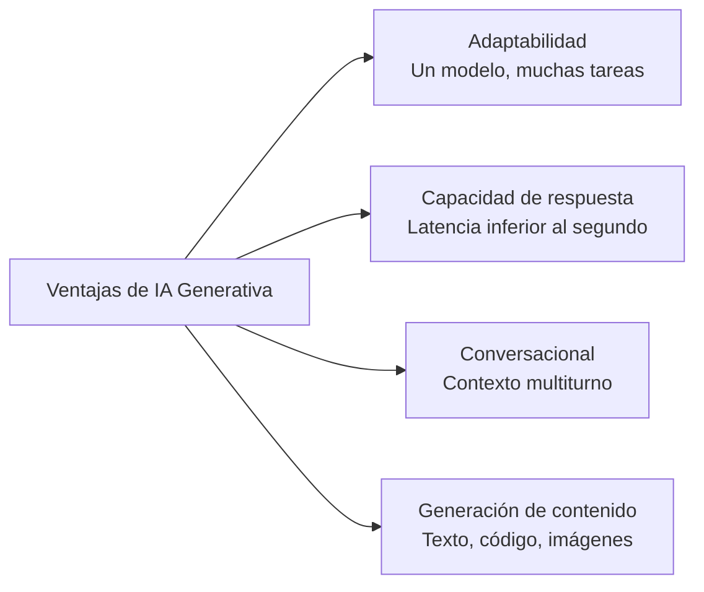
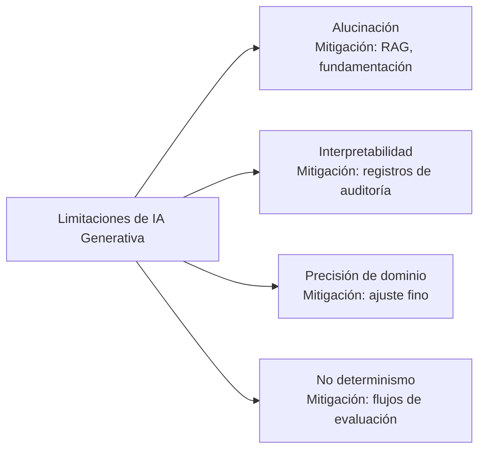
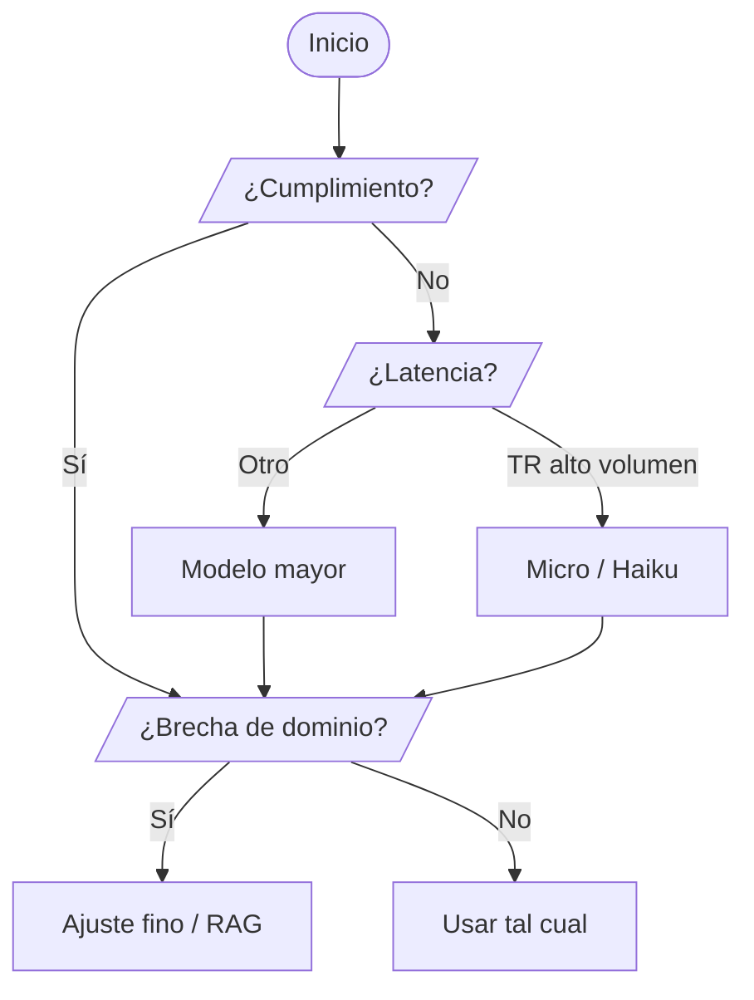
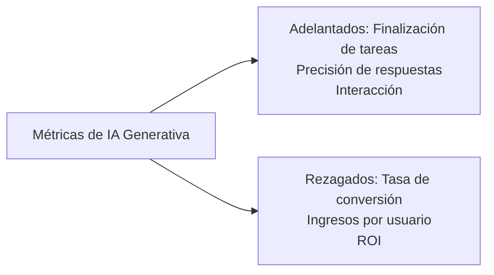

## Enunciado de Tarea 2.2: Comprender las capacidades y limitaciones de la IA generativa para resolver problemas empresariales

La IA generativa puede producir contenido, mantener conversaciones extendidas y adaptarse a tareas que los sistemas clásicos de aprendizaje automático no pueden manejar sin un reentrenamiento completo. Al mismo tiempo, alucina con autoridad, cambia su respuesta entre ejecuciones y a veces produce sin sentido con confianza en dominios especializados que estaban poco representados en sus datos de entrenamiento. Los profesionales de negocios que pueden articular ambos lados de esta ecuación son los que toman decisiones acertadas sobre cuándo comprometerse con un proyecto de IA generativa, cuándo añadir salvaguardas y cuándo usar una herramienta diferente por completo. Este enunciado de tarea cubre las ventajas, las limitaciones, los criterios de selección de modelos y las métricas que necesita para evaluar el valor empresarial de una aplicación generativa.[^202001]

### 2.2.1 Ventajas de la IA generativa

Los modelos clásicos de aprendizaje automático están construidos para un solo trabajo: un modelo de detección de fraude detecta fraude, un modelo de pronóstico de demanda pronostica demanda. Reentrenar cada modelo para una nueva tarea requiere meses de etiquetado, entrenamiento y validación. La IA generativa rompe esta restricción. Un solo modelo de lenguaje grande puede escribir texto de marketing por la mañana y resumir documentos legales por la tarde, sin ningún reentrenamiento, simplemente recibiendo una indicación diferente. Ese cambio tiene consecuencias prácticas en la forma en que las organizaciones gestionan los proyectos de IA y en la rapidez con que pueden responder a los nuevos requisitos empresariales.

El examen enumera cuatro ventajas principales de la IA generativa: adaptabilidad, capacidad de respuesta, capacidades conversacionales y la capacidad de generar contenido. Cada una aborda una limitación diferente de los sistemas de IA anteriores, y cada una se traduce en un beneficio empresarial concreto.

*Figura 2.2.1: Cuatro ventajas principales de la IA generativa. Cada ventaja se corresponde con una limitación del aprendizaje automático clásico que los modelos generativos superan.*

**La adaptabilidad** es la capacidad de un solo modelo fundacional para manejar una amplia variedad de tareas sin necesidad de reentrenamiento. Un modelo entrenado en un corpus amplio de texto puede redactar correos electrónicos, clasificar sentimientos, extraer entidades nombradas, generar consultas SQL y crear descripciones de productos, todo mediante cambios en las indicaciones. Por ejemplo, un minorista puede usar un solo modelo de **Amazon Bedrock** para generar descripciones de productos para nuevos SKU por la mañana, traducir esas descripciones al francés y al español al mediodía, y resumir reseñas de clientes por la tarde.[^202002] Los ahorros operativos son reales: en lugar de mantener un modelo especializado separado para cada tarea, un único endpoint de API las gestiona todas, y las habilidades que los ingenieros de indicaciones desarrollan para un caso de uso se transfieren directamente a otros.

**La capacidad de respuesta** se refiere a la interacción conversacional de baja latencia que habilitan los modelos generativos. Los flujos de trabajo clásicos de aprendizaje automático por lotes están optimizados para el rendimiento, no para la velocidad; procesan miles de registros pero pueden tardar minutos por ejecución. Las API generativas, por el contrario, devuelven tokens de forma continua en cientos de milisegundos, lo que es suficientemente rápido para las experiencias de usuario interactivas.[^202003] Una aplicación de servicio al cliente que antes requería que un agente humano buscara información puede responder una pregunta en menos de un segundo. Por ejemplo, una compañía de seguros que despliega un chatbot de consultas sobre pólizas impulsado por Amazon Bedrock puede devolver una respuesta completa a una pregunta de cobertura en aproximadamente el mismo tiempo que le lleva a un humano escribir una respuesta, sin intervención humana.

**Las capacidades conversacionales** representan la capacidad de los modelos generativos para mantener el contexto a lo largo de múltiples turnos de diálogo. A diferencia de un chatbot basado en reglas que olvida el mensaje anterior después de cada respuesta, un modelo de lenguaje grande moderno mantiene el historial completo de la conversación en su *ventana de contexto* y puede referirse a él de forma natural.[^202004] Un usuario puede decir "¿Cuál es la política de reembolso?" seguido de "¿Y si lo compré en oferta?" y el modelo entiende que "lo" se refiere al producto mencionado anteriormente. Esta coherencia multiturno habilita agentes de soporte, asistentes de ventas y herramientas de conocimiento interno que resultan naturales de usar. Por ejemplo, un banco puede desplegar un asistente multiturno de consultas de préstamos que recopila el tipo de empleo, el propósito del préstamo y el rango de ingresos del solicitante a lo largo de varios turnos conversacionales antes de presentar los productos elegibles, un patrón de interacción que requeriría una gestión de estado compleja en un motor de reglas tradicional.

**La capacidad de generar contenido** significa que los modelos generativos producen salidas novedosas en lugar de simplemente clasificar o recuperar contenido existente. Pueden redactar un borrador de entrada de blog, generar una función Python a partir de una descripción, sintetizar una imagen de producto fotorrealista o componer un correo electrónico de cliente adaptado a un ID de pedido y sentimiento específicos.[^202005] Esta propiedad generativa es lo que distingue a los modelos fundacionales de los sistemas de recuperación. Un motor de búsqueda recupera documentos que ya existen; un modelo generativo compone uno nuevo. Por ejemplo, una compañía farmacéutica puede generar un primer borrador de un informe resumido de ensayo clínico a partir de datos estructurados del ensayo, permitiendo que los redactores médicos se centren en la revisión y el refinamiento en lugar de la composición inicial.

### 2.2.2 Desventajas de las soluciones de IA generativa

Cada ventaja de la IA generativa viene emparejada con una limitación que debe entenderse antes de desplegar un sistema ante usuarios reales. El examen identifica específicamente cuatro desventajas: alucinaciones, problemas de interpretabilidad, imprecisión en dominios especializados y no determinismo. Ninguna de estas es una razón para evitar la IA generativa, pero cada una es una razón para incorporar mitigación en cualquier aplicación de producción.

*Figura 2.2.2: Cuatro limitaciones principales de la IA generativa y el enfoque de mitigación para cada una. Reconocer la limitación conduce directamente a seleccionar el control apropiado.*

Las **alucinaciones** son el fenómeno en el que un modelo generativo produce salidas fluidas y gramaticalmente correctas pero factualmente incorrectas, fabricadas o no fundamentadas en ningún documento fuente.[^202006] El modelo no sabe que no sabe; genera la continuación estadísticamente más probable del prompt, que puede incluir nombres inventados, estadísticas falsas o citas inexistentes. Por ejemplo, una herramienta de investigación legal que usa un modelo generativo sin procesar puede producir una cita a un caso que no existe, expresada con el mismo tono seguro que una cita real. La mitigación principal es la *Generación Aumentada por Recuperación (RAG)*, un patrón en el que se requiere que el modelo responda a partir de documentos recuperados en lugar de desde la memoria paramétrica.[^202007] Amazon Bedrock Knowledge Bases implementa este patrón recuperando fragmentos relevantes de un almacén de datos conectado antes de que el modelo genere una respuesta, fundamentando la salida en documentos que pueden verificarse. Los controles adicionales incluyen **Amazon Bedrock Guardrails**, cuya verificación de fundamentación contextual puede detectar y bloquear respuestas que no están respaldadas por los documentos fuente recuperados.[^202008]

Los **problemas de interpretabilidad** surgen porque los modelos de lenguaje grandes son opacos. No existe una manera sencilla de rastrear qué ejemplos de entrenamiento causaron una salida particular, ni de explicar en términos humanos por qué el modelo eligió una palabra en lugar de otra.[^202009] Esta opacidad crea problemas en las industrias reguladas. El sistema de decisión de crédito de un banco debe proporcionar una razón de acción adversa cuando rechaza un préstamo; un modelo generativo de caja negra no puede proporcionar esa explicación en la forma estructurada que exigen los reguladores. La mitigación es reservar la IA generativa para tareas donde la interpretabilidad no es una obligación regulatoria, o añadir una capa de razonamiento que obligue al modelo a citar sus fuentes. **Amazon SageMaker AI** y el conjunto de herramientas de explicabilidad más amplio en AWS pueden exponer pesos de atención y atribuciones a nivel de token, pero estas siguen siendo aproximaciones imperfectas en lugar de explicaciones causales verdaderas.[^202010]

La **imprecisión en dominios especializados sin fundamentación** es una limitación distinta de las alucinaciones. Un modelo puede recordar correctamente hechos generales sobre cardiología pero fallar en preguntas específicas sobre los protocolos clínicos de un hospital, las reglas de codificación de seguros o las interacciones de medicamentos propietarios, porque esos documentos nunca estuvieron en su corpus de entrenamiento.[^202011] La mitigación es el ajuste fino (actualización de los pesos del modelo con datos específicos del dominio) o RAG con una base de conocimiento de dominio curada. El ajuste fino a través de las API de personalización de Amazon Bedrock puede cerrar las brechas de precisión para tareas estrechamente definidas, mientras que una base de conocimiento bien estructurada maneja una recuperación de información más amplia sin el costo y el tiempo de reentrenamiento.[^202012]

El **no determinismo** significa que el modelo puede producir una respuesta diferente cada vez que recibe el mismo prompt, incluso con todas las demás condiciones constantes. Esta propiedad emerge del proceso de muestreo dentro de la mayoría de los modelos generativos: el modelo selecciona el siguiente token de forma probabilística en lugar de determinística, por lo que dos ejecuciones pueden divergir después de solo unos pocos tokens.[^202013] Por ejemplo, un modelo al que se le pide que resuma la misma queja de cliente dos veces puede producir una respuesta que enfatiza el retraso del envío y una segunda que enfatiza la calidad del producto, ambas válidas pero no idénticas. El parámetro de *temperatura* controla cuánta aleatoriedad aplica el modelo durante el muestreo; una temperatura más baja produce una salida más consistente pero menos creativa. La mitigación para el no determinismo son flujos de trabajo de evaluación rigurosos que comparan las salidas en muchas muestras y la revisión humana de los casos extremos antes del despliegue. Las capacidades de evaluación de modelos de Amazon Bedrock admiten la puntuación automatizada en conjuntos de prueba para detectar varianza inesperada.[^202014]

*Tabla 2.2.1: Desventajas de la IA generativa, causa raíz, riesgo empresarial y mitigación principal*

| Desventaja | Causa raíz | Riesgo empresarial | Mitigación principal |
|---|---|---|---|
| Alucinaciones | Generación paramétrica sin fundamentación | Información falsa presentada como hecho | RAG, Amazon Bedrock Guardrails |
| Interpretabilidad | Pesos de red neuronal opacos | Incumplimiento normativo | Reservar para tareas no reguladas; registro de auditoría |
| Imprecisión de dominio | Datos de dominio faltantes en el corpus de entrenamiento | Respuestas incorrectas en flujos de trabajo especializados | Ajuste fino, bases de conocimiento de dominio |
| No determinismo | Muestreo probabilístico de tokens | Salida inconsistente para tareas de cumplimiento | Flujos de evaluación, ajuste de temperatura |

### 2.2.3 Factores en la selección de modelos de IA generativa

Seleccionar un modelo de IA generativa para una aplicación empresarial no es principalmente una decisión técnica; es una decisión de compensaciones. Los diferentes modelos tienen un rendimiento diferente en distintas tareas, llevan estructuras de costos diferentes, admiten diferentes tamaños de ventana de contexto y vienen con diferentes posiciones de cumplimiento. El examen espera que razone a través de ocho factores: tipos de modelo, requisitos de rendimiento, capacidades, restricciones, cumplimiento, costo, latencia y complejidad del modelo. La actualización V1.1 añadió explícitamente el costo, la latencia y la complejidad del modelo al objetivo, lo que refleja la realidad práctica de que la mayoría de las decisiones de producción están gobernadas tanto por la economía y la velocidad como por la precisión de los puntos de referencia.

**Amazon Bedrock** es el servicio principal de AWS para acceder a modelos fundacionales de terceros y nativos de Amazon a través de una API unificada, sin gestionar infraestructura.[^202015] Los modelos disponibles a través de Bedrock abarcan una amplia gama de tamaño, capacidad y costo, lo que lo convierte en el punto de referencia natural para cualquier discusión sobre selección de modelos.

*Tabla 2.2.2: Ejemplo de modelos de Amazon Bedrock por nivel de capacidad y criterios de selección*

| Familia de modelos | Modelos representativos | Fortalezas | Latencia típica | Costo relativo | Mejor para |
|---|---|---|---|---|---|
| Amazon Nova | Nova Micro, Nova Lite, Nova Pro, Nova Premier | Sólido en tareas nativas de AWS; multilingüe; multimodal (Pro/Premier) | Micro: muy baja; Premier: moderada | Micro: menor; Premier: moderado | Tareas de bajo costo y alto volumen (Micro); aplicaciones empresariales multimodales (Premier) |
| Anthropic Claude | Claude Haiku 4.x, Sonnet 4.x, Opus 4.x | Ventana de contexto larga (200K estándar, 1M con encabezado beta para Opus y Sonnet); razonamiento; seguimiento de instrucciones | Haiku: baja; Opus: alta | Haiku: bajo; Opus: alto | Soporte al cliente (Haiku); análisis complejo (Opus) |
| Meta Llama | Llama 4 Scout, Llama 4 Maverick | Pesos abiertos; personalizable; ventanas de contexto extendidas (dependiente de la configuración en Bedrock; consulte las fichas del modelo) | Moderada | Bajo a moderado | Ajuste fino personalizado; análisis de documentos largos; inferencia sensible al costo |
| Mistral AI | Mistral 7B, Mixtral 8x7B | Mezcla de expertos eficiente; tareas de código | Baja a moderada | Bajo | Generación de código; herramientas para desarrolladores |

Los ocho factores del objetivo del examen interactúan con este panorama de modelos de la siguiente manera:

Los **tipos de modelo** se refieren a la arquitectura y la modalidad del modelo. Los modelos solo de texto manejan tareas de lenguaje; los modelos multimodales manejan combinaciones de texto, imágenes, video y audio.[^202016] Una aplicación de servicio al cliente que solo procesa texto puede usar un modelo de texto más ligero y económico. Una aplicación de inspección de productos que clasifica imágenes junto con descripciones de texto necesita un modelo multimodal como Amazon Nova Pro.

Los **requisitos de rendimiento** cubren los puntos de referencia de precisión y calidad que demanda un caso de uso. Un generador de textos de marketing puede tolerar cierta variación en la calidad. Un asistente de codificación médica, por el contrario, debe mantener una alta precisión porque los errores de codificación resultan en el rechazo de reclamaciones. Las puntuaciones de referencia como MMLU (Comprensión del Lenguaje Multitarea Masiva) y HumanEval ofrecen un punto de partida, pero la señal de rendimiento más confiable es la evaluación en su propio conjunto de prueba específico de la tarea.[^202017]

Las **capacidades** se refieren a características específicas que debe tener un modelo: uso de herramientas (llamada a funciones), generación de código, salida estructurada (modo JSON) o ventanas de contexto extendidas. Por ejemplo, una aplicación que debe llamar a API externas durante el razonamiento requiere un modelo que admita la llamada a funciones, que no todos los modelos implementan.[^202018]

Las **restricciones** cubren las limitaciones organizacionales, incluidos los requisitos de residencia de datos, las listas de proveedores aprobados y las restricciones de tamaño de modelo para el despliegue en dispositivos. Las opciones de inferencia entre regiones y de rendimiento aprovisionado de Amazon Bedrock permiten a los arquitectos trabajar dentro de las restricciones de residencia de datos mientras mantienen la disponibilidad.[^202019]

El **cumplimiento** cubre los requisitos regulatorios y del sector. Las aplicaciones de atención médica regidas por HIPAA deben usar modelos desplegados dentro de un límite de servicio elegible para HIPAA. Las aplicaciones financieras pueden enfrentar restricciones en la salida de datos que excluyen a ciertos proveedores de modelos externos. Los servicios de AWS con soporte de Acuerdo de Socio Comercial (BAA) restringen la lista de modelos elegibles para los casos de uso en atención médica.[^202020]

El **costo** es cada vez más el factor decisivo en los despliegues maduros. El precio basado en tokens significa que el costo por inferencia crece con la longitud del contexto: los prompts del sistema más largos, los ejemplos de pocos disparos y los fragmentos recuperados de gran tamaño aumentan el recuento de tokens y por tanto la factura.[^202021] Amazon Nova Micro está diseñado para tareas de texto de alto volumen y bajo costo donde la asequibilidad es la restricción principal. Para un millón de llamadas a la API por día, la diferencia entre un modelo de nivel Micro y uno de nivel Premier puede ascender a decenas de miles de dólares al mes.

La **latencia** determina si un modelo es adecuado para aplicaciones interactivas en tiempo real. Un modelo que tarda dos segundos en responder es aceptable para un flujo de trabajo de procesamiento de documentos por lotes pero inaceptable para un widget de chat en vivo de clientes donde los usuarios esperan respuestas en unos pocos cientos de milisegundos.[^202022] Amazon Nova Micro apunta al nivel de latencia más baja en la familia Amazon Nova. El rendimiento aprovisionado en Amazon Bedrock puede reducir la varianza de latencia para las cargas de trabajo de producción sensibles a la latencia.

La **complejidad del modelo** se refiere al recuento de parámetros, la profundidad de la arquitectura y el tamaño de la ventana de contexto que puede mantener un modelo. Los modelos más complejos generalmente tienen un mejor rendimiento en tareas matizadas pero son más lentos y más costosos por token.[^202023] Un modelo de 7.000 millones de parámetros puede manejar la resumización sencilla de manera adecuada, mientras que un modelo de 200.000 millones de parámetros puede ser necesario para el razonamiento de múltiples pasos en un documento legal de 100.000 tokens. Adaptar la complejidad a la dificultad real de la tarea mantiene los costos manejables sin sacrificar la calidad.

*Figura 2.2.3: Flujo de decisión para la selección de modelos de IA generativa. El cumplimiento, la latencia, el volumen y las brechas de precisión de dominio filtran cada uno el conjunto de modelos viables en secuencia; el mismo flujo se aplica independientemente de si el modelo subyacente es Amazon Nova, Anthropic Claude, Meta Llama o Mistral.*

### 2.2.4 Valor empresarial y métricas para las aplicaciones de IA generativa

Adoptar IA generativa es una inversión empresarial, y toda inversión debe evaluarse frente a resultados medibles. El objetivo del examen enumera siete métricas: rendimiento entre dominios, ROI, eficiencia, tasa de conversión, ingresos promedio por usuario, precisión y valor de vida del cliente. Estas métricas se dividen en dos grupos naturales. Los *indicadores adelantados* son observables al principio de un despliegue, a menudo en semanas: tasa de finalización de tareas, volumen de interacción, precisión de respuestas en conjuntos de prueba. Los *indicadores rezagados* tardan más en materializarse porque dependen del comportamiento posterior del cliente: ingresos por usuario, valor de vida del cliente, tasa de abandono. Un programa de medición de IA maduro rastrea ambos, usando indicadores adelantados para ajustar el sistema antes de que los indicadores rezagados confirmen el impacto empresarial.

*Figura 2.2.4: Indicadores adelantados y rezagados para el valor empresarial de la IA generativa. Los indicadores adelantados señalan la salud del sistema; los indicadores rezagados confirman que la salud del sistema se traduce en resultados financieros.*

El **rendimiento entre dominios** mide qué tan bien mantiene la calidad un modelo generativo cuando se aplica en múltiples funciones empresariales.[^202024] Un modelo que funciona excelentemente en soporte al cliente pero deficientemente en consultas internas de RR.HH. puede necesitar estrategias de indicaciones separadas o variantes ajustadas por separado para cada dominio. Por ejemplo, una empresa de logística que prueba un solo modelo fundacional en el seguimiento de envíos, la asistencia en la negociación con transportistas y la documentación de aduanas descubre que las puntuaciones de precisión entre dominios revelan qué dominios necesitan fundamentación adicional antes del despliegue completo.

El **ROI** (retorno sobre la inversión) cuantifica el retorno financiero sobre el costo de construir y ejecutar una aplicación de IA generativa frente al valor que genera.[^202025] El cálculo compara los ahorros operativos (menos agentes humanos, procesamiento de documentos más rápido, menores costos de corrección de errores) y las ganancias de ingresos (mayor conversión, nuevas capacidades de producto) frente a los costos de inferencia del modelo, el trabajo de desarrollo y la carga de evaluación continua. Un asistente de centro de contacto que desvía el 40% de las consultas de primer nivel a la automatización produce un ROI medible a medida que la tasa de desvío escala, porque cada llamada desviada elimina una unidad de costo laboral. El ROI fue añadido explícitamente al objetivo del examen en la versión V1.1, lo que refleja que se espera que las partes interesadas empresariales evalúen los proyectos de IA con el mismo rigor financiero que aplican a cualquier otra inversión tecnológica.

La **eficiencia** captura qué tan más rápido o más económico se ejecuta un proceso con IA generativa en comparación con la línea base.[^202026] Las métricas de eficiencia incluyen el tiempo por tarea (cuánto tiempo le lleva a un analista completar un informe de investigación con asistencia de IA frente a sin ella), el rendimiento (cuántos tickets de soporte procesa el sistema por hora) y el costo por unidad (el costo en tokens de generar una descripción de producto en comparación con el costo laboral de un redactor que produce el mismo elemento). Por ejemplo, una firma legal que usa IA generativa para producir borradores de resúmenes de contratos reduce el tiempo promedio de los abogados en cada contrato de 45 minutos a 8 minutos, una proporción de eficiencia documentada que justifica el costo de la plataforma.

La **tasa de conversión** mide el porcentaje de prospectos o usuarios que completan una acción deseada, como finalizar una compra, enviar una solicitud de préstamo o reservar una cita de servicio.[^202027] La IA generativa afecta a la conversión personalizando el contenido que los usuarios ven en los momentos clave de decisión. Un motor de recomendación que genera textos promocionales personalizados para cada visitante, en lugar de mostrar el mismo banner a todos, puede elevar las tasas de conversión de manera mensurable. Por ejemplo, una plataforma de comercio electrónico que usa un modelo de Amazon Bedrock para generar descripciones de productos dinámicas adaptadas al historial de navegación de un visitante informa una tasa de agregar al carrito más alta que el grupo de control que recibe descripciones estáticas.

Los **ingresos promedio por usuario (ARPU)** miden los ingresos totales divididos por el número de usuarios activos durante un período.[^202028] La IA generativa puede aumentar el ARPU al presentar oportunidades de venta adicional dentro de una conversación (un chatbot que detecta que un usuario pregunta sobre un producto de nivel básico y menciona naturalmente la opción premium), al reducir el abandono del servicio o al generar ofertas personalizadas que coincidan con los patrones de compra individuales. Por ejemplo, un servicio de streaming que usa IA generativa para personalizar las recomendaciones de contenido y componer campañas de correo electrónico específicas para suscriptores informa un ARPU más alto en el grupo de tratamiento en relación con el grupo de control que recibe mensajes genéricos.

La **precisión** en el contexto empresarial significa la proporción de salidas de IA generativa que son correctas y completas para poder usarse sin corrección humana.[^202029] La precisión se mide frente a un conjunto de evaluación etiquetado específico de la tarea. Un modelo que responde correctamente 95 de 100 preguntas de prueba tiene una precisión del 95% en ese conjunto de prueba. La precisión es la métrica de calidad más directa para los casos de uso donde los errores tienen costos, como la codificación médica, los informes de cumplimiento financiero o la extracción automatizada de cláusulas legales. Las capacidades de evaluación de modelos de Amazon Bedrock permiten a los equipos ejecutar evaluaciones de precisión automatizadas frente a conjuntos de referencia específicos de la tarea antes y después de cambios en el modelo o en las indicaciones.[^202030]

El **valor de vida del cliente (CLV)** es el ingreso neto total que una empresa espera de una relación con un cliente durante toda su duración.[^202031] La IA generativa afecta al CLV mejorando la retención (los clientes que reciben un mejor soporte permanecen más tiempo), ampliando el alcance de los servicios que un cliente utiliza (un asistente personalizado presenta productos que el cliente no sabía que existían) y reduciendo el abandono a través de la interacción proactiva. El CLV es un indicador rezagado; normalmente tarda trimestres en observarse. Por ejemplo, una institución financiera que despliega un chatbot de asesoramiento de IA generativa ve las métricas iniciales de precisión e interacción en semanas, pero la mejora del CLV solo se hace visible después de seis a doce meses cuando la cohorte de clientes asistidos por IA muestra una menor deserción que la línea base histórica.

*Tabla 2.2.3: Métricas empresariales de IA generativa: tipo, enfoque de medición y ejemplo empresarial*

| Métrica | Tipo de indicador | Cómo se mide | Ejemplo empresarial |
|---|---|---|---|
| Rendimiento entre dominios | Adelantado | Puntuación de precisión por dominio en conjuntos de prueba reservados | Modelo logístico probado en tres áreas funcionales antes del lanzamiento |
| ROI | Rezagado | (Ahorro de costos + ganancia de ingresos) / inversión total | Tasa de desvío del centro de contacto multiplicada por el costo laboral promedio por ticket |
| Eficiencia | Adelantado | Tiempo por tarea o costo por unidad antes vs. después de la IA | Tiempo de resumen de contrato reducido de 45 a 8 minutos |
| Tasa de conversión | Rezagado | Acciones completadas / oportunidades totales | Tasa de agregar al carrito más alta para descripciones generadas por IA vs. estáticas |
| Ingresos promedio por usuario | Rezagado | Ingresos totales / usuarios activos por período | Aumento del ARPU del servicio de streaming por campañas personalizadas |
| Precisión | Adelantado | Salidas correctas / total de salidas en el conjunto de evaluación | 95% de precisión en un benchmark de codificación de 100 preguntas |
| Valor de vida del cliente | Rezagado | Ingresos netos proyectados durante la duración de la relación | Menor deserción en la cohorte asistida por IA después de 12 meses |

Un programa de medición práctico no espera a los indicadores rezagados antes de actuar. La secuencia es: desplegar con indicadores adelantados instrumentados desde el primer día, ajustar el modelo y las indicaciones hasta que los indicadores adelantados alcancen el objetivo, luego esperar a que los indicadores rezagados confirmen que la mejora operativa se convierte en valor financiero. Las métricas de **Amazon CloudWatch** y los paneles personalizados en AWS pueden rastrear la latencia de inferencia, las tasas de error y los recuentos de invocaciones del modelo como indicadores adelantados operativos, mientras que las herramientas de inteligencia empresarial rastrean las métricas de ingresos y retención de clientes posteriores.[^202032]

---

## Preguntas de autoevaluación

**Pregunta 1**

Una empresa minorista despliega un generador de descripciones de productos de IA generativa. Durante la revisión de calidad, el equipo nota que el modelo ocasionalmente inventa atributos nutricionales para productos alimenticios que no están incluidos en los datos fuente. ¿Cuál desventaja de la IA generativa describe MEJOR este comportamiento, y qué mitigación debe implementar el equipo PRIMERO?

A. No determinismo; reducir la temperatura del modelo para disminuir la varianza de la salida.
B. Alucinación; implementar la Generación Aumentada por Recuperación para fundamentar las respuestas en el catálogo de productos.
C. Interpretabilidad; añadir registro de auditoría para que los revisores puedan rastrear qué datos de entrenamiento influyeron en la respuesta.
D. Imprecisión de dominio; ajustar fino el modelo en un conjunto de datos curado de productos alimenticios.

La alucinación es el fenómeno en el que un modelo generativo produce una salida fluida y confiada que no está fundamentada en material fuente factual. El proceso de predicción del siguiente token estadístico del modelo puede producir hechos nutricionales plausibles que no aparecen en ningún lugar del catálogo de productos. Esto es distinto de la imprecisión de dominio (que se trata de una falta de conocimiento especializado en el corpus de entrenamiento) porque el modelo no está simplemente desinformado; está inventando contenido activamente. La reducción de temperatura (respuesta A) reduce la varianza en el estilo de salida pero no impide que el modelo fabrique hechos. Las herramientas de interpretabilidad (respuesta C) ayudan a rastrear las salidas pero no detienen las alucinaciones. El ajuste fino (respuesta D) ajusta los pesos del modelo y puede ayudar con la imprecisión de dominio, pero para un problema de fundamentación factual específica del catálogo, RAG es más rápido de implementar y más específico: el modelo está limitado a generar respuestas a partir de registros de productos recuperados en lugar de desde la memoria paramétrica. Amazon Bedrock Knowledge Bases proporciona una implementación de RAG gestionada que conecta el modelo a un catálogo de productos consultable, asegurando que cada atributo en la descripción generada pueda rastrearse hasta un documento fuente.[^202033]

**Pregunta 2**

Una empresa está eligiendo entre Amazon Nova Micro y Amazon Nova Premier para un chatbot de soporte al cliente de alto volumen que debe responder en menos de 500 milisegundos y procesar aproximadamente dos millones de interacciones por día. ¿Qué factor impulsa MÁS directamente la recomendación de usar Nova Micro en lugar de Nova Premier para esta carga de trabajo?

A. Los requisitos de cumplimiento restringen el uso de modelos más grandes en aplicaciones orientadas al cliente.
B. Nova Premier tiene una ventana de contexto más pequeña y no puede contener el historial de conversación multiturno.
C. La latencia y el costo hacen que Nova Micro sea la opción adecuada para cargas de trabajo de alto volumen, sensibles a la latencia y al costo.
D. Nova Micro admite entrada multimodal, lo que lo hace más adecuado para las aplicaciones de chat.

La pregunta describe una carga de trabajo donde hay dos restricciones prominentes: un límite de latencia de 500 milisegundos y un volumen de dos millones de interacciones diarias. Ambas restricciones apuntan en la misma dirección. Nova Micro se posiciona como el nivel de latencia más baja y menor costo en la familia Amazon Nova, diseñado precisamente para tareas de alto volumen donde la asequibilidad y la velocidad son los requisitos principales. Nova Premier es la opción más capaz pero también la más costosa y de mayor latencia en la familia, apropiada para tareas de razonamiento complejas de múltiples pasos en lugar de soporte conversacional de alto volumen. La respuesta A introduce una justificación de cumplimiento que no se establece en el escenario. La respuesta B es factualmente incorrecta en ambos aspectos: Nova Premier tiene una ventana de contexto más grande que Nova Micro, y cualquier modelo de Bedrock puede mantener el historial de conversación multiturno hasta su límite de ventana de contexto, por lo que la capacidad conversacional no está condicionada al nivel. La respuesta D es incorrecta porque la entrada multimodal es una capacidad de Nova Pro y Nova Premier, no de Nova Micro. La respuesta correcta es C: el requisito de latencia (menos de 500 ms) y el volumen (dos millones de llamadas por día) hacen que el costo y la latencia sean los factores dominantes de selección del modelo, y Nova Micro es el nivel diseñado para esa combinación.[^202034]

**Pregunta 3**

Un equipo de IA empresarial presenta un caso de negocio para una solución de procesamiento de documentos con IA generativa. El director financiero pregunta cómo el equipo demostrará valor financiero en los primeros 90 días del despliegue. ¿Qué métrica es MÁS apropiada para demostrar impacto financiero temprano?

A. Valor de vida del cliente, medido como el cambio en el CLV proyectado para la cohorte de usuarios.
B. Eficiencia, medida como tiempo por documento y costo por documento en comparación con la línea base manual.
C. Tasa de conversión, medida como el porcentaje de documentos que generan una venta de seguimiento.
D. Ingresos promedio por usuario, medidos durante el primer ciclo de facturación después del despliegue.

El valor de vida del cliente y los ingresos promedio por usuario son indicadores rezagados que normalmente requieren meses o trimestres de observación antes de que sea visible un cambio estadísticamente significativo. En los primeros 90 días, ninguna de las métricas habrá acumulado suficientes datos para demostrar una conclusión defendible. La tasa de conversión es una métrica plausible para una aplicación orientada a las ventas, pero el procesamiento de documentos es un flujo de trabajo operativo interno, no un embudo de ventas orientado al cliente, lo que hace que la tasa de conversión sea un encaje incómodo. La eficiencia es la métrica natural de los 90 días para un proyecto de automatización operativa: el equipo puede medir cuánto tiempo les llevó a los analistas procesar un documento antes de que el sistema de IA estuviera en funcionamiento, medir la misma tarea con asistencia de IA y calcular el ahorro de tiempo y la reducción del costo laboral inmediatamente después de la puesta en marcha. El director financiero recibe un número concreto (por ejemplo, "el tiempo promedio de procesamiento de documentos cayó de 42 minutos a 9 minutos, ahorrando aproximadamente 330 horas de analistas por semana al volumen de documentos actual") que se traduce directamente en dólares sin requerir datos longitudinales de clientes.[^202035]

**Pregunta 4**

Una empresa de tecnología de atención médica está evaluando modelos de IA generativa para un asistente de documentación clínica. La solución debe operar dentro de un límite de servicio elegible para HIPAA y debe citar la oración fuente del registro del paciente para cada afirmación que realice en un resumen generado. ¿Cuáles DOS factores de selección de modelo son MÁS relevantes para esta evaluación?

A. Complejidad del modelo y tasa de conversión.
B. Cumplimiento y capacidades.
C. Latencia e ingresos promedio por usuario.
D. Costo y rendimiento entre dominios.

El escenario presenta dos requisitos distintos. El primero es regulatorio: la solución debe operar dentro de los límites elegibles para HIPAA, lo que es un factor de cumplimiento que limita directamente el conjunto de modelos y configuraciones de despliegue elegibles. No todos los modelos disponibles a través de Amazon Bedrock son accesibles dentro de una configuración elegible para HIPAA, por lo que el cumplimiento es un criterio de acceso que debe resolverse antes de evaluar cualquier otro factor. El segundo requisito es que el modelo debe citar las oraciones fuente, lo que es un requisito de capacidades: el modelo debe admitir un mecanismo de cita o atribución de fuentes, ya sea de forma nativa a través de salida estructurada o a través de una arquitectura RAG que devuelva referencias de fuente junto con el texto generado. La tasa de conversión (respuesta A) y los ingresos promedio por usuario (respuesta C) son métricas de resultados empresariales, no criterios de selección de modelos. El costo y el rendimiento entre dominios (respuesta D) importan en cualquier despliegue pero no son los factores MÁS relevantes dados los requisitos explícitos de HIPAA y citación establecidos en el escenario. La respuesta correcta es B.[^202036]

**Pregunta 5**

Un equipo de producto despliega un asistente de IA generativa y nota que la misma pregunta de soporte a veces recibe una respuesta que enfatiza una ruta de resolución y a veces una ruta de resolución diferente, aunque ambas respuestas son técnicamente correctas. El equipo quiere comprender qué propiedad de la IA generativa explica MEJOR este comportamiento antes de decidir sobre una mitigación.

A. Alucinación, porque el modelo está generando contenido que no aparece en la base de conocimiento.
B. Problemas de interpretabilidad, porque el modelo no puede explicar por qué eligió una ruta de resolución en lugar de otra.
C. No determinismo, porque el modelo muestrea probabilísticamente de una distribución de tokens probables en cada paso.
D. Imprecisión de dominio, porque el modelo no fue entrenado en los escenarios de soporte específicos.

El escenario describe una situación en la que ambas salidas son técnicamente correctas pero diferentes. Esta es la característica definitoria del no determinismo: el proceso de muestreo del modelo introduce variabilidad entre ejecuciones incluso cuando ambas salidas son válidas. La alucinación (respuesta A) implica que el modelo genera contenido factualmente incorrecto; el escenario establece explícitamente que ambas respuestas son correctas. La interpretabilidad (respuesta B) trata de la incapacidad de explicar las decisiones del modelo, no de la variabilidad de la salida entre ejecuciones. La imprecisión de dominio (respuesta D) se manifestaría como respuestas incorrectas o incompletas, no como dos respuestas correctas diferentes. La mitigación para el no determinismo en un contexto de soporte depende del requisito empresarial. Si la consistencia es obligatoria (por ejemplo, en asesoramiento financiero regulado), el equipo puede reducir el parámetro de temperatura para disminuir la varianza del muestreo y puede añadir un flujo de evaluación que marque los prompts de alta varianza para revisión humana. El registro de invocaciones del modelo de Amazon Bedrock captura cada solicitud y respuesta, lo que permite al equipo auditar la varianza entre ejecuciones e identificar qué tipos de preguntas producen las salidas más divergentes.[^202037]

---

[^202001]: AWS Certification Exam Guide AIF-C01 v1.1, Task Statement 2.2. URL: <https://docs.aws.amazon.com/aws-certification/latest/ai-practitioner-01/ai-practitioner-01-domain2.html>
[^202002]: Amazon Bedrock User Guide: Supported foundation models. URL: <https://docs.aws.amazon.com/bedrock/latest/userguide/models-supported.html>
[^202003]: Amazon Bedrock User Guide: Invoke a model to run inference. URL: <https://docs.aws.amazon.com/bedrock/latest/userguide/inference.html>
[^202004]: Amazon Bedrock User Guide: Conversation history and context windows. URL: <https://docs.aws.amazon.com/bedrock/latest/userguide/conversation-inference.html>
[^202005]: Amazon Bedrock User Guide: Content generation with foundation models. URL: <https://docs.aws.amazon.com/bedrock/latest/userguide/what-is-bedrock.html>
[^202006]: NIST AI 600-1: Artificial Intelligence Risk Management Framework: Generative AI. URL: <https://nvlpubs.nist.gov/nistpubs/ai/nist.ai.600-1.pdf>
[^202007]: Amazon Bedrock User Guide: Knowledge Bases for Amazon Bedrock. URL: <https://docs.aws.amazon.com/bedrock/latest/userguide/knowledge-base.html>
[^202008]: Amazon Bedrock User Guide: Amazon Bedrock Guardrails. URL: <https://docs.aws.amazon.com/bedrock/latest/userguide/guardrails.html>
[^202009]: AWS Machine Learning Blog: Explainability in large language models. URL: <https://aws.amazon.com/blogs/machine-learning/>
[^202010]: Amazon SageMaker AI Developer Guide: Amazon SageMaker Clarify. URL: <https://docs.aws.amazon.com/sagemaker/latest/dg/clarify-model-explainability.html>
[^202011]: Amazon Bedrock User Guide: Custom model fine-tuning. URL: <https://docs.aws.amazon.com/bedrock/latest/userguide/custom-models.html>
[^202012]: Amazon Bedrock User Guide: Fine-tuning and continued pre-training. URL: <https://docs.aws.amazon.com/bedrock/latest/userguide/custom-models.html>
[^202013]: Hugging Face Documentation: Text generation and sampling strategies. URL: <https://huggingface.co/docs/transformers/generation_strategies>
[^202014]: Amazon Bedrock User Guide: Model evaluation in Amazon Bedrock. URL: <https://docs.aws.amazon.com/bedrock/latest/userguide/model-evaluation.html>
[^202015]: Amazon Bedrock User Guide: What is Amazon Bedrock? URL: <https://docs.aws.amazon.com/bedrock/latest/userguide/what-is-bedrock.html>
[^202016]: Amazon Nova User Guide: Amazon Nova model capabilities. URL: <https://docs.aws.amazon.com/nova/latest/userguide/what-is-nova.html>
[^202017]: Papers With Code: MMLU Benchmark. URL: <https://paperswithcode.com/dataset/mmlu>
[^202018]: Amazon Bedrock User Guide: Tool use (function calling) with Amazon Bedrock. URL: <https://docs.aws.amazon.com/bedrock/latest/userguide/tool-use.html>
[^202019]: Amazon Bedrock User Guide: Cross-region inference. URL: <https://docs.aws.amazon.com/bedrock/latest/userguide/inference-profiles-cross-region.html>
[^202020]: AWS Compliance: HIPAA Eligible Services. URL: <https://aws.amazon.com/compliance/hipaa-eligible-services-reference/>
[^202021]: Amazon Bedrock Pricing. URL: <https://aws.amazon.com/bedrock/pricing/>
[^202022]: Amazon Bedrock User Guide: Provisioned throughput. URL: <https://docs.aws.amazon.com/bedrock/latest/userguide/prov-throughput.html>
[^202023]: Amazon Nova User Guide: Choosing the right Amazon Nova model. URL: <https://docs.aws.amazon.com/nova/latest/userguide/nova-pro-overview.html>
[^202024]: AWS Well-Architected Framework: Machine Learning Lens: Performance pillar. URL: <https://docs.aws.amazon.com/wellarchitected/latest/machine-learning-lens/performance-pillar.html>
[^202025]: AWS Executive Insights: Measuring ROI for generative AI. URL: <https://aws.amazon.com/executive-insights/content/calculating-roi-of-generative-ai/>
[^202026]: McKinsey Global Institute: The economic potential of generative AI. URL: <https://www.mckinsey.com/capabilities/mckinsey-digital/our-insights/the-economic-potential-of-generative-ai>
[^202027]: Amazon Personalize Developer Guide: Measuring recommendation effectiveness. URL: <https://docs.aws.amazon.com/personalize/latest/dg/getting-started.html>
[^202028]: AWS Retail Competency: AI-driven personalization and ARPU. URL: <https://aws.amazon.com/retail/>
[^202029]: Amazon Bedrock User Guide: Evaluate model accuracy with model evaluations. URL: <https://docs.aws.amazon.com/bedrock/latest/userguide/model-evaluation.html>
[^202030]: Amazon Bedrock User Guide: Automated model evaluation jobs. URL: <https://docs.aws.amazon.com/bedrock/latest/userguide/model-evaluation-jobs.html>
[^202031]: AWS Customer Experience: Improving customer lifetime value with AI. URL: <https://aws.amazon.com/customer-engagement/>
[^202032]: Amazon CloudWatch User Guide: Metrics, alarms, and dashboards. URL: <https://docs.aws.amazon.com/AmazonCloudWatch/latest/monitoring/working_with_metrics.html>
[^202033]: Amazon Bedrock User Guide: Retrieval Augmented Generation with Knowledge Bases. URL: <https://docs.aws.amazon.com/bedrock/latest/userguide/knowledge-base-overview.html>
[^202034]: Amazon Nova User Guide: Amazon Nova Micro model overview. URL: <https://docs.aws.amazon.com/nova/latest/userguide/nova-micro-overview.html>
[^202035]: AWS Well-Architected Framework: Operational Excellence pillar: measuring improvement. URL: <https://docs.aws.amazon.com/wellarchitected/latest/operational-excellence-pillar/welcome.html>
[^202036]: AWS Compliance: HIPAA and Health Information Portability. URL: <https://aws.amazon.com/compliance/hipaa-compliance/>
[^202037]: Amazon Bedrock User Guide: Model invocation logging. URL: <https://docs.aws.amazon.com/bedrock/latest/userguide/model-invocation-logging.html>
