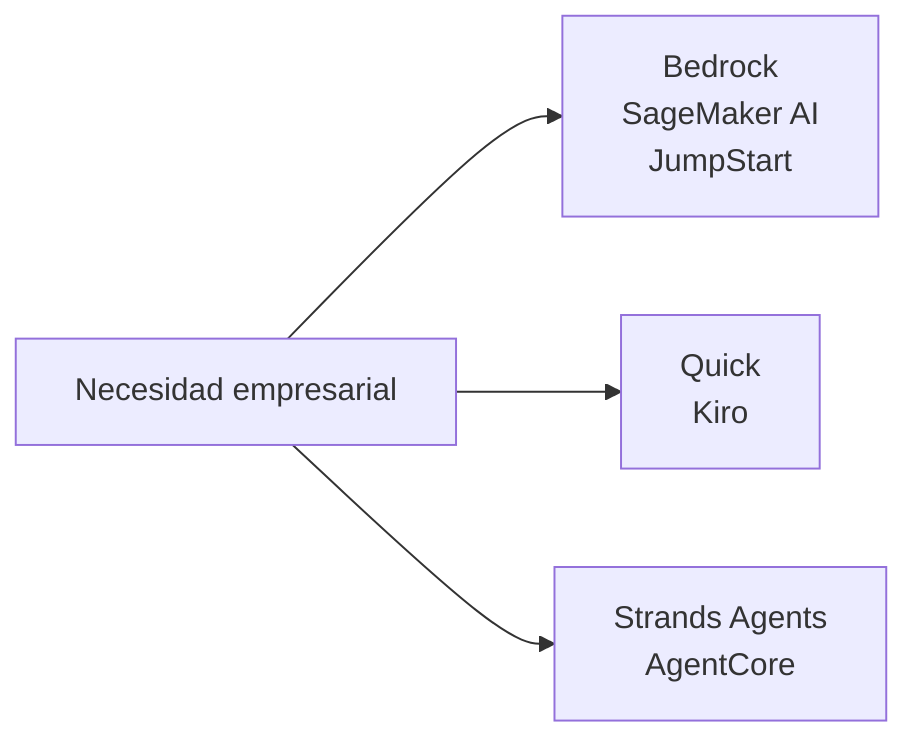
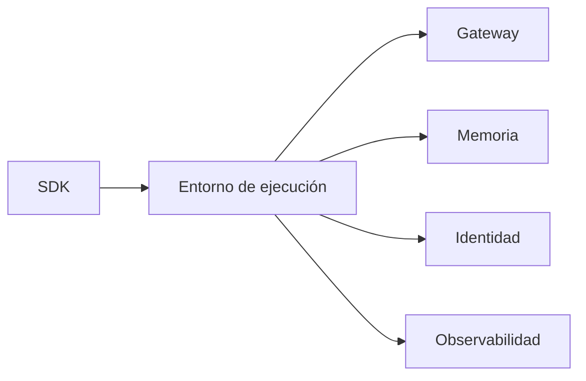
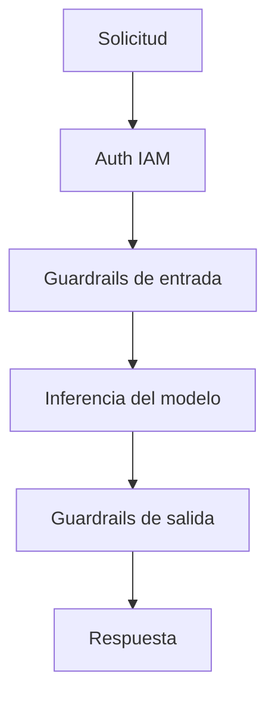
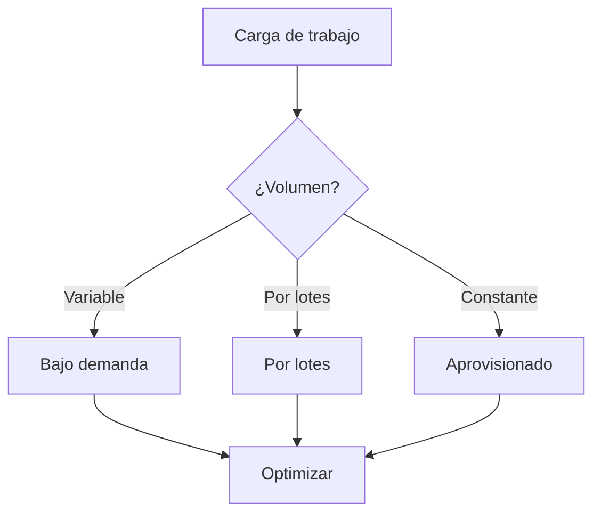
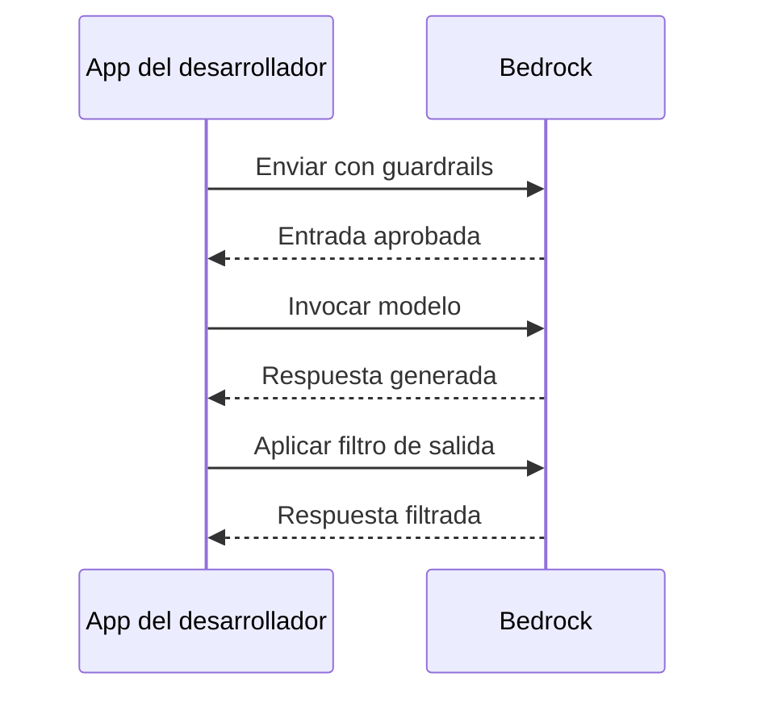

## Enunciado de Tarea 2.3: Describir la infraestructura y las tecnologías de AWS para construir aplicaciones de IA generativa

Construir una aplicación de IA generativa en AWS requiere elegir entre un conjunto creciente de servicios gestionados y herramientas para desarrolladores, cada uno apuntando a un punto diferente en el espectro del desarrollo. La Tarea 2.3 cubre cuatro objetivos: los servicios de AWS nombrados en la guía del examen V1.1, las ventajas de usarlos, las propiedades de seguridad y cumplimiento que heredan de AWS, y las decisiones de costo que enfrentan los equipos en producción.[^203001]

*Figura 2.3.1: Tres puntos de entrada para el trabajo de IA generativa en AWS. La familia Bedrock y SageMaker cubre las API de modelos gestionados y el entrenamiento personalizado, Quick y Kiro cubren los asistentes empresariales y para desarrolladores, y Strands Agents y AgentCore cubren los marcos de agentes y los entornos de ejecución.*

Los servicios de este enunciado de tarea no compiten entre sí en una sola dimensión. Un equipo podría usar **Amazon Bedrock** como su API de modelos, desplegar esa aplicación a través de **Amazon Bedrock AgentCore**, automatizar el trabajo de desarrollo dentro de **Kiro** y consultar datos empresariales a través de **Amazon Quick**, todo dentro del mismo proyecto. Las secciones que siguen explican cada servicio, las ventajas combinadas de usar la plataforma de AWS, la infraestructura de seguridad y cumplimiento subyacente, y la mecánica de precios que determina el costo total de propiedad.

### 2.3.1 Servicios y características de AWS para aplicaciones de IA generativa

La guía del examen AWS V1.1 nombra siete servicios y familias de herramientas para construir aplicaciones de IA generativa: Amazon Bedrock, Amazon SageMaker AI, Amazon SageMaker JumpStart, Amazon Quick, Kiro, Strands Agents y Amazon Bedrock AgentCore.[^203002] Cada uno ocupa un nicho específico, y comprender dónde encaja cada uno evita tanto la sobreingenería como la infrainversión en capacidades de plataforma.

**Amazon Bedrock** es un servicio completamente gestionado que proporciona acceso mediante API a un catálogo seleccionado de modelos fundacionales de múltiples proveedores, sin necesidad de aprovisionar ni gestionar ninguna infraestructura de GPU.[^203003] Un equipo llama a un único endpoint, especifica el identificador del modelo y recibe una respuesta generada facturada por token. La infraestructura subyacente, los pesos del modelo y la lógica de escalado son completamente invisibles para el llamante.

El catálogo de modelos disponibles a través de Amazon Bedrock abarca los modelos propios de Amazon, laboratorios de investigación de terceros y opciones de pesos abiertos:

- Los modelos **Amazon Nova** (Nova Micro, Nova Lite, Nova Pro, Nova Premier) son la propia serie de Amazon, que va desde un nivel solo de texto y baja latencia hasta un buque insignia multimodal capaz de procesar imágenes, video y documentos.[^203004]
- **Anthropic Claude** (la generación Claude 4.x: Haiku 4.x, Sonnet 4.x, Opus 4.x) destaca en el razonamiento, la salida estructurada y el análisis de contexto largo. Claude Opus y Sonnet admiten ventanas de contexto de 200.000 tokens de forma predeterminada y un millón de tokens con el encabezado beta 1M-context.[^203005]
- Los modelos **Meta Llama** son modelos de lenguaje grande de pesos abiertos adecuados para tareas de generación de texto, codificación y diálogo.[^203006]
- Los modelos **Mistral AI**, incluido Mixtral, son sólidos en el seguimiento de instrucciones y las tareas multilingües con un consumo eficiente de tokens.[^203007]
- **AI21 Labs Jamba** apunta a la generación de texto empresarial y al procesamiento de contexto largo.[^203008]
- Los modelos **Cohere Command** están optimizados para la recuperación, la clasificación y la búsqueda empresarial.[^203009]
- Los modelos de **Stability AI** manejan tareas de generación de imágenes y multimodales.[^203010]

Más allá del acceso al modelo sin procesar, Amazon Bedrock incluye un conjunto de capacidades para construir aplicaciones de grado de producción. **Knowledge Bases for Amazon Bedrock** gestiona el flujo completo de *generación aumentada por recuperación (RAG)*: ingestión de documentos desde Amazon S3 u otras fuentes, segmentación en fragmentos, generación de representaciones vectoriales, almacenamiento en un almacén vectorial gestionado y recuperación de fragmentos relevantes en el momento de la inferencia.[^203011] **Amazon Bedrock Guardrails** aplica políticas de contenido configurables tanto al prompt de entrada como a la salida del modelo, filtrando categorías dañinas, bloqueando temas denegados, redactando *información de identificación personal (PII)* y ejecutando *comprobaciones de fundamentación contextual* que comparan las respuestas con el material fuente para detectar alucinaciones.[^203012] **Amazon Bedrock Prompt Management** almacena, versiona y comparte plantillas de indicaciones entre un equipo para que las mismas indicaciones optimizadas se usen de manera consistente en producción.[^203013] **Amazon Bedrock Model Evaluation** ejecuta trabajos de evaluación automatizados y evaluados por humanos que puntúan las respuestas del modelo en precisión, robustez, toxicidad y métricas específicas de la tarea, lo que permite a los equipos comparar modelos antes de comprometerse con uno.[^203014] **Agents for Amazon Bedrock** coordina flujos de trabajo agénticos de múltiples pasos permitiendo que el modelo llame a API externas, consulte Knowledge Bases y ejecute funciones de AWS Lambda como *herramientas* dentro de una sesión orquestada.[^203015] **Amazon Bedrock Flows** proporciona un constructor de flujos de trabajo visual para encadenar indicaciones y subagentes en flujos de trabajo estructurados sin escribir código de orquestación.[^203016]

**Amazon SageMaker AI** es la plataforma de aprendizaje automático completa de AWS para equipos que necesitan entrenar, ajustar, evaluar y hospedar sus propios modelos.[^203017] Donde Amazon Bedrock abstrae completamente el modelo, Amazon SageMaker AI expone la pila completa de entrenamiento e inferencia. Un equipo de ciencia de datos usa SageMaker AI para ejecutar trabajos de entrenamiento distribuidos en clústeres de GPU, registrar modelos en el Model Registry de SageMaker, desplegarlos en endpoints de inferencia en tiempo real y monitorear la deriva de datos en producción. Para la IA generativa específicamente, SageMaker AI es el servicio de elección cuando un equipo necesita ajustar fino un modelo fundacional de pesos abiertos con datos propietarios a escala, o cuando los requisitos de latencia o rendimiento de inferencia exigen despliegues de contenedor personalizados en lugar de un endpoint de API compartido.

**Amazon SageMaker JumpStart** es una característica de SageMaker AI que acelera el punto de partida proporcionando un catálogo de modelos preentrenados, plantillas de soluciones y acciones de despliegue con un clic.[^203018] Un profesional puede explorar modelos de Hugging Face, TII (la serie Falcon) y otros proveedores, luego desplegar un modelo elegido en un endpoint privado de SageMaker con unos pocos clics o una sola llamada a la API, sin escribir código de entrenamiento. JumpStart cierra la brecha entre la comodidad de Amazon Bedrock y la flexibilidad completa de los despliegues personalizados de SageMaker AI: el modelo se ejecuta en la infraestructura de su cuenta, usted controla el endpoint y puede ajustar fino más si es necesario.

**Amazon Quick** es la familia unificada de análisis empresariales y asistente de IA orientada a usuarios de negocio de AWS. En 2025, AWS renombró Amazon QuickSight y las partes de Amazon Q orientadas a BI bajo este nombre único, con los clientes existentes de QuickSight migrados al nuevo producto.[^203019] Los usuarios empresariales interactúan con Amazon Quick a través de una interfaz en lenguaje natural para consultar almacenes de datos, generar gráficos, escribir SQL y resumir informes sin involucrar a los equipos de ingeniería. Amazon Quick está estructurado en cuatro niveles: Free, Plus, Professional y Enterprise. El nivel Enterprise se integra con los índices de Amazon Q Business, lo que permite al asistente buscar en bases de conocimiento organizacionales (SharePoint, Confluence, S3 y otros conectores), además de datos tabulares. Para el examen, Amazon Quick es la respuesta correcta a las preguntas sobre cómo habilitar *BI de autoservicio* mejorada por IA generativa para usuarios empresariales, no para desarrolladores.

**Kiro** es el entorno de desarrollo de software con IA de AWS, lanzado con disponibilidad general a finales de 2025.[^203020] Kiro es un fork de Code OSS (la base de código abierto de Visual Studio Code) extendido con un asistente de IA agéntico que se integra directamente en el flujo de trabajo de edición. Reemplaza a Amazon Q Developer como la herramienta principal de desarrollo de IA en el ecosistema de IDE de AWS. Kiro está disponible en cuatro niveles: Free, Pro, Pro+ y Power, con niveles superiores que proporcionan más horas de interacción de agente incluidas y acceso a modelos subyacentes más capaces. La característica distintiva de Kiro es el *desarrollo basado en especificaciones*. Donde la mayoría de los asistentes de codificación de IA sugieren la siguiente línea mientras se escribe, el desarrollo basado en especificaciones pide al desarrollador que primero describa toda la funcionalidad; Kiro entonces escribe un documento de especificación estructurado (requisitos, arquitectura, tareas de implementación) y edita múltiples archivos para implementarla. Para el examen, Kiro es la respuesta correcta a las preguntas sobre la asistencia de IA dentro de un entorno de desarrollo, no sobre el despliegue o el hospedaje de modelos de IA.

**Strands Agents** es un SDK de código abierto de AWS para construir agentes de IA en Python y TypeScript.[^203021] Sigue un diseño de *agente impulsado por modelo*: se define un conjunto de herramientas (funciones Python anotadas con sugerencias de tipo), se las pasa al agente de Strands junto con un prompt del sistema, y el SDK gestiona el ciclo de razonamiento del modelo, selección de herramientas, ejecución de herramientas y síntesis de resultados. Strands Agents es agnóstico al modelo y funciona con Amazon Bedrock, modelos locales y API de modelos de terceros.

La superficie de agentes en AWS tiene tres cosas nombradas que suenan similar y son fáciles de confundir. Agents for Amazon Bedrock (también llamado Amazon Bedrock Agents) es la característica de orquestación original en la consola. AgentCore es el entorno de ejecución de producción más nuevo y desplegable por separado para agentes de grado de producción que pueden construirse con Bedrock Agents, Strands u otros marcos. Strands Agents es el SDK de código abierto que usan los desarrolladores para escribir el código del agente en primer lugar. Para el examen, Strands Agents es el SDK del desarrollador, Bedrock Agents es la característica de orquestación en la consola y AgentCore es la capa de entorno de ejecución de producción.

**Amazon Bedrock AgentCore** es una plataforma de despliegue de agentes de producción lanzada por AWS en 2025 para abordar la brecha entre escribir un agente con un marco como Strands y ejecutar ese agente de manera confiable a escala empresarial.[^203022] AgentCore agrupa las preocupaciones de infraestructura que los equipos de otro modo construirían ellos mismos. Sus componentes incluyen:

- **AgentCore Runtime**: Un entorno de ejecución gestionado que ejecuta el código del agente, gestiona el escalado automático y administra el ciclo de vida de la sesión.[^203023]
- **AgentCore Gateway**: Un servidor MCP (*Protocolo de Contexto del Modelo*) que expone las herramientas y las API empresariales a los agentes a través de una interfaz estandarizada, eliminando la necesidad de escribir integraciones de herramientas personalizadas para cada fuente de datos.[^203024] El Protocolo de Contexto del Modelo es un estándar abierto, propuesto originalmente por Anthropic y ahora adoptado en toda la industria, que permite a los agentes conectarse a herramientas y fuentes de datos sin escribir código de integración personalizado para cada uno.
- **AgentCore Memory**: Un almacén de memoria persistente que retiene el historial de conversación, las preferencias del usuario y los hechos aprendidos entre sesiones, lo que permite a los agentes recordar el contexto entre interacciones.[^203025]
- **AgentCore Identity**: Una capa de autenticación basada en OAuth 2.0 que permite a los agentes autenticarse en servicios de terceros en nombre de los usuarios sin almacenar credenciales de larga duración en el código del agente.[^203026]
- **AgentCore Policy**: Una capa de gobernanza que hace cumplir qué herramientas puede llamar un agente, bajo qué condiciones y a qué datos puede acceder, con soporte para registros de auditoría para las industrias reguladas.[^203027]
- **AgentCore Evaluations**: Un arnés de pruebas automatizado para flujos de trabajo de agentes que mide la tasa de finalización de tareas, la precisión de la selección de herramientas y la calidad de las respuestas en conjuntos de interacción de referencia.[^203028]
- **AgentCore Observability**: Rastreo distribuido y métricas para las sesiones de agentes, integrándose con Amazon CloudWatch para que los operadores puedan diagnosticar fallos en flujos de trabajo de múltiples pasos.[^203029]
- **AgentCore Code Interpreter**: Un entorno de ejecución en espacio aislado que permite a un agente ejecutar código Python generado en tiempo de ejecución, habilitando el análisis de datos, el cálculo matemático y la generación dinámica de informes.[^203030]
- **AgentCore Browser**: Un navegador sin cabeza gestionado que permite a un agente navegar por páginas web, extraer contenido e interactuar con herramientas basadas en web de forma programática.[^203031]

*Tabla 2.3.1: Servicios de IA generativa de AWS mapeados a casos de uso principales*

| Servicio | Usuario principal | Capacidad clave | Caso de uso típico |
|---------|-------------|----------------|-----------------|
| Amazon Bedrock | Desarrollador | API de FM gestionada con RAG, Guardrails, Agents | Chatbots, resumización, preguntas y respuestas sobre documentos |
| Amazon SageMaker AI | Ingeniero de ML | Plataforma completa de entrenamiento y hospedaje | Ajuste fino de modelos personalizados, inferencia por lotes |
| SageMaker JumpStart | Científico de datos | Despliegue de modelos preentrenados con un clic | Creación rápida de prototipos con modelos de pesos abiertos |
| Amazon Quick | Analista de negocios | BI y consultas de datos en lenguaje natural | Análisis de autoservicio, paneles ejecutivos |
| Kiro | Desarrollador de software | IDE agéntico con desarrollo basado en especificaciones | Generación de código, refactorización de múltiples archivos |
| Strands Agents | Desarrollador | SDK de agentes de código abierto (Python/TypeScript) | Flujos de trabajo de agentes personalizados, composición de herramientas |
| Amazon Bedrock AgentCore | Equipo de plataforma | Entorno de ejecución de agentes de producción y herramientas | Despliegue de agentes empresariales, puerta de enlace MCP |

Los límites entre estos servicios son importantes para el examen. Amazon Bedrock es la API de modelos gestionados; Amazon Bedrock AgentCore es el entorno de ejecución de producción para las aplicaciones de agentes. Kiro es la herramienta de IDE; Strands Agents es el marco de codificación que se usa para escribir agentes fuera del IDE. Amazon SageMaker AI es la plataforma completa de aprendizaje automático; SageMaker JumpStart es su acceso directo al catálogo de modelos. Amazon Quick es el asistente de análisis orientado al usuario empresarial, no una herramienta para desarrolladores.

*Figura 2.3.2: Arquitectura de Amazon Bedrock AgentCore. Un agente construido con Strands se despliega en AgentCore Runtime, que coordina todos los componentes de infraestructura de producción, incluyendo acceso a herramientas, memoria, identidad, aplicación de políticas y observabilidad.*

### 2.3.2 Ventajas de usar los servicios de IA generativa de AWS para construir aplicaciones

Las seis ventajas enumeradas en el objetivo 2.3.2 no son afirmaciones de marketing: cada una aborda un punto de fricción específico que las organizaciones encuentran al construir IA generativa fuera de una plataforma de nube gestionada.[^203032]

**La accesibilidad** significa que cualquier desarrollador con una cuenta de AWS y credenciales de IAM puede llamar a un modelo fundacional de clase frontera a través de una API HTTPS estándar en minutos. No hay ningún ciclo de adquisición de hardware, ninguna configuración del controlador CUDA, ninguna descarga de pesos del modelo que pueda abarcar cientos de gigabytes. Un equipo que anteriormente necesitaba personal especializado en infraestructura de ML para evaluar un nuevo modelo ahora puede hacerlo con unas pocas líneas de código. Esto elimina la barrera de evaluación que antes ralentizaba la adopción de IA en las organizaciones sin equipos dedicados de infraestructura de IA.

La **menor barrera de entrada** va más allá del hardware. Usando Amazon Bedrock, un desarrollador no necesita entender la arquitectura de transformer, las estrategias de cuantización o los mecanismos de atención para producir características útiles impulsadas por IA. La API gestionada acepta un prompt de texto simple y devuelve una respuesta de texto simple. Knowledge Bases for Amazon Bedrock elimina la necesidad de entender las bases de datos vectoriales o los flujos de trabajo de representaciones vectoriales. Guardrails elimina la necesidad de construir la moderación de contenido desde cero. El resultado es que la experiencia de dominio necesaria para construir una característica de IA de calidad de producción es la habilidad de desarrollo de interfaz y lógica de negocio, no la habilidad de ingeniería de ML.

La **eficiencia** proviene de la arquitectura de escalado automático de los servicios gestionados. Un único endpoint de API de Amazon Bedrock maneja un puñado de solicitudes por segundo durante un trabajo por lotes nocturno y cientos de solicitudes por segundo durante las horas pico de negocio sin ningún trabajo de planificación de capacidad por parte del equipo de aplicaciones. La misma propiedad se aplica a los endpoints de Amazon SageMaker AI con políticas de escalado automático y a la gestión de sesiones de AgentCore Runtime. Los equipos no pagan por la capacidad de GPU inactiva entre los picos.

La **rentabilidad** en los servicios de IA generativa de AWS sigue un modelo de *pago por token*: los cargos se acumulan solo cuando la inferencia realmente se ejecuta, no cuando los modelos están inactivos. Esto contrasta con el autohospedaje de un modelo en una instancia de GPU dedicada, donde la instancia se ejecuta y acumula cargos las 24 horas del día independientemente del volumen de solicitudes. Para las aplicaciones de volumen bajo a medio, el modelo de API bajo demanda consistentemente cuesta menos que la infraestructura dedicada, y el umbral donde la infraestructura dedicada se vuelve más barata es lo suficientemente alto como para que la mayoría de las aplicaciones empresariales nunca lo alcancen.

La **velocidad de comercialización** es el efecto agregado de los puntos anteriores. Un equipo que evalúa tres modelos, elige uno, construye un flujo de trabajo RAG en Knowledge Bases, añade Guardrails para la política de contenido y despliega a través de AgentCore puede completar todos esos pasos en días o semanas. La construcción equivalente en infraestructura autogestionada, incluyendo la selección de una base de datos vectorial, el aprovisionamiento de instancias de GPU, la escritura de código de orquestación y la construcción de una capa de moderación de contenido, normalmente lleva meses. La brecha es más grande durante la construcción inicial y sigue siendo significativa para las actualizaciones de modelos posteriores, porque cambiar un modelo por otro en Amazon Bedrock requiere solo un cambio de configuración, no una migración de infraestructura.

La **capacidad para cumplir los objetivos empresariales** se refiere a las características de nivel de servicio de la infraestructura gestionada: compromisos de tiempo de actividad garantizados respaldados por los SLA de AWS, certificaciones de cumplimiento que eliminan los bloqueadores para los despliegues en industrias reguladas y cobertura geográfica que permite a las aplicaciones servir a los usuarios en las regiones requeridas sin configurar pilas regionales separadas. Una aplicación construida sobre Amazon Bedrock hereda la arquitectura de disponibilidad de AWS y los límites de rendimiento del modelo, que son lo suficientemente predecibles como para escribirse en los compromisos de capacidad empresarial.

### 2.3.3 Beneficios de la infraestructura de AWS para las aplicaciones de IA generativa

La infraestructura de AWS ofrece cuatro categorías de beneficios a las aplicaciones de IA generativa: seguridad, cumplimiento, responsabilidad y seguridad de contenidos.[^203033] Estos beneficios son propiedades estructurales de la plataforma, no características que deben habilitarse por separado para cada aplicación.

La **seguridad** en el contexto de IA generativa de AWS se construye a partir de las mismas primitivas que el resto de la plataforma de AWS. Los datos enviados a Amazon Bedrock están cifrados en tránsito usando TLS y cifrados en reposo usando **AWS Key Management Service (AWS KMS)**.[^203034] Los prompts y las respuestas de los clientes nunca se usan para entrenar ni mejorar los modelos base subyacentes, lo que significa que los datos propietarios pasados en el momento de la inferencia permanecen privados en la cuenta. El aislamiento de red está disponible a través de la integración con **Amazon VPC**: las organizaciones pueden enrutar las llamadas a la API de Bedrock a través de un endpoint de VPC usando **AWS PrivateLink**, asegurando que el tráfico de inferencia nunca atraviese la Internet pública.[^203035] **AWS Identity and Access Management (IAM)** controla qué identidades, roles y servicios tienen permiso para llamar a qué modelos, con la granularidad de ARN de modelos específicos y acciones específicas de Bedrock como `bedrock:InvokeModel` y `bedrock:InvokeAgent`.[^203036]

Para las aplicaciones de agentes específicamente, Amazon Bedrock AgentCore Identity gestiona la autenticación delegada a servicios de terceros usando tokens OAuth 2.0 gestionados por la plataforma, de modo que el código del agente nunca maneja credenciales sin procesar para sistemas externos. Esta es una mejora de seguridad material sobre los marcos de agentes donde los secretos deben almacenarse en variables de entorno o gestores de secretos y rotarse manualmente.

El **cumplimiento** se aborda a nivel de infraestructura mediante el mismo programa de cumplimiento de AWS que cubre todos los demás servicios de AWS. AWS Artifact proporciona acceso bajo demanda a informes de auditoría de terceros que cubren SOC 1, SOC 2, PCI DSS, ISO 27001 y HIPAA.[^203037] **AWS Audit Manager** automatiza la recopilación de evidencias para los marcos de cumplimiento continuo, y Amazon Bedrock está dentro del alcance de las barreras de gobernanza de AWS Control Tower, lo que significa que las organizaciones que usan Control Tower pueden aplicar políticas de control de servicio para restringir qué cuentas pueden usar qué modelos.[^203038] Para las organizaciones con sede en la UE, los requisitos de residencia de datos se satisfacen seleccionando una región compatible con Bedrock dentro del límite de la UE.

La **responsabilidad** se refiere al modelo de responsabilidad compartida tal como se aplica a los servicios de IA gestionados. Con Amazon Bedrock, AWS es responsable de la seguridad de los pesos del modelo, la infraestructura de GPU subyacente, los endpoints de API y las características gestionadas (Knowledge Bases, Guardrails, Agents). El cliente es responsable de los prompts que envía, los datos que almacena en Knowledge Bases, la configuración de Guardrails que aplica y las políticas de IAM que controlan el acceso.[^203039] Esta división es más favorable para el cliente que el autohospedaje: el cliente retiene el control sobre lo que dice el modelo y a quién, sin poseer la carga operativa del hardware y el software que ejecuta el modelo. AgentCore Policy extiende el modelo de responsabilidad a los flujos de trabajo agénticos dando a los operadores control formal sobre qué herramientas pueden invocar los agentes, haciendo cumplir políticas legibles por humanos que pueden auditarse independientemente del código del agente.

La **seguridad de contenidos** se aplica principalmente a través de Amazon Bedrock Guardrails, que aplica políticas de contenido configurables en la capa de API antes de que las respuestas se devuelvan a la aplicación. Los umbrales del filtro de contenido son ajustables por categoría (odio, insultos, contenido sexual, violencia, conducta indebida, inyección de indicaciones). La comprobación de fundamentación contextual compara cada respuesta con los documentos fuente recuperados por Knowledge Bases y bloquea las respuestas que afirman hechos no respaldados por la fuente, reduciendo directamente el riesgo de que las salidas alucinadas lleguen a los usuarios.[^203040] Dado que Guardrails opera en la capa de API, se aplica de manera uniforme independientemente del modelo subyacente que se esté llamando, incluyendo los modelos hospedados fuera de Amazon Bedrock a través de la capa de compatibilidad entre modelos de la Converse API.

*Figura 2.3.3: Controles de seguridad y seguridad de contenidos en una solicitud de Amazon Bedrock. La solicitud pasa por la autorización de IAM, el filtrado de entrada, la inferencia del modelo, el filtrado de salida y la verificación de fundamentación antes de devolverse al llamante, con controles de red y cifrado aplicados en la capa de API.*

### 2.3.4 Compensaciones de costo de los servicios de IA generativa de AWS

Cada decisión de costo para una aplicación de IA generativa implica intercambiar una propiedad deseable por otra. El examen cubre ocho dimensiones específicas de compensación: capacidad de respuesta, disponibilidad, redundancia, rendimiento, cobertura regional, precios basados en tokens, rendimiento aprovisionado y modelos personalizados.[^203041]

**Capacidad de respuesta frente a costo** es la compensación más fundamental. Los modelos más pequeños y livianos responden más rápido y cuestan menos tokens por solicitud. Un modelo en el nivel Nova Micro completa una tarea simple de clasificación de texto en decenas de milisegundos y cuesta una fracción de centavo por cada mil tokens de entrada. Un modelo multimodal insignia más grande produce una salida más rica y precisa para tareas complejas, pero tarda más en responder y cuesta significativamente más por token. La elección correcta depende de la tarea: la extracción estructurada de un formulario se beneficia de un modelo pequeño y rápido; el análisis de un artículo de investigación médica complejo se beneficia de un modelo de razonamiento más grande.

**Disponibilidad frente a costo** se vuelve relevante cuando una aplicación requiere un tiempo de actividad garantizado frente a las interrupciones del modelo. Amazon Bedrock incluye enrutamiento de *inferencia entre regiones* incorporado que automáticamente dirige el tráfico a una réplica del modelo en una región secundaria cuando la región principal experimenta un evento de servicio.[^203042] La inferencia entre regiones mejora la disponibilidad pero aumenta la latencia para los usuarios alejados de la región secundaria y puede generar cargos de transferencia de datos entre regiones. Los equipos que requieren alta disponibilidad sin comprometer la latencia deben sopesar esos costos frente a la probabilidad y la frecuencia de las interrupciones regionales.

La **redundancia** en un contexto de IA generativa se aplica tanto a la capa de infraestructura (despliegue multi-AZ, que Amazon Bedrock gestiona automáticamente) como a la capa del modelo (tener un modelo de respaldo configurado cuando un modelo principal alcanza los límites de cuota o no está disponible temporalmente). Mantener un modelo de respaldo añade complejidad operativa y puede requerir ajustes de indicaciones si el modelo principal y el de respaldo se comportan de manera diferente, pero reduce el riesgo de una indisponibilidad completa del servicio durante las interrupciones del modelo.

**Rendimiento frente a costo** interactúa con la selección del modelo en una segunda dimensión: el tamaño de la ventana de contexto. Procesar un documento largo requiere ya sea un modelo con una ventana de contexto grande, que cuesta más por token, o una estrategia de segmentación que divide el documento y lo procesa en partes, que cuesta menos tokens por fragmento pero requiere lógica de orquestación adicional y puede producir respuestas menos coherentes. Los equipos deben cuantificar las longitudes típicas de sus documentos y los patrones de consulta antes de comprometerse con un nivel de modelo.

La **cobertura regional** es una restricción práctica que el examen evalúa directamente: no todos los modelos están disponibles en todas las regiones de AWS.[^203043] Un equipo que construye para usuarios europeos puede descubrir que un modelo preferido específico solo está disponible en las regiones de EE. UU., lo que requiere una solicitud de inferencia entre regiones (añadiendo latencia y consideraciones de residencia de datos) o un cambio a un modelo alternativo disponible en la región deseada. La disponibilidad regional se expande con el tiempo a medida que AWS incorpora nuevos proveedores de modelos en regiones adicionales, pero en cualquier momento dado el catálogo de modelos disponibles varía por región.

Los **precios basados en tokens** son el modelo de facturación estándar para la inferencia bajo demanda de Amazon Bedrock. Los cargos se acumulan por separado para los tokens de entrada (el prompt, el contexto del sistema, los fragmentos recuperados de Knowledge Base) y los tokens de salida (la respuesta generada). Los precios de los tokens de entrada y salida difieren y varían según el modelo.[^203044] Un prompt que incluye un mensaje del sistema grande y un contexto extenso de Knowledge Base acumulará cargos significativos de tokens de entrada incluso para una pregunta corta del usuario. Optimizar las indicaciones para reducir el contexto innecesario es, por lo tanto, una palanca directa de reducción de costos, no solo una preocupación de calidad.

*Tabla 2.3.2: Modelos de precios de Amazon Bedrock comparados*

| Modelo de precios | Cómo funciona | Mejor para | Característica de costo |
|---------------|-------------|----------|---------------------|
| Bajo demanda | Pago por token de entrada y salida, sin compromiso | Cargas de trabajo variables o impredecibles | Tarifa más alta por token; sin gasto desperdiciado durante los períodos inactivos |
| Inferencia por lotes | Enviar un trabajo por lotes; hasta un 50% de descuento frente al precio bajo demanda | Procesamiento no urgente de grandes conjuntos de datos | Tarifa más baja; acepta mayor latencia |
| Rendimiento aprovisionado | Comprar una capacidad fija de tokens por minuto durante un período | Cargas de trabajo de producción de alto volumen y sensibles a la latencia | Costo predecible; la capacidad no utilizada sigue cargándose |
| Almacenamiento en caché de indicaciones | El prefijo de contexto repetido se almacena en caché; se factura a una tarifa reducida | Aplicaciones con prompts del sistema consistentes | Grandes ahorros cuando los prompts del sistema son largos y se reutilizan frecuentemente |
| Unidades de modelo personalizadas | Precios por unidad de modelo para modelos ajustados fino desplegados en capacidad aprovisionada | Modelos ajustados fino personalizados en producción | Mayor costo base; justificado por las mejoras de rendimiento específicas de la tarea |

El **rendimiento aprovisionado** es una compra de compromiso: un equipo reserva un número especificado de unidades de modelo durante un período establecido, garantizando un nivel mínimo de rendimiento de tokens por minuto.[^203045] El rendimiento aprovisionado elimina el riesgo de limitación que enfrenta la inferencia bajo demanda en altas tasas de solicitudes, lo que importa para las aplicaciones orientadas al cliente donde los errores de límite de tokens producen fallos visibles. La compensación es que la capacidad no utilizada dentro de un período de compromiso sigue cargándose, por lo que el rendimiento aprovisionado reduce el costo total en relación con el precio bajo demanda solo cuando la utilización real es consistentemente alta; los equipos generalmente realizan comparaciones de precios antes de comprometerse.

Los **modelos personalizados** introducen una categoría de costo distinta de los precios de inferencia. Entrenar un modelo ajustado fino en Amazon Bedrock cobra por el tiempo de cómputo utilizado durante el trabajo de ajuste fino, medido en *unidades de modelo personalizadas*.[^203046] Desplegar un modelo ajustado fino luego requiere comprar rendimiento aprovisionado, porque los modelos personalizados no pueden servirse a través del grupo de inferencia bajo demanda compartido. El costo total de un despliegue de modelo personalizado incluye, por lo tanto, el cómputo de ajuste fino, el rendimiento aprovisionado y el mantenimiento continuo a medida que el modelo base evoluciona. Para la mayoría de los casos de uso, la ingeniería de indicaciones y RAG ofrecen una mejora de calidad suficiente sin la sobrecarga de la personalización del modelo, y las inversiones en modelos personalizados solo se justifican cuando la tarea es muy especializada, el volumen es suficientemente grande para amortizar los costos fijos y la brecha de calidad entre un modelo base con indicaciones y uno ajustado fino es medible y significativa.

*Figura 2.3.4: Flujo de decisión para la selección del modelo de precios. Los equipos comienzan caracterizando su perfil de volumen y trabajan a través de las opciones del modelo de precios, volviendo a las palancas de optimización cuando los costos superan los objetivos.*

*Tabla 2.3.3: Dimensiones de compensación de costos para los servicios de IA generativa*

| Compensación | Opción de menor costo | Opción de mayor costo | Lo que se sacrifica |
|-----------|------------------|-------------------|-----------------|
| Capacidad de respuesta | Modelo pequeño y rápido | Modelo grande y capaz | Calidad de salida para tareas complejas |
| Disponibilidad | Inferencia de una sola región | Inferencia entre regiones | SLA de disponibilidad en interrupciones regionales |
| Redundancia | Sin modelo de respaldo | Modelo de respaldo configurado | Resiliencia durante eventos de cuota del modelo |
| Rendimiento | Contexto segmentado con ventana pequeña | Modelo con ventana de contexto grande | Coherencia de respuesta en documentos largos |
| Cobertura regional | Solicitud entre regiones a la región disponible | Esperar soporte de región local | Latencia y cumplimiento de residencia de datos |
| Garantía de rendimiento | Bajo demanda (grupo compartido, riesgo de limitación) | Rendimiento aprovisionado | Previsibilidad bajo alta carga concurrente |

*Tabla 2.3.4: Cuándo usar SageMaker AI versus Amazon Bedrock para cargas de trabajo generativas*

| Factor | Amazon Bedrock | Amazon SageMaker AI |
|--------|---------------|---------------------|
| Propiedad del modelo | AWS gestiona los pesos del modelo | Usted controla los pesos y el contenedor |
| Profundidad de personalización | Ajuste fino a través de la consola de Bedrock | Entrenamiento completo, RLHF, contenedores personalizados |
| Flexibilidad de inferencia | API gestionada; configuración limitada del entorno de ejecución | Código de inferencia personalizado, estrategias de procesamiento por lotes |
| Costo con bajo volumen | Menor (pago por token, sin cargos por inactividad) | Mayor (costo de instancia incluso con baja utilización) |
| Costo con alto volumen | Se aplican tarifas bajo demanda; opción aprovisionada disponible | Las instancias dedicadas pueden ser más económicas con alto rendimiento sostenido |
| Control de cumplimiento | AWS gestiona el cumplimiento del modelo base | La organización controla la pila completa |
| Tiempo hasta la primera respuesta | Minutos (llamada a API) | Días a semanas (entrenamiento, registro, despliegue) |

*Figura 2.3.5: Flujo de solicitud en una aplicación de Bedrock de producción. La aplicación del desarrollador coordina la recuperación de Knowledge Bases, el filtrado de Guardrails, la invocación del modelo y la observabilidad en secuencia, con cada paso añadiendo latencia y costo que deben sopesarse frente a los beneficios de calidad y seguridad.*

**Qué construyó esta sección.** Este enunciado de tarea le proporcionó el catálogo de servicios de IA generativa de AWS además de las cuatro lentes que necesita para compararlos: capacidad (objetivo 2.3.1), ventajas de la plataforma (2.3.2), propiedades de infraestructura (2.3.3) y compensaciones de precios (2.3.4). La tabla anterior al inicio de 2.3.1 lleva la carga de recordar los servicios nombrados. El Enunciado de Tarea 2.3 cierra el Dominio 2. El Dominio 3 continúa donde lo deja, examinando en profundidad cómo se aplican los modelos fundacionales: consideraciones de diseño para las aplicaciones de FM, técnicas de ingeniería de indicaciones, procesos de entrenamiento y ajuste fino, y métodos de evaluación.

---

## Preguntas de autoevaluación

1. Una empresa minorista quiere permitir que sus analistas de negocios hagan preguntas en lenguaje natural sobre los datos de ventas en Amazon Redshift y generen gráficos automáticamente, sin escribir SQL ni involucrar al equipo de ingeniería de datos. ¿Qué servicio de AWS es MÁS apropiado para este requisito?

    A. Amazon Bedrock con Knowledge Bases conectadas a Redshift  
    B. Amazon SageMaker JumpStart con un modelo preentrenado de texto a SQL  
    C. Amazon Quick con el almacén de datos conectado como fuente de datos  
    D. Strands Agents con una herramienta SQL personalizada definida en Python  

    Amazon Quick está diseñado específicamente para usuarios empresariales que necesitan acceso en lenguaje natural a los almacenes de datos y paneles de BI. Se conecta a Amazon Redshift de forma nativa, traduce las preguntas en lenguaje natural en consultas SQL, las ejecuta y devuelve visualizaciones, todo sin requerir que los analistas escriban código ni que los ingenieros construyan flujos de trabajo personalizados. Amazon Bedrock con Knowledge Bases es adecuado para la recuperación de documentos y preguntas y respuestas, no para la generación de consultas de datos estructurados en la capa de BI. SageMaker JumpStart proporciona modelos preentrenados para su despliegue pero no incluye una interfaz de BI integrada. Strands Agents es un SDK para desarrolladores que requeriría un desarrollo personalizado significativo para replicar lo que Amazon Quick proporciona de serie, lo que lo convierte en la opción incorrecta cuando el objetivo es habilitar rápidamente a los usuarios no técnicos.[^203047]

2. Un equipo de desarrollo de software está adoptando un IDE con IA que puede generar un plan estructurado de requisitos e implementación a partir de una descripción de característica en lenguaje natural, y luego implementar el plan de forma autónoma en múltiples archivos de la base de código. ¿Qué herramienta de AWS está MÁS alineada con este flujo de trabajo?

    A. Amazon Bedrock Agents  
    B. Kiro  
    C. Amazon SageMaker JumpStart  
    D. Amazon Bedrock Flows  

    Kiro es el entorno de desarrollo de software con IA de AWS construido sobre Code OSS, diseñado específicamente para flujos de trabajo de *desarrollo basado en especificaciones* donde el desarrollador describe una característica, Kiro genera un documento de especificación que cubre los requisitos, la arquitectura y las tareas de implementación, y luego ejecuta esas tareas de manera autónoma en la base de código. Es el reemplazo de Amazon Q Developer como la herramienta principal de desarrollo asistido por IA en el ecosistema de IDE de AWS. Amazon Bedrock Agents orquesta flujos de trabajo de IA de múltiples pasos a través de API pero no es un producto IDE. SageMaker JumpStart despliega modelos de ML preentrenados y no está relacionado con los flujos de trabajo de desarrollo de software. Amazon Bedrock Flows construye flujos de trabajo de encadenamiento de indicaciones en la consola de Bedrock, no herramientas del entorno de desarrollo.[^203048]

3. Una organización está desplegando un chatbot de IA generativa que nunca debe recomendar productos de inversión específicos. También debe redactar cualquier número de cuenta que aparezca en los mensajes del usuario antes de que lleguen al modelo. ¿Qué combinación de características de Amazon Bedrock aborda MEJOR ambos requisitos?

    A. Knowledge Bases con un corpus de documentos filtrados más ajuste fino en conversaciones conformes  
    B. Guardrails con temas denegados configurados para las recomendaciones de inversión más filtros de información sensible para PII  
    C. Prompt Management con prompts del sistema enfocados en el cumplimiento más Model Evaluation para verificar el comportamiento  
    D. Provisioned Throughput con una unidad de modelo específica de cumplimiento más aislamiento de endpoint de VPC  

    Amazon Bedrock Guardrails aborda directamente ambos requisitos. La capacidad de temas denegados permite a los operadores definir categorías de temas con las que el modelo no debe interactuar, incluidas las recomendaciones de productos de inversión, y Guardrails hace cumplir esta política en cada solicitud independientemente de cómo el usuario formule la pregunta. El filtro de información sensible detecta y redacta patrones de PII especificados, incluidos los números de cuenta, de los prompts de entrada antes de que lleguen al modelo. El ajuste fino cambia el comportamiento del modelo durante el entrenamiento pero no puede proporcionar la misma aplicación determinista en el momento de la inferencia. Prompt Management controla las indicaciones que usan los equipos pero no puede evitar que un usuario haga preguntas prohibidas. El rendimiento aprovisionado y el aislamiento de VPC abordan la capacidad y la seguridad de la red, no el control de contenido.[^203049]

4. La aplicación de IA generativa de una empresa funciona bien con bajos volúmenes de solicitudes en el precio bajo demanda de Amazon Bedrock, pero experimenta errores de limitación durante los picos de las horas de trabajo que manejan miles de solicitudes por minuto. El equipo quiere eliminar la limitación manteniendo el control de costos. ¿Qué modelo de precios debe adoptar?

    A. Inferencia por lotes, porque procesa las solicitudes en bulk a menor costo  
    B. Rendimiento aprovisionado, porque reserva una capacidad de tokens por minuto garantizada  
    C. Despliegue de modelo personalizado en instancias dedicadas, porque proporciona rendimiento ilimitado  
    D. Inferencia entre regiones, porque distribuye la carga entre múltiples regiones  

    El rendimiento aprovisionado compra una capacidad de rendimiento reservada medida en unidades de modelo, cada una representando un número definido de tokens por minuto. Esto garantiza que las solicitudes hasta el límite aprovisionado nunca sean limitadas, resolviendo directamente el problema de los picos de horas de trabajo. La compensación es que la capacidad no utilizada dentro del período de compromiso sigue cargándose, por lo que el equipo debe verificar que la utilización en el pico sea suficientemente consistente para justificar el compromiso. La inferencia por lotes resuelve un problema diferente: procesa grandes volúmenes de trabajo no urgente de forma asíncrona, lo que no eliminaría la limitación en tiempo real para una aplicación orientada al usuario. El despliegue de modelo personalizado no proporciona automáticamente rendimiento ilimitado e introduce costos adicionales y complejidad operativa. La inferencia entre regiones aborda la disponibilidad regional, no los límites de rendimiento dentro de una región.[^203050]

5. Una empresa de servicios financieros regulada está evaluando Amazon Bedrock para una herramienta de asesoramiento orientada al cliente. El equipo de seguridad necesita confirmar que los prompts y las respuestas de los clientes nunca atraviesan la Internet pública y que la empresa retiene el control sobre las claves de cifrado para los datos en reposo. ¿Qué combinación de dos características de AWS satisface estos requisitos?

    A. Amazon Bedrock Guardrails y Amazon Bedrock Model Evaluation  
    B. Endpoint de VPC de AWS PrivateLink para Amazon Bedrock y claves gestionadas por el cliente de AWS Key Management Service  
    C. Políticas basadas en recursos de IAM en los modelos de Bedrock y Amazon Bedrock Prompt Management  
    D. Inferencia entre regiones de Amazon Bedrock e informes de cumplimiento de AWS Artifact  

    AWS PrivateLink permite a las organizaciones crear un endpoint de VPC para Amazon Bedrock de modo que todo el tráfico de API entre la aplicación y el servicio de Bedrock viaje por la red privada de AWS en lugar de la Internet pública, satisfaciendo el requisito de aislamiento de red. AWS Key Management Service con claves gestionadas por el cliente (CMK) permite a la empresa poseer y controlar las claves de cifrado utilizadas para proteger los datos en reposo en las características gestionadas de Amazon Bedrock, incluidas Knowledge Bases y las indicaciones almacenadas, satisfaciendo el requisito de control de cifrado. Guardrails y Model Evaluation abordan la seguridad del contenido y la calidad, no los controles de red o cifrado. Las políticas de IAM controlan la autorización de acceso pero no afectan el enrutamiento de red. La inferencia entre regiones y Artifact abordan la disponibilidad y los informes de cumplimiento respectivamente.[^203051]

6. Un equipo de ingeniería ha construido un agente de soporte al cliente usando Strands Agents. El agente necesita autenticarse en el sistema CRM de la empresa en nombre de cada usuario, persistir el contexto de la conversación entre sesiones para que los usuarios que regresan no tengan que repetirse, y generar código Python dinámicamente para calcular los importes de reembolso. ¿Qué tres componentes de Amazon Bedrock AgentCore abordan estos requisitos específicos?

    A. AgentCore Gateway, AgentCore Evaluations y AgentCore Observability  
    B. AgentCore Identity, AgentCore Memory y AgentCore Code Interpreter  
    C. AgentCore Runtime, AgentCore Policy y AgentCore Browser  
    D. AgentCore Memory, AgentCore Gateway y AgentCore Code Interpreter  

    AgentCore Identity gestiona la autenticación delegada de OAuth 2.0 para que el agente pueda autenticarse en el CRM de la empresa en nombre de cada usuario sin almacenar credenciales en el código del agente. AgentCore Memory proporciona un almacén persistente para el historial de conversación y el contexto del usuario entre sesiones, de modo que los usuarios que regresan reciban continuidad sin re-explicar su situación. AgentCore Code Interpreter proporciona un entorno de ejecución de Python en espacio aislado que permite al agente ejecutar código generado dinámicamente, como la lógica de cálculo de reembolsos, de forma segura en tiempo de ejecución. Los otros componentes cumplen funciones importantes pero diferentes: Gateway gestiona las conexiones de herramientas basadas en MCP, Evaluations ejecuta pruebas automatizadas, Observability gestiona el rastreo distribuido, Runtime es el entorno de ejecución del agente en sí, Policy aplica las reglas de gobernanza y Browser habilita la navegación web. Solo Identity, Memory y Code Interpreter se corresponden directamente con los tres requisitos declarados.[^203052]

---

[^203001]: AWS Certified AI Practitioner Exam Guide v1.1, Task Statement 2.3. URL: <https://docs.aws.amazon.com/aws-certification/latest/ai-practitioner-01/ai-practitioner-01-domain2.html>

[^203002]: AWS Certified AI Practitioner Exam Guide v1.1, Objective 2.3.1. URL: <https://docs.aws.amazon.com/aws-certification/latest/ai-practitioner-01/ai-practitioner-01-domain2.html>

[^203003]: What is Amazon Bedrock? - Amazon Bedrock User Guide. URL: <https://docs.aws.amazon.com/bedrock/latest/userguide/what-is-bedrock.html>

[^203004]: Amazon Nova Foundation Models - Amazon Bedrock User Guide. URL: <https://docs.aws.amazon.com/bedrock/latest/userguide/models-supported.html>

[^203005]: Anthropic Claude models in Amazon Bedrock. URL: <https://docs.aws.amazon.com/bedrock/latest/userguide/models-supported.html>

[^203006]: Meta Llama models in Amazon Bedrock. URL: <https://docs.aws.amazon.com/bedrock/latest/userguide/models-supported.html>

[^203007]: Mistral AI models in Amazon Bedrock. URL: <https://docs.aws.amazon.com/bedrock/latest/userguide/models-supported.html>

[^203008]: AI21 Labs models in Amazon Bedrock. URL: <https://docs.aws.amazon.com/bedrock/latest/userguide/models-supported.html>

[^203009]: Cohere models in Amazon Bedrock. URL: <https://docs.aws.amazon.com/bedrock/latest/userguide/models-supported.html>

[^203010]: Stability AI models in Amazon Bedrock. URL: <https://docs.aws.amazon.com/bedrock/latest/userguide/models-supported.html>

[^203011]: Knowledge Bases for Amazon Bedrock - Amazon Bedrock User Guide. URL: <https://docs.aws.amazon.com/bedrock/latest/userguide/knowledge-base.html>

[^203012]: Amazon Bedrock Guardrails - Amazon Bedrock User Guide. URL: <https://docs.aws.amazon.com/bedrock/latest/userguide/guardrails.html>

[^203013]: Amazon Bedrock Prompt Management. URL: <https://docs.aws.amazon.com/bedrock/latest/userguide/prompt-management.html>

[^203014]: Model evaluation in Amazon Bedrock. URL: <https://docs.aws.amazon.com/bedrock/latest/userguide/model-evaluation.html>

[^203015]: Agents for Amazon Bedrock. URL: <https://docs.aws.amazon.com/bedrock/latest/userguide/agents.html>

[^203016]: Amazon Bedrock Flows. URL: <https://docs.aws.amazon.com/bedrock/latest/userguide/flows.html>

[^203017]: Amazon SageMaker AI - Developer Guide. URL: <https://docs.aws.amazon.com/sagemaker/latest/dg/whatis.html>

[^203018]: Amazon SageMaker JumpStart - Developer Guide. URL: <https://docs.aws.amazon.com/sagemaker/latest/dg/studio-jumpstart.html>

[^203019]: Amazon Quick - User Guide. URL: <https://docs.aws.amazon.com/quicksight/latest/user/amazon-q-in-quicksight.html>

[^203020]: Kiro - AWS AI-powered development environment. URL: <https://kiro.dev/>

[^203021]: Strands Agents SDK - AWS Developer Tools. URL: <https://strandsagents.com/>

[^203022]: Amazon Bedrock AgentCore - Overview. URL: <https://docs.aws.amazon.com/bedrock/latest/userguide/agentcore.html>

[^203023]: Amazon Bedrock AgentCore Runtime. URL: <https://docs.aws.amazon.com/bedrock/latest/userguide/agentcore-runtime.html>

[^203024]: Amazon Bedrock AgentCore Gateway and MCP. URL: <https://docs.aws.amazon.com/bedrock/latest/userguide/agentcore-gateway.html>

[^203025]: Amazon Bedrock AgentCore Memory. URL: <https://docs.aws.amazon.com/bedrock/latest/userguide/agentcore-memory.html>

[^203026]: Amazon Bedrock AgentCore Identity. URL: <https://docs.aws.amazon.com/bedrock/latest/userguide/agentcore-identity.html>

[^203027]: Amazon Bedrock AgentCore Policy. URL: <https://docs.aws.amazon.com/bedrock/latest/userguide/agentcore-policy.html>

[^203028]: Amazon Bedrock AgentCore Evaluations. URL: <https://docs.aws.amazon.com/bedrock/latest/userguide/agentcore-evaluations.html>

[^203029]: Amazon Bedrock AgentCore Observability. URL: <https://docs.aws.amazon.com/bedrock/latest/userguide/agentcore-observability.html>

[^203030]: Amazon Bedrock AgentCore Code Interpreter. URL: <https://docs.aws.amazon.com/bedrock/latest/userguide/agentcore-code-interpreter.html>

[^203031]: Amazon Bedrock AgentCore Browser. URL: <https://docs.aws.amazon.com/bedrock/latest/userguide/agentcore-browser.html>

[^203032]: AWS Certified AI Practitioner Exam Guide v1.1, Objective 2.3.2. URL: <https://docs.aws.amazon.com/aws-certification/latest/ai-practitioner-01/ai-practitioner-01-domain2.html>

[^203033]: AWS Certified AI Practitioner Exam Guide v1.1, Objective 2.3.3. URL: <https://docs.aws.amazon.com/aws-certification/latest/ai-practitioner-01/ai-practitioner-01-domain2.html>

[^203034]: Amazon Bedrock Security and Privacy. URL: <https://aws.amazon.com/bedrock/security-and-privacy/>

[^203035]: AWS PrivateLink for Amazon Bedrock. URL: <https://docs.aws.amazon.com/bedrock/latest/userguide/vpc-interface-endpoints.html>

[^203036]: Controlling access to Amazon Bedrock using IAM. URL: <https://docs.aws.amazon.com/bedrock/latest/userguide/security-iam.html>

[^203037]: AWS Artifact - Compliance Reports. URL: <https://aws.amazon.com/artifact/>

[^203038]: AWS Audit Manager and Amazon Bedrock compliance. URL: <https://aws.amazon.com/audit-manager/>

[^203039]: Shared responsibility model for Amazon Bedrock. URL: <https://aws.amazon.com/compliance/shared-responsibility-model/>

[^203040]: Amazon Bedrock Guardrails contextual grounding checks. URL: <https://docs.aws.amazon.com/bedrock/latest/userguide/guardrails-grounding.html>

[^203041]: AWS Certified AI Practitioner Exam Guide v1.1, Objective 2.3.4. URL: <https://docs.aws.amazon.com/aws-certification/latest/ai-practitioner-01/ai-practitioner-01-domain2.html>

[^203042]: Amazon Bedrock cross-region inference. URL: <https://docs.aws.amazon.com/bedrock/latest/userguide/cross-region-inference.html>

[^203043]: Amazon Bedrock model availability by region. URL: <https://docs.aws.amazon.com/bedrock/latest/userguide/models-regions.html>

[^203044]: Amazon Bedrock pricing - on-demand token pricing. URL: <https://aws.amazon.com/bedrock/pricing/>

[^203045]: Amazon Bedrock provisioned throughput pricing. URL: <https://aws.amazon.com/bedrock/pricing/>

[^203046]: Amazon Bedrock custom model pricing. URL: <https://aws.amazon.com/bedrock/pricing/>

[^203047]: Amazon Quick - Getting Started. URL: <https://docs.aws.amazon.com/quicksight/latest/user/amazon-q-in-quicksight.html>

[^203048]: Kiro spec-driven development documentation. URL: <https://kiro.dev/docs/>

[^203049]: Amazon Bedrock Guardrails - denied topics and PII filters. URL: <https://docs.aws.amazon.com/bedrock/latest/userguide/guardrails.html>

[^203050]: Amazon Bedrock provisioned throughput - when to use it. URL: <https://docs.aws.amazon.com/bedrock/latest/userguide/prov-throughput.html>

[^203051]: Amazon Bedrock VPC endpoints and KMS encryption. URL: <https://docs.aws.amazon.com/bedrock/latest/userguide/vpc-interface-endpoints.html>

[^203052]: Amazon Bedrock AgentCore components overview. URL: <https://docs.aws.amazon.com/bedrock/latest/userguide/agentcore.html>
