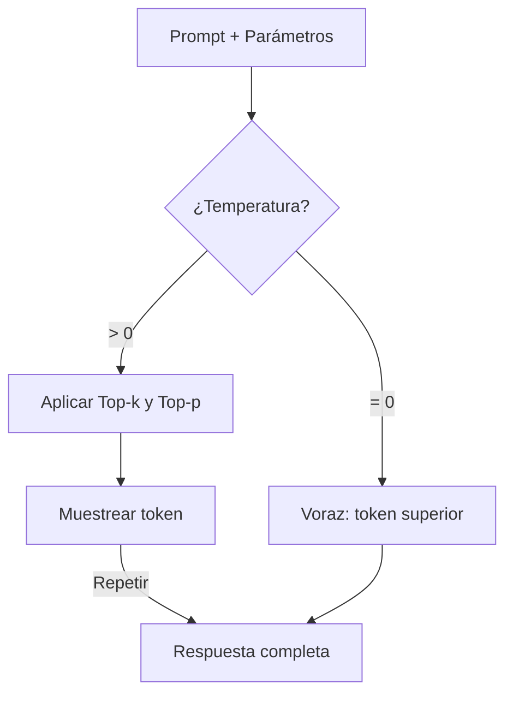
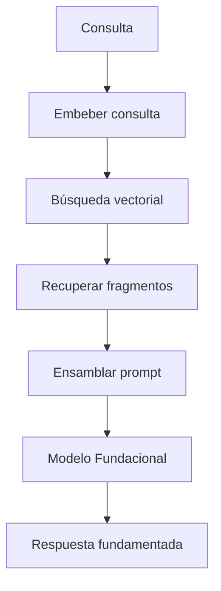
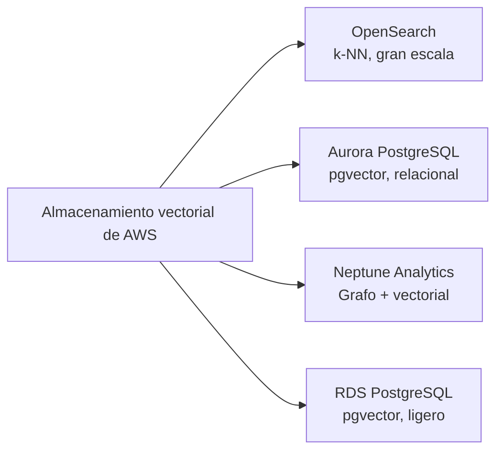
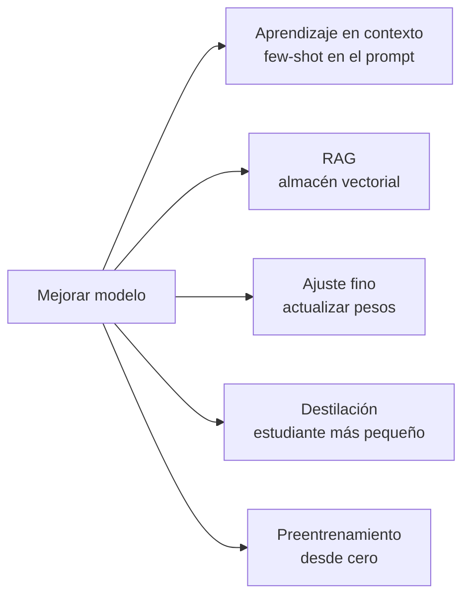
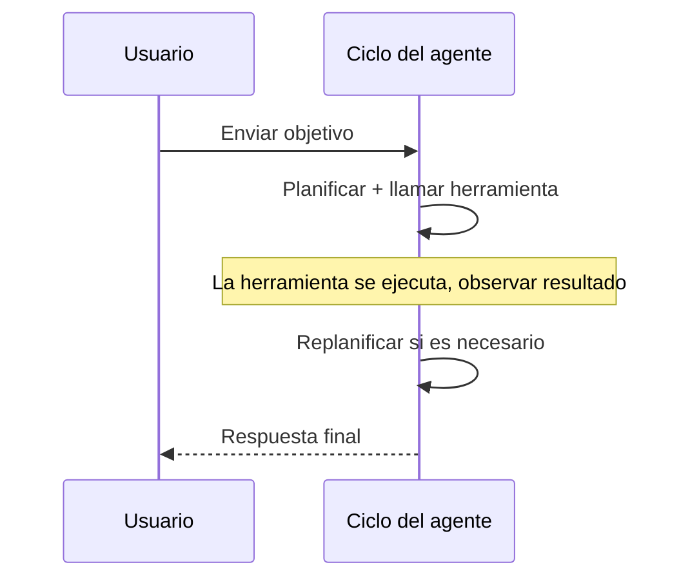

## Enunciado de Tarea 3.1: Describir las consideraciones de diseño para las aplicaciones que utilizan modelos fundacionales (FM)

Construir una aplicación de producción sobre un modelo fundacional comienza mucho antes de la primera indicación. Las decisiones que se toman en el momento del diseño, qué modelo usar, cómo ajustar sus salidas, cómo fundamentarlo en datos privados, dónde almacenar esos datos y cómo escalar el conocimiento a lo largo del tiempo, determinan si el proyecto genera valor o se estanca en la fase piloto. Este enunciado de tarea cubre esas decisiones en el orden en que las enfrentaría un arquitecto de negocios.[^301001]

### 3.1.1 Criterios de selección para elegir FM

Elegir un modelo fundacional no es una decisión técnica única; se repite cada vez que cambian los requisitos empresariales. Un modelo que funcionó aceptablemente en un piloto puede volverse demasiado costoso con el volumen de producción. Un modelo que respondía bien las preguntas de clientes en inglés puede necesitar ser reemplazado cuando el producto se expande a mercados hispanohablantes. Comprender los criterios de selección mantiene esas decisiones sistemáticas en lugar de reactivas.

Los criterios que cubre el examen se dividen en tres grupos. Los criterios de costo y rendimiento rigen cuánto cuesta ejecutar el modelo y con qué rapidez responde. Los criterios de capacidad rigen lo que el modelo puede hacer. Los criterios de flexibilidad rigen cuánto se puede cambiar el modelo para adaptarlo al negocio.

El **costo** se mide por token, donde un token equivale aproximadamente a tres cuartos de una palabra en inglés (o aproximadamente cuatro caracteres de texto en inglés).[^301036] Los tokens de entrada (el prompt) y los tokens de salida (la respuesta) tienen precios separados, y los tokens de salida son consistentemente más caros.[^301002] Un asistente de servicio al cliente que lee un historial de cliente de 500 palabras y produce una respuesta de 100 palabras consumirá aproximadamente 670 tokens de entrada y 130 tokens de salida por interacción. A escala de producción, esa aritmética importa enormemente. El **almacenamiento en caché de indicaciones (prompt caching)** reduce el costo efectivo reutilizando la representación procesada del modelo de un prefijo estático, como un prompt de sistema largo o un catálogo de productos, en múltiples llamadas. Amazon Bedrock admite el almacenamiento en caché de indicaciones para modelos seleccionados, incluido Anthropic Claude en Bedrock, lo que lo convierte en una palanca de costo significativa cuando un bloque de contexto grande se reutiliza en miles de solicitudes diarias.[^301003]

La **modalidad** se refiere a los tipos de entrada que puede aceptar un modelo y los tipos de salida que puede producir.[^301037] Un modelo *solo de texto* lee texto y produce texto. Un modelo *multimodal* también puede leer imágenes, documentos o audio. Si una aplicación empresarial necesita clasificar facturas escaneadas o responder preguntas sobre fotos de productos, un modelo multimodal es obligatorio, y el costo por interacción será mayor. Seleccionar un modelo solo de texto para una tarea solo de texto evita pagar por la capacidad multimodal que no se utiliza.

La **latencia** es el tiempo desde el momento en que se envía una solicitud hasta el momento en que aparece el primer token de la respuesta.[^301038] Las aplicaciones interactivas como los chatbots requieren baja latencia; una pausa de cinco segundos rompe la experiencia conversacional. Las aplicaciones por lotes como la resumización de documentos nocturna pueden tolerar mayor latencia a cambio de menor costo. El tamaño del modelo es uno de los mayores impulsores de la latencia: los modelos más pequeños se ejecutan más rápido pero tienen menor capacidad de razonamiento, mientras que los modelos más grandes razonan mejor pero tardan más en responder. El **tamaño del modelo** se mide en miles de millones de parámetros, los pesos numéricos aprendidos dentro de la red. Un modelo de 7.000 millones de parámetros típicamente responde en menos de un segundo en la infraestructura apropiada; un modelo de 70.000 millones de parámetros puede tardar varios segundos para el mismo prompt.[^301004]

La **complejidad del modelo** se relaciona con las decisiones de diseño arquitectónico que van más allá del recuento de parámetros. Algunos modelos son densos, lo que significa que todos los parámetros se activan para cada token; otros usan arquitecturas de *mezcla de expertos (MoE)* que activan solo un subconjunto de parámetros por token, logrando mejor calidad a menor costo de inferencia.[^301039] Desde la perspectiva de la selección, la complejidad importa porque afecta el rendimiento de la inferencia y el nivel de infraestructura necesario para servir el modelo.

El **soporte multilingüe** cubre la amplitud de idiomas de los datos de preentrenamiento del modelo.[^301040] Un modelo entrenado principalmente en texto en inglés produce salidas de menor calidad en otros idiomas. Para los despliegues globales, verificar el soporte de idioma documentado de un modelo antes de la selección evita regresiones de calidad dolorosas al expandir los mercados.

La **personalización** se refiere a si el modelo puede ser ajustado fino o preentrenado continuamente con datos propietarios.[^301041] No todos los modelos disponibles comercialmente admiten el ajuste fino. Si un proyecto requiere enseñar al modelo terminología específica del dominio o flujos de trabajo propietarios, verificar la disponibilidad del ajuste fino antes de firmar un contrato es esencial. La sección 3.1.5 cubre las compensaciones de costo entre los enfoques de personalización.

El **tamaño de la ventana de contexto** establece el número máximo de tokens que el modelo puede leer en una sola llamada, contando tanto la entrada como la salida.[^301042] Un modelo con una ventana de contexto de 200.000 tokens puede procesar un contrato legal completo en una sola solicitud; un modelo con una ventana de 4.096 tokens no puede. Varios modelos insignia en Amazon Bedrock ahora ofrecen ventanas de un millón de tokens (Anthropic Claude Opus y Sonnet a través del encabezado beta 1M-context, Amazon Nova Premier y Meta Llama 4 Maverick), que pueden contener toda una base de código o un año de correspondencia en un solo prompt. Las ventanas de contexto más grandes cuestan más por llamada pero pueden eliminar la necesidad de estrategias complejas de segmentación en los flujos de trabajo de RAG (véase la sección 3.1.3).

*Table 3.1.1* a continuación compara las principales familias de modelos disponibles a través de Amazon Bedrock en el momento de la redacción. Los precios exactos cambian; el posicionamiento relativo entre los niveles de modelos dentro de una familia es estable.[^301005]

*Tabla 3.1.1: Comparación de modelos fundacionales por nivel y capacidad*

| Familia de modelos | Nivel | Costo relativo | Modalidad | Ventana de contexto | Caso de uso típico |
|---|---|---|---|---|---|
| Anthropic Claude Opus | Insignia | Alto | Multimodal | 200K estándar, 1M con encabezado beta | Razonamiento complejo, legal/médico |
| Anthropic Claude Sonnet | Equilibrado | Medio | Multimodal | 200K estándar, 1M con encabezado beta | Tareas empresariales generales |
| Anthropic Claude Haiku | Rápido | Bajo | Multimodal | 200K tokens | Interacciones de alto volumen con clientes |
| Amazon Nova Premier | Insignia | Alto | Multimodal | 1M tokens | Documentos muy largos, multi-modal complejo |
| Amazon Nova Pro | Equilibrado | Medio | Multimodal | 300K tokens | Flujos de trabajo empresariales |
| Amazon Nova Lite | Rápido | Bajo | Multimodal | 300K tokens | Producción sensible al costo |
| Amazon Nova Micro | Más rápido | Menor | Solo texto | 128K tokens | Latencia o costo ultra-bajos |
| Meta Llama 4 Maverick | Abierto | Variable | Multimodal | 1M tokens | Despliegues personalizables de contexto largo |
| Mistral Large 2 | Equilibrado | Medio | Solo texto | 128K tokens | Tareas en idiomas europeos |

El examen no espera que se memoricen los precios. Sí espera que se relacione un escenario empresarial (alto volumen, multilingüe, análisis de imágenes, presupuesto ajustado) con el nivel correcto de modelo utilizando estos criterios.

### 3.1.2 Efecto de los parámetros de inferencia en las respuestas del modelo

Incluso un modelo seleccionado correctamente puede producir salidas inapropiadas si sus parámetros de inferencia están mal configurados. Los parámetros de inferencia son configuraciones que se pasan en tiempo de ejecución, junto con el prompt, que le indican al modelo cómo muestrear de la distribución de probabilidad de los posibles tokens siguientes. Ajustarlos cambia el comportamiento del modelo sin reentrenamiento.

La **temperatura** controla el grado de aleatoriedad en el proceso de muestreo.[^301043] A una temperatura de 0, el modelo siempre selecciona el token con la mayor probabilidad, produciendo una salida determinista y consistente. A una temperatura de 1, el modelo muestrea según la distribución de probabilidad sin procesar, produciendo una salida más variada y creativa. Los valores superiores a 1 amplifica los tokens de menor probabilidad, aumentando la creatividad a costa de la coherencia.[^301006] La implicación empresarial es directa: una herramienta de resumización de documentos legales debe ejecutarse a temperatura 0 o muy cercana a 0, porque la consistencia y la precisión importan más que la variedad. Un generador de texto de marketing podría usar temperatura 0.8 o superior para producir diversas opciones creativas a partir del mismo resumen.

El **top-p** (también llamado *muestreo de núcleo*) es un control de aleatoriedad complementario.[^301044] En lugar de ajustar las probabilidades de los tokens por un multiplicador, top-p define un umbral de probabilidad acumulada. El modelo muestrea solo del conjunto más pequeño de tokens cuya probabilidad combinada alcanza el umbral. Con top-p = 0.9, el modelo considera solo los tokens que juntos representan el 90% de la masa de probabilidad, descartando los valores atípicos de baja probabilidad. Los valores más bajos de top-p hacen que la salida sea más enfocada; los valores más altos permiten más variedad.[^301007]

El **top-k** restringe el muestreo a los k tokens con las probabilidades individuales más altas, independientemente de su probabilidad combinada.[^301045] Con top-k = 50, el modelo muestrea solo de los 50 tokens siguientes más probables. Top-k y top-p se usan a menudo juntos; el modelo primero filtra por top-k y luego aplica el umbral top-p a los candidatos restantes.

La temperatura y el top-p interactúan en la práctica. Establecer temperatura = 0 hace que el top-p sea irrelevante porque no hay muestreo estocástico que gobernar. Establecer top-p = 1.0 deshabilita el muestreo de núcleo, dejando la temperatura como el único control activo. Una configuración de producción común para un asistente de alta precisión es temperatura = 0.1 y top-p = 0.9, produciendo una salida que es mayormente determinista mientras permite la phrasing alternativa ocasional cuando el modelo es genuinamente incierto.

Las **secuencias de parada (stop sequences)** son cadenas de caracteres que le indican al modelo que deje de generar en cuanto las produce.[^301046] Por ejemplo, una plantilla de prompt que usa un marcador de fin explícito puede incluir `"\n###END###"` como secuencia de parada para que el modelo se detenga inmediatamente después de producir el marcador. Las secuencias de parada son útiles para hacer cumplir el formato de salida en las aplicaciones donde un sistema posterior debe analizar la respuesta, y deben elegirse para ser inequívocas en la salida esperada (un literal `}` es una mala elección para JSON anidado porque la llave interior terminaría la generación antes de que se cierre el objeto exterior).

Los parámetros de **longitud de entrada y salida** limitan el número de tokens que el modelo lee (entrada) o genera (salida). Limitar la longitud de la salida controla el costo en los endpoints de alto volumen. Limitar la longitud de la entrada a nivel de API evita que los clientes envíen prompts que excedan la ventana de contexto del modelo y desencadenen un error. Ambos límites deben establecerse en función del tamaño máximo realista de una solicitud válida, no el máximo que admite el modelo.

```
Ejemplo de configuración de parámetros de inferencia:
  temperature:     0.1
  top_p:           0.9
  top_k:           50
  max_new_tokens:  512
  stop_sequences:  ["###END###"]
```

La configuración anterior es adecuada para un asistente de extracción de documentos que debe producir salidas cortas y estructuradas de manera confiable. Un asistente de escritura creativa aumentaría la temperatura, aumentaría el top-p y eliminaría la secuencia de parada.


*Figura 3.1.1: Flujo de muestreo de tokens. El modelo selecciona cada token de salida filtrando los candidatos a través de top-k y top-p antes de aplicar el muestreo estocástico escalado por temperatura.*

### 3.1.3 Definir RAG y sus aplicaciones empresariales

Los modelos fundacionales se entrenan en grandes conjuntos de datos públicos, pero no tienen acceso a la información posterior a la fecha límite de su entrenamiento ni a los datos organizacionales propietarios. Un modelo entrenado hasta finales de 2024 no puede responder preguntas sobre un lanzamiento de producto a principios de 2025. Un modelo de propósito general nunca ha visto su política interna de RR.HH., sus plantillas de contratos de clientes o sus manuales de ingeniería. La **Generación Aumentada por Recuperación (RAG)** es el patrón arquitectónico que aborda esta limitación conectando el modelo a un almacén de conocimiento externo en el momento de la consulta, en lugar de incorporar el conocimiento en los pesos del modelo a través del entrenamiento.[^301008]

La mecánica de RAG procede en cinco pasos. Primero, la pregunta del usuario se convierte en un vector numérico llamado *representación vectorial (embedding)* que captura su significado semántico.[^301047] Segundo, ese vector se compara con una base de datos de representaciones vectoriales precomputadas derivadas de los documentos privados de la organización. Tercero, se recuperan los documentos cuyas representaciones vectoriales son más similares a la representación vectorial de la consulta. Cuarto, esos documentos se ensamblan en un bloque de contexto y se anteponen a la pregunta original del usuario para formar el prompt completo. Quinto, el modelo fundacional lee el prompt enriquecido y genera una respuesta fundamentada en el contenido recuperado en lugar de solo en su memoria paramétrica.[^301009]


*Figura 3.1.2: Flujo de solicitud de RAG. La consulta del usuario se incrusta, se compara con los vectores de documentos almacenados, y los fragmentos recuperados se fusionan con la consulta original antes de que el modelo fundacional genere su respuesta.*

**Amazon Bedrock Knowledge Bases** es la implementación completamente gestionada de AWS de este patrón.[^301010] Maneja el flujo de trabajo de ingestión, la generación de representaciones vectoriales, la integración del almacén vectorial y la API de recuperación, lo que permite a una organización adoptar RAG sin construir ni operar ninguna de la infraestructura subyacente. El administrador configura una Base de Conocimiento especificando una fuente de datos, una estrategia de segmentación, un modelo de representación vectorial y un backend de almacenamiento vectorial; Bedrock luego sincroniza los documentos automáticamente.

Las fuentes de datos admitidas por Amazon Bedrock Knowledge Bases incluyen buckets de Amazon S3 (la opción más común para los archivos de documentos), espacios de Atlassian Confluence, sitios de Microsoft SharePoint, objetos de Salesforce y URLs web a través de un rastreador web integrado.[^301011] Cada fuente de datos se sincroniza según un cronograma o bajo demanda; las actualizaciones de los documentos fuente se reflejan en el almacén vectorial sin necesidad de reindexación manual.[^301048]

La *segmentación (chunking)* es el proceso de dividir los documentos fuente en segmentos lo suficientemente pequeños para caber dentro de una ventana de contexto junto con la consulta original.[^301049] Bedrock Knowledge Bases admite la segmentación de tamaño fijo (dividir cada N tokens), la segmentación semántica (dividir en los límites naturales de los temas identificados por un modelo secundario) y la segmentación jerárquica (producir tanto un fragmento de resumen padre como fragmentos de detalles hijo más pequeños para que la recuperación pueda operar en dos niveles de granularidad).[^301012]

Las aplicaciones empresariales de RAG abarcan varias categorías:

- **Preguntas y respuestas internas**: Los empleados le hacen preguntas al sistema sobre políticas de RR.HH., procedimientos de TI o especificaciones de productos. El sistema recupera los párrafos de política relevantes y genera una respuesta precisa con el documento fuente citado.
- **Soporte al cliente**: Un agente de soporte o un chatbot de autoservicio recupera los pasos de solución de problemas relevantes de una base de conocimiento y los presenta en lenguaje conversacional, reduciendo el tiempo promedio de gestión.
- **Análisis de contratos y documentos legales**: Los equipos legales ingieren bibliotecas de contratos. El modelo responde preguntas como "¿Qué contratos contienen una cláusula de terminación por conveniencia?" o "¿Cuál es el límite de responsabilidad en el Acuerdo de Servicios Maestro con el Proveedor X?"
- **Asistencia de investigación**: Científicos, analistas o gerentes de productos consultan un corpus de informes de investigación internos. El modelo sintetiza los hallazgos de múltiples documentos en lugar de devolver una lista de enlaces.

RAG se prefiere al ajuste fino cuando la base de conocimiento cambia frecuentemente, porque actualizar un almacén vectorial lleva minutos mientras que reentrenar un modelo lleva horas o días.[^301050] También se prefiere cuando los documentos fuente deben ser auditables; porque los fragmentos recuperados son visibles en el prompt, un desarrollador puede inspeccionar exactamente qué documentos influyeron en la respuesta.[^301051]

### 3.1.4 Servicios de AWS para almacenar representaciones vectoriales en bases de datos vectoriales

RAG requiere un lugar para almacenar las representaciones vectoriales precomputadas y buscarlas rápidamente utilizando algoritmos de *vecinos más cercanos aproximados (ANN)* o *k vecinos más cercanos (k-NN)*.[^301052] AWS proporciona cuatro servicios gestionados que admiten el almacenamiento vectorial, cada uno adecuado para diferentes requisitos de escala, arquitectura y consulta.[^301053]


*Figura 3.1.3: Servicios de almacenamiento vectorial de AWS. Cada servicio admite el almacenamiento de representaciones vectoriales pero difiere en escala, modelo de consulta y capacidades complementarias.*

**Amazon OpenSearch Service** ha admitido la búsqueda vectorial de vecinos más cercanos aproximados desde que se introdujo el complemento k-NN, y su *motor vectorial* está optimizado para las cargas de trabajo de búsqueda semántica de gran escala y alto rendimiento.[^301013] Admite el algoritmo de índice Hierarchical Navigable Small World (HNSW), que ofrece recuperación en milisegundos a escala de miles de millones de vectores.[^301054] OpenSearch es la opción más capaz cuando el conjunto de datos de recuperación es grande (millones de documentos o más), cuando la búsqueda debe combinar la similitud vectorial con los filtros de palabras clave tradicionales (búsqueda híbrida), o cuando la aplicación ya usa OpenSearch para el análisis de registros y puede compartir el clúster. Amazon Bedrock Knowledge Bases usa OpenSearch Service como backend vectorial predeterminado cuando no se especifica ninguna alternativa.[^301055]

**Amazon Aurora** con la extensión pgvector añade almacenamiento vectorial a la base de datos relacional compatible con PostgreSQL.[^301014] Esta opción es apropiada cuando la aplicación ya almacena datos estructurados en Aurora y quiere añadir búsqueda semántica sin operar un almacén vectorial separado. Un catálogo de productos almacenado como filas en Aurora puede ganar columnas de representaciones vectoriales; las consultas pueden entonces combinar predicados relacionales ("productos en la categoría de Electrónica") con similitud vectorial ("similar a esta descripción de producto") en una sola instrucción SQL.[^301056] La compensación es la escala: pgvector en Aurora funciona bien para conjuntos de datos en el rango de cientos de miles a pocos millones de vectores, pero no iguala a OpenSearch Service a escalas muy grandes.

**Amazon Neptune Analytics** extiende la base de datos de grafos de Neptune con capacidad de búsqueda vectorial, habilitando consultas que combinan la traversal del grafo con la similitud semántica.[^301015] Un grafo de conocimiento que modela las relaciones entre personas, organizaciones y documentos puede usar Neptune Analytics para responder preguntas como "Encuentra los documentos más semánticamente similares a esta consulta que fueron escritos por alguien en el departamento legal y citen al menos una regulación."[^301057] Esta combinación de razonamiento de grafos y recuperación vectorial es difícil de replicar con un almacén puramente relacional o puramente de búsqueda. Neptune Analytics es la elección correcta cuando el problema de recuperación tiene una estructura de grafo inherente, como el análisis de la cadena de suministro, la investigación de fraudes o la investigación biomédica.

**Amazon RDS for PostgreSQL** proporciona la misma capacidad pgvector que Aurora pero se ejecuta en la infraestructura RDS estándar en lugar del clúster serverless o aprovisionado de Aurora.[^301016] Es apropiado para cargas de trabajo más pequeñas donde la instancia de RDS existente ya ejecuta PostgreSQL y añadir la extensión pgvector es el camino de menor resistencia.[^301058] Los entornos de desarrollo y las herramientas internas ligeras frecuentemente usan esta opción para mantener la infraestructura simple mientras siguen admitiendo la búsqueda vectorial.

Para una regla general rápida sobre cómo elegir entre estos almacenes: pgvector (en RDS o Aurora) maneja cómodamente hasta unos pocos millones de vectores; Amazon OpenSearch Service es el predeterminado una vez que una carga de trabajo cruza hacia las decenas de millones y más, donde su índice HNSW mantiene baja la latencia de recuperación a muy gran escala. Neptune Analytics es la respuesta correcta cuando los datos tienen una estructura de grafo fundamental.

*Tabla 3.1.2: Comparación de servicios de almacenamiento vectorial de AWS*

| Servicio | Algoritmo de índice | Escala | Capacidad complementaria | Mejor para |
|---|---|---|---|---|
| OpenSearch Service | HNSW, IVF | Muy grande (miles de millones) | Búsqueda híbrida de palabras clave + vectores, análisis | RAG de alto volumen, búsqueda empresarial |
| Aurora PostgreSQL (pgvector) | IVFFlat, HNSW | Medio (millones) | Uniones SQL relacionales | Aplicaciones ya en Aurora |
| Neptune Analytics | Grafo + vectorial | Medio | Traversal de grafo, consultas de relaciones | Bases de conocimiento con estructura de grafo |
| RDS for PostgreSQL (pgvector) | IVFFlat, HNSW | Pequeño a medio | SQL relacional, configuración simple | Entornos de desarrollo, herramientas internas |

Amazon Bedrock Knowledge Bases puede configurarse para usar cualquiera de estos cuatro backends.[^301017] El predeterminado, cuando no se especifica ningún backend, es OpenSearch Service.[^301059] Las organizaciones que ya operan Aurora o RDS for PostgreSQL pueden apuntar una Base de Conocimiento a su clúster existente, evitando el costo de un servicio de búsqueda separado. Neptune Analytics se selecciona explícitamente cuando la base de conocimiento tiene estructura de grafo.

Nota: Amazon MemoryDB figuraba como opción de almacenamiento vectorial en versiones anteriores de la guía del examen AIF-C01. Fue eliminado en la versión 1.1 de la guía. No espere preguntas sobre MemoryDB en el contexto de la búsqueda vectorial.

### 3.1.5 Compensaciones de costo de la personalización de FM

Cuando el comportamiento predeterminado de un modelo fundacional no es suficiente para una tarea empresarial específica, existen cinco estrategias amplias para mejorarlo. Difieren sustancialmente en costo, tiempo, requisitos de datos y la durabilidad de la mejora.

El **preentrenamiento** es el proceso de entrenar un modelo desde cero en un gran corpus de texto (u otros datos).[^301060] El preentrenamiento determina el conocimiento fundamental del modelo y la comprensión del lenguaje. Requiere enormes recursos de cómputo (cientos a miles de GPU ejecutándose durante semanas), petabytes de datos de entrenamiento curados y un equipo de investigadores de aprendizaje automático para supervisar el proceso. Muy pocas organizaciones fuera de los principales laboratorios de IA realizan el preentrenamiento. Es relevante en el examen como la línea base de la que parten todas las demás técnicas, no como una opción práctica para la mayoría de las empresas.[^301018]

El **ajuste fino (fine-tuning)** parte de un modelo preentrenado existente y continúa el entrenamiento en un conjunto de datos más pequeño y específico de la tarea.[^301061] Los pesos del modelo se actualizan para cambiar su comportamiento hacia el dominio objetivo. El ajuste fino requiere ejemplos etiquetados en el rango de cientos a decenas de miles, horas de GPU en el rango de horas a días en lugar de semanas, y un proceso de preparación de datos que produce pares de pregunta-respuesta o pares de instrucción-respuesta. Amazon Bedrock admite el ajuste fino para modelos seleccionados.[^301019] El resultado es un modelo que produce salidas mejor alineadas con la tarea específica, almacenado como una versión de modelo separada que incurre en costos de hospedaje incluso cuando está inactivo.[^301062]

El **aprendizaje en contexto** no requiere actualizaciones de pesos.[^301063] En cambio, se colocan ejemplos del comportamiento deseado directamente dentro del prompt. Un prompt de cero disparos no proporciona ejemplos; un prompt de pocos disparos proporciona de dos a cinco ejemplos. El modelo usa la coincidencia de patrones dentro de su ventana de contexto para generalizar a partir de esos ejemplos a la entrada actual. El aprendizaje en contexto es la estrategia de personalización más económica y rápida y no requiere ninguna infraestructura más allá de lo que usa una llamada de inferencia normal. La limitación es que la mejora dura solo la duración del prompt; el modelo no retiene los ejemplos entre llamadas, y los ejemplos consumen tokens que de otro modo podrían llevar contenido.[^301020]

**RAG** (cubierto en detalle en la sección 3.1.3) no se describe típicamente como una técnica de personalización, pero tiene efectos empresariales similares: fundamenta el modelo en conocimiento específico del dominio y reduce las alucinaciones en temas propietarios. Su perfil de costos es distinto de los demás. El costo de configuración implica construir y sincronizar el almacén vectorial e integrar la capa de recuperación. El costo por consulta es ligeramente mayor que una llamada de inferencia simple porque el paso de recuperación y el prompt enriquecido más grande ambos consumen cómputo y tokens. El costo de actualización del conocimiento, sin embargo, es muy bajo: añadir nuevos documentos al almacén vectorial lleva minutos en lugar de las horas que requiere un trabajo de ajuste fino.[^301021]

La **destilación de modelos** es la técnica más nueva en la guía del examen V1.1. En la destilación, un *modelo maestro* grande y de alta calidad genera salidas para un conjunto de prompts, y esos pares de entrada-salida se convierten en el conjunto de datos de entrenamiento para un *modelo estudiante* más pequeño.[^301064] El estudiante aprende a aproximar el comportamiento del maestro en un dominio de tarea específico sin tener acceso a los pesos del maestro.[^301022] El beneficio empresarial es que la inferencia a escala de producción la sirve el modelo estudiante más pequeño, más rápido y más económico, mientras que la calidad de las respuestas se acerca a la del costoso maestro. Amazon Bedrock admite la destilación de modelos como un flujo de trabajo de primera clase, permitiendo a las organizaciones usar un modelo de Bedrock como el maestro y producir una versión ajustada fino de un modelo más pequeño como el estudiante.[^301023] La destilación traslada el costo de la inferencia (que es continua) a un trabajo de entrenamiento único (que puede amortizarse en miles de llamadas de inferencia posteriores).[^301065]


*Figura 3.1.4: Guía de selección de personalización de FM. La técnica apropiada depende de los datos etiquetados disponibles, la frecuencia de actualización, el presupuesto y el volumen de inferencia.*

*Tabla 3.1.3: Comparación de costo y esfuerzo de los enfoques de personalización de FM*

| Enfoque | Costo de cómputo | Datos necesarios | Velocidad de actualización | Costo por consulta | Escenarios del examen |
|---|---|---|---|---|---|
| Preentrenamiento | Muy alto | Petabytes | Semanas | Normal | Solo línea base académica |
| Ajuste fino | Medio | Cientos a miles de pares etiquetados | Horas a días | Normal + hospedaje | Especialización de dominio estable |
| Aprendizaje en contexto | Ninguno | Unos pocos ejemplos | Inmediato | Mayor (prompt más largo) | Prototipado rápido, bajo volumen |
| RAG | Configuración baja | Documentos existentes | Minutos | Ligeramente mayor | Conocimiento actualizado frecuentemente |
| Destilación de modelos | Medio (único) | Pares generados por el maestro | Horas a días | Menor (modelo más pequeño) | Optimización de costo de alto volumen |

El examen frecuentemente presenta escenarios donde una empresa debe elegir entre estos enfoques. La lógica de decisión es: si el conocimiento cambia a menudo, elija RAG. Si la tarea requiere un tono consistente o terminología especializada en un dominio estable y hay datos disponibles, elija el ajuste fino. Si el volumen es muy alto y el costo por consulta es la preocupación principal, evalúe la destilación. Si ni el presupuesto ni el tiempo están disponibles, use el aprendizaje en contexto con ejemplos de pocos disparos. El preentrenamiento nunca es la respuesta correcta para un escenario de preparación para la producción a menos que la pregunta establezca explícitamente que existe un dominio novedoso para el que no hay ningún modelo preentrenado disponible.

### 3.1.6 Rol de los agentes de IA y las aplicaciones empresariales

Un modelo fundacional que recibe un prompt y devuelve una respuesta opera en modo de *turno único*. Muchas tareas empresariales reales no pueden completarse en un solo paso. Reservar un vuelo requiere verificar la disponibilidad, comparar opciones, seleccionar asientos y confirmar el pago. Investigar una alerta de seguridad requiere consultar los datos del registro, buscar inteligencia sobre amenazas, correlacionar eventos y redactar un informe. Estas tareas de múltiples pasos requieren una arquitectura diferente.

**Un agente de IA** es un sistema que combina un modelo fundacional con la capacidad de percibir su entorno, planificar una secuencia de acciones, ejecutar esas acciones usando herramientas externas, observar los resultados y revisar su plan basándose en lo que aprendió.[^301024] El modelo en un agente no solo genera texto; está razonando sobre qué hacer a continuación, decidiendo qué herramienta llamar, evaluando si el resultado es suficiente y continuando hasta que la tarea esté completa o se alcance una condición de parada.[^301066]

El ciclo del agente tiene cuatro fases. En la fase de *percepción*, el agente recibe el objetivo del usuario y cualquier contexto disponible sobre el estado actual del mundo.[^301067] En la fase de *planificación*, el modelo razona sobre qué acción tomar a continuación, seleccionando de un conjunto definido de herramientas (API, consultas de base de datos, ejecutores de código, búsqueda web). En la fase de *acción*, el agente llama a la herramienta seleccionada y le pasa los argumentos que determinó el modelo. En la fase de *observación*, el agente lee la respuesta de la herramienta y actualiza su comprensión del progreso hacia el objetivo. El ciclo se repite hasta que el agente determina que la tarea está completa.[^301025]


*Figura 3.1.5: Ciclo de percepción-planificación-acción-observación del agente de IA. El modelo fundacional razona sobre qué herramienta llamar en cada paso, y el ciclo continúa hasta que se cumple el objetivo de la tarea.*

La diferencia entre un agente y una simple llamada a un LLM importa en términos empresariales. Una simple llamada a un LLM es rápida, económica y sin estado. Una llamada a un agente es más lenta, más costosa y con estado en múltiples invocaciones de herramientas.[^301068] Los agentes son apropiados cuando la tarea no puede codificarse en un solo prompt, cuando requiere información de sistemas externos, o cuando implica múltiples decisiones secuenciales donde cada una depende del resultado anterior.

AWS proporciona dos puntos de entrada principales para construir agentes. **Amazon Bedrock Agents** es el servicio gestionado establecido para crear, configurar y desplegar agentes respaldados por cualquier modelo fundacional admitido por Bedrock.[^301026] Maneja la orquestación, el enrutamiento de herramientas (llamado *grupos de acciones* en la terminología de Bedrock), la gestión del estado de la sesión y la integración con Knowledge Bases para RAG. **Amazon Bedrock AgentCore** es la capa de entorno de ejecución y gestión más nueva para los agentes de grado de producción, añadiendo observabilidad, memoria, controles de seguridad y la infraestructura para ejecutar agentes a escala.[^301027] **Strands Agents** es un SDK de código abierto de AWS que permite a los desarrolladores de Python construir agentes usando una API sencilla basada en decoradores, con agentes desplegables en AgentCore para la ejecución gestionada.[^301028]

Las aplicaciones empresariales para los agentes de IA incluyen:

- **Automatización del servicio al cliente**: Un agente gestiona la resolución completa de una solicitud de servicio, consultando el CRM, verificando el estado del pedido, iniciando una devolución y enviando una confirmación, sin que un agente humano intervenga a menos que la situación supere el alcance definido.
- **Operaciones de TI**: Un agente investiga una alerta de rendimiento consultando las métricas de CloudWatch, identificando los recursos afectados, cruzando las referencias con el registro de cambios y proponiendo una acción de remediación para que un operador la apruebe.
- **Procesamiento de documentos**: Un agente lee los contratos entrantes, extrae los términos clave, los verifica contra una plantilla estándar, marca las desviaciones y crea un resumen borrador para que lo revise un jurista, todo sin triaje manual.
- **Análisis de datos**: Un agente acepta una pregunta empresarial en lenguaje natural, escribe una consulta SQL, la ejecuta contra una base de datos, interpreta el resultado y produce un resumen en lenguaje natural con una recomendación.

Las arquitecturas *multiagente*, donde un agente orquestador delega subtareas a subagentes especializados, extienden el patrón a problemas que son demasiado grandes o demasiado diversos para que un solo agente los maneje de manera confiable.[^301069] Amazon Bedrock Agents admite la colaboración multiagente de forma nativa.[^301029] Los principios de diseño para los sistemas multiagente, incluyendo cómo partir las tareas, cómo enrutar entre agentes y cómo mantener el estado de la sesión coherente, se cubrieron antes en el Dominio 2 (capítulo sobre los conceptos básicos de IA generativa) junto con el material de arquitectura agéntica más amplio.

*Tabla 3.1.4: Comparación entre agente de IA y llamada a LLM simple*

| Característica | Llamada a LLM simple | Agente de IA |
|---|---|---|
| Alcance de la tarea | Un solo paso, un solo prompt | Múltiples pasos, iterativo |
| Acceso a herramientas externas | Ninguno (solo pesos del modelo) | API, bases de datos, ejecutores de código |
| Estado entre pasos | Ninguno | Mantenido dentro de la sesión |
| Latencia por tarea | Milisegundos a segundos | Segundos a minutos |
| Costo por tarea | Bajo (una llamada de inferencia) | Mayor (múltiples llamadas de inferencia + herramientas) |
| Apropiado para | Clasificación, resumización, generación | Investigación, reservas, operaciones de TI, flujos de trabajo de documentos |

El examen trata a los agentes como un patrón arquitectónico distinto, no como una mejora del prompting. Cuando una pregunta describe una tarea de múltiples pasos que requiere consultar sistemas externos o tomar decisiones secuenciales, la respuesta implica un agente, no una indicación más sofisticada.

## Preguntas de autoevaluación

**Pregunta 1.** Una empresa minorista quiere desplegar un chatbot orientado al cliente que responda preguntas sobre su catálogo de productos en seis idiomas. El catálogo contiene 50.000 SKU; las actualizaciones diarias afectan a menos del uno por ciento de los SKU mientras que el prompt del sistema y el bloque de taxonomía de productos son estáticos entre las llamadas. ¿Qué combinación de criterios de selección debe regir MÁS directamente la elección del modelo fundacional?

A. Tamaño del modelo, disponibilidad de ajuste fino y soporte de secuencia de parada  
B. Soporte multilingüe, tamaño de la ventana de contexto y elegibilidad para el almacenamiento en caché de indicaciones  
C. Modalidad de salida, actualidad de los datos de preentrenamiento y valor predeterminado de top-p  
D. Costo de entrenamiento, huella de memoria de GPU y sensibilidad a la temperatura  

**Explicación:** El escenario tiene tres impulsores: soporte de seis idiomas (soporte multilingüe), un contexto de catálogo grande pero mayormente estable que debe caber dentro de un prompt o recuperarse eficientemente (tamaño de la ventana de contexto), y control de costos a escala (el almacenamiento en caché de indicaciones se aplica al prompt del sistema estático y al bloque de taxonomía, no a las filas de SKU que cambian diariamente, lo que mantiene RAG como la herramienta correcta para la porción volátil). La respuesta A es incorrecta porque el ajuste fino no abordaría el problema de actualización diaria y las secuencias de parada no son un criterio de selección. La respuesta C es incorrecta porque la modalidad de salida es solo texto (un chatbot), la actualidad del preentrenamiento es irrelevante ya que el catálogo se inyecta en tiempo de ejecución, y top-p es un parámetro de inferencia, no un criterio de selección de modelo. La respuesta D es incorrecta porque el costo de entrenamiento no es una consideración en tiempo de ejecución para un consumidor de FM gestionados, y la huella de GPU es un detalle de infraestructura abstraído por Amazon Bedrock. La respuesta B aborda directamente las tres restricciones empresariales.[^301030]

---

**Pregunta 2.** Un equipo legal usa un modelo fundacional para resumir cláusulas de contratos. Observan que los resúmenes son inconsistentes: la misma cláusula produce resúmenes ligeramente diferentes en cada ejecución. El equipo requiere reproducibilidad palabra por palabra cuando se vuelve a ejecutar un resumen. ¿Qué cambio de parámetro de inferencia es MÁS probable que resuelva esto?

A. Aumentar top-k de 50 a 200  
B. Aumentar la temperatura de 0.7 a 1.0  
C. Establecer la temperatura en 0  
D. Establecer top-p en 1.0  

**Explicación:** La temperatura controla qué tan determinista es el proceso de muestreo. A temperatura = 0, el modelo siempre selecciona el token siguiente de mayor probabilidad, haciendo que la salida sea determinista para un prompt fijo. Esta es la respuesta correcta (C). Aumentar top-k (Respuesta A) amplía el conjunto de tokens candidatos, lo que aumentaría la variabilidad, no la eliminaría. Aumentar la temperatura de 0.7 a 1.0 (Respuesta B) aumenta la aleatoriedad, empeorando el problema. Establecer top-p en 1.0 (Respuesta D) deshabilita el muestreo de núcleo pero no hace que el muestreo sea determinista por sí solo; si la temperatura sigue siendo mayor que 0, el modelo seguirá muestreando estocásticamente de la distribución de probabilidad completa. Solo establecer la temperatura exactamente en 0 colapsa el proceso de muestreo al modo determinista voraz que el equipo legal necesita.[^301031]

---

**Pregunta 3.** Una empresa de servicios financieros quiere dar a sus analistas una herramienta que pueda responder preguntas sobre informes de investigación internos. Los informes se actualizan semanalmente. La empresa no quiere reentrenar ni ajustar fino un modelo. ¿Qué arquitectura aborda MEJOR estos requisitos?

A. Preentrenar un modelo específico del dominio en los informes de investigación  
B. Ajustar fino un modelo fundacional cada semana cuando se publican nuevos informes  
C. Usar RAG con un almacén vectorial sincronizado desde el repositorio de informes  
D. Usar el aprendizaje en contexto pegando los informes relevantes en el prompt  

**Explicación:** RAG (Respuesta C) está diseñado específicamente para este escenario. Permite al analista hacer preguntas en lenguaje natural y recupera las secciones relevantes del almacén vectorial, que puede actualizarse en minutos cuando llegan nuevos informes. No requiere reentrenamiento del modelo. El preentrenamiento (Respuesta A) está descartado por el costo, por el requisito de no reentrenar y por la cadencia de actualización semanal. El ajuste fino (Respuesta B) está descartado por el requisito de no reentrenar y por el hecho de que los ciclos de ajuste fino semanales son poco prácticos para un problema de actualización de conocimiento. El aprendizaje en contexto (Respuesta D) es inviable a escala; pegar informes de investigación completos en un prompt excedería la ventana de contexto para una biblioteca de cientos de documentos, y el enfoque no funciona para la búsqueda retrospectiva en un archivo. Amazon Bedrock Knowledge Bases con una fuente de datos S3 sincronizada es la implementación de AWS concreta del enfoque correcto.[^301032]

---

**Pregunta 4.** Una empresa ejecuta una aplicación de soporte al cliente de alto volumen impulsada por un modelo fundacional grande. Los costos de inferencia están creciendo más rápido que los ingresos. Un ingeniero de aprendizaje automático propone usar la destilación de modelos. ¿Cuál es el beneficio empresarial PRINCIPAL de este enfoque?

A. El modelo estudiante aprende nuevos hechos que el modelo maestro no conocía  
B. El modelo estudiante produce salidas idénticas al modelo maestro en todas las entradas  
C. La inferencia a escala la sirve un modelo más pequeño, más rápido y más económico que aproxima la calidad del maestro  
D. Los pesos del modelo maestro se comprimen y se sirven directamente, reduciendo el costo de memoria  

**Explicación:** La destilación de modelos (Respuesta C) entrena un modelo estudiante más pequeño para aproximar el comportamiento de un modelo maestro más grande en el dominio de la tarea objetivo. Una vez completada la destilación, la inferencia de producción usa el modelo estudiante, que es más rápido y económico por llamada. Esto aborda directamente el problema de crecimiento de costos en una aplicación de alto volumen. La respuesta A es incorrecta porque la destilación enseña al estudiante a imitar las salidas del maestro, no a aprender hechos que el maestro no conoce. La respuesta B es incorrecta porque el estudiante aproxima pero no reproduce exactamente al maestro; en casos extremos y entradas novedosas las salidas diferirán. La respuesta D describe la cuantización o poda del modelo, no la destilación; la destilación implica entrenar un modelo separado, no comprimir los pesos del maestro. El examen introdujo la destilación en la versión V1.1 específicamente como técnica de optimización de costos para los escenarios de inferencia de alto volumen.[^301033]

---

**Pregunta 5.** Una empresa de manufactura quiere automatizar el proceso de responder a las consultas de los proveedores. El proceso requiere verificar los niveles de inventario en el sistema ERP de la empresa, consultar una base de datos de política de adquisiciones, calcular si un pedido cumple los umbrales de aprobación y redactar una respuesta. ¿Qué arquitectura es MÁS apropiada?

A. Una llamada de turno único al modelo fundacional con toda la información del proveedor en el prompt  
B. Un flujo de trabajo RAG que recupera documentos de política relevantes y genera una respuesta  
C. Un agente de IA con grupos de acciones que se conectan al sistema ERP, la base de datos de políticas y la herramienta de cálculo  
D. Un modelo ajustado fino entrenado en respuestas históricas a proveedores  

**Explicación:** La descripción de la tarea es el caso de libro de texto para un agente de IA (Respuesta C). El proceso es de múltiples pasos: tres operaciones distintas de recuperación de datos (ERP, base de datos de políticas, cálculo de umbral) deben ocurrir en secuencia, y el resultado de cada paso influye en los pasos posteriores. Una simple llamada de turno único (Respuesta A) no puede consultar sistemas externos en vivo; solo puede usar la información colocada en el prompt. Un flujo de trabajo RAG (Respuesta B) recupera documentos relevantes pero no ejecuta lógica de negocio ni realiza cálculos; es una capa de recuperación, no una capa de orquestación. Un modelo ajustado fino (Respuesta D) seguiría sin tener acceso a datos en vivo del ERP o a la política, y produciría respuestas basadas en patrones de los datos de entrenamiento históricos, no en el estado actual del inventario o la política. Amazon Bedrock Agents, configurado con grupos de acciones apuntando a la API del ERP, la base de datos de políticas y una función Lambda para el cálculo del umbral, es la implementación de AWS concreta del enfoque correcto.[^301034]

---

**Pregunta 6.** Una empresa está evaluando si usar Amazon OpenSearch Service o Amazon RDS for PostgreSQL con pgvector para su base de conocimiento de RAG. La base de conocimiento contendrá aproximadamente 200.000 fragmentos de documentos. El equipo de la aplicación ya opera un clúster de RDS for PostgreSQL para datos transaccionales y quiere minimizar la nueva infraestructura. ¿Qué recomendación es MÁS apropiada?

A. Usar OpenSearch Service porque es el único servicio de AWS que admite la búsqueda vectorial  
B. Usar OpenSearch Service porque 200.000 vectores requiere el algoritmo HNSW a escala  
C. Usar RDS for PostgreSQL porque el clúster existente puede extenderse con pgvector, evitando un nuevo servicio  
D. Usar Neptune Analytics porque la recuperación con estructura de grafo es siempre más precisa que la búsqueda k-NN  

**Explicación:** Con 200.000 vectores, ambos servicios son técnicamente capaces. El factor decisivo en este escenario es la simplicidad operativa: el equipo ya ejecuta un clúster de RDS for PostgreSQL, y pgvector puede habilitarse con una sola instalación de extensión. Esto evita aprovisionar, asegurar y operar un dominio de OpenSearch Service separado (Respuesta C). La respuesta A es incorrecta porque Aurora, RDS for PostgreSQL y Neptune Analytics también admiten la búsqueda vectorial; OpenSearch no es la opción exclusiva. La respuesta B es incorrecta porque 200.000 vectores está bien dentro de la capacidad de pgvector en RDS, que está diseñado para conjuntos de datos en este rango de escala; el argumento del algoritmo HNSW a escala se aplica cuando los conjuntos de datos alcanzan decenas de millones de vectores. La respuesta D es incorrecta porque Neptune Analytics es apropiado cuando el problema tiene una estructura de grafo, no como mejora universal de la precisión; aplicar la traversal de grafos a un problema general de recuperación de documentos añade complejidad sin un beneficio correspondiente.[^301035]

[^301001]: AWS Certification. AI Practitioner (AIF-C01) Exam Guide v1.1, Domain 3. URL: <https://docs.aws.amazon.com/aws-certification/latest/ai-practitioner-01/ai-practitioner-01-domain3.html>
[^301002]: Amazon Bedrock. Amazon Bedrock pricing. URL: <https://aws.amazon.com/bedrock/pricing/>
[^301003]: Amazon Bedrock. Prompt caching for Amazon Bedrock. URL: <https://docs.aws.amazon.com/bedrock/latest/userguide/prompt-caching.html>
[^301004]: Kaplan, J., et al. Scaling Laws for Neural Language Models (2020). URL: <https://arxiv.org/abs/2001.08361>
[^301005]: Amazon Bedrock. Supported foundation models in Amazon Bedrock. URL: <https://docs.aws.amazon.com/bedrock/latest/userguide/models-supported.html>
[^301006]: Amazon Bedrock. Inference parameters for foundation models. URL: <https://docs.aws.amazon.com/bedrock/latest/userguide/inference-parameters.html>
[^301007]: Holtzman, A., et al. The Curious Case of Neural Text Degeneration (2019). URL: <https://arxiv.org/abs/1904.09751>
[^301008]: Lewis, P., et al. Retrieval-Augmented Generation for Knowledge-Intensive NLP Tasks (2020). URL: <https://arxiv.org/abs/2005.11401>
[^301009]: Amazon Bedrock. How Amazon Bedrock Knowledge Bases works. URL: <https://docs.aws.amazon.com/bedrock/latest/userguide/knowledge-base-overview.html>
[^301010]: Amazon Bedrock. Amazon Bedrock Knowledge Bases. URL: <https://docs.aws.amazon.com/bedrock/latest/userguide/knowledge-base.html>
[^301011]: Amazon Bedrock. Data sources for Amazon Bedrock Knowledge Bases. URL: <https://docs.aws.amazon.com/bedrock/latest/userguide/knowledge-base-ds.html>
[^301012]: Amazon Bedrock. Chunking strategies for Amazon Bedrock Knowledge Bases. URL: <https://docs.aws.amazon.com/bedrock/latest/userguide/kb-chunking-parsing.html>
[^301013]: Amazon OpenSearch Service. k-NN search in Amazon OpenSearch Service. URL: <https://docs.aws.amazon.com/opensearch-service/latest/developerguide/knn.html>
[^301014]: Amazon Aurora. Using pgvector to store embeddings in Amazon Aurora PostgreSQL. URL: <https://docs.aws.amazon.com/AmazonRDS/latest/AuroraUserGuide/AuroraPostgreSQL.VectorSearch.html>
[^301015]: Amazon Neptune. Vector search in Amazon Neptune Analytics. URL: <https://docs.aws.amazon.com/neptune-analytics/latest/userguide/vector-search.html>
[^301016]: Amazon RDS. Using the pgvector extension with Amazon RDS for PostgreSQL. URL: <https://docs.aws.amazon.com/AmazonRDS/latest/UserGuide/Appendix.PostgreSQL.CommonDBATasks.pgvector.html>
[^301017]: Amazon Bedrock. Vector store options for Amazon Bedrock Knowledge Bases. URL: <https://docs.aws.amazon.com/bedrock/latest/userguide/knowledge-base-setup.html>
[^301018]: Brown, T., et al. Language Models are Few-Shot Learners (GPT-3 paper, 2020). URL: <https://arxiv.org/abs/2005.14165>
[^301019]: Amazon Bedrock. Fine-tuning foundation models in Amazon Bedrock. URL: <https://docs.aws.amazon.com/bedrock/latest/userguide/custom-models.html>
[^301020]: Min, S., et al. Rethinking the Role of Demonstrations: What Makes In-Context Learning Work? (2022). URL: <https://arxiv.org/abs/2202.12837>
[^301021]: Amazon Bedrock. Retrieval Augmented Generation using Knowledge Bases. URL: <https://docs.aws.amazon.com/bedrock/latest/userguide/knowledge-base-retrieveandgenerate.html>
[^301022]: Hinton, G., et al. Distilling the Knowledge in a Neural Network (2015). URL: <https://arxiv.org/abs/1503.02531>
[^301023]: Amazon Bedrock. Model distillation in Amazon Bedrock. URL: <https://docs.aws.amazon.com/bedrock/latest/userguide/model-distillation.html>
[^301024]: Yao, S., et al. ReAct: Synergizing Reasoning and Acting in Language Models (2022). URL: <https://arxiv.org/abs/2210.03629>
[^301025]: Amazon Bedrock. How Amazon Bedrock Agents works. URL: <https://docs.aws.amazon.com/bedrock/latest/userguide/agents-how-it-works.html>
[^301026]: Amazon Bedrock. Amazon Bedrock Agents. URL: <https://docs.aws.amazon.com/bedrock/latest/userguide/agents.html>
[^301027]: Amazon Bedrock. Amazon Bedrock AgentCore overview. URL: <https://docs.aws.amazon.com/bedrock/latest/userguide/agent-core.html>
[^301028]: AWS. Strands Agents SDK. URL: <https://strandsagents.com/>
[^301029]: Amazon Bedrock. Multi-agent collaboration in Amazon Bedrock Agents. URL: <https://docs.aws.amazon.com/bedrock/latest/userguide/agents-multi-agent-collaboration.html>
[^301030]: Amazon Bedrock. Multilingual model support and prompt caching overview. URL: <https://docs.aws.amazon.com/bedrock/latest/userguide/prompt-caching.html>
[^301031]: Amazon Bedrock. Temperature and sampling parameters for inference. URL: <https://docs.aws.amazon.com/bedrock/latest/userguide/inference-parameters.html>
[^301032]: Amazon Bedrock. Knowledge Bases for Amazon Bedrock: use cases. URL: <https://docs.aws.amazon.com/bedrock/latest/userguide/knowledge-base-overview.html>
[^301033]: Amazon Bedrock. Model distillation use cases and cost benefits. URL: <https://docs.aws.amazon.com/bedrock/latest/userguide/model-distillation.html>
[^301034]: Amazon Bedrock. Creating and configuring action groups for Amazon Bedrock Agents. URL: <https://docs.aws.amazon.com/bedrock/latest/userguide/agents-action-groups.html>
[^301035]: Amazon RDS. pgvector support for RDS for PostgreSQL: scale and performance characteristics. URL: <https://docs.aws.amazon.com/AmazonRDS/latest/UserGuide/Appendix.PostgreSQL.CommonDBATasks.pgvector.html>
[^301036]: Amazon Bedrock. Tokens and token pricing in Amazon Bedrock. URL: <https://docs.aws.amazon.com/bedrock/latest/userguide/inference-invoke.html>
[^301037]: Amazon Bedrock. Multimodal capabilities for foundation models. URL: <https://docs.aws.amazon.com/bedrock/latest/userguide/models-supported.html>
[^301038]: Amazon Bedrock. Latency and performance considerations for Amazon Bedrock. URL: <https://docs.aws.amazon.com/bedrock/latest/userguide/model-ids.html>
[^301039]: Fedus, W., et al. Switch Transformers: Scaling to Trillion Parameter Models with Simple and Efficient Sparsity (2021). URL: <https://arxiv.org/abs/2101.03961>
[^301040]: Amazon Bedrock. Language support for foundation models in Amazon Bedrock. URL: <https://docs.aws.amazon.com/bedrock/latest/userguide/models-supported.html>
[^301041]: Amazon Bedrock. Customization options for foundation models in Amazon Bedrock. URL: <https://docs.aws.amazon.com/bedrock/latest/userguide/custom-models.html>
[^301042]: Amazon Bedrock. Context window sizes for foundation models in Amazon Bedrock. URL: <https://docs.aws.amazon.com/bedrock/latest/userguide/models-supported.html>
[^301043]: Amazon Bedrock. Temperature parameter for inference requests. URL: <https://docs.aws.amazon.com/bedrock/latest/userguide/inference-parameters.html>
[^301044]: Holtzman, A., et al. The Curious Case of Neural Text Degeneration: nucleus sampling definition (2019). URL: <https://arxiv.org/abs/1904.09751>
[^301045]: Fan, A., et al. Hierarchical Neural Story Generation: top-k sampling (2018). URL: <https://arxiv.org/abs/1805.04833>
[^301046]: Amazon Bedrock. Stop sequences for inference in Amazon Bedrock. URL: <https://docs.aws.amazon.com/bedrock/latest/userguide/inference-parameters.html>
[^301047]: Amazon Bedrock. Embedding models for Amazon Bedrock Knowledge Bases. URL: <https://docs.aws.amazon.com/bedrock/latest/userguide/knowledge-base-setup-emb.html>
[^301048]: Amazon Bedrock. Syncing data sources for Amazon Bedrock Knowledge Bases. URL: <https://docs.aws.amazon.com/bedrock/latest/userguide/knowledge-base-ingest.html>
[^301049]: Amazon Bedrock. Chunking configurations for Amazon Bedrock Knowledge Bases. URL: <https://docs.aws.amazon.com/bedrock/latest/userguide/kb-chunking-parsing.html>
[^301050]: Amazon Bedrock. Comparing RAG and fine-tuning for FM customization. URL: <https://docs.aws.amazon.com/bedrock/latest/userguide/knowledge-base-overview.html>
[^301051]: Amazon Bedrock. Source attribution in RAG responses from Knowledge Bases. URL: <https://docs.aws.amazon.com/bedrock/latest/userguide/knowledge-base-retrieveandgenerate.html>
[^301052]: Johnson, J., et al. Billion-scale similarity search with GPUs (FAISS paper, 2017). URL: <https://arxiv.org/abs/1702.08734>
[^301053]: Amazon Bedrock. Supported vector stores for Amazon Bedrock Knowledge Bases. URL: <https://docs.aws.amazon.com/bedrock/latest/userguide/knowledge-base-setup.html>
[^301054]: Amazon OpenSearch Service. HNSW algorithm for k-NN in OpenSearch. URL: <https://docs.aws.amazon.com/opensearch-service/latest/developerguide/knn-index.html>
[^301055]: Amazon Bedrock. Default vector store configuration for Amazon Bedrock Knowledge Bases. URL: <https://docs.aws.amazon.com/bedrock/latest/userguide/knowledge-base-setup-osscr.html>
[^301056]: Amazon Aurora. Combining relational and vector queries with pgvector in Aurora PostgreSQL. URL: <https://docs.aws.amazon.com/AmazonRDS/latest/AuroraUserGuide/AuroraPostgreSQL.VectorSearch.html>
[^301057]: Amazon Neptune Analytics. Graph and vector search use cases in Neptune Analytics. URL: <https://docs.aws.amazon.com/neptune-analytics/latest/userguide/vector-search.html>
[^301058]: Amazon RDS. Installing the pgvector extension on Amazon RDS for PostgreSQL. URL: <https://docs.aws.amazon.com/AmazonRDS/latest/UserGuide/Appendix.PostgreSQL.CommonDBATasks.pgvector.html>
[^301059]: Amazon Bedrock. OpenSearch Service as default vector store for Knowledge Bases. URL: <https://docs.aws.amazon.com/bedrock/latest/userguide/knowledge-base-setup-osscr.html>
[^301060]: Bommasani, R., et al. On the Opportunities and Risks of Foundation Models (Stanford CRFM, 2021). URL: <https://arxiv.org/abs/2108.07258>
[^301061]: Howard, J., and Ruder, S. Universal Language Model Fine-tuning for Text Classification (ULMFiT, 2018). URL: <https://arxiv.org/abs/1801.06146>
[^301062]: Amazon Bedrock. Provisioned throughput for custom models in Amazon Bedrock. URL: <https://docs.aws.amazon.com/bedrock/latest/userguide/prov-throughput.html>
[^301063]: Brown, T., et al. Language Models are Few-Shot Learners (in-context learning definition, 2020). URL: <https://arxiv.org/abs/2005.14165>
[^301064]: Gou, J., et al. Knowledge Distillation: A Survey (2021). URL: <https://arxiv.org/abs/2006.05525>
[^301065]: Amazon Bedrock. Cost savings with model distillation in Amazon Bedrock. URL: <https://docs.aws.amazon.com/bedrock/latest/userguide/model-distillation.html>
[^301066]: Wang, L., et al. A Survey on Large Language Model Based Autonomous Agents (2023). URL: <https://arxiv.org/abs/2308.11432>
[^301067]: Wooldridge, M., and Jennings, N. Intelligent Agents: Theory and Practice (1995). URL: <https://doi.org/10.1017/S0269888900007524>
[^301068]: Amazon Bedrock. Session management and state in Amazon Bedrock Agents. URL: <https://docs.aws.amazon.com/bedrock/latest/userguide/agents-session-state.html>
[^301069]: Amazon Bedrock. Multi-agent collaboration patterns in Amazon Bedrock. URL: <https://docs.aws.amazon.com/bedrock/latest/userguide/agents-multi-agent-collaboration.html>
