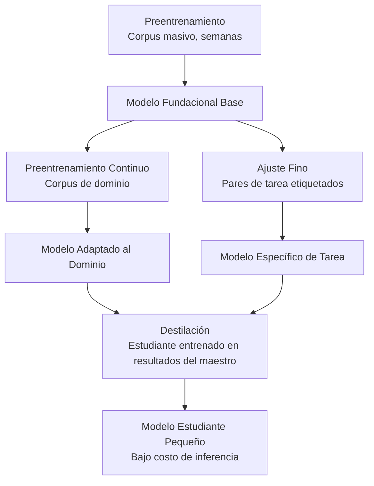
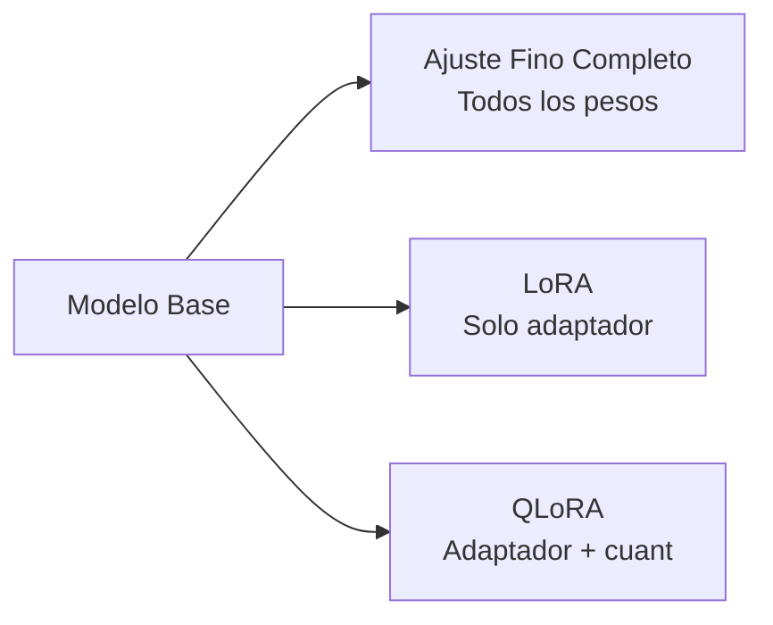
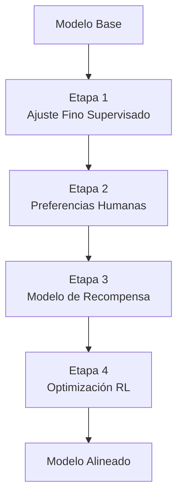
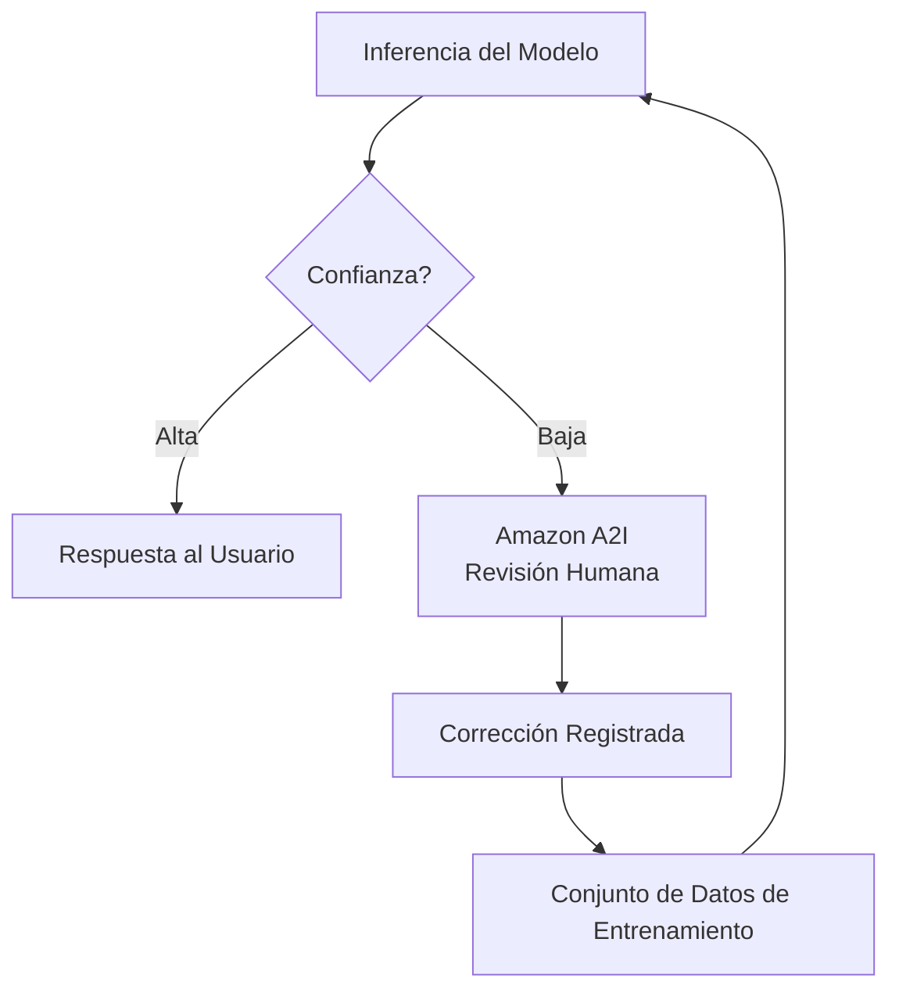
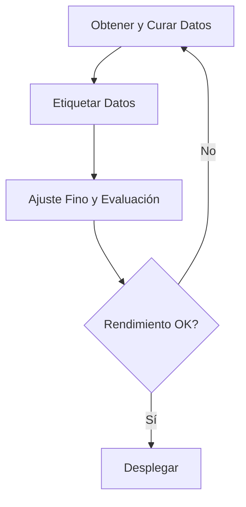

## Enunciado de Tarea 3.3: Describir el proceso de entrenamiento y ajuste fino para los FM

Los modelos fundacionales no llegan listos para cada propósito empresarial. Se construyen en etapas, y cada capa añade especificidad a un costo que aumenta considerablemente con la ambición. Para el profesional de negocios, comprender cómo se construyen y adaptan los modelos no es principalmente un ejercicio técnico; es un ejercicio de presupuesto y alcance. Conocer la diferencia entre el preentrenamiento, el ajuste fino, el preentrenamiento continuo y la destilación permite formular las preguntas correctas cuando un equipo de ingeniería propone un proyecto de personalización, evaluar el cronograma y presupuesto propuestos, y reconocer cuándo un enfoque más sencillo produciría resultados comparables.[^303001]

Los tres objetivos de este enunciado de tarea siguen una secuencia lógica. El primero cubre la taxonomía de las técnicas de entrenamiento y sus perfiles de costo. El segundo cubre los métodos específicos utilizados cuando el ajuste fino es la opción correcta. El tercero cubre cómo se deben preparar los datos antes de que pueda comenzar cualquier trabajo de ajuste fino, incluidos los procesos de retroalimentación humana que alinean el comportamiento de un modelo con las expectativas empresariales. En conjunto, proporcionan el marco que necesita un patrocinador empresarial para encargar y supervisar un proyecto de personalización de modelos sin necesidad de escribir una sola línea de código de entrenamiento.

### 3.3.1 Elementos clave del entrenamiento de un FM

Entrenar un modelo fundacional no es una actividad única. Es una progresión de etapas, cada una construyendo sobre la anterior, y cada una disponible como punto de entrada dependiendo de lo que necesite una empresa y cuánto pueda invertir. El examen cubre cuatro etapas: preentrenamiento, ajuste fino, preentrenamiento continuo y destilación. Están ordenadas aproximadamente por costo de mayor a menor, y por alcance del cambio de más amplio a más estrecho.

Las cuatro técnicas no son alternativas entre sí de la manera en que el ajuste fino y la RAG son alternativas. El preentrenamiento crea la base. El ajuste fino y el preentrenamiento continuo ajustan lo que ya existe. La destilación comprime el resultado en un paquete más pequeño. Una empresa puede usar varios en secuencia: comenzar desde un modelo preentrenado proporcionado por un tercero, aplicar preentrenamiento continuo para enseñarle vocabulario de dominio y luego destilar el resultado para una inferencia de producción eficiente en costos.

**El preentrenamiento** es el proceso de entrenar una red neuronal desde pesos iniciales aleatorios sobre un corpus enorme de texto y otros datos.[^303002] El modelo aprende patrones estadísticos a través de miles de millones de ejemplos: gramática, asociaciones factuales, cadenas de razonamiento y las relaciones entre conceptos. El preentrenamiento crea la memoria paramétrica del modelo, el conocimiento incorporado en sus pesos del que puede extraer información incluso cuando no se proporcionan documentos externos. La escala requerida es prohibitiva para la mayoría de las organizaciones. Una corrida de entrenamiento para un modelo de lenguaje grande moderno consume miles de horas de GPU durante semanas o meses, requiere petabytes de datos curados y cuesta millones de dólares antes de que el modelo produzca su primera oración coherente.[^303003] El preentrenamiento es relevante en el examen como la línea de base de la que parten todas las demás técnicas, no como una acción práctica para ninguna empresa fuera de los principales laboratorios de investigación de IA.

**El ajuste fino** comienza desde un modelo preentrenado existente y continúa el entrenamiento en un conjunto de datos mucho más pequeño y específico de dominio.[^303004] El objetivo es desplazar el comportamiento del modelo hacia una tarea objetivo: responder preguntas de servicio al cliente con un tono particular, extraer campos estructurados de registros médicos o generar código en el marco interno de una empresa. El ajuste fino ajusta los pesos del modelo, por lo que el modelo resultante es un artefacto distinto que debe almacenarse y servirse. Requiere ejemplos etiquetados, típicamente cientos a decenas de miles de pares de entrada-salida, y cómputo de GPU en el rango de horas a días en lugar de semanas. **Amazon Bedrock** admite el ajuste fino para un subconjunto de sus modelos alojados, incluidos Amazon Nova, Meta Llama y versiones selectas de Anthropic Claude Haiku, produciendo un modelo personalizado que luego puede implementarse con rendimiento aprovisionado.[^303005] El ajuste fino es la opción correcta cuando la tarea es estable (el comportamiento objetivo no cambia mes a mes), cuando la empresa puede producir ejemplos etiquetados suficientes y cuando la mejora del rendimiento justifica el costo de entrenamiento y alojamiento.

**El preentrenamiento continuo** (también llamado *preentrenamiento continuado*) es una técnica intermedia entre el preentrenamiento y el ajuste fino.[^303006] En lugar de pares de entrada-salida etiquetados, el preentrenamiento continuo utiliza texto de dominio no etiquetado, el mismo tipo de corpus no supervisado utilizado en el preentrenamiento original, pero extraído de un dominio específico como literatura médica, archivos financieros o jurisprudencia. El objetivo no es enseñarle al modelo una nueva tarea, sino enseñarle vocabulario de dominio, terminología y asociaciones factuales que estaban subrepresentadas en el corpus de preentrenamiento original. Un modelo que fue preentrenado en texto general de internet puede tratar "margen bruto", "valor presente neto" y "EBITDA" como jerga financiera que reconoce pero no comprende profundamente en contexto. El preentrenamiento continuo sobre un corpus de informes anuales, notas de analistas y transcripciones de llamadas de resultados mejora esa comprensión sin requerir pares etiquetados. Amazon Bedrock admite el preentrenamiento continuo como una opción de personalización para modelos selectos.[^303007]

**La destilación** adopta un enfoque diferente al problema del costo. En lugar de entrenar un modelo más pequeño desde cero, la destilación entrena un *modelo estudiante* compacto para imitar los resultados de un *modelo maestro* más grande y capaz sobre un conjunto objetivo de instrucciones.[^303008] El maestro genera respuestas a una gran colección de instrucciones; esos pares instrucción-respuesta se convierten en los datos de entrenamiento del estudiante. El estudiante aprende a aproximar la calidad del maestro sin acceder nunca a los pesos del maestro. Una vez completada la destilación, la inferencia de producción es atendida por el estudiante, que es más rápido y más económico por llamada que el maestro. Amazon Bedrock admite la destilación de modelos como un flujo de trabajo administrado, lo que permite a las organizaciones designar un modelo de Bedrock como maestro, especificar la distribución objetivo de instrucciones y producir un modelo más pequeño ajustado fino como estudiante.[^303009] La economía de la destilación favorece las aplicaciones de alto volumen donde el costo único de entrenamiento se recupera rápidamente gracias a los ahorros en la inferencia.

*Figura 3.3.1: Jerarquía de técnicas de entrenamiento de FM. Cada técnica se construye sobre un modelo existente en lugar de comenzar desde cero, con los requisitos de costo y datos disminuyendo de izquierda a derecha a medida que el punto de partida se vuelve más rico.*

*Tabla 3.3.1: Comparación de técnicas de entrenamiento y adaptación de FM*

| Técnica | Datos de entrenamiento | Costo de cómputo | Tiempo hasta el despliegue | Resultado principal | Punto de entrada en AWS |
|---|---|---|---|---|---|
| Preentrenamiento | Petabytes, sin etiquetar | Muy alto (millones de horas de GPU) | Meses | Modelo base de propósito general | No aplicable (comprar al proveedor) |
| Preentrenamiento continuo | Gigabytes a terabytes, sin etiquetar | Medio (días) | Días | Vocabulario de dominio y asociaciones factuales | Modelos personalizados de Amazon Bedrock |
| Ajuste fino | Cientos a miles de pares etiquetados | Bajo a medio (horas) | Horas a días | Comportamiento y tono específicos de tarea | Amazon Bedrock, SageMaker JumpStart |
| Destilación | Pares instrucción-respuesta generados por el maestro | Medio (único) | Horas a días | Modelo pequeño que aproxima la calidad del modelo grande | Destilación de modelos de Amazon Bedrock |

El examen frecuentemente presenta escenarios que preguntan qué técnica corresponde a una restricción dada. La lógica de decisión es la siguiente: si el modelo necesita aprender un nuevo vocabulario o dominio factual sin un conjunto de datos etiquetado, usar preentrenamiento continuo. Si el modelo necesita aprender un comportamiento de tarea específico y se dispone de datos etiquetados, usar ajuste fino. Si el modelo resultante necesita ser más económico y rápido en la inferencia y el costo de entrenamiento es aceptable, añadir destilación. El preentrenamiento es la respuesta solo cuando la pregunta declara explícitamente que no existe ningún modelo preentrenado adecuado, lo cual en la práctica nunca ocurre en un escenario empresarial real.

### 3.3.2 Métodos para el ajuste fino de un FM

El ajuste fino es la técnica de personalización más comúnmente discutida en proyectos empresariales de IA porque su perfil de costo se sitúa en un rango práctico y su resultado es un modelo que la organización controla. Existen varios métodos distintos dentro de la amplia categoría del ajuste fino, y el examen espera familiaridad con cada uno.

El hilo conductor a través de todos los métodos de ajuste fino es que los pesos del modelo preentrenado son el punto de partida, y el entrenamiento sobre datos específicos del dominio desplaza esos pesos. Lo que difiere es el formato de los datos de entrenamiento, la porción de la arquitectura del modelo que se modifica y el objetivo de aprendizaje específico.

**El ajuste por instrucciones** es el ajuste fino sobre un conjunto de datos de pares instrucción-respuesta, donde cada instrucción está escrita como un mandato explícito y cada respuesta demuestra el comportamiento deseado.[^303010] Por ejemplo, una instrucción podría ser "Resume la siguiente queja del cliente en una oración:" seguida de un correo electrónico del cliente, y la respuesta sería el resumen objetivo. El modelo aprende a seguir el formato de instrucción de manera confiable, no solo a producir texto plausible en el dominio. El ajuste por instrucciones es lo que transforma un modelo base, que simplemente predice el siguiente token en una secuencia, en un modelo asistente que responde a comandos. La mayoría de los modelos disponibles comercialmente que se describen como variantes "chat" o "instruct" ya han pasado por ajuste por instrucciones; ajustarlos aún más con pares de instrucciones adicionales extiende esta capacidad a una tarea empresarial o vocabulario específico.

**Adaptar modelos para dominios específicos** describe el objetivo general del ajuste por instrucciones y el ajuste fino supervisado cuando se aplican a campos profesionales.[^303011] Una organización sanitaria podría hacer ajuste fino con plantillas de notas clínicas y ejemplos de codificación diagnóstica para que el modelo produzca resultados con el formato adecuado para los sistemas de historia clínica electrónica. Un equipo legal podría hacer ajuste fino con bibliotecas de cláusulas de contratos para mejorar la capacidad del modelo de identificar tipos específicos de cláusulas. Una empresa de servicios financieros podría hacer ajuste fino con transcripciones de llamadas de resultados y reportes de analistas para mejorar el manejo del modelo de terminología financiera especializada. El requisito clave es que los ejemplos de entrenamiento representen con precisión la distribución de entradas que encontrará el modelo desplegado; entrenar con notas clínicas de una especialidad que luego se utilizan en otra especialidad produce resultados degradados.

**El aprendizaje por transferencia** es el concepto teórico más amplio que subyace al ajuste fino.[^303012] El aprendizaje por transferencia se refiere al principio de tomar un modelo que fue entrenado para una tarea y reutilizar sus representaciones aprendidas como punto de partida para una tarea diferente. En el contexto de los modelos de lenguaje grande, toda operación de ajuste fino es una instancia de aprendizaje por transferencia: el modelo transfiere su comprensión general del lenguaje desde el preentrenamiento al dominio de tarea específico. El examen usa el aprendizaje por transferencia como término general y el ajuste fino como técnica específica. Reconocer que una pregunta sobre "aplicar conocimiento aprendido en una tarea para mejorar el rendimiento en una tarea diferente" está describiendo el aprendizaje por transferencia ayuda a alinear la respuesta correctamente.

**El preentrenamiento continuo** (cubierto en 3.3.1) se menciona aquí solo para señalar el patrón común de dos etapas: primero aplicar preentrenamiento continuo sobre el corpus no etiquetado para establecer vocabulario de dominio y fundamentación factual, luego aplicar ajuste por instrucciones sobre un conjunto de datos etiquetado más pequeño para enseñar el comportamiento específico de tarea.[^303013] El enfoque de dos etapas produce mejores resultados que cualquiera de las técnicas usadas solas cuando el dominio es altamente especializado.

**El ajuste fino eficiente en parámetros** (*PEFT*, por sus siglas en inglés) aborda una de las principales limitaciones prácticas del ajuste fino: el ajuste fino completo actualiza cada peso del modelo, lo que requiere la misma capacidad de memoria y cómputo que entrenar el modelo en primer lugar.[^303014] Los métodos PEFT reducen esta carga congelando la mayoría de los pesos del modelo y entrenando solo un pequeño conjunto de parámetros adicionales. **LoRA** (*Adaptación de Bajo Rango*, o *Low-Rank Adaptation*) es el método PEFT más ampliamente utilizado. Inserta pequeñas matrices entrenables en ciertas capas de la arquitectura del transformador; solo estas matrices adaptadoras se actualizan durante el entrenamiento mientras los pesos originales permanecen congelados.[^303015] El número de parámetros entrenables en una configuración LoRA podría ser el uno por ciento del conteo total de parámetros del modelo, reduciendo los requisitos de memoria GPU en un factor correspondiente. **QLoRA** (*LoRA Cuantizada*, o *Quantized LoRA*) combina LoRA con *cuantización*, que es la compresión de los pesos del modelo de valores en punto flotante de 32 o 16 bits a enteros de 4 bits, lo que permite el ajuste fino de modelos que de otro modo no cabrían en el hardware disponible.[^303016] Para propósitos empresariales, LoRA y QLoRA son importantes porque hacen accesible el ajuste fino de modelos más grandes y de mayor calidad sin requerir las instancias de GPU más costosas.

*Figura 3.3.2: Métodos de ajuste fino eficientes en parámetros. LoRA y QLoRA reducen el número de parámetros que requieren actualizaciones de gradiente, haciendo accesible el ajuste fino en configuraciones de hardware más pequeñas.*

AWS proporciona dos puntos de entrada principales para el ajuste fino. **Amazon Bedrock** admite el ajuste fino para sus modelos alojados a través de un flujo de trabajo administrado: el cliente carga un conjunto de datos de entrenamiento en **Amazon S3**, configura el trabajo de ajuste fino en la consola o API de Bedrock, y Bedrock gestiona la infraestructura, la corrida de entrenamiento y el almacenamiento del modelo personalizado resultante.[^303017] El modelo personalizado está entonces disponible para inferencia a través de rendimiento aprovisionado, que reserva capacidad dedicada y se factura por hora independientemente del volumen de solicitudes, o a través de un modo sin servidor para casos de uso de menor volumen. **Amazon SageMaker JumpStart** proporciona un catálogo de modelos de código abierto preentrenados, incluidas las familias Meta Llama, Mistral y Falcon, junto con flujos de trabajo de ajuste fino con un solo clic que despliegan el trabajo de entrenamiento en la infraestructura administrada de SageMaker.[^303018] JumpStart es apropiado cuando la empresa requiere un modelo que pueda ejecutar dentro de su propia cuenta de AWS en su propio cómputo, en lugar de depender de la API alojada de Bedrock. También admite configuraciones LoRA y QLoRA para modelos donde el ajuste fino completo excedería la memoria GPU disponible.

*Tabla 3.3.2: Comparación de puntos de entrada de ajuste fino en AWS*

| Capacidad | Amazon Bedrock | Amazon SageMaker JumpStart |
|---|---|---|
| Disponibilidad de modelos | Modelos alojados en Bedrock (Amazon Nova, Meta Llama, versiones selectas de Anthropic Claude Haiku) | Modelos de código abierto (Llama, Mistral, Falcon y otros) |
| Gestión de infraestructura | Completamente administrada por AWS | Entrenamiento y despliegue administrado en SageMaker |
| Ubicación de datos de entrenamiento | Amazon S3 | Amazon S3 |
| Soporte PEFT (LoRA/QLoRA) | Varía según el modelo | Admitido para modelos compatibles |
| Modo de inferencia | Rendimiento aprovisionado o bajo demanda | Endpoint en tiempo real de SageMaker o transformación por lotes |
| Mejor para | Modelos comerciales de pesos cerrados con alojamiento administrado | Modelos de código abierto, propiedad completa del modelo |

La elección entre Bedrock y JumpStart es principalmente una cuestión de propiedad del modelo. El ajuste fino en Bedrock ajusta el comportamiento de un modelo alojado que AWS continúa sirviendo; la empresa no posee los pesos resultantes. El ajuste fino en JumpStart produce un artefacto de modelo en el bucket de S3 propio del cliente, otorgando portabilidad total y control sobre los pesos. Para las organizaciones en industrias reguladas donde los artefactos del modelo deben ser auditables y controlables dentro de su propio entorno, JumpStart es el camino preferido.

### 3.3.3 Cómo preparar datos para el ajuste fino de un FM

La calidad de los datos es la variable más importante en un proyecto de ajuste fino. Un modelo entrenado con datos defectuosos aprende comportamientos defectuosos de manera confiable. Un modelo entrenado con excelentes datos puede lograr mejoras sustanciales de calidad sobre un modelo base incluso con un número relativamente pequeño de ejemplos. El proceso de preparación de datos implica varias actividades distintas que deben planificarse antes de que comience cualquier trabajo de entrenamiento.

**La curación de datos** es el proceso de seleccionar, filtrar y limpiar ejemplos para incluir en el conjunto de datos de entrenamiento.[^303019] La curación comienza con un grupo de candidatos, que puede ser interacciones existentes con clientes, documentos internos, resultados históricos etiquetados o ejemplos creados con un propósito específico, y elimina sistemáticamente los elementos incorrectos, ambiguos o no representativos. Las actividades concretas de curación incluyen eliminar ejemplos duplicados (que pueden provocar que el modelo sobreajuste a patrones comunes), filtrar ejemplos que contienen errores factuales o información desactualizada, eliminar ejemplos demasiado cortos para ser informativos y equilibrar la distribución de tipos de ejemplos para que el modelo no aprenda una versión sesgada de la tarea. Para los conjuntos de datos de ajuste por instrucciones, la curación también significa verificar que la instrucción y la respuesta estén realmente alineadas; un conjunto de datos que empareja una pregunta sobre facturación con una respuesta sobre soporte técnico enseñará al modelo una asociación incorrecta.

**La gobernanza de datos** cubre los controles legales, éticos y operacionales que se aplican a los datos de entrenamiento.[^303020] Tres preocupaciones son las más prominentes. Primero, el manejo de *información de identificación personal* (PII, por sus siglas en inglés): los datos de entrenamiento deben revisarse para detectar nombres, direcciones de correo electrónico, números de cuenta, información de salud y otros datos de PII. Incluir PII en los datos de entrenamiento crea el riesgo de que el modelo la reproduzca en sus respuestas, lo que viola las regulaciones de privacidad en la mayoría de las jurisdicciones. Las herramientas automatizadas de detección de PII, como la capacidad de reconocimiento de entidades de **Amazon Comprehend**, pueden revisar documentos a escala antes de que entren en la canalización de entrenamiento.[^303021] Segundo, el consentimiento: los datos utilizados para el entrenamiento deben haberse recopilado con términos que permitan su uso para este propósito. Tercero, el *linaje de datos*: la organización debe poder rastrear cada ejemplo de entrenamiento hasta su origen, verificar que el origen tiene licencia para uso de entrenamiento y reproducir el conjunto de datos de entrenamiento si una auditoría de cumplimiento lo requiere. Mantener un manifiesto de fuentes de datos de entrenamiento y su procedencia satisface este requisito.

**El tamaño del conjunto de datos** para el ajuste fino es más pequeño de lo que sugeriría la intuición del preentrenamiento, pero no es trivial.[^303022] Un trabajo típico de ajuste por instrucciones para adaptación de tareas requiere cientos a varios miles de ejemplos etiquetados de alta calidad para producir una mejora medible. El principio de calidad sobre cantidad aplica directamente: quinientos ejemplos cuidadosamente curados, precisos y diversos superan consistentemente a cinco mil ejemplos que incluyen duplicados, errores y elementos fuera del tema. El mínimo práctico para un ajuste fino significativo suele estar en el rango de 200 a 500 ejemplos; por debajo de ese número, el modelo no encuentra variedad suficiente para generalizar de manera confiable. En el extremo superior, las mejoras en el rendimiento de la tarea típicamente se estancan después de varios miles de ejemplos para una tarea definida de manera estrecha, momento en el que añadir más datos produce rendimientos decrecientes a menos que los nuevos ejemplos cubran sub-escenarios genuinamente nuevos.

**El etiquetado** es el proceso de crear o verificar el lado de salida de cada ejemplo de entrenamiento.[^303023] Para el ajuste por instrucciones, el etiquetado significa escribir o revisar la respuesta objetivo para cada instrucción. La calidad del etiquetado tiene un efecto desproporcionado en los resultados del ajuste fino porque el modelo trata cada ejemplo etiquetado como verdad fundamental. Los errores de etiquetado enseñan al modelo comportamientos incorrectos, y el modelo puede generalizar esos errores a entradas que nunca ha visto. Las directrices de etiquetado consistentes, revisadas por más de un anotador y adjudicadas cuando los anotadores no están de acuerdo, son la base operativa de un conjunto de datos de entrenamiento confiable. **Amazon SageMaker Ground Truth** es el servicio administrado de AWS para organizar flujos de trabajo de etiquetado humano a escala, admitiendo tanto tipos de tareas integradas (clasificación de imágenes, clasificación de texto, reconocimiento de entidades nombradas) como interfaces de tarea personalizadas para necesidades de etiquetado específicas de dominio.[^303024] **Amazon SageMaker Ground Truth Plus** extiende el servicio con una fuerza de trabajo administrada proporcionada por AWS, eliminando la necesidad de reclutar y gestionar anotadores externos directamente.[^303025]

**La representatividad** es la propiedad de un conjunto de datos de entrenamiento que garantiza que los ejemplos cubran colectivamente la distribución de entradas que el modelo desplegado encontrará realmente.[^303026] Un conjunto de datos que no es representativo produce un modelo con una debilidad oculta: funciona bien con las entradas con las que fue entrenado y se degrada con las entradas con las que no lo fue. Por ejemplo, un modelo de servicio al cliente entrenado exclusivamente en interacciones en inglés con usuarios de una región tendrá un rendimiento deficiente cuando se despliegue globalmente a usuarios cuya formulación refleja diferentes convenciones culturales. La representatividad requiere construir intencionalmente el conjunto de datos de entrenamiento para incluir casos extremos, variedad lingüística, diversidad temática y cualquier subpoblación que se espera que sirva el modelo desplegado. Verificar la representatividad es una responsabilidad continua; a medida que la distribución de entradas del modelo desplegado cambia con el tiempo, puede ser necesario actualizar el conjunto de datos de entrenamiento.

**El aprendizaje por refuerzo a partir de retroalimentación humana** (RLHF, por sus siglas en inglés) es una metodología de entrenamiento que mejora la alineación de un modelo con las preferencias humanas en lugar de simplemente su precisión en una tarea etiquetada.[^303027] Las canalizaciones de RLHF en producción típicamente comienzan con un calentamiento de ajuste fino supervisado (SFT) que alinea el modelo base en el seguimiento de instrucciones antes de recopilar cualquier dato de preferencias; ese paso de SFT se muestra como el primer recuadro en la Figura 3.3.3. Las etapas restantes son: los anotadores humanos ordenan múltiples respuestas generadas por el modelo al mismo mensaje del mejor al peor, se entrena un *modelo de recompensa* separado para predecir esas clasificaciones humanas (dado un mensaje y una respuesta, el modelo de recompensa predice la puntuación que asignaría un anotador humano), y luego el modelo principal se ajusta fino usando un algoritmo de *aprendizaje por refuerzo*, específicamente *Optimización de Política Proximal* (PPO) en la formulación original, con el modelo de recompensa proporcionando la señal de entrenamiento.[^303028] El modelo aprende a generar respuestas que el modelo de recompensa puntúa alto, lo que corresponde a respuestas que los anotadores humanos prefieren. El RLHF es la técnica que transformó los modelos de lenguaje grande base en los asistentes útiles y que siguen instrucciones que la mayoría de las personas usa hoy en día; es la fase de entrenamiento que enseña al modelo a ser útil en lugar de simplemente fluido.

*Figura 3.3.3: Canalización RLHF. Los datos de preferencias humanas entrenan un modelo de recompensa, que luego guía el aprendizaje por refuerzo para alinear el modelo principal con las preferencias de los anotadores.*

**Amazon A2I** (**Amazon Augmented AI**) aborda un problema relacionado pero distinto: no el entrenamiento del modelo, sino la revisión humana continua de los resultados del modelo en producción.[^303029] Mientras que el RLHF recopila juicios humanos para mejorar los pesos del modelo, A2I enruta resultados de inferencia específicos a revisores humanos cuando la confianza del modelo cae por debajo de un umbral o cuando el tipo de tarea exige supervisión humana. Por ejemplo, un flujo de trabajo de procesamiento de documentos financieros podría enviar cada resultado donde la confianza del modelo sea inferior al 90% a una cola de revisores humanos, con las correcciones del revisor retroalimentando un ciclo futuro de ajuste fino. A2I se integra con los modelos de SageMaker y admite interfaces de tareas de revisión humana personalizadas, lo que lo convierte en un complemento natural de Ground Truth en el volante de datos de extremo a extremo.

*Figura 3.3.4: Volante de datos con humano en el ciclo. Amazon A2I enruta las salidas de baja confianza a revisores humanos; las correcciones fluyen de vuelta a través de Ground Truth hacia el siguiente ciclo de ajuste fino, mejorando continuamente el modelo.*

*Tabla 3.3.3: Actividades de preparación de datos y herramientas de AWS*

| Actividad | Qué aborda | Herramienta o servicio de AWS |
|---|---|---|
| Detección y eliminación de PII | Cumplimiento de privacidad, gobernanza de datos | Reconocimiento de entidades de Amazon Comprehend |
| Etiquetado humano a escala | Creación de conjuntos de datos etiquetados, calidad de etiquetas | Amazon SageMaker Ground Truth |
| Fuerza de trabajo de etiquetado administrada | Obtención y gestión de anotadores | Amazon SageMaker Ground Truth Plus |
| Revisión humana de resultados del modelo | Aseguramiento de calidad continuo, recopilación de retroalimentación | Amazon Augmented AI (A2I) |
| Almacenamiento de datos de entrenamiento | Entrada segura y escalable a trabajos de entrenamiento | Amazon S3 |
| Ejecución de trabajos de entrenamiento | Cómputo y orquestación del ajuste fino | Modelos personalizados de Amazon Bedrock, SageMaker JumpStart |

El proceso de preparación de datos para un proyecto de ajuste fino es iterativo, no lineal. Se cura un conjunto de datos inicial, se entrena el modelo, se evalúan sus resultados, se diagnostican los errores y se corrigen o amplían los datos de entrenamiento antes de la próxima corrida de entrenamiento. Este ciclo típicamente se repite de dos a cuatro veces antes de que el modelo alcance la calidad objetivo. Las organizaciones que tratan la preparación de datos como una actividad única antes del entrenamiento terminan repitiendo los trabajos de entrenamiento más a menudo y con un costo total mayor que las que invierten en una canalización de datos sistemática desde el inicio.

*Figura 3.3.5: Flujo de trabajo de preparación de datos de ajuste fino de extremo a extremo. La curación de datos, el etiquetado y la evaluación forman un ciclo iterativo; las brechas identificadas en la evaluación impulsan adiciones específicas al conjunto de datos de entrenamiento.*

Un patrocinador empresarial que supervisa un proyecto de ajuste fino debe esperar invertir tiempo en la preparación de datos que equivalga aproximadamente al tiempo dedicado al entrenamiento y la evaluación del modelo combinados. El cómputo de entrenamiento es medible y a menudo lo primero que citan los equipos de ingeniería; la labor de preparación de datos se subestima con frecuencia, particularmente cuando el etiquetado requiere expertos de dominio (médicos, abogados, analistas financieros) en lugar de anotadores de propósito general. Presupuestar para ambas mitades del esfuerzo desde el principio produce planes de proyecto más confiables.

## Preguntas de autoevaluación

**Pregunta 1.** Una empresa de salud quiere usar un modelo fundacional para ayudar a los médicos con la documentación clínica. La empresa tiene un gran archivo de notas clínicas desidentificadas pero no tiene pares etiquetados de pregunta-respuesta. La principal debilidad del modelo es la falta de familiaridad con la terminología médica. ¿Qué técnica de personalización es MÁS apropiada como primer paso?

A. Ajustar fino el modelo en pares instrucción-respuesta extraídos de las notas clínicas  
B. Aplicar preentrenamiento continuo al modelo sobre el archivo de notas clínicas sin etiquetar  
C. Destilar el modelo en un modelo estudiante más pequeño usando instrucciones generadas por médicos  
D. Usar aprendizaje en contexto pegando notas clínicas en cada instrucción en tiempo de ejecución  

**Explicación.** El escenario tiene dos características definitorias: existe un corpus no etiquetado grande, y la debilidad principal es el vocabulario de dominio en lugar del comportamiento de tarea. El preentrenamiento continuo (Respuesta B) está diseñado precisamente para esta situación. Utiliza texto de dominio sin etiquetar para enseñar al modelo terminología y asociaciones factuales del dominio objetivo sin requerir ejemplos etiquetados. Este es el primer paso correcto antes de cualquier ajuste por instrucciones. El ajuste fino en pares instrucción-respuesta (Respuesta A) requeriría un conjunto de datos etiquetado que la empresa aún no tiene y no abordaría la brecha de vocabulario raíz tan eficientemente como el entrenamiento no supervisado sobre las notas sin procesar. La destilación (Respuesta C) produce un modelo más pequeño que imita los resultados de un maestro; no aborda las debilidades de vocabulario de dominio directamente y requiere un modelo maestro capaz como punto de partida. El aprendizaje en contexto (Respuesta D) no puede escalar al nivel de cobertura de dominio necesario y consume espacio de ventana de contexto que de otro modo podría llevar los datos clínicos reales del paciente. La secuencia correcta para esta organización es primero el preentrenamiento continuo, seguido del ajuste por instrucciones una vez que esté disponible un conjunto de datos etiquetado.[^303030]

---

**Pregunta 2.** Un equipo de ingeniería propone ajustar fino un modelo de código abierto de 70 mil millones de parámetros usando SageMaker JumpStart. La instancia de GPU disponible tiene 24 GB de VRAM. El equipo estima que el ajuste fino completo requeriría aproximadamente 140 GB de memoria GPU. ¿Qué técnica de ajuste fino eficiente en parámetros es MÁS apropiada para esta restricción?

A. Ajuste por instrucciones con una plantilla de instrucción más grande para compensar la brecha de parámetros  
B. QLoRA, que combina el entrenamiento de matrices adaptadoras con cuantización de 4 bits para reducir los requisitos de memoria  
C. Preentrenamiento continuo sobre el corpus del modelo base sin etiquetar, que reduce el conteo de parámetros entrenables  
D. Destilación, que comprime el modelo de 70 mil millones de parámetros para que quepa en 24 GB  

**Explicación.** La restricción es la memoria GPU: el ajuste fino completo requiere 140 GB pero solo están disponibles 24 GB. QLoRA (Respuesta B) resuelve esto directamente. Aplica cuantización de 4 bits a los pesos del modelo base congelado, reduciendo drásticamente su huella de memoria, y luego entrena solo pequeñas matrices adaptadoras LoRA encima. El requisito de memoria combinado de un modelo base cuantizado más adaptadores LoRA típicamente cae bien dentro de la VRAM de una sola GPU incluso para modelos grandes. El ajuste por instrucciones con una plantilla de instrucción más grande (Respuesta A) es un enfoque de formato de datos, no una técnica de reducción de memoria; no haría ninguna diferencia en el requisito de memoria GPU. El preentrenamiento continuo (Respuesta C) es una técnica separada que actualiza todos los pesos usando texto de dominio sin etiquetar; no aborda las restricciones de memoria GPU y requeriría incluso más memoria que el ajuste fino supervisado que el equipo está intentando ejecutar. La destilación (Respuesta D) es una técnica separada que crea un nuevo modelo más pequeño; no comprime un modelo existente para ejecutarse en hardware más pequeño de la manera en que QLoRA lo hace, y requeriría un maestro capaz para generar datos de entrenamiento en lugar de producir el modelo de 70B ajustado fino que el equipo quiere.[^303031]

---

**Pregunta 3.** Una empresa ha ajustado fino un modelo fundacional para soporte al cliente y quiere mejorarlo continuamente basándose en interacciones de producción reales. El equipo planea enrutar las respuestas del modelo por debajo de un umbral de confianza a revisores humanos e incorporar las correcciones revisadas en el próximo ciclo de entrenamiento. ¿Qué servicio de AWS está MÁS directamente diseñado para admitir el paso de enrutamiento de revisión humana?

A. Amazon SageMaker Ground Truth  
B. Amazon Comprehend  
C. Amazon Augmented AI (A2I)  
D. Amazon SageMaker JumpStart  

**Explicación.** Amazon Augmented AI (A2I) (Respuesta C) es el servicio diseñado específicamente para enrutar los resultados de inferencia de producción a revisores humanos cuando se cumplen condiciones definidas, como una puntuación de confianza del modelo que cae por debajo de un umbral. Gestiona la cola del revisor, la interfaz de tarea y el resultado de las decisiones revisadas. Esto es exactamente el paso descrito en la pregunta. Amazon SageMaker Ground Truth (Respuesta A) se usa para crear conjuntos de datos de entrenamiento etiquetados a través de flujos de trabajo de etiquetado humano organizados; es la herramienta para el paso de registro de correcciones y ajuste fino futuro en el volante, no para enrutar resultados de producción en vivo a revisores. Amazon Comprehend (Respuesta B) es un servicio de procesamiento de lenguaje natural utilizado para tareas como análisis de sentimiento y extracción de entidades; no enruta resultados del modelo para revisión. Amazon SageMaker JumpStart (Respuesta D) es un servicio de entrenamiento y despliegue de modelos; no proporciona una capacidad de enrutamiento de revisión humana para resultados de inferencia de producción. La respuesta correcta es A2I para el paso de enrutamiento de revisión, con Ground Truth utilizado en el paso posterior para convertir las correcciones revisadas en un conjunto de datos de entrenamiento etiquetado.[^303032]

---

**Pregunta 4.** Una empresa de servicios legales quiere ajustar fino un modelo con datos de contratos internos. El equipo legal está preocupado de que el conjunto de datos de entrenamiento pueda incluir información de identificación personal de contratos reales de clientes. ¿Qué enfoque MEJOR aborda esta preocupación antes de que comience el trabajo de entrenamiento?

A. Usar Amazon SageMaker JumpStart para aplicar LoRA, lo que evita que el modelo memorice detalles específicos de los clientes  
B. Aplicar el reconocimiento de entidades de Amazon Comprehend para detectar y eliminar PII del corpus de entrenamiento  
C. Usar Amazon Bedrock Guardrails en el momento de la inferencia para evitar que aparezca PII en las respuestas del modelo  
D. Restringir el conjunto de datos de ajuste fino a contratos de menos de cinco años de antigüedad  

**Explicación.** La preocupación es que los datos de PII estarán presentes en los datos de entrenamiento antes de que se ejecute el trabajo de entrenamiento. El enfoque correcto es detectar y eliminar PII del corpus de entrenamiento en el momento de la preparación de datos (Respuesta B). La capacidad de reconocimiento de entidades de Amazon Comprehend puede identificar nombres, direcciones, números de cuenta y otras categorías de PII a escala en grandes colecciones de documentos, permitiendo la revisión automatizada previa al entrenamiento. LoRA (Respuesta A) reduce el número de parámetros entrenados pero no evita que el modelo aprenda y reproduzca patrones presentes en los datos de entrenamiento, incluida la PII; el ajuste fino eficiente en parámetros es una optimización de cómputo, no un control de gobernanza de datos. Amazon Bedrock Guardrails (Respuesta C) filtra los resultados del modelo en el momento de la inferencia, lo que es una defensa útil en profundidad pero no aborda el problema raíz de que el modelo fue entrenado con PII y puede haberla internalizado. Restringir por antigüedad del contrato (Respuesta D) aborda la actualidad de los datos pero no tiene ninguna relación con si los contratos contienen PII; los contratos antiguos y nuevos por igual pueden contener información sensible del cliente. La respuesta correcta es revisar y sanear el corpus de entrenamiento antes de que comience el entrenamiento.[^303033]

---

**Pregunta 5.** Una empresa ha completado el ajuste fino de un modelo para procesar reclamaciones de seguros. Durante la evaluación, el modelo funciona excelentemente con reclamaciones sencillas pero deficientemente con reclamaciones que involucran circunstancias inusuales. El equipo de ingeniería sospecha que el conjunto de datos de entrenamiento subrepresenta los casos extremos. ¿Qué acción aborda MÁS directamente este problema de representatividad?

A. Aumentar el número de épocas de entrenamiento para dar al modelo más tiempo para aprender los casos extremos  
B. Aplicar QLoRA para reducir los requisitos de memoria, lo que liberará cómputo para un entrenamiento más diverso  
C. Ampliar el conjunto de datos de entrenamiento con ejemplos adicionales que cubran específicamente los tipos de casos extremos subrepresentados  
D. Cambiar del ajuste fino en Amazon Bedrock al ajuste fino en SageMaker JumpStart para obtener acceso a un modelo más grande  

**Explicación.** La causa raíz es una brecha de representatividad en los datos de entrenamiento: los casos extremos están presentes en producción pero ausentes o gravemente subrepresentados en el conjunto de entrenamiento. La acción correcta es ampliar el conjunto de datos de entrenamiento con ejemplos adicionales que cubran esos casos extremos específicos (Respuesta C). Esto aborda directamente el desfase de distribución. Aumentar las épocas de entrenamiento (Respuesta A) entrena el modelo más veces con los mismos datos; si esos datos no incluyen los casos extremos, más épocas no enseñarán al modelo a manejarlos y pueden causar sobreajuste a los ejemplos presentes. QLoRA (Respuesta B) es una optimización de memoria para el ajuste fino; no tiene ningún efecto sobre la distribución de los datos de entrenamiento o la cobertura del modelo de casos extremos. Cambiar a SageMaker JumpStart o a un modelo más grande (Respuesta D) podría aumentar la capacidad del modelo, pero un modelo más grande entrenado con el mismo conjunto de datos deficiente en representatividad seguirá teniendo un rendimiento deficiente con los casos extremos; la capacidad del modelo no es la restricción aquí, sino la cobertura de los datos de entrenamiento. La respuesta correcta se desprende directamente del principio de representatividad: corregir la distribución de datos para que coincida con la distribución de entradas objetivo.[^303034]

[^303001]: AWS Certification. AI Practitioner (AIF-C01) Exam Guide v1.1, Task Statement 3.3. URL: <https://docs.aws.amazon.com/aws-certification/latest/ai-practitioner-01/ai-practitioner-01-domain3.html>
[^303002]: Bommasani, R., et al. On the Opportunities and Risks of Foundation Models (Stanford CRFM, 2021). URL: <https://arxiv.org/abs/2108.07258>
[^303003]: Patterson, D., et al. Carbon Emissions and Large Neural Network Training (2021). URL: <https://arxiv.org/abs/2104.10350>
[^303004]: Howard, J., and Ruder, S. Universal Language Model Fine-tuning for Text Classification (ULMFiT, 2018). URL: <https://arxiv.org/abs/1801.06146>
[^303005]: Amazon Bedrock. Fine-tuning foundation models in Amazon Bedrock. URL: <https://docs.aws.amazon.com/bedrock/latest/userguide/custom-models.html>
[^303006]: Amazon Bedrock. Continued pre-training in Amazon Bedrock. URL: <https://docs.aws.amazon.com/bedrock/latest/userguide/custom-models-continued-pretraining.html>
[^303007]: Amazon Bedrock. Customization options for foundation models in Amazon Bedrock. URL: <https://docs.aws.amazon.com/bedrock/latest/userguide/custom-models.html>
[^303008]: Hinton, G., et al. Distilling the Knowledge in a Neural Network (2015). URL: <https://arxiv.org/abs/1503.02531>
[^303009]: Amazon Bedrock. Model distillation in Amazon Bedrock. URL: <https://docs.aws.amazon.com/bedrock/latest/userguide/model-distillation.html>
[^303010]: Wei, J., et al. Finetuned Language Models Are Zero-Shot Learners (FLAN, 2021). URL: <https://arxiv.org/abs/2109.01652>
[^303011]: Amazon Bedrock. Use cases for fine-tuning in Amazon Bedrock. URL: <https://docs.aws.amazon.com/bedrock/latest/userguide/custom-models.html>
[^303012]: Pan, S.J., and Yang, Q. A Survey on Transfer Learning (2010). URL: <https://doi.org/10.1109/TKDE.2009.191>
[^303013]: Amazon Bedrock. Continued pre-training vs. fine-tuning in Amazon Bedrock. URL: <https://docs.aws.amazon.com/bedrock/latest/userguide/custom-models-continued-pretraining.html>
[^303014]: Ding, N., et al. Parameter-Efficient Fine-Tuning of Large-Scale Pre-trained Language Models (2023). URL: <https://arxiv.org/abs/2303.15647>
[^303015]: Hu, E., et al. LoRA: Low-Rank Adaptation of Large Language Models (2021). URL: <https://arxiv.org/abs/2106.09685>
[^303016]: Dettmers, T., et al. QLoRA: Efficient Finetuning of Quantized LLMs (2023). URL: <https://arxiv.org/abs/2305.14314>
[^303017]: Amazon Bedrock. Training data requirements for fine-tuning in Amazon Bedrock. URL: <https://docs.aws.amazon.com/bedrock/latest/userguide/model-customization-prepare.html>
[^303018]: Amazon SageMaker. Amazon SageMaker JumpStart foundation models. URL: <https://docs.aws.amazon.com/sagemaker/latest/dg/studio-jumpstart.html>
[^303019]: Allamanis, M., et al. A Survey of Machine Learning for Big Code and Naturalness (2018). URL: <https://arxiv.org/abs/1709.06182>
[^303020]: NIST. AI Risk Management Framework (AI RMF 1.0), Measure 2.2. URL: <https://airc.nist.gov/RMF>
[^303021]: Amazon Comprehend. Detecting personally identifiable information (PII) using Amazon Comprehend. URL: <https://docs.aws.amazon.com/comprehend/latest/dg/how-pii.html>
[^303022]: Kaplan, J., et al. Scaling Laws for Neural Language Models (2020). URL: <https://arxiv.org/abs/2001.08361>
[^303023]: Northcutt, C., et al. Pervasive Label Errors in Test Sets Destabilize Machine Learning Benchmarks (2021). URL: <https://arxiv.org/abs/2103.14749>
[^303024]: Amazon SageMaker. Amazon SageMaker Ground Truth. URL: <https://docs.aws.amazon.com/sagemaker/latest/dg/sms.html>
[^303025]: Amazon SageMaker. Amazon SageMaker Ground Truth Plus. URL: <https://docs.aws.amazon.com/sagemaker/latest/dg/gtp.html>
[^303026]: Mehrabi, N., et al. A Survey on Bias and Fairness in Machine Learning (2021). URL: <https://arxiv.org/abs/1908.09635>
[^303027]: Ouyang, L., et al. Training language models to follow instructions with human feedback (InstructGPT, 2022). URL: <https://arxiv.org/abs/2203.02155>
[^303028]: Schulman, J., et al. Proximal Policy Optimization Algorithms (2017). URL: <https://arxiv.org/abs/1707.06347>
[^303029]: Amazon Augmented AI. Amazon Augmented AI (Amazon A2I) overview. URL: <https://docs.aws.amazon.com/sagemaker/latest/dg/a2i-use-augmented-ai-a2i-human-review-loops.html>
[^303030]: Amazon Bedrock. Continued pre-training for domain adaptation in Amazon Bedrock. URL: <https://docs.aws.amazon.com/bedrock/latest/userguide/custom-models-continued-pretraining.html>
[^303031]: Dettmers, T., et al. QLoRA: Efficient Finetuning of Quantized LLMs (2023). URL: <https://arxiv.org/abs/2305.14314>
[^303032]: Amazon Augmented AI. When to use Amazon A2I for human review loops. URL: <https://docs.aws.amazon.com/sagemaker/latest/dg/a2i-use-augmented-ai-a2i-human-review-loops.html>
[^303033]: Amazon Comprehend. PII detection and redaction with Amazon Comprehend. URL: <https://docs.aws.amazon.com/comprehend/latest/dg/how-pii.html>
[^303034]: Amazon Bedrock. Preparing training datasets for fine-tuning in Amazon Bedrock. URL: <https://docs.aws.amazon.com/bedrock/latest/userguide/model-customization-prepare.html>
