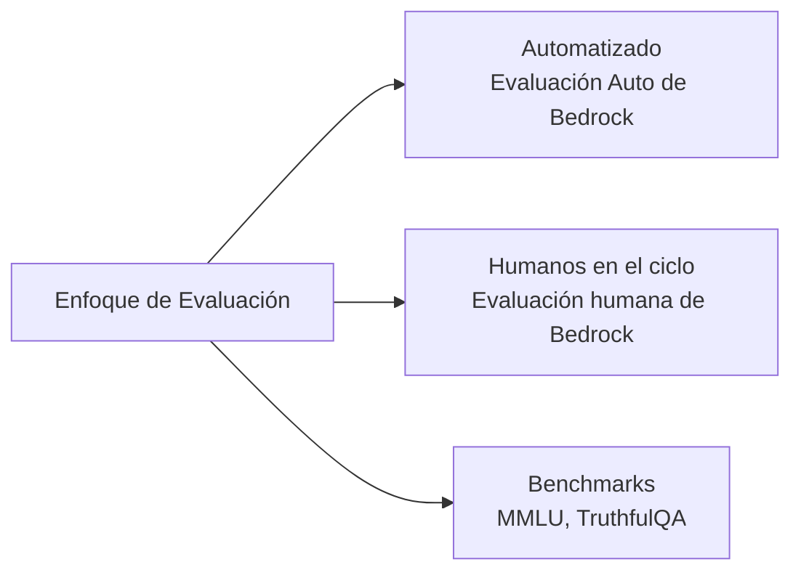
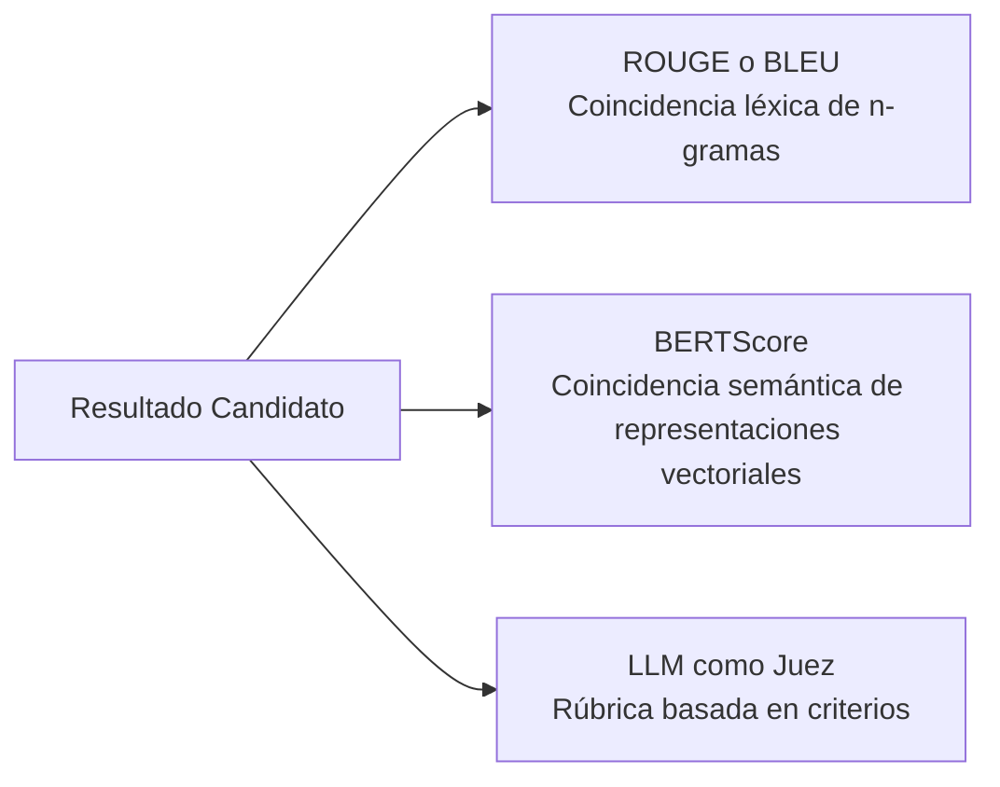
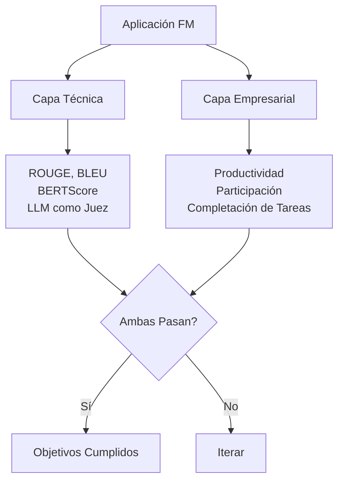
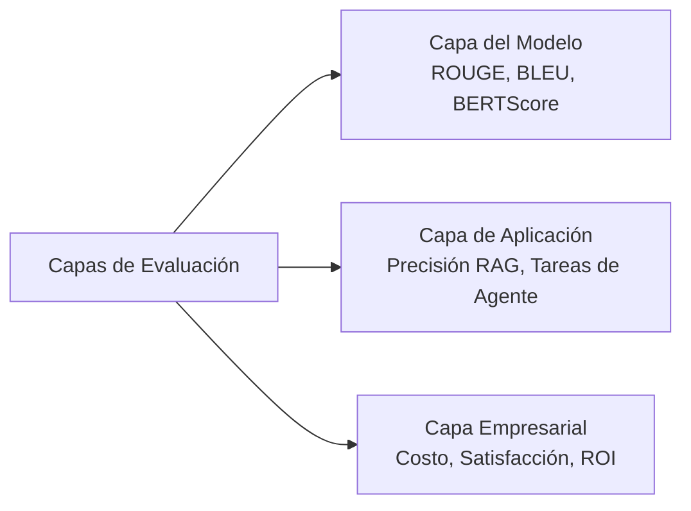

## Enunciado de Tarea 3.4: Describir los métodos para evaluar el rendimiento de los FM

Desplegar una aplicación de modelo fundacional sin un plan de evaluación estructurado es equivalente a lanzar software sin pruebas. Un modelo puede obtener buenas puntuaciones en benchmarks genéricos y aun así fallar en la tarea empresarial para la que fue construido, o puede cumplir con los objetivos técnicos de precisión mientras los usuarios dejan de usarlo silenciosamente. Este enunciado de tarea cubre cómo medir el rendimiento de los FM en tres capas distintas: el modelo en sí mismo, la aplicación construida sobre él y el resultado empresarial que fue desplegado para producir.[^304001]

### 3.4.1 Enfoques para evaluar el rendimiento de los FM

La mayoría de las organizaciones dedica más tiempo a seleccionar un modelo fundacional que a evaluar si realmente funciona adecuadamente con sus datos y tareas. Esa inversión es costosa. Un modelo que supera un tabla de clasificación de propósito general puede seguir teniendo un rendimiento inferior en el vocabulario especializado, las longitudes de documentos o los patrones de razonamiento que requieren los flujos de trabajo de su organización. La evaluación debe tratarse como una actividad de primera clase planificada antes del despliegue, no como una corrida de diagnóstico después de que surjan los problemas.

Existen tres enfoques complementarios para la evaluación de FM. El primero utiliza revisores humanos para juzgar los resultados directamente. El segundo utiliza conjuntos de datos de benchmark curados para medir el rendimiento en tareas estandarizadas. El tercero utiliza un servicio administrado, **Amazon Bedrock Model Evaluation**, para ejecutar tanto evaluaciones automáticas como humanas dentro de un flujo de trabajo controlado y auditable.[^304002]

**La evaluación con humanos en el ciclo** es la práctica de incorporar revisores humanos calificados en el proceso de evaluación para evaluar los resultados del modelo frente a criterios que las métricas automatizadas no pueden capturar, como la corrección factual sobre temas propietarios, la idoneidad del tono o la seguridad.[^304003] El examen actualizó este término de "evaluación humana" a "evaluación con humanos en el ciclo" en la versión 1.1 para enfatizar que los humanos no están ejecutando la evaluación de principio a fin; se insertan en puntos de juicio específicos dentro de una canalización automatizada más amplia.

En producción aparecen tres patrones comunes de evaluación con humanos en el ciclo:

- **Comparación lado a lado**: Se presentan a un revisor dos resultados del modelo para la misma instrucción, y el revisor selecciona el mejor sin saber cuál modelo produjo cada uno. Este diseño elimina el sesgo de anclaje y produce una clasificación relativa entre versiones de modelos o entre modelos candidatos. Es el formato estándar para la recopilación de preferencias en los estudios de *aprendizaje por refuerzo a partir de retroalimentación humana (RLHF)*.
- **Revisión de expertos**: Los expertos en la materia (médicos, abogados, ingenieros) evalúan si los resultados son factualmente correctos y adecuados para el dominio. Los trabajadores generales pueden juzgar la fluidez y el tono; se requieren expertos de dominio para juzgar la corrección en campos especializados.
- **Puntuación basada en rúbrica**: Los revisores puntúan los resultados en una escala del 1 al 5 a través de dimensiones definidas, como relevancia, coherencia, seguridad y precisión de las citas. La puntuación basada en rúbrica produce datos numéricos que pueden agregarse y rastrearse a lo largo del tiempo.

**Amazon Mechanical Turk** (para anotación de alto volumen) y **Amazon SageMaker Ground Truth** (para flujos de trabajo de etiquetado administrados) pueden proporcionar la fuerza de trabajo de revisores humanos para estos patrones.[^304004] **Amazon Augmented AI (A2I)** proporciona la capa de flujo de trabajo de revisión humana para los modelos alojados en SageMaker y las canalizaciones de inferencia personalizadas: enruta los resultados de inferencia a un equipo de revisión cuando se cumplen las condiciones definidas por el desarrollador, recopila las calificaciones y devuelve los resultados.[^304005] A2I es particularmente útil para escenarios de monitoreo de producción donde un modelo maneja miles de solicitudes por día y solo un subconjunto muestreado requiere revisión humana. **Amazon Bedrock Model Evaluation** proporciona sus propios trabajos de evaluación humana que pueden configurarse con un equipo de revisores interno o con una fuerza de trabajo administrada por AWS; esa ruta es la predeterminada para evaluar los modelos fundacionales alojados en Bedrock y se cubre más adelante en esta sección.

Los conjuntos de datos de benchmark son colecciones estandarizadas de instrucciones y respuestas de referencia utilizadas para medir el rendimiento de un modelo en dimensiones de capacidad específicas.[^304006] Cuatro benchmarks aparecen de manera consistente en la literatura relevante para el examen:

- **MMLU** (*Comprensión del Lenguaje en Múltiples Tareas Masivas*, o *Massive Multitask Language Understanding*): 57 materias académicas que abarcan STEM, humanidades, derecho y medicina. Evalúa la amplitud del conocimiento general y el razonamiento.[^304007]
- **HellaSwag**: Razonamiento de sentido común y completación de oraciones. Mide si un modelo puede predecir la continuación más plausible de un escenario cotidiano.[^304008]
- **TruthfulQA**: Preguntas diseñadas para investigar si un modelo produce respuestas factualmente correctas sobre temas donde existen conceptos erróneos populares. Un modelo optimizado para la plausibilidad en lugar de la precisión obtendrá una puntuación baja aquí.[^304009]
- **HumanEval**: Un conjunto de problemas de programación con casos de prueba, utilizado para medir la capacidad de generación de código de un modelo. Un modelo supera un problema si el código que produce pasa las pruebas unitarias asociadas.[^304010]

Los benchmarks proporcionan una línea de base estandarizada y reproducible entre versiones de modelos y proveedores, pero tienen una limitación bien documentada llamada *saturación de benchmarks*: los modelos entrenados después de que se publica un benchmark pueden absorber inadvertidamente las respuestas del benchmark a través de datos de entrenamiento rastreados en la web, inflando las puntuaciones más allá de las mejoras de capacidad genuinas.[^304011] Los equipos empresariales deben tratar las clasificaciones de benchmarks como una herramienta de filtrado, no como un veredicto final.

**Amazon Bedrock Model Evaluation** es el servicio administrado de AWS para ejecutar evaluaciones automáticas y humanas de los modelos disponibles a través de Amazon Bedrock.[^304012] Admite dos tipos de trabajos. Un trabajo de *evaluación automática* ejecuta el modelo seleccionado frente a un conjunto de datos de instrucciones integrado o personalizado y puntúa las respuestas usando métricas como precisión, robustez y toxicidad sin requerir revisores humanos. Un trabajo de *evaluación humana* enruta los resultados del modelo a una fuerza de trabajo de revisores, configurable como un equipo interno o como una fuerza de trabajo administrada por AWS, y recopila sus calificaciones en criterios definidos.[^304013]

Las métricas automáticas integradas en Bedrock Model Evaluation incluyen precisión (para tareas de respuesta a preguntas con una respuesta de referencia), robustez (medida perturbando las instrucciones y verificando la consistencia de los resultados) y toxicidad (puntuada por un clasificador que señala contenido dañino u ofensivo).[^304014] Los conjuntos de datos de instrucciones personalizados permiten a las organizaciones evaluar con sus propias entradas representativas en lugar de depender de conjuntos de datos genéricos, cerrando la brecha entre el rendimiento en benchmarks y el comportamiento en producción.

*Figura 3.4.1: Tres enfoques de evaluación de FM. Las métricas automáticas, la revisión con humanos en el ciclo y los benchmarks estandarizados cubren cada uno lo que los otros omiten; los programas de producción típicamente usan los tres en combinación.*

### 3.4.2 Métricas relevantes para evaluar el rendimiento de los FM

Elegir la métrica correcta depende de lo que se pide al modelo que produzca. Un modelo de resumen y un modelo de traducción producen texto, pero la calidad de ese texto se mide mejor de manera diferente. Un modelo que genera código se mide mejor por si el código se ejecuta correctamente. Esta sección cubre las cuatro métricas que especifica el examen: ROUGE, BLEU, BERTScore y LLM como juez.

**ROUGE** (*Estudio de Referencia Orientado a Recuperación para la Evaluación de Síntesis*, o *Recall-Oriented Understudy for Gisting Evaluation*) mide la superposición entre un resumen generado y uno o más resúmenes de referencia escritos por humanos.[^304015] La variante más común, ROUGE-L, cuenta la subsecuencia común más larga de palabras entre el candidato y la referencia. Una puntuación ROUGE alta significa que el modelo usó muchas de las mismas palabras que la referencia escrita por humanos. ROUGE es la métrica estándar para la evaluación de resúmenes porque el resumen tiene un criterio claro de éxito: la información clave del documento fuente debe estar presente en el resumen.

ROUGE tiene una limitación conocida: es una medida léxica a nivel de superficie. Si el modelo produce un resumen que dice "el cliente rescindió el acuerdo" mientras la referencia dice "el cliente canceló el contrato", las puntuaciones de ROUGE serán bajas a pesar de que las dos oraciones son semánticamente idénticas. Por esta razón, ROUGE es más confiable cuando los resúmenes de referencia son en sí mismos diversos (que cubren múltiples formulaciones válidas) y cuando el corpus de evaluación es lo suficientemente grande como para suavizar la variación de formulación en muchos ejemplos.

**BLEU** (*Estudio de Referencia Bilingüe*, o *Bilingual Evaluation Understudy*) fue desarrollado específicamente para la traducción automática y mide la *precisión*: qué fracción de los n-gramas (secuencias de palabras) en la salida candidata aparece en la traducción de referencia.[^304016] A diferencia de ROUGE, que está orientado a la recuperación, BLEU penaliza a los candidatos que producen resultados cortos para manipular la recuperación y luego añade una penalización por brevedad para descontar las traducciones demasiado cortas. BLEU sigue siendo la métrica estándar en el benchmarking de traducción automática. Su limitación refleja la de ROUGE: recompensa la superposición exacta a nivel de palabras y no puede acreditar una traducción que use sinónimos o reestructure frases sin cambiar el significado.

**BERTScore** aborda la limitación de coincidencia léxica tanto de ROUGE como de BLEU al usar un modelo BERT preentrenado para calcular la *similitud semántica* entre el candidato y la referencia a nivel de token.[^304017] En lugar de contar coincidencias exactas de palabras, BERTScore codifica ambos textos en vectores de alta dimensión y mide la similitud coseno entre los tokens correspondientes. Una oración candidata que usa palabras diferentes para expresar el mismo significado obtendrá una puntuación más alta en BERTScore que en ROUGE o BLEU. BERTScore es más robusto a la paráfrasis y se usa cada vez más en la evaluación de resúmenes, traducción y calidad general de texto, particularmente cuando se espera o se desea diversidad en los resultados.

La compensación práctica entre las tres métricas es que ROUGE y BLEU son rápidas, deterministas y no requieren llamadas de inferencia adicionales, mientras que BERTScore requiere ejecutar el codificador BERT tanto en el candidato como en la referencia, añadiendo costo de cómputo y latencia. Para canalizaciones de evaluación automatizada a gran escala, los equipos a menudo calculan ROUGE y BLEU por velocidad y añaden BERTScore como verificación secundaria sobre un subconjunto muestreado.

**LLM como juez** es un enfoque más reciente, añadido a la guía del examen v1.1, en el que un *modelo juez* separado y de alta calidad evalúa los resultados del modelo bajo prueba frente a criterios definidos.[^304018] El juez recibe una instrucción que contiene la pregunta original, la respuesta del modelo y una rúbrica de puntuación, y devuelve una puntuación o un juicio de preferencia comparativa. El enfoque es más rápido y económico que la evaluación humana: una sola llamada de inferencia del modelo juez reemplaza el tiempo y el costo de un revisor humano. También escala sin una fuerza de trabajo de revisores, haciéndolo práctico para evaluar modelos en decenas de miles de ejemplos.

Las advertencias son reales e importantes para las respuestas del examen. LLM como juez tiene tres sesgos bien documentados.[^304019] El *sesgo posicional* es la tendencia a favorecer al candidato que aparece primero en la instrucción. El *sesgo de longitud* es la tendencia a puntuar más alto las respuestas más largas incluso cuando la precisión no cambia. El *sesgo de autopromoción* ocurre cuando un modelo se usa para juzgar sus propios resultados: favorece el texto que se parece a su propio estilo. Por estas razones, las canalizaciones de producción de LLM como juez típicamente usan un modelo juez diferente y generalmente más grande que el modelo que se evalúa, rotan el orden de los candidatos en las comparaciones lado a lado y calibran los resultados del juez frente a un conjunto reservado de calificaciones humanas.

*Tabla 3.4.1: Comparación de métricas de calidad de resultados de FM*

| Métrica | Dominio de tarea | Qué mide | Fortalezas | Limitaciones |
|---|---|---|---|---|
| ROUGE | Resumen | Recuperación a nivel de palabras frente a referencia | Rápida, estándar, no requiere modelo | Penaliza paráfrasis válidas |
| BLEU | Traducción | Precisión a nivel de palabras frente a referencia | Rápida, estándar, penaliza brevedad | Penaliza sinónimos válidos |
| BERTScore | Calidad general de texto | Similitud semántica mediante representaciones vectoriales BERT | Robusta a la paráfrasis | Requiere inferencia BERT, costo de cómputo |
| LLM como juez | Cualquier tarea generativa | Puntuación basada en criterios por un modelo juez | Escalable, criterios flexibles | Sesgo posicional, de longitud y de autopromoción |

*Figura 3.4.2: Selección de métricas de calidad de resultados. Las métricas léxicas son rápidas pero superficiales; las métricas semánticas toleran la paráfrasis; las métricas basadas en criterios son flexibles pero requieren controles de sesgo.*

### 3.4.3 Determinar si un FM cumple los objetivos empresariales

Las métricas técnicas responden a la pregunta "¿el modelo está produciendo buen texto?" Los objetivos empresariales responden a una pregunta diferente: "¿el modelo está resolviendo el problema para el que fue desplegado?" La distinción importa porque un modelo que obtiene 0.72 en ROUGE puede o no estar mejorando la productividad de los analistas. Un modelo que logra una puntuación BERTScore alta en las respuestas de servicio al cliente puede o no estar reduciendo las tasas de escalación de tickets.

Determinar si un FM cumple los objetivos empresariales requiere conectar el comportamiento del modelo con resultados medibles que interesen a los interesados empresariales. El examen identifica tres categorías: productividad, participación del usuario e ingeniería de tareas.

**La productividad** mide el tiempo o esfuerzo ahorrado por tarea.[^304020] Un equipo legal que usa un FM para redactar resúmenes de contratos debería poder informar que cada abogado ahora dedica 20 minutos a la revisión de resúmenes en lugar de 90 minutos a la redacción manual. Un equipo de herramientas para desarrolladores que usa un modelo de completación de código debería medir el rendimiento de solicitudes de incorporación de cambios o el tiempo hasta la primera confirmación antes y después de la adopción. Las mejoras de productividad son el argumento financiero más directo para el despliegue de FM y se miden mejor a través de pilotos controlados donde un grupo de tratamiento usa la herramienta con tecnología FM y un grupo de control no lo hace.

**La participación del usuario** cubre si los usuarios realmente usan el sistema, con qué profundidad interactúan con él y si regresan.[^304021] Los indicadores relevantes incluyen sesiones por usuario por semana, profundidad promedio de la sesión (número de turnos antes de que el usuario termine la conversación o abandone la tarea) y tasa de retorno (la proporción de usuarios que usan el sistema nuevamente después de su primera sesión). Los datos de participación señalan si la aplicación FM está resolviendo un problema que los usuarios valoran o si los usuarios la están abandonando después de una experiencia inicial deficiente. Un FM que produce resultados técnicamente precisos pero que está enmarcado de manera confusa o responde demasiado lentamente mostrará una participación en declive incluso si sus puntuaciones ROUGE son estables.

**La ingeniería de tareas** es el término del examen AWS para si el flujo de trabajo con tecnología FM realmente completa la tarea empresarial de extremo a extremo, sin requerir una intervención humana alternativa a tasas que anulan la ganancia de eficiencia.[^304022] (Fuera de los materiales de AWS, la misma idea se llama más comúnmente *tasa de completación de flujo de trabajo* o *tasa de completación autónoma*.) Un bot de servicio al cliente que resuelve el 80% de las consultas de forma autónoma está logrando su objetivo de ingeniería de tareas si el objetivo era el 75%. Un flujo de trabajo de revisión de documentos que requiere que un humano corrija el 60% de los resúmenes generados por FM antes de archivarlos no lo está. La ingeniería de tareas en este objetivo se enfoca en el flujo de trabajo tal como está desplegado; la sección 3.4.5 introduce la *tasa de completación de tareas* como la versión a nivel de objetivo del usuario de la misma idea, aplicada a si se completó la tarea empresarial subyacente del usuario.

La implicación práctica para los escenarios del examen es que una pregunta que describe síntomas como "los usuarios no regresan" o "el FM completa el primer paso pero un humano debe terminar el resto" debe dirigir el pensamiento hacia las métricas de participación e ingeniería de tareas respectivamente, no hacia ROUGE o BLEU. El modelo puede ser técnicamente competente pero estar fallando a nivel del flujo de trabajo.

*Figura 3.4.3: Marco de evaluación dual. Un modelo debe pasar tanto las capas de evaluación técnica como empresarial para considerarse apto para el despliegue previsto.*

### 3.4.4 Evaluar el rendimiento de las aplicaciones construidas con FM

Un modelo fundacional rara vez se despliega de forma aislada. Las aplicaciones de producción superponen sistemas de recuperación, orquestación de agentes y flujos de trabajo de múltiples pasos sobre el modelo base. Cada capa introduce sus propios modos de fallo. Evaluar solo el modelo base deja invisibles los fallos de la capa de aplicación hasta que se manifiestan en quejas de producción.

El examen identifica tres arquitecturas de aplicación que cada una requiere su propio enfoque de evaluación: canalizaciones RAG, agentes de IA y flujos de trabajo de múltiples pasos.

**La evaluación RAG** se divide en dos preocupaciones independientes: calidad de recuperación y calidad de generación.[^304023] La calidad de recuperación mide si el almacén de vectores devolvió los documentos correctos cuando se le dio la consulta del usuario. La calidad de generación mide si el modelo produjo una respuesta precisa y fiel dada la documentación recuperada. Un fallo en cualquiera de los dos subsistemas produce una respuesta deficiente, pero la causa raíz y la solución son diferentes.

La calidad de recuperación se mide típicamente usando *precisión@k* y *recuperación@k*, donde k es el número de documentos recuperados.[^304024] Precisión@k pregunta: de los k documentos recuperados, ¿qué fracción eran realmente relevantes? Recuperación@k pregunta: de todos los documentos relevantes en el corpus, ¿qué fracción apareció en los k mejores resultados? Un sistema de recuperación con alta precisión pero baja recuperación encuentra documentos confiables pero omite los importantes. Un sistema con alta recuperación pero baja precisión devuelve todo lo relevante pero lo entierra entre ruido.

La calidad de generación para RAG se mide por *fundamentación* (si la respuesta del modelo está respaldada por los documentos recuperados, no inventada de la memoria paramétrica), *fidelidad de la respuesta* (si las afirmaciones en la respuesta reflejan con precisión lo que dicen los documentos recuperados) y *precisión de las citas* (si las fuentes citadas realmente contienen la información que se les atribuye).[^304025] Herramientas como **Ragas** proporcionan un marco de evaluación de código abierto que calcula estas métricas automáticamente ejecutando un modelo juez sobre los documentos recuperados y la respuesta generada.[^304026]

**La evaluación de agentes** mide si un agente de IA completa las tareas asignadas con precisión, eficiencia y a un costo aceptable.[^304027] Dado que los agentes ejecutan planes de múltiples pasos usando herramientas externas, su superficie de evaluación es mayor que la de un modelo de respuesta única. Las métricas relevantes incluyen:

- **Tasa de completación de tareas**: El porcentaje de tareas asignadas que el agente completa sin intervención humana o salida por estado de error.
- **Precisión de selección de herramientas**: Si el agente eligió la herramienta correcta en cada paso (relevante cuando el agente tiene acceso a múltiples API y la elección correcta es determinista dada la descripción de la tarea).
- **Eficiencia de pasos**: El número de llamadas a herramientas necesarias para completar una tarea, en comparación con el número mínimo que requeriría un plan bien diseñado. Los conteos de pasos altos sugieren que el agente está replanificando innecesariamente o produciendo argumentos de herramientas incorrectos que desencadenan reintentos.
- **Costo por tarea**: El costo total de inferencia y llamadas a herramientas necesario para completar una tarea. Esta es una métrica empresarial directa para los agentes que se ejecutan a escala.

Amazon Bedrock proporciona capacidades de evaluación de agentes para Bedrock Agents y los agentes desplegados en AgentCore, incluidos arneses de prueba, trazas por paso y trabajos de evaluación integrados alineados con las métricas de agentes anteriores; consulte la Guía del Usuario de Amazon Bedrock vigente para los nombres de características y el alcance exactos, ya que la superficie de evaluación de agentes continúa evolucionando.[^304028]

**La evaluación de flujos de trabajo** se aplica a las canalizaciones de múltiples pasos que combinan llamadas a FM, recuperaciones RAG, lógica empresarial y transferencias a humanos en un proceso empresarial completo.[^304029] Las métricas incluyen la tasa de éxito de extremo a extremo (qué proporción de instancias del flujo de trabajo se completan sin una salida por error o un reemplazo humano forzado), la distribución de categorías de error (qué paso produce fallos con más frecuencia) y la tasa de reserva (con qué frecuencia el flujo de trabajo enruta a una ruta de reserva humana).

*Tabla 3.4.2: Métricas de evaluación por arquitectura de aplicación*

| Arquitectura | Métricas de recuperación | Métricas de generación | Métricas empresariales |
|---|---|---|---|
| FM base solamente | No aplicable | ROUGE, BLEU, BERTScore, LLM como juez | Productividad, participación |
| Canalización RAG | Precisión@k, Recuperación@k | Fundamentación, Fidelidad, Precisión de citas | Completación de tareas, satisfacción del usuario |
| Agente de IA | Precisión de selección de herramientas, Eficiencia de pasos | Corrección de respuestas, Tasa de alucinaciones | Tasa de completación de tareas, Costo por tarea |
| Flujo de trabajo de múltiples pasos | No aplicable | Distribución de categorías de error | Tasa de éxito de extremo a extremo, Tasa de reserva |

*Figura 3.4.4: Arquitectura de evaluación por capas. Cada capa de la pila de aplicaciones requiere su propio enfoque de evaluación; los fallos en cualquier capa afectan el resultado empresarial.*

### 3.4.5 Métricas de alineación con objetivos empresariales para aplicaciones de IA

Las métricas de la Sección 3.4.2 indican si el modelo está funcionando bien técnicamente. Las métricas de la Sección 3.4.4 indican si la aplicación está funcionando correctamente. Las métricas de alineación con objetivos empresariales responden a la pregunta que realmente le importa al ejecutivo patrocinador: ¿esta inversión en IA está generando valor?

La guía del examen v1.1 añadió esto como un objetivo distinto, señalando que el examen espera que los candidatos comprendan la brecha entre la medición técnica y la responsabilidad empresarial y que conozcan qué instrumentos cierran esa brecha.

**La tasa de completación de tareas** es el porcentaje de tareas iniciadas por el usuario que la aplicación de IA completa con éxito sin requerir que el usuario abandone la tarea, busque ayuda de otro canal o escale a un agente humano.[^304030] Se distingue de la tasa de completación de tareas del agente (Sección 3.4.4) en alcance: la completación de tareas del agente mide si la capa de orquestación terminó su plan, mientras que la completación de tareas empresariales mide si se cumplió el objetivo subyacente del usuario. Un usuario que le pidió a la IA que reservara una sala de conferencias, recibió una confirmación, pero luego descubrió que la sala ya estaba ocupada no experimentó una tarea completada desde una perspectiva empresarial, aunque todas las llamadas a la API del agente devolvieran códigos de éxito.

La tasa de completación de tareas es la única métrica que conecta más directamente el comportamiento de la aplicación FM con el caso de negocio para el despliegue. Si la aplicación se desplegó para reducir el número de tickets de soporte que llegan a un agente humano, la tasa de completación de tareas mide exactamente qué tan bien está logrando ese objetivo. Para los escenarios del examen, la tasa de completación de tareas es la MEJOR respuesta cuando la pregunta pide cómo medir si una aplicación de IA está cumpliendo su objetivo empresarial principal.

**La satisfacción del usuario** captura cómo perciben los usuarios la calidad de sus interacciones con la aplicación de IA.[^304031] Los instrumentos comunes incluyen encuestas posteriores a la interacción (*CSAT*, la Puntuación de Satisfacción del Cliente, donde los usuarios califican su experiencia en una escala numérica), *NPS* (Net Promoter Score, que pregunta si el usuario recomendaría la aplicación a un colega) y retroalimentación dentro del producto (calificaciones de pulgar arriba/abajo recopiladas al final de cada respuesta). A diferencia de la tasa de completación de tareas, que es una medida objetiva de lo que sucedió, la satisfacción del usuario es una medida subjetiva de cómo se sintió el usuario al respecto. Ambas son necesarias. Un asistente de informes de gastos que resuelve las presentaciones en dos clics pero usa un tono brusco puede ver caer el CSAT por debajo de 3.5 incluso cuando su tasa de completación de tareas se mantiene por encima del 90%; los usuarios buscarán una herramienta diferente cuando esté disponible.

**El costo por interacción** mide el costo total en la nube y de licencias incurrido para atender una solicitud de usuario a través de toda la pila de la aplicación, desde la llamada a la API hasta el paso de recuperación (si está presente), hasta la llamada de inferencia al FM y cualquier procesamiento posterior.[^304032] En una canalización RAG, el costo por interacción incluye la llamada al modelo de representación vectorial, la operación de búsqueda vectorial y la llamada de generación al FM. En un flujo de trabajo de agente, incluye cada paso de llamada a herramienta e inferencia en el plan. El costo por interacción debe rastrearse frente al valor o ingresos por interacción para determinar si la economía unitaria de la aplicación es viable a escala. Una aplicación que cuesta $0.05 por interacción y genera $0.10 de valor medido (a través de ahorros por desvío de tickets, por ejemplo) es sostenible. Una que cuesta $0.08 por interacción por el mismo valor de $0.10 deja poco margen para el margen de la infraestructura.

El seguimiento de estas métricas requiere conectar la telemetría de la aplicación de IA con una capa de inteligencia empresarial. **Amazon CloudWatch** recopila métricas operativas, registros y trazas de Amazon Bedrock y el código de la aplicación, incluida la latencia, las tasas de error y los conteos de invocaciones por modelo.[^304033] Estas señales operativas pueden combinarse con eventos de la capa de aplicación (tarea completada, usuario dio pulgar hacia abajo, costo de interacción registrado) para construir una imagen completa. **Amazon QuickSight** se conecta a los datos de CloudWatch y a otras fuentes de datos para producir paneles que presentan la tasa de completación de tareas, las tendencias de satisfacción del usuario y el costo por interacción en formatos accesibles para los interesados empresariales que no leen directamente los gráficos de métricas de CloudWatch.[^304034]

*Tabla 3.4.3: Métricas de alineación empresarial para aplicaciones de IA*

| Métrica | Qué mide | Fuente de datos | Interesado | Decisión que informa |
|---|---|---|---|---|
| Tasa de completación de tareas | Si se cumplen los objetivos del usuario | Registros de eventos de la aplicación | Producto, Operaciones | Ajustar el alcance o la lógica de reserva |
| Satisfacción del usuario (CSAT, NPS) | Percepción del usuario sobre la calidad | Encuestas posteriores a la interacción, retroalimentación de pulgares | Producto, CX | Mejorar la calidad de las respuestas o la UX |
| Costo por interacción | Economía unitaria de la entrega de IA | Datos de facturación e invocaciones de CloudWatch | Finanzas, Ingeniería | Optimizar el nivel de modelo, caché o flujo de trabajo |

Un programa de evaluación bien diseñado monitorea las tres métricas empresariales de forma continua, no solo en el lanzamiento. La tasa de completación de tareas puede disminuir a medida que las consultas de los usuarios se alejan de los patrones con los que se probó el modelo. La satisfacción del usuario puede disminuir a medida que la novedad se desvanece y los usuarios comparan la IA con alternativas mejoradas. El costo por interacción puede aumentar si los patrones de uso se desplazan hacia consultas más largas y complejas. La revisión regular de las tres métricas frente a umbrales definidos es la disciplina operativa que distingue un producto de IA gestionado de un prototipo que fue enviado y olvidado.

## Preguntas de autoevaluación

**Pregunta 1.** Una organización de atención médica está desplegando una herramienta con tecnología FM que ayuda a las enfermeras a recuperar información de protocolos clínicos. Antes de entrar en producción, el equipo quiere verificar que el modelo produzca respuestas factualmente precisas y adecuadas para el dominio sobre vocabulario médico especializado. ¿Qué enfoque de evaluación es MÁS apropiado para este requisito?

A. Ejecutar el modelo contra el benchmark MMLU y aceptarlo si la puntuación supera el 70%  
B. Usar Amazon Bedrock Model Evaluation con un trabajo automático de detección de toxicidad  
C. Usar Amazon Augmented AI (A2I) para enrutar los resultados del modelo a expertos clínicos para una puntuación basada en rúbrica  
D. Calcular puntuaciones BLEU frente a un conjunto de resúmenes clínicos de referencia  

**Explicación.** La restricción clave en este escenario es la corrección factual específica del dominio evaluada por personas que pueden juzgar si una respuesta médica es clínicamente precisa. Los trabajadores generales y las métricas automatizadas no pueden hacer ese juicio. La Respuesta C es correcta: Amazon A2I admite flujos de trabajo de evaluación con humanos en el ciclo que pueden enrutar los resultados a un grupo de revisores definido, como un panel de enfermeras o médicos clínicos, que califican las respuestas en una rúbrica que cubre precisión, claridad e idoneidad. La Respuesta A es incorrecta porque MMLU es un benchmark académico general; obtener un 70% en 57 materias académicas no indica si el modelo maneja las consultas de protocolos clínicos correctamente, y el umbral no tiene relación con los requisitos de seguridad clínica. La Respuesta B es incorrecta porque un trabajo de toxicidad mide si el modelo produce contenido dañino u ofensivo; no evalúa la precisión clínica. La Respuesta D es incorrecta porque BLEU mide la precisión a nivel de palabras frente a un texto de referencia y no capturaría si la información clínica transmitida es correcta; una respuesta plausible pero factualmente incorrecta podría obtener una buena puntuación en BLEU si comparte vocabulario con la referencia.[^304035]

---

**Pregunta 2.** Una organización está comparando dos modelos fundacionales para una tarea de resumen de noticias. Ambos modelos producen inglés fluido. El equipo de evaluación tiene un conjunto de 500 resúmenes de referencia escritos por humanos para los mismos artículos. ¿Qué métrica es MÁS apropiada como señal de evaluación principal para esta tarea?

A. BERTScore, porque mide la similitud semántica y tolera la paráfrasis  
B. BLEU, porque fue diseñado para evaluar la generación de texto frente a referencias  
C. ROUGE, porque fue diseñado específicamente para el resumen y mide la recuperación del contenido clave  
D. LLM como juez, porque un modelo juez puede puntuar la coherencia sin un resumen de referencia  

**Explicación.** ROUGE (Respuesta C) fue desarrollado específicamente para la evaluación de resúmenes y su diseño refleja el requisito central de esa tarea: un buen resumen debe contener la información clave del documento fuente, lo cual es un problema de recuperación. ROUGE-L, la variante más común, mide la subsecuencia común más larga de palabras entre el candidato y la referencia, recompensando los resúmenes que cubren los puntos principales en cualquier orden. La Respuesta A es técnicamente válida como métrica secundaria, pero BERTScore requiere ejecutar un codificador BERT en cada par candidato-referencia, añadiendo costo computacional; es más valioso cuando los resúmenes de referencia usan vocabulario variado y la superposición léxica penalizaría injustamente las paráfrasis válidas. Si la organización quiere añadir robustez semántica a la evaluación, BERTScore es un complemento apropiado, no un reemplazo. La Respuesta B es incorrecta porque BLEU es una métrica orientada a la precisión diseñada para la traducción, donde la formulación exacta del idioma objetivo importa; el resumen prioriza la recuperación del contenido más que la precisión de la formulación. La Respuesta D es incorrecta porque LLM como juez es más valioso cuando no hay un resumen de referencia y se requiere un juicio al estilo humano; cuando están disponibles 500 resúmenes de referencia, las métricas basadas en referencia son la señal principal más confiable y reproducible.[^304036]

---

**Pregunta 3.** Una empresa desplegó una herramienta de preguntas y respuestas interno con tecnología RAG hace tres meses. Los usuarios informan que la herramienta a menudo da respuestas que suenan seguras pero contienen información que no se encuentra en los documentos de la empresa. ¿Qué métrica de evaluación identifica MÁS directamente este modo de fallo?

A. Puntuación ROUGE-L frente a respuestas de referencia escritas por humanos  
B. Puntuación de fundamentación que mide si las respuestas están respaldadas por los documentos recuperados  
C. Precisión@k que mide si los documentos recuperados más importantes son relevantes  
D. Tasa de completación de tareas que mide si los usuarios encuentran la herramienta útil  

**Explicación.** El síntoma descrito (respuestas seguras que contienen información no encontrada en los documentos fuente) es la definición de poca *fundamentación*: el modelo está generando contenido de su memoria paramétrica en lugar de los documentos recuperados. La Respuesta B es correcta. La fundamentación se evalúa verificando cada afirmación en la respuesta generada frente al conjunto de documentos recuperados y puntuando qué fracción de las afirmaciones está respaldada por al menos un documento recuperado. Herramientas como Ragas calculan esta métrica automáticamente. La Respuesta A es incorrecta porque ROUGE-L mide la superposición de palabras con una respuesta de referencia humana; no detectaría el contenido alucinado que usa palabras plausibles que no están en la referencia. La Respuesta C es incorrecta porque precisión@k mide la calidad de la recuperación, no de la generación; un sistema de recuperación podría estar devolviendo documentos muy relevantes mientras el modelo los ignora y genera desde la memoria paramétrica. La Respuesta D es incorrecta porque la tasa de completación de tareas mide si se cumplió el objetivo del usuario; el síntoma descrito puede estar causando baja satisfacción sin activar la ruta de fallo de tarea formal que rastrea la aplicación.[^304037]

---

**Pregunta 4.** Un gerente de producto de IA está presentando el caso de negocio de una aplicación de chat de soporte al cliente con tecnología FM al CFO. El CFO pide una única métrica que muestre si la aplicación es financieramente sostenible a escala. ¿Qué métrica MEJOR responde a esta pregunta?

A. Puntuación BLEU en el corpus de respuestas de soporte  
B. Profundidad promedio de la sesión por usuario  
C. Costo por interacción comparado con el valor entregado por interacción  
D. Tasa de reserva a agentes humanos  

**Explicación.** La pregunta del CFO es sobre economía unitaria: ¿cada interacción entrega valor que justifica su costo? El costo por interacción (Respuesta C) mide el gasto total en la nube y de licencias por cada solicitud de usuario a través de toda la pila de la aplicación. Cuando se compara con el valor medido por interacción (por ejemplo, el costo promedio de un agente humano manejando la misma solicitud), establece si la aplicación es financieramente viable a la escala de uso actual y proyectada. La Respuesta A es incorrecta porque BLEU es una métrica de calidad de texto; no tiene ninguna relación con el costo o la sostenibilidad financiera. La Respuesta B (profundidad de sesión) es una métrica de participación que señala si los usuarios encuentran la aplicación valiosa, pero no le dice al CFO nada sobre la estructura de costos. La Respuesta D (tasa de reserva) es una métrica operativa útil que contribuye a comprender la economía, ya que cada reserva a un agente humano incurre en el costo humano completo en lugar del costo de IA, pero es una entrada componente a la imagen financiera, no la vista completa de economía unitaria que el CFO está pidiendo. El costo por interacción, comparado directamente con el valor por interacción, es la métrica que responde a la pregunta del CFO.[^304038]

---

**Pregunta 5.** Un equipo está evaluando una nueva versión de FM para reemplazar el modelo de producción actual. Quieren determinar si el nuevo modelo produce resultados que los revisores humanos prefieren, sin requerir que los revisores sepan qué modelo produjo cada respuesta. ¿Qué enfoque de evaluación responde MÁS directamente a este requisito?

A. Ejecutar ambos modelos contra el benchmark TruthfulQA y comparar las clasificaciones por percentil  
B. Usar LLM como juez con el modelo de producción actual como modelo juez  
C. Usar comparación humana lado a lado con las identidades de los revisores cegadas a la identidad del modelo  
D. Calcular BERTScore para ambos modelos frente al mismo conjunto de resultados de referencia  

**Explicación.** El requisito tiene dos partes: juicio de preferencia humana y cegado (los revisores no deben saber qué modelo produjo cada resultado). La Respuesta C es el patrón de evaluación con humanos en el ciclo diseñado específicamente para este caso de uso. La comparación lado a lado presenta dos resultados a un revisor para la misma instrucción, el revisor selecciona el resultado preferido y el diseño evita el sesgo de anclaje al no etiquetar cuál modelo produjo cada uno. Esto produce directamente una clasificación de preferencias entre las dos versiones del modelo. La Respuesta A es incorrecta porque TruthfulQA es un benchmark para la precisión factual en temas propensos a conceptos erróneos; no mide la preferencia de calidad de resultados general, y la pregunta no menciona la precisión factual como criterio. La Respuesta B es incorrecta de una manera sutil pero importante: usar el modelo de producción actual como modelo juez introduce sesgo de autopromoción; el modelo actual tenderá a calificar más alto los resultados similares a su propio estilo, haciendo la comparación injusta para el nuevo modelo. La Respuesta D es incorrecta porque BERTScore calcula la similitud semántica frente a textos de referencia, no la preferencia humana entre dos resultados candidatos; no captura el juicio cualitativo que el equipo está buscando.[^304039]

---

**Pregunta 6.** Una organización lanzó un asistente de adquisiciones con tecnología FM hace seis semanas. Los datos de uso muestran que el 45% de los usuarios que prueban el asistente no regresan después de su primera sesión. Las puntuaciones ROUGE del modelo en las pruebas de resumen están en el cuartil superior para su familia de modelos. ¿Qué métrica empresarial diagnostica MÁS directamente si este problema de participación se origina en la calidad de los resultados del modelo o en el diseño de la aplicación?

A. Satisfacción del usuario (CSAT o retroalimentación de pulgares) recopilada inmediatamente después de cada interacción  
B. BERTScore calculado frente a un conjunto de respuestas de referencia para consultas de adquisiciones  
C. Tasa de completación de tareas medida por el registro de eventos de la aplicación  
D. Precisión@k para la capa de recuperación RAG  

**Explicación.** El escenario presenta una disociación: las puntuaciones ROUGE son sólidas (lo que sugiere que el modelo produce texto que se superpone bien con las referencias) pero la tasa de retorno es baja (lo que sugiere que los usuarios no encuentran la aplicación lo suficientemente valiosa para volver a usarla). Para diagnosticar si el problema es la calidad de los resultados o el diseño de la aplicación, la organización necesita una señal de los usuarios reales que refleje su experiencia subjetiva, no una señal de métricas automatizadas de superposición de texto. La satisfacción del usuario recopilada inmediatamente después de cada interacción (Respuesta A) captura si los usuarios encontraron la respuesta útil, precisa y entregada de una manera que los hiciera querer volver. Un patrón de CSAT bajo a pesar de un ROUGE alto indicaría que los resúmenes de referencia utilizados para la evaluación ROUGE no reflejan lo que los usuarios realmente valoran en el contexto de adquisiciones, señalando un problema de calidad de resultados o de formulación. Un patrón de CSAT moderado con una tasa de retorno baja señalaría factores de diseño de la aplicación (UX, velocidad, confianza) en lugar del modelo en sí. La Respuesta B es incorrecta porque BERTScore es otra métrica automatizada de calidad de texto que, como ROUGE, mide la similitud con las referencias; no explicaría la brecha entre las puntuaciones técnicas y el comportamiento del usuario. La tasa de completación de tareas (Respuesta C) indicaría si el flujo de trabajo terminó, pero en este escenario el flujo de trabajo ya produce puntuaciones técnicas sólidas; la señal que falta es el juicio subjetivo del usuario sobre esa interacción completada, que solo el CSAT o la retroalimentación de pulgares captura. La Respuesta D es incorrecta porque precisión@k diagnostica la calidad de la recuperación; aunque una recuperación deficiente podría contribuir a respuestas deficientes, sería un paso de investigación secundario después de establecer los datos de satisfacción del usuario.[^304040]

[^304001]: AWS Certification. AI Practitioner (AIF-C01) Exam Guide v1.1, Task Statement 3.4. URL: <https://docs.aws.amazon.com/aws-certification/latest/ai-practitioner-01/ai-practitioner-01-domain3.html>
[^304002]: Amazon Bedrock. Amazon Bedrock Model Evaluation overview. URL: <https://docs.aws.amazon.com/bedrock/latest/userguide/model-evaluation.html>
[^304003]: Amazon A2I. How Amazon Augmented AI works. URL: <https://docs.aws.amazon.com/sagemaker/latest/dg/a2i-how-it-works.html>
[^304004]: Amazon SageMaker. Amazon SageMaker Ground Truth labeling workflows. URL: <https://docs.aws.amazon.com/sagemaker/latest/dg/sms.html>
[^304005]: Amazon A2I. Use Amazon Augmented AI for human review. URL: <https://docs.aws.amazon.com/sagemaker/latest/dg/a2i-use-augmented-ai-a2i-human-review-loops.html>
[^304006]: Liang, P., et al. Holistic Evaluation of Language Models (HELM, 2022). URL: <https://arxiv.org/abs/2211.09110>
[^304007]: Hendrycks, D., et al. Measuring Massive Multitask Language Understanding (MMLU, 2020). URL: <https://arxiv.org/abs/2009.03300>
[^304008]: Zellers, R., et al. HellaSwag: Can a Machine Really Finish Your Sentence? (2019). URL: <https://arxiv.org/abs/1905.07830>
[^304009]: Lin, S., et al. TruthfulQA: Measuring How Models Mimic Human Falsehoods (2021). URL: <https://arxiv.org/abs/2109.07958>
[^304010]: Chen, M., et al. Evaluating Large Language Models Trained on Code (HumanEval, 2021). URL: <https://arxiv.org/abs/2107.03374>
[^304011]: Kiela, D., et al. Dynabench: Rethinking Benchmarking in NLP (2021). URL: <https://arxiv.org/abs/2104.14337>
[^304012]: Amazon Bedrock. Amazon Bedrock Model Evaluation jobs. URL: <https://docs.aws.amazon.com/bedrock/latest/userguide/model-evaluation-jobs.html>
[^304013]: Amazon Bedrock. Human evaluation using Amazon Bedrock Model Evaluation. URL: <https://docs.aws.amazon.com/bedrock/latest/userguide/model-evaluation-human.html>
[^304014]: Amazon Bedrock. Automatic evaluation metrics in Amazon Bedrock Model Evaluation. URL: <https://docs.aws.amazon.com/bedrock/latest/userguide/model-evaluation-automatic.html>
[^304015]: Lin, C.-Y. ROUGE: A Package for Automatic Evaluation of Summaries (2004). URL: <https://aclanthology.org/W04-1013>
[^304016]: Papineni, K., et al. BLEU: a Method for Automatic Evaluation of Machine Translation (2002). URL: <https://aclanthology.org/P02-1040>
[^304017]: Zhang, T., et al. BERTScore: Evaluating Text Generation with BERT (2019). URL: <https://arxiv.org/abs/1904.09675>
[^304018]: Zheng, L., et al. Judging LLM-as-a-Judge with MT-Bench and Chatbot Arena (2023). URL: <https://arxiv.org/abs/2306.05685>
[^304019]: Wang, P., et al. Large Language Models are not Fair Evaluators (2023). URL: <https://arxiv.org/abs/2305.17926>
[^304020]: Microsoft Research. The Total Economic Impact of GitHub Copilot (2023). URL: <https://resources.github.com/downloads/The-Total-Economic-Impact-of-GitHub-Copilot.pdf>
[^304021]: Amazon CloudWatch. Using Amazon CloudWatch to track user engagement metrics for AI applications. URL: <https://docs.aws.amazon.com/AmazonCloudWatch/latest/monitoring/working_with_metrics.html>
[^304022]: Amazon Bedrock. Evaluating agent task completion in Amazon Bedrock. URL: <https://docs.aws.amazon.com/bedrock/latest/userguide/agents-evaluation.html>
[^304023]: Es, S., et al. RAGAS: Automated Evaluation of Retrieval Augmented Generation (2023). URL: <https://arxiv.org/abs/2309.15217>
[^304024]: Manning, C., et al. Introduction to Information Retrieval: Precision and Recall at k (2008). URL: <https://nlp.stanford.edu/IR-book/>
[^304025]: Es, S., et al. RAGAS: Faithfulness and Answer Relevance Metrics (2023). URL: <https://arxiv.org/abs/2309.15217>
[^304026]: Ragas. Ragas: Evaluation framework for RAG pipelines. URL: <https://docs.ragas.io/>
[^304027]: Amazon Bedrock. Evaluating Amazon Bedrock Agents. URL: <https://docs.aws.amazon.com/bedrock/latest/userguide/agents-evaluation.html>
[^304028]: Amazon Bedrock User Guide. Evaluation capabilities for Bedrock Agents and AgentCore. URL: <https://docs.aws.amazon.com/bedrock/latest/userguide/agents.html>
[^304029]: Amazon Bedrock. Multi-step workflow evaluation with Amazon Bedrock. URL: <https://docs.aws.amazon.com/bedrock/latest/userguide/agents-test.html>
[^304030]: Amazon Bedrock. Measuring task completion in Amazon Bedrock application monitoring. URL: <https://docs.aws.amazon.com/bedrock/latest/userguide/model-evaluation.html>
[^304031]: Amazon Connect. Customer satisfaction scoring and AI contact center metrics. URL: <https://docs.aws.amazon.com/connect/latest/adminguide/metrics-definitions.html>
[^304032]: Amazon Bedrock. Monitoring Amazon Bedrock usage and costs with AWS Cost Explorer. URL: <https://docs.aws.amazon.com/bedrock/latest/userguide/monitoring-overview.html>
[^304033]: Amazon CloudWatch. Monitoring Amazon Bedrock with Amazon CloudWatch. URL: <https://docs.aws.amazon.com/bedrock/latest/userguide/monitoring-cloudwatch.html>
[^304034]: Amazon QuickSight. Getting started with Amazon QuickSight dashboards. URL: <https://docs.aws.amazon.com/quicksight/latest/user/getting-started.html>
[^304035]: Amazon A2I. Setting up a human review workflow with Amazon Augmented AI. URL: <https://docs.aws.amazon.com/sagemaker/latest/dg/a2i-create-flow-definition.html>
[^304036]: Lin, C.-Y. ROUGE: A Package for Automatic Evaluation of Summaries: task applicability (2004). URL: <https://aclanthology.org/W04-1013>
[^304037]: Es, S., et al. RAGAS: Groundedness evaluation for RAG pipelines (2023). URL: <https://arxiv.org/abs/2309.15217>
[^304038]: Amazon Bedrock. Tracking Amazon Bedrock invocation costs per application. URL: <https://docs.aws.amazon.com/bedrock/latest/userguide/monitoring-overview.html>
[^304039]: Zheng, L., et al. Judging LLM-as-a-Judge: bias characteristics and mitigations (2023). URL: <https://arxiv.org/abs/2306.05685>
[^304040]: Amazon CloudWatch. Collecting user feedback events in AI application telemetry. URL: <https://docs.aws.amazon.com/AmazonCloudWatch/latest/monitoring/working_with_metrics.html>
