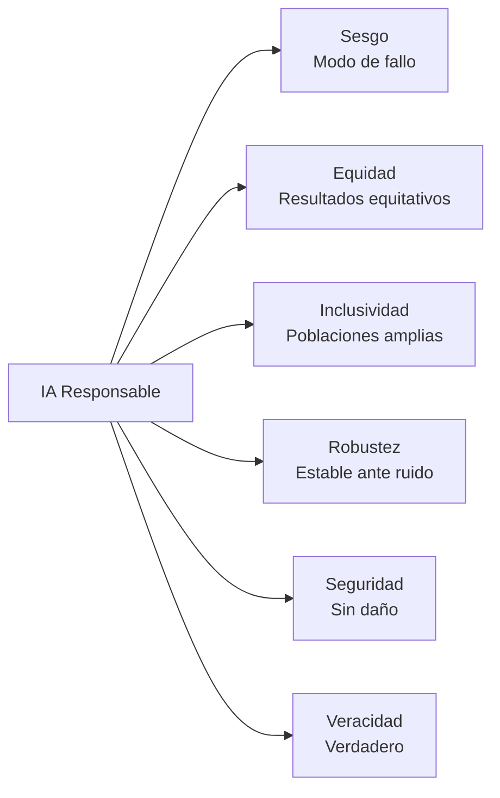
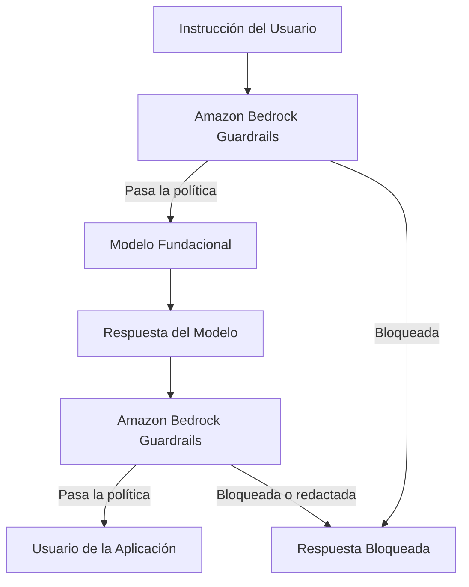
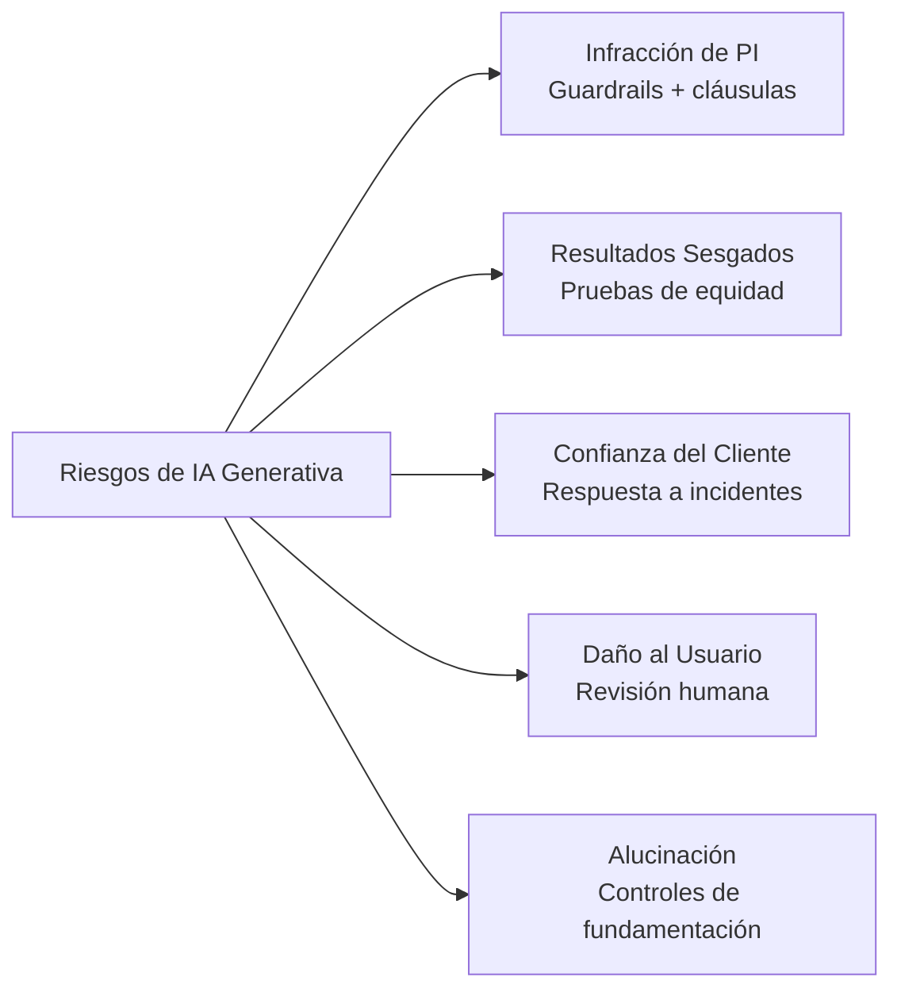
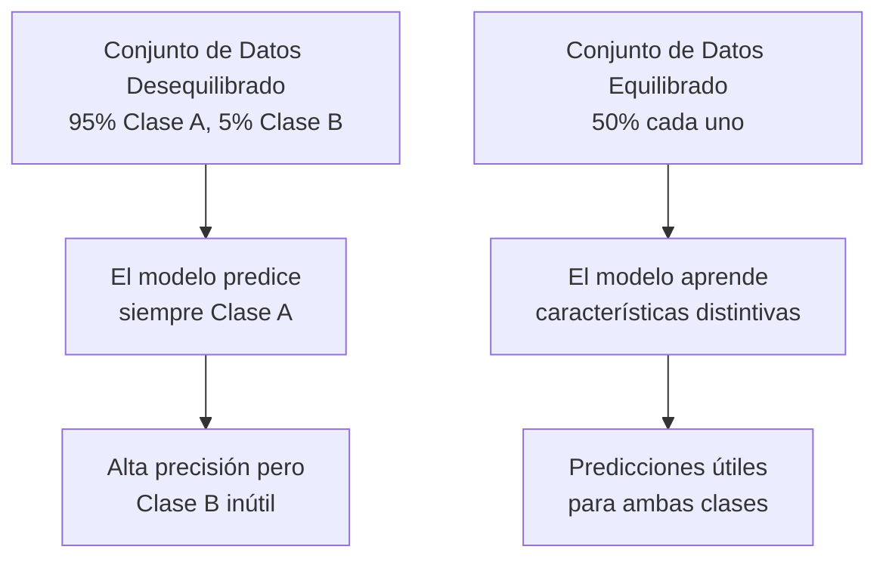
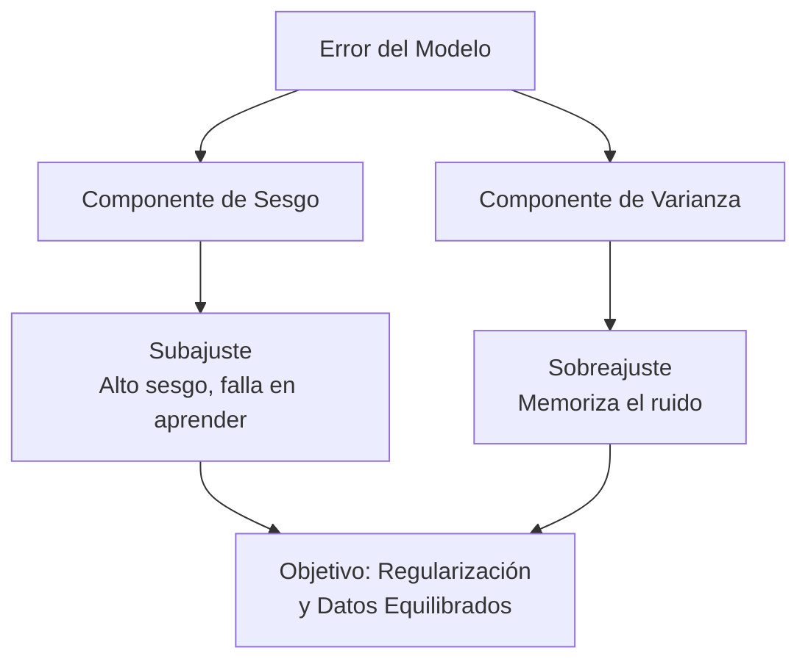

## Enunciado de Tarea 4.1: Explicar el desarrollo de sistemas de IA que son responsables

La IA responsable es un conjunto de compromisos de ingeniería y gobernanza que determinan si un sistema de IA produce resultados que sean justos, precisos y seguros para la totalidad de las personas que afectará. Este capítulo cubre los siete objetivos del Enunciado de Tarea 4.1: las características definitorias de la IA responsable, las herramientas de AWS que refuerzan y detectan esas características, las prácticas responsables para la selección de modelos, los riesgos legales exclusivos de la IA generativa, las características del conjunto de datos que respaldan los sistemas responsables, la mecánica del sesgo y la varianza, y las herramientas de monitoreo que sostienen el comportamiento responsable en producción.[^401001]

### 4.1.1 Características de la IA responsable

Un sistema de IA que se describe como "responsable" no lo es de manera abstracta. La responsabilidad se expresa a través de cinco propiedades concretas y verificables (equidad, inclusividad, robustez, seguridad y veracidad), cada una definida en oposición a un modo de fallo específico como el sesgo, la exclusión, la fragilidad, el daño o la alucinación. El *sesgo* es el modo de fallo que la equidad aborda, y la guía del examen AIF-C01 v1.1 enumera el "sesgo" junto con las cinco propiedades positivas porque el sesgo es el patrón de fallo más comúnmente evaluado en las preguntas de escenario; en este libro cubrimos los seis juntos para que el emparejamiento modo de fallo-propiedad sea explícito.

Las propiedades son distintas pero relacionadas. Un sistema puede fallar en una mientras aprueba otras. Un modelo de decisión de préstamos podría ser robusto ante entradas ruidosas y aun así ser sistemáticamente injusto para un grupo demográfico protegido. Un chatbot de asesoramiento médico podría ser seguro e inclusivo pero frecuentemente impreciso. Las preguntas del examen ponen a prueba si los candidatos pueden nombrar y distinguir estas propiedades, por lo que cada definición importa por sí sola.[^401002] El Marco de Gestión de Riesgos de IA del NIST agrupa estas propiedades bajo lo que denomina "características de confiabilidad", y los candidatos al examen que reconozcan ese enfoque responderán con mayor precisión las preguntas de escenario.[^401050]

Las propiedades son:

- **Sesgo** (el modo de fallo que la equidad aborda): Un sesgo sistemático en las predicciones de un modelo que favorece o penaliza consistentemente a un grupo particular. Por ejemplo, un modelo de selección de currículos entrenado principalmente en contrataciones históricas de una industria dominada por hombres puede clasificar más bajo los currículos idénticos cuando aparece un nombre femenino en la parte superior. El sesgo en este sentido no es un error aleatorio; es un error predecible y direccional que concentra el daño en poblaciones específicas.[^401003]
- **Equidad**: Trato consistente de los individuos en todos los grupos demográficos. Un modelo de préstamos es equitativo si aplica los mismos criterios de decisión independientemente de la raza, el género o la edad del solicitante. La equidad a menudo se mide numéricamente, por ejemplo comparando las tasas de aprobación o las tasas de falsos positivos entre grupos para garantizar que ningún grupo esté desproporcionadamente en desventaja.[^401004]
- **Inclusividad**: El modelo funciona bien para un amplio conjunto de usuarios, incluidos aquellos que pueden estar subrepresentados en los datos de entrenamiento. Un modelo de reconocimiento de imágenes construido principalmente con fotos de rostros de piel más clara puede tener un rendimiento deficiente para los usuarios de piel más oscura. La *inclusividad* aborda esa brecha de cobertura al garantizar que el modelo fue entrenado y probado en toda la población a la que servirá.[^401005]
- **Robustez**: Comportamiento fluido y predecible ante entradas inesperadas o adversariales. Un chatbot de servicio al cliente no debería devolver contenido dañino cuando un usuario envía una consulta con errores ortográficos, y un modelo de detección de fraude no debería colapsar en precisión cuando los volúmenes de transacciones aumentan inesperadamente. La robustez mide qué tan bien un sistema mantiene su comportamiento previsto en los límites de su distribución de entradas.[^401006]
- **Seguridad**: El modelo no causa daño a los usuarios, a terceros ni a la sociedad. La seguridad cubre los riesgos físicos (un modelo que controla maquinaria), los riesgos informacionales (un modelo que proporciona asesoramiento médico peligroso sin advertencias) y los riesgos sistémicos (un modelo que amplifica la desinformación a escala). Los reguladores de la UE categorizan explícitamente los sistemas de IA por nivel de riesgo de seguridad y adjuntan obligaciones legales a cada categoría.[^401007]
- **Veracidad**: El modelo produce resultados verídicos y fundamentados en hechos. Esto es particularmente importante para los modelos de lenguaje grande que pueden generar texto de sonido seguro sobre temas donde los datos de entrenamiento son escasos, incompletos o desactualizados. Las *alucinaciones* son el fallo canónico de veracidad: un modelo fabrica una cita, una estadística o una persona y la presenta como un hecho.[^401008]

*Figura 4.1.1: Las propiedades de IA responsable enumeradas en el examen. El sesgo es el modo de fallo que las otras cinco propiedades positivas están diseñadas para prevenir.*

Estas propiedades no existen de forma aislada. Un conjunto de datos que carece de diversidad demográfica (baja inclusividad a nivel de datos) producirá predicciones sesgadas (el fallo de sesgo) y creará resultados injustos (fallando la propiedad de equidad). Las propiedades se refuerzan mutuamente cuando se cumplen y acumulan fallos cuando se violan; la misma brecha en los datos puede desencadenar simultáneamente sesgo, injusticia y falta de inclusividad.[^401051]

### 4.1.2 Herramientas para identificar características de la IA responsable

Conocer las seis propiedades de la IA responsable es útil solo si existen mecanismos prácticos para hacerlas cumplir a nivel del sistema. AWS proporciona dos herramientas principales para esto: **Amazon Bedrock Guardrails** para aplicaciones de IA generativa y **Amazon SageMaker Clarify** para modelos de aprendizaje automático clásico. Cada una apunta a un punto diferente en la canalización de IA y a un tipo diferente de riesgo.[^401009]

**Amazon Bedrock Guardrails** aplica una capa de política configurable entre una aplicación y cualquier modelo fundacional al que se accede a través de Amazon Bedrock. Cuando un usuario envía una instrucción o cuando el modelo devuelve una respuesta, Guardrails evalúa el contenido frente a la política configurada y lo permite, lo modifica o lo bloquea por completo. Esto ocurre de forma transparente para el modelo subyacente, lo que significa que el mismo guardrail puede proteger múltiples modelos sin cambiar el modelo en sí.[^401010]

Guardrails agrupa sus controles en varios tipos de filtros:

- **Filtros de contenido**: Bloquean o redactan contenido en cinco categorías de daño predefinidas: *odio*, *insultos*, *sexual*, *violencia* e *infracciones*. Cada categoría puede configurarse con un umbral de bajo a alto dependiendo de la sensibilidad de la aplicación. Una plataforma de educación infantil establecería todos los umbrales al máximo de restricción; una herramienta de investigación en ciberseguridad podría permitir más contenido técnico.[^401011]
- **Filtro de ataques a instrucciones**: Un detector separado para patrones de jailbreak e inyección de instrucciones en la entrada del usuario, distinto de las categorías de daño anteriores. Esta es la política que detecta los intentos de anular la instrucción del sistema o eludir las reglas de contenido.
- **Filtros de temas**: Temas de lista de denegación que la aplicación no debe discutir. Una empresa de servicios financieros podría configurar Guardrails para rechazar cualquier respuesta que proporcione asesoramiento de inversión específico, derivando esas consultas a un asesor autorizado. La empresa define qué cuenta como un tema denegado usando descripciones en lenguaje natural, y Guardrails usa coincidencia semántica para interceptar consultas relacionadas incluso cuando se formulan de manera diferente.[^401012]
- **Filtros de palabras**: Bloquean palabras o frases específicas independientemente del contexto, incluida una lista de profanidades incorporada que puede habilitarse sin configuración personalizada. Esta capa maneja la profanidad, los nombres de marcas de competidores o los nombres en clave internos que no deben aparecer en las respuestas orientadas al cliente.[^401013]
- **Filtros de información confidencial**: Detectan información de identificación personal como nombres, números de teléfono, direcciones de correo electrónico, números de seguro social y números de tarjeta de crédito. El filtro puede bloquear la solicitud o redactar el valor detectado con un marcador de posición antes de que la respuesta llegue al usuario, ayudando a las organizaciones a cumplir los requisitos de minimización de datos en las regulaciones de privacidad.[^401014][^401016]
- **Verificaciones de fundamentación contextual**: Evalúan si la respuesta de un modelo está fundamentada en los documentos fuente que se le proporcionan (para aplicaciones de generación aumentada por recuperación) y si la respuesta es relevante para la consulta del usuario. Este es el control principal de veracidad en Guardrails: asigna una puntuación de fundamentación y una puntuación de relevancia y puede bloquear las respuestas que caen por debajo de umbrales configurables.[^401015]

A nivel conceptual, una política de Guardrails se lee como un conjunto estructurado de reglas: "Bloquear el discurso de odio con el umbral ALTO. Denegar temas relacionados con el asesoramiento de inversión. Redactar cualquier dirección de correo electrónico en las respuestas. Requerir una puntuación de fundamentación de al menos 0.75 para las respuestas de recuperación." Un arquitecto configura estas reglas una vez y adjunta el guardrail a cualquier llamada de inferencia realizada a través de Bedrock.[^401053] Guardrails admite la evaluación independiente tanto de la instrucción del usuario como de la respuesta del modelo, por lo que un solo guardrail puede detener una consulta dañina antes de que llegue al modelo o bloquear una respuesta dañina antes de que llegue al usuario.[^401054]

**Amazon SageMaker Clarify** aborda el sesgo en los modelos de aprendizaje automático clásico en lugar de en la IA generativa. Analiza los datos de entrenamiento y las predicciones del modelo para calcular métricas de sesgo, como la diferencia en las tasas de predicción positiva entre grupos demográficos. Por ejemplo, un modelo de riesgo de crédito puede probarse con Clarify para determinar si las tasas de aprobación difieren estadísticamente entre rangos de edad o regiones geográficas.[^401017]

*Figura 4.1.2: Amazon Bedrock Guardrails intercepta tanto la instrucción como la respuesta del modelo, aplicando la política configurada en cada dirección del tráfico.*

### 4.1.3 Prácticas responsables para seleccionar un modelo

Elegir un modelo fundacional o un modelo de aprendizaje automático no es solo una decisión técnica sobre precisión y latencia. Un proceso de selección responsable tiene en cuenta el costo ambiental del modelo, su sostenibilidad a largo plazo y si su tamaño se corresponde con la tarea en cuestión.

Entrenar y ejecutar modelos grandes requiere una *huella de cómputo* significativa: la electricidad consumida por las GPU durante el entrenamiento, el agua utilizada para enfriar los centros de datos que alojan esas GPU y las emisiones de carbono asociadas a esa combinación de energía. Un modelo que logra un 95% de precisión en una tarea de clasificación pero requiere 10 veces el cómputo de un modelo más pequeño que logra un 93% de precisión puede no ser la elección responsable cuando esos dos puntos de precisión no afectan materialmente el resultado empresarial.[^401018]

La selección responsable de modelos sigue una jerarquía. Comenzar con el modelo más pequeño que cumpla el umbral de precisión de la tarea. Si un modelo destilado o cuantizado iguala el rendimiento de su modelo padre más grande en su caso de uso específico, preferir el modelo más pequeño. Los modelos destilados son versiones comprimidas de modelos más grandes que conservan gran parte de la capacidad del modelo padre a una fracción del costo de cómputo. Existen para muchos de los modelos disponibles a través de Amazon Bedrock, y son el punto de partida correcto para aplicaciones sensibles a la latencia o con restricciones de costo.[^401019]

Cuando el tamaño del modelo es comparable entre los candidatos, considerar el *posicionamiento regional*. Las regiones de AWS difieren en su combinación de energía. Las regiones más cercanas a las fuentes de energía renovable (hidroeléctrica, eólica, solar) tienen una menor intensidad de carbono por hora de cómputo. Colocar una carga de trabajo en una región de menor carbono es una acción de sostenibilidad concreta que puede medirse e informarse.[^401020]

AWS proporciona la **Herramienta de Huella de Carbono del Cliente de AWS** para ayudar a las organizaciones a medir y rastrear las emisiones de carbono asociadas con su uso de AWS. La herramienta desglosa las emisiones por servicio, región y período de tiempo, dando a los equipos de adquisiciones y sostenibilidad los datos que necesitan para establecer objetivos y rastrear el progreso.[^401021]

La decisión de selección responsable de modelos puede resumirse como un conjunto de criterios aplicados en orden: ¿El modelo más pequeño cumple el umbral de precisión? ¿Puede una versión destilada hacer el mismo trabajo? ¿La región de despliegue es baja en carbono? ¿Existen divulgaciones de tarjetas de modelo por parte del proveedor sobre los datos de entrenamiento, el costo ambiental y el uso previsto? Responder esas preguntas antes de comprometerse con un modelo es la práctica responsable que el examen espera que los candidatos describan.[^401055]

*Tabla 4.1.1: Criterios de selección responsable de modelos*

| Criterio | Pregunta a responder | Resultado preferido |
|-----------|-------------------|------------------|
| Umbral de precisión | ¿El modelo cumple la precisión mínima requerida? | El modelo más pequeño que aprueba |
| Costo de cómputo | ¿Cuántas horas de GPU y energía requiere la inferencia? | El mínimo cómputo que cumple el SLA |
| Tamaño del modelo | ¿Está disponible una versión destilada o cuantizada? | Usar la destilada cuando esté disponible |
| Intensidad de carbono regional | ¿La combinación de energía de la región es baja en carbono? | Desplegar en la región de menor carbono |
| Transparencia | ¿El proveedor publica una tarjeta de modelo? | La tarjeta de modelo existe y está actualizada |

### 4.1.4 Riesgos legales de trabajar con IA generativa

La IA generativa introduce una categoría de riesgo legal que no existía con el aprendizaje automático tradicional porque el modelo produce contenido novedoso en lugar de predicciones derivadas de entradas estructuradas. Los equipos legales que examinan los despliegues de IA generativa típicamente plantean cinco áreas de preocupación, y un profesional de negocios responsable de la supervisión de IA debe poder describir cada una.

**Las reclamaciones por infracción de propiedad intelectual** surgen porque los modelos de lenguaje grande y los modelos de imágenes se entrenan en vastos corpus de texto e imágenes recopiladas de internet. Gran parte de ese contenido tiene derechos de autor. Cuando un modelo genera texto que reproduce fielmente material protegido por derechos de autor, o cuando un modelo de imágenes genera arte al estilo de un artista vivo, el creador del material fuente puede tener una reclamación contra la organización que opera el modelo. Ya se han presentado varias demandas en Estados Unidos y Europa precisamente sobre esta teoría.[^401022] Muchos proveedores de modelos fundacionales comerciales incluyen *cláusulas de indemnización* en sus licencias que transfieren la responsabilidad de la PI del cliente de vuelta al proveedor, pero esas cláusulas a menudo requieren que el cliente use el modelo solo dentro de los parámetros definidos y sin modificaciones que anulen los controles de seguridad.[^401023]

**Los resultados sesgados del modelo** crean exposición legal bajo la ley de empleo y derechos civiles. Si un modelo utilizado en contratación, préstamos, vivienda o salud produce resultados que sistemáticamente perjudican a una clase protegida, la organización que despliega el modelo puede enfrentar reclamaciones bajo el marco de la Comisión de Igualdad de Oportunidades de Empleo (EEOC) en los Estados Unidos o organismos equivalentes en otras jurisdicciones. La Ley de IA de la UE clasifica los sistemas de IA utilizados en el empleo y el crédito como aplicaciones de *alto riesgo* que deben someterse a evaluaciones de conformidad antes del despliegue.[^401024]

**La pérdida de confianza del cliente** es un riesgo legal y reputacional que es más difícil de cuantificar pero no menos real. Cuando ocurre un fallo de IA ampliamente publicado, como un chatbot de servicio al cliente que proporciona respuestas ofensivas o una herramienta de asesoramiento médico que sugiere tratamientos dañinos, la organización pierde la confianza del cliente. En las industrias reguladas, esa confianza a menudo conlleva dimensiones contractuales y regulatorias, agravando el daño reputacional con una posible acción regulatoria.[^401025]

**El riesgo para el usuario final** es el riesgo de que un usuario actúe según el resultado del modelo en un dominio donde los errores tienen consecuencias graves. Un chatbot de servicios legales que proporciona asesoramiento incorrecto, un asistente de triaje médico que clasifica incorrectamente un síntoma o una herramienta de planificación financiera que recomienda productos inadecuados exponen cada uno a la organización desplegadora a reclamaciones de responsabilidad profesional y negligencia. Las organizaciones mitigan esto garantizando que los dominios de alto riesgo incluyan revisión humana en el ciclo de decisiones y mostrando advertencias claras sobre la naturaleza consultiva del resultado de la IA.[^401026]

**Las alucinaciones** son un fallo de veracidad con consecuencias legales directas. Cuando un modelo afirma un hecho fabricado con confianza, un usuario que actúa basándose en esa afirmación puede sufrir daño. Un abogado que presentó un escrito legal con citas de casos fabricadas por IA recibió sanciones del tribunal cuando se demostró que las citas no existían. Las organizaciones que despliegan IA generativa en contextos legales, financieros o médicos deben implementar controles de fundamentación (como se describe en la Sección 4.1.2) y documentar esos controles como evidencia de diligencia debida.[^401027]

La Ley de IA de la UE, que entró en vigor en agosto de 2024, impone multas de hasta 35 millones de euros o el 7% de la facturación anual global (la que sea mayor) por violaciones de sus disposiciones sobre prácticas prohibidas, y hasta 15 millones de euros o el 3% de la facturación por otras infracciones.[^401028] Estos niveles de penalización significan que un único fallo no mitigado de IA responsable en un contexto regulado por la UE puede superar el costo total de desarrollo del propio sistema de IA.

*Figura 4.1.3: Las cinco categorías de riesgo legal de la IA generativa y sus mitigaciones principales. Cada riesgo requiere una estrategia de control diferente.*

### 4.1.5 Características de los conjuntos de datos

Las propiedades del conjunto de datos utilizado para entrenar o ajustar fino un modelo determinan, en gran medida, las propiedades de IA responsable del sistema resultante. Un modelo no puede aprender a tratar a los grupos demográficos de manera justa si los datos de entrenamiento no contienen ejemplos de algunos de esos grupos. Las características del conjunto de datos son, por tanto, controles previos: hacerlas bien evita problemas que son costosos de remediar una vez que el modelo está entrenado.

Cuatro características del conjunto de datos aparecen directamente en los objetivos del examen:

- **Inclusividad**: El conjunto de datos contiene ejemplos de toda la gama de grupos demográficos, idiomas, dialectos y escenarios que el modelo encontrará en producción. Un fallo de inclusividad se produce cuando un modelo de reconocimiento de voz se entrena principalmente con hablantes de inglés americano y luego se despliega globalmente, produciendo altas tasas de error para hablantes no nativos y acentos regionales.[^401029]
- **Diversidad**: Más allá de la cobertura demográfica, el conjunto de datos cubre escenarios variados, casos extremos y eventos raros. Un modelo de detección de fraude entrenado solo con patrones comunes de fraude pasará por alto nuevos métodos de ataque. La diversidad en este contexto significa que la distribución de entrenamiento es lo suficientemente amplia como para capturar la variabilidad del mundo real, no solo sus patrones más frecuentes.[^401030]
- **Fuentes de datos curadas**: Los datos tienen procedencia conocida, han sido recopilados con el consentimiento apropiado y tienen un estado de licencia claro. Los datos curados son trazables: se puede responder a la pregunta "¿De dónde vino este registro y tenemos derecho a usarlo?" Para la IA generativa, la curación también significa revisar el contenido de entrenamiento para detectar material tóxico, sesgado o protegido por derechos de autor antes de que entre al modelo.[^401031]
- **Conjuntos de datos equilibrados**: Ninguna etiqueta de clase o grupo demográfico está tan sobrerepresentado que el modelo aprenda a predecir esa clase como un atajo en lugar de aprender la señal subyacente. Un conjunto de datos desequilibrado para la detección de fraude podría contener 999 transacciones legítimas por cada 1 fraudulenta. Un modelo entrenado con esos datos puede lograr un 99.9% de precisión simplemente prediciendo "legítimo" para todo, mientras que falla por completo en su tarea real.[^401032]

*Figura 4.1.4: El efecto del desequilibrio de clases en el aprendizaje del modelo. Un conjunto de datos desequilibrado produce un modelo que maximiza la precisión general a expensas del rendimiento en la clase minoritaria.*

Las fuentes de datos curadas y los conjuntos de datos equilibrados no son requisitos mutuamente excluyentes. Un conjunto de datos equilibrado ensamblado a partir de datos mal obtenidos o no consentidos sigue conllevando riesgos de PI y privacidad. Un conjunto de datos bien curado que cubre solo una demografía estrecha sigue produciendo un modelo exclusivo. Las cuatro características deben estar presentes juntas para que un conjunto de datos se considere responsable.[^401057] La Ley de IA de la UE exige que los conjuntos de datos de entrenamiento para sistemas de IA de alto riesgo estén sujetos a prácticas de gobernanza de datos que cubran el propósito de recopilación, las operaciones de procesamiento y el cumplimiento de la ley de protección de datos.[^401058]

*Tabla 4.1.2: Características del conjunto de datos y los fallos de IA responsable que previenen*

| Característica del conjunto de datos | Fallo que previene | Ejemplo |
|-----------------------|--------------------|---------| 
| Inclusividad | Modelos que fallan para poblaciones subrepresentadas | Reconocimiento de voz con errores para hablantes no nativos |
| Diversidad | Fragilidad ante casos extremos y entradas novedosas | Modelo de fraude que no detecta nuevos patrones de ataque |
| Fuentes de datos curadas | Violaciones de PI, privacidad y contenido tóxico | Datos de entrenamiento recopilados sin consentimiento o revisión |
| Conjuntos de datos equilibrados | Precisión que enmascara fallos en la clase minoritaria | Modelo de fraude que nunca predice fraude |

### 4.1.6 Efectos del sesgo y la varianza

El sesgo y la varianza son las dos fuentes fundamentales de error en los modelos de aprendizaje automático. Existen en tensión: reducir uno tiende a aumentar el otro. Comprender cómo se manifiesta cada uno y qué efectos posteriores produce cada uno es un trasfondo esencial para la IA responsable porque ambos tienen consecuencias para la equidad y la precisión.

**El sesgo** en el sentido estadístico es un error sistemático: el modelo es consistentemente incorrecto en la misma dirección. Un modelo sesgado ha aprendido un patrón que no coincide con la realidad, ya sea porque los datos de entrenamiento no eran representativos, la arquitectura del modelo era demasiado simple para capturar la verdadera relación, o ambas. El error no es aleatorio; es reproducible. Si se ejecuta la misma entrada a través del modelo cien veces, se obtiene la misma respuesta incorrecta cada vez.[^401033]

**La varianza** es la sensibilidad a pequeños cambios en la entrada. Un modelo de alta varianza ha esencialmente memorizado los datos de entrenamiento y responde de manera impredecible cuando encuentra entradas que difieren aunque sea ligeramente de lo que vio durante el entrenamiento. El error no es sistemático; es errático. Dos entradas muy similares pueden producir resultados muy diferentes, lo que hace que el modelo sea poco confiable en producción aunque haya funcionado bien en el conjunto de entrenamiento.[^401034]

Los dos modos de fallo clásicos que combinan sesgo y varianza son el *sobreajuste* y el *subajuste*:

- **El sobreajuste** ocurre cuando un modelo tiene bajo sesgo pero alta varianza. El modelo se ajusta a los datos de entrenamiento muy precisamente, incluyendo su ruido y anomalías, por lo que su precisión en el conjunto de entrenamiento es alta. Cuando llegan nuevos datos, el modelo no tiene un patrón generalizable para aplicar y funciona deficientemente. Un modelo de fraude sobreajustado memoriza los importes exactos de las transacciones y los comerciantes asociados con los casos históricos de fraude, pero falla con cualquier fraude que use diferentes importes o comerciantes.[^401035]
- **El subajuste** ocurre cuando un modelo tiene alto sesgo y baja varianza. El modelo no ha aprendido suficientemente bien los datos de entrenamiento como para capturar la señal real, por lo que funciona deficientemente tanto en el conjunto de entrenamiento como con nuevos datos. Un modelo subajustado para la predicción de abandono podría aprender solo que los clientes que nunca han iniciado sesión están en riesgo de abandonar, pasando por alto todos los demás patrones que predicen el abandono.[^401036]

Los efectos del sesgo y la varianza en los grupos demográficos son donde estas propiedades técnicas se intersectan con la IA responsable. Un modelo con sesgo sistemático producirá errores consistentes para los grupos que estaban subrepresentados o mal representados en los datos de entrenamiento. Esos errores consistentes se convierten en *impacto dispar*: los fallos del modelo no se distribuyen uniformemente en la población sino que se concentran en grupos específicos. Un modelo de puntuación de crédito con alto sesgo puede subestimar consistentemente la solvencia de los solicitantes de una región particular, no porque esos solicitantes sean más arriesgados, sino porque los datos de entrenamiento contenían menos ejemplos de individuos solventes de esa región.[^401037]

*Tabla 4.1.3: Sesgo y varianza: causas, modos de fallo y efectos demográficos*

| Propiedad | Definición | Modo de fallo clásico | Efecto demográfico |
|----------|-----------|---------------------|--------------------|
| Alto sesgo | Error sistemático y direccional | Subajuste | Errores consistentes para grupos subrepresentados |
| Alta varianza | Sensibilidad a pequeños cambios de entrada | Sobreajuste | Errores impredecibles; trato inconsistente |
| Bajo sesgo, baja varianza | Estado objetivo | Ninguno | Predicciones consistentes y justas |
| Bajo sesgo, alta varianza | Estado de sobreajuste | Sobreajuste | Preciso en la distribución de entrenamiento, falla en otras |
| Alto sesgo, baja varianza | Estado de subajuste | Subajuste | Sistemáticamente incorrecto en todos los grupos |

*Figura 4.1.5: La compensación sesgo-varianza y sus consecuencias en IA responsable. Tanto el alto sesgo como la alta varianza producen fallos que pueden concentrar el daño en grupos demográficos específicos.*

Un modelo bien ajustado minimiza tanto el sesgo como la varianza simultáneamente, lo que requiere suficientes datos de entrenamiento representativos y de alta calidad, y una arquitectura lo suficientemente compleja como para capturar la señal pero no tan compleja que memorice el ruido. Las técnicas para lograr este equilibrio (regularización, validación cruzada, aumento de datos) se cubren en el material del ciclo de vida del aprendizaje automático en el Dominio 1; la importancia para la IA responsable es que esas técnicas también son herramientas de mitigación del sesgo.[^401059] SageMaker Clarify puede cuantificar la contribución de cada técnica comparando las métricas de sesgo antes y después de su aplicación, dando a los equipos evidencia de que los esfuerzos de mitigación produjeron resultados medibles.[^401060]

### 4.1.7 Herramientas para detectar y monitorear sesgo, confiabilidad y veracidad

Incorporar propiedades responsables en un conjunto de datos y en un modelo en el momento del entrenamiento es necesario pero no suficiente. Los modelos pueden degradarse en producción a medida que el mundo cambia, las poblaciones de usuarios se desplazan y los actores adversariales buscan debilidades. Un programa de IA responsable requiere un monitoreo continuo para detectar cuándo un modelo desplegado ha divergido de su comportamiento previsto.

AWS proporciona un conjunto de herramientas específicamente diseñadas para detectar y monitorear el sesgo, la confiabilidad y la veracidad a lo largo del ciclo de vida del modelo. El examen espera que los candidatos sepan qué hace cada herramienta y cuándo aplicarla.

**El análisis de calidad de etiquetas** es una práctica de detección fundamental que no requiere una herramienta específica. Implica examinar las etiquetas del conjunto de datos de entrenamiento en busca de patrones de inconsistencia o error sistemático. Si un equipo de etiquetado asignó consistentemente "positivo" a ciertos grupos demográficos a tasas más altas de lo que justificaban los datos subyacentes, la calidad de las etiquetas es sesgada y producirá un modelo sesgado. El análisis de calidad de etiquetas busca desacuerdo entre evaluadores (dos etiquetadores asignando etiquetas diferentes al mismo ejemplo), tasas de error específicas por clase y deriva temporal en cómo se asignaron las etiquetas a través de diferentes sesiones de etiquetado.[^401038]

**Las auditorías humanas** aplican el juicio experto a muestras de los resultados del modelo. En lugar de solo métricas automatizadas, un auditor humano revisa una muestra representativa de predicciones y las evalúa en cuanto a precisión, equidad e idoneidad. Las auditorías humanas detectan modos de fallo que las métricas automatizadas pueden no estar diseñadas para detectar, como el lenguaje sutilmente ofensivo que supera los filtros de contenido o los errores de razonamiento en preguntas analíticas complejas. Son costosas y no escalan al 100% de los resultados, pero son la señal de calidad más confiable disponible para muchas aplicaciones de alto riesgo.[^401039]

**El análisis de subgrupos** mide las métricas de rendimiento del modelo por separado para cada grupo demográfico relevante en lugar de hacerlo para la población general. Una precisión general del 92% puede enmascarar una precisión del 98% para el grupo mayoritario y del 71% para un grupo minoritario. El análisis de subgrupos hace visibles esas disparidades calculando la precisión, la recuperación, la tasa de falsos positivos y la tasa de falsos negativos por subgrupo y comparando los resultados con un umbral de disparidad aceptable definido en la política de IA responsable.[^401040]

**Amazon SageMaker Clarify** automatiza la detección de sesgo y la explicabilidad del modelo para los modelos de aprendizaje automático clásico. En el momento del entrenamiento, Clarify calcula métricas de sesgo previas al entrenamiento que identifican si los datos de entrenamiento están sesgados, y métricas de sesgo posteriores al entrenamiento que miden si el modelo entrenado trata a los grupos de manera diferente incluso cuando se les dan entradas idénticas. En producción, Clarify puede integrarse con SageMaker Model Monitor para recalcular continuamente esas métricas de sesgo a medida que se acumulan nuevos datos de inferencia.[^401041]

**Amazon SageMaker Model Monitor** vigila un endpoint de modelo desplegado en producción y genera alertas cuando los datos entrantes o la distribución de resultados del modelo divergen de la línea de base establecida en el despliegue. Realiza un seguimiento de cuatro tipos de deriva:

- *Deriva de calidad de datos*: Cambios en la distribución estadística de las características de entrada. Si un modelo de solicitud de préstamo fue entrenado con datos donde el 30% de los solicitantes tenían títulos universitarios y el tráfico en vivo ahora muestra el 60% con títulos universitarios, la distribución de entrada ha cambiado y el entrenamiento del modelo puede no ser ya representativo.
- *Deriva de calidad del modelo*: Disminución de la precisión del modelo u otras métricas de rendimiento medidas frente a etiquetas de verdad fundamental recibidas después de la inferencia.
- *Deriva de sesgo*: Cambios en las métricas de sesgo calculadas por SageMaker Clarify, lo que indica que el modelo se está volviendo más o menos sesgado con el tiempo a medida que la distribución del mundo real cambia.
- *Deriva de atribución de características*: Cambios en cuáles características de entrada el modelo depende más para hacer predicciones, detectados comparando los valores de SHAP (SHapley Additive exPlanations, o Explicaciones Aditivas de Shapley) a lo largo del tiempo.[^401042]

**Amazon Augmented AI (Amazon A2I)** integra la revisión humana en la canalización de inferencia para predicciones de baja confianza. Cuando la puntuación de confianza de un modelo cae por debajo de un umbral definido por el desarrollador, A2I enruta la predicción a un revisor humano antes de que el resultado llegue al usuario final. A2I se integra de forma declarativa con servicios como Amazon Textract y Amazon Rekognition; para modelos personalizados de SageMaker, el código de la aplicación llama a A2I para iniciar un bucle de revisión humana cuando se cumple la condición de activación definida por el desarrollador. Los revisores ven la entrada, la predicción del modelo y la puntuación de confianza, y proporcionan una etiqueta corregida si el modelo estaba equivocado. Esas etiquetas corregidas pueden retroalimentar una canalización de reentrenamiento.[^401043]

*Tabla 4.1.4: Herramientas de AWS para detectar y monitorear propiedades de IA responsable*

| Herramienta | Qué detecta | Cuándo usarla |
|------|----------------|-------------|
| SageMaker Clarify (entrenamiento) | Sesgo previo y posterior al entrenamiento en conjuntos de datos y modelos | Antes del despliegue, al evaluar la equidad del modelo |
| SageMaker Clarify (producción) | Métricas de sesgo continuas a medida que se acumulan datos de inferencia | Después del despliegue, integrado con Model Monitor |
| SageMaker Model Monitor | Deriva de datos, calidad del modelo, sesgo, atribución de características | Continuamente en producción |
| Amazon A2I | Predicciones de baja confianza que requieren revisión humana | Para decisiones de alto riesgo donde la incertidumbre del modelo es inaceptable |
| Análisis de calidad de etiquetas | Errores sistemáticos en las etiquetas de entrenamiento | Durante la preparación del conjunto de datos y las auditorías periódicas |
| Auditorías humanas | Fallos cualitativos no capturados por métricas automatizadas | Periódicamente, especialmente en dominios de alto riesgo |
| Análisis de subgrupos | Disparidades de métricas entre grupos demográficos | Antes del despliegue y periódicamente en producción |

En conjunto, estas herramientas crean un ciclo cerrado para la IA responsable. Clarify identifica el sesgo antes del despliegue. Model Monitor detecta la deriva después del despliegue. A2I detecta las predicciones de baja confianza en el momento de la inferencia. Las auditorías humanas proporcionan una verificación cualitativa que las herramientas automatizadas no pueden reemplazar. El examen espera que los candidatos relacionen cada herramienta con su propósito y describan el patrón de monitoreo, no que configuren las herramientas a nivel técnico.[^401044] Amazon SageMaker también proporciona tarjetas de modelo, que documentan el propósito del modelo, los resultados de la evaluación y los casos de uso previstos, dando a los equipos de auditoría un registro escrito de las decisiones de IA responsable tomadas durante el desarrollo.[^401061] Para las aplicaciones de IA generativa en Amazon Bedrock, la función Amazon Bedrock Model Evaluation permite a los equipos comparar los modelos fundacionales frente a criterios personalizados que incluyen seguridad, coherencia y relevancia antes de comprometerse con el despliegue en producción.[^401062]

---

**Lo que cubrió esta sección:** Este capítulo explicó las seis características de la IA responsable (sesgo, equidad, inclusividad, robustez, seguridad, veracidad), las herramientas de AWS que refuerzan y detectan esas características (Amazon Bedrock Guardrails, Amazon SageMaker Clarify, SageMaker Model Monitor, Amazon A2I), los riesgos legales específicos del despliegue de IA generativa, las características del conjunto de datos que respaldan los sistemas responsables, y la mecánica del sesgo y la varianza y sus efectos en los grupos demográficos. El siguiente capítulo (Enunciado de Tarea 4.2) cubre la transparencia y la explicabilidad: cómo distinguir los modelos opacos de los transparentes, qué herramientas de AWS documentan el comportamiento del modelo y cómo se aplican los principios de diseño centrado en el humano a la IA explicable.

---

## Preguntas de autoevaluación

**Pregunta 1.**

El chatbot de servicio al cliente de una empresa usa un modelo de lenguaje grande al que se accede a través de Amazon Bedrock. El equipo legal requiere que el chatbot nunca discuta los productos de la competencia y que redacte las direcciones de correo electrónico de los clientes de todas las respuestas. ¿Qué tipos de control de Amazon Bedrock Guardrails abordan MEJOR estos dos requisitos?

A. Filtros de contenido configurados en ALTO para la categoría de violencia, y filtros de palabras que enumeran los nombres de los productos de la competencia  
B. Filtros de temas configurados para denegar discusiones sobre productos de la competencia, y filtros de información confidencial para la redacción de direcciones de correo electrónico  
C. Verificaciones de fundamentación contextual con un umbral de relevancia de 0.9, y filtros de profanidad  
D. Filtros de información confidencial para los nombres de productos de la competencia, y filtros de contenido para PII  

Los filtros de temas permiten a una organización definir categorías de temas que el modelo no debe discutir, usando descripciones en lenguaje natural que Guardrails coincide semánticamente, lo que aborda directamente el requisito de bloquear las discusiones sobre productos de la competencia. Los filtros de información confidencial detectan y redactan tipos específicos de PII, incluidas las direcciones de correo electrónico de las respuestas del modelo. Los filtros de contenido abordan las categorías de daño (odio, violencia, etc.) y no restringirían las menciones de los competidores. Los filtros de palabras bloquean cadenas específicas literalmente y no interceptarían de manera confiable todas las formulaciones de discusiones sobre productos de la competencia. Las verificaciones de fundamentación contextual evalúan si las respuestas están fundamentadas factualmente en los documentos fuente, lo cual no está relacionado con ninguno de los dos requisitos. La opción B es el emparejamiento correcto de controles con requisitos.[^401045]

**Pregunta 2.**

Un equipo de aprendizaje automático ha entrenado un modelo de detección de fraude. La precisión general en el conjunto de prueba es del 99.2%, pero la tasa de recuperación de fraude (el porcentaje de casos reales de fraude identificados correctamente) es del 8%. ¿Qué característica del conjunto de datos explica MÁS probablemente este resultado?

A. El conjunto de datos carece de fuentes de datos curadas con procedencia clara  
B. El conjunto de datos no es lo suficientemente diverso como para cubrir patrones de fraude en casos extremos  
C. El conjunto de datos está gravemente desequilibrado, con muchas más transacciones legítimas que fraudulentas  
D. El conjunto de datos carece de inclusividad entre regiones geográficas  

Una tasa de recuperación del 8% para la clase minoritaria mientras la precisión general es del 99.2% es el resultado de manual de texto del entrenamiento con un conjunto de datos gravemente desequilibrado. Cuando las transacciones legítimas superan ampliamente a las fraudulentas, un modelo puede lograr una precisión general muy alta prediciendo "legítimo" para casi todos los casos. La cifra de precisión del 99.2% refleja la alta prevalencia de la clase mayoritaria, no una habilidad predictiva genuina. La falta de procedencia o curación de datos afecta al riesgo de PI y privacidad pero no produce este patrón de precisión-recuperación. La diversidad aborda la cobertura de nuevos patrones de fraude pero no produciría una tasa de recuperación tan baja como el 8% en todo el fraude. La inclusividad entre geografías afecta a la equidad pero no a la dinámica fundamental de desequilibrio de clases. La opción C es la respuesta correcta.[^401046]

**Pregunta 3.**

Una empresa está seleccionando un modelo fundacional para una aplicación de preguntas sobre políticas de RRHH internas. Dos modelos candidatos logran una precisión comparable en un benchmark relevante para la tarea. El equipo de sostenibilidad ha pedido que se minimice el impacto ambiental. ¿Qué acción MEJOR refleja la práctica de selección responsable de modelos descrita por AWS?

A. Seleccionar el modelo más grande porque tiene menor latencia por consulta a escala  
B. Seleccionar el modelo alojado en la región de AWS más cercana a la sede de la empresa  
C. Seleccionar el modelo más pequeño o destilado y desplegarlo en una región con menor intensidad de carbono  
D. Seleccionar el modelo con el mayor número de parámetros porque más parámetros indican mayor calidad  

La selección responsable de modelos comienza identificando el modelo más pequeño que cumple el umbral de precisión. Cuando dos modelos logran una precisión comparable, el más pequeño requiere menos cómputo por inferencia y, por tanto, tiene una menor huella de energía y carbono. Elegir la región de despliegue por intensidad de carbono en lugar de por proximidad geográfica reduce aún más el impacto ambiental. Los modelos más grandes tienen mayores recuentos de parámetros pero eso no significa mayor calidad en una tarea específica; lo que importa es el rendimiento en el benchmark relevante para la tarea. La latencia por consulta no es una métrica ambiental. La opción C es la respuesta correcta.[^401047]

**Pregunta 4.**

Una organización de atención médica usa un modelo de IA para ayudar a las enfermeras en el triaje de pacientes. La precisión general del modelo en toda la población de pacientes es del 94%. Un análisis de subgrupos revela que la precisión del modelo para los pacientes mayores de 75 años es del 61%. ¿Qué propiedad de IA responsable está MÁS directamente violada, y qué enfoque de monitoreo la detectaría de manera continua?

A. Robustez; SageMaker Model Monitor rastreando la deriva de calidad de datos  
B. Equidad; análisis de subgrupos integrado con SageMaker Clarify en producción  
C. Veracidad; Amazon A2I enrutando todas las predicciones de pacientes de edad avanzada para revisión humana  
D. Inclusividad; análisis de calidad de etiquetas de las etiquetas de datos de entrenamiento para pacientes de edad avanzada  

Cuando un modelo funciona significativamente peor para un grupo demográfico específico (mayores de 75 años) en comparación con la población general, la propiedad de equidad está violada: el modelo no está proporcionando una calidad de servicio consistente entre los grupos demográficos. El mecanismo de monitoreo continuo apropiado es el análisis de subgrupos usando las métricas de sesgo de SageMaker Clarify, programado a través del monitor de deriva de sesgo de SageMaker Model Monitor para recalcular en cada lote de datos entrantes y alertar cuando la brecha de precisión por grupo supere el umbral definido en la política de IA responsable. La robustez cubre las entradas adversariales o ruidosas, no las brechas de rendimiento demográfico. La veracidad cubre la precisión factual de las afirmaciones, no la precisión de clasificación. La inclusividad a nivel del conjunto de datos es una causa contribuyente, pero la propiedad violada en el resultado del modelo desplegado es la equidad. La opción B es la respuesta correcta.[^401048]

**Pregunta 5.**

Una aplicación de IA generativa utilizada por una empresa de servicios legales produce un escrito que cita tres casos judiciales. Una revisión posterior encuentra que dos de los casos citados no existen. ¿Qué riesgo legal representa esto, y qué función de Amazon Bedrock Guardrails está MÁS directamente diseñada para mitigarlo?

A. Infracción de propiedad intelectual; filtros de temas que bloquean la discusión de temas legales específicos  
B. Riesgo para el usuario final por resultados sesgados; filtros de contenido configurados en ALTO para infracciones  
C. Alucinación; verificaciones de fundamentación contextual que requieren una puntuación mínima de fundamentación  
D. Pérdida de confianza del cliente; filtros de palabras que bloquean patrones de nombres de casos fabricados  

El escenario describe una alucinación: el modelo generó citas judiciales inexistentes y las presentó como reales. Este es el fallo canónico de veracidad en la IA generativa. Las verificaciones de fundamentación contextual de Amazon Bedrock Guardrails evalúan si las respuestas del modelo están fundamentadas en los documentos fuente proporcionados al modelo (el contexto de recuperación aumentada), asignando una puntuación de fundamentación. Para una aplicación legal que usa bases de datos legales verificadas como documentos fuente, una verificación de fundamentación detectaría que las citas fabricadas no aparecen en el material fuente y bloquearía o marcaría la respuesta. La infracción de propiedad intelectual está relacionada con la reproducción de contenido protegido por derechos de autor, no con la fabricación. Los filtros de contenido abordan categorías de daño no relacionadas con la fabricación de citas. Los filtros de palabras operan sobre cadenas literales y no pueden detectar nombres de casos estructuralmente plausibles pero inexistentes. La opción C es la respuesta correcta.[^401049]

---

[^401001]: AWS Certification: AIF-C01 Exam Guide v1.1, Domain 4. URL: <https://docs.aws.amazon.com/aws-certification/latest/ai-practitioner-01/ai-practitioner-01-domain4.html>
[^401002]: NIST AI Risk Management Framework (AI RMF 1.0). URL: <https://airc.nist.gov/Home>
[^401003]: Amazon Machine Learning: Fairness and Bias in Machine Learning. URL: <https://docs.aws.amazon.com/machine-learning/latest/dg/model-fit-underfitting-vs-overfitting.html>
[^401004]: Mehrabi, N. et al., A Survey on Bias and Fairness in Machine Learning, ACM Computing Surveys 54(6), 2022. URL: <https://dl.acm.org/doi/10.1145/3457607>
[^401005]: Microsoft Research: Fairness and Inclusivity in AI Systems. URL: <https://www.microsoft.com/en-us/research/group/fate/>
[^401006]: NIST AI 100-2: Adversarial Machine Learning: A Taxonomy and Terminology of Attacks and Mitigations. URL: <https://airc.nist.gov/Publications/1>
[^401007]: EU AI Act, Regulation (EU) 2024/1689, Title I, Article 3 (Definitions of Safety). URL: <https://eur-lex.europa.eu/legal-content/EN/TXT/?uri=CELEX:32024R1689>
[^401008]: Maynez, J. et al., On Faithfulness and Factuality in Abstractive Summarization, ACL 2020. URL: <https://aclanthology.org/2020.acl-main.173/>
[^401009]: Amazon Bedrock Guardrails Documentation: Overview. URL: <https://docs.aws.amazon.com/bedrock/latest/userguide/guardrails.html>
[^401010]: Amazon Bedrock Guardrails: How Guardrails Work. URL: <https://docs.aws.amazon.com/bedrock/latest/userguide/guardrails-how-it-works.html>
[^401011]: Amazon Bedrock Guardrails: Content Filters. URL: <https://docs.aws.amazon.com/bedrock/latest/userguide/guardrails-content-filters.html>
[^401012]: Amazon Bedrock Guardrails: Denied Topics. URL: <https://docs.aws.amazon.com/bedrock/latest/userguide/guardrails-topic-policy.html>
[^401013]: Amazon Bedrock Guardrails: Word Filters. URL: <https://docs.aws.amazon.com/bedrock/latest/userguide/guardrails-word-policy.html>
[^401014]: Amazon Bedrock Guardrails: Sensitive Information Filters. URL: <https://docs.aws.amazon.com/bedrock/latest/userguide/guardrails-sensitive-info.html>
[^401015]: Amazon Bedrock Guardrails: Contextual Grounding Checks. URL: <https://docs.aws.amazon.com/bedrock/latest/userguide/guardrails-grounding.html>
[^401016]: Amazon Bedrock Guardrails: PII Redaction Configuration. URL: <https://docs.aws.amazon.com/bedrock/latest/userguide/guardrails-sensitive-info.html>
[^401017]: Amazon SageMaker Clarify: Fairness and Explainability Overview. URL: <https://docs.aws.amazon.com/sagemaker/latest/dg/clarify-fairness-and-explainability.html>
[^401018]: AWS Sustainability: The Carbon Footprint of AI Workloads. URL: <https://sustainability.aboutamazon.com/environment/the-cloud>
[^401019]: Amazon Bedrock: Model Distillation Overview. URL: <https://docs.aws.amazon.com/bedrock/latest/userguide/model-distillation.html>
[^401020]: AWS Global Infrastructure: Sustainability by Region. URL: <https://aws.amazon.com/about-aws/global-infrastructure/>
[^401021]: AWS Customer Carbon Footprint Tool Documentation. URL: <https://docs.aws.amazon.com/awsaccountbilling/latest/aboutv2/ccft-overview.html>
[^401022]: Andersen v. Stability AI Ltd., Case No. 23-CV-00201 (N.D. Cal. 2023). URL: <https://www.courtlistener.com/docket/66732129/andersen-v-stability-ai-ltd/>
[^401023]: Amazon Bedrock: Intellectual Property Indemnification. URL: <https://aws.amazon.com/bedrock/faqs/>
[^401024]: EU AI Act, Annex III: High-Risk AI Systems. URL: <https://eur-lex.europa.eu/legal-content/EN/TXT/?uri=CELEX:32024R1689>
[^401025]: McKinsey Global Institute: The State of AI in 2024. URL: <https://www.mckinsey.com/capabilities/quantumblack/our-insights/the-state-of-ai>
[^401026]: FTC: Guidance on AI and Consumer Protection. URL: <https://www.ftc.gov/business-guidance/blog/2023/02/keep-your-ai-claims-in-check>
[^401027]: Matter of Park v. Kim, New York State Court of Appeals, 2024 (attorney sanctioned for AI-fabricated citations). URL: <https://casetext.com/case/park-v-kim-24>
[^401028]: EU AI Act, Article 99: Penalties. URL: <https://eur-lex.europa.eu/legal-content/EN/TXT/?uri=CELEX:32024R1689>
[^401029]: Tatman, R., Gender and Dialect Bias in YouTube's Automatic Captions, ACL Workshop on Ethics in NLP, 2017. URL: <https://aclanthology.org/W17-1606/>
[^401030]: Breck, E. et al., The ML Test Score: A Rubric for ML Production Readiness, IEEE Big Data 2017. URL: <https://research.google/pubs/the-ml-test-score-a-rubric-for-ml-production-readiness-and-technical-debt-reduction/>
[^401031]: AWS Data Exchange: Data Licensing and Provenance. URL: <https://docs.aws.amazon.com/data-exchange/latest/userguide/what-is.html>
[^401032]: He, H. and Garcia, E.A., Learning from Imbalanced Data, IEEE Transactions on Knowledge and Data Engineering 21(9), 2009. URL: <https://ieeexplore.ieee.org/document/5128907>
[^401033]: Hastie, T., Tibshirani, R., and Friedman, J., The Elements of Statistical Learning, 2nd ed., Springer, 2009. URL: <https://hastie.su.domains/ElemStatLearn/>
[^401034]: Amazon SageMaker Developer Guide: Model Fit: Underfitting versus Overfitting. URL: <https://docs.aws.amazon.com/sagemaker/latest/dg/model-fit-underfitting-vs-overfitting.html>
[^401035]: Chollet, F., Deep Learning with Python, Manning Publications, 2021. Chapter 5: Generalization.
[^401036]: AWS Machine Learning Blog: Techniques for Addressing Underfitting and Overfitting. URL: <https://aws.amazon.com/blogs/machine-learning/>
[^401037]: Barocas, S., Hardt, M., and Narayanan, A., Fairness and Machine Learning: Limitations and Opportunities, MIT Press, 2023. URL: <https://fairmlbook.org/>
[^401038]: Northcutt, C., Athalye, A., and Mueller, J., Pervasive Label Errors in Test Sets Destabilize Machine Learning Benchmarks, NeurIPS 2021. URL: <https://arxiv.org/abs/2103.14749>
[^401039]: Partnership on AI: AI Incident Database. URL: <https://incidentdatabase.ai/>
[^401040]: Amazon SageMaker Clarify: Measure Pre-training Bias. URL: <https://docs.aws.amazon.com/sagemaker/latest/dg/clarify-measure-data-bias.html>
[^401041]: Amazon SageMaker Clarify: Detect Post-training Data and Model Bias. URL: <https://docs.aws.amazon.com/sagemaker/latest/dg/clarify-detect-post-training-bias.html>
[^401042]: Amazon SageMaker Model Monitor: Monitor Data and Model Quality. URL: <https://docs.aws.amazon.com/sagemaker/latest/dg/model-monitor.html>
[^401043]: Amazon Augmented AI (A2I): Overview of Human Review Workflows. URL: <https://docs.aws.amazon.com/sagemaker/latest/dg/a2i-use-augmented-ai-a2i-human-review-loops.html>
[^401044]: AWS Well-Architected Framework: Machine Learning Lens, Responsible AI Pillar. URL: <https://docs.aws.amazon.com/wellarchitected/latest/machine-learning-lens/welcome.html>
[^401045]: Amazon Bedrock Guardrails: Create a Guardrail (Combining Policy Types). URL: <https://docs.aws.amazon.com/bedrock/latest/userguide/guardrails-create.html>
[^401046]: Amazon SageMaker Clarify: Class Imbalance Metric. URL: <https://docs.aws.amazon.com/sagemaker/latest/dg/clarify-bias-metric-class-imbalance.html>
[^401047]: AWS Sustainability: AWS Customer Carbon Footprint Tool. URL: <https://docs.aws.amazon.com/awsaccountbilling/latest/aboutv2/ccft-overview.html>
[^401048]: Amazon SageMaker Clarify: Monitor Bias Drift for Models in Production. URL: <https://docs.aws.amazon.com/sagemaker/latest/dg/clarify-model-monitor-bias-drift.html>
[^401049]: Amazon Bedrock Guardrails: Contextual Grounding Check Configuration. URL: <https://docs.aws.amazon.com/bedrock/latest/userguide/guardrails-grounding.html>
[^401050]: NIST AI RMF 1.0: Trustworthy AI Characteristics. URL: <https://airc.nist.gov/Docs/1>
[^401051]: AWS Responsible AI: Overview of Responsible AI Principles. URL: <https://aws.amazon.com/ai/responsible-ai/>
[^401053]: Amazon Bedrock Guardrails: Apply Guardrails to an Inference Request. URL: <https://docs.aws.amazon.com/bedrock/latest/userguide/guardrails-apply.html>
[^401054]: Amazon Bedrock Guardrails: Guardrail Components and Evaluation Order. URL: <https://docs.aws.amazon.com/bedrock/latest/userguide/guardrails-components.html>
[^401055]: Amazon Bedrock: Choosing a Foundation Model. URL: <https://docs.aws.amazon.com/bedrock/latest/userguide/model-evaluation.html>
[^401057]: ISO/IEC 42001:2023, AI Management Systems Standard, Clause 8.4: Data for AI Systems. URL: <https://www.iso.org/standard/81230.html>
[^401058]: EU AI Act, Article 10: Data and Data Governance for High-Risk AI Systems. URL: <https://eur-lex.europa.eu/legal-content/EN/TXT/?uri=CELEX:32024R1689>
[^401059]: Amazon SageMaker Developer Guide: Improve Model Accuracy. URL: <https://docs.aws.amazon.com/sagemaker/latest/dg/best-practice-model-accuracy.html>
[^401060]: Amazon SageMaker Clarify: Bias Metrics Reference. URL: <https://docs.aws.amazon.com/sagemaker/latest/dg/clarify-measure-data-bias.html>
[^401061]: Amazon SageMaker Model Cards Documentation. URL: <https://docs.aws.amazon.com/sagemaker/latest/dg/model-cards.html>
[^401062]: Amazon Bedrock Model Evaluation Documentation. URL: <https://docs.aws.amazon.com/bedrock/latest/userguide/model-evaluation.html>
