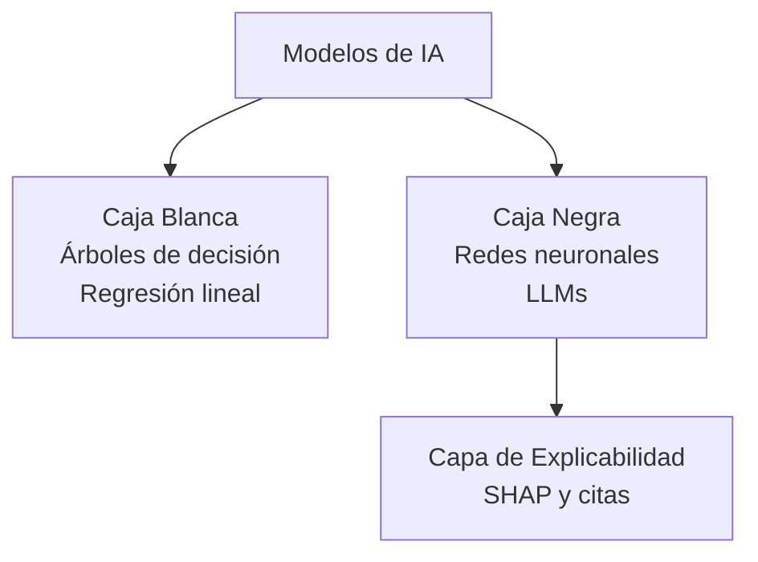
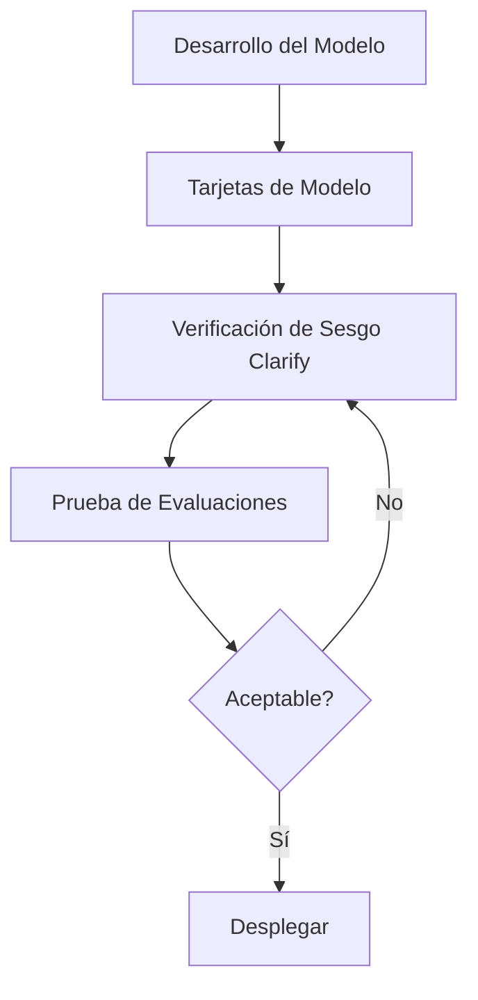
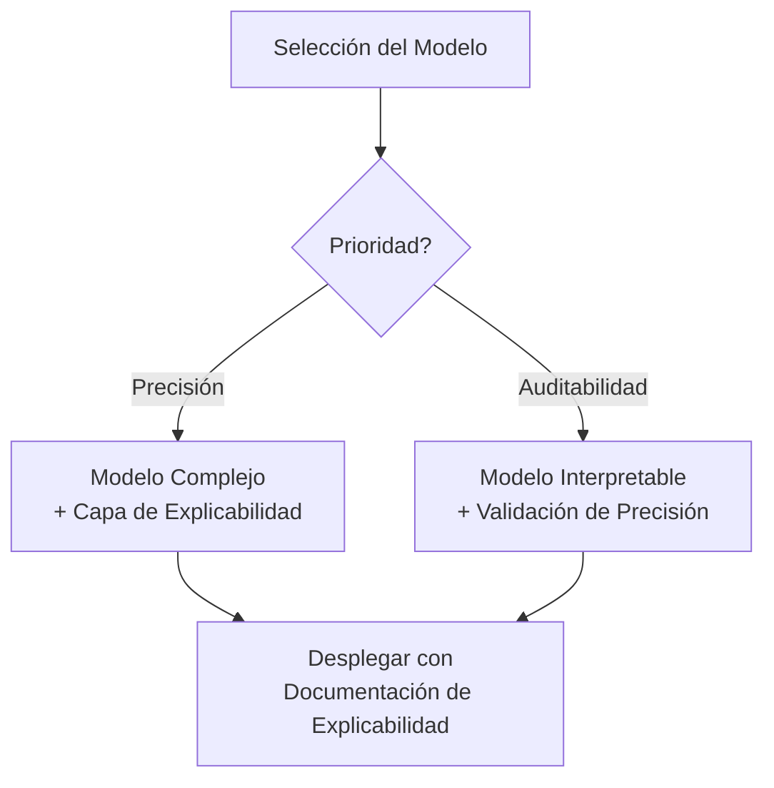
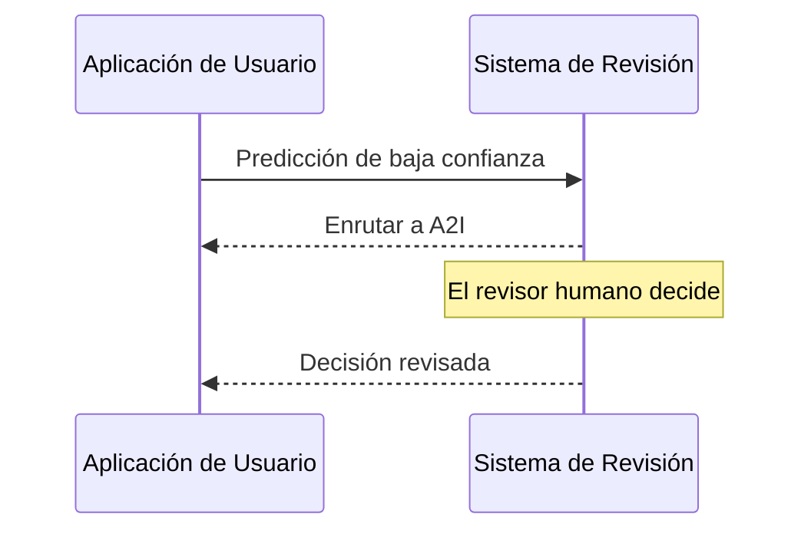

## Enunciado de Tarea 4.2: Reconocer la importancia de los modelos transparentes y explicables

Cuando un sistema de IA toma una decisión que afecta a un cliente, a un empleado o a un resultado empresarial, las personas involucradas casi siempre hacen la misma pregunta: ¿por qué? La respuesta a esa pregunta es de lo que tratan la transparencia y la explicabilidad. Este enunciado de tarea cubre cómo distinguir los modelos que pueden responder a esa pregunta de los que no pueden, las herramientas de AWS que documentan y exponen el comportamiento del modelo, las compensaciones entre la explicabilidad y otras propiedades como la seguridad y el rendimiento, y los principios de diseño que mantienen a los humanos de manera significativa en el ciclo cuando los sistemas de IA están haciendo recomendaciones de consecuencia.[^402001]

### 4.2.1 Diferencias entre los modelos transparentes y explicables y los modelos que no lo son

La transparencia y la explicabilidad son propiedades relacionadas pero distintas. **La transparencia** es la propiedad de un modelo cuya estructura interna, datos de entrenamiento y lógica de decisión pueden inspeccionarse directamente. Un modelo transparente es uno que se puede abrir y leer. **La explicabilidad** es la propiedad de un modelo cuyos resultados pueden ir acompañados de una razón comprensible para los humanos, incluso si la estructura interna sigue siendo compleja. Un modelo explicable puede ser opaco internamente, pero el sistema que lo rodea puede producir una justificación que una persona puede evaluar.[^402002]

La distinción importa en la práctica. Un *árbol de decisión* clásico es transparente: se pueden seguir las ramas desde la raíz hasta la hoja y trazar exactamente qué valores de entrada llevaron al modelo a llegar a una conclusión determinada.[^402031] Una *red neuronal profunda* con miles de millones de parámetros no es transparente de la misma manera; ningún ser humano puede leer la matriz de pesos y entender por qué una secuencia de tokens particular produjo un resultado particular. Sin embargo, un sistema bien diseñado alrededor de esa red neuronal aún puede ser explicable: puede reportar las características que más contribuyeron al resultado, exponer los documentos fuente que más influyeron en una respuesta o asignar una puntuación de confianza que señala cuán seguro está el modelo.[^402032]

**Los modelos de caja blanca** son aquellos donde la lógica de decisión es inherentemente legible. La regresión lineal, la regresión logística, los árboles de decisión y los clasificadores basados en reglas pertenecen a esta categoría.[^402003] Un modelo de evaluación de préstamos construido como un árbol de decisión puede describirse en español llano a un regulador: "Las solicitudes con una proporción deuda-ingresos superior al 40% y menos de 24 meses de historial de empleo fueron rechazadas." Esa oración es el modelo. Los modelos de caja blanca son la opción predeterminada en entornos donde la responsabilidad regulatoria requiere auditabilidad completa de cada decisión individual, como el crédito al consumidor, la suscripción de seguros y algunas clasificaciones de dispositivos médicos.[^402033]

**Los modelos de caja negra** son aquellos donde el cómputo interno es demasiado complejo para interpretarlo directamente.[^402004] Los modelos de lenguaje grande, las redes convolucionales profundas y los métodos de conjunto como los árboles de gradiente potenciado entrenados en cientos de características se comportan todos como cajas negras desde un punto de vista práctico. El modelo produce una puntuación o una secuencia de tokens, pero el camino desde la entrada hasta la salida pasa a través de tantas transformaciones no lineales que rastrearlo es computacional y conceptualmente intratable.[^402034] La mayoría de los sistemas de IA en producción para moderación de contenido, diagnóstico por imágenes médicas, detección de fraude y procesamiento de lenguaje natural operan con modelos de caja negra.

*Figura 4.2.1: Taxonomía de modelos de caja blanca vs. caja negra. Los modelos de caja blanca exponen la lógica de decisión directamente; los modelos de caja negra requieren una capa de explicabilidad separada para producir justificaciones comprensibles para los humanos.*

La realidad de la mayoría de los sistemas de IA en producción es que se sitúan en algún punto entre los dos extremos. Un clasificador de gradiente potenciado puede no ser legible línea por línea, pero es menos opaco que una red neuronal profunda porque las puntuaciones de *importancia de características* pueden calcularse directamente desde la estructura del modelo.[^402035] Un modelo de lenguaje grande es profundamente opaco internamente, pero puede configurarse para citar sus fuentes, informar su incertidumbre y explicar su cadena de razonamiento en lenguaje natural antes de producir una respuesta final. La pregunta práctica no es si un modelo es perfectamente transparente, sino si es suficientemente explicable para los requisitos de responsabilidad del caso de uso.[^402036]

Tres industrias ilustran bien el espectro. En la puntuación de crédito, las regulaciones en muchas jurisdicciones requieren que un prestamista proporcione al solicitante las razones específicas por las que se tomó una decisión de crédito; los modelos de caja blanca o los modelos de caja negra atribuidos con SHAP satisfacen este requisito, mientras que una puntuación no explicada no lo hace.[^402005] En el diagnóstico médico, un radiólogo que usa una herramienta de IA para detectar radiografías de tórax necesita ver qué regiones de la imagen el modelo ponderó más para que el médico pueda confirmar o anular la hipótesis del modelo; aquí la explicabilidad apoya la toma de decisiones humana sin reemplazarla.[^402037] En la moderación de contenido, es posible que el operador de la plataforma no esté obligado a explicar las decisiones de moderación individuales a los usuarios, pero los equipos de auditoría internos necesitan verificar que el clasificador aplica reglas consistentes entre grupos demográficos; aquí la explicabilidad es principalmente una herramienta interna de aseguramiento de calidad.[^402038]

### 4.2.2 Herramientas para identificar modelos transparentes y explicables

Reconocer que se necesita explicabilidad es diferente a saber cómo lograrla. AWS proporciona un conjunto de herramientas que abordan la explicabilidad en diferentes niveles: la documentación del modelo, su comportamiento durante la inferencia y la seguridad y calidad de sus resultados.[^402039]

**Amazon SageMaker Model Cards** es la herramienta que AWS diseñó para estandarizar cómo se crea y comparte la documentación del modelo.[^402006] Una tarjeta de modelo es un documento estructurado y legible por humanos adjunto a un artefacto de modelo en SageMaker. Registra los casos de uso previstos del modelo, el conjunto de datos de entrenamiento y su procedencia, las métricas de rendimiento en los subgrupos relevantes, las limitaciones conocidas, las consideraciones éticas y las restricciones de uso.[^402007] Un profesional de negocios que revisa una tarjeta de modelo antes de aprobar un modelo para producción puede determinar si el modelo fue entrenado con datos representativos de la población de despliegue, qué compensaciones de precisión se hicieron y qué riesgos ha identificado el equipo de desarrollo.

El valor de las tarjetas de modelo se extiende más allá de la decisión de despliegue inicial. Cuando el comportamiento de un modelo cambia con el tiempo, o cuando llega una consulta regulatoria, la tarjeta de modelo proporciona un registro auditable de lo que se sabía en el momento del despliegue.[^402040] Amazon SageMaker admite la publicación de tarjetas de modelo a través de la Consola de Administración de AWS y el SDK de Python de SageMaker, y las tarjetas pueden versionarse junto con el artefacto del modelo.[^402008]

**Amazon SageMaker Clarify** aborda la explicabilidad a nivel de inferencia.[^402009] Clarify usa una técnica llamada *SHAP* (SHapley Additive exPlanations, o Explicaciones Aditivas de Shapley) para calcular puntuaciones de atribución de características para los modelos de aprendizaje automático clásico.[^402010] Piense en un valor SHAP como "¿cuánto empujó esta característica la respuesta hacia arriba o hacia abajo en comparación con la predicción promedio de todos los solicitantes?" Los números positivos empujan hacia un mayor riesgo predicho; los negativos empujan hacia un menor riesgo. Por ejemplo, una explicación de Clarify para una predicción de un modelo de riesgo de crédito podría mostrar que la proporción deuda-ingresos del solicitante contribuyó con +0.12 a la puntuación de riesgo mientras que la duración del historial crediticio contribuyó con -0.08, dando al suscriptor una base cuantitativa para la decisión y un punto de partida para cualquier explicación requerida al solicitante. (Para los modelos de imágenes, la técnica equivalente produce *mapas de saliencia* que destacan las regiones de una imagen de entrada que el modelo ponderó más.)

Más allá de la atribución de características, SageMaker Clarify mide *métricas de sesgo* que reflejan si el modelo trata a los diferentes grupos demográficos de manera diferente.[^402011] Las métricas de sesgo previas al entrenamiento evalúan si el conjunto de datos de entrenamiento en sí mismo está desequilibrado. Las métricas de sesgo posteriores al entrenamiento evalúan si las predicciones del modelo entrenado difieren sistemáticamente entre grupos definidos por un atributo sensible como el género, la edad o el código postal.[^402041] Esta capacidad de detección de sesgo se conecta directamente con las características de IA responsable cubiertas en la Tarea 4.1 y convierte a Clarify en una herramienta de doble propósito: tanto explica las predicciones individuales como monitorea la equidad a nivel de población.

**Amazon Bedrock Model Evaluations** es la herramienta que AWS proporciona para evaluar la calidad y la seguridad de los resultados de los modelos fundacionales.[^402012] A diferencia de Clarify, que aborda la atribución de características de ML clásico, Bedrock Model Evaluations evalúa los resultados de los LLM en dimensiones como precisión, fluidez, coherencia y toxicidad. La evaluación puede configurarse como un trabajo automatizado usando algoritmos de puntuación integrados o como un trabajo de evaluación humana con un equipo interno o con una fuerza de trabajo administrada por AWS.[^402013] La dimensión de evaluación de seguridad verifica específicamente el contenido dañino, tóxico o inapropiado, dando a las organizaciones un registro estructurado de cómo un modelo funciona en criterios de seguridad antes de que se coloque en producción. Bedrock Model Evaluations produce un informe por trabajo que compara los resultados frente a los criterios; no es un documento de gobernanza permanente sobre el modelo en sí, que es lo que proporcionan las tarjetas de modelo.

**Los modelos de código abierto** merecen atención específica como herramienta de transparencia. Cuando una organización despliega un modelo cuyos pesos y arquitectura están disponibles públicamente, como los modelos de la familia Meta Llama o la familia Mistral, puede inspeccionar la documentación de la arquitectura, revisar las tarjetas de datos de entrenamiento publicadas por los desarrolladores del modelo y ejecutar evaluaciones de terceros.[^402014] Este es un nivel cualitativamente diferente de transparencia del que está disponible para los modelos propietarios a los que se accede a través de una API, donde la arquitectura y los datos de entrenamiento no se divulgan.[^402042] Desplegar un modelo de código abierto en AWS a través de Amazon Bedrock o directamente en endpoints de Amazon SageMaker preserva esta ventaja de transparencia mientras se conservan los beneficios operativos de la infraestructura administrada.[^402043]

**La documentación de datos y licencias** completa el panorama. La explicabilidad solo es significativa si los datos que produjeron el modelo son trazables.[^402015] Un modelo entrenado con datos de procedencia no divulgada conlleva riesgos que una tarjeta de modelo no puede capturar completamente: si los datos de entrenamiento resultan contener datos personales protegidos, contenido protegido por derechos de autor o etiquetas sistemáticamente sesgadas, los resultados del modelo heredan esos problemas.[^402044] Los términos de licencia tanto para los datos de entrenamiento como para los pesos del modelo determinan qué puede hacer legalmente la organización con los resultados del modelo, y esa determinación es en sí misma una forma de transparencia sobre las restricciones operativas del modelo.[^402045]

*Tabla 4.2.1: Herramientas de AWS para la transparencia y la explicabilidad del modelo*

| Herramienta | Qué explica | Técnica | Audiencia principal |
|---|---|---|---|
| SageMaker Model Cards | Intención del modelo, datos, resultados de evaluación, limitaciones | Documentación estructurada | Revisores empresariales, auditores |
| SageMaker Clarify | Atribución de predicción individual, métricas de sesgo | Valores SHAP, pruebas estadísticas | Científicos de datos, cumplimiento |
| Bedrock Model Evaluations | Calidad y seguridad de los resultados de LLM | Puntuación automatizada y humana | Equipos de IA, revisores de seguridad |
| Inspección de modelos de código abierto | Arquitectura y datos de entrenamiento | Revisión directa de pesos y documentación | Ingenieros de ML, investigadores |
| Revisión de datos y licencias | Procedencia de datos de entrenamiento y derechos de uso | Seguimiento de procedencia, revisión de licencias | Legal, cumplimiento, adquisiciones |

El examen espera que se relacione un escenario con la herramienta correcta. Cuando una pregunta pide cómo una organización debe documentar el uso previsto de un modelo y las limitaciones conocidas para una auditoría, la respuesta es SageMaker Model Cards. Cuando una pregunta pide cómo explicar por qué se hizo una predicción específica por un modelo ML clásico, la respuesta es SageMaker Clarify con SHAP. Cuando una pregunta pide cómo evaluar si los resultados de un modelo generativo son seguros antes del despliegue en producción, la respuesta es Bedrock Model Evaluations.[^402046]

*Figura 4.2.2: Cadena de herramientas de explicabilidad en el ciclo de vida del modelo. Las tarjetas de modelo proporcionan contexto de documentación; Clarify mide el sesgo previo y posterior al entrenamiento; Bedrock Model Evaluations valida la seguridad de los resultados antes del despliegue.*

### 4.2.3 Compensaciones entre la seguridad del modelo y la transparencia

La transparencia y la seguridad no siempre están alineadas. Comprender dónde se refuerzan mutuamente y dónde entran en conflicto es importante para diseñar sistemas de IA que sean tanto confiables como seguros.[^402047]

El conflicto más común surge del hecho de que revelar cómo funciona un control de seguridad puede permitir a un adversario eludirlo. Considere un sistema de moderación de contenido que bloquea los resultados dañinos detectando ciertos patrones de frases en la respuesta del modelo. Publicar la lista exacta de frases permitiría a un mal actor construir solicitudes que eviten todas las frases bloqueadas mientras aun así obtiene contenido dañino. En este caso, la opacidad en el control de seguridad es intencional.[^402048] La misma lógica se aplica a las defensas contra la inyección de instrucciones: una instrucción del sistema que le indica al modelo que ignore las instrucciones que siguen a una plantilla determinada es menos efectiva una vez que esa plantilla es conocida.[^402016] Los sistemas de seguridad tratan rutinariamente los detalles de su lógica de detección como confidenciales, y los controles de seguridad de IA no son una excepción.

El conflicto también funciona en la dirección opuesta. La opacidad en un modelo puede ocultar limitaciones relevantes para la seguridad que los operadores y usuarios necesitan conocer. Una tarjeta de modelo que describe con precisión los modos de fallo de un modelo, como menor precisión con hablantes no nativos de inglés o mayores tasas de alucinación en eventos muy recientes, permite a los operadores agregar controles compensatorios en el momento del despliegue.[^402017] Ocultar u omitir esas limitaciones significa que el operador no puede mitigarlas. En este sentido, la transparencia sobre las limitaciones mejora activamente los resultados de seguridad.[^402049]

La compensación rendimiento versus interpretabilidad es una segunda tensión que cubre el examen. En general, los modelos que logran la mayor precisión en tareas complejas también son los menos interpretables. Una red neuronal profunda entrenada en millones de imágenes etiquetadas superará a un árbol de decisión en la mayoría de las tareas de clasificación de imágenes, pero las predicciones del árbol de decisión pueden explicarse a un experto del dominio sin ninguna herramienta adicional.[^402018] Un conjunto de gradiente potenciado entrenado en docenas de características diseñadas a menudo supera a la regresión logística en datos tabulares, pero la regresión logística produce coeficientes que un estadístico puede leer directamente como la contribución de cada variable.[^402050]

*Figura 4.2.3: Camino de decisión rendimiento vs. interpretabilidad. Cuando la precisión es el requisito principal, agregar una capa de explicabilidad post-hoc; cuando la auditabilidad es principal, elegir un modelo interpretable y verificar su umbral de precisión.*

No existe una medida numérica única de interpretabilidad.[^402019] La interpretabilidad es una propiedad evaluada por caso de uso, no una puntuación en una tabla de clasificación. Un modelo que un radiólogo considera suficientemente explicable para asistencia en el cribado puede no ser suficientemente explicable para generar un diagnóstico formal que aparezca en un expediente médico.[^402051] Un modelo de riesgo de crédito que satisface los requisitos de explicación de la regulación de crédito al consumidor de un país puede no satisfacer los de otro. La pregunta de medición, por tanto, siempre es: ¿suficientemente explicable para quién, para qué propósito y bajo qué obligación?[^402052]

*Tabla 4.2.2: Patrones de interacción transparencia-seguridad*

| Escenario | Efecto de transparencia | Efecto de seguridad | Resolución |
|---|---|---|---|
| Publicar los detalles de la defensa contra inyección de instrucciones | Alta transparencia | Seguridad reducida | Mantener la lógica de defensa confidencial; publicar solo la política de alto nivel |
| La tarjeta de modelo documenta los modos de fallo de alucinación | Alta transparencia | Seguridad mejorada | Publicar; los operadores agregan controles compensatorios |
| Revelar los valores de umbral de detección de sesgo | Transparencia parcial | Riesgo de manipulación | Publicar la categoría; mantener los umbrales exactos confidenciales |
| Pesos de modelos de código abierto | Transparencia total | Variable | Evaluar los riesgos específicos antes del despliegue abierto |

La guía práctica para un escenario del examen es: cuando una pregunta describe una situación donde revelar el mecanismo de un control permitiría a un atacante eludirlo, menos transparencia es apropiada para la seguridad. Cuando una pregunta describe una situación donde ocultar las limitaciones conocidas de un modelo impide a los operadores mitigarlas, más transparencia es apropiada para la seguridad.[^402053]

### 4.2.4 Principios del diseño centrado en el humano para la IA explicable

La explicabilidad no es solo una propiedad técnica de un modelo; también es una propiedad de diseño del sistema que presenta los resultados del modelo a los usuarios. Un modelo puede producir puntuaciones de atribución SHAP que ningún usuario empresarial verá jamás porque la interfaz no fue diseñada para exponerlas.[^402054] El diseño centrado en el humano para la IA explicable significa construir la capa de presentación para que los usuarios reciban la información que necesitan para entender, confiar y anular adecuadamente las recomendaciones de la IA.[^402020]

El primer principio es exponer la información de confianza e incertidumbre cuando es relevante para la decisión. Un modelo que asigna una puntuación de alta confianza a una recomendación y un modelo que está casi igualmente incierto entre dos opciones no deberían verse iguales para un usuario. Cuando un sistema de detección de fraude marca una transacción con un 97% de confianza, un analista puede proceder rápidamente. Cuando el mismo sistema marca una transacción con un 54% de confianza, el analista debería saber que el modelo es incierto y aplicar más escrutinio. Los modelos de Amazon Bedrock pueden devolver puntuaciones de probabilidad y pueden ser instruidos para expresar la incertidumbre explícitamente en sus resultados; diseñar la aplicación para mostrar esa información, en lugar de convertir el resultado del modelo directamente a una recomendación binaria sí/no, es una elección de diseño deliberada.[^402021]

El segundo principio es mostrar citas y fuentes para el contenido generado. Una aplicación basada en RAG que recupera información de un corpus de documentos y genera una respuesta en lenguaje natural debe identificar qué documentos fuente se usaron. Esto no es solo una medida de transparencia; es una herramienta práctica que permite al usuario verificar el resultado del modelo frente a la fuente original e identificar los casos en que el modelo generalizó más allá de lo que la fuente realmente decía.[^402022] Amazon Bedrock Knowledge Bases devuelve referencias a documentos fuente junto con las respuestas generadas, y los diseños de aplicaciones que exponen esas referencias a los usuarios finales hacen el sistema materialmente más confiable.[^402055]

El tercer principio es diseñar bucles de retroalimentación que capturen los juicios de los usuarios sobre la calidad de los resultados de la IA. Un mecanismo de pulgar arriba o pulgar abajo adjunto a la recomendación de un modelo es la forma más simple de esto, pero el diseño también debe capturar la razón del rechazo negativo: ¿la recomendación era factualmente incorrecta, no aplicable, o correcta pero presentada de manera confusa? Esa retroalimentación estructurada, enrutada de vuelta al equipo de desarrollo del modelo, produce los datos etiquetados necesarios para identificar modos de fallo sistemáticos y mejorar el modelo con el tiempo. Amazon A2I, introducido en la Tarea 4.1, se ajusta a este principio al enrutar los resultados de baja confianza a revisores humanos y capturar sus decisiones como registros estructurados.[^402023]

*Figura 4.2.4: Flujo de retroalimentación con humano en el ciclo. La aplicación expone las puntuaciones de confianza al usuario, enruta los resultados de baja confianza o disputados a Amazon A2I para revisión humana y devuelve anotaciones estructuradas al equipo de desarrollo.*

El cuarto principio es separar lo que dijo el modelo de lo que hizo el sistema. En una aplicación de IA multicapa, el modelo produce una recomendación y luego un sistema posterior actúa sobre ella. Una interfaz bien diseñada muestra al usuario ambas capas: la recomendación del modelo y la acción del sistema basada en esa recomendación.[^402056] Esto importa cuando el sistema añade reglas empresariales que modifican o anulan el resultado del modelo. Por ejemplo, una herramienta de apoyo a la contratación podría mostrar a un reclutador tanto la clasificación de candidatos del modelo como la regla que la empresa del reclutador aplicó para filtrar a los candidatos por debajo de un umbral de edad legal. El usuario puede entonces evaluar el razonamiento del modelo independientemente de la capa de reglas empresariales.[^402057]

El quinto principio es respetar la autonomía del usuario haciendo que las anulaciones sean fáciles y bien rastreadas. Una recomendación de IA que no puede anularse no es una recomendación en absoluto; es una decisión automatizada. Los usuarios que están obligados a usar los resultados de la IA pero no pueden anularlos pierden su capacidad de aplicar el juicio profesional a los casos extremos, y la organización pierde la señal que habrían proporcionado los datos de anulación.[^402058] Diseñar mecanismos de anulación que sean destacados, de baja fricción y con registro de auditoría da a los usuarios una verdadera autonomía al tiempo que genera retroalimentación valiosa sobre dónde el modelo se queda corto.[^402024]

*Tabla 4.2.3: Principios de diseño centrado en el humano para la IA explicable*

| Principio | Ejemplo de implementación | Herramienta o patrón de AWS |
|---|---|---|
| Exponer confianza e incertidumbre | Mostrar la puntuación de confianza del modelo junto con la recomendación | Metadatos de respuesta de inferencia de Bedrock |
| Mostrar citas y fuentes | Listar los documentos fuente recuperados con la respuesta generada | Atribución de fuentes de Bedrock Knowledge Bases |
| Capturar retroalimentación estructurada | Pulgar abajo con razón; enrutamiento automático de baja confianza | Configuración del flujo de trabajo de Amazon A2I |
| Separar el resultado del modelo de la acción del sistema | Mostrar la puntuación del modelo y la regla empresarial aplicada por separado | Diseño de la capa de aplicación |
| Respetar la autonomía del usuario | Botón de anulación destacado con registro de auditoría | Diseño de la capa de aplicación |

La accesibilidad es una consideración práctica dentro del diseño centrado en el humano que el examen no elabora pero que cualquier implementación responsable debe abordar. Las puntuaciones de confianza presentadas solo como valores numéricos excluyen a los usuarios menos cómodos con el razonamiento probabilístico.[^402059] Las explicaciones escritas en lenguaje técnico excluyen a los usuarios no expertos. Diseñar la explicabilidad para los usuarios reales del sistema, no para los desarrolladores que lo construyeron, es la definición operativa del diseño centrado en el humano en este contexto.[^402060]

## Preguntas de autoevaluación

**Pregunta 1.** Una empresa de servicios financieros usa un modelo de conjunto de gradiente potenciado para aprobar o rechazar solicitudes de préstamo. Un regulador exige que la empresa proporcione a cada solicitante rechazado una razón específica para la decisión. El equipo de desarrollo del modelo quiere cumplir con este requisito sin reemplazar el modelo. ¿Qué herramienta o técnica de AWS es MÁS apropiada?

A. Reemplazar el modelo de gradiente potenciado con un modelo de regresión logística que es transparente por diseño  
B. Usar Amazon SageMaker Clarify para generar puntuaciones de atribución de características basadas en SHAP para cada predicción individual  
C. Publicar una tarjeta de modelo de SageMaker documentando los datos de entrenamiento y las métricas de evaluación  
D. Usar Amazon Bedrock Model Evaluations para puntuar la precisión del resultado del modelo frente a un conjunto de datos etiquetado  

**Explicación.** El regulador requiere una explicación por decisión, lo que significa que el sistema necesita atribuir la predicción específica a las características de entrada específicas para cada solicitud individual. Amazon SageMaker Clarify (Respuesta B) calcula los valores SHAP que cuantifican cuánto contribuyó cada característica de entrada a la predicción del modelo, produciendo precisamente la justificación por decisión que requiere el regulador. La Respuesta A satisfaría el requisito, pero la pregunta especifica que el equipo quiere evitar reemplazar el modelo; además, reemplazar el modelo únicamente por interpretabilidad sacrifica la ventaja de precisión del conjunto. La Respuesta C aborda la documentación del modelo en su conjunto, pero no genera explicaciones por decisión. La Respuesta D evalúa la precisión agregada de los resultados de los LLM y no está diseñada para la atribución de características en modelos de ML clásico. SageMaker Clarify es la herramienta de propósito específico para la atribución de predicción individual en modelos entrenados con SageMaker.[^402026]

---

**Pregunta 2.** Una empresa está desarrollando un asistente de imagen médica con tecnología de IA que resalta regiones de una radiografía de tórax para que un radiólogo las revise. El equipo de desarrollo debate si usar una red convolucional profunda con mayor precisión diagnóstica o un clasificador basado en reglas con menor precisión pero reglas completamente auditables. El equipo clínico dice que solo usará la herramienta si puede entender por qué la herramienta está marcando una región. ¿Qué enfoque MEJOR aborda tanto el requisito del equipo clínico como la necesidad de precisión?

A. Usar el clasificador basado en reglas porque es completamente transparente y el equipo clínico puede leer sus reglas directamente  
B. Usar la red convolucional profunda y agregar una capa de explicabilidad post-hoc que resalte las regiones de la imagen que el modelo ponderó más  
C. Usar la red convolucional profunda sin una capa de explicabilidad y entrenar al equipo clínico para que confíe en el resultado del modelo  
D. Usar Amazon Bedrock Model Evaluations para validar los resultados de la red convolucional profunda antes de cada sesión de imágenes  

**Explicación.** La pregunta identifica dos requisitos en competencia: alta precisión (favorece la red convolucional profunda) y comprensibilidad (favorece el modelo transparente). La Respuesta B resuelve la tensión usando el modelo de mayor precisión y agregando una capa de explicabilidad post-hoc que produce *mapas de saliencia* o visualizaciones equivalentes que muestran qué regiones de la imagen el modelo ponderó más. Esto da a los radiólogos la justificación regional que necesitan sin sacrificar la ventaja de precisión. La Respuesta A acepta innecesariamente la limitación de precisión; la pregunta no dice que la precisión del clasificador basado en reglas sea suficiente. La Respuesta C ignora el requisito declarado del equipo clínico e introduce riesgo para la seguridad del paciente al desplegar un sistema no explicado a clínicos que han dicho que necesitan explicaciones. La Respuesta D es la categoría de herramienta incorrecta; Bedrock Model Evaluations aborda la calidad de los resultados de los LLM, no la atribución de clasificación de imágenes. La lección más amplia es que la compensación rendimiento versus interpretabilidad a menudo puede resolverse manteniendo el modelo de alto rendimiento y agregando una capa de explicabilidad en lugar de elegir entre los dos.[^402027]

---

**Pregunta 3.** Una organización se está preparando para desplegar un asistente de servicio al cliente de IA generativa. El equipo de cumplimiento requiere documentación del uso previsto del modelo, sus modos de fallo conocidos y las métricas de evaluación utilizadas para validarlo, todo en un formato que un auditor no técnico pueda revisar. ¿Qué capacidad de AWS está diseñada para este propósito?

A. Informes de sesgo de Amazon SageMaker Clarify  
B. Flujo de trabajo de revisión humana de Amazon Bedrock Model Evaluations  
C. Amazon SageMaker Model Cards  
D. Registros de auditoría de tareas de revisión de Amazon Augmented AI (Amazon A2I)  

**Explicación.** Amazon SageMaker Model Cards (Respuesta C) es la herramienta de propósito específico para la documentación estructurada del modelo. Una tarjeta de modelo registra los casos de uso previstos del modelo, la procedencia de los datos de entrenamiento, los resultados de la evaluación entre subgrupos, las limitaciones conocidas, las consideraciones éticas y las restricciones de uso en un formato estandarizado y legible por humanos. Esto aborda directamente los tres requisitos de cumplimiento: uso previsto, modos de fallo conocidos y métricas de evaluación, en una forma que un auditor no técnico puede navegar. La Respuesta A produce puntuaciones de atribución por predicción y métricas de sesgo para un modelo desplegado, no documentación resumida para un auditor. La Respuesta B ejecuta evaluaciones de calidad y seguridad de la inferencia, pero produce puntuaciones de evaluación en lugar de la documentación estructurada que proporciona una tarjeta de modelo. La Respuesta D produce registros de auditoría de decisiones de revisión humana individuales, lo que es útil para el monitoreo pero no sustituye la documentación del modelo. Las tarjetas de modelo son la respuesta canónica cuando el examen describe un requisito de auditoría o cumplimiento para la documentación del modelo previo al despliegue.[^402028]

---

**Pregunta 4.** El equipo de producto de IA de una empresa ha construido un motor de recomendaciones. La investigación de usuarios muestra que muchos usuarios no confían en las recomendaciones porque no pueden entender por qué se sugirió un elemento en particular. El equipo quiere aplicar el diseño centrado en el humano para aumentar la confianza del usuario. ¿Qué opción empareja dos cambios de diseño que abordan MÁS directamente la brecha de confianza?

A. Reemplazar el modelo de recomendación con un modelo más preciso y reentrenarlo con un conjunto de datos más grande  
B. Mostrar la puntuación de confianza del modelo junto con cada recomendación y mostrar los atributos principales del historial del usuario que impulsaron la sugerencia  
C. Eliminar la función de recomendación hasta que el modelo logre mayor precisión  
D. Agregar un paso de revisión humana de Amazon A2I para aprobar manualmente cada recomendación antes de mostrársela al usuario  

**Explicación.** La investigación de usuarios identifica un problema de confianza causado por la falta de comprensibilidad, no por un problema causado por baja precisión o revisión insuficiente. La Respuesta B aplica directamente dos principios de diseño centrado en el humano: exponer la confianza (para que los usuarios puedan calibrar cuánto peso dar a la recomendación) y mostrar el razonamiento detrás de la recomendación (los atributos que la impulsaron, que es una forma de atribución post-hoc). Ambos cambios abordan la brecha de confianza declarada. La Respuesta A mejora la precisión, lo que puede o no abordar la confianza; un modelo más preciso que sigue sin explicarse no resuelve el problema que identificó la investigación de usuarios. La Respuesta C elimina una función del producto para evitar el problema en lugar de resolverlo. La Respuesta D introduce revisión humana para cada recomendación, lo que es operativamente impráctico a escala de sistema de recomendaciones y aborda el control de calidad en lugar de la explicabilidad orientada al usuario. El patrón del examen aquí es que cuando la confianza del usuario es el problema declarado, la respuesta correcta involucra la transparencia y el diseño de la explicación, no el reemplazo del modelo o la revisión manual.[^402029]

---

**Pregunta 5.** Un equipo de ciencias de datos está evaluando si usar un modelo de código abierto o un modelo de API cerrada propietario para una nueva aplicación. El departamento legal de la empresa requiere visibilidad sobre las fuentes de datos de entrenamiento y los términos de licencia antes de aprobar el modelo para uso en producción. ¿Qué característica de los modelos de código abierto aborda MÁS directamente el requisito del departamento legal?

A. Los modelos de código abierto siempre son más baratos de ejecutar que los modelos propietarios a los que se accede a través de una API  
B. Los modelos de código abierto pueden ajustarse fino con datos propietarios, lo que permite a la organización poseer los pesos resultantes  
C. Los modelos de código abierto publican la documentación de la arquitectura, las tarjetas de datos de entrenamiento y los términos de licencia que el equipo legal puede revisar directamente  
D. Los modelos de código abierto satisfacen automáticamente todos los requisitos regulatorios de transparencia de IA en la UE y los EE.UU.  

**Explicación.** El requisito declarado del departamento legal es la visibilidad de las fuentes de datos de entrenamiento y los términos de licencia. La Respuesta C aborda esto directamente. Los modelos disponibles públicamente típicamente publican tarjetas de modelo y tarjetas de datos (o documentación equivalente) que describen la composición del corpus de entrenamiento, las limitaciones conocidas y la licencia aplicable. El equipo legal puede revisar la licencia publicada (como una licencia Apache 2.0 o una licencia comercial específica del modelo) para determinar qué usos están permitidos y puede revisar la documentación de los datos de entrenamiento para evaluar los riesgos de procedencia de los datos. La Respuesta A es un argumento de costo que no aborda el requisito legal; los modelos de código abierto no son universalmente más baratos una vez que se incluyen los costos de infraestructura y operativos. La Respuesta B aborda la propiedad de los derivados ajustados fino, que es una consideración legal válida, pero no aborda el requisito de visibilidad de los datos de entrenamiento y licencias declarado en la pregunta. La Respuesta D es incorrecta; el estado de código abierto no satisface automáticamente ningún marco regulatorio específico; el cumplimiento aún requiere evaluación frente a los criterios de la regulación relevante. La lección más amplia es que la transparencia de datos y licencias es una dimensión distinta de la transparencia del modelo, y los modelos de código abierto proporcionan un nivel de visibilidad de procedencia que no está disponible para los modelos a los que solo se accede a través de una API propietaria.[^402030]

---

[^402001]: AWS Certification. AI Practitioner (AIF-C01) Exam Guide v1.1, Domain 4, Task Statement 4.2. URL: <https://docs.aws.amazon.com/aws-certification/latest/ai-practitioner-01/ai-practitioner-01-domain4.html>
[^402002]: Doshi-Velez, F., and Kim, B. Towards a Rigorous Science of Interpretable Machine Learning (2017). URL: <https://arxiv.org/abs/1702.08608>
[^402003]: Breiman, L. Classification and Regression Trees (1984). URL: <https://doi.org/10.1201/9781315139470>
[^402004]: Adadi, A., and Berrada, M. Peeking Inside the Black-Box: A Survey on Explainable AI. IEEE Access (2018). URL: <https://doi.org/10.1109/ACCESS.2018.2870052>
[^402005]: Consumer Financial Protection Bureau. Using Artificial Intelligence to Assist Adverse Action Explanations (2023). URL: <https://www.consumerfinance.gov/about-us/blog/cfpb-issues-guidance-on-credit-denials-by-lenders-using-artificial-intelligence/>
[^402006]: Amazon SageMaker. Amazon SageMaker Model Cards overview. URL: <https://docs.aws.amazon.com/sagemaker/latest/dg/model-cards.html>
[^402007]: Amazon SageMaker. Model Card components and structure. URL: <https://docs.aws.amazon.com/sagemaker/latest/dg/model-cards-create.html>
[^402008]: Amazon SageMaker. Versioning and sharing SageMaker Model Cards. URL: <https://docs.aws.amazon.com/sagemaker/latest/dg/model-cards-export.html>
[^402009]: Amazon SageMaker. Amazon SageMaker Clarify overview. URL: <https://docs.aws.amazon.com/sagemaker/latest/dg/clarify-configure-processing-jobs.html>
[^402010]: Lundberg, S., and Lee, S. A Unified Approach to Interpreting Model Predictions (SHAP, NeurIPS 2017). URL: <https://arxiv.org/abs/1705.07874>
[^402011]: Amazon SageMaker. Measuring bias with SageMaker Clarify. URL: <https://docs.aws.amazon.com/sagemaker/latest/dg/clarify-measure-data-bias.html>
[^402012]: Amazon Bedrock. Amazon Bedrock Model Evaluations overview. URL: <https://docs.aws.amazon.com/bedrock/latest/userguide/model-evaluation.html>
[^402013]: Amazon Bedrock. Human evaluation jobs in Amazon Bedrock Model Evaluations. URL: <https://docs.aws.amazon.com/bedrock/latest/userguide/model-evaluation-human.html>
[^402014]: Meta AI. Llama 3 model card and data documentation. URL: <https://ai.meta.com/research/publications/meta-llama-3/>
[^402015]: Mitchell, M., et al. Model Cards for Model Reporting (FAccT 2019). URL: <https://arxiv.org/abs/1810.03993>
[^402016]: Perez, F., and Ribeiro, I. Ignore Previous Prompt: Attack Techniques for Language Models (2022). URL: <https://arxiv.org/abs/2211.09527>
[^402017]: Raji, I., et al. Closing the AI Accountability Gap: Defining an End-to-End Framework for Internal Algorithmic Auditing (2020). URL: <https://arxiv.org/abs/2001.00973>
[^402018]: Rudin, C. Stop Explaining Black Box Machine Learning Models for High Stakes Decisions and Use Interpretable Models Instead. Nature Machine Intelligence (2019). URL: <https://doi.org/10.1038/s42256-019-0048-x>
[^402019]: Lipton, Z. The Mythos of Model Interpretability. Queue, ACM (2018). URL: <https://dl.acm.org/doi/10.1145/3236386.3241340>
[^402020]: Amershi, S., et al. Guidelines for Human-AI Interaction. CHI 2019. URL: <https://dl.acm.org/doi/10.1145/3290605.3300233>
[^402021]: Amazon Bedrock. Response metadata and confidence in Amazon Bedrock inference. URL: <https://docs.aws.amazon.com/bedrock/latest/userguide/model-invocation-logging.html>
[^402022]: Amazon Bedrock. Source attribution in Knowledge Bases responses. URL: <https://docs.aws.amazon.com/bedrock/latest/userguide/knowledge-base-retrieveandgenerate.html>
[^402023]: Amazon Augmented AI. Amazon A2I overview and human review workflows. URL: <https://docs.aws.amazon.com/sagemaker/latest/dg/a2i-getting-started.html>
[^402024]: Shneiderman, B. Human-Centered AI. Oxford University Press (2022). URL: <https://global.oup.com/academic/product/human-centered-ai-9780192845290>
[^402026]: Amazon SageMaker. Explainability with SageMaker Clarify: SHAP values for predictions. URL: <https://docs.aws.amazon.com/sagemaker/latest/dg/clarify-shapley-values.html>
[^402027]: Selvaraju, R., et al. Grad-CAM: Visual Explanations from Deep Networks via Gradient-Based Localization (2017). URL: <https://arxiv.org/abs/1610.02391>
[^402028]: Amazon SageMaker. Using Model Cards for compliance and auditability. URL: <https://docs.aws.amazon.com/sagemaker/latest/dg/model-cards.html>
[^402029]: Amershi, S., et al. Guidelines for Human-AI Interaction: Principle 7, Show contextual information. CHI 2019. URL: <https://dl.acm.org/doi/10.1145/3290605.3300233>
[^402030]: Linux Foundation AI and Data. Model and Data Card Standards for Open Source AI (2023). URL: <https://lfaidata.foundation/blog/2023/09/18/data-and-model-cards/>
[^402031]: Quinlan, J.R. Induction of Decision Trees. Machine Learning, vol. 1 (1986). URL: <https://doi.org/10.1007/BF00116251>
[^402032]: Guidotti, R., et al. A Survey of Methods for Explaining Black Box Models. ACM Computing Surveys (2018). URL: <https://dl.acm.org/doi/10.1145/3236009>
[^402033]: Board of Governors of the Federal Reserve System. SR 11-7: Guidance on Model Risk Management (2011). URL: <https://www.federalreserve.gov/supervisionreg/srletters/sr1107.htm>
[^402034]: Goodfellow, I., Bengio, Y., and Courville, A. Deep Learning. MIT Press (2016). URL: <https://www.deeplearningbook.org/>
[^402035]: Chen, T., and Guestrin, C. XGBoost: A Scalable Tree Boosting System. KDD 2016. URL: <https://arxiv.org/abs/1603.02754>
[^402036]: European Parliament. EU AI Act: Article 13, Transparency and provision of information to deployers (2024). URL: <https://eur-lex.europa.eu/legal-content/EN/TXT/?uri=CELEX:32024R1689>
[^402037]: Topol, E. High-performance medicine: the convergence of human and artificial intelligence. Nature Medicine (2019). URL: <https://doi.org/10.1038/s41591-018-0300-7>
[^402038]: Raji, I., and Buolamwini, J. Actionable Auditing: Investigating the Impact of Publicly Naming Biased Performance Results of Commercial AI Products. AIES 2019. URL: <https://dl.acm.org/doi/10.1145/3306618.3314244>
[^402039]: NIST. Artificial Intelligence Risk Management Framework (AI RMF 1.0), GOVERN 1.7. URL: <https://doi.org/10.6028/NIST.AI.100-1>
[^402040]: Amazon SageMaker. Model Card audit and governance use cases. URL: <https://docs.aws.amazon.com/sagemaker/latest/dg/model-cards-use-cases.html>
[^402041]: Amazon SageMaker. Post-training bias metrics in SageMaker Clarify. URL: <https://docs.aws.amazon.com/sagemaker/latest/dg/clarify-measure-post-training-bias.html>
[^402042]: Bommasani, R., et al. On the Opportunities and Risks of Foundation Models: Transparency section. Stanford CRFM (2021). URL: <https://arxiv.org/abs/2108.07258>
[^402043]: Amazon Bedrock. Supported open-source models in Amazon Bedrock. URL: <https://docs.aws.amazon.com/bedrock/latest/userguide/models-supported.html>
[^402044]: Gebru, T., et al. Datasheets for Datasets. Communications of the ACM (2021). URL: <https://doi.org/10.1145/3458723>
[^402045]: Open Source Initiative. The Open Source AI Definition, version 1.0 (2024). URL: <https://opensource.org/ai/open-source-ai-definition>
[^402046]: Amazon Bedrock. Choosing between automated and human evaluation in Bedrock Model Evaluations. URL: <https://docs.aws.amazon.com/bedrock/latest/userguide/model-evaluation.html>
[^402047]: Wachter, S., Mittelstadt, B., and Russell, C. Counterfactual Explanations Without Opening the Black Box: Automated Decisions and the GDPR. Harvard Journal of Law and Technology (2018). URL: <https://doi.org/10.2139/ssrn.3063289>
[^402048]: Amazon Bedrock. Amazon Bedrock Guardrails: content filtering configuration. URL: <https://docs.aws.amazon.com/bedrock/latest/userguide/guardrails-filters.html>
[^402049]: Floridi, L., et al. An Ethical Framework for a Good AI Society: Opportunities, Risks, Principles, and Recommendations. Minds and Machines (2018). URL: <https://doi.org/10.1007/s11023-018-9482-5>
[^402050]: Hastie, T., Tibshirani, R., and Friedman, J. The Elements of Statistical Learning, 2nd ed. Springer (2009). URL: <https://doi.org/10.1007/978-0-387-84858-7>
[^402051]: FDA. Artificial Intelligence and Machine Learning in Software as a Medical Device: Action Plan (2021). URL: <https://www.fda.gov/medical-devices/software-medical-device-samd/artificial-intelligence-and-machine-learning-software-medical-device>
[^402052]: European Parliament. EU AI Act: Article 86, Right of explanation of individual decision-making (2024). URL: <https://eur-lex.europa.eu/legal-content/EN/TXT/?uri=CELEX:32024R1689>
[^402053]: NIST. AI RMF Playbook: MAP 1.6, Risk of insufficient explainability. URL: <https://airc.nist.gov/Docs/2>
[^402054]: Yang, Q., et al. Investigating how and why practitioners use machine learning explanation methods. CHI 2023. URL: <https://dl.acm.org/doi/10.1145/3544548.3581219>
[^402055]: Amazon Bedrock. Citations and source attribution in Knowledge Bases responses. URL: <https://docs.aws.amazon.com/bedrock/latest/userguide/knowledge-base-retrieveandgenerate.html>
[^402056]: Cai, C.J., et al. Human-Centered Tools for Coping with Imperfect Algorithms During Medical Decision-Making. CHI 2019. URL: <https://dl.acm.org/doi/10.1145/3290605.3300234>
[^402057]: European Parliament. EU AI Act: Article 26, Obligations of deployers of high-risk AI systems (2024). URL: <https://eur-lex.europa.eu/legal-content/EN/TXT/?uri=CELEX:32024R1689>
[^402058]: Kuo, T., et al. Assessing the AI on AI: Examining the Influence of AI Recommendations on Human Decisions. CHI 2023. URL: <https://dl.acm.org/doi/10.1145/3544548.3581314>
[^402059]: Bunt, A., Lount, M., and Lauzon, C. Are explanations always important? A study of deployed, low-cost intelligent systems. IUI 2012. URL: <https://dl.acm.org/doi/10.1145/2166966.2166996>
[^402060]: Wang, D., et al. Designing Theory-Driven User-Centric Explainable AI. CHI 2019. URL: <https://dl.acm.org/doi/10.1145/3290605.3300831>
