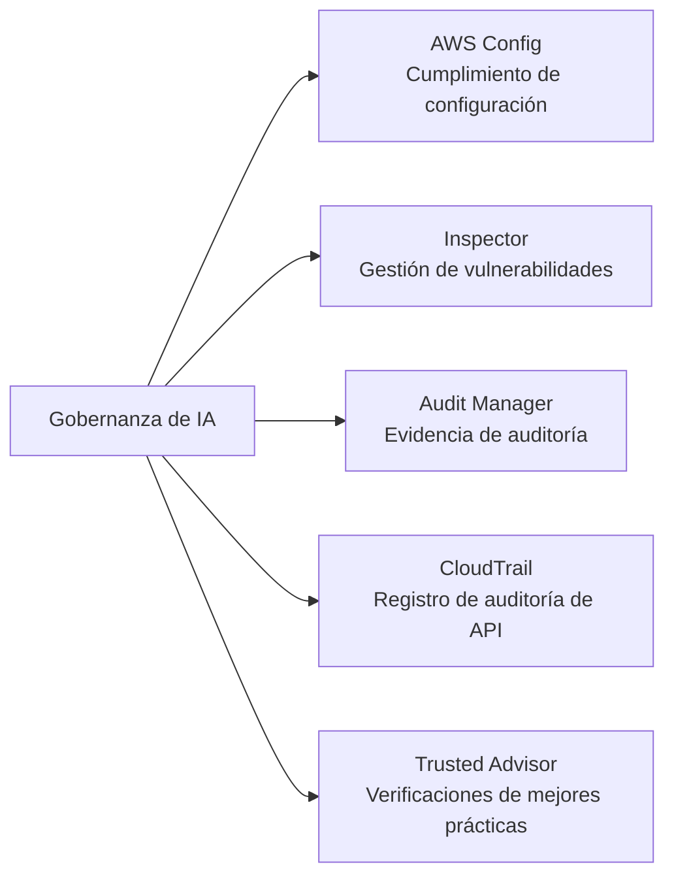
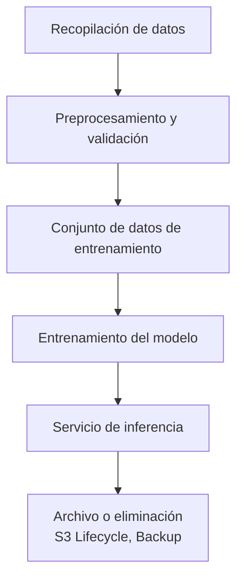
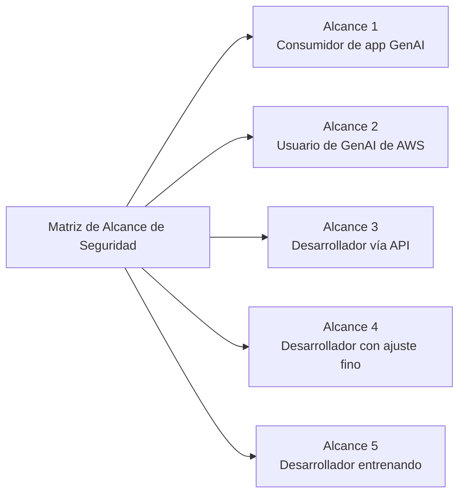
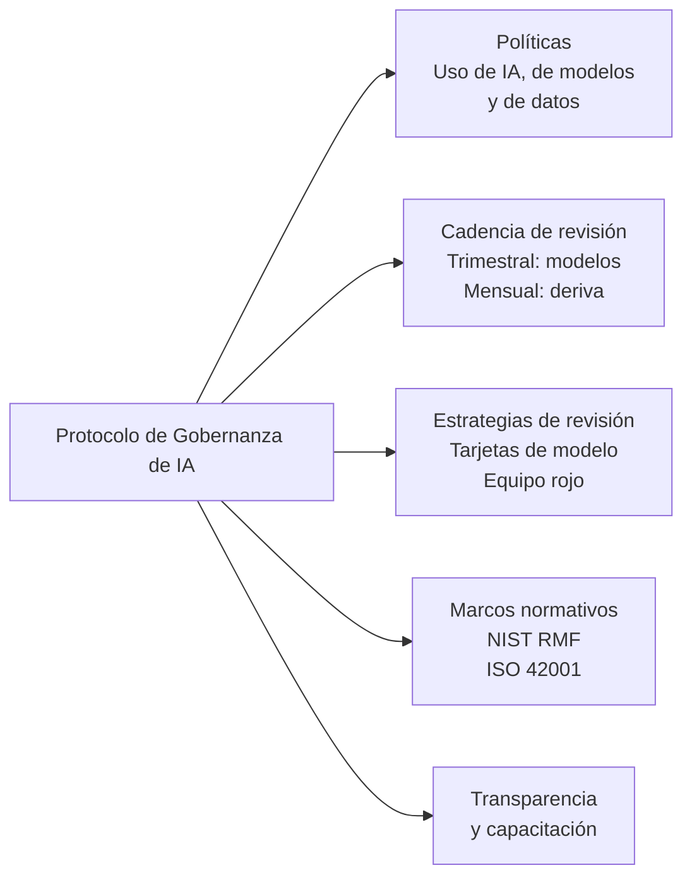

## Enunciado de Tarea 5.2: Reconocer las regulaciones de gobernanza y cumplimiento para los sistemas de IA

La gobernanza y el cumplimiento normativo traducen los principios de IA responsable en responsabilidad organizacional. Mientras que los controles de seguridad protegen la capa técnica, las estructuras de gobernanza crean las políticas, los ciclos de revisión, las pistas de auditoría y las evidencias regulatorias que permiten a una organización explicar, defender y mejorar continuamente sus sistemas de IA. Este enunciado de tarea cubre los servicios de AWS que respaldan la recopilación de evidencia de cumplimiento, las estrategias de gobernanza de datos que esperan los auditores, y los procesos de gobernanza que dan a los programas de IA un respaldo institucional duradero.[^502001]

### 5.2.1 Servicios y características de AWS para gobernanza y cumplimiento

El cumplimiento normativo para una carga de trabajo de IA no es una puerta única que se supera en el despliegue; es un estado continuo que se mantiene mediante monitoreo constante, recopilación de evidencia y preparación para auditorías. AWS proporciona un conjunto de servicios administrados que colectivamente cubren el ciclo de vida completo del cumplimiento: registro de configuración, análisis de vulnerabilidades, recopilación de evidencia alineada a marcos normativos, recuperación de informes bajo demanda, registro de auditoría de API y verificaciones de mejores prácticas. Utilizados en conjunto, estos servicios permiten a una organización demostrar a reguladores, auditores e interesados internos que sus sistemas de IA operan dentro de los límites definidos.

La relación entre estos servicios sigue una división lógica del trabajo. **AWS Config** rastrea el estado de configuración de los recursos y evalúa si cumplen con las reglas definidas. **Amazon Inspector** detecta vulnerabilidades en las capas de cómputo y contenedores que alojan cargas de trabajo de IA. **AWS Audit Manager** organiza la evidencia de cumplimiento en paquetes listos para auditoría alineados a marcos normativos específicos. **AWS Artifact** otorga a los usuarios autorizados acceso a las propias certificaciones de cumplimiento de terceros de AWS. **AWS CloudTrail** crea el registro inmutable de actividad de API que demuestra quién hizo qué y cuándo. **AWS Trusted Advisor** identifica brechas de configuración respecto a las mejores prácticas de AWS en las categorías de costo, seguridad, tolerancia a fallos y límites de servicio.

*Figura 5.2.1: Categorías de servicios de cumplimiento de AWS. Cada servicio aborda una capa distinta del conjunto de auditoría y gobernanza para cargas de trabajo de IA.*

**AWS Config** es un servicio de registro de configuración y evaluación de reglas que rastrea continuamente el estado de los recursos de AWS y los compara con reglas de cumplimiento definidas por política.[^502002] Cuando un recurso cambia, Config registra la nueva configuración, la compara con las reglas aplicables y señala las que no cumplen. Para las cargas de trabajo de IA, tres categorías de reglas son especialmente relevantes. Primero, el registro de invocación de modelos de Bedrock puede verificarse: una regla de Config puede comprobar que el registro esté habilitado para Amazon Bedrock, asegurando que cada solicitud al modelo quede capturada para auditoría y análisis.[^502003] Segundo, el acceso a los cuadernos de SageMaker puede controlarse: una regla que verifica que las instancias de cuadernos de Amazon SageMaker requieran acceso basado en IAM impide la exposición directa a internet de los entornos de cuadernos donde residen el código de entrenamiento y los datos.[^502004] Tercero, el cifrado puede imponerse: una regla que verifica que los artefactos de modelos personalizados de Bedrock y los volúmenes de entrenamiento de SageMaker estén cifrados en reposo garantiza que los parámetros sensibles del modelo y los datos de entrenamiento siempre estén protegidos.[^502005]

Las reglas de Config pueden agruparse en *paquetes de conformidad (conformance packs)*, que agrupan múltiples reglas relacionadas en una unidad desplegable alineada a un requisito de cumplimiento específico, como NIST SP 800-53 o el estándar AWS Foundational Security Best Practices.[^502006] Cuando una organización desea demostrar que su entorno de IA cumple con los requisitos de control de un marco normativo, desplegar el paquete de conformidad correspondiente y exportar su panel de cumplimiento proporciona una vista única y reproducible del estado de los controles.

**Amazon Inspector** es un servicio de evaluación continua de vulnerabilidades que analiza las instancias de Amazon EC2, las funciones de AWS Lambda y las imágenes de contenedor almacenadas en Amazon Elastic Container Registry (ECR) en busca de vulnerabilidades de software conocidas y exposiciones de red no deseadas.[^502007] Las cargas de trabajo de IA frecuentemente se ejecutan en la infraestructura que cubre Inspector: los trabajos de entrenamiento de SageMaker se ejecutan en flotas de instancias EC2, los contenedores de inferencia se almacenan en ECR y el código de inferencia personalizado puede ejecutarse como funciones Lambda. Inspector correlaciona los hallazgos con la base de datos de *Vulnerabilidades y Exposiciones Comunes (CVE, Common Vulnerabilities and Exposures)* y asigna una puntuación de riesgo, lo que permite a los equipos de seguridad priorizar qué vulnerabilidades remediar primero según su explotabilidad e impacto.[^502008] Para la gobernanza, los hallazgos de Inspector se alimentan directamente en AWS Security Hub, proporcionando un panel centralizado que los auditores pueden revisar junto con otras señales de cumplimiento.

**AWS Audit Manager** automatiza la recopilación de evidencia para auditorías de cumplimiento.[^502009] En lugar de extraer manualmente capturas de pantalla y extractos de registros antes de cada ciclo de auditoría, las organizaciones configuran Audit Manager con un marco normativo y el servicio recopila continuamente evidencia de los resultados de las reglas de AWS Config, las llamadas a la API de CloudTrail y los hallazgos de Security Hub. El servicio incluye marcos preconstruidos para HIPAA, SOC 2, PCI DSS, ISO 27001, FedRAMP y otros estándares, así como herramientas para construir marcos personalizados para programas de auditoría internos o requisitos emergentes específicos de IA.[^502010] La evidencia se almacena en un informe de evaluación estructurado que un auditor puede revisar sin necesitar acceso directo al entorno de AWS. Para programas de IA bajo HIPAA, por ejemplo, Audit Manager puede recopilar evidencia de que los datos de entrenamiento están cifrados, de que el acceso a los puntos de conexión del modelo está registrado, y de que los cambios en las configuraciones del modelo quedan grabados, produciendo un paquete de auditoría que demuestra la operación de controles durante un período definido.

**AWS Artifact** es el portal de autoservicio donde los clientes de AWS pueden descargar las propias certificaciones de cumplimiento y acuerdos de AWS.[^502011] Los informes disponibles incluyen los informes SOC 1, SOC 2 y SOC 3 (auditorías de controles de sistemas y organizaciones realizadas por terceros independientes), las certificaciones ISO 27001, ISO 27017 e ISO 27018 (gestión de seguridad de la información y privacidad en la nube), la Declaración de Cumplimiento PCI DSS (para cargas de trabajo con tarjetas de pago) y los Acuerdos de Socio Comercial HIPAA (BAA) para entidades de salud cubiertas.[^502012] Artifact no genera evidencia sobre las propias cargas de trabajo del cliente; proporciona evidencia sobre los controles de AWS como proveedor de infraestructura subyacente. Esta distinción es importante para el modelo de responsabilidad compartida: el cliente presenta los informes de Artifact para demostrar que la plataforma en la nube en sí misma cumple con los requisitos de infraestructura del regulador, mientras que la evidencia de Audit Manager demuestra que la configuración y las operaciones del cliente cumplen esos mismos requisitos.

**AWS CloudTrail** registra cada llamada a la API realizada a los servicios de AWS y entrega los registros de eventos a un bucket de Amazon S3 en minutos tras la llamada.[^502013] Para las cargas de trabajo de IA, esto incluye cada llamada a la API InvokeModel de Amazon Bedrock (capturando qué modelo se invocó, por quién, a qué hora y con qué código de resultado), cada llamada a CreateTrainingJob y CreateEndpoint de SageMaker, y cada cambio de política de IAM que afecte el acceso al modelo. CloudTrail también admite eventos de datos, que registran la actividad a nivel de objeto en Amazon S3. Habilitar los eventos de datos de S3 en un bucket de datos de entrenamiento produce un registro de cada lectura y escritura sobre los archivos de entrenamiento, creando una cadena de custodia auditable que demuestra que no ocurrieron modificaciones no autorizadas entre la preparación de datos y el entrenamiento del modelo.[^502014] CloudTrail Lake, la capa de análisis administrada del servicio, permite consultas basadas en SQL contra el historial de eventos sin requerir un sistema externo de análisis de registros, lo que facilita responder preguntas de auditores como "Muéstrame cada vez que cambió la configuración del punto de conexión del modelo de producción en los últimos 90 días".[^502015]

**AWS Trusted Advisor** evalúa las configuraciones de cuentas de AWS respecto a las mejores prácticas de AWS en cinco categorías: optimización de costos, rendimiento, seguridad, tolerancia a fallos y límites de servicio.[^502016] Desde una perspectiva de gobernanza, las verificaciones de seguridad son las más directamente relevantes para los programas de cumplimiento de IA. Trusted Advisor señala condiciones como el acceso público a buckets de S3, reglas de grupos de seguridad sin restricciones, claves de acceso de IAM que no se han rotado y el uso de la cuenta raíz. Para las cargas de trabajo de IA, las verificaciones de límites de servicio también son importantes: un punto de conexión de SageMaker que se acerca a su límite de conteo de instancias puede fallar al escalar durante un período de inferencia pico, lo que podría constituir un problema de disponibilidad del servicio reportable bajo ciertos ANS (Acuerdos de Nivel de Servicio).[^502017] Los resultados de Trusted Advisor están disponibles en la consola de AWS y mediante API, por lo que pueden incorporarse a los paneles de cumplimiento junto con los hallazgos de Config, Inspector y Security Hub.

*Tabla 5.2.1: Servicios de gobernanza y cumplimiento de AWS asignados a casos de uso de IA*

| Servicio | Función principal | Caso de uso de gobernanza específico para IA |
|---|---|---|
| AWS Config | Registro de configuración y evaluación de reglas | Verificar que el registro de Bedrock esté habilitado; imponer acceso solo mediante IAM a SageMaker; verificar cifrado en artefactos de modelos |
| Amazon Inspector | Análisis de vulnerabilidades para EC2, Lambda, ECR | Analizar contenedores de inferencia y funciones Lambda en busca de CVEs; detectar exposición de red no deseada |
| AWS Audit Manager | Recopilación automatizada de evidencia para marcos de auditoría | Recopilar evidencia HIPAA, SOC 2 y PCI para cargas de trabajo de IA; producir informes listos para auditoría |
| AWS Artifact | Descargar certificaciones de cumplimiento de AWS | Obtener informes SOC, ISO, PCI y BAA de HIPAA para demostrar el cumplimiento de la plataforma ante los reguladores |
| AWS CloudTrail | Registro de auditoría de API inmutable | Registrar cada llamada a InvokeModel de Bedrock; registrar eventos de datos de S3 en buckets de entrenamiento |
| AWS Trusted Advisor | Verificaciones de mejores prácticas en seguridad, costos y límites | Señalar buckets de S3 públicos, claves de IAM no rotadas y riesgos de límites de servicio de SageMaker |

Juntos, estos seis servicios forman la capa de instrumentación de cumplimiento para una carga de trabajo de IA en AWS. Config e Inspector monitorean el estado actual. CloudTrail registra el estado histórico. Audit Manager empaqueta ambos en evidencia de auditoría. Artifact suministra las propias certificaciones de cumplimiento de AWS. Trusted Advisor identifica brechas antes de que lo hagan los auditores o los incidentes.

AWS Security Hub agrega los hallazgos de Config, Inspector y Macie en un único panel de cumplimiento. Se cubre en la Tarea 5.1 porque reside en la capa de monitoreo de seguridad, pero es el consumidor natural de las señales que producen estos seis servicios de gobernanza. La siguiente sección cubre cómo las estrategias de gobernanza de datos se superponen a esta instrumentación para gestionar la información que procesan los sistemas de IA.

### 5.2.2 Estrategias de gobernanza de datos

Los datos son el insumo de origen que determina lo que un sistema de IA puede conocer y cómo se comportará. Gobernar los datos para IA significa gestionar su ciclo de vida completo, desde la recopilación inicial hasta el uso activo, el archivo y la eliminación final, con controles definidos en cada etapa. Un sistema de IA que procesa registros de salud de clientes, transacciones financieras o comunicaciones personales lleva consigo las obligaciones de gobernanza de datos de la organización que recopiló esos datos; un modelo no crea una exención legal de los requisitos de privacidad, residencia o retención.

La disciplina de *gobernanza de datos (data governance)* abarca seis prácticas que el examen espera que los profesionales de negocios reconozcan: gestión del ciclo de vida, registro, residencia, monitoreo, observación y retención. Cada práctica aborda una categoría diferente de riesgo de gobernanza.

**La gestión del ciclo de vida de datos** traza el camino que siguen los datos desde el momento en que se crean o adquieren hasta el momento en que se eliminan o archivan.[^502018] Para un conjunto de datos de entrenamiento de IA, el ciclo de vida típicamente atraviesa las etapas de recopilación e ingesta, preprocesamiento y validación, entrenamiento y almacenamiento de artefactos del modelo, derivación de características en el momento de la inferencia, y archivo o eliminación final cuando el modelo se retira. Cada etapa debe tener un propietario documentado, estándares de calidad definidos y una política de acceso que limite quién puede leer o modificar los datos en esa etapa. **AWS Glue Data Catalog** registra los metadatos de los conjuntos de datos en cada etapa: esquemas de tablas, tipos de datos, marcas de tiempo de última modificación y descripciones a nivel de columna.[^502019] Cuando un auditor pregunta con qué datos se entrenó una versión específica del modelo, la entrada del Glue Data Catalog para el conjunto de datos de entrenamiento, vinculada a la tarjeta del modelo de SageMaker, proporciona la respuesta trazable.

**AWS Lake Formation** extiende el Glue Data Catalog con control de acceso detallado, lo que permite a las organizaciones otorgar permisos a nivel de columna, fila y celda sobre los conjuntos de datos almacenados en Amazon S3.[^502020] Para la gobernanza de IA, esto es relevante cuando un conjunto de datos de entrenamiento contiene una mezcla de columnas con información de identificación personal (PII) y columnas sin PII. Lake Formation puede otorgar a un ingeniero de aprendizaje automático acceso de lectura a las columnas sin PII mientras impide el acceso a nombres, direcciones y números de identificación hasta que se cuente con un acuerdo formal de uso de datos. Este modelo de *necesidad de conocer (need-to-know)* a nivel de columna es sustancialmente más preciso que las políticas de IAM a nivel de bucket y es el enfoque que esperan los reguladores para el procesamiento de datos sensibles.

*Figura 5.2.2: Ciclo de vida de datos de IA. Los datos fluyen desde la recopilación a través del entrenamiento y la inferencia hasta el archivo, con controles de gobernanza aplicados en cada etapa.*

**El registro (logging)** en el contexto de gobernanza de datos se refiere a capturar qué datos fueron accedidos, por qué sistema o usuario, en qué momento y con qué propósito.[^502021] Para una aplicación de IA, tres superficies de registro son relevantes. Los eventos de datos de CloudTrail registran las lecturas y escrituras en los buckets de S3 de entrenamiento y los buckets de artefactos del modelo, proporcionando el registro de acceso a nivel de objeto. El registro de invocación de modelos de Amazon Bedrock captura el prompt de entrada, la respuesta del modelo y los metadatos de cada llamada de inferencia, lo que importa cuando las regulaciones previas requieren que la organización sea capaz de reconstruir qué información se proporcionó a los usuarios.[^502022] Amazon CloudWatch Logs retiene los registros a nivel de aplicación de las funciones Lambda, los contenedores de ECS y los puntos de conexión de inferencia de SageMaker, capturando errores de tiempo de ejecución y patrones de salida que pueden revelar exposición no deseada de datos. Los períodos de retención de registros deben establecerse para cumplir con la normativa aplicable: HIPAA requiere un mínimo de seis años para ciertos registros, PCI DSS requiere un año con 90 días de disponibilidad inmediata, y muchos reguladores financieros requieren siete años.[^502023]

**La residencia de datos (data residency)** es el requisito de que los datos permanezcan dentro de un límite geográfico definido, típicamente establecido por ley.[^502024] El Reglamento General de Protección de Datos (RGPD) de la Unión Europea restringe la transferencia de datos personales de residentes de la UE a países fuera del Espacio Económico Europeo a menos que se apliquen salvaguardas específicas.[^502025] Para las cargas de trabajo de IA en AWS, la residencia se controla mediante la selección de región. Los datos de entrenamiento para una aplicación regulada por la UE deben residir en buckets de S3 en una región `eu-*`, los trabajos de entrenamiento del modelo deben configurarse para ejecutarse en esa región, y las invocaciones del modelo de Amazon Bedrock deben usar un punto de conexión en la misma región. **Amazon Bedrock** respeta la designación de región: la llamada de inferencia del modelo se procesa en la región donde está configurado el punto de conexión, y los datos de entrada y salida no abandonan esa región salvo configuración explícita.[^502026] El cumplimiento de la residencia requiere una selección disciplinada de la región en todo el flujo de trabajo, no solo en la capa de almacenamiento.

**El monitoreo (monitoring)** en la gobernanza de datos rastrea si los patrones de acceso y uso de datos permanecen dentro de los límites definidos por la política.[^502027] Para un sistema de IA, el monitoreo incluye verificar que el modelo no esté siendo invocado con categorías de datos que no está aprobado para procesar, que las respuestas de salida no contengan PII que debería haberse suprimido, y que los volúmenes de llamadas a la API no tengan picos que sugieran intentos de exfiltración de datos. Amazon CloudWatch Metrics captura señales operativas, **Amazon Macie** analiza los buckets de S3 en busca de contenido PII y patrones de acceso inusuales (discutido en la Tarea 5.1 en el contexto de la seguridad de datos), y el registro de invocación de Bedrock proporciona el material base para las reglas de detección personalizadas construidas en CloudWatch Logs Insights. Mientras el monitoreo pregunta "¿alguien está violando las reglas?", la observación (que se cubre a continuación) pregunta "¿los datos en sí están cambiando bajo nosotros?".

**La observación (observation)** es la práctica de rastrear continuamente las propiedades estadísticas de los datos que fluyen a través de un sistema de IA para detectar la *deriva de datos (data drift)*.[^502028] La deriva de datos ocurre cuando la distribución de los datos observados en producción difiere significativamente de la distribución utilizada para entrenar el modelo. Por ejemplo, un modelo de detección de fraude entrenado con transacciones de 2022 puede haber aprendido patrones que ya no caracterizan el comportamiento fraudulento de 2024; las predicciones del modelo se degradan mientras sus métricas de rendimiento estructural permanecen sin cambios. Observar la deriva de datos requiere capturar una muestra representativa de entradas de inferencia, calcular sus propiedades estadísticas y comparar esas propiedades con una línea base establecida a partir del conjunto de datos de entrenamiento. **Amazon SageMaker Model Monitor** automatiza este proceso, programando comparaciones de calidad de datos y calidad del modelo respecto a la línea base y emitiendo alarmas de CloudWatch cuando la deriva supera los umbrales configurables.[^502029]

**La retención (retention)** define durante cuánto tiempo deben conservarse los datos y cuándo deben eliminarse.[^502030] La política de retención cubre tanto un mínimo (períodos mínimos legales y regulatorios) como un máximo (las leyes de privacidad pueden prohibir conservar datos personales por más tiempo del necesario para su propósito original). **Las políticas de ciclo de vida de Amazon S3** automatizan la transición de objetos a través de niveles de almacenamiento (Standard a Standard-IA a Glacier a Glacier Deep Archive) en un calendario definido y aplican la eliminación al final de la retención.[^502031] **AWS Backup** proporciona un servicio centralizado para programar, monitorear e imponer políticas de copia de seguridad y retención en S3, RDS, DynamoDB, EFS y otros servicios, con puntos de recuperación inmutables que no pueden eliminarse antes de que expire un período de retención configurado, una propiedad que los reguladores tratan como equivalente a una retención legal.[^502032]

*Tabla 5.2.2: Prácticas de gobernanza de datos asignadas a servicios de AWS y riesgos de IA*

| Práctica de gobernanza | Lo que aborda | Servicio de AWS relevante | Riesgo de IA mitigado |
|---|---|---|---|
| Gestión del ciclo de vida de datos | Rastrear datos desde la creación hasta la eliminación | AWS Glue Data Catalog, AWS Lake Formation | Incapacidad para identificar la fuente de datos de entrenamiento durante una auditoría |
| Registro | Capturar registros de acceso y uso | AWS CloudTrail (eventos de datos), registro de invocación de Bedrock, CloudWatch Logs | Incapacidad para reconstruir interacciones del modelo ante una consulta regulatoria |
| Residencia de datos | Mantener los datos dentro de límites geográficos | Selección de región, puntos de conexión de Amazon Bedrock bloqueados por región | Violación del RGPD, transferencia transfronteriza de datos sin salvaguardas |
| Monitoreo | Detectar violaciones de políticas en el acceso y salida de datos | Amazon Macie, CloudWatch Metrics, registro de Bedrock | Exposición de PII en la salida del modelo, acceso no autorizado a datos |
| Observación | Detectar deriva en la distribución de datos a lo largo del tiempo | Amazon SageMaker Model Monitor | Degradación silenciosa del modelo por distribución de entrada alterada |
| Retención | Imponer retención mínima y máxima de datos | Políticas de ciclo de vida de Amazon S3, AWS Backup | Conservar datos personales más allá del límite legal; eliminación prematura de evidencia |

Estas seis prácticas se aplican a cada etapa del ciclo de vida de datos de IA. Las organizaciones que formalizan cada práctica en políticas escritas, las asignan a los servicios de AWS específicos de su entorno y realizan verificaciones periódicas contra esa asignación están en una posición sustancialmente mejor cuando los reguladores o los auditores internos solicitan evidencia de madurez en gobernanza de datos. La siguiente sección cubre cómo los protocolos de gobernanza conectan las políticas y los servicios en un programa estructurado.

### 5.2.3 Procesos para seguir los protocolos de gobernanza

Los controles técnicos y las prácticas de datos tienen una durabilidad organizacional limitada a menos que estén integrados en procesos de gobernanza formales: políticas escritas, ciclos de revisión repetibles, marcos establecidos y equipos capacitados. Esta sección cubre la capa de procesos de la gobernanza de IA, con especial atención a la Matriz de Alcance de Seguridad de IA Generativa de AWS (AWS Generative AI Security Scoping Matrix), que proporciona una forma práctica de calibrar las responsabilidades de gobernanza según cómo una organización se relaciona con la IA.

**Las políticas** son los documentos de gobernanza fundamentales que establecen el uso aceptable, definen las responsabilidades y fijan los límites para el desarrollo y la operación de sistemas de IA.[^502033] Tres categorías de política son relevantes para un programa de IA. Una *política de uso de IA (AI-use policy)* define qué casos de uso empresarial la organización está autorizada a aplicar con IA, qué categorías de datos pueden procesar los sistemas de IA y qué decisiones puede influenciar la IA sin revisión humana. Una *política de uso de modelos (model-use policy)* especifica los modelos aceptables para distintos niveles de riesgo (por ejemplo, solo los modelos fundacionales de Amazon Bedrock aprobados para aplicaciones orientadas al cliente, cualquier modelo para herramientas de productividad internas), el proceso para agregar un nuevo modelo a la lista aprobada y las prohibiciones que se aplican independientemente del caso de uso. Una *política de uso de datos (data-use policy)* define qué conjuntos de datos pueden usarse para entrenar o ajustar finamente los modelos, qué consentimiento o anonimización se requiere antes de que los datos personales entren en un flujo de trabajo de entrenamiento, y qué niveles de clasificación de datos requieren puertas de aprobación adicionales.

Las políticas necesitan un propietario, un historial de versiones, una fecha de revisión anual y un vínculo con los controles técnicos que las aplican. Una política que dice "todos los datos de entrenamiento deben estar cifrados" debe ser trazable a la regla de AWS Config que verifica el estado del cifrado en los buckets de S3 y los volúmenes de entrenamiento de SageMaker relevantes.

**La cadencia de revisión (review cadence)** es el calendario en el que se revisitan, ajustan o reconfirman las decisiones de gobernanza.[^502034] Los sistemas de IA no son estáticos: los modelos derivan, los panoramas de amenazas evolucionan, los reglamentos cambian y los casos de uso empresarial se amplían. Tres frecuencias de revisión abordan distintas categorías de cambio. Las revisiones trimestrales de modelos evalúan si los modelos desplegados continúan rindiendo dentro de los límites aceptables de exactitud, equidad y seguridad, utilizando las métricas establecidas en la tarjeta del modelo. Las revisiones mensuales de deriva examinan la salida de SageMaker Model Monitor y los registros de invocación de Bedrock para detectar cambios distribucionales o patrones de salida anómalos antes de que se acumulen hasta convertirse en un incidente reportable. Las revisiones del modelo de amenazas en el despliegue se realizan antes de que cualquier nueva versión del modelo, nueva fuente de datos o nueva capacidad de agente entre en producción; evalúan si el cambio introduce nuevos vectores de ataque (por ejemplo, riesgo de inyección de instrucciones desde una nueva fuente de datos externa) y si los controles existentes son suficientes.

**Las estrategias de revisión (review strategies)** son los métodos estructurados utilizados dentro de un ciclo de revisión para evaluar el comportamiento del sistema de IA.[^502035] Se aplican comúnmente tres estrategias a los sistemas de IA. Las *revisiones de tarjetas de modelo (model-card reviews)* utilizan la documentación formal del modelo (discutida en la Tarea 5.1 en el contexto del linaje de datos) como base para una comparación estructurada del comportamiento pretendido frente al observado, verificando que el rendimiento real del modelo en producción coincida con las características documentadas en el despliegue. Los *ejercicios de equipo rojo (red-team exercises)* simulan el uso adversario del sistema de IA: los participantes del equipo rojo intentan obtener salidas dañinas, eludir las barreras de protección, extraer datos de entrenamiento o hacer que el sistema actúe fuera de su alcance diseñado. El equipo rojo produce un informe de hallazgos que impulsa actualizaciones en las configuraciones de barreras de protección, las plantillas de prompts y las reglas de monitoreo. Las *revisiones de confianza del cliente (customer-trust reviews)* examinan si las comunicaciones externas de la organización sobre el sistema de IA, incluida la documentación del producto, las declaraciones de manejo de datos y las descripciones de las capacidades del modelo, reflejan con precisión el comportamiento actual del sistema; las discrepancias entre las afirmaciones publicadas y el comportamiento real exponen a la organización a riesgos regulatorios y de reputación.

**Los marcos de gobernanza (governance frameworks)** proporcionan el vocabulario estructurado y las taxonomías de control que las organizaciones utilizan para construir y comunicar sus programas de gobernanza de IA.[^502036] En los objetivos del examen o en la documentación publicada por AWS aparecen cuatro marcos.

La **Matriz de Alcance de Seguridad de IA Generativa de AWS (AWS Generative AI Security Scoping Matrix)** es la más operacionalmente específica de las cuatro y la que el examen menciona explícitamente.[^502037] Describe cinco alcances de despliegue que representan niveles crecientes de responsabilidad del cliente, desde consumir una aplicación de IA generativa de terceros hasta entrenar un modelo completamente personalizado. Cada alcance tiene un conjunto definido de responsabilidades de seguridad y gobernanza que recaen en el cliente frente al proveedor.

*Figura 5.2.3: Matriz de Alcance de Seguridad de IA Generativa de AWS. Cada alcance representa un conjunto más amplio de responsabilidades de gobernanza del cliente.*

En el **Alcance 1**, un empleado utiliza una aplicación de consumo de IA generativa disponible públicamente. La responsabilidad principal de la organización es la aplicación de la política de uso aceptable: garantizar que el empleado no ingrese información corporativa sensible en un sistema que la organización no controla.

En el **Alcance 2**, la organización utiliza una aplicación SaaS empresarial que tiene características de IA generativa integradas (por ejemplo, un CRM que resume notas de cuentas). El proveedor de SaaS gobierna el modelo y la mayor parte de la postura de seguridad; el cliente gobierna qué datos puede ingerir la aplicación, cómo se integra con la identidad interna y qué divulgaciones se requieren para los usuarios finales.

En el **Alcance 3**, un equipo de desarrollo construye una aplicación que llama a una API de modelo fundacional como Amazon Bedrock, escribe su propia lógica de ingeniería de prompts e integra el modelo en un flujo de trabajo empresarial. El cliente ahora gobierna la calidad de los prompts, la seguridad de las salidas y la arquitectura de integración; AWS continúa gobernando la infraestructura del modelo y la seguridad del servicio subyacente.

En el **Alcance 4**, el cliente ajusta finamente un modelo fundacional utilizando datos propietarios, asumiendo la responsabilidad del conjunto de datos de entrenamiento, el proceso de ajuste fino y el artefacto del modelo además de las responsabilidades del Alcance 3.

En el **Alcance 5**, el cliente entrena un modelo desde cero, asumiendo la plena responsabilidad del comportamiento del modelo, la infraestructura de entrenamiento y todos los datos asociados.[^502038]

La matriz de alcance es un punto de partida práctico para la planificación de gobernanza porque permite a una organización identificar rápidamente cuáles de sus actividades de IA caen en qué alcance y, por lo tanto, qué controles de gobernanza necesita implementar que el proveedor no cubrirá. La mayoría de las empresas operan en múltiples alcances simultáneamente: los empleados usan herramientas de IA generativa para consumidores (Alcance 1), los equipos de producto construyen sobre las API de Bedrock (Alcances 2 y 3), y los equipos de ciencia de datos ajustan finamente modelos específicos del dominio (Alcance 4).

*Tabla 5.2.3: Resumen de la Matriz de Alcance de Seguridad de IA Generativa de AWS*

| Alcance | Actividad del cliente | Responsabilidad del modelo | Responsabilidad de datos | Acción de gobernanza clave |
|---|---|---|---|---|
| 1 | Consumir app de IA generativa de terceros | Tercero | Cliente: lo que entra y sale de la app | Política de uso aceptable; capacitación de empleados |
| 2 | Usar una app SaaS empresarial con IA generativa integrada | Proveedor de SaaS | Cliente: datos de ingesta, integraciones, divulgaciones | Diligencia debida con el proveedor; política de integración |
| 3 | Construir app sobre API de FM (p. ej., Bedrock) | AWS (infraestructura) | Cliente: prompts, salidas, integraciones | Seguridad de prompts; barreras de protección; modelo de amenazas de integración |
| 4 | Ajustar finamente un modelo | Compartida (modelo base por el proveedor) | Cliente: conjunto de datos de ajuste fino y artefacto | Gobernanza de datos de entrenamiento; cifrado de artefacto |
| 5 | Entrenar un modelo personalizado | Cliente | Cliente: todos los datos y el modelo | Programa completo de seguridad de IA; tarjeta del modelo; controles integrales |

El **Marco de Gestión de Riesgos de IA del NIST (NIST AI Risk Management Framework, AI RMF)** es un marco voluntario del Instituto Nacional de Estándares y Tecnología que define cuatro funciones para gestionar el riesgo de IA: Gobernar, Mapear, Medir y Responder.[^502039] La función Gobernar establece estructuras de responsabilidad y políticas. La función Mapear identifica y categoriza los riesgos de IA en contexto. La función Medir cuantifica los niveles de riesgo y rastrea la efectividad de la mitigación. La función Responder define las acciones para abordar los riesgos identificados. El NIST AI RMF se alinea bien con las prácticas de gobernanza organizacional discutidas en esta sección y es ampliamente citado por reguladores y organismos de estándares industriales como el enfoque recomendado para la gestión de riesgos de IA en los Estados Unidos.

**ISO/IEC 42001** es la norma internacional para sistemas de gestión de IA publicada por la Organización Internacional de Normalización.[^502040] Define los requisitos para establecer, implementar, mantener y mejorar continuamente un sistema de gestión de IA dentro de una organización, abarcando objetivos, funciones, evaluación de riesgos y evaluación del rendimiento. La certificación ISO 42001 proporciona validación de terceros de que el programa de gobernanza de IA de una organización cumple con los requisitos de la norma, lo que es reconocido de forma creciente por los procesos de adquisición empresarial y los reguladores gubernamentales fuera de los Estados Unidos.

La **Ley de IA de la UE (EU AI Act)** clasifica los sistemas de IA por nivel de riesgo y asigna obligaciones de cumplimiento en consecuencia.[^502041] Los sistemas en el nivel de mayor riesgo, que abarca aplicaciones en infraestructura crítica, decisiones de empleo, educación, puntuación crediticia, aplicación de la ley e identificación biométrica, deben cumplir requisitos de transparencia, supervisión humana, gobernanza de datos y exactitud antes del despliegue en la UE. Los sistemas de menor riesgo enfrentan obligaciones más ligeras, y algunas aplicaciones de IA están totalmente prohibidas. Para los profesionales de negocios, la clasificación de riesgos de la Ley es un insumo de gobernanza: al construir un sistema de IA, determinar su nivel de riesgo bajo la Ley de IA de la UE determina el nivel de documentación, pruebas y evidencia de auditoría requerido.

**Los estándares de transparencia (transparency standards)** definen qué divulga una organización sobre sus sistemas de IA a los interesados internos, los usuarios externos y los reguladores.[^502042] Como mínimo, la transparencia interna significa publicar tarjetas de modelo para todos los modelos en producción, documentar las limitaciones conocidas, las evaluaciones de sesgo y el alcance previsto, y poner esa documentación a disposición de los equipos de seguridad, legal y cumplimiento que supervisan el sistema. La transparencia externa significa divulgar a los usuarios que están interactuando con un sistema de IA cuando esa interacción puede no ser obvia, describir las categorías de datos utilizadas para personalizar la experiencia y comunicar cómo se validan las salidas del sistema antes de presentarlas como información factual.

**Los requisitos de capacitación de equipos (team training requirements)** reconocen que los programas de gobernanza fallan cuando las personas responsables de operar los sistemas de IA no comprenden las políticas y los riesgos relevantes.[^502043] Se aplican tres niveles de capacitación a distintos roles. La capacitación anual en alfabetización de IA, requerida para todos los empleados, cubre qué es la IA, cómo se aplica la política de uso de IA de la organización a su trabajo y qué hacer cuando encuentran una salida de IA que sospechan que es incorrecta o perjudicial. La capacitación específica por rol para los constructores de IA cubre los requisitos de gobernanza de datos, la documentación de tarjetas de modelo, el uso de Amazon Bedrock Guardrails y SageMaker Model Monitor, y el modelo de amenazas para los sistemas de IA generativa. La capacitación específica por rol para revisores y aprobadores, incluidos gerentes de producto, oficiales de cumplimiento y personal legal, cubre cómo evaluar las tarjetas de modelo, cómo interpretar las salidas del monitoreo de deriva y cómo llevar a cabo revisiones de tarjetas de modelo y ejercicios de equipo rojo. Los registros de finalización de la capacitación deben mantenerse en el mismo repositorio de gobernanza que los documentos de política y la evidencia de auditoría.

*Figura 5.2.4: Componentes del protocolo de gobernanza de IA. Cada componente aborda una brecha de responsabilidad distinta en un programa de gobernanza de IA.*

Un protocolo de gobernanza eficaz conecta estos seis componentes en un ciclo repetible en lugar de tratarlos como casillas de verificación independientes. Las políticas definen los requisitos. Los marcos proporcionan el vocabulario para evaluar el cumplimiento. Las revisiones aplican esa evaluación a intervalos regulares. Los estándares de transparencia determinan qué evidencia debe compartirse. La capacitación garantiza que las personas responsables de cada componente comprendan su función. Juntos, crean un programa de gobernanza que puede resistir el escrutinio externo y mantener su efectividad a medida que los sistemas de IA evolucionan.

La gobernanza a este nivel no requiere un equipo dedicado de gobernanza de IA desde el primer día. La mayoría de las organizaciones comienzan adaptando los procesos existentes de gestión del cambio, riesgo y cumplimiento para incluir consideraciones específicas de IA, utilizando la matriz de alcance de AWS para identificar qué nuevos controles no cubre el proveedor y llenando esas brechas de forma sistemática. La madurez del programa crece con la complejidad del portafolio de IA.

Esto cierra la Tarea 5.2 y el Dominio 5. El capítulo complementario, la Tarea 5.1, cubrió los controles técnicos de seguridad que los protocolos de gobernanza descritos aquí están diseñados para supervisar. Juntos, los dos enunciados de tarea ofrecen una visión completa de cómo los sistemas de IA en AWS se mantienen seguros, auditables y en cumplimiento normativo en producción.

## Preguntas de autocomprobación

**Pregunta 1.** Una organización de salud se está preparando para una auditoría de cumplimiento HIPAA de su carga de trabajo de IA en AWS. Los auditores requieren evidencia de que todos los cambios en la configuración del modelo de Amazon Bedrock fueron registrados y que los buckets de datos de entrenamiento de S3 de la organización no han sido accesibles públicamente en ningún momento durante el último año. ¿Qué combinación de servicios de AWS produce DIRECTAMENTE esta evidencia?

A. AWS Trusted Advisor y Amazon Inspector
B. AWS Audit Manager y AWS Config
C. AWS CloudTrail y Amazon Macie
D. AWS Artifact y Amazon Inspector

*Explicación.* El escenario requiere dos tipos de evidencia: un registro inmutable de los cambios de configuración y un registro de cumplimiento que demuestre que el acceso público a S3 ha estado bloqueado. AWS Audit Manager recopila continuamente evidencia de los resultados de las reglas de AWS Config y las llamadas a la API de CloudTrail, empaqueta esa evidencia contra el marco HIPAA y produce un informe de auditoría estructurado sin que el auditor necesite acceso directo a la consola de AWS. AWS Config registra el estado de configuración de los recursos a lo largo del tiempo, por lo que una regla de Config que requiere la configuración de bloqueo de acceso público a S3 proporciona datos históricos de cumplimiento.[^502044] Juntos, estos servicios abordan ambos requisitos. La respuesta A (Trusted Advisor e Inspector) no produce registros históricos de cumplimiento; Trusted Advisor muestra el estado actual e Inspector encuentra vulnerabilidades de software, ninguno de los cuales responde a las preguntas históricas del auditor. La respuesta C (CloudTrail y Macie) aborda el registro y la detección de PII pero no empaqueta la evidencia contra un marco HIPAA ni confirma el cumplimiento continuo de las políticas de S3. La respuesta D (Artifact e Inspector) es incorrecta porque Artifact contiene las propias certificaciones de cumplimiento de AWS, no evidencia sobre el historial de configuración del cliente, e Inspector analiza vulnerabilidades de software en lugar de cumplimiento de control de acceso.[^502045]

---

**Pregunta 2.** Una empresa de servicios financieros está desplegando un modelo de IA para respaldar decisiones de puntuación de crédito para clientes en la Unión Europea. El equipo de gobernanza de datos de la empresa pregunta qué mecanismo de AWS garantiza MEJOR que los datos de los clientes de la UE utilizados para la inferencia del modelo no salgan de la UE. ¿Qué enfoque aborda DIRECTAMENTE este requisito?

A. Habilitar AWS CloudTrail en todas las regiones para rastrear dónde se accede a los datos
B. Usar Amazon Macie para escanear en busca de PII y alertar cuando se detecten datos de la UE fuera de los buckets de la UE
C. Configurar los puntos de conexión de Amazon Bedrock y todo el almacenamiento de soporte en regiones `eu-*` solamente, y no configurar la replicación entre regiones hacia destinos fuera de la UE
D. Habilitar los paquetes de conformidad de AWS Config para RGPD y revisar el panel semanalmente

*Explicación.* La residencia de datos se controla mediante la ubicación geográfica de los recursos de cómputo y almacenamiento, no mediante el monitoreo posterior a los hechos.[^502046] Configurar los puntos de conexión de Amazon Bedrock en una región `eu-*` garantiza que las solicitudes de inferencia del modelo se procesen dentro de la infraestructura de la UE; Amazon Bedrock no enruta el tráfico de inferencia fuera de la región configurada. Restringir todos los buckets de datos de entrenamiento e inferencia a regiones de la UE y evitar cualquier configuración de replicación entre regiones hacia destinos fuera de la UE cierra el camino de replicación. Esta combinación (respuesta C) es el mecanismo directo para el cumplimiento de la residencia. La respuesta A es incorrecta porque CloudTrail registra lo que ocurrió pero no impide que los datos salgan de la UE. La respuesta B es incorrecta porque Macie detecta PII y patrones de acceso anómalos después del hecho; no impone la ubicación geográfica. La respuesta D es incorrecta porque un paquete de conformidad de Config verifica las reglas de configuración, pero sin los controles subyacentes de región de S3 y Bedrock implementados, el paquete de conformidad no tiene nada que verificar; la aplicación técnica va primero.[^502047]

---

**Pregunta 3.** Una empresa ha desplegado un sistema de recomendación de productos orientado al cliente que llama a un modelo fundacional de Amazon Bedrock. El modelo fue ajustado finamente con los datos históricos de compras de la empresa. Según la Matriz de Alcance de Seguridad de IA Generativa de AWS, ¿qué alcance describe MEJOR este despliegue y cuál es la responsabilidad de gobernanza PRINCIPAL que tiene la empresa y que su proveedor del modelo de IA no tiene?

A. Alcance 2; la empresa es responsable solo de garantizar que los empleados no ingresen datos sensibles en la aplicación
B. Alcance 3; la empresa es responsable de la calidad y seguridad de los prompts, las salidas y la arquitectura de integración
C. Alcance 4; la empresa es responsable del conjunto de datos de ajuste fino, el proceso de entrenamiento y el artefacto del modelo resultante
D. Alcance 5; la empresa es responsable de todo el modelo, incluidos los datos de preentrenamiento del modelo base

*Explicación.* La empresa ajustó finamente un modelo fundacional existente utilizando datos propietarios de compras.[^502048] El ajuste fino de un modelo coloca el despliegue en el Alcance 4 de la Matriz de Alcance de Seguridad de IA Generativa de AWS, donde el cliente asume la responsabilidad del conjunto de datos de entrenamiento utilizado en el ajuste fino, el proceso de ajuste fino en sí mismo y el artefacto del modelo personalizado resultante (cifrado, control de acceso, gestión de versiones). El proveedor del modelo (AWS y el desarrollador del FM subyacente) retiene la responsabilidad de la infraestructura y la seguridad del modelo base preentrenado, pero las modificaciones de comportamiento específicas del cliente introducidas mediante el ajuste fino son responsabilidad del cliente.[^502049] La respuesta A describe el Alcance 1 (consumir una aplicación de consumidor de terceros), que no se aplica a un sistema de recomendación de productos construido a medida. La respuesta B describe el Alcance 3, que se aplica cuando un desarrollador llama a una API de FM sin modificar; el ajuste fino va más allá del Alcance 3 porque el cliente ha modificado el modelo. La respuesta D describe el Alcance 5, que se aplica solo cuando el cliente entrena un modelo completamente desde cero, no cuando ajusta finamente un modelo existente del proveedor.

---

**Pregunta 4.** El oficial de cumplimiento de una empresa desea descargar el informe SOC 2 Tipo II de AWS para presentarlo a un cliente empresarial potencial como evidencia de que la infraestructura de AWS cumple con los estándares de seguridad y disponibilidad. ¿Qué servicio de AWS proporciona este informe?

A. AWS Audit Manager
B. AWS Config
C. AWS Artifact
D. AWS Trusted Advisor

*Explicación.* AWS Artifact es el portal de autoservicio donde los clientes de AWS pueden descargar las propias certificaciones de cumplimiento y acuerdos de terceros de AWS, incluidos los informes SOC 1, SOC 2 y SOC 3, las certificaciones ISO, la Declaración de Cumplimiento PCI DSS y los Acuerdos de Socio Comercial HIPAA.[^502050] El informe SOC 2 Tipo II es un informe sobre los controles de AWS, producido por un auditor independiente; se almacena en Artifact y puede descargarse bajo NDA por los clientes autorizados de AWS para presentarlo a sus propios clientes o reguladores como evidencia de seguridad a nivel de plataforma. La respuesta A (Audit Manager) recopila evidencia sobre las propias cargas de trabajo del cliente y empaqueta esa evidencia para las auditorías del cliente; no contiene los propios informes de cumplimiento de AWS. La respuesta B (Config) registra el estado de configuración de los recursos del cliente; no tiene relación con los informes de auditoría de terceros de AWS. La respuesta D (Trusted Advisor) evalúa la cuenta del cliente respecto a las mejores prácticas de AWS; no almacena ni distribuye informes de cumplimiento.[^502051]

---

**Pregunta 5.** El modelo de IA de una empresa para la aprobación de préstamos ha estado en producción durante ocho meses. El equipo de ciencia de datos sospecha que la distribución de los datos de entrada del modelo ha cambiado porque las condiciones económicas recientes difieren sustancialmente de las condiciones del conjunto de datos de entrenamiento. El oficial de cumplimiento requiere un proceso documentado para detectar y actuar sobre esta preocupación. ¿Qué combinación de herramientas y prácticas aborda MEJOR tanto los requisitos de detección como los de gobernanza?

A. Habilitar los eventos de datos de AWS CloudTrail en el bucket de S3 de entrenamiento y revisar los registros de acceso mensualmente
B. Desplegar Amazon Inspector en las instancias EC2 de inferencia y programar análisis de vulnerabilidades semanales
C. Configurar Amazon SageMaker Model Monitor con líneas base de calidad de datos y enrutar las alertas a una alarma de CloudWatch vinculada a un proceso trimestral de revisión de modelos
D. Usar AWS Audit Manager con el marco NIST AI RMF para recopilar evidencia trimestral de la exactitud del modelo

*Explicación.* El escenario describe la *deriva de datos (data drift)*, la situación en la que los datos de entrada de producción divergen de la distribución de entrenamiento, causando una degradación silenciosa del modelo.[^502052] Amazon SageMaker Model Monitor es el servicio de AWS diseñado específicamente para esto: calcula una línea base estadística a partir del conjunto de datos de entrenamiento, muestrea continuamente las entradas de inferencia y emite alarmas de CloudWatch cuando la distribución de producción diverge más allá de un umbral configurado. Enrutar esas alarmas al proceso trimestral de revisión de modelos cierra el ciclo de gobernanza al garantizar que la deriva detectada active una revisión documentada y programada en lugar de quedar sin atender.[^502053] Esta es la combinación que aborda tanto la detección (Model Monitor) como la gobernanza (cadencia de revisión). La respuesta A (eventos de datos de CloudTrail) registra quién accedió al bucket de entrenamiento pero no proporciona información sobre el cambio en la distribución de las entradas de inferencia. La respuesta B (análisis de vulnerabilidades de Inspector) identifica vulnerabilidades de software en la infraestructura de inferencia; no analiza las propiedades estadísticas de las entradas del modelo. La respuesta D (Audit Manager con NIST AI RMF) es útil para recopilar evidencia de cumplimiento y enmarcar el programa de gobernanza, pero Audit Manager no detecta la deriva; recopila evidencia sobre controles, no sobre estadísticas de entrada del modelo.[^502054]

---

[^502001]: AWS Certification. AI Practitioner (AIF-C01) Exam Guide v1.1, Domain 5. URL: <https://docs.aws.amazon.com/aws-certification/latest/ai-practitioner-01/ai-practitioner-01-domain5.html>
[^502002]: AWS Config. What Is AWS Config? URL: <https://docs.aws.amazon.com/config/latest/developerguide/WhatIsConfig.html>
[^502003]: AWS Config. Amazon Bedrock managed rules. URL: <https://docs.aws.amazon.com/config/latest/developerguide/bedrock-model-invocation-logging-enabled.html>
[^502004]: AWS Config. SageMaker notebook instance managed rules. URL: <https://docs.aws.amazon.com/config/latest/developerguide/sagemaker-notebook-instance-inside-vpc.html>
[^502005]: AWS Config. Encryption-at-rest managed rules for SageMaker. URL: <https://docs.aws.amazon.com/config/latest/developerguide/sagemaker-endpoint-configuration-kms-key-configured.html>
[^502006]: AWS Config. Conformance packs in AWS Config. URL: <https://docs.aws.amazon.com/config/latest/developerguide/conformance-packs.html>
[^502007]: Amazon Inspector. What is Amazon Inspector? URL: <https://docs.aws.amazon.com/inspector/latest/user/what-is-inspector.html>
[^502008]: Amazon Inspector. Understanding Amazon Inspector findings. URL: <https://docs.aws.amazon.com/inspector/latest/user/findings-understanding.html>
[^502009]: AWS Audit Manager. What is AWS Audit Manager? URL: <https://docs.aws.amazon.com/audit-manager/latest/userguide/what-is.html>
[^502010]: AWS Audit Manager. Prebuilt frameworks in AWS Audit Manager. URL: <https://docs.aws.amazon.com/audit-manager/latest/userguide/framework-library.html>
[^502011]: AWS Artifact. What is AWS Artifact? URL: <https://docs.aws.amazon.com/artifact/latest/ug/what-is-aws-artifact.html>
[^502012]: AWS Artifact. Reports available in AWS Artifact. URL: <https://docs.aws.amazon.com/artifact/latest/ug/downloading-documents.html>
[^502013]: AWS CloudTrail. What is AWS CloudTrail? URL: <https://docs.aws.amazon.com/awscloudtrail/latest/userguide/cloudtrail-user-guide.html>
[^502014]: AWS CloudTrail. Logging data events with AWS CloudTrail. URL: <https://docs.aws.amazon.com/awscloudtrail/latest/userguide/logging-data-events-with-cloudtrail.html>
[^502015]: AWS CloudTrail. CloudTrail Lake: querying CloudTrail event history. URL: <https://docs.aws.amazon.com/awscloudtrail/latest/userguide/cloudtrail-lake.html>
[^502016]: AWS Trusted Advisor. AWS Trusted Advisor check reference. URL: <https://docs.aws.amazon.com/awssupport/latest/user/trusted-advisor-check-reference.html>
[^502017]: AWS Trusted Advisor. Service limit checks in AWS Trusted Advisor. URL: <https://docs.aws.amazon.com/awssupport/latest/user/service-limits.html>
[^502018]: AWS Well-Architected Framework. Data lifecycle management best practices. URL: <https://docs.aws.amazon.com/wellarchitected/latest/framework/welcome.html>
[^502019]: AWS Glue. AWS Glue Data Catalog. URL: <https://docs.aws.amazon.com/glue/latest/dg/catalog-and-crawler.html>
[^502020]: AWS Lake Formation. AWS Lake Formation: fine-grained access control. URL: <https://docs.aws.amazon.com/lake-formation/latest/dg/access-control-overview.html>
[^502021]: Amazon Bedrock. Model invocation logging for Amazon Bedrock. URL: <https://docs.aws.amazon.com/bedrock/latest/userguide/model-invocation-logging.html>
[^502022]: Amazon Bedrock. Logging Amazon Bedrock API calls with CloudTrail. URL: <https://docs.aws.amazon.com/bedrock/latest/userguide/logging-using-cloudtrail.html>
[^502023]: U.S. Department of Health and Human Services. HIPAA Security Rule: record retention requirements. URL: <https://www.hhs.gov/hipaa/for-professionals/security/index.html>
[^502024]: European Parliament and Council. GDPR Article 44: transfers to third countries. URL: <https://gdpr-info.eu/art-44-gdpr/>
[^502025]: European Data Protection Board. Guidelines on transfers of personal data to third countries. URL: <https://edpb.europa.eu/our-work-tools/our-documents/guidelines/guidelines-052021-interplay-between-application-article-3-and_en>
[^502026]: Amazon Bedrock. Data protection in Amazon Bedrock: regional data processing. URL: <https://docs.aws.amazon.com/bedrock/latest/userguide/data-protection.html>
[^502027]: Amazon CloudWatch. Monitoring AWS resources with Amazon CloudWatch. URL: <https://docs.aws.amazon.com/AmazonCloudWatch/latest/monitoring/WhatIsCloudWatch.html>
[^502028]: Amazon SageMaker. What is Amazon SageMaker Model Monitor? URL: <https://docs.aws.amazon.com/sagemaker/latest/dg/model-monitor.html>
[^502029]: Amazon SageMaker. Schedule model quality monitoring jobs. URL: <https://docs.aws.amazon.com/sagemaker/latest/dg/model-monitor-model-quality.html>
[^502030]: Amazon S3. Managing your storage lifecycle in Amazon S3. URL: <https://docs.aws.amazon.com/AmazonS3/latest/userguide/object-lifecycle-mgmt.html>
[^502031]: Amazon S3. Transitioning objects using Amazon S3 Lifecycle. URL: <https://docs.aws.amazon.com/AmazonS3/latest/userguide/lifecycle-transition-general-considerations.html>
[^502032]: AWS Backup. AWS Backup: immutable backups and legal hold. URL: <https://docs.aws.amazon.com/aws-backup/latest/devguide/aws-backup-immutable-backups.html>
[^502033]: NIST. AI Policy Considerations for Federal Agencies. URL: <https://www.nist.gov/artificial-intelligence>
[^502034]: AWS. AWS Generative AI Security Scoping Matrix. URL: <https://aws.amazon.com/blogs/security/securing-generative-ai-an-introduction-to-the-generative-ai-security-scoping-matrix/>
[^502035]: NIST. AI Risk Management Framework Playbook: review and assessment strategies. URL: <https://airc.nist.gov/Docs/2>
[^502036]: ISO/IEC. ISO/IEC 42001:2023 Artificial Intelligence Management Systems. URL: <https://www.iso.org/standard/81230.html>
[^502037]: AWS Security Blog. Securing generative AI: an introduction to the Generative AI Security Scoping Matrix. URL: <https://aws.amazon.com/blogs/security/securing-generative-ai-an-introduction-to-the-generative-ai-security-scoping-matrix/>
[^502038]: AWS Security Blog. Generative AI Security Scoping Matrix: scope definitions. URL: <https://aws.amazon.com/blogs/security/securing-generative-ai-an-introduction-to-the-generative-ai-security-scoping-matrix/>
[^502039]: NIST. AI Risk Management Framework (AI RMF 1.0). URL: <https://doi.org/10.6028/NIST.AI.100-1>
[^502040]: ISO/IEC. ISO/IEC 42001:2023: Information technology, Artificial intelligence, Management system. URL: <https://www.iso.org/standard/81230.html>
[^502041]: European Parliament. EU Artificial Intelligence Act: risk classification tiers. URL: <https://eur-lex.europa.eu/legal-content/EN/TXT/?uri=CELEX:32024R1689>
[^502042]: AWS. Responsible AI transparency practices. URL: <https://aws.amazon.com/machine-learning/responsible-machine-learning/>
[^502043]: AWS. AWS AI/ML training and certification resources. URL: <https://aws.amazon.com/training/learn-about/machine-learning/>
[^502044]: AWS Audit Manager. Collecting evidence with AWS Audit Manager. URL: <https://docs.aws.amazon.com/audit-manager/latest/userguide/evidence-collection.html>
[^502045]: AWS Artifact. AWS Artifact reports and agreements for compliance. URL: <https://docs.aws.amazon.com/artifact/latest/ug/what-is-aws-artifact.html>
[^502046]: European Data Protection Board. GDPR data residency and processing location requirements. URL: <https://edpb.europa.eu/our-work-tools/our-documents/guidelines/guidelines-052021-interplay-between-application-article-3-and_en>
[^502047]: Amazon Bedrock. Regional endpoints and data processing boundaries. URL: <https://docs.aws.amazon.com/bedrock/latest/userguide/data-protection.html>
[^502048]: AWS Security Blog. Generative AI Security Scoping Matrix: Scope 4, fine-tuned models. URL: <https://aws.amazon.com/blogs/security/securing-generative-ai-an-introduction-to-the-generative-ai-security-scoping-matrix/>
[^502049]: Amazon Bedrock. Fine-tuning and custom model governance in Amazon Bedrock. URL: <https://docs.aws.amazon.com/bedrock/latest/userguide/custom-models.html>
[^502050]: AWS Artifact. AWS compliance reports available for download. URL: <https://docs.aws.amazon.com/artifact/latest/ug/downloading-documents.html>
[^502051]: AWS Artifact. Agreements available in AWS Artifact. URL: <https://docs.aws.amazon.com/artifact/latest/ug/manage-agreements.html>
[^502052]: Amazon SageMaker. Data quality monitoring with Amazon SageMaker Model Monitor. URL: <https://docs.aws.amazon.com/sagemaker/latest/dg/model-monitor-data-quality.html>
[^502053]: Amazon SageMaker. Integrating Model Monitor alerts with Amazon CloudWatch. URL: <https://docs.aws.amazon.com/sagemaker/latest/dg/model-monitor-scheduling.html>
[^502054]: AWS Audit Manager. Using AWS Audit Manager with the NIST AI RMF framework. URL: <https://docs.aws.amazon.com/audit-manager/latest/userguide/NIST-AI-RMF.html>
